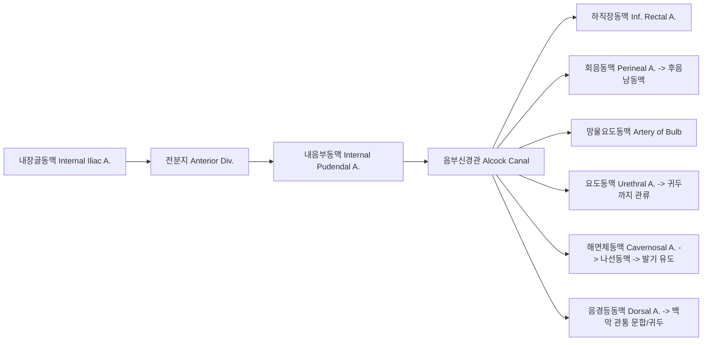
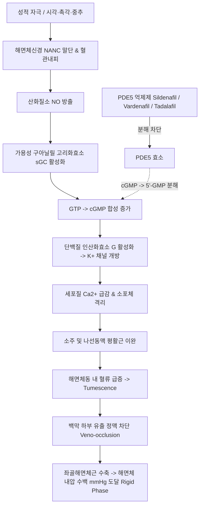

# 📑 [Netter Vol.1] Day 02: 음경 및 남성 회음부 해부·생리 및 비뇨기 질환 (Section 2 완독)

> 📖 **원서 출처**: [The Netter Collection of Medical Illustrations - Volume 1, Reproductive System.pdf (pp. 20-48)](https://drive.google.com/file/d/1x-xTgPfUfiK7dsQyp5L5qfjFYSD_XyGm/view?usp=drivesdk)
> 🏷️ **범위**: Section 2 전편 (Plate 2-1 ~ Plate 2-29, 총 29개 플레이트)
> 📌 **핵심 테마**: 골반·회음부 근막 3층 구조(Camper/Scarpa → Colles/Dartos → Buck), 내음부혈관·자율/체성신경망, 발기/사정 신경생리학(Point & Shoot), 요도하열/선천기형, 요유출(Urinary Extravasation) 역학, 성매개 질환(STD) 및 음경 악성종양

---

## 1. 개요 및 마스터 요약 (Executive Summary)

1. **회음부 및 음경 근막의 3층 연속성과 해부학적 구획**:
   - 복벽 표재 근막인 캠퍼 근막(Camper's fascia, 지방층)은 회음부에서 지방이 소실되고 평활근이 풍부한 **육양막(Dartos tunic)**으로 전환됩니다.
   - 막성 결합조직층인 **스카르파 근막(Scarpa's fascia)**은 아래로 이어져 음경·음낭·회음부에서 **콜리스 근막(Colles' fascia)** 및 **다토스 근막(Dartos fascia)**을 형성합니다.
   - 심부에는 발기조직을 감싸는 두껍고 치밀한 **벅 근막(Buck's fascia)**과 발기해면체 자체의 섬유성 피막인 **백막(Tunica albuginea)**이 층상 구조를 이룹니다. 이 근막면의 부착선 경계는 요도 파열 시 소변과 혈액의 파급 경로를 결정짓는 절대적 해부학적 이정표가 됩니다.
2. **이중 혈관망 및 림프 배액 이원화**:
   - 음경의 동맥 공급은 내장골동맥(Internal iliac a.) 전분지의 종말 분지인 **내음부동맥(Internal pudendal a.)**이 알콕관(Alcock's canal)을 통과한 뒤 분지하는 음경등동맥(Dorsal a.), 해면체동맥(Cavernosal a., 깊은음경동맥), 망울요도동맥(Bulb a.), 요도동맥(Urethral a.)에 의존합니다.
   - 림프 배액은 근막층에 따라 엄격히 분리됩니다. 음경 피부 및 포피는 **표재 서혜 림프절(Superficial inguinal nodes)**로 배액되는 반면, 음경 귀두·해면체·전부 요도는 벅 근막 하방을 따라 **심서혜(Deep inguinal / Cloquet's node) 및 외장골(External iliac) 림프절**로 직접 유입되어 악성종양 전이 경로가 판이하게 달라집니다. 고환은 발생학적 기원(L2)에 따라 **후복막 대동맥주위(Para-aortic) 림프절**로 직행합니다.
3. **발기 및 사정의 신경생리학 ("Point & Shoot")**:
   - **발기(Erection - Parasympathetic; "Point")**: 골반내장신경(Pelvic splanchnic nn. / Nervi erigentes, S2-S4) → 하하복신경총 → 해면체신경(Cavernous n.) → NANC 말단 및 내피세포에서 NO(산화질소) 분비 → cGMP 증가 → 세포 내 $Ca^{2+}$ 격리 및 평활근 이완 → 나선동맥 확장 및 해면체동 혈류 급증 → 백막 압박에 의한 정맥 폐쇄(Veno-occlusion).
   - **사정(Emission & Ejaculation - Sympathetic & Somatic; "Shoot")**: 흉요수 교감신경(T10-L2, Hypogastric n.)이 정관·정낭·전립선 평활근 수축(방출, Emission) 및 방광경부 폐쇄를 유도하고, 음부신경(Pudendal n., S2-S4)이 망울해면체근 및 좌골해면체근의 율동적 체성 수축(사출, Ejaculation)을 완료합니다.
4. **요유출(Urinary Extravasation)의 3대 임상 패턴**:
   - **벅 근막 내 파열 (Intact Buck's fascia)**: 소변과 혈액이 벅 근막 내부에만 갇혀 음경 체부에만 원통형 종창(Sleeve-like hematoma) 형성.
   - **벅 근막 파열 (Torn Buck's fascia, 전부 요도 파열)**: 콜리스 근막 하방(표재 회음극)으로 누출되어 음경, 음낭, 회음부 및 복벽 스카르파 근막 하부(쇄골 높이까지 상행 가능)로 확산되나, 대퇴부로는 근막 부착선(Fascia lata)에 막혀 퍼지지 못함 ("Butterfly pattern").
   - **비뇨생식격막 상방 파열 (후부 요도/막부 요도 파열)**: 전립선 주위 및 치골후강(Retropubic space of Retzius), 골반강 내로 요유출 발생 (직장수지검사 상 "High-riding prostate").

---

## 2. 골반 및 회음부의 근막 해부학 (Plates 2-1 ~ 2-5)

### Plate 2-1 | 골반 지지 구조 및 시상단면 (Pelvic Structures)

![[Netter_V1_Plate2-1.png]]

#### 1) 골반 지지 및 장기 배열
- **골반강 시상단면(Sagittal Orientation)**: 방광(Bladder), 전립선(Prostate), 요도(Urethra) 및 직장(Rectum)이 골반저(Pelvic floor) 상방에 치밀하게 배치됩니다. 모든 남성 비뇨생식기 장기는 복강외(Extraabdominal), 후복막강(Retroperitoneal space)에 위치하며 상면만 복막(Peritoneum)으로 덮입니다.
- **정관(Vas deferens) 주행**: 음낭에서 기원하여 치골상지를 넘은 뒤 방광 후면으로 하행하며, 양측에서 요관의 상방을 가로지릅니다 ("Water under the bridge").
- **방광 근육층의 입체 구조**: 방광 배뇨근(Detrusor m.)은 털실 뭉치("ball of yarn")처럼 섬유가 전 방향으로 교차 배열되어 배뇨 시 균일한 구심성 수축(Uniform concentric contraction)을 가능하게 합니다.
- **음경 지지 인대**:
  - **음경현수인대(Suspensory ligament of penis)**: 치골 결합 하부 전면에서 기원하여 음경 해면체 백막으로 이어지는 심부 고정 인대.
  - **음경제인대(Fundiform ligament of penis)**: 전복벽 복직근초 및 백선 하단에서 유래하여 음경 기저부를 루프 형태로 감싸는 표재성 탄성 섬유 인대.
- **치골후강(Retropubic space of Retzius / Prevesical space)**:
  - 전립선 및 방광의 전면과 치골 결합 및 복직근 후면 사이에 형성되는 잠재적 무혈관성 공간.
  - 내부에 성긴 결합조직, 지방, 신경, 림프관 및 방광정맥총(Vesical venous plexus)을 포함하며, 하방은 비뇨생식격막(Urogenital diaphragm)의 상면에 의해 경계 지어집니다.
- **데농빌리에 근막(Denonvilliers' fascia / 직장방광중격, Rectoprostatic fascia)**:
  - 전립선 첨부(Apex)에서부터 정낭(Seminal vesicles) 후면을 감싸며 상방의 직장방광와(Rectovesical pouch)까지 이어지는 치밀한 섬유막.
  - 전립선 및 정낭과 직장 전벽을 명확히 분리하여 전립선암의 후방 직장 침습을 차단하는 핵심 방어벽이자, 근치적 전립선적출술 시 직장 손상을 방지하는 필수 외과적 이정표(Surgical landmark).

---

### Plate 2-2 | 표재 근막층 (Superficial Fascial Layers)

![[Netter_V1_Plate2-2.png]]

#### 1) 전복벽에서 회음부로의 근막 연속성
- **캠퍼 근막(Camper's fascia)**: 피하지방을 포함하는 복벽 표재층으로, 회음부 및 음낭으로 내려오면서 지방 성분이 소실되고 평활근 섬유가 풍부한 **육양막(Dartos tunic / Dartos fascia)**으로 이행합니다 (dartos = "flayed").
- **스카르파 근막(Scarpa's fascia)과 콜리스 근막(Colles' fascia)**:
  - 스카르파 근막은 하복부의 탄성 섬유(Yellowy elastic fibers)로 구성된 막성 결합조직층입니다. 상복부에서는 일반 표재근막과 융합되어 경계가 모호하나 하복부에서는 뚜렷한 막을 형성합니다.
  - 하외측에서 서혜인대(Poupart's ligament) 및 대퇴근막(Fascia lata)에 단단히 부착됩니다.
  - 정중부에서는 외서혜륜(External inguinal ring) 상방을 지나 음경과 음낭을 거쳐 회음부로 연속되며, 회음부에서는 **콜리스 근막(Colles' fascia)**으로 명칭이 바뀝니다.
  - **콜리스 근막의 부착선**: 측방으로는 치골궁(Ischiopubic rami) 골막에 단단히 고정되고, 후방으로는 비뇨생식격막의 후하연 및 회음체(Perineal body)에 융합됩니다.
- **임상적 나비형 침윤(Butterfly pattern)**:
  - 콜리스 근막 하방(표재 회음극)에 체액(소변, 혈액, 염증성 삼출물)이 저류되면, 측방(대퇴근막 부착선)과 후방(회음체 부착선)이 차단되어 대퇴부나 항문삼각으로는 진행하지 못하고, 저항이 낮은 전복벽(스카르파 근막 하부)을 따라 상행하여 쇄골(Clavicles) 높이까지 퍼질 수 있으며 특징적인 **나비형 종창(Butterfly discoloration/swelling)**을 나타냅니다.
- **콜리스 근막 주엽(Major leaf)과 심엽(Deep layer)**:
  - 음낭 정중부에서 다토스 근막이 함입되어 **음낭중격(Scrotal septum)**을 형성합니다.
  - 콜리스 근막의 안쪽 연장선인 **주엽(Major leaf of Colles fascia)**은 음낭강 상부를 가로질러 지붕을 형성함으로써 표재 비뇨생식극과 음낭강을 분리합니다. 정상 상태에서는 망울부 요도 파열 시 소변이 이 주엽을 뚫지 못하면 음낭강 내로 직접 유입되지 않으나, 다수의 개인에서 가로 틈새 모양의 열공(Transverse slit-like openings)이 존재하여 음낭강으로 누출됩니다.
  - 상부 음낭 부근에서 콜리스 근막은 분지하여 **심엽(Deep layer of Colles fascia)**이 망울해면체근의 심부로 주행하며, 주엽(표재엽)과 심엽이 합쳐져 **망울해면체근 구획(Compartment for bulbospongiosus muscle)**을 완성합니다.

---

### Plate 2-3 | 심부 근막층 및 회음부 구획 (Deep Fascial Layers)

![[Netter_V1_Plate2-3.png]]

#### 1) 회음부 구획(Perineal Pouches)의 입체적 경계 및 구성
- **표재 회음극(Superficial perineal space / compartment)**:
  - 하부 경계: 콜리스 근막(Colles' fascia).
  - 상부 경계: 회음막(Perineal membrane / Inferior fascia of urogenital diaphragm).
  - 포함 구조물: 음경해면체각(Crura of penis), 요도해면체망울(Bulb of penis), 좌골해면체근(Ischiocavernosus), 망울해면체근(Bulbospongiosus), 천회음횡근(Superficial transverse perineal m.), 망울요도선(Cowper's gland) 도관, 회음신경 및 혈관.
- **심회음극(Deep perineal space / compartment)**:
  - 하부 경계: 회음막(Perineal membrane).
  - 상부 경계: 비뇨생식격막 상근막(Superior fascia of urogenital diaphragm).
  - 포함 구조물: 막부 요도(Membranous urethra), 외요도괄약근(Sphincter urethrae), 심회음횡근(Deep transverse perineal m.), **망울요도선 본체(Cowper's glands)**, 음경등신경(Dorsal n. of penis), 내음부동맥 분지.

#### 2) 벅 근막(Buck's fascia)의 주행과 구조
- 음경의 심부 근막으로 질기고 치밀한 백색 섬유초(Tubelike envelope) 형태를 취하며, 아래의 백막(Tunica albuginea)과 밀착되어 있습니다 (두 층 사이에는 정상적인 잠재 공간이 존재하지 않음).
- 말단은 관상구(Coronary sulcus)에서 시작하여 **해면체간중격(Intercavernous septum of Buck's fascia)**을 형성, 배측의 좌우 음경해면체와 복측의 요도해면체를 상하 구획으로 분리합니다.
- 기저부에서는 각 해면체각(Crus) 주위에서 백막과 융합되며 치골결합에 부착하는 심부 음경현수인대(Deep suspensory ligament)로 연속됩니다.
- 회음부에서 벅 근막은 요도해면체망울과 양측 해면체각을 각각 둘러싸며 3개의 구획을 형성하고, 치골, 좌골하지 및 비뇨생식격막에 견고히 고정됩니다.

#### 3) 구획별 근막 피복층 수 (Fascial Layer Counts)
- **요도망울 및 해면체부 요도 (총 4개 층)**:
  1. 콜리스 근막 표재엽 (Perineal layer of Colles external to bulbospongiosus)
  2. 콜리스 근막 심엽 (Deep extension of Colles beneath bulbospongiosus)
  3. 벅 근막 (Buck's fascia)
  4. 백막 (Tunica albuginea)
- **음경해면체각 (Crus of penis, 총 3개 층)**:
  1. 좌골해면체근 외측의 콜리스 표재근막 (Colles superficial fascia)
  2. 근육 심부에서 콜리스 심엽 반전부와 융합된 벅 근막 (Buck's fascia)
  3. 백막 (Tunica albuginea)

| 구획 (Pouch) | 하부 경계 (Inferior) | 상부 경계 (Superior) | 핵심 포함 내용물 |
| :--- | :--- | :--- | :--- |
| **표재 회음극 (Superficial)** | 콜리스 근막 (Colles) | 회음막 (Perineal membrane) | 음경각, 요도망울, 좌골·망울해면체근, 천회음횡근, 쿠퍼선 도관 |
| **심회음극 (Deep)** | 회음막 (Perineal membrane) | 비뇨생식격막 상근막 | 막부 요도, 외요도괄약근, 심회음횡근, 쿠퍼선(Cowper's gland) 본체 |

---

### Plate 2-4 | 음경 근막 및 내부 발기 구조 (Penile Fasciae and Structures)

![[Netter_V1_Plate2-4.png]]

#### 1) 음경의 층상 해부학 (표재에서 심부순)
1. **피부 (Skin)**: 매우 얇고 피하지방이 없으며 가동성이 뛰어남.
2. **다토스 근막 (Dartos / Superficial penile fascia)**: 성긴 결합조직과 평활근 세포로 구성. 표재 등정맥(Superficial dorsal vein)이 주행.
3. **벅 근막 (Buck's / Deep penile fascia)**: 치밀한 심부 섬유막. 등쪽 고랑(Dorsal groove)에서 중앙의 **단일 심등정맥(Deep dorsal v.)**과 양측의 **음경등동맥(Dorsal a.)**, 최외측의 **음경등신경(Dorsal n.)**으로 구성된 신경혈관속(Neurovascular bundle)을 감싸 보호.
4. **백막 (Tunica albuginea)**:
   - 외측 종주 섬유(Outer longitudinal layer)와 내측 환상 섬유(Inner circular layer)의 견고한 2층 콜라겐 구조.
   - 내측 환상 섬유는 정중선에서 해면체중격(Septum pectiniforme)을 형성합니다. 이 중격은 음경 원위부 1~2 cm 지점에서 불완전해져 빗살 모양의 틈새를 형성하므로, **양측 음경해면체는 혈류와 압력을 자유롭게 공유**합니다.
5. **발기 조직 (Erectile tissue)**:
   - **음경해면체(Corpora cavernosa, 2개)**: 원위부에서 끝이 뾰족한 형태로 끝나며, 실제 음경 말단보다 1~2 cm 근위부에서 종결됩니다.
   - **요도해면체(Corpus spongiosum, 1개)**: 내부에 해면체부 요도를 포함하며, 원위부에서 팽대되어 음경해면체의 원위 말단을 모자처럼 감싸는 **귀두(Glans penis)**를 형성합니다.

> 💡 **임상 응용 - 지속발기증(Priapism) 원위부 션트술의 해부학적 근거**:
> 허혈성 지속발기증 치료 시 귀두(Glans, 요도해면체 모자)를 통해 투침 또는 생검침을 자입하여 음경해면체 원위단 백막에 개구창을 만들어 해면체혈을 요도해면체로 우회시키는 **Winter shunt, Ebbehoj shunt, Al-Ghorab shunt**가 시행됩니다.

> 💡 **타이슨선 (Tyson's glands / Preputial glands)**: 귀두 관상구(Corona)와 경부(Neck) 내면 포피 사이에 분포하는 피지선(Sebaceous glands)으로, 탈락 상피세포와 함께 치구(Smegma)의 주성분을 분비합니다.

---

### Plate 2-5 | 비뇨생식격막 (Urogenital Diaphragm)

![[Netter_V1_Plate2-5.png]]

#### 1) 비뇨생식삼각의 심부 해부 및 괄약근
- **회음막(Perineal membrane, 비뇨생식격막 하근막)**:
  - 양측 치골궁 사이에 펼쳐진 두꺼운 삼각형 섬유판. 막부 요도, 쿠퍼선 도관, 해면체동맥, 음경등동맥·신경이 이를 관통합니다.
- **골반 횡인대(Transverse ligament of pelvis)**:
  - 회음막의 전연이 비뇨생식격막 상근막과 융합되어 형성된 비후부.
  - 치골궁인대(Arcuate pubic ligament)와 골반 횡인대 사이의 열공(Aperture)을 통해 **음경심등정맥(Deep dorsal v.)**이 골반강 내 산토리니 정맥총으로 진입합니다.
- **심회음횡근 및 외요도괄약근(Membranous urethral sphincter)**:
  - 회음막과 상근막 사이에 위치. 전방 섬유는 막부 요도를 도넛 형태로 둘러싸 외요도괄약근을 형성.
  - 근치적 전립선적출술(Radical prostatectomy) 시 이 괄약근 또는 음부신경 지배 분지가 손상되면 영구적 **요실금(Urinary incontinence)**이 초래됩니다.
- **표재 회음 근육군과 작용**:
  - **망울해면체근(Bulbospongiosus m.)**: 회음체 및 정중선 봉선(Median raphe)에서 기원하여 요도망울을 감싸고 전방 섬유는 해면체부 요도와 음경해면체를 둘러쌈. 배뇨 말기 요도 내 잔뇨 배출 및 사정 시 정액 사출, 발기 보조.
  - **좌골해면체근(Ischiocavernosus m.)**: 좌골결절 내면 및 치골궁에서 기원하여 해면체각에 정지. 해면체각을 압박하여 해면체 내압을 수백 mmHg까지 급상승시키는 강직 발기(Rigid phase) 유도.
  - **천회음횡근(Superficial transverse perineal m.)**: 좌골결절 내전방에서 기원하여 중심 회음체에 정지, 외항문괄약근과 융합.
  - 이들 모든 회음 근육은 **음부신경의 회음분지(Perineal branch of pudendal nerve)** 지배를 받습니다.
- **회음부의 지형학적 양대 삼각 (Topographic Triangles)**:
  - **비뇨생식삼각(Urogenital triangle, 전방)**: 치골결합(Apex) ~ 양측 좌골결절(Base).
  - **항문삼각(Anal triangle, 후방)**: 미골 선단(Coccyx tip, Apex) ~ 양측 좌골결절(Base).
  - 회음절개 전립선적출술(Radical perineal prostatectomy)은 항문삼각을 절개하여 전립선에 도달합니다.

---

## 3. 혈관 주행, 림프 순환 및 신경 분포 (Plates 2-6 ~ 2-11)

### Plate 2-6 | 골반 동맥 순환 (Blood Supply of Pelvis)

![[Netter_V1_Plate2-6.png]]

#### 1) 내장골동맥(Internal Iliac A.) 전분지의 주행
- 전분지 주요 분지: 폐쇄동맥(Obturator a.), 하둔동맥(Inferior gluteal a.), 제동맥(Umbilical a. → 개방부에서 상방광동맥 Superior vesical a. 분지), 중방광동맥(Middle vesical a.), 하방광동맥(Inferior vesical a.), 내음부동맥(Internal pudendal a.).
- **정관동맥(Deferential a.)**: 상방광동맥 또는 하방광동맥에서 기원하여 정관 주행.
- **내음부동맥의 골반 외 탈출 및 재진입**:
  - 대좌골공(Greater sciatic foramen) 하부를 통해 이상근(Piriformis) 하연에서 골반 탈출 → 좌골극(Ischial spine)과 천골결절인대 후면을 돌아 소좌골공(Lesser sciatic foramen)을 통해 좌골직장와(Ischiorectal fossa) 외측벽의 **음부신경관(Alcock's canal)**으로 진입.

#### 2) 전립선 동맥 공급과 신경-혈관 보존술 (Nerve-Sparing Surgery)
- **전립선 혈류 2대 군**:
  1. **내측/요도 동맥군 (Internal/urethral group)**: 전립선 실질의 1/3 및 정구까지의 요도 관류. 전립선-방광 경계부 피막을 관통하여 방광경부(Vesical neck) 요도 내강의 7~11시(좌측) 및 1~5시(우측) 방향으로 진입한 뒤 점막 하방을 따라 원위부로 주행.
  2. **외측/피막 동맥군 (External/capsular group)**: 전립선 실질의 2/3 관류. 전립선 후외측면(Posterolateral surface)을 따라 주행하며 전립선 피막을 뚫고 혈관망 형성. 첨부(Apex)에서 요도 및 정구 부위로 침투.
  - 전립선 후외측의 신경혈관속(Neurovascular bundle)은 발기를 관장하는 해면체신경(Cavernous nerve)과 주행을 공유하므로, 신경보존 근치적 전립선적출술 시 이 피막 동맥군의 정확한 박리가 필수적입니다.
- **산토리니 정맥총(Retropubic Plexus of Santorini)**: 치골 결합 하부와 방광·전립선 전면 사이에 발달된 치골전립선/방광전립선 정맥총으로, 음경심등정맥과 전립선 정맥들을 받아 내장골정맥으로 배액됩니다. 전립선 수술 시 대량 출혈의 주원인 부위입니다.

---

### Plate 2-7 | 회음부 혈류 공급 (Blood Supply of Perineum)

![[Netter_V1_Plate2-7.png]]

#### 1) 내음부동맥의 분지와 음경 관류 4대 동맥
알콕관을 통과한 내음부동맥은 다음 분지들을 냅니다:
1. **하직장동맥(Inferior rectal a.)**: 좌골직장와를 가로질러 항문관 및 외항문괄약근 관류.
2. **회음동맥(Perineal a.)**: 콜리스 근막 하방으로 진입, 가로회음동맥(Transverse perineal a.)을 분지하여 반대측과 문합하고, 치골궁 하방에서 후음낭동맥(Posterior scrotal aa.) 및 좌골·망울해면체근 관류.
3. **망울요도동맥(Artery of the bulb)**: 비뇨생식격막 하근막을 관통하여 요도망울 및 쿠퍼선(Cowper's gland) 관류.
4. **요도동맥(Urethral a.)**: 망울요도동맥 원위부에서 분지되어 요도해면체로 진입, 귀두까지 전장 주행.
5. **심음경동맥 / 해면체동맥(Deep a. of penis / Cavernosal a.)**: 비뇨생식격막을 뚫고 해면체각으로 비스듬히 진입하여 음경해면체 중심부를 종주. 다수의 나선동맥(Helicine aa.)을 분지하여 **발기 혈류를 직접 공급** (초음파 PSV 측정 표적 혈관).
6. **음경등동맥(Dorsal a. of penis)**: 골반 횡인대 직하부를 뚫고 나와 음경현수인대를 통과한 뒤, 벅 근막 하방 배측 고랑에서 단일 심등정맥 양측에 위치. 백막을 관통하는 분지를 내어 해면체동맥과 문합하고 귀두 및 포피에서 종결.

#### 2) 음경 정맥 배액 시스템의 2원화
- **표재 등정맥계 (Superficial dorsal veins)**: 다토스 근막 내 주행, 포피 및 피부 혈류를 모아 치골 상부에서 **표재외음부정맥(Superficial external pudendal v.)**을 거쳐 대퇴정맥(Femoral v.)으로 유입.
- **심등정맥계 (Deep dorsal vein)**: 귀두 관상구 후방 sulcus에서 시작, 벅 근막 하방 정중선을 주행하며 귀두와 요도해면체 및 음경해면체 정맥들을 배액. 음경 기저부에서 현수인대의 두 층 사이를 통과하고, 치골궁인대와 골반 횡인대 사이 열공을 지나 **전립선 정맥총(Santorini plexus)**으로 유입된 뒤 최종적으로 내장골정맥으로 배액.

> 🚲 **자전거 안장 압박 증후군 (Bicycle Saddle Neuropathy & ED)**:
> 자전거 안장에 앉을 때 남성 회음부에 가해지는 압력은 일반 의자에 앉을 때의 **7배**에 달합니다. 좌골결절 내측을 주행하는 내음부동맥-회음동맥 및 음부신경-음경등신경이 압박되어 회음부 감각 마비와 혈관성/신경인성 발기부전이 유발됩니다.

---

### Plate 2-8 | 고환 및 정삭의 혈류 (Blood Supply of Testis)

![[Netter_V1_Plate2-8.png]]

#### 1) 3중 동맥 공급 체계 (Triple Arterial Supply)
1. **고환동맥(Testicular a. / Internal spermatic a.)**:
   - 신동맥 직하부 복부대동맥(L2 높이)에서 직접 분지.
   - 내서혜륜 상방에서 정삭에 합류하여 덩굴정맥동과 함께 하행. 고환 진입 전 심하게 나선상 코일 형성.
   - **분지 변이**: 단일 고환동맥으로 진입하는 경우가 56%, 2개 분지가 31%, 3개 이상의 분지가 13%. (단일 동맥 환자에서 동맥 결찰 시 고환 위축 위험 극대화).
   - 고환 백막을 관통한 뒤 원심동맥(Centrifugal arteries)을 분지하여 정소세관 사이 중격을 주행하며 모세혈관망 형성.
2. **정관동맥(Deferential a.)**: 상방광 또는 하방광동맥에서 분지, 정관 및 부고환 미부 관류.
3. **고환올림근동맥(Cremasteric a. / External spermatic a.)**: 하복벽동맥(Inferior epigastric a.)에서 기원, 음낭벽 및 고환초막에 혈관망 형성.
- 고환 종격(Mediastinum testis) 부근에서 세 동맥 간 광범위한 문합이 존재하므로, 고위 정류고환 수술(Fowler-Stephens 술식) 시 고환동맥을 결찰해도 부수 순환으로 고환 생존이 가능합니다.

#### 2) 덩굴정맥동(Pampiniform Plexus)과 정계정맥류(Varicocele)
- 고환 종격에서 기원한 정맥들이 3개 군을 형성:
  1. **내정삭정맥군(Internal spermatic v. group)**: 고환동맥과 동행하여 대정맥/신정맥으로 주행.
  2. **정관정맥군(Deferential v. group)**: 정관을 따라 골반 내 정맥총으로 주행.
  3. **외정삭정맥군(Cremasteric v. group)**: 정삭 후면을 따라 하복벽정맥 및 외음부정맥으로 주행.
  - 서혜관 내에서 60%는 단일 정맥간으로 합류.
- **대향류 열교환(Countercurrent Heat Exchange)**: 동맥혈 체온(37℃)을 음낭 내 적정 온도(34~35℃, 정상 정자 형성에 필수)로 냉각.
- **정계정맥류의 해부학적 편중 (95% 좌측 호발)**:
  - 우측 내정삭정맥은 하대정맥(IVC)으로 비스듬히 비스듬한 각도로 유입되나, **좌측 내정삭정맥은 좌측 신정맥(Left renal v.)으로 90도 직각**으로 합류하며 판막이 불완전하여 정수압이 높고 복압 증가 시 역류 저항이 낮음.
- **정계정맥류 절제술(Varicocelectomy)**:
  - 정관정맥(Deferential v.)을 제외한 모든 역류 정맥을 결찰.
  - 후복막 접근법(Palomo 술식/복강경)은 원위부 측부 정맥 가지들을 완벽히 결찰하지 못해 서혜부/서혜하부 접근법보다 재발률이 높음.
  - 서혜하부(Subinguinal) 미세수술은 혈관 분지가 많고 동맥 손상 위험이 있어 현미경 하(Microscopic)에서 안전하게 수행됨.

---

### Plate 2-9 | 골반 및 생식기 림프 배액 (Lymphatic Drainage of Pelvis and Genitalia)

![[Netter_V1_Plate2-9.png]]

#### 1) 해부학적 구조물별 림프 배액 경로
- **음경 피부, 포피 및 음낭 피부**:
  - 서혜인대(Poupart's lig.) 하방, 대복재정맥 상방 피하지방층 내의 **표재 서혜 림프절 (Superficial inguinal lymph nodes)**로 배액.
  - 일부는 복재-대퇴정맥 접합부 하방의 서혜하부(Subinguinal) 및 대퇴관 내 최고 심서혜 림프절인 **클로케 림프절(Cloquet's / Rosenmüller's node)**로 유입.
- **음경 귀두(Glans), 요도해면체 및 음경해면체**:
  - 소대(Frenulum) 부근에서 모여 관상구를 돌아 벅 근막 하방 심등정맥을 따라 주행.
  - 서혜관 및 대퇴관을 거쳐 림프절을 경유하지 않고 직접 **외장골 림프절(External iliac nodes)**로 직행하거나, 치골결합 전방의 **치골전 림프절(Presymphyseal node)** 또는 심서혜 림프절로 유입.
- **전부(해면체부) 요도**: 귀두 림프관과 동행하거나 복직근을 직접 관통하여 외장골 림프절로 진입.
- **후부(망울 및 막부) 요도**: 내음부혈관을 따라 **내장골(Internal iliac / Hypogastric) 및 폐쇄 림프절(Obturator nodes)**로 배액.
- **전립선 및 전립선부 요도**: 외장골 림프절, 하방광혈관을 따른 내장골(폐쇄) 림프절, 직장 측면을 거치는 천골전(Presacral) 및 외측 천골(Lateral sacral) 림프절로 다원 배액. (림프 곽청술은 치료 목적이 아닌 병기 판정의 진단 목적).
- **고환(Testis)**:
  - 림프관이 고환혈관을 따라 서혜관을 거쳐 후복막강으로 직행. 요관 교차부에서 내측으로 급격히 꺾여 신동맥 높이에서 종결.
  - **우측 고환**: 대정맥주위 림프절(Paracaval nodes - 전대정맥 Precaval, 후대정맥 Postcaval, 외측대정맥 Lateral caval, 대동맥대정맥간 Interaortocaval).
  - **좌측 고환**: 대동맥주위 림프절(Para-aortic nodes - 전대동맥 Preaortic, 외측대동맥 Lateral aortic, 후대동맥 Postaortic).
  - *임상 감별*: 고환암 환자에서 외장골 림프절 전이가 관찰되면 고환 자체보다 **부고환(Epididymis) 또는 정관 침습**을 시사함 (부고환 림프관은 외장골 림프절로 배액).

---

### Plate 2-10 | 생식기 신경 지배 I - 자율신경계 (Innervation of Genitalia I)

![[Netter_V1_Plate2-10.png]]

#### 1) 골반 자율신경총과 기능
- **교감신경 (Sympathetic, T10-L2)**:
  - 흉요수 분절 → 복강신경절, 상·하장간막신경절, 요부내장신경(Lumbar splanchnic nn.) → 대동맥분지부 하방 정중선의 **상하복신경총(Superior hypogastric plexus / Presacral nerve)** 형성 → 좌우 하복신경(Hypogastric nn.) → **하하복(골반)신경총(Inferior hypogastric / Pelvic plexus)**.
  - 작용: 방광경부 및 내요도괄약근 수축(역행성 사정 방지), 정관·정낭·전립선 평활근 수축 유도 (**사정 방출, Emission**). 평상시 나선동맥 수축(Flaccid 상태 유지).
  - *손상 시*: 후복막 림프절 곽청술(RPLND)이나 교감신경 절제 시 평활근 마비로 인해 **역행성 사정(Retrograde ejaculation)** 또는 완전 사정불능증(Anejaculation) 초래.
- **부교감신경 (Parasympathetic, S2-S4)**:
  - 천수 전근(Ventral rami) → **골반내장신경(Pelvic splanchnic nn. / Nervi erigentes)** → 하하복신경총.
  - 작용: 방광 배뇨근 수축, 내괄약근 이완.
  - **해면체신경(Cavernous nerve)**: 전립선 피막 후외측을 밀착 주행하여 비뇨생식격막을 관통, 음경해면체로 진입하여 나선동맥 확장 및 해면체 평활근 이완을 지배 (**발기, Erection 유도**).

#### 2) 자율신경 자극의 비뇨생식기 효과 비교표
| 장기 (Organ) | 교감신경 자극 (Sympathetic) | 부교감신경 자극 (Parasympathetic) |
| :--- | :--- | :--- |
| **방광 배뇨근 (Detrusor)** | 이완 (일반적) | **수축 (배뇨 유발)** |
| **방광 삼각부 및 내괄약근** | **수축 (요폐쇄, 역행성 사정 방지)** | 이완 |
| **요관 운동성/긴장도** | 증가 (일반적) | 증가 (?) |
| **남성 생식기** | **사정 방출 (Emission / Ejaculation)** | **발기 (Erection)** |

#### 3) 요천추 신경총 유래 체성신경 (T12-L3)
- **장골하복신경(Iliohypogastric n., L1) & 장골서혜신경(Ilioinguinal n., L1)**: 하복벽 근육 운동 및 치골상부·외생식기 피부 감각.
- **음부대퇴신경(Genitofemoral n., L1-L2)**:
  - 대퇴지(Femoral branch): 대퇴 전상방 피부 감각.
  - 음부지(Genital branch / External spermatic n.): 고환올림근(Cremaster m.) 및 음낭 육양막 지배. **고환올림근 반사(Cremasteric reflex)**의 원심로 담당 (고환 염전 시 소실).

---

### Plate 2-11 | 생식기 신경 지배 II - 체성신경계 (Innervation of Genitalia II and of Perineum)

![[Netter_V1_Plate2-11.png]]

#### 1) 음부신경(Pudendal Nerve, S2-S4)의 주행 및 분지
- 천골신경총에서 기원하여 이상근 하방으로 대좌골공을 빠져나온 후, 좌골극(Ischial spine) 후방을 돌아 소좌골공을 거쳐 좌골직장와 외측벽의 **알콕관(Alcock's canal)**으로 진입.
- **주요 3대 분지**:
  1. **하직장신경(Inferior rectal n. / Inferior hemorrhoidal n.)**: 외항문괄약근 수축 및 항문 주위 감각.
  2. **회음신경(Perineal n.)**: 표재/심회음극 근육(좌골해면체근, 망울해면체근, 외요도괄약근) 운동 및 후음낭신경(Posterior scrotal nn.)을 통한 음낭 후부 감각.
  3. **음경등신경(Dorsal nerve of penis)**: 벅 근막 하방 배측을 주행하며 **음경 체부 피부 및 귀두(Glans) 감각**의 주 경로 (발기 반사의 구심로).

#### 2) 음낭 감각 신경의 다원성과 국소마취의 난점
- **전벽**: 장골서혜신경(Anterior scrotal n.) + 음부대퇴신경 음부지(External spermatic n.).
- **후벽**: 음부신경의 회음신경 분지(Posterior scrotal n.) + 후대퇴피신경(Posterior femoral cutaneous n.)의 회음분지.
- **육양막 평활근**: 하복신경총 유래 자율신경 섬유가 혈관을 따라 분포.
- *임상 의의*: 신경 분포가 다원화되어 있어 정삭(Spermatic cord) 마취와 달리 **음낭 피부 전체는 국소 침윤 마취만으로 완벽한 무통을 유도하기가 극히 어렵습니다**.

#### 3) 정삭 및 고환의 3중 신경 지배 (Triple Spermatic Nerves)
1. **상정삭신경(Superior spermatic n.)**: 제10흉수(T10) 분절 기원, 신신경총 및 전대동맥신경총을 거쳐 내정삭동맥을 타고 고환 실질 내부까지 침투.
2. **중정삭신경(Middle spermatic n.)**: 상하복신경총 기원, 내서혜륜에서 정관에 합류하여 정관 및 부고환 관류.
3. **하정삭신경(Inferior spermatic n.)**: 하하복신경총 기원, 골반 내 정관을 따라 주행하여 정관 및 부고환 분포.

#### 4) 망울해면체근 반사 (Bulbocavernosus / Bulbospongiosus Reflex)
- **반사궁**: 귀두를 쥐어짜거나 요도 카테터를 당길 때(구심로: 음경등신경 → 음부신경 S2-S4) 외항문괄약근이 반사적으로 수축(원심로: 하직장신경 S2-S4).
- **임상적 평가 가치**:
  - 척수 손상 환자에서 **척수 쇼크(Spinal shock)의 지속 여부를 판단하는 절대적 지표**.
  - 반사 소실은 척수 쇼크가 진행 중이거나 마미(Cauda equina)/천수 반사궁 자체의 손상을 의미하며, **반사의 회복은 척수 쇼크의 종결을 알리는 임상적 징후**입니다.

#### 5) 연관통 (Referred Pain) 기전
- 고환 실질 통증은 T10 분절로 투사되어 **내서혜륜 상방의 하복부 통증**으로 인지됩니다 (상정삭신경 경로).
- 음낭 피부 통증은 음부대퇴신경을 통해 국소 인지됩니다.
- 신장 결석(Renal calculi) 산통 시 고환으로 통증이 방사되는 이유: 신장/신우와 고환이 복부대동맥 주위(T10) 복강/신신경총 자율신경망을 공유하며, 상부 요관을 지나는 결석이 인접한 음부대퇴신경을 직접 자극하기 때문입니다.

---

## 4. 요도 구조 및 발기 생리학 (Plates 2-12 ~ 2-13)

### Plate 2-12 | 남성 요도의 4대 구획 (Urethra and Penis)

![[Netter_V1_Plate2-12.png]]

#### 1) 남성 요도의 해부학적 구획 및 상피 조직학 (총 18~20 cm)
1. **전립선부 요도 (Prostatic urethra, ~3-4 cm)**:
   - 방광경부에서 비뇨생식격막까지 주행.
   - **조직학**: **이행상피 (Transitional epithelium / Urothelium)**.
   - 후벽에 요도릉(Urethral crest)과 융기된 **정구(Verumontanum / Colliculus seminalis)** 위치. 정구 중앙에 전립선소낭(Prostatic utricle, 뮐러관의 융합 잔유물로 '남성 자궁'에 해당) 개구. 양외측에 좌우 사정관(Ejaculatory ducts) 개구. 주변 고랑에 전립선 선포 도관 개구.
2. **막부 요도 (Membranous urethra, ~1-2 cm)**:
   - 비뇨생식격막을 관통하며 외요도괄약근에 둘러싸임.
   - **조직학**: **중층원주상피 (Stratified columnar epithelium)** (일부 이행상피 혼재).
   - 요도 전장 중 가장 고정되어 있고 신축성이 없어 의원성 카테터 조작 시 천공 손상 호발.
3. **망울부 요도 (Bulbar urethra, ~4-5 cm)**:
   - 회음부 요도해면체망울 내부에 위치.
   - **조직학**: **위중층원주상피 및 중층원주상피 (Pseudostratified & Stratified columnar)**.
   - 바닥(Floor)에 비뇨생식격막 내 쿠퍼선(Cowper's gland)으로부터 1인치(2.5 cm) 길이의 도관이 개구. 회음부 낙상 손상(Straddle injury) 시 호발 파열 부위.
4. **음경부/해면체부 요도 (Pendulous / Penile urethra, ~15 cm)**:
   - 요도해면체(Corpus spongiosum) 중심부를 주행.
   - **조직학**: **위중층원주상피 (Pseudostratified columnar)** → 원위부 주상와(Navicular fossa)에서 **중층편평상피 (Stratified squamous epithelium)**로 전환.
   - **리트레선(Glands of Littré)**: 점액 분비 관상선으로 바닥보다 지붕(Roof) 쪽에 훨씬 다수 분포. 점막 함입부인 **모르가니 소와(Lacunae of Morgagni)**로 개구하며, 임균성 요도염 후 만성 감염 잔류 및 지속적 분비물의 온상이 됨.
- 점막하 고유층(Lamina propria): 풍부한 정맥동과 민무늬근 섬유속을 함유하는 성긴 결합조직.

---

### Plate 2-13 | 발기 생리 및 발기부전 (Erection and Erectile Dysfunction)

![[Netter_V1_Plate2-13.png]]

#### 1) 발기의 세포 매개 신호전달 기전 (NO-cGMP & cAMP Pathways)
1. **신경 자극 및 NO 방출**: 성적 자극 → 비아드레날린성 비콜린성(NANC) 해면체신경 말단 및 혈관내피세포에서 **산화질소(Nitric Oxide, NO)** 분비.
2. **sGC 활성화 및 cGMP 합성**: 평활근 세포 내 가용성 구아닐릴 고리화효소(Soluble Guanylyl Cyclase, sGC) 자극 → GTP를 **cGMP**로 전환.
3. **세포 내 $Ca^{2+}$ 강하 및 이완**: cGMP 의존성 단백질 인산화효소(PKG) 활성화 → $K^+$ 채널 개방 및 과분극 → 소포체 내 칼슘 격리 및 세포외 배출 유도 → **세포질 내 유리 $Ca^{2+}$ 급감** → 해면체 및 나선동맥 평활근 이완.
4. **부수적 cAMP 경로**: Prostaglandin E1 (PGE1) 및 VIP(Vasoactive Intestinal Polypeptide)가 G-단백 수용체를 통해 아데닐릴 고리화효소(Adenylyl cyclase)를 활성화 → cAMP 증가 → PKA 경로를 통해 칼슘을 강하시켜 이완 보조.
5. **교감신경 매개 수축 기전**: 우울증, 불안, 스트레스 시 $\alpha_1$-아드레날린성 작용제 활성이 증가하여 세포 내 칼슘을 증가시키고 평활근을 수축시켜 발기를 억제함.

#### 2) 발기의 3대 혈역학적 단계 (Hemodynamic Phases)
1. **동맥 확장기 (Arterial Inflow)**: 해면체동맥 및 나선동맥 평활근 이완으로 음경 혈류량이 평상시의 수배로 급증.
2. **해면체 팽창 및 정맥 폐쇄 (Tumescence & Veno-occlusion)**: 해면체동(Lacunar spaces)이 혈류로 가득 차 팽창하면서, 백막 바로 밑을 주행하는 유출 소정맥(Subtunic venules)들을 단단한 백막과 팽창된 소주 평활근 사이에서 물리적으로 압박 → 정맥 유출의 거의 완전한 차단.
3. **강직 발기기 (Rigid phase)**: 성교 및 사정 시 망울해면체근 반사가 유발되어 좌골해면체근이 해면체각을 강력히 압박 → **해면체 내압이 수백 mmHg(수축기 혈압 초과)까지 급상승**하며 일시적으로 유입과 유출이 모두 중단되는 완전 강직 달성.
4. **소멸기 (Detumescence)**: 성적 자극 종료 또는 사정 시 교감신경 방전에 의해 평활근 수축, **Phosphodiesterase type 5 (PDE5)** 효소가 cGMP를 5'-GMP로 가수분해하여 종료.

#### 3) 발기부전(ED)의 원인 분류 및 임상 평가
- **심인성 (Psychogenic)**: 수행 불안(Performance anxiety), 관계 갈등, 우울증, 조현병 등.
- **기질성 (Organic)**:
  - **혈관성 (Vascular - 가장 흔함)**: 고혈압, 이상지질혈증, 당뇨병, 죽상경화증.
    > ⚠️ **혈관성 ED의 심혈관 경고 신호**: 음경 동맥경화성 협착으로 인한 **심각한 발기부전은 심근경색이나 뇌졸중보다 5~7년 앞서 선행 발현**합니다.
  - **신경인성 (Neurogenic)**: 척수 손상, 다발성 경화증, 파킨슨병, 뇌졸중, 전립선적출술 후 해면체신경 손상.
  - **내분비성 (Hormonal)**: 안드로겐 결핍(야간 발기 및 성욕 저하), 고프로락틴혈증(Prolactin이 GnRH 분비를 억제하여 저생식샘자극호르몬 저생식샘증 유발).
- **노화에 따른 생리적 변화**: 자극 후 발기까지의 잠복기 연장, 강직도 감소, 사정력 약화, 사정액 감소, 사정 후 불응기(Refractory period) 연장.
- **필수 검사실 평가**: 요검사, CBC, 공복혈당(FBS), 지질 프로필(Lipid profile), 혈청 총 테스토스테론(Serum total testosterone).

---

## 5. 선천성 비뇨기 기형 및 폐색 질환 (Plates 2-14 ~ 2-16)

### Plate 2-14 | 요도하열 및 요도상열 (Hypospadias and Epispadias)

![[Netter_V1_Plate2-14.png]]

#### 1) 요도하열 (Hypospadias)
- **역학 및 병인**: 남아 생식기 기형 중 잠복고환(Cryptorchidism)에 이어 2번째로 흔함 (출생 남아 125~4,000명당 1명꼴, 최근 보조생식술 확대 및 내분비계 교란물질로 증가 추세). 배아 8~12주경 음경복측 요도주름(Genital folds)의 전방 융합 부전으로 발생.
- **해부학적 3대 징후**:
  1. **이소성 요도구(Ectopic meatus)**: 복측 정상 위치보다 근위부에 개구.
  2. **음경 만곡(Chordee)**: 복측 요도해면체 형성 부전 및 섬유화 띠로 인해 음경이 아래로 활처럼 휨.
  3. **후두부 포피(Dorsal hooded prepuce)**: 복측 포피 결손 및 배측 포피의 과도한 덮임.
- **위치별 3단계 분류**:
  - **1도 (Glanular / First-degree, ~50%)**: 귀두 하부 또는 관상하(Subcoronal) 개구.
  - **2도 (Penile / Second-degree)**: 음경 체부 복측 개구.
  - **3도 (Penoscrotal / Perineal / Third-degree)**: 음낭-음경 접합부 또는 회음부 개구 (이분음낭 Bifid scrotum 및 잠복고환 흔히 동반).
- **수술 원칙**: 포피는 향후 요도 재건 피판으로 사용해야 하므로 **신생아 포경수술은 절대 금기**입니다. 수술 전 안드로겐 투여로 음경 크기를 키우기도 하며, 생후 6~18개월 사이에 척삭 절제 및 요도 성형술을 시행합니다.

#### 2) 요도상열 (Epispadias)
- **개념 및 발생**: 배아 5주경 생식결절 원기(Genital tubercle primordia)가 배설강막(Cloacal membrane)으로 비정상 이동하여 발생. 방광외번증(Exstrophy of bladder)과 흔히 동반되며 단독 발생은 남아 12만 명당 1명으로 희귀.
- **해부학적 소견**:
  - 요도구가 음경 배측(Dorsum)에 개구하며 음경이 위로 치골을 향해 휘어짐 (Dorsal chordee).
  - 요도 바닥이 배측 고랑 형태로 점막에 노출되어 요도주위선 개구부가 관찰됨.
  - 포피는 복측에만 앞치마(Apron)처럼 늘어짐.
  - 치골결합이 벌어지거나 섬유성 띠로만 연결되며, 막부·전립선부 요도가 넓게 벌어져 있고 **외요도괄약근 발육 부전으로 대부분 심한 요실금**을 동반함.

---

### Plate 2-15 | 선천성 판막 및 낭종 (Congenital Valve Formation and Cyst)

![[Netter_V1_Plate2-15.png]]

#### 1) 후부요도판막 (Posterior Urethral Valves, PUV)
- **병태생리**: 정구(Verumontanum)에서 시작하여 전립선부 요도 외측벽으로 뻗어나가는 얇은 점막 주름(주로 Type I). 소변이 순행할 때 돛단배의 돛("wind sail")처럼 부풀어 올라 요류를 심각하게 기계적으로 차단.
- **임상 양상**: 배뇨 곤란, 야뇨증(Enuresis), 난치성 농뇨, 반복성 요로감염, 비가역적 신부전. 태아기 양수과소증에 의한 **폐 저형성증(Potter sequence)** 유발.
- **진단 및 치료**: 방광경 검사 시 역행성 관찰로는 늘어진 판막(Floppy sail)이 보이지 않아 놓치기 쉬우므로, **배뇨성 방광요도조영술(VCUG)**이 확진 표준입니다. 경요도 판막 절제술(Transurethral valve ablation/fulguration)로 폐색 해소.

#### 2) 비뇨생식기 선천성 낭종
- **정구 및 내생식기 낭종**:
  - **뮐러관 낭종(Müllerian duct cyst)**: 정구 중앙(정중선)에 위치하며 뮐러관의 흔적. 오렌지 크기 또는 거대 복부 종괴로 자라 전립선 후방과 직장 전벽 사이를 점유.
  - **볼프관/사정관 낭종(Wolffian / Ejaculatory duct cyst)**: 사정관 주행을 따라 정중선 외측(Lateral)에 편재.
  - *증상*: 사정관 폐색(EDO), 무정자증, 사정액량 격감, 혈정액증(Hematospermia), 성교통(통증성 극치감, Dyspareunia), 배뇨통, 직장 팽만감.
  - *경직장초음파(TRUS) 진단 기준*: **정낭 폭 > 1.5 cm 또는 사정관 직경 > 2.3 mm**. 경요도 낭종 개창술(Unroofing)로 완치.
- **기타 희귀 기형**:
  - **정중봉선 낭종(Median raphe cyst)**: 소대에서 음낭까지 정중선을 따라 발생하는 무통성, 가동성의 팽팽한 원형 피하 낭종.
  - **선천 요도 게실(Congenital diverticulum)**: 비뇨생식격막에서 귀두 사이의 복측 요도에 발생.
  - **선천 요도구 협착(Congenital meatal stenosis)**: 배뇨통, 요도구 궤양, 방광염 유발, 요도구절개술(Meatotomy) 시행.
  - **요도 무형성증/폐쇄(Atresia)**: 요막관(Urachus)을 통해 배꼽으로 소변 배출 또는 직장루 동반.
  - **선천 요도직장루(Urethrorectal fistula)**: 막부 요도와 직장 사이 누공, 쇄항(Imperforate anus)과 동반.

---

### Plate 2-16 | 요도 게실 및 정구 이상 (Urethral Anomalies, Verumontanum Disorders)

![[Netter_V1_Plate2-16.png]]

#### 1) 요도 게실 (Urethral Diverticula)
- **진성(True) vs 가성(False / Pseudodiverticula)**:
  - **진성**: 선천성이 대부분이며 요도 상피 점막이 게실 벽까지 연속됨. 주로 전부 요도 복측에 위치.
  - **가성**: 요도 상피 결손 부위로 형성된 낭으로 염증, 결석, 외상, 장기 유치도뇨관(Foley)으로 인한 무통성 요도주위 농양(척수손상 환자 호발)에 의해 발생. 배농 후 상피화되면 진성과 감별이 어려움.
- **임상 특징**: 배뇨 곤란(Stranguria), 반복성 요로감염, 배뇨 시 회음부·음낭·음경 복측에 낭성 종괴가 부풀어 오르고 배뇨 후 짜내면 요점적(Post-void dribbling) 발생. 수술적 완전 절제 및 요도 성형술.

#### 2) 중복 요도 (Duplicated / Accessory Urethra)
- **Effman 분류 체계**:
  - **Type I (불완전형)**: 3~10 mm 깊이의 맹관(Blind-ending pouch)으로 끝남.
  - **Type II (완전형)**: 실제 방광/요로와 연결됨.
- 가장 흔한 형태는 **Y-형 중복(Y-type)**으로, 정상 음경 요도구 외에 회음부에 비정상 요도구가 동반됨. 분비물 저류로 만성 농양 형성 시 절제 또는 조대술(Marsupialization) 필요.

#### 3) 정구 질환 (Disorders of Verumontanum)
- **생리적 기능**: 사정 시 정액의 순행성 사출 방향을 유도.
- **선천성 정구 비대(Congenital hypertrophy)**: 모체 에스트로겐 자극 추정. 소아에서 후부 요도를 폐색하여 배뇨 곤란, 빈뇨, 범람요실금(야뇨증으로 오진되기 쉬움) 및 신기능 장애 유발. 경요도 절제(TUR)로 치료.
- **정구염(Verumontanitis)**: 만성 전립선염, 요도염, 정낭염의 파급. 요도경 상 극심한 울혈, 부종, 만성화 시 과립상(Granular) 및 소낭포(Cystic) 병변 관찰. 사정통, 혈정액증, 골반·회음부·요통 유발.

---

## 6. 혈관·기계적 질환 및 외상·요유출 (Plates 2-17 ~ 2-20)

### Plate 2-17 | 포경, 감돈포경 및 음경 교착 (Phimosis, Paraphimosis, Strangulation)

![[Netter_V1_Plate2-17.png]]

#### 1) 포경 (Phimosis)
- 영유아기 생리적 유착이 박리되지 않아 포피구가 핀홀(Pinhole)처럼 좁아진 상태. 배뇨 시 포피강 풍선 현상(Ballooning) 발생.
- 분해된 치구(Smegma), 소변, 탈락 세포 저류로 인한 만성 궤양성 염증, 포피 결석(Calculi), 백반증(Leukoplakia) 및 **음경 편평세포암 발생 위험 대폭 증가**.
- *위생과 암 예방*: 포경수술을 받지 않았더라도 **위생 상태가 완벽한 남성은 음경암 발생률이 포경수술 환자와 차이가 없습니다**. 성인기 포경수술은 이미 진행된 발암 기전을 되돌리지 못하므로 음경암 예방 효과가 없으나, 이성애 남성의 HIV 감염 위험을 약 60% 감소시킵니다.

#### 2) 감돈포경 (Paraphimosis - 응급 질환)
- 좁아진 포피를 무리하게 제낀 후 환원하지 않아 관상구에 **협착륜(Constricting ring)** 형성.
- 정맥 및 림프 배액 차단 → 포피 및 귀두 극심한 부종 → 동맥 혈류 차단 → 봉와직염, 정맥염, 단독(Erysipelas), 포피·귀두 괴사(Gangrene) 진행.
- *처치*: 지속적 수기 압박(Manual reduction)으로 부종 완화 후 정복 시도, 실패 시 즉각적인 **배측 절개술(Dorsal slit)** 시행 후 부종 소퇴 시 완전 포경수술.

#### 3) 음경 교착 (Strangulation)
- 병, 금속 링, 파이프 등에 음경을 삽입하여 발생. 부종이 심해지면 교착물이 파묻혀 보이지 않음.
- 정맥 혈전증 및 괴사 방지를 위해 마취 하 수기 감압 또는 지글리 톱(Gigli saw), 보석세공용 톱(Jeweler's saw)으로 금속 링을 절단 제거.

---

### Plate 2-18 | 페이로니병, 지속발기증, 혈전증 (Peyronie Disease, Priapism, Thrombosis)

![[Netter_V1_Plate2-18.png]]

#### 1) 페이로니병 (Peyronie's Disease / Induratio Penis Plastica)
- **역학 및 특징**: 50~60대 호발, 손바닥 섬유종증인 **뒤퓌트랑 구축(Dupuytren contracture)**과 흔히 동반.
- **병인**: 성교 중 음경 꺾임(Buckling) 등 미세 외상으로 백막 섬유층 전단 손상 → 미세 출혈 → 염증 매개체 제거 장애로 지속적 **TGF-$\beta$ 및 피브린(Fibrin) 분비** → 만성 섬유화 플라크(Plaque) 형성 (칼슘 침착으로 골화되기도 함).
- **임상 양상**: 발기 시 통증(초기 징후), 병변 쪽으로 음경 휨 (배측 굴곡이 가장 흔함), "모래시계형 결손(Hourglass defect)", 환자의 약 50%에서 발기부전 동반. (15%는 자연 소퇴).
- **치료**: 항산화제, 스트레칭 기구, 플라크 절제 및 이식(Grafting), 네스빗 음경주름성형술(Nesbit plication), 음경보형물 삽입술.

#### 2) 지속발기증 (Priapism - 4시간 이상 지속되는 발기) 감별 및 치료
| 구분 | 허혈성 / 저유량 (Ischemic / Low-flow) | 비허혈성 / 고유량 (Non-ischemic / High-flow) |
| :--- | :--- | :--- |
| **기전** | **정맥 폐색, 해면체 구획증후군 (혈류 없음)** | 회음부 둔상 후 해면체동맥 파열 (동-해면체 누공) |
| **원인** | 특발성, 해면체주사제(PGE1, 파파베린), 트라조돈, 코카인, 겸상구혈빈혈 | 회음부 및 골반 둔상 |
| **증상** | **극심한 통증, 돌처럼 단단한 강직** (귀두는 무름) | 경미한 통증, 불완전 강직 (탄력적) |
| **가스분석 ($pO_2, pH$)** | **저산소증, 산증, 고이산화탄소증** ($pO_2 < 30$, $pH < 7.25$) | 정상 동맥혈 소견 ($pO_2 > 90$, $pH \approx 7.4$) |
| **응급도 및 예후** | **비뇨의학과적 절대 응급** (48시간 방치 시 섬유화로 영구 ED) | 비응급 (대부분 자연 치유 가능) |
| **치료 지침** | 해면체 천자 흡인, **페닐에프린(Phenylephrine) 주입**, 수술적 션트 | 보존적 관찰, 선택적 동맥 색전술 |

---

### Plate 2-19 | 음경 및 요도 외상 (Trauma to Penis and Urethra)

![[Netter_V1_Plate2-19.png]]

#### 1) 음경 골절 (Penile Fracture)
- 발기 상태에서 성관계 중 과도한 외력(꺾임)으로 인해 **팽창된 백막(Tunica albuginea) 및 벅 근막이 파열**되는 응급 손상.
- '뚝' 소리(Cracking sound), 급격한 발기 소멸, 심한 통증 및 가지 모양 변형("Eggplant deformity").
- **10~20%에서 요도 손상이 동반**되므로 즉각적인 수술적 탐색 및 백막 봉합술을 시행해야 해면체 섬유화와 발기부전을 예방할 수 있습니다.

#### 2) 요도 외상 3대 기전 및 대처 원칙
1. **외부 둔상/관통상**:
   - **가랑이 낙상 손상(Straddle injury)**: 단단한 물체에 가랑이를 부딪힐 때 고정된 **망울부 요도(Bulbar urethra)**가 치골 결합 하연에 짓눌려 압궤 파열.
   - **골반 골절(Pelvic fracture)**: 비뇨생식격막 부위에서 **막부 요도(Membranous urethra)**가 전단(Shearing) 파열되거나 골편이 해면체를 관통.
2. **내인성/의원성 손상**: 요도 카테터 금속 탐침(Stylet)이나 요도 확장기 삽입 시 요도해면체 후벽에 가통로(False passage) 형성.
3. **폐색성 자발 파열**: 중증 요도 협착 근위부에서 배뇨 시 높은 내압으로 인해 자발 천공.
- **황금률(Golden Rule)**: 외요도구 출혈(Blood at meatus)과 요폐가 관찰되면 **절대로 요도 카테터(Foley) 삽입을 시도하지 말고, 즉시 역행성 요도조영술(RGU)을 시행**하여 파열 여부를 확인해야 합니다.
- **요도 오한(Urethral chill)**: 감염된 소변과 세균이 손상된 요도해면체 정맥동을 통해 혈류로 급격히 유입되어 발생하는 균혈증 및 고열 증상.
- **푸르니에 괴저(Fournier gangrene)**: 손상 부위로 누출된 요와 세균(호기성+혐기성 복합균)이 콜리스 근막면을 따라 파급되어 발생하는 치명적 전격성 괴사성 근막염.

---

### Plate 2-20 | 요유출 (Urinary Extravasation)

![[Netter_V1_Plate2-20.png]]

#### 1) 근막 경계에 따른 요유출 확산 역학
1. **벅 근막 유지 전부 요도 파열 (Intact Buck's fascia)**:
   - 혈액과 요가 벅 근막 내부에만 제한됨.
   - **해면체간중격이 온전하면 복측 음경 종창**에 국한되며, 중격이 관통되면 음경 체부 전체의 대칭형 원통형 종창(Sleeve-like swelling) 형성.
2. **벅 근막 파열 동반 전부 요도 파열 (망울부 요도 천공)**:
   - 벅 근막을 뚫고 나온 소변이 **콜리스 근막 하방(표재 회음극)**으로 유출.
   - 콜리스 근막 주엽을 뚫고 **음낭 육양막(Dartos) 하부**로 하행 → 음경 다토스 근막 하부로 전진 → 치골 상부에서 **복벽 스카르파 근막 하부**로 진입하여 복벽을 타고 쇄골 높이까지 상행 확산 (**나비형 종창, Butterfly pattern**).
   - *차단선*: 후방은 회음체 및 비뇨생식격막 후연 부착선에 차단되고, 양측은 서혜인대 직하부의 대퇴근막(Fascia lata) 부착선에 견고히 부착되어 **대퇴부(Thigh)나 항문삼각으로는 내려가지 못함**.
   - *골반/복벽 골절 파열 시 주의*: 방광의 복막외 파열로 인한 소변은 서혜관(Inguinal canal)을 통해 내려와 음낭의 외정삭근막 및 내정삭근막 하부(다토스 근막보다 심부)에 저류됩니다.
3. **비뇨생식격막 상방 후부(막부) 요도 파열**:
   - 골반 골절 동반. 치골후강(Space of Retzius) 및 골반 복막외 강 내로 광범위 요유출.
   - 치골상부 팽만 및 둔탁음, 직장수지검사 상 전립선이 위로 밀려 올라가는 **"부유 전립선 (High-riding prostate)"** 관찰.

---

## 7. 감염성 질환 및 성매개 감염병 (Plates 2-21 ~ 2-26)

### Plate 2-21 | 귀두염 및 귀두포피염 (Balanitis / Balanoposthitis)

![[Netter_V1_Plate2-21.png]]

#### 1) 병태 및 원인 질환 스펙트럼
- **용어 정의**: 귀두 염증은 귀두염(Balanitis), 포피 염증은 포피염(Posthitis)이며, 임상적으로 대개 병발하여 **귀두포피염(Balanoposthitis)**으로 나타남. 만성화 시 상피 비후 및 백반증(Leukoplakia) 형성.
- **원인별 특징**:
  - **단순 귀두염**: 포경 환자의 치구·소변 저류, 불량한 위생, 기저귀 피부염, 성인 요실금 환자 호발.
  - **칸디다성 귀두염 (*Candida albicans*)**: **당뇨병 환자**의 대표적 초기 징후. 홍반성 소구진, 위막(Pseudomembrane), 표재성 박리, 극심한 소양감.
  - **접촉성 피부염**: 콘돔 라텍스, 살정제, 윤활제 알레르기.
  - **환상 귀두염 (Balanitis circinata)**: **라이터 증후군 (Reiter syndrome: 요도염, 관절염, 결막염)** 환자의 특징적 피부 병변.
  - **폐색성 건성 귀두염 (Balanitis Xerotica Obliterans, BXO)**: 경화성 태선(Lichen sclerosus)의 음경 발현. 포피와 외요도구가 백색 도자기처럼 탈색되고 경화되어 심각한 요도구 협착 초래 (요도구성형술 필요).
  - **생식기 헤르페스 (HSV-2)**: 홍반 위에 투명한 바이러스 액을 함유한 군집성 소수포(Vesicles) 형성 후 파열되어 동통성 천재성 궤양 형성. 잠복 감염 후 재발.
  - **혐기성 귀두포피염 (*Bacteroides*)**: 포경 상태에서 악취 나는 농성 분비물, 심한 부종, 양측 서혜 림프절염 유발.
  - **괴저성 귀두염 (Gangrenous balanitis)**: 24시간 내에 포피와 귀두 전체가 흑색 괴사 조직으로 탈락하는 전격성 파괴 질환.

---

### Plate 2-22 | 요도염 (Urethritis)

![[Netter_V1_Plate2-22.png]]

#### 1) 임균성 vs 비임균성 요도염 비교
- 비임균성 요도염(전 세계 연간 8,900만 건)이 임균성 요도염(연간 6,200만 건)보다 발생 빈도가 높습니다.

| 특성 | 임균성 요도염 (Gonococcal, GU) | 비임균성 요도염 (Non-gonococcal, NGU) |
| :--- | :--- | :--- |
| **원인 병원체** | *Neisseria gonorrhoeae* | *Chlamydia trachomatis* (가장 흔함), *Mycoplasma genitalium*, *Ureaplasma*, HSV-2 |
| **잠복기** | **짧음 (3~5일)** | **김 (1~3주)** |
| **분비물 성상** | **대량의 농성(황록색) 분비물**, 극심한 배뇨통 | **소량의 장액성/유백색 분비물**, 가려움증 |
| **도말/검사** | 백혈구 내 **그람음성 쌍구균 (GNDC)** | 다핵백혈구 다수, 균체 불염 (Multiplex PCR 확진) |
| **주요 합병증** | 요도해면체염(통증성 발기), 전립선농양, 부고환염, **요도 협착**, 불임 | 라이터 증후군 (Reiter syndrome), 만성 전립선염 |
| **표준 치료** | Ceftriaxone 근주 | Doxycycline 경구 (또는 Azithromycin) |

> 🔬 **질편모충 요도염 (*Trichomonas vaginalis*)**: 미국에서만 연간 800만 건 발생하는 기생충 감염으로, 아침에 묽은 우유빛(Milky white) 분비물이 보이며 도말 검사 상 활발히 회전 운동하는 편모충(Flagellates)이 관찰됩니다 (Metronidazole 치료).

---

### Plate 2-23 | 매독 (Syphilis)

![[Netter_V1_Plate2-23.png]]

#### 1) "위대한 모방자 (The Great Imitator)" 매독의 병기별 특징 (*Treponema pallidum*)
- **1기 매독 (Primary Syphilis)**:
  - 잠복기: 6~90일 (평균 21일).
  - 균 접종 부위에 단일의 **무통성 경성하감(Hard chancre)** 발생. 초기 구진에서 미란성 궤양으로 발전.
  - 기저부는 깨끗하고 촉촉한 선홍색이며 삼출액이 맑음. **가장자리가 융기되거나 찢어지지 않고 단단하게 만져지는 경결(Induration)**이 특징 (혈관염 및 림프구 침윤).
  - 궤양이 진피를 파괴하지 않는 표재성 미란이므로 치료 없이도 3~6주 내에 **흉터 없이 자연 치유**.
  - 양측성 무통성 서혜 림프절 비대 동반.
  - *비전형적 발현*: 포경 환자 포피의 고무양 경화, 소대 미란, 요도구 부종(요도염으로 오진).
- **2기 매독 (Secondary Syphilis)**:
  - 감염 수주~수개월 후 전신 피부 점막 발진. 특히 **손바닥과 발바닥에 나타나는 인설성 구진(Copper-red rash)**, 편평콘딜롬(Condyloma lata - 전염력 극대화된 납작 사마귀), 점막반(Mucous patches), 충식성 탈모(Moth-eaten alopecia).
- **3기/후기 매독 (Tertiary / Latent Syphilis)**:
  - 초기 감염 10~20년 후 발현. 고무종(Gumma - 골 및 피부 파괴), 심혈관 매독(상행대동맥류, 대동맥판막 폐쇄부전), 신경매독(척수로 Tabes dorsalis, 아가일-로버트슨 동공 Argyll Robertson pupil, 전신마비 General paresis, 족하수 Foot drop).
- **진단 기법**:
  - 궤양 삼출액의 **암시야 현미경 검사(Dark-field microscopy)**로 나선균 직접 확인 (확진).
  - 혈청 검사: 비트레포네마 선별 검사(RPR, VDRL) 및 트레포네마 확진 검사(FTA-ABS, TP-PA).

---

### Plate 2-24 | 연성하감 및 성병성 림프육아종 (Chancroid & LGV)

![[Netter_V1_Plate2-24.png]]

#### 1) 연성하감 (Chancroid - "Soft Chancre")
- **원인균**: *Haemophilus ducreyi* (Ducrey, 1889년 발견, 그람음성 구균성 간균). 세포 치사성 독소(Cyto-lethal toxin)를 분비하여 세포 분열을 억제하고 조직 괴사 유도.
- **임상 양상**:
  - 잠복기 5~7일.
  - **매우 극심한 통증을 동반하는 무른 궤양(Soft chancre)**. 불규칙하고 깎아지른 듯한 잠식성 경계(Undermined edges)와 지저분한 화농성 괴사 바닥(Dirty floor).
  - 편측/양측성 **유통성 화농성 횡현(Buboes)** 형성 → 터져서 누공과 흉터 형성, 만성 림프 폐색으로 음경·음낭 상피병(Elephantiasis) 초래 가능.
- **진단**: 그람 염색 시 백혈구 주위에 **"물고기 떼(Schools of fish)"**, **"철로(Railroad tracks)"**, 또는 지문 모양 배열 관찰. rRNA/GroEL 유전자 표적 PCR.

#### 2) 성병성 림프육아종 (Lymphogranuloma Venereum, LGV)
- **원인균**: 침습성 *Chlamydia trachomatis* L1, L2, L3 혈청형.
- **임상 3단계**:
  - 1기: 접종 3~12일 후 무통성의 자가 치유되는 일과성 생식기 소수포/구진 (흔히 간과됨).
  - 2기 (10~30일 후): 서혜인대(Poupart's lig.) 상하의 림프절이 부어올라 인대를 사이에 두고 홈이 패이는 **"그린블랫의 고랑 징후 (Groove sign of Greenblatt)"** 형성. 유통성 횡현 및 만성 농양 형성.
  - 3기: 광범위한 림프관 섬유화 폐색, 만성 림프부종, 생식기 상피병(Esthiomene), 직장 협착.
- **진단**: 혈청 보체결합반응(CF > 1:64), 미세면역형광법(MIF), Chlamydia PCR. (과거 Frei 피부반응검사는 1974년 폐지).

---

### Plate 2-25 | 서혜부 육아종 (Granuloma Inguinale / Donovanosis)

![[Netter_V1_Plate2-25.png]]

#### 1) 도노반증 (Donovanosis)의 임상 병리
- **원인균**: *Klebsiella granulomatis* (과거 *Calymmatobacterium granulomatis*).
- **임상 특징**:
  - 잠복기 10~40일. 작은 구진에서 시작하여 서서히 기어가는 듯한 뱀 모양(Serpiginous)의 **무통성 선홍색 육아조직("Beefy-red" granulation tissue) 궤양** 형성.
  - 변연부 상피 증식이 왕성하며 접촉 시 쉽게 출혈.
  - **진성 림프절염이나 전신 증상이 없음** (피하 육아종으로 인한 가성 횡현 Pseudobubo 발생 가능).
  - 치료하지 않으면 주변 피부를 파괴하는 절단성(Mutilating) 변형 초래, 편평세포암종과 육안 감별 곤란.
- **병리 조직 진단**:
  - 일반 배양 배지에서는 자라지 않음.
  - 궤양 변연부 찰과 도말 표본의 Wright 또는 Giemsa 염색 시 거대 단핵 대식세포 내에서 안전핀 모양(Safety-pin appearance)으로 짙게 염색되는 **도노반 소체(Donovan bodies)** 관찰 (확진).
- **치료**: 항생제를 **최소 12주간 투여**해야 함. 상피화된 피부 아래에 도노반 소체가 잠복하여 **약 10%에서 수개월 후 재발**하므로 철저한 추적 관찰 필수.

---

### Plate 2-26 | 요도 협착 (Strictures)

![[Netter_V1_Plate2-26.png]]

#### 1) 발생 원인 및 호발 부위
- **감염성**: 임균성 요도염, 클라미디아 후유증으로 발생. 장기간에 걸친 염증성 협착으로 **50%는 망울부 요도, 30%는 음경부 요도**에 발생.
- **외상성**: 회음부 가랑이 낙상 손상(Straddle injury) 시 망울부 요도에 발생하며, 단단하고 짧은 협착과 심한 주변 섬유화 유발.
- **의원성**: 내시경 수술(TURP, 경요도 방광 절제술), 장기 유치도뇨관, 요도 소식자 조작에 의한 손상.

#### 2) 병리 및 중증 합병증
- **해면체 섬유화 (Spongiofibrosis)**: 손상 상피가 탈락하고 요도해면체 혈관동이 무혈관성 반흔 조직으로 치환됨. 방광경 상 점막이 stark white(창백한 백색)로 관찰됨.
  - 음경부 협착은 주로 **요도 바닥(Floor)**에 발생.
  - 망울부 협착은 주로 **요도 지붕(Roof)**에 발생하며 단단한 종괴로 만져짐.
- **"물뿌리개 회음부" (Watering-pot perineum)**:
  - 협착 근위부의 지속적인 고압력으로 요도 벽이 자발 파열되어 요도주위 농양 형성 → 회음부, 음낭, 둔부, 서혜부로 다발성 누공(Urethrocutaneous fistulae)이 뚫려 배뇨 시 사방으로 소변이 분출되는 비뇨기과적 응급 질환.
- 상부 요로계 수신증 및 비가역적 신부전 초래.

#### 3) 진단 및 단계별 수술 지침
- **진단**: 앙와위 사위 촬영을 포함한 **역행성 요도조영술 (RGU) 및 배뇨성 방광요도조영술 (VCUG)**로 협착의 정확한 위치와 길이 판정. 고주파 음경/회음부 초음파(Sonourethrography)로 해면체 섬유화 깊이 평가.
- **치료 원칙**:
  - 단순 반복 확장술은 반흔 조직을 찢어 추가 섬유화를 유발하므로 대개 일시적 완화에 불과.
  - 짧고 단순한 협착: **직시하 내요도절개술 (DVIU / Optical urethrotomy)**로 80% 초기 성공.
  - 재발성 및 복잡 협착: **요도성형술 (Urethroplasty)**. 짧은 협착은 섬유화 전 절제 후 단단단 문합(End-to-end anastomosis, EPA); 긴 협착은 음경/포피 피부 피판 또는 **구강 점막(Buccal mucosa) 온레이 이식술(Onlay graft)** 시행.

---

## 8. 전암 병변 및 비뇨생식기 종양 (Plates 2-27 ~ 2-29)

### Plate 2-27 | 생식기 사마귀, 전암 병변, 조기암 (Warts, Precancerous Lesions, Early Cancer)

![[Netter_V1_Plate2-27.png]]

#### 1) 양성 및 바이러스성 병변
- **첨규콘딜롬 (Condyloma acuminata / Venereal warts)**:
  - 원인: HPV 6, 11형 (양성 사마귀의 90% 원인). (참고: HPV 16, 18형은 악성 암의 70% 원인).
  - 유두상(꽃양배추 모양, Cauliflower-like)으로 관상구 및 포피강에 호발.
  - 치료: 포도필로톡신(Podophyllotoxin), 이미퀴모드(Imiquimod), 트리클로로아세트산(TCA), 레이저 절제, 액화질소 냉동요법.
- **부쉬케-뢰벤슈타인 종양 (Buschke-Löwenstein tumor)**: 거대 첨규콘딜롬(Giant condyloma). 조직학적으로는 양성이지만 국소 침습성과 파괴성이 극심하여 편평세포암종과 육안 감별이 불가능하며 악성 변화 가능성이 높아 광범위 외과 절제 필요.
- **보웬양 구진증 (Bowenoid papulosis)**: 고위험군인 **HPV 16, 18형**에 기원. 다발성의 편평하고 흑갈색을 띠는 구진으로, 조직학적으로는 상피내암(CIS) 소견을 나타냄.
- **기타 양성 병변 감별**: 포다이스 반점(Fordyce spots - 1~3 mm 크기의 음경 체부 정상 이소성 피지선), 혈관각화종(Angiokeratoma - 자색 구진성 모세혈관확장증).

#### 2) 전암 병변 및 상피내암 (Carcinoma in Situ, CIS)
- **백반증 (Leukoplakia)**: 만성 염증으로 인한 각질비후, 진피 부종, 림프구 침윤으로 푸르스름한 백색 판 형성. 조기 편평세포암 및 사마귀양 암종 동반율이 높아 완전 절제 필수.
- **보웬병 (Bowen's disease)**: 각화된 **음경 체부 피부**에 발생하는 상피내암. 경계가 뚜렷한 홍반성 비늘(Scaly) 판.
- **퀘이라 홍색비후증 (Erythroplasia of Queyrat)**: 점막 부위인 **귀두 및 내포피**에 발생하는 상피내암. 부드럽고 벨벳 같은(Velvety) 붉은 반판. (완전 절제 필요).
- **조기 편평세포암 (Early SCC)**: 비포경 남성의 관상구 및 소대 부근에서 단단한 결절로 시작, 중심 궤양 형성. 진단 당시 **환자의 85%에서 서혜 림프절 비대**가 관찰되며, 비대 림프절 환자의 50% 이상에서 실제 암 전이가 확인됨.

---

### Plate 2-28 | 진행성 음경암 (Advanced Carcinoma of the Penis)

![[Netter_V1_Plate2-28.png]]

#### 1) 병리 및 침윤 역학
- **조직형**: 음경 악성종양의 95% 이상이 **편평세포암 (Squamous Cell Carcinoma, SCC)**.
- **병리 소견**: 편평상피 진주(Keratin pearls), 중심 괴사, 각화. 외향성 유두상(Exophytic papillary) 또는 내향성 궤양형(Ulcerative).
- **위험 인자**: 포경(Uncircumcised state + Phimosis), 위생 불량(치구 만성 자극), **HPV 16형 감염 (음경암의 50% 차지)**, 60세 이상, 흡연.
- **근막 장벽과 전이 경로**:
  - 표재성으로 횡적 증식하다가 **벅 근막(Buck's fascia)**과 **백막(Tunica albuginea)**이 일차적인 기계적 방어벽으로 작용하여 해면체 침윤을 일시적으로 지연시킴.
  - 백막 관통 시 혈관 및 림프계를 통한 전신 전이 급증. (드물게 심등정맥을 통해 척추 축성 골격으로 혈행성 전이).
  - 거의 모든 전이가 림프관을 통해 진행: 음경 체부 림프망의 양측 소통으로 인해 편측 종양이라도 **양측 서혜 림프절 전이**가 빈발함.
  - 진행된 서혜 림프절 종괴는 피부를 뚫고 궤양을 형성하며, 인접한 **대퇴동맥 및 대퇴정맥을 침식하여 치명적인 대출혈**을 유발할 수 있음.

#### 2) 병기별 수술 치료 지침 및 예후
- **원발 종양 수술**:
  - 포피 국한 (<2 cm): 포경수술만으로 완치 가능.
  - 귀두 표재성 병변 (<1.5 cm): Mohs 미세도식수술 또는 레이저 절제 (국소 재발률은 다소 높음).
  - 침습성 원발암: **음경 부분 절제술 (Partial penectomy)** 시행. 절제단 음성 확보를 위해 종양 경계로부터 **반드시 2 cm 안전연(Surgical margin)** 확보 필수.
  - 광범위 침윤 시: **음경 전절제술 (Total penectomy) 및 회음요도루 조성술 (Perineal urethrostomy)**.
- **서혜 및 골반 림프절 곽청술 (Lymphadenectomy)**:
  - 림프절이 만져지지 않는 환자(cN0)에서도 **20~25%에서 잠복 미세전이(Occult metastases)** 존재.
  - 표준 근치적 서혜 림프절 절제술은 80~90%에 달하는 높은 합병증(림프류 Lymphocele, 피부 피판 괴사, 만성 하지 림프부종, 심부정맥혈전증/폐색전증)을 수반하므로, **감시 림프절 생검술(Sentinel Lymph Node Biopsy, SLNB)** 또는 축소 표재 서혜 림프절 절제술이 널리 적용됨.
  - **골반 림프절 절제술(Pelvic lymphadenectomy) 적응증**: 서혜 림프절 조직검사에서 **2개 이상의 림프절 전이**가 확인되거나 림프절 피막외 침습(Extracapsular extension)이 있을 때 시행.
- **예후**: 림프절 전이를 치료하지 않은 환자는 2년 내 대부분 사망. 서혜 림프절 전이가 증명된 환자의 수술 후 5년 생존율은 **20~50%**.

---

### Plate 2-29 | 요도 유두종 및 요도암 (Papilloma, Cancer of Urethra)

![[Netter_V1_Plate2-29.png]]

#### 1) 양성 요도 종양
- **요도 유두종 (Urethral Papilloma / Intraurethral Condyloma)**:
  - 외생식기 콘딜롬 환자의 15%에서 동반. **90%가 원위부 요도(외요도구, 주상와)**에 호발.
  - 혈뇨, 요도구 돌출 종괴, 배뇨통. 절제 및 전기소작, CO2 레이저 소작, 5% 5-Fluorouracil (5-FU) 크림 주입으로 재발 방지.
- **선천성 요도 용종 (Congenital Urethral Polyp)**:
  - 소아 남아 호발. 정구(Verumontanum)에서 기원하는 섬유혈관성 줄기(Fibrovascular stalk)를 가진 양성 요로상피 종양 (뮐러관 지속 잔유물 추정). 방광경하 단순 전기 소작으로 완치.

#### 2) 원발성 요도암 (Primary Urethral Carcinoma)
- **역학**: 매우 드물지만 치명적인 악성종양. **모든 비뇨기암 중 유일하게 여성에서 남성보다 호발**함.
- **조직학적 분류**:
  - **편평세포암 (SCC, 78%)**: 전부 요도(해면체부) 및 망울부 요도에 호발.
  - **요로상피암 (Transitional cell carcinoma, 15%)**: 후부(전립선부) 요도에 호발.
  - **선암 (Adenocarcinoma, 드묾)**: 리트레선(Littré) 또는 쿠퍼선(Cowper)에서 유래.
- **진단 지연의 문제**: 초기 증상이 요도염, 요도 협착(환자의 50%가 협착 병력 보유)과 유사하여 **증상 발현 후 확진까지 평균 3년이 지연**됨. 환자의 40%에서 음경 체부에 단단한 종괴가 촉지되고 25%에서 요폐 동반.
- **외과적 치료 4단계**:
  1. **보존적 국소 절제 / 내시경 절제**: 표재성 비침습 암.
  2. **음경 부분 절제술**: 원위부 요도암.
  3. **음경 전절제술 (Radical penectomy)**: 침습성 전부 요도암.
  4. **전골반장기적출술 (Anterior pelvic exenteration)**: 근위부/망울막부 침습암 대상. 음경 전절제 + 방광전립선절제 + 치골 전면 절제(Anterior pubic bone resection) + 골반 림프절 곽청 + 요로 전환술(Urinary diversion)의 광범위 일괄 절제.
- **5년 생존율**: 원위부 요도암은 약 **60%**, 근위부(구부/막부/전립선부) 요도암은 **50% 미만**.

<!-- 보관 태그(1회용·링크오류, 필요시 복원): 음경, 근막해부학, 요도질환, 음경암 -->
