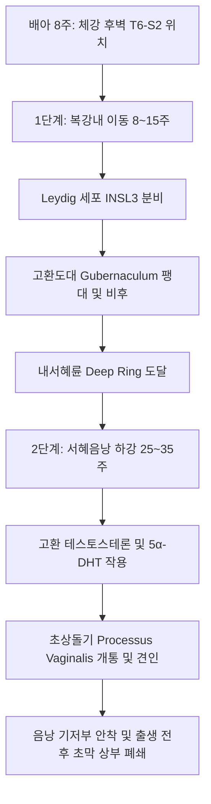

# 📑 [Netter Vol.1] Day 03: 음낭 및 고환의 해부·발생·기능부전 및 종양학 (Section 3 완독)

> 📖 **원서 출처**: [The Netter Collection of Medical Illustrations - Volume 1, Reproductive System.pdf (pp. 50-74)](https://drive.google.com/file/d/1x-xTgPfUfiK7dsQyp5L5qfjFYSD_XyGm/view?usp=drivesdk)  
> 🏷️ **범위**: Section 3 전편 (Plate 3-1 ~ Plate 3-25, 총 25개 플레이트)  
> 📌 **핵심 테마**: 음낭벽 6개 동심원 층상구조 및 하정삭신경, 고환의 3중 혈류 공급 및 덩굴정맥동 대향류 열·호르몬 교환, 고환 하강 2단계 기전(INSL3/Androgen), 정자발생 64일 주기와 심박당 정자생성 역학, 성선저하증(Hyper vs Hypogonadotropic) 축 감별 및 안드로겐 치료, 급성 음낭증(고환 염전 골든타임 및 청색 반점 징후), 고환 생식세포종양(GCNIS, Seminoma vs Non-seminoma) 분자병리 및 병기

---

## 1. 개요 및 마스터 요약 (Executive Summary)

1. **음낭벽 6개 층과 복벽의 해부학적 상동성 및 자율신경 조절**:
   - 고환이 후복막에서 음낭으로 하강하면서 복벽 구조물을 견인하여 6개의 동심원 피막을 형성합니다:
     - 피부(Skin) $\rightarrow$ 다토스 근막(Dartos, Scarpa/Colles 연속) $\rightarrow$ 외정삭근막(External spermatic, 외복사근건막) $\rightarrow$ 고환올림근막/근(Cremasteric, 내복사근) $\rightarrow$ 내정삭근막(Internal spermatic, 복횡근막) $\rightarrow$ 고환초막(Tunica vaginalis, 복막).
   - 정삭 내 정관을 따라 주행하는 **하정삭신경(Inferior spermatic nerve)**은 골반신경총(Pelvic plexus) 유래 교감/부교감 신경을 함유하며 고환의 테스토스테론 분비를 조절하는 주 신경입니다.
   - 태생기 관 구조 잔존물로 **고환부속기(Appendix testis, 뮐러관 상동체)**와 **부고환부속기(Appendix epididymis, 중신관 상동체)**가 존재합니다.
2. **고환의 3중 동맥혈류와 덩굴정맥동 대향류 열·테스토스테론 교환**:
   - 고환은 대동맥 L2에서 직접 분지하는 **고환동맥(Testicular a.)**, 상/하방광동맥 유래의 **정관동맥(Deferential a.)**, 하복벽동맥 유래의 **고환올림근동맥(Cremasteric a.)**의 3중 혈류망을 갖추며, 백막을 뚫고 들어가 **원심성 동맥(Centrifugal aa.)**으로 정세관 소엽을 관류합니다.
   - **덩굴정맥동(Pampiniform plexus)**은 3개 정맥군(전방 내정삭정맥, 중간 정관정맥, 후방 외정삭정맥)으로 구성되며, 고환동맥을 둘러싸 **대향류 열교환(Countercurrent heat exchange, 2~3℃ 강온)**뿐 아니라 **테스토스테론의 농도차에 따른 수동 확산(정맥 $\rightarrow$ 동맥)**을 매개하여 고환 내 고농도 안드로겐 환경을 유지합니다.
   - 좌측 고환정맥은 좌측 신정맥에 직각(90°)으로 판막 없이 유입되어 정수압이 높아 **정계정맥류(Varicocele)**의 90%가 좌측에 호발합니다. 우측 단독 발생이나 30세 이후 급발 시 후복막 종양(신세포암 등) 감별이 필수적입니다.
3. **고환 하강의 2단계 기전과 잠복고환**:
   - **1단계(복강내 이동, 임신 8~15주)**: Leydig 세포의 **INSL3** 호르몬 자극으로 고환도대(Gubernaculum)가 팽대 및 견인되어 내서혜륜까지 이동.
   - **2단계(서혜음낭 하강, 임신 25~35주)**: **안드로겐(Testosterone/DHT)** 의존적으로 서혜관을 통과하여 음낭 바닥에 안착.
   - 잠복고환은 거의 100%에서 선천성 간접 서혜탈낭을 동반하며, 방치 시 복강내 고환은 20명 중 1명(5%), 서혜부 고환은 80명 중 1명(1.25%)에서 악성화되므로 **생후 6~12개월(늦어도 1세 이전)**에 **고환고정술(Orchiopexy)**을 시행해야 합니다.
4. **성선저하증(Hypogonadism)의 축 감별 및 안드로겐 생식 치료**:
   - **원발성(고성선자극호르몬성, Hypergonadotropic)**: 고환 실질 부전 $\rightarrow$ T 저하, LH/FSH 보상성 급증 (예: 클라인펠터 증후군 47,XXY, 고환염 후유증, 세관경화증).
   - **이차성(저성선자극호르몬성, Hypogonadotropic)**: 시상하부-뇌하수체 부전 $\rightarrow$ T 저하, LH/FSH 동반 저하 (예: 칼만 증후군 KAL1 결손 + 후각상실, 뇌하수체 종양, 스테로이드 오남용).
   - **치료 역학**: 외인성 테스토스테론 투여는 음성 피드백으로 LH/FSH를 억제하여 무정자증을 유발하므로, 생식력을 보존해야 하는 남성(동화작용 스테로이드 남용 운동선수 등)에게는 **hCG + 주사형 FSH 병용 요법**을 적용해야 합니다.
5. **급성 음낭증(Acute Scrotum) 응급 감별**:
   - **고환 염전(Testicular Torsion)**: 종추 기형(Bell-clapper deformity), 720도 염전, Prehn 징후 음성, 고환올림근 반사 소실. **골든타임 6~8시간** 내 수술적 정복 및 **양측 고환고정술** 필수.
   - **부속기 염전(Torsion of Appendices)**: 소아 호발, 피부를 통해 비쳐 보이는 **청색 반점 징후(Blue dot sign)**.
   - **급성 부고환-고환염**: 35세 미만 클라미디아/임균, 35세 이상 요로감염균(대장균). 항생제 불응 시 결핵(AFB) 의심.
6. **고환 생식세포종양(GCT)의 분자병리와 표준 원칙**:
   - **전암 병변**: **상피내 생식세포종양(GCNIS / CIS)**은 소아형 난황낭/기형종 및 정모세포성 정상피종을 제외한 모든 GCT의 전구 병변이며, **PLAP(태반성 알칼리인산분해효소)** 양성입니다. 국소 저용량 방사선(14~16 Gy)으로 Leydig 세포 기능 보존 하에 완치가 가능합니다.
   - **정상피종(Seminoma, 40~50%)**: 방사선/시스플라틴에 극도로 민감, AFP 항상 정상, 10%에서 β-hCG 경미 상승, i(12p) 연관.
   - **배아암종(Embryonal ca, 20%)**: 출혈/괴사, OCT-4(+), CD30(+), Keratin(+), i(12p), 조기 전이.
   - **난황낭종양(Yolk sac tumor)**: 소아 호발, 실러-듀발 소체(Schiller-Duval body), **AFP 100% 현저 상승**.
   - **융모암종(Choriocarcinoma, <2%)**: 합포체/세포영양막, 혈행성 조기 전이, **β-hCG 폭증($> 10^5$)**.
   - **수술 원칙**: 경음낭 생검/절개는 림프 배액로(서혜 림프절) 오염을 초래하므로 절대 금기이며, 반드시 서혜부 절개를 통한 **근치적 서혜부 고환절제술(Radical Inguinal Orchiectomy)**을 시행합니다.

---

## 2. 음낭 및 고환의 해부학, 혈관망 및 미세구조 (Plates 3-1 ~ 3-4)

### Plate 3-1 | 음낭벽의 층상 해부학 (Scrotal Wall)

![[Netter_V1_Plate3-1.png]]

#### 1) 복벽 유래 6대 음낭 피막층과 해부학적 상동성
고환이 후복막강(L2 높이)에서 음낭 바닥으로 하강하면서 복벽의 층들을 차례로 견인하여 형성된 6층 동심원 구조입니다:
1. **피부 (Skin)**: 얇고 신축성이 뛰어나며 멜라닌 색소 침착이 짙고 주름진 형태. 피지선(Sebaceous follicles)과 한선(Sweat glands)이 풍부하게 발달. 정중앙에 내부 음낭중격(Scrotal septum)과 일치하는 **음낭봉선(Median raphe)**이 형성되어 회음봉선으로 연속.
2. **다토스막 / 육양막 (Dartos tunic & muscle)**: 피하지방층이 전혀 없고 평활근 섬유와 탄력섬유로 구성된 혈관이 풍부한 망상 조직 (Dartos = 그리스어로 "flayed, 벗겨진"). 복벽의 **스카르파 근막(Scarpa's fascia)** 및 회음부 비뇨생식삼각의 **콜리스 근막(Colles' fascia)**과 직접 연속. 결합조직이 안쪽으로 함입되어 음낭을 좌우 두 개의 구획으로 나누는 **음낭중격(Scrotal septum)**을 형성. 온도에 따라 수축(열 보존) 및 이완(방열).
3. **외정삭근막 (External spermatic fascia)**: 복벽 **외복사근 건막(External oblique aponeurosis)** 및 외서혜륜(Superficial inguinal ring) 가장자리에서 유래. 다토스막과는 성긴 결합조직(Loose areolar tissue)으로 분리됨.
4. **고환올림근 및 근막 (Cremasteric muscle and fascia)**: **내복사근(Internal oblique m.)**의 연장 근섬유와 복횡근 일부 섬유를 감싸는 이중 탄력 결합조직막. 음부대퇴신경의 음부가지(Genital branch of genitofemoral n., L1-L2)의 지배를 받아 고환올림근 반사(Cremasteric reflex)를 매개하며 한랭 자극 시 고환을 복벽으로 당겨 체온 유지.
5. **내정삭근막 (Internal spermatic fascia)**: 복강 내벽의 **복횡근막(Transversalis fascia)**이 내서혜륜(Deep inguinal ring)에서 깔때기 모양(Infundibuliform)으로 연장되어 고환과 정삭 내부 구조물을 밀접하게 감쌈.
6. **고환초막 (Tunica vaginalis)**: 태생기 복막(Peritoneum)의 돌출 낭인 초상돌기(Processus vaginalis)에서 유래. 복벽 복막에서 유래하여 내정삭근막 내면에 유착된 **벽측판(Parietal layer)**과 고환 백막 및 부고환 표면에 단단히 밀착된 **장측판(Visceral layer)**으로 구성. 두 층 사이의 내피세포로 둘러싸인 잠재적 틈새 공간(Potential space)에 소량의 윤활액이 존재하며, 병적 체액 저류 시 음낭수종(Hydrocele)이 형성됨.

#### 2) 정삭 내부 신경 및 태생기 잔존 부속기 (Embryological Vestiges)
- **하정삭신경 (Inferior spermatic nerve)**: 정삭 내부에서 정관과 동행하여 주행. 골반신경총(Pelvic plexus)에서 분지하여 교감 및 부교감 신경섬유를 운반하며, **고환 내 Leydig 세포의 테스토스테론 분비를 조절하는 주된 신경학적 조절자**로 작용.
- **고환 및 부고환의 태생기 잔존 구조**: 고환초막 장측판 하방에 두 가지 태생기 관 구조 잔존물이 존재할 수 있음:
  1. **고환부속기 (Appendix testis / Hydatid of Morgagni)**: 고환 상극에 부착된 작고 유경성의 난원형 구조물. 태생기 **원시 뮐러관(Müllerian duct / Paramesonephric duct)의 두측단 잔존물**로서 여성의 난관(Fallopian tube)과 상동 구조.
  2. **부고환부속기 (Appendix epididymis / Paradidymis)**: 부고환 두부(Globus major)에 부착된 잔존 구조물. 태생기 **중신관(Mesonephric duct / Wolffian duct)의 두측단 잔존물**.

---

### Plate 3-2 | 고환의 혈류 공급 및 덩굴정맥동 (Blood Supply of the Testis)

![[Netter_V1_Plate3-2.png]]

#### 1) 3중 동맥 순환망 (Triple Arterial Supply)과 미세혈관 주행
- **내정삭동맥 / 고환동맥 (Internal spermatic / Testicular a.)**: 배아기 고환이 L2 척추 높이에서 발생하므로, 복부대동맥의 신동맥 바로 하방에서 직접 분지. 내서혜륜 상방에서 정삭에 합류하여 덩굴정맥동과 나란히 고환종격(Mediastinum testis)으로 주행. 종격 부근에서 심하게 나선상으로 꼬이며 분지한 후 백막(Tunica albuginea)을 관통하여 고환 실질 후면을 따라 하행하고 전면으로 가지를 냄.
- **원심성 동맥 (Centrifugal arteries)**: 백막 가지에서 분지하여 정세관을 포함하는 소엽 중격(Septa) 내부를 주행하는 동맥. 원심성 동맥의 가지들은 세동맥(Arterioles)을 형성하여 정세관 사이(Intertubular) 및 정세관 주위(Peritubular) 모세혈관망으로 혈류 공급.
- **정관동맥 (Deferential a. / Artery of the vas)**: 내장골동맥의 분지인 상방광동맥(Superior vesical a.) 또는 하방광동맥(Inferior vesical a.)에서 기원하여 정관과 부고환 미부(Cauda epididymis)를 관류.
- **외정삭동맥 / 고환올림근동맥 (External spermatic / Cremasteric a.)**: 하복벽동맥(Inferior epigastric a.)이 내서혜륜 안쪽에서 분지하여 정삭으로 진입. 고환초막 표면에 혈관망을 형성하고 고환종격에서 다른 동맥들과 문합.
- *임상적 문합 의의*: 고환동맥과 정관동맥 사이의 풍부한 미세혈관 문합망 덕분에 고위 정계정맥류 결찰술(Palomo 술식) 시 고환동맥이 함께 결찰되어도 고환 실질의 허혈성 괴사 없이 생존이 유지됨. 그러나 서혜부/하서혜부 레벨에서는 측부 혈류망이 충분치 않으므로 고환동맥 보존이 필수적임.

#### 2) 정맥 환류 체계와 덩굴정맥동(Pampiniform Plexus)
- **고환내 정맥 주행의 특이성**: 고환 내부의 정맥은 상응하는 고환내 동맥과 동행하지 않음. 작은 실질 정맥들은 고환 표면의 정맥망이나 고환종격 근처의 정맥군으로 유출된 후 정관정맥과 합류하여 덩굴정맥동을 형성.
- **덩굴정맥동의 3대 정맥군 (Three Venous Groups)**:
  1. **전방(내정삭) 정맥군 (Anterior / Internal spermatic group)**: 고환에서 기원하여 정삭 내 고환동맥과 동행하며 하대정맥 또는 좌측 신정맥으로 유입.
  2. **중간(정관) 정맥군 (Middle deferential group)**: 정관과 동행하여 골반 정맥총(Pelvic veins)으로 유입.
  3. **후방(외정삭) 정맥군 (Posterior / External spermatic group)**: 정삭 후면을 따라 주행하여 천·심하복벽정맥(Superficial and deep inferior epigastric vv.) 및 천·심음부정맥(Superficial and deep pudendal vv.)으로 유입.
  - *측부 순환 의의*: 정계정맥류 수술 시 내정삭정맥을 결찰하더라도 중간 및 후방 정맥군이 완전한 측부 배액로를 제공함.
- **대향류 열 및 분자 교환 역학 (Countercurrent Exchange Dynamics)**:
  - 덩굴정맥동의 정맥망이 나선상 고환동맥을 감싸며 반대 방향으로 혈류가 흐르는 대향류 교환계를 형성.
  - **열교환**: 동맥혈의 열이 정맥혈로 전도 방출되어 고환 도달 동맥혈 온도를 심부 체온보다 **2~3℃** 낮춤.
  - **테스토스테론 재흡수**: 정맥혈 내의 고농도 테스토스테론이 농도 구배에 따라 동맥으로 **수동 확산(Passive diffusion)**되어 고환 및 부고환 내 국소 안드로겐 농도를 전신 순환계보다 수십 배 높게 유지.
- **정맥 환류 비대칭성과 정계정맥류 발생학**:
  - **우측 고환정맥**: 하대정맥(IVC)으로 비스듬한(Oblique) 각도로 유입되며 판막 기능이 작동.
  - **좌측 고환정맥**: 좌측 신정맥(Left renal vein)으로 **90도 직각(Right angle)**으로 유입되며 판막이 없음. 상장간막동맥(SMA)과 복부대동맥 사이에서 신정맥이 압박(호두까기 현상)되어 정수압 상승. 정계정맥류(Varicocele)의 90%가 좌측에 호발하는 해부학적 원인.

---

### Plate 3-3 | 고환, 부고환 및 정관 (Testis, Epididymis, and Vas Deferens)

![[Netter_V1_Plate3-3.png]]

#### 1) 고환 실질의 미세 구조와 도관 체계
- **고환 규격 및 소엽 구조**: 성인 정상 고환은 길이 약 4 cm, 직경 3 cm, 부피 **18~20 mL** (인종적 차이 존재). 단단한 백색 섬유성 피막인 **백막(Tunica albuginea)**이 내부로 결합조직 중격(Septa)을 뻗어 실질을 수십 개의 피라미드형 **고환소엽(Lobules)**으로 구획화.
- **정세관(Seminiferous tubules)**: 각 소엽마다 1~여러 개의 극도로 꼬인 정세관이 위치하며, 곧게 펼쳤을 때 길이가 **1~2 피트 (약 30~60 cm)**에 달함.
- **도관 체계 (Excurrent Duct System)**:
  $$\text{정세관} \rightarrow \text{고환종격(Mediastinum) 직정세관(Tubuli recti)} \rightarrow \text{고환망(Rete testis)} \rightarrow \text{수출소관(Ductuli efferentes, 8~10개)} \rightarrow \text{부고환관(Epididymal duct)}$$
- **맹관 / 미주관 (Vas aberrans)**: 고환망에서 부고환으로 연결되지 않고 막힌 맹단형 수출소관(Blind-ending efferent duct). 병적 확장 시 **정액류(Spermatocele)** 형성의 기원이 됨.
- **고환 조직학**:
  - 정세관 기저막: 탄력섬유와 수축력을 가진 **편평 근양세포(Flattened myoid cells)**를 포함하는 층상 결합조직.
  - 정세관 상피: 생식상피(Germinal epithelium)와 지지 및 영양을 공급하는 **세르톨리 세포(Sertoli cells)**로 구성.
  - 간질(Interstitium): 정세관 사이 결합조직에 다각형의 **라이디히 세포(Leydig cells)** 군집이 위치하며, 세포질 내 풍부한 지질 과립(Lipid granules)에 테스토스테론 및 안드로겐을 저장·분비.

#### 2) 부고환의 구조, 조직학 및 정자 성숙
- **해부학적 구조**: 고환 후외측을 따라 위치하는 쉼표 모양의 장기. 치밀 결합조직에 싸인 길이 **3~4 m (최대 6 m)**의 단일 나선상 도관. 두부(Caput), 체부(Corpus), 미부(Cauda)로 구분. 8~10개의 수출소관이 두부에서 단일 부고환관으로 합류.
- **부고환 상피 조직학 (두 가지 핵심 세포)**:
  1. **주세포 (Principal cells)**: 관 내강을 향해 부동모(Stereocilia)를 뻗은 위중층원주상피. 부동모 길이에 따라 세포 높이가 달라짐. 핵은 길쭉하고 깊은 틈새(Large clefts)와 1~2개의 인을 가짐. 세포질 첨부(Apices)에 다수의 **피복소포(Coated pits)**를 가져 활발한 흡수 및 분비 작용 수행.
  2. **기저세포 (Basal cells)**: 기저판에 놓인 눈물방울 모양(Tear-shaped)의 세포로 주세포보다 수가 훨씬 적음. 첨부 돌기가 인접 주세포 사이로 뻗어 있음. **대식세포(Macrophage) 유래**로 추정되며, 주세포의 전구세포(Precursor)로 기능.
- **정자 성숙 (Sperm Maturation)**:
  - 고환에서 배출된 정자는 수정력과 전진 운동성이 없음.
  - 부고환 통과 시간은 인간에서 약 **12일** 소요.
  - 통과 중 변화: 전진 운동성(Progressive motility) 획득, 세포 표면 전하(Surface charge) 변화, 막 단백질 재배열, 면역반응성 변화, 인지질 및 지방산 구성 변화, **아데닐산 시클라아제(Adenylate cyclase) 활성 증가** $\rightarrow$ 세포막 구조적 안정성 및 수정능력 획득.

#### 3) 정관 (Vas Deferens)의 해부학 및 수술적 규격
- 부고환 미부 도관에서 이어지며 근육층이 급격히 두꺼워지고 도관 사행이 줄어들며 상피 섬모가 소실됨.
- 길이 약 **25 cm**. 말단에서 팽대부(Ampulla)를 형성하고 정낭관(Seminal vesicle duct)과 합류하여 사정관(Ejaculatory duct)을 이룸.
- **3개 층 구조**: 혈관과 미세신경을 포함하는 외측 결합조직 외막(Adventitia), **내측 종주-중간 환상-외측 종주(Inner/outer longitudinal, middle circular)**의 두꺼운 3층 평활근층, 위중층상피 점막층.
- **미세수술적 규격**: 외경 1.5~3 mm, 내강 직경 **0.2~0.7 mm**. 정관절제술(Vasectomy) 후 미세수술적 정관복원술(Vasovasostomy)의 핵심 지표.

---

### Plate 3-4 | 고환 발생 및 정자형성 (Testicular Development and Spermatogenesis)

![[Netter_V1_Plate3-4.png]]

#### 1) 연령별 고환 발달사 (Developmental Timeline)
- **신생아기 (Neonatal)**: 정세관은 내강이 없는 **정소끈(Testis cords)** 상태. Sertoli 세포와 드문 원시생식세포인 **생식원세포/임질세포(Gonocytes)**가 층을 이룸. 생후 첫 수개월간 일시적인 안드로겐 분비 급증(Mini-puberty)이 발생하여 표적 장기의 호르몬 각인(Hormonal imprinting)을 유도하며, 이 시기 정소끈 사이에 성숙 Leydig 세포가 뚜렷하게 관찰됨.
- **소아기 (Early childhood)**: 선형적 크기 성장 외에 정소끈의 변화는 미미함.
- **5~7세**: 정소끈 내부에 내강(Lumina)이 출현하고 직경이 증가하여 원시 정원줄기세포를 가진 정세관으로 분화 (정자형성 1단계 진입).
- **11세경**: 초기 정원세포(Spermatogonia)의 활발한 유사분열 개시. 곧이어 제1정모세포(Primary spermatocyte)가 나타나며 감수분열(Meiosis)의 시작을 알림.
- **12세경**: 반수체 정세포(Spermatids) 관찰. 정자형성 개시(**Spermarche**)와 함께 고환 부피가 급격히 종대 ($> 4\text{ mL}$, 사춘기 시작인 **Tanner Stage I** 말기 및 II의 임상적 첫 징후).
- **사춘기 진행**: 성숙 Leydig 세포의 테스토스테론 분비 급증이 정자형성보다 약간 뒤따르며 Tanner Stage II~V 성숙을 완결.
- **남성 갱년기 (Andropause)**: 70~80대에 Leydig 세포의 안드로겐 생산 감퇴에 따라 정자형성 효율이 점진적으로 저하.

#### 2) 정자발생 64일 주기 및 감수분열 역학
- 정자형성은 **13개 세포 분화 단계**를 거치며 총 **64일**이 소요되는 연속적 과정:
  1. **증식기 (Proliferation)**: Type A 정원세포의 자가 재생(Self-renewal) 및 Type B 정원세포의 유사분열 $\rightarrow$ 제1정모세포 형성.
  2. **감수분열기 (Meiosis)**: 기저 구획에서 Sertoli 세포 사이의 **밀착연접(Tight junctions / 혈액-고환 장벽)**을 통과하여 내강 구획으로 이동한 제1정모세포($2n, 4C$)가 제1감수분열을 거쳐 제2정모세포($1n, 2C$)가 되고, 즉시 제2감수분열을 거쳐 반수체 **정세포(Spermatids, $1n, 1C$, 22개 상염색체 + X 또는 Y)**를 형성. 염색체 접합(Synapse)과 교차(Crossing-over/Recombination)로 유전적 다양성 획득.
  3. **정자완성기 (Spermiogenesis)**: 정세포의 변태 $\rightarrow$ 골지체에서 첨체(Acrosome) 형성, 편모 신장, 중심립 및 미토콘드리아 초(Mitochondrial sheath) 배열, 잉여 세포질 탈락(Residual body / Castoff cytoplasm).
- **정자형성 주기와 나선형 파동 (Spermatogenic Waves)**:
  - 인간 정세관 단면에서 관찰되는 세포 연합 형태는 **6개 병기(Stages)**로 분류됨.
  - 정세관 공간 전체에서 주기가 비동기적으로 진행하는 **나선형(Helical) 정자형성파**를 형성 $\rightarrow$ 맥동성이 아닌 일정한 속도로 **심장 박동 1회당 약 1,200개 (초당 1,000~1,500개)**의 정자를 24시간 중단 없이 지속 생산.

---

## 3. 고환 하강 및 선천성 기형 (Plates 3-5, 3-15)

### Plate 3-5 | 고환 하강 (Descent of the Testis)

![[Netter_V1_Plate3-5.png]]

#### 1) 고환 하강의 해부 발생학적 타임라인
- **배아 8주 (머리-엉덩이 길이 CRL 22.5 mm)**: 체강(Coelomic cavity) 후벽의 생식융선(T6~S2)에서 방추형 고환이 원시 복막(중피, Mesothelium) 아래에 위치.
  - **두측 현수인대 (Cranial suspensory / Diaphragmatic ligament)**: 고환 상단에서 횡격막으로 연결 (이후 퇴화).
  - **미측 서혜인대 / 고환도대 (Gubernaculum)**: 고환 하단에서 미래의 서혜관이 생길 하복벽으로 연결.
- **임신 4~6개월 (CRL 107 mm)**: 복벽 복막이 주머니 모양으로 외번하여 **초상돌기(Processus vaginalis)** 형성 $\rightarrow$ 서혜낭(Inguinal bursa)으로 발달. 중신(Mesonephros) 상부 퇴화로 고환이 가동성을 얻고 **고환간막(Mesorchium)**에 의해 부고환과 함께 매달림.
- **임신 7개월 말 (CRL 26 cm)**: 고환이 서혜관(Inguinal canal)을 통과하여 음낭으로 진입.
- **출생 전후**: 초상돌기 상부가 폐쇄되어 섬유성 끈으로 퇴화. 폐쇄 실패 시 복수와 장이 유입되는 **교통성 음낭수종(Communicating hydrocele)** 또는 서혜탈장 발생. 기립 시 종대, 와위 시 소실되는 특징적 크기 변동.

#### 2) 2단계 하강 기전과 호르몬 분자 조절
1. **1단계: 복강내 이동기 (Transabdominal phase, 임신 8~15주)**:
   - 고환이 후복막에서 내서혜륜까지 이동.
   - Leydig 세포에서 분비되는 인슐린양 펩타이드인 **INSL3 (Insulin-like 3)**가 수용체 RXFP2에 작용하여 고환도대(Gubernaculum)의 수축 및 팽대(Swelling reaction)를 유도. 안드로겐 비의존적 과정. (인간 잠복고환 환자의 1~2%에서 INSL3 유전자 돌연변이 발견).
2. **2단계: 서혜음낭 하강기 (Inguinoscrotal phase, 임신 25~35주)**:
   - 고환이 서혜관을 지나 음낭 기저부로 하강.
   - 고환의 **안드로겐(Testosterone $\rightarrow$ 5α-DHT)** 의존적 과정. 음부대퇴신경에서 분비되는 CGRP 매개.
   - 안드로겐 불응성 증후군(AIS)이나 칼만 증후군에서는 1단계는 정상 진행하나 2단계 하강이 차단됨. 임신 3분기 내분비교란물질(Endocrine disruptors) 노출 시 잠복고환 유발.

---

### Plate 3-15 | 정류고환 / 잠복고환 (Cryptorchidism)

![[Netter_V1_Plate3-15.png]]

#### 1) 병태생리, 해부학적 동반 기형 및 악성화 위험
- **역학**: 미국 신생아의 3~4%에서 발견되나, 약 50%는 생후 1년 내에 자연 하강하여 1세경 유병률은 약 1%로 감소.
- **기계적·해부학적 원인**: 섬유성 유착, 서혜관 기형(남성 서혜 자궁 탈장 / Hernia uteri inguinalis - 지속 뮐러관 증후군), 서혜륜 협착, 고환간막(Mesorchium) 이상, 고환 혈관 단축, 고환도대 이상.
- **동반 질환**: **진성 잠복고환 환자의 거의 100%에서 선천성 간접 서혜탈장(Congenital inguinal hernia)이 동반**됨 (탈장낭이 음낭 내 고환 하방에 위치하여 수종 및 염전 위험을 급증시킴).
- **해부학적 위치에 따른 고환암 발생 위험도**:
  - **복강 내 고환 (Intraabdominal testis)**: **20명 중 1명 (5%)**에서 악성 변성.
  - **서혜관 내 고환 (Inguinal testis)**: **80명 중 1명 (1.25%)**에서 악성 변성.
  - 정상인 대비 총 위험도 4~10배 증가. 가장 흔한 조직형은 **정상피종(Seminoma, 80%)**. 반대측 정상 하강 고환에서도 암 위험이 동반 상승.
- **조직학적 퇴행 타임라인**: 고온($37^\circ\text{C}$) 노출로 인해 **만 5~6세경부터** 비가역적 정원세포 탈락, 정세관 위축, 세르톨리 세포만 잔존(Sertoli-cell-only), 간질 라이디히 세포 증식이 가속화됨. 성인기 정액 검사상 진행성 정자질 저하 및 불임 초래.

#### 2) 임상 감별 진단 및 치료
- **견인고환 / 가성 잠복고환 (Retractile testis / Pseudocryptorchidism)**: 고환올림근 반사 과활동으로 일시 견인된 상태. 검사 시 음낭 내로 쉽게 당겨 내려오며 손을 놓아도 잠시 머무름. 온열 패드나 따뜻한 목욕으로 이완 시 정상 위치 확인. 대개 사춘기 전후로 자연 교정됨.
- **비만아의 매몰고환 (Buried/Hidden testis)**: 치골상부 과다 지방에 묻힌 경우로 하복부 및 허벅지 지방을 뒤로 젖히면 정상 크기의 고환이 확인됨.
- **이소성 고환 (Ectopic testis) 4대 호발 부위**: 정상 하강 경로를 벗어난 경우:
  1. **외복사근 표면 / 간질형 (Interstitial / Superficial inguinal)**
  2. **치골음경 / 치골음낭형 (Pubopenile / Puboscrotal)**
  3. **대퇴삼각형 (Femoral triangle)**
  4. **회음형 (Perineal)**
- **치료 지침**:
  - 내분비 치료: 서혜부 잠복고환에서 단기 hCG 근육주사(500~700 IU 주 3회, 3주간)를 시도할 수 있으나 대개 자연 하강할 고환이거나 뇌하수체 기능부전증에 국한됨.
  - 수술 치료: 비가역적 손상 및 악성화를 방지하고 고환 촉진을 용이하게 하기 위해 **생후 6~12개월 (늦어도 1세 이전)**에 1단계 또는 2단계 **고환고정술(Orchiopexy)** 시행.

---

## 4. 음낭 피부 질환, 감염 및 손상 (Plates 3-6 ~ 3-8, 3-11 ~ 3-14)

### Plate 3-6 | 음낭 피부 질환 I - 화학적 및 감염성 (Scrotal Skin Diseases I: Chemical and Infectious)

![[Netter_V1_Plate3-6.png]]

- **완선 (Tinea cruris / "Jock itch")**: *Trichophyton rubrum*, *Microsporum* 등 피부사상균(Dermatophytes) 감염. 피부 표면 각질층에만 국한 증식하며 점막 침범 불가. 융기된 경계부가 선명한 적갈색 인설성 반점이 대칭적으로 융합. 발한, 꽉 끼는 의복, 비만 시 호발. 족부백선(Tinea pedis) 동반 흔함. 국소 항진균제 도포.
- **접촉피부염 (Contact dermatitis / Dermatitis venenata)**: 표피와 외진피에 국한된 염증. 수분 내 소실되는 접촉 두드러기와 달리 수일에 걸쳐 서서히 호전. 알레르기성(포이즌 아이비/오크/수맥) 및 자극성(강알칼리 세제, 비누, 라텍스). 부종, 홍반, 구진, 수포 및 극심한 소양증. 전신 약물 복용 후 생식기에 나타나는 약진(Drug eruption) 감별.
- **아토피 피부염 / 알레르기 습진 (Atopic dermatitis / Eczema)**: 알레르기 비염, 천식, 결막염 가족력 동반. 표재성 찰과상, 부종, 삼출 후 건조하고 두꺼워진 갈색 과각화 판 형성. 건선(Psoriasis)과 감별 필요.
- **간찰진 / 칸디다증 (Intertrigo / Thrush)**: 고온다습한 피부 주름부에서 *Candida albicans* 중복 감염. 대퇴 내측과 음낭 접촉부의 대칭적 홍반, 짓무름, 균열 및 **위성 농포(Satellite pustules)**. 세균 2차 감염 흔함. **KOH 도말 검사**로 효모균 확진. Clotrimazole, Miconazole 등 항진균 크림 및 건조 유지.
- **음낭에 발생하는 기타 희귀 피부 질환**:
  - **음낭 양진 (Prurigo)**: 심한 가려움증을 동반하는 구진성 발진.
  - **편평태선 (Lichen planus)**: 생식기 피부에 특징적인 보라색(Violaceous)의 인설성 환상 판 형성.
  - **홍색음선 (Erythrasma)**: *Corynebacterium minutissimum* 세균성 만성 감염. 증상 없이 갈색 인설성의 경계가 명확한 발진 유발 (우드등 검사상 산호 붉은색 형광).
  - **어루러기 (Tinea versicolor)**: *Pityrosporum ovale* 진균 감염. 청소년 및 청년층에서 염증 없이 확장되는 갈색 반점.

---

### Plate 3-7 | 음낭 피부 질환 II - 옴 및 사타구니이 (Scrotal Skin Diseases II: Scabies and Lice)

![[Netter_V1_Plate3-7.png]]

- **옴 (Scabies, *Sarcoptes scabiei*)**:
  - 8개 다리를 가진 0.3 mm 크기의 미세 진드기. 각질층에 굴(Burrows / Furrows)을 파고 산란. **야간에 극심해지는 가려움증**.
  - 음낭 피부에 활모양의 굴과 선상 구진이 관찰되며, 굴 말단 폐쇄부에 진드기가 위치한 소수포(Vesicle) 형성.
  - **진단**: 소수포를 긁어 **10% NaOH (또는 KOH) 용액**으로 처리 후 현미경으로 진드기 본체 및 충란 확인. 긁음으로 인한 2차 화농성 가피 형성. 소아에서는 둔부 농가진(Impetigo) 합병.
  - 사람 간 피부 접촉으로만 전파 (동물 접촉 전파 아님). Permethrin, Crotamiton, Lindane 크림 전신 도포.
- **사타구니이 / 사면발니 (Pediculosis pubis, *Pthirus pubis*)**:
  - 음모 모낭에 머리를 묻고 혈액만 흡혈하는 편모 외기생충 (콘돔으로 예방되지 않는 성매개감염병).
  - 흡혈 부위에 작은 붉은 점과 구진, 심한 소양증 및 찰상 출혈 유발.
  - **청색 반점 (Maculae caeruleae / Blue spots)**: 기생충 침과 숙주 혈액의 반응으로 진피 내 헤모시데린이 침착되어 발생하는 **지름 0.5 cm 이하의 청회색 반점**. 압박해도 소실되지 않는(Non-blanching) 특징적 병변.
  - 핀셋이나 삭모를 통해 성충 및 서캐(Nits) 확인. Permethrin 크림 도포 후 **10일째에 충란 부화에 맞춘 2차 치료** 필수. 의류 및 침구류는 비닐봉지에 밀봉하여 2주간 격리 후 세탁.

---

### Plate 3-8 | 음낭 박탈 손상, 부종 및 혈종 (Avulsion, Edema, Hematoma)

![[Netter_V1_Plate3-8.png]]

- **음낭 박탈 손상 (Traumatic Avulsion)**:
  - 10~30대 남성에서 산업용 회전기계, 농기계, 교통사고, 폭력으로 인해 피부가 뜯겨나감.
  - 고환 자체는 고환올림근 반사로 복벽으로 견인되어 손상을 면하는 경우가 많음. 잔존 다토스막의 탄력성과 풍부한 혈관망 덕분에 작은 피부 조각도 재생력이 탁월함.
  - **피부 이식 재건술**: 부분 결손은 잔존 전층 음낭벽을 변연절제 후 흡수성 봉합사로 일차 봉합. 완전 결손 시 모발 성장을 막고 삼출액을 배출하기 위해 **망상 부분층 피부이식(Meshed Split-Thickness Skin Graft, 0.008~0.014 인치)** 시행. 음경 피부 결손도 발기 시 신축성을 위해 부분층 이식 필수.
  - 고환은 하수된 위치에 양측을 맞붙여 고정하여 이식편 생착을 도모. 상처가 오염된 경우 일시적으로 **대퇴부 피하 주머니(Subcutaneous thigh pocket)**에 고환을 매몰 후 감염 조절 뒤 이식.
- **음낭 부종 (Scrotal Edema)**:
  - 성긴 결합조직 구조로 인해 미세 염증이나 혈관/림프 차단에도 거대 부종 형성.
  - 국소 원인: 부고환-고환염, 외상, 거미 자상, 알레르기(혈관신경성 부종).
  - 전신 원인: 울혈성 심부전, 간경변, 복수, 신부전(전신부종/Anasarca).
  - 후복막 및 서혜 림프절 종양에 의한 림프관 폐색 시 **비함요 부종(Nonpitting edema)** 발생. 음낭 거상(Elevation)으로 배액 촉진.
- **음낭 혈종 (Scrotal Hematoma)**:
  - 둔상이나 음낭 수술 후 다토스 피하 결합조직 내 혈류 확산. 초기 암적색/보라색 $\rightarrow$ 황색 $\rightarrow$ 수주 후 흡수.
  - 다토스 평활근 수축으로 대개 자연 지혈되나, 심한 출혈 시 다토스-스카르파-콜리스 근막 면을 따라 서혜부와 음경 전체로 혈종 파급. 초기 한랭찜질, 압박 붕대, 음낭 거상 치료.

---

### Plate 3-11 | 음낭 감염 및 포르니에 괴저 (Infection, Gangrene - Fournier's Gangrene)

![[Netter_V1_Plate3-11.png]]

#### 1) 음낭 감염의 국소 해부학적 취약 요인
1. 통기성 부족과 땀 증발 불량으로 피부가 항상 습윤함.
2. 요도 및 항문과의 해부학적 인접성으로 상재균 및 장내 세균 오염 빈도가 높음.
3. 양측 대퇴부와의 마찰로 피부 짓무름(Maceration) 발생.
4. 피하지방이 없고 성긴 결합조직으로 인해 감염 시 극심한 부종이 발생하여 미세 혈관 혈류를 압박함.
- **음낭 절종 / 종기 (Furuncle / Boil)**: *Staphylococcus aureus* 감염으로 모낭 및 피지선 화농. 절개배농 및 피지낭벽 완전 적출.
- **음낭 단독 (Erysipelas)**: *Streptococcus pyogenes* (A군 베타용혈성 연쇄상구균)의 진피 및 피하 급성 감염. 봉와직염과 달리 **융기된 선명한 경계부(Raised sharp borders)**가 특징. 부종, 수포 및 피부 괴저 진행 가능. 페니실린, 클린다마이신 투여.

#### 2) 포르니에 괴저 (Fournier's Gangrene) - 초응급 비뇨기과 질환
- **역학**: 남성이 여성보다 **10배** 호발, 60~80대 당뇨병, 알코올 중독, 백혈병, 고도비만, HIV, 크론병, 면역저하자에서 다발.
- **원인 기전**: 요도 협착에 따른 감염뇨 유출, 직장 누공/치열, 외상, 내장골동맥 색전증, *Entamoeba histolytica*, 릭케차 혈전증 후 발생.
- **미생물학적 악순환**: 호기성균(포도구균, 대장균)과 혐기성균(*Bacteroides*, *Clostridium*)의 **다균성 복합 감염(Polymicrobial)**. 포도구균이 혈전을 형성하여 조직 저산소증을 유발하면, 혐기성균이 증식하여 조직용해 효소를 분비해 근막을 급속 용해.
- **임상 징후**: 갑작스러운 음낭 통증과 홍반. 가스 생성 혐기성균에 의한 조직 내 **염발음(Tissue crepitus, 스펀지나 바스락거리는 촉감)**. 스카르파 근막을 따라 **수 시간 내에 복벽과 액와부(Axilla)까지** 상행 파급.
- **응급 치료**: 즉각적인 광범위 정맥 항생제 투여, 다발성 광범위 근막절개 및 변연절제술(Surgical debridement), 항생제 세척.

---

### Plate 3-12 | 음낭 매독 (Syphilis)

![[Netter_V1_Plate3-12.png]]

- **1기 매독 (Primary)**: 균 노출 약 21일 후 단일의 단단하고 무통성인 **경성하감(Hard chancre)** 발생. 3~6주 후 자연 치유. 콘돔 경계부(Penoscrotal junction)에 발생 가능.
- **재발성 매독**: 음낭은 후기 및 재발 매독의 호발 부위. 피부 재발의 40%가 항문생식기에 발생하며, 재발 환자의 25%에서 음낭 병변 출현.
- **2기 매독 (Secondary)**: 하감 소실 수주 후 비소양성 전신 발진 동반.
  - **습윤 구진 (Moist papule)**: 음낭에서 가장 흔히 관찰되는 2기 매독 병변.
  - **환상 병변 (Annular lesion)**: 주위 피부보다 0.5 mm 융기된 둥근 둑 형태의 구진으로 장액 삼출. 음낭 피부를 팽팽하게 펴면 숨겨진 윤상 병변이 선명하게 노출됨.
  - **편평콘딜롬 (Condyloma lata)**: 비특이적 표피 비후로 형성되는 편평하고 축축하며 매끄러운 침식성 구진. 첨규콘딜롬(Condyloma acuminata, HPV 매개, 건조하고 콜리플라워 형태)과의 감별 필수. 모든 병변 분비물은 감염력이 극도로 높음.
- **3기 매독 (Tertiary)**: 감염 10~20년 후 발현. 고환/부고환의 **고무종(Gumma)**이 음낭 피부로 침습하여 형성된 만성 무통성 궤양 (결핵성 궤양, 육종, 괴사성 기형종과 감별). 매독성 서혜 림프절염에 의한 림프부종 및 가성 상피병(Pseudo-elephantiasis).

---

### Plate 3-13 | 음낭 상피병 (Elephantiasis)

![[Netter_V1_Plate3-13.png]]

- **기생충성 사상충증 (Filarial Elephantiasis)**:
  - 선충류인 ***Wuchereria bancrofti* (90%)**, *Brugia malayi* (10%), *Brugia timori* (<1%) 감염. 모기(*Culex*, *Aedes*, *Anopheles*) 매개.
  - 성충은 림프관과 피하에 기생하며, 자충(Microfilariae)은 **자정~새벽 2시 사이** 말초혈액에 출현.
  - 반복된 림프관염/림프절염 후 림프관 폐색 $\rightarrow$ 피하 결합조직 및 표피의 극심한 비후, 비함요 부종, 건조 가죽양 피부. 음낭 무게가 수십 kg에 도달.
- **사상충증의 4대 임상상**:
  1. **림프 음낭 (Lymph scrotum)**: 초기 경미한 음낭 비대 및 피부 림프관 확장증(Ectasia). 확장된 림프관이 파열되어 림프액 누출.
  2. **정삭 연성 혈관 확장**: 압박 가능한 정삭 내 림프관 울혈.
  3. **정삭 고무상 결절**: 만성 림프관염 후기 섬유성 반응으로 정관과 분리되어 만져지는 다발성 결절.
  4. **무무 (Mumu)**: 2차 대전 당시 유행 지역 장병들에게 나타난 정삭의 급성 부종 및 종대 (알레르기 반응, 비유행지 복귀 시 완화).
- **진단 및 치료**: 야간 말초혈액 미세막 여과법으로 미세사상충 확인. (단, 만성 림프부종 형성 후에는 혈중 자충 소실). 약물 치료는 Diethylcarbamazine (DEC, 자충 및 성충 박멸), Ivermectin, Albendazole, Doxycycline. 만성 섬유화 조직은 수술적 부분 절제.
- **비기생충성 상피병 (Nonfilarial Elephantiasis / "Podoconiosis")**: 북아프리카 고원지대에서 화산 토양 자극 물질 접촉으로 유발. 또는 서혜 림프절 곽청술 후, 암 전이, 만성 성병(매독, LGV, 결핵, 서혜육아종) 후유증으로 발생.

---

### Plate 3-14 | 음낭 낭종 및 음낭암 (Cysts and Cancer of the Scrotum)

![[Netter_V1_Plate3-14.png]]

- **피지낭종 / 표피낭종 (Sebaceous / Epidermoid cysts)**: 피지선 개구부 폐쇄 또는 분비물 과다로 형성. 수 mm에서 8~12 cm까지 다양하며 단발 또는 수백 개 다발성 발생. 피낭 내부는 중층편평상피로 싸여 있고 콜레스테롤 결정과 변성 상피 함유. 석회화 가능. 재발 방지를 위해 상피 피낭 전체를 수술적 완전 절제.
- **모창낭종 / 외모근초낭종 (Trichilemmal / Pilar cysts)**: 임상적으로 표피낭종과 구별되지 않으나 피지가 아닌 **각질(Keratinous)** 물질을 함유.
- **음낭 혈관각화종 (Angiokeratoma of Fordyce)**: 음낭 및 음경 피부 표재성 정맥 확장증. 다발성의 작고 융기된 붉은색~자주색 점상 병변. 양성이며 무증상이나 출혈 시 국소 전기소작술(Fulguration) 시행.
- **음낭암 (Chimney-Sweep's Cancer / Scrotal Carcinoma)**:
  - **1775년 Sir Percivall Pott**: 굴뚝 그을음(Soot, 다환방향족탄화수소 PAH) 노출과의 연관성을 규명한 **인류 최초의 직업성/환경성 암**.
  - 타르, 피치, 파라핀, 셰일, 크레오소트, 조모(Crude wool), 윤활유에 노출된 방직공에서 다발. 건선 치료를 위한 PUVA 광화학요법 및 방사선 노출, HPV-18 연관.
  - 20~30년 잠복기 후 45~70세 호발. 95%가 편평상피세포암(SCC).
  - **전이 경로 및 예후**: 음낭 피부는 림프 차단벽이 없어 **초진 환자의 50%에서 이미 서혜 림프절 전이가 동반**됨. 종양이 음낭 내용물(고환 실질/정삭)을 침범한 경우 **대동맥주위(Periaortic) 림프절**로 직접 전이.
  - 조기 국소 병변은 광범위 절제 시 75% 완치율, 림프절 침범 시 양측 서혜·대퇴 림프절 곽청술로 25% 완치율. 심부 대퇴 및 장골 림프절 침범 시 반골반절제술(Hemipelvectomy) 필요. 항암 및 방사선은 절제 전 종양 축소용으로만 제한적 사용.

---

## 5. 음낭내 종물, 혈관 질환 및 응급 질환 (Plates 3-9 ~ 3-10)

### Plate 3-9 | 음낭수종 및 정액류 (Hydrocele, Spermatocele)

![[Netter_V1_Plate3-9.png]]

#### 1) 음낭수종의 5대 해부학적 아형
초막(Tunica vaginalis) 장측판과 벽측판 사이에 장액(Serous fluid)이 비정상적으로 과다 저류된 상태:
1. **단순 음낭수종 (Simple hydrocele)**: 정상적으로 폐쇄된 고환초막 내에 체액이 저류되어 팽창된 가장 흔한 형태.
2. **유아형 음낭수종 (Infantile hydrocele)**: 손가락 모양의 초상돌기가 닫히지 않고 상부 음낭이나 서혜관까지 연장되어 있으나 복강과는 연결되지 않은 형태.
3. **선천성 / 교통성 음낭수종 (Congenital / Communicating hydrocele)**: 초상돌기 내강이 복강과 완전히 개존되어 복수와 장이 자유롭게 음낭으로 유입됨. 기립 시 팽창하고 누우면 축소되는 체위성 변동. 서혜탈장과 동반 호발.
4. **정삭 수종 (Hydrocele of the cord)**: 정삭 내에 독립적으로 낭포(Encysted sac)를 형성한 복막 잔존물. 하부의 고환초막이나 상부의 복강과 전혀 통하지 않음.
5. **탈장성 음낭수종 (Hernial hydrocele)**: 초상돌기 돌출부가 고환초막 직전에서 끝나 교통하지 않는 탈장낭 내에 수종 액체가 저류된 형태. 복강으로 환원 가능.

#### 2) 병태생리, 진단 및 치료 감별
- **원인**: 급성(외상, 종양, 고환염), 만성/특발성(분비-흡수 불균형), 수술 합병증(서혜탈장교정술, 정계정맥류 수술, 정삭 림프관 손상).
- **소견**: 호박색(Straw-colored) 장액. 만성 수종 시 벽측판이 두꺼워지고 석회화되며, 장기 압박으로 고환 위축 초래 가능.
- **진단 및 치료**: **투광 검사 양성(Transillumination +)**. 주사 흡인은 재발이 빠르고 감염 위험이 있으며 탈장 동반 시 장 천공 위험으로 금기. 근치적 치료는 벽측 고환초막 절제술(Lord / Jaboulay 술식). 소아 교통성은 서혜부 절개를 통한 고위 결찰술(High ligation).
- **정액류 (Spermatocele)**:
  - 부고환 두부 수출소관(Ductuli efferentes)의 부분 폐색이나 게실에서 기원하는 낭종.
  - 위중층상피로 싸여 있고, 내부에 **비운동성 정자와 지질 과립을 함유한 우윳빛 탁한 액체(Turbid milky fluid)** 저류.
  - 고환 상극에서 고환과 독립된 둥근 종물로 만져지며 고환 사이에 잘록한 **"허리(Waist)"** 구조가 촉지됨. 초막 내(Intravaginal) 또는 고환 후방의 초막 외(Extravaginal) 위치.
  - 20 mL(정상 고환 크기) 이상으로 커질 때 둔한 견인통 유발. 가임기 남성에서 수술적 절제 시 부고환 상흔으로 인한 수출소관 폐색 및 불임 위험을 반드시 고려해야 함.

---

### Plate 3-10 | 정계정맥류, 음낭혈종 및 고환 염전 (Varicocele, Hematocele, Torsion)

![[Netter_V1_Plate3-10.png]]

#### 1) 정계정맥류 (Varicocele)의 병태생리와 수술 지침
- **역학**: 젊은 남성의 약 15%에서 발생, 사춘기 급성장기에 다발. **90%가 좌측**에 발생.
- **위험 신호 (Clinical Red Flags)**:
  - **우측 단독 정계정맥류 (Isolated right varicocele)**
  - **30세 이후 급작스럽게 발생한 좌측 정계정맥류**
  - $\rightarrow$ 신세포암(RCC)의 신정맥/IVC 침범, 후복막 종양, 림프절 비대, 수신증, 기형 혈관 등 후복막 병변에 의한 하대정맥 압박 가능성을 반드시 배제해야 함.
- **불임 유발 기전**: 정맥혈 역류 $\rightarrow$ 체온에 가까운 온혈 울혈로 음낭 온도 상승 $\rightarrow$ 고환 저산소증, 신장 및 부신 대사산물 역류 $\rightarrow$ 정자수 감소, 전진운동성 저하, 기형정자 증가(OAT 증후군).
- **수술 적응증 3대 원칙**:
  1. 동측의 만성 고환 통증 (기립 시 악화, 와위 시 소실).
  2. 1년 이상 불임이 지속되고 여성 파트너의 생식 능력이 정상인 경우 (가장 흔한 교정 가능한 남성 불임 원인).
  3. 청소년에서 동측 고환의 용적 위축이 확인된 경우.
- **수술적 접근법 비교**:
  - 후복막 결찰술 (Palomo / Modified Palomo): 내정삭 혈관을 고위 결찰. 서혜부/하서혜부 접근법보다 **재발률이 약 3배 높음**.
  - 서혜부 결찰술 (Ivanissevitch) 및 하서혜부 미세현미경 결찰술 (Marmar): 동맥 및 림프관 보존율이 높고 재발률이 가장 낮음. 복강경 결찰술 및 방사선 색전술도 활용.

#### 2) 음낭혈종 (Hematocele)과 고환 염전 (Testicular Torsion)
- **음낭혈종 (Hematocele)**: 고환초막 내 출혈. 외상, 수술, 종양 파열 외에 동맥경화, 괴혈병, 당뇨, 매독, 혈액질환, 분만 손상에 의한 자연 출혈 가능. 음낭 피부가 흑색으로 변하며 투광 검사상 불투과(Opaque) 소견. 흡인 시 혈액 확인. 종양 감별을 위해 수술적 탐색 필요.
- **고환 염전 (Testicular Torsion) - 절대적 응급 질환**:
  - 축성 회전으로 인한 정삭 염전 $\rightarrow$ 고환 경색 및 괴저. 임상적 증상을 일으키려면 대개 **720도(2회전) 이상의 염전** 필요.
  - **해부학적 소인**: 고환초막이 정삭 상부까지 높게 부착되어 고환이 초막 내에서 자유롭게 매달려 회전하는 **"종추 기형 (Bell-clapper deformity)"**.
  - **골든타임**: **증상 발현 후 6~8시간 이내** (8시간 경과 시 완전 경색 초래, 6시간 내 정복 시 고환 보존율 90% 이상, 24시간 경과 시 10% 미만).
  - **신체검사**: 심한 급성 통증, 고환 거상(High riding) 및 수평 전위(Horizontal lie), 고환올림근 반사 소실, **Prehn 징후 음성 (고환을 들어 올려도 통증 완화 없음)**.
  - **치료**: 즉각적인 수술적 탐색 및 정복, 양측 종추 기형 소인이 존재하므로 재발 방지를 위한 **양측 고환고정술(Bilateral orchiopexy)** 시행.
- **부속기 염전 (Torsion of Appendix Testis / Epididymis)**: 소아 호발. 괴사된 부속기가 얇은 음낭 피부를 통해 푸르스름하게 비쳐 보이는 **"청색 반점 징후(Blue dot sign)"** 특징. 고환 염전 및 급성 부고환염과의 감별 필수.

---

## 6. 성선기능저하증 및 정자형성 부전 (Plates 3-16 ~ 3-21)

### Plate 3-16 | 고환기능부전 I - 원발성 (고성선자극호르몬성) 성선저하증 (Testis Failure I: Primary Hypogonadism)

![[Netter_V1_Plate3-16.png]]

- **구획별 부전 개념**: 외분비(정자형성) 단일 구획 손상(FSH 단독 상승) vs 외분비 및 내분비(Leydig 세포 안드로겐) 양구획 손상(FSH 및 LH 동반 상승). Leydig 세포 부전은 거의 항상 정자형성 부전을 수반함. 고환 결손/부재는 **무고환증(Anorchia / Eunuchism)**으로 정의.
- **호르몬 프로파일**: 고환 실질의 내인성 결함 $\rightarrow$ **혈중 테스토스테론 저하, 뇌하수체의 음성 피드백 상실로 혈청 LH 및 FSH 보상성 급증 (Hypergonadotropic)**, 소변 17-케토스테로이드 현저 저하.
- **원인**: 선천성(클라인펠터 증후군 및 변이, 정류고환, 선천성 무고환증), 후천성(볼거리 고환염, 신생아/소아기 염전, 방사선 조사, 양측 서혜탈장교정술 손상, 항암치료).
- **환관증 체형 (Eunuchoidal Habitus) 계측 기준**:
  - 사춘기 성장 급증기에 안드로겐이 결핍되어 골단판(Epiphyseal plate) 유합이 지연됨으로써 장골이 과다 성장함 (25세까지 골단판 개방 관찰).
  - **상하지 폭(Arm span)이 신장보다 1인치(2.5 cm) 이상 긺**.
  - **치골결합-발바닥 길이가 치골결합-정수리 길이보다 긺**.
  - 외반슬(Genu valgum), 척추후만증, 심각한 조기 골다공증 호발.
- *발현 시기별 차이*: 사춘기 이후 성인기에 거세되거나 에스트로겐에 노출된 경우 골격 비율이나 2차 성징(수염, 음성 등)은 퇴행하지 않으며, 여성형 유방, 비만, 피부 연화만 초래됨.

---

### Plate 3-17 | 고환기능부전 II - 이차성 (저성선자극호르몬성) 성선저하증 (Testis Failure II: Secondary Hypogonadism)

![[Netter_V1_Plate3-17.png]]

- **GnRH 조절 생리**: 시상하부 시삭전핵(Preoptic) 및 궁상핵(Arcuate nuclei)에서 분비되는 10개 아미노산 펩타이드. 혈장 반감기 5~7분.
  - 리듬성: 일중 변동(새벽에 T 최고치), 계절 변동, **90~120분 간격의 박동성(Pulsatile) 분비**.
  - 지속적 투여(Leuprolide 등 GnRH 작용제) 시 뇌하수체 수용체 탈감작으로 LH/FSH 분비 차단 $\rightarrow$ 화학적 거세 유도.
- **칼만 증후군 (Kallmann Syndrome)**: 태생기 GnRH 신경세포가 후각신경 섬유를 따라 시상하부로 이동하지 못해 결손 (*KAL1 / FGFR1* 돌연변이). 선천성 저성선자극호르몬성 성선저하증 + **후각 상실/결손(Anosmia/Hyposmia)**, 구개열, 신장 무형성.
- **후천성 원인 및 필수 진단**: 심한 스트레스, 영양실조, 당뇨, 만성 아편제 남용, 겸상적혈구빈혈, 두개내 병변(프로락틴종, 두개인두종, 라트케 낭종, 외상). **후천성 이차성 성선저하증 환자 전원에서 뇌하수체 MRI 영상 검사 필수**.
- **임상 및 조직학적 소견**: 소음경(Micropenis), 저형성 음낭, 전립선/정낭 위축. 고환 용적은 안드로겐 기능과 비례하지 않음 (Leydig 세포는 정상 고환 부피의 10~15%에 불과). 고환 생검 시 미분화 정원세포와 미성숙 Sertoli/Leydig 세포를 가진 사춘기 전 유아형 정세관 관찰. 무수염, 체모 결핍, 높은 목소리, 극심한 피로감.
- **범뇌하수체기능저하증 (Panhypopituitarism)과의 감별**:
  - GH, TSH, ACTH가 동반 결핍된 뇌하수체 왜소증(Pituitary dwarf) 환자는 키가 극히 작으나, 환관증과 달리 **사지 불균형이 없는 성인 골격 비율(Mature skeletal ratio)**을 유지함. 인형 같은 얼굴(Infantile face), 여드름 없는 창백한 피부, ACTH 결핍에 의한 치모/액와모 완전 부재 특징.

---

### Plate 3-18 | 고환기능부전 III - 이차성 성선저하증 변이 및 환관증 (Testis Failure III: Secondary Hypogonadism Variants & Eunuchoidism)

![[Netter_V1_Plate3-18.png]]

- **표형적 다양성**: 임상적 저하증 발병 시기와 결핍 정도에 따라 전형적 장신 환관증 외에 왜소 체형, 정상 중간형 등 다양한 표현형 존재.
- **성인기 후천성 이차성 성선저하증**:
  - 원인: 운동선수의 동화작용 스테로이드(Anabolic steroids) 오남용, 만성 마약성 진통제, 당뇨, 혈색소침착증(Hemochromatosis), 뇌하수체 낭종.
  - 특징: 정상 고환 크기와 정상 음경 길이를 유지하면서 발기부전, 성욕 감퇴, 불임으로 발현.
- **체지방 재분포**: 복벽 전면, 치골상부(Mons pubis), 유선 주위(여성형 유방), 대퇴 외측 및 둔부에 체지방 축적.
- **호르몬 대체 요법 제형**: 월 1회 데포 주사(Depot IM), 매일 경피 겔(Transdermal gel), 매일 협측정(Buccal tablet), 패치, 반기별 피하 펠릿(Pellets).
  - 미치료 장기 합병증: 골다공증, 빈혈, 우울증, 심장질환, 근위축, 기억력 감퇴, 대사증후군.
- **생식력 보존 및 회복 프로토콜**:
  - 외인성 테스토스테론 단독 투여 시 음성 피드백으로 LH/FSH 분비를 완전히 억제하여 고환 위축 및 무정자증(무임)을 유발함.
  - **생식력 회복 치료**: LH 역할을 하는 **hCG**를 투여하여 Leydig 세포를 자극하고 테스토스테론을 생성시킨 후, **주사형 FSH**를 병용 투여하여 정자형성을 유도 (스테로이드 유발성 불임 운동선수의 생식능 회복 표준 치료).

---

### Plate 3-19 | 고환기능부전 IV - 클라인펠터 증후군 (Testis Failure IV: Klinefelter Syndrome)

![[Netter_V1_Plate3-19.png]]

#### 1) 유전학 및 역학
- 남아 **1:500** 빈도로 발생하는 가장 흔한 원발성 고환부전 유전 질환.
- 약 50%가 부계(Paternal) 감수분열 비분리에서 기원하며 고령 부친 연령과 연관.
- **유전형**: **47,XXY (80~90%)**, 모자이크 46,XY/47,XXY (약 10%), 고차 배수체(48,XXXY, 49,XXXXY, 48,XXYY). 모자이크형에서 자연 임신 보고가 드물게 존재.
- **동반 위험 질환**: 유방암 위험 정상 남성 대비 **20배 증가**, 종격동 생식세포종양(Extragonadal GCT), 백혈병, 당뇨병, 비만, 하지정맥류, 지능 저하.

#### 2) 조직병리 및 역설적 정자 세포유전학
- **조직학적 특징**: 불규칙한 정세관 분포, 광범위한 관 경화증(Tubular sclerosis), 비후된 기저막, 관간 초자양 변성(Hyalinization). 대부분의 정세관은 Sertoli 세포만 포함하나, **환자의 60%에서 국소적인 정자형성 부위(Pockets of spermatogenesis)가 존재**함. Leydig 세포는 선종(Adenoma)처럼 거대 결절성 과증식을 보임.
- **정자 세포유전학적 반전 (Normal Haploid Paradox)**:
  - 체세포 핵형은 비정상(47,XXY)임에도 불구하고, 미세수술적 고환 정자 채취술(micro-TESE)로 채취된 성숙 정자의 **75~100%가 정상 반수체(23,X 또는 23,Y) 핵형**을 가짐 (XY나 YY 이수체 정자는 극히 드묾).
  - 기전: 이수체 생식세포가 감수분열 체크포인트에서 사멸하거나, 체세포-생식세포계열 모자이시즘에 기인함.
  - *임상 의의*: 순수 47,XXY 환자도 micro-TESE와 난자 세포질내 정자주입술(ICSI)을 통해 염색체가 정상인 생물학적 자녀를 출산할 수 있음.

---

### Plate 3-20 | 고환기능부전 V - 사춘기 지연 (Testis Failure V: Delayed Puberty)

![[Netter_V1_Plate3-20.png]]

- **개념**: 만 14세까지 고환 용적 증가($> 4\text{ mL}$, Tanner II) 등 2차 성징 징후가 나타나지 않는 상태.
- **사춘기 전 평가의 한계**: 사춘기 이전 고환은 성선자극호르몬 분비가 역치 이하인 휴지기(Quiescent) 상태이므로 고환 생검을 해도 미성숙 세관 소견만 보임.
- **hCG 진단 및 치료적 유발 검사 (hCG Challenge Test)**:
  - 진단적 감별을 위해 **hCG 500~700 IU를 주 3회, 3주간 투여**.
  - 고환 경도(Consistency)가 단단해지거나 혈청 테스토스테론이 유의하게 상승하면 고환 Leydig 세포가 정상 반응함을 의미 $\rightarrow$ 원발성 부전을 배제하고 **체질성 성장 및 사춘기 지연(CDGP)**임을 확인.
- **비만아의 가성 왜소음경 (Buried / Hidden Penis)**: 비만 남아에서 음경이 매몰되어 성선저하증으로 오인되는 경우가 많음. 하복부의 처진 지방과 치골 부위 지방을 양손으로 뒤로 젖혀 누르면 나이에 맞는 정상 크기의 음경과 고환이 확인됨. 체중 감량 시 사춘기 발현 촉진.
- **치료 방침**: 안심시키고 정기적인 신체 계측 추적 관찰. 사춘기 지연으로 학교 성적, 운동, 교우관계 등 심리사회적 삶의 질이 심각하게 저하된 경우 단기 성선자극호르몬 또는 안드로겐 유도 요법 고려.

---

### Plate 3-21 | 정자형성 부전 및 남성 불임 (Spermatogenic Failure)

![[Netter_V1_Plate3-21.png]]

#### 1) 불임 평가 원칙 및 전신 건강 지표
- 불임 부부의 30~40%에서 남성 인자 관여. 남성 불임증은 단순 생식 문제를 넘어 **향후 고환암 및 전립선암 발병 위험을 높이는 전신 건강 이상의 지표(Marker of future health issues)**로 인식됨.
- **표준 초기 평가 3요소**:
  1. 철저한 병력 청취 및 비뇨생식기 신체검사 (정계정맥류, 정관 결손, 고환 종양 확인).
  2. 혈청 테스토스테론 및 FSH 농도 측정.
  3. **최소 2회의 정액 분석 (Two semen analyses)**: 일중 변동 및 생물학적 변동성을 보정.
- **생활습관 교정**: 금연, 습식 고온 노출(온수욕조/사우나) 차단, 방사선 및 중금속 차단, 항안드로겐 약물 중단, 이상 체중(BMI 19~25) 유지.

#### 2) 비폐색성 무정자증(NOA)의 고환 생검 조직학적 4대 패턴
| 조직학적 패턴 | 세부 병태생리 및 분자기전 | 호르몬 프로파일 (FSH / LH) | 임상적 의의 및 치료 |
| :--- | :--- | :--- | :--- |
| **1. 성숙 정지 (Maturation Arrest)** | 감수분열 전기(Prophase)에서 정자발생이 중단되어 제1정모세포 이후 단계 결손 (조기 정지) 또는 정세포 단계 중단 (후기 정지). **50%에서 감수분열 재조합(Meiotic recombination) 오류**가 원인. 발열 질환이나 테스토스테론 결핍 시 일시적 발생. | **FSH 정상** (간혹 경미 상승) | micro-TESE 시 정자 발견율 중간. ICSI 연계. |
| **2. 세르톨리 세포 단독 증후군 (Sertoli-Cell-Only / Del Castillo)** | 정세관 내 생식세포가 전무하고 오직 Sertoli 세포만 잔존. 배아기 원시생식세포(PGC)의 생식융선 이동 부전 또는 후천성 파괴. 정세관 직경 축소, Leydig 세포 정상이나 상대적으로 밀집 관찰. | **FSH 현저 상승** (Inhibin B 결핍) | micro-TESE를 통해 국소 잔존 미세 병소 탐색. |
| **3. 정자형성 저하증 (Hypospermatogenesis)** | 모든 단계의 생식세포가 존재하나 상피층이 전반적으로 얇아져 정자 생산량이 사정 역치 이하로 감소. 항암화학요법, 정계정맥류, 잠복고환, 흡연 노출과 연관. | **FSH 상승** | micro-TESE 정자 채취 성공률이 가장 우수함. |
| **4. 세관 경화증 (Tubular Sclerosis)** | 정세관 내강이 무세포성 섬유 조직으로 대체됨. 유해 물질, 볼거리/세균성 고환염, 고환 염전에 의한 혈관 허혈 손상 후유증. 세관주위 섬유화 동반. | **FSH 및 LH 동반 상승** | 정자 발견율 극히 낮음. |
- *폐색성 무정자증(OA)*: 정관이나 부고환 폐색 환자의 고환 생검 조직상은 완벽히 정상 정자형성을 나타냄.

---

## 7. 고환 감염, 염증 및 악성 종양 (Plates 3-22 ~ 3-25)

### Plate 3-22 | 부고환 및 고환의 감염과 농양 (Infection and Abscess of Testis and Epididymis)

![[Netter_V1_Plate3-22.png]]

#### 1) 감염 경로 및 병태생리
- **전파 3대 경로**: 림프관 전파, 혈행성 파급, **정관을 통한 역행성 전파(가장 흔함)**.
- **원인균 감별**:
  - **35세 미만**: 성매개균인 *Chlamydia trachomatis*, *Neisseria gonorrhoeae*, 비임균성 요도염균.
  - **35세 이상**: 전립선 비대증이나 요도 협착으로 인한 요로 폐색 후 대장균(*E. coli*), 녹농균(*Pseudomonas*) 등 그람음성 간균.
  - **비감염성/약물성**: 요오드, 탈륨, 납, 알코올 중독 및 항부정맥제 **아미오다론(Amiodarone)** 복용 후 발생.
- **병태생리**: 신장력이 없는 단단한 백막(Tunica albuginea) 내부에 염증성 부종이 발생하여 일종의 **구획 증후군(Compartment syndrome-like ischemia)** 유발 $\rightarrow$ 고환 실질 압박 허혈, 정세관 경화, 농양 형성, 심할 경우 고환 자가절단(Autoamputation).
- **볼거리 고환염 (Mumps Orchitis)**: 사춘기 이후 볼거리 환자의 **20~30%**에서 발병 (사춘기 전에는 극히 드묾). 이하선염 발생 4~6일 후 발현하여 7~14일간 지속. 70%가 편측성이며 약 **50%에서 고환 위축** 초래. 치료로 백막 광범위 절개 감압술 및 전신 코르티코스테로이드/인터페론 고려.
- **부고환염 (Epididymitis)**: 음낭 내 감염 중 최다 빈도. 과거 임균성 부고환염은 부고환 미부(Cauda / Globus minor)를 먼저 침범하여 양측 반흔성 폐색 및 무정자증 유발. 격렬한 신체 활동 시 사정관을 통한 소변 역류나 정관절제술 후 울혈로 만성화 가능. 항생제 불응 시 **결핵성 부고환염(AFB 도말 검사)** 의심 필수.

---

### Plate 3-23 | 고환 매독 및 결핵 (Syphilis and Tuberculosis of the Testis)

![[Netter_V1_Plate3-23.png]]

- **고환 매독 (Syphilis of Testis)**:
  - **간질성 고환염 (Interstitial orchitis)**: 형질세포와 섬유조직 침윤으로 고환이 돌처럼 단단하고 표면이 매끄러운 **"당구공(Billiard ball)"** 촉감. 만성 무통성 종대 및 음낭수종 동반.
  - **고무종성 고환염 (Gummatous orchitis)**: 괴사성 결절 주위로 치밀 섬유조직이 둘러싸 고환이 극도로 단단해짐.
  - *특징*: 결핵과 달리 **고환 실질을 먼저 침범**하고 부고환은 초기에 보존됨. 진행 시 초막과 음낭 피부로 유착되어 궤양 형성.
- **비뇨생식기 결핵 (Tuberculosis of Epididymis and Testis)**:
  - **15%는 폐결핵 증상 없는 고립성 비뇨생식기 결핵**으로 발현. 표준 항생제에 반응하지 않는 급만성 부고환염으로 오인됨.
  - **하행성 전파**: 신장 결핵 $\rightarrow$ 방광 $\rightarrow$ 전립선 $\rightarrow$ 정관 $\rightarrow$ **부고환 미부(Cauda)를 가장 먼저 침범**한 후 고환으로 상행 파급.
  - **특징 징후**: 정관이 염주알처럼 만져지는 **"진주 목걸이 / 염주알 정관 (Beaded vas deferens / String of pearls)"**, 건락 괴사 농양이 음낭 피부를 뚫고 나오는 **만성 한랭농양 누공(Cutaneous sinus)**, 비후된 석회화 초막.
  - **치료**: 4제 표준 항결핵 요법 (INH, Rifampicin, Pyrazinamide, Ethambutol). 다제내성 결핵(MDR-TB) 주의.

---

### Plate 3-24 | 고환 종양 I - 정상피종, 배아암종, 난황낭종양 (Testicular Tumors I: Seminoma, Embryonal Carcinoma, Yolk Sac Tumors)

![[Netter_V1_Plate3-24.png]]

#### 1) 고환 악성종양 개요 및 역학
- 15~35세 젊은 남성에서 가장 흔한 고형암. 백인 호발(북유럽 스칸디나비아, 독일, 뉴질랜드 최고 빈도).
- 위험 인자: 잠복고환(암 발생의 80%가 정상피종), 남성 불임, 가족력, 간성(Intersex), 볼거리 고환염.
- 분류: 95% 이상이 **생식세포종양(Germ Cell Tumor, GCT)**, 5%는 성삭기질종양(Leydig/Sertoli 세포종), 기타 림프종/백혈병.
- 주 증상: 무통성의 단단한 고환 결절 또는 비대.

#### 2) 3대 주요 조직형 비교
- **정상피종 (Seminoma, 40~50%)**:
  - 30~40대 호발. 정원줄기세포 유래. 전형적(Typical, 90%)과 정모세포성(Spermatocytic, 10%)으로 구분.
  - 육안: 경계가 명확하고 균질한 연노란색/분홍색의 분엽상 종괴.
  - 현미경: 글리코겐이 풍부한 투명한 세포질을 가진 균일한 다각형 세포, 중심부에 위치한 뚜렷한 원형 핵, 림프구와 형질세포가 침윤된 섬유성 중격. 난소 미분화세포종(Dysgerminoma)과 상동.
  - 전이 및 치료: 정삭 침습이 드물고 후복막 림프절로 주로 전이. **방사선 조사 및 시스플라틴 항암치료에 극도로 민감**. **Serum AFP는 절대 정상** (10%에서 합포체영양막 세포에 의해 β-hCG 경미 상승). 조기 병변은 감시 요법 또는 방사선/항암 2주기로 95% 이상 완치.
- **배아암종 (Embryonal Carcinoma, 20%)**:
  - 비정상피종(NSGCT) 중 최다 빈도. 20~30대 호발. 다능성 원시줄기세포 유래.
  - 육안: 경계가 불명확하고 **광범위한 출혈과 괴사**를 동반하는 부드러운 침습성 종양.
  - 조직학 및 면역표지자: 원시 상피세포의 시트상, 유두상, 관상 배열. **Keratin (+), OCT-4 (+), CD30 (+)** 양성, **등완염색체 12p [i(12p)]** 이상. 혈청 LDH 및 PLAP 상승. 조기 전이율이 높아 근치적 절제술 후 후복막 림프절 곽청술(RPLND) 또는 시스플라틴 화학요법 필요.
- **난황낭종양 / 내배엽동종양 (Yolk Sac Tumor / Endodermal Sinus Tumor)**:
  - **3세 미만 소아 고환 종양의 최다 빈도 (소아형은 순수형, 성인은 혼합형으로 출현)**.
  - 조직학: 상피 및 간엽 성분의 다형성 혼합, 사구체 유사 구조를 형성하는 **실러-듀발 소체 (Schiller-Duval bodies)** 관찰.
  - **종양표지자**: **Serum AFP(알파태아단백) 100% 현저 분비** (진단, 병기 판정 및 재발 모니터링의 절대 지표).

---

### Plate 3-25 | 고환 종양 II - 기형종, 융모암종, 상피내종양 (Testicular Tumors II: Teratoma, Choriocarcinoma, In Situ Neoplasia)

![[Netter_V1_Plate3-25.png]]

#### 1) 고위험 비정상피종 및 전암 병변
- **기형종 (Teratoma, 약 5%)**:
  - 3배엽(외배엽, 중배엽, 내배엽) 유래 조직이 무질서하게 혼합 (치아, 모발, 뼈, 연골, 장 상피, 신경조직, 기관지 상피, 심근).
  - 유피낭종(Dermoid cyst)은 양성이지만, **성인 고환 기형종은 전이 가능성이 있는 악성(Malignant)**으로 간주.
  - 순수 기형종은 AFP 및 β-hCG 정상. 방사선 및 항암치료에 저항성이 강하므로 수술적 완전 적출이 유일한 완치법. 전이 병소에서 배아암종 등으로 역분화 가능.
- **융모암종 (Choriocarcinoma, <2%)**:
  - 가장 악성도가 높은 고환암. 태반 융모막과 상동 구조로 거대 합포체영양막(Syncytiotrophoblast)과 세포영양막(Cytotrophoblast)이 혈액동을 둘러쌈.
  - 광범위한 출혈과 응고 괴사. 원발 병소는 매우 작거나 소퇴(Burn-out)될 수 있으나, **조기에 혈행성으로 폐, 뇌, 간으로 급속 전이**.
  - **종양표지자**: **Serum β-hCG 수치가 수십만 mIU/mL 이상으로 폭증** $\rightarrow$ 여성형 유방 및 전이성 객혈 유발.
- **상피내 암종 / 상피내 생식세포종양 (Carcinoma In Situ / CIS / GCNIS / ITGCNU)**:
  - 소아형 난황낭종양, 소아형 기형종, 정모세포성 정상피종을 제외한 **모든 침습성 고환 생식세포종양의 공통 전구 병변**.
  - 침습암으로 진행하는 데 평균 **5년** 소요. 고환암 환자의 반대측 고환에서 약 5% 발견.
  - 조직 소견: 비후된 정세관 기저막 상에 단일 층으로 배열된 크고 뚜렷한 인을 가진 비정상 생식세포.
  - **특이 종양 표지자**: **태반성 알칼리인산분해효소 (Placental Alkaline Phosphatase, PLAP)**.
  - **보존적 방사선 치료**: 침습암 예방을 위해 치료 선택 시 **국소 저용량 방사선 조사 (14~16 Gy)** 시행 $\rightarrow$ 방사선 감수성이 높은 CIS 세포 및 생식세포(생식력 상실)를 박멸하면서 방사선 저항성이 있는 **Leydig 세포를 보존하여 정상 테스토스테론 분비 유지**.
- **고환암의 절대적 진단 및 수술 원칙**:
  - **경음낭 생검 및 천자(Scrotal approach) 절대 금기**: 음낭 피부를 손상시키면 종양 세포가 서혜부 림프관으로 파급되어 림프 배액로를 영구 교란시킴.
  - 반드시 서혜부 절개를 통해 정삭을 내서혜륜 높이에서 선제 결찰하는 **근치적 서혜부 고환절제술 (Radical Inguinal Orchiectomy)** 시행.

#### 2) 고환 생식세포종양 5대 조직형 및 표지자 종합 대조표
| 종양 조직형 | 호발 연령 | 주요 병리 조직학적 소견 | AFP | β-hCG | LDH / 기타 표지자 | 치료 원칙 및 반응 |
| :--- | :--- | :--- | :--- | :--- | :--- | :--- |
| **정상피종 (Seminoma)** | 30~40대 | 균일한 다각형 세포, 투명 세포질, 림프구 침윤 중격 | **정상 (0%)** | 10~15% 경미 상승 | 종양 부피 비례 상승 | 방사선 및 시스플라틴 화학요법에 극도로 민감 (완치율 95% 이상) |
| **배아암종 (Embryonal ca)** | 20~30대 | 미분화 다형성 상피세포, 시트상/유두상, 출혈·괴사 | 약 60% 상승 | 약 60% 상승 | LDH 상승 **OCT-4 (+), CD30 (+)** | RPLND 또는 복합 항암화학요법 (BEP) |
| **난황낭종양 (Yolk sac tumor)** | 3세 미만 (소아 최다) | 사구체 유사 구조의 **실러-듀발 소체 (Schiller-Duval body)** | **100% 현저 상승** | 정상 | LDH 상승 | 조기 근치적 절제술 및 화학요법 (소아 예후 우수) |
| **융모암종 (Choriocarcinoma)** | 20~30대 | 합포체영양막 + 세포영양막, 혈액동 형성, 광범위 출혈 | 정상 (0%) | **100% 폭발적 급증** ($> 10^5\text{ mIU/mL}$) | LDH 급증 | 조기 혈행성 전이, 초응급 다약제 병용 화학요법 |
| **기형종 (Teratoma)** | 전 연령 | 3배엽 조직 혼합 (연골, 치아, 모발, 상피, 근육 등) | 순수형 정상 | 순수형 정상 | 정상~경미 상승 | 방사선/화학요법 저항성, 외과적 완전 절제 필수 |
| **상피내 종양 (CIS / GCNIS)** | 성인 생검 | 정세관 기저막 단일층 거대 세포, 세관 위축 | 정상 | 정상 | **PLAP (+)** (태반성 알칼리인산분해효소) | 침습암 전구체, 저용량 국소 방사선(14~16 Gy) |
