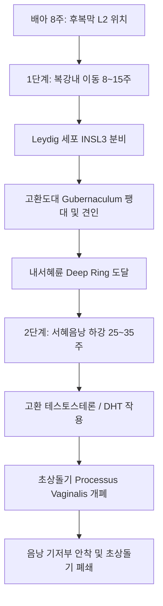

# 📑 [Netter Vol.1] Day 03: 음낭 및 고환의 해부·발생·기능부전 및 종양학 (Section 3 완독)

> 📖 **원서 출처**: [The Netter Collection of Medical Illustrations - Volume 1, Reproductive System.pdf (pp. 50-74)](https://drive.google.com/file/d/1x-xTgPfUfiK7dsQyp5L5qfjFYSD_XyGm/view?usp=drivesdk)  
> 🏷️ **범위**: Section 3 전편 (Plate 3-1 ~ Plate 3-25, 총 25개 플레이트)  
> 📌 **핵심 테마**: 음낭벽 6개 동심원 층상구조, 고환의 3중 혈류 공급 및 덩굴정맥동 열교환, 고환 하강 2단계 기전(INSL3/Androgen), 정자발생 64일 주기, 성선저하증(Hyper vs Hypogonadotropic) 정밀 감별, 급성 음낭증(고환 염전 골든타임 6시간) 및 고환 생식세포종양(Seminoma vs Non-seminoma) 진단·병기

---

## 1. 개요 및 마스터 요약 (Executive Summary)

1. **음낭벽 6개 층과 복벽의 해부학적 상동성**:
   - 고환이 복강에서 음낭으로 하강하면서 복벽의 각 층을 끌고 내려와 6개의 동심원 피막을 형성합니다:
     - 피부(Skin) $\rightarrow$ 다토스 근막(Dartos, Scarpa/Colles 연속) $\rightarrow$ 외정삭근막(External spermatic, 외복사근건막) $\rightarrow$ 고환올림근막/근(Cremasteric, 내복사근) $\rightarrow$ 내정삭근막(Internal spermatic, 복횡근막) $\rightarrow$ 고환초막(Tunica vaginalis, 복막).
2. **고환의 미세혈관 및 열교환 메커니즘**:
   - 고환은 대동맥에서 직접 분지하는 **고환동맥(Testicular a.)**, 상/하방광동맥 유래의 **정관동맥(Deferential a.)**, 하복벽동맥 유래의 **고환올림근동맥(Cremasteric a.)**의 3중 혈류망을 갖습니다.
   - **덩굴정맥동(Pampiniform plexus)**은 고환동맥을 나선형으로 둘러싸 대향류 열교환(Countercurrent heat exchange)을 통해 음낭 내 온도를 심부 체온보다 2~3℃ 낮게 유지하여 정상 정자 형성을 보장합니다.
   - 좌측 고환정맥은 좌측 신정맥에 직각으로 유입되어 정수압이 높고 판막이 없어 **정계정맥류(Varicocele)**의 90%가 좌측에 호발합니다.
3. **고환 하강의 2단계 기전과 정류고환**:
   - **1단계(복강내 이동, 임신 8~15주)**: Leydig 세포의 **INSL3** 호르몬 자극으로 고환도대(Gubernaculum)가 팽대 및 견인.
   - **2단계(서혜음낭 하강, 임신 25~35주)**: **안드로겐(Testosterone/DHT)** 의존적으로 고환도대 퇴행 및 서혜관 통과.
   - 1세 이후에도 하강하지 않는 **잠복고환(Cryptorchidism)**은 정원세포 열손상으로 불임 및 고환암(Seminoma 등) 위험을 4~10배 증가시키므로 생후 6~12개월 사이 **고환고정술(Orchiopexy)**이 필수적입니다.
4. **성선저하증(Hypogonadism)의 축 감별**:
   - **원발성(고성선자극호르몬성, Hypergonadotropic)**: 고환 실질 부전 $\rightarrow$ T 저하, LH/FSH 보상성 급증 (예: 클라인펠터 증후군 47,XXY, 고환염 후유증).
   - **이차성(저성선자극호르몬성, Hypogonadotropic)**: 시상하부-뇌하수체 부전 $\rightarrow$ T 저하, LH/FSH 동반 저하 또는 부적절한 정상 (예: 칼만 증후군 KAL1 결손 + 후각상실, 뇌하수체 선종).
5. **급성 음낭증(Acute Scrotum) 응급 감별**:
   - **고환 염전(Testicular Torsion)**: Bell-clapper 기형, 고환 거상, 거상 시 통증 악화(Prehn sign 음성), 고환올림근 반사 소실. **골든타임 6시간** 내 즉각 수술적 염전 정복 및 양측 고환고정술 시행.
   - **급성 부고환염(Epididymitis)**: 거상 시 통증 완화(Prehn sign 양성), 도플러 초음파상 혈류 증가.
6. **고환 생식세포종양(GCT)의 양대 축**:
   - **정상피종(Seminoma, 50%)**: 방사선 및 백금 기반 항암화학요법에 극도로 민감. AFP는 항상 정상이며, 간혹 syncytiotrophoblast 세포에 의해 β-hCG 경미 상승.
   - **비정상피종(Non-seminoma, 50%)**: 배아암종(Embryonal ca), 난황낭종양(Yolk sac tumor - Schiller-Duval body, AFP 현저 상승), 융모암종(Choriocarcinoma - 조기 혈행성 전이, β-hCG 폭증), 기형종(Teratoma).
   - **진단 및 수술 원칙**: 음낭 피부를 통한 생검은 림프 배액로 오염을 유발하므로 절대 금기이며, 반드시 서혜부를 통한 **근치적 고환절제술(Radical inguinal orchiectomy)**을 시행해야 합니다.

---

## 2. 음낭 및 고환의 해부학, 혈관망 및 미세구조 (Plates 3-1 ~ 3-4)

### Plate 3-1 | 음낭벽의 층상 해부학 (Scrotal Wall)

![[Netter_V1_Plate3-1.png]]

#### 1) 복벽 유래 6대 음낭 피막층
고환이 후복막에서 음낭으로 하강하면서 복벽 구조물을 차례로 견인하여 형성된 6층 구조입니다:
1. **피부 (Skin)**: 얇고 신축성이 뛰어나며 색소 침착과 피지선, 땀샘이 발달. 정중앙에 **음낭봉선(Median raphe)** 형성.
2. **다토스막 / 육양막 (Dartos tunic & muscle)**: 피하지방층이 없고 평활근 섬유와 탄력섬유로 구성. 온도 변화에 반응하여 수축(주름 형성 및 열 보존) 및 이완(표면적 확대 및 방열). 복벽의 **스카르파 근막** 및 회음부의 **콜리스 근막**과 직접 연속.
3. **외정삭근막 (External spermatic fascia)**: 복벽의 **외복사근 건막(External oblique aponeurosis)** 및 외서혜륜(Superficial inguinal ring) 가장자리에서 기원.
4. **고환올림근 및 근막 (Cremasteric muscle and fascia)**: **내복사근(Internal oblique m.)**의 근섬유와 복횡근 일부 섬유에서 기원. 음부대퇴신경의 음부가지(Genital branch of genitofemoral n., L1-L2)의 지배를 받아 고환올림근 반사(Cremasteric reflex)를 매개.
5. **내정삭근막 (Internal spermatic fascia)**: 복강 내벽을 덮는 **복횡근막(Transversalis fascia)**이 내서혜륜(Deep inguinal ring)에서 누두상으로 연장된 막.
6. **고환초막 (Tunica vaginalis)**: 복막(Peritoneum)의 돌출물인 초상돌기(Processus vaginalis)에서 유래한 장막. **벽측판(Parietal layer)**과 고환/부고환 표면을 감싸는 **장측판(Visceral layer)**으로 나뉘며, 그 사이 잠재 공간에 소량의 윤활액이 존재.

---

### Plate 3-2 | 고환의 혈류 공급 및 덩굴정맥동 (Blood Supply of the Testis)

![[Netter_V1_Plate3-2.png]]

#### 1) 3중 동맥 순환망 (Triple Arterial Supply)
- **고환동맥 (Testicular / Internal spermatic a.)**: 복부대동맥 전외측(신동맥 바로 하방, L2 높이)에서 기원하여 고환 실질의 주된 동맥혈 공급. 고환종격(Mediastinum testis) 부근에서 나선상으로 꼬이며 백막을 관통하여 원심성 동맥(Centrifugal aa.)으로 분지.
- **정관동맥 (Deferential a. / Artery of vas)**: 내장골동맥의 분지인 상방광 또는 하방광동맥에서 기원하여 정관과 부고환 미부를 관류.
- **고환올림근동맥 (Cremasteric / External spermatic a.)**: 하복벽동맥(Inferior epigastric a.)에서 기원하여 정삭 피막을 공급.
- *임상 의의*: 세 동맥 간에 풍부한 미세 문합이 존재하여 정계정맥류 수술(Palomo 술식)이나 서혜부 수술 시 고환동맥이 결찰되어도 측부 순환으로 고환 위축을 예방할 수 있습니다.

#### 2) 덩굴정맥동(Pampiniform Plexus)과 열교환 역학
- 고환 실질 및 부고환의 정맥혈은 촘촘한 그물망 형태의 **덩굴정맥동**을 형성하여 고환동맥을 에워쌉니다.
- **대향류 열교환(Countercurrent Heat Exchange)**: 동맥혈의 열이 정맥혈로 전도되어 고환에 도달하는 혈류 온도를 2~3℃ 하강시킴.
- **정맥 환류 비대칭성**:
  - **우측 고환정맥**: 하대정맥(IVC)으로 비스듬한 각도로 직접 유입 (역류 방지 판막 작용).
  - **좌측 고환정맥**: 좌측 신정맥(Left renal v.)으로 **90도 직각**으로 유입되며 판막이 취약함. 상장간막동맥(SMA)과 대동맥 사이에서 좌측 신정맥이 압박받는 '호두까기 증후군(Nutcracker phenomenon)'으로 인해 정수압이 상승하여 **정계정맥류(Varicocele)의 90%가 좌측에 발생**.

---

### Plate 3-3 | 고환, 부고환 및 정관 (Testis, Epididymis, and Vas Deferens)

![[Netter_V1_Plate3-3.png]]

#### 1) 미세 해부 및 도관 체계
- **백막(Tunica albuginea)**: 두꺼운 백색 섬유성 피막으로 내부로 다수의 중격(Septa)을 뻗어 고환 실질을 250~300개의 원뿔형 **고환소엽(Lobules)**으로 구획화.
- **정세관(Seminiferous tubules)**: 각 소엽마다 1~4개의 극도로 꼬인 정세관(길이 70~80 cm)이 위치.
- **정자 이동 경로**:
  $$\text{정세관} \rightarrow \text{직정세관(Tubuli recti)} \rightarrow \text{고환망(Rete testis)} \rightarrow \text{수출소관(Ductuli efferentes, 8~12개)} \rightarrow \text{부고환관(Epididymal duct)}$$
- **부고환(Epididymis)**:
  - 길이 4~6 m의 단일 나선상 도관. 두부(Caput), 체부(Corpus), 미부(Cauda)로 구분.
  - **정자 성숙(Maturation)**: 고환에서 갓 생성된 정자는 수정력과 운동성이 없음. 부고환을 통과하는 약 **12일간** 세포막 단백 재배열, 운동성 획득, 당단백 피복 과정을 거쳐 성숙 완료.
- **정관(Vas deferens)**: 부고환 미부에서 이어지는 두꺼운 3층 평활근(내측 종주-중간 환상-외측 종주) 도관으로 연동운동을 통해 정자를 사정관으로 강력하게 분출.

---

### Plate 3-4 | 고환 발생 및 정자형성 (Testicular Development and Spermatogenesis)

![[Netter_V1_Plate3-4.png]]

#### 1) 정자발생 주기 및 감수분열 역학
- **발생 타임라인**: 출생 시 정세관은 내강이 없는 정소끈(Testis cords) 상태 $\rightarrow$ 5~7세경 내강 형성 $\rightarrow$ 사춘기(11~12세)에 감수분열 시작 및 급격한 고환 종대(Tanner Stage II의 첫 징후, 고환 부피 $> 4\text{ mL}$).
- **정자발생 3단계 (총 64일 소요)**:
  1. **증식기(Proliferation)**: 정원세포(Spermatogonia, 2n)의 유사분열 및 자가 재생(Self-renewal).
  2. **감수분열기(Meiosis)**: 제1정모세포($2n, 4C$)가 제1감수분열을 거쳐 제2정모세포($1n, 2C$)가 되고, 즉시 제2감수분열을 거쳐 반수체 **정세포(Spermatids, $1n, 1C$)** 형성. 교차(Crossing-over)를 통한 유전적 다양성 확보.
  3. **정자완성기(Spermiogenesis)**: 정세포의 형태학적 변태 $\rightarrow$ 골지체에서 **첨체(Acrosome)** 형성, 편모(Flagellum) 신장, 미토콘드리아 나선 집적, 불필요한 세포질 탈락(Residual body).
- **정자형성파(Spermatogenic Waves)**: 정세관을 따라 나선형(Helical) 파동 패턴으로 비동기적 진행되어 초당 약 1,000~1,500개의 정자가 중단 없이 지속 생산됨.

---

## 3. 고환 하강 및 선천성 기형 (Plates 3-5, 3-15)

### Plate 3-5 | 고환 하강 (Descent of the Testis)

![[Netter_V1_Plate3-5.png]]

#### 1) 고환 하강의 2단계 기전
1. **복강내 이동기 (Transabdominal phase, 임신 8~15주)**:
   - 고환이 T6-S2 후복막에서 내서혜륜(Deep inguinal ring)까지 이동.
   - Leydig 세포에서 분비되는 **INSL3 (Insulin-like 3)** 펩타이드가 고환도대(Gubernaculum)의 팽대와 수축을 유도. (안드로겐 비의존적).
2. **서혜음낭 하강기 (Inguinoscrotal phase, 임신 25~35주)**:
   - 고환이 서혜관을 통과하여 음낭 바닥으로 진입.
   - **안드로겐(Testosterone $\rightarrow$ 5α-DHT)** 및 음부대퇴신경에서 분비되는 CGRP(Calcitonin gene-related peptide)가 관여. 고환도대 원위부 견인 및 초상돌기 개존 유도.

---

### Plate 3-15 | 정류고환 / 잠복고환 (Cryptorchidism)

![[Netter_V1_Plate3-15.png]]

#### 1) 병태생리 및 임상적 관리
- **빈도**: 만삭아의 3~4%, 미숙아의 30%에서 관찰. 생후 3개월 내 자연 하강이 일어나 1세경 유병률은 약 1%로 감소.
- **위치 분류**: 서혜관 내부(Canalicular, 70%), 외서혜륜 상방(Suprascrotal, 20%), 복강 내(Abdominal, 10%).
- **체온 노출의 합병증**:
  1. **불임(Infertility)**: 복강/서혜부의 고온($37^\circ\text{C}$)에 노출되어 생후 1~2년부터 정원세포 변성 및 Leydig/Sertoli 세포 섬유화 시작.
  2. **고환암(Testicular Cancer)**: 정상인 대비 **4~10배** 발생률 증가. 가장 흔한 조직형은 **정상피종(Seminoma)**. 반대측 정상 하강 고환에서도 암 발생률이 동반 상승함.
  3. **고환 염전 및 서혜부 탈장**: 초상돌기 미폐쇄로 간접 서혜탈장이 90% 동반.
- **치료 지침**: 자연 하강이 멈추는 **생후 6~12개월 (늦어도 18개월 이전)**에 **고환고정술(Orchiopexy)** 시행.

---

## 4. 음낭 피부 질환, 감염 및 손상 (Plates 3-6 ~ 3-8, 3-11 ~ 3-14)

### Plate 3-6 | 음낭 피부 질환 I - 화학적 및 감염성 (Scrotal Skin Diseases I: Chemical and Infectious)

![[Netter_V1_Plate3-6.png]]

- **완선 (Tinea cruris)**: *Trichophyton rubrum*, *Epidermophyton floccosum* 등 피부사상균 감염. 융기된 경계부가 뚜렷한 인설성 홍반, 극심한 소양증("Jock itch").
- **간찰진 (Intertrigo)**: 마찰과 습기로 인한 피부염에 *Candida albicans* 중복 감염. 위성 농포(Satellite pustules)와 짓무름. 항진균제 도포 및 건조 유지.
- **접촉피부염 (Contact dermatitis)**: 세제, 국소 외용제, 라텍스 알레르기 반응.

---

### Plate 3-7 | 음낭 피부 질환 II - 옴 및 사타구니이 (Scrotal Skin Diseases II: Scabies and Lice)

![[Netter_V1_Plate3-7.png]]

- **옴 (Scabies, *Sarcoptes scabiei*)**: 암컷 진드기가 각질층 내에 터널(굴, Burrows)을 파고 산란. **야간에 악화되는 극심한 소양증**. 음낭 및 음경 피부의 소양성 결절(Scabietic nodules). 5% Permethrin 크림 전신 도포.
- **사타구니이 / 사면발니 (Pediculosis pubis, *Pthirus pubis*)**: 음모에 서식하며 흡혈. 혈액-침 반응으로 진피 내 헤모시데린 침착에 의한 **청색 반점(Maculae caeruleae)** 형성. 성인 매개 감염으로 침구류 살균 필수.

---

### Plate 3-8 | 음낭 박탈 손상, 부종 및 혈종 (Avulsion, Edema, Hematoma)

![[Netter_V1_Plate3-8.png]]

- **음낭 박탈(Avulsion)**: 산업용 회전기계나 농기계에 말려 피부 전체가 뜯겨나가는 손상. 고환 자체는 고환올림근 반사와 탄력성으로 손상을 면하는 경우가 많음.
- **피부 결손 재건**: 잔존 음낭 피부는 재생력이 뛰어나므로 최대한 보존하여 일차 봉합. 완전 결손 시 노출된 고환을 **대퇴부 내측 피하 주머니(Subcutaneous thigh pocket)**에 임시 매몰 후 2차 피판술 시행.

---

### Plate 3-11 | 음낭 감염 및 포르니에 괴저 (Infection, Gangrene - Fournier's Gangrene)

![[Netter_V1_Plate3-11.png]]

#### 1) 포르니에 괴저(Fournier's Gangrene)의 응급 임상
- **개념**: 회음부, 생식기, 항문 주위를 침범하는 **급성 전격성 괴사성 근막염(Necrotizing fasciitis)**.
- **원인균**: 호기성균(대장균, 녹농균)과 혐기성균(Bacteroides, Clostridium, 연쇄상구균)의 **다균성 복합 감염(Polymicrobial)**. 당뇨병, 알코올 중독, 면역저하자에서 호발.
- **병태생리**: 피하 혈관의 감염성 혈전증 $\rightarrow$ 피부 및 근막의 급속한 전층 허혈 괴사 (진행 속도 시간당 수 cm).
- **소견**: 극심한 통증, 회음부 염발음(Crepitus, 가스 생성균), 악취를 동반한 암갈색 삼출물, 패혈성 쇼크.
- **처치**: 즉각적인 광범위 항생제 투여와 지체 없는 **응급 근막절개 및 광범위 변연절제술(Surgical debridement)**.

---

### Plate 3-12 | 음낭 매독 (Syphilis)

![[Netter_V1_Plate3-12.png]]

- 음낭 피부에 발생하는 1기 매독의 단일 **경성하감(Hard chancre)** 및 2기 매독의 사마귀상 **편평콘딜롬(Condyloma lata)**.

---

### Plate 3-13 | 음낭 상피병 (Elephantiasis)

![[Netter_V1_Plate3-13.png]]

- 반크로프트 사상충(*Wuchereria bancrofti*)에 의한 만성 림프관염 및 림프관 폐색.
- 음낭 피하조직의 거대한 섬유비후 및 표피 과각화증으로 인해 음낭이 거대하게 종대(수십 kg에 달함).

---

### Plate 3-14 | 음낭 낭종 및 음낭암 (Cysts and Cancer of the Scrotum)

![[Netter_V1_Plate3-14.png]]

- **피지낭종 (Epidermoid / Sebaceous cysts)**: 음낭 다토스층에 호발하는 다발성 양성 낭종.
- **음낭암 (Chimney-Sweep's Cancer / Scrotal SCC)**:
  - **인류 역사상 최초로 입증된 직업성/환경성 암 (1775년 Percivall Pott)**: 굴뚝 청소부의 그을음(Soot, 다환방향족탄화수소 PAH) 노출.
  - 초기 사마귀상 구진 $\rightarrow$ 궤양성 종괴로 진행. 서혜 림프절 전이 빈도가 높음.

---

## 5. 음낭내 종물, 혈관 질환 및 응급 질환 (Plates 3-9 ~ 3-10)

### Plate 3-9 | 음낭수종 및 정액류 (Hydrocele, Spermatocele)

![[Netter_V1_Plate3-9.png]]

#### 1) 음낭수종(Hydrocele)과 정액류(Spermatocele)의 감별
| 구분 | 교통성 음낭수종 (Communicating) | 비교통성 음낭수종 (Non-communicating) | 정액류 (Spermatocele) |
| :--- | :--- | :--- | :--- |
| **기전** | 초상돌기(Processus vaginalis) 미폐쇄 | 초막 내 분비-흡수 불균형 (성인형) | 부고환 두부 수출소관의 낭성 확장 |
| **위치** | 고환 전체를 둘러쌈 | 고환 전체를 둘러쌈 | **고환 상극(부고환 두부)**에 독립된 종물 |
| **임상 양상** | 복압/자세에 따라 **크기 변동** | 크기 일정, 무통성 팽만 | 고환과 분리되어 만져지는 무통성 구형 낭종 |
| **투광 검사** | **투광 양성 (Transillumination +)** | **투광 양성 (Transillumination +)** | **투광 양성 (+)**, 흡인 시 백색 정자액 |
| **치료** | 고위 결찰술(High ligation) | 초막 절제술(Lord/Jaboulay 술식) | 증상 시 단순 적출술 |

---

### Plate 3-10 | 정계정맥류, 음낭혈종 및 고환 염전 (Varicocele, Hematocele, Torsion)

![[Netter_V1_Plate3-10.png]]

#### 1) 정계정맥류 (Varicocele)
- 덩굴정맥동의 비정상적 확장 및 사행. 기립 시 음낭 상부에서 "지렁이가 든 자루(Bag of worms)" 감촉.
- **불임 유발 기전**: 정맥혈 울혈 $\rightarrow$ 음낭 내 온도 상승 $\rightarrow$ 고환 저산소증 및 부신/신장 대사산물의 역류 $\rightarrow$ 정자 수 감소, 운동성 저하, 기형정자 증가(OAT 증후군).

#### 2) 고환 염전 (Testicular Torsion) - 비뇨기과 절대 응급 질환
- **해부학적 소인**: 고환초막이 정삭 상부까지 과도하게 둘러싸 고환이 자유롭게 회전하는 **"종추 기형(Bell-clapper deformity)"**.
- **병태생리**: 정삭이 염전되면서 고환정맥 차단 $\rightarrow$ 울혈 및 출혈성 경색 $\rightarrow$ 고환동맥 차단 $\rightarrow$ 비가역적 허혈 괴사.
- **진단**:
  - **골든타임**: 증상 발현 후 **6시간 이내** (6시간 내 정복 시 고환 보존율 90% 이상, 24시간 경과 시 10% 미만).
  - **신체검사**: 고환 거상(High riding testis), 수평 전위(Horizontal lie), 고환올림근 반사 소실, **Prehn 징후 음성(고환을 들어 올려도 통증 호전 없음)**.
  - **도플러 초음파**: 고환 실질 내 혈류 신호 완전 소실.
- **치료**: 즉각적인 수술적 탐색 및 정복, 양측 재발 방지를 위한 **양측 고환고정술(Bilateral orchiopexy)**.

---

## 6. 성선기능저하증 및 정자형성 부전 (Plates 3-16 ~ 3-21)

### Plate 3-16 | 고환기능부전 I - 원발성 (고성선자극호르몬성) 성선저하증 (Testis Failure I: Primary Hypogonadism)

![[Netter_V1_Plate3-16.png]]

- **기전**: 고환 실질(Leydig 세포 및 정세관)의 자체 손상.
- **검사실 소견**: **혈중 테스토스테론 저하, 혈중 LH 및 FSH 보상성 급증 (Hypergonadotropic)**.
- **원인**: 선천성(잠복고환, 클라인펠터), 후천성(고환염, 항암치료, 방사선 조사, 양측 고환 절제).

---

### Plate 3-17 | 고환기능부전 II - 이차성 (저성선자극호르몬성) 성선저하증 (Testis Failure II: Secondary Hypogonadism)

![[Netter_V1_Plate3-17.png]]

- **기전**: 시상하부의 GnRH 분비 결손 또는 뇌하수체 전엽의 LH/FSH 분비 부전.
- **검사실 소견**: **혈중 테스토스테론 저하, 혈중 LH 및 FSH 동반 저하 또는 부적절한 정상 (Hypogonadotropic)**.
- **원인**: 뇌하수체 대선종, 두개인두종, 쉬한 증후군, 혈색소침착증(Hemochromatosis).

---

### Plate 3-18 | 고환기능부전 III - 이차성 성선저하증 변이 및 환관증 (Testis Failure III: Secondary Hypogonadism Variants & Eunuchoidism)

![[Netter_V1_Plate3-18.png]]

- **칼만 증후군 (Kallmann syndrome)**:
  - 후각신경구(Olfactory bulb)와 GnRH 분비 신경세포의 태생기 이동 부전 (*KAL1 / FGFR1* 유전자 돌연변이).
  - **특징 징후**: 저성선자극호르몬성 성선저하증 + **후각 결손/감소(Anosmia/Hyposmia)**, 구개열, 한쪽 신장 무발생.
- **환관증 체형 (Eunuchoid Proportions)**:
  - 사춘기 전 안드로겐 결핍으로 골단판(Epiphyseal plate) 유합이 지연되어 장골이 과다 성장.
  - **판정 기준**: 상하지 폭(Arm span)이 신장보다 5 cm 이상 길거나, 치골결합-발바닥 길이가 치골결합-정수리 길이보다 5 cm 이상 긴 체형.

---

### Plate 3-19 | 고환기능부전 IV - 클라인펠터 증후군 (Testis Failure IV: Klinefelter Syndrome)

![[Netter_V1_Plate3-19.png]]

#### 1) 병태생리 및 핵심 임상상
- **핵심 유전형**: **47, XXY (80~90%)**, 감수분열 시 성염색체 비분리(Nondisjunction).
- **남성 원발성 성선기능저하증 및 불임의 가장 흔한 유전적 원인** (유병률 1:600).
- **주요 4대 임상 징후**:
  1. **극소 고환 (Micro-orchidism)**: 돌처럼 단단하고 위축된 작은 고환 ($< 4\text{ mL}$).
  2. **무정자증 (Azoospermia)**: 정세관 유리양 변성(Hyalinization) 및 섬유화로 인한 절대적 불임.
  3. **여성형 유방 (Gynecomastia)**: 에스트로겐/안드로겐 비율 증가 (유방암 위험 20배 증가).
  4. **고신장 및 환관증 체형**: 장골 과성장, 희소한 체모.
- **호르몬 프로파일**: $T \downarrow$, $LH \uparrow\uparrow$, $FSH \uparrow\uparrow$, $Estradiol \uparrow$.

---

### Plate 3-20 | 고환기능부전 V - 사춘기 지연 (Testis Failure V: Delayed Puberty)

![[Netter_V1_Plate3-20.png]]

- 만 14세까지 고환 용적 증가($> 4\text{ mL}$)가 나타나지 않는 경우.
- **체질성 성장 및 사춘기 지연 (CDGP)**: 가장 흔한 정상 변이. 골연령(Bone age)이 역연령보다 지연되어 있으나 최종 성인 신장과 성성숙은 정상에 도달.
- 영구적 저성선자극호르몬성 성선저하증과의 감별을 위해 GnRH 자극검사 및 추적 관찰 시행.

---

### Plate 3-21 | 정자형성 부전 및 남성 불임 (Spermatogenic Failure)

![[Netter_V1_Plate3-21.png]]

#### 1) 비폐색성 무정자증(NOA)의 고환 생검 조직학적 3대 패턴
1. **세르톨리 세포 단독 증후군 (Sertoli-Cell-Only Syndrome / Germ cell aplasia)**:
   - 정세관 내에 생식세포는 전무하고 오직 지지세포(Sertoli cell)만 존재. 혈중 FSH 현저히 상승.
2. **성숙 정지 (Maturation Arrest)**:
   - 정원세포 또는 제1정모세포 단계까지만 진행되고 감수분열이 중단되어 성숙 정세포가 생성되지 못함.
3. **정세관 저형성 / 정자형성 저하증 (Hypospermatogenesis)**:
   - 모든 단계의 생식세포가 존재하나 그 수가 전반적으로 극히 감소되어 있는 상태.
- *임상적 치료*: 미세수술적 고환 정자 채취술(**micro-TESE**)을 통해 국소적으로 잔존하는 정자 형성 부위를 찾아 세포질내 정자주입술(ICSI) 연계.

---

## 7. 고환 감염, 염증 및 악성 종양 (Plates 3-22 ~ 3-25)

### Plate 3-22 | 부고환 및 고환의 감염과 농양 (Infection and Abscess of Testis and Epididymis)

![[Netter_V1_Plate3-22.png]]

#### 1) 급성 부고환-고환염 (Acute Epididymo-orchitis)
- **연령별 원인균**:
  - **35세 미만 성활성기 남성**: 성매개균인 *Chlamydia trachomatis*, *Neisseria gonorrhoeae*.
  - **35세 이상 및 소아**: 요로감염균인 *Escherichia coli*, *Pseudomonas*, 비뇨기계 기계조작 합병증.
- **볼거리 고환염 (Mumps orchitis)**:
  - 사춘기 이후 볼거리(Mumps) 감염 환자의 약 20~30%에서 이하선염 발현 4~7일 후 급성 고환염 발생. 양측 침범 시 고환 위축 및 영구 불임 위험.
- **고환 농양 (Testicular Abscess)**:
  - 부고환염이 고환 실질로 파급되어 백막 내압 상승으로 국소 허혈 및 조직 융해 괴사 발생. 항생제 반응 부전 시 배농술 또는 고환절제술 필요.

---

### Plate 3-23 | 고환 매독 및 결핵 (Syphilis and Tuberculosis of the Testis)

![[Netter_V1_Plate3-23.png]]

- **고환 결핵 (Tuberculosis of Epididymis and Testis)**:
  - 신장/방광 결핵균이 정관을 따라 역행성 파급되어 **부고환 미부(Tail)**에 먼저 결핵성 육아종 형성.
  - 신체검사상 정관이 염주알 모양으로 단단하게 만져지는 **"염주알 정관 (Beaded vas deferens)"** 및 만성 한랭농양이 음낭 피부를 뚫고 나오는 **후음낭 누공(Scrotal sinus)** 특징.
- **고환 매독 (Syphilis of Testis)**:
  - 3기 매독의 특징인 **고무종(Gumma)**이 고환 실질을 침범하여 무통성의 거대한 만성 고환 비대를 초래(고환암과 감별 필요).

---

### Plate 3-24 | 고환 종양 I - 정상피종, 배아암종, 난황낭종양 (Testicular Tumors I: Seminoma, Embryonal Carcinoma, Yolk Sac Tumors)

![[Netter_V1_Plate3-24.png]]

#### 1) 고환암 개요 및 세부 조직형
- 15~35세 젊은 남성에서 가장 흔한 고체 장기 악성종양. 95%가 생식세포종양(Germ Cell Tumor, GCT).
- **정상피종 (Seminoma, 50%)**:
  - 30~40대 호발. 육안상 경계가 명확하고 균질한 회백색-육색 분엽상 종괴.
  - 현미경: 글리코겐이 풍부한 투명한 세포질의 거대 다각형 세포들이 섬유성 지지중격과 림프구 침윤으로 나뉨.
  - **방사선 조사(Radiotherapy)에 극도로 민감**. **Serum AFP는 절대 정상** (AFP 상승 시 비정상피종 성분 혼재를 의미).
- **배아암종 (Embryonal Carcinoma)**:
  - 20~30대 호발. 육안상 경계가 불분명하고 **광범위한 출혈과 괴사**를 동반하는 침습적 종양.
  - 미분화 상피양 세포들이 판상(Sheet), 관상, 유두상 배열을 형성. 조기 전이율이 높음.
- **난황낭종양 (Yolk Sac Tumor / Endodermal Sinus Tumor)**:
  - **3세 미만 소아에서 가장 흔한 고환 종양**.
  - 현미경 소견상 사구체 유사 구조를 띠는 **실러-듀발 소체 (Schiller-Duval bodies)** 관찰.
  - **Serum AFP(알파태아단백)의 현저한 상승** (진단 및 치료 반응 모니터링의 절대적 종양표지자).

---

### Plate 3-25 | 고환 종양 II - 기형종, 융모암종, 상피내종양 (Testicular Tumors II: Teratoma, Choriocarcinoma, In Situ Neoplasia)

![[Netter_V1_Plate3-25.png]]

#### 1) 비정상피종 고위험군 및 표준 원칙
- **기형종 (Teratoma)**:
  - 외배엽, 중배엽, 내배엽의 3배엽 성분이 무질서하게 혼합된 종양 (연골, 상피, 근육, 낭종 등).
  - 소아에서는 양성이지만 **성인 남성에서는 악성(전이 가능)**으로 취급. 방사선 및 항암치료에 저항성이 있어 수술적 완전 절제 필요.
- **융모암종 (Choriocarcinoma)**:
  - 극히 드물지만 가장 악성도가 높은 고환암. Syncytiotrophoblast와 Cytotrophoblast로 구성.
  - 원발 병소는 매우 작거나 소퇴(Burn-out)되어 고환에서 만져지지 않을 수 있으나, **조기에 혈행성을 통해 폐, 뇌, 간으로 급속 전이**.
  - **Serum β-hCG 수치가 수십만 mIU/mL 이상으로 폭증** $\rightarrow$ 여성형 유방 및 전이성 객혈 유발.
- **상피내 생식세포종양 (GCNIS / ITGCNU)**:
  - 침습성 생식세포종양의 전암 단계. 정세관 기저막 상에 비정상 생식세포가 위치.
- **고환암의 절대 진단 및 수술 원칙**:
  - **경음낭 생검 및 침생검(Scrotal biopsy) 절대 금기**: 음낭 피부 림프관 오염으로 서혜부 전이를 초래하여 병기를 교란시킴.
  - 반드시 서혜인대 상방 절개를 통해 정삭을 고위 결찰하는 **서혜부 근치적 고환절제술(Radical Inguinal Orchiectomy)** 시행.

#### 2) 고환 생식세포종양 종양표지자(Tumor Markers) 감별 정리표
| 종양 조직형 (Histology) | AFP (Alpha-fetoprotein) | β-hCG (Human Chorionic Gonadotropin) | LDH (Lactate Dehydrogenase) | 임상적 치료 반응 |
| :--- | :--- | :--- | :--- | :--- |
| **정상피종 (Pure Seminoma)** | **항상 정상 (0%)** | 약 10~15%에서 경미 상승 | 종양 부피 비례 상승 | 방사선 감수성 극대화, 예후 우수 |
| **배아암종 (Embryonal ca)** | 약 60%에서 상승 | 약 60%에서 상승 | 상승 | 항암화학요법(BEP) 반응 |
| **난황낭종양 (Yolk sac)** | **100% 현저 상승** | 정상 | 상승 | 소아 예후 우수 |
| **융모암종 (Choriocarcinoma)** | 항상 정상 (0%) | **100% 폭발적 급증** ($> 10^5$) | 상승 | 혈행성 조기 전이, 불량 예후 |
| **기형종 (Pure Teratoma)** | 통상 정상 | 통상 정상 | 정상~경미 상승 | 방사선/항암 저항, 수술 절제 |
