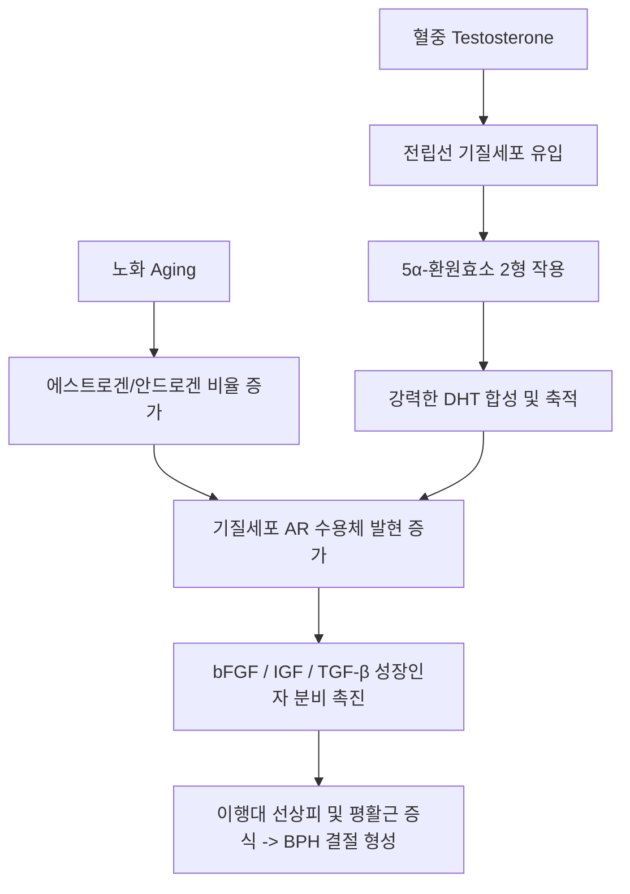
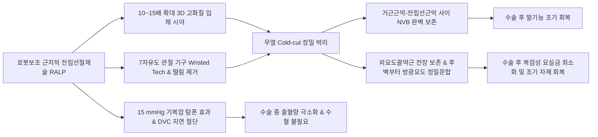

# 📑 [Netter Vol.1] Day 04: 정낭 및 전립선의 해부·발생·비대증·악성종양 및 수술학 (Section 4 완독)

> 📖 **원서 출처**: [The Netter Collection of Medical Illustrations - Volume 1, Reproductive System.pdf (pp. 76-97)](https://drive.google.com/file/d/1x-xTgPfUfiK7dsQyp5L5qfjFYSD_XyGm/view?usp=drivesdk)  
> 🏷️ **범위**: Section 4 전편 (Plate 4-1 ~ Plate 4-22, 총 22개 플레이트 전수 포함)  
> 📌 **핵심 테마**: McNeal 전립선 구역 해부학(TZ vs PZ), 배아 요로생식동 발생 및 DHT 의존성, 전립선염 NIH 4대 분류, 전립선비대증(BPH) 병태생리 및 약물·수술학(TURP/HoLEP), 전립선암(PCa) 조기진단(PSA/ISUP Grade Group), 골형성성(Osteoblastic) 뼈전이 기전(Batson 척추정맥총), 로봇보조 근치적 전립선절제술(RALP) 신경보존 기법

---

## 1. 개요 및 마스터 요약 (Executive Summary)

1. **맥닐(McNeal)의 전립선 구역 해부학 (Zonal Anatomy)**:
   - 과거의 엽(Lobe) 개념을 대체하여 병리학적·임상적 의의가 완전히 분리된 4대 구역으로 구성됩니다:
     - **말초대 (Peripheral Zone, PZ, 성인 선조직의 70~75%)**: 전립선 후외측·첨부를 감싸는 가장 넓은 부위. **전립선암(PCa)의 70~80%가 호발**하며, 직장수지검사(DRE)로 직접 촉진 가능. 선포 내 연성 결석체인 전립선소체(Corpora amylacea) 함유.
     - **이행대 (Transition Zone, TZ, 5~10%)**: 근위부 전립선 요도를 양측에서 둘러싸는 부위. 노화에 따라 결절성 증식이 일어나 **전립선비대증(BPH)의 절대적 기원지**가 됨.
     - **중심대 (Central Zone, CZ, 25%)**: 사정관(Ejaculatory duct)을 둘러싸며 방광경부에서 정구(Verumontanum)로 이어지는 역삼각형 원추 구역. 볼프관 기원으로 암 발생률은 극히 낮음 ($< 5\%$).
     - **전방 섬유근간질 (Anterior Fibromuscular Stroma, AFS, 전체 용적의 1/3)**: 선 조직이 전무한 순수 비선성 평활근 및 결합조직 지지체.
2. **남성 부속생식선 분비액 및 신경 조절**:
   - **전립선**: 산성 분비물(pH 6.5 내외), 사정액의 10~20% 차지. 구연산(Citric acid), 콜린, 콜레스테롤, 산성인산분해효소(PAP), PSA(세린 단백분해효소로 사정 후 15~30분 내 응고 겔을 액화).
   - **정낭 (Seminal vesicles)**: 길이 8~10 cm, 볼프관 기원. 알칼리성 분비물, 사정액의 80~90% 차지. 과당(Fructose, 정자 에너지원), 프로스타글란딘, 피브리노겐 풍부. **하복신경(Hypogastric nerve) 아드레날린성 교감신경**의 지배로 사정 시 수축.
   - **요도구선 (Cowper's bulbourethral glands)**: 비뇨생식격막 내 위치, 구해부 요도로 개구.
3. **배아 발생 및 안드로겐 의존성 (상피-간엽 상호작용)**:
   - 전립선은 임신 10~12주경 **요로생식동(Urogenital sinus)의 총배설강 내배엽** 상피세포가 5개 분아군(외측 37~40개, 중엽 7~12개, 후엽 4~11개, 전엽 9개, 알바란선 8~19개)을 형성하여 주변 간엽(Mesenchyme)으로 함입 침투. 전엽은 16주경 위축되어 출생 시 소수 선포만 잔존.
   - 초기 도관 분기 단계에서는 **간엽세포의 안드로겐 수용체(AR)**가 테스토스테론 $\rightarrow$ **5α-환원효소 2형** $\rightarrow$ **DHT** 경로를 통해 형태형성을 주도하며, 이후 상피세포의 AR 발현을 통해 완전한 분비 표현형이 확립됨.
4. **전립선비대증(BPH)의 다중 병태생리, 약물 및 외과적 수술학**:
   - **3대 병인론**: 줄기세포 클론 확장설, DHT 축적설, 배아 재각성설(Embryonic reawakening theory).
   - **2중 폐색 요소 및 약물**: 정적 폐색(부피 증가) $\rightarrow$ **5-ARI(Finasteride, Dutasteride)**로 6개월 내 부피 33% 축소 및 PSA 50% 위감소; 동적 폐색(평활근 긴장) $\rightarrow$ **$\alpha_1$-차단제(Tamsulosin 등)**로 즉각 이완.
   - **외과적 접근법**: 거대 전립선($> 75\sim 80\text{ g}$) 및 방광결석 동반 시 **치골상식(Suprapubic)**, 방광 미절개 및 직시 하 지혈이 가능한 **치골후식(Retropubic - Millin)**, 심부 요도 노출이 우수한 **회음식(Perineal)**, 표준 내시경 절제술인 **경요도 전립선절제술(TURP)** (1.5시간 초과 및 피막 천공 시 희석성 저나트륨혈증인 TUR 증후군 주의).
5. **전립선암(PCa)의 스크리닝, 병리 및 골전이 특이성**:
   - **PSA 동역학**: 4~10 ng/mL 회색지대에서 유리형 비율(Free/Total $< 15\%$), PSA 밀도(PSAD $> 0.15$), PSA 속도(PSAV $> 0.75\text{ ng/mL/year}$, 최소 18개월간 3회 측정)로 감별.
   - **Gleason Score & ISUP Grade Groups (1~5군)**: 저배율 선 구조 양식(1~5) 평가 (세포학적 이형성은 배제).
   - **골전이(Bone Metastasis)의 골형성성(Osteoblastic) 특징**: 판막 없는 **바트슨 척추정맥총(Batson's plexus)**을 통해 요추·골반골로 직행 파종. ET-1 분비로 조골세포를 자극하여 X선상 "눈송이 모양(Snowy)" 경화성 백색 병변 형성. 골절 발생률이 낮고 정상 골처럼 치유되어 내고정 필요성 적음.
6. **근치적 전립선절제술 및 정낭·정삭 외과학**:
   - **신경보존술 (Nerve-Sparing RALP/RRP)**: 거근근막(Levator fascia)과 전립선근막(Prostatic fascia) 사이 5시·7시 방향을 주행하는 **해면체신경(Cavernous nerve) 혈관속(NVB)**을 정밀 보존하여 발기능 및 요자제력 극대화.
   - **정낭 외과**: 방광경유, 회음경유, 방광주위, 방광후, 미골경유(Transcoccygeal)의 5대 접근법.
   - **정삭 질환 및 CFTR 돌연변이**: 정삭 종양의 2/3는 양성(선종양 30% 최다), 악성은 횡문근육종(40% 최다). 낭포성 섬유증 유전자(*CFTR*, 7q31.2, IVS8 5T 대립유전자 스플라이싱 결함)와 연관된 선천성 양측 정관 무발생(CBAVD, 수출관 및 부고환 두부는 정상 보존).

---

## 2. 정상 해부학, 발생학 및 외상·낭종 (Plates 4-1 ~ 4-4)

### Plate 4-1 | 전립선과 정낭 (Prostate and Seminal Vesicles)

![[Netter_V1_Plate4-1.png]]

#### 1) 남성 부속생식선 3총사의 분비 생화학 및 기능
- 남성 부속생식선은 **전립선(Prostate gland)**, **정낭(Seminal vesicles)**, **요도구선(쿠퍼선, Bulbourethral glands of Cowper)**의 3대 장기로 구성되어 사정액(Seminal fluid)을 완성합니다.
  - **전립선 분비액 (Prostatic secretions)**:
    - **특성**: 약산성(Acidic pH), 사정액의 **10% ~ 20%**를 차지하며 사정의 첫 분획으로 배출.
    - **성분**: 구연산(Citric acid), 콜린(Choline), 콜레스테롤, 다양한 가수분해 효소, **전립선산성인산분해효소(PAP)**, **전립선특이항원(PSA)**.
    - **PSA의 생리적 역할**: 칼리크레인 계열 세린 단백분해효소(Serine protease)로서 사정 직후 겔 형태로 응고된 정액(Seminal coagulum)을 **15~30분 내에 완전 액화(Liquefaction)**시켜 정자의 운동성을 해방시킴.
  - **정낭 분비액 (Seminal vesicle fluid)**:
    - **특성**: 약알칼리성(Basic pH), 전체 사정액의 **80% ~ 90%**를 차지하는 주성분.
    - **성분**: **과당(Fructose)**이 극도로 풍부하여 정자의 주 에너지원이 되며, 프로스타글란딘(자궁 수축 유도) 및 피브리노겐(정액 응고) 함유.
  - **요도구선 (Cowper's gland)**: 비뇨생식격막(Urogenital diaphragm) 근육 내에 좌우 한 쌍으로 위치하며, 도관이 구해부 요도(Bulbar urethra)로 개구하여 사정 전 투명한 점액질 윤활액을 분비.
  - **성선기능저하증(Hypogonadism)의 영향**: 안드로겐 결핍 시 전립선과 정낭의 선세포 분비 활성이 급격히 위축되어 사정액의 총 부피가 현저히 감소함.

#### 2) 전립선과 정낭의 입체적 위치 및 국소 해부학
- **전립선 성인 계측치 및 경계**:
  - 무게 약 **20 g**의 단단하고 탄력 있는 고무상(Firm, rubbery) 장기.
  - 상부(전립선 기저부, Prostatic base)는 방광경부(Bladder neck)와 직접 맞닿아 있고 근위부 전립선 요도를 둘러쌈.
  - 전면은 치골결합(Symphysis pubis)의 후하방에 위치하며, 하방은 비뇨생식격막에 안착되고, 후면은 직장팽대부(Rectal ampulla) 전벽에 면함.
  - **치골후강 (레치우스 강, Space of Retzius)**: 치골결합 후면과 방광·전립선 전면 사이의 잠재적 공간으로 결합조직, 지방, 풍부한 정맥총(**산토리니 정맥총, Plexus of Santorini**)이 발달.
  - **치골전립선인대 (Puboprostatic ligaments)**: 전립선의 전면 및 외외측을 치골결합 후면에 견고히 고정.
  - **데농빌리에 근막 (Denonvilliers' fascia)**: 전립선 후면과 정낭을 직장 전벽으로부터 엄격히 격리하는 치밀한 이중 엽 결합조직 막.
  - **해면체신경 (발기신경, Cavernous nerves)**: 음경 해면체 발기를 조절하는 자율신경 섬유로, 전립선과 직장 사이 후외측 **5시 및 7시 방향**을 주행함 $\rightarrow$ 암 수술 시 박리 과정에서 손상 위험이 지극히 높음.
- **정낭 (Seminal Vesicles)**:
  - 배아 **중신관(Wolffian duct)** 기원의 주머니 모양(Pouch-like) 장기로 성인 길이 **8 ~ 10 cm**.
  - 방광 후저부와 직장 전면 사이에 위치하며, 얇은 결합조직으로 구획된 관상 폐포(Tubular alveoli)와 두꺼운 평활근 외벽으로 구성됨.
  - 원위부 정관(정관팽대부, Ampullary vas)과 정낭 도관이 합류하여 **사정관(Ejaculatory duct)**을 형성 $\rightarrow$ 전립선 후상방으로 진입하여 후부 요도의 **정구/소낭(Utricle/Verumontanum)**에 개구.
  - **생식관의 "방광" 역할**: **하복신경(Hypogastric nerve)의 아드레날린성 교감신경** 자극을 받아 사정 순간 일제히 연동 수축하여 과당액을 정자가 채워진 사정관으로 분출.

#### 3) 맥닐의 전립선 4대 구역 해부학 (McNeal Zonal Anatomy)
1. **전방 섬유근간질 (Anterior Fibromuscular Stroma, AFS)**:
   - 전립선 전체 부피의 약 **1/3**을 차지하는 비선성(Nonglandular) 조직. 평활근과 교원질 결합조직으로만 구성되어 전립선 기능이나 병리적 질환 발생과는 무관.
2. **중심대 (Central Zone, CZ)**:
   - 젊은 남성에서 선조직의 **5% ~ 10%**, 성인에서 약 **25%** 차지.
   - 방광 기저부에서 정구(Verumontanum)까지 요도 및 사정관을 둘러싸는 원추형 구역. 내부괄약근의 평활근을 포함하며 노화에 따라 상당한 성장을 보일 수 있음. 볼프관 기원으로 암 발생률은 1~5% 미만.
3. **이행대 (Transition Zone, TZ)**:
   - 전립선 요도를 즉각 둘러싸는 부위로 선조직의 **5% ~ 10%** 구성. **전립선비대증(BPH)이 100% 여기서 기원**하며, 전립선암의 약 20% 발생.
4. **말초대 (Peripheral Zone, PZ)**:
   - 성인 전립선 선조직 부피의 **70% ~ 75%**를 차지하는 가장 거대한 선 구역.
   - 전립선 후면, 첨부(Apex), 외측, 후외측, 전외측을 포괄.
   - 원주상피로 둘러싸인 선포(Alveoli)들이 두꺼운 섬유근 간질 속에 파묻혀 있으며, 분지 도관계는 후부 요도의 바닥 및 측면으로 배출됨.
   - 선포 내에 전립선 분비물과 탈락 상피세포가 굳어진 연성 결석체인 **전립선소체(Corpora amylacea)**를 다수 함유.
   - **임상 핵심**: 직장수지검사(DRE)로 촉진되는 부위이며, **전립선암(70~80%)과 세균성 전립선염이 압도적으로 호발**.

---

### Plate 4-2 | 전립선 발생 (Development of Prostate)

![[Netter_V1_Plate4-2.png]]

#### 1) 배아 발생 기원 및 시간대별 형태형성
- **기원**: 전립선 선상피는 **요로생식동(Urogenital sinus)**의 배아 총배설강 내배엽/중배엽성 원시 후부 요도(Primitive posterior/prostatic urethra) 상피에서 기원합니다.
- **발생 시점**: 수정 후 **태령 10~11주 이전에는 선 조직이 전혀 관찰되지 않음**. 태령 10~12주경 원시 요도 상피에서 5개의 별개 상피 분아군(Epithelial buds/tubules)이 형성되어 주변 간엽(Mesenchyme) 속으로 함입 침투(Budding)하기 시작합니다.

#### 2) 배아 5대 상피 분아군과 성인 구조로의 운명
1. **외측 분아 / 외측엽 (Right & Left Lateral Tubules, 37~40개)**:
   - 원시 요도의 좌우 외측벽(원시 방광경부와 정구 사이)에서 좌우 각각 **37~40개**의 도관이 외향 돌출(Evagination).
   - 후외측으로 증식하면서 성인 선조직의 주체인 **말초대(Peripheral zone, PZ)**를 형성. 외측으로 분지한 가지들이 전방 상부에서 만나 요도 전면의 전방 선교련(Anterior commissure)을 형성.
2. **중간 분아 / 중엽 (Middle / Median Lobe Tubules, 7~12개)**:
   - 사정관 개구부 근위부의 요도 바닥에서 **7~12개**의 도관으로 발생.
   - 결합조직에 의해 외측 분아와 분리되며, 향후 **중심대(CZ) 및 이행대(TZ)**로 분화.
3. **후방 분아 / 후엽 (Posterior Lobe Tubules, 4~11개)**:
   - 태령 3개월경 정소낭(Seminal colliculus / Verumontanum - "산등성이" 모양의 융기) 원위부 요도 바닥에서 **4~11개**의 도관으로 출현.
   - 사정관 후방으로 증식하며 성인에서는 두꺼운 섬유근조직 층에 의해 타 구역과 명확히 구획됨. 성인 전립선의 후방대를 구성하며 **전립선암의 주 호발지**가 됨.
4. **전방 분아 / 전엽 (Anterior / Ventral Lobe Tubules, 평균 9개)**:
   - 초기에는 평균 9개의 크고 복잡하게 분지된 도관으로 발달.
   - 그러나 **태령 16주경부터 급격한 퇴행·위축(Atrophy)이 시작**되어, 출생 시 신생아에서는 불과 몇 개의 선포(Acini)로 축소되고 궁극적으로 비선성 **전방 섬유근간질(AFS)**로 대체됨.
5. **알바란 하경부선 (Subcervical glands of Albarrán, 8~19개)**:
   - 방광경부 바로 원위부 전립선 요도 바닥 아래에서 **8~19개**의 짧고 미세한 분지 도관(원주상피)으로 발생.
6. **홈선 (Glands of Home)**:
   - 방광 삼각부(Trigone) 점막 하에서 발생하는 작은 도관들. (알바란선과 홈선 모두 성인에서 암의 호발지는 아님).

#### 3) 분자 기전: 상피-간엽 상호작용 및 수용체 발현 역학
- **간엽세포의 선도적 역할**:
  - 초기 전립선 도관 분기 형태형성(Ductal branching morphogenesis) 단계에서는 **상피세포가 아니라 간엽(Mesenchyme) 세포가 안드로겐 수용체(AR)를 먼저 발현**합니다.
  - 고환 Leydig 세포의 테스토스테론이 간엽세포 내 **5α-환원효소 2형(5α-Reductase type 2)**에 의해 활성형인 **DHT(Dihydrotestosterone)**로 전환되어 간엽 AR에 결합.
  - 간엽세포에서 FGF-10, IGF-1, TGF-$\beta$ 등 측분비(Paracrine) 인자가 방출되어 상피세포의 침투 분아 및 가지치기(Branching)를 유도.
- **분비 표현형의 완성**:
  - 발생 후기에 상피세포 자체에서도 안드로겐 수용체(AR)를 직접 발현하기 시작하면서 비로소 PSA, 구연산, PAP 등을 생성하는 **완전한 분비 상피 표현형(Secretory phenotype)**이 완성됨.

---

### Plate 4-3 | 골반 및 전립선 손상 (Pelvic and Prostatic Trauma)

![[Netter_V1_Plate4-3.png]]

#### 1) 전립선 및 후부 요도 손상의 3대 기전
1. **내인성 손상 (Internal iatrogenic trauma)**:
   - 요도 금속봉(Sounds)이나 방광경 등 단단한 금속 기구의 미숙한 조작으로 막부 요도 및 전립선 요도가 천공되는 경우.
   - 대부분 전립선 실질의 일시적 손상에 그치지만, 치유 과정에서 **후천성 요도 게실(Acquired diverticula)**, 전립선 농양, **전립선직장루(Prostatorectal fistula)** 등 난치성 합병증 초래 가능.
2. **외인성 관통 손상 (External penetrating trauma)**:
   - 회음부를 통한 총상(Missiles)이나 자상(Sharp objects). 골반골의 보호로 드물지만 발생 시 전립선 피막 손상과 함께 **콜레스 근막(Colles fascia)** 및 비뇨생식격막의 광범위 파열 동반.
3. **골반 골절에 의한 둔상 (Pelvic fracture shear injury - 가장 흔하고 중요)**:
   - **해부학적 취약부**: 전립선은 전면의 치골전립선인대에 의해 치골 후면에 단단히 묶여 있고, 막부 요도는 하방의 골반격막에 고정됨. 그러나 **전립선 첨부(Apex)와 비뇨생식격막 사이의 막부 요도(길이 약 1 cm)**는 지지 조직이 없이 매우 연약함.
   - **전단 단열(Shearing disruption)**: 고에너지 둔상에 의한 골반환 골절(Pelvic ring fracture) 및 치골결합 이개(Separation of symphysis pubis) 발생 시, 전립선이 상후방으로 전위(Dislocation)되면서 그 경계부인 **1 cm 길이의 전립선막부 요도(Prostatomembranous urethra)가 가위로 자르듯 완전 절단**됨. 치골지(Pubic rami)나 좌골(Ischium) 골절편이 요도를 직접 관통 절단하기도 함. 치골전립선인대가 파열될 정도의 충격이면 골절이 경미해도 요도 파열이 동반됨.

#### 2) 임상 징후 및 진단
- **전형적 3대 소견**:
  1. **요도외구 혈액 유출 (Blood at the urethral meatus)**.
  2. **치골상부 팽만 및 급성 요폐 (Inability to urinate / Retention)**.
  3. **직장수지검사(DRE)상 고위 부유 전립선 (High-riding / Nonpalpable boggy prostate)**: 전립선이 정상 위치에서 만져지지 않거나 상방으로 밀려 올라감.
- **연성 골반 종괴 촉진**: 후복막 혈종(Retroperitoneal hematoma) 및 요 유출액(Urine extravasation)이 골반강에 고여 DRE 시 물렁물렁한 종괴로 만져짐.
- **동반 방광 파열 감별**:
  - 소변 유출 및 혈뇨 시 방광 파열 동반 여부 확인 필수.
  - 요도가 온전하고 작은 **복막외 방광 파열(Extraperitoneal rupture)**: 카테터 배액 유지로 보존적 치유 가능.
  - **복막내 방광 파열(Intraperitoneal rupture)**: 즉각적인 개복 탐색술 및 일차 봉합술 필수.
- **진단 원칙 및 절대 금기**:
  - 골반 손상 환자에서 요도구 출혈이 보이면 **도뇨관(Foley catheter) 맹검 삽입은 부분 단열을 완전 단열로 악화시키므로 절대 금기**.
  - 즉각 **역행성 요도조영술(RGU)**을 시행하여 요도벽 온전성이 확인된 경우에만 도뇨관 삽입 허용.

#### 3) 응급 처치, 수술 재건 및 장기 합병증
- 저혈량성 쇼크, 출혈, 골반 골절의 정형외과적 안정이 최우선.
- 요도 단열의 수술적 치료:
  - **일차 외과적 재문합 (Primary surgical reanastomosis)** 또는 도뇨관을 가이드로 삼는 **일차 정렬술(Primary realignment over catheter)**을 즉각적 또는 지연성으로 시행 (회음식, 치골경유, 치골상부 접근).
- **지연 수술 및 불완전 봉합의 치명적 후유증**:
  - 단열된 요도 단단이 정확히 정합되지 않으면 점막 결손 부위에 광범위한 **반흔 구축(Cicatrix) 및 난치성 요도 협착(Urethral stricture)** 발생.
  - 생명 구조를 위해 요도 정렬이 장기간 지연되면 전위된 전립선이 섬유조직에 유착·고정(Fixed by fibrous tissue)되어 2차 재건 수술이 극도로 까다로워짐.
  - 신경혈관 손상으로 인해 **영구적 발기부전(Erectile dysfunction)**이 매우 높은 빈도로 동반됨.

---

### Plate 4-4 | 전립선 경색 및 낭종 (Prostatic Infarct and Cysts)

![[Netter_V1_Plate4-4.png]]

#### 1) 전립선 경색 (Prostatic Infarct)
- **발생 빈도**: 절제된 전립선비대증(BPH) 조직을 정밀 병리 검사하면 **최대 25%**에서 최근 또는 치유된 경색 병변이 확인됨.
- **병태생리**: 비대해진 전립선 결절의 급격한 팽창, 요도 기구 삽입(Instrumentation), 감염·염증에 의해 **전립선동맥의 요도분지(Urethral branches of prostatic artery)**가 기계적으로 압박·폐색되어 발생. 주로 이행대(TZ) 결절의 가장자리 변연부에서 단발성 또는 다발성(수 mm ~ 수 cm)으로 호발.
- **임상 양상**: 대개 무증상이나 크기가 큰 경우 급성 전립선염과 유사한 급성 배뇨통, 육안적 혈뇨, 급성 요폐, 일시적 혈중 PSA 급상승을 유발.
- **육안 및 조직학적 병리 (중요한 감별점)**:
  - **육안 소견**: 출혈성 테두리(Hemorrhagic margin)로 둘러싸인 얼룩덜룩한 황색 괴사 구역(Mottled yellowish necrotic areas).
  - **현미경 소견**: 허혈성 응고괴사(Ischemic coagulative necrosis). 급성기에는 부종으로 인접 선포가 압박됨.
  - **상피 변화 (재생성 이형성 vs 암 감별)**: 경색 경계부의 인접 선포 상피세포가 반응성 증식을 보여 **다각형(Polygonal) 및 편평유사 세포(Squamous-like cells)가 선강(Lumen)을 가득 채우고 폐쇄**함. 그러나 이 세포들은 각화(Keratinization)나 세포간교(Intercellular bridges)가 없어 진정한 화생(Metaplasia)이 아니며, **재생성 이형성(Regenerative dysplastic cells)**에 해당함. $\rightarrow$ **악성 종양이나 편평상피세포암(Squamous cell carcinoma)으로 오진해서는 안 됨!**
  - **치유 과정**: 섬유아세포와 신생 모세혈관이 자라 들어가며, 최종적으로 섬유화된 오래된 경색 반흔(Fibrosed infarct)으로 대체됨.

#### 2) 전립선 낭종 (Prostatic Cysts)
- 성인 남성의 약 **10%**에서 발견되며 대개 임상 증상이 없음.
- **원인별 분류**:
  1. **정체 낭종 (Retention cysts, 가장 흔함)**:
     - 전립선 도관 폐색으로 인해 주로 **방광 삼각부(Trigone) 바로 아래** 선포에 분비물이 저류되어 형성.
     - 인접 폐색 선포 사이의 얇은 격벽이 파열되면서 **다방성(Multilobular) 낭종**으로 발전 가능.
     - 크기는 6~8 mm가 흔하나 수 cm까지 거대해질 수 있음. 방광경부나 요도 내로 돌출하여 요류 폐색을 유발하거나, 외측에 위치할 경우 DRE상 파동성 연성 종괴(Soft, fluctuant mass)로 촉진됨.
     - 천자 흡인 시 **묽은 유백색 액체(Thin and milky fluid)** 배출. 조직학적으로 편평해진 원주상피로 이급 피포. 증상 유발 시 **경요도 절제술(TUR)**로 간단히 근치.
  2. **선천성 낭종 (Congenital cysts)**:
     - **뮐러관 낭종 (Müllerian duct cyst)**: 부중신관 잔유물로 전립선 후면 정중선에 위치하며 정상 사정관계와 교통하지 않음.
     - **볼프관 낭종 (Wolffian duct cyst)**: 사정관 또는 정낭 잔유물.
     - **전립선 소낭 낭종 (Utricle cyst)**: 정구 중앙 소낭 확장, 요도하열과 빈번히 동반.
  3. **기생충성 낭종 (Parasitic cysts)**:
     - **주혈흡충증(Schistosomiasis)** 또는 **포충증(Echinococcus / Hydatid cyst)** 감염에 의한 낭종.
  4. **출혈성 낭종 (Hemorrhagic cysts)**:
     - 진행성 전립선암 조직 내부의 중심부 허혈 괴사 및 출혈로 형성.

---

## 3. 전립선 염증성 질환 (Plates 4-5 ~ 4-6)

### Plate 4-5 | 전립선염 (Prostatitis)

![[Netter_V1_Plate4-5.png]]

#### 1) 미국 국립보건원(NIH) 전립선염 4대 분류 체계
| 분류 (NIH Category) | 명칭 및 임상 특성 | 병인 및 요검사/분비액 소견 | 표준 치료 전략 |
| :--- | :--- | :--- | :--- |
| **Category I** | **급성 세균성 전립선염** (Acute Bacterial) | *E. coli*(80%), *Klebsiella*, *Proteus*. 고열, 오한, 배뇨통, 급성 요폐. **DRE 시 극심한 압통 (마사지 절대 금기: 균혈증/패혈증 유발)** | 입원 정맥 항생제 (Fluoroquinolone 또는 Ampicillin + Gentamicin). 요폐 시 치골상부 방광루 유치 |
| **Category II** | **만성 세균성 전립선염** (Chronic Bacterial) | 재발성 요로감염(동일 균주). 원인: 유치도뇨관, 기구 조작, 결석, 원격 감염(충치 농양, 기관지염, 폐렴, 부비동염). 음낭·음경·요통·회음부 통증, 성기능 장애 | 지질 피막 통과 우수한 Quinolone계 또는 Bactrim 4~12주 장기 투여 |
| **Category IIIa** | **만성 골반통증 증후군 (염증성)** (CP/CPPS, Inflammatory) | **유증상 환자의 90% 이상이 Cat III에 해당**. 골반/회음부 만성 통증, 세균 배양 음성이나 **EPS/소변/정액 내 백혈구(WBC) 증가** | $\alpha$-차단제, 소염진통제(NSAIDs), 주기적 전립선 마사지, 항생제 시험 투여 |
| **Category IIIb** | **만성 골반통증 증후군 (비염증성)** (CP/CPPS, Non-inflammatory) | 세균 배양 음성 및 **EPS/소변/정액 내 백혈구 정상**. 배제 진단 필수(요도염, 비뇨기암, 요도협착, 신경성 방광 배제) | 신경통 조절제(Gabapentin, Amitriptyline), 골반저 물리치료, 바이오피드백 |
| **Category IV** | **무증상 염증성 전립선염** (Asymptomatic Inflammatory) | 자각 증상 전무. (1) PSA 상승 생검 시 우연한 염증 발견, (2) 남성 불임 정액 검사상 농정자증(Pyospermia)으로 확인 | PSA 정상화 및 정액 질 개선 목적 외 통증 치료 불필요 |

#### 2) 조직병리학 및 전립선 농양 (Prostatic Abscess)
- **조직병리학적 소견**:
  - **급성 전립선염**: 다형핵 백혈구(Neutrophils)가 전립선 선포 및 기질을 광범위하게 침윤.
  - **만성 전립선염**: 림프구와 함께 **형질세포(Plasma cells)**의 현저한 간질 침윤, 기질 섬유화(Fibrosis), 요도로부터 역류되어 만성 염증과 확장을 보이는 전립선 도관.
- **전립선 농양 (Prostatic Abscess)**:
  - 급성 전립선염의 미흡한 치료, 당뇨·면역저하 환자, 원격 감염소의 혈행성 파종에 의해 발생.
  - 증상: 고열과 함께 **이급후증(Tenesmus, 뒤무직)**, 배뇨곤란(Stranguria), 급성 요폐.
  - DRE 소견: 파동감(Fluctuant)과 극심한 압통을 동반한 물렁물렁한(Boggy) 종괴 촉진.
  - **데농빌리에 근막(Denonvilliers' fascia)의 보호 작용**: 후방의 치밀한 데농빌리에 근막 덕분에 농양이 직장으로 뚫고 들어가는 일은 매우 드물며, 대신 **후부 요도 내로 파열 배농**될 수 있음.
  - 치료: 광범위 정맥 항생제 투여와 함께 내시경적 지붕절제술(**Endoscopic unroofing**) 또는 경직장/경회음 천자 배농술 시행.

---

### Plate 4-6 | 전립선 결핵 및 결석 (Prostatic Tuberculosis and Calculi)

![[Netter_V1_Plate4-6.png]]

#### 1) 전립선 결핵 (Tuberculosis of Prostate)
- **역학 및 감염 경로**:
  - 결핵 사망 환자의 **8명 중 1명(12.5%)**에서 전립선 감염이 확인됨. 비뇨생식기 결핵 환자의 **75% ~ 90%**에서 전립선 침범 동반.
  - 감염이 비뇨생식계에 국한된 경우 **전립선 및 정낭 침범률은 100%**에 달하며, 부고환염은 약 60% 동반.
  - 환자의 **80%가 50세 미만**의 젊은 연령대.
  - 전파 경로: 신장 결핵으로부터 감염된 요류의 전립선관 역류, 또는 원격 활동성 결핵으로부터의 혈행성(Hematogenous) 전파.
- **임상 징후**:
  - 환자의 **50%에서 배뇨통(Dysuria), 40%에서 회음부 통증** 호소.
  - **남성 불임 (Male infertility)**: 정관 폐쇄 및 정액 성분 악화로 인한 주요 합병증.
  - 무균성 농뇨(Sterile pyuria), 종말 혈뇨(Terminal hematuria), 맑은 요도 분비물 동반. 드물게 회음부 종창, 배농성 만성 요로 누공(Urinary fistula) 형성.
  - 자각 증상 없이 DRE에서 우연히 발견되기도 함.
- **진찰 및 병리 조직학**:
  - DRE 소견: 불규칙하고 결절성이며 단단하거나 과립상(Granular), 건락화 부위는 연성(Soft areas)으로 만져져 **전립선암과 촉진상 감별이 매우 어려움**.
  - 병리 조직학: 정상 선조직이 파괴되고 섬유성 피막으로 싸인 부스러지기 쉬운 황색의 **건락 괴사물(Crumbly, yellow mass of caseous material)**로 대체. 치유되면서 석회화 및 전립선의 심한 섬유성 위축 초래.

#### 2) 전립선 결석 (Prostatic Calculi)
- 40세 이상 남성에서 흔히 발견되며 BPH 유무와 관계없이 발생.
- **화학적 조성**: 단백질, 콜레스테롤, 구연산염(Citrates), 무기염류(**인산칼슘 Calcium phosphate, 인산마그네슘 Magnesium phosphate**).
- **형태 및 병태생리적 2대 유형**:
  1. **미만성 선포 결석 (Diffuse acinar calculi)**:
     - 확장된 전립선 선포 내에 광범위하게 형성되며 만성 전립선염과 흔히 동반.
     - 결석 자체가 통증을 유발하기보다는, **결석 표면과 내부에 침착된 세균이 항생제 침투를 차단하여 완치되지 않는 재발성 세균성 전립선염의 온상(Nidus)** 역할을 함.
  2. **이행대-말초대 경계 결석 (Corpora amylacea 석회화)**:
     - BPH 결절이 커지면서 도관 구조가 뒤틀려 배출되지 못한 전립선 분비물이 농축(Inspissated)된 전립선소체에 인산칼슘이 동심원상으로 침착되어 형성.
     - 경직장 초음파(TRUS)에서 외과적 피막 경계를 따라 고에코성 점상 석회화로 흔히 관찰됨.
  3. **요도 결석으로의 진행**: 드물게 전립선 도관 개구부를 통해 결석이 후부 요도로 돌출되어 자라나 요도 결석(Urethral calculus)을 형성할 수 있음. 대개 무증상 우연 발견이므로 감염원이 아닌 한 특별한 치료를 요하지 않음.

---

## 4. 전립선비대증 (BPH) - 병리, 기전, 약물 및 합병증 (Plates 4-7 ~ 4-9)

### Plate 4-7 | 전립선비대증 I - 조직학 (Benign Prostatic Hyperplasia I: Histology)

![[Netter_V1_Plate4-7.png]]

#### 1) 역학적 유병률 및 현대적 명명 체계
- **연령별 유병률**: 50세 남성의 **1/3(33%)**, 65세 남성의 **50% 이상**, 80대(9th decade) 남성의 **80%**에서 조직학적 BPH 발생.
  - 전체 환자의 약 **15%**에서 수술적 중재가 필요한 심각한 폐색 증상 또는 폐색성 요로병증 발생.
  - **암과의 연관성**: BPH는 전립선암의 발생 위험 인자가 아니며, 양자 간의 직접적 인과관계는 없음.
- **용어의 진화: BPH vs LUTS**: 과거 전립선비대증(Hypertrophy/BPH), 전립선증(Prostatism), 방광출구폐색(BOO)이 혼용되었으나, 전립선 크기와 배뇨 증상이 정비례하지 않으며 여성에서도 노화에 따라 동일한 증상이 나타남이 밝혀짐에 따라, 현재는 **하부요로증상(Lower Urinary Tract Symptoms, LUTS)**이 포괄적 표준 명칭으로 채택됨.

#### 2) 조직병리학적 발생 및 구조적 변화
- BPH는 단순 비대(Hypertrophy)가 아니라 세포 수가 증식하는 **진정한 신생물성 과형성(Neoplastic hyperplasia)**입니다.
- **초기 병변 및 조직학적 구성**:
  - 초기 병변은 이행대 요도주위 및 점막하선 도관을 둘러싼 결합조직과 평활근의 증식인 **섬유근종(Fibromyoma)** 형태로 시작 (자궁근종 Uterine myoma의 구조와 유사).
  - **특징**: 정상 전립선 조직에 존재하는 **탄력 조직(Elastic tissue)이 BPH 섬유근성 기질에는 결여**되어 있음.
  - 이후 인접 도관에서 상피 분아(Epithelial buds)가 침투하여 상피성 선종(Adenoma)을 형성. 과형성된 원주상피는 복잡한 유두상 주름(Papillary infoldings)을 형성하나 **정상 상피에 비해 분비 활성은 저하(Reduced secretory activity)**되어 있음.
  - 기질 우세형(순수 섬유근성)부터 상피 우세형(선종성)까지 환자마다 다양한 스펙트럼을 보임.
- **발생 위치의 특이성**:
  - 결절의 **90% 이상이 이행대(Transition zone)** 요도주위 도관 조직에서 발생.
  - 드물게 중심대나 전방대의 섬유근 기질에서 시작되기도 하나, **말초대(PZ)에서 BPH가 발생하는 것은 극히 예외적**임.
- **외과적 피막 (Surgical / False capsule)의 형성**:
  - 비대 결절이 팽창함에 따라 외곽에 위치한 정상 말초대(PZ) 선포와 도관을 전립선 피막 쪽으로 밀어붙여 압박함.
  - 압박된 정상 선조직은 편평해져 **두께 1 mm에 불과한 얇은 조직 테두리**를 형성하는데, 이를 **외과적 피막(가성 피막, Surgical / False capsule)**이라 부름. 전립선 전체를 감싸는 고유 섬유성 피막(True capsule)과 명확히 구분되며, 핵출 수술(Enucleation) 시 박리면(Cleavage plane)이 됨.
- **중간대 / 방광경부 비대 (Median bar hyperplasia)**:
  - 방광 출구 바로 아래에서 섬유근조직이 과도하게 융기되는 특수 형태.
  - 방광경부 직하부 **알바란 하경부선(Glands of Albarrán)** 유래 상피 요소를 포함하며 섬유화가 심함.
  - **임상적 중요성**: **직장수지검사(DRE)로는 전혀 만져지지 않으나** 조기에 심각한 배뇨장애를 유발. 방광경 검사로 확진하며 $\alpha$-차단제 또는 **경요도 방광경부절개술(TUIP)**로 치료.

---

### Plate 4-8 | 전립선비대증 II - 호발 부위 및 발생 원인 (Sites of Hyperplasia and Etiology)

![[Netter_V1_Plate4-8.png]]

#### 1) 비대 엽(Lobe)의 해부학적 양상과 폐색 기전
- **외측엽 비대 (Lateral lobes)**:
  - 결절이 전립선 요도를 양측에서 둘러싸며 자라 요도를 길게 신장(Elongation)시킴.
  - 결절이 전립선 피막 내에 갇혀 성장하고 방광 내로 돌출하지 않는 경우, **크기가 거대해져도 요로 폐색 증상은 의외로 미미**할 수 있음. 그러나 비대엽이 방광경부 안으로 뻗치면 개폐를 방해하여 심각한 폐색 유발.
- **중엽 비대 (Median lobe)**:
  - 후부 요도 바닥에서 시작되어 저항이 가장 적은 경로를 따라 방광경부를 뚫고 방광 내강으로 솟아오름.
  - 배뇨 시 방광 출구를 마개처럼 틀어막는 **"볼밸브(Ball-valve)" 작용**을 일으켜, 결절 크기가 작아도 조기에 극심한 요폐를 초래.
- **전엽 비대 (Anterior lobe)**: 전방 구역 결절이 방광 내로 둥글게 돌출.
- **알바란선 결절**: 방광경부 직하부에서 방광내 비대(Intravesical hypertrophy) 형성.
- **직장수지검사(DRE)의 결정적 한계**: DRE는 방광경부 아래에 위치한 외측엽의 크기만 후면에서 촉진할 뿐이므로, 방광 내로 자란 중엽이나 실제 요도 폐색 정도, 배뇨 증상의 중증도와 전혀 비례하지 않음.

#### 2) 전립선비대증 발생에 관한 3대 병인론
1. **배아 재각성 가설 (Embryonic Reawakening Theory)**:
   - 성인 이행대의 기질-상피 세포 상호작용체(Interactome)가 노화 및 성호르몬 불균형에 의해 배아기 간엽조직의 성장 유도 능력을 다시 획득하여 상피 증식을 촉발한다는 이론.
2. **디하이드로테스토스테론 가설 (DHT Hypothesis)**:
   - 노화로 고환의 테스토스테론 분비가 감소함에도 전립선 내 **DHT 농도는 일정하게 높게 유지**됨.
   - 5α-환원효소에 의해 국소 생성된 DHT가 안드로겐 수용체(AR)에 결합하여 세포사멸(Apoptosis)을 차단하고 bFGF, IGF, TGF-$\beta$ 등 성장인자 분비를 영구 자극.
   - 노화에 따른 에스트로겐/안드로겐 비율 상승이 기질 AR 발현을 추가 상향 조절.
3. **줄기세포 가설 (Stem Cell Theory)**:
   - 전립선 기저 줄기세포의 수적 증가 또는 중간 증폭 세포(Transit amplifying cells)로의 비정상적 클론 확장이 결절을 형성한다는 이론.

#### 3) 역학적 위험 인자
- **2대 필수 위험 인자**: **노화 (Aging)** 및 **기능성 고환의 존재 (Functional testis)**. (사춘기 이전 거세 환자나 선천성 성선기능저하증 남성에서는 BPH가 전혀 발생하지 않음).
- **인종적 차이**: 백인(Caucasian)과 흑인(Black) 남성이 아시아인 남성에 비해 유의하게 호발.
- **무관한 요인**: 혈관 질환, 만성 감염, 성생활 빈도는 BPH 발생과 상관관계가 없음.
- 5α-환원효소 억제제(5-ARI) 복용 시 6개월에 걸쳐 전립선 부피가 약 1/3(33%) 감소함.

---

### Plate 4-9 | 전립선비대증 III - 합병증 및 약물 치료 (Complications and Medical Treatment)

![[Netter_V1_Plate4-9.png]]

#### 1) 하부요로폐색(BOO)의 병태생리 단계 및 전신 합병증
1. **보상기 (Compensation - 일 과형성 Work hypertrophy)**:
   - 요도 저항에 대항하여 방광 배뇨근(Detrusor muscle)이 비후됨 $\rightarrow$ 방광경 검사상 굵은 밧줄 모양의 **육주 형성(Trabeculations)**, 방광 점막이 근섬유 사이로 삐져나온 소실(Cellules) 및 **방광 게실(Diverticula)** 발생.
   - 방광벽 비후로 유효 방광 용적이 감소하여 빈뇨(Frequency)와 야간뇨(Nocturia) 악화.
2. **비보상기 (Decompensation)**:
   - 지속된 폐색으로 배뇨근 탄력 소실 $\rightarrow$ 방광이 무탄력성(Atonic), 이완성(Flaccid)으로 변하며 수축력 상실.
   - 배뇨 후 다량의 잔뇨(Post-void residue) 축적, 소변 정체로 인한 방광염 및 **방광 결석(Bladder calculi)** 형성.
   - 말기에는 요의를 느끼지 못하는 상태에서 소변이 넘쳐흐르는 **범람성 요실금 (Overflow incontinence)** 발생.
3. **말기 폐색성 요로병증 및 잠행성 요독증**:
   - 잔뇨 내 수압 상승이 비기능적 요관구를 통해 신장으로 역류 $\rightarrow$ 양측 수뇨관증(Hydroureter) 및 **수신증(Hydronephrosis)** 초래 $\rightarrow$ 신후성 신부전(Renal failure).
   - **잠행성 발병**: 배뇨 증상을 대수롭지 않게 여긴 고령 환자가 오심, 구토, 식욕부진, 두통, 전신 쇠약, **경련(Convulsions)** 등 심각한 **요독증(Uremic symptoms)** 증세로 응급실에 내원하여 발견되기도 함.
   - 급성 신우신염(Pyelonephritis) 및 패혈증(Urosepsis) 병발 시 치명적 결과 초래.
4. **혈뇨 (Hematuria)**:
   - 비대 결절로 인해 늘어난 전립선 요도 표면의 신생 혈관(Neovascularity)과 확장된 점막하 정맥(Dilated veins)이 배뇨 압력으로 파열되어 육안적 혈뇨를 유발.

#### 2) 표준 진단 평가 프로토콜
- 국제 전립선 증상 점수표(IPSS / AUA symptom score) 설문 평가.
- 신기능 확인을 위한 **혈청 크레아티닌(Serum creatinine)**, 전립선암 감별을 위한 **혈청 PSA**, 요로감염 확인을 위한 소변검사(Urinalysis).
- 요류 측정(Uroflowmetry) 및 초음파 또는 도뇨관 삽입을 통한 **배뇨 후 잔뇨량(PVR) 측정**.

#### 3) BPH의 2대 표준 약물 치료학
| 약제 계열 | 대표 약물 | 작용 기전 및 표적 | 임상 효과, 부작용 및 한계 |
| :--- | :--- | :--- | :--- |
| **$\alpha_1$-아드레날린 수용체 차단제** | Tamsulosin, Silodosin, Alfuzosin, Doxazosin | 방광경부, 전립선 간질, 요도 평활근의 $\alpha_{1A}$ 수용체를 차단하여 동적 긴장 완화 | **투여 수일 내 급속한 요속 개선 및 배뇨 증상 완화**. 부작용: 어지럼증, 기립성 저혈압, 역행성 사정. **주의: 전립선의 해부학적 성장을 억제하지는 못함** |
| **5$\alpha$-환원효소 억제제 (5-ARI)** | Finasteride (1형 억제), Dutasteride (1/2형 이중 억제) | 테스토스테론이 DHT로 전환되는 효소를 차단하여 선상피 세포사멸 유도 | **6개월 이상 복용 시 전립선 부피를 1/3(33%) 축소**시키고 급성 요폐 및 수술 위험 50% 이상 감소. **혈청 PSA 수치를 50% 위감소**시킴 (실제 수치 2배 보정 필수). 거대 전립선에 최적. 부작용: 성욕 감퇴, 발기부전, 여성형 유방, 모발 성장 증가(탈모 치료 효과). 장기 복용 시 전립선암 발생률 일부 감소 |
| **병용 요법 (Combination)** | $\alpha$-차단제 + 5-ARI | 동적 폐색과 정적 폐색을 동시 타깃 | MTOPS/CombAT 연구 입증: 단일제 대비 임상적 진행 및 급성 요폐 위험을 가장 강력하게 억제 |

---

## 5. 전립선 악성 종양 (Plates 4-10 ~ 4-13)

### Plate 4-10 | 전립선암 I - 역학, PSA, 병기 및 조직학적 등급 (Carcinoma of Prostate I: PSA, Staging, Grading)

![[Netter_V1_Plate4-10.png]]

#### 1) 역학적 특성 및 위험 인자
- 미국 남성에서 피부암에 이어 **두 번째로 흔한 암**이며, 암 사망 원인 2위.
- 평생 유병 위험: **백인 남성 17%, 아프리카계 미국인 남성 20%**.
- **연령**: 진단 환자의 **70% 이상이 65세 이상**.
- **유전 및 환경**: 전 세계 국가 및 인종 간 유병률 차이가 극명하여 환경/식이 요인의 관여가 시사됨. 55세 미만의 젊은 나이에 진단되는 경우 가족력 및 유전적 요인(*BRCA2* 등)이 강력하게 관여.

#### 2) 스크리닝 진단 3총사와 PSA 생물학
- 조기 진단 3대 도구: **직장수지검사 (DRE)**, **혈청 전립선특이항원 (PSA)**, **경직장 초음파 유도하 전립선 생검 (TRUS biopsy)**.
- **PSA의 분자생물학**:
  - 칼리크레인 유전자군(Kallikrein family, hK3)에 속하는 33-kDa 세린 단백분해효소.
  - 전립선 선상피에서 정액 내로 고농도 분비되어 사정 겔을 액화시킴.
  - 혈중으로 소량 누출되어 순환하는데, 순환 형태는 **복합형(Complexed PSA, $\alpha_1$-antichymotrypsin 등 단백분해효소 억제제와 결합)**과 **유리형(Free PSA, 비결합형)**으로 존재.
  - **암 조직의 특이성**: 전립선암 환자에서는 PSA가 단백질과 결합하는 비율이 높아져 **복합형 PSA가 증가하고 유리형(Free) PSA의 비율은 현저히 감소함**.
- **PSA의 비특이적 상승 원인**:
  - 기저막 파괴 질환: BPH, 전립선염, 전립선 경색, 전립선암.
  - 외인성 조작: 전립선 생검, 마사지, 내시경, 도뇨관 삽입, 경요도 전립선절제술(TURP).
- **진단 정밀도 향상을 위한 PSA 보조 지표**:
  - **Free/Total PSA 비율**: PSA 회색지대($4.0\sim 10.0\text{ ng/mL}$)에서 **$< 15\%$**이면 암 위험이 매우 높음 (생검 강력 권고), $> 25\%$이면 BPH 가능성 높음.
  - **PSA 밀도 (PSAD)**: $\text{PSA} / \text{전립선 부피(mL)}$. **$> 0.15$** 시 생검 적응증.
  - **PSA 속도 (PSAV)**: 연간 상승 폭 **$> 0.75\text{ ng/mL/year}$** 시 암 의심. (신뢰성을 위해 **최소 18개월 동안 최소 3회 이상 측정** 필요).

#### 3) 침습 경로 및 임상 증상
- 초기에는 자각 증상이 전혀 없음.
- **신경주위 침습 (Perineural invasion)**: 암세포가 전립선 피막을 관통할 때 신경이 피막을 뚫고 들어오는 틈새(Perineural space)를 따라 침습하며, 이는 **전립선 외 파급(Extraprostatic spread)의 가장 조기이자 주된 경로**가 됨.
- **장기 침범 특성**:
  - **직장벽 침범은 극히 드묾**: 전립선 후면의 치밀한 **데농빌리에 근막(Denonvilliers' fascia)**이 강력한 물리적 차단벽 역할을 하기 때문.
  - **정낭(Seminal vesicle) 침범은 매우 흔함**.
  - 요도 폐색에 의한 배뇨 증상은 질환 말기에 나타나지만, 삼각부 침범에 의한 **요관 폐색(Ureteral obstruction)은 훨씬 조기에 발생**하여 수신증을 유발할 수 있음.

#### 4) 임상 병기(TNM) 및 조직학적 등급 (Gleason Score & ISUP Grade Groups)
- **TNM 임상 병기**:
  - **T1 / T2**: 전립선 내 국한 (Organ-confined). 특히 **T1c**는 DRE상 만져지지 않고 PSA 상승으로 생검에서 우연히 확인된 조기암.
  - **T3**: 전립선 피막을 뚫고 돌출 (T3a: 피막 외 침범, T3b: 정낭 침범).
  - **T4**: 인접 고정 구조물 침범 (방광, 방광경부, 외요도괄약근, 직장, 항문거근).
- **조직형**: 95% 이상이 선암(Adenocarcinoma, 소선포 증식). 점액성(Mucinous) 및 소세포암(Small cell carcinoma)은 드물며, 이행상피암이나 육종은 극히 희귀.
- **글리슨 등급 체계 (Donald Gleason, 1974)**:
  - 현미경 저배율에서 가장 우세한 선 분화 구조(Primary pattern, 1~5)와 두 번째 우세한 구조(Secondary pattern, 1~5)의 합(Gleason sum, 2~10).
  - **핵 이형도나 분열능 등 세포학적 소견(Cytologic features)은 점수 산정에 전혀 포함되지 않고 오직 선의 구조적 배열(Glandular architecture)만으로 평가함.**
- **2014 ISUP 병리학적 등급군 (Grade Groups 1~5)**:
  - **Grade Group 1**: Gleason $\le 6$ ($3+3$) $\rightarrow$ 예후 극히 우수, 능동적 감시(Active Surveillance) 대상.
  - **Grade Group 2**: Gleason $7$ ($3+4$) $\rightarrow$ 양호한 중등도 위험군.
  - **Grade Group 3**: Gleason $7$ ($4+3$) $\rightarrow$ 불량한 중등도 위험군 (Pattern 4가 과반수).
  - **Grade Group 4**: Gleason $8$ ($4+4, 3+5, 5+3$) $\rightarrow$ 고위험군.
  - **Grade Group 5**: Gleason $9\sim 10$ ($4+5, 5+4, 5+5$) $\rightarrow$ 최고위험군 (미분화 판상 또는 중심부 면포괴사 Comedonecrosis).

---

### Plate 4-11 | 전립선암 II - 전이 경로 및 골형성성 뼈전이 (Carcinoma of Prostate II: Metastases)

![[Netter_V1_Plate4-11.png]]

#### 1) 전이 역학 및 뼈전이 특이성
- 진단 시 인접 장기로의 연속적 직접 침범은 약 10%에서 관찰되나, PSA 스크리닝의 확대로 원격 전이 환자는 급감함.
- 전립선암은 **뼈에 전이되는 압도적인 성향(Overwhelming predilection to metastasize to bone)**을 가짐:
  1. 암세포 발생 초기부터 혈중 순환 종양세포(Circulating tumor cells)가 방출됨.
  2. 전이 암세포가 피질골 및 골수강 내 미세혈관 환경에 물리적으로 포획·정착하기 때문.
- 뼈전이의 임상 증상: 극심한 골통증, 척수 신경 압박, 병적 골절, 골수 대체로 인한 **빈혈(Anemia)**.

#### 2) 바트슨 척추정맥총 (Batson's Venous Plexus)과 전이 분포 순위
- **바트슨 정맥총 (1940년 Oscar Vivian Batson 기술)**:
  - 하방광, 전립선, 직장을 배액하는 심부 골반정맥망과 내척추정맥총(Internal vertebral venous plexuses)을 직접 잇는 **판막이 없는(Valveless) 정맥 네트워크**.
  - 기침, 배변 등으로 복압이 상승할 때 하대정맥을 거치지 않고 **골반골, 요추, 흉추, 두개골로 암세포가 직접 역류성 파종**.
- **뼈전이 호발 부위 빈도 순위 (Netter 원도 번호 순서)**:
  1. **척추 (Spine - 요추 및 흉추 최다)**
  2. **골반골 및 천골 (Pelvis and sacrum)**
  3. **흉골 (Sternum)**
  4. **대퇴골 (Femur)**
  5. **늑골 (Ribs)**
  6. **견갑골 (Scapula)**
  8. **경추 (Cervical spine)**
- **호르몬 불응성 전립선암(HRPC) 환자의 전이 장기별 분포**:
  - **골전이: 85%**
  - **연부조직 및 림프절 전이: 25%** (림프절 호발 순위: 1. 장골-폐쇄 Iliac-obturator, 2. 대동맥주위 Paraaortic, 3. 기관기관지 Tracheobronchial, 4. 서혜 Inguinal, 5. 장간막 Mesenteric, 6. 췌장 Pancreatic, 7. 종격동 Mediastinal; 쇄골상/쇄골하 림프절).
  - **내장 전이: 18%** (폐, 간 호발).

#### 3) 골형성성 / 조골성 병변 (Osteoblastic Lesions)의 생물학
- 유방암이나 폐암의 용해성(Osteolytic) 골전이와 달리, 전립선암은 **조골세포를 자극하는 골형성성(Osteoblastic) 반응**을 일으킴 (순수 골용해성 병변은 2% 미만).
- 전립선암 세포가 Endothelin-1(ET-1), BMP, Wnt 단백을 분비하여 조골세포를 비정상적으로 자극 $\rightarrow$ 과도한 칼슘 침착으로 단순 X선 사진상 **"눈송이 모양(Snowy appearance)"**의 치밀한 백색 경화성 병변을 형성.
- **임상적 특징**:
  - 뼈를 파괴하는 타 암종에 비해 **병적 골절(Pathologic fracture) 발생률이 상대적으로 낮음**.
  - 골절이 발생하더라도 정상 골절과 유사한 방식으로 자연 유합 치유되므로 **외과적 금속 내고정술이 필요한 경우가 적음**.
  - 전이 환자의 **2/3에서 혈청 산성인산분해효소(PAP)가 유의하게 상승**함 (특히 조골성 병변 존재 시).

#### 4) 영상 진단 가이드라인
- **핵의학 뼈스캔 (Bone Scan)**:
  - **적응증 한계**: Gleason score $< 7$ 및 PSA $< 20\text{ ng/mL}$인 무증상 환자에서는 발견율이 극히 낮아 뼈스캔 시행이 권고되지 않음.
  - **시간적 지연 (Lag time)**: 미세 전이(Micrometastases)가 발생한 후 뼈스캔에 이상 섭취가 나타나기까지 **최대 5년의 시간적 지연**이 있을 수 있음.
- **CT / MRI / 면역신티그래피**: 피막 외 침범, 정낭 침범, 골반 림프절 비대, 수신증 진단. 항체 신티그래피(ProstaScint)는 위음성이 잦아 CT와 병용.
- 호르몬 불응성 전이암의 5년 생존율: 약 8% ~ 10%.

---

### Plate 4-12 | 전립선암 III - 진단, 치료 및 고식적 치료 (Diagnosis, Treatment, and Palliation)

![[Netter_V1_Plate4-12.png]]

#### 1) 경직장 초음파 유도하 전립선 생검 (TRUS-Guided Biopsy)
- DRE만으로는 직장벽을 통한 결절 감별에 위양성이 많으므로 TRUS 유도하 생검이 조직학적 확진의 표준.
- 그레이스케일 초음파상 저에코 결절(Hypoechoic foci)이 암을 시사하나, 대다수 암은 초음파상 보이지 않으므로 체계적 무작위 생검이 필수.
- **시술 테크닉**:
  - 청결 관장(Cleansing enema) 및 예방적 항생제 투여.
  - 국소마취 하에 프로브 가이드를 통해 **18-gauge 스프링 장전 코어 생검 건(Biopsy gun)** 삽입.
  - 과거 육분위 생검(Sextant, 6코어)에서 현대에는 **10~16개 체계적 코어 생검**이 표준이며, 암 의심이 강력한 경우 **최대 30개까지 채취하는 포화 생검(Saturation biopsy)** 시행. 직장 질환 등으로 접근 불가 시 경회음(Transperineal) 생검 시행.
- **생검 합병증 및 지혈법**:
  - 요로감염, 패혈증, 혈뇨, 혈괴 요폐, 직장 출혈(Hematochezia).
  - 직장 출혈 조절: 수지 직접 압박, 초음파 프로브 압박, 또는 **직장 내 폴리 카테터 풍선 확장(Rectal Foley balloon inflation)**으로 탐폰 지혈.
  - **혈정액증(Hematospermia)**은 생검 시행 남성의 **최대 50%**에서 발생함을 사전 설명.

#### 2) 자연 경과 및 방사선 치료 발전사
- **자연 경과**: 전립선암으로 진단받은 환자 **6명 중 질환으로 사망하는 환자는 단 1명에 불과함**. 진행이 매우 느리므로 기대여명이 5년 미만인 고령 환자에서는 즉각적 치료보다 **능동적 감시(Active Surveillance) 또는 대기요법(Watchful Waiting)**이 삶의 질 유지에 최선.
- **방사선 치료의 진화**:
  - **3차원 입체조형 방사선치료 (3D-CRT)**: CT 기반 3차원 영상으로 종양 표적에 최대 **78~79 Gy**까지 고선량 조사.
  - **세기조절 방사선치료 (IMRT)**: 역방향 치료 계획(Inverse treatment planning)을 통해 종양 부위에는 선량을 집중하고 직장·방광 등 정상 조직 피폭을 정밀 차단.
  - **중입자선 치료 (Heavy particle beam)**: 양성자(Proton) 및 중성자(Neutron) 빔 활용.
  - **근접치료 (Brachytherapy, 1920년대 시작)**: TRUS 유도하 회음부를 통해 방사선 동위원소 씨앗을 종양 내에 영구 삽입 (**125-Iodine, 103-Palladium**). 외래 시술 가능하며 조기암에서 수술에 필적하는 성적. 비삽입형 고선량률(HDR) 근접치료에는 **192-Iridium 감마선** 사용.
  - **방사선 치료 고유 합병증**: LUTS, 요폐, **방사선 방광염(Radiation cystitis)**, **방사선 직장염(Radiation proctitis)**, 지연성 발기부전.

#### 3) 호르몬 치료 (ADT)와 종양 반응의 세포 병리학
- **찰스 허긴스 (Charles Huggins, 1966년 노벨 생리의학상)**: 전립선암의 안드로겐 의존성을 최초로 규명.
- **남성호르몬 박탈 시 암세포의 조직학적 퇴행 반응**:
  - 암세포질의 심한 공포화(Vacuolation), 세포막 파열, 불분명한 세포 경계, 섬유성 기질 속에 남겨진 짙게 농축된 핵(Pyknotic nuclei).
- **호르몬 비의존성(CRPC)으로의 전환**: 암세포가 완전히 사멸하지 않고 잔존하여 결국 안드로겐 독립성 전립선암으로 진행. 전이성 전립선암 환자에서 ADT 치료 후 중앙 생존 기간은 **28 ~ 35개월**.

---

### Plate 4-13 | 전립선 육종 (Sarcoma of Prostate)

![[Netter_V1_Plate4-13.png]]

#### 1) 역학, 증상 및 진단적 감별
- 전체 전립선 악성종양의 **0.1% 미만**을 차지하는 희귀 비상피성 종양.
- **연령**: 대다수 환자가 **생애 첫 10년(10세 미만 소아)**에 발병.
- **임상 증상**:
  - 급속한 요로 폐색, 육안적 혈뇨, 심각한 배변 장애(변비, 배변 불능, 혈변), 배뇨곤란(Stranguria).
  - 소아/영아에서는 **선천성 후부요도판막(PUV) 또는 폐색성 요관류(Obstructive ureterocele)로 오인**되기 쉬움.
  - 국소 진행이 매우 빨라 조기에 골반 림프절, 복강 장기, 뼈로 전이.
- **결정적 감별점**: **전립선암과 달리 혈청 PSA 및 산성인산분해효소(PAP)가 전혀 상승하지 않고 정상**임!
- DRE상 전립선이 **거대한 고무상 종괴(Rubbery mass)**로 만져짐. TRUS 생검 또는 TUR로 확진.

#### 2) 조직병리학적 5대 분류 및 예후
1. **근육종 (Myosarcomas, 50% ~ 60% 차지 - 최다)**:
   - **횡문근육종 (Rhabdomyosarcoma)**: 소아 호발 (평균 연령 **5세**). 세포질 내 횡문 및 종문 줄무늬 관찰. 방추세포, 원형세포, 기괴한 다핵거대세포의 극심한 다형성. 방광 내로 거대 결절상 종괴 돌출.
   - **평활근육종 (Leiomyosarcoma)**: 성인에서 가장 흔함. 교차하는 악성 평활근 섬유속(Interlacing bundles)으로 구성.
2. **악성 섬유성 조직구종 (MFH, 10% ~ 15%)**: 미분화 다형성 육종 (소용돌이형 Storiform, 혈관종양양 Angiomatoid, 점액형 Myxoid 등).
3. **림프육종 (Lymphosarcoma, 5%)**: 전립선 내 희소 림프관 기원 또는 백혈병/악성 림프종 전이.
4. **암육종 (Carcinosarcoma)**: 과거 선암으로 호르몬/방사선 치료를 받은 남성에서 발생. 선암과 육종이 혼재하며 5년 생존율 <50%로 극히 불량.
5. **섬유육종 (Fibrosarcoma)**: 방추세포 및 점액성 퇴행.
- **예후 및 치료 원칙**:
  - **소아 횡문근육종 환자는 복합 항암치료로 중앙 생존 기간이 10년 이상**으로 타 조직형보다 유의하게 우수.
  - 성인 국소 육종은 근치적 전립선절제술, 소아는 방광·전립선·정낭 전적출술 및 요류전환술 시행. 수술+방사선+항암화학요법(VAC 요법)의 다학제 병합 치료가 표준.

---

## 6. 전립선비대증 수술학 (Plates 4-14 ~ 4-17)

### Plate 4-14 | 양성 전립선 수술 I - 치골상식 전립선적출술 (Benign Prostate Surgery I: Suprapubic)

![[Netter_V1_Plate4-14.png]]

#### 1) 수술 적응증 및 원칙
- **방광경유 치골상식 전립선적출술 (Suprapubic Transvesical Prostatectomy)**:
  - **적응증**: **전립선 크기가 매우 거대한 경우 ($> 75\sim 80\text{ g}$)**, 방광 내로 크게 돌출한 중엽 및 외측엽, **거대 방광 결석, 방광 게실, 방광 종양이 동반**되어 동시 절제가 필요한 경우.
  - 개복 수술이므로 입원 및 회복 기간이 길고 출혈 가능성이 있으나 선종을 완전하게 한 덩어리로 핵출할 수 있고 TUR 증후군 위험이 없음.

#### 2) 상세 수술 해부학 및 술기 단계
1. **절개 및 접근**: 하복부 정중 또는 횡절개. 복직근을 외측으로 견인하고 복막을 상방으로 밀어올려 레치우스 강(Space of Retzius) 노출.
2. **방광 절개**: 치골결합 상부, 복막반전부 하방에서 방광 전벽을 종절개하여 방광 내강으로 진입 (전방/측방 방광주위 강을 불필요하게 박리하지 않음).
3. **점막 절개**: 전기소작기를 사용하여 방광경부 둘레 점막을 비대 선종 주위로 원주상 절개.
4. **선종 핵출 (Enucleation)**:
   - 검지 또는 가위를 비대 선종과 압박된 정상 전립선(외과적 피막) 사이의 박리층(Cleavage plane)에 삽입.
   - 검지로 양측 외측엽의 외측면, 전교련 및 후교련을 쓸어 돌리며 선종을 박리.
   - 선종을 방광경부를 통해 방광 내로 꺼내어 제거하고 좌우 후방 전립선동맥의 출혈 확인.
   - 단순 중엽 비대만 있는 경우 후벽 점막만 절개하여 중엽을 피막에서 박리. (삽화와 같이 집도의의 손가락 감각에 의존하여 맹검적 둔적 박리로 진행됨).
5. **지혈 술기 및 방광경부 구축 예방법**:
   - 핵출와(Enucleated fossa)를 지혈 거즈로 일시 압박 패킹.
   - 방광경부 근처 **5시 및 7시 방향의 전립선동맥**을 소작 또는 결찰.
   - **방광 점막 전진 봉합 (Mucosal advancement)**: 방광 점막을 전립선와 바닥 5시와 7시 방향으로 전진시켜 흡수성 봉합사로 고정 봉합 $\rightarrow$ **출혈 조절과 함께 술 후 방광경부 구축(Contracture)을 방지하는 핵심 술기!**
   - **말라멧 술식 (Malamet technique)**: 심한 출혈이 지속될 경우 굵은 나일론사로 방광경부 둘레를 쌈지봉합(Purse-string)하여 피부 밖으로 빼내어 단단히 묶어 지혈.
6. **배액 및 수술 후 관리**:
   - 폴리 카테터 풍선을 전립선와 내에서 확장시켜 압박 지혈.
   - **치골상부 방광루 튜브(Suprapubic cystostomy)**와 요도 폴리 카테터를 함께 거치하여 지속적 방광 세척(CBI) 시행.
   - 요도 도뇨관은 2~4일 후 제거. 방광루 튜브를 클램핑하여 자발 배뇨 및 잔뇨량을 수일간 측정한 뒤 배뇨가 원활하면 방광루 제거. 정상 활동은 1개월 후 허용.

---

### Plate 4-15 | 양성 전립선 수술 II - 치골후식 전립선적출술 (Benign Prostate Surgery II: Retropubic)

![[Netter_V1_Plate4-15.png]]

#### 1) 테렌스 밀린 술식 (Millin's Retropubic Prostatectomy, 1945)
- 방광을 열지 않고 전립선 전면 피막을 직접 절개하여 선종을 적출하는 개복 수술법.
- **적응증**: 방광 내 중엽 돌출이 없이 주로 외측엽 비대로 구성된 거대 전립선.
- **금기/부적합**: 심한 비만, 방광 내 병변(결석, 종양) 동반 시 시야 확보 불가, 작은 전립선, 전립선암 환자.

#### 2) 상세 수술 단계 및 치골상식과의 비교 우위
1. **레치우스 강 노출**: 치골결합 하부 전립선 피막 전면의 지방조직을 정리하고 필요 시 치골전립선인대 분리.
2. **산토리니 정맥총 결찰**: 전립선 피막 위로 가지를 뻗는 산토리니 정맥총(Plexus of Santorini) 혈관들을 철저히 결찰.
3. **피막 절개**: 전립선 전면 피막을 횡절개(또는 종절개)하여 선종을 직접 노출.
4. **선종 핵출 (Enucleation)**:
   - 검지를 선종과 외과적 피막 사이 박리층에 삽입하여 선종을 박리.
   - **직장 수지 거상 (Rectal finger elevation)**: 반대편 손의 검지를 직장에 삽입하여 전립선을 앞쪽 위로 밀어 올려 수술 시야를 극대화.
   - 선종을 피막 절개창을 통해 들어 올려 방광경부에서 분리 박리.
   - 방광경부가 좁으면 후벽에서 쐐기형 조직(Wedge of tissue)을 절제하고 방광 점막을 전립선와로 전진 봉합하여 구축 방지.
5. **직시 하 지혈 및 피막 봉합**:
   - 선종 제거 후 **전립선와를 직접 육안으로 보면서(Direct vision) 출혈 혈관을 완벽 결찰 및 소작**.
   - 요도 폴리 카테터 풍선을 전립선와 내에서 확장.
   - 전립선 피막을 흡수성 봉합사로 연속 수밀 봉합.
   - **치골상부 방광루 튜브 불필요 (요도 도뇨관만 거치)**. 치골후강 배액관 거치. 도뇨관은 4~7일 후 제거.
- **치골상식(Suprapubic) 대비 장점**:
  - **방광을 절개하지 않음**: 수술 후 방광 경련, 심한 배뇨통, 빈뇨, 요의절박이 현저히 적고 회복이 빠름.
  - **직시 하 지혈**: 수술 중 및 수술 후 2차 출혈 위험이 극히 낮음.
  - **요도의 정밀한 절단**: 요도를 눈으로 보며 정확히 분리하므로 외요도괄약근 보존 및 조기 요자제력 회복에 유리하며 재발률이 낮음. (수술 사망률 < 1%).

---

### Plate 4-16 | 양성 전립선 수술 III - 회음식 전립선절제술 (Benign Prostate Surgery III: Perineal)

![[Netter_V1_Plate4-16.png]]

#### 1) 수술 해부학 및 술기 단계
- **환자 체위**: **과도한 쇄석위 (Exaggerated lithotomy position)**.
- **접근 및 박리 단계**:
  1. 항문 전방 1.5 cm에서 좌골결절 사이를 잇는 역U자형 회음 절개.
  2. 양측 좌골직장와(Ischiorectal fossa)를 둔적으로 박리.
  3. 회음 중심건(Central tendon)을 절단하여 직장 전벽의 종주근 섬유 노출.
  4. 직장을 후방으로 부드럽게 견인하면서 전립선 첨부 바로 근처에서 **직장요도근(Rectourethralis muscle) 절단** (**직장 천공 위험이 가장 높은 단계이므로 극도의 주의 요함**).
  5. 전립선을 수술창으로 노출시키고 둔적 수지 박리로 전립선 후면을 직장과 분리하여 정낭 끝 너머까지 박리.
  6. **피막 절개 및 핵출**: 첨부와 저부 중간 지점에서 전립선 피막(압박된 말초대)을 가로로 횡절개하여 전립선 요도로 진입. **영 견인기(Young retractor)**를 삽입하여 선종을 상방으로 거상하고, 검지로 선종과 외과적 피막 사이를 박리하여 방광경부를 보존한 채 외측엽과 중엽을 핵출.
  7. **지혈 및 봉합**: 직시 하 피막 혈관 결찰, 폴리 카테터 풍선 거치, 피막을 흡수성 봉합사로 견고히 봉합. 펜로즈(Penrose) 배액관 유치. 피막은 5~7일 내 치유되며 이때 도뇨관 제거.
- **임상적 평가**: 복벽 절개가 없어 초고도 비만이나 복부 유착 환자에게 유리하지만, 술기 난이도와 직장 손상 위험으로 인해 현대 BPH 치료에서는 거의 시행되지 않음 (전립선암 근치 수술로는 활용).

---

### Plate 4-17 | 양성 전립선 수술 IV - 경요도 전립선절제술 (Benign Prostate Surgery IV: Transurethral - TURP)

![[Netter_V1_Plate4-17.png]]

#### 1) BPH 외과 치료의 표준 기준 (Gold Standard)
- 1920년대 백열등, 방광경, 고주파 전기소작술의 융합으로 탄생.
- 복부 절개가 없어 조기 보행과 빠른 회복 가능. **75 g 미만 중소형 비대증의 절대적 표준 치료**.
- 진행성 전립선암으로 인한 배뇨 폐색 시에는 요도 개통을 위한 **통로 TURP (Channel TURP)** 시행.

#### 2) 체계적 절제 순서 (Nesbit Technique)
1. **요도 확장**: 쇄석위에서 부지 아 불(Bougie á boule)로 요도 구경 측정 (협소 시 구해부 요도로 회음부 요도루 Perineal urethrostomy 개설).
2. **조작**: 집도의는 한 손으로 절제경을 조작하고, 다른 손의 검지를 직장에 삽입하여 전립선을 들어 올림.
3. **방광경부 절개**: 방광경부 둘레를 윤상근 섬유(Circular fibers)가 보일 때까지 360도 절제. 방광 내 돌출 중엽을 먼저 절제하여 관류액 순환과 시야 확보.
4. **외측엽 절제**:
   - 외요도괄약근 손상을 막기 위해 절제경을 **정구(Verumontanum) 직상방에 위치**시킴.
   - **12시 방향부터 절제를 시작**하여 잔여 조직이 전립선와 바닥으로 자연스럽게 떨어지도록 유도.
   - 매 왕복마다 **"보트 모양(Boat-shaped)"**의 선종 조각을 깎아 방광 내로 떨어뜨림. 6시 방향으로 진행하며 백색 섬유성 외과적 피막(Surgical capsule) 층까지 절제.
5. **첨부 및 바닥 절제**: 정구를 온전히 보존하면서 외요도괄약근 인접 첨부 조직을 정밀 제거.
6. **조직 회수 및 배액**: 엘릭 흡인기(Ellik evacuator)로 절제편을 흡인 배출. 3-way 폴리 카테터 거치 및 24~48시간 CBI.

#### 3) TURP 합병증 및 TUR 증후군 (TUR Syndrome)
- **일반 합병증**: 출혈/수혈, 요도 및 방광경부 협착, **역행성 사정 (Retrograde ejaculation, 70~80%)**, 요실금, 발기부전.
- **TUR 증후군 (희석성 저나트륨혈증, Dilutional Hyponatremia)**:
  - **빈도**: 단극성 TURP 환자의 약 **2%**에서 발생.
  - **기전**: 단극성 전류 통전을 위해 사용한 비전해질 저장성 관류액(Glycine, Sorbitol 등)이 개방된 전립선 정맥동을 통해 체내로 대량 흡수되어 발생.
  - **위험 인자**: **1.5시간 이상의 장시간 수술**, 거대 전립선, **외과적 피막의 조기 천공(Early capsular perforation)**.
  - **증상**: 순환 혈장량 과다(고혈압, 서맥) $\rightarrow$ 희석성 저나트륨혈증 $\rightarrow$ 오심, 구토, 혼란, **시각 장애(Visual disturbance - Glycine 망막 독성)**, 폐부종, 뇌부종, 혼수, 심장마비.
  - **응급 치료**: 즉각 수술 중단, **3% 고장성 생리식염수(Hypertonic saline)** 정주 및 루프 이뇨제(Furosemide) 투여.
- **최신 대안 기술**:
  - **양극성 TURP (Bipolar TURP)**: 생리식염수를 관류액으로 사용하여 TUR 증후군 위험을 원천 차단.
  - **레이저 전립선 수술**: 홀뮴 레이저 전립선핵출술(**HoLEP**), KTP 녹색광 기화술(PVP).
  - 최소침습술: 전립선 스텐트, 고주파 침소작술(TUNA), 극초단파 온열치료(TUMT).

---

## 7. 전립선암 근치 수술 및 정낭·정삭 수술학 (Plates 4-18 ~ 4-22)

### Plate 4-18 | 악성 전립선 수술 I - 치골후 근치적 전립선절제술 (Malignant Prostate Surgery I: Retropubic - RRP)

![[Netter_V1_Plate4-18.png]]

#### 1) 이상적 적응증 및 수술 원칙
- **적응증**: 기대여명 10년 이상, 75세 미만, 전신 상태가 양호하며 생물학적으로 유의미한 국소 전립선암 환자.
- **수술 목적**: 종양학적 완전 절제(Cancer control), 요자제력 보존(Urinary continence), 발기능 보존(Potency).

#### 2) 골반 림프절 곽청술 (PLND)의 해부학적 경계
- 암이 위치한 동측부터 시작. 외장골정맥(External iliac vein) 표면 조직 절개.
  - **외측 경계**: 골반 측벽 (Pelvic side wall).
  - **하방 경계**: 대퇴관 (Femoral canal / Cloquet's node).
  - **상방 경계**: 총장골동맥 분지부 (Bifurcation of common iliac artery).
  - **폐쇄 림프절 (Obturator nodes) 절제**: 폐쇄동맥과 정맥을 골격화(Skeletonizing)하여 제거하되, **폐쇄신경(Obturator nerve)을 반드시 확인하고 보존**함. 동결절편 조직검사로 림프절 전이 여부 확인.

#### 3) 전립선 첨부 분리 및 신경보존술의 근막 해부학
- 치골후강 전립선 전면 박리 후 치골전립선인대 절단.
- 심부 등정맥 복합체(**Dorsal Venous Complex / 산토리니 정맥총**)를 직각 겸자로 통과시켜 견고히 결찰 및 절단.
- **첨부 요도 절단**: 신경혈관속(NVB) 전방 요도 평활근 둘레로 직각 겸자를 통과시켜 요도를 예리하게 절단. 시야를 확보한 상태에서 **원위부 요도에 6개의 흡수성 봉합사를 미리 거치(Preplacement)**한 후 카테터 제거.
- **신경보존술(Nerve-Sparing)의 근막면**:
  - **해면체신경 혈관속(NVB)은 거근근막(Levator fascia)과 전립선근막(Prostatic fascia) 사이에 위치함!**
  - 따라서 거근근막은 절개하되 전립선근막은 온전히 보존한 채 상방으로 미세 박리를 진행해야 신경 손상을 방지할 수 있음.
  - 종양학적 안전성을 위해 전립선 후면의 **데농빌리에 근막은 전립선 검체에 포함**시켜 직장 전벽으로부터 박리.

#### 4) 방광경부 절개, 정낭 박리 및 요도 문합
- 방광경부를 전립선-방광 경계부에서 전층 절개.
- 양측 정관을 결찰 절단하고 정낭을 박리할 때, 외측의 **골반신경총(Pelvic plexus) 손상을 피하기 위해 정낭 피막에 바짝 붙어서 박리**.
- 검체 적출 후 방광경부 개구부를 **"테니스 라켓(Tennis racket)" 형태**로 흡수성 봉합사로 좁혀 요도 구경과 맞추고, 점막을 외번시켜 **점막 로제트(Rosette of mucosa)**를 형성하여 수밀성 확보.
- 미리 거치해 둔 6개의 요도 봉합사를 방광경부에 통과시켜 폴리 카테터 거치 하에 단단 문합(Vesicourethral anastomosis) 완성. 수술 다음 날 보행, 1~2일 내 퇴원.

---

### Plate 4-19 | 악성 전립선 수술 II - 회음식 근치적 전립선절제술 (Malignant Prostate Surgery II: Perineal)

![[Netter_V1_Plate4-19.png]]

#### 1) 역사 및 고유한 해부학적 장점
- 1905년 **휴 햄프턴 영 (Hugh Hampton Young)**에 의해 세계 최초로 기술된 전립선암 근치 수술.
- **최대 강점**: 전립선 첨부(Apex)와 막부 요도가 수술창 직상방에 위치하므로 **비교 불가능한 직시 하 시야를 제공**하며, 정밀한 요도 문합 및 암 절제가 가능하고 출혈량이 적음.

#### 2) 수술 단계 및 신경·요관 보호 기법
1. **체위 및 기구**: 수술 전날 완전 장정결. **과도한 쇄석위 (Exaggerated lithotomy position)** (고관절 강직이나 인공관절 환자는 금기). 요도를 통해 만곡형 **로슬리 견인기(Lowsley retractor)**를 방광 내로 삽입하여 날개를 폄.
2. **접근**: 항문 주위 곡선 절개, 좌골직장와 박리, 중심건 절단 후 직장요도근(Rectourethralis muscle)을 첨부 근처에서 절단하여 직장을 뒤로 젖힘 (직장 손상 주의).
3. **신경보존술 (Nerve-Sparing)**:
   - 전립선 피막을 열지 않고, **데농빌리에 근막의 전엽을 기저부에서 첨부까지 정중선에서 수직으로 절개**.
   - 데농빌리에 근막 잎 사이로 주행하는 **신경혈관속(NVB)을 외측으로 부드럽게 젖혀 보존**.
4. **요도 및 혈관경 절단**:
   - 첨부에서 로슬리 견인기 위로 후부 요도를 절개한 후 전부 요도 절단. 치골전립선인대 절단 (등정맥총 손상 주의).
   - 로슬리 견인기 날개를 촉진하여 방광경부 확인.
   - **방광경부를 앞쪽(전벽)부터 먼저 절개 $\rightarrow$ 후방의 요관구(Ureteral orifices) 손상을 원천 예방!**
   - 전립선 외측 혈관경(Lateral pedicles)을 전립선에 바짝 붙여 결찰하여 인접한 NVB 보호.
   - 양측 정관 결찰 및 정낭을 전립선과 함께 일괴 절제.
5. **재건 및 문합**:
   - 테니스 라켓 방광경부 재건, 뛰어난 직시 하 시야에서 방광요도 문합 봉합.
   - 펜로즈 배액관 거치, 항문거근과 중심건 봉합, 피부 수직 매트리스 봉합.
- **특이 합병증 및 수술 후 주의사항**:
  - 과도한 쇄석위로 인한 **일시적 하지 감각 신경실무율(Transient lower extremity sensory neurapraxia, <2%)**, **직장 변실금(Rectal incontinence, <3%)**.
  - 수술 후 직장 파열 방지를 위해 **직장 체온계, 좌약, 직장 검사 등 직장 자극 일체 금기**. 수술 다음 날 유동식 진행 및 퇴원.

---

### Plate 4-20 | 악성 전립선 수술 III - 복강경 및 로봇보조 근치적 전립선절제술 (Laparoscopic and Robotic Radical Prostatectomy - RALP)

![[Netter_V1_Plate4-20.png]]

#### 1) 로봇 수술의 도입과 적응증
- 2002년 다빈치(da Vinci) 시스템의 **관절형 기구(Wristed technology, 7자유도)** 도입으로 복강경의 긴 학습 곡선과 긴 수술 시간을 극복하며 현대 표준으로 정착.
- **적응증**: 개복 수술과 동일.
- **금기증**: 교정되지 않는 출혈 성향, 전신마취 불가. 상대적 금기: 하복부 개복 수술 기왕력, 고도 비만, 거대 전립선, 방사선 치료 또는 TURP 기왕력.
- **환자 체위 및 준비**: 기계적 장정결, 위 감압용 비위관(NG tube) 및 방광 감압용 도뇨관 거치. 쇄석위 + **가파른 트렌델렌버그 체위 (Steep Trendelenburg position)**.

#### 2) 기복 형성 및 하향식(Antegrade) 박리 술기
- **기복 및 트로카**: 배꼽 부위 Veress 바늘 또는 Hasson 개복으로 기복 형성 (**15 mmHg 기복압 유지**). 양측 복직근 외측 및 ASIS 중간에 보조 트로카 배치. 로봇 3개 암 + 3D 내시경 콘솔.
- **단계별 수술 순서**:
  1. **후방 하향식 박리 (Posterior antegrade dissection)**:
     - 방광-직장 사이 복막(Cul-de-sac)을 횡절개.
     - 양측 정관을 찾아 결찰 절단하고 정낭을 박리하여 전립선 후면을 직장 전벽에서 유리.
  2. **전방 하향식 박리 (Anterior antegrade dissection)**:
     - 레치우스 강 진입, 방광 전벽 하강, 골반내근막(Endopelvic fascia) 절개.
     - **심부 등정맥 복합체(DVC)를 봉합사로 결찰하되 아직 자르지 않음 (수술 후반부 출혈 방지)**.
  3. **신경보존 박리**:
     - 전외측 전립선의 거근근막을 절개하여 전립선 피막과 신경혈관속(NVB) 사이에 **"측방 고랑(Groove)"** 형성.
  4. **방광경부 절개 및 외측 혈관경 결찰**:
     - 방광경부 전벽을 절개하고 요관구를 확인한 뒤 방광경부 완성.
     - 전립선 외측 혈관경을 결찰하고, 형성해 둔 측방 고랑을 따라 NVB를 하향식(Antegrade)으로 원위부 첨부까지 정밀 박리.
  5. **첨부 박리 및 요도 절단**:
     - 이전 결찰부 근위부에서 DVC를 절단하고 첨부를 완전히 노출.
     - 전벽 요도를 예리하게 절단하고 도뇨관 견인 하에 후벽 요도를 절단하여 전립선 검체 완전 분리.
  6. **검체 회수 및 방광요도 문합**:
     - 전립선을 포획 주머니(Entrapment sac)에 담아 우하복부에 임시 보관.
     - **방광요도 문합 (Vesicourethral anastomosis)**: 장력이 가장 높은 **후벽부터 시작하여 전벽으로 진행**하며 러닝(Running) 또는 단속 봉합으로 수밀성 문합 완성.
     - 배꼽 절개창을 약간 연장하여 포획 주머니째 검체 적출. 배액관 거치.
- **수술적 이점**:
  - 수술 시간은 3~6시간으로 개복보다 길 수 있으나, **15 mmHg의 기복압이 정맥혈관을 압박하는 탐폰 효과(Tamponading effect)**를 내고 DVC를 수술 후반부에 절단하므로 **출혈량이 극적으로 적음**.

---

### Plate 4-21 | 정낭의 수술적 접근법 (Seminal Vesicle Surgical Approaches)

![[Netter_V1_Plate4-21.png]]

#### 1) 정낭의 해부학적 계측 및 혈관·신경
- **발생**: 태령 13주경 중신관(볼프관)에서 돌출 분아하여 발생.
- **성인 크기 및 용적**: **길이 5 ~ 8 cm, 너비 1.5 cm, 부피 약 10 mL**.
- **혈액 공급**: **정관동맥 (Deferential artery)** 또는 하방광동맥(Inferior vesical artery) 분지.
- **신경 지배**: **하복신경(Hypogastric nerve)** 유래 아드레날린성 교감신경 섬유.
- **정낭 질환 스펙트럼**:
  - 선천성: 요관 이소 개구(Ectopic ureter), 정낭 낭종, 정낭 무형성.
  - 감염: 결핵(TB), 주혈흡충증(Schistosomiasis)에 의한 종괴, 농양, 석회화.
  - 양성 종양: 유두상 선종(Papillary adenoma), 낭선종, 섬유종, 평활근종.
  - 악성 종양: 원발성(유두상 선암, 육종)은 극히 희귀하며, 방광·전립선·직장암의 직접 침범 및 악성 림프종이 대부분.

#### 2) 정낭 절제술의 5대 외과적 접근법
1. **방광경유 접근법 (Transvesical approach)**:
   - 하복부 정중 절개, 레치우스 강 진입, 방광 전벽 수직 절개.
   - 방광 내부로 진입하여 삼각부(Trigone) 점막을 방광경부 근처에서 수직 절개 $\rightarrow$ 후방의 정관 팽대부 노출.
   - 팽대부 외측에서 정낭을 확인하고 박리 및 결찰. 검체 분리 시 내용물 유출 방지를 위해 금속 클립 결찰.
   - **주의**: 너무 깊게 박리하면 데농빌리에 근막을 뚫고 직장을 천공할 위험이 있음.
2. **회음경유 접근법 (Transperineal approach)**:
   - 근치적 회음식 전립선절제술과 동일한 경로. 직장을 전립선 후면에서 더 높은 곳까지 박리하여 정낭 노출. 단순 낭종 시 정관 팽대부 보존 가능.
3. **방광주위 접근법 (Paravesical approach)**:
   - 하복부 절개로 레치우스 강 노출 후 방광을 골반 측벽에서 둔적으로 분리.
   - 정관을 내측으로 추적하여 방광저부 근처에서 정낭 확인.
   - **해부학적 주의점: 정관이 요관 위를 교차(Vas deferens crosses over ureter)하므로 요관 손상 방지에 각별한 주의 필요!**
   - 방광을 내측으로 굴려 시야를 확보하고 정낭 기저부 혈관 결찰.
4. **방광후 접근법 (Retrovesical approach - 개복 및 복강경)**:
   - 소형 낭종이나 **양측 정낭 동시 절제** 시 가장 이상적인 접근법.
   - 복막강 진입 후 소장/대장을 상방으로 견인 패킹, 방광-직장 사이 맹낭(Cul-de-sac) 복막을 절개.
   - 방광을 직장 전벽에서 앞쪽으로 젖혀 정낭 첨부와 정관 팽대부를 노출시켜 결찰.
5. **미골경유 접근법 (Transcoccygeal approach)**:
   - 심한 고관절 질환이나 다발성 복부 수술 기왕력으로 복부나 회음부 접근이 불가능한 환자.
   - 엎드린 잭나이프 자세(Prone jackknife position). 미골 절개 및 **미골 절제(Coccygectomy)** 시행, 대둔근 견인.
   - 직장 심부에서 데농빌리에 근막을 절개하여 정낭 노출.
   - **단점**: **해면체신경 혈관속(NVB)이 박리 경로 바로 위에 위치하여 발기신경 손상 위험이 가장 높음.** 직장 손상 여부 확인 필수.

#### 3) 사정관 폐색증 (EDO) 및 경요도 사정관 절제술 (TURED)
- 선천성(뮐러관/요도소낭 낭종) 또는 감염성 협착으로 사정관이 막혀 발생하는 폐색성 남성 불임증.
- 소견: 무정자증 또는 심한 희소정자증, 사정량 격감($< 1.0\text{ mL}$), 무과당증(Fructose 음성).
- 치료: 방광경을 통해 정구(Verumontanum) 부위를 전기 루프로 절제하여 개통성을 회복시키는 **경요도 사정관 절제술(TURED)** 시행.

---

### Plate 4-22 | 정삭의 기형 및 질환 (Anomalies of the Spermatic Cord)

![[Netter_V1_Plate4-22.png]]

#### 1) 고환부속조직 및 정삭 종양 (Paratesticular & Spermatic Cord Tumors)
- 전체 고환부속조직 종양의 **2/3는 양성 종양**이며 대부분 중배엽 기원.
- **양성 종양의 분류 및 병리**:
  - **선종양 (Adenomatoid tumor, 30% 차지 - 양성 중 최다)**: 부고환, 고환초막, 정삭에 발생하는 무증상 고형 종괴. 단면은 균일한 백색/황색/황갈색 섬유성. 현미경 상 **공포를 가진 상피세포와 둥글고 균일한 핵** 관찰 (중피종으로 오진 주의).
  - **정삭 지방종 (Lipoma of the cord)**: 복막외 후복막 지방조직이 내서혜륜을 통해 정삭을 따라 탈출된 양성 종물로 서혜부 탈장(Inguinal hernia)과 감별 필수.
  - 기타: 섬유종, 고환거근 평활근종, 혈관종, 신경섬유종, 유피낭종(Dermoid cyst, 편평상피 내벽).
  - **고환부속기 중피종 (Mesothelioma of testis adnexa)**: 고령 남성에서 음낭수종과 동반되는 단단하고 파동성이 없는 종괴. 복잡한 유두상 구조와 산재된 석회화.
- **악성 종양의 분류 및 병리**:
  - **횡문근육종 (Rhabdomyosarcoma, 악성의 40% 차지 - 최다)**, 평활근육종, 섬유육종, 지방육종, 미분화 육종.
  - 신체검사상 만져지는 단단하고 비투광성(Non-transilluminating) 종괴.
  - **발생 위치 법칙**: **악성 종양은 음낭에 가까운 정삭 원위부(Distal cord)**에서 주로 발생하고, **양성 종양은 서혜관 쪽 근위부(Proximal cord)**에서 주로 발생함.
  - 치료: 양성은 단순 절제, 악성은 **고위 서혜부 고환적출술(High inguinal orchiectomy)** + 방사선/항암 화학요법 병합.
- **정삭 수종 (Hydrocele of the cord)**: 배아 복막초상돌기의 중간 부분만 폐쇄되지 않고 남아 정삭을 따라 고정된 낭포성 종물 형성.

#### 2) 선천성 양측 정관 무발생 (CBAVD)과 CFTR 분자유전학
- **낭포성 섬유증 (Cystic Fibrosis, CF)**:
  - 백인에서 가장 흔한 상염색체 열성 유전 질환 (발생률 1:2,500, **보인자 빈도 1:20**).
  - 원인 유전자: **CFTR (Cystic Fibrosis Transmembrane Conductance Regulator)** 유전자 (**7q31.2**에 위치, 1989년 클로닝). cAMP 조절 염소 이온 통로 단백질을 코딩하며 1,500개 이상의 돌연변이 규명.
  - **남성 생식기 기형**: CF 이환 남성의 **95% 이상에서 볼프관 유래 장기의 형성 부전** 발생 $\rightarrow$ CBAVD로 발현.
- **해부학적 보존의 법칙 (Efferent ductules vs Wolffian duct)**:
  - CBAVD 환자에서 부고환 체부 및 미부(Body & Tail), 정관(Vas deferens), 정낭, 사정관은 무발생되거나 폐쇄됨.
  - **그러나 고환의 수출관(Testis efferent ducts)과 부고환 두부(Caput epididymis)는 100% 온전히 보존됨!** (신경화 배아 중신소관 유래이기 때문).
- **고립성 CBAVD (Isolated CBAVD - 비정형 CF)**:
  - 건강하지만 불임인 남성의 **1% ~ 2%**가 CBAVD로 진단됨 (생식기형 비정형 낭포성 섬유증).
  - 중증 폐질환은 없으나 만성 기침, 부비동염, 비강 폴립 등 미세한 호흡기 질환이 동반되기도 함.
  - 환자의 **90%에서 고환 내 정자형성(Spermatogenesis)은 정상**이므로 고환정자채취술(TESE) 및 세포질내 정자주입술(ICSI)로 임신 성공 가능.
- **IVS8 폴리티미딘(Poly-T) 분열 부위 다형성**:
  - CFTR 유전자 인트론 8 스플라이싱 수용 부위(Splice acceptor site)의 비번역 영역에 위치한 **5T, 7T, 9T** 대립유전자.
  - **9T 대립유전자가 스플라이싱 효율이 가장 높음**.
  - **5T 대립유전자로 감소하면 스플라이싱 효율이 급감하여 정상 기능성 CFTR mRNA가 10% ~ 50% 수준으로 격감함**.
  - 5T 변이는 경미한 돌연변이를 심각한 CBAVD 표현형으로 발현시키는 결정적 수식 유전자(Modifier)로 작용.
- **선천성 편측 정관 무발생 (CUAVD) 및 신장 기형과의 연관성**:
  - 편측 정관만 만져지나 대다수에서 무정자증을 보여 반대측의 잠복성 볼프관 기형을 시사.
  - **신장 기형 연관성**: CFTR 유전자 돌연변이가 없는 비유전성 볼프관 무발생 환자의 경우 **동측 신장 무형성(Renal agenesis) 또는 저형성(Hypoplasia)**이 매우 높은 빈도로 동반되므로, **정관 무발생 환자에서는 반드시 복부 신장 초음파 검사를 필수적으로 시행**해야 함.

<!-- 보관 태그(1회용·링크오류, 필요시 복원): 전립선, 정낭, 전립선암 -->
