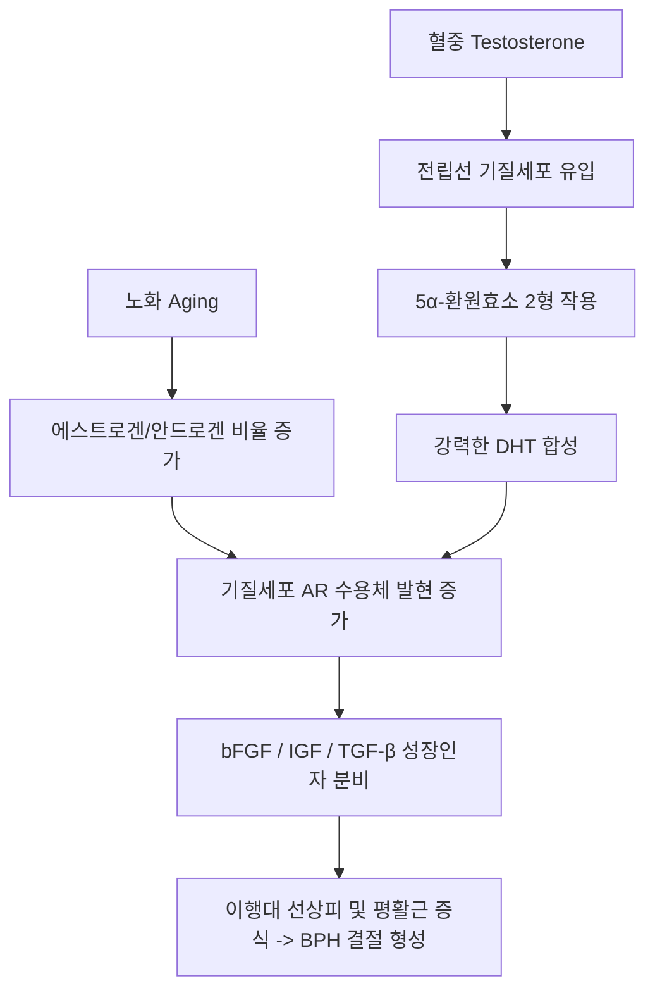
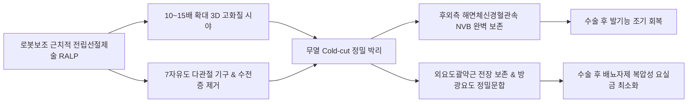

# 📑 [Netter Vol.1] Day 04: 정낭 및 전립선의 해부·발생·비대증·악성종양 및 수술학 (Section 4 완독)

> 📖 **원서 출처**: [The Netter Collection of Medical Illustrations - Volume 1, Reproductive System.pdf (pp. 76-97)](https://drive.google.com/file/d/1x-xTgPfUfiK7dsQyp5L5qfjFYSD_XyGm/view?usp=drivesdk)  
> 🏷️ **범위**: Section 4 전편 (Plate 4-1 ~ Plate 4-22, 총 22개 플레이트 전수 포함)  
> 📌 **핵심 테마**: McNeal 전립선 구역 해부학(TZ vs PZ), 배아 요로생식동 발생 및 DHT 의존성, 전립선염 NIH 4대 분류, 전립선비대증(BPH) 병태생리 및 약물·수술학(TURP/HoLEP), 전립선암(PCa) 조기진단(PSA/ISUP Grade Group), 골형성성(Osteoblastic) 뼈전이 기전(Batson 척추정맥총), 로봇보조 근치적 전립선절제술(RALP) 신경보존 기법

---

## 1. 개요 및 마스터 요약 (Executive Summary)

1. **맥닐(McNeal)의 전립선 구역 해부학 (Zonal Anatomy)**:
   - 과거의 엽(Lobe) 개념을 대체하여 병리학적·임상적 의의가 완전히 분리된 4대 구역으로 구성됩니다:
     - **말초대 (Peripheral Zone, PZ, 70%)**: 전립선 후외측을 감싸는 가장 넓은 부위. **전립선암(PCa)의 70~80%가 호발**하며, 직장수지검사(DRE)로 직접 촉진 가능.
     - **이행대 (Transition Zone, TZ, 5~10%)**: 근위부 전립선 요도를 양측에서 둘러싸는 부위. 노화에 따라 결절성 증식이 일어나 **전립선비대증(BPH)의 절대적 기원지**가 됨.
     - **중심대 (Central Zone, CZ, 25%)**: 사정관(Ejaculatory duct)을 둘러싸며 방광경부로 이어지는 역삼각형 부위. 볼프관 기원으로 암 발생률은 1~5% 미만.
     - **전방 섬유근간질 (Anterior Fibromuscular Stroma, AFS)**: 선 조직이 전무한 순수 비선성 평활근 및 결합조직 지지체.
2. **배아 발생 및 안드로겐 의존성**:
   - 전립선은 임신 10~12주경 **요로생식동(Urogenital sinus)의 내배엽(Endoderm)** 상피세포가 주변 간엽(Mesenchyme)으로 싹을 틔우며(Budding) 발생합니다.
   - 고환 Leydig 세포의 테스토스테론이 간엽 세포 내 **5α-환원효소 2형(5α-Reductase type 2)**에 의해 **디하이드로테스토스테론(DHT)**으로 전환되어야만 정상적인 전립선 분화 및 성장이 촉진됩니다.
3. **전립선비대증(BPH)의 2중 병태생리 및 약물 치료학**:
   - **정적 요소 (Static component)**: DHT 자극에 의한 상피 및 간질 세포 증식(부피 증가) $\rightarrow$ **5α-환원효소 억제제(Finasteride, Dutasteride)**로 DHT 합성 억제 및 전립선 크기 20~30% 감소 유도.
   - **동적 요소 (Dynamic component)**: 방광경부 및 전립선 기질 평활근의 $\alpha_{1A}$-아드레날린 수용체 긴장도 증가 $\rightarrow$ **$\alpha_1$-차단제(Tamsulosin, Silodosin, Alfuzosin)**로 평활근을 급속 이완시켜 요속 개선.
4. **전립선암(PCa)의 스크리닝, 병리 및 골전이 특이성**:
   - **PSA (전립선특이항원)**: 정상치 $< 4.0\text{ ng/mL}$. 회색지대($4\sim 10\text{ ng/mL}$)에서는 유리형 PSA 비율(Free/Total PSA ratio $< 15\%$ 시 암 위험 증가), PSA 밀도(PSAD $> 0.15$), PSA 속도(PSAV)로 감별 정밀도 향상.
   - **Gleason Score & ISUP Grade Groups (1~5군)**: 가장 우세한 패턴과 두 번째 우세한 패턴의 합 ($3+3$부터 $5+5$까지).
   - **골전이(Bone Metastasis)의 골형성성(Osteoblastic) 특징**: 암세포가 판막이 없는 **바트슨 척추정맥총(Batson's plexus)**을 통해 골반골과 요추로 역류 전이되며, ET-1 및 BMP를 분비하여 조골세포(Osteoblast)를 자극하므로 X선/뼈스캔상 경화성(Sclerotic) 백색 병변을 형성.
5. **외과적 접근 및 신경보존술(Nerve-Sparing RALP)**:
   - 전립선 피막 후외측을 주행하는 **발기신경(해면체신경, Cavernous nerve)**과 혈관속(Neurovascular bundle)을 정밀 보존하여 수술 후 발기부전(ED) 및 복압성 요실금을 최소화.

---

## 2. 정상 해부학, 발생학 및 외상·낭종 (Plates 4-1 ~ 4-4)

### Plate 4-1 | 전립선과 정낭 (Prostate and Seminal Vesicles)

![[Netter_V1_Plate4-1.png]]

#### 1) 전립선의 입체적 위치 및 구역 해부학 (McNeal Zonal Anatomy)
- **위치**: 방광저부(Bladder base) 바로 아래에 위치하며, 후면은 데농빌리에 근막(Denonvilliers' fascia)을 사이에 두고 직장 전벽과 접하고, 전면은 치골후강(Space of Retzius)에 면함.
- **정상 성인 전립선 용적**: 밤알 크기 (무게 약 20 g, 세로 3 cm, 가로 4 cm, 전후 2 cm).
- **맥닐의 4대 구역(Zonal Anatomy)**:
  1. **말초대 (Peripheral Zone, PZ)**: 전체 선조직의 **70%**. 전립선 후면과 외측면을 감싸며 직장수지검사(DRE) 시 직접 만져짐. **전립선암(70~80%)과 만성 전립선염의 주 호발지**.
  2. **이행대 (Transition Zone, TZ)**: 전체의 **5~10%**. 근위부 전립선 요도를 양측에서 감싸는 부위로, **전립선비대증(BPH) 결절이 100% 여기서 발생**하며 전립선암의 약 20% 발생.
  3. **중심대 (Central Zone, CZ)**: 전체의 **25%**. 방광경부에서 사정관 진입부를 감싸는 원추형 구역. 볼프관(Wolffian duct) 기원이며 암 발생률이 극히 낮음 ($< 5\%$).
  4. **전방 섬유근간질 (Anterior Fibromuscular Stroma, AFS)**: 전면의 1/3을 덮는 비선성 평활근·교원질 조직.
- **정낭 (Seminal Vesicles)**: 방광 후저부와 전립선 상부에 위치하는 한 쌍의 낭상 도관 장기. 과당(Fructose), 프로스타글란딘, 피브리노겐이 풍부한 알칼리성 정액액(전체 사정액의 60~70%)을 분비.

---

### Plate 4-2 | 전립선 발생 (Development of Prostate)

![[Netter_V1_Plate4-2.png]]

#### 1) 배아 발생 기전 및 상피-간엽 상호작용
- **태생 10~12주**: 원시 내배엽성 **요로생식동(Urogenital sinus)** 상피에서 5개의 별개 상피 분아(Epithelial buds)가 형성되어 주변 중배엽성 간엽(Mesenchyme)으로 함입 침투.
- **분아의 운명**:
  - 전/측방 분아 $\rightarrow$ 이행대 및 전방 구조 형성.
  - 후방 분아 $\rightarrow$ 말초대 형성.
  - 사정관 주위 상피 $\rightarrow$ 중심대 형성.
- **안드로겐과 5α-환원효소의 역할**:
  - 태아 고환 Leydig 세포에서 분비된 테스토스테론이 간엽 세포 내 **5α-환원효소 2형**에 의해 친화력이 5~10배 높은 **DHT(Dihydrotestosterone)**로 국소 변환.
  - DHT가 안드로겐 수용체(AR)에 결합하여 FGF-10, IGF-1, TGF-$\beta$ 등 측분비 성장인자를 분비시켜 선관(Ductal) 분기 및 선포(Acini) 분화를 완성.

---

### Plate 4-3 | 골반 및 전립선 손상 (Pelvic and Prostatic Trauma)

![[Netter_V1_Plate4-3.png]]

#### 1) 전립선-막부 요도 전단 손상 (Prostatomembranous Disruption)
- **손상 기전**: 교통사고나 추락에 의한 고에너지 골반 골절(Pelvic ring fracture, 말가이뉴 골절 등).
- **병태생리**: 전립선은 **치골전립선인대(Puboprostatic lig.)**에 의해 치골에 단단히 고정되어 있고, 막부 요도는 비뇨생식격막에 고정되어 있음. 골반환 파열 시 전립선이 상후방으로 전위되면서 그 경계부인 **막부 요도가 전단(Shearing)되어 완전히 단열**됨.
- **임상 징후 (전형적 3대 소견)**:
  1. 요도 외구의 혈액 유출 (Blood at urethral meatus).
  2. 치골상부 팽만 및 급성 요폐 (Urinary retention).
  3. **직장수지검사(DRE) 상 부유 전립선 (High-riding / Boggy prostate)**: 전립선이 골반혈종 위에 떠올라 정상 위치에서 만져지지 않음.
- **치료 금기 및 원칙**:
  - 요도 도뇨관(Foley catheter) 맹검 삽입은 부분 파열을 완전 파열로 악화시키므로 **절대 금기**.
  - 진단을 위해 즉시 **역행성 요도조영술(RGU)** 시행. 치골상부 방광루(Suprapubic cystostomy)로 요류 전환 후 지연성 요도재건술(Delayed urethroplasty) 시행.

---

### Plate 4-4 | 전립선 경색 및 낭종 (Prostatic Infarct and Cysts)

![[Netter_V1_Plate4-4.png]]

- **전립선 경색 (Prostatic Infarct)**:
  - 동맥경화가 있는 고령의 중증 BPH 환자에서 호발. 전립선 결절의 급격한 혈류 공급 불균형으로 허혈성 응고괴사 발생.
  - 급성 요폐, 육안적 혈뇨, 혈중 PSA의 일시적 급상승을 유발하여 전립선암으로 오인되기 쉬움.
- **전립선 낭종 (Prostatic Cysts)**:
  - **뮐러관 낭종 (Müllerian Duct Cyst)**: 발생기 부중신관 잔유물. 정중선에 위치하며 정상 사정관과는 교통하지 않음. 크기가 커지면 직장 및 방광경부 압박.
  - **전립선 소낭 낭종 (Utricle Cyst)**: 정구(Verumontanum) 중앙의 소낭 확장에 의해 발생. 요도하열 환아에서 높은 빈도로 동반.

---

## 3. 전립선 염증성 질환 (Plates 4-5 ~ 4-6)

### Plate 4-5 | 전립선염 (Prostatitis)

![[Netter_V1_Plate4-5.png]]

#### 1) 미국 국립보건원(NIH) 전립선염 4대 분류 체계
| 분류 (NIH Category) | 명칭 및 임상 특성 | 병인 및 요검사/분비액 소견 | 표준 치료 전략 |
| :--- | :--- | :--- | :--- |
| **Category I** | **급성 세균성 전립선염** (Acute Bacterial) | *E. coli*(80%), *Klebsiella*. 고열, 오한, 배뇨통, 농뇨. **DRE 시 극심한 압통 (마사지 절대 금기: 패혈증 위험)** | 입원 정맥 항생제 (Fluoroquinolone / Ampicillin + Gentamicin) |
| **Category II** | **만성 세균성 전립선염** (Chronic Bacterial) | 재발성 요로감염, EPS(전립선 마사지액) 내 백혈구 및 동일 균주 배양 양성 | 전립선 지질 피막 통과 우수한 Quinolone계 4~12주 장기 투여 |
| **Category IIIa** | **만성 골반통증 증후군 (염증성)** (CP/CPPS, Inflammatory) | 골반/회음부 만성 통증, 세균 배양 음성이나 **EPS 내 백혈구 증가** | $\alpha$-차단제, 소염진통제, 전립선 마사지, 항생제 시도 |
| **Category IIIb** | **만성 골반통증 증후군 (비염증성)** (CP/CPPS, Non-inflammatory) | 만성 골반통증, 세균 배양 음성 및 **EPS 내 백혈구 정상** | 신경통 조절제(Gabapentin), 물리치료, 바이오피드백 |
| **Category IV** | **무증상 염증성 전립선염** (Asymptomatic Inflammatory) | 임상 증상 전무, 불임 검사나 전립선 생검 시 우연히 발견된 백혈구 침윤 | 특별한 치료 불필요 |

---

### Plate 4-6 | 전립선 결핵 및 결석 (Prostatic Tuberculosis and Calculi)

![[Netter_V1_Plate4-6.png]]

- **전립선 결핵 (Tuberculosis of Prostate)**:
  - 신장 결핵균이 요류를 통해 전립선관으로 역류하여 침입. 건락성 괴사(Caseous necrosis)와 공동(Cavitation) 형성.
  - 직장수지검사 상 비대칭적이고 단단한 결절로 만져져 전립선암과 감별 필요. 항결핵제 4제 요법(HERZ) 적용.
- **전립선 결석 (Prostatic Calculi)**:
  - **진성/내인성 결석**: 전립선 선포 내 탈락 상피세포와 단백질 침전물인 **전립선소체(Corpora amylacea)**에 인산칼슘이 동심원상으로 침착되어 형성. 골반 X선 상 치골 결합 뒤 다발성 점상 석회화 관찰. BPH나 만성 전립선염과 흔히 동반.

---

## 4. 전립선비대증 (BPH) - 병리, 기전, 약물 및 합병증 (Plates 4-7 ~ 4-9)

### Plate 4-7 | 전립선비대증 I - 조직학 (Benign Prostatic Hyperplasia I: Histology)

![[Netter_V1_Plate4-7.png]]

#### 1) 병리조직학적 특징
- BPH는 세포의 단순 비대(Hypertrophy)가 아니라 세포 수가 증식하는 **진정한 과형성(Hyperplasia)**입니다.
- **이중 구성 성분**:
  1. **선상피세포 증식 (Glandular proliferation)**: 크고 작은 선강(Lumina) 내에 유두상 주름(Papillary infoldings)을 형성하는 2층 상피(원주 분비세포 + 기저세포). 기저세포층(Basal cell layer)이 온전히 유지되어 전립선암(기저세포 소실)과 명확히 구별됨.
  2. **간질 평활근 및 섬유세포 증식 (Stromal proliferation)**: 방추형 평활근 섬유속과 교원섬유의 결절성 증식.
- 선 성분과 기질 성분의 비율은 환자마다 다양하며, 기질 평활근 우세형 환자는 $\alpha$-차단제에 대한 반응이 탁월합니다.

---

### Plate 4-8 | 전립선비대증 II - 호발 부위 및 발생 원인 (Sites of Hyperplasia and Etiology)

![[Netter_V1_Plate4-8.png]]

#### 1) 발생 부위와 내분비 기전
- **호발 부위**: 100% 전립선 **이행대(Transition zone)** 및 요도주위선(Periurethral glands)에서 결절 형성 시작. 증식된 결절이 바깥쪽 말초대(PZ)를 압박하여 얇은 **외과적 피막(Surgical capsule)**을 형성함.
- **내분비 병인론 (DHT 가설)**:
  - 노화에 따른 고환 기능 변화에도 불구하고 전립선 내 **DHT 농도는 일정하게 높게 유지**됨.
  - 전립선 기질 세포의 **5α-환원효소(5α-Reductase)**에 의해 변환된 DHT가 안드로겐 수용체(AR)에 결합 $\rightarrow$ 세포사멸(Apoptosis) 억제 및 상피성장인자(EGF, bFGF) 전사 촉진.
  - 노화에 따른 에스트로겐/안드로겐 비율 상승도 기질 세포의 AR 발현을 상향 조절하여 BPH 발생을 가속화.

---

### Plate 4-9 | 전립선비대증 III - 합병증 및 약물 치료 (Complications and Medical Treatment)

![[Netter_V1_Plate4-9.png]]

#### 1) 하부요로폐색(BOO)의 진행 단계 및 합병증
1. **보상기 (Compensation)**: 요도 압박에 대항하여 방광 배뇨근(Detrusor m.)이 보상성 비후 형성 $\rightarrow$ 방광경 검사 상 방광벽에 밧줄 모양의 **육주 형성 (Trabeculation)** 및 주머니 모양의 방광 게실(Cellules & Diverticula) 발생.
2. **비보상기 (Decompensation)**: 배뇨근 탄력 소실 $\rightarrow$ 다량의 잔뇨(Post-void residue) 발생, 방광 요정체에 의한 요로감염 및 **방광 결석(Bladder calculi)** 형성.
3. **말기 폐색**: 만성 요폐 $\rightarrow$ 요관 방광 역류(VUR) $\rightarrow$ 양측 수뇨관증 및 **수신증(Hydronephrosis)** $\rightarrow$ 신후성 신부전(Postrenal renal failure).

#### 2) BPH의 2대 표준 약물 치료학
| 약제 계열 | 대표 약물 | 작용 기전 | 임상 효과 및 부작용 |
| :--- | :--- | :--- | :--- |
| **$\alpha_1$-아드레날린 수용체 차단제** | Tamsulosin, Silodosin, Alfuzosin | 전립선 간질 및 방광경부 평활근의 $\alpha_{1A}$ 수용체 차단 | **투여 즉시(수일 내) 요속 개선 및 배뇨 증상 완화**. 부작용: 기립성 저혈압, 역행성 사정, 비홍채이완증후군(IFIS) |
| **5$\alpha$-환원효소 억제제 (5-ARI)** | Finasteride (1형 억제), Dutasteride (1/2형 이중 억제) | 테스토스테론의 DHT 전환 차단 | **장기 복용(6개월 이상) 시 전립선 부피 20~30% 감소**, 급성 요폐 및 수술 위험 감소. **PSA 수치를 50% 위감소**시킴 (실제 수치는 2배 보정 필요). 부작용: 성욕 감퇴, 발기부전, 여성형 유방 |
| **병용 요법 (Combination)** | $\alpha$-차단제 + 5-ARI | 동적 폐색과 정적 폐색을 동시 타깃 | MTOPS 연구 입증: 단일제 대비 임상적 진행 및 급성 요폐 위험을 가장 강력하게 억제 |

---

## 5. 전립선 악성 종양 (Plates 4-10 ~ 4-13)

### Plate 4-10 | 전립선암 I - 역학, PSA, 병기 및 조직학적 등급 (Carcinoma of Prostate I: PSA, Staging, Grading)

![[Netter_V1_Plate4-10.png]]

#### 1) 스크리닝 도구 및 전립선특이항원 (PSA) 동역학
- **PSA 특성**: 전립선 선상피에서 분비되는 세린 단백분해효소(Serine protease)로 정상적으로 정액의 액화(Liquefaction)를 담당. 기저막 파괴 시 혈중으로 대량 유출.
- **임상적 판단 기준**:
  - 정상 참고치: $< 4.0\text{ ng/mL}$.
  - **진단 회색지대 ($4.0 \sim 10.0\text{ ng/mL}$)**:
    - **Free/Total PSA 비율**: 유리형 PSA 비율이 **$< 15\%$**이면 전립선암 위험 증가, $> 25\%$이면 BPH 가능성 높음.
    - **PSA 밀도 (PSAD)**: $\text{PSA} / \text{전립선 부피(mL)}$. **$> 0.15$**이면 생검 강력 권고.
    - **PSA 속도 (PSAV)**: 연간 상승 폭 $> 0.75\text{ ng/mL/year}$ 시 암 의심.

#### 2) 글리슨 점수(Gleason Score)와 ISUP 등급군(Grade Groups)
- 현미경 저배율에서 가장 우세한 선 분화 패턴(Primary pattern, 1~5점)과 두 번째 우세한 패턴(Secondary pattern, 1~5점)의 합으로 산출.
- **2014 ISUP 병리학적 등급군 (Grade Group 1~5)**:
  - **Grade Group 1**: Gleason Score $\le 6$ ($3+3$) $\rightarrow$ 예후 지극히 우수, 능동적 감시(Active surveillance) 대상.
  - **Grade Group 2**: Gleason Score $7$ ($3+4$) $\rightarrow$ 양호한 중등도 위험군.
  - **Grade Group 3**: Gleason Score $7$ ($4+3$) $\rightarrow$ 불량한 중등도 위험군 (Pattern 4가 과반수).
  - **Grade Group 4**: Gleason Score $8$ ($4+4, 3+5, 5+3$) $\rightarrow$ 고위험군.
  - **Grade Group 5**: Gleason Score $9\sim 10$ ($4+5, 5+4, 5+5$) $\rightarrow$ 최악의 고위험군, 미분화 판상 또는 중심부 괴사(Comedonecrosis).

---

### Plate 4-11 | 전립선암 II - 전이 경로 및 골형성성 뼈전이 (Carcinoma of Prostate II: Metastases)

![[Netter_V1_Plate4-11.png]]

#### 1) 전이 해부학 및 바트슨 정맥총 (Batson's Venous Plexus)
- **국소 침습**: 전립선 피막 천공 $\rightarrow$ 신경주위 공간(Perineural invasion)을 따라 데농빌리에 근막 돌파 $\rightarrow$ 정낭(Seminal vesicle) 침범 및 방광경부 침윤.
- **림프절 전이**: **폐쇄 림프절(Obturator nodes)** $\rightarrow$ 내장골 림프절 $\rightarrow$ 외장골 림프절 $\rightarrow$ 총장골 및 대동맥주위 림프절.
- **혈행성 뼈전이 (Bone Metastasis)의 독특한 기전**:
  - 전립선 정맥총은 판막이 없는 **바트슨 척추정맥총(Batson's valveless plexus)**과 직접 문합.
  - 기침, 배변 등으로 복압이 상승할 때 하대정맥을 거치지 않고 **골반골, 요추, 흉추, 늑골, 두개골로 암세포가 직접 역류성 파종**.
  - **골형성성 / 조골성 병변 (Osteoblastic / Sclerotic lesions)**: 유방암이나 폐암의 용해성(Osteolytic) 골전이와 달리, 전립선암 세포는 Endothelin-1(ET-1), BMP, Wnt 단백을 분비하여 **조골세포를 자극**하므로 단순 방사선 사진 및 뼈스캔(Bone Scan)에서 뼈가 비정상적으로 치밀하게 굳어 하얗게 보이는 경화성 병변을 형성함.

---

### Plate 4-12 | 전립선암 III - 진단, 치료 및 고식적 치료 (Diagnosis, Treatment, and Palliation)

![[Netter_V1_Plate4-12.png]]

#### 1) 병기별 표준 치료 프로토콜
- **저위험 국소 전립선암**: **능동적 감시 (Active Surveillance)** - 즉각적 수술 없이 주기적 PSA, DRE, 다중모수 MRI(mpMRI), 반복 생검으로 모니터링.
- **중등도/고위험 국소 전립선암**: **근치적 전립선절제술 (Radical Prostatectomy)** 또는 **근치적 방사선치료 (EBRT / Brachytherapy)** $\pm$ 단기 호르몬요법.
- **진행성 및 전이성 전립선암**: **남성호르몬 박탈요법 (Androgen Deprivation Therapy, ADT)**:
  - **GnRH 작용제 (Leuprolide, Goserelin)**: 뇌하수체 수용체 탈감작을 통해 고환 테스토스테론 생성을 거세 수준($< 50\text{ ng/dL}$)으로 차단. (초기 Flare-up 방지를 위해 항안드로겐제 병용).
  - **GnRH 길항제 (Degarelix, Relugolix)**: Flare 현상 없이 즉각적인 LH/T 억제.
  - **거세저항성 전립선암 (CRPC)**: 차세대 안드로겐 수용체 표적 치료제(Enzalutamide, Abiraterone) 및 백금/탁산계 항암화학요법(Docetaxel, Cabazitaxel) 적용.

---

### Plate 4-13 | 전립선 육종 (Sarcoma of Prostate)

![[Netter_V1_Plate4-13.png]]

- 전립선 악성종양의 1% 미만을 차지하는 비상피성 종양. 혈중 PSA는 정상.
- **횡문근육종 (Rhabdomyosarcoma, RMS)**: 소아·청소년에서 호발하는 배아형(Embryonal) 육종. 급속한 골반 내 종괴 팽창과 급성 요폐 유발. 화학요법(VAC 요법) 및 수술 복합 치료.
- **평활근육종 (Leiomyosarcoma)**: 성인에서 가장 흔한 육종. 국소 재발 및 조기 폐 전이율이 높음.

---

## 6. 전립선비대증 수술학 (Plates 4-14 ~ 4-17)

### Plate 4-14 | 양성 전립선 수술 I - 치골상식 전립선적출술 (Benign Prostate Surgery I: Suprapubic)

![[Netter_V1_Plate4-14.png]]

- **방광경유 치골상식 전립선적출술 (Suprapubic Transvesical Prostatectomy)**:
  - 하복부 정중절개 후 방광 전벽을 종절개하여 방광 내부로 진입.
  - 집도의의 시지로 비대된 선종과 외과적 피막(Surgical capsule) 사이의 박리층을 둔적 박리하여 선종을 한 덩어리로 핵출(Enucleation).
  - **적응증**: **전립선 크기가 매우 거대한 경우 ($> 80\sim 100\text{ g}$)**, 거대 방광 결석 또는 방광 게실이 동반되어 동시 절제가 필요한 경우.

---

### Plate 4-15 | 양성 전립선 수술 II - 치골후식 전립선적출술 (Benign Prostate Surgery II: Retropubic)

![[Netter_V1_Plate4-15.png]]

- **밀린 술식 (Millin's Retropubic Prostatectomy)**:
  - 방광을 절개하지 않고 치골후강(Space of Retzius)으로 직접 접근.
  - 전립선 피막 전벽을 횡절개하여 선종을 직접 시야 하에 핵출.
  - 선종과 외과적 피막 경계의 직시 하 지혈이 용이하여 방광경유 술식보다 수술 후 혈뇨와 방광 자극 증상이 적음.

---

### Plate 4-16 | 양성 전립선 수술 III - 회음식 전립선절제술 (Benign Prostate Surgery III: Perineal)

![[Netter_V1_Plate4-16.png]]

- 음낭과 항문 사이 역U자형 회음 절개를 통해 접근. 복벽 손상이 없어 비만이나 개복 수술 기왕력이 있는 환자에게 유리하나 직장 손상 위험과 술기 난이도로 현대에는 드물게 시행.

---

### Plate 4-17 | 양성 전립선 수술 IV - 경요도 전립선절제술 (Benign Prostate Surgery IV: Transurethral - TURP)

![[Netter_V1_Plate4-17.png]]

#### 1) 경요도 전립선절제술 (TURP) - BPH 수술의 표준 기준(Gold Standard)
- 요도내시경(Resectoscope)을 요도를 통해 삽입하여 고주파 루프 전극으로 요도를 폐색하는 비대된 이행대 선종 조직을 외과적 피막 경계까지 조각조각 절제(Chipping).
- **TURP 증후군 (TUR Syndrome)**:
  - 단극성(Monopolar) TURP 시행 시 시야 확보를 위해 비전해질 관류액(Glycine, Sorbitol)을 대량 사용.
  - 절제 중 개방된 전립선 정맥동을 통해 저삼투성 비전해질액이 체내로 대량 흡수되어 발생.
  - **병태생리**: 고혈량증(Hypervolemia) + **희석성 저나트륨혈증 (Dilutional Hyponatremia)**.
  - **증상**: 뇌부종(두통, 혼란, 경련, 혼수), 폐부종, 서맥, 고혈압.
  - **예방 및 최신 경향**: 생리식염수를 관류액으로 사용하는 **양극성(Bipolar) TURP** 및 홀뮴 레이저 전립선핵출술(**HoLEP**)의 도입으로 현대 비뇨의학과에서는 TUR 증후군 발생률이 극적으로 감소함.

---

## 7. 전립선암 근치 수술 및 정낭·정삭 수술학 (Plates 4-18 ~ 4-22)

### Plate 4-18 | 악성 전립선 수술 I - 치골후 근치적 전립선절제술 (Malignant Prostate Surgery I: Retropubic - RRP)

![[Netter_V1_Plate4-18.png]]

- 치골후강을 통해 전립선, 피막, 정낭을 한 덩어리로 절제하고 방광경부와 막부 요도를 단단 문합(Vesicourethral anastomosis).
- 전립선 피막 전면의 **산토리니 정맥총(Dorsal venous complex / Plexus of Santorini)**을 철저히 결찰하는 것이 수술 중 대량 출혈을 막는 핵심 술기.

---

### Plate 4-19 | 악성 전립선 수술 II - 회음식 근치적 전립선절제술 (Malignant Prostate Surgery II: Perineal)

![[Netter_V1_Plate4-19.png]]

- 회음부를 통한 근치적 전립선 및 정낭 적출. 방광경부 문합이 용이하나 골반 림프절 곽청술을 동시에 시행하기 위해 별도의 복부 절개가 필요하다는 한계가 있음.

---

### Plate 4-20 | 악성 전립선 수술 III - 복강경 및 로봇보조 근치적 전립선절제술 (Laparoscopic and Robotic Radical Prostatectomy - RALP)

![[Netter_V1_Plate4-20.png]]

#### 1) 다빈치(da Vinci) 로봇보조 근치적 전립선절제술 (RALP)의 혁신
- 현대 전립선암 수술의 절대적 표준으로 자리 잡음.
- **기술적 장점**: 10~15배 확대된 3차원 입체 시야, 7자유도의 다관절 로봇 기구, 수전증 필터링.
- **신경보존술 (Nerve-Sparing Technique)**:
  - 전립선 피막 외측의 근막면(Interfascial or Intrafascial plane)을 따라 전립선과 **해면체신경(발기신경) 혈관속(NVB)**을 무열(Cold-cut) 미세 박리.
  - 수술 후 **요실금 회복 기간을 대폭 단축**하고 **성기능(발기력) 보존율을 70~80%까지 획기적으로 향상**.

---

### Plate 4-21 | 정낭의 수술적 접근법 (Seminal Vesicle Surgical Approaches)

![[Netter_V1_Plate4-21.png]]

- **사정관 폐색증 (Ejaculatory Duct Obstruction, EDO)**:
  - 사정관의 선천성 또는 염증성 협착으로 인한 남성 불임 (무정자증/희소정자증, 사정량 격감 $< 1.0\text{ mL}$, 무과당증 Fructose 음성).
  - **경요도 사정관 절제술 (TURED)**: 요도내시경을 통해 정구(Verumontanum) 부위를 절제하여 개통성을 회복시키는 최소 침습적 수술.

---

### Plate 4-22 | 정삭의 기형 및 질환 (Anomalies of the Spermatic Cord)

![[Netter_V1_Plate4-22.png]]

- **선천성 양측 정관 무발생 (CBAVD, Congenital Bilateral Absence of Vas Deferens)**:
  - **낭포성 섬유증 유전자 (*CFTR*) 돌연변이**와 80~90% 연관.
  - 신체검사상 정관이 만져지지 않는 폐색성 무정자증(OA). 고환 실질 내 정자형성은 정상이므로 TESE 및 ICSI로 임신 가능.
- **정삭 지방종 (Lipoma of the Cord)**: 복막외 후복막 지방조직이 내서혜륜을 통해 정삭을 따라 탈출된 양성 종물로 서혜부 탈장과 감별 요함.
- **정삭 수종 (Hydrocele of the Cord)**: 초상돌기의 중간 부분만 폐쇄되지 않고 남아 정삭 주행을 따라 고정된 낭포성 종물 형성.
