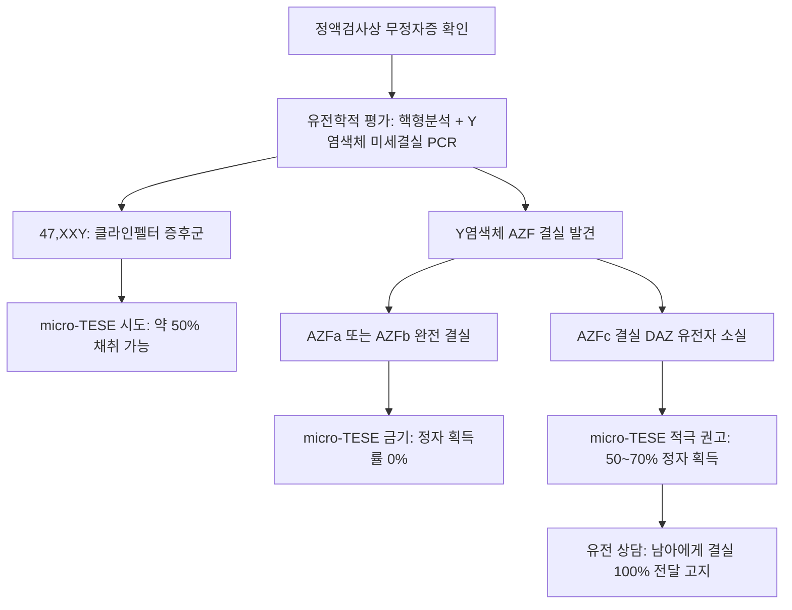

# 📑 [Netter Vol.1] Day 05: 정자와 사정 - 미세해부·정액분석·무정자증 및 남성불임 수술학 (Section 5 완독)

> 📖 **원서 출처**: [The Netter Collection of Medical Illustrations - Volume 1, Reproductive System.pdf (pp. 100-108)](https://drive.google.com/file/d/1x-xTgPfUfiK7dsQyp5L5qfjFYSD_XyGm/view?usp=drivesdk)  
> 🏷️ **범위**: Section 5 전편 (Plate 5-1 ~ Plate 5-9, 총 9개 플레이트 전수 포함)  
> 📌 **핵심 테마**: 정자 미세구조(첨체/미토콘드리아초/9+2 축사), WHO 6판 정액분석 및 크루거 엄격 기준(Kruger strict criteria), 무정자증 유전학(Y 염색체 미세결실 AZF a/b/c), 폐색성(OA) vs 비폐색성(NOA) 무정자증 감별 알고리즘, 남성생식 미세수술(MESA/micro-TESE, Vasoepididymostomy), 사정 생리(방출 Emission vs 사출 Ejaculation) 및 사정관 폐색(EDO/TURED)

---

## 1. 개요 및 마스터 요약 (Executive Summary)

1. **정자의 고도 분화 미세구조 (Microscopic Anatomy of Sperm)**:
   - **두부 (Head, 길이 $4\sim 5\,\mu\text{m}$)**: 고도로 응축된 반수체 부계 유전체(Protamine 치환 DNA)와 수정 시 난자 투명대(Zona pellucida) 관통을 위한 효소(Hyaluronidase, Acrosin) 주머니인 **첨체(Acrosome)**로 구성.
   - **경부 및 중편부 (Neck & Midpiece)**: 중심립(Centriole)과 운동성 편모 회전 에너지를 공급하는 나선형 **미토콘드리아 초(Mitochondrial sheath)** 집적.
   - **꼬리 (Principal & End piece)**: 전형적인 $9+2$ 미세소관 미세구조를 지닌 **축사(Axoneme)**와 섬유초(Fibrous sheath)로 구성되어 채찍 운동(Flagellar motility) 생성.
2. **정액분석의 표준화 (WHO Laboratory Manual Standards)**:
   - 최소 2~7일간의 금욕 후 검사하며 기술적·생물학적 변동성을 고려하여 최소 2회 반복 시행.
   - **핵심 기준치**: 사정액 용적 $\ge 1.5\text{ mL}$, 정자 농도 $\ge 15\times 10^6/\text{mL}$, 총 정자수 $\ge 39\times 10^6/\text{ejaculate}$, 전진 운동성(PR) $\ge 32\%$, 정상 형태(Strict criteria) $\ge 4\%$.
3. **무정자증(Azoospermia)의 양대 축 감별 (OA vs NOA)**:
   - **폐색성 무정자증 (Obstructive Azoospermia, OA, 40%)**: 고환 실질 내 정자형성은 정상이나 수송로 차단. **정상 고환 크기($\ge 18\sim 20\text{ mL}$), 정상 혈청 FSH 및 Inhibin B**. 부고환 종대, 정관 결손(CBAVD), 사정관 폐색 등이 원인.
   - **비폐색성 무정자증 (Non-obstructive Azoospermia, NOA, 60%)**: 고환 실질의 일차적 정자생성 부전. **작은 고환 크기, 혈청 FSH 현저한 상승, Inhibin B 감소**.
4. **남성불임의 핵심 유전학 (Genetics of Male Infertility)**:
   - **핵형 이상**: 클라인펠터 증후군(47,XXY)이 가장 흔함.
   - **Y 염색체 장완(Yq11) 미세결실 (AZF, Azoospermia Factor)**:
     - **AZFa 또는 AZFb 완전 결실**: 고환 생식세포가 전무(Sertoli-cell-only)하거나 감수분열 정지 $\rightarrow$ **micro-TESE 시행 시 정자 발견 확률 0% (수술적 채취 금기)**.
     - **AZFc 결실 (DAZ 유전자 포함)**: 가장 흔한 결실(80%). 국소 정자형성이 보존되어 있어 **micro-TESE 시 약 50~70%에서 정자 채취 성공**. (단, 남성 자손에게 결실 100% 유전).
   - **CBAVD와 *CFTR* 유전자**: 양측 정관 무발생 환자의 80% 이상에서 낭포성 섬유증 유전자 돌연변이 동반.
5. **사정의 신경생리학 및 사정 장애**:
   - **방출 (Emission)**: 교감신경(T10-L2, 하복신경) 매개로 정관, 정낭, 전립선 평활근이 수축하여 정액 성분을 전립선 요도로 전달하고 내요도괄약근(방광경부)을 폐쇄하여 역류 차단.
   - **사출 (Ejaculation)**: 체성신경(S2-S4, 음부신경) 매개로 망울해면체근과 좌골해면체근이 $0.8$초 간격으로 율동적 수축하여 정액을 외요도로 박출.
   - **역행성 사정(Retrograde ejaculation)**: 방광경부 폐쇄 부전으로 정액이 방광으로 역류 (사정 후 소변 침전물에서 다량의 정자 관찰).
   - **사정관 폐색(EDO)**: 저용적 무정자증($< 1.0\text{ mL}$), 산성 pH($< 7.0$), 무과당증(Fructose negative) $\rightarrow$ 경요도 사정관 절제술(TURED)로 완치 가능.

---

## 2. 정자 미세구조 및 정액분석학 (Plates 5-1 ~ 5-2)

### Plate 5-1 | 정자의 해부학 (Anatomy of a Sperm)

![[Netter_V1_Plate5-1.png]]

#### 1) 구획별 미세 구조와 생화학적 기능 (총 길이 약 $55\sim 60\,\mu\text{m}$)
1. **두부 (Head, $4.0\sim 5.0\,\mu\text{m} \times 2.5\sim 3.5\,\mu\text{m}$)**:
   - **핵 (Nucleus)**: 히스톤(Histone) 단백질이 아르기닌이 풍부한 **프로타민(Protamine)**으로 치환되어 유전체가 극도로 고밀도로 응축(Condensation). 전사 활성이 정지되고 외부 산화 스트레스로부터 부계 DNA 보호.
   - **첨체 (Acrosome)**: 골지체에서 기원한 캡 모양의 리소좀성 소포로 핵의 앞쪽 2/3을 모자처럼 덮음. 난자의 방사관(Corona radiata)과 투명대(Zona pellucida)를 용해하는 단백분해효소인 **아크로신(Acrosin)**과 **히알루로니다제(Hyaluronidase)** 함유. 첨체반응(Acrosome reaction)을 통해 난자 세포막과 융합.
2. **경부 (Neck / Connecting piece)**:
   - 근위 중심립(Proximal centriole)이 위치하여 수정란의 첫 분열 방추사 형성을 주도.
3. **중편부 (Midpiece, 길이 약 $5\sim 7\,\mu\text{m}$)**:
   - 중심부의 축사(Axoneme)를 11~14바퀴 나선형으로 촘촘히 감싸는 **미토콘드리아 초(Mitochondrial sheath)** 탑재.
   - 산화적 인산화를 통해 ATP를 지속 공급하여 꼬리의 편모 운동성(Motility)을 구동하는 파워하우스 역할.
4. **주편부 (Principal piece, 약 $45\,\mu\text{m}$) 및 종편부 (End piece, 약 $5\,\mu\text{m}$)**:
   - **축사 (Axoneme)**: 9쌍의 주변 미세소관 이중체와 1쌍의 중앙 미세소관으로 이루어진 전형적인 **$9+2$ 구조**.
   - 디네인 팔(Dynein arms)의 ATP 가수분해에 의한 미세소관 간 슬라이딩 운동으로 전진성 채찍질 파동 형성. 카르타게너 증후군(Kartagener syndrome) 등 원발성 섬모이상증에서는 디네인 팔 결손으로 정자 운동성이 전무(Asthenozoospermia)해짐.

---

### Plate 5-2 | 정액분석 및 정자 형태학 (Semen Analysis and Sperm Morphology)

![[Netter_V1_Plate5-2.png]]

#### 1) WHO 정액분석 표준 하한 기준치 (Lower Reference Limits)
| 검사 항목 (Parameter) | WHO 5판/6판 표준 하한치 (5th percentile) | 임상적 의의 |
| :--- | :--- | :--- |
| **사정액 용적 (Volume)** | $\ge 1.5\text{ mL}$ | $< 1.5\text{ mL}$ 시 사정관 폐색(EDO), 역행성 사정, CBAVD, 안드로겐 결핍 의심 |
| **정자 농도 (Concentration)** | $\ge 15 \times 10^6\text{ /mL}$ | $< 15 \times 10^6\text{ /mL}$: 희소정자증 (Oligozoospermia) |
| **총 정자수 (Total count)** | $\ge 39 \times 10^6\text{ /ejaculate}$ | 사정액 전체 내 총 정자 생존력 평가 |
| **총 운동성 (Total motility)** | $\ge 40\%$ (전진성 + 비전진성) | $< 40\%$: 무력정자증 (Asthenozoospermia) |
| **전진 운동성 (Progressive, PR)** | $\ge 32\%$ | 자궁경관 점액 돌파 및 난관 이동 능력 |
| **정상 형태율 (Normal morphology)** | $\ge 4\%$ (**Kruger strict criteria**) | $< 4\%$: 기형정자증 (Teratozoospermia) |
| **생존율 (Vitality)** | $\ge 58\%$ (호산성 염색 배제 검사) | 괴사정자증(Necrozoospermia)과 무력정자증 감별 |
| **산도 (pH)** | $\ge 7.2$ | 정낭액(알칼리성)과 전립선액(산성)의 비율 반영 |

#### 2) 크루거 엄격 기준(Kruger Strict Criteria)과 정자 기형학
- 엄격한 형태학적 평가에서 형태가 완벽하지 않은 경계성 정자는 모두 기형으로 분류.
- **두부 기형**: 거대두부(Macrocephaly, 다배수체 의심), 소두부(Microcephaly), 무첨체 원형두부증(**Globozoospermia** - 첨체 형성 부전으로 자연 수정 불가, ICSI 필수).
- **중편부 및 꼬리 기형**: 미토콘드리아 초 결손, 꺾인 목(Bent neck), 중복 꼬리, 코일형 꼬리.
- **OAT 증후군 (Oligoasthenoteratozoospermia)**: 정자 수, 운동성, 형태가 모두 기준치 이하로 복합 저하된 상태로 체외수정(IVF/ICSI)의 주 적응증.

---

## 3. 무정자증의 원인, 유전학 및 감별 (Plates 5-3 ~ 5-4)

### Plate 5-3 | 무정자증 I - 정자 생성 장애의 유전학 (Azoospermia I: Sperm Production Problems—Genetics)

![[Netter_V1_Plate5-3.png]]

#### 1) 비폐색성 무정자증(NOA)의 3대 유전학적 원인
1. **성염색체 수적 이상**:
   - **클라인펠터 증후군 (47, XXY)**: 남성 비폐색성 무정자증의 가장 흔한 유전 질환(10~15%). 고환 내 Leydig/Sertoli 세포 섬유화.
2. **Y 염색체 미세결실 (Y-Chromosome Microdeletion)**:
   - Y 염색체 장완(Yq11)의 **AZF (Azoospermia Factor)** 구역 결실로 발생. 특수 PCR(STS multiplex)로 진단.
   - **AZFa 결실**: *USP9Y, DDX3Y* 유전자 소실 $\rightarrow$ 완전한 Sertoli-cell-only 증후군 $\rightarrow$ **micro-TESE 정자 채취 불가 (0%)**.
   - **AZFb 결실**: *RBMY* 유전자군 소실 $\rightarrow$ 제1감수분열 정지(Maturation arrest) $\rightarrow$ **micro-TESE 정자 채취 불가 (0%)**.
   - **AZFc 결실**: *DAZ (Deleted in Azoospermia)* 유전자군 결실. 전체 AZF 결실의 80% 차지. 조직 내 불균일한 국소 정자형성이 보존되어 **micro-TESE 시 정자 회수율 약 50~70%**. (단, ICSI로 태어난 아들에게 결실이 100% 수직 유전됨).
3. **상염색체 이상**:
   - 로버트슨 전위(Robertsonian translocation), 상호 전위 등. 감수분열 이상으로 무정자증 및 습관성 유산 유발.

---

### Plate 5-4 | 무정자증 II - 정관 및 배출관 폐색 (Azoospermia II: Excurrent Duct Obstruction)

![[Netter_V1_Plate5-4.png]]

#### 1) 폐색성 무정자증(OA)의 해부학적 위치별 병인
- 고환 실질의 정자 생성은 완전히 정상이나 도관 체계의 폐색으로 정액 내 정자가 도달하지 못하는 병변:
  1. **고환내/고환망 폐색**: 외상, 감염 후 유착.
  2. **부고환 폐색 (Epididymal obstruction)**:
     - OA의 가장 흔한 원인. 임균성/클라미디아성 부고환염 후유증, 미세수술적 재건(Vasoepididymostomy)의 주 대상.
     - **영 증후군 (Young syndrome)**: 만성 부비동염, 기관지확장증, 끈적끈적한 점액전에 의한 부고환 폐색 (낭포성 섬유증과 유사하나 CFTR 정상).
  3. **정관 폐색 (Vas deferens obstruction)**:
     - **의원성(Iatrogenic)**: 피임 목적의 **정관절제술 (Vasectomy)**이 전 세계적으로 가장 흔함. 소아 서혜부 탈장 수술 중 우발적 정관 손상/절단.
  4. **선천성 양측 정관 무발생 (CBAVD)**:
     - *CFTR* 유전자 변이. 정관뿐 아니라 정낭 결손 및 사정관 형성 부전이 동반되어 저용적($< 1.0\text{ mL}$), 산성 정액 소견을 보임.

---

## 4. 미세수술, 진단 술기 및 정자 채취술 (Plates 5-5 ~ 5-7)

### Plate 5-5 | 무정자증 III - 남성생식 미세수술학 (Azoospermia III: Reproductive Microsurgery)

![[Netter_V1_Plate5-5.png]]

#### 1) 미세수술적 도관 재건술 (Microsurgical Reconstruction)
- 수술 현미경 하 15~25배 확대 시야, 9-0 또는 10-0 초미세 비흡수성 봉합사 사용:
1. **미세수술적 정관문합술 (Microsurgical Vasovasostomy, VV)**:
   - 정관절제술 복원술.
   - **변형 2층 문합술 (Modified 2-layer technique)**: 내강 점막(Mucosa)을 10-0 봉합사로 4~6바늘 정밀 문합하고, 외측 근육층 및 외막(Adventitia)을 9-0 봉합사로 문합하여 누출 없는 방수 문합(Water-tight seal) 달성. 개통률 90~95%.
2. **정관부고환문합술 (Vasoepididymostomy, VE)**:
   - 부고환 폐색 시 정관과 부고환 소관을 직접 연결하는 고난도 술식.
   - **종측 중첩 기법 (Longitudinal intussusception technique)**: 부고환 단일 세관($0.15\sim 0.2\text{ mm}$)에 2개의 10-0 봉합사를 평행하게 걸고 미세 절개 후 정관 내강 안으로 튜브를 밀어 넣듯 중첩 고정. 전통적 단단문합술보다 개통률(70~80%) 획기적 개선.

---

### Plate 5-6 | 무정자증 IV - 진단적 알고리즘 (Azoospermia IV: Diagnostic Procedures)

![[Netter_V1_Plate5-6.png]]

#### 1) OA와 NOA의 단계별 감별 진단 흐름
1. **원심분리 침사 검사 (Centrifuged Pellet Analysis)**:
   - 통상 정액검사에서 무정자증으로 보여도 $3,000\times g$에서 15분 원심분리 후 침사를 전수 검경 $\rightarrow$ 극소수의 정자가 발견되면 진성 무정자증이 아닌 **잠복정자증(Cryptospermia)**으로 분류되어 불필요한 고환 생검 회피.
2. **신체검사 및 내분비 평가**:
   - 고환 용적 측정 (Prader orchidometer): 정상 $\ge 18\sim 20\text{ mL}$ vs 위축 $< 15\text{ mL}$.
   - 정관 촉지: CBAVD 배제.
   - **혈청 FSH & Inhibin B**:
     - $\text{FSH} > 7.6\text{ mIU/mL}$ (정상의 2배 이상) 및 $\text{Inhibin B} \downarrow \rightarrow$ **NOA (비폐색성)** 시사.
     - $\text{FSH}$ 정상 및 $\text{Inhibin B}$ 정상 $\rightarrow$ **OA (폐색성)** 시사.
3. **정액 생화학 검사 (Semen Biochemistry)**:
   - 정액 용적 $< 1.0\text{ mL}$, 산성 $\text{pH} < 7.0$, **과당(Fructose) 음성** $\rightarrow$ 정낭액 유입 차단을 의미 (사정관 폐색 EDO 또는 CBAVD).

---

### Plate 5-7 | 치료적 정자 채취술 (Therapeutic Sperm Retrieval)

![[Netter_V1_Plate5-7.png]]

#### 1) 정자 채취 기법의 비교 및 적응증
| 술식 | 영문 약어 및 정식 명칭 | 목표 장기 및 침습도 | 주 적응증 | 특징 및 회수율 |
| :--- | :--- | :--- | :--- | :--- |
| **MESA** | Microsurgical Epididymal Sperm Aspiration | 부고환 / 미세수술 개복 | 폐색성 무정자증 (OA) | 수술 현미경 하 확장된 단일 부고환관을 절개하여 **적혈구 오염이 없는 고순도·고운동성 정자를 대량 획득**. 동결 보존 우수 |
| **PESA** | Percutaneous Epididymal Sperm Aspiration | 부고환 / 경피적 주사기 흡인 | 폐색성 무정자증 (OA) | 비절개 국소마취 시행 가능. 맹검 천자로 혈액 오염 가능성 및 섬유화 유발 |
| **TESE** | Testicular Sperm Extraction | 고환 / 통상 개복 생검 | 폐색성/비폐색성 무정자증 | 고환 백막을 절개하여 무작위 실질 조직 채취 |
| **micro-TESE** | Microsurgical Testicular Sperm Extraction | 고환 / **미세수술 현미경 탐색** | **비폐색성 무정자증 (NOA)의 표준** | 수술 현미경($15\sim 20\times$)으로 고환 실질 전체를 샅샅이 탐색하여 **불투명하고 굵게 팽창된 정자형성 정세관만 선별 채취**. 혈관 손상 최소화 및 정자 발견율 50~60% 극대화 |

---

## 5. 사정 장애 및 사정관 질환 (Plates 5-8 ~ 5-9)

### Plate 5-8 | 사정 장애 (Ejaculatory Disorders)

![[Netter_V1_Plate5-8.png]]

#### 1) 사정의 2단계 생리학
1. **방출기 (Emission - 교감신경 지배)**:
   - 흉요수 분절(T10-L2) $\rightarrow$ 하복신경(Hypogastric n.).
   - 부고환, 정관, 정낭, 전립선 평활근의 연동 수축 $\rightarrow$ 정액 성분이 전립선 후부 요도로 분출.
   - **내요도괄약근(방광경부)의 강력한 수축 폐쇄** $\rightarrow$ 정액이 방광으로 역류하는 것을 기계적으로 방지.
2. **사출기 (Ejaculation proper - 체성신경 지배)**:
   - 천수 분절(S2-S4) $\rightarrow$ 음부신경(Pudendal n.).
   - 외요도괄약근 이완과 동시에 **망울해면체근(Bulbospongiosus) 및 좌골해면체근의 율동적 간대성 수축**($0.8$초 주기, 5~8회) $\rightarrow$ 요도 내 높은 정수압 형성으로 외요도구로 정액 분사.

#### 2) 주요 사정 장애의 병태생리
- **역행성 사정 (Retrograde Ejaculation)**:
  - 오르가슴은 정상이나 정액 배출이 없거나 극소량(Dry ejaculation).
  - 원인: 전립선 수술(TURP 후 방광경부 절제), 당뇨병성 자율신경병증, $\alpha_1$-차단제(방광경부 평활근 이완), 후복막 림프절 곽청술(RPLND) 중 교감신경 손상.
  - 진단: 사정 직후 배뇨한 소변 원심분리 시 다량의 정자 및 과당 검출.
  - 치료: 교감신경 효능제(Pseudoephedrine, Imipramine) 투여로 방광경부 긴장도 회복 시도.
- **조루증 (Premature Ejaculation, PE)**:
  - 질 내 삽입 후 1~2분 이내 사정, 사정 지연 조절력 결여.
  - 중추신경계 세로토닌(5-HT) 신경전달 이상. 선택적 세로토닌 재흡수 억제제(SSRI, Dapoxetine) 또는 국소 마취 젤 적용.

---

### Plate 5-9 | 사정관 폐색증 (Ejaculatory Duct Obstruction, EDO)

![[Netter_V1_Plate5-9.png]]

#### 1) 사정관 폐색증(EDO)의 병리 및 완치적 내시경 수술
- **병인**:
  - 선천성: 정중선 낭종(**전립선 소낭 낭종 Utricle cyst**, 뮐러관 낭종)이 양측 사정관을 외인성 압박.
  - 후천성: 만성 전립선염 후 섬유성 반흔 협착, 사정관 결석(Calculi).
- **전형적 진단적 4대 징후**:
  1. **사정액 용적 격감**: $< 1.0\text{ mL}$ (심하면 무정액증).
  2. **정액 pH 산성화**: $\text{pH} < 7.0$ (알칼리성 정낭액 차단, 산성 전립선액만 배출).
  3. **무과당증 (Fructose negative)**: 정낭의 고유 분비물인 과당이 완전히 음성.
  4. **경직장 초음파 (TRUS) 소견**: 양측 정낭이 풍선처럼 거대하게 팽창($> 15\text{ mm}$) 및 확장된 사정관 관찰.
- **외과적 치료: 경요도 사정관 절제술 (TURED, Transurethral Resection of Ejaculatory Ducts)**:
  - 방광경을 통해 전립선 요도로 진입 $\rightarrow$ 정구(Verumontanum) 바로 외측의 사정관 개구 부위를 고주파 전기루프로 얇게 절제.
  - 낭종 또는 사정관이 개방되면서 갇혀 있던 백색 점조성 정액이 뿜어져 나오는 것을 확인.
  - **수술 후 효과**: 환자의 60~70%에서 정액 검사 정상화(정자 출현 및 운동성 회복) 및 30~40%의 자연 임신율 달성.
