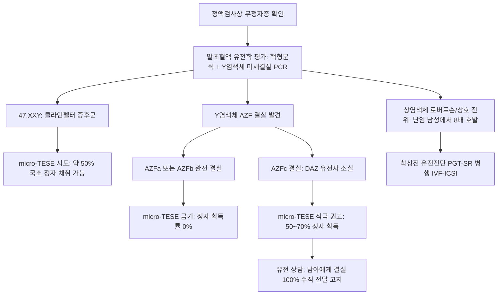

# 📑 [Netter Vol.1] Day 05: 정자와 사정 - 미세해부·정액분석·무정자증 및 남성불임 수술학 (Section 5 완독)

> 📖 **원서 출처**: [The Netter Collection of Medical Illustrations - Volume 1, Reproductive System.pdf (pp. 100-108)](https://drive.google.com/file/d/1x-xTgPfUfiK7dsQyp5L5qfjFYSD_XyGm/view?usp=drivesdk)  
> 🏷️ **범위**: Section 5 전편 (Plate 5-1 ~ Plate 5-9, 총 9개 플레이트 전수 포함)  
> 📌 **핵심 테마**: 정자 미세구조(첨체/미토콘드리아초/9+2 축사), WHO 6판 정액분석 및 크루거 엄격 기준(Kruger strict criteria), 무정자증 유전학(Y 염색체 미세결실 AZF a/b/c), 폐색성(OA) vs 비폐색성(NOA) 무정자증 감별 알고리즘, 남성생식 미세수술(MESA/micro-TESE, Vasoepididymostomy), 사정 생리(방출 Emission vs 사출 Ejaculation) 및 사정관 폐색(EDO/TURED)

---

## 1. 개요 및 마스터 요약 (Executive Summary)

1. **정자의 고도 분화 미세구조 및 발생 동역학 (Microscopic Anatomy & Spermatogenesis)**:
   - **생산율 및 발생 주기**: 성인 남성에서 초당 최대 1,200개($1,200/\text{sec}$)의 정자가 생성되며, 정자발생 전 과정은 약 60~80일 소요되어 정액검사는 2~3개월 전의 생물학적 영향을 반영.
   - **두부 (Head, 길이 $4.5\,\mu\text{m}$, 폭 $3.0\,\mu\text{m}$)**: 고도로 응축된 반수체 부계 유전체(Protamine 치환 DNA, 원래 핵 크기의 10%로 응축)와 수정 시 난자 투명대(Zona pellucida) 관통을 위한 가수분해 효소(Hyaluronidase, Acrosin) 주머니인 **첨체(Acrosome)**로 구성.
   - **경부 및 중편부 (Neck & Midpiece, 길이 $7\sim 8\,\mu\text{m}$)**: 근위 중심립(Centriole)과 75개의 미토콘드리아가 11~14바퀴 나선형으로 둘러싼 **미토콘드리아 초(Mitochondrial sheath)**, 비수축성 탄성 지지체인 **외측 농밀섬유(Outer dense fibers, ODFs)** 집적.
   - **꼬리 (Principal & End piece)**: 전형적인 $9+2$ 미세소관 미세구조를 지닌 **축사(Axoneme)**와 종렬 기둥 및 횡주 늑골로 이루어진 섬유초(Fibrous sheath)로 구성되어 채찍 운동(Flagellar motility) 생성.
2. **정액분석의 표준화 및 특수 평가 (WHO Laboratory Manual Standards)**:
   - 2~3일간의 성적 금욕 후 체온 유지 하에 운송하며 기술적·생물학적 변동성을 고려하여 최소 2회 반복 시행. 사정액은 5~30분 내 액화(Liquefaction)되어야 함.
   - **핵심 기준치**: 사정액 용적 $\ge 1.5\text{ mL}$, 정자 농도 $\ge 15\times 10^6/\text{mL}$ (고전 기준 $> 20\times 10^6/\text{mL}$), 총 정자수 $\ge 39\times 10^6/\text{ejaculate}$, 총 운동성 $\ge 40\%$, 전진 운동성(PR) $\ge 32\%$, 정상 형태(Strict criteria) $\ge 4\%$.
   - **형태학의 임상적 가치**: 엄격한 형태학적 정상 비율이 임신 예측의 가장 강력한 판별 인자(Discriminatory power)이며, 백혈구정액증, 항정자항체(Immunobead), 정자 염색체 FISH 검사가 보완적 역할 수행.
3. **무정자증(Azoospermia)의 양대 축 감별 (OA vs NOA)**:
   - **폐색성 무정자증 (Obstructive Azoospermia, OA, 40%)**: 고환 실질 내 정자형성은 정상이나 수송로 차단. **정상 고환 크기($\ge 18\sim 20\text{ mL}$), 정상 혈청 FSH 및 Inhibin B**. 특발성 폐색 부위는 부고환(65%), 정관(30%), 사정관(5%) 순.
   - **선천성 양측 정관 무발생 (CBAVD)**: 환자의 80%에서 *CFTR* 유전자 변이가 동반되며, **15%에서 신장 기형(특히 편측 신장 무발생)**이 동반되므로 신장 초음파 필수.
   - **비폐색성 무정자증 (Non-obstructive Azoospermia, NOA, 60%)**: 고환 실질의 일차적 정자생성 부전. **작은 위축성 고환, 혈청 FSH 현저한 상승, Inhibin B 감소**. 단일 생검은 30%만 검출하므로 다중 생검(Multibiopsy) 또는 FNA 고환 지도화(FNA Mapping)로 60% 이상 검출.
4. **남성불임의 핵심 유전학 (Genetics of Male Infertility)**:
   - **핵형 이상**: 클라인펠터 증후군(47,XXY)이 가장 흔하며, 상염색체 전위(특히 13, 14, 15, 21, 22번 관여 로버트슨 전위)는 난임 남성에서 8배 증가. XYY 증후군, 46,XX 남성 증후군 등 포함.
   - **Y 염색체 장완(Yq11) 미세결실 (AZF, Azoospermia Factor)**:
     - **AZFa 또는 AZFb 완전 결실**: 고환 생식세포가 전무(Sertoli-cell-only)하거나 감수분열 정지 $\rightarrow$ **micro-TESE 시행 시 정자 발견 확률 0% (수술적 채취 금기)**.
     - **AZFc 결실 (DAZ 유전자 포함)**: 가장 흔한 결실(80%). 국소 정자형성이 보존되어 있어 **micro-TESE 시 약 50~70%에서 정자 채취 성공**. (단, 남성 자손에게 결실 100% 유전).
5. **생식 미세수술 및 정자 채취술 (Microsurgery & Sperm Retrieval)**:
   - **정관문합술 (VV)**: 2층 또는 변형 1층 문합을 통해 95~99% 개통률 달성.
   - **정관부고환문합술 (VE)**: 정관 폐색 후 장기간 역압(Back-pressure)으로 부고환 세관(18피트 길이)에 파열(Blowout) 발생 시 시행. 종측 중첩술(Intussusception)로 60~80% 개통률.
   - **정자 채취술**: 정관 흡인 정자는 가장 성숙하여 IUI/IVF 가능. 부고환(MESA/PESA) 및 고환(TESE/micro-TESE) 정자는 ICSI 필수. micro-TESE 시 현미경 하 굵고 불투명한 백색 정세관을 선별 채취.
6. **사정의 신경생리학 및 사정 장애**:
   - **방출 (Emission)**: 교감신경(T10-L2, 하복신경총) 매개로 부고환, 정관, 정낭, 전립선 평활근이 수축하여 정액 성분을 전립선 요도로 전달하고 내요도괄약근(방광경부)을 폐쇄하여 역류 차단.
   - **사출 (Ejaculation proper)**: 체성신경(S2-S4, 음부신경) 매개로 망울해면체근과 좌골해면체근이 율동적 수축(약 1초 간격)하여 정액을 외요도로 박출. 오르가슴(대뇌 현상)과 독립된 재채기 유사 척수 반사(Spinal reflex).
   - **사정 장애 스펙트럼**: 무정액증(Aspermia, 건성 사정) vs 무정자증(Azoospermia) 감별. 역행성 사정(방광경부 부전) 및 사정불능증(Anejaculation; 음경 진동 자극 PVS, 직장 탐촉자 전기사정 RPEE 적용).
   - **사정관 폐색(EDO)**: 저용적 무정자증($< 1.0\text{ mL}$), 산성 pH($< 7.0$), 무과당증(Fructose negative). 색소주입술(Chromotubation) 및 내압측정술(Manometry, 개방압 $< 45\text{ cmH}_2\text{O}$ 정상)로 확진 후 경요도 사정관 절제술(TURED)로 근치.

---

## 2. 정자 미세구조 및 정액분석학 (Plates 5-1 ~ 5-2)

### Plate 5-1 | 정자의 해부학 (Anatomy of a Sperm)

![[Netter_V1_Plate5-1.png]]

#### 1) 정자발생과 분화 동역학 (Spermatogenesis & Spermiogenesis)
- **정자 생산 능력**: 건강한 성인 남성은 초당 최대 1,200개($1,200/\text{sec}$)에 달하는 막대한 양의 정자를 지속적으로 생산.
- **정자발생(Spermatogenesis)의 세포분열 과정**:
  1. **정원세포 유사분열**: 제B형 정원세포(Type B spermatogonia)가 체세포분열하여 2배체 제1정모세포(Primary spermatocyte, 2n)를 형성하고 간기(Interphase)에 DNA 복제 진행.
  2. **감수 제1분열**: 상동염색체가 분리되어 2개의 제2정모세포(Secondary spermatocytes, 2n) 형성.
  3. **감수 제2분열**: 동원체(Centromere)에서 염색분체가 분리되어 반수체 조기 원형 정세포(Early-round spermatids, n) 형성. 이론적으로 1개의 제1정모세포당 4개의 정세포가 생성되나, 감수분열의 복잡성으로 인한 생식세포 탈락(Germ cell loss)으로 실제 산출량은 이보다 적음.
- **정자완성과정(Spermiogenesis, 수 주 소요)**:
  - 세르톨리 세포(Sertoli cell) 내강에서 정세포가 고도로 특화된 정자로 탈바꿈하는 과정:
    1. **골지체(Golgi apparatus)**로부터 가수분해 효소를 담은 **첨체(Acrosome)** 형성.
    2. **중심립(Centriole)**으로부터 편모(Flagellum)의 골격인 축사(Axoneme) 신장.
    3. **미토콘드리아**가 중편부(Midpiece) 둘레로 나선형 재배열.
    4. 히스톤의 프로타민 치환을 통해 핵 부피가 원래 크기의 약 **10%로 극적 압축**.
    5. 세르톨리 세포가 잉여 세포질(Residual cytoplasm)을 완전히 벗겨내어 세포질이 거의 없는 유선형 정자로 세관 내강에 방출.

#### 2) 성숙 정자의 구획별 미세구조와 분자기전 (총 길이 약 $55\sim 60\,\mu\text{m}$)
1. **두부 (Head, $4.5\,\mu\text{m} \times 3.0\,\mu\text{m}$, 타원형)**:
   - **핵 (Nucleus)**: 염색질 단백질이 히스톤에서 아르기닌이 풍부한 **프로타민(Protamine)**으로 치환되어 유전체가 극도로 고밀도로 압축(Condensation). 전사 활성이 정지되고 외부 산화 스트레스로부터 부계 DNA 보호.
   - **첨체 (Acrosome)**: 핵의 앞쪽 2/3을 모자처럼 덮는 막성 소포로, 난자의 방사관(Corona radiata)과 투명대(Zona pellucida)를 용해 관통하는 효소인 **아크로신(Acrosin)**과 **히알루로니다제(Hyaluronidase)**를 함유. 첨체반응(Acrosome reaction)을 통해 난자 세포막과 융합.
2. **경부 (Neck / Connecting piece)**:
   - 두부와 꼬리를 연결하며 근위 중심립(Proximal centriole)이 위치하여 수정란의 첫 난할 방추사 형성을 주도. 축사 복합체(Axonemal complex)가 이곳에서 시작하여 꼬리 전체로 연장.
3. **중편부 (Midpiece, 길이 $7\sim 8\,\mu\text{m}$)**:
   - 말단 경계는 **윤상돌기(Annulus)**에 의해 주편부와 구분됨.
   - **외측 농밀섬유 (Outer Dense Fibers, ODFs)**: 이황화결합(Disulfide bonds)이 풍부한 비수축성 단백질 섬유로, 꼬리가 전진 운동(Progressive motility)을 생성하는 데 필요한 탄성 강도(Elastic rigidity) 제공.
   - **미토콘드리아 초 (Mitochondrial sheath)**: 약 **75개의 미토콘드리아**가 ODF를 11~14바퀴 나선형으로 촘촘히 둘러쌈. 내막의 5개 호흡사슬 복합체(Complex I: NADPH dehydrogenase, Complex II: Succinate dehydrogenase, Complex III: Cytochrome bc1, Complex IV: Cytochrome c oxidase, Complex V: ATP synthase)를 통해 산화적 인산화로 ATP를 공급하며, Cytochrome c 방출을 통한 세포사멸(Apoptosis) 유발 능력을 지님.
4. **주편부 (Principal piece, 약 $45\,\mu\text{m}$) 및 말단편 (End piece, 약 $5\,\mu\text{m}$)**:
   - **섬유초 (Fibrous sheath)**: 주편부에서 ODF를 대체하며, 종렬 기둥(Longitudinal columns)과 횡주 늑골(Transverse ribs)로 구성되어 편모 타격 평면을 가이드.
   - **축사 미세구조 (Axoneme, 200~300개 단백질 집합체)**: 전형적인 **$9+2$ 배열** (9쌍의 외측 미세소관 이중체 + 1쌍의 중앙 단일 미세소관).
     - **디네인 팔 (Dynein arms)**: 인접 미세소관 이중체로 뻗어 ATP 가수분해로 활주(Sliding) 운동 생성. **외측 팔 돌연변이(Outer arm mutant)는 운동성 저하(Reduced motility)**를 유발하고, **내측 팔 돌연변이(Inner arm mutant)는 완전한 무운동성(No motility)**을 초래. (카르타게너 증후군 등 원발섬모이상증의 병태생리).
     - **넥신 연결 (Nexin links)**: 외측 이중체들을 상호 연결하여 원통형 축사의 입체 형태 유지.
     - **텍틴 (Tektins)**: 외측 미세소관 이중체와 결합된 구조 단백질.
     - **방사선 살 (Radial spokes)**: 각 외측 이중체에서 중앙 단일관 쌍으로 뻗어 형태적 지지 및 신호 전달.
5. **원형질막 (Plasma membrane)**:
   - 말단편을 제외한 정자 전신을 감싸며 경막 이온 및 분자 이동을 조절. 두부 표면 막에는 수정 시 난자-정자 상호작용에 관여하는 특화 수용체 단백질 집적.

---

### Plate 5-2 | 정액분석 및 정자 형태학 (Semen Analysis and Sperm Morphology)

![[Netter_V1_Plate5-2.png]]

#### 1) 정액분석 검사 프로토콜 및 생리학적 동역학
- **검체 채취 지침**:
  - **2~3일간의 성적 금욕(Abstinence)** 후 채취. 윤활제 사용 금지(살정자 효과 방지).
  - 운송 중 반드시 **체온($37^\circ\text{C}$)** 유지.
  - 정액 질의 생물학적 변동성이 극심하므로 최소 2~3주 간격으로 **최소 2회 이상** 반복 시행.
- **물리적 성상 변화**:
  - 정상 사정 직후 정액은 젤 형태의 응고체(Coagulum)를 형성하며, 전립선 특이항원(PSA) 등 단백분해효소에 의해 **5~30분 이내에 완전 액화(Liquefaction)**되어야 함.
  - 액화 후 점도(Viscosity)를 평가하며 가닥 형성(Stranding)이 없어야 정상.
- **정자형성 주기와 임상적 시간차 (Kinetics)**:
  - 인간의 정자형성은 시작부터 사출까지 **60~80일(약 2~3개월)**이 소요됨.
  - 따라서 단일 정액검사 결과는 검사 시점 기준 **2~3개월 전의 생물학적 영향(고열, 독소 노출, 감염, 약물 복용 등)**을 반영함.
  - 내과적·외과적 치료(정계정맥류 절제술, 호르몬 요법 등) 후 정액 지표의 개선 여부도 최소 3~6개월 후에 평가해야 함.
- **정자발생 파동 (Spermatogenic Waves)**:
  - 인간의 정세관 상피 내 정자발생 주기는 **나선형/헬리컬(Spiral/helical) 세포 배열**을 이루고 있어, 정자 생산이 설치류와 같이 박동성(Pulsatile)이 아닌 **연속적이고 일정한(Continuous) 과정**으로 유지됨.

#### 2) WHO 정액분석 표준 하한 기준치 (Lower Reference Limits)
| 검사 항목 (Parameter) | WHO 최신 기준치 (5th percentile) | 고전 기준치 | 임상적 의의 및 병태생리 |
| :--- | :--- | :--- | :--- |
| **사정액 용적 (Volume)** | $\ge 1.5\text{ mL}$ | $\ge 2.0\text{ mL}$ | 질 내 산도 완충 작용. $< 1.5\text{ mL}$ 시 사정관 폐색(EDO), 역행성 사정, CBAVD, 안드로겐 결핍 또는 검체 수거 오류 의심 |
| **정자 농도 (Concentration)** | $\ge 15 \times 10^6\text{ /mL}$ | $> 20 \times 10^6\text{ /mL}$ | $< 15 \times 10^6\text{ /mL}$: **희소정자증 (Oligozoospermia)**. 약물, 독소, 정계정맥류, 내분비 장애, 유전 질환 |
| **총 정자수 (Total count)** | $\ge 39 \times 10^6\text{ /ejaculate}$ | $\ge 40 \times 10^6\text{ /ejaculate}$ | 1회 사정액 전체의 정자 생산능 총량 |
| **총 운동성 (Total motility)** | $\ge 40\%$ | $\ge 50\%$ | 전진성 + 비전진성 운동 정자 비율 |
| **전진 운동성 (Progressive, PR)** | $\ge 32\%$ | $\ge 25\%$ (Grade a) | 자궁경관 점액 돌파 및 난관 수송 능력. 저하 시 **무력정자증 (Asthenozoospermia)** |
| **정상 형태율 (Normal morphology)** | $\ge 4\%$ (**Kruger strict criteria**) | $\ge 14\sim 30\%$ | 가임력 판별의 가장 강력한 지표. $< 4\%$: **기형정자증 (Teratozoospermia)** |
| **생존율 (Vitality)** | $\ge 58\%$ (호산성 염색 배제 검사) | $\ge 75\%$ | 괴사정자증(Necrozoospermia)과 무력정자증 감별 |
| **산도 (pH)** | $\ge 7.2$ | $7.2\sim 8.0$ | 정낭액(알칼리성)과 전립선액(산성)의 비율 반영. $< 7.0$ 시 사정관 폐색 또는 CBAVD 시사 |

#### 3) 정자 형태학과 특수 정액 검사 (Specialized Semen Assays)
- **크루거 엄격 기준 (Kruger Strict Criteria)**:
  - 인간 난자의 투명대 결합 능력을 반영하여 완벽한 형태를 갖추지 못한 경계성(Borderline) 정자는 모두 기형으로 판정.
  - **두부 기형**: 거대두부(Macrocephaly, 다배수체 염색체 의심), 소두부(Microcephaly), 무첨체 원형두부증(**Globozoospermia** - 첨체 형성 부전으로 자연 수정 불가, ICSI 필수).
  - **중편부 및 꼬리 기형**: 미토콘드리아 초 결손, 꺾인 목(Bent neck), 중복 꼬리, 코일형 꼬리.
  - **OAT 증후군 (Oligoasthenoteratozoospermia)**: 정자수, 운동성, 형태가 모두 기준치 이하로 복합 저하된 상태로 체외수정(IVF-ICSI)의 대표적 적응증.
- **정액 미세환경 및 정자 유전 특수 검사**:
  1. **백혈구정액증 (Leukocytospermia) 검사**: 과산화효소(Peroxidase) 염색 등을 통해 백혈구 수치를 평가($> 1.0\times 10^6/\text{mL}$). 활성산소종(ROS) 과다 생성에 의한 산화 스트레스 및 정자 DNA 손상 지표.
  2. **항정자항체 검사 (Antisperm Antibody Test - Immunobead Method)**: 정자 표면에 결합된 면역글로불린(IgG, IgA)을 비드 결합 방식으로 검출. 자궁경관 점액 통과 차단 및 난자-정자 융합 장애 유발.
  3. **정자 염색체 FISH 검사 (Fluorescence In Situ Hybridization)**: 형광 소식자를 이용하여 정자 반수체 핵 내 성염색체 및 상염색체의 이수성(Aneuploidy) 및 이배체(Diploidy) 빈도를 직접 평가.

---

## 3. 무정자증의 원인, 유전학 및 감별 (Plates 5-3 ~ 5-4)

### Plate 5-3 | 무정자증 I - 정자 생성 장애의 유전학 (Azoospermia I: Sperm Production Problems—Genetics)

![[Netter_V1_Plate5-3.png]]

#### 1) 남성 난임의 유전적 결함 4대 분류 (Genetic Defect Categories)
1. **단일 유전자 점돌연변이 (Point Mutations)**: 멘델 유전 법칙을 따르는 단일 유전자 결함 (예: *CFTR*, 안드로겐 수용체 유전자 등).
2. **염색체 질환 (Chromosomal Disorders)**:
   - **구조적 이상**: 염색체 분절의 결실(Deletion), 중복(Duplication), 역위(Inversion), 균형 전위(Balanced translocation).
   - **수적 이상**: 염색체의 추가 또는 결손(예: 47,XXY 클라인펠터 증후군, 47,XYY 증후군).
3. **다인자성 / 복합 유전 결함 (Polygenic / Multifactorial)**: 대다수 인간 생물학적 질환 및 특발성 정자형성 부전을 차지.
4. **미토콘드리아 질환 (Mitochondrial Disorders)**: 세포질 내 미토콘드리아 비염색체성 DNA 돌연변이로 산화적 인산화 장애 및 무력정자증 유발.
- *유전체학적 전망*: 부고환 내 정자 운동성 획득 과정에만 200~300개 유전자가 관여하므로, 향후 무력정자증에 대한 유전체 진단 패널이 표준화될 예정.

#### 2) 비폐색성 무정자증(NOA)의 주요 유전학적 원인
- 무정자증 환자의 10~15%, 중증 희소정자증 환자의 2~7%에서 염색체 이상이 발견됨. (적응증: 작은 위축성 고환, 혈청 FSH 상승, 무정자증/중증 희소정자증).
1. **성염색체 수적 이상**:
   - **클라인펠터 증후군 (47, XXY)**: 남성 비폐색성 무정자증의 가장 흔한 유전 질환(전체 난임 남성의 10~15%). 사춘기 후 Leydig/Sertoli 세포의 초자화(Hyalinization) 및 섬유화 진행. micro-TESE 시 약 50%에서 정자 획득 가능.
   - **47, XYY 증후군**: 큰 키(Tall stature), 경도 지능 저하, 백혈병 발병 위험 증가, 공격적/반사회적 행동 성향과 연관되며 희소정자증 또는 무정자증 유발.
   - **기타**: 46,XX 남성 증후군(SRY 상호전위), 혼합 생식샘 발생이상(Mixed gonadal dysgenesis).
2. **상염색체 구조적 이상**:
   - **역위 (Inversion)**: 염색체 내 2개 절단 부위 사이의 유전물질이 $180^\circ$ 회전 결합하여 유전자를 파괴하거나 감수분열기 상동염색체 대합(Pairing)을 방해.
   - **전위 (Translocation)**: 상호 전위(Reciprocal) 및 **로버트슨 전위(Robertsonian translocation, 13, 14, 15, 21, 22번 말단동원체형 염색체 관여)**는 **난임 남성에서 정상인 대비 8배 빈번하게 검출**되며, 감수분열 장애로 무정자증 및 습관성 유산 초래.
3. **Y 염색체 미세결실 (Y-Chromosome Microdeletions, AZF)**:
   - Y 염색체 장완(Yq11)의 **AZF (Azoospermia Factor)** 구역 결실로 발생 (1976년 Tiepolo & Zuffardi 제창). 말초혈액 림프구 다중 PCR(Multiplex STS-PCR)로 진단.
   - 무정자증 남성의 15%, 희소정자증 남성의 7%에서 관찰.
   - **AZFa 결실**: *USP9Y, DDX3Y* 유전자 결손 $\rightarrow$ 완전한 세르톨리 세포 전용 증후군(Sertoli-cell-only syndrome) $\rightarrow$ **micro-TESE 정자 획득률 0% (수술 금기)**.
   - **AZFb 결실 (P5/proximal-P1)**: *RBMY* 유전자군 결손 $\rightarrow$ 제1감수분열 정지(Maturation arrest) $\rightarrow$ **micro-TESE 정자 획득률 0% (수술 금기)**.
   - **AZFc 결실 (b2/b4)**: *DAZ (Deleted in Azoospermia)* 유전자군 결손. 전체 결실의 80% 차지. 고환 내 국소적 정자형성이 보존되어 **micro-TESE 시 정자 회수율 50~70%**. (단, ICSI로 출생하는 남아에게 결실 100% 수직 유전 고지 필수).
4. **기타 전신 유전 질환군**:
   - 근긴장 디스트로피(Myotonic dystrophy), 누난 증후군(Noonan), 낫적혈구 빈혈(Sickle cell anemia), 선천 부신 과다형성(CAH), 칼만 증후군(Kallmann), 프라더-윌리 증후군(Prader-Willi), 케네디병(Kennedy disease - SBMA).

---

### Plate 5-4 | 무정자증 II - 정관 및 배출관 폐색 (Azoospermia II: Excurrent Duct Obstruction)

![[Netter_V1_Plate5-4.png]]

#### 1) 폐색성 무정자증(OA)의 병인 및 해부학적 분포
- 고환 실질의 정자 생성은 완전히 정상이나 도관 체계의 폐색으로 정액 내 정자가 도달하지 못하는 병변.
- **특발성 폐색의 해부학적 발생 부위 빈도**:
  - **부고환 폐색 (Epididymis)**: **65%** (가장 흔함).
  - **정관 폐색 (Vas deferens)**: **30%**.
  - **사정관 폐색 (Ejaculatory duct)**: **5%**.
  - *고환내 수출소관 폐색(Testis efferent ductules)*: 극히 드묾.

#### 2) 선천성 및 후천성 폐색 질환군
1. **선천성 양측 정관 무발생 (CBAVD) 및 낭포성 섬유증 (Cystic Fibrosis, CF)**:
   - CF는 미국에서 가장 흔한 치명적 상염색체 열성 질환. 중신관(Wolffian duct) 발생 부전으로 부고환, 정관, 정낭, 사정관의 형성 부전/결손 초래.
   - **CAVD (CF의 불완전형 Forme fruste)**: 남성 난임의 1~2% 차지. 진찰상 양측 또는 편측 정관이 촉지되지 않음.
   - **유전 및 신장 기형**: 환자의 **80% 이상에서 *CFTR* 유전자 돌연변이**가 검출됨. 특히 **15%에서 신장 기형(가장 흔하게 편측 신장 무발생 Unilateral renal agenesis)이 동반되므로 신장 초음파 검사 필수**.
   - 미세수술 재건 불가 $\rightarrow$ 부고환/고환 정자 채취(MESA/TESE) + IVF-ICSI 시행.
2. **특발성 부고환 폐색 (Idiopathic Epididymal Obstruction)**:
   - 과거의 불현성 감염 또는 *CFTR* 유전자 변이와 연관(환자의 **1/3에서 CF 유전자 변이** 검출). 미세수술적 재건(VE) 대상.
3. **영 증후군 (Young Syndrome)**:
   - **만성 부비동염, 기관지확장증, 폐색성 무정자증의 3징후**.
   - 섬모 기능 이상 또는 점액 성상 이상으로 끈적끈적한 분비물 응고(Fluid concretion)가 미세 부고환관을 폐색. 고환 정자형성은 정상이므로 미세수술 재건(VE) 가능.
4. **성인형 상염색체 우성 다낭신 (ADPKD)**:
   - 신장, 간, 비장, 췌장뿐 아니라 **부고환, 정낭, 고환에 다발성 낭종** 형성. 20~30대에 측복부 통증, 고혈압, 신부전으로 발현하며 낭종의 기계적 압박에 의한 관폐색 초래.
5. **의원성 및 감염성 정관 폐색 (Acquired Obstruction)**:
   - **정관절제술 (Vasectomy)**: 후천성 폐색의 가장 흔한 원인(미국 매년 100만~300만 건 시행, 약 5%가 재혼 등으로 복원 희망).
   - **서혜부 탈장 수술 (Inguinal hernia repair)**: 소아 서혜부 탈장 수술 시 우발적 손상, 성인 탈장 교정 시 **말렉스 인공망(Marlex mesh) 사용에 따른 정관 주위 만성 염증 반흔**으로 정관 폐색 유발.
   - **감염성 반흔**: 35세 미만 *Chlamydia trachomatis*, 35세 이상 *E. coli*, 결핵(*Mycobacterium tuberculosis*) 감염 후 부고환/정관 폐색.

---

## 4. 미세수술, 진단 술기 및 정자 채취술 (Plates 5-5 ~ 5-7)

### Plate 5-5 | 무정자증 III - 남성생식 미세수술학 (Azoospermia III: Reproductive Microsurgery)

![[Netter_V1_Plate5-5.png]]

#### 1) 생식 미세수술의 원칙과 역사적 발전
- **임상적 가치**: 보조생식술(IVF-ICSI) 대비 우수한 비용 효과성(Cost-effectiveness)을 지니며, 병변 자체를 교정하여 부부가 병원이 아닌 **가정 내에서 자연 임신(Conception at home)**을 가능케 함.
- **미세수술의 3대 발전 축**:
  1. 수술 현미경에 의한 **광학적 확대(Optical magnification, $15\sim 25\times$)**.
  2. 초미세 비흡수성 봉합사(9-0, 10-0 나일론) 및 정밀 미세바늘 개발.
  3. 초정밀 미세수술 기구 제작 (초기 보석상 핀셋 Jeweler's forceps과 인간 머리카락 봉합사에서 발전).
- **수술 적응증 환자 프로파일**: 정상 혈청 FSH 및 테스토스테론, 정상 크기의 고환을 가진 폐색성 무정자증 환자.

#### 2) 미세수술적 도관 재건술식 (Reconstructive Procedures)
1. **미세수술적 정관문합술 (Microsurgical Vasovasostomy, VV)**:
   - 정관절제술 복원술의 표준.
   - **술식 비교**: 엄격한 2층 문합술(Strict two-layer: 점막층 10-0, 근육층 9-0)과 변형 단층 문합술(Modified single-layer) 모두 숙련된 술자 집도 시 동등하게 우수한 성적 달성.
   - **개통률**: 숙련의 집도 시 **95~99%에서 사정액 내 정자 재출현**.
2. **정관부고환문합술 (Vasoepididymostomy, VE)**:
   - **병태생리 (부고환 파열 Blowout)**: 정관절제술 후 시간이 오래 경과할수록 폐색부 근위부의 '역압(Back-pressure)'이 증가하여, 총 길이 **18피트(약 5.5~6m)**에 달하는 미세 부고환 세관의 약한 부위가 터져 외상성 파열(Blowout) 및 섬유화 차단이 발생. 고환측 정관액에서 정자가 전혀 없을 때 파열부 상부와 연결하는 VE 필수.
   - **술식 1: 점막-점막 단측문합술 (Mucosa-to-mucosa end-to-side)**: 부고환 단일 세관과 정관 점막을 4~6개의 10-0 봉합사로 방사상 문합(내층) 후 외막을 9-0으로 보강.
   - **술식 2: 함입법 (Invagination / Longitudinal Intussusception)**: 부고환 세관 개구부 주위에 1~3개의 '조끼(Vest)' 10-0 봉합사를 평행하게 걸고 정관 내강 속으로 부고환 세관을 쏙 집어넣어(함입) 고정. 문합 속도가 빠르고 방수 밀폐(Water-tight seal)가 우수.
   - **개통률**: 수술 후 **60~80%에서 사정액 내 정자 출현**.
3. **특발성 폐색 시 진단적 정관조영술 (Vasography)**:
   - 음낭 정관을 천자 또는 부분 절개(Hemitransection)한 후 희석 조영제를 방광 방향으로 주입하여 방사선 투시 하에 원위부 정관, 정낭, 사정관 개통성을 검증. 동시에 고환측 정관액을 흡인 도말하여 정자가 없으면 부고환 폐색으로 확진하고 즉시 VE로 전환. 검사 후 정관 절개창은 미세 봉합 폐쇄.

---

### Plate 5-6 | 무정자증 IV - 진단적 알고리즘 (Azoospermia IV: Diagnostic Procedures)

![[Netter_V1_Plate5-6.png]]

#### 1) 고환 조직 생검과 정자형성능 직접 평가 (Testis Biopsy)
- **목적**: 정자형성 부전(NOA)과 배출관 폐색(OA)을 최종 감별하고 고환 내 성숙 정자 존재 유무를 확인.
- **술기**: 국소마취 하 음낭 및 고환 백막(Tunica albuginea)을 소절개하여 실질 쐐기 조직을 채취(Open wedge biopsy)하거나, 전립선 생검총과 유사한 경피적 생검총(Percutaneous biopsy gun) 사용.
- **적응증 원칙**:
  - 희소정자증(Oligospermia) 환자에서는 부분적 도관 폐색이 극히 드물므로 **고환 생검의 적응증이 아님**.
  - 대칭 고환에서는 편측 생검으로 충분하나, 양측 고환 크기나 성상이 비대칭인 경우 **양측 생검** 시행.
- **상피내 생식세포종양 (ITGCN / Carcinoma in situ) 검출**:
  - 생검 조직 검경을 통해 전암 병변인 ITGCN 확인 가능. 반대측 고환암 병력이 있는 환자의 5%에서 동반되며, 정상 가임 남성보다 난임 남성에서 호발.

#### 2) 국소 정자형성과 고환 지도화 (Patchy Spermatogenesis & FNA Mapping)
- **단일 고환 생검의 한계 (Sampling Error)**:
  - NOA 환자라 할지라도 고환 실질 전체가 균일하게 황폐화된 것이 아니라, **국소적·반점성(Patchy / Focal)**으로 성숙 정자를 생산하는 정세관 아일랜드가 잔존함.
  - 따라서 단순 단일 고환 생검 시 NOA 환자의 **30%에서만 정자가 검출**되는 심각한 표본오차가 발생.
- **다중 생검법 (Multibiopsy Approach)**:
  - 고환의 서로 다른 부위에서 4~6개의 조직을 분산 채취하여 표본오차를 줄이고 정자 검출률을 **60% 이상**으로 향상.
- **경피적 미세침흡인 고환 지도화 (Percutaneous FNA Testis Mapping)**:
  - **원리**: 국소마취 하에 미세 침으로 세포 조각을 흡인하여 조직학적이 아닌 **세포학적(Cytological)**으로 분석하는 최소 침습 진단법. 향후 침습적 TESE 수술의 정밀한 좌표를 제공.
  - **고환 랩 (Testicular Wrap)**: 음낭 피부와 고환을 후방에서 거즈로 팽팽하게 감싸쥐어 조작 핸들 역할을 부여하고 시술 중 음낭 피부의 유동을 고정.
  - **격자 템플릿**: 음낭 피부 위에 5 mm 간격의 템플릿 격자를 표시 (도관 폐색 확인 시 고환당 4곳, NOA 정밀 지도화 시 고환당 15곳 천자).
  - **흡인 및 염색**: 날카로운 사면의 소구경 바늘을 이용한 흡인-절제(Suction-cutting) 기법 $\rightarrow$ 슬라이드 도말 후 95% 에탄올 고정 $\rightarrow$ 파파니콜로(Papanicolaou) 염색 $\rightarrow$ 세포병리과 의사가 꼬리가 달린 성숙 정자(Mature sperm with tails) 유무 판정. 정자가 확인된 좌표를 기반으로 난자 채취 시 표적 채취 시행.

#### 3) OA vs NOA 단계별 감별 진단 흐름
1. **원심분리 침사 검사 (Centrifuged Pellet Analysis)**:
   - 통상 정액검사상 무정자증이라도 $3,000\times g$에서 15분간 원심분리 후 침사를 전수 검경. 극소수 정자가 관찰되면 **잠복정자증(Cryptospermia)**으로 판정하여 불필요한 고환 생검 회피.
2. **신체검사 및 내분비 평가**:
   - 고환 용적: 정상($\ge 18\sim 20\text{ mL}$) vs 위축($< 15\text{ mL}$).
   - **혈청 FSH & Inhibin B**:
     - $\text{FSH} > 7.6\text{ mIU/mL}$ (정상의 2배 이상) 및 $\text{Inhibin B} \downarrow \rightarrow$ **NOA (비폐색성)**.
     - $\text{FSH}$ 정상 및 $\text{Inhibin B}$ 정상 $\rightarrow$ **OA (폐색성)**.
3. **정액 생화학 검사**: 용적 $< 1.0\text{ mL}$, 산성 pH, 과당 음성 $\rightarrow$ 정낭액 유입 차단 (사정관 폐색 EDO 또는 CBAVD).

---

### Plate 5-7 | 치료적 정자 채취술 (Therapeutic Sperm Retrieval)

![[Netter_V1_Plate5-7.png]]

#### 1) 정자 채취술의 역사 및 성숙도에 따른 임상 적용
- **역사적 의의**: 1985년 최초 개발(1992년 ICSI 개발보다 7년 앞섬). 1993년 고환 정자를 이용한 수정 성공으로 **정자가 수정 능력을 갖추기 위해 반드시 부고환을 통과하여 성숙할 필요가 없음(ICSI 병행 시)**이 최초로 입증됨.
- **채취 부위별 성숙도 및 수정법**:
  - **정관 정자 (Vasal Sperm)**: 부고환을 완전히 통과한 **가장 성숙하고 수정력이 뛰어난 정자**. 유일하게 **ICSI 없이 자궁내수정(IUI) 또는 통상 체외수정(IVF)으로 임신 가능**.
  - **부고환 정자 (Epididymal Sperm)**: 운동성은 있으나 세포막 성숙 불완전 $\rightarrow$ 반드시 IVF-ICSI 필요.
  - **고환 정자 (Testicular Sperm)**: 운동성이 매우 희박하거나 미성숙 $\rightarrow$ 반드시 IVF-ICSI 필요.

#### 2) 정자 채취 기법의 정밀 비교
| 술식 | 영문 정식 명칭 | 목표 장기 및 침습도 | 주 적응증 | 채취 기술 및 특징 |
| :--- | :--- | :--- | :--- | :--- |
| **Vasal Aspiration** | Vasal Sperm Aspiration | 정관 / 음낭 천자 최소 절개 | 전립선/골반 정관 폐색, 당뇨·척수손상 사정부전 | 확대경 하 정관 천자 후 정액 흡인. 성숙도가 가장 높아 **IUI/IVF 가능** |
| **MESA** | Microsurgical Epididymal Sperm Aspiration | 부고환 / 미세수술 절개 ($15\sim 25\times$) | 폐색성 무정자증 (OA, CBAVD 등) | 수술 현미경 하 단일 부고환 세관을 절개하여 **적혈구 오염이 전무한 고순도·고수율 정자 획득**. 냉동 보관(Cryobanking)에 최적 |
| **PESA** | Percutaneous Epididymal Sperm Aspiration | 부고환 / 경피적 주사기 흡인 | 폐색성 무정자증 (OA) | 비절개 국소마취. 맹검 천자로 여러 세관이 파열되어 혈액 오염 및 낮은 정자 수율, 동결 효율 저하 |
| **TESA** | Testicular Sperm Aspiration | 고환 / 경피적 바늘 흡인 | 폐색성 무정자증, 침습도 최소화 희망 시 | 부고환을 후방으로 고정한 뒤 16~23G 주삿바늘을 고환 내로 찔러 음압으로 정세관 흡인 |
| **TESE** | Testicular Sperm Extraction | 고환 / 개복 쐐기 생검 | 폐색성 및 비폐색성 무정자증 | 고환 백막을 소절개하여 무작위 실질 조직 채취 (NOA에서 표본오차 높음) |
| **micro-TESE** | Microdissection Testicular Sperm Extraction | 고환 / 광범위 양분 절개 + **수술 현미경 탐색** | **비폐색성 무정자증 (NOA)의 골드 스탠다드** | 고환 실질을 전체 노출 후 현미경 하에서 **직경이 굵고(larger caliber), 불투명하며 백색(more opaque/whiter)을 띠는 정자형성 정세관을 선별 채취**. 정자 획득률 50~60% 달성 및 혈관 손상 최소화 |
| **FNA Map-directed TESE** | FNA Map-directed TESE | 고환 / 사전 지도 기반 표적 채취 | 비폐색성 무정자증 (NOA) | 사전 FNA 지도에서 정자가 확인된 정확한 위치만을 표적하여 TESA/TESE를 시행함으로써 불필요한 고환 조직 손상 방지 |

#### 3) 정자 동결 보존 (Cryopreservation)의 임상적 혁신
- 채취된 정자의 냉동 및 해동 기술 발전으로 여성 파트너의 난자 채취 시술과의 시차를 분리(Decoupling)하여 수술 일정을 유연하게 조율할 수 있으며, 1회 채취 정자로 수차례의 IVF-ICSI 시도가 가능하여 남성의 반복 수술 부담을 제거.

---

## 5. 사정 장애 및 사정관 질환 (Plates 5-8 ~ 5-9)

### Plate 5-8 | 사정 장애 (Ejaculatory Disorders)

![[Netter_V1_Plate5-8.png]]

#### 1) 사정의 2단계 신경생리학 및 척수 반사
- **척수 반사(Spinal Reflex)로서의 사정**: 사정은 재채기(Sneeze)와 유사하게 감각 자극이 역치를 넘어서면 멈출 수 없는 **'불가역적 전환점(Point of no return)'**을 지닌 반사 과정임.
- **기계적 사정과 오르가슴(Orgasm)의 구분**: 사정(방출 및 사출)은 척수 반사 기전인 반면, 오르가슴은 대뇌(Brain) 중심의 신경생리학적 절정감으로 두 사건은 시간적으로 일치할 뿐 독립적인 기전임.
1. **방출기 (Emission - 자율신경계 교감신경 지배)**:
   - **신경 경로**: 흉요수 분절(T10-L2) $\rightarrow$ 대동맥 전방 상하복신경총(Superior hypogastric plexus) $\rightarrow$ 하복신경(Hypogastric n.).
   - 부고환, 정관, 정낭, 전립선 평활근의 연동 수축 $\rightarrow$ 정액 성분을 전립선 요도실(Prostatic urethral chamber)로 전달하여 "장전(Loading)".
   - **내요도괄약근(방광경부)의 강력한 수축 폐쇄** $\rightarrow$ 정액이 방광 내로 역류하는 것을 완벽히 방지.
2. **사출기 (Ejaculation proper - 체성신경계 지배)**:
   - **신경 경로**: 천수 분절(S2-S4) $\rightarrow$ 음부신경(Pudendal n.).
   - 외요도괄약근 이완과 동시에 **망울해면체근(Bulbospongiosus) 및 좌골해면체근(Ischiocavernosus)의 율동적 간대성 수축** (약 1초 간격, $0.8$초 주기, 5~8회 분출) $\rightarrow$ 높은 정수압으로 외요도구를 통해 전향적 박출.

#### 2) 사정 장애의 분류와 감별 진단
- **용어 정의**:
  - **무정액증 (Aspermia)**: 절정감(Climax)에 도달했음에도 사정액 배출이 전무한 상태(건성 사정 Dry climax).
  - **무정자증 (Azoospermia)**: 정액은 정상 배출되나 현미경 검경상 정자가 전혀 없는 상태.
  - **사정불능증 (Anejaculation)**: 방출 및 사출 기전 자체가 작동하지 않아 체외 또는 방광 내로도 정액이 배출되지 않는 상태.
- **주요 사정 질환의 병태생리 및 치료**:
  1. **조루증 (Premature Ejaculation, PE)**:
     - **정의 및 유병률**: 정상 남성의 평균 질내 삽입 사정 지연 시간(IELT)은 **약 9분**임. 질내 삽입 후 **1분 이내에 사정**하거나 사정 제어력이 결여된 경우. 성인 남성의 **30%**에서 발생하는 가장 흔한 성기능 장애.
     - **병인**: 음경 감각 신경 과민, 심인성 불안, 중추신경계 5-HT(세로토닌) 전달 이상, 발기부전(ED).
     - **치료**: 선택적 세로토닌 재흡수 억제제(SSRI, Dapoxetine), 국소 마취 젤. 근본 치료를 위해서는 성교육 및 행동 요법 병행 필수. 발기부전 동반 시 발기력 호전이 조루 개선의 선행 조건.
  2. **역행성 사정 (Retrograde Ejaculation)**:
     - **진단**: 건성 사정 병력 + 사정 직후 배뇨한 소변 원심분리 검경 시 다량의 정자 및 과당 확인.
     - **원인 질환**: 당뇨병성 자율신경병증, 다발성 경화증(MS), 척수 손상(SCI), 계류 척수(Tethered cord), 이분척추(Spina bifida).
     - **원인 약물**: **$\alpha_1$-차단제**(탐스로신 등, 방광경부 이완), **삼환계 항우울제(TCA)**, **피나스테리드(Finasteride)**.
     - **원인 수술**: 경요도 전립선 절제술(**TURP** 후 방광경부 파괴), 방광경부 V-Y 성형술, 직장암 수술, 전방 척추 수술, 후복막 림프절 곽청술(RPLND).
     - **치료**: 원인 약물 중단; 알파-효능제(Pseudoephedrine, Imipramine)로 방광경부 폐쇄 긴장도 회복 유도; 반응 없을 시 알칼리화 소변에서 정자를 수확(Bladder sperm harvest)하여 IUI/IVF-ICSI 시행.
  3. **사정불능증 (Anejaculation)**:
     - **선천성 무절정증 (Congenital anorgasmia)**: 남성 1,000명당 1명꼴로 발생. 성적 감각 인지가 결여되어 있으나, **수면 중 유정(Nocturnal emission)은 정상 발생**할 수 있음.
     - **불임 극복을 위한 특수 술기**:
       - 전립선 마사지를 통한 정자액 압출.
       - 수면 중 배출된 유정액 수집 후 인공수정.
       - **음경 진동 자극술 (Penile Vibratory Stimulation, PVS)**: 반사궁(T10-S4)이 온전한 척수 손상 환자에서 우선 적용.
       - **직장 탐촉자 전기사정술 (Rectal Probe Electroejaculation, RPEE / Electroejaculator)**: 전립선 및 정낭 부위 교감신경얼기에 직접 전기 자극을 가해 사정 유도.

---

### Plate 5-9 | 사정관 폐색증 (Ejaculatory Duct Obstruction, EDO)

![[Netter_V1_Plate5-9.png]]

#### 1) 사정관의 해부학 및 생리학적 상동성
- **해부학적 3대 분절 (Three Regions)**:
  1. **전립선외 분절 (Extraprostatic portion)**: 정관 팽대부(Ampulla)와 정낭 도관이 합류하는 근위부.
  2. **전립선내 분절 (Intraprostatic segment)**: 전립선 후면 기저부에서 실질을 비스듬히 관통하는 중간부.
  3. **정구내 원위 분절 (Distal segment within verumontanum)**: 전립선 요도의 정구 표면으로 개구하는 종말부.
- **역류 방지 기전 (Continence & Anti-reflux)**:
  - 사정관이 요도로 진입할 때 이루는 **예각(Acute angle of insertion)** 구조가 밸브 역할을 하여 배뇨 시 고압의 소변이 사정관 내로 역류(Urinary reflux)하는 것을 차단하고 사정 자제력을 유지.
- **방광-요도 모델과의 생리학적 상동성**:
  - 정낭과 사정관의 관계는 **방광과 요도(Bladder & Urethra)**의 관계와 생리학적으로 완벽히 일치함.
  - 전립선 비대에 의한 방광출구 폐색처럼 물리적 사정관 협착에 의한 EDO가 발생할 수 있으며, 방광근병증에 의한 배뇨장애처럼 정낭 평활근의 신경성·기능적 부전으로 인한 **기능적 EDO (Functional EDO)**도 존재함.

#### 2) 임상 아형 및 병인
- **임상 아형**:
  - **완전 EDO (Classic / Complete EDO)**: 양측 사정관의 완전한 물리적 차단 $\rightarrow$ 전형적인 **저용적 무정자증(Low-volume azoospermia)**.
  - **불완전 / 부분 EDO (Partial EDO)**: 편측 완전 폐색 또는 양측 부분 폐색 $\rightarrow$ 저용적 정액, 사정 후 회음부 통증, 혈정액증(Hematospermia)과 더불어 특징적으로 **희소무력정자증(Oligoasthenozoospermia)** 동반.
- **병인 (Etiology)**:
  - **선천성**: 뮐러관 낭종(**Müllerian / Utricular cyst** - 정중선 낭종), 볼프관 낭종(Wolffian / Diverticular cyst), 선천성 사정관 폐쇄증(Congenital atresia; *CFTR* 유전자 검사 필수).
  - **후천성**: 정낭 결석(Calculi), 만성 전립선염 후 섬유성 반흔 협착, 전립선 석회화.
  - 위험 요인: 과거 요로감염, 부고환염, 회음부 외상, 만성 고환통. 드물게 직장수지검사(DRE)상 거대하게 팽창된 정낭이 촉지됨.

#### 3) 특수 진단 검사법 (Diagnostic Investigations)
1. **정낭 정자 흡인술 (Seminal Vesicle Sperm Aspiration, SVSA)**:
   - 초음파 유도하 정낭 천자. 정상 정낭에는 정자가 없으나 폐색된 정낭에서는 정체된 정자가 다량 검출됨.
2. **조영 정낭조영술 (Contrast Seminovesiculography)**:
   - 정관이나 정낭에 방사선 조영제를 주입하여 폐색 부위를 가시화.
3. **정낭 색소주입 내시경 검사 (Seminal Vesicle Chromotubation)**:
   - 정낭에 메틸렌 블루 또는 인디고카민 염료를 주입한 후 방광경으로 정구 사정관 개구부에서 염료 배출 여부를 직접 관찰. 전향적 비교 연구에서 **EDO 확진을 위한 가장 정확한 검사법**으로 규명됨.
4. **사정관 내압측정술 (Ejaculatory Duct Manometry)**:
   - 요역동학검사의 압력-요류 개념을 사정관에 도입. 정낭 내 압력을 올리면서 유체가 전립선 요도로 진입하는 **'개방 압력(Opening pressure)'**을 측정.
   - **정상 가임 남성**: 개방 압력이 **$< 45\text{ cmH}_2\text{O}$**로 매우 낮고 일정함.
   - **EDO 환자**: 개방 압력이 현저히 상승함. 완전 폐색과 부분 폐색, 물리적 협착과 기능적 장애를 정밀 감별.

#### 4) 경요도 사정관 절제술 (TURED, Transurethral Resection of Ejaculatory Ducts)
- **수술 수기**:
  - 외래 또는 단기 입원 하 마취 상태에서 방광요도경(Cystourethroscope)을 삽입.
  - 절제 루프(Cutting current)를 이용하여 **정구(Verumontanum) 부위를 정중선(완전 폐색 시) 또는 외측(편측 폐색 시)으로 정밀 절제**.
  - 낭종 또는 사정관이 개방되면서 갇혀 있던 **탁한 백색 우윳빛 정액(Cloudy, milky fluid)**이 요도 내로 시원하게 뿜어져 나오는 것을 확인.
- **수술 후 관리 및 예후**:
  - 24시간 동안 소구경 폴리 도뇨관(Foley catheter) 거치 후 발관.
  - **성적**: 환자의 **60~70%에서 정액 지표가 획기적이고 영구적으로 정상화**되며, **30~40%에서 자연 임신** 달성.
