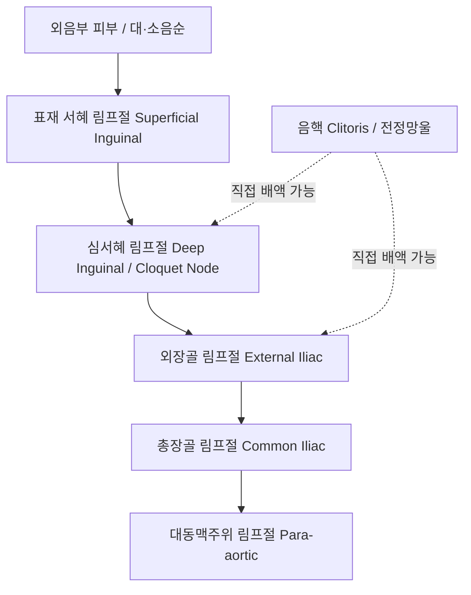

# 📑 [Netter Vol.1] Day 06: 외음부 - 해부·림프배액·피부병변·감염 및 악성종양학 (Section 6 완독)

> 📖 **원서 출처**: [The Netter Collection of Medical Illustrations - Volume 1, Reproductive System.pdf (pp. 110-127)](https://drive.google.com/file/d/1x-xTgPfUfiK7dsQyp5L5qfjFYSD_XyGm/view?usp=drivesdk)  
> 🏷️ **범위**: Section 6 전편 (Plate 6-1 ~ Plate 6-18, 총 18개 플레이트 전수 포함)  
> 📌 **핵심 테마**: 여성 외음부 정밀 해부학(음핵 복합체, 질전정, 바르톨린선), 회음부 근육 및 골반격막 지지 구조, 외음부 림프 배액 체계(표재 서혜 $\rightarrow$ 심서혜 Cloquet $\rightarrow$ 외장골), 비종양성 상피장애(경화태선 Lichen sclerosus vs 단순태선), 성매개 감염병(트리코모나스, 칸디다, 매독, 연성하감, 바르톨린 농양), 외음부 전암병변(VIN) 및 편평세포암·파제트병(Paget's disease)

---

## 1. 개요 및 마스터 요약 (Executive Summary)

1. **여성 외음부(Vulva / Pudendum)의 해부학적 랜드마크**:
   - 치구(Mons pubis)에서 회음체(Perineal body)까지 이어지는 복합 구조물로 대음순(Labia majora), 소음순(Labia minora), 음핵(Clitoris), 질전정(Vestibule), 요도구 및 질구를 포함.
   - **음핵 복합체(Clitoral complex)**: 가시적인 귀두(Glans) 외에 체부(Body), 좌우 음핵각(Crura)과 전정망울(Vestibular bulbs)이 요도와 질구를 말발굽 모양으로 감싸는 광범위한 발기 조직망 형성.
2. **회음부 림프 배액 체계와 종양학적 전이 경로**:
   - 외음부 피부 및 소음순: **표재 서혜 림프절 (Superficial inguinal lymph nodes)** $\rightarrow$ 대퇴관(Femoral canal)의 **심서혜 림프절 (Deep inguinal nodes, Cloquet / Rosenmüller node)** $\rightarrow$ **외장골 림프절 (External iliac nodes)**로 단계적 배액.
   - **정중선 병변의 특이성**: 음핵, 음핵포피, 회음부 정중선 병변은 초기부터 **양측 서혜 림프절(Bilateral inguinal nodes)**로 동시 배액되므로 외음부암 수술 시 양측 림프절 곽청술이 필수적임.
3. **비종양성 상피 장애 (Non-neoplastic Epithelial Disorders)**:
   - **경화태선 (Lichen Sclerosus, LS)**: 자가면역 기전. 진주빛 백색 위축, 표피 위축 및 진피 초자화, 소음순 소실 및 음핵 매몰, '열쇠구멍(Keyhole / Figure-of-eight)' 분포. 편평세포암(dVIN 경로) 위험 증가 $\rightarrow$ **초강력 국소 스테로이드(Clobetasol propionate)**가 표준 치료.
   - **만성 단순 태선 (Lichen Simplex Chronicus, LSC)**: 소양증-긁기 악순환(Itch-scratch cycle)에 의한 표피 과다형성(Hyperkeratosis) 및 태선화.
4. **외음부 감염성 및 낭성 질환**:
   - **바르톨린선 낭종 및 농양 (Bartholin duct cyst & abscess)**: 도관 폐색으로 발생하며 급성 감염 시 극심한 통증과 파동감. 단순 흡인은 재발률이 높아 **조대술(Marsupialization)** 또는 Word 카테터 거치 시행. (40세 이상 첫 발생 시 바르톨린선암 배제 생검 필수).
   - **감염 질환 감별**: 질편모충증(기포성 황록색 분비물, 딸기양 자궁경부, Metronidazole), 칸디다증(치즈 찌꺼기양 위막, 극심한 가려움, Fluconazole), 단순포진(다발성 유통성 수포/궤양).
5. **외음부 악성 종양 (Vulvar Malignancies)**:
   - 90% 이상이 **편평세포암 (Squamous cell carcinoma, SCC)**:
     - **HPV 연관형 (젊은 여성)**: 고위험군 HPV 16/18형 감염, uVIN(Usual VIN) 거쳐 발생.
     - **HPV 비연관형 (고령 여성)**: 만성 경화태선 기저, dVIN(Differentiated VIN) 거쳐 발생하며 악성도 높음.
   - **외음부 파제트병 (Extramammary Paget's Disease)**: 지도 모양의 경계가 명확한 홍반성 인설('딸기잼을 바른 듯한' 양상). 대형의 투명한 파제트 세포(Paget cells, PAS 양성, mucin 양성). 약 10~20%에서 내부 선암(요로/위장관/부속기암) 동반.

---

## 2. 외음부 구조, 서혜부 및 회음 지지 해부학 (Plates 6-1 ~ 6-3)

### Plate 6-1 | 외생식기 (External Genitalia)

![[Netter_V1_Plate6-1.png]]

#### 1) 구성 구조물 및 발생학적 상동성
- **치구 (Mons pubis)**: 치골 결합 전방의 두꺼운 피하지방 패드로 사춘기 이후 치모로 덮임.
- **대음순 (Labia majora)**: 남성의 **음낭(Scrotum)**과 상동 기관. 지방조직과 평활근(Dartos)을 포함하며, 자궁 원인대(Round ligament)가 주행을 마치고 끝나는 부위.
- **소음순 (Labia minora)**: 남성의 **해면체부 요도 복측 피부**와 상동. 지방조직이 전무한 얇은 주름으로 피지선이 고밀도로 분포. 전방에서 갈라져 **음핵포피(Prepuce)**와 **음핵소대(Frenulum)**를 형성.
- **음핵 (Clitoris)**: 남성의 **음경(Penis)**과 상동. 2개의 음핵해면체(Corpora cavernosa)로 구성되며 귀두(Glans), 체부(Body), 각(Crura)으로 나뉨. 풍부한 감각신경 종말(Pacinian & Meissner corpuscles) 분포.
- **질전정 (Vestibule)**: 양측 소음순 사이의 함몰 부위로 **외요도구(External urethral orifice)**, **질구(Vaginal orifice)**, **바르톨린선 개구부(4시, 8시 방향)**, **스킨선 개구부(요도구 양외측)**가 위치.
- **처녀막 (Hymen)**: 요로생식동과 질 원기(Müllerian bulb)의 경계부에 형성된 얇은 점막 주름. 형태학적으로 환상(Annular), 반월상(Crescentic), 사상(Cribriform), 중격(Septate) 등으로 분류.

---

### Plate 6-2 | 음부, 치골 및 서혜부 (Pudendal, Pubic, and Inguinal Regions)

![[Netter_V1_Plate6-2.png]]

#### 1) 서혜관(Inguinal Canal)과 자궁원인대 주행
- **자궁원인대 (Round ligament of uterus)**: 자궁저부 전외측에서 기원하여 골반 복막 아래를 지나 내서혜륜(Deep ring)으로 진입, 서혜관을 관통한 뒤 외서혜륜(Superficial ring)을 빠져나와 **대음순 피하지방에 부착**.
- **너크관 (Canal of Nuck)**: 태생기 복막의 돌출부(여성의 초상돌기 Processus vaginalis)가 폐쇄되지 않고 남아있을 경우 형성되는 낭상 공간. 원인대를 따라 위치하며 액체가 차면 **너크관 수낭종(Hydrocele of canal of Nuck)** 또는 간접 서혜탈장 유발.

---

### Plate 6-3 | 회음부 및 골반격막 지지 구조 (Perineum)

![[Netter_V1_Plate6-3.png]]

#### 1) 회음 구획과 근육 지지대
- **회음체 (Perineal body / Central tendon of perineum)**:
  - 질구와 항문 사이에 위치하는 피라미드형 섬유근육 결절.
  - 부착 근육: 외항문괄약근(External anal sphincter), 구해면체근(Bulbospongiosus), 천회음횡근(Superficial transverse perineal m.), 치골직장근(Puborectalis).
  - 분만 손상(열상 또는 외음절개술) 시 회음체가 파열되면 골반저 지지력이 약화되어 장기적으로 자궁탈출증(Prolapse), 직장류(Rectocele), 변실금 초래.
- **표재 회음극 근육**:
  - **구해면체근 (Bulbospongiosus m.)**: 전정망울과 바르톨린선을 둘러싸며 질구를 조이고 발기조직 정맥을 압박.
  - **좌골해면체근 (Ischiocavernosus m.)**: 좌골궁에서 음핵각을 둘러싸 음핵 발기 유지.
- **골반격막 (Pelvic Diaphragm)**: **항문거근(Levator ani - 치골미골근, 장골미골근, 치골직장근)**과 미골근(Coccygeus)으로 구성되어 골반 장기를 최종 지지.

---

## 3. 혈관 순환, 신경 지배 및 림프 배액 (Plates 6-4 ~ 6-6)

### Plate 6-4 | 외생식기의 림프 배액 (Lymphatic Drainage—External Genitalia)

![[Netter_V1_Plate6-4.png]]

#### 1) 외음부의 체계적 림프 배액 경로
1. **외음부 피부, 대/소음순, 회음부 전반**:
   - $\rightarrow$ 서혜인대 하방 대퇴정맥 주위의 **표재 서혜 림프절 (Superficial inguinal lymph nodes)**.
   - $\rightarrow$ 난원와(Fossa ovalis)의 체상근막(Cribriform fascia)을 뚫고 대퇴관 내부의 **심서혜 림프절 (Deep inguinal nodes)**로 유입.
   - **클로케 림프절 (Cloquet's / Rosenmüller's node)**: 대퇴관 입구 가장 최상단에 위치하는 심서혜 림프절의 핵심 지표.
   - $\rightarrow$ 골반강 내 **외장골 림프절 (External iliac nodes)** $\rightarrow$ 총장골 및 대동맥주위 림프절로 상행.
2. **음핵(Clitoris) 및 전정망울(Vestibular bulb)**:
   - 풍부한 정맥총을 동반하며 표재 서혜를 거치지 않고 **심서혜 림프절 또는 외장골 림프절로 직접 배액** 가능.
3. **양측성 배액 (Bilateral Drainage)**:
   - 외음부 림프망은 정중선(Midline)을 가로지르는 광범위한 문합망을 가짐. 음핵, 회음체, 또는 정중선에서 $2\text{ cm}$ 이내 병변은 **양측 서혜 림프절 곽청술(Bilateral inguinal lymphadenectomy)**의 적응증.

---

### Plate 6-5 | 회음부 혈류 공급 (Blood Supply of Perineum)

![[Netter_V1_Plate6-5.png]]

- **내음부동맥 (Internal pudendal a.)**: 내장골동맥의 전분지에서 기원하여 알콕관(Alcock's canal)을 통과한 뒤 다음과 같이 분지:
  1. **하직장동맥(Inferior rectal a.)**: 항문관 및 외항문괄약근.
  2. **회음동맥(Perineal a.)**: 표재 회음극 근육 및 대음순 후부(후음순동맥).
  3. **전정망울동맥(Artery of the bulb)**: 전정망울 및 바르톨린선 관류.
  4. **음핵심동맥(Deep a. of clitoris)**: 음핵해면체 중심을 관류하여 발기 유도.
  5. **음핵등동맥(Dorsal a. of clitoris)**: 음핵 귀두 및 포피 공급.
- **외음부동맥 (External pudendal a., 표재 및 심부)**: 대퇴동맥(Femoral a.)에서 직접 분지하여 대음순 전방부에 혈류 공급 (풍부한 측부 순환 형성).

---

### Plate 6-6 | 외생식기 및 회음부의 신경 지배 (Innervation of External Genitalia and Perineum)

![[Netter_V1_Plate6-6.png]]

#### 1) 체성신경 및 자율신경망
- **음부신경 (Pudendal nerve, S2-S4 체성신경)**:
  - 주 신경 지배원. 알콕관 통과 후 분지:
    1. **하직장신경(Inferior rectal n.)**: 외항문괄약근 및 항문주위 감각.
    2. **회음신경(Perineal n.)**: 표재 회음근육 운동 및 후음순신경(대/소음순 후부 2/3 감각).
    3. **음핵등신경(Dorsal n. of clitoris)**: 음핵 귀두 및 체부의 주된 성감각 매개.
- **기타 체성 피신경**:
  - **장골서혜신경 (Ilioinguinal n., L1)**: 치구 및 대음순 전방 1/3 감각.
  - **생식대퇴신경의 음부가지 (Genital branch of genitofemoral n., L1-L2)**: 대음순 외측 감각.
  - **후대퇴피신경의 회음가지 (Perineal branch of posterior femoral cutaneous n., S1-S3)**: 회음부 외측 감각.
- **자율신경**: 하하복신경총 유래 해면체신경(Cavernous n.)이 음핵 발기 및 전정선 분비 조절.

---

## 4. 비종양성 상피 장애 및 순환 장애 (Plates 6-7 ~ 6-9)

### Plate 6-7 | 외음부 피부염 (Dermatoses)

![[Netter_V1_Plate6-7.png]]

- **접촉피부염 (Contact Dermatitis)**: 여성 청결제, 패드, 향료, 콘돔 라텍스 등에 대한 알레르기 또는 자극 반응. 부종, 홍반, 소양증.
- **간찰진 (Intertrigo)**: 대퇴-외음 주름부의 마찰과 습기로 인한 피부염 및 칸디다 복합 감염.
- **건선 (Psoriasis)**: 경계가 분명한 은백색 인설의 홍반성 판. 외음부에서는 마찰로 인해 인설이 탈락되어 편평한 붉은 판으로 보일 수 있음.
- **편평태선 (Lichen Planus)**: 다각형의 자갈색 구진 또는 미란성 병변. 질 점막 유착 및 협착 동반 가능.

---

### Plate 6-8 | 위축성 및 비후성 외음 질환 (Atrophic Conditions)

![[Netter_V1_Plate6-8.png]]

#### 1) 경화태선 vs 만성 단순 태선의 비교
| 질환 | 경화태선 (Lichen Sclerosus, LS) | 만성 단순 태선 (Lichen Simplex Chronicus, LSC) |
| :--- | :--- | :--- |
| **병인** | 자가면역 기전 (면역 매개성 만성 염증) | 만성 가려움-긁기 악순환 (Itch-scratch cycle) |
| **호발 연령** | 폐경 후 고령 여성 (소아에서도 발생 가능) | 가임기 및 중년 여성 |
| **임상 소견** | 진주빛 백색 반판(Porcelain-white), 상피 위축('담뱃재 종이' 양상), 소음순 흡수 및 소실, 음핵 매몰, **항문-외음 '열쇠구멍/8자형' 병변** | 피부가 두꺼워지고 주름이 깊어지는 **태선화 (Lichenification)**, 과각화성 백색 병변 |
| **조직 병리** | 표피 위축, 기저세포 액화변성, **진피 상층의 무세포성 교원질 초자화 (Hyalinization)**, 심부 띠 모양 림프구 침윤 | 표피 과다형성(Hyperplasia), 극세포증(Acanthosis), 과각화증 |
| **악성도** | **외음부 편평세포암(dVIN 경로) 위험 4~5% 증가** | 악성 변화 위험 없음 |
| **표준 치료** | **초강력 국소 스테로이드 (Clobetasol propionate 0.05%)** 장기 유지 요법 | 중등도 국소 스테로이드, 항히스타민제, 긁기 차단 |

---

### Plate 6-9 | 순환 및 기타 장애 (Circulatory and Other Disturbances)

![[Netter_V1_Plate6-9.png]]

- **외음부 정맥류 (Vulvar Varicosities)**: 임신 중 증대된 자궁의 하대정맥 압박 및 프로게스테론에 의한 정맥벽 이완으로 발생. 푸르스름한 사행 혈관 팽창. 분만 후 대부분 자연 소퇴.
- **외음부 혈종 (Vulvar Hematoma)**: 낙상 외상(Straddle injury) 또는 분만 시 외음 혈관 파열. 다토스/콜리스 근막 하방으로 출혈이 고여 거대 혈종 형성. 급속 팽창 시 즉각적인 절개 및 지혈술 필요.

---

## 5. 감염 질환, 전정염 및 낭종 (Plates 6-10 ~ 6-15)

### Plate 6-10 | 당뇨, 편모충증, 칸디다증 (Diabetes, Trichomoniasis, Moniliasis)

![[Netter_V1_Plate6-10.png]]

#### 1) 대표적 질염 및 외음염 감별
- **칸디다성 외음질염 (Candidiasis / Moniliasis, *Candida albicans*)**:
  - 당뇨병(고혈당 소변), 임신, 광범위 항생제 사용 환자에서 호발.
  - 극심한 가려움증, 외음부 홍반 및 부종, **치즈 찌꺼기/두부 비지 모양(Curd-like) 백색 분비물**.
  - KOH 도말 검사상 가성균사(Pseudohyphae) 관찰. 국소 Clotrimazole 질정 또는 경구 Fluconazole.
- **질편모충증 (Trichomoniasis, *Trichomonas vaginalis*)**:
  - 편모를 가진 혐기성 원충 감염 (성매개 감염).
  - **기포를 동반한 다량의 악취 나는 황록색 분비물**, 외음부 작열감.
  - 자궁경부 표면에 점상 출혈을 보이는 **"딸기양 자궁경부 (Strawberry cervix)"**.
  - 생리식염수 도말(Wet mount) 상 활발히 회전 운동하는 편모충 관찰. **배우자 동시 경구 Metronidazole 복용 필수**.

---

### Plate 6-11 | 외음부 전정염 (Vulvar Vestibulitis / Provoked Vestibulodynia)

![[Netter_V1_Plate6-11.png]]

- **개념**: 질전정(Vestibule) 부위에 국한된 심한 통증 및 접촉 과민성.
- **프리드만 3대 진단 기준 (Friedrich Criteria)**:
  1. 질전정 부위의 접촉 또는 질 삽입 시 극심한 통증 (성교통 Dyspareunia).
  2. 면봉으로 전정 부위를 가볍게 누를 때 유발되는 국소 압통 (**Q-tip test 양성**).
  3. 질전정의 다양한 정도의 홍반(Erythema).
- 병인: 신경섬유 밀도 증가 및 신경병성 통증 감작. 골반저 물리치료, 국소 리도카인, 삼환계 항우울제(Amitriptyline), 불응 시 전정절제술(Vestibulectomy).

---

### Plate 6-12 | 임질 (Gonorrhea)

![[Netter_V1_Plate6-12.png]]

- *Neisseria gonorrhoeae* 감염. 요도 분비물, 배뇨통, 스킨선염(Skeneitis) 및 바르톨린선염 유발.
- 자궁경부염을 거쳐 자궁내막 및 난관으로 상행하여 **골반염증성질환(PID)** 및 난관 불임 초래. Ceftriaxone 근주.

---

### Plate 6-13 | 매독 (Syphilis)

![[Netter_V1_Plate6-13.png]]

- **1기 매독**: 대/소음순에 단일 무통성 궤양인 **경성하감(Hard chancre)**. 단단한 융기 경계와 깨끗한 기저부.
- **2기 매독**: 회음부 및 항문 주위에 발생하는 회백색의 편평하고 습윤한 판상 병변인 **편평콘딜롬(Condyloma lata)** - 고농도의 트레포네마 매독균이 존재하여 감염력 극대화. Benzathine penicillin G 치료.

---

### Plate 6-14 | 연성하감 및 기타 감염 (Chancroid and Other Infections)

![[Netter_V1_Plate6-14.png]]

- **연성하감 (Chancroid, *Haemophilus ducreyi*)**:
  - 지극히 극심한 통증을 유발하는 무른 궤양(Soft chancre). 기저부가 지저분하고 화농성 삼출물로 덮임.
  - 유통성 화농성 서혜부 림프절염(**Bubo**, 가로골) 동반. Azithromycin 또는 Ceftriaxone.
- **성기 단순포진 (Genital Herpes, HSV-2)**:
  - 홍반성 기저부 위의 군집된 소수포 $\rightarrow$ 파열되어 얕고 극심한 통증의 다발성 궤양 형성. Acyclovir 항바이러스제 투여.

---

### Plate 6-15 | 외음부 낭종 (Cysts)

![[Netter_V1_Plate6-15.png]]

#### 1) 바르톨린선 낭종 및 농양 (Bartholin Duct Cyst & Abscess)
- **병태생리**: 바르톨린선(대전정선) 주도관의 염증, 농축된 점액전, 외상으로 폐색 $\rightarrow$ 점액이 저류되어 낭종 형성 $\rightarrow$ 혐기성균 및 대장균 2차 감염 시 **급성 농양(Abscess)**으로 이행.
- **임상 양상**: 소음순 후하방(5시, 7시 방향)의 심한 통증성 종창, 보행 곤란 및 성교통, 요동감(Fluctuation).
- **외과적 처치**:
  - **조대술 (Marsupialization)**: 낭종 전벽을 절개하고 낭벽 가장자리를 전정 점막 피부에 봉합하여 영구적인 새 배액 누공을 형성.
  - **Word 카테터 거치**: 작은 절개창을 통해 카테터 풍선을 거치하여 상피화 유도 (4~6주간 유지).
  - *임상 진주*: **40세 이상 여성에서 처음 발생한 바르톨린선 종괴**는 원발성 **바르톨린선암(Adenocarcinoma)** 가능성을 반드시 고려하여 절제 생검 시행 필수.

---

## 6. 양성 종양, 악성 종양 및 외음 절제 (Plates 6-16 ~ 6-18)

### Plate 6-16 | 양성 종양 (Benign Tumors)

![[Netter_V1_Plate6-16.png]]

- **첨규콘딜롬 (Condyloma Acuminata)**: 저위험군 **HPV 6, 11형** 감염. 외음부, 회음부, 항문 주위에 다발성 꽃양배추 모양(Cauliflower-like) 사마귀. 포도필린, 이미퀴모드(Imiquimod), 레이저 절제.
- **유두상 한선종 (Hidradenoma Papilliferum)**: 대소음순 고랑에 호발하는 아포크린 땀샘 기원의 양성 종양. 궤양 형성 시 악성암으로 오인될 수 있음.

---

### Plate 6-17 | 악성 종양 (Malignant Tumors)

![[Netter_V1_Plate6-17.png]]

#### 1) 외음부 편평세포암 (Vulvar Squamous Cell Carcinoma, SCC, 90%)
- **이중 발생 경로**:
  1. **HPV 의존성 경로 (30~40%)**: 젊은 여성, 흡연자, 고위험군 HPV 16/18형 연관. **uVIN (Usual type VIN / HSIL)**을 거쳐 기저양(Basaloid) 또는 사마귀양(Warty) 암종으로 진행.
  2. **HPV 비의존성 경로 (60~70%)**: 고령 여성, 만성 경화태선(Lichen sclerosus) 기저. *TP53* 돌연변이 동반 **dVIN (Differentiated type VIN)**을 거쳐 각화성(Keratinizing) 편평세포암으로 급속 진행 (침습 잠재력 높음).
- **FIGO 병기 및 수술 원칙**:
  - 종양 크기, 침습 깊이, **서혜 림프절 전이 여부**가 생존율의 핵심 결정 인자.
  - **광범위 국소 절제술 (Wide local excision, 안전연 $1\sim 2\text{ cm}$) + 동측 또는 양측 서혜-대퇴 림프절 곽청술 (Inguinofemoral lymphadenectomy)**. 감시 림프절 생검(Sentinel lymph node biopsy) 적용 증가.

#### 2) 외음부 파제트병 (Extramammary Paget's Disease)
- **임상 양상**: 폐경 후 백인 여성 호발. 지도 모양의 경계가 뚜렷한 홍반성 판 위에 백색 인설이 덮인 **"딸기잼을 바른 듯한 (Strawberries and cream)"** 만성 습진성 병변. 심한 소양증.
- **병리 조직학**: 표피 내에 크고 창백한 포말상 세포질과 다형성 핵을 가진 **파제트 세포(Paget cells)** 침윤. Mucin 염색(Alcian blue, PAS) 양성, Cytokeratin 7(CK7) 양성.
- **동반 악성종양**: 환자의 10~20%에서 기저 외음부 선암 또는 인접 비뇨기계/위장관(직장) 선암이 동반되므로 대장내시경 및 방광경 검사 스크리닝 필수.

---

### Plate 6-18 | 여성 할례 (Female Circumcision / Female Genital Mutilation - FGM)

![[Netter_V1_Plate6-18.png]]

#### 1) WHO 4대 분류 및 의학적 합병증
- **Type I (음핵절제술 Clitoridectomy)**: 음핵 귀두 및 음핵포피의 부분 또는 완전 절제.
- **Type II (절제술 Excision)**: 음핵과 소음순의 부분 또는 완전 절제 ($\pm$ 대음순 절제).
- **Type III (음부봉쇄술 Infibulation)**: 음핵, 소음순 절제 후 대음순을 봉합하여 질구를 좁히고 극소 배뇨구만 남김 (가장 치명적인 형태).
- **Type IV**: 천자, 피어싱, 소작 등 기타 모든 비의학적 생식기 손상.
- **의학적 후유증**:
  - 급성: 대량 출혈, 파상풍/패혈증, 쇼크, 급성 요폐.
  - 만성: 만성 골반통, 외음부 봉합선 신경종(Neuroma), 재발성 요로감염, 불임, 성교불능/통증, **분만 시 치명적 난산 및 4도 회음부 파열**. 탈봉쇄술(Defibulation) 필요.
