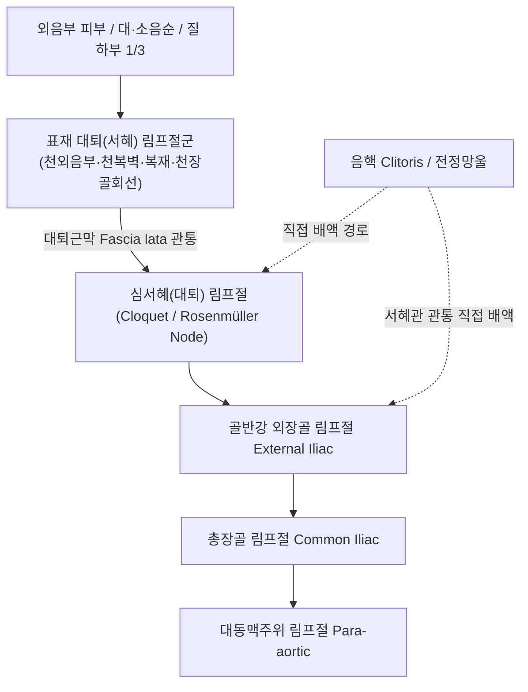

# 📑 [Netter Vol.1] Day 06: 외음부 - 해부·림프배액·피부병변·감염 및 악성종양학 (Section 6 완독)

> 📖 **원서 출처**: [The Netter Collection of Medical Illustrations - Volume 1, Reproductive System.pdf (pp. 110-127)](https://drive.google.com/file/d/1x-xTgPfUfiK7dsQyp5L5qfjFYSD_XyGm/view?usp=drivesdk)  
> 🏷️ **범위**: Section 6 전편 (Plate 6-1 ~ Plate 6-18, 총 18개 플레이트 전수 포함)  
> 📌 **핵심 테마**: 여성 외음부 정밀 해부학(음핵 복합체, 질전정, 바르톨린선), 회음 구획 근막(Camper/Scarpa/Colles/Gallaudet) 및 골반격막 지지 구조, 외음부 림프 배액 체계(표재 대퇴 4개군 $\rightarrow$ 심서혜 Cloquet $\rightarrow$ 외장골), 혈관 주행과 수술 손상(알콕관, 천미골인대 고정술 출혈, 질벽 3·9시 동맥망), 비종양성 상피장애(경화태선 LS vs 편평상피 과형성 vs 단순태선 LSC vs 백반증), 감염 질환(소고기색 당뇨병성 외음염, 칸디다, 편모충증, 임질의 연령별 감수성, 매독 전대현상, 연성하감, LGV 홈 징후, 도노반증), 외음부 전정염(아세트산 질확대경, Q-tip 압통, 인터페론 요법), 외음부 낭종 체계(바르톨린선 도관 낭종, 피지낭종, 표피포함낭종, 너크관 낭종), 양성 종양(콘딜롬, 한선종, 요도 육구 vs 요도 탈출증 vs 요도암), 악성 종양(편평세포암 발생순위 및 uVIN/dVIN 이중경로, 기저세포암 rodent ulcer, 외음부 흑색종·육종, 신세포암/융모암 전이, 파제트병), 여성 할례(WHO 4대 분류, 기시리/안구리야 절개, 탈봉쇄술 및 재봉쇄 금지 규정).

---

## 1. 개요 및 마스터 요약 (Executive Summary)

1. **여성 외음부(Vulva / Pudendum)의 해부학적 랜드마크**:
   - 치구(Mons pubis)에서 회음체(Perineal body)까지 이어지는 복합 구조물로 대음순(Labia majora), 소음순(Labia minora), 음핵(Clitoris), 질전정(Vestibule), 요도구 및 질구를 포함.
   - **음핵 복합체(Clitoral complex)**: 가시적인 귀두(Glans) 외에 체부(Body), 좌우 음핵각(Crura)과 전정망울(Vestibular bulbs)이 요도와 질구를 말발굽 모양으로 감싸는 광범위한 발기 조직망 형성. 안드로겐 노출 시 비대 판정은 **음핵 지수(Clitoral index < $35\text{ mm}^2$)** 적용.
   - **질전정 선조직**: 외요도구 하방 $2\text{ cm}$에 위치하며, 후외측의 스킨선 도관($1\sim 1.5\text{ cm}$)과 4시·8시 방향(선 자체는 3시·9시 후방)의 바르톨린선 도관($1.5\text{ cm}$)이 개구.
   - **처녀막(Hymen)**: 양면이 중층편평상피로 덮인 혈관성 점막 주름. 분만·성교 후 처녀막 소포(Carunculae hymenales)로 잔존하며, 완전성 유무만으로 과거 성경험을 판정할 수 없음.
2. **근막 연속성 및 회음부 지지 구조**:
   - 복벽의 캠퍼(Camper) 및 스카르파(Scarpa) 근막은 회음부에서 각각 천층 지방층 및 콜리스(Colles) 근막으로 연속.
   - **너크관(Canal of Nuck)**: 남성의 고환초막(Processus vaginalis) 상동물로 개존 시 간접 서혜탈장 또는 여성 음낭수종(Hydrocele feminae) 형성.
   - **회음체(Perineal body)**: 구해면체근, 천/심회음횡근, 항문거근, 외항문괄약근이 결합하는 골반저의 핵심 지지 결절. 분만 손상 시 골반장기탈출증 초래. 구해면체근(Sphincter vaginae) 경련은 **질경련(Vaginismus)**의 원인.
3. **회음부 혈관망 및 신경 지배**:
   - **내음부동맥(Internal pudendal a.)**: 알콕관(Alcock's canal) 통과. **천미골인대 고정술(Sacrospinous colpopexy)** 시 좌골극(Ischial spine) 인근에서 하둔동맥 및 내음부동맥 손상에 의한 치명적 대량 출혈 위험.
   - 질벽 양측 3시 및 9시 방향 주혈관 주행으로 분만 시 손상 위험.
   - **음부신경(Pudendal n., S2-S4)**: 하직장신경(외항문괄약근 및 **항문 반사 Anal wink reflex**), 회음신경(천/심회음근, 후음순신경), 음핵등신경 분지. **좌골극(Ischial spine)**을 지표로 경질적(Transvaginal) 음부신경 차단술 시행.
4. **회음부 림프 배액 체계와 종양학적 전이 경로**:
   - 외음부 피부, 소음순, 질 하부 1/3: **표재 대퇴 림프절 (Superficial femoral nodes)**(천복벽, 천외음부, 복재, 천장골회선 림프절) $\rightarrow$ 대퇴근막 관통 $\rightarrow$ 대퇴관(Femoral canal) 입구의 **심서혜 림프절 (Deep inguinal nodes, Cloquet / Rosenmüller node)** $\rightarrow$ **외장골 림프절 (External iliac nodes)**로 단계적 배액.
   - **정중선 병변의 특이성**: 음핵, 음핵포피, 회음체 병변은 초기부터 **양측 서혜 림프절(Bilateral inguinal nodes)**로 동시 배액되거나 외장골 림프절로 직접 유입 가능 $\rightarrow$ 양측 서혜 림프절 곽청술 및 감시 림프절 생검(SLNB) 필수.
5. **비종양성 상피 장애 및 순환 장애**:
   - **경화태선 (Lichen Sclerosus, LS)**: 상피는 대사적으로 활성(Metabolically active) 상태이나 진피 상층 무세포성 초자화 초래. 소음순 흡수 및 '8자형/열쇠구멍' 분포. 편평세포암(dVIN 경로) 위험 4~6% 증가 $\rightarrow$ 초강력 국소 스테로이드 치료.
   - **편평상피 과형성(Squamous hyperplasia)** vs **만성 단순 태선(LSC, 탄력섬유 보존)** vs **외음 비정형(Vulvar atypia/백반증, 탄력섬유 파괴, 50% 암 선행)** 감별.
   - **외음부 정맥류(임신성 대음순 종창)**, **혈관신경성 부종(알레르기 반응)**, **상피병(W. bancrofti, LGV로 인한 후피증)**, **거대 외음 혈종($>10\text{ cm}$ 즉각 절개 배액, 복막외강 침윤 주의)**.
6. **외음부 감염성 및 낭성 질환**:
   - **질염 3대 감별**: 당뇨병성 외음염(소고기색 홍반, 당뇨뇨 번식), 칸디다증(치즈찌꺼기양 위막 박리 시 출혈, 10% KOH 가성균사), 편모충증(방추형 편모충 회전운동, 기포성 황록색 분비물, 딸기양 자궁경부).
   - **외음부 전정염(Provoked vestibulodynia)**: 3% 아세트산 질확대경 점상 미란, Q-tip 국소 압통, 소전정선염, 뷔로액(Burow's sol.), 삼환계 항우울제, 인터페론 주사(임신 금기), 전정절제술.
   - **성매개 감염병**: 임질(소아 및 폐경 후 질상피 박막·알칼리성 환경으로 취약, Thayer-Martin 배양, 원격 관절염/건초염), 매독(헌터 하감, 2기 편평콘딜롬, 전대현상 위음성 주의, 신경매독 CSF), 연성하감(잠식성 경계의 유통성 연성하감 + 화농성 횡현 Bubo), 성병성 림프육아종(LGV, 홈 징후 Groove sign, 직장 협착), 서혜육아종(비림프성 말초 확장, 가성 가로골, 도노반 소체).
   - **낭종 체계**: 바르톨린선 낭종(80% 무균, 이행상피+복합점액선벽, 조대술/Word 카테터, 40세 이상 악성 배제 생검), 피지낭종, 표피포함낭종(회음열상 봉합 후), 너크관 낭종(원인대 복막초 확장).
7. **외음부 종양학 및 여성 할례**:
   - **양성 종양**: 첨규콘딜롬(HPV 6/11), 유두상 한선종(아포크린 기원), 요도 육구(Urethral caruncle) vs 요도 탈출증(전 둘레 탈출) vs 요도암(소작 금기, 생검 필수).
   - **악성 종양**: 편평세포암(90%, 호발부위: 대음순>음핵포피>소음순>바르톨린선, uVIN vs dVIN 이중 경로, 흉부 X선 폐전이 스크리닝), 악성 흑색종(5%), 기저세포암(Rodent ulcer, 광범위 국소절제 완치), 외음부 육종(2%), 전이성 암(신세포암, 융모암), 파제트병(Strawberries and cream, CK7+, 내부 선암 동반).
   - **여성 할례(FGM)**: WHO 4대 분류(음핵절제술, 절제술, 음부봉쇄술, 기타 피어싱/소작) 및 특수 손상(기시리/안구리야 절개). 후유증(월경혈저류, 역행성 월경, 난산). 탈봉쇄술(Defibulation) 및 분만 시 전방 회음절개술 적용, 재봉쇄(Reinfibulation) 법적 금지.

---

## 2. 외음부 구조, 서혜부 및 회음 지지 해부학 (Plates 6-1 ~ 6-3)

### Plate 6-1 | 외생식기 (External Genitalia)

![[Netter_V1_Plate6-1.png]]

#### 1) 구성 구조물 및 표면 해부학
- **치구 (Mons pubis / Mons veneris)**:
  - 치골 결합 전방의 두꺼운 피하지방 패드로, 사춘기 이후 성모(Terminal pubic hair)로 피복.
  - 성교 시 기계적 완충 및 건식 윤활제(Dry lubricant) 역할 수행.
- **대음순 (Labia majora)**:
  - 남성의 **음낭(Scrotum)**과 발생학적 상동 기관.
  - 음순전연결(Anterior commissure)에서 전방 합류하고, 후방에서는 약간 융기된 능선인 **음순후연결(Posterior commissure / Fourchette)**을 형성.
  - 풍부한 피하지방조직, 평활근(Dartos), 피지선 및 한선을 포함하며 외측면은 모발로 덮임.
- **주상와 (Fossa navicularis / Vestibular fossa)**:
  - 음순후연결(Fourchette)과 질구(Vaginal orifice) 사이에 위치하는 얕은 배 모양의 함몰부.
- **소음순 (Labia minora)**:
  - 남성의 **해면체부 요도 복측 피부(Ventral penile skin)**와 상동.
  - 얇고 탄력 있는 착색된 피부 주름으로, **모낭이 전무(Devoid of hair follicles)**하고 한선이 매우 희소한 반면 **피지선(Sebaceous glands)이 극히 조밀하게 분포**.
  - 전방에서 상하 두 엽으로 분기하여 외측 엽은 **음핵포피(Prepuce)**를, 내측 엽은 **음핵소대(Frenulum)**를 형성.
  - 후방으로 가면서 점차 얇아져 음순후연결 직전의 소음순소대(Frenulum of labia minora)로 연결.
- **음핵 복합체 (Clitoral Complex)**:
  - 남성의 **음경(Penis)**과 상동인 원주형 발기 기관.
  - 치골결합 하연에 위치하며 2개의 음핵해면체(Corpora cavernosa), 체부(Body), 귀두(Glans), 그리고 좌골치골지 골막에 견고히 부착된 **음핵각(Crura)**으로 구성.
  - 평상시 외부에는 도토리 모양의 귀두(Glans)만 노출되며, 마이스너 및 파치니 감각소체가 고밀도로 밀집.
  - **음핵 지수 (Clitoral Index)**: 고안드로겐혈증에 의한 음핵 비대 판정 기준 = 귀두의 시상 직경(mm) $\times$ 횡경(mm). **정상치 $< 35\text{ mm}^2$**.
- **질전정 (Vestibule)**:
  - 양측 소음순 사이의 함몰 공간.
  - **외요도구(External urethral orifice)**: 음핵 하방 약 $2\text{ cm}$의 유두상 융기부에 위치.
  - **스킨선 개구부(Paraurethral / Skene duct openings)**: 외요도구 후외측에 개구하며, 요도와 평행하게 하방으로 $1\sim 1.5\text{ cm}$ 주행.
  - **바르톨린선 도관 개구부(Bartholin duct openings)**: 처녀막과 소음순 사이 고랑, 질구 외측 경계의 중간-후방 1/3 접합부(4시, 8시 방향)에 개구. 각 도관 길이는 약 $1.5\text{ cm}$이며 심부 전정선으로 주행. 바르톨린선 자체는 3시 및 9시 위치 후방에 깊숙이 위치.
- **처녀막 (Hymen)**:
  - 요로생식동과 질 원기(Müllerian bulb)의 경계부에 형성된 얇은 혈관성 점막 주름.
  - **양면 모두 중층편평상피(Stratified squamous epithelium)**로 피복.
  - 형태학적 변이: 환상(Annular), 중격(Septate), 사상(Cribriform), 반월상(Crescentic), 술 모양(Fimbriate).
  - 탐폰 사용, 성교, 분만 후 위축 잔존물은 **처녀막 소포(Carunculae hymenales / Hymenal caruncles)**로 관찰됨.
  - *임상/법의학 진주*: 손상되지 않은 처녀막의 존재 여부만으로 과거 성경험 유무를 절대 단정할 수 없음. 경산부 질구(Parous introitus).

---

### Plate 6-2 | 음부, 치골 및 서혜부 (Pudendal, Pubic, and Inguinal Regions)

![[Netter_V1_Plate6-2.png]]

#### 1) 복벽 및 서혜부 근막층과 너크관 주행
- **복벽 천층 근막의 연속성**:
  - 천층 지방층인 **캠퍼 근막(Camper's fascia)**은 회음부 천층 지방층 및 좌골직장와 지방체로 연결.
  - 심층 막성층인 **스카르파 근막(Scarpa's fascia)**은 서혜인대 하방을 지나 회음부에서 **콜리스 근막(Colles' fascia, 천회음근막)**으로 직접 연속.
  - 복벽 정중선의 백선(Linea alba)과 외측 복직근 구획의 반월선(Linea semilunaris).
- **너크관 (Canal of Nuck)**:
  - 태생기 복막의 돌출부로 남성의 고환초막(Processus vaginalis) 상동물.
  - 외서혜륜(Superficial inguinal ring)에서 돌출하여 대음순 외측 가장자리로 주행.
  - 외복사근 건막(External oblique aponeurosis)과 복횡근막(Transversalis fascia) 유래 섬유로 싸여 있음.
  - 최심층은 **자궁원인대(Round ligament of uterus)**에 밀착하며, 원인대는 대음순 피하지방 내에서 **미세한 손가락 모양(Fine, fingerlike attachments)**으로 분지하여 종지.
  - 성인이나 소아에서 폐쇄되지 않고 개존(Patent)할 경우 간접 서혜탈장 또는 **너크관 수낭종(Hydrocele of canal of Nuck / Hydrocele feminae)** 초래.
- **난원와 (Fossa ovalis / Saphenous opening)**:
  - 서혜인대 하방 대퇴근막(Fascia lata)의 결손부로 대퇴동정맥을 둘러쌈.
  - 인근에서 하복벽혈관(Inferior epigastric), 천장골회선혈관(Superficial circumflex iliac), 천외음부혈관(Superficial external pudendal vessels)이 분지.

#### 2) 천회음극 근육 및 삼각 구조
- **콜리스 근막(Colles fascia)**: 좌측에서 절제하여 **천회음극(Superficial perineal space)** 노출. 좌골치골지에 외측 부착, 천회음횡근 피복 근막과 하방 융합.
- **구해면체근 (Bulbocavernosus m.)**: 질 좌측벽과 대음순 하방에 위치하며 회음 중심건에서 기원하여 음핵해면체 및 음핵현수인대(Suspensory ligament)에 부착. 전정망울을 덮고 **질구 조임근(Constrictor of introitus)** 역할.
- **천회음횡근 (Superficial transverse perineal m.)**: 중심건에서 좌골결절(Ischial tuberosity)로 직각 주행하여 골반저 중앙 지지.
- **좌골해면체근 (Ischiocavernosus m.)**: 구해면체근과 천회음횡근이 이루는 **삼각형의 빗변(Hypotenuse)** 형성. 좌골결절에서 음핵각으로 상행 삽입.
- 근육 표면은 **심회음근막(Deep perineal / Investing / Gallaudet fascia)**으로 피복.
- **요로생식격막 (Urogenital diaphragm / Triangular ligament)**:
  - 정점은 치골결합, 양 외측변은 좌골치골지, 바닥은 횡회음근과 중심건으로 구성된 삼각 근막 격막.
  - 상근막과 하근막이 요도 전방과 질 후방에서 단일 인대로 합류.
  - 장기 표면을 덮는 **내골반근막(Endopelvic fascia - 방광근막, 자궁질근막, 직장근막)**과 연속되어 골반 장기를 강력하게 지지.

---

### Plate 6-3 | 회음부 및 골반격막 지지 구조 (Perineum)

![[Netter_V1_Plate6-3.png]]

#### 1) 회음부 경계 및 구획 구분
- **표재 경계**: 전방 치구(Mons veneris), 후방 둔부(Buttocks), 외측 대퇴부(Thighs).
- **심부 골반출구 경계**: 치골결합(Symphysis pubis) 및 치골궁인대(Arcuate pubic lig.), 좌골치골지, 좌골결절, 천골결절인대(Sacrotuberous lig.), 천골, 미골.
- **양분 기준선**: 양측 좌골결절을 연결하는 가상 횡선에 의해 전방 **요로생식삼각(Urogenital triangle)**과 후방 **항문삼각(Anal triangle)**으로 분할.

#### 2) 심회음극 및 좌골직장와(좌골항문와) 해부학
- **심회음극 (Deep perineal space / pouch)**:
  - 요로생식격막 상하 근막 사이 공간.
  - 심회음횡근(Deep transverse perineal m.), 막성요도괄약근(Sphincter urethrae), **압박요도근(Compressor urethrae)**, **요도질괄약근(Sphincter urethrovaginalis)**, 내음부혈관 및 음부신경 주행. 요도와 질이 관통.
  - 심회음횡근은 정중선 부근에서 질에 의해 양분되어 질벽에 부착 삽입.
- **항문삼각 (Anal triangle)**:
  - 천골결절인대, 대둔근 하연, 미골로 둘러싸임. 항문관, 항문괄약근, 항미골체, 좌골직장와 포함.
- **좌골직장와 / 좌골항문와 (Ischiorectal / Ischioanal fossa)**:
  - 각기둥(Prismatic) 형태의 공간.
  - **외측벽**: 내폐쇄근막(Obturator internus fascia).
  - **내측벽**: 항문거근(Levator ani), 미골근(Coccygeus), 외항문괄약근 피복 근막.
  - **정점(Apex)**: 항문거근건궁(Tendinous arch of levator ani).
  - **전방 연장**: 요로생식격막과 골반격막 사이로 연장.
  - **후방 한계**: 천골결절인대 및 대둔근.
  - **내용물**: 풍부한 지방체, 하직장혈관신경(Inferior rectal/hemorrhoidal vessels & nerves), **알콕관(Alcock's canal) 내부의 내음부혈관신경**.

#### 3) 회음체와 지지 구조
- **회음체 (Perineal body / Central tendinous point)**:
  - 질구와 항문관 사이 요로생식격막 기저부에 위치하는 중심 섬유근육 결절.
  - 부착 근육: 외항문괄약근, 구해면체근, 천/심회음횡근, 항문거근(치골직장근).
  - 분만 시 회음절개술이나 열상으로 손상 시 골반저 이완, 방광류, 직장류, 자궁탈출증 유발.
- **구해면체근 (Bulbocavernosus m. / Sphincter vaginae)**:
  - 질구를 감싸고 전정망울을 덮음. **질경련(Vaginismus)** 환자에서 이 근육군의 불수의적 경련 연축(Spasms)이 통증과 성교불능을 초래.
- **항미골체 (Anococcygeal body / ligament)**:
  - 항문에서 미골까지 주행하는 섬유근성 구조. 외항문괄약근과 항문거근 섬유를 받아 항문관 후방 지지.

---

## 3. 혈관 순환, 신경 지배 및 림프 배액 (Plates 6-4 ~ 6-6)

### Plate 6-4 | 외생식기의 림프 배액 (Lymphatic Drainage—External Genitalia)

![[Netter_V1_Plate6-4.png]]

#### 1) 단계적 림프 배액 경로 및 림프절 군
1. **외음부 피부, 대소음순, 질 하부 1/3, 회음부 및 항문주위**:
   - $\rightarrow$ 대퇴삼각 피하지방층의 **표재 대퇴(서혜) 림프절 (Superficial femoral / inguinal nodes)**군으로 집결:
     - **천복벽 림프절 (Superficial epigastric nodes)**: 하복벽 및 외음부 상부 표재 배액.
     - **천외음부 림프절 (Superficial external pudendal nodes)**: 외생식기, 질 하부 1/3, 회음부, 항문주위 배액.
     - **복재 림프절 (Saphenous vein nodes)**: 하지 전체(발 포함) 배액.
     - **천장골회선 림프절 (Superficial circumflex iliac nodes)**: 대퇴 후외측 및 둔부 배액.
2. **대퇴근막 관통 및 심서혜 림프절 유입**:
   - 표재 대퇴 림프절의 원심관은 **대퇴근막(Fascia lata)을 관통**하여 대퇴정맥 주위의 **심서혜(대퇴) 림프절 (Deep femoral / inguinal nodes)**로 유입.
   - 여성 인체 내에서 **가장 농축된 림프절 밀집 구역**을 형성.
   - **클로케 림프절 (Cloquet's / Rosenmüller's node)**: 대퇴관(Femoral canal) 개구부 최상단에 위치. 표재 서혜부와 심서혜/폐쇄(Obturator) 림프절 사이의 핵심 감시 림프절(Sentinel node).
3. **골반강 내 상행 유입**:
   - $\rightarrow$ 골반강 내 **외장골 림프절 (External iliac nodes)** $\rightarrow$ 총장골 림프절(Common iliac) $\rightarrow$ 대동맥주위 림프절(Para-aortic nodes).
4. **음핵(Clitoris) 및 전정망울의 직접 배액 경로**:
   - 풍부한 혈관총을 동반하며 표재 서혜 림프절을 우회하여 **심대퇴 림프절(Cloquet) 또는 서혜관을 통해 외장골 림프절로 직접 배액** 가능.
   - 치골전 림프절(Intercalated prepubic nodes) 및 외서혜륜 개재 림프절 존재.
5. **교차 및 양측성 배액 (Bilateral / Crossed Drainage)**:
   - 외음부 림프망은 정중선을 가로지르는 광범위한 문합망 보유.
   - 음핵, 음핵포피, 회음체 또는 정중선 $2\text{ cm}$ 이내 병변은 **양측 서혜-대퇴 림프절 곽청술(Bilateral inguinofemoral lymphadenectomy)** 및 감시 림프절 생검(SLNB)의 절대적 적응증.
   - 바르톨린선 감염 등 외음부 급성 염증 시 서혜 림프절의 현저한 반응성 종창(Reactive lymphadenopathy) 동반.

---

### Plate 6-5 | 회음부 혈류 공급 (Blood Supply of Perineum)

![[Netter_V1_Plate6-5.png]]

#### 1) 내음부동맥의 주행과 수술해부학적 위험
- **내음부동맥 (Internal pudendal artery)**:
  - 내장골동맥(Internal iliac a.)의 전분지에서 기원. 여성에서는 남성보다 구경이 작으나 주행 경로는 동일.
  - 대좌골공(Greater sciatic foramen) 하부를 통해 골반을 빠져나와 좌골극(Ischial spine)을 감아 돈 뒤 소좌골공(Lesser sciatic foramen)을 통해 좌골직장와로 진입.
  - 내폐쇄근막으로 형성된 **알콕관(Alcock's canal / Pudendal canal)** 내부를 정맥 및 음부신경과 함께 주행.
  - *수술적 중요성*: 좌골극 및 천극인대 부착부(미골근 배측)에서 음부신경과 밀접 주행하므로, **천미골인대 고정술(Sacrospinous colpopexy)** 시행 시 봉합침에 의해 **하둔동맥(Inferior gluteal a.) 또는 내음부동맥이 손상되어 치명적인 대량 골반강 출혈**을 유발할 수 있음.

#### 2) 주요 분지 및 관류 구역
1. **하직장동맥 (Inferior rectal / hemorrhoidal a.)**: 알콕관 벽을 뚫고 좌골직장와 지방체를 가로질러 항문관, 항문, 회음부 공급.
2. **회음동맥 (Perineal a.)**: 요로생식격막 기저부를 뚫고 천회음극으로 진입하여 좌골해면체근, 구해면체근, 천회음횡근 공급.
   - **횡회음동맥 (Transverse perineal branch)**: 천회음횡근을 따라 주행하여 회음체에 혈류 공급.
   - **후음순동맥 (Posterior labial arteries)**: 회음동맥의 종말 분지로 콜리스 근막(Colles fascia)을 뚫고 대음순으로 분포.
3. **음핵동맥 (Artery of clitoris)**: 요로생식격막 심회음극으로 들어가 치골하지를 따라 주행하며 4대 분지 형성:
   - **전정망울동맥 (Artery of the bulb)**: 요로생식격막 하근막을 뚫고 전정망울 발기조직 및 바르톨린선 관류.
   - **요도동맥 (Urethral a.)**: 내측 요도로 주행하며 전정망울동맥 분지와 문합.
   - **음핵심동맥 (Deep artery of clitoris)**: 심회음극 바닥을 뚫고 음핵해면체 중심으로 진입하여 발기 관류 담당.
   - **음핵등동맥 (Dorsal artery of clitoris)**: 횡골반근 후방에서 나와 음핵 등면을 따라 주행하여 귀두에 도달.
- **질벽 및 외음부 혈관망 문합**:
  - 외음부 혈관은 질 원개, 자궁경부, 자궁의 상·하행 혈관망과 광범위하게 문합.
  - **질벽 양측 3시 및 9시 방향에 주 혈관간(Major vascular trunks) 주행** $\rightarrow$ 질식 분만 시 열상이 발생하면 지혈이 매우 까다로운 대량 출혈 초래.
- **외상성 혈종 기전**: 소아의 승마형 외상(Straddle injury) 시 회음부의 성긴 구획 내로 혈관이 파열되어 거대 혈종 형성.

---

### Plate 6-6 | 외생식기 및 회음부의 신경 지배 (Innervation of External Genitalia and Perineum)

![[Netter_V1_Plate6-6.png]]

#### 1) 음부신경의 주행 및 분지
- **음부신경 (Pudendal nerve, S2-S4 체성신경 전지)**:
  - 이상근(Piriformis)과 미골근(Coccygeus) 사이 대좌골공을 빠져나와 내음부동맥 내측에서 좌골극 하방을 가로지름.
  - 좌골결절을 향해 알콕관(Alcock's canal) 내부를 주행하며 3대 주 분지로 나뉨:
    1. **하직장신경 (Inferior rectal / anal n.)**: 알콕관 내측벽을 관통하여 좌골직장와를 횡단, 외항문괄약근 및 항문주위 피부 지배. 항문 주위 피부 자극 시 괄약근이 수축하는 **"항문 반사(Anal wink reflex)"의 감각 및 운동 신경로** 담당.
    2. **회음신경 (Perineal n.)**:
       - 심부분지: 외항문괄약근, 항문거근에 잔가지를 낸 뒤 요로생식격막 기저를 뚫고 천/심회음근, 좌골해면체근, 구해면체근, 막성요도괄약근 지배.
       - 천부분지: 내측 및 외측 후음순신경(Medial & lateral posterior labial nerves)으로 갈라져 대음순 후부 2/3 감각 지배.
    3. **음핵등신경 (Dorsal nerve of clitoris)**: 요로생식격막 회음막 상방을 통과하여 음핵 귀두로 직행, 주 성감각 매개.

#### 2) 외음부 피부 신경총 및 신경 손상
- **장골서혜신경 (Ilioinguinal n., L1)**: 외서혜륜을 나와 전음순신경(Anterior labial nerves)을 형성하여 치구 및 대음순 전방 1/3 감각 지배.
  - *임상 진주*: 분만이나 질식 수술 시 쇄석위(Lithotomy position)에서 **대퇴부를 과도하게 굴곡(Extreme flexion of leg)**시킬 경우 장골서혜신경이 압박·신장되어 일시적 또는 영구적인 신경 마비/감각 소실 초래 가능.
- **생식대퇴신경 음부가지 (Genital branch of genitofemoral n., L1-L2)**: 자궁원인대와 함께 서혜관을 관통하여 대음순 외측 지배.
- **후대퇴피신경 회음가지 (Perineal branch of posterior femoral cutaneous n., S1-S3)**: 좌골결절 전방을 돌아 회음부 외측 경계 및 대음순 지배.
- **천공피신경 (Perforating cutaneous n., S2-S3)**: 천골결절인대를 뚫고 대둔근 하연을 돌아 둔부 및 인접 회음부 공급.
- **항미골신경 (Anococcygeal nerves, S4-Co)**: 미골을 따라 결합하여 천골결절인대를 뚫고 항미골 부위 공급.

#### 3) 음부신경 차단술 (Pudendal Nerve Block)
- **해부학적 랜드마크**: **좌골극 (Ischial spine)** 직후방 및 하방.
- **경질적 접근법 (Transvaginal approach)**:
  - 집게손가락으로 질 외측벽을 통해 좌골극을 촉지하고 바늘 유도기(Iowa trumpet)를 거치하여 질벽 관통 후 좌골극 바로 뒤편에 10~15 mL 국소마취제 주입.
  - 신속하며 환자 순응도가 높아 임상에서 표준으로 사용.
- **경피적 접근법 (Transcutaneous approach)**:
  - 항문과 좌골결절 중간 지점 피부에 국소마취 팽진을 만든 후 10cm 장침을 질 내 손가락 유도하에 좌골극 후방으로 진입시켜 주입. (최근 거의 사용되지 않음).

---

## 4. 비종양성 상피 장애 및 순환 장애 (Plates 6-7 ~ 6-9)

### Plate 6-7 | 외음부 피부염 (Dermatoses)

![[Netter_V1_Plate6-7.png]]

- **모낭염 및 절종증 (Folliculitis & Furunculosis)**:
  - *Staphylococcus aureus* 또는 혼합 감염. 모낭 중심의 구진/농포에서 시작하여 심부 화농 괴사핵을 동반한 절종으로 진행.
  - 유발 인자: 꽉 끼는 속옷/패드의 마찰, 비위생, 당뇨병, 자연적/의원성 면역 저하.
  - 처치: 좌욕(Sitz baths), 국소 항생제, 환부 건조 및 통풍. 필요 시 전신 항생제.
- **음부 단순포진 (Herpes genitalis, HSV-1/2)**:
  - 부종성 홍반 기저부 위에 군집성 소수포가 형성된 후 터져서 얕은 궤양 및 가피 형성.
  - **초감염(Primary infection) 시 극심한 통증으로 인해 신경인성 급성 요폐(Urinary retention)** 초래 가능. 재발 감염은 가려움과 작열감 위주.
  - **대상포진(Herpes zoster)과의 감별**: 피부분절성(Dermatomal) 신경 주행을 따르며 발열, 권태감, 국소 신경통의 전구기 존재.
- **간찰진 (Intertrigo)**:
  - 대음순간구(Interlabial sulci), 대퇴-외음 주름, 대퇴 내측부의 표재성 마찰 피부염.
  - 비만 여성의 고온다습 환경 마찰로 적갈색 변색 발생. 지속적 질 분비물이나 요실금이 악화 요인. 피부사상균증이나 칸디다증 2차 중복 감염 빈번.
- **완선 (Tinea cruris)**:
  - 사타구니 백선균증. 주로 *Epidermophyton floccosum* 감염.
  - 외음부, 치구, 하복부, 서혜부, 대퇴 내측에 경계가 명확하고 인설을 동반한 분홍색/적색 반판 형성.
  - 직접 접촉 또는 오염된 의복으로 전파. Sabouraud 배지 배양 및 **10% KOH 현탁액 도말 검경상 분지하는 균사(Branching mycelia)** 확인.
- **외음부 건선 (Psoriasis)**:
  - 전 인구의 약 2% 이환. 주 증상은 난치성 지속 외음부 가려움증.
  - 경계가 뚜렷한 은백색 인설의 홍반성 판이나, 외음부에서는 마찰과 습기로 인설이 탈락되어 붉고 편평한 판으로 보임. 두피/신측부 병변 및 조갑 함몰(Nail pitting) 동반.
  - 완치 불가하며 완화 요법 시행: 자극원 회피, 보습제, 제한적 저강도 국소 스테로이드. 일반 체표면 건선 치료제(고농도 제제 등)는 외음부 피부에 자극이 너무 강해 금기. 피부 균열 시 2차 세균/진균 감염 방지용 항균제 병용.

---

### Plate 6-8 | 위축성 및 비후성 외음 질환 (Atrophic Conditions)

![[Netter_V1_Plate6-8.png]]

#### 1) 노인성 위축과 과거 명명법의 변천
- **노인성 위축 (Senile atrophy)**:
  - 자연/수술 폐경, 알킬화제 항암요법, 방사선 치료에 의한 에스트로겐 결핍으로 발생.
  - 치구 및 대음순 피하지방 소실, 음모 희소·취약화, 소음순·음핵 축소. 중층편평상피 박막화, 탄력섬유 소실, 결합조직 혈관분포 감소 및 섬유화.
- **역사적 명칭 폐기 배경**:
  - 과거의 '외음 위축증(Kraurosis vulvae)' 및 '백반증(Leukoplakia)' 용어는 병리 기전이 혼재되어 공식 폐기됨. 비정상 백색 병변은 반드시 **조직 생검을 통해 잠재 악성 종양(경화태선의 4~6%에서 악성 동반)**을 배제해야 함.
- **위축성 외음염 (Atrophic vulvitis, 구 Kraurosis vulvae)**:
  - 심한 진행성 경화성 위축으로 질구 협착, 소음순 및 음핵 소실(Effacement), 심한 성교통(Dyspareunia), 균열, 건조, 박리 소양증 유발.

#### 2) 비종양성 상피 장애의 감별 진단
| 질환 | 경화태선 (Lichen Sclerosus, LS) | 편평상피 과형성 (Squamous Hyperplasia) | 외음 비정형 / 구 백반증 (Vulvar Atypia / Leukoplakia) | 만성 단순 태선 (Lichen Simplex Chronicus, LSC) |
| :--- | :--- | :--- | :--- | :--- |
| **병인** | 자가면역 매개성 만성 염증 | 만성 자극에 대한 반응성 과다형성 | 상피 및 상피하 조직의 만성 비후성 염증 | 만성 가려움-긁기 악순환 (Itch-scratch cycle) |
| **임상 소견** | 미만성 백색 병변, 얇은 담뱃재 종이 양상, 반흔 구축, 소음순 흡수, 음핵 매몰, **항문-외음 8자형/열쇠구멍** 분포 | 두꺼워진 백색 병변, 미만성보다는 **국소적(Focal) 또는 다발성(Multifocal)** 분포 | 회백색의 두꺼운 **석면양 외관 (Asbestos-like)**, 균열 및 궤양 빈번 | 피부가 가죽처럼 두꺼워지는 **태선화 (Lichenification)**, 피부 주름 과장 |
| **조직 병리학** | 표피 현저한 위축, 상피능(Rete pegs) 소실/평탄화, **상부 진피 무세포성 초자화 (Hyalinization)**, 심부 띠 모양 림프구 침윤 | 극세포증(Acanthosis), 과각화증(Hyperkeratosis), 상피능 연장 | 과각화증, 과립층 증가, 극세포증, 진피 림프구 침윤, **진피 결합조직 탄력섬유 파괴** | 과각화증, 이상각화증, 극세포증, 상피능 연장, **상피하 탄력섬유 파괴 없음 (보존)** |
| **악성도** | **편평세포암(dVIN 경로) 위험 4~6%** | 악성 잠재력 없음 | **편평세포암 선행 병변의 약 50% 차지** | 악성 변화 위험 없음 |
| **치료 원칙** | **초강력 국소 스테로이드 (Clobetasol propionate 0.05%)** | 중등도 국소 스테로이드 | 생검으로 침습암 배제 후 국소 절제 또는 밀접 추적 | 스테로이드, 항히스타민제, 긁기 차단 |

*명칭 정정 노트*: 과거 'Lichen sclerosus et atrophicus'로 불렸으나, 표피 상피세포가 실제로는 대사적으로 매우 활성(Metabolically active) 상태임이 규명되어 'et atrophicus'가 공식 삭제됨. 무모 피부(Glabrous skin)도 침범 가능.

---

### Plate 6-9 | 순환 및 기타 장애 (Circulatory and Other Disturbances)

![[Netter_V1_Plate6-9.png]]

- **외음부 정맥류 (Vulvar Varicosities / Varices)**:
  - 임신, 다산, 골반강/복강 내압 상승에 의해 정맥 환류 장애로 발생. 하지 정맥류와 흔히 동반.
  - 대음순 및 음핵포피 정맥 호발, 주먹 크기(Size of a fist)까지 팽창 가능.
  - 묵직하고 당기는 불쾌감(Dragging sensation), 기립 시 팽창 및 앙와위 시 소퇴.
  - 외상, 분만 진통, 과도한 기침/힘주기로 파열 위험. 분만 후 대개 자연 소퇴하나 지속 시 절제술, 전기소작술, 경화요법, 색전술 시행.
- **혈관신경성 부종 (Angioneurotic Edema)**:
  - 급성 알레르기 반응. 뚜렷한 원인 없이 갑자기 발생하는 거대하고 비염증성이며 무통성의 일시적 외음부 종창.
  - 감별: 신증후군/심인성 부종, 골반 종양 압박, 개존 너크관 서혜탈장.
  - 대음순 피하조직의 성긴 구조로 인해 미세 국소 감염이나 알레르기원 접촉에도 극심한 부종 유발.
  - 유발원: 청결 스프레이, 탈취 비누, 향료 함유 패드/탐폰, 합성의류, 착색 화장지, 세제 잔류물, 라텍스 콘돔, 윤활제, 정액, 옻나무(Poison ivy/oak).
- **상피병 (Elephantiasis)**:
  - 만성 림프 정체에 의한 비후성 조직 비대.
  - 열대 지방 원인: 반크로프트사상충(*Wuchereria bancrofti*).
  - 온대 지방 원인: **성병성 림프육아종 (Lymphogranuloma venereum, LGV)**에 의한 림프관 폐쇄.
  - 조직학: 림프관 확장, 피하조직 비후/부종/염증, 표면은 사마귀양 또는 후피증(Pachydermatous)의 유경성/무경성 거대 종괴 형성.
- **외음부 혈종 (Vulvar Hematoma)**:
  - 원인: 낙상 외상(소아 승마형 손상 Straddle injury), 성폭행, 수상스키, 외음 절개/수술 손상, 정맥류 파열.
  - **산과적 혈종 (Obstetric hematoma)**: 분만 손상 후 발생하며 질주위, 직장주위, **복막외강(Subperitoneal space)으로 깊숙이 파급**되어 외형상 보이는 것보다 훨씬 심각한 대량 내출혈과 저혈량성 쇼크 유발 가능. 좌골직장와 및 둔부 침윤.
  - 처치 원칙: 초기 진통제, 압박, 얼음찜질 보존 요법. **급속 팽창하거나 직경 $>10\text{ cm}$인 혈종은 즉각적인 외과적 절개 배액 및 지혈술 필수**.

---

## 5. 감염 질환, 전정염 및 낭종 (Plates 6-10 ~ 6-15)

### Plate 6-10 | 당뇨, 편모충증, 칸디다증 (Diabetes, Trichomoniasis, Moniliasis)

![[Netter_V1_Plate6-10.png]]

#### 1) 외음질염 3대 질환의 병태생리 및 임상 감별
- **당뇨병성 외음염 (Diabetic Vulvitis)**:
  - 당뇨 환자에서 감염 없이도 소양증 호발.
  - 흔히 진균 감염이 중복되어 전정부와 소음순이 짙은 적색의 **"소고기색(Beefy red)"** 외관을 나타내며 주변으로 파급.
  - 요당(Glycosuria) 배출로 외음부를 적시는 분비물의 높은 당 농도가 진균 번식을 강력히 촉진. 찰과상 및 절종증 동반.
- **칸디다성 외음질염 (Moniliasis / Candidiasis, *Candida albicans*)**:
  - 정상 상재균이나 당뇨, 임신, 광범위 항생제, 면역 저하 시 기회감염.
  - 질벽 및 경부에 불규칙한 백색 치즈양 판(Cheesy plaques)이 부착되며, **쉽게 닦여 나가고(Easily wiped off) 박리 시 발적연이나 얕은 출혈성 궤양** 노출.
  - 분비물은 치즈 찌꺼기와 유청(Curds and whey) 양상, 효모 냄새.
  - 효모균에 대한 강한 알레르기 반응으로 전정부와 소음순이 부종, 미세 수포, 농포 형성.
  - 진단: **10% KOH 현탁액 도말 검경상 실 모양의 균사(Thread-like mycelia)와 효모 포자(Blastoconidia)** 확인. Sabouraud 배양.
- **질편모충증 (Trichomoniasis, *Trichomonas vaginalis*)**:
  - 성매개 혐기성 단세포 편모 원충 감염. 전체 질염의 약 25% 차지.
  - 전정부 및 소음순 울혈, 악취 나는 다량의 **기포성 황록색 분비물(Bubbly discharge)**, 배뇨통, 심한 가려움, 성교통.
  - 질경 검사 시 자궁경부에 점상 출혈을 보이는 **"딸기양 자궁경부 (Strawberry cervix)"**.
  - 진단: 생리식염수 도말(Wet mount) 검경상 **백혈구보다 약간 크며 좁은 말단에 3~5개의 편모를 가진 방추형(Fusiform) 원충이 활발한 회전 운동(Motility)**을 보임.
  - 신속 항원 검사(감도 $>83\%$, 특이도 $>97\%$). 동반 STI 스크리닝 및 **배우자 동시 경구 Metronidazole 복용 필수**.

---

### Plate 6-11 | 외음부 전정염 (Vulvar Vestibulitis / Provoked Vestibulodynia)

![[Netter_V1_Plate6-11.png]]

#### 1) 병태생리 및 임상 양상
- **개념**: 질구 후방 및 질전정 피부에 국한된 극심한 접촉 과민성 증후군으로 성교통, 외음부통(Vulvodynia), 성기능 상실 유발.
- **역학**: 여성의 약 15% 이환 추정, 중앙 호발 연령 36세. 폐경 후 신규 발생은 드묾.
- **원인**: 미상이나 HPV 연관성 보고됨(인과관계 미확립). 경구피임약(OCP) 관련설 제기. **광범위한 진정한 염증(True inflammation)은 결여**되어 있음.
- **증상**: 후전정부의 격심한 통증이 $2\sim 5$년 이상 지속 (진단 기준: 최소 6개월 이상). **탐폰 사용 불가(33%), 삽입 성교통(100%)**.

#### 2) 진단 기준 및 신체 검진
- **프리드만 3대 진단 기준 (Friedrich Criteria)**:
  1. 질전정 부위 접촉 또는 질 삽입 시 극심한 통증.
  2. 면봉으로 전정 부위를 가볍게 누를 때 유발되는 국소 압통 (**Q-tip test 양성**).
  3. 질전정의 다양한 정도의 홍반(Erythema).
- **진찰 소견**: 바르톨린선, 처녀막륜, 회음체 사이 $3\sim 10\text{ mm}$ 크기의 국소 점상 병변($1\sim 10$개).
- **3% 아세트산 질확대경 검사 (Colposcopy)**: 점상 미란 및 아세토화이트(Acetowhite) 병변 관찰. 바르톨린선 개구부 염증 동반 가능. 통증 강도가 신체 소견에 비해 비정상적으로 극심함.
- **생검**: 소전정선(Minor vestibular glands) 주위 만성 염증 소견.

#### 3) 단계적 치료 프로토콜
- **1단계 (보존 요법)**: 회음부 위생, 찬물 좌욕, **뷔로액 (Burow's solution: 알루미늄 아세테이트 1:40 희석액)** 습포, 헐렁한 의복. (환자의 1/3에서 6개월 내 자연 관해 발생).
- **2단계 (약물 요법)**:
  - 국소 마취제: 리도카인 2% 젤 또는 5% 크림 취침 전 도포.
  - 신경통 조절제: 삼환계 항우울제(Amitriptyline)로 신경병성 통증 억제.
  - **인터페론 알파 (Interferon-$\alpha$) 국소 주사**: 환자의 60%에서 호전. (주의: 임신 중 금기, 독감 유사 증상 부작용, 효과 발현까지 최대 3개월 소요, 치료 중 성관계 금기).
- **3단계 (외과적 처치)**: 약물 불응 시 **전정절제술 (Vestibulectomy)** 또는 레이저 절제술 시행 (성공률 50~60%).

---

### Plate 6-12 | 임질 (Gonorrhea)

![[Netter_V1_Plate6-12.png]]

#### 1) 감염 경로 및 병태생리
- 원인균: *Neisseria gonorrhoeae*. 성접촉 후 1일~수일 내 증상 발현하나 경미하여 간과되기 쉬움.
- **상행 감염 시점**: 월경혈 배출 직후 자궁경관 점액 마개가 열리면서 **다음 생리 전후 급성 난관염(Acute salpingitis)**으로 첫 발현 흔함.
- **진행 경로**: 요로생식 점막 상피 상행 $\rightarrow$ 자궁내막염, 골반염증성질환(PID), 난관난소농양(TOA). 림프 및 혈행 파종 시 패혈증, 심내막염, **임균성 관절염(Septic arthritis) 및 건초염(Tenosynovitis)** 유발.
- **만성 잠복 병소**: 단층 원주상피로 덮인 복합 관상선인 **요도주위선(Skene), 바르톨린선, 자궁경관내막(Endocervix)**에 만성 병소 형성.

#### 2) 부위별 임상 양상
- **급성 요도염**: 외요도구 발적·부종, 요도 압출(Stripping) 시 농후한 황색 농 배출, 빈뇨, 요급, 배뇨통.
- **급성 스킨선염**: 개구부 종창 및 농 배출. 만성화 시 비후된 도관에서 지속적 농 분비.
- **급성 바르톨린선염**: 도관 개구부 발적, 선 비대/압통 $\rightarrow$ 급속 진행하여 외음 하부의 극심한 통증성 농양(발적, 긴장된 피부, 파동감, 서혜 림프절 비대).
- **만성 요도염**: 후부 요도벽 경화, 후부 요도선 감염 잔존(방광경 검경상 요도 바닥 과립상 병변).
- **소아 임균성 외음질염 (Vulvovaginitis of Childhood)**:
  - 질 및 전정부의 심한 부종과 농후한 황록색 질 분비물.
  - *연령별 감수성 기전*: 가임기 성인 여성의 질 점막은 에스트로겐 영향으로 중층편평상피가 두껍고 산성 환경(pH 3.8~4.5)을 유지하여 임균 침투에 저항성이 높음. 반면 **소아 및 폐경 후 여성의 질 점막은 얇고 알칼리성 환경**이므로 임균 감염에 매우 취약함.

#### 3) 검사실 진단
- **Thayer-Martin 한천 배지 배양**: CO2 농후 환경 유지. 자궁경부 배양 시 진단 감도 80~95%. (요도, 항문 배양 병행).
- **그람 염색 (Gram stain)**: 경부 분비물에서 **다형핵 백혈구 내 그람 음성 쌍구균 (Gram-negative intracellular diplococci)** 관찰 (감도 50~70%, 특이도 97%). 고체상 효소면역측정법(EIA) 및 항생제 감수성 검사 필수. Ceftriaxone 근주.

---

### Plate 6-13 | 매독 (Syphilis)

![[Netter_V1_Plate6-13.png]]

#### 1) 병기별 임상 소견
- 원인균: *Treponema pallidum*.
- **1기 매독 (Primary Syphilis)**:
  - 잠복기: 감염 후 10~60일 (평균 21일).
  - **헌터 하감 (Hunterian chancre)**: 주황-적색의 과립상 기저부를 가진 둥글거나 타원형의 $1\sim 2\text{ cm}$ 궤양. 단단한 융기 경계와 경결된 기저부(Indurated base). 통증이 없어 여성에서 쉽게 간과됨. 대소음순, 치구, 음핵, 음순후연결 호발.
  - **서혜 림프절 비대**: 6주경 뚜렷해짐. 체리~호두 크기의 단단하고 **무통성이며 비화농성(Nonsuppurating)** 림프절염.
  - 병리 조직: 부종, 울혈, 림프구, 형질세포(Plasma cells), 상피양 세포 침윤.
- **2기 매독 (Secondary Syphilis)**:
  - 초기 병변 치유 후 진행: 미열, 두통, 전신 림프절염, 손발바닥 대칭성 무증상 반구진성 발진(**"Money palms"**), 점막반(Mucous patches).
  - **편평콘딜롬 (Condylomata lata)**: 외음부, 회음부, 항문 주위, 둔부에 발생하는 회백색의 편평하고 축축한 원반형 판. **고농도의 트레포네마 균이 존재하여 극도의 전염성**을 가짐 (임신 중 거대 증식).
- **3기 매독 (Tertiary Syphilis)**:
  - **외음부 고무종 (Gumma)**: 드물게 발생. 심부 조직으로 침윤하는 단단한 거대 종괴 및 다결절성 궤양.

#### 2) 혈청학적 검사 및 감별 진단
- **선별 검사 (비트레포네마 검사)**: VDRL, RPR. 신속·저렴하나 위양성 가능.
  - 생물학적 위양성 원인: 전신홍반루푸스(SLE), 바이러스성 간염, 사르코이드증, 최근 예방접종, 약물 남용, 임신.
  - **전대 현상 (Prozone phenomenon)**: 2기 매독 환자에서 항카디오리핀 항체가가 비정상적으로 너무 높아 항원-항체 응집 격자 형성이 방해되어 **선별 검사가 위음성**으로 나타나는 현상 (혈청 희석 검사 필수).
- **확진 검사 (트레포네마 특이 검사)**: FTA-ABS, TP-PA / MHA-TP.
  - 1기 하감 초기에는 혈청 검사 위음성이 최대 30%까지 가능.
- **신경매독 평가**: 신경학적 또는 안과적 증상이 동반된 경우 뇌척수액(CSF) VDRL 필수. (무증상 1·2기 환자에서 일상적 요추천자는 불필요). HIV 스크리닝 병행. Benzathine penicillin G 치료.

---

### Plate 6-14 | 연성하감 및 기타 감염 (Chancroid and Other Infections)

![[Netter_V1_Plate6-14.png]]

#### 1) 연성하감 (Chancroid, *Haemophilus ducreyi*)
- 잠복기 3~10일. 전정부, 음순후연결, 소음순에 구진/농포로 시작하여 **연성하감(Soft chancre)** 형성.
- **병변 특징**: 분홍-적색의 과립상 궤양으로 경계가 펀치로 뚫은 듯하며(Punched-out), 불규칙하고 **잠식된 가장자리(Undermined edges)**와 지저분한 화농성 괴사 바닥을 가짐. **극심한 통증**을 유발하며 매독 하감과 달리 기저부 경결(Induration)이 없음.
- **화농성 서혜 림프절염 (Bubo, 횡현)**: 유통성 궤양과 화농성 횡현의 병발은 연성하감의 거의 병발적(Pathognomonic) 소견.
- 진단: 특수 배지 배양(감도 $\le 80\%$), 삼출액 그람 염색상 "물고기 떼(School of fish)" 배열의 그람 음성 간균. Azithromycin 또는 Ceftriaxone.

#### 2) 성병성 림프육아종 (Lymphogranuloma Venereum, LGV, *Chlamydia trachomatis* L1, L2, L3)
- 초기 구진/수포/미란은 작고 일시적이어서 대부분 간과됨.
- $1\sim 3$주 후 완만한 서혜 림프절염 진행 $\rightarrow$ 서혜인대 상하 림프절 종창으로 고랑이 형성되는 **홈 징후 (Groove sign)**, 림프절 유합 종괴(Matted mass), 화농 및 배액 누공 형성.
- **직장 협착 (Rectal stricture)**: 골반 및 직장 주위 림프계 침범 시 직장 전 둘레에 걸친 만성 염증, 궤양, 섬유화로 직장 협착 및 상피병 유발.
- 조직학: 다발성 미세농양을 동반한 성상 육아종(Stellate abscesses), 상피양 세포 및 거대세포.
- 진단: 보체결합반응(CF titer $\ge 1:16$이 80%), PCR, 배양, 직접면역형광법.

#### 3) 서혜육아종 (Granuloma Inguinale / Donovanosis, *Klebsiella granulomatis*)
- 원인: 세포내 그람 음성 간균인 *Klebsiella granulomatis* (구 *Calymmatobacterium*).
- **파급 방식**: 림프계 전파가 아닌 **말초 조직 연속 확장에 의해 파급**.
- 임상 양상: 선홍색의 육아조직이 돌출되는 판상 궤양, 융기된 사행성 경계(Serpiginous margins), 무통성.
- **가성 가로골 (Pseudobubo)**: 실제 림프절염이 아니라 서혜부 피하 육아종 결절임.
- 진단: 조직 도말(Wright-Giemsa) 또는 생검에서 대식세포 내 **도노반 소체 (Donovan bodies, "안전핀 Safety-pin" 모양)** 확인.

---

### Plate 6-15 | 외음부 낭종 (Cysts)

![[Netter_V1_Plate6-15.png]]

#### 1) 바르톨린선 낭종 및 농양 (Bartholin Duct Cyst & Abscess)
- **병태생리**: 바르톨린선 주도관의 염증, 분만/회음절개 손상, 농축 점액전으로 폐색 $\rightarrow$ 점액 저류 낭종 형성 $\rightarrow$ 2차 감염 시 급성 농양으로 진행.
- **임상 양상**: 대소음순 후하방의 파동성 종창, 황색 또는 청색빛 반투명 낭종(구슬~큰 달걀 크기). **만성 낭종 내용액의 80% 이상은 무균(Sterile) 상태**.
- **병리 조직학**: 낭종 내면은 도관 유래의 **이행상피(Transitional epithelium)**로 피복되며, **낭벽 내에 복합 점액성 선포(Compound mucinous acini)**가 존재하는 것이 병리학적 확진 기준.
- **치료 및 관리 원칙**:
  - 40세 미만 무증상 낭종: 치료 불필요.
  - **40세 이상 첫 발생 종괴: 바르톨린선암(Adenocarcinoma) 배제를 위한 절제 생검 필수**.
  - 단순 선적출술(Excision) 기피 이유: 수술 중 대량 출혈, 혈종, 2차 감염, 반흔 협착 및 성교통 후유증 위험이 커 일반적으로 피함.
  - 외과적 수처: **조대술 (Marsupialization, 처녀막륜 내측 $1\sim 2\text{ cm}$ 절개)** 또는 **Word 카테터** 거치(생리식염수 주입 후 4~6주 거치하여 상피화 영구 배액로 형성), 요오도포름 거즈 패킹. 봉와직염이 없으면 항생제 불필요.

#### 2) 기타 외음부 낭종의 분류
- **피지낭종 (Sebaceous cyst)**: 대소음순 피지선 도관 폐색으로 피지 및 상피 잔해 저류. 단발/다발성, 단단하고 가동성. 감염 시 절종(Furuncle) 양상 발적·동통.
- **표피포함낭종 (Inclusion cyst / Epidermal inclusion cyst)**: 회음부, 음순후연결, 질벽. 분만 시 회음열상 봉합 수술 후 상피 조직이 피하에 매몰·탈락되어 형성. 완두콩~호두 크기.
- **너크관 낭종 (Cyst of the canal of Nuck)**: 남성의 고환초막돌기에 해당하는 복막초의 미폐쇄 낭성 확장. 자궁원인대를 따라 발생하며 대음순 상부에 줄기(Pedicle)가 서혜관으로 이어짐. 섬유근성 벽과 단층 입방/원주상피(중피)로 피복.

---

## 6. 양성 종양, 악성 종양 및 여성 할례 (Plates 6-16 ~ 6-18)

### Plate 6-16 | 양성 종양 (Benign Tumors)

![[Netter_V1_Plate6-16.png]]

- **첨규콘딜롬 (Condyloma Acuminata)**:
  - 저위험군 **HPV 6, 11형 (90%)** 감염에 의한 생식기 사마귀. 잠복기 3주~8개월 (평균 3개월), 전파율 약 65%.
  - 연하고 뾰족한 사마귀가 융합하여 꽃양배추 모양(Cauliflower-like) 형성.
  - 조직학: 혈관결합조직 지주(Central stroma)를 비후된 중층편평상피가 덮고 유두종증 및 표층 각화증 동반.
- **섬유종 및 섬유평활근종 (Fibroma & Fibromyoma)**:
  - 외음 결합조직 또는 자궁원인대/골반 심부 기원. 증대 시 유경성(Pedunculated) 줄기를 형성하고 하수. 드물게 육종성 변성(Sarcomatous change) 가능.
- **지방종 (Lipoma)**: 섬유종보다 부드럽고 균질한 경도. 거대 종괴로 성장 가능.
- **유두상 한선종 (Hidradenoma Papilliferum)**:
  - 아포크린 한선(Apocrine sweat gland) 기원의 희귀 양성 종양. 대음순 또는 음순간구 호발.
  - 종양 표면 피부 궤양 및 출혈 시 악성 암종(Carcinoma)으로 오인되기 쉬움.
  - 조직학: 투명한 세포질과 농염된 핵을 가진 비섬모 원주상피로 피복된 관상 구조, 유두상 증식.
- **요도 육구 (Urethral Caruncle)**:
  - 외요도구 후순에서 돌출하는 완두콩 크기의 선홍색 유경성/무경성 양성 종괴.
  - 병리 아형: 육아종성(Granulomatous), 혈관종성(Angiomatous), 모세혈관확장성(Telangiectatic).
  - 접촉 출혈, 극심한 압통, 배뇨통, 빈뇨 유발.
  - **감별진단 및 원칙**:
    1. 요도구 외번(Eversion) 및 이완.
    2. **요도 점막 탈출증 (Prolapse of urethral mucosa)**: 고령 여성 호발, 요도구 전 둘레(Entire circumference)를 통해 점막이 도넛 모양으로 탈출, 울혈, 괴사, 출혈 동반 (직장 탈출증과 유사).
    3. **요도암 (Carcinoma of urethra)**: 요도 육구와 공존하거나 육구로 위장 가능 $\rightarrow$ 단순 전기소작 파괴를 절대 금하고 **반드시 절제 생검(Biopsy or excision)** 시행 원칙.

---

### Plate 6-17 | 악성 종양 (Malignant Tumors)

![[Netter_V1_Plate6-17.png]]

#### 1) 외음부 편평세포암 (Squamous Cell Carcinoma, SCC, 90%)
- **역학**: 여성 생식기 악성 종양의 약 5%. 상피내암(VIN) 평균 40~49세, 침습암 평균 65~70세. 증상 시작 후 진단까지 평균 1년 지연.
- **원발 부위 빈도 순위**:
  1. **대음순 (Labia majora)**
  2. **음핵포피 (Prepuce of clitoris)**
  3. **소음순 (Labia minora)**
  4. **바르톨린선 (Bartholin gland)**
  5. **음순후연결 (Posterior commissure)**
  6. **요도 주위 영역 (Urethral area)**
- **이중 발생 경로**:
  1. **HPV 의존성 경로 (30~40%)**: 젊은 여성, 흡연자, 고위험군 HPV 16/18형. **uVIN (Usual type VIN / HSIL)**을 거쳐 기저양(Basaloid) 또는 사마귀양(Warty) 암종으로 진행.
  2. **HPV 비의존성 경로 (60~70%)**: 고령 여성, 만성 경화태선(LS) 및 백반증 기저. *TP53* 돌연변이 동반 **dVIN (Differentiated type VIN)**을 거쳐 각화성(Keratinizing) 편평세포암으로 급속 진행 (침습 잠재력 높음).
- **진행 및 수술 원칙**:
  - 초기 미세 결절/비후 $\rightarrow$ 궤양 및 악취 나는 화농성 분비물.
  - 서혜 림프절 조기 전이 빈번. 원격 전이는 드무나 폐 전이가 발생하므로 **일상적 흉부 X선 검사(Routine chest X-ray)** 필수.
  - 수술: 광범위 국소 절제술(안전연 $1\sim 2\text{ cm}$) + 서혜-대퇴 림프절 곽청술 또는 감시 림프절 생검(SLNB).

#### 2) 기타 악성 종양 및 전이성 암
- **기저세포암 (Basal Cell Carcinoma, 1.2~13%)**:
  - '설상 궤양(Rodent ulcer)' 또는 표재 홍반형. 서혜 림프절 전이가 매우 드물고 방사선 감수성이 높으며 완만히 성장.
  - 광범위 국소 절제술(Wide local excision)만으로 완치 가능 (근치적 외음절제술 불필요).
- **외음부 악성 흑색종 (Melanoma, 5%)**: 외음부 악성 종양 중 2번째 빈도. 조기 혈행성/림프성 전이로 예후 불량.
- **외음부 육종 (Sarcoma, 2%)**: 섬유육종, 방추세포육종, 림프육종, 평활근육종 등. 고도 악성.
- **전이성 악성종양 (Secondary / Metastatic carcinoma)**:
  - 신장 신세포암(**Hypernephroma / Renal cell carcinoma**)의 외음부 전이.
  - 자궁의 융모상피암(**Chorioepithelioma / Choriocarcinoma**).
  - 자궁경부암 및 자궁내막암의 전이. 외음부 전이 결절이 원발암의 첫 징후로 발견되기도 함.
- **외음부 파제트병 (Extramammary Paget's Disease)**:
  - 폐경 후 백인 여성 호발. 지도 모양의 홍반 위에 백색 인설이 덮인 **"딸기잼을 바른 듯한 (Strawberries and cream)"** 만성 습진성 병변.
  - 조직학: 표피 내 대형의 창백한 포말상 세포질을 가진 **파제트 세포(Paget cells)** 침윤. Mucin(PAS, Alcian blue) 양성, Cytokeratin 7(CK7) 양성.
  - **10~20%에서 기저 선암(바르톨린선암, 땀샘암) 또는 내부 비뇨기/위장관(방광, 직장) 선암 동반** $\rightarrow$ 대장내시경 및 방광경 스크리닝 필수.

---

### Plate 6-18 | 여성 할례 (Female Circumcision / Female Genital Mutilation - FGM)

![[Netter_V1_Plate6-18.png]]

#### 1) 개념 및 역학
- 문화적·전통적 관습으로 비의학적 이유로 여성 외생식기를 절제·손상시키는 행위. 대부분 무마취, 비살균 상태로 사춘기 전후 시행.
- 전 세계 1억 3천만 명 이상 이환 (소말리아 등 일부 국가는 여성의 95% 이상 시행).

#### 2) WHO 4대 분류 및 특수 절제 형태
- **Type I (음핵절제술 Clitoridectomy)**: 음핵포피 절제 $\pm$ 음핵 귀두/체부 부분 또는 완전 절제.
- **Type II (절제술 Excision)**: 음핵 및 소음순의 부분 또는 완전 절제 ($\pm$ 대음순 절제). (가장 흔한 형태).
- **Type III (음부봉쇄술 Infibulation)**: 외생식기 일부/전체 절제 후 대음순을 봉합하여 질구를 극단적으로 좁히고 극소 배뇨구만 남김. (가장 치명적인 형태).
- **Type IV**: 천자(Pricking), 피어싱(Piercing), 절개(Incising), 음핵/소음순 연신(Stretching), 소작/화상(Cauterization) 등 기타 모든 비의학적 생식기 손상.
- **기타 특수 형태**:
  - **안구리야 절개 (Angurya cuts)**: 질구 주위 조직을 긁어내는 손상.
  - **기시리 절개 (Gishiri cuts)**: 질 전벽 및 측벽을 칼로 절개하여 출혈과 반흔 협착 유도.
  - 질 수축을 목적으로 질 내에 부식성 물질이나 약초를 삽입하는 행위.

#### 3) 의학적 후유증 및 수술·산과적 관리 원칙
- **급성 합병증**: 대량 출혈, 파상풍(Tetanus) 등 패혈증, 급성 요폐, 쇼크, 사망.
- **만성 후유증**:
  - 켈로이드, 외음부 반흔 신경종(Neuroma), 만성 골반통.
  - 배뇨 곤란, 재발성 요로감염 및 질염.
  - **질혈종 (Hematocolpos) 및 역행성 월경 (Retrograde menstruation)**: 월경혈 유출 장애로 자궁내막증 및 만성 골반염증성질환 초래.
  - 불임, 불감증, 극심한 성교통, 첫 성관계 시 질구 파열 및 열상.
- **산과적 재앙**: 분만 시 아두 하강 지연, 난산, **치명적인 3~4도 회음부 파열**.
- **외과적 처치 및 법적 원칙**:
  - **탈봉쇄술 (Defibulation)**: 융합되거나 반흔화된 조직을 절개하여 정상 질구와 배뇨구를 복원 (성생활 및 월경 배출 목적).
  - 분만 시 **전방 회음절개술 (Anterior episiotomy)** 시행.
  - *법적 금기 사항*: **분만 후 절개된 부위를 과거의 봉쇄 상태로 다시 꿰매는 재봉쇄술(Reinfibulation)은 영국 등 다수 국가에서 법적으로 엄격히 금지된 불법 행위**임.
  - 환자에 대해 편견 없는 공감적·수용적(Nurturing, nonjudgmental) 진료 필수.

<!-- 보관 태그(1회용·링크오류, 필요시 복원): 외음부, 여성생식기, 외음부암 -->
