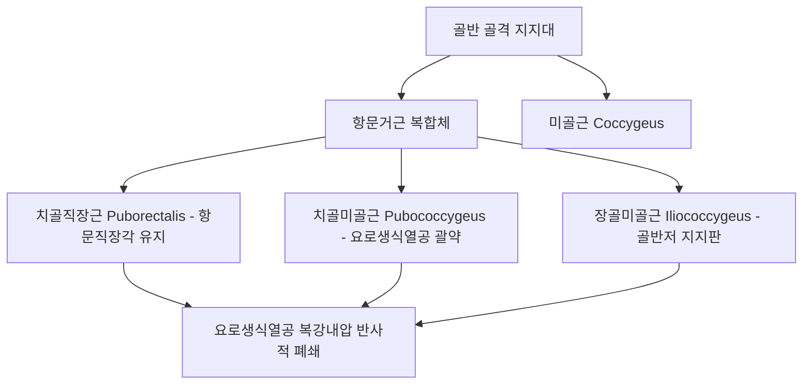
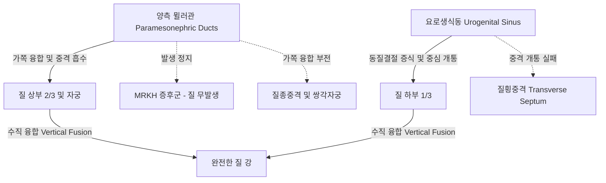
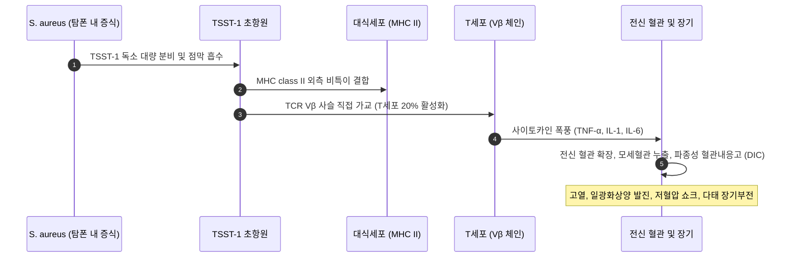

# 📑 [Netter Vol.1] Day 07: 질 - 해부·골반지지·질염·골반장기탈출증 및 종양학 (Section 7 완독)

> 📖 **원서 출처**: [The Netter Collection of Medical Illustrations - Volume 1, Reproductive System.pdf (pp. 130-151)](https://drive.google.com/file/d/1x-xTgPfUfiK7dsQyp5L5qfjFYSD_XyGm/view?usp=drivesdk)  
> 🏷️ **범위**: Section 7 전편 (Plate 7-1 ~ Plate 7-22, 총 22개 플레이트 전수 포함)  
> 📌 **핵심 테마**: 질의 정밀 해부학 및 드랜시(DeLancey) 3수준 골반 지지 체계, 여성 요도 괄약 메커니즘 및 복압성 요실금, 비각화 중층편평상피 조직학 및 에스트로겐 질세포학(MI/Döderlein 젖산간균), 뮐러관-요로생식동 발생 기형(MRKH 증후군 vs 처녀막폐쇄증), 3대 질염(세균성 질증, 칸디다, 트리코모나스) 감별 진단 및 독성 쇼크 증후군(TSS TSST-1), 골반장기탈출증(POP - 방광류, 직장류, 장류) 병태생리 및 비뇨생식/장질 누공, 폐경후 비뇨생식기 증후군(GSM) 및 원발성·전이성 질 악성종양학

---

## 1. 개요 및 마스터 요약 (Executive Summary)

1. **질의 구조 및 드랜시(DeLancey) 3단계 골반 지지 체계**:
   - 질은 전벽(약 $7.5\text{ cm}$)과 후벽(약 $9.0\text{ cm}$)으로 이루어진 근섬유성 관으로, 상단에서 자궁경부를 감싸며 **질원개(Fornices - 전·후·측원개)**를 형성함. 특히 **후원개(Posterior fornix)**는 더글라스와(Pouch of Douglas)의 복막과 직접 맞닿아 있어 복강내 혈복강(골반천자 Culdocentesis) 진단 및 골반경/질식 수술의 핵심 진입로가 됨.
   - **DeLancey 3대 지지 수준**:
     - **Level I (첨부 현수, Apical suspension)**: 기자인대(Cardinal / Mackenrodt)와 자궁천골인대(Uterosacral)가 자궁경부와 상부 질을 천골(S2-S4) 및 골반 측벽에 매달아 지지.
     - **Level II (측방 부착, Lateral attachment)**: 치골자궁경부근막(전벽) 및 직장질근막(후벽)이 골반근막건궁(ATFP, Arcus tendineus fasciae pelvis)에 양측으로 단단히 부착.
     - **Level III (원위 융합, Distal fusion)**: 질 하단부가 회음체(Perineal body), 회음막, 요도괄약근과 직접 융합하여 골반저를 완성.
2. **질 조직학, 호르몬 세포학 및 정상 미생물총**:
   - 질 점막은 **비각화 중층편평상피(Non-keratinized stratified squamous epithelium)**로 덮여 있으며, **자체 선(Gland)이 전무함**. 질 윤활액은 고유층 모세혈관총의 여과액(Transudate)과 자궁경부 점액, 바르톨린/스킨선의 분비액으로 형성됨.
   - 에스트로겐은 상피 세포의 글리코겐 축적을 유도하며, 정상 상주균인 **데덜라인 유산간균(Lactobacillus acidophilus)**이 이를 젖산(Lactic acid)으로 분해하여 **정상 산성 환경(pH 3.8~4.5)**을 유지, 병원균 증식을 차단함.
3. **질 발생 및 선천성 기형의 감별**:
   - 질의 기원은 2원적임: 상부 $2/3$는 **뮐러관(Paramesonephric duct)** 융합체 유래, 하부 $1/3$은 **요로생식동(Urogenital sinus)** 유래의 질판(Vaginal plate)이 개통(Canalization)되어 형성됨.
   - **MRKH 증후군(Mayer-Rokitansky-Küster-Hauser)**: 46,XX 정상 핵형, 뮐러관 무발생으로 질 상부와 자궁이 결손되나 난소 기능과 이차성징은 정상임.
   - **처녀막폐쇄증(Imperforate hymen)**: 요로생식동 기원의 처녀막 중심부 흡수 실패로 발생. 사춘기 여아에서 무월경, 주기적 골반통, 청자색 팽륜 막(Bulging membrane), **질혈종(Hematocolpos)** 유발 $\rightarrow$ 십자형 절개술(Hymenotomy)로 치유.
4. **3대 질염 및 감염병의 핵심 감별**:
   - **세균성 질증(BV)**: 혐기성균 및 *Gardnerella* 과증식. 묽은 회백색 분비물, 생선 비린내, **Whiff test (+)**, **단서세포(Clue cells > 20%)**, pH > 4.5 $\rightarrow$ Metronidazole.
   - **칸디다 질염(VVC)**: *Candida albicans*. 치즈 찌꺼기/두부 비지 모양 분비물, 극심한 가려움, **정상 pH (< 4.5)**, KOH 도말상 **가성균사(Pseudohyphae)** $\rightarrow$ Fluconazole.
   - **트리코모나스 질염(TV)**: 편모 원충. 기포성 황록색 악취 분비물, **딸기양 자궁경부(Strawberry cervix)**, pH > 5.0 $\rightarrow$ **배우자 동시 경구 Metronidazole 치료 필수**.
5. **골반장기탈출증(POP), 누공 및 질 종양학**:
   - 지지 구조 손상에 따라 **방광류(Cystocele, 전벽 결손)**, **직장류(Rectocele, 후벽 결손, 배변 시 질벽 압박 배변 필요)**, **장류(Enterocele, 더글라스와의 진성 소장 탈장)** 발생.
   - **방광질누공(VVF)**: 지속적 무통성 요누출. 후진국은 난산, 선진국은 부인과 수술 및 방사선 치료가 주원인.
   - **질 악성종양**: 원발성 질암은 90%가 편평세포암(SCC, HPV 연관)이며 방사선 치료가 근간임. 반면 모체 DES 노출과 연관된 **투명세포선암(Clear cell adenocarcinoma)**, 소아의 포도송이양 **횡문근육종(Sarcoma botryoides)**, 융모암종/신세포암의 혈행성 전이 병변은 고유의 임상적 특징을 가짐.

---

## 2. 정상 해부학 및 골반저 지지 구조 (Plates 7-1 ~ 7-5)

### Plate 7-1 | 질의 해부학 (The Vagina)

![[Netter_V1_Plate7-1.png]]

#### 1) 질의 형태학, 주행축 및 원개(Fornices)
- **주행 및 각도**: 질은 수평선에 대해 약 $45^\circ$ 후상방(천골 갑각 방향)으로 주행하며, 방광 경부 및 요도 후방, 직장 전방에 위치합니다.
- **벽의 길이**:
  - **전벽 (Anterior wall)**: 약 $7.5\text{ cm}$. 방광 기저부 및 요도와 밀접하게 부착되어 있습니다.
  - **후벽 (Posterior wall)**: 약 $9.0\text{ cm}$. 자궁경부의 질 돌출부 후방으로 더 깊게 연장되어 있습니다.
- **질원개 (Vaginal Fornices)**: 자궁경부 질부(Portio vaginalis) 주위를 둥글게 둘러싸는 맹낭 구조:
  1. **전원개 (Anterior fornix)**: 얕으며 방광 기저부와 인접.
  2. **후원개 (Posterior fornix)**: 가장 깊은 함몰부로, 복강의 최하단인 **더글라스와(자궁직장와, Pouch of Douglas)**를 덮는 복막과 불과 수 밀리미터의 얇은 질벽 및 결합조직을 사이에 두고 접함. 자궁외임신 파열 시 혈복강 진단을 위한 **골반천자(Culdocentesis)**의 바늘 자입 부위.
  3. **외측원개 (Lateral fornices, 좌우 한 쌍)**: 기자인대(Cardinal ligament), 자궁동맥(Uterine artery)의 상행분지, 그리고 자궁경부 외측 $1.5\sim 2\text{ cm}$ 지점에서 자궁동맥 아래를 교차 주행하는 **요관(Ureter)**과 해부학적으로 극히 인접함.

#### 2) 혈관 공급 및 림프 배액
- **동맥 공급**:
  - **질동맥 (Vaginal artery)**: 내장골동맥(Internal iliac a.)의 전분지에서 직접 분지.
  - **자궁동맥의 질가지 (Vaginal branches of uterine a.)**: 자궁경부-질 이행부 관류.
  - **내음부동맥 (Internal pudendal a.)** 및 **중직장동맥 (Middle rectal a.)**: 하부 질벽에 혈류 공급.
  - 전후 정중선에서 문합하여 **기정맥통 (Azygos arteries of the vagina)** 형성.
- **림프 배액 (구역별 분기)**:
  - **상부 1/3 (자궁경부와 동일)**: 내장골(Internal iliac) 및 외장골(External iliac) 림프절.
  - **중부 1/3**: 내장골 림프절 (폐쇄 림프절 포함).
  - **하부 1/3 (외음부와 동일)**: 표재 서혜 림프절 (Superficial inguinal lymph nodes) $\rightarrow$ 심서혜(Cloquet) $\rightarrow$ 외장골 림프절.

---

### Plate 7-2 | 골반격막 I: 하방 시점 (Pelvic Diaphragm I — From Below)

![[Netter_V1_Plate7-2.png]]

#### 1) 항문거근(Levator Ani) 복합체의 3대 구성 근육
회음부 측에서 관찰한 골반격막은 골반 장기를 공이(Hammock) 형태로 받치는 핵심 근육층입니다:
1. **치골직장근 (Puborectalis m.)**:
   - 치골 결합 양측 후면에서 기원하여 직장-항문 연결부 후방을 U자형 고리(Sling) 모양으로 감싸며 주행.
   - 안정 시 지속적으로 수축하여 **항문직장각(Anorectal angle, 약 $80^\circ$)**을 전방으로 당겨 유지함으로써 고형 대변의 실금을 방지하는 핵심 기전 담당.
2. **치골미골근 (Pubococcygeus m.)**:
   - 치골 후면에서 기원하여 요로생식열공(Urogenital hiatus) 양측을 지나 회음체(Perineal body), 항문미골봉선(Anococcygeal raphe) 및 미골에 부착. 질벽 외측 섬유와 융합(Pubovaginalis)하여 질을 지지.
3. **장골미골근 (Iliococcygeus m.)**:
   - 골반 측벽의 **골반근막건궁(Arcus tendineus levator ani, ATLA)**에서 기원하여 후내측으로 주행, 항문미골체 및 미골에 부착하는 편평하고 얇은 근판.

#### 2) 요로생식열공 및 좌골항문와
- **요로생식열공 (Urogenital Hiatus)**: 좌우 치골직장근/치골미골근의 내측 연 사이에 형성된 역V자형 틈새로 요도와 질이 통과함. 이 열공의 과도한 확장(Hiatal ballooning)이 골반장기탈출증 발생의 핵심 물리적 소인임.
- **좌골항문와 (Ischioanal Fossa)**: 골반격막 하방 양측에 위치하는 대형 피하지방 공간으로, 외측벽의 근막관인 **알콕관(Alcock's pudendal canal)** 내로 음부신경(Pudendal n.)과 내음부혈관이 주행함.

---

### Plate 7-3 | 골반격막 II: 상방 시점 (Pelvic Diaphragm II — From Above)

![[Netter_V1_Plate7-3.png]]

#### 1) 복강·골반내 시점에서 본 골반벽 및 바닥 구조
- **미골근 (Coccygeus / Ischiococcygeus m.)**: 좌골극(Ischial spine)에서 기원하여 천골 하부 및 미골 외측에 부착. **천골극인대(Sacrospinous ligament)**의 내측면에 직접 밀착하여 주행하며 제4·5 천골신경의 지배를 받음.
- **이상근 (Piriformis m.)**: 천골 전면(S2-S4 척추공 외측)에서 기원하여 대좌골공(Greater sciatic foramen)을 통과해 대퇴골 대전자(Greater trochanter)에 정착. 천골신경총(Sacral plexus)의 신경근들이 이상근 전면을 덮으며 주행.
- **폐쇄내근 (Obturator Internus m.)**: 폐쇄막 내면 및 주변 골반골에서 기원하여 소좌골공을 통해 대퇴골 후면으로 주행. 그 표면을 덮는 두꺼운 폐쇄근막(Obturator fascia) 중앙의 백색 섬유성 비후선이 바로 **골반근막건궁(ATLA)**임.



---

### Plate 7-4 | 골반 장기의 지지 체계 (Support of Pelvic Viscera)

![[Netter_V1_Plate7-4.png]]

#### 1) 드랜시(DeLancey)의 골반 장기 지지 3대 수준 (Levels of Support)
비뇨부인과학에서 골반저 결손 및 탈출증의 병태생리를 설명하는 표준 분류 체계:

| 수준 | 지지 인대 및 구조물 | 해부학적 부착 부위 | 결손 시 발생하는 임상 질환 |
| :--- | :--- | :--- | :--- |
| **Level I**<br>(첨부 현수, Apical Suspension) | **기자인대** (Cardinal / Mackenrodt lig.)<br>**자궁천골인대** (Uterosacral lig.) | 자궁경부 및 상부 질(원개)을 골반 측벽 및 **천골 전면(S2-S4)**에 수직으로 매달아 지지 | **자궁 탈출증 (Uterine prolapse)**<br>**질원개 탈출증 (Vaginal vault prolapse)**<br>**장류 (Enterocele)** |
| **Level II**<br>(측방 부착, Lateral Attachment) | **치골자궁경부근막** (Pubocervical fascia)<br>**직장질근막** (Rectovaginal fascia) | 중간부 질벽을 양측 **골반근막건궁 (ATFP)** 및 장골미골근막에 신장 부착 | **방광류 (Cystocele)**<br>**직장류 (Rectocele)** |
| **Level III**<br>(원위 융합, Distal Fusion) | **회음체** (Perineal body)<br>**회음막** (Perineal membrane)<br>표재/심부 회음근육 | 질 원위 1/3이 회음체 및 요도와 직접 융합 (중간 근막층 부재) | **요도류 (Urethrocele)**<br>**회음체 파열 및 열개** |

#### 2) 자궁천골인대 및 기자인대의 생역학
- **기자인대 (Mackenrodt's ligament)**: 자궁동맥과 정맥총을 둘러싸는 치밀한 혈관주위 결합조직(Perivascular sheath)으로, 질의 외측 안정성을 부여.
- **자궁천골인대 (Uterosacral ligament)**: 자궁경부 후상방에서 천골 전면의 골막으로 이어지는 강인한 섬유근성 띠로, 질 축을 직장 위로 수평에 가깝게 견인하여 복강내압 상승 시 질 전벽이 후벽 위로 눌려 닫히는 판막(Flap valve) 효과 형성.

---

### Plate 7-5 | 여성 요도 (Female Urethra)

![[Netter_V1_Plate7-5.png]]

#### 1) 요도의 주행 및 괄약 메커니즘
- **길이 및 주행**: 길이 약 $3.5\sim 4.0\text{ cm}$, 직경 약 $6\text{ mm}$. 방광경부에서 질전정의 외요도구까지 치골 결합 후면을 따라 전하방으로 완만하게 만곡 주행.
- **2중 괄약근 구조**:
  1. **내요도괄약근 (Internal urethral sphincter)**: 방광경부의 불수의적 평활근 고리로 자율신경(교감신경 $\alpha_1$ 수용체) 지배.
  2. **외요도횡문괄약근 (Rhabdosphincter / External urethral sphincter)**: 요도 중간 $1/3$ 부위를 오메가($\Omega$)자형으로 감싸는 수의적 횡문근. 근위부의 요도압박근(Compressor urethrae) 및 요도질괄약근(Urethrovaginal sphincter)과 함께 작용하여 기침, 운동 등 복압 급증 시 즉각적인 요도 폐쇄압 형성.
- **해먹 가설 (DeLancey's Hammock Hypothesis)**:
  - 요도는 독립된 관이 아니라 하방의 **질 전벽 및 치골자궁경부근막이라는 탄력성 지지 해먹(Suburethral hammock)** 위에 얹혀 있음.
  - 복강내압이 상승할 때 하부 해먹 지지대가 견고하면 요도가 지지대에 눌려 자연스럽게 압착·폐쇄됨. 분만 손상으로 해먹이 파열되거나 ATFP에서 박리되면 복압 상승 시 요도가 하방으로 과운동(Hypermobility)하며 **복압성 요실금(Stress Urinary Incontinence, SUI)** 발생.

> ⚠️ **Clinical Pearl: 복압성 요실금(SUI)의 양대 병태생리**  
> 1. **요도 과운동성 (Urethral Hypermobility, 90%)**: 골반저 지지 해먹 손상으로 Q-tip 검사상 각도 변화 $> 30^\circ$. $\rightarrow$ **중부요도 슬링 수술(TVT, TOT)**이 표준 완치법.  
> 2. **내인성 요도괄약근 결손 (Intrinsic Sphincter Deficiency, ISD, 10%)**: 요도 자체 점막 및 괄약근 위축으로 요도폐쇄압이 $20\text{ cmH}_2\text{O}$ 미만으로 저하되어 경미한 움직임에도 요누출 발생.

---

## 3. 조직학, 세포학 및 선천 기형 (Plates 7-6 ~ 7-9)

### Plate 7-6 | 외음부 및 질의 조직학 (Vulva and Vagina Histology)

![[Netter_V1_Plate7-6.png]]

#### 1) 질 점막의 4대 층상 상피 구조
질 점막은 케라틴 각화층이 없는 **비각화 중층편평상피(Non-keratinized stratified squamous epithelium)**로 구성됩니다:
1. **기저층 (Stratum basale)**: 기저막 위에 위치하는 단일층의 입방/원주세포. 활발한 유사분열로 상피 재생 담당.
2. **방기저층 (Stratum parabasale)**: 다각형의 미성숙 세포층. 에스트로겐 결핍 시 상피의 최상층이 됨.
3. **중간층 (Stratum intermedium)**: 세포질이 풍부하고 세포간교(Intercellular bridges)를 형성하며, **글리코겐(Glycogen)**을 대량 합성 및 저장.
4. **표재층 (Stratum superficiale)**: 편평하고 응축된 작은 농축핵(Pyknotic nucleus)을 지닌 성숙 세포층. 에스트로겐 자극 극대기(배란기)에 현저히 두꺼워짐.

#### 2) 분비 기전: 자체 선(Gland)의 부재와 누출액(Transudate)
- 질 점막 자체에는 **점액선이나 분비선이 단 하나도 존재하지 않습니다**.
- 성적 흥분 시 질벽의 급속한 윤활 작용은 점막하 고유층(Lamina propria)의 풍부한 혈관망 확장으로 인한 **혈장 여과 누출액(Vascular transudation)**에 의해 일어나며, 평상시 질액은 자궁경부 점액선 분비물과 탈락 상피세포의 혼합물입니다.

---

### Plate 7-7 | 질 상피 세포학 (Vagina — Cytology)

![[Netter_V1_Plate7-7.png]]

#### 1) 호르몬 변화에 따른 성숙 지수 (Maturation Index, MI)
질 측벽 상피세포를 채취하여 **방기저세포(P) : 중간세포(I) : 표재세포(S)**의 백분율 비율로 난소 호르몬 활성도를 정밀 평가:

```
[Maturation Index] = % Parabasal cells : % Intermediate cells : % Superficial cells
```

- **에스트로겐 우세 상태 (난포기 후기 및 배란기)**:
  - 표재세포 급증 (예: `0 : 30 : 70`).
  - 세포질이 호산성(Pink/Red)을 띠고 핵이 직경 $6\,\mu\text{m}$ 미만의 진한 농축핵(Pyknotic)으로 변함 (**핵농축지수 KPI 상승**).
- **프로게스테론 우세 상태 (황체기 및 임신기)**:
  - 중간세포 극대화 (예: `0 : 80 : 20`).
  - 세포 가장자리가 안쪽으로 접히며 배 모양을 이루는 **주상세포(Navicular cells)** 다수 출현 및 세포 탈락 촉진.
- **에스트로겐 결핍 상태 (소아기 및 폐경 후)**:
  - 극심한 좌측 이동 (예: `80 : 20 : 0`).
  - 미성숙 원형의 방기저세포가 시야를 장악하며 글리코겐 고갈.

#### 2) 데덜라인 젖산간균(Döderlein's Bacillus)과 질 생태계
- 에스트로겐 자극으로 표재·중간세포 내에 축적된 글리코겐은 세포 탈락 시 분해되어 포도당 방출.
- 상주균인 **Lactobacillus acidophilus (데덜라인 간균)**이 포도당을 발효시켜 **젖산(Lactic acid)** 생성.
- 결과: **질내 정상 산도(pH 3.8 ~ 4.5) 유지** $\rightarrow$ 대장균, 혐기성 세균, 진균의 이상 증식을 억제하는 천연 방어선 구축.

---

### Plate 7-8 | 선천성 기형 (Congenital Anomalies)

![[Netter_V1_Plate7-8.png]]

#### 1) 뮐러관(Paramesonephric duct) 및 요로생식동의 발생학적 융합 부전
질의 발생은 상부 $2/3$(뮐러관 하단 융합)와 하부 $1/3$(요로생식동 질결절에서 기원한 질판의 함입 개통)의 복합체입니다:



1. **질 무발생 (MRKH 증후군, Mayer-Rokitansky-Küster-Hauser Syndrome)**:
   - 발생률: 여아 4,500명당 1명.
   - **임상 양상**: 46,XX 정상 여성 핵형. 정상 난소 기능(배란 정상), 정상 유방 및 치모 발달(이차성징 정상). 그러나 질 상부와 자궁이 선천적으로 결손되어 **원발성 무월경(Primary amenorrhea)**으로 내원.
   - 동반 기형: 환자의 약 30~40%에서 신장 기형(편측 신장 무발생, 골반신), 10~15%에서 골반/척추 골격 기형 동반.
   - 치료: 점진적 질 확장기 요법(Frank dilator method) 또는 질성형술(McIndoe vaginoplasty).
2. **질횡중격 (Transverse Vaginal Septum)**:
   - 뮐러관과 요로생식동의 수직 융합 부위 접합 실패. 대개 질 상부와 중부 경계에 위치.
   - 완전 폐쇄 시 초경 후 질혈종 및 골반통 유발, 불완전 폐쇄 시 성교통 또는 분만 장애 유발.
3. **질종중격 (Longitudinal Vaginal Septum)**:
   - 뮐러관의 외측 융합 실패로 질 내부에 세로 방향의 중격이 존재. **중복자궁(Uterus didelphys)**과 흔히 동반됨.

---

### Plate 7-9 | 처녀막폐쇄증, 질혈종 및 섬유성 처녀막 (Imperforate Hymen, Hematocolpos, Fibrous Hymen)

![[Netter_V1_Plate7-9.png]]

#### 1) 처녀막폐쇄증(Imperforate Hymen)의 병태생리 및 단계적 진행
처녀막(Hymen)은 질판이 개통된 후 질 입구에 남는 얇은 점막 주름이나, 중심부 상피 흡수가 일어나지 않아 질구가 완전히 막히는 질환입니다:
- **무증상 잠복기**: 소아기에는 증상이 없으나 간혹 모체 에스트로겐 영향으로 질 분비물이 차서 점액질종(Hydrocolpos/Mucocolpos) 형성 가능.
- **사춘기 급성기**:
  - 초경 연령 도달 시 자궁내막 출혈이 외부로 배출되지 못하고 질 내에 정체.
  - 매달 월경 주기마다 출혈이 누적되어 질이 거대하게 팽창: **질혈종(Hematocolpos)**.
  - 더 진행되면 자궁강 내로 역류하여 **자궁혈종(Hematometra)**, 난관 내로 차오르면 **난관혈종(Hematosalpinx)** 형성.
  - 난관 채를 통해 복강 내로 혈액이 역류하면 무균성 복막염 및 **속발성 골반 자궁내막증(Endometriosis)**, 난관 유착에 의한 영구적 불임 유발.

#### 2) 임상 증상 및 외과적 치료
- **임상 징후**: 이차성징이 완전히 발현된 사춘기 여아의 **원발성 무월경**, 주기적인 심한 하복부 통증, 골반 종괴, 팽창된 질의 방광경부 압박으로 인한 **급성 요폐(Acute urinary retention)**.
- **신체 진찰**: 음순을 벌렸을 때 질 입구를 가로막고 있는 **암적색 또는 청자색의 팽륜된 막(Bulging bluish membrane)**이 즉각 관찰됨.
- **수술적 처치**:
  - **처녀막 십자형 절개 및 절제술 (Cruciate Hymenotomy & Excision)**.
  - 점막을 십자 형태로 절개하여 수년간 고여 있던 암갈색 초콜릿 양상의 점조한 오래된 혈액을 서서히 자연 배액.
  - 처녀막 가장자리를 흡수성 봉합사로 질 점막과 연속 봉합하여 재폐쇄 방지. (주의: 상행성 감염을 유발할 수 있으므로 자궁강 내 세척이나 무리한 소파술은 절대 금기).

---

## 4. 질염, 감염병 및 독성 쇼크 증후군 (Plates 7-10 ~ 7-13)

### Plate 7-10 | 질염 I: 트리코모나스, 칸디다, 세균성 질증 (Vaginitis I — Trichomonas, Monilia, Bacterial Vaginosis)

![[Netter_V1_Plate7-10.png]]

#### 1) 3대 다발성 질염의 감별 진단 완벽 마스터 표

| 감별 항목 | 세균성 질증 (Bacterial Vaginosis, BV) | 칸디다 외음질염 (Candidiasis / Moniliasis) | 트리코모나스 질염 (Trichomoniasis) |
| :--- | :--- | :--- | :--- |
| **원인 병원체** | *Lactobacillus* 소실 + *Gardnerella vaginalis*, *Atopobium*, 혐기성 세균 증식 | *Candida albicans* (85~90%), *Candida glabrata* (진균) | *Trichomonas vaginalis* (운동성 혐기성 편모 원충, **STI**) |
| **분비물 성상** | 묽고 균일한 **회백색 (Thin, homogeneous grayish-white)** | 진하고 농후한 **치즈 찌꺼기/두부 비지 모양 (Curd-like white plaque)** | 다량의 **기포가 섞인 황록색 화농성 (Frothy greenish-yellow)** |
| **임상 증상** | 생선 썩는 듯한 악취 (Fishy odor), 경미한 소양증 | **극심한 외음부 가려움증 (Intense pruritus)**, 작열감, 배뇨통 | 심한 악취, 외음부 동통, 성교통, 작열감 |
| **외음/질 소견** | 염증 징후 거의 없음 (홍반 부재) | 현저한 외음부 홍반, 부종, 찰과상 | 질벽의 심한 발적, **딸기양 자궁경부 (Strawberry cervix)** |
| **질내 산도 (pH)** | **$\mathbf{pH > 4.5}$** (보통 5.0~5.5) | **$\mathbf{pH < 4.5}$** (정상 산성 유지, 4.0~4.5) | **$\mathbf{pH > 5.0}$** (알칼리화, 5.5~6.5) |
| **아민 검사 (Whiff)** | **양성 (+)**: $10\%\text{ KOH}$ 점적 시 즉각 비린내 방출 | 음성 (-) | 양성 또는 위양성 (+/-) |
| **현미경 검사**<br>(Wet mount) | **단서세포 (Clue cells > 20%)**: 상피세포 경계가 세균으로 뒤덮임 | $10\%\text{ KOH}$ 도말상 **가성균사 (Pseudohyphae)** 및 아포 | 생리식염수 도말상 **활발히 회전 운동하는 편모충** 관찰 |
| **표준 치료법** | **Metronidazole** $500\text{ mg}$ bid $\times$ 7일<br>또는 Clindamycin 질크림 | **Fluconazole** $150\text{ mg}$ 단회 경구 복용<br>또는 국소 Clotrimazole 질정 | **Metronidazole** $2\text{ g}$ 단회 경구 복용<br>⚠️ **배우자 반드시 동시 치료 (재감염 방지)** |

> 📌 **Amsel 4대 진단 기준 (세균성 질증, 3개 이상 만족 시 확진)**:  
> 1. 균일하고 묽은 회백색 질 분비물  
> 2. 질내 $\text{pH} > 4.5$  
> 3. $10\%\text{ KOH}$ 첨가 시 비린 아민 냄새 방출 (Whiff test 양성)  
> 4. 생리식염수 현미경 검사상 고배율 시야당 단서세포(Clue cells)가 상피세포의 $20\%$ 이상 관찰  

---

### Plate 7-11 | 질염 II: 성매개 감염 (Vaginitis II — Venereal Infections)

![[Netter_V1_Plate7-11.png]]

#### 1) 주요 성매개 세균 및 바이러스 감염
- **임균 감염증 (Neisseria gonorrhoeae)**:
  - 그람음성 세포내 쌍구균. 주로 자궁경부 원주상피와 요도, 스킨선, 바르톨린선 침범.
  - 황색의 농성 질 분비물, 배뇨통. 적절히 치료하지 않을 경우 상행 감염되어 **골반염증성질환(PID)**, 난관수종, 난관난소농양(TOA) 및 불임 유발.
  - 치료: **Ceftriaxone $500\text{ mg}$ 근주** + 클라미디아 동반 치료를 위한 **Doxycycline $100\text{ mg}$ bid $\times 7$일**.
- **클라미디아 감염증 (Chlamydia trachomatis, D-K 혈청형)**:
  - 가장 흔한 세균성 성매개 감염. 대부분 증상이 경미하거나 무증상(Silent infection).
  - 점액농성 자궁경부염, 접촉성 출혈(Hypertrophic ectopy).
- **단순포진바이러스 (Genital Herpes, HSV-2)**:
  - 홍반성 기저부 위의 다발성 수포 $\rightarrow$ 궤양 형성. 극심한 통증과 양측 서혜부 림프절염. 경구 Acyclovir 또는 Valacyclovir 조기 투여.

---

### Plate 7-12 | 질염 III: 화학적 및 외상성 질염 (Vaginitis III — Chemical, Traumatic)

![[Netter_V1_Plate7-12.png]]

#### 1) 화학적 자극 및 이물질에 의한 비감염성 질염
- **화학적 질염 (Chemical Vaginitis)**:
  - 원인: 잦은 질 세척액(Douching), 살정제(Nonoxynol-9), 라텍스 콘돔, 윤활제, 향료 및 비누에 함유된 화학물질에 대한 자극성 또는 알레르기성 접촉피부염.
  - 증상: 질 점막의 광범위한 발적, 미란, 표재성 궤양, 극심한 화끈거림 및 배뇨통. 분비물 도말 검사상 백혈구 다수 관찰되나 병원체 음성.
  - 처치: 유발 인자 즉각 중단, 좌욕, 생리식염수 세척 및 필요시 단기 국소 스테로이드 요법.
- **이물성 질염 (Foreign Body Vaginitis)**:
  - 원인: **질 내에 장기간 방치된 탐폰(Forgotten tampon)**, 페사리(Pessary), 피임용 캡 또는 소아의 장난감 삽입.
  - 증상: **극도로 지독한 악취를 풍기는 농혈성(Purulent, foul-smelling, brown-bloody) 질 분비물**.
  - 처치: 이물질 즉각 제거, 질강 세척. 2차 감염 및 골반 봉와직염 방지를 위한 항생제 투여.

---

### Plate 7-13 | 독성 쇼크 증후군 (Toxic Shock Syndrome, TSS)

![[Netter_V1_Plate7-13.png]]

#### 1) 병태생리: 포도상구균 초항원(Superantigen)과 사이토카인 폭풍
- **원인균 및 독소**: 고흡수성 탐폰을 장시간 착용한 가임기 여성에서 호발. 질 내 *Staphylococcus aureus*가 증식하며 **독성 쇼크 증후군 독소-1 (TSST-1)** 생성.
- **초항원 기전 (Superantigen Activation)**:
  - 정상적인 항원 제시는 MHC class II와 T세포 수용체(TCR)의 정밀한 결합으로 $0.01\%$ 미만의 T세포만 활성화됨.
  - TSST-1은 항원 가공 없이 **MHC class II 분자의 외측과 TCR의 $V\beta$ 사슬을 비특이적으로 강제 가교(Cross-linking)**시킴.
  - 결과: 체내 T세포의 최대 **$20\%$가 한꺼번에 폭발적으로 활성화**되어 대량의 **사이토카인(TNF-$\alpha$, IL-1, IL-2, IL-6, IFN-$\gamma$) 분출 (Cytokine Storm)**.
  - 전신 모세혈관 누출, 급성 저혈압 쇼크, 다발성 장기 부전(MODS) 초래.



#### 2) CDC 공식 진단 기준 및 응급 처치
1. **발열**: 체온 $\ge 38.9^\circ\text{C}$ ($102^\circ\text{F}$).
2. **발진**: 전신성 미만성 홍반성 황반 발진 (**일광화상양 피부 발진, Sunburn-like rash**).
3. **낙설 (Desquamation)**: 발병 1~2주 후 특히 **손바닥과 발바닥의 표피 탈락**.
4. **저혈압**: 수축기 혈압 $\le 90\text{ mmHg}$ 또는 기립성 실신.
5. **다태 장기 침범 (다음 중 3개 이상)**:
   - 위장관(구토/설사), 근육(CPK 급증, 근육통), 신장(BUN/Cr 2배 이상), 간(AST/ALT 2배 이상), 혈액(혈소판 $< 100,000/\mu\text{L}$), 중추신경계(의식 혼돈).
- **응급 치료 원칙**:
  - 즉각적인 질 내 탐폰 제거 및 병소 세척.
  - 대량의 등장성 정맥 수액 투여 및 승압제(Norepinephrine) 투입.
  - 항생제: 단백질 독소 합성을 억제하는 **Clindamycin** + 내성균 커버를 위한 **Vancomycin** 또는 Cefazolin 정맥 병용 투여.

---

## 5. 외상, 골반장기탈출증 및 누공 (Plates 7-14 ~ 7-17)

### Plate 7-14 | 질 외상 및 열상 (Trauma)

![[Netter_V1_Plate7-14.png]]

#### 1) 성교 외상, 낙상 외상 및 분만 손상
- **성교성 열상 (Coital Laceration)**:
  - 처녀막 파열 외에, 폐경 후 위축성 질 점막, 출산 직후 수유기, 혹은 격렬한 성교 시 발생.
  - **호발 부위**: **질 후원개(Posterior fornix)**의 횡형 열상이 가장 흔함.
  - 심할 경우 더글라스와 복막까지 관통하여 복강내 장기 탈출(Evisceration) 및 대량 복강내 출혈 유발 가능.
- **가랑이 외상 (Straddle Injury)**:
  - 자전거 프레임, 울타리 등에 가랑이를 부딪쳐 발생.
  - 점막 열상 없이 심부 혈관이 파열되면 다토스/콜리스 근막 하방 및 측질강(Paravaginal space)으로 혈액이 스며들어 **거대 질 혈종(Vaginal hematoma)** 형성. 후복막강으로 상행 팽창할 수 있어 주의 요망.
- **처치 원칙**: 진정 마취 하에 질경으로 원개 끝까지 시야를 확보하여 복막 천공 유무를 확인하고, 흡수성 봉합사로 사강(Dead space) 없이 층별 봉합.

---

### Plate 7-15 | 방광류 및 요도류 (Cystocele, Urethrocele)

![[Netter_V1_Plate7-15.png]]

#### 1) 전벽 구획 탈출증의 병태생리
- **방광류 (Cystocele)**:
  - 질 전벽을 지지하는 **치골자궁경부근막(Pubocervical fascia)**의 손상 및 신장으로 방광 기저부가 질강 내로 밀려 내려오는 탈출증.
  - **중앙 결손 (Central defect)**: 치골자궁경부근막 자체의 중앙 파열로 질 주름(Rugae)이 소실되고 편평한 방광 낭이 돌출.
  - **측방 결손 (Paravaginal defect)**: 근막이 양측 골반근막건궁(ATFP) 부착부에서 뜯겨 떨어져 발생.
- **임상 증상**:
  - 질 입구로 묵직한 덩어리가 빠져나오는 느낌(Bulge sensation).
  - 배뇨 곤란, 잔뇨감, 방광염 재발.
  - 탈출증이 심해지면 요도가 꺾여(Kinking) 오히려 요실금이 가려지며, 탈출된 방광을 손으로 밀어 넣어야 소변이 나오는 **수동 정복 배뇨(Splinting)** 발생.
- **수술적 치료**:
  - **전질벽 성형술 (Anterior Colporrhaphy)**: 치골자궁경부근막을 정중선에서 접어 겹쳐 꿰매는 중첩 봉합술(Plication).

---

### Plate 7-16 | 직장류 및 소장류 (Rectocele, Enterocele)

![[Netter_V1_Plate7-16.png]]

#### 1) 직장류 vs 소장류의 감별 및 병태생리
- **직장류 (Rectocele)**:
  - 질 후벽과 직장 전벽 사이를 가로막는 **직장질근막(Rectovaginal septum / Denonvilliers' fascia)** 및 회음체의 파열로 직장 전벽이 질강 내로 헤르니아처럼 돌출.
  - **특이 증상**: 배변 장애(배변 시 힘을 주면 변이 항문으로 가지 않고 질 쪽으로 불룩하게 쏠림). 환자가 질 후벽을 손가락으로 눌러야만 배변이 가능한 **수지 지지 배변(Digital splinting)** 호소.
- **소장류 (Enterocele)**:
  - 단순 근막 결손이 아니라, 자궁직장와(더글라스와)의 복막 주머니가 질 후원개와 직장질중격 사이로 깊게 함입되어 **소장 고리(Small bowel loops)를 포함하는 진성 탈장(True hernia)**.
  - 자궁절제술 후 Level I 첨부 지지가 붕괴된 환자에서 호발.

| 질환 | 주된 결손 부위 | 주머니 내부 내용물 | 직장-질 수지검사 소견 |
| :--- | :--- | :--- | :--- |
| **직장류 (Rectocele)** | 질 하부~중부 후벽 | **직장 전벽 (Rectal wall)** | 직장 내 손가락이 질강 쪽으로 쉽게 전방 만곡됨 |
| **소장류 (Enterocele)** | 질 최상부 후원개 | **복막 낭 및 소장 고리 (Small bowel)** | 기침 시 직장과 질벽 사이에서 연동 운동하는 장벽 촉지 |

---

### Plate 7-17 | 비뇨생식관 및 소화기 누공 (Fistulae)

![[Netter_V1_Plate7-17.png]]

#### 1) 누공의 분류, 병인 및 진단 기법
- **방광질누공 (Vesicovaginal Fistula, VVF)**:
  - 방광과 질 사이에 비정상적인 연결 통로 형성.
  - **원인**:
    - 개발도상국: 분만 지연 및 감입(Obstructed prolonged labor) 시 태아 머리에 의한 장시간 방광벽 압박 괴사 (압박 괴사형).
    - 선진국: **복식/질식 전자궁절제술 시 방광 박리 손상(75%)**, 골반 악성종양 방사선 치료 후 허혈성 괴사.
  - **특징적 증상**: 정상 배뇨와 무관하게 밤낮으로 질을 통해 **소변이 쉼 없이 지속적으로 흘러나옴 (Painless continuous urine leakage)**.
  - **3중 면봉 검사 (Three-swab test)**: 방광에 메틸렌 블루(Methylene blue) 색소를 주입하고 질 내에 3개의 면봉을 삽입 후 보행 $\rightarrow$ 상부 면봉만 젖으면 VVF, 젖지 않고 젖은 패드에 경구 섭취한 페나조피리딘(오렌지색)만 묻으면 **요관질누공(Ureterovaginal fistula)**으로 감별.
- **직장질누공 (Rectovaginal Fistula, RVF)**:
  - 직장과 질 사이의 누공으로, 질을 통해 가스(방귀)나 대변이 배출됨.
  - 원인: 3도·4도 회음 열상, 크론병(Crohn's disease), 방사선 괴사.
  - 치료: 염증이 완전히 가라앉은 3~6개월 후 마르티우스 피판(Martius labial fat flap) 등을 이용한 층별 누공 봉합술 시행.

---

## 6. 위축성 질환, 양성 및 악성 종양, 자궁내막증 (Plates 7-18 ~ 7-22)

### Plate 7-18 | 위축성 질염 및 폐경후 변화 (Atrophic Conditions)

![[Netter_V1_Plate7-18.png]]

#### 1) 폐경후 비뇨생식기 증후군 (GSM, Genitourinary Syndrome of Menopause)
- **병태생리**:
  - 폐경, 난소절제술, 수유, 항호르몬 치료로 혈중 에스트로겐 수치가 급감.
  - 질 점막 상피 세포 증식 중단 $\rightarrow$ 상피층이 $3\sim 4$개 세포층으로 극도로 얇아짐(위축).
  - 글리코겐 생산 소실 $\rightarrow$ 데덜라인 젖산간균 사멸 $\rightarrow$ **질내 산도 알칼리화 ($\mathbf{pH > 5.5\sim 6.5}$)**.
  - 장내 세균총 및 혐기성균 과증식, 모세혈관 취약성 증가로 점상 출혈 및 표재 미란 형성.
- **임상 징후**:
  - 극심한 질 건조감, 화끈거림, 성교통(Dyspareunia), 접촉성 출혈.
  - 질벽 주름(Rugae) 소실, 창백하고 매끈한 점막, 질 입구 협착.
  - 빈뇨, 절박뇨, 재발성 방광염 등 하부요로 증상 동반.
- **치료**:
  - 일차 치료: 비호르몬성 질 보습제(Moisturizer) 및 윤활제(Lubricant).
  - 근본 치료: **국소 질 에스트로겐 요법 (Topical vaginal estrogen - 크림, 정제, 링)**. 전신 흡수가 극히 미미하여 자궁내막 증식 위험 없이 질 점막 상피를 신속히 재성숙시키고 정상 젖산 환경을 복원함.

---

### Plate 7-19 | 질 낭종 및 양성 종양 (Cysts and Benign Tumors)

![[Netter_V1_Plate7-19.png]]

#### 1) 상피 봉입 낭종 vs 가트너관 낭종의 감별
1. **표피포함낭종 (Epidermal Inclusion Cyst)**:
   - **질 내에서 가장 흔한 낭종**.
   - **호발 부위**: **질 후벽 또는 외측벽 하부** (과거 분만 시 회음절개 부위나 열상 봉합선).
   - 병인: 외과적 봉합이나 외상 시 편평상피 조각이 점막하 결합조직 내로 함입되어 증식, 내부가 치즈 같은 **케라틴 파편(Keratin debris)**으로 채워짐.
2. **가트너관 낭종 (Gartner Duct Cyst)**:
   - **호발 부위**: **질 전외측벽 상부 (Anterolateral upper vagina)**.
   - 발생학적 기원: 태생기 **중신관(볼프관, Mesonephric / Wolffian duct)** 잔유물이 퇴화하지 않고 액체가 고여 형성된 선천성 낭종. 비점액성 입방/원주상피로 덮여 있음. 요관 이소개구 등 비뇨기계 기형 동반 여부 확인 필요.
3. **질 평활근종 (Vaginal Leiomyoma)**:
   - 질벽의 평활근 섬유에서 기원하는 드문 양성 고형 종양. 무통성 점막하 결절로 촉진되며 육종과의 감별을 위해 단순 절제 생검 시행.

---

### Plate 7-20 | 자궁내막증 I: 외음, 질, 자궁경부 (Endometriosis I — Vulva, Vagina, Cervix)

![[Netter_V1_Plate7-20.png]]

#### 1) 질 및 직장질중격 자궁내막증의 병변 양상
- **심부 침윤성 자궁내막증 (Deep Infiltrating Endometriosis, DIE)**:
  - 더글라스와에 착상된 자궁내막 조직이 복막 아래로 $5\text{ mm}$ 이상 침투하여 **질 후원개 및 직장질중격(Rectovaginal septum)**으로 침범.
  - **육안 소견**: 질 후원개 점막에 청자색 또는 암갈색의 **'오디 모양(Mulberry-like / Blue-dome)'** 결절 형성.
  - **임상 3대 증상**:
    1. **심부 성교통 (Deep dyspareunia)**: 성교 시 경부 후방 압박에 의한 격심한 통증.
    2. **배변통 (Dyschezia)**: 월경 시 직장 침범 부위 자극으로 배변 시 극심한 통증.
    3. **월경 시 질 점막 주기적 출혈**.
- **회음부 자궁내막증**: 질식 분만 시 회음절개 반흔(Episiotomy scar)에 자궁내막 세포가 직접 기계적으로 이식되어 발생. 월경 주기에 따라 크기가 커지고 통증을 동반하는 반흔 결절.

---

### Plate 7-21 | 질 악성 종양 I: 원발성 악성 종양 (Malignant Tumors I — Primary)

![[Netter_V1_Plate7-21.png]]

#### 1) 원발성 편평세포암 및 전암 병변
- **역학**: 여성 생식기 악성종양의 $1\sim 2\%$에 불과한 극히 드문 암. 자궁경부암이나 외음부암의 병력이 없어야 원발성 질암으로 정의.
- **위험 인자**: **고위험군 인유두종바이러스(HPV 16, 18형)** 감염, 흡연, 다수의 성 파트너.
- **전암 병변**: **질상피내종양 (Vaginal Intraepithelial Neoplasia, VaIN)**:
  - VaIN I: 하층 $1/3$ 이형성 (경과 관찰).
  - VaIN II/III (HSIL): 전층 이형성 $\rightarrow$ 레이저 소작술, 국소 Imiquimod, 광범위 국소 절제술.
- **침윤성 편평세포암 (Squamous Cell Carcinoma, SCC, 85~90%)**:
  - 주로 **질 상부 $1/3$의 후벽**에서 호발. 외장성(외성장성 종괴) 또는 궤양성 출혈 병변.

#### 2) 특수 조직형 질암
- **투명세포선암 (Clear Cell Adenocarcinoma)**:
  - 1940~1970년대 유산 방지 목적으로 **합성 에스트로겐 제제인 디에틸스틸베스트롤(DES)을 복용한 산모에게서 태어난 딸(DES daughters)**에서 $15\sim 25$세 전후 호발.
  - 전구 병변: **질 선증(Vaginal adenosis)** - 질 편평상피 내에 뮐러관 기원의 원주상피가 섬처럼 잔존.
- **포도송이양 육종 (Sarcoma Botryoides / 소아 횡문근육종)**:
  - 5세 미만 영유아 호발. 질 입구로 **'포도송이 모양(Grape-like clusters)'**의 반투명한 폴립 덩어리가 튀어나옴. 조직학적으로 상피 하층의 치밀한 종양세포층(**형성층, Cambium layer**) 관찰.

---

### Plate 7-22 | 질 악성 종양 II: 전이 및 침윤 (Malignant Tumors II — Metastases and Extension)

![[Netter_V1_Plate7-22.png]]

#### 1) 이차성 전이성 암종의 압도적 빈도
질에 발생하는 악성 종양의 **$80\%$ 이상은 타 장기에서 유래한 전이성 암(Secondary / Metastatic carcinoma)**입니다:
1. **직접 연속 침윤 (Direct Extension)**:
   - **자궁경부암(Cervical cancer)**의 하방 질벽 침윤 (가장 흔함).
   - 자궁내막암, 외음부암, 직장암, 방광암의 직접 침습.
2. **혈행성 및 림프성 원격 전이**:
   - **융모암종 (Choriocarcinoma)**: 영양막(Trophoblast) 악성 종양으로 혈관을 지극히 좋아함. 질 점막에 **암적색/청자색의 박동성 혈관성 결절(Vascular nodule)** 형성.  
     ⚠️ **절대 경고: 융모암종 전이 결절 생검은 치명적인 대량 출혈을 초래하므로 절대 금기이며, 혈청 $\beta\text{-hCG}$와 영상으로 진단**.
   - **신세포암 (Renal Cell Carcinoma, RCC)**: 좌측 신정맥 $\rightarrow$ 난소정맥(좌측)의 역류를 통해 좌측 질 전벽으로 역행성 정맥 전이 호발.

#### 2) FIGO 질암 병기 분류 및 치료 원칙

| FIGO 병기 | 종양 침범 범위 | 치료 전략 |
| :--- | :--- | :--- |
| **Stage I** | 질벽에만 국한된 종양 | 상부 질: 근치적 질절제술(Vaginectomy) 가능<br>대부분: **방사선 치료 (외부 방사선 EBRT + 강내 근접치료 Brachytherapy)** |
| **Stage II** | 질 주위 결합조직(Paravaginal tissues) 침윤 (골반벽 미도달) | **동시항암화학방사선요법 (CCRT, Cisplatin 기반)** |
| **Stage III** | 골반 측벽까지 도달 또는 신수종/무기능신 | **동시항암화학방사선요법 (CCRT)** |
| **Stage IVa** | 방광 점막 또는 직장 점막으로 침윤 | **CCRT** 또는 선택적 골반장기적출술 (Pelvic exenteration) |
| **Stage IVb** | 골반강을 벗어난 원격 장기 전이 (폐, 간, 뼈) | 완화적 항암화학요법 및 고식적 방사선 치료 |

> 📌 **치료의 핵심 원칙**: 질은 방광 및 직장과 불과 수 밀리미터 거리를 두고 인접해 있어 수술적 광범위 안전연(Clear margin) 확보가 극히 어렵고 방광/직장 손상 위험이 높음. 따라서 **Stage I 일부를 제외한 거의 모든 질암의 표준 일차 치료는 '동시항암화학방사선요법(CCRT)'**임.

---

## 7. 로컬 이미지 추출 자동화 스크립트 (Python snippet)

본 교재 원서 PDF(`The Netter Collection of Medical Illustrations - Volume 1, Reproductive System.pdf`)에서 Section 7에 해당하는 22개 플레이트 고해상도 이미지를 로컬 컴퓨터에서 자동으로 추출하여 `첨부파일` 폴더에 일괄 저장할 수 있는 Python 스크립트입니다.

```python
import fitz  # PyMuPDF
import os

# 1. 원서 PDF 파일 경로 및 저장 폴더 설정
pdf_path = "The Netter Collection of Medical Illustrations - Volume 1, Reproductive System.pdf"
output_dir = "./헤르메스/책 읽기/Netter_Vol1_생식기계/첨부파일"
os.makedirs(output_dir, exist_ok=True)

doc = fitz.open(pdf_path)

# 2. Section 7 플레이트 목록 (총 22개, 원서 번호 기준)
# PDF 내 실제 페이지 번호(0-index)에 맞춰 start_page_idx를 확인/조정하십시오.
# (본 도서의 Section 7은 서두 로마자 포함 시 대체로 PDF 약 140~165페이지 부근에 위치합니다)
plates_info = [
    ("Plate7-1", "The Vagina"),
    ("Plate7-2", "Pelvic Diaphragm I - From Below"),
    ("Plate7-3", "Pelvic Diaphragm II - From Above"),
    ("Plate7-4", "Support of Pelvic Viscera"),
    ("Plate7-5", "Female Urethra"),
    ("Plate7-6", "Vulva and Vagina Histology"),
    ("Plate7-7", "Vagina - Cytology"),
    ("Plate7-8", "Congenital Anomalies"),
    ("Plate7-9", "Imperforate Hymen, Hematocolpos, Fibrous Hymen"),
    ("Plate7-10", "Vaginitis I - Trichomonas, Monilia, Bacterial Vaginosis"),
    ("Plate7-11", "Vaginitis II - Venereal Infections"),
    ("Plate7-12", "Vaginitis III - Chemical, Traumatic"),
    ("Plate7-13", "Toxic Shock Syndrome"),
    ("Plate7-14", "Trauma"),
    ("Plate7-15", "Cystocele, Urethrocele"),
    ("Plate7-16", "Rectocele, Enterocele"),
    ("Plate7-17", "Fistulae"),
    ("Plate7-18", "Atrophic Conditions"),
    ("Plate7-19", "Cysts and Benign Tumors"),
    ("Plate7-20", "Endometriosis I - Vulva, Vagina, Cervix"),
    ("Plate7-21", "Malignant Tumors I - Primary"),
    ("Plate7-22", "Malignant Tumors II - Metastases and Extension"),
]

# PDF 텍스트 검색을 통해 각 플레이트의 실제 페이지 번호를 정밀 자동 매칭
for plate_id, plate_title in plates_info:
    target_page = None
    search_term = f"Plate 7-{plate_id.split('-')[1]}"
    
    for page_num in range(len(doc)):
        text = doc[page_num].get_text()
        if search_term in text or plate_title.lower() in text.lower():
            target_page = page_num
            break
            
    if target_page is not None:
        page = doc[target_page]
        # 고해상도 렌더링 (300 DPI 기준 zoom=4.16)
        pix = page.get_pixmap(matrix=fitz.Matrix(3.0, 3.0))
        img_name = f"Netter_V1_{plate_id}.png"
        save_path = os.path.join(output_dir, img_name)
        pix.save(save_path)
        print(f"[성공] {img_name} 저장 완료 (PDF {target_page+1} 페이지)")
    else:
        print(f"[경고] {plate_id} ({plate_title}) 페이지를 자동으로 찾지 못했습니다.")

doc.close()
print("=== 모든 Section 7 이미지 추출 작업 완료 ===")
```
