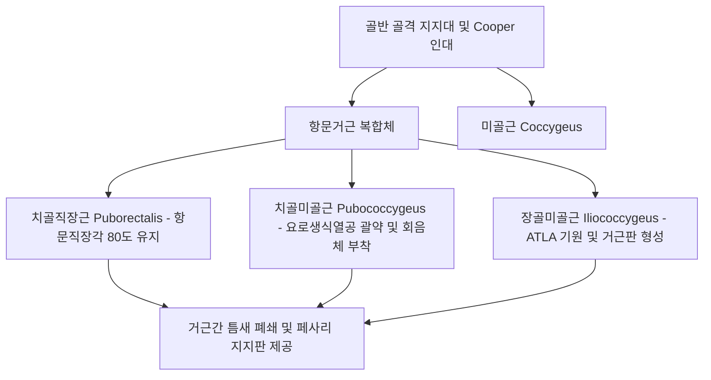

# 📑 [Netter Vol.1] Day 07: 질 - 해부·골반지지·질염·골반장기탈출증 및 종양학 (Section 7 완독)

> 📖 **원서 출처**: [The Netter Collection of Medical Illustrations - Volume 1, Reproductive System.pdf (pp. 130-151)](https://drive.google.com/file/d/1x-xTgPfUfiK7dsQyp5L5qfjFYSD_XyGm/view?usp=drivesdk)  
> 🏷️ **범위**: Section 7 전편 (Plate 7-1 ~ Plate 7-22, 총 22개 플레이트 전수 포함)  
> 📌 **핵심 테마**: 질의 정밀 해부학(H자 단면, 전경각, 요관 교차) 및 드랜시(DeLancey) 3수준 골반 지지 체계, 여성 요도 괄약 메커니즘(스킨관 임균 호발, 해먹 가설) 및 복압성 요실금(Cooper 인대 앵커), 비각화 중층편평상피 조직학(바르톨린선 이행상피) 및 생애주기별 질세포학(신생아/소아/임신12주 주상세포/산욕기/폐경후), 뮐러관-요로생식동 발생 기형(HOX 유전자, MRKH vs 처녀막폐쇄증 신생아 점액질종), 3대 질염(BV 아민 생화학 및 1,000:1 역전, 칸디다, 트리코모나스 FDA 신속진단) 및 독성 쇼크 증후군(TSS 마그네슘 저하, 초항원 TSST-1, ARDS/탈모), 골반장기탈출증(POP 방광류 엘라스틴 유전자, 소장류 수평함입선) 및 비뇨생식/장질 누공(8~12일 잠복기, 요관질누공 신장상실), 폐경후 비뇨생식기 증후군(GSM 종유석 유착, 국소 E 전신흡수) 및 원발성(성인 육종 괴사, 소아 횡문근육종 Strap cell)·전이성(60%, 융모암종 출혈생검금기, 신세포암 포상구조) 질 악성종양학

---

## 1. 개요 및 마스터 요약 (Executive Summary)

1. **질의 구조, 주행축 및 드랜시(DeLancey) 3단계 골반 지지 체계**:
   - 질(Vagina, 칼집/sheath)은 전벽($6\sim 9\text{ cm}$)과 후벽($8\sim 12\text{ cm}$)으로 이루어진 근섬유성 관으로, 전후로 편평하여 **횡단면상 H자형(H-shape)**을 띠며, 수평면에 대해 약 $45^\circ$ 후상방으로 주행하여 자궁과 **최소 $90^\circ$ 이상의 전경각**을 형성함. 성적 흥분 시 질 상부가 신장·확장되고 자궁이 거상되어 정자 포획(sperm capture & retention)을 촉진함.
   - **DeLancey 3대 지지 수준**:
     - **Level I (첨부 현수, Apical suspension)**: 기자인대(Cardinal)와 자궁천골인대(Uterosacral)가 자궁경부와 상부 질을 골반 측벽 및 천골(S2-S4)에 매달아 지지.
     - **Level II (측방 부착, Lateral attachment)**: 치골자궁경부근막(전벽) 및 직장질근막(후벽)이 골반근막건궁(ATFP)에 양측으로 부착.
     - **Level III (원위 융합, Distal fusion)**: 질 하단 $1/3$이 회음체(Perineal body), 회음막, 요도와 직접 융합.
   - **외과적 핵심 랜드마크**: 복강경 요실금 수술(Burch/MMK)의 핵심 닻인 **치골인대(Cooper's ligament)**, 페사리(Pessary)를 물리적으로 떠받치는 **거근판(Levator sling)**, 그리고 자궁절제술 시 요관 손상 위험을 초래하는 **요관-자궁혈관 교차(Water under the bridge)**가 지탱 축을 이룸.
2. **요도 괄약 메커니즘, 분비 생리 및 조직학**:
   - 요도(길이 $3\sim 5\text{ cm}$, 직경 $6\text{ mm}$)는 골반내 요도와 회음부 요도로 구분되며, 후벽의 **요도능선(Urethral crest)**과 점막하 해면정맥총 발기조직을 구비함. 요도주위선이 합류하는 **스킨관(Skene's ducts)**은 남성 전립선관과 상동기관으로 배액 불량에 따른 **임균성 만성 감염**의 주요 호발 부위임.
   - 질 점막은 **비각화 중층편평상피**로 자체 선(Gland)이 전무하며, 성흥분 시 윤활은 고유층 혈관총의 여과 누출액(Transudate)으로 충당됨. 대전정선(Bartholin gland)은 개구부에서 원주상피 $\rightarrow$ 편평상피로 이행하므로 **선암과 편평세포암이 모두 발생** 가능함. 소음순은 피지선이 풍부하나 **모낭과 지방세포가 전무**함.
3. **질 발생, 선천 기형 및 생애주기별 세포학(Cytology)**:
   - **발생 및 기형**: **HOX 유전자군**의 정밀 제어 하에 뮐러관(상부 $3/4$)과 요로생식동(하부 $1/4$)이 융합·개통됨. **MRKH 증후군**(정상 난소, 섬유성 흔적 자궁, 가성반음양과 구별), **질횡중격**(상부 $1/3$과 하부 $2/3$ 경계 호발, DES 노출 연관), **처녀막폐쇄증**(신생아기 복압 상승 시 팽륜되는 **점액질종 Hydromucocolpos** 주의, 사춘기 질·자궁·난관혈종 및 골반 자궁내막증 유발), **두꺼운 섬유성 처녀막**(성교통 유발하나 타 요로 기형 미동반).
   - **호르몬 세포학**: 신생아(모체 에스트로겐으로 풍성하나 데덜라인 간균 결여), 소아기(기저세포 우세 위축 도말), 가임기(배란기 표재세포 극대화 KPI 상승, 젖산간균 pH 3.8~4.2 유지), 임신기(임신 12주경 초기 증식기 유사 이행, 프로게스테론 증가로 **주상세포 Navicular cells** 다수 출현), 산욕기(호르몬 급락으로 기저세포 급증), 폐경후기(100% 기저세포 위축 도말).
4. **질염의 생화학·미생물 감별 및 독성 쇼크 증후군(TSS)**:
   - **세균성 질증(BV)**: 비염증성 생태계 붕괴. 세균 총수 1,000배 급증, 혐기균:호기균 비율 1,000:1 역전. 아르기닌/라이신의 세균 탈탄산화로 **카다베린·푸트레신** 합성(알칼리성 환경/정액 노출 시 휘발 악취). Amsel 4대 기준 단서세포($>20\%$).
   - **칸디다 질염(VVC)**: *C. albicans*(80~95%), *C. glabrata/tropicalis*(5~20%). 정상 산도(pH < 4.5), 치즈 찌꺼기 삼출물(제거 시 출혈), Sabouraud/Nickerson 배지 배양.
   - **트리코모나스 질염(TV)**: 3~5개 편모 원충, pH > 5.0, 기포성 황록색 분비물, 딸기양 자궁경부, OSOM 딥스틱 및 핵산 탐침 진단, 배우자 동시 치료.
   - **기타 질염**: 소아/폐경후 임균 질염(자궁경 진찰), 1기 매독 하감(전정 호발, 암시야 검사) 및 2기 점막반, 결핵(후원개 호발 대형 궤양), 유산 유도제 화학 화상 및 소아 질내 이물질(옷핀/구슬, 자궁경 제거), 방치된 페사리(자궁축농증, 질벽 매몰, 대량 출혈).
   - **독성 쇼크 증후군(TSS)**: 탐폰 등 이물질의 **국소 마그네슘($\text{Mg}^{2+}$) 농도 저하** $\rightarrow$ *S. aureus*의 **TSST-1 및 장독소 A, B, C** 생성 촉진 $\rightarrow$ 초항원성 사이토카인 폭풍. 고열, 일광화상양 발진, 손발바닥 낙설, 저혈압 쇼크, 다발장기부전(**ARDS, 급성신부전, 탈모, 손발톱 탈락**).
5. **외상, 골반장기탈출증(POP) 및 비뇨생식/장질 누공**:
   - **외상**: 성교 열상(후원개 호발), 가랑이/울타리 말뚝 관통상(Picket fence, 질 후벽 및 더글라스와 관통 $\rightarrow$ **소장의 질내 탈출**, 광인대 엽간 혈종 화농). 성폭행 진료 3대 원칙(손상 치료, 증거 보존, 후유증 예방).
   - **골반장기탈출증**: 방광류(전벽 결손, 출산 후 **엘라스틴 유전자 활성 이상** 연관, 구식 Bonney 검사 폐기), 직장류(후벽 결손, 배변장애, 항문괄약근 정상 시 대변실금 없음), 소장류(**더글라스와의 선천적 신장으로 인한 일차성 소장류**, 수평 함입선 감별, 진성 소장 탈장).
   - **누공**: 방광질누공(복식 전자궁절제술 75%, **수술 후 5~30일/평균 8~12일 요루 출현**, 20~30% 단순 도뇨관 자연 치유), 요도질누공(원위부는 요실금 무증상 가능), 요관질누공(자궁동맥 결찰 손상, **해당 신장 상실 위험**), 방사선 누공(잔류암 배제 생검 필수), 방광직장질 복합 누공(질의 총배설강화 Cloaca).
6. **위축성 질환, 양성 낭종 및 질 종양학**:
   - **위축성 질환**: 에스트로겐 결핍으로 **종유석양 섬유성 유착(Stalactites)** 형성, **폐경후 출혈(PMB)의 흔한 원인**, 무리한 진찰 시 광인대 열상 및 자궁혈관 손상 위험. 국소 에스트로겐의 전신 흡수(최대 25%)로 미대항 시 자궁내막암 위험 6~8배 증가.
   - **낭종 및 양성 종양**: 가트너관 낭종(중신관 잔유물, 전외측벽, 묽은 액체, 광인대 엽간 상행 연장), 표피포함/뮐러관 낭종(후벽 하부, 진하고 끈적한 점액), 첨규콘딜로마(TCA/포도필린), 거대 유경성 평활근종.
   - **자궁내막증**: 발생 빈도 9위. Sampson 역류설, Meyer 화생설, **Halban 골반 림프관 전파설**, **Nuck관 이동설(외음부 호발 기전)**. 치밀 유착으로 박리/생검 시 방광·직장 천공 극도로 위험.
   - **질 종양학**: **이차성 전이암이 60% 이상** 차지(경부암 질 침윤 시 자궁경부암으로 분류, 내막암 절제 후 질원개 재발 호발). **융모암종**(질 호발, 대량 출혈 위험으로 생검 금기, 세포영양막과 융모합포체 동등 비율), **신세포암**(황색 결절, 투명세포 포상 배열), **갑상선암**(직장질중격 극희귀 전이). 원발암은 SCC(HPV 16, 18) 90%로 CCRT 근간. **소아 횡문근육종**(경부 기원형이 질 기원형보다 예후 우수, Strap cells), **성인 육종**(급속 성장으로 광범위 조직 괴사/탈락), 원발 흑색종(치명적).

---

## 2. 정상 해부학 및 골반저 지지 구조 (Plates 7-1 ~ 7-5)

### Plate 7-1 | 질의 해부학 (The Vagina)

![[Netter_V1_Plate7-1.png]]

#### 1) 질의 형태학, 주행축 및 원개(Fornices)
- **어원 및 골반 장기와의 상호작용**:
  - 질(Vagina)은 라틴어로 '칼집(Sheath 또는 Scabbard)'을 의미하며, 내생식관으로의 관문이자 분만 시 태아의 유출로임.
  - 소골반(Pelvis minor) 내에서 골반 결장(Pelvic colon), 방광 및 요도, 자궁, 난관, 난소 등 주요 장기들에 둘러싸여 긴밀히 상호작용하므로 골반 장기 병태생리를 이해하는 핵심 포털 역할을 함.
- **주행 및 각도**:
  - 기립 시 질축은 수평면에 대해 약 $45^\circ$ 후상방(천골 만곡부 천골 갑각 방향)으로 주행하며, 방광 경부 및 요도 후방, 직장 전방에 위치함.
  - 대부분의 여성에서 **질과 자궁 사이에는 최소 $90^\circ$ 이상의 각도(전경/전굴)**가 형성되며, 자궁경부는 하후방을 향해 질 후벽에 얹히듯 접촉함.
- **잠재 공간(Potential Space)과 단면 형태**:
  - 평상시 질은 벽이 서로 맞닿아 있는 잠재 공간임.
  - 중간 및 상부 $1/3$이 더 넓어 장축에 수직으로 관찰 시 **역배형(Inverted pear) 또는 T자형**을 띰.
  - 전벽과 후벽이 전후로 편평하게 압착되어 **횡단면(Cross section)에서는 알파벳 'H'자 모양(Appearance of the letter H)**을 나타냄.
- **벽의 길이 및 성적 흥분 시 변화**:
  - **전벽 (Anterior wall)**: 약 $6\sim 9\text{ cm}$ ($2.5\sim 3.5\text{ in}$, 평균 $7.5\text{ cm}$). 방광 기저부 및 요도와 골반내근막을 사이에 두고 밀접하게 유착됨.
  - **후벽 (Posterior wall)**: 약 $8\sim 12\text{ cm}$ ($3\sim 4.5\text{ in}$, 평균 $9.0\text{ cm}$). 자궁경부 후방으로 더 깊게 연장됨. 하부 $3/4$은 직장질중격(Rectovaginal septum)에 의해 직장과 분리되고, **상부 $1/4$은 직장자궁와(더글라스와, Rectouterine pouch of Douglas)**에 의해 직장과 분리됨.
  - **성적 흥분(Sexual arousal) 시 생리적 변화**: 자궁과 자궁경부가 상대적으로 상방으로 견인 거상되면서 질 상부가 현저히 **신장(Elongates) 및 확장(Widens)**됨. 이는 사정된 정액을 효과적으로 포획하고 저류(Capture and retention of sperm)하여 수태 가능성을 극대화하는 생물학적 기전임.
- **질원개 (Vaginal Fornices)**: 자궁경부 질부(Portio vaginalis) 주위를 둥글게 둘러싸는 맹낭 구조:
  1. **전원개 (Anterior fornix)**: 얕으며 방광 기저부와 인접.
  2. **후원개 (Posterior fornix)**: 가장 깊은 함몰부로, 복강의 최하단인 **더글라스와(자궁직장와, Pouch of Douglas)**를 덮는 복막과 불과 수 밀리미터의 얇은 질벽 및 결합조직을 사이에 두고 접함. 자궁외임신 파열 시 혈복강 진단을 위한 **골반천자(Culdocentesis)**의 바늘 자입 부위이자 복강경 수술 시 질식 진입로.
  3. **외측원개 (Lateral fornices, 좌우 한 쌍)**: 기자인대(Cardinal ligament), 자궁동맥(Uterine artery)의 상행분지, 그리고 자궁경부 외측 $1.5\sim 2\text{ cm}$ 지점에서 자궁동맥 아래를 교차 주행하는 **요관(Ureter)**과 해부학적으로 극히 인접함.

#### 2) 혈관 공급 및 림프 배액
- **동맥 공급망 (광범위 문합망)**:
  - **질동맥 (Vaginal artery)**: 자궁동맥에서 직접 분지하거나, 내장골동맥(Internal iliac a.)의 전분지에서 자궁동맥 및 하방광동맥 기원부 후방에서 직접 분지.
  - **자궁동맥의 하행 질가지 (Descending vaginal branches of uterine a.)**: 자궁경부-질 이행부 관류.
  - **기정맥통 (Azygos arteries of the vagina)**: 질동맥과 자궁동맥의 하행 경부가지가 전후 정중선에서 문합하여 질의 전벽과 후벽을 따라 수직으로 주행하는 동맥궁 형성.
  - **하부 문합망**: **내음부동맥(Internal pudendal a.)**, **하방광동맥(Inferior vesical a.)**, **중직장동맥(Middle rectal / hemorrhoidal a.)** 분지들이 하방에서 광범위하게 합류함.
  - **임상 및 생리학적 의의**:
    - 분만 시 발생하는 **산과적 열상(Obstetric lacerations)**에서 대량 출혈을 일으키는 주원인 혈관망임.
    - 성적 흥분 시 충혈되어 질 점막 표면으로 삼출되는 **질 윤활 누출액(Vaginal transudate)** 형성의 혈역학적 원천임.
- **림프 배액 (구역별 3단계 분기)**:
  - **상부 1/3 (자궁경부와 동일)**: 내장골(Internal iliac) 및 외장골(External iliac) 림프절.
  - **중부 1/3**: 내장골 림프절 (폐쇄 림프절 Obturator nodes 포함).
  - **하부 1/3 (외음부와 동일)**: 표재 서혜 림프절 (Superficial inguinal lymph nodes) $\rightarrow$ 심서혜(Cloquet) $\rightarrow$ 외장골 림프절.
- **골반내근막 및 인대성 지지 요약**:
  - 하부 $1/3$: 비뇨생식격막 및 골반격막에 둘러싸여 지지됨.
  - 중간 $1/3$: 항문거근(Levator ani)과 기자인대 하부 섬유에 의해 지지됨.
  - 상부 $1/3$: 기자인대(Cardinal ligament) 상부 및 자궁방조직(Parametria)에 의해 현수 지지됨.

---

### Plate 7-2 | 골반격막 I: 하방 시점 (Pelvic Diaphragm I — From Below)

![[Netter_V1_Plate7-2.png]]

#### 1) 항문거근(Levator Ani) 복합체의 3대 구성 근육
회음부 측(하방 시점)에서 천층 근육과 근막을 제거하면 골반연(Pelvic brim)에서 시작하여 요도, 질, 직장을 감싸고 천골 및 미골에 정착하는 깔때기형 근육 공이(Hammock)가 드러납니다. 항문거근은 **음부신경(Pudendal nerve)**의 지배를 받으며 내측과 외측 구성요소로 나뉩니다:
1. **치골직장근 (Puborectalis m.)**:
   - 치골 결합 양측 후면에서 기원하여 직장-항문 연결부 후방을 U자형 고리(Sling) 모양으로 감싸며 주행.
   - 안정 시 지속적으로 수축하여 **항문직장각(Anorectal angle, 약 $80^\circ$)**을 전방으로 당겨 유지함으로써 고형 대변의 실금을 방지하는 핵심 기전 담당.
2. **치골미골근 (Pubococcygeus m., 내측 대형 구성요소)**:
   - 치골 결합 인접 치골상지(Superior ramus of pubis) 후면에서 기원하여 질 측벽 주위를 지나 하방 및 후방으로 주행.
   - 일부 섬유는 미골(Coccyx)에 도달하고, 일부는 **회음체 중심건(Central tendinous point of perineum)**을 형성하는 근막에 정착하며, 다른 섬유들은 직장의 종주근층(Longitudinal muscle coats of rectum)과 융합함.
   - 질벽 외측 섬유와 융합(Pubovaginalis)하여 질을 받치고 요로생식열공을 지지함.
3. **장골미골근 (Iliococcygeus m., 외측 구성요소)**:
   - 좌골극(Ischial spine)과 폐쇄내근 내면을 덮는 벽측 골반근막의 백색 섬유성 응축선인 **골반근막건궁(Tendinous arch of levator ani, ATLA)**에서 기원.
   - 미골의 마지막 2개 분절에 정착하며, 일부 요소는 미골 전방의 정중선 봉선(**Levator plate / Median raphe**)에서 반대측 섬유와 결합함. 이 봉선 표재층에서 외항문괄약근(Sphincter ani externus) 및 횡회음근 섬유와 합류함.

#### 2) 거근간 틈새(Interlevator Cleft), 골반격막 기능 및 인접 근육
- **거근간 틈새 (Interlevator Cleft / Urogenital Hiatus)**:
  - 좌우 치골미골근/치골직장근 사이에 형성된 정중 열공.
  - 통과 구조물: **음핵등정맥(Deep dorsal vein of clitoris), 요도(Urethra), 질(Vagina), 직장(Rectum)**.
  - 이 장기들은 치골미골근에서 뻗어나온 근근막 연장(Musculofascial extensions)에 의해 지탱되며, 골반격막 하근막은 비뇨생식격막의 상근막과 직접 연속됨.
- **골반격막의 생역학적 복합 기능**:
  - 골반 장기를 공이처럼 영구 지탱할 뿐만 아니라, **성교(Coitus), 분만(Parturition), 배뇨(Micturition), 배변(Defecation) 시 질을 능동적으로 수축(Constriction)**시키는 데 결정적으로 관여함.
- **미골근 (Coccygeus / Ischiococcygeus m.)**:
  - 삼각형 근육으로, 첨부는 좌골극 및 바로 아래 놓인 **천골극인대(Sacrospinous ligament)**에 부착하며 기저부는 천골 하부 및 미골에 부착함 (외측 시점에서 가장 명확함).
- **폐쇄내근(Obturator Internus) 및 이상근(Piriformis)**:
  - 골반저를 완성한 후 각각 소좌골공(Lesser sciatic foramen)과 대좌골공(Greater sciatic foramen)을 통과하여 대퇴골 대전자(Greater trochanter)에 정착.
  - **신경 지배**: 폐쇄내근은 제1·2·3 천골신경(S1-S3), 이상근은 제1·2 천골신경(S1-S2) 지배.
  - **기능**: 고관절의 외회전(External rotation) 및 외전(Abduction)을 담당하며 골반저 지지에 직접 관여하지는 않으나, **이들 근육을 덮는 근막이 골반격막 및 골반내근막과 빈틈없이 연속**됨.

---

### Plate 7-3 | 골반격막 II: 상방 시점 (Pelvic Diaphragm II — From Above)

![[Netter_V1_Plate7-3.png]]

#### 1) 복강·골반내 시점에서 본 골반 바닥 구조
- **깔때기형 격막 (Funnel-shaped partition)**: 골반강과 회음부 사이를 가르는 musculotendinous 깔때기 구조로 요도, 질, 직장 말단에 삽입되어 이들을 강력하게 현수 지지함.
- **정중 결손부와 치골하인대**: 치골결합 바로 뒤쪽 정중선에서 거근 섬유가 만나지 못해 형성된 틈새는 비뇨생식격막(Urogenital diaphragm)에 의해 채워지며, 이 간극은 **음핵등정맥(Deep dorsal vein of clitoris)이 관통하는 치골하인대(Subpubic / Arcuate pubic ligament)**에 의해 부분적으로 폐쇄됨. 이 부위에서 골반격막 하근막과 비뇨생식격막 상근막이 융합함.
- **골반근막건궁 (ATLA)의 외과적 의의**:
  - 폐쇄내근근막 상에 치골 후면부터 좌골극까지 이어지는 백색 섬유성 비후선.
  - 복식 접근을 통한 방광-요도류(Cystourethrocele) 교정 수술 시 지지 조직을 단단히 다시 묶어 고정하는 **핵심 재부착 닻(Anchorage / Reattachment point)** 역할을 함.
- **페사리(Pessary)의 물리적 기저 지지판**:
  - 탈출된 골반 장기를 정복하기 위해 삽입하는 페사리가 기계적으로 얹혀서 지탱력을 발휘할 수 있는 물리적 바닥판(Plate)이 바로 **항문거근 슬링(Levator sling plate)**임.

#### 2) 치골인대(Cooper's Ligament)와 요실금 수술의 앵커 포인트
- **치골인대 (Pectineal ligament of Cooper)**:
  - 열공인대(Lacunar ligament)의 외측 연장선으로 치골상지의 치골선(Pectineal line)을 따라 주행하며 소골반연(Pelvic brim)의 일부를 형성함.
  - 치골인대 섬유와 치골근(Pectineus m.)의 근위 기원부가 이 능선 위에 놓임.
  - **임상적 랜드마크**: 복압성 요실금 교정을 위한 개복/복강경 방광경부 현수술인 **버치 수술(Burch colposuspension)** 및 **마샬-마르케티-크란츠 수술(Marshall-Marchetti-Krantz, MMK)**에서 질 주위 조직이나 방광경부 지지대를 치골 상골막 및 **쿠퍼 인대(Cooper's ligament)에 견고히 봉합 고정하는 핵심 닻(Anchor point)**으로 활용됨.
- **5대 연속 근막층의 통합 네트워크**:
  - 골반격막의 근막은 회음구획 근막, **골반내근막(Endopelvic fascia)**, **폐쇄근막(Obturator fascia)**, **장골근막(Iliac fascia)**, 그리고 복벽의 **복횡근막(Transversalis fascia of abdomen)**과 중단 없이 하나로 연속되어 복압 변동을 전체적으로 흡수·분산함.



---

### Plate 7-4 | 골반 장기의 지지 체계 (Support of Pelvic Viscera)

![[Netter_V1_Plate7-4.png]]

#### 1) 복막 주름, 인대 및 혈관-요관의 입체 해부학
- **광인대 (Broad ligament)**: 벽측 복막이 이중으로 반전되어 자궁 양측으로 날개처럼 펼쳐져 골반강을 전포(방광 복막)와 후포(직장S상결장 복막)로 나눔. 내부에 지방결합조직, 혈관, 신경을 포함함.
- **원인대 (Round ligament)**: 평활근과 섬유조직의 치밀한 응축 띠로 난관 기원부 전하방에서 시작하여 광인대 전엽을 가로질러 서혜관을 통과, 대음순에 삽입됨으로써 자궁의 전경(Anteversion) 자세를 유지함.
- **난소 혈관경**: 난소현수인대(Infundibulopelvic / Suspensory ligament of ovary) 내로 난소동·정맥이 주행하며, 난소고유인대(Utero-ovarian ligament)가 난소를 자궁각에 연결함.
- **골반내근막 (Endopelvic / Uterovaginal fascia)**: 방광 복막 반전부를 자궁에서 박리하면 드러나는 질-자궁 주위 섬유근막층으로, 외측 골반벽으로 이어지며 **기자인대(Cardinal / Mackenrodt ligament)**를 형성하고 혈관·신경·지방과 함께 자궁방조직(Parametrium)을 구성함.
- **요관과 자궁혈관의 치명적 교차 ("Water under the bridge")**:
  - 자궁동맥과 정맥은 내장골혈관에서 기원하여 외측 질원개를 향해 내측으로 주행함.
  - **요관(Ureter)은 바로 이 지점에서 자궁혈관의 "아래"를 통과(Water under the bridge)**한 후, 자궁질근막 내에서 전내측으로 질 상부 앞을 가로질러 방광 삼각부로 진입함.
  - **외과적 경고**: 요관이 자궁혈관 및 상부 질원개와 불과 수 밀리미터 거리로 극히 인접해 있기 때문에, **자궁절제술(Hysterectomy) 시 자궁혈관 결찰이나 골반내근막 열상 봉합 수술 시 요관이 겸자에 물리거나 결찰·절단되는 의인성 손상 위험이 극히 높음**.

#### 2) 심부 및 천회음구획의 기능적 분리
- **삼각인대 (비뇨생식격막, Triangular ligament / Perineal membrane)**: 골반격막 하방에 위치하며 심횡회음근(Deep transverse perineal m.), 요도압박근, 요도질괄약근 및 음핵동맥을 포함함.
- **천회음간극 (Superficial perineal space)**:
  - 콜리스근막(Colles fascia)에 의해 하방 경계가 형성됨.
  - 질 하부 $1/3$은 골반격막보다 천층에 위치하며, 질구 외측은 전정구(Bulb of vestibule)와 이를 덮는 구해면체근(Bulbocavernosus m.), 그리고 좌골치골지에 부착하는 음핵각(Crura of clitoris)과 좌골해면체근(Ischiocavernosus m.)이 둘러쌈.
  - **기능적 한계**: **삼각인대 하방(천회음간극)의 근육과 근막들은 주로 성교 기능(Coital function)과 발기 조직 압박에 관여하며, 골반 장기의 내장 지지(Support of pelvic viscera)에는 거의 기여하지 않음**.

---

### Plate 7-5 | 여성 요도 (Female Urethra)

![[Netter_V1_Plate7-5.png]]

#### 1) 요도의 주행, 구조 및 해면정맥총
- **길이 및 구경**: 길이 약 $3\sim 5\text{ cm}$ (평균 $3.5\sim 4.0\text{ cm}$), 직경 약 $6\text{ mm}$. 방광경부에서 치골결합 하방을 따라 전하방으로 완만하게 만곡 주행.
- **방광경부 각도**: 내요도구와 방광 저부가 이루는 후방 방광요도각(Posterior urethrovesical angle)은 내인성 괄약근과 골반격막 근육에 의해 지탱되어 안정 시 요자제를 유지하는 핵심 구조임.
- **점막 및 요도능선 (Urethral crest)**: 요도 점막은 외측 지지 구조의 압박으로 종주 주름을 형성하며, 특히 **요도 후벽에 가장 두드러지게 솟아오른 종주 융기를 요도능선(Urethral crest)**이라 부름.
- **해면정맥총 (Cavernous venous plexus / Corpus spongiosum)**: 점막하 고유층은 섬유탄력조직망과 함께 거대한 박벽 정맥총인 해면정맥총으로 채워져 있어 발기조직과 유사한 극도의 혈관성을 나타내며 요도 점막의 완충 및 밀폐 작용을 보조함.
- **해부학적 2대 구획**:
  1. **골반내 요도 (Intrapelvic urethra)**: 상부 $2/3$. 치골결합 후방에 위치하며 거근간 틈새(Interlevator cleft)의 근근막 지지대를 통과함.
  2. **회음부 요도 (Perineal portion)**: 하부 $1/3$. 비뇨생식격막 상근막에서 외요도구까지 주행. 외요도구는 음핵 하방 $2\sim 3\text{ cm}$ 지점의 소음순 주름 사이 질 전벽에 개구함.

#### 2) 괄약근, 요도주위선 및 스킨관(Skene's Ducts)의 임상 의의
- **괄약근 구조**:
  - 내측 평활근층: 내종주근 및 외윤상근 평활근.
  - 요도막괄약근(Sphincter urethrae membranaceae / Rhabdosphincter): 비뇨생식격막 통과 부위를 둘러싸는 횡문근으로 남성의 동명 근육과 상동기관이나 여성에서는 훨씬 얇고 기능적 중요성이 낮음.
- **요도주위선과 스킨관 (Paraurethral / Skene's ducts)**:
  - 요도 전장, 특히 회음부 요도 점막에는 남성의 **전립선관(Prostatic ducts)과 상동기관인 수많은 소요도주위선(Small periurethral glands)** 개구부가 천공되어 있음.
  - 이 작은 선관들의 대부분은 상호 연결되어 외요도구 후외측 양쪽에 개구하는 2개의 대형 **스킨관(Skene's ducts)**으로 배액됨.
  - **임상적 중요성**: 스킨관은 퇴화성 잔유물이지만, 해부학적 위치상 **임균(Neisseria gonorrhoeae) 감염의 주요 표적**이 되며 배액이 불량하여 **만성 재발성 요도염 및 농양 형성의 온상**이 됨.
- **상피의 부위별 이행 (Epithelial Transition)**:
  - 방광경부에 인접한 골반내 요도: **이행상피 (Transitional epithelium)**.
  - 요도 중간부, 원위부 및 스킨관: **중층편평상피 (Stratified squamous epithelium)**.
  - 요도주위선 분비부: **원주상피 (Columnar epithelium, 때로 중층)**.

---

## 3. 조직학, 세포학 및 선천 기형 (Plates 7-6 ~ 7-9)

### Plate 7-6 | 외음부 및 질의 조직학 (Vulva and Vagina Histology)

![[Netter_V1_Plate7-6.png]]

#### 1) 질 점막의 층상 상피와 고유층
질벽은 비각화 중층편평상피, 점막하 고유층, 평활근층, 외막(외결합조직층)의 3~4개 층으로 뚜렷이 구분됩니다:
- **상피의 3대 구획 (두께 $150\sim 200\,\mu\text{m}$)**:
  1. **기저층 (Basalis / Basal layer)**: 단일층의 입방/원주세포로 기저막 상에서 활발한 유사분열 담당.
  2. **상피내/이행층 (Intraepithelial / Transitional cell layer)**: 다각형의 방기저세포층.
  3. **기능층/유극세포층 (Functionalis / Spinal or Prickle cell layer)**: 글리코겐이 풍부한 중간세포 및 표재세포. 표재세포는 케라틴을 함유하나 가임기 여성에서는 육안적 각화(Gross cornification)가 일어나지 않음.
- **결합조직 유두(Papillae)와 탄력 섬유**:
  - 질 상피는 자궁경부 상피보다 약간 더 두껍고, 하부 결합조직으로 훨씬 많고 깊은 유두(Papillae)를 뻗어 기저막이 **물결치는 파동성(Undulating outline)**을 띰. 이 유두는 **질 후벽과 질구 근처에서 더욱 조밀**함.
  - 고유층의 풍부한 **탄력 섬유(Elastic fibers)**는 상피에서 평활근층으로 교차하며 질의 신축성과 골반저 지탱력 유지에 핵심적임.
- **근육층 및 외막**:
  - **내윤(Internal circular) 및 외종(External longitudinal) 평활근층**. 외종근층이 훨씬 두껍고 강력하며 자궁의 표재 근섬유 다발과 직접 연속됨 (두 층 사이에 분리 근막 없음).
  - 외막(Adventitia)은 골반내근막에서 기원하는 치밀 섬유층으로 거대한 정맥망과 신경절이 분포함.

#### 2) 대전정선(Bartholin), 소전정선 및 소음순의 미세구조
- **대전정선 (Bartholin / Greater vestibular gland)**:
  - 질 전정 외측에 위치하며, 기저부에 핵이 위치한 단층(간혹 중층)의 점액분비 원주상피세포 소엽들로 구성됨.
  - **상피 이행과 종양학적 의의**: 주 바르톨린관(Main duct)은 질 측벽을 따라 상행하며 원주상피로 덮여 있으나, **전정 외측벽 개구부에 가까워지면서 질 점막과 동일한 중층편평상피로 이행(Transition)**함. 이 상피 전환 부위로 인해 **바르톨린선 악성종양은 선암(Adenocarcinoma)과 편평세포암(Squamous cell carcinoma)이 모두 발생**할 수 있음.
- **소전정선 (Minor vestibular glands)**: 음핵 및 요도 주변에 위치하며, 바르톨린선보다 더 가지를 친 총상(Racemose) 분지 구조를 띰. $1\sim 2$층의 키 큰 점액 원주상피로 덮여 표면 윤활 보조.
- **소음순 (Labium minus)**:
  - 질 점막보다 멜라닌 색소 침착이 짙음.
  - 표재세포가 뚜렷하게 각화되어 각질층(Cornified layer)을 형성하며 폐경 후 더욱 두드러짐.
  - **피지선(Sebaceous glands)이 매우 풍부**하게 분포하나, 대음순과 달리 **모낭(Hair follicles)과 피하지방세포(Fat cells)가 전무**하다는 점이 결정적인 조직학적 감별점임.

---

### Plate 7-7 | 질 상피 세포학 (Vagina — Cytology)

![[Netter_V1_Plate7-7.png]]

#### 1) 생애 주기별 질 도말 세포학적 변화
질 상피세포는 순환 에스트로겐의 농도에 민감하게 반응하여 생애 주기 및 월경 주기에 따라 극적인 세포학적 변모를 보입니다:
1. **신생아기 (Newborn)**:
   - 태반을 통해 유입된 모체 에스트로겐의 영향으로 질 상피가 성인 여성처럼 매우 풍성하고 조밀함.
   - 도말상 전자각화(Precornified) 및 각화 세포가 산재하거나 느슨한 응집을 이룸.
   - 다형핵백혈구(PMN)가 소수 관찰되나, **데덜라인 간균(Lactobacilli)은 거의 없거나 전무함**.
   - 출생 후 며칠 내에 모체 호르몬이 체외로 소실되면서 급속히 소아기 위축 상태로 전환됨.
2. **소아기 (Childhood)**:
   - 순환 에스트로겐 결핍으로 상피가 얇고 연약하여 감염에 극히 취약함.
   - 도말상 **기저세포(Basal/Parabasal cells)**가 압도적이며, 점액 배경에 PMN 백혈구가 산재함.
   - 기저세포는 뚜렷한 소포성 핵과 큰 핵-세포질 비(N/C ratio)를 가지며 세포질은 호염기성(Basophilic)임. 폐경 후 위축 도말과 형태학적으로 매우 유사함.
3. **가임기 주기적 변화 (Normal Cyclical Adult)**:
   - **증식기/배란기 (에스트로겐 우세)**: 상피가 두꺼워지며 호산성의 다각형 표재세포가 주류를 이룸. 핵이 $6\,\mu\text{m}$ 미만으로 응축되는 **핵농축지수(Karyopyknotic index, KPI) 극대화**.
   - **분비기 후기 (프로게스테론 우세)**: 중간세포 우세, 세포 가장자리가 말리고 뭉침 현상(Folding & Clumping) 현저. Döderlein 간균의 당분해로 정상 산성 환경 유지.
4. **임신기 (Pregnancy)**:
   - 고농도의 에스트로겐과 프로게스테론으로 인해 상피가 극도로 두꺼워지고 표재층 각질화 현저.
   - 초기에 다량의 전자각화세포가 탈락하며 심한 세포 뭉침과 접힘, 난원형 소포성 핵 관찰.
   - **임신 12주경의 특징적 전환**: 세포 박리가 감소하고 뭉침이 완화되며 전자각화세포가 고르게 퍼져 **정상 초기 증식기 도말과 유사한 양상**을 나타냄.
   - 임신이 진행됨에 따라 지속 상승하는 프로게스테론의 작용으로 세포 크기가 점차 작아지고 배 모양으로 말린 **주상세포 (Navicular cells)**가 시야를 가득 채움.
5. **산욕기 (Puerperium)**:
   - 태반 만출 후 스테로이드 호르몬이 급락하여 정상 배란 주기가 돌아오기 전까지 상피가 일시적으로 극도로 위축됨.
   - **도말상 다량의 기저세포**, 소수의 각화세포, 염증성 세포 파편이 출현함. 난소 기능 회복과 함께 정상 가임기 상피로 신속히 복원됨.
6. **폐경후기 (Postmenopause)**:
   - 난소 기능 정지로 상피가 $3\sim 4$개 세포층으로 얇아지고 창백해지며 세균 침입에 무방비 노출되어 기저막 하방에 부종 형성.
   - 도말 소견: **거의 100% 기저세포(Basal cells)**로 구성되며 점조한 점액 배경에 다수의 PMN 백혈구와 림프구가 관찰됨. 호염기성 세포가 대부분이나 소수의 호산성 세포가 섞임. 백혈구가 과도하게 많을 경우 위축성 질염(Atrophic vaginitis)의 동반을 시사.

#### 2) 성숙 지수 (Maturation Index, MI)
질 측벽 상피세포를 채취하여 **방기저세포(P) : 중간세포(I) : 표재세포(S)**의 백분율 비율로 내분비 환경을 평가:
- 배란기 (E 우세): `0 : 30 : 70` (우측 이동)
- 황체기 및 임신 후기 (P 우세): `0 : 80 : 20` (중간 이동, 주상세포 다발)
- 소아기 및 폐경 후 (호르몬 결핍): `80 : 20 : 0` 또는 `100 : 0 : 0` (좌측 이동)

---

### Plate 7-8 | 선천성 기형 (Congenital Anomalies)

![[Netter_V1_Plate7-8.png]]

#### 1) 뮐러관(Paramesonephric Duct)의 발생과 HOX 유전자 조절
- **발생학적 일정**:
  - 배아 제7~8주에 생식융기 외측 체강상피(Coelomic epithelium)의 함입으로 뮐러관이 최초 형성됨.
  - 양측 뮐러관이 미측으로 주행하며 정중선으로 교차 융합하여 자궁, 자궁경부, **질 상부 약 $3/4$ (원문: upper three-quarters)**의 원기(Anlage)를 형성.
  - 융합되지 않은 두개측 관은 난관(Fallopian tubes)으로 발달.
  - 미측의 융합된 세포 기둥이 회음부에서 진입하는 요로생식동(Urogenital sinus)과 접합한 후, 내부 중심핵 세포들이 탈락(Sloughing/Canalization)하여 관을 완성하기까지 $5\sim 6$주가 소요되며 완전 분화에는 수주가 더 걸림.
- **분자유전학적 조절 기전**:
  - **HOX 유전자군 (HOX genes, 특히 HOXA9, HOXA10, HOXA11, HOXA13)**이 배아의 신체 축 형성뿐만 아니라 뮐러관의 부위별 기관형성(자궁, 경부, 질)을 총괄 지휘함.

#### 2) 주요 선천성 질 기형의 임상 및 외과적 특성
1. **질 무발생 (Mayer-Rokitansky-Küster-Hauser / MRKH 증후군)**:
   - 뮐러관의 완전한 초기 융합 부전 또는 성장 정지로 발생.
   - **특징**: 46,XX 정상 여성 핵형. **난소는 원시 생식세포 기원으로 뮐러관과 발생 기원이 완전히 달라 정상 발육 및 정상 배란 기능을 유지**함. 따라서 정상 유방, 정상 치모 발달 등 완벽한 이차성징을 보임.
   - **자궁 흔적 (Abortive uterus)**: 방광 복막과 직장S상결장 복막 사이에 난관과 연결된 작은 섬유성 결절(Bulb of fibrous tissue)이 관찰되며, 간혹 내부에 자궁내막 조직이 기능성으로 잔존하여 주기적 골반통을 유발함.
   - **감별점**: 외음부와 질전정(Vestibule)이 정상 발달하여 **가성반음양(Pseudohermaphroditism)과 명확히 구별**됨.
   - **외과적 공간**: 전정 보조개(Vestibular dimple) 상방의 방광과 직장 사이에는 소성 결합조직으로 채워진 잠재적 공간이 존재하여, Frank 질 확장기 요법이나 맥킨도(McIndoe) 질성형술로 질강을 성공적으로 재건할 수 있음.
2. **질중격 기형 (Vaginal Septa)**:
   - **완전 질종중격 (Complete Longitudinal Septum)**: 뮐러관의 외측 융합 실패로 발생. 중복자궁(Uterus didelphys) 및 쌍경부와 동반되며, 각 자궁은 독립된 난관과 난소를 가져 이론적으로 양측 모두 수태가 가능함.
   - **부분 질종중격 (Partial Septum)**: 뮐러관 최하단 상피 중심핵의 불완전 탈락으로 발생.
   - **질횡중격 (Transverse Vaginal Septum)**:
     - 뮐러결절(Müllerian tubercle)과 동질구(Sinovaginal bulb)의 불완전 개통으로 형성.
     - **가장 흔한 위치**: **질 상부 $1/3$과 하부 $2/3$의 접합부(Junction of upper third and lower two-thirds)**.
     - 두께는 대개 $1\text{ cm}$ 미만이며 완전 또는 불완전 폐쇄를 보임. 외음부는 정상이나 질이 짧은 맹낭으로 끝나며 초경 후 질혈종/자궁혈종을 유발.
     - **임상적 주의**: **모체가 임신 중 디에틸스틸베스트롤(DES)에 노출된 딸에서 부분 질중격의 발생 빈도가 유의하게 높음**.
3. **요로계 동반 기형**:
   - 질과 상부 요로계(신장, 요관)는 공통의 배아 발생학적 기원(중신관)을 공유하므로, 질 기형 환자의 $30\sim 40\%$에서 편측 신장 무형성, 골반신, 중복요관 등 상부 비뇨기계 기형이 동반되므로 신장 초음파/IVP 검사가 필수적임.

---

### Plate 7-9 | 처녀막폐쇄증, 질혈종 및 섬유성 처녀막 (Imperforate Hymen, Hematocolpos, Fibrous Hymen)

![[Netter_V1_Plate7-9.png]]

#### 1) 처녀막의 발생학 및 처녀막폐쇄증의 임상 경과
- **복합 발생학적 기원**:
  - 처녀막(Hymen)은 질과 전정의 경계부에 위치하며, 질을 향해 상행하는 요로생식동과 하행하는 뮐러관 세포 기둥(자궁경부에서 전정 거리의 약 $4/5$를 이미 이동)의 접합 산물임.
  - 외측벽은 요로생식동의 함입 주름으로 형성되나, 후방(Dorsal) 벽은 외측의 요로생식동 세포와 내측의 뮐러관 세포의 복합체임.
  - 처녀막 표재 상피는 전적으로 요로생식동 상피에서 유래하여 중층편평상피로 분화함.
- **신생아기 점액질종 (Hydromucocolpos in Newborns)**:
  - 처녀막폐쇄증은 출생 시 또는 사춘기에 주로 발견됨.
  - **신생아 시기**: 태반을 통해 전달된 모체 에스트로겐의 자극으로 질 점막에서 분비물이 대량 축적되어 **점액질종(Hydromucocolpos)** 형성.
  - **신체 진찰 소견**: **신생아가 울 때 복강내압이 상승하면서 양측 음순 사이로 불룩 튀어나오는 처녀막 팽륜(Bulging)**이 관찰됨. 신생아 직장 수지검사에서 유의미한 점액질종이 촉지되면 즉시 처녀막 절제술을 시행하여 배액해야 함.
- **사춘기 혈종의 단계적 상행 진행**:
  - 사춘기 초경 시작 후 월경혈 배출구가 차단되어 질이 거대하게 팽창: **질혈종 (Hematocolpos)**.
  - 압력이 증가하면 자궁강으로 역류: **자궁혈종 (Hematometra)**.
  - 난관 협부를 지나 난관 팽대부로 역류: **난관혈종 (Hematosalpinx)**.
  - 복강 내로 오래된 혈액이 누출되면 화학성 복막염 및 **속발성 골반 자궁내막증(Endometriosis)**, 난관 유착에 의한 영구적 불임 초래.
  - 장기 합병증: 질 선증(Vaginal adenosis), 만성 골반통, 장기 성기능 장애. 초음파 검사로 상부 생식관 파급 정도를 정밀 평가해야 함.

#### 2) 외과적 치료 및 두꺼운 섬유성 처녀막
- **외과적 처치**:
  - **처녀막 십자형 절개 및 변연 절제술 (Cruciate incision and excision of margins)**: 팽륜된 막을 십자 절개하여 초콜릿색의 점조한 오래된 혈액을 감압 배액하고, 변연부를 흡수성 봉합사로 질 점막과 연속 봉합함.
  - **하부 질 폐쇄 동반 시 주의**: 폐쇄가 처녀막에만 국한되지 않고 **질 최하부 폐쇄(Atresia of the lowermost portion of the vagina)**가 동반된 경우, 혈종을 안전하게 배액하기 위해 심부 박리(Deeper dissection)가 필요함.
- **두꺼운 섬유성 처녀막 (Thick, Fibrous Hymen)**:
  - 완전히 폐쇄되지는 않았으나 결합조직이 비정상적으로 두껍고 단단하여 질구를 협착시키는 변형.
  - 사춘기 이전에는 무증상이나, 성경험 시 심각한 **성교통(Dyspareunia)** 또는 삽입 불능을 초래함.
  - 단순 십자형 절개술로 즉각 완치됨.
  - **임상적 특징**: 상부 질 기형과 달리, 두꺼운 섬유성 처녀막은 **비뇨생식관의 다른 선천성 기형을 동반하지 않는 독립적 기형**임.

---

## 4. 질염, 감염병 및 독성 쇼크 증후군 (Plates 7-10 ~ 7-13)

### Plate 7-10 | 질염 I: 트리코모나스, 칸디다, 세균성 질증 (Vaginitis I — Trichomonas, Monilia, Bacterial Vaginosis)

![[Netter_V1_Plate7-10.png]]

#### 1) 정상 질 생태계와 질염 vs 질증의 개념
- **정상 질 생태계**: 정상 질 점막은 글리코겐을 젖산으로 전환하는 *Lactobacillus*에 의해 **pH 3.8 ~ 4.2**의 강한 산성 환경을 유지함. 연령, 전신 질환, 배란, 월경, 임신 등에 의해 균총이 변동될 수 있음.
- **세균성 질염(Vaginitis) vs 세균성 질증(Vaginosis)**:
  - 세균성 질염: 병원균 침입으로 백혈구 침윤과 조직 염증, 국소 발적이 동반되는 상태.
  - **세균성 질증 (BV)**: 혐기성 세균의 과증식에 의한 질 생태학적 생화학적 붕괴이지만, **숙주의 염증 반응(백혈구 침윤)을 유발하지 않으므로 엄밀한 의미에서 질염(Vaginitis)이 아닌 질증(Vaginosis)**으로 명명함.

#### 2) 세균성 질증의 정량적 균총 변화 및 아민 생화학
- **균총 및 효소의 정량적 대격변**:
  - 정상 질내 유익균인 *Lactobacillus*가 급감하고 혐기성 세균(*Gardnerella vaginalis*, *Bacteroides* spp., *Peptococcus* spp., *Mobiluncus* spp.) 과증식.
  - 질내 세균 총수 **1,000배 폭증**.
  - 혐기성균 : 호기성균 비율이 정상 5 : 1에서 **1,000 : 1로 역전**.
  - 병원성 효소 급증: 뮤시나아제(Mucinases), 포스포리파아제 A2(Phospholipase A2), 리파아제, 프로테아제, 아라키돈산 및 프로스타글란딘 대량 방출.
- **아민 생화학 기전 (Putrescine & Cadaverine)**:
  - 혐기성 세균이 분비하는 탈탄산효소(Decarboxylase)가 아미노산인 **아르기닌(Arginine)과 라이신(Lysine)**을 탈탄산화하여 고약한 악취를 풍기는 디아민 화합물인 **푸트레신(Putrescine)과 카다베린(Cadaverine)**을 합성함.
  - 이 아민류는 산성 상태에서는 비휘발성 염 형태로 존재하나, **알칼리성 환경($10\%\text{ KOH}$ 첨가 또는 pH $\sim 7$인 남성 정액 노출)에서 급격히 휘발성으로 전환**되어 특유의 썩은 생선 비린내(Fishy odor)를 풍기게 됨 (Whiff test 및 성교 직후 악취 악화 기전).

#### 3) 3대 질염의 정밀 감별 진단

| 감별 항목 | 세균성 질증 (Bacterial Vaginosis, BV) | 칸디다 외음질염 (Candidiasis / Moniliasis) | 트리코모나스 질염 (Trichomoniasis) |
| :--- | :--- | :--- | :--- |
| **원인 병원체** | *Gardnerella*, *Bacteroides*, *Mobiluncus* 등 혐기성 세균 복합 과증식 | *Candida albicans* (80~95%), *Candida glabrata*, *C. tropicalis* (5~20%) | *Trichomonas vaginalis* (부인과 환자의 25%에서 발견, 3~5개 편모를 지닌 방추형 원충) |
| **유발 요인** | 잦은 질 세척, 다수의 성 파트너, 자궁내장치 | 항생제 사용, 임신, 당뇨병, 면역저하, 국소 피임제, 고온다습 환경 | 성적 접촉 (**STI, 성매개 감염**) |
| **분비물 성상** | 묽고 균일한 **회백색 (Thin homogeneous grayish-white)** | 진하고 농후한 **치즈 찌꺼기/두부 비지 모양 (Curd-like white plaque)** | 다량의 **기포가 섞인 묽은 황록색 (Foamy, frothy greenish-yellow)** |
| **임상 증상** | 성교 후 악화되는 생선 비린내, 경미한 소양증 | **극심한 외음부 가려움증 (Intense pruritus)**, 작열감, 외음부 동통 | 심한 악취, 외음부 작열감, 극심한 가려움, 배뇨통, 성교통 |
| **외음/질 소견** | 염증 징후 거의 없음 (홍반 부재) | 외음부 홍반, 부종, 아프타성 궤양 (백색 막 제거 시 출혈면 노출) | 질벽 발적, 부종, 점상 출혈인 **딸기양 자궁경부 (Strawberry cervix)** |
| **질내 산도 (pH)** | **$\mathbf{pH > 4.5}$** (일반적으로 5.0~5.5) | **$\mathbf{pH \le 4.5}$** (정상 산성 범위 유지, 3.8~4.2) | **$\mathbf{pH > 5.0}$** (알칼리화, 5.5~6.5) |
| **Whiff 검사** | **양성 (+)** ($10\%\text{ KOH}$ 점적 시 즉각 비린내 방출) | 음성 (-) | 양성 또는 위양성 (+/-) |
| **현미경 검사**<br>(Wet mount) | **단서세포 (Clue cells > 20%)**: 편평상피세포 경계가 세균들로 뒤덮여 흐릿해짐 | $10\%\text{ KOH}$ 마운트상 분지하는 **가성균사 (Pseudohyphae)** 및 포자 관찰 | 생리식염수 도말상 백혈구보다 약간 크며 **활발히 회전 운동하는 편모충** (민감도 60~70%) |
| **특수 진단 검사** | Amsel 4대 기준 확진 | Sabouraud 또는 Nickerson 배지 배양, 단클론항체 염색 | **OSOM Trichomonas Rapid Test** (모세관 유동 딥스틱), **핵산 탐침 검사** (민감도 >83%, 특이도 >97%) |
| **표준 치료법** | **Metronidazole** $500\text{ mg}$ bid $\times$ 7일<br>또는 국소 Clindamycin 질크림 | **Fluconazole** $150\text{ mg}$ 단회 경구 복용<br>또는 Clotrimazole 질정 | **Metronidazole** $2\text{ g}$ 단회 경구 복용<br>⚠️ **배우자 반드시 동시 치료 (Ping-pong 재감염 방지)** |

---

### Plate 7-11 | 질염 II: 성매개 감염 (Vaginitis II — Venereal Infections)

![[Netter_V1_Plate7-11.png]]

#### 1) 매독, 임질 및 결핵성 질 병변
1. **매독 (Syphilis, Treponema pallidum)**:
   - **1기 경성하감 (Primary Chancre)**: 여성에서는 외음부에 더 흔하나 질 내에도 발생 가능함. 질 내 발생 시 전정 근처에 호발하며 특정 벽 편중은 없음. 단단하게 융기된 경화연(Indurated border)과 얕은 궤양이 특징이며 하부 질 침범 시 서혜부 림프절병증 동반.
   - **2기 점막반 (Mucous Patches)**: 후기 매독 병변으로 질 및 외음부에 백색의 수포성 병변이 융합되어 얕은 궤양을 형성함 (단단히 융기된 편평콘딜로마 Condylomata lata와 감별 요망).
   - **진단**: 1기 조기에는 혈청 검사가 위음성일 수 있으므로 궤양 삼출물의 **암시야 현미경 검사(Dark-field examination)**가 결정적임. 선별 검사(VDRL, RPR) 및 확진용 트레포네마 특이 검사(FTA-ABS, MHA-TP) 시행, HIV 동반 선별 필수.
2. **임균 감염 (Gonorrhea, Neisseria gonorrhoeae)**:
   - 가임기 여성의 성숙한 질 상피는 두껍고 글리코겐이 풍부하여 임균 침투에 저항성을 가짐 (경부 원주상피, 바르톨린/스킨선 선상피 호발).
   - **연령 양극단의 취약성**: **소아기(Childhood) 및 폐경 후기(Postmenopausal)**에는 질 상피가 극도로 얇아 임균성 질염(Gonorrheal vaginitis)이 뚜렷한 임상 질환으로 발생함.
   - **소아 질 진찰**: 처녀막 손상을 방지하고 우수한 시야를 얻기 위해 **자궁경(Hysteroscope) 또는 방광경(Cystoscope)**을 작은 질구로 삽입하여 진찰함.
   - **증상**: 노출 $3\sim 5$일 후 요도, 스킨관, 경부, 질, 항문(항문 성교가 없어도 발생)에서 악취 나는 농성 분비물($40\sim 60\%$) 및 자궁경부 미란 관찰.
3. **생식기 결핵 (Tuberculosis)**:
   - 면역저하 환자 및 해외여행 증가로 빈도 증가. 상부 생식관 질환의 약 $2\%$ 차지 (외음부에는 심상성 낭창 Lupus vulgaris로 발현).
   - 대개 난관, 자궁, 경부 결핵 분비물이 중력에 의해 고이는 **질 후원개(Posterior vaginal fornix)**에 속발성으로 발생 (드물게 남성 정액 매개 감염).
   - **육안 소견**: 좁쌀결핵형(Miliary seeding) 백색 결절들이 융합되어 악취 분비물을 동반한 커다란 궤양 형성. 생검(Biopsy)으로 건락성 괴사 및 항산균 확인 확진. 항결핵제 전신 투여 및 필요시 병소 절제.

---

### Plate 7-12 | 질염 III: 화학적 및 외상성 질염 (Vaginitis III — Chemical, Traumatic)

![[Netter_V1_Plate7-12.png]]

#### 1) 화학 화상, 소아 질내 이물질 및 방치된 페사리
- **화학적 질염 (Chemical Vaginitis)**:
  - 잦은 상용 세척제나 민간요법 약물, 특히 과거 초기 임신 시 **유산 유도 목적(To induce abortion)**으로 질 내에 주입한 독성 화학 용액에 의한 화학적 화상.
  - 심한 발적, 부종, 광범위 미란, 극심한 동통 및 화농성 삼출물 유발.
  - **후유증**: 조직 괴사가 깊을 경우 치유 과정에서 질벽 사이에 반흔성 섬유성 **유착(Adhesions)**이 형성되어 질강이 협착·폐쇄되고 극심한 성교통을 초래함.
- **소아 및 심신장애인의 질내 이물질 (Foreign Bodies)**:
  - 소아나 인지장애 환자에서 핀, **옷핀(Safety pin)**, 동전, 구슬(Marbles) 등을 질 내로 삽입하여 발생 (성폭행 또는 자위 시도 감별 필요).
  - **임상 징후**: 유아나 소아에서 **갑작스럽게 악취를 풍기는 다량의 농혈성 대하(Profuse leukorrhea)**가 발생하면 질내 이물질을 최우선으로 의심해야 함.
  - 진단 및 제거: **자궁경(Hysteroscope) 또는 방광경(Cystoscope)**을 이용하여 소아의 질 점막 손상 없이 이물질을 확인하고 제거함. 장기간 방치되어 질벽에 파묻힌 경우 제거 난이도 상승.
- **방치된 페사리의 치명적 합병증 (Neglected Pessary)**:
  - 자궁탈출증 교정을 위해 삽입한 **경질 고무 또는 금속 링 페사리(Hard rubber or metal ring pessary)**를 정기적으로 제거·세척하지 않고 장기간 방치할 때 발생 (고령, 치매, 위생 불량 환자).
  - **중증 합병증**:
    1. 질 점막의 괴사성 궤양 및 골반 봉와직염.
    2. 상행성 감염에 의한 **방광염(Cystitis)** 및 **자궁축농증(Pyometra)**.
    3. 페사리가 **질벽 결합조직 심부로 파고들어 매몰(Embedded deep in vaginal wall)**됨.
    4. 인접 주요 혈관 침식으로 인한 **대량 질 출혈(Gross hemorrhage)**.
    5. 외래에서 제거가 불가능하여 전신마취 하 수술실에서 절개 적출해야 하는 사태 초래.

---

### Plate 7-13 | 독성 쇼크 증후군 (Toxic Shock Syndrome, TSS)

![[Netter_V1_Plate7-13.png]]

#### 1) 병태생리: 탐폰의 국소 마그네슘 저하와 초항원 기전
- **역학 및 위험 인자**: 15~44세 여성 10만 명당 1~2명 발생. 고흡수성 탐폰의 장시간 착용 또는 피임용 격막 사용과 밀접. 탐폰과 무관한 사례($10\%$)에는 수술창 감염, 산욕기 감염(신생아 전파), **자궁경부 개대를 위해 삽입한 라미나리아(Laminaria) 사용 후 감염** 등이 포함됨.
- **발병의 3대 필수 전제 조건**:
  1. 원인균 집락화: 질 내 *Staphylococcus aureus* 집락 형성.
  2. 독소 생산: 박테리아의 외독소 분비.
  3. 독소의 침입 경로: 손상된 점막이나 혈관을 통한 체내 흡수문.
- **국소 마그네슘 농도 저하의 핵심 역할**:
  - 탐폰 섬유(합성 폴리에스터 등)는 질내 분비물 중의 **마그네슘 이온($\text{Mg}^{2+}$)을 강력하게 킬레이트 결합하여 국소 마그네슘 농도를 급격히 떨어뜨림**.
  - **저마그네슘 환경**은 *S. aureus*의 대사를 자극하여 **TSST-1 (Toxic Shock Syndrome Toxin-1) 및 장독소(Enterotoxins A, B, C)**의 폭발적인 유전자 발현과 합성을 유도함.
- **초항원(Superantigen) 기전**:
  - TSST-1은 항원 가공 없이 **MHC class II 분자의 외측과 T세포 수용체(TCR)의 $V\beta$ 사슬을 비특이적으로 강제 가교(Cross-linking)**시킴.
  - 체내 T세포의 최대 **$20\%$가 동시 폭발적으로 활성화**되어 대량의 **사이토카인(TNF-$\alpha$, IL-1, IL-6, IFN-$\gamma$) 분출 (Cytokine Storm)** 초래 $\rightarrow$ 전신 모세혈관 누출 및 저혈압 쇼크.

#### 2) CDC 공식 진단 기준 및 합병증
1. **체온**: $\ge 38.9^\circ\text{C}$ ($102^\circ\text{F}$).
2. **발진**: 미만성 홍반성 황반 발진 (**일광화상양 피부 발진, Sunburn-like rash**, 단 옷이 단단히 조이는 피부 부위에는 발진이 나타나지 않는 특성을 보임).
3. **낙설 (Desquamation)**: 발병 1~2주 후 특히 **손바닥과 발바닥의 표피 탈락**.
4. **저혈압**: 수축기 혈압 $< 90\text{ mmHg}$ 또는 기립성 어지럼/실신.
5. **다태 장기 침범 (다음 중 3개 이상)**:
   - 심폐계: **급성 호흡곤란 증후군 (ARDS - 매우 흔한 속발증)**, 폐부종, 심근염, 2도·3도 방실차단.
   - 중추신경계: 지남력 상실, 뇌막자극 징후 없는 의식 혼돈, 초조(Agitation).
   - 위장관: 심한 구토, 설사.
   - 근골격계: 심한 근육통, 혈청 CPK 정상 상한치의 2배 이상 급증.
   - 간: 총 빌리루빈 또는 AST/ALT 2배 이상 상승, 혈청 알부민 $< 2\text{ g/dL}$.
   - 신장: 농뇨(Pyuria), 혈중 BUN 또는 Cr 2배 이상 상승 (**급성 신부전 ARF**).
   - 혈액: 혈소판 감소증 ($< 100,000/\mu\text{L}$).
   - 점막 충혈: 질 점막, 구강인두, 결막의 미만성 발적.
6. **음성 검사 결과**: 혈액, 인두, 뇌척수액 배양 음성, 홍역/렙토스피라/록키산홍반열 혈청학적 검사 음성.
- **후유증 및 치료**: 회복기 환자에서 **탈모(Alopecia) 및 손발톱 탈락(Nail loss)** 빈발. 즉시 탐폰 제거, 공격적 대량 수액 요법, 승압제 및 단백독소 합성을 억제하는 **Clindamycin** 정맥 투여.

---

## 5. 외상, 골반장기탈출증 및 누공 (Plates 7-14 ~ 7-17)

### Plate 7-14 | 질 외상 및 열상 (Trauma)

![[Netter_V1_Plate7-14.png]]

#### 1) 성교 외상, 아동 성폭행 및 말뚝 관통 손상(Picket Fence Injury)
- **비산과적 질 열상의 역학**: 성교 손상이 전체의 약 **$80\%$**를 차지하며, 그 외 안장 손상, 수상스키(Water-skiing), 성폭행, 자위 시 이물질 삽입 등으로 발생.
- **성폭행 및 소아 질 외상 (Rape Injury)**:
  - 아동 성폭행 피해자: 처녀막 파열, 소음순 열상, 회음체를 찢고 항문 괄약근으로 연장되는 거대 열상, 대퇴 내측 타박상. 요도, 방광, 직장 천공 및 복막 파열로 저혈량성 쇼크 발생 가능.
  - 성인: **질 후원개(Posterior fornix) 및 외측원개 열상**이 가장 흔함.
  - 고령 여성: 폐경 후 위축성 질 점막으로 인해 경미한 외력에도 대형 열상 및 복막 천공 초래.
  - 임신 및 산욕기: 골반 울혈로 조직이 극도로 취약하여 대량 출혈 유발.
- **울타리 말뚝 관통상 (Picket Fence Injury / Straddle Impalement)**:
  - 뾰족한 울타리나 말뚝 위에 걸터앉으며 추락(Falling astride)하여 발생하는 치명적 관통상.
  - **손상 주행선**: 말뚝이 질강을 뚫고 들어가 질 후벽을 찢고 **더글라스와 복막(Posterior cul-de-sac)을 관통**함.
  - **합병증**:
    1. 복막염 및 골반강 장기 천공.
    2. **소장 고리가 찢어진 질 후벽을 통해 질강 밖으로 쏟아져 나오는 장기 탈출 (Prolapse of small intestine into the vagina)**.
    3. 심부 골반 혈관 파열로 골반 장기 사이 결합조직 및 **광인대 엽 사이(Leaves of the broad ligament)로 거대 혈종이 상행 팽창하여 골반 농양 및 화농(Suppuration)** 초래.
- **외상 환자 진료의 3대 핵심 원칙**:
  1. 중증 손상의 신속한 탐색 및 생명 징후 소생 (출혈 조절, 대량 수액/수혈, 쇼크 치료).
  2. 법의학적 증거의 완벽한 보존 (Preservation of evidence).
  3. 장기 후유증 및 정신적 외상(강간 트라우마 증후군) 방지. 복강 진입이 의심되면 반드시 진단적 복강경 또는 개복술 시행.

---

### Plate 7-15 | 방광류 및 요도류 (Cystocele, Urethrocele)

![[Netter_V1_Plate7-15.png]]

#### 1) 전벽 탈출증의 병인, 엘라스틴 유전학 및 등급 분류
- **유병률 및 위험 요인**:
  - 경산부 여성의 $10\sim 15\%$, **폐경 후 여성의 $30\sim 40\%$**에서 방광류 관찰.
  - 분만 손상(치골방광자궁경부근막 파열), 난산, 다산, 비만, 만성 기침, 무거운 물건 들기, 흡연(Smoking).
- **엘라스틴 유전자 활성화의 분자적 기전**:
  - 최근 실험 연구에 따르면, 출산 손상 후 골반저 결합조직의 **엘라스틴(Elastin) 합성 및 섬유 재생과 관련된 유전자 활성화 이상**이 치골방광자궁경부근막의 만성 이완과 골반 지지 결손을 초래하는 핵심 유전적 소인으로 밝혀짐.
- **임상적 중증도 분류 체계**:
  - **3단계 분류**:
    - 제1도 (First degree): 정상 해부학적 위치에서 경미하게 이탈.
    - 제2도 (Second degree): 탈출 낭이 처녀막 입구(Introitus) 부근까지 도달.
    - 제3도 (Third degree): 탈출 낭이 처녀막 입구에 도달하거나 질 밖으로 완전히 돌출.
  - **4단계 분류**: 제3도와 제4도의 구분을 처녀막 링(Hymenal ring)의 통과 여부로 세분화.
  - **POP-Q 시스템**: 9개 해부학적 랜드마크를 정량화하는 연구용 표준 체계.

#### 2) 임상 진찰 기법 및 치료
- **진찰 기법**:
  - 쇄석위에서 회음부를 하방으로 누르고 환자에게 복압(Strain)을 주도록 하여 관찰. 경미한 탈출증은 **기립위(Standing position)**에서 검사해야 정확한 탈출 정도 파악 가능.
  - Sims 질경 또는 Graves 질경의 하부 블레이드로 질 후벽을 젖히면 질 전벽의 하방 회전과 방광 돌출이 뚜렷하게 관찰됨.
- **과거 검사법의 한계**:
  - 과거 방광경부를 손가락이나 기구로 밀어 올린 상태에서 기침을 시켜 요실금 소실 여부를 확인하던 **보니 검사(Bonney test) 또는 마샬-마르케티 검사(Marshall-Marchetti test)**는 위양성이 높고 비특이적이어서 **현재 임상 진료 가이드라인에서는 비신뢰적 검사로 폐기**됨.
- **치료 원칙**: 체중 감량, 만성 기침 치료, 케겔 골반저 운동, 페사리(Pessary) 삽입, 전질벽 성형술(Anterior colporrhaphy, 치골자궁경부근막 중첩 봉합술).

---

### Plate 7-16 | 직장류 및 소장류 (Rectocele, Enterocele)

![[Netter_V1_Plate7-16.png]]

#### 1) 직장류의 임상적 특징 및 대변 실금과의 관계
- **유병률**: 여성의 $10\sim 15\%$, 폐경 후 $30\sim 40\%$.
- **병태생리**: 질 후벽과 직장 전벽 사이의 **직장질근막(Rectovaginal septum) 및 회음체 손상**으로 직장 팽대부가 질강 내로 헤르니아 돌출.
- **배변 생역학**:
  - 환자는 골반의 묵직한 하수감(Dragging sensation)과 배변 곤란을 호소함.
  - 배변 시 힘을 주면 변이 항문으로 빠져나가지 못하고 질 쪽으로 팽륜된 직장 낭(Bulging ampulla) 안으로 밀려 들어가 정체됨 (수지 지지 배변 Digital splinting 필요).
  - 만성 변비는 직장류의 결과이기도 하지만 직장류를 악화시키는 주원인이기도 함.
  - 동반 질환: 치핵(Hemorrhoids), 직장 점막 탈출, 항문 주위 감염.
  - **중요 감별점**: **항문 괄약근(Anal sphincters)이 해부학적으로 온전하다면, 아무리 거대한 직장류라 하더라도 대변 실금(Fecal incontinence)은 절대 유발하지 않음**.

#### 2) 일차성 소장류 vs 이차성 소장류 및 감별 팁
- **일차성 소장류 (Primary Enterocele)**:
  - 산과적 분만 손상이 전혀 없는 미산부에서도 발생 가능.
  - 원인: **더글라스와(자궁직장와)의 선천적 신장(Congenital elongation of the cul-de-sac of Douglas)**으로 인해 복막 낭이 질 후벽을 밀고 내려와 **소장 고리나 대망(Omentum)**을 포함하는 진성 탈장(True hernia)을 형성하는 질환.
- **이차성 소장류 (Secondary Enterocele)**: 전자궁절제술이나 골반 탈출증 수술 시 첨부(Level I) 지지를 제대로 복원하지 못하거나 소장류 낭을 간과하여 수술 후 재발한 탈장.
- **직장류와 소장류의 감별 진찰 팁**:
  - 질 점막 상에서 두 탈출 낭 사이에 **수평 함입선 (Horizontal retraction line)**이 관찰되면 소장류와 직장류의 동반을 강력히 시사함.
  - 직장류를 수기로 밀어 넣어 정복(Reduction)했을 때 질 상부 후원개에서 별도의 팽륜이 불룩하게 튀어나오면 소장류로 진단.
  - 직장-질 동시 촉진 시 장벽의 연동 운동(Peristaltic activity)이 촉지되거나 질식 초음파로 장간막 확인.
- **외과적 치료**: 질식 접근을 통한 **탈장낭의 고위 결찰 및 절제 + 양측 자궁천골인대의 정중선 결합 봉합 (Uterosacral ligament plication)**이 표준임. 질식 수술 실패 시 복식 접근으로 더글라스와를 완전 폐쇄(Obliteration of cul-de-sac)함. 소장류 탈장낭의 목(Neck)이 매우 넓기 때문에 실제 장폐색(Intestinal obstruction)은 극히 드묾.

---

### Plate 7-17 | 비뇨생식관 및 소화기 누공 (Fistulae)

![[Netter_V1_Plate7-17.png]]

#### 1) 누공의 분류 및 발생 기전
- **비뇨기계 누공의 원인 및 발생 시기**:
  - 개발도상국: 분만 지연에 따른 압박 괴사.
  - 선진국: **복식 전자궁절제술 시 의인성 방광 손상(전체 비뇨기 누공의 약 $75\%$)**.
  - 골반 유착, 자궁내막증, 종양 수술 시 위험 급증.
  - **요루 발생 시기**: **수술 후 $5\sim 30$일 (평균 $8\sim 12$일)**에 지속적인 수양성 질 분비물(소변 유출) 발생 (조직 허혈 괴사에 시간이 걸리기 때문).
  - **소형 누공의 보존적 치유**: 크기가 작은 방광질누공은 즉각적인 **단순 도뇨관 유치 배액(Simple catheter drainage)만으로 약 $20\sim 30\%$에서 자연 치유(Spontaneous healing)**됨.
- **요도질누공 (Urethrovaginal Fistula)**: 산과 외상이 주원인이나 요도하열(Hypospadia) 등 선천성도 존재. **누공이 방광경부보다 훨씬 전방에 위치하면 요실금 증상이 전혀 없을 수도 있음(Asymptomatic)**.
- **방광자궁경부질누공 (Vesicocervicovaginal Fistula)**: 드물며, 자궁경부암의 침윤이나 **부분자궁절제술(Subtotal hysterectomy) 도중 방광 박리 손상**으로 발생.
- **소화기계 누공 (Gastrointestinal Fistulae)**:
  - 하부 $1/3$: 3도·4도 회음 열상 및 회음절개창 감염 파열.
  - 상부 $1/3$: 자궁절제술 또는 소장류 교정술 중 장관 손상.
  - 크론병, 방사선 치료 연관.
  - 약 $75\%$에서 자연 치유가 불가능하여 수술적 교정이 필수적이며, 분변 전환을 위해 일시적 결장루(Colostomy)가 선행될 수 있음.

#### 2) 요관질누공과 방사선 누공의 특수 임상 의의
- **요관질누공 (Ureterovaginal Fistula)의 위험성**:
  - 자궁절제술 시 요관이 방광벽으로 진입하기 직전 부위에서 **외과용 겸자(Clamp)에 물리거나 봉합사(Suture)에 결찰**되어 발생.
  - 요관 폐쇄, 허혈 괴사로 인해 질 상부로 새로운 요루 형성.
  - 방광 내 색소(Methylene blue) 주입 시 질 내로 색소가 나오지 않는 것으로 방광질누공과 감별.
  - **치명적 위험**: 요로 연속성을 즉각 복원하지 못할 경우 요관 협착 및 수신증으로 인해 **해당 측 신장의 영구적 상실(Loss of the involved kidney)**을 초래함.
- **방사선 유발 누공 (Postradiation Fistula)**:
  - 방사선 조사 수개월~수년 후 광범위한 미세혈관 폐쇄와 허혈성 괴사로 발생.
  - 주변 조직의 심한 섬유화 및 위축으로 수술적 성공률이 극히 낮음.
  - **필수 준수 사항**: **방사선 누공 교정 전에는 반드시 조직 생검(Biopsy)을 시행하여 잔류 악성종양(Residual malignancy)의 침윤 유무를 철저히 배제**해야 함.
- **복합 누공**: 방광직장질 복합 누공(Vesicorectovaginal fistula) 시 질이 소변과 대변이 함께 고이는 **총배설강(Cloaca)**으로 변함.

---

## 6. 위축성 질환, 양성 및 악성 종양, 자궁내막증 (Plates 7-18 ~ 7-22)

### Plate 7-18 | 위축성 질염 및 폐경후 변화 (Atrophic Conditions)

![[Netter_V1_Plate7-18.png]]

#### 1) 폐경후 비뇨생식기 증후군(GSM)의 병리 조직학 및 합병증
- **조직학적 특징**: 상피세포가 극도로 얇아지고, 점막하 고유층에 PMN 백혈구와 림프구의 미만성 침윤 및 간질 부종(Edema) 관찰.
- **이차 감염의 중복**: 위축된 질 점막에는 다양한 세균 감염이 혼합되며, 특히 **위축성 질염 바탕에 트리코모나스 원충 감염(Trichomonas infestation)이 중복(Superimposed)**되는 경우가 흔함.
- **종유석양 섬유성 유착 (Trabecular Adhesions like Stalactites)**:
  - 위축성 궤양의 만성적 치유와 재생 시도가 반복되면서 질벽 사이에 섬유성 유착 발생.
  - 초기에는 얇고 취약하나 점차 단단하고 치밀한 섬유주(Trabeculae)로 변하여 상부 질강을 가로지르며 **마치 동굴의 종유석(Stalactites)처럼 질강을 완전히 차단하고 자궁경부를 은폐**시킴.
- **폐경후 출혈(PMB) 및 의인성 혈관 손상 위험**:
  - 위축성 질염은 **폐경후 질 출혈(Postmenopausal bleeding)을 일으키는 가장 흔한 원인 중 하나**임.
  - **진찰 및 수술 시 엄중 경고**: 고령 여성의 내진이나 질식 수술 준비 시 기구를 무리하게 삽입하여 **이러한 섬유성 유착이 찢어질 경우 격심한 대량 출혈이 발생하며, 열상이 광인대(Broad ligament) 상방으로 뻗어 자궁혈관(Uterine vessels)을 직접 파열**시킬 수 있으므로 극도의 주의가 요구됨.

#### 2) 국소 에스트로겐 요법과 전신 흡수의 위험성
- **국소 에스트로겐 흡수율**:
  - 위축된 질 점막에 국소 에스트로겐 크림이나 질정을 투여할 때, **투여량의 최대 $25\%$ 이상이 질 점막 혈관을 통해 전신 순환으로 직접 흡수**될 수 있음 (상피가 위축되어 얇을수록 초기 흡수율이 더 급증함).
- **자궁내막암 위험**:
  - 자궁이 있는(Uterus in situ) 여성에게 프로게스틴의 주기적 또는 지속적 길항(Progestin opposition) 없이 **국소/전신 에스트로겐만을 장기간 단독 투여할 경우 자궁내막암(Endometrial carcinoma) 발생 위험이 6~8배 급증**함.

---

### Plate 7-19 | 질 낭종 및 양성 종양 (Cysts and Benign Tumors)

![[Netter_V1_Plate7-19.png]]

#### 1) 가트너관 낭종 vs 표피포함낭종(상피포함낭종)의 정밀 감별

| 감별 항목 | 가트너관 낭종 (Gartner Duct Cyst) | 표피포함낭종 / 뮐러관 봉입낭종 (Inclusion Cysts) |
| :--- | :--- | :--- |
| **발생 기원** | 태생기 **중신관(볼프관, Mesonephric / Wolffian duct)** 잔유물 | 분만 손상/회음절개 봉합 시 함입된 편평상피 또는 요로생식동 상피에 묻힌 뮐러관 잔유물 |
| **호발 부위** | **질 전외측벽 (Anterolateral vaginal wall)** | **질 후벽 하부 (Posterior wall near introitus)** (봉합 반흔 부위) |
| **임상 양상** | 단발성 또는 다발성. 낭종이 거대할 경우 질강을 폐쇄하여 **방광 압박, 성교통, 분만 시 난산(Dystocia)** 유발 | 직경 $1\text{ cm}$ 미만 (드물게 $>3\text{ cm}$). 청자색의 단단한 결절, 무증상 또는 성교통 |
| **해부학적 확장** | 중신관 주행 경로를 따라 **광인대 엽 사이(Leaves of broad ligament)로 상행 연장** 가능 (절제 시 위험) | 질벽 국소 점막하에 국한됨 |
| **낭종 내용물** | 맑고 묽은 분비액 (**Thin, watery secretion**) | 진하고 끈적끈적한 점액 (**Thick, glairy mucus**) 또는 케라틴 파편 |
| **내벽 상피** | 단층 또는 중층의 입방/원주상피 (간혹 편평상피) | 편평상피 또는 원주상피 |
| **악성 변성** | **악성 변성은 전무함 (Never malignant degeneration)** | 악성 변성 없음 |

#### 2) 첨규콘딜로마 및 기타 양성 종양
- **첨규콘딜로마 (Condylomata acuminata)**:
  - 저위험군 HPV (6, 11형) 감염에 의한 사마귀.
  - 전정 근처(후외측벽) 및 질 후원개 상부에 집단 발생. 크기가 커지고 2차 감염 시 악취 나는 분비물 분비. 악성종양 및 성병성 육아종과의 감별 생검 필요. 국소 포도필린(Podophyllin) 또는 트리클로로아세트산(TCA) 도포.
- **섬유종(Fibroma) 및 평활근종(Myoma)**: 질벽 평활근 섬유에서 기원. 대개 무증상이나 드물게 거대한 유경성(Large and pedunculated) 종괴로 성장하여 압박 증상 유발. 육종(Sarcoma)과의 감별을 위해 외과적 절제 생검.
- **희귀 양성 종양**: **림프관종(Lymphangioma), 색소성 모반(Mole/Nevus)**.

---

### Plate 7-20 | 자궁내막증 I: 외음, 질, 자궁경부 (Endometriosis I — Vulva, Vagina, Cervix)

![[Netter_V1_Plate7-20.png]]

#### 1) 역학, 발생 기전 학설 및 질 자궁내막증의 빈도
- **역학**: 가임기 여성의 $5\sim 15\%$, 부인과 개복술 환자의 $20\%$, 만성 골반통의 $30\%$, 불임 환자의 $30\sim 50\%$에서 발견. $30\sim 40$대 호발 ($5\%$ 미만은 폐경 후 진단).
- **질 내 발생 빈도 순위**:
  - 자궁내막증 전체 발생 부위 중 질은 **난소, 자궁인대, 직장질중격, 골반복막, 배꼽, 개복술 반흔, 탈장낭, 충수돌기에 이어 제9위(Ninth in order of frequency)**를 차지함.
- **발생 기전의 4대 학설**:
  1. **Sampson의 난관 역류설 (Retrograde menstruation)**: 생리혈 역류 후 중력에 의해 가장 낮은 더글라스와 및 직장질중격에 침착.
  2. **Robert Meyer의 체강상피 화생설 (Coelomic metaplasia)**: 원시 체강상피 유래 조직이 호르몬/염증 자극으로 자궁내막 조직으로 변환.
  3. **Halban의 골반 림프관 전파설 (Pelvic lymphatics)**: 회음부나 골반강 밖 원격 부위로의 파종 기전 설명.
  4. **누크관 이동설 (Migration via Canal of Nuck)**: 외음부(Vulva) 자궁내막증은 체강상피로 싸여 있는 누크관을 통해 복강내 자궁내막 조직이 하방 이동하여 발생함.

#### 2) 병변 양상 및 외과적 절제의 한계
- **직장질중격 및 원개 침범 양상**:
  - 자궁천골인대 부착부 주변에 가장 두껍게 집중되며, 직장 전벽과 자궁 후벽을 치밀하게 유착시킴 (Frozen pelvis).
  - 직장 점막 관통은 드무나 질 후원개 점막은 흔히 관통하여 **청자색 또는 암갈색의 '오디 모양(Mulberry-like / Blue-dome)' 결절** 형성.
  - 침범 장기별 주기적 증상:
    - 질 침범: 심부 성교통(Deep dyspareunia), 성교 후 출혈.
    - 직장 침범: 월경 시 극심한 배변통(Dyschezia), 주기적 직장 출혈, 장관 부분 폐쇄.
    - 방광 침범: 주기적 혈뇨(Cyclic hematuria).
- **외과적 수술의 위험성과 한계**:
  - 병변 주변 질 상피가 심하게 쭈글쭈글하게 주름잡히고(Puckered) 치밀하게 들러붙어 있어, **조직 박리나 단순 생검 시에도 방광이나 직장 천공 위험이 극히 높음**.
  - 난소와 복막 병변은 제거 가능하나, **후원개, 자궁천골인대, 질벽에 침윤된 병변은 전자궁절제술을 시행하더라도 완전한 외과적 절제가 기술적으로 불가능**함.
  - 내과적 호르몬 요법(GnRH agonist, 경구피임제, 프로게스틴)을 통한 배란 및 월경 억제가 최선의 관리 전략임.
- **바르톨린선 자궁내막증 (Involvement of Bartholin Gland)**: 극히 드물게 바르톨린선에 단독 착상되며, 정확한 병리학적 확진을 위해 국소 절제 생검이 지시됨.

---

### Plate 7-21 | 질 악성 종양 I: 원발성 악성 종양 (Malignant Tumors I — Primary)

![[Netter_V1_Plate7-21.png]]

#### 1) 원발성 편평세포암 및 전암 병변
- **역학**: 여성 생식기 악성종양의 약 $1\%$에 불과하며 경부암, 내막암, 난소암, 외음부암에 이어 빈도 5위.
- **호발 부위 및 양상**: 주로 **질 상부 $1/3$의 후벽**에서 호발. 초기에는 불규칙한 궤양이나 부서지기 쉬운 유두상(Papillary) 종괴로 시작하여 직장질/방광질 중격을 침윤하고 골반 림프절(Iliac, obturator, hypogastric)로 전이. 원격 전이는 드묾.
- **병인**: **고위험군 인유두종바이러스 (HPV 16, 18형)** 감염과 강력히 연관됨.
- **치료의 기본 원칙**:
  - 아주 초기를 제외하고는 **방사선 치료(라듐 침 Radium needles 조직내 자입 + 골반 심부 X선 조사)**가 가장 우수한 치료법임.
  - 근치적 수술로 안전연을 확보하려면 인접한 방광이나 직장을 함께 희생해야 하므로 적응증이 매우 제한적이며 진행암의 5년 생존율은 극히 낮음.

#### 2) 성인 육종, 소아 포도송이양 횡문근육종 및 흑색종
- **성인 질 육종 (Vaginal Sarcoma in Adults)**:
  - 성인 여성의 질 후벽 근육층 또는 점막하층에서 호발.
  - 종양이 자체 혈액 공급 속도를 초과하여 급격히 성장하므로 **종양 중심부의 광범위한 조직 괴사 및 탈락(Wide sloughing)**을 초래함.
  - 국소 침윤뿐만 아니라 **혈행성 전이를 통해 폐 및 원격 장기로 전이**.
  - 조직학: 방추세포(Spindle cell), 원형세포(Round cell), 혼합세포(Mixed cell) 육종.
- **소아 포도송이양 육종 (Sarcoma Botryoides / 소아 배아성 횡문근육종)**:
  - 5세 미만 여아의 질에서 호발 (드물게 자궁경부 기원 가능).
  - **발생 부위별 예후 비교**: **자궁경부 기원형(Cervical form)은 질 기원형(Vaginal form)과 조직학적으로 동일하나 임상 예후는 경부 기원형이 훨씬 우수함(Prognosis for cervical form is better)**.
  - **육안 소견**: 질 입구 밖으로 **'포도송이 모양(Grapelike clusters)'**의 반투명한 폴립 덩어리가 돌출하며 표재성 괴사로 출혈과 악취 분비물 유발.
  - **조직학적 특징**: 다중심성(Multicentric), 점액성 간질, 상피 하층의 치밀한 세포층(Cambium layer), 그리고 특징적인 횡문(Cross-striations)을 지닌 호산성 횡문근모세포인 **'스트랩 세포 (Strap cells)'** 관찰.
  - 치료: 광범위 외과적 절제 + 다제 복합항암화학요법(Multiagent chemotherapy) 병용 (방사선 치료는 잔류 질환에만 국한).
- **원발성 악성 흑색종 (Malignant Melanoma)**:
  - 질 내 흑색종은 극히 드물며 대형의 역형성 색소 세포 관찰. 원발 부위 여부를 반드시 배제해야 하며, **질 원발 흑색종은 거의 예외 없이 치명적(Almost uniformly fatal)**임.
- **기타 희귀 종양**: 기형종(Teratoma), 모체 DES 복용과 연관된 투명세포선암(Clear cell adenocarcinoma).

---

### Plate 7-22 | 질 악성 종양 II: 전이 및 침윤 (Malignant Tumors II — Metastases and Extension)

![[Netter_V1_Plate7-22.png]]

#### 1) 이차성 전이암의 압도적 빈도와 부인과 암 분류 원칙
- **전이암의 빈도**: 질에 발생하는 악성 종양의 **약 $60\%$ 이상은 타 장기에서 유래한 이차성 전이암(Secondary neoplasms)**임.
- **국제 산부인과 분류 규정 (FIGO Rule of Origin)**:
  - **자궁경부와 질을 동시에 침범한 종양은 원발 부위와 무관하게 무조건 '자궁경부암(Cervical cancer)'으로 분류**함.
  - **외음부와 질을 동시에 침범한 종양은 무조건 '외음부암(Vulvar cancer)'으로 분류**함.
- **원발 장기별 질 침윤 및 전이 양상**:
  - **자궁경부암 (Cervical cancer)**: 질원개로의 직접 침윤. 림프절 전이가 없더라도 질 침윤 즉시 **Stage II**로 병기가 상승하여 예후가 Stage I에 비해 현저히 나빠짐.
  - **자궁내막암 (Endometrial cancer)**: 자궁경관을 거쳐 질 상피로 파종. **자궁절제술 후 질원개(Vaginal vault)는 자궁내막암의 가장 흔한 국소 재발 부위**임.
  - 난소암, 방광암, 직장암: 진행 시 질벽을 직접 관통하여 악취 대하, 출혈 및 요루/분변루(Fistulae) 초래.

#### 2) 융모암종, 신세포암 및 희귀 전이성 종양
- **융모암종 (Choriocarcinoma / Chorionepithelioma)**:
  - 자궁 영양막 악성종양으로, **질은 자궁 융모암종의 가장 흔한 전이 장소(The most frequent site of metastases)**임.
  - **육안 소견**: 질경 진찰 시 질 점막에 돌출된 **암자색/암적색의 출혈성 박동성 혈관성 결절(Dark-purple hemorrhagic polypoid nodule)**로 관찰되며 접촉 시 쉽게 출혈함.
  - ⚠️ **조직 생검 절대 금기**: **전이 결절을 메스로 생검할 경우 통제 불가능한 치명적 대량 출혈(Catastrophic hemorrhage)을 초래하므로 생검은 절대 금기이며, 혈청 $\beta\text{-hCG}$ 수치와 방사선 영상으로 확진해야 함**.
  - **조직학적 특징**: 미분화 영양막 세포주가 질벽 평활근을 파괴 침윤함. 거대한 과염색성 핵과 빈번한 유사분열. **세포영양막(Langhans / Cytotrophoblast)과 융모합포체(Syncytiotrophoblast) 층이 대략 동등한 비율로 공존**함. 극단적인 혈관 분포에도 불구하고 종양 중심부 괴사 및 감염 빈발.
- **신세포암 / 고신종 (Hypernephroma / Renal Cell Carcinoma)**:
  - 좌측 신정맥 $\rightarrow$ 난소정맥 역류를 통해 질벽으로 혈행성 전이.
  - **육안 소견**: 단단히 고정되어 표면 질 상피를 주름지게(Puckering) 만드는 **황색의 결절성 종괴(Nodular, yellow tumor mass)**.
  - **조직학적 특징**: 투명한 세포질(Clear cytoplasm)과 과염색성 핵을 가진 대형 종양세포들이 특징적인 **폐포상/포상 배열 (Alveolar arrangement)**을 이룸.
- **갑상선암의 극희귀 전이 (Thyroid Carcinoma)**:
  - 문헌상 갑상선암이 **직장질중격(Rectovaginal septum)**으로 원격 전이된 극히 드문 사례가 보고됨.
- **색소성 전이 병변**:
  - 질 내 모반(Nevi) 및 흑색종: 외음부 악성종양의 $9\%$, 질 악성종양의 $5\%$ 차지. 대다수가 외음부나 하지로부터 전이된 병변임.
- **치료 및 예후**: 이차성 질 악성종양은 이미 원발암이 진행된 상태이므로 완치보다는 고식적 방사선 치료나 국소 절제를 통한 출혈/악취 완화에 집중하며 전반적인 예후는 매우 불량함.

---

## 7. 로컬 이미지 추출 자동화 스크립트 (Python snippet)

본 교재 원서 PDF(`The Netter Collection of Medical Illustrations - Volume 1, Reproductive System.pdf`)에서 Section 7에 해당하는 22개 플레이트 고해상도 이미지를 로컬 컴퓨터에서 자동으로 추출하여 `첨부파일` 폴더에 일괄 저장할 수 있는 Python 스크립트입니다.

```python
import fitz  # PyMuPDF
import os

# 1. 원서 PDF 파일 경로 및 저장 폴더 설정
pdf_path = "The Netter Collection of Medical Illustrations - Volume 1, Reproductive System.pdf"
output_dir = "./헤르메스/책 읽기/Netter_Vol1_생식기계/첨부파일"
os.makedirs(output_dir, exist_ok=True)

doc = fitz.open(pdf_path)

# 2. Section 7 플레이트 목록 (총 22개, 원서 번호 기준)
# PDF 내 실제 페이지 번호(0-index)에 맞춰 start_page_idx를 확인/조정하십시오.
# (본 도서의 Section 7은 서두 로마자 포함 시 대체로 PDF 약 140~165페이지 부근에 위치합니다)
plates_info = [
    ("Plate7-1", "The Vagina"),
    ("Plate7-2", "Pelvic Diaphragm I - From Below"),
    ("Plate7-3", "Pelvic Diaphragm II - From Above"),
    ("Plate7-4", "Support of Pelvic Viscera"),
    ("Plate7-5", "Female Urethra"),
    ("Plate7-6", "Vulva and Vagina Histology"),
    ("Plate7-7", "Vagina - Cytology"),
    ("Plate7-8", "Congenital Anomalies"),
    ("Plate7-9", "Imperforate Hymen, Hematocolpos, Fibrous Hymen"),
    ("Plate7-10", "Vaginitis I - Trichomonas, Monilia, Bacterial Vaginosis"),
    ("Plate7-11", "Vaginitis II - Venereal Infections"),
    ("Plate7-12", "Vaginitis III - Chemical, Traumatic"),
    ("Plate7-13", "Toxic Shock Syndrome"),
    ("Plate7-14", "Trauma"),
    ("Plate7-15", "Cystocele, Urethrocele"),
    ("Plate7-16", "Rectocele, Enterocele"),
    ("Plate7-17", "Fistulae"),
    ("Plate7-18", "Atrophic Conditions"),
    ("Plate7-19", "Cysts and Benign Tumors"),
    ("Plate7-20", "Endometriosis I - Vulva, Vagina, Cervix"),
    ("Plate7-21", "Malignant Tumors I - Primary"),
    ("Plate7-22", "Malignant Tumors II - Metastases and Extension"),
]

# PDF 텍스트 검색을 통해 각 플레이트의 실제 페이지 번호를 정밀 자동 매칭
for plate_id, plate_title in plates_info:
    target_page = None
    search_term = f"Plate 7-{plate_id.split('-')[1]}"
    
    for page_num in range(len(doc)):
        text = doc[page_num].get_text()
        if search_term in text or plate_title.lower() in text.lower():
            target_page = page_num
            break
            
    if target_page is not None:
        page = doc[target_page]
        # 고해상도 렌더링 (300 DPI 기준 zoom=4.16)
        pix = page.get_pixmap(matrix=fitz.Matrix(3.0, 3.0))
        img_name = f"Netter_V1_{plate_id}.png"
        save_path = os.path.join(output_dir, img_name)
        pix.save(save_path)
        print(f"[성공] {img_name} 저장 완료 (PDF {target_page+1} 페이지)")
    else:
        print(f"[경고] {plate_id} ({plate_title}) 페이지를 자동으로 찾지 못했습니다.")

doc.close()
print("=== 모든 Section 7 이미지 추출 작업 완료 ===")
```
