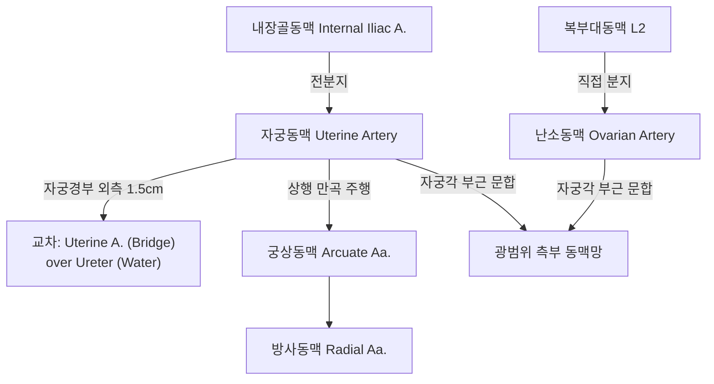
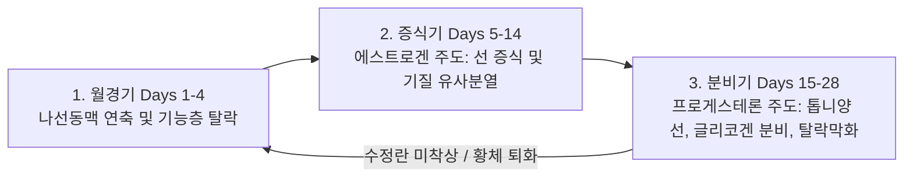
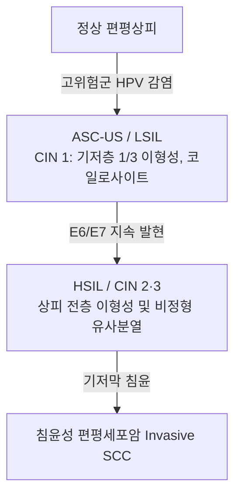

# 📑 [Netter Vol.1] Day 08: 자궁 및 자궁경부 - 해부·내막주기·기형·경부암·선근증·근종 및 내막암 (Section 8 완독)

> 📖 **원서 출처**: [The Netter Collection of Medical Illustrations - Volume 1, Reproductive System.pdf (pp. 154-185)](https://drive.google.com/file/d/1x-xTgPfUfiK7dsQyp5L5qfjFYSD_XyGm/view?usp=drivesdk)  
> 🏷️ **범위**: Section 8 전편 (Plate 8-1 ~ Plate 8-32, 총 32개 플레이트 전수 포함)  
> 📌 **핵심 테마**: 골반 장기 및 복막 주름 해부학, 자궁동맥-요관 교차 관계("Water under the bridge"), 자궁벽 3중 근육층("생체 결찰사 8자 교차") 및 나선동맥(Spiral a.) 미세순환, 자궁내막 주기(증식기 vs 분비기) 및 원발성 월경통(PGF2α), 뮐러관 선천 기형(중격자궁 vs 쌍각자궁) 및 위치 이상/탈출증, 자궁경부 이형성증(Bethesda/CIN/HPV 16·18 E6/E7) 및 FIGO 자궁경부암 병기별 수술·CCRT, 비정상 자궁출혈 PALM-COEIN, 자궁선근증(Boggy uterus) 및 아셔만 증후군(Asherman), 자궁내막증식증(EIN), 자궁근종(FIGO 0~8형 및 적색변성)과 육종, 자궁내막암(Bokhman 1형 vs 2형 TP53) 수술적 병기

---

## 1. 개요 및 마스터 요약 (Executive Summary)

1. **자궁의 3차원 해부학 및 혈관·요관의 외과적 관계**:
   - 자궁은 기저부(Fundus), 체부(Corpus), 협부(Isthmus), 경부(Cervix)로 구분되며 정상 성인에서 방광 위로 전경·전굴(Anteverted & Anteflexed, 80%)되어 있습니다.
   - **자궁동맥-요관의 교차 ("Water under the bridge")**: 내장골동맥에서 분지한 자궁동맥(Uterine a.)은 기자인대(Cardinal lig.) 기저부를 지나 자궁경부 외측 약 $1.5\sim 2\text{ cm}$ 지점에서 **요관(Ureter)의 상방을 가로질러 주행**합니다. 자궁절제술 시 요관 손상(결찰 또는 절단)이 가장 호발하는 핵심 외과적 랜드마크입니다.
2. **자궁근층의 생역학 및 내막 미세혈관 순환**:
   - 자궁근층(Myometrium)의 중간층은 8자형으로 얽힌 **망상근섬유(Interlacing / Plexiform fibers, "생체 결찰사 Living ligatures")**로 구성되어, 분만 후 태반 박리 부위의 혈관을 강력히 압착·차단하여 산후 출혈을 방지합니다.
   - **나선동맥(Spiral artery)**: 방사동맥에서 분지하여 기능층(Stratum functionalis)을 관류하며, 프로게스테론 소퇴 시 강력한 혈관 연축(Vasospasm)과 허혈성 괴사를 일으켜 월경 탈락을 유도합니다. 기저층을 관류하는 기저동맥(Basal artery)은 호르몬 변화에 무반응하여 보존됩니다.
3. **뮐러관 기형 및 비정상 자궁출혈 (PALM-COEIN)**:
   - **중격자궁 (Septate uterus)**: 외측 윤곽은 정상이지만 중앙 흡수 부전으로 섬유성 중격 잔존. 자연유산율이 가장 높아 자궁경하 중격절제술(Hysteroscopic metroplasty)의 절대 적응증.
   - **AUB 분류 (FIGO PALM-COEIN)**: 구조적 원인(Polyp, Adenomyosis, Leiomyoma, Malignancy/hyperplasia)과 비구조적 원인(Coagulopathy, Ovulatory dysfunction, Endometrial, Iatrogenic, Not yet classified).
4. **자궁경부 병리 및 암 종양학**:
   - **변환대 (Transformation Zone, TZ)**: 원주상피가 편평상피로 화생(Squamous metaplasia)되는 부위로, 고위험군 **HPV 16(E6 $\rightarrow$ p53 분해)** 및 **HPV 18(E7 $\rightarrow$ pRb 분해)** 감염에 의한 자궁경부암 호발지.
   - **FIGO 2018 병기 및 치료**: 미세침윤(IA)은 원추절제술 또는 단순자궁절제술, 조기 침윤(IB1~IIA1)은 광범위 자궁절제술(Wertheim-Meigs) + 림프절 곽청술, 국소 진행성(IB3, IIA2~IVA)은 **동시항암화학방사선요법 (CCRT, Cisplatin 기반)**이 표준 치료.
5. **자궁체부 질환 및 내막암 이원론**:
   - **자궁선근증 (Adenomyosis)**: 기저층 내막 조직이 근층 깊숙이 침투($> 2.5\text{ mm}$)하여 반응성 평활근 비후를 유발. 미만성 종대, 대칭성 구형의 "물렁하고 압통을 동반한 자궁(Globular boggy tender uterus)", 월경과다 및 중증 월경통.
   - **자궁근종 (Leiomyoma)**: 단클론성 양성 평활근종. 임신 중 급격한 허혈 괴사로 심한 동통을 일으키는 **적색 변성(Red / Carneous degeneration)**은 보존적 진통 요법이 원칙.
   - **자궁내막암의 Bokhman 2대 아형**:
     - **Type I (자궁내막양선암, 80%)**: 에스트로겐 과다 노출 기저, 비만, 비정형 증식증(EIN) 경유, PTEN 돌연변이, 양호한 예후.
     - **Type II (장액성/투명세포암, 10~20%)**: 비호르몬성, 고령·마른 체형, 위축성 내막 기저, **TP53 돌연변이(> 90%)**, 림프/복막 파종 호발, 불량한 예후. 수술적 병기 설정(TH/BSO + 골반/대동맥주위 림프절 곽청) 필수.

---

## 2. 정상 해부학, 혈관·신경망 및 지지 구조 (Plates 8-1 ~ 8-6)

### Plate 8-1 | 골반 내장 (Pelvic Viscera)

![[Netter_V1_Plate8-1.png]]

#### 1) 골반강 내 장기 배열 및 복막 함요 (Peritoneal Pouches)
- **전방에서 후방으로의 배열**: 치골 결합(Pubis) $\rightarrow$ 방광(Bladder) $\rightarrow$ 자궁(Uterus) $\rightarrow$ 직장(Rectum) $\rightarrow$ 천골(Sacrum).
- **복막의 재귀와 2대 맹낭**:
  1. **방광자궁와 (Vesicouterine pouch)**: 방광 상면에서 자궁 협부 전면으로 복막이 넘어가며 형성되는 얕은 함요.
  2. **자궁직장와 / 더글라스와 (Rectouterine pouch of Douglas)**: 자궁 후면과 질 후원개 상부를 덮은 복막이 직장 전벽으로 넘어가며 형성되는 골반강 및 복강 전체의 **최하단 사장 공간(Lowest dependent space)**. 골반 내 염증 삼출물, 혈복강, 암세포 파종(Drop metastasis / Blumer's shelf)이 가장 먼저 축적되는 부위.

---

### Plate 8-2 | 골반 내장 및 지지 구조: 상방 시점 (Pelvic Viscera and Support — From Above)

![[Netter_V1_Plate8-2.png]]

#### 1) 자궁의 4대 주요 인대와 복막 주름
골반강을 상방에서 내려다보았을 때 자궁을 고정하는 주요 결합조직 및 복막 구조:
1. **광인대 (Broad Ligament)**: 자궁 양측 연에서 골반 측벽까지 펼쳐지는 2겹의 복막 주름:
   - **난관간막 (Mesosalpinx)**: 난관을 감싸는 상부 복막.
   - **난소간막 (Mesovarium)**: 난소를 앞쪽에서 지지하는 후엽 주름.
   - **자궁간막 (Mesometrium)**: 자궁체부 양측의 가장 넓은 복막 구역으로 자궁혈관 포함.
2. **자궁원인대 (Round Ligament)**: 자궁각(Corneal junction) 전하방에서 기원하여 골반 복막 아래를 지나 내서혜륜을 관통, 대음순 피하지방에 부착. 배아 고환도대(Gubernaculum)의 잔유물로 자궁을 전경 상태로 유지.
3. **기자인대 / 맥켄로트 인대 (Cardinal / Mackenrodt's Ligament)**: 자궁경부 및 질 상부 외측에서 골반 측벽으로 방사상 부착하는 치밀한 혈관주위 결합조직막. 자궁의 측방 탈출을 방어하는 최강의 지지대.
4. **자궁천골인대 (Uterosacral Ligament)**: 자궁경부 후상방에서 직장 양측을 감싸며 제2~4 천골 전면 골막에 부착. 자궁경부를 후상방으로 당겨 질 축을 수평화.

---

### Plate 8-3 | 자궁 및 골반 장기의 혈액 공급 (Blood Supply of Uterus and Pelvic Organs)

![[Netter_V1_Plate8-3.png]]

#### 1) 자궁동맥의 기원 및 "Water Under the Bridge"
- **자궁동맥 (Uterine Artery)**:
  - 내장골동맥(Internal iliac a.)의 전분지에서 분지.
  - 기자인대 상부를 따라 골반 측벽에서 내측으로 주행.
  - **자궁동맥-요관 교차 (Ureteral Relation)**: 자궁경부 외측 약 $1.5\sim 2.0\text{ cm}$ 지점에서 **자궁동맥이 요관의 상방을 활 모양으로 가로지름 ("Water flows under the bridge")**.
  - 자궁절제술 시 기자인대를 결찰하거나 자궁동맥을 분리할 때 요관이 동반 결찰되거나 허혈성 괴사에 빠질 위험이 극히 높으므로, 반드시 요관의 주행을 시각적으로 확인하거나 박리(Ureterolysis)해야 함.
- **문합 순환망**: 자궁동맥은 자궁 외측벽을 따라 뱀처럼 구불구불하게(Tortuous) 상행하며, 난관-난소 분지에서 대동맥 기원의 **난소동맥(Ovarian a.)**과 광범위한 동맥 아케이드(Anastomotic arcade)를 형성.



---

### Plate 8-4 | 골반의 림프 배액 체계 (Lymphatic Drainage I — Pelvis)

![[Netter_V1_Plate8-4.png]]

#### 1) 골반벽 및 주요 혈관 주위 림프절 체계
골반 장기에서 배액되는 림프는 장골혈관계를 따라 단계적으로 상행합니다:
- **폐쇄 림프절 (Obturator nodes)**: 폐쇄와(Obturator fossa) 내 폐쇄신경 및 혈관 주위 림프절군.
- **외장골 림프절 (External iliac nodes)**: 외장골동·정맥을 따라 배열되며, 서혜부 및 골반 전방에서 유입.
- **내장골 림프절 (Internal iliac / Hypogastric nodes)**: 내장골혈관 분지 주위 림프절.
- **총장골 림프절 (Common iliac nodes)**: 천골 갑각(Promontory) 주위에서 내·외장골 림프관이 합류하는 중간 관문.
- **대동맥주위 림프절 (Para-aortic nodes)**: 복부대동맥 및 하대정맥 주위 림프절로 골반강 림프의 최종 복강내 집결지.

---

### Plate 8-5 | 내부 생식기의 림프 배액 (Lymphatic Drainage II — Internal Genitalia)

![[Netter_V1_Plate8-5.png]]

#### 1) 자궁 부위별 차별적 림프 배액 경로
자궁의 종양학적 전이 양상은 원발 부위의 림프 배액망에 의해 결정됩니다:
1. **자궁경부 (Cervix)**:
   - 기자인대 림프관 $\rightarrow$ **폐쇄 림프절, 내장골 및 외장골 림프절** $\rightarrow$ 총장골 $\rightarrow$ 대동맥주위 림프절.
   - 자궁천골인대 림프관 $\rightarrow$ **천골 림프절 (Sacral nodes)**.
2. **자궁저부 및 상부 체부 (Fundus & Upper Corpus)**:
   - 난소 혈관을 따라 골두간막(Infundibulopelvic lig.)을 경유하여 **대동맥주위 림프절(Para-aortic nodes)**로 직접 배액.
   - 자궁원인대 림프관을 따라 서혜관을 거쳐 **표재 서혜 림프절(Superficial inguinal nodes)**로 역행 전이 가능.
3. **자궁하부 체부 (Lower Uterine Segment)**:
   - 자궁경부와 동일하게 외장골 및 내장골 림프절로 배액.

---

### Plate 8-6 | 내부 생식기의 신경 지배 (Innervation of Internal Genitalia)

![[Netter_V1_Plate8-6.png]]

#### 1) 자궁질신경총(Frankenhauser) 및 통증 전달 경로
- **하하복신경총 및 자궁질신경총 (Uterovaginal plexus / Frankenhauser's ganglion)**: 자궁경부 양측 및 기자인대 기저부에 위치하는 자율신경 집합체.
- **교감신경 (T10-L2)**: 흉요수 유래 $\rightarrow$ 상하복신경총(Superior hypogastric plexus) $\rightarrow$ 하복신경 $\rightarrow$ 자궁 수축 및 혈관 수축 유발.
- **부교감신경 (S2-S4)**: 골반내장신경(Pelvic splanchnic nerves, Nervi erigentes) $\rightarrow$ 자궁 평활근 이완 및 혈관 확장 유발.
- **자궁 통증 전달 경로 (Visceral Pain Pathways)**:
  - **자궁체부 및 저부 통증(진통, 자궁수축통)**: 교감신경을 동반하여 **T10-L1 척수 분절**로 유입.
  - **자궁경부 및 상부 질 통증(경부 개대통)**: 부교감신경을 동반하여 **S2-S4 척수 분절**로 유입.
  - 난치성 골반통/월경통 환자에서 천골 갑각 전면의 신경 다발을 절제하는 **천골전신경절제술(Presacral neurectomy)** 시행 시 T10-L1 통증 차단.

---

## 3. 자궁 형태학, 근육층, 내막 미세순환 및 월경 주기 (Plates 8-7 ~ 8-11)

### Plate 8-7 | 자궁 및 자궁부속기 (Uterus and Adnexa)

![[Netter_V1_Plate8-7.png]]

#### 1) 정상 자궁의 육안적 구역 구분 및 크기
- **크기 및 중량**: 미경산부 기준 길이 약 $7.5\text{ cm}$, 폭 $5\text{ cm}$, 두께 $2.5\text{ cm}$, 무게 약 $40\sim 50\text{ g}$ (경산부는 약 $70\sim 80\text{ g}$).
- **해부학적 4대 구역**:
  1. **자궁저부 (Fundus)**: 양측 난관 삽입부(자궁각)를 연결하는 수평선 상방의 둥근 돔 형태 구역.
  2. **자궁체부 (Corpus)**: 기저부 아래에서 협부 사이에 위치하는 두꺼운 근육질의 본체.
  3. **자궁협부 (Isthmus)**: 체부와 경부 사이의 약 $1\text{ cm}$ 길이 잘록한 부위. 임신 3분기에 신장되어 **자궁하절(Lower uterine segment)**을 형성하며 제왕절개술의 주 절개 부위가 됨.
  4. **자궁경부 (Cervix)**: 질 내로 돌출하는 원통형 하부.

---

### Plate 8-8 | 자궁의 발생 및 근육층 구조 (Uterine Development and Musculature)

![[Netter_V1_Plate8-8.png]]

#### 1) 자궁근층(Myometrium)의 3중 구조와 산후 지혈 기전
자궁벽 두께의 대부분을 차지하는 평활근은 기능적으로 분화된 3개 층으로 배열됩니다:
1. **외층 (Outer longitudinal layer)**: 종주근 섬유. 자궁 저부 위를 활처럼 가로질러 난관 및 원인대 섬유와 연속. 자궁 탈출 억제 및 수축력 전달.
2. **중간층 (Middle plexiform / interlacing layer, 가장 두꺼움)**:
   - 복잡하게 뒤얽힌 **8자형 망상 근섬유 (Figure-of-eight lattice)**.
   - 근섬유 사이사이로 대형 혈관 및 정맥동이 관통함.
   - **생체 결찰사 (Living ligatures)**: 분만 후 태반이 분리되면 중간층 평활근이 강력히 지속 수축하여 개방된 혈관을 노끈으로 묶듯 물리적으로 압착·폐쇄. 이 기전이 파탄 나면 **자궁이완증(Uterine atony)**에 의한 치명적 산후 대량출혈 발생.
3. **내층 (Inner circular layer)**: 얇은 윤상근 섬유. 자궁구 및 난관 개구부 주위를 괄약근 형태로 둘러쌈.

---

### Plate 8-9 | 자궁내막의 미세혈관 순환망 (Endometrial Blood Supply)

![[Netter_V1_Plate8-9.png]]

#### 1) 방사동맥, 기저동맥 및 나선동맥의 2중 혈류 체계
- **궁상동맥 (Arcuate a.)**: 자궁동맥 분지가 자궁근층 외측 $1/3$ 부위에서 원형으로 분지.
- **방사동맥 (Radial a.)**: 궁상동맥에서 수직으로 꺾여 자궁내막을 향해 구심성으로 침투.
- **내막 혈관의 2원화 분기**:
  1. **기저동맥 (Straight / Basal arteries)**:
     - 자궁내막 **기저층(Stratum basalis)**에만 혈류 공급.
     - **난소 호르몬 변화에 완전히 불응성(Unresponsive)**.
     - 월경 탈락 시에도 연축되지 않고 혈류를 유지하여, 월경 후 기능층의 혈관 신생 및 상피 재생을 위한 영양 보장.
  2. **나선동맥 (Coiled / Spiral arteries)**:
     - 자궁내막 **기능층(Stratum functionalis)** 전반을 관류.
     - **에스트로겐과 프로게스테론에 극도로 민감**.
     - 황체기 말기 프로게스테론 급락 시 격렬한 혈관 수축 $\rightarrow$ 기능층의 국소 허혈, 모세혈관 파열, 조직 괴사 및 기질 붕괴 유발 $\rightarrow$ **월경혈(Menstrual flow) 발생**.

---

### Plate 8-10 | 자궁내막 주기 (Endometrial Cycle)

![[Netter_V1_Plate8-10.png]]

#### 1) 28일 난소 주기와 자궁내막의 3단계 동기화



1. **월경기 (Menstrual Phase, 제1~4일)**:
   - 프로게스테론 소퇴 $\rightarrow$ 나선동맥 수축 및 이완 반복 $\rightarrow$ 혈관벽 파열 및 혈종 형성 $\rightarrow$ 해면층 및 치밀층의 괴사성 박리. (기저층 1 mm만 잔존).
2. **증식기 (Proliferative / Follicular Phase, 제5~14일)**:
   - 난포의 **에스트로겐(Estradiol)** 자극에 의해 기저층 선단에서 상피 세포가 급속 분열.
   - 내막 두께가 $1\text{ mm}$에서 $4\sim 5\text{ mm}$로 급증.
   - 조직학적 특징: 좁고 곧은 원통형 선(Straight tubular glands), 빽빽한 기질 세포, 풍부한 유사분열상(Mitotic figures).
3. **분비기 (Secretory / Luteal Phase, 제15~28일)**:
   - 배란 후 황체의 **프로게스테론(Progesterone)** 분비로 주도.
   - 내막 두께가 $6\sim 8\text{ mm}$까지 증가하며 선 조직의 기능적 완성.
   - **배란 36~48시간 후 (제16~17일)**: 선 상피세포 기저부에 핵하 공포(**Subnuclear vacuolation**) 출현 (배란의 절대적 조직학적 지표).
   - **제21~22일 (착상 창, Implantation window)**: 선이 구불구불한 톱니 모양(Tortuous saw-tooth)으로 팽대되고 내강에 글리코겐 및 당단백 점액 대량 분비. 기질 부종 극대화.
   - **제23~27일**: 기질 세포가 둥글고 다각형으로 변하며 세포질이 풍부해지는 **탈락막 반응(Predecidualization)** 완성.

---

### Plate 8-11 | 월경통의 병태생리 (Dysmenorrhea)

![[Netter_V1_Plate8-11.png]]

#### 1) 원발성 vs 속발성 월경통의 기전 및 감별
- **원발성 월경통 (Primary Dysmenorrhea)**:
  - 기저 골반 병변 없이 배란 주기 수립 후 초경 1~2년 이내 시작.
  - **분자 생물학적 기전**:
    1. 황체 퇴화 시 프로게스테론 급락 $\rightarrow$ 자궁내막 세포 리소좀 파괴 $\rightarrow$ 포스포리파아제 $A_2(\text{PLA}_2)$ 활성화.
    2. 세포막 인지질에서 아라키돈산 유리 $\rightarrow$ COX-2 경로를 통해 **프로스타글란딘 $\mathbf{F_{2\alpha}}$ ($\mathbf{PGF_{2\alpha}}$) 및 $\mathbf{PGE_2}$ 폭발적 합성**.
    3. 과도한 자궁근층 강직성 수축(자궁강내 압력 $> 120\text{ mmHg}$, 정상은 $< 50\text{ mmHg}$) $\rightarrow$ 자궁혈류 차단 $\rightarrow$ **급성 근육 허혈 및 젖산 축적** $\rightarrow$ C-신경섬유 자극으로 극심한 산통 유발.
    4. 전신 혈관 유입 시 오심, 구토, 두통, 설사 동반.
  - **치료**: 프로스타글란딘 합성을 차단하는 **NSAIDs(이부프로펜, 나프록센)**가 1차 선택제이며, 배란을 억제하여 분비기 내막 형성을 차단하는 **복합경구피임제(COC)** 병용.
- **속발성 월경통 (Secondary Dysmenorrhea)**:
  - 기질적 병인(자궁내막증, 자궁선근증, 자궁근종, 골반염증성질환 등)에 의해 발생하며 생리 시작 1~2주 전부터 통증이 지속됨.

---

## 4. 선천 기형, 위치 이상, 탈출증 및 외상 (Plates 8-12 ~ 8-16)

### Plate 8-12 | 자궁의 선천성 기형 (Congenital Anomalies)

![[Netter_V1_Plate8-12.png]]

#### 1) 뮐러관(Paramesonephric Ducts) 발생 이상의 AFS/ASRM 7대 분류

| 기형 분류 | 발생학적 오류 | 자궁 외형 및 강(Cavity) 소견 | 임상 의의 및 치료 |
| :--- | :--- | :--- | :--- |
| **Class I<br>(무발생/저형성)** | 뮐러관 신장 부전 | 자궁 및 질 상부 완전 결손 (MRKH 증후군) | 원발성 무월경, 불임. 질 확장요법 |
| **Class II<br>(단각자궁, Unicornuate)** | 한쪽 뮐러관 미발생 | 단일 자궁강, 반대측 흔적각(Rudimentary horn) 존재 | 흔적각 임신 시 파열 위험 $\rightarrow$ 흔적각 절제술 |
| **Class III<br>(중복자궁, Didelphys)** | 양측 뮐러관 완전 비융합 | **2개의 자궁체부, 2개의 자궁경부, 2개의 질** | 가임력 비교적 양호, 조산율 증가 |
| **Class IV<br>(쌍각자궁, Bicornuate)** | 뮐러관 불완전 융합 | **자궁저부 외측 함몰 깊이 $\mathbf{> 1.0\text{ cm}}$**, 2개의 자궁각 | 외과적 융합술(Strassman)은 제한적 적응 |
| **Class V<br>(중격자궁, Septate)** | **중앙 융합 중격의 흡수 부전** | **자궁저부 외형은 정상/경미함몰($\le 1\text{ cm}$)**, 내강에 섬유성 중격 | **자연유산(65%) 및 난임 빈발** $\rightarrow$ **자궁경하 중격절제술(Hysteroscopic metroplasty) 완치** |
| **Class VI<br>(궁상자궁, Arcuate)** | 중격의 경미한 불완전 흡수 | 자궁저부 내강의 완만한 새들형(Saddle) 함몰 | 정상 변이로 간주 (치료 불필요) |
| **Class VII<br>(DES 노출 자궁)** | 모체 DES 약물 노출 | **T자형 자궁강 (T-shaped cavity)** | 자궁경관무력증(IIOC), 자궁외임신 빈발 |

> ⚠️ **Clinical Pearl: 중격자궁 vs 쌍각자궁의 결정적 감별 포인트**  
> 두 질환 모두 초음파나 자궁난관조영술(HSG) 상 내강이 2개로 갈라져 보이나 치료법은 완전히 다릅니다:  
> - **자궁저부 외측 표면(Serosal contour)**이 $1\text{ cm}$ 이상 깊게 파여 있으면 **쌍각자궁**이며 수술을 요하지 않습니다.  
> - 외측 표면이 평평하거나 정상 볼록 형태이면 **중격자궁**이며, 무혈관성 섬유 조직인 중격에 수정란이 착상하면 혈류 부전으로 100% 유산되므로 자궁경으로 중격만 간단히 가위로 잘라주면(Metroplasty) 임신 유지가 가능합니다.

---

### Plate 8-13 | 자궁의 위치 이상 및 변위 (Displacements)

![[Netter_V1_Plate8-13.png]]

#### 1) 전경·전굴 vs 후경·후굴
- **자궁축의 정상 정의**:
  - **전경 (Anteversion)**: 질 축에 대해 자궁경부-체부 축이 전방으로 기울어진 각도(약 $90^\circ$).
  - **전굴 (Anteflexion)**: 자궁경부 축에 대해 자궁체부가 협부에서 전방으로 꺾인 각도(약 $120\sim 170^\circ$).
- **후굴 자궁 (Retroverted / Retroflexed Uterus, 20%)**:
  - 인구의 약 20%에서 관찰되는 선천적 해부학적 변이로 대개 무증상.
  - 골반 유착(자궁내막증, 만성 골반염)에 의한 고정성 후굴은 심부 성교통 및 배변통 유발.
  - **임신 중 감금 (Incarcerated Gravid Uterus)**: 임신 12~14주에 후굴된 자궁이 증대되면서 천골 갑각(Sacral promontory) 아래 골반강에 끼여 갇히는 현상. 자궁경부가 치골 뒤쪽으로 밀려 올라가 요도를 압박함으로써 **급성 요폐(Urinary retention)** 및 기이성 요실금 유발. 도뇨관 삽입 및 흉슬위(Knee-chest position)로 정복.

---

### Plate 8-14 | 자궁 탈출증 (Prolapse)

![[Netter_V1_Plate8-14.png]]

#### 1) 골반장기탈출증의 진행 병기 (Baden-Walker & POP-Q)
- **병태생리**: 다산, 난산, 만성 기침, 비만 등에 의해 **Level I 지지대(기자인대, 자궁천골인대)** 및 항문거근 복합체가 신장·파열되어 자궁이 질강을 따라 하강.
- **진행 단계**:
  - 1도: 자궁경부가 질강 중간까지 하강.
  - 2도: 자궁경부가 처녀막(Hymen) 면까지 도달.
  - 3도: 자궁경부가 처녀막 외측으로 돌출.
  - 4도 (완전 탈출증, Procidentia): 자궁 전체와 질벽이 체외로 완전히 뒤집혀 빠져나옴. 보행 마찰로 인한 질 점막 궤양, 감염, 요관 굴곡에 의한 수신증(Hydronephrosis) 위험.
- **치료**:
  - 보존적: 페사리(Pessary) 삽입, 골반저 근육 운동(Kegel).
  - 수술적: 질식 자궁절제술(Vaginal hysterectomy) + 질원개 천골고정술(Sacrospinous ligament fixation / McCall culdoplasty). 노령 고위험군은 질폐쇄술(LeFort colpocleisis).

---

### Plate 8-15 | 자궁 천공 (Perforation)

![[Netter_V1_Plate8-15.png]]

#### 1) 의인성 자궁 천공의 기전 및 응급 처치
- **호발 상황**: 인공임신중절술 또는 불완전유산에 따른 소파술(D&C), 자궁경 검사, 자궁내장치(IUD) 삽입 시 발생.
- **천공 부위별 위험도**:
  - **자궁저부 정중선 천공**: 둔기 기구(소파자)에 의한 단순 천공 시 복강내 출혈이 경미하면 입원 관찰 및 항생제 투여로 자연 치유 가능.
  - **자궁 측벽 및 하절 협부 천공**: **자궁동맥 본체 및 상행지 파열 위험** $\rightarrow$ 광범위한 광인대 혈종(Broad ligament hematoma) 및 복강내 대량 출혈 초래.
  - **흡입관(Suction curette) 또는 겸자(Forceps) 천공**: **소장, 대장, 망(Omentum)을 자궁강 내로 끌고 내려와 장간막 파열 및 장 천공 유발**. 즉각적인 복강경/개복술로 장 손상 확인 및 봉합 필수.

---

### Plate 8-16 | 자궁경부 열상, 협착 및 용종 (Lacerations, Strictures, Polyps)

![[Netter_V1_Plate8-16.png]]

#### 1) 경부의 양성 질환 및 기계적 손상
- **분만성 경부 열상 (Obstetric Cervical Laceration)**: 급속 분만이나 겸자 분만 시 경부 3시, 9시 방향 측벽 열상 호발. 심한 산후 출혈의 원인.
- **자궁경부 협착증 (Cervical Stenosis)**: 냉동요법, 전기소작술, 원추절제술(LEEP / Conization) 후 반흔 구축이나 폐경 후 위축으로 경관 폐쇄. 가임기 여성에서는 월경혈 저류로 **자궁혈종(Hematometra)** 및 무월경, 폐경 여성에서는 분비물 저류로 **자궁축농증(Pyometra)** 유발.
- **자궁경부 용종 (Endocervical Polyp)**:
  - 경관 내막 점막의 국소 과다증식으로 형성된 혈관이 풍부한 양성 유경성(Pedunculated) 종괴.
  - **주증상**: 무통성 간헐적 점적 출혈 및 **성교 후 출혈(Postcoital bleeding)**.
  - 외래에서 기저부를 감자(Ring forceps)로 비틀어 간단히 염전 절제(Torsion avulsion) 가능 (악성 변성률 $< 1\%$이나 조직검사 필수).

---

## 5. 자궁경부 염증, 세포학 및 자궁경부암 (Plates 8-17 ~ 8-21)

### Plate 8-17 | 자궁경부염 I: 미란 및 외인성 감염 (Cervicitis I — Erosions, External Infections)

![[Netter_V1_Plate8-17.png]]

#### 1) 자궁경부 외번(Ectopy / Eversion)과 편평상피화생
- **외번 (Cervical Ectopy)**: 에스트로겐 자극(가임기, 임신, 경구피임약)으로 인해 자궁경관 내막의 붉고 부드러운 단층 원주상피가 외경부 쪽으로 밀려 나와 겉으로 드러나는 **정상적인 생리적 현상** (과거 '미란 Erosion'으로 오칭).
- **편평상피화생 (Squamous Metaplasia)**: 질내 산성 환경에 노출된 원주상피가 방어 기전으로 다층의 중층편평상피로 치환되는 과정.
- **변환대 (Transformation Zone, TZ)**:
  - 원래의 편평원주접합부(Original SCJ)와 새로운 편평원주접합부(New SCJ) 사이의 영역.
  - 화생 세포의 활발한 분열로 인해 **HPV 감염 및 자궁경부암의 95% 이상이 발생하는 절대적 호발 부위**.
- **나보트 낭종 (Nabothian Cyst)**: 편평상피화생 과정에서 원주상피 분비선의 입구가 막혀 점액이 갇혀 형성된 무해한 양성 체류성 낭종.

---

### Plate 8-18 | 자궁경부염 II: 임균 및 클라미디아 감염 (Cervicitis II — Gonorrhea, Chlamydial Infections)

![[Netter_V1_Plate8-18.png]]

#### 1) 점액농성 자궁경부염(Mucopurulent Cervicitis, MPC)의 병인과 위험
- **클라미디아 (*Chlamydia trachomatis*, D-K형)**:
  - 가장 빈번한 원인균. 편평상피에는 감염되지 않고 **원주상피에만 선택적으로 감염**.
  - 황색 점액농성 경관 분비물, 경부 접촉 시 취약성 출혈(Friability).
  - 미치료 시 자궁내막염 $\rightarrow$ 난관염 $\rightarrow$ **골반염증성질환(PID) 및 불임, 자궁외임신** 초래.
  - 치료: **Doxycycline $100\text{ mg}$ bid $\times 7$일** (또는 Azithromycin $1\text{ g}$ 단회).
- **임균 (*Neisseria gonorrhoeae*)**:
  - 화농성 경관 분비물. 그람염색상 다형핵 백혈구 내 그람음성 쌍구균(Intracellular Gram-negative diplococci).
  - 치료: **Ceftriaxone $500\text{ mg}$ IM 단회**.

---

### Plate 8-19 | 자궁경부암 I: 자궁경부 세포진 및 선별검사 (Cancer of Cervix I — Cytology)

![[Netter_V1_Plate8-19.png]]

#### 1) 베데스다 시스템(The Bethesda System, TBS)과 코일로사이트
- **세포진 검사 (Pap Smear / LBC)**: 변환대(TZ)에서 솔(Cytobrush / Spatula)로 세포를 긁어 채취.
- **HPV의 세포학적 지표: 코일로사이트 (Koilocyte)**:
  - 고위험군 HPV 감염의 병리적 특징.
  - 핵 주위의 뚜렷한 투명 달무리(**Perinuclear clear halo**), 핵 비대 및 농축, 주름진 건포도 모양의 핵막(**Raisinoid wrinkled nucleus**).



- **HPV 종양단백질의 분자 기전**:
  - **HPV E6 단백질**: 종양억제단백질 **p53**과 결합하여 유비퀴틴화 분해 촉진 $\rightarrow$ DNA 손상 시 세포자멸사(Apoptosis) 차단.
  - **HPV E7 단백질**: 종양억제단백질 **pRb**와 결합하여 E2F 전사인자를 방출시킴 $\rightarrow$ 세포주기 G1/S기 강제 진입 촉진.

---

### Plate 8-20 | 자궁경부암 II: 다양한 임상 병기 및 조직형 (Cancer of Cervix II — Various Stages and Types)

![[Netter_V1_Plate8-20.png]]

#### 1) 육안적 형태학 및 조직학적 분류
- **육안적 성장 양상**:
  - **외성장형 (Exophytic / Cauliflower-like)**: 질강 내로 꽃양배추 모양으로 자라나 조기에 접촉성 출혈 유발.
  - **내성장형 (Endophytic / Ulcerative)**: 경관 내부로 파고들며 궤양 형성, 자궁경부가 배럴 모양(Barrel-shaped cervix)으로 비대.
- **주요 조직형**:
  - **편평세포암 (Squamous Cell Carcinoma, SCC, 75~80%)**: 각화형 및 비각화형.
  - **선암 (Adenocarcinoma, 20~25%)**: 경관선 상피 유래. HPV 18형과 연관성이 높으며 세포진 검사에서 위음성률이 높아 조기 발견이 어렵고 예후가 불량.

---

### Plate 8-21 | 자궁경부암 III: 침윤 및 전이 경로 (Cancer of Cervix III — Extension and Metastases)

![[Netter_V1_Plate8-21.png]]

#### 1) FIGO 자궁경부암 병기(2018 개정) 및 병기별 치료 원칙

| FIGO 병기 (2018) | 종양 침범 범위 및 정의 | 표준 치료 가이드라인 |
| :--- | :--- | :--- |
| **Stage IA1** | 미세침윤: 침습 깊이 $< 3\text{ mm}$ (혈관침윤 없음) | 가임력 보존: **자궁경부 원추절제술(Conization)**<br>완료: 단순 전자궁절제술(Extrafascial Hysterectomy) |
| **Stage IA2~IB2** | IA2 (깊이 $3\sim 5\text{ mm}$), IB1 ($< 2\text{ cm}$), IB2 ($2\sim 4\text{ cm}$) | **근치적 자궁절제술 (Wertheim-Meigs Radical Hysterectomy)**<br>+ 양측 골반 림프절 곽청술 (PLND) |
| **Stage IB3 / IIA2** | 육안적 종양 크기 $\ge 4\text{ cm}$ 국소 거대 병변 | **동시항암화학방사선요법 (CCRT, Cisplatin 기반)** |
| **Stage IIB** | **자궁방결합직(Parametrium) 침윤** (골반벽 미도달) | **동시항암화학방사선요법 (CCRT)** (수술 금기) |
| **Stage IIIA / IIIB** | IIIA (질 하부 1/3 침윤), IIIB (골반벽 도달 또는 **수신증**) | **동시항암화학방사선요법 (CCRT)** |
| **Stage IIIC** | 골반(IIIC1) 또는 대동맥주위(IIIC2) 림프절 전이 | **확장 영역 방사선치료(Extended-field RT) + CCRT** |
| **Stage IVA / IVB** | IVA (방광/직장 점막 침윤), IVB (원격 장기 전이) | IVA: 선택적 골반장기적출술 또는 CCRT<br>IVB: 완화적 전신 항암치료 |

> 📌 **핵심 외과 원칙**: 자궁경부암에서 **자궁방결합직(Parametrium) 침윤이 시작되는 Stage IIB부터는 수술적 완전 절제가 불가능**하며 합병증만 급증하므로, 수술을 배제하고 **CCRT(외부 방사선 + 강내 근접방사선 브라키세라피 + 시스플라틴 항암제)**를 시행하는 것이 세계적 표준입니다.

---

## 6. 비정상 출혈, 선근증, 유착증 및 내막증식증 (Plates 8-22 ~ 8-26)

### Plate 8-22 | 비정상 자궁출혈의 원인 분류 (Causes of Uterine Bleeding — PALM-COEIN)

![[Netter_V1_Plate8-22.png]]

#### 1) FIGO 공식 PALM-COEIN 병인학적 분류 체계
가임기 비임신 여성의 비정상 자궁출혈(Abnormal Uterine Bleeding, AUB)을 체계적으로 감별:
- **구조적 병인 (PALM - 영상 및 조직학적 확인 가능)**:
  - **P**olyp (자궁내막 용종)
  - **A**denomyosis (자궁선근증)
  - **L**eiomyoma (자궁근종 - 점막하 vs 기타)
  - **M**alignancy & Hyperplasia (악성종양 및 비정형 증식증)
- **비구조적 병인 (COEIN - 조직학적 구조 병변 부재)**:
  - **C**oagulopathy (응고장애 - 폰빌레브란트병 등)
  - **O**vulatory dysfunction (배란 장애 - PCOS, 갑상선 질환, 무배란성 파탄출혈)
  - **E**ndometrial (자궁내막 국소 인자 이상 - 혈관수축 부전)
  - **I**atrogenic (의인성 - 항응고제, 피임용 루프 IUD)
  - **N**ot yet classified (미분류)

---

### Plate 8-23 | 자궁내막증식증의 호르몬 기전 (Relationships in Endometrial Hyperplasia)

![[Netter_V1_Plate8-23.png]]

#### 1) 대립되지 않은 에스트로겐(Unopposed Estrogen) 가설
- 프로게스테론의 길항(분비기 전환 및 탈락 유도) 없이 **에스트로겐이 단독으로 자궁내막을 지속 자극**할 때 발생:
  - **무배란 주기**: 다낭성 난소 증후군(PCOS), 주폐경기(Perimenopause).
  - **말초 아로마타제(Aromatase) 전환**: 비만 여성의 지방조직에서 안드로스텐디온이 에스트론($E_1$)으로 대량 전환.
  - **에스트로겐 분비 종양**: 난소 과립막세포종(Granulosa cell tumor).
  - **타목시펜(Tamoxifen) 복용**: 유방에서는 항에스트로겐이나 자궁내막에서는 부분 작용제로 작용하여 내막 증식 촉진.

---

### Plate 8-24 | 자궁선근증 (Adenomyosis)

![[Netter_V1_Plate8-24.png]]

#### 1) 병태생리 및 임상적 3대 특징
- **정의**: 자궁내막 기저층의 선(Glands)과 기질(Stroma) 조직이 자궁근층 내로 침윤하여 깊이 **$2.5\text{ mm}$ 이상 침투**하고, 주변 평활근 세포의 반응성 비후(Hypertrophy)를 동반하는 질환.
- **육안 및 단면 소견**: 자궁이 미만성으로 균일하게 비대해지며, 절단면에서 소용돌이치는 섬유주 사이에 초콜릿색 점상 출혈 병소 관찰.
- **임상 3대 특징**:
  1. **골반 진찰 소견**: **미만성으로 커진 대칭성의 물렁물렁하고 압통이 있는 자궁 ("Globular, symmetrically enlarged, boggy, tender uterus")**.
  2. **극심한 속발성 월경통**: 근층 내 갇힌 내막 조직의 생리혈 저류로 근육 내압 급증.
  3. **월경과다 (Menorrhagia)**: 자궁 비대로 인한 내막 표면적 증가 및 정상 자궁수축 지혈 방해.
- **MRI 진단**: 자궁내막-근층 경계의 **결합대 두께(Junctional Zone thickness) $> 12\text{ mm}$**.

---

### Plate 8-25 | 아셔만 증후군: 자궁강내 유착 (Asherman's Syndrome — Uterine Synechia)

![[Netter_V1_Plate8-25.png]]

#### 1) 발생 원인 및 치료 기법
- **병태생리**: 유산 후, 분만 후 잔류 태반 제거를 위해 시행한 **과도하게 공격적인 소파술(Overzealous curettage)**에 의해 자궁내막의 영구 재생원인 **기저층(Stratum basalis)이 완전히 긁혀 손상**.
- 노출된 근육층들이 서로 섬유성 결합조직 띠(Synechiae)를 형성하며 자궁강이 들러붙어 폐쇄됨.
- **증상**: 소파술 후 월경량이 급감하거나 완전히 소실(**희발월경 또는 속발성 무월경**), 습관성 유산, 난임.
- **치료**:
  - **자궁경하 유착박리술 (Hysteroscopic Adhesiolysis)**.
  - 재유착 방지를 위해 자궁 내에 소아용 폴리 카테터 풍선 거치.
  - 내막 재생을 촉진하기 위한 **고용량 에스트로겐 요법(Premarin $2.5\text{ mg}$ bid $\times 30$일)** 투여 후 프로게스틴 소퇴 출혈 유도.

---

### Plate 8-26 | 자궁내막증식증 및 자궁내막 용종 (Endometrial Hyperplasia, Polyps)

![[Netter_V1_Plate8-26.png]]

#### 1) WHO 2014 분류 기준 및 암 진행 위험도
- **비정형 세포가 없는 증식증 (Hyperplasia without atypia)**:
  - 선과 기질이 함께 증식. 악성 변화 위험률 **$1\sim 3\%$ 미만**.
  - 치료: 경구 프로게스틴(MPA) 또는 레보노르게스트렐 방출 자궁내장치(미레나 LNG-IUD) 삽입.
- **비정형 증식증 / 자궁내막상피내종양 (Atypical Hyperplasia / EIN)**:
  - 세포학적 비정형성(핵 비대, 다형성, 크로마틴 응집, 세포 극성 소실) 동반.
  - **자궁내막암 진행 위험률 약 $30\sim 40\%$ (실제 수술 시 $40\%$에서 이미 동반된 내막암 발견)**.
  - 치료: 전자궁절제술(Total Hysterectomy)이 표준 치료. 가임력 보존을 강력히 원하는 경우에만 고용량 프로게스틴 투여 및 3개월 간격 내막 생검.

---

## 7. 자궁근종 및 자궁 악성종양 (Plates 8-27 ~ 8-32)

### Plate 8-27 | 자궁근종 I: 해부학적 발생 위치 (Myoma / Fibroid I — Locations)

![[Netter_V1_Plate8-27.png]]

#### 1) FIGO 8대 해부학적 분류 체계
자궁 평활근 유래의 단클론성 종양으로 발생 위치에 따라 증상이 현저히 갈립니다:
1. **점막하 근종 (Submucosal, FIGO Type 0, 1, 2)**:
   - 전체의 $5\%$. 자궁내막 바로 아래로 자라나 자궁강을 변형시킴.
   - **가장 작은 크기로도 극심한 월경과다, 부정출혈, 불임 및 유산 유발**. 자궁경 절제술(TCR) 적응증.
2. **근층내 근종 (Intramural, FIGO Type 3, 4, 5)**:
   - 전체의 $70\%$로 가장 흔함. 자궁근벽 자체 내에 위치하여 자궁을 전체적으로 비대화.
3. **장막하 근종 (Subserosal, FIGO Type 6, 7)**:
   - 전체의 $20\%$. 복막 바로 아래로 돌출. 출혈 증상은 적으나 주변 장기 압박(방광 압박 빈뇨, 요관 압박 수신증, 직장 압박 변비) 유발.
4. **기생 근종 (Parasitic Leiomyoma)**:
   - 유경성 장막하 근종이 주변 장기(대망 Omentum, 장간막)에서 혈류를 공급받으며 자궁과의 연결이 끊어진 종양.

---

### Plate 8-28 | 자궁근종 II: 2차성 변성 (Myoma / Fibroid II — Secondary Changes)

![[Netter_V1_Plate8-28.png]]

#### 1) 혈류 공급 불균형에 따른 퇴행성 변화
근종의 크기가 급격히 커지며 중심부 혈액 공급이 부족해질 때 발생:
- **초자성 변성 (Hyaline Degeneration, 65%)**: 가장 흔함. 근섬유가 균일하고 투명한 무구조의 초자질 결합조직으로 치환.
- **낭성 변성 (Cystic Degeneration)**: 초자화된 부위가 액화되어 낭포 형성.
- **석회화 변성 (Calcification)**: 폐경 후 혈류 감소로 칼슘염 침착. 골반 X-선상 전형적인 '팝콘 모양(Popcorn calcification)' 음영.
- **점액성 및 지방 변성 (Myxoid & Fatty Degeneration)**.

---

### Plate 8-29 | 자궁근종 III: 퇴행성 변화, 염전 및 폐색 (Myoma / Fibroid III — Degeneration, Obstruction)

![[Netter_V1_Plate8-29.png]]

#### 1) 적색 변성(Red / Carneous Degeneration)의 임상적 특이성
- **임신 중 또는 산욕기**에 주로 발생.
- 임신 중 급격한 호르몬 자극으로 근종이 급성장하다가 혈관 공급이 따라가지 못해 중심부 정맥 혈전 및 광범위한 출혈성 경색(Hemorrhagic infarction) 발생.
- 육안 소견: 삶은 쇠고기 또는 고기 덩어리처럼 붉은 암적색을 띰.
- 임상 양상: **임신 중 국소적인 극심한 복통, 발열, 백혈구 증가증**. 급성 복증(충수염 등)으로 오인 가능.
- **치료 원칙**: **절대 수술적 절제를 하지 않고, 입원 후 수액 투여와 진통소염제를 통한 보존적 내과 치료가 원칙** (수술 시 대량 출혈 및 유산 유발).

---

### Plate 8-30 | 자궁육종 (Sarcoma)

![[Netter_V1_Plate8-30.png]]

#### 1) 자궁육종의 임상 특징 및 감별 진단
- 자궁 악성 종양의 $2\sim 5\%$를 차지하는 매우 드물고 치명적인 악성 중배엽 종양.
- **기존 근종의 악성 변성은 $0.2\%$ 미만으로 극히 드물며, 거의 대부분 처음부터 새롭게(De novo) 발생함**.
- **평활근육종 (Leiomyosarcoma, LMS)의 3대 병리 진단 기준**:
  1. 현저한 세포학적 비정형성(Nuclear atypia).
  2. 고배율 시야당 10개 이상의 유사분열상(**Mitotic index $> 10\text{ MF}/10\text{ HPF}$**).
  3. **응고성 종양 세포 괴사 (Coagulative tumor cell necrosis)**.
- **경고 징후**: **폐경 후 여성에서 자궁근종이 줄어들지 않고 오히려 급격히 커지는 경우** 반드시 자궁육종을 의심하고 수술적 절제 고려. 림프선 전이보다 혈행성 폐 전이 호발.

---

### Plate 8-31 | 자궁체부암 I: 자궁내막암의 임상 병기 및 아형 (Cancer of Corpus I — Various Stages and Types)

![[Netter_V1_Plate8-31.png]]

#### 1) 보크만(Bokhman)의 자궁내막암 2대 아형 모델

| 특성 | Type I (자궁내막양선암, Endometrioid) | Type II (비내막양암: 장액성 Serous, 투명세포 Clear cell) |
| :--- | :--- | :--- |
| **비율** | 전체의 **$\mathbf{80\%}$** (압도적 다수) | 전체의 **$\mathbf{10\sim 20\%}$** |
| **호르몬 의존성** | **에스트로겐 과다 노출 의존적** | **에스트로겐 비의존성 (독립적)** |
| **환자 특징** | 비만, 당뇨, 고혈압, 미산부, PCOS | 고령 여성, 마른 체형, 위축된 자궁내막 |
| **선행 병변** | **비정형 자궁내막증식증 (EIN)** | **자궁내막선이형성증 / 장액성 상피내암 (EIC)** |
| **유전자 돌연변이** | **PTEN 결손, PIK3CA, KRAS, MSI (Lynch)** | **$\mathbf{TP53}$ 돌연변이 ($> 90\%$)**, HER2 증폭 |
| **임상 경과** | 분화도 양호, 침윤 서서히 진행, **양호한 예후** | 분화도 불량, 조기 림프/복막 파종, **치명적 예후** |

---

### Plate 8-32 | 자궁체부암 II: 조직학적 분류 및 전이 양상 (Cancer of Corpus II — Histology and Extension)

![[Netter_V1_Plate8-32.png]]

#### 1) FIGO 자궁내막암 수술적 병기 (Surgical Staging)
자궁내막암은 자궁경부암(임상적 병기)과 달리, **수술을 시행한 후 조직학적 결과를 바탕으로 병기를 결정하는 수술적 병기 체계**를 따릅니다:

- **Stage I**: 종양이 자궁체부에만 국한
  - **IA**: 근층 침윤이 없거나 근층 두께의 **$1/2$ 미만** 침윤.
  - **IB**: 근층 두께의 **$1/2$ 이상** 깊은 침윤.
- **Stage II**: 종양이 자궁체부를 넘어 **자궁경부 기질(Cervical stroma)**까지 침윤.
- **Stage III**: 국소 또는 영역 전이
  - **IIIA**: 자궁 장막층(Serosa) 또는 난소/난관(Adnexa) 침윤.
  - **IIIB**: 질(Vagina) 또는 자궁방결합직(Parametrium) 침윤.
  - **IIIC1**: 골반 림프절 전이.
  - **IIIC2**: 대동맥주위 림프절 전이.
- **Stage IV**: 진행성 파종
  - **IVA**: 방광 점막 또는 직장 점막 침윤.
  - **IVB**: 원격 장기 전이(폐, 간, 뼈) 또는 서혜부 림프절 전이.
- **표준 수술 원칙**: **전자궁절제술 및 양측 난관난소절제술(Total Hysterectomy with BSO)** + 골반 및 대동맥주위 림프절 곽청술(또는 감시림프절 매핑) $\pm$ 복강세척 세포진 검사.

---

## 8. 로컬 이미지 추출 자동화 스크립트 (Python snippet)

원서 PDF(`The Netter Collection of Medical Illustrations - Volume 1, Reproductive System.pdf`)에서 Section 8에 해당하는 32개 플레이트 고해상도 이미지를 추출하여 `첨부파일` 폴더에 일괄 저장할 수 있는 로컬 실행용 Python 코드입니다:

```python
import fitz  # PyMuPDF
import os

pdf_path = "The Netter Collection of Medical Illustrations - Volume 1, Reproductive System.pdf"
output_dir = "./헤르메스/책 읽기/Netter_Vol1_생식기계/첨부파일"
os.makedirs(output_dir, exist_ok=True)

doc = fitz.open(pdf_path)

# Section 8 전체 플레이트 목록 (Plate 8-1 ~ Plate 8-32, 총 32개)
plates_info = [
    ("Plate8-1", "Pelvic Viscera"),
    ("Plate8-2", "Pelvic Viscera and Support - From Above"),
    ("Plate8-3", "Blood supply of uterus and pelvic organs"),
    ("Plate8-4", "Lymphatic drainage I - Pelvis"),
    ("Plate8-5", "Lymphatic drainage II - Internal genitalia"),
    ("Plate8-6", "Innervation of internal genitalia"),
    ("Plate8-7", "Uterus and adnexa"),
    ("Plate8-8", "Uterine development and musculature"),
    ("Plate8-9", "Endometrial blood supply"),
    ("Plate8-10", "Endometrial cycle"),
    ("Plate8-11", "Dysmenorrhea"),
    ("Plate8-12", "Congenital anomalies"),
    ("Plate8-13", "Displacements"),
    ("Plate8-14", "Prolapse"),
    ("Plate8-15", "Perforation"),
    ("Plate8-16", "Lacerations, strictures, polyps"),
    ("Plate8-17", "Cervicitis I - Erosions, external infections"),
    ("Plate8-18", "Cervicitis II - Gonorrhea, Chlamydial infections"),
    ("Plate8-19", "Cancer of cervix I - Cytology"),
    ("Plate8-20", "Cancer of cervix II - Various stages and types"),
    ("Plate8-21", "Cancer of cervix III - Extension and metastases"),
    ("Plate8-22", "Causes of uterine bleeding"),
    ("Plate8-23", "Relationships in endometrial hyperplasia"),
    ("Plate8-24", "Adenomyosis"),
    ("Plate8-25", "Asherman's Syndrome"),
    ("Plate8-26", "Endometrial hyperplasia, polyps"),
    ("Plate8-27", "Myoma I - Locations"),
    ("Plate8-28", "Myoma II - Secondary changes"),
    ("Plate8-29", "Myoma III - Degeneration, obstruction"),
    ("Plate8-30", "Sarcoma"),
    ("Plate8-31", "Cancer of corpus I - Various stages and types"),
    ("Plate8-32", "Cancer of corpus II - Histology and extension"),
]

for plate_id, plate_title in plates_info:
    target_page = None
    search_term = f"Plate 8-{plate_id.split('-')[1]}"
    
    for page_num in range(len(doc)):
        text = doc[page_num].get_text()
        if search_term in text or plate_title.lower() in text.lower():
            target_page = page_num
            break
            
    if target_page is not None:
        page = doc[target_page]
        pix = page.get_pixmap(matrix=fitz.Matrix(3.0, 3.0))  # 300 DPI 상당 고해상도
        img_name = f"Netter_V1_{plate_id}.png"
        save_path = os.path.join(output_dir, img_name)
        pix.save(save_path)
        print(f"[추출 성공] {img_name} (PDF p.{target_page+1})")
    else:
        print(f"[검색 실패] {plate_id}: {plate_title}")

doc.close()
print("=== Section 8 32개 플레이트 이미지 추출 완료 ===")
```
