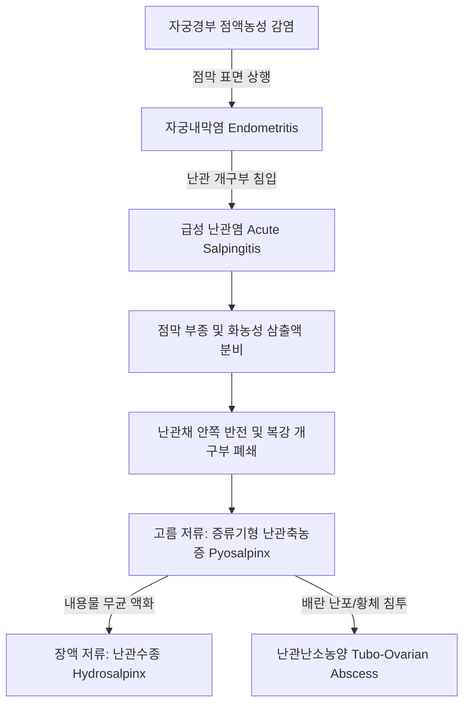

# 📑 [Netter Vol.1] Day 09: 난관 - 해부·수정생리·난관염·골반염증성질환·수종 및 난관암 (Section 9 완독)

> 📖 **원서 출처**: [The Netter Collection of Medical Illustrations - Volume 1, Reproductive System.pdf (pp. 188-200)](https://drive.google.com/file/d/1x-xTgPfUfiK7dsQyp5L5qfjFYSD_XyGm/view?usp=drivesdk)
> 🏷️ **범위**: Section 9 전편 (Plate 9-1 ~ Plate 9-13, 총 13개 플레이트 전수 포함)
> 📌 **핵심 테마**: 난관 4대 구역 해부학(간질부·협부·팽대부·채부) 및 수정 생리학, 난관동(Tubal antrum)과 난관 괄약근(Sphincter), 3층 평활근 및 발기양 난관채(Erectile-like fimbria), 섬모세포 vs 분비세포 vs 못세포(Peg cell) 미세조직학, 뮐러관 선천 기형(결손·폐쇄·DES 노출·발타르 세포 잔유물 Walthard cell rests), 점막상행성 골반염증성질환(PID - 임균/클라미디아/다균성 복합감염)과 자궁방결합직염(Parametritis 쐐기형 침윤), 난관축농증(Pyosalpinx, 콜레스테롤 결석 및 천공 위험) $\rightarrow$ 난관수종(단순형 vs 가성여포형) 및 시험관아기(IVF) 착상 억제 독성, 골반복막염의 방어벽(S상결장·대망 지붕)과 영구적 자궁후굴, 만성 난관염 폐쇄 7대 형태학, 난관난소농양(TOA)과 난관난소낭종(Tubo-ovarian cyst), 결핵성 난관염(염주알형 Rosary form, 담배쌈지채부, 폐경 후 10%), 결절성 협부 난관염(SIN, 자궁내막증과의 세포원성 기질 유무 감별, 자궁외임신 50% 동반), 원발성 난관암(STIC 기원론, 50% 질출혈, 10~40% Pap 이상, BRCA 17%), 광인대 배아 잔유 낭종(에포오포론·모르가니 수포) 및 골반 포충낭종(Echinococcus hydatid cyst) 감별

---

## 1. 개요 및 마스터 요약 (Executive Summary)

1. **난관의 정밀 해부학 및 수송·수정 생리학**:
   - 난관(Fallopian tube / Uterine tube, Oviduct)은 길이 약 $10\sim 12\text{ cm}$의 근섬유성 도관으로, **간질부(Interstitial / Intramural, 1 cm)** $\rightarrow$ **협부(Isthmus, 2~3 cm)** $\rightarrow$ **팽대부(Ampulla, 5~8 cm)** $\rightarrow$ **누두부 및 채부(Infundibulum & Fimbriae, 1~2 cm)**의 4개 구역으로 구분됨.
   - 자궁-난관 접합부에는 자궁 점막의 윤상 주름(Annular fold)에 의한 기능적 **난관 괄약근(Tubal sphincter)**과 직전의 미세한 **난관동(Tubal antrum)**이 존재하여 조영술(HSG) 상 협착 음영으로 관찰됨.
   - 근육층(Myosalpinx)은 기본적으로 내윤상근과 외종주근의 2층이나, **간질부(Interstitial part)에는 가장 안쪽에 '최내측 종주근(Innermost longitudinal layer)'이 추가되어 3층 구조**를 이룸.
   - 난관채(Fimbriae)와 누두부는 혈관망과 평활근 다발이 고밀도로 얽힌 **발기성 조직(Erectile-like tissue)**의 특성을 지녀, 배란기 혈류 충혈 시 팽창하여 난소 표면을 빗자루처럼 쓸어내리며 난소채(Fimbria ovarica)의 수축과 함께 난자를 능동적으로 포획(Oocyte pickup)함.
   - 점막 상피는 에스트로겐 극대기(배란기)에 높이가 최고조에 달하며, 수송 기전에서 **섬모세포의 섬모 운동은 미세 입자와 체액의 자궁 방향 흐름을 형성할 뿐이며, 실제 난자 및 수정란을 자궁 쪽으로 운반하는 주된 추진력은 난관 평활근의 '연동운동(Peristalsis)'**임. 못세포(Peg cell)는 기능이 소진되어 내강으로 탈락하는 노화 세포(Worn-out cells)를 반영함.
2. **골반 감염의 4대 경로와 병태생리적 확산**:
   - **점막 표면 상행성 전파(Mucosal ascending spread, 85% 이상)**: *N. gonorrhoeae*(주로 점막 국한, 전층 점막 괴사), *C. trachomatis*(경미하나 장기 지속적 잠복 손상), 복합 혐기성균.
   - **림프관 및 결합조직 전파(Lymphatic spread)**: 연쇄상구균, 포도상구균 감염 시 자궁벽 림프관을 타고 자궁방결합직(Parametrium)으로 침투하여 혈전정맥염과 림프관염을 유발하며 골반벽 쪽으로 기저부를 둔 **쐐기 모양(Wedge-shaped) 침윤물** 형성.
   - **혈행성 전파(Hematogenous)**: 결핵균(*M. tuberculosis*, *M. bovis*)의 양측 난관 전파.
   - **인접 장기 직접 파열(Direct extension)**: 충수염(우측/양측 난관) 및 S상결장 게실염(좌측 난관).
   - PID 병인균 분포: 1/3 임균 단독, 1/3 임균+복합균, 1/3 호기/혐기성 복합균(인플루엔자균, 폐렴구균, 화농연쇄상구균 등 호흡기 병원체 최대 5% 포함). 복강경 확진 환자의 40% 이상에서 환자당 평균 6.8종의 세균이 동정되는 다균성 감염.
3. **난관축농증(Pyosalpinx) $\rightarrow$ 난관수종(Hydrosalpinx) 이행 및 착상 실패**:
   - 급성기 채부 부종으로 복강구가 밀폐(Fimbrial phimosis)되고 내강에 화농성 삼출물이 고여 **증류기 모양(Retort-shaped)**으로 팽대된 난관축농증 형성. 오래된 축농증 내강에는 콜레스테롤 결정 및 결석이 집적됨.
   - 세균 사멸 및 자가융해 후 맑은 액체로 치환되어 얇고 반투명한 벽을 가진 **난관수종(Hydrosalpinx)**으로 변형: 점막 주름이 위축된 단일강의 **단순형(Simplex)**과 점막 능선들이 유착되어 미로를 형성한 **가성여포형(Pseudofollicular)**으로 구분.
   - 밸브성 주름에 의한 불완전 폐쇄 시 간헐적 질 분비물 배출과 복통 완화가 반복되는 **난관수종 유출증(Hydrops tubae profluens)** 발생.
   - 난관수종 삼출액의 기계적 세척, 배아 독성(TNF-$\alpha$, IL-1$\beta$, 내독소), 자궁내막 $\alpha_v\beta_3$ 인테그린 발현 억제로 **IVF 임신율을 50% 감소시키고 유산율을 2배 증가**시키므로 배아 이식 전 복강경 난관절제술 필수.
4. **골반 복막염의 보호 기전, 후유증 및 만성 폐쇄 7대 변이**:
   - 골반 복막염 시 S상결장, 결장간막 및 대망이 자궁저부와 광인대 상부에 유착되어 고름 주머니를 밀폐하는 **보호성 지붕(Protective roof)**을 형성하여 전신 파종을 방어함.
   - 치유 후 직장과 골반벽 사이 섬유성 밴드로 인해 자궁이 영구적으로 뒤로 꺾이는 **고정성 자궁후굴(Fixed uterine retroflexion)**이 고착되어 만성 요통, 변비, 배변통(Dyschezia), 성교통 유발.
   - 만성 난관염 후 팽대부/채부 폐쇄의 7대 형태학: ① 총모형(Tufting, 완전폐쇄 또는 침상 탐침 통과), ② 완전 곤봉형(Complete clubbing), ③ 배꼽형 곤봉형(Clubbing with navel), ④ 난관포경(Phimosis), ⑤ 난관감돈포경(Paraphimosis), ⑥ 단순 교착(Simple agglutination), ⑦ 양측 난관채 상호 유착(Adhesion of tubal ostia).
   - 여성 불임의 40%가 난관 손상에 기인.
5. **난관난소농양(TOA)과 난관난소낭종(Tubo-ovarian Cyst)**:
   - 농양이 배란 직후 개방된 난포나 황체(Corpus luteum)를 뚫고 침입하거나 난소 간질 내 혈행성 농양과 융합하여 형성.
   - 농양벽이 혈관이 결핍된 두꺼운 굳은살성 결합조직(Callous tissue)으로 굳어져 약물 침투와 자연 치유가 극히 어려움.
   - 치유 과정에서 팽대된 난관과 단방성 난소 낭종이 교통하여 맑은 액체를 담은 **난관난소낭종(Tubo-ovarian cyst)** 형성: 내벽에 난관-난소 이행부를 나타내는 뚜렷한 융기 윤상 구조(Sharp ring)와 편평해진 난관채 능선(Low ridges) 관찰.
6. **특수 감염, 결절성 병변 및 부인종양학의 대전환**:
   - **결핵성 난관염(Tuberculous Salpingitis)**: 양측 난관 침범(거의 100%), 자궁내막 동반(>50%). 20~30대 호발하나 **폐경 후 여성에서도 약 10%** 발생. 비미만성 분절 침범으로 인한 **염주알 모양(Rosary form)** 비후, 담배쌈지 채부(Tobacco-pouch fimbria), 좁쌀결절. 약 50%에서 골반 진찰이 정상일 수 있어 진단적 주의 요망.
   - **결절성 협부 난관염(Salpingitis Isthmica Nodosa, SIN)**: 협부 근육층 내 점막 상피의 게실성 함입과 평활근 비대. **난관 자궁외임신 환자의 50% 이상에서 동반**. 자궁내막증(Endometriosis)과 달리 **세포원성 기질(Cytogenic stroma)이 결손**되어 있고 반흔 조직과 단핵세포 침윤만 관찰됨.
   - **원발성 난관암 및 STIC**: 난소 고등급 장액성 암(HGSC)의 절대 다수가 난관 채부의 상피내암인 **STIC(Serous Tubal Intraepithelial Carcinoma)** 기원임이 입증됨 (*BRCA1/2* 변이 환자 17% 동반). 가장 흔한 초기 징후는 **비정상 질 출혈(50%)**이며, **자궁경부 세포진(Pap smear) 이상 소견이 10~40%**에서 발견됨.
   - **광인대 낭종 감별**: 볼프관 잔유 낭종(에포오포론·파로오포론, 배농 시 탄력섬유 수축으로 자글자글한 주름 Rugose lining 형성) vs 단포조충 감염에 의한 **골반 포충낭종(Echinococcus hydatid cyst)**: 층상 각피(Lamellar cuticle), 원두절(Scolices), 풍부한 **호산구(Eosinophils) 침윤** 동반.

---

## 2. 정상 해부학, 미세조직학 및 발생 기형 (Plates 9-1 ~ 9-3)

### Plate 9-1 | 난관의 정밀 해부학 (Fallopian Tubes)

![[Netter_V1_Plate9-1.png]]

#### 1) 난관의 4대 해부학적 분절 (Anatomical Segments)
자궁각(Uterine cornu)에서 시작하여 난소 상극까지 이어지는 길이 약 $10\sim 12\text{ cm}$의 도관 구조:
1. **간질부 / 벽내부 (Interstitial / Intramural part, 약 $1\text{ cm}$)**:
   - 자궁벽의 두꺼운 근층 내부를 비교적 직선으로 관통하는 분절.
   - 내강 직경이 약 $1\text{ mm}$ 미만으로 가장 좁음.
   - **난관동 (Tubal antrum) 및 난관 괄약근 (Tubal sphincter)**: 간질부는 자궁강과 합류하기 직전 작은 팽대부인 난관동(Tubal antrum)을 형성함. 자궁난관조영술(HSG) 상 자궁강 그림자와 난관동 사이에 실처럼 가느다란 연결부나 좁은 빈 공간(Narrow empty zone)이 관찰되는데, 이는 두 장기의 접합부에 위치한 자궁 점막의 윤상 주름(Annular fold)에 의해 형성되는 기능적 **난관 괄약근(Tubal sphincter)** 구조임.
   - 자궁각 임신(Cornual / Interstitial pregnancy) 발생 시 두꺼운 자궁 근층 덕분에 임신 12~16주까지 무증상으로 팽창하다가 자궁동맥 분지와 함께 대량 파열되어 급성 저혈량성 쇼크를 초래함.
2. **협부 (Isthmus, 약 $2\sim 3\text{ cm}$)**:
   - 자궁 외측 연에서 곧게 뻗어 나가는 약간 물결치는(Slightly wavy) 직선형 분절.
   - 평활근육층이 매우 두껍고 내강은 좁으며($1\sim 2\text{ mm}$), 점막 주름이 낮고 단순함. 배아의 자궁 진입을 일시 조절하는 괄약 밸브 기능 수행.
3. **팽대부 (Ampulla, 약 $5\sim 8\text{ cm}$)**:
   - 난관 전체 길이의 절반 이상을 차지하는 가장 길고 굴곡이 심한(Tortuous) 분절로 외측으로 갈수록 점진적으로 확장됨.
   - 벽이 얇고 점막 주름(Plicae)이 고도로 분지하여 복잡한 나뭇가지 모양의 미로(Complicated, labyrinth-like arborescent mucosa)를 형성.
   - **수정(Fertilization)이 일어나는 절대적 장소**이자, 전체 난관 자궁외임신의 **$70\sim 80\%$가 호발하는 부위**.
4. **누두부 및 난관채 (Infundibulum & Fimbriae, 약 $1\sim 2\text{ cm}$)**:
   - 복강을 향해 깔때기(Funnel) 모양으로 벌어진 말단부로, 주름진 페튜니아 꽃(Ruffled petunia)이나 말미잘(Sea anemone) 형태를 띰.
   - 가장자리에 다수의 손가락 모양 돌기인 **난관채(Fimbriae)** 발달.
   - **난소채 (Fimbria ovarica)**: 채부 중 가장 길고 굵은 고랑(Grooved)을 가진 돌기로 난관간막 외측 연을 따라 주행하여 난소의 상극(Tubal pole)에 직접 부착됨. 난소채의 종주근 섬유가 수축하면 누두부를 난소 표면에 밀착시킴.
   - **발기성 조직(Erectile-like tissue) 메커니즘**: 난관누두부와 난관채에는 혈관망이 비정상적으로 풍부하며 평활근 다발과 얽혀 일종의 발기성 조직을 형성함. 배란기 혈류 울혈(Engorgement)이 일어나면 난관채가 팽창하여 난소 표면을 빗자루처럼 쓸어내리며 배란된 난자를 능동적으로 난관강 내로 흡인·포획(Oocyte pickup)함.
   - **모르가니 수포 (Hydatids of Morgagni / Appendices vesiculosae)**: 난관채 끝에 얇은 줄기(Pedicle)로 매달린 투명한 장액성 소수포들로 태생기 중신소관(Mesonephric tubule)의 잔유물임.

#### 2) 조직학적 3층 구조 및 점막 상피세포의 생리 동태
- **점막층 (Endosalpinx)**: 얇은 기저막 위에 놓인 단층 원주상피(Simple columnar epithelium)로, 점막하의 성긴 혈관성 결합조직을 통해 근층과 연결되며, 난관 임신 착상 시 중등도의 탈락막 반응(Decidual reaction)을 나타냄.
  1. **섬모세포 (Ciliated cells)**: 배란기 에스트로겐 극대기에 상피 높이와 섬모 길이가 최고조에 달하며, 누두부와 채부에 가장 조밀하게 분포함. 섬모의 파동 운동은 자궁 방향으로 향하여 작은 입자와 난관액의 흐름을 형성함.
  2. **분비세포 (Secretory cells)**: 황체기 프로게스테론 자극으로 활성화되어 난관 내 체류 중인 난자와 수정란을 부양하기 위한 영양액(피루브산, 젖산, 포도당, 당단백질)을 분비함. 정자의 수정능 획득(Capacitation) 유도.
  3. **못세포 / 쐐기세포 (Peg-shaped cells / Intercalated cells)**: 섬모세포와 분비세포 사이에 끼어 있는 짙은 암흑색 핵을 가진 쐐기 모양 세포로, 기능을 다하고 노화되어 난관 내강으로 탈락 배출되는 세포(Worn-out cells)의 퇴행 단계를 나타냄.
  - **상피의 주기적 변동 및 수송 기전의 핵심**: 난관 상피 높이는 **배란기에 최고조**, **월경기에 최저**에 도달함. 섬모 운동은 자궁 쪽으로의 체액 흐름을 조성하지만, **난자 및 수정란을 자궁강 쪽으로 직접 추진시키는 결정적인 물리적 동력은 섬모 운동이 아니라 난관 평활근의 율동적 연동운동(Peristaltic action)**임.
- **근육층 (Myosalpinx)**: 기본적으로 내윤상근(Inner circular)과 외종주근(Outer longitudinal)의 평활근 2층으로 구성되며 팽대부보다 협부/간질부 등 내측 분절이 훨씬 두꺼움. 특히 **간질부(Interstitial portion)에는 가장 안쪽에 '최내측 종주근층(Innermost longitudinal layer)'이 추가로 존재**하여 3층 근층을 형성함.
- **장막층 (Serosa)**: 광인대 상부의 난관간막(Mesosalpinx) 복막 코트. 난관 동맥 혈류는 자궁동맥의 난관지(Tubal branch)와 난소동맥의 난관지 분지가 풍부하게 문합망을 이룸.

---

### Plate 9-2 | 난관의 선천성 기형 I: 결손 및 흔적 난관 (Congenital Anomalies I — Absence, Rudiments)

![[Netter_V1_Plate9-2.png]]

#### 1) 뮐러관 발생학과 배아 발생 시계
- **발생 기원**: 배아 크기 $8.5\sim 10\text{ mm}$ 시기에 먼저 형성되어 있던 볼프관(Wolffian duct) 외측 비뇨생식릉(Urogenital ridge)의 비후된 상피에 고랑(Groove)이 형성되면서 뮐러관(Paramesonephric duct)이 출현함. 고랑이 관 형태로 깊어져 미측으로 주행하여 요생식동(Urogenital sinus)의 융기부인 뮐러 결절(Müllerian tubercle)에 도달함.
- **볼프관 의존성 발달**: 뮐러관의 성장과 발생은 전적으로 동측 볼프관의 존재에 의존함. 정소의 세르톨리 세포에서 분비되는 뮐러관억제인자(MIF)가 없으면 중신관은 퇴화하고 부중신관이 여성 생식관으로 분화함. 복강 내로 직접 개방된 두측(Cranial) 비융합 부위가 난관을 형성함.
- **체간 성장과의 상대적 위치 이동**: 뮐러관과 볼프관은 태아 체간 전체의 성장 속도보다 느리게 자라기 때문에, 도관의 복강 개구부(Coelomic ostia) 위치가 상대적으로 미측으로 밀려 내려가 **제4요추(L4) 분절 수준까지 하강**함.
- **주행 방향의 횡축 전환**: 초기 비뇨생식주름은 척추와 평행한 시상(Sagittal) 방향이었으나, 두측에서 부신(Adrenal)과 신장(Kidney)이 급속 발달함에 따라 주름 상부가 외측으로 꺾이게 됨. 난소와 난관의 점진적 하강과 함께 난관은 가로 방향(Transverse)으로 주행하게 되며, 하부 뮐러관은 정중선에서 융합하여 자궁을 형성함.
- **조직 분화 시기**: 난관의 근육 및 결합조직은 **태생 3개월**에 최초로 출현하고 **5개월**에 명확히 입증됨. 그러나 **팽대부(Ampulla) 고유의 복잡한 점막 주름 형태는 임신 마지막 달(9~10개월)**에 이르러서야 완성됨.

#### 2) 선천성 결손 기형 및 부수 구조물
- **양측 난관 결손 (Complete Absence of Both Tubes)**: 자궁 형성부전(Aplasia of uterus)과 동반되는 경우가 많음. 이 경우 광인대에 해당하는 횡골반중격(Transverse pelvic septum)이 양측 난소를 연결하며 중격 상연 외측에 뮐러관 잔유물인 근육 결절(Muscular nodules)이 관찰될 수 있음. 질 형성부전이 흔히 동반되나, 기원이 다른 원인대(Round ligament)는 정상 발달할 수 있음.
- **팽대부 단독 결손의 기전**: 팽대부 결손은 순수한 발생학적 발달 정지보다는 **태생기 난관 염전(Torsion) 및 그에 따른 국소 괴사와 흡수(Resorption)**에 의해 발생하는 경우가 많음.
- **볼프관-뮐러관 동반 결손 증후군**: 볼프관의 선천성 결손이 선행하면 동측 뮐러관 발달이 차단되어 **난관, 자궁각, 신장(Kidney), 요관(Ureter)이 한꺼번에 결손**되는 편측 요로생식 복합 무발생이 초래됨.
- **발타르 세포 잔유물 (Walthard Cell Rests)**:
  - 난관 장막하(Subserosa) 결합조직에서 흔히 발견되는 미세 고형 또는 낭성 상피성 결절.
  - 고배율 현미경 상 세포핵 중앙에 뚜렷한 세로 홈 또는 주름(**Median groove or fold, 소위 '커피콩 모양 핵 Coffee-bean nucleus'**)이 관찰되는 것이 특징임. (양성 브레너 종양 Brenner tumor의 기원과 연관).
- **장막주위 낭종 (Perisalpingeal / Serosal Cysts)**: 정상 난관 표면에서 흔히 관찰되는 작은 다발성 장막 낭종으로, 장막 중피 상피의 함입 및 폐쇄로 형성되며 임상적 악성도는 없음.

---

### Plate 9-3 | 난관의 선천성 기형 II: 폐쇄 및 구조적 결손 (Congenital Anomalies II — Atresia, Defects)

![[Netter_V1_Plate9-3.png]]

#### 1) 폐쇄증, 중복 및 부속 난관 구조
- **뮐러관 결손 스펙트럼**: 한쪽 뮐러관의 완전/부분 결손은 양측 무발생보다 흔하며, 반대측 흔적 자궁각을 동반하거나 동반하지 않는 단각자궁(Uterus unicornis), 편측 폐쇄증(Atresia), 난관의 부분적·구간적 결손(Segmental defect) 등 다양한 변이로 나타남. (식도나 소장, 수정관의 선천성 폐쇄와 유사한 일시적 성장 억제 인자에 기인).
- **중복 난관 (Supernumerary Tube / Tuba supernumeraria or tertia)**:
  - 극히 희귀한 과잉 기형. 주 난관과 나란히 주행하며 동일한 벽 구조를 가짐. 부난소(Supernumerary ovary)와 동반되거나 단독으로 발생할 수 있음.
- **부속 난관 (Accessory Tube) vs 부속 난관구 (Accessory Ostium)**:
  - **부속 난관 (Accessory Tube)**: 매우 흔함. 주 난관이나 난관간막에서 가는 줄기(Pedicle, 고형 또는 관상)를 달고 돌출된 채부 화관(Wreath of fimbriae) 구조. **주 난관 내강과 교통하지 않음**. 양단이 닫힌 관 구조일 경우 난관액 분비가 누적되어 낭성 확장(Cystic dilation)을 일으켜 **난관수종이나 난소낭종으로 오인**될 수 있음.
  - **부속 난관구 (Accessory Ostium)**: 항상 주 난관 개구부 부근에 위치하며, **주 난관 내강과 항상 개통(Communicate)**되어 있음.
  - 드물게 난관 근위부는 결손되고 원위부가 3갈래로 분지된 기형 사례도 보고됨.

#### 2) 발달 부전, DES 노출 기형 및 탈장
- **유아형 난관 (Infantile Tube / Hypoplastic Tube)**:
  - 난관이 가늘고 허혈성이며 근육층이 약하고 팽대부가 빈약함.
  - 특히 '유아형 난관'은 난관의 굴곡이 매우 조밀하게 꼬여 있고, **각 굴곡 사이가 복막 주름(Peritoneal bridges)으로 가교 결합**되어 있어 물리적으로 곧게 펼 수 없음.
  - 이 복막 주름이 유착과 동일하게 난관 연동운동을 물리적으로 저해하여 **난자 체류 및 자궁외임신 호발**의 직접적 원인이 됨.
- **디에틸스틸베스트롤 (DES) 태내 노출 기형**:
  - 임신 중 DES에 노출된 여성의 난관은 **바늘구멍 같은 난관구(Pinpoint ostia)**, **수축된 난관채(Constricted fimbriae)**, 짧고 낭상(Sacculated)이거나 구불구불한 주행을 보임.
  - 난관인자 불임의 중요한 원인이나 자궁난관조영술(HSG)로는 미세 기형을 발견하기 어려움. 성인기 결절성 협부 난관염(SIN) 발생의 소인으로 지목됨.
- **불완전 하강 및 서혜부 탈장(Inguinal Hernia) 전위**:
  - 난관의 하강 정지로 가파른 경사를 보이거나, 반대로 과도한 하강으로 인해 **서혜부 탈장낭 내로 난관과 난소가 전위**될 수 있음 (간성 Intersexual 환자에서 빈발).
  - 뮐러관의 자궁 부위 불완전 융합 및 자궁각의 외측 굴곡이 난관 부속기의 서혜부 탈장 탈출을 촉진함.
- **치료 패러다임**: 과거 복원 수술 중심에서 난자 채취 및 시험관아기 배아 이식(IVF-ET) 기술의 발전으로 현대에는 보조생식술이 수술적 교정을 완전히 대체함.

---

## 3. 골반염증성질환, 난관축농증 및 수종 (Plates 9-4 ~ 9-6)

### Plate 9-4 | 세균 침입 경로, 자궁방결합직염 및 급성 난관염 I (Bacterial Routes, Parametritis, Acute Salpingitis I)

![[Netter_V1_Plate9-4.png]]

#### 1) 골반 감염의 4대 침입 경로와 상행 메커니즘
1. **점막 표면 상행성 전파 (Mucosal Ascending Spread, 85% 이상)**:
   - 질 $\rightarrow$ 자궁경관 원주상피 $\rightarrow$ 자궁내막 $\rightarrow$ **난관 점막(Endosalpinx) 표면을 따라 연속적 상행**.
   - *Neisseria gonorrhoeae*(임균)는 주로 점막에 정착하여 전층 점막 반응을 일으키나 깊은 조직 침투는 적음. 반면 *Chlamydia trachomatis*(클라미디아)는 훨씬 경미하지만 장기 지속적인(Indolent, long-lived) 염증 반응을 일으켜 궁극적으로 더 심각한 영구적 난관 파괴를 초래함.
   - **난관 개구부 폐쇄의 역설**: 난관 점막의 섬모류(Ciliary current)와 좁은 자궁-난관 접합부는 세균 상행에 대해 매우 취약한 방어벽임. 급성 염증으로 점막이 부어 자궁-난관 접합부가 막히면 삼출물이 자궁으로 배농되지 못하고, 감염된 물질이 난관채 말단과 복강 쪽으로 강하게 밀려 나가며 복막염을 악화시킴.
   - 자궁은 주기적인 월경 탈락과 넓은 배농로 덕분에 감염 후 빠르게 치유되는 것처럼 보이지만, 폐쇄된 난관 내에서는 염증이 지속됨. 또한 세균/화학 자극 시 자궁내구 경련과 격렬한 자궁 수축이 유해 물질을 난관 쪽으로 역류 추진시킴.
2. **림프관 및 결합조직 전파 (Lymphatic / Parametrial Spread)**:
   - 분만 손상, 산욕기 패혈증, 불완전 유산, 자궁내장치(IUD) 시술 등 손상된 자궁경부/체부 열상을 통해 연쇄상구균(*Streptococcus*), 포도상구균(*Staphylococcus*) 감염 시 발생.
   - 점막에 머무르지 않고 자궁벽과 난관벽의 심부 림프관과 정맥으로 급속 침투하여 골반 결합조직으로 확산.
3. **혈행성 전파 (Hematogenous Spread)**: 결핵균(*Mycobacterium tuberculosis*, *M. bovis*)이 폐 또는 종격동 림프절에서 혈관을 타고 양측 난관으로 산포.
4. **인접 장기 직접 파열 (Direct Extension)**: 급성 충수염 천공(우측 또는 양측 난관) 및 S상결장 게실염/결장염(좌측 난관).

#### 2) 자궁방결합직염 (Parametritis)의 해부병리학
- **병태생리**: 본질적으로 골반 결합조직의 **림프관염(Lymphangitis) 및 혈전정맥염(Thrombophlebitis)**. 자궁방결합직의 림프관과 정맥이 고름과 혈전(일부 고형, 일부 액화)으로 가득 차고 주위 결합조직이 장액화농성 삼출물로 팽창됨.
- **쐐기형 침윤물 (Wedge-shaped Infiltrate)**: 혈관과 림프관이 밀집된 골반 결합조직의 응축대 주행 방향을 따르므로, **기저부는 외측 골반벽을 향하고 둔한 꼭짓점은 자궁을 향하는 전형적인 쐐기 형태**를 나타냄.
- 해부학적 구획에 따라 **전방(Anterior), 후방(Posterior), 정중(Median) 자궁방결합직염**으로 분류되며 중증 감염 시 3개 구역 전체가 침범됨.
- 농양이 화농 괴사되어 거대 자궁방결합직 농양(Parametrial abscess)으로 진행하면 단단한 쐐기형 침윤물이 둥근 낭성 종괴 형태로 변형되어 주변 성긴 결합조직 면을 따라 급속히 파급됨.



---

### Plate 9-5 | 급성 난관염 II 및 난관축농증 (Acute Salpingitis II, Pyosalpinx)

![[Netter_V1_Plate9-5.png]]

#### 1) 급성 난관염의 진행 및 세포 침윤 동태
- **육안 소견**: 난관이 붉게 충혈되고 고도로 종창되며 굴곡이 심해짐. 점막 주름은 비후·충혈되고 내강은 농양으로 충만함. 장막 광택이 소실되고 섬유소화농성 삼출물로 덮임 (난관주위염 Perisalpingitis).
- **원인균에 따른 조직학적 차이**:
  - **비임균성(산욕기/외상성) 난관염**: 난관벽의 전층(점막, 근육층, 장막층)이 균등하게 염증에 침범되며 혈관과 림프관이 확장되고 다형핵백혈구와 혈전으로 채워짐.
  - **임균성 난관염**: 염증 침윤이 주로 점막(Endosalpinx)에 집중됨. 부종성 주름의 상피가 광범위하게 박탈·파괴되며 벗겨진 주름 가장자리끼리 유착됨.
- **세포 침윤의 시간적 전환**: 초기 급성기에는 **다형핵백혈구(PMN)**가 주류를 이루나, 아급성 및 만성기로 이행하면서 점차 감소하고 **형질세포(Plasma cells)**로 대체됨. 형질세포 침윤은 임균성 난관염에서 특히 현저하지만 임균 감염에만 국한된 병리적 지표는 아님.

#### 2) 난관축농증 (Pyosalpinx)의 구조적 특성과 천공 위험
- **레토르트 모양 변형 (Retort-shaped distension)**: 난관 복강 개구부가 난관채의 안쪽 반전(Inversion)과 교착(Conglutination)으로 조기에 밀폐되고, 자궁단도 폐쇄되면 내강 내 삼출물이 급속 팽창함. 근층이 두꺼운 협부는 저항하지만 벽이 얇은 팽대부가 풍선처럼 부풀어 올라 **화학 증류 플라스크(Retort) 또는 소시지 모양**으로 변형됨.
- **내용물 성상 및 콜레스테롤 집적**:
  - 장액성 삼출액 내에 현탁된 섬유소화농성 박편(Fibrinopurulent flakes), 진한 황록색 고름, 또는 점액농성 유동액.
  - 균 자체는 농양 내용물 속에서 사멸하는 경우가 많으나 난관벽 심부에서 장기간 생존하여 만성화를 유도함.
  - 오래된 난관축농증(Old pyosalpinges)에서는 **다량의 콜레스테롤 결정(Cholesterol crystals) 및 콜레스테롤 결석 집적(Cholesterol concrements)**이 특징적으로 관찰됨.
- **자발 천공(Perforation)의 3대 경로와 응급도**:
  1. **직장 천공 (Into rectum)**: 일시적인 배농으로 증상이 일시 호전될 수 있음.
  2. **방광 천공 (Into bladder)**: 심한 배뇨통(Dysuria), 농뇨 및 비뇨기 감염 유발.
  3. **복강 천공 (Into peritoneal cavity)**: 급성 범발성 복막염 및 패혈성 쇼크를 초래하는 절대적 수술 응급.
- **임신 동반 시의 치명적 위험**: 편측 난관축농증이 있는 상태에서 임신이 이루어질 경우, 자궁 증대와 호르몬 변화로 골반 내 보호성 유착이 이완·박리되면서 **축농증 파열 및 상복부로의 농양 누출**이 반복 보고되므로 극도의 주의가 요구됨.
- **골반 진찰 소견**: 더글라스와(Douglas cul-de-sac)에 단단히 고정된 압통성의 소시지형 또는 난원형 종괴로 만져지며, 커질 경우 **자궁을 전방 및 병변 반대측(덜 침범된 쪽)으로 편위**시킴.

---

### Plate 9-6 | 난관수종 (Hydrosalpinx)

![[Netter_V1_Plate9-6.png]]

#### 1) 만성기 이행과 2대 아형 (Simplex vs Pseudofollicular)
- **병태생리**: 난관축농증의 고름 성분이 농축된 후 육아조직으로 대체(드물게 석회화·골화)되거나, 대부분 고형 성분이 완전히 액화되어 맑은 장액성 또는 혈장액성(Serosanguineous) 액체로 치환되어 형성됨.
- **벽의 조직학적 변화**: 난관벽은 극도로 얇아지고 평활근 섬유가 소실되어 반투명한(Translucent) 낭종 벽으로 변하며, 직경 $3\text{ cm}$ 이상의 거대 소시지형 종괴를 형성함. 채부 돌기는 완전히 소실됨.
- **조직학적 2대 아형**:
  1. **단순 난관수종 (Hydrosalpinx simplex)**:
     - 단면상 점막 주름이 낮아지고 서로 평탄한 면으로 분리되어 있거나 주름이 완전히 소실되어 평평한 능선만 남음.
     - 수년에 걸쳐 임상 증상 없이 무증상으로 발전하며, 낭종액에서 세균 배양이 되지 않는 비활동성 종말 단계임.
  2. **가성여포성 난관수종 (Pseudofollicular hydrosalpinx)**:
     - 점막 주름들이 어느 정도 보존되어 있으나, 서로 마주 보는 능선과 분지들이 융합·유착되어 **미로 형태의 다발성 빈 공간(Labyrinth of hollow spaces)**을 형성함.
     - 주로 과거 임균 감염의 결과로 호발하나 타 원인의 만성 난관염에서도 관찰됨.

#### 2) 난관수종 유출증, 염전 및 시험관아기(IVF) 독성
- **난관수종 유출증 (Hydrops tubae profluens)**: 자궁 쪽 개구부가 밸브 모양의 점막 주름(Valvelike folds)에 의해서만 불완전하게 차단되어 있는 경우, 내강 내 액체 압력이 상승하면 밸브가 열리면서 **주기적으로 맑은 난관액이 질을 통해 쏟아져 나오고 산통(Colicky pain)이 완화**되는 특이 임상 현상.
- **단독 염전(Isolated Torsion)과 혈난관증(Hematosalpinx)**: 난관수종은 주위 조직과의 유착이 얇고 섬세한 거미줄(Filmy adhesions) 형태인 경우가 많아 난관 자체의 단독 염전이 드물지 않게 발생함. 염전으로 혈관이 파열되어 낭강 내로 출혈하면 **혈난관증(Hematosalpinx)**으로 급격히 전환됨.
- **IVF에 대한 치명적 배아 독성 및 수술 원칙**:
  - 수종액이 자궁강으로 역류하여 착상 배아를 물리적으로 씻어내고(Flushing), 함유된 염증성 사이토카인(TNF-$\alpha$, IL-1, IL-6), 프로스타글란딘, 엔도톡신이 배아 분열을 차단하며 자궁내막 접착인자($\alpha_v\beta_3$ integrin) 발현을 억제함 $\rightarrow$ **IVF 임신율 50% 반감, 유산율 2배 급증**.
  - **수술 지침**: 신난관개구술(Neosalpingostomy)은 수종 크기가 클수록 결과가 불량하여 성공률이 15% 미만이므로, IVF 시행 전 **복강경하 난관절제술(Laparoscopic salpingectomy)**을 필수적으로 선행해야 함.

---

## 4. 복막염, 유착, 폐쇄 및 농양 (Plates 9-7 ~ 9-10)

### Plate 9-7 | 골반 복막염 및 골반 농양 (Pelvic Peritonitis, Abscess)

![[Netter_V1_Plate9-7.png]]

#### 1) 골반 복막염의 역학, 미생물학 및 보호성 해부 차단
- **미생물학적 삼분할 분포**:
  - 전체 증례의 약 **1/3은 *Neisseria gonorrhoeae* 단독 감염**.
  - 약 **1/3은 *N. gonorrhoeae*와 타 세균의 복합 감염**.
  - 나머지 **1/3은 호기성 및 혐기성 혼합 감염**이며, 최대 5%의 환자에서 인플루엔자균(*Haemophilus influenzae*), 폐렴구균(*Streptococcus pneumoniae*), 화농연쇄상구균(*Streptococcus pyogenes*) 등 호흡기 병원체가 동정됨.
  - 복강경으로 확진된 급성 난관염 환자의 40% 이상에서 다균성(Polymicrobial) 감염이 확인되며 환자당 평균 6.8종의 균이 분리됨.
  - 자궁경부 임균 감염 여성 중 약 15%만이 급성 골반 감염으로 진전됨. 오르가슴 시 자궁 수축, 배란기/월경기 경관점액 점도 저하, 정자 표면에의 임균 부착, IUD 삽입 시의 직접 접종 등이 상행 수송을 유발함.
  - 클라미디아는 전체 환자의 약 20%, 입원 환자의 약 40%에서 동반되며 증상이 은밀하고 완만한 경과를 보임.
- **골반 복막염 농양의 '보호성 지붕(Protective Roof)'**:
  - 개방된 난관 채부를 통해 유출된 고름이 더글라스와에 축적되면, **S상결장(Sigmoid)과 결장간막(Mesosigmoid) 및 대망(Omentum)이 자궁저부와 광인대 상연에 단단히 유착되어 농양 주머니 위에 보호성 지붕을 형성**함으로써 전신 복막염으로의 확산을 막는 방어 기전이 작동함.
- **배농 기법**:
  - 질후원개절개술(Posterior colpotomy)을 통한 경질적 배농, 복벽 절개/복강경 배농, 또는 영상유도하 경피적 도관 배액술(Interventional radiology guided drainage).

#### 2) 고정성 자궁후굴과 장기적 이환율
- **영구적 고정성 자궁후굴 (Fixed Uterine Retroflexion)**: 골반 복막염이 치유되는 과정에서 자궁이 직장 및 후골반벽과 치밀한 섬유성 유착으로 결합되어 뒤쪽으로 영구 견인됨. 이로 인해 만성 요통(Backache), 완고한 변비(Constipation), 배변통(Dyschezia) 및 성교통(Dyspareunia)이 지속됨.
- **장기 후유증 통계**:
  - 급성 PID 환자 **4명 중 1명(25%)**에서 장기 의학적 후유증 발생.
  - **불임 위험**: 1회 이환 시 약 12%, 2회 23%, **3회 이환 시 40~54%로 급증**(에피소드마다 위험도 2배씩 증가).
  - **자궁외임신 위험 4배 증가**. 환자의 5~15%에서 손상된 조직 복구를 위한 외과적 수술 필요.
  - 간피막염(Fitz-Hugh-Curtis 증후군) 및 난관난소농양 파열 시 패혈성 쇼크 위험.

---

### Plate 9-8 | 만성 난관염 및 골반 유착 (Chronic Salpingitis, Adhesions)

![[Netter_V1_Plate9-8.png]]

#### 1) 협부 경련과 진단적 접근, 유착의 진화
- **협부 경련(Isthmic Spasm)의 감별**: 만성 난관염에서 자궁-난관 개구부가 기질적으로 폐쇄되어 조영술 상 불통으로 나타나는 현상은 협부의 기능적 근육 경련(Spasm)과 반드시 감별해야 함. 협부 경련은 난관통기검사(Rubin test) 시 적절한 압력을 가하거나, 전신마취 하 복강경 검사를 시행할 때 긴장이 완화되면서 개통성이 증명됨.
- **복막 유착의 혈관성 퇴행**: 초기의 골반 유착은 혈관이 풍부하여(Richly vascular) 박리 시 출혈이 심하나, 시간이 경과함에 따라 혈관이 퇴행하여 빈혈성의 부서지기 쉬운 거미줄 모양 밴드(Frail, spiderweb-like adhesions)로 전환됨.
- **통증 양상의 특징**: 지속통 또는 스트레스, 배변, 성교 시 유발되며 월경전기 충혈 시 악화됨. 그러나 **월경혈이 배출되면서 골반 울혈이 해소되어 통증이 일시적으로 완화되는 현상(Menstrual flow relieves pain)**을 보이는 환자가 많음. 배란통(Mittelschmerz) 빈발.

#### 2) 종괴 감별 진단의 임상 역학
- **부속기 종괴 (Adnexal tumor) vs 자궁방결합직 침윤 (Parametritic infiltrate)**:
  - **부속기 종괴**: 윤곽이 **볼록(Convex outlines)**하며 질 진찰 시 검사자의 손가락으로 골반벽과 종괴 사이의 분리 경계를 확인할 수 있음.
  - **자궁방결합직 침윤**: 표면 윤곽이 **오목(Concave surfaces)**하며 외측 골반벽 구조물에 단단히 유착되어 분리되지 않음.
  - **복합 병변**: 상부는 볼록(Convex above), 하부는 오목(Concave below)하며 넓은 기저부로 골반벽에 부착됨.
- **자궁외임신과의 감별**: 압통, ESR 상승, 백혈구 증가는 공통적임. 정상 체온을 유지하면서 종괴가 급격히 커지거나, 편측성 산통 또는 돌발적 저혈량 쇼크가 발생하면 자궁외임신으로 판단.
- **원발성 난관암과의 감별**: 골반염 병력이 없는 고령 환자에서 장액혈성 또는 호박색 분비물이 지속되면 악성 종양을 강력히 의심해야 함.
- **만성 충수염과의 감별**: 압통점의 해부학적 국소화, 복부 CT/MRI를 통한 충수돌기 묘출, 복강경 확인.

---

### Plate 9-9 | 만성 난관염에 의한 난관 폐쇄 및 불임 (Obstruction Following Chronic Salpingitis)

![[Netter_V1_Plate9-9.png]]

#### 1) 팽대부·채부 폐쇄의 7대 형태학적 변이 (Ampullary & Fimbrial Variations)
여성 불임의 40%가 난관 손상에 기인하며, 만성 염증 후 난관 복강 개구부의 폐쇄 양상은 다음과 같이 다양함:
1. **총모형 폐쇄 (Tufting)**: 짧은 채부 돌기들이 작은 솔 모양(Tuft)으로 뭉쳐 있는 형태로, 완전히 막힌 경우와 미세한 침상 탐침(Bristle)이 간신히 통과하는 경우로 나뉨.
2. **완전 곤봉형 (Complete clubbing)**: 채부의 흔적이 완전히 사라지고 난관 끝이 야구방망이처럼 둥글고 매끄럽게 폐쇄된 상태.
3. **배꼽형 곤봉형 (Clubbing with navel)**: 곤봉형 말단의 중앙에 과거 개구부 흔적을 가리키는 얕은 배꼽 모양의 함몰(Central shallow dimple)이 남아 있는 형태.
4. **난관포경 (Phimosis)**: 난관채가 안쪽으로 반전(Inversion)되어 좁아져 있으나 중앙 개구부가 여전히 식별되는 상태.
5. **난관감돈포경 (Paraphimosis)**: 난관채 자체는 열려 있으나 바로 안쪽(Medial) 분절이 링 모양으로 강하게 협착 수축된 상태.
6. **단순 교착 (Simple agglutination)**: 채부 돌기들이 섬유소성으로 서로 가볍게 들러붙은 상태.
7. **양측 난관채 상호 유착 (Adhesion of tubal ostia)**: 양측 난관의 채부 말단이 정중선으로 끌려와 서로 유착되고 자궁 후벽에 함께 결합된 상태.

#### 2) 조영제 선택, 합병증 및 수술적 한계
- **지용성 조영제(Lipiodol)의 조직 독성**: 폐쇄된 난관 내로 주입된 유성 조영제는 수년간 흡수되지 않고 정체되어 농축되며, **극심한 이물 육아종 반응(Foreign-body reaction)**을 일으켜 그때까지 개통되어 있던 잔여 난관강까지 섬유화 폐쇄를 초래함.
- **수용성 조영제의 장점과 감염 예방**: 수용성 조영제는 체내에 신속 흡수되며 난관 점막 주름(Mucosal folds)을 훨씬 선명하게 묘출함. **HSG 검사 상 난관수종이 관찰된 경우 시술 후 독시사이클린(Doxycycline)을 1주일간 예방 투여**하여 골반 감염 재활성화를 방지해야 함.
- **골반 유착박리술(Adhesiolysis)의 한계**: 수술 자체의 외상으로 인해 유착이 쉽게 재형성(Reformation)되거나 증상의 원인이 유착 자체가 아닌 경우가 많아 통증 개선 성공률이 실망스러운 경우가 흔함.

---

### Plate 9-10 | 난관난소농양 (Tubo-Ovarian Abscess, TOA)

![[Netter_V1_Plate9-10.png]]

#### 1) 난소 침범의 병태생리 2대 기전
난관의 화농성 염증이 난소로 번지는 경로는 단순 파급에 그치지 않고 난소의 생리적 주기와 밀접하게 연관됨:
1. **배란 창구를 통한 진성 세균 감염 (Surface / Follicular Infection)**:
   - 급성 화농성 난관염 삼출물이 난소 표면을 덮고 있을 때, **배란 후 파열된 난포(Ruptured follicle)나 황체(Corpus luteum)**의 개방된 상처 면을 통해 세균이 난소 실질 내부로 침투하여 난포 농양 및 황체 농양을 형성함.
   - 이 농양이 난관축농증과 융합되면서 하나의 거대한 복합 농양강을 형성함.
2. **난소 간질 내 혈행성 농양 (Stromal / Interstitial Abscess)**:
   - 혈행성으로 전파된 균이 난소 간질 내에 고립 농양을 형성하며, 난소 피막 내에 머물며 거대해지거나 난관, 복강, 직장, 방광으로 터져 나옴.
3. **염증성 순환 장애 및 퇴행**: 세균이 침투하지 않더라도 인접 난관의 고열과 염증으로 인해 난소 간질의 충혈, 출혈, 부종, 난포 장치의 광범위한 붕괴 및 표면 상피 탈락이 초래됨.

#### 2) 두꺼운 굳은살성 벽(Callous Wall)과 난관난소낭종 (Tubo-ovarian Cyst)
- **자연 치유 불능의 병리적 기전**: 난소 실질과 난포가 파괴된 후 형성된 농양 벽은 혈관 분포가 극히 빈약한 **두꺼운 굳은살성 결합조직(Thick callous connective tissue)**으로 둘러싸임. 백혈구, 림프구, 형질세포는 내측 육아벽에만 침윤해 있으므로 전신 항생제 침투가 불량하여 자연 치유가 거의 불가능함.
- **난관난소낭종 (Tubo-ovarian Cyst)**:
  - TOA가 치유되거나 난관수종(Hydrosalpinx)이 난소의 정체성 낭종(Retention cyst) 또는 장액유두상 낭종과 융합되어 형성된 증류기 모양(Retort-like) 종괴.
  - 맑은 장액(적혈구 및 백혈구 미량 함유)으로 채워진 단방성 낭종.
  - 육안적으로 난관과 난소의 이행부에 **뚜렷한 윤상 고리(Sharp ring)**가 형성되어 있으며, 편평해진 난관채가 낭종 벽 내부로 이어지며 낮은 능선(Low ridges)을 형성하거나 해부학적 경계가 완전히 소실됨. 대부분 양성이며 악성화는 극히 드묾.

---

## 5. 특수 질환, 결절성 병변 및 종양학 (Plates 9-11 ~ 9-13)

### Plate 9-11 | 결핵성 난관염 (Tuberculosis of the Fallopian Tubes)

![[Netter_V1_Plate9-11.png]]

#### 1) 결핵균의 역학, 침범 장기 및 호발 연령
- **역학**: 과거 난관 염증의 10%를 차지. 미국 등 선진국에서는 드물어졌으나 이민자(아시아, 중동, 중남미) 및 면역저하자에서 지속 발견됨.
- **호발 연령**: 주로 $20\sim 30\text{세}$ 젊은 여성에서 호발하지만, **폐경 후 여성에서도 약 10%의 빈도로 발생**하므로 노년기 골반 종괴 시에도 감별 대상임.
- **장기 침범율**: **양측 난관 침범이 거의 100%**에 달하며, **자궁내막 침범이 50% 이상**에서 동반됨. 난소나 질 등 타 장기 침범은 드묾.
- **감염 경로**: 폐나 폐문 림프절의 1차 병소에서 **혈행성 전파(Hematogenous spread)**로 난관에 가장 먼저 착상된 후, 자궁내막으로 하행 전파됨. 원인균은 *Mycobacterium tuberculosis* 및 *Mycobacterium bovis*.

#### 2) 형태학적 3대 병리 소견 및 임상 진단의 난점
- **육안 병리 소견**:
  1. **염주알 모양 난관 ("Rosary" form / Bead-like)**: 결핵 병변이 난관 전체에 미만성으로 퍼지지 않고 **개별적인 분절 결절(Separate foci)** 형태로 침범하기 때문에 난관벽이 울퉁불퉁한 염주알 모양을 띠며 심하게 굴곡됨.
  2. **담배쌈지 모양 채부 (Tobacco-pouch fimbria)**: 일반 세균성 난관염과 달리 채부가 안으로 말려 들어가지 않고 외측으로 활짝 열린 채 팽대부 벽만 단단하게 곤봉상으로 비후됨.
  3. **건락성 난관축농증 (Caseous pyosalpinx)**: 치즈양 괴사 물질로 가득 참. 호전 시 수축, 섬유화 및 석회화(Calcification) 진행.
- **임상 진단의 난점**:
  - 환자의 약 **35%에서 무월경(Amenorrhea)과 하복부 둔통**만 호소하며, 단순 난임만을 이유로 내원하는 경우가 많음.
  - 놀랍게도 **골반 내진 소견이 환자의 약 50%에서 완전히 정상**으로 나타남.
  - 의심 징후: 임질 병력 없는 서서히 진행하는 부속기 종괴, 더글라스와의 결절 촉진, 염주알 모양 난관 비후, 미열, 림프구 증가증.
  - 확진: 자궁내막 생검(치즈양 괴사 동반 육아종 및 랑한스 거대세포), 진단적 소파술, 항산균 배양 검사.

---

### Plate 9-12 | 결절성 협부 난관염 및 원발성 난관암 (Salpingitis Isthmica Nodosa, Carcinoma)

![[Netter_V1_Plate9-12.png]]

#### 1) 결절성 협부 난관염 (SIN)과 난관 자궁내막증의 감별
- **정의 및 임상 역학**: 난관 협부(Isthmus)에 단단한 결절성 비후를 일으키는 병변으로, **난관 자궁외임신 환자의 50% 이상에서 조직학적으로 동반**됨. 자궁선근증(Adenomyosis) 환자의 약 2/3에서 골반 내 동반 병변으로 SIN이 관찰됨.
- **병태생리**: 비염증성 난관내막증(Endosalpingosis) 또는 만성 염증 반응에 의해 점막 상피가 비후된 근육층 내로 나뭇가지 모양의 게실(Diverticula) 형태로 파고들고 주변 평활근이 반응성 비대를 일으킴.
- **난관 자궁내막증(Endometriosis)과의 결정적 조직학적 감별**:
  - **난관 자궁내막증**: 간질부와 협부에 호발하며 분지된 선구조 주위에 **반드시 '세포원성 기질(Cytogenic / Endometrial stroma)'이 존재**함.
  - **결절성 협부 난관염 (SIN)**: **세포원성 기질이 완전히 결손(Absence of cytogenic stroma)**되어 있으며 오직 반흔 섬유조직과 원형세포(Round cells) 침윤만 관찰됨.
- **진단**: HSG 상 협부 주위에 다발성 게실낭들이 주 난관강을 둘러싸는 **벌집 모양(Honeycomb appearance)**의 조영제 저류 음영 묘출.

#### 2) 난관 종양의 전 스펙트럼과 원발성 난관암
- **난관 종양의 분류**:
  - 양성 상피성: 유두종(Papilloma), 선종(Adenoma).
  - 중간엽성: 섬유종, 평활근종, 지방종, 연골종, 골종, 혈관종. 드물게 편평세포암(Squamous cell carcinoma) 및 융모상피종(Chorioepithelioma).
- **원발성 난관암의 임상 통계 및 증상**:
  - 과거 전통적 3징(Latzko's triad: 다량의 수양성 질 분비물, 골반통, 골반 종괴)은 15% 미만에서만 나타남.
  - **비정상 질 출혈(Vaginal bleeding)이 전체 환자의 약 50%에서 발현**하는 가장 흔한 증상임.
  - **자궁경부 세포진 검사(Pap smear) 이상 소견이 10%~40%**의 환자에서 관찰됨.
  - 전이 경로: 림프관(장골 및 요추 림프절 Iliac & lumbar nodes 조기 침범), 혈류, 복막 표면 파종, 인접 장기 연속 침윤.
- **현대 분자종양학의 패러다임: STIC과 BRCA 변이**:
  - 난소 고등급 장액성 암종(HGSC)의 기원이 난소 표면이 아니라 난관 채부 상피의 **STIC(Serous Tubal Intraepithelial Carcinoma)**에서 유래함이 규명됨.
  - **난관암 환자의 약 17%가 생식세포계열 BRCA1/BRCA2 돌연변이를 보유**함 (*TP53* 변이 동반). 예방적 난관난소절제술(RRSO) 시 SEE-FIM 프로토콜에 따른 채부의 미세 절편 병리 검사가 필수적임.

---

### Plate 9-13 | 난관주위 낭종 및 에포오포론 낭종 (Para-ovarian or Epoöphoron Cyst)

![[Netter_V1_Plate9-13.png]]

#### 1) 볼프관 잔유 낭종의 해부학과 주름진 내벽(Rugose Lining)
- **발생 기원**: 중신(Mesonephron)의 영구 잔유물인 난소상체(Epoöphoron) 또는 볼프관(Gartner duct)의 잔재에서 유래. 단순 정체성 낭종이거나 지속 성장하는 진성 모세포종(Blastoma)으로 거대 낭종으로 자라더라도 기본적으로 **단방성(Unilocular)**을 유지함.
- **해부학적 전위 양상**:
  - 광인대 잎(Broad ligament) 사이에 위치하여 난관간막 복막으로 덮여 있음.
  - 복강 상방으로 자라지 않고 **골반저(Pelvic floor) 방향으로 깊숙이 하향 증식하거나 S상결장간막(Mesosigmoid) 내부로 파고드는 이례적 증식**을 보일 수 있음.
  - 난관은 낭종의 앞면에서 뒷면으로 낭종 외벽을 둥글게 감싸며 길게 늘어나 편평해진 난소에 도달함.
- **가성 줄기 형성 및 염전**: 낭종 자체에는 고유 줄기가 없으나 복강 내로 돌출되면서 난관, 고유난소인대, 난소현수인대가 함께 늘어나 가성 줄기(Pedicle)를 형성하여 **줄기 염전(Torsion)**이 빈발함.
- **낭벽 조직학**: 외층(치밀 판판 결합조직) + 내층(성긴 망상 결합조직) + 탄력섬유 및 소량의 평활근 + 단층 상피(저원주상피 및 섬모상피). 낭종을 절개하여 내용물을 배농하면 **탄력섬유의 수축력에 의해 내벽이 자글자글한 주름(Rugose / corrugated appearance)**을 형성함. (드물게 유두상 증식 관찰, 악성화는 극히 희귀).

#### 2) 골반 포충낭종 (Pelvic Echinococcus / Hydatid Cysts)의 감별
광인대 및 심부 골반 결합조직 내 낭종 감별 시 반드시 고려해야 할 기생충 질환:
- **병원체 및 전파**: 개와 양의 장내에 기생하는 단포조충(*Taenia echinococcus* / *Echinococcus granulosus*)의 포충낭(Hydatid cyst). 목축업이 발달한 호주, 아이슬란드, 아르헨티나, 독일, 러시아 등지에서 호발.
- **침입 경로**: 사람이 충란을 섭취하면 육구유충(Oncosphere)이 소장벽을 뚫고 혈관이나 림프관을 타고 간, 폐를 거쳐 골반 결합조직에 착상함.
- **낭종 특성 및 미세구조**:
  - 체리 크기에서 신생아 머리 크기까지 다양하며 비중 $1.010\sim 1.015$의 맑은 액체로 충만함. 단일 원발낭의 외인성 증식으로 **골반 내에서 다발성(Multiple) 낭종** 형성.
  - **낭벽 구조**: 외측의 무세포성 **층상 각피(Outer lamellar cuticle)**와 내측의 **과립 실질층(Inner granular parenchymal layer)**으로 구성됨.
  - 실질층에서 딸낭(Daughter cysts) 및 싹 모양의 **원두절(Scolices)**이 증식하며, 각 두절은 갈고리 관(Crown of hooklets)과 2개의 측면 흡반(Suckers)을 구비함.
  - 낭종 주위 결합조직 피막에는 림프구, 백혈구와 함께 **다량의 호산구(Eosinophils)가 집중 침윤**됨.
- **외과적 치료 원칙**: 수술적 완전 절제만이 재발을 방지함. 낭종을 터뜨리거나 내용물을 복강에 누출시킬 경우 치명적인 **아나필락시스 쇼크(Anaphylactic shock)** 및 2차 파종을 유발하므로 내용물 누출을 철저히 방지해야 함.

---

## 6. 로컬 이미지 추출 자동화 스크립트 (Python snippet)

원서 PDF(`The Netter Collection of Medical Illustrations - Volume 1, Reproductive System.pdf`)에서 Section 9에 해당하는 13개 플레이트 고해상도 이미지를 로컬 컴퓨터에서 자동으로 추출하여 `첨부파일` 폴더에 일괄 저장할 수 있는 Python 스크립트입니다:

```python
import fitz  # PyMuPDF
import os

pdf_path = "The Netter Collection of Medical Illustrations - Volume 1, Reproductive System.pdf"
output_dir = "./헤르메스/책 읽기/Netter_Vol1_생식기계/첨부파일"
os.makedirs(output_dir, exist_ok=True)

doc = fitz.open(pdf_path)

# Section 9 전체 플레이트 목록 (Plate 9-1 ~ Plate 9-13, 총 13개)
plates_info = [
    ("Plate9-1", "Fallopian tubes"),
    ("Plate9-2", "Congenital anomalies I - Absence. rudiments"),
    ("Plate9-3", "Congenital anomalies II - Atresia, defects"),
    ("Plate9-4", "Bacterial routes, parametritis, acute salpingitis I"),
    ("Plate9-5", "Acute salpingitis II, pyosalpinx"),
    ("Plate9-6", "Hydrosalpinx"),
    ("Plate9-7", "Pelvic peritonitis, abscess"),
    ("Plate9-8", "Chronic salpingitis, adhesions"),
    ("Plate9-9", "Obstruction following chronic salpingitis"),
    ("Plate9-10", "Tubo-ovarian abscess"),
    ("Plate9-11", "Tuberculosis"),
    ("Plate9-12", "Salpingitis Isthmica Nodosa, carcinoma"),
    ("Plate9-13", "Para-ovarian or Epoöphoron cyst"),
]

for plate_id, plate_title in plates_info:
    target_page = None
    search_term = f"Plate 9-{plate_id.split('-')[1]}"

    for page_num in range(len(doc)):
        text = doc[page_num].get_text()
        if search_term in text or plate_title.lower() in text.lower():
            target_page = page_num
            break

    if target_page is not None:
        page = doc[target_page]
        pix = page.get_pixmap(matrix=fitz.Matrix(3.0, 3.0))  # 300 DPI 상당
        img_name = f"Netter_V1_{plate_id}.png"
        save_path = os.path.join(output_dir, img_name)
        pix.save(save_path)
        print(f"[추출 성공] {img_name} (PDF p.{target_page+1})")
    else:
        print(f"[검색 실패] {plate_id}: {plate_title}")

doc.close()
print("=== Section 9 13개 플레이트 이미지 추출 완료 ===")
```

<!-- 보관 태그(1회용·링크오류, 필요시 복원): 난관, 난관염, 골반염증성질환, 난관난소농양, 자궁외임신, 난관수종, 난관암 -->
