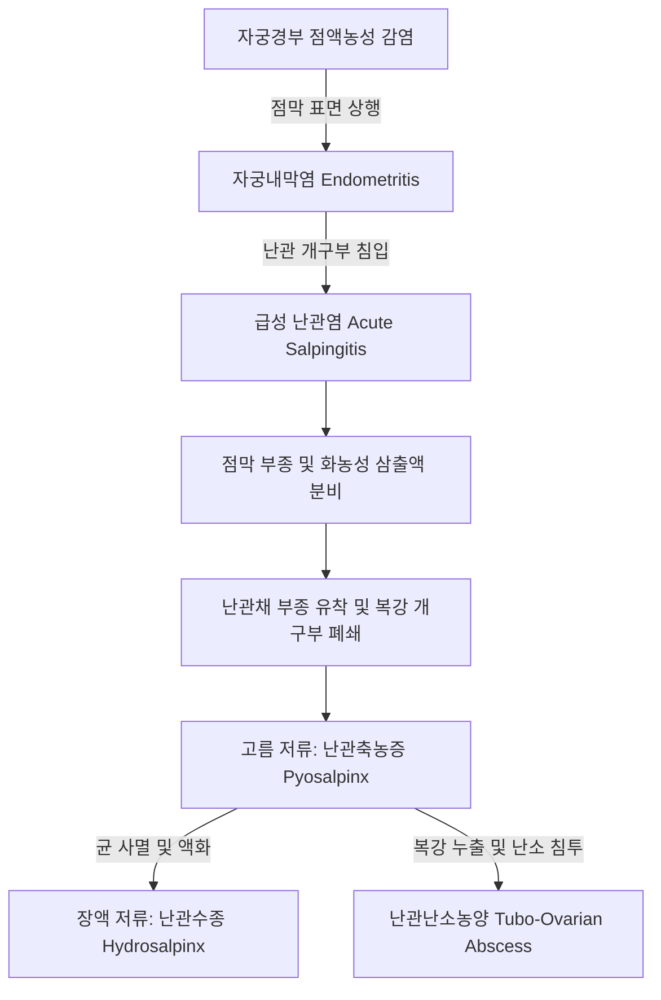

# 📑 [Netter Vol.1] Day 09: 난관 - 해부·수정생리·난관염·골반염증성질환·수종 및 난관암 (Section 9 완독)

> 📖 **원서 출처**: [The Netter Collection of Medical Illustrations - Volume 1, Reproductive System.pdf (pp. 188-200)](https://drive.google.com/file/d/1x-xTgPfUfiK7dsQyp5L5qfjFYSD_XyGm/view?usp=drivesdk)  
> 🏷️ **범위**: Section 9 전편 (Plate 9-1 ~ Plate 9-13, 총 13개 플레이트 전수 포함)  
> 📌 **핵심 테마**: 난관 4대 구역 해부학(간질부·협부·팽대부·채부) 및 수정 생리학, 섬모세포(Ciliated) vs 분비세포(Peg cell) 미세조직학, 뮐러관 선천 기형(결손·폐쇄), 점막상행성 골반염증성질환(PID - 임균/클라미디아)의 병태생리, 난관축농증(Pyosalpinx) $\rightarrow$ 난관수종(Hydrosalpinx) 이행 및 시험관아기(IVF) 착상 억제 기전, 난관난소농양(TOA) 응급 파열과 수술, 결핵성 난관염(Tobacco-pouch fimbria), 결절성 협부 난관염(SIN, 자궁외임신 호발), 그리고 현대 부인종양학의 패러다임 전환인 원발성 난관암(STIC)과 모르가니 수포(Hydatid of Morgagni)

---

## 1. 개요 및 마스터 요약 (Executive Summary)

1. **난관의 정밀 해부학 및 수정·수송 생리학**:
   - 난관(Fallopian tube / Uterine tube)은 길이 약 $10\sim 12\text{ cm}$의 근섬유성 도관으로, **간질부(Interstitial / Intramural, 1 cm)** $\rightarrow$ **협부(Isthmus, 2~3 cm)** $\rightarrow$ **팽대부(Ampulla, 5~8 cm)** $\rightarrow$ **누두부 및 채부(Infundibulum & Fimbriae, 1~2 cm)**의 4개 구역으로 구분됨.
   - **수정(Fertilization)**은 가장 넓고 주름이 풍부한 **팽대부(Ampulla)**에서 일어나며, 수정란은 약 3~4일 동안 난관 내에서 분열(상실배 Morula 형성)하면서 자궁 방향으로 수송됨.
   - 난관 점막(Endosalpinx)은 에스트로겐에 반응하여 난소 방향에서 자궁 방향으로 파동 치는 **섬모세포(Ciliated cell)**와 수정란에 영양분을 공급하고 정자 수용능(Capacitation)을 돕는 **분비세포(Secretory / Peg cell)**로 구성됨.
2. **골반염증성질환(PID)의 상행성 전파 및 파괴 기전**:
   - *Neisseria gonorrhoeae*(임균) 및 *Chlamydia trachomatis*(클라미디아)가 자궁경관에서 점막 표면을 따라 자궁내막을 거쳐 난관 점막으로 상행 전파(Mucosal ascending spread).
   - 급성 난관염 발생 시 점막 주름의 종창 및 화농성 삼출물 분비 $\rightarrow$ 복강 쪽 채부(Fimbria)가 부종으로 유착·폐쇄되면서 고름이 갇혀 **난관축농증(Pyosalpinx)** 형성.
   - 염증이 가라앉으면 고름이 흡수되고 맑은 장액성 액체로 치환되어 소시지 모양으로 팽대된 **난관수종(Hydrosalpinx)**으로 이행. 난관수종의 삼출액은 자궁강 내로 역류하여 **시험관아기(IVF) 임신율을 50% 반감시키고 유산율을 2배 증가**시키므로 배아 이식 전 난관절제술(Salpingectomy)이 필수적임.
3. **난관난소농양(TOA)과 중증 합병증**:
   - 염증이 난소 피막(배란 후 개방된 난포)을 뚫고 들어가 난관과 난소가 하나의 거대한 다방성 농양 종괴로 융합되는 **난관난소농양(Tubo-Ovarian Abscess, TOA)** 형성.
   - 파열 시 범발성 복막염 및 패혈성 쇼크를 유발하여 사망률이 $5\sim 10\%$에 달하는 외과적 초응급 질환.
4. **특수 난관 질환 (결핵 및 결절성 협부 난관염)**:
   - **결핵성 난관염 (Tuberculous Salpingitis)**: 주로 폐결핵에서 **혈행성 전파(Hematogenous)**로 발생하며 양측성 침범. 채부는 열린 채 팽대부만 곤봉상으로 부풀어 오른 **'담배쌈지 모양 채부(Tobacco-pouch fimbria)'** 및 장막 표면의 좁쌀결절(Miliary tubercles) 형성.
   - **결절성 협부 난관염 (Salpingitis Isthmica Nodosa, SIN)**: 협부 점막이 비후된 근육층 내로 게실 모양으로 함입 침투. 난관강 협착 및 배아 정체로 **난관 자궁외임신(Tubal ectopic pregnancy)**의 핵심 위험 인자.
5. **부인종양학의 혁신: 고등급 장액성 난관상피내암 (STIC)**:
   - 과거 '원발성 난소암(High-Grade Serous Carcinoma, HGSC)'으로 분류되던 종양의 $80\%$ 이상이 실제로는 **난관 채부(Fimbria)의 상피내암인 STIC(Serous Tubal Intraepithelial Carcinoma)**에서 기원하여 난소로 파종된다는 현대 분자종양학적 기전 확립 (*BRCA1/2* 돌연변이 연관).
   - 고위험군 여성에서 조기 난관절제술(RRSO)의 종양 예방 근거 제시.

---

## 2. 정상 해부학, 미세조직학 및 발생 기형 (Plates 9-1 ~ 9-3)

### Plate 9-1 | 난관의 정밀 해부학 (Fallopian Tubes)

![[Netter_V1_Plate9-1.png]]

#### 1) 난관의 4대 해부학적 분절 (Anatomical Segments)
자궁각(Uterine cornu)에서 시작하여 난소 상극까지 이어지는 길이 약 $10\sim 12\text{ cm}$의 도관 구조:
1. **간질부 / 벽내부 (Interstitial / Intramural part, 약 $1\text{ cm}$)**:
   - 자궁벽의 두꺼운 근층 내부를 관통하여 주행하는 분절.
   - 내강 직경이 약 $1\text{ mm}$ 미만으로 가장 좁음.
   - 자궁각 임신(Cornual / Interstitial pregnancy) 발생 시 임신 12~16주까지 무증상으로 자라다가 자궁동맥 분지와 함께 파열되어 순식간에 저혈량성 쇼크를 유발하는 위험 지대.
2. **협부 (Isthmus, 약 $2\sim 3\text{ cm}$)**:
   - 자궁 외측 연에서 곧게 뻗어 나가는 직선형 분절.
   - 근육층이 가장 두껍고 내강은 좁으며($1\sim 2\text{ mm}$), 점막 주름이 단순함. 배아의 자궁 진입을 일시 정체시키는 괄약 밸브 기능 수행.
3. **팽대부 (Ampulla, 약 $5\sim 8\text{ cm}$)**:
   - 난관 전체 길이의 절반 이상을 차지하는 가장 길고 넓은 만곡 분절.
   - 벽이 얇고 점막 주름(Plicae)이 고도로 발달하여 복잡한 나뭇가지 모양의 미로를 형성.
   - **수정(Fertilization)이 일어나는 절대적 장소**이자, 전체 난관 자궁외임신의 **$70\sim 80\%$가 호발하는 부위**.
4. **누두부 및 난관채 (Infundibulum & Fimbriae, 약 $1\sim 2\text{ cm}$)**:
   - 복강을 향해 깔때기(Funnel) 모양으로 활짝 벌어진 말단부.
   - 가장자리에 다수의 손가락 모양 돌기인 **난관채(Fimbriae)** 발달.
   - **난소채 (Fimbria ovarica)**: 채부 중 가장 길고 굵은 돌기로 난소의 상극(Tubal pole)에 직접 부착되어 있어, 배란 시 난소를 감싸 쥐며 난자를 난관강 내로 포획(Oocyte pickup)하는 핵심 도관 역할.

#### 2) 조직학적 3층 구조 및 2대 점막 상피세포
- **점막층 (Endosalpinx)**: 단층 원주상피(Simple columnar epithelium):
  1. **섬모세포 (Ciliated cells)**: 배란기 에스트로겐 극대기에 섬모 높이가 최고조에 달하며, 난자 및 수정란을 자궁 쪽으로 운반하는 율동적 채찍질 파동 형성 (누두부와 채부에 가장 조밀).
  2. **분비세포 / 못세포 (Secretory / Peg cells)**: 황체기 프로게스테론 자극으로 활성화되어 영양액(피루브산, 젖산, 포도당, 당단백질)을 내강으로 분비. 정자의 수정능 획득(Capacitation) 유도 및 착상 전 배아의 생존 보장.
- **근육층 (Myosalpinx)**: 내윤상근(Inner circular)과 외종주근(Outer longitudinal)의 평활근 2층. 연동운동(Peristalsis)으로 배아 수송.
- **장막층 (Serosa)**: 광인대 상부의 난관간막(Mesosalpinx) 복막.

---

### Plate 9-2 | 난관의 선천성 기형 I: 결손 및 흔적 난관 (Congenital Anomalies I — Absence, Rudiments)

![[Netter_V1_Plate9-2.png]]

#### 1) 뮐러관 형성 부전과 편측 무발생
- **발생 기원**: 임신 6주경 체강상피의 함입으로 형성된 뮐러관(Paramesonephric duct)의 두측(Cranial) 비융합 부위가 난관으로 분화.
- **편측 난관 무발생 (Unilateral Tubal Agenesis)**:
  - 뮐러관 한쪽의 원발성 발달 정지로 인해 발생.
  - 거의 항상 **단각자궁(Unicornuate uterus)** 및 반대측 **신장 무발생(Renal agenesis)**과 동반됨.
- **부분적 분절 결손 (Segmental Agenesis)**: 난관 중간 분절이 섬유성 끈으로 대체되거나 결손되어 협부와 채부가 단절됨.
- **흔적 난관 (Rudimentary Tube)**: 정상적인 내강 개통 없이 실 모양의 무기능성 연수 조직으로 잔존.

---

### Plate 9-3 | 난관의 선천성 기형 II: 폐쇄 및 구조적 결손 (Congenital Anomalies II — Atresia, Defects)

![[Netter_V1_Plate9-3.png]]

#### 1) 난관 폐쇄증(Tubal Atresia) 및 부속 난관 구조
- **선천성 난관 폐쇄증 (Congenital Tubal Atresia)**: 태생기 혈관 사고(Vascular accident) 또는 뮐러관 강소화(Canalization) 실패로 난관 내강이 막힘. 원발성 난임의 선천성 원인.
- **부속 난관구 및 부속 난관채 (Accessory Ostium & Fimbriae)**: 난관 주 줄기 외에 팽대부 벽에 작은 구멍이나 덧채가 형성되어 복강으로 개방됨. 배란된 난자가 비정상 부속구로 흡인될 경우 수송 장애 유발.
- **유아형 난관 (Infantile / Hypoplastic Tube)**: 비정상적으로 가늘고 길며 구불구불하게 꼬인(Tortuous) 형태로, 섬모 발달이 불량하여 연동운동이 미숙 $\rightarrow$ 불임 및 자궁외임신 호발.

---

## 3. 골반염증성질환, 난관축농증 및 수종 (Plates 9-4 ~ 9-6)

### Plate 9-4 | 세균 침입 경로, 자궁방결합직염 및 급성 난관염 I (Bacterial Routes, Parametritis, Acute Salpingitis I)

![[Netter_V1_Plate9-4.png]]

#### 1) 골반 감염의 4대 전파 경로 (Portals of Entry)
1. **점막 표면 상행성 전파 (Mucosal Ascending Spread, 85% 이상)**:
   - **원인균**: *Neisseria gonorrhoeae*(임균), *Chlamydia trachomatis*(클라미디아), *Mycoplasma genitalium*.
   - 질 $\rightarrow$ 자궁경관 원주상피 $\rightarrow$ 자궁내막 $\rightarrow$ **난관 점막(Endosalpinx)을 따라 연속적으로 상행**.
   - 가장 전형적인 골반염증성질환(PID)의 경로로 난관 점막의 직접 파괴를 초래.
2. **림프관 및 결합조직 전파 (Lymphatic / Parametrial Spread)**:
   - 분만 손상, 불완전 유산, 자궁내장치(IUD) 삽입 후 연쇄상구균, 포도상구균, 혐기성 대장균 감염 시 발생.
   - 경부 열상 부위에서 자궁 측벽 림프관을 타고 **자궁방결합직(Parametrium)**과 광인대 봉와직으로 확산 $\rightarrow$ 난관 외벽 장막층(Perisalpingitis)을 침범.
3. **혈행성 전파 (Hematogenous Spread)**:
   - **결핵균(*Mycobacterium tuberculosis*)**이 폐나 장 병소에서 혈류를 타고 양측 난관으로 전파.
4. **인접 장기 직접 파열 (Direct Extension)**:
   - 급성 충수염(Appendicitis) 파열, 게실염(Diverticulitis) 천공으로 복강 삼출물이 우측/좌측 난관 채부로 직접 유입.



---

### Plate 9-5 | 급성 난관염 II 및 난관축농증 (Acute Salpingitis II, Pyosalpinx)

![[Netter_V1_Plate9-5.png]]

#### 1) 난관축농증(Pyosalpinx)의 형성 병태생리
- **복강 개구부 폐쇄 기전**: 급성 난관염으로 점막이 고도로 부어오르면, 복강 쪽 난관채(Fimbriae)가 안쪽으로 말려 들어가며(Inversion) 서로 유착되어 난관 복강구가 밀폐됨 (Fimbrial phimosis).
- **레토르트 모양 팽대 (Retort-shaped distension)**:
  - 팽대부와 협부 사이의 내강에 다량의 화농성 삼출물이 갇힘.
  - 협부 쪽은 근육층이 두꺼워 덜 늘어나고, 벽이 얇은 팽대부가 풍선처럼 부풀어 올라 **화학 실험용 증류 플라스크(Retort / 증류기) 모양**의 거대 종괴 형성.
- **임상 징후 및 진단 기준 (CDC PID 가이드라인)**:
  - **3대 필수 기준 (최소 기준)**: 하복부 압통, 양측 부속기 압통, **자궁경부 거상 압통(Cervical Motion Tenderness, "Chandelier sign")**.
  - 추가 기준: 체온 $> 38.3^\circ\text{C}$, 자궁경부 황색 농성 분비물, 백혈구 증가증, CRP/ESR 상승.
- **표준 입원 항생제 요법**:
  - **Ceftriaxone $1\text{ g}$ IV q24h** + **Doxycycline $100\text{ mg}$ PO/IV q12h** + **Metronidazole $500\text{ mg}$ PO/IV q12h** (혐기성균 커버).

---

### Plate 9-6 | 난관수종 (Hydrosalpinx)

![[Netter_V1_Plate9-6.png]]

#### 1) 만성기 이행 및 배아 착상 억제 독성 기전
- **병태생리**:
  - 난관축농증을 앓은 후 시간이 지나면서 세균이 사멸하고 농양 세포가 자가 분해·흡수됨.
  - 내강에 맑고 투명하거나 담황색의 장액성 액체가 가득 차며, 얇고 반투명한 벽을 가진 거대 낭종성 소시지 모양 종괴(**Sausage-shaped mass**)로 영구 변형.
  - 점막 주름은 편평하게 위축되고 섬모세포는 영구 소실됨.
- **난관수종이 시험관아기(IVF)에 미치는 치명적 영향**:
  - 팽창된 난관 내의 수종 액은 닫힌 채부 대신 자궁강 쪽으로 지속적으로 역류(Flushing back)함.
  - **착상 실패 기전**:
    1. **기계적 세척 효과**: 자궁내막 표면에 안착하려는 배아를 씻어냄.
    2. **배아 독성 (Embryotoxicity)**: 수종 액에 고농도로 함유된 염증성 사이토카인(TNF-$\alpha$, IL-1$\beta$, IL-6), 프로스타글란딘, 세균 내독소가 배아 발달을 정지시킴.
    3. **자궁내막 수용성 저하**: $\alpha_v\beta_3$ 인테그린 등 착상 필수 접착 분자 발현 억제.
  - 결과: **IVF 임신율 $50\%$ 감소, 자연유산율 2배 증가**.
- **치료 지침**: IVF 배아 이식 전 **복강경하 난관절제술(Laparoscopic salpingectomy)** 또는 난관근위부 차단술(Proximal tubal occlusion)을 반드시 선행해야 함.

---

## 4. 복막염, 유착, 폐쇄 및 농양 (Plates 9-7 ~ 9-10)

### Plate 9-7 | 골반 복막염 및 골반 농양 (Pelvic Peritonitis, Abscess)

![[Netter_V1_Plate9-7.png]]

#### 1) 더글라스와 농양(Cul-de-sac Abscess)의 배농
- 난관 채부 개구부를 통해 복강 내로 유출된 고름이 골반 최하단 함몰부인 **자궁직장와(더글라스와)**에 고여 격벽성 농양 형성.
- **진찰 소견**: 직장수지검사 및 질 진찰 시 질 후원개(Posterior fornix)가 아래로 불룩하게 솟아오르고 극심한 파동감(Fluctuation)과 압통 촉진.
- **외과적 처치: 질후원개절개 배농술 (Posterior Colpotomy)**:
  - 질 후원개 점막을 횡절개하고 겸자로 직장자궁와 농양 강으로 진입하여 고름을 중력 방향으로 즉각 배농. 배액관(Penrose drain) 거치.

---

### Plate 9-8 | 만성 난관염 및 골반 유착 (Chronic Salpingitis, Adhesions)

![[Netter_V1_Plate9-8.png]]

#### 1) '동결 골반(Frozen Pelvis)'과 피츠-휴-커티스 증후군
- **골반 섬유화 및 동결 골반**: 반복적인 골반 감염 후 난관, 난소, 자궁 후벽, 직장, S상결장, 대망이 치밀한 섬유성 유착 밴드로 뒤엉켜 장기 경계가 완전히 사라지는 상태. 만성 골반통, 심부 성교통 유발.
- **피츠-휴-커티스 증후군 (Fitz-Hugh-Curtis Syndrome / 간주위염 Perihepatitis)**:
  - 클라미디아 또는 임균 감염 환자의 약 10%에서 골반 염증 삼출물이 우측 복벽구(Paracolic gutter)를 타고 상행하여 **간 피막(Glisson capsule)과 전복벽 사이에 염증**을 유발.
  - 복강경 소견: 간 표면과 복벽 사이에 전형적인 **바이올린 줄 모양 유착 (Violin-string adhesions)** 관찰.
  - 우상복부 늑골하 통증이 심하여 급성 담낭염이나 흉막염으로 오진되기 쉬움.

---

### Plate 9-9 | 만성 난관염에 의한 난관 폐쇄 및 불임 (Obstruction Following Chronic Salpingitis)

![[Netter_V1_Plate9-9.png]]

#### 1) 여포성 난관염(Follicular Salpingitis)과 자궁외임신
- **여포성 난관염**: 난관 점막 주름(Plicae)끼리 서로 유착되어 점막 내강이 수많은 맹낭(Blind crypts/pockets) 형태의 구멍들로 분할되는 병리적 변화.
- **불임 및 자궁외임신(Ectopic Pregnancy)의 역학**:
  - 작은 정자($4\,\mu\text{m}$)는 협착된 틈새를 통과해 난관 팽대부까지 도달하여 수정에 성공할 수 있음.
  - 그러나 수정란은 분열하며 크기가 $100\sim 150\,\mu\text{m}$로 비대해지고, 손상된 섬모와 막힌 맹낭 틈새에 걸려 **자궁으로 내려가지 못하고 난관 벽에 착상** $\rightarrow$ **난관 자궁외임신 (Tubal Ectopic Pregnancy, 95%)**.
  - PID 1회 이환 시 자궁외임신 위험 7배, 불임률 12%; 2회 시 23%; 3회 이상 이환 시 불임률 54%로 급증.

---

### Plate 9-10 | 난관난소농양 (Tubo-Ovarian Abscess, TOA)

![[Netter_V1_Plate9-10.png]]

#### 1) 난관난소농양(TOA)의 응급 임상 및 치료 알고리즘
- **병태생리**: 급성 난관염의 가장 극단적인 합병증. 난관과 난소가 화농성 염증으로 완전히 융합되어 난관-난소의 고유 해부학적 경계가 해체된 하나의 거대한 농양 덩어리 형성.
- **파열(Rupture)의 위험성**:
  - TOA가 자발적으로 파열되면 대량의 혐기성 고름이 복강 전체로 쏟아져 나와 **범발성 복막염, 패혈성 쇼크, 급성 신부전, DIC**를 유발하는 치명적 외과 응급.
- **단계별 치료 원칙**:
  1. **비파열성 TOA (Intact TOA)**:
     - 입원 후 즉각 광범위 정맥 항생제 요법 시작 (성공률 70~80%).
     - $48\sim 72$시간 내에 발열, 백혈구 수치 호전이 없거나 종괴가 커지면 $\rightarrow$ 초음파/CT 유도하 **경피적/경질적 농양 배액술(Percutaneous / Transvaginal drainage)** 시행.
  2. **파열성 TOA (Ruptured TOA)**:
     - **즉각적인 응급 개복술/복강경 수술 (Surgical Emergency)**.
     - 대량 생리식염수 세척 및 감염된 부속기 절제술(Salpingo-oophorectomy).

---

## 5. 특수 질환, 결절성 병변 및 종양학 (Plates 9-11 ~ 9-13)

### Plate 9-11 | 결핵성 난관염 (Tuberculosis of the Fallopian Tubes)

![[Netter_V1_Plate9-11.png]]

#### 1) 결핵균의 침범 양상과 특징적 병리 소견
- **역학**: 여성 생식기 결핵의 **$90\sim 100\%$가 난관을 침범**. 주로 폐 또는 장결핵에서 **혈행성 전파**로 발생하므로 **거의 $100\%$ 양측성**.
- **특징적 4대 육안 소견**:
  1. **담배쌈지 모양 채부 (Tobacco-pouch fimbria)**: 일반 세균성 난관염과 달리 채부가 안으로 말려 닫히지 않고 활짝 열려 있으면서, 팽대부만 딱딱하게 부풀어 오른 형태.
  2. **납파이프양 난관 (Lead-pipe salpinx)**: 만성 결핵성 육아종 및 섬유화로 난관 벽이 뻣뻣하고 단단한 파이프관처럼 굳어짐.
  3. **좁쌀 결절 (Miliary tubercles)**: 난관 장막 및 골반 복막 표면에 수많은 $1\sim 2\text{ mm}$ 크기의 회백색 좁쌀 결절이 산재 (복막 파종 암종 Peritoneal carcinomatosis과 감별 필수).
  4. 복강경 소견상 석회화 및 치즈양 괴사.
- **현미경 소견**: 건락성 괴사(Caseous necrosis)를 동반한 유상피세포 육아종(Epithelioid granuloma)과 랑한스 거대세포(Langhans giant cells).
- **임상 양상**: 젊은 여성의 난치성 불임, 골반통, 비정상 자궁출혈. (표준 4제 항결핵제 6~9개월 복용).

---

### Plate 9-12 | 결절성 협부 난관염 및 원발성 난관암 (Salpingitis Isthmica Nodosa, Carcinoma)

![[Netter_V1_Plate9-12.png]]

#### 1) 결절성 협부 난관염 (Salpingitis Isthmica Nodosa, SIN)
- **정의**: 난관 협부(Isthmus)에 단단한 결절들이 만져지는 비염증성 증식성 병변.
- **병태생리**: 난관 점막 상피(Endosalpinx)가 비정상적으로 비후된 점막하 근육층 깊숙이 게실처럼 파고들어 선강(Diverticula)을 형성하고, 주변 평활근이 반응성으로 비대해짐 (자궁의 선근증 Adenomyosis과 동일한 기전).
- **임상적 중요성**: **난관 자궁외임신 환자의 약 $50\%$에서 SIN이 동반**될 정도로 치명적인 위험 인자. 자궁난관조영술(HSG) 상 협부 주위에 게실양 게실낭들이 벌집 모양(Honeycomb appearance)으로 조영제 음영을 나타냄.

#### 2) 원발성 난관암 및 STIC의 현대 패러다임
- **전통적 임상 3징 (Latzko's Triad, 실제 15% 미만 발현)**:
  1. 간헐적으로 쏟아지는 다량의 맑거나 호박색의 장액성 질 분비물 (**Hydrops tubae profluens**).
  2. 분비물 배출 후 완화되는 하복부 둔통.
  3. 골반 종괴.
- **부인종양학의 혁명적 발견: STIC (Serous Tubal Intraepithelial Carcinoma)**:
  - 과거 '난소암(High-Grade Serous Ovarian Cancer)'으로 진단받았던 환자의 대부분이 난소 표면 세포에서 기원한 것이 아니라, **난관 채부(Fimbria)의 상피에서 시작된 전암 병변인 STIC에서 탈락하여 난소로 2차 전이**된 것임이 분자생물학적으로 규명됨.
  - ***BRCA1* 및 *BRCA2* 유전자 변이자**에서 극히 호발 (*TP53* 돌연변이 조기 축적).
  - 임상 지침: 고위험군 여성에서 예방적 난관-난소 절제술(Risk-Reducing Salpingo-Oophorectomy, RRSO) 시 반드시 난관 채부를 미세 절편으로 정밀 병리 검사(SEE-FIM 프로토콜) 시행.

---

### Plate 9-13 | 난관주위 낭종 및 에포오포론 낭종 (Para-ovarian or Epoöphoron Cyst)

![[Netter_V1_Plate9-13.png]]

#### 1) 광인대 내 배아 잔유물 낭종의 기원
난관간막(Mesosalpinx) 내에 위치하는 양성 낭종들은 태생기 도관 구조의 퇴화 잔유물입니다:
1. **중신관 / 볼프관 잔유 낭종 (Wolffian / Mesonephric Remnants)**:
   - **에포오포론 (Epoöphoron / 난소상체)**: 난소 문 부근 난관간막에 위치하는 볼프관 소관계 잔유물.
   - **파로오포론 (Paroöphoron / 난소방체)**: 자궁에 더 가까운 내측 난관간막의 흔적.
   - **난관주위 낭종 (Para-ovarian Cyst)**: 난관과 난소 사이 광인대 잎 속에 존재하는 단방성 낭종으로, 대개 맑은 장액을 함유하며 난소 실질과 독립되어 분리 촉진됨.
2. **부중신관 / 뮐러관 잔유 낭종 (Müllerian Remnants)**:
   - **모르가니 수포 (Hydatid of Morgagni)**:
     - 난관 채부(Fimbria) 끝에 가느다란 줄기(Pedicle)를 달고 대롱대롱 매달려 있는 직경 $1\sim 2\text{ cm}$의 투명한 장액성 낭종.
     - 정상 여성의 20~30%에서 우연히 발견되는 무해한 구조물이나, **소아 및 청소년기 여아에서 낭종 줄기가 스스로 꼬이는 단독 염전(Isolated Torsion)**을 일으켜 급성 하복통(충수염 유사 증상)을 유발할 수 있음.

---

## 6. 로컬 이미지 추출 자동화 스크립트 (Python snippet)

원서 PDF(`The Netter Collection of Medical Illustrations - Volume 1, Reproductive System.pdf`)에서 Section 9에 해당하는 13개 플레이트 고해상도 이미지를 로컬 컴퓨터에서 자동으로 추출하여 `첨부파일` 폴더에 일괄 저장할 수 있는 Python 스크립트입니다:

```python
import fitz  # PyMuPDF
import os

pdf_path = "The Netter Collection of Medical Illustrations - Volume 1, Reproductive System.pdf"
output_dir = "./헤르메스/책 읽기/Netter_Vol1_생식기계/첨부파일"
os.makedirs(output_dir, exist_ok=True)

doc = fitz.open(pdf_path)

# Section 9 전체 플레이트 목록 (Plate 9-1 ~ Plate 9-13, 총 13개)
plates_info = [
    ("Plate9-1", "Fallopian tubes"),
    ("Plate9-2", "Congenital anomalies I - Absence. rudiments"),
    ("Plate9-3", "Congenital anomalies II - Atresia, defects"),
    ("Plate9-4", "Bacterial routes, parametritis, acute salpingitis I"),
    ("Plate9-5", "Acute salpingitis II, pyosalpinx"),
    ("Plate9-6", "Hydrosalpinx"),
    ("Plate9-7", "Pelvic peritonitis, abscess"),
    ("Plate9-8", "Chronic salpingitis, adhesions"),
    ("Plate9-9", "Obstruction following chronic salpingitis"),
    ("Plate9-10", "Tubo-ovarian abscess"),
    ("Plate9-11", "Tuberculosis"),
    ("Plate9-12", "Salpingitis Isthmica Nodosa, carcinoma"),
    ("Plate9-13", "Para-ovarian or Epoöphoron cyst"),
]

for plate_id, plate_title in plates_info:
    target_page = None
    search_term = f"Plate 9-{plate_id.split('-')[1]}"
    
    for page_num in range(len(doc)):
        text = doc[page_num].get_text()
        if search_term in text or plate_title.lower() in text.lower():
            target_page = page_num
            break
            
    if target_page is not None:
        page = doc[target_page]
        pix = page.get_pixmap(matrix=fitz.Matrix(3.0, 3.0))  # 300 DPI 상당
        img_name = f"Netter_V1_{plate_id}.png"
        save_path = os.path.join(output_dir, img_name)
        pix.save(save_path)
        print(f"[추출 성공] {img_name} (PDF p.{target_page+1})")
    else:
        print(f"[검색 실패] {plate_id}: {plate_title}")

doc.close()
print("=== Section 9 13개 플레이트 이미지 추출 완료 ===")
```
