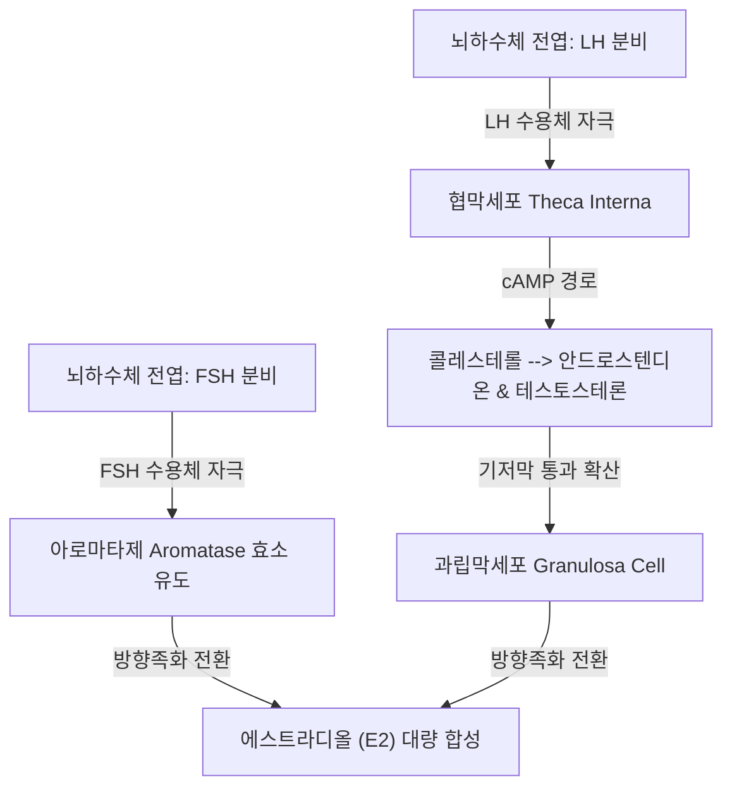

# 📑 [Netter Vol.1] Day 10: 난소 - 해부·내분비주기·낭종·PCOS·기형종·염전 및 난소암 종양학 (Section 10 완독)

> 📖 **원서 출처**: [The Netter Collection of Medical Illustrations - Volume 1, Reproductive System.pdf (pp. 202-230)](https://drive.google.com/file/d/1x-xTgPfUfiK7dsQyp5L5qfjFYSD_XyGm/view?usp=drivesdk)  
> 🏷️ **범위**: Section 10 전편 (Plate 10-1 ~ Plate 10-28, 총 28개 플레이트 전수 포함)  
> 📌 **핵심 테마**: 난소 미세해부학 및 인대(골반누두인대/난소동맥 vs 고유난소인대), 2-세포 2-성선자극호르몬 가설(Theca-LH vs Granulosa-FSH 아로마타제)과 배란 메커니즘, 폐경 내분비학(FSH 급증 및 에스트론 E1 전환), 터너(45,X) 및 스와이어 증후군(46,XY 선성 성선아세포종), 생리적 낭종(황체/테카루테인 낭종)과 자궁내막종(Chocolate cyst), 양성 상피종양(장액성 vs 거대 점액성 낭선종), 성숙 낭성 기형종(Dermoid cyst/Rokitansky 돌기) 및 급성 부속기 염전(Adnexal torsion 응급 정복술), 호르몬 분비 종양(과립막세포종 Call-Exner bodies vs 세르톨리-라이디히세포종 남성화), 다낭성 난소 증후군(PCOS 로테르담 기준/인슐린 저항성), 메이그스 증후군(섬유종·복수·흉수 3징), 크루켄베르크 전이성 종양(위암 유래 반지세포 Signet-ring), 난소 종양 진단 알고리즘(CA-125, HE4, ROMA) 및 유사 골반 종괴 감별

---

## 1. 개요 및 마스터 요약 (Executive Summary)

1. **난소 해부학, 혈관경 및 2-세포 2-성선자극호르몬 이론**:
   - 난소는 **골반누두인대(Infundibulopelvic / Suspensory ligament)**를 통해 복부대동맥 유래의 **난소동맥(Ovarian artery)**과 정맥을 공급받으며, **고유난소인대(Utero-ovarian ligament)**를 통해 자궁각에 연결됨.
   - **2-Cell, 2-Gonadotropin 모델**:
     - **협막세포 (Theca cell)**: LH 수용체 자극 $\rightarrow$ 콜레스테롤로부터 **안드로겐(Androstenedione, Testosterone)** 합성.
     - **과립막세포 (Granulosa cell)**: FSH 수용체 자극 $\rightarrow$ **아로마타제(Aromatase)** 효소 유도 $\rightarrow$ 협막세포에서 확산된 안드로겐을 **에스트라디올($\mathbf{E_2}$)**로 전환.
2. **배란, 황체 형성 및 폐경의 내분비학적 지표**:
   - 지속적인 고농도 에스트라디올($> 200\text{ pg/mL}$, $> 48\text{시간}$)의 양성 되먹임으로 **LH 급증(LH surge)**이 촉발되며, 36시간 후 배란 완성.
   - **폐경(Menopause)**: 난포 고갈로 에스트라디올과 인히빈 B(Inhibin B) 분비가 중단되어 음성 되먹임 소실 $\rightarrow$ **혈청 FSH($> 30\sim 40\text{ mIU/mL}$) 및 LH 현저한 급증**. 폐경 후 주된 에스트로겐은 부신 안드로스텐디온의 지방조직 내 아로마타제 전환으로 생성되는 **에스트론($\mathbf{E_1}$)**임.
3. **양성 난소 낭종, 기형종 및 부속기 염전(Adnexal Torsion)**:
   - **성숙 낭성 기형종 (Dermoid cyst)**: 삼배엽 유래(피부, 털, 피지, 치아, 뇌). 로키탄스키 돌기(Rokitansky protuberance). $1\sim 2\%$에서 편평세포암 악성 변성.
   - **부속기 염전**: $5\sim 10\text{ cm}$의 이동성 양성 종양(기형종, 낭선종)에서 호발. 정맥/림프 울혈 $\rightarrow$ 동맥 폐색 $\rightarrow$ 출혈성 경색. 즉각적인 **복강경하 염전 정복술(Detorsion)** 및 낭종절제술이 원칙 (흑자색으로 변해도 난소 보존 가능).
4. **호르몬 분비 종양 및 대사성 질환**:
   - **과립막세포종 (Granulosa Cell Tumor)**: 에스트로겐 대량 분비로 소아기 성조숙증, 폐경 후 질출혈 및 자궁내막암($10\sim 15\%$) 유발. 조직학적 **콜-엑스너 소체(Call-Exner bodies)** 및 '커피콩(Coffee-bean)' 핵.
   - **세르톨리-라이디히세포종 (Sertoli-Leydig Cell Tumor)**: 테스토스테론 급증($> 200\text{ ng/dL}$)으로 인한 탈여성화 및 **남성화(Virilization - 다모증, 음핵비대, 저음화)**.
   - **다낭성 난소 증후군 (PCOS)**: 로테르담 진단 기준(배란장애, 고안드로겐혈증, 초음파상 염주알 징후). 기저 병인인 인슐린 저항성과 LH/FSH 비율 역전($> 2:1$).
5. **난소 악성종양학 및 메이그스·크루켄베르크 증후군**:
   - **메이그스 증후군 (Meigs Syndrome)**: **난소 섬유종(Fibroma) + 복수(Ascites) + 흉수(Hydrothorax)**의 3징 (종양 절제 시 복수와 흉수 완전 소퇴).
   - **크루켄베르크 종양 (Krukenberg Tumor)**: 주로 **위암(70%)**에서 혈행성/림프성으로 전이된 양측성 고형 종양으로, 점액으로 가득 찬 **반지세포(Signet-ring cells)** 침윤이 특징.
   - **난소암 선별 지표**: 폐경 전후 특이도가 상이한 **CA-125**와 양성 질환 간섭이 적은 **HE4**를 결합한 **ROMA(Risk of Ovarian Malignancy Algorithm)** 계산.

---

## 2. 난소 구조, 발생 및 호르몬 조절 (Plates 10-1 Montage ~ 10-5)

### Plate 10-1 | 난소의 구조 및 발생 (Ovarian Structures and Development)

![[Netter_V1_Plate10-1.png]]

#### 1) 난소의 지지 인대, 혈관경 및 조직학적 구획
- **크기 및 위치**: 성인 기준 약 $3 \times 2 \times 1\text{ cm}$, 중량 $5\sim 8\text{ g}$. 골반 측벽의 난소와(Ovarian fossa of Waldeyer)에 위치.
- **3대 지지 구조 및 혈관 주행**:
  1. **골반누두인대 / 난소현수인대 (Infundibulopelvic / Suspensory ligament of ovary)**:
     - 난소 외측 상극을 골반 측벽에 고정.
     - **복부대동맥(L2)에서 직접 분지한 난소동맥(Ovarian a.)**과 난소정맥총이 주행. (외과적 부속기 절제술 시 첫 번째 결찰 대상).
  2. **고유난소인대 (Ovarian ligament / Utero-ovarian lig.)**:
     - 난소 내측 하극을 자궁각(Uterine cornu) 후하방에 연결하는 섬유근성 띠. 배아 난소도대(Gubernaculum)의 근위부 잔유물.
  3. **난소간막 (Mesovarium)**:
     - 광인대 후엽에서 연장되어 난소 문(Hilum)에 부착되는 복막 주름.
- **조직학적 층상 구조**:
  - **발아상피 (Germinal epithelium of Waldeyer)**: 난소 표면을 덮는 단층 입방/편평 중피세포. 배란 파열 후 재생 과정에서 봉입 낭종(Inclusion cyst)을 형성하여 상피성 난소암의 기원이 됨.
  - **백막 (Tunica albuginea)**: 표면 하부의 치밀한 교원성 무혈관 결합조직 피막.
  - **피질 (Cortex)**: 기질 세포(Stroma) 사이에 원시난포부터 성숙난포, 황체, 백체가 포절되어 존재하는 기능 구역.
  - **수질 (Medulla)**: 난소 문에서 들어온 대형 나선혈관, 림프관, 신경 및 소량의 라이디히 세포(Hilus cells) 분포.

---

### Plate 10-2 | 난소 주기의 내분비 조절 (Endocrine Relations During Cycle)

![[Netter_V1_Plate10-2.png]]

#### 1) 2-세포 2-성선자극호르몬 가설 (Two-Cell, Two-Gonadotropin Theory)
난포 내 에스트로겐 합성은 협막세포와 과립막세포의 긴밀한 상호작용으로 완성됩니다:



1. **협막세포 (Theca interna cell)**:
   - **LH 수용체** 발현.
   - LH 자극으로 StAR 단백질 및 $17\alpha$-hydroxylase / 17,20-lyase 활성화 $\rightarrow$ 콜레스테롤을 **안드로스텐디온(Androstenedione)**과 테스토스테론으로 전환.
   - 협막세포는 아로마타제 효소가 결핍되어 안드로겐을 에스트로겐으로 직접 바꾸지 못함.
2. **과립막세포 (Granulosa cell)**:
   - **FSH 수용체** 발현. (초기에는 LH 수용체 없음).
   - FSH 자극으로 **아로마타제(CYP19A1)** 효소의 전사 유도.
   - 인접한 협막세포에서 혈관망을 뚫고 확산되어 들어온 안드로겐을 포획하여 강력한 **에스트라디올($\mathbf{E_2}$)**로 전환 및 난포액 내로 분비.

---

### Plate 10-3 | 난소 주기: 난포 발달에서 황체 형성까지 (Ovarian Cycle)

![[Netter_V1_Plate10-3.png]]

#### 1) 난포 성숙과 배란의 분자생물학적 기전
- **원시난포 (Primordial follicle)**: 편평한 단층 과립막세포로 둘러싸인 제1감수분열 전기(Prophase I) 정지 상태의 일차난모세포.
- **동난포 (Antral / Secondary follicle)**: 과립막세포 층이 다층화되고 에스트로겐이 풍부한 난포액(Liquor folliculi)이 차오르며 강(Antrum) 형성.
- **우성난포 선택 (Dominant Follicle Selection)**:
  - 난포기 중반, 가장 많은 FSH 수용체와 높은 아로마타제 활성을 지닌 단 1개의 난포가 선택됨.
  - 이 난포가 분비하는 고농도 에스트라디올과 인히빈 B가 뇌하수체 FSH를 억제하여, 역치가 높은 나머지 동원 난포들을 폐쇄(Atresia)로 몰아넣음.
- **배란 촉발 (Ovulatory LH Surge)**:
  - 우성난포의 에스트라디올 분비가 급증하여 임계점($> 200\text{ pg/mL}$ 농도가 48시간 이상 유지)을 넘어서면, 뇌하수체에 대해 음성 되먹임이 **극적인 양성 되먹임(Positive feedback)**으로 역전됨.
  - 폭발적인 **LH 서지(LH surge)** 발생 $\rightarrow$ 프로게스테론 수용체 발현, 플라스민(Plasmin) 및 콜라게나아제 분비로 난포 정점(Stigma) 벽 용해 $\rightarrow$ 제1극체(First polar body) 방출과 함께 제2감수분열 중기(Metaphase II)에서 정지된 난모세포 배출.

---

### Plate 10-4 | 생애 주기에 따른 호르몬 영향 (Hormonal Influence During Life)

![[Netter_V1_Plate10-4.png]]

#### 1) 난모세포 고갈 곡선과 사춘기 발현 순서
- **난자 수의 비가역적 감소**:
  - 태생 20주경: 약 **$600\sim 700$만 개**로 정점 도달.
  - 출생 시: 광범위한 세포자멸사로 **$100\sim 200$만 개**로 급감.
  - 사춘기 초경 시: 약 **$30\sim 40$만 개**만 잔존.
  - 일생 동안 배란되는 난자는 약 **$400\sim 500$개**에 불과하며 나머지는 모두 폐쇄체(Atresia)로 소멸.
- **여성 사춘기 발현의 정상 5단계 순서**:
  1. **부신피질발달 (Adrenarche)**: DHEA-S 분비 증가 (땀 냄새, 피지).
  2. **유방발달 (Thelarche)**: 에스트로겐 자극에 의한 유선 싹 형성 (보통 만 9.5~10세, 첫 징후).
  3. **치모발달 (Pubarche)**: 안드로겐 자극에 의한 음모 및 액모 출현.
  4. **최대 성장 분출 (Peak Height Velocity, Growth spurt)**: 유방 발달 1년 후 급성장.
  5. **초경 (Menarche)**: 유방 발달 약 2~2.5년 후 발현 (평균 만 12.5~12.8세). 초경 후 키 성장은 대개 $3\sim 5\text{ cm}$ 이내로 둔화.

---

### Plate 10-5 | 폐경과 폐경후 변화 (Menopause)

![[Netter_V1_Plate10-5.png]]

#### 1) 난포 고갈과 폐경 후 스테로이드 대사 변화
- **폐경의 공식 정의**: 난소 난포 기능의 영구적 소실로 인해 **12개월 연속 무월경**이 지속된 상태 (평균 연령 만 51세).
- **호르몬 역학의 극단적 역전**:
  - 난포 고갈 $\rightarrow$ 과립막세포의 에스트라디올($E_2$) 및 인히빈 B 분비 소실 $\rightarrow$ 시상하부-뇌하수체 음성 되먹임 축 파탄.
  - **혈청 FSH 수치 급증 ($\mathbf{> 30\sim 40\text{ mIU/mL}}$)** 및 LH 동반 상승.
- **에스트론($E_1$)으로의 주도권 전환**:
  - 가임기: 난소에서 합성되는 강력한 **에스트라디올($E_2$)**이 주류.
  - 폐경 후: 난소의 $E_2$ 생산 중단 $\rightarrow$ 부신피질에서 분비된 안드로스텐디온이 비만/말초 지방조직의 아로마타제에 의해 **에스트론($E_1$)**으로 전환되어 혈중 순환 ($E_1 > E_2$).
  - 비만 여성일수록 말초 $E_1$ 생성이 많아 안면홍조는 덜 겪을 수 있으나, 대립되지 않은 에스트로겐 자극으로 **자궁내막암 및 유방암 위험 급증**.

---

## 3. 선천 기형, 기능성 낭종 및 자궁내막종 (Plates 10-6 ~ 10-10)

### Plate 10-6 | 난소의 선천성 기형 (Developmental Anomalies)

![[Netter_V1_Plate10-6.png]]

#### 1) 이소성 난소 및 과잉 난소
- **난소 하강 부전 (Undescended Ovary)**: 태생기 요추 부위에서 골반강으로의 하강이 정지되어 골반 가장자리(Pelvic brim)나 신장 하방에 영구 위치.
- **부속 난소 (Accessory Ovary)**: 정상 난소와 연결되어 있거나 인접 인대 내에 존재하는 작은 부속 난소 조직.
- **과잉 난소 (Supernumerary Ovary)**: 정상 난소 및 자궁인대와 완전히 분리되어 후복막강, 대망, 장간막 등에 독립적으로 존재하는 극히 드문 이소성 생식샘. 난소절제술 후에도 배란 및 임신이 가능하거나 낭종성 질환을 일으키는 원인이 됨.

---

### Plate 10-7 | 성선 이형성증 (Gonadal Dysgenesis)

![[Netter_V1_Plate10-7.png]]

#### 1) 터너 증후군 vs 스와이어 증후군 감별

| 감별 항목 | 터너 증후군 (Turner Syndrome) | 스와이어 증후군 (Swyer Syndrome) |
| :--- | :--- | :--- |
| **염색체 핵형** | **45,X** (모자이크 45,X/46,XX 가능) | **46,XY** (순수 성선 이형성증) |
| **분자유전 병인** | 성염색체 단일 결손 | Y 염색체상의 ***SRY* 유전자 결실 또는 돌연변이** |
| **성선 형태** | **줄무늬 성선 (Streak gonads)**: 난포 조기 고갈 | 섬유성 줄무늬 성선 (무기능성 고환 결손) |
| **자궁/질 존재 유무** | **자궁, 난관, 질 정상 존재** (뮐러관 보존) | **자궁, 난관, 질 정상 존재** (AMH 결핍으로 뮐러관 퇴화 실패) |
| **외형적 표현형** | 저신장($< 150\text{ cm}$), 익상경(Webbed neck), 방패가슴 | **키가 큰 여성형 외형**, 왜소증 없음 |
| **악성 종양 위험** | Y 염색체 모자이크 없으면 낮음 | **성선아세포종(Gonadoblastoma) 및 무분화세포종 위험 30%** |
| **임상적 핵심 처치** | 성장호르몬, 에스트로겐/프로게스테론 보충 | **진단 즉시 예방적 양측 성선절제술(Gonadectomy) 필수** |

---

### Plate 10-8 | 생리적 변이 및 비종양성 낭종 (Physiologic Variations, Nonneoplastic Cysts)

![[Netter_V1_Plate10-8.png]]

#### 1) 기능성 난소 낭종(Functional Ovarian Cysts)의 3대 유형
1. **난포 낭종 (Follicular Cyst)**:
   - 성숙 난포가 배란에 실패하고 퇴화하지 못한 채 난포액이 과다 축적되어 발생.
   - 단방성, 얇고 매끈한 벽, 직경 보통 $3\sim 8\text{ cm}$.
   - 대부분 $4\sim 8$주 이내 자연 흡수 및 소퇴 $\rightarrow$ **초음파 추적 관찰이 원칙**.
2. **황체 낭종 (Corpus Luteum Cyst)**:
   - 배란 후 황체 중심부로 과도한 출혈이 일어나 혈종 형성 후 낭포화 (**출혈성 황체 낭종, Hemorrhagic corpus luteum**).
   - 황체기 후반(월경 직전) 성교나 외상으로 파열 시 복강내 대량 출혈을 일으켜 **자궁외임신 파열과 유사한 급성 복증** 유발.
3. **테카 루테인 낭종 (Theca Lutein Cysts)**:
   - **양측성 다방성의 거대 낭종군**으로 난소가 벌집처럼 커짐.
   - **병인**: 극단적으로 높은 혈중 **$\beta\text{-hCG}$ 과다 자극**에 의한 협막세포 증식 (포상기태, 융모암종, 다태임신, 배란유도제 과자극). hCG 공급원이 제거되면 자연 소퇴.

---

### Plate 10-9 | 골반 자궁내막증 II: 난소 자궁내막종 (Endometriosis II — Pelvis / Endometrioma)

![[Netter_V1_Plate10-9.png]]

#### 1) 난소 초콜릿 낭종 (Chocolate Cyst of Ovary)
- **병태생리**: 난소 표면에 착상된 자궁내막 조직이 난소 피질을 함입시키며 낭종 형성. 매 월경 주기마다 낭종 내부로 출혈이 반복되어 두껍고 끈적끈적한 암갈색의 **'초콜릿색 오래된 혈액'** 저류.
- **초음파 영상 소견**: 내부에 음영이 균일하게 분산된 **반투명 유리알 음영 (Ground-glass echogenicity)**.
- **임상적 중요성**:
  - 만성 염증으로 난소 기질 섬유화 및 정상 난포 파괴 $\rightarrow$ 난소 예비능(AMH) 급격한 저하.
  - 주변 광인대 및 자궁 후벽과 치밀하게 유착되어 수술 시 박리 난이도 극대화.
  - 약 $1\%$ 미만에서 난소의 **투명세포암(Clear cell carcinoma)** 및 자궁내막양암(Endometrioid carcinoma)으로 악성 변성 위험.

---

### Plate 10-10 | 난소 감염 및 난소 주위염 (Infections / Perioophoritis)

![[Netter_V1_Plate10-10.png]]

#### 1) 난소 주위염에서 난소 실질염으로의 이행
- 난소는 두꺼운 백막(Tunica albuginea)으로 둘러싸여 있어 단독 감염에는 강한 저항성을 지님.
- 그러나 급성 난관염 삼출물이 난소 표면을 덮으면 **난소주위염(Perioophoritis)**이 발생하고, 배란 직후 파열된 난포 틈새로 세균이 침투하면 난소 실질 내부로 농양이 형성되어 **난관난소농양(TOA)**으로 직결됨.

---

## 4. 양성 상피종양, 기형종 및 부속기 염전 (Plates 10-11 ~ 10-16)

### Plate 10-11 | 장액성 낭선종 (Serous Cystoma and Cystadenoma)

![[Netter_V1_Plate10-11.png]]

#### 1) 가장 흔한 난소 양성 상피성 종양
- 전체 양성 난소 종양의 약 $25\sim 30\%$.
- 육안 소견: 단방성(Unilocular) 또는 소수의 방, 표면이 매끈하고 투명하며 내부는 맑은 담황색의 **장액성 액체(Serous fluid)**로 채워짐.
- 조직학: 난관 점막을 닮은 **섬모 원주상피세포(Ciliated columnar cells)**로 단층 피개.

---

### Plate 10-12 | 유두상 장액성 낭선종 (Papillary Serous Cystadenoma)

![[Netter_V1_Plate10-12.png]]

#### 1) 유두상 돌기(Papillary Projections)와 경계성 종양 감별
- 낭종 내벽 또는 외벽 표면으로 양배추 모양의 미세한 유두상 결절이 돋아남.
- **임상 주의**: 유두상 돌기가 관찰되는 경우 단순 양성과 경계성 난소종양(Borderline tumor), 그리고 악성 장액성 암종의 감별을 위해 동결절편(Frozen section) 생검 필수.

---

### Plate 10-13 | 장액성 선섬유종 및 낭선섬유종 (Papilloma, Serous Adenofibroma and Cystadenofibroma)

![[Netter_V1_Plate10-13.png]]

#### 1) 섬유성 기질 증식의 임상 양상
- 상피 성분과 함께 난소 기질 유래의 치밀한 섬유 결합조직이 과다 증식한 양성 종양.
- 매우 단단하고 결절성의 고형 성상을 띠어, 수술 전 골반 진찰 및 초음파/CT 영상에서 악성 고형암으로 빈번히 오인됨.

---

### Plate 10-14 | 점액성 낭선종 (Mucinous Cystadenoma)

![[Netter_V1_Plate10-14.png]]

#### 1) 거대 다방성 낭종 및 복막 가점액종 위험
- 전체 난소 양성 종양의 $15\sim 20\%$.
- **거대 종괴 형성**: 난소 종양 중 크기가 가장 거대하게 자라나 **무게가 $10\sim 30\text{ kg}$ 이상에 달하여 복부 전체를 팽만**시킬 수 있음.
- **벌집 모양 구조 (Multilocular honeycomb)**: 무수히 많은 작은 격벽으로 분할되어 있으며, 내강은 끈적끈적한 젤라틴 양상의 **점액(Mucin)**으로 채워짐.
- 조직학: 자궁경관 내막이나 장점막을 닮은 점액 분비성 키 큰 원주상피.
- **복막 가점액종 (Pseudomyxoma Peritonei, PMP)**:
  - 점액성 종양이 파열되어 복강 내에 젤리 같은 점액 삼출물이 가득 차고 복막 표면에 다발성 점액 병변이 번지는 상태.
  - 대부분 충수돌기 점액선암(Appendiceal neoplasm)이 원발소이므로, 점액성 난소 종양 수술 시 반드시 **충수돌기 절제 및 검사(Appendectomy)**를 병행해야 함.

---

### Plate 10-15 | 난소 기형종: 성숙 낭성 기형종 (Teratomata / Mature Cystic Teratoma — Dermoid Cyst)

![[Netter_V1_Plate10-15.png]]

#### 1) 피낭종(Dermoid Cyst)의 3배엽 구성 및 합병증
- 가임기 젊은 여성에서 가장 흔한 양성 난소 생식세포 종양 (전체 난소 종양의 $10\sim 20\%$).
- 분화능을 가진 원시 생식세포에서 기원하여 **외배엽, 중배엽, 내배엽의 3배엽 유래 조직이 모두 혼재**:
  - **외배엽**: 중층편평상피, 모발(머리카락 뭉치), 피지선(치즈 같은 피지 저류), 치아, 신경 뇌조직.
  - **중배엽**: 연골, 골조직, 지방 조직, 평활근.
  - **내배엽**: 갑상선 조직, 기관지 상피, 위장관 상피.
- **로키탄스키 돌기 (Rokitansky's Protuberance / Dermoid Plug)**: 낭종 내벽의 한쪽으로 치우쳐 돌출된 결절 부위로, 뼈와 치아가 집중 매몰되어 있어 X-선이나 CT에서 칼슘 석회화 음영으로 즉각 진단 가능.
- **특수 변이**:
  - **난소 갑상선종 (Struma ovarii)**: 기형종의 주성분이 성숙 갑상선 조직으로 구성되어 실제 갑상선기능항진증을 유발.
  - **악성 변성 ($1\sim 2\%$)**: 폐경 후 여성에서 기형종 상피가 **편평세포암(Squamous cell carcinoma)**으로 악성화.

---

### Plate 10-16 | 부속기 염전 (Adnexal Torsion / Ovarian Torsion)

![[Netter_V1_Plate10-16.png]]

#### 1) 혈류 차단 기전 및 복강경 보존 수술 원칙
- **호발 소인**: 직경 **$5\sim 10\text{ cm}$ 크기의 이동성이 높은 양성 종양** (성숙 낭성 기형종이 무게 불균형으로 인해 가장 흔히 염전 유발).
- **혈역학적 파탄 순서**:
  1. 골반누두인대와 고유난소인대를 축으로 부속기가 회전.
  2. 벽이 얇은 **난소정맥 및 림프관이 먼저 압박·폐쇄** $\rightarrow$ 동맥혈은 계속 유입되나 정맥 배액 차단 $\rightarrow$ **난소가 수배로 급속 부종 및 암적색 울혈**.
  3. 부종 내압 상승으로 **난소동맥 혈류마저 완전 차단** $\rightarrow$ **급성 허혈성 괴사 및 흑자색 출혈성 경색(Hemorrhagic gangrene)**.
- **임상 양상**: 갑작스럽게 발생하는 쥐어짜는 듯한 편측 하복부 격통, 오심, 구토, 미열.
- **현대 외과적 치료 원칙 (응급 복강경술)**:
  - 과거: 혈전 색전증 우려로 꼬인 채 즉각 절제함.
  - **현재 표준**: **혈전 색전증 위험은 극히 미미($< 0.2\%$)하므로, 종양이 흑자색으로 변해 괴사된 것처럼 보여도 무조건 보존적 염전 정복술(Detorsion)을 시행하고 낭종만 절제(Cystectomy)함**. 꼬임을 풀어주면 90% 이상에서 난소 기능이 기적적으로 정상 회복됨.

---

## 5. 호르몬 분비 종양, PCOS 및 기질성 신생물 (Plates 10-17 ~ 10-22)

### Plate 10-17 | 여성화 난소 종양: 과립막세포종 (Feminizing Neoplasms — Granulosa Cell Tumor)

![[Netter_V1_Plate10-17.png]]

#### 1) 성선기질종양(Sex Cord-Stromal Tumor)과 에스트로겐 과다
- 난소 간질의 과립막세포에서 유래하는 저악성도 종양. **대량의 에스트로겐** 분비.
- **연령별 임상 표현형**:
  - 소아기 (유아형 Juvenile GCT, 5%): 가성 성조숙증 (조기 유방 발육, 질출혈, 급속 골성장).
  - 가임기: 무배란, 월경불순, 월경과다.
  - 폐경 후 (성인형 Adult GCT, 95%): **폐경 후 질출혈 (Postmenopausal bleeding)**. 지속적인 에스트로겐 자극으로 **자궁내막증식증($25\sim 50\%$) 및 자궁내막암($10\sim 15\%$)이 동반**되므로 반드시 자궁내막 생검 동시 시행 필수.
- **특징적 2대 병리 소견**:
  1. **콜-엑스너 소체 (Call-Exner Bodies)**: 미성숙 난포를 흉내 내듯 호산성 중심 액체 주위를 과립막세포들이 둥글게 로제트(Rosette) 모양으로 배열.
  2. **커피콩 핵 (Coffee-bean nuclei)**: 핵 중심을 관통하는 세로 방향의 뚜렷한 주름 구(Groove).
- **종양 표지자**: **인히빈 (Inhibin B)** 수치로 치료 반응 및 재발 모니터링 (10~20년 후에도 지연 재발 호발).

---

### Plate 10-18 | 남성화 난소 종양: 세르톨리-라이디히세포종 (Masculinizing Neoplasms — Sertoli-Leydig Cell Tumor)

![[Netter_V1_Plate10-18.png]]

#### 1) 안드로겐 폭증과 임상 2단계 남성화
- **탈여성화 (Defeminization, 1단계)**: 무월경, 유방 위축, 여성형 피하지방 소실.
- **남성화 (Virilization, 2단계)**: **다모증(Hirsutism - 턱수염, 가슴털), 남성형 탈모(Temporal balding), 음핵 비대(Clitoromegaly, 직경 $> 10\text{ mm}$), 저음화(목소리 굵어짐), 여드름**.
- **검사실 감별 소견**:
  - 혈청 **테스토스테론 급증 ($\mathbf{> 200\text{ ng/dL}}$)**.
  - 부신 기원 안드로겐인 **DHEA-S는 정상** (부신 종양 배제 기준).
- 병리 소견: 고환의 정세관을 모방하는 세르톨리 세포 줄과 테스토스테론을 분비하는 지질이 풍부한 라이디히 세포(라인케 결정 Reinke crystals 함유).

---

### Plate 10-19 | 내분비질환 I: 황체화 병변 (Endocrinopathies I — Luteinization)

![[Netter_V1_Plate10-19.png]]

#### 1) 임신성 황체종(Pregnancy Luteoma)의 특징
- 임신 3분기에 hCG 자극에 의해 난소 기질 세포가 결절성으로 과증식하는 비종양성 생리적 병변.
- 환자의 30%에서 모체 남성화, 여아 태아의 50%에서 외부 생식기 남성화 유발.
- **치료**: 출산 후 hCG가 소실되면 **완전히 자연 퇴행**하므로 외과적 절제 금기.

---

### Plate 10-20 | 내분비질환 II: 다낭성 난소 증후군 (Endocrinopathies II — Polycystic Ovary Syndrome, PCOS)

![[Netter_V1_Plate10-20.png]]

#### 1) 로테르담(Rotterdam) 진단 기준 (다음 중 2개 이상 만족 시 확진)
1. **배란 장애**: 희발월경(Oligomenorrhea, 연간 8회 미만) 또는 무월경(Amenorrhea).
2. **고안드로겐혈증**: 임상적 증상(다모증 Ferriman-Gallwey 점수 $\ge 8$, 중증 여드름, 탈모) 또는 혈청 총/유리 테스토스테론 상승.
3. **다낭성 난소 형태 (초음파 소견)**:
   - 한쪽 또는 양쪽 난소에서 직경 $2\sim 9\text{ mm}$ 크기의 미성숙 난포가 **20개 이상** 관찰되거나, 난소 부피가 **$\ge 10\text{ mL}$**로 증대.
   - 난소 피질 가장자리를 따라 난포들이 배열된 **염주알/목걸이 징후 ("String of pearls")** 및 중심부 백색 기질 비후.

#### 2) 대사 이상 및 치료
- **인슐린 저항성(Insulin Resistance)**: 보상성 고인슐린혈증이 난소 협막세포의 안드로겐 합성을 직접 촉진하고 간의 SHBG 합성을 억제하여 유리 테스토스테론을 급증시키는 악순환 유발.
- **치료**: 체중 감량(5~10% 감량 시 자연 배란 복원), 복합 경구피임제(COC - 내막 보호 및 안드로겐 억제), 인슐린 저항성 개선제(Metformin), 가임기 배란 유도(Letrozole 1차 선택제).

---

### Plate 10-21 | 무분화세포종 및 브레너 종양 (Dysgerminoma, Brenner Tumor)

![[Netter_V1_Plate10-21.png]]

#### 1) 생식세포암 vs 방광상피양 양성종양
- **무분화세포종 (Dysgerminoma)**:
  - 남성의 고환 정상피종(Seminoma)과 정확히 동일한 악성 생식세포 종양.
  - $10\sim 20$대 젊은 여성 호발. 종양 표지자: **LDH** 상승.
  - 림프구 침윤을 동반한 섬유성 중격과 글리코겐이 풍부한 다각형 투명 세포판.
  - **방사선 및 백금계 항암화학요법(BEP 요법)에 극도로 민감하여 완치율 $> 95\%$**. 편측 부속기만 절제하는 가임력 보존 수술 가능.
- **브레너 종양 (Brenner Tumor)**:
  - 대부분 무증상의 양성 상피종양.
  - 비뇨기계의 **이행상피(Transitional / Urothelium)**를 닮은 상피 세포 둥지가 풍부한 섬유성 기질에 둘러싸인 형태 (커피콩 핵 소견).

---

### Plate 10-22 | 기질성 종양: 난소 섬유종 및 메이그스 증후군 (Stromatogenous Neoplasms — Fibroma & Meigs Syndrome)

![[Netter_V1_Plate10-22.png]]

#### 1) 메이그스 증후군(Meigs Syndrome)의 고전적 3징
1. **난소의 양성 고형 섬유종 (Ovarian Fibroma)**.
2. **복수 (Ascites)**.
3. **흉수 (Hydrothorax / Pleural effusion, 주로 우측)**.
- **기전**: 딱딱한 섬유종 표면에서 대량의 액체가 복강 내로 삼출되고, 횡격막의 림프관 구멍(Diaphragmatic transudative apertures)을 통해 복수가 흉강(우측)으로 빨려 올라가 흉수를 형성.
- **임상적 특징**: 다량의 복수와 흉수로 인해 진행성 악성 난소암(말기 암종증)으로 오인되기 쉬우나, **양성 난소 섬유종을 단순 수술 절제하면 복수와 흉수가 며칠 내에 완벽하게 자연 소실됨**.

---

## 6. 난소 악성종양 및 유사 병변 (Plates 10-23 ~ 10-28)

### Plate 10-23 | 원발성 낭성 난소암 (Primary Cystic Carcinoma)

![[Netter_V1_Plate10-23.png]]

#### 1) 상피성 난소암(EOC)의 악성 의심 초음파 징후
- 난소 악성종양의 90%를 차지하는 상피성 난소암은 복합 낭성 종괴 형태로 발현:
  - **격벽 두께 $\mathbf{> 3\text{ mm}}$의 두꺼운 다방성 격벽**.
  - **내벽 또는 외벽의 고형 유두상 돌기 (Solid papillary projections)**.
  - 종괴 내부의 고형 성분 및 괴사 부위.
  - 도플러 초음파상 낮은 저항 지수(Low RI $< 0.4$, 신생 혈관망에 의한 높은 확장기 혈류).
  - 동반된 복수(Ascites) 및 복막 비후.

---

### Plate 10-24 | 원발성 고형 난소암 (Primary Solid Carcinoma)

![[Netter_V1_Plate10-24.png]]

#### 1) 미분화암 및 악성 기질 종양
- 낭포 성분 없이 전체가 고형 결절로 채워진 고등급 암종.
- 출혈성 괴사가 심하고 조기 혈행성 및 복강내 광범위 파종을 동반하여 극히 불량한 예후를 나타냄.

---

### Plate 10-25 | 전이성 난소암: 크루켄베르크 종양 (Secondary Ovarian Carcinoma — Krukenberg Tumor)

![[Netter_V1_Plate10-25.png]]

#### 1) 소화기 원발 암의 난소 전이 및 반지세포 병리
- 난소에 발생하는 악성 종양의 약 $10\sim 15\%$는 타 장기에서 전이된 이차성 암.
- **크루켄베르크 종양 (Krukenberg Tumor)**:
  - **원발 장기**: **위암 (Gastric Adenocarcinoma, 특히 미만형 Diffuse type, 약 70%)**, 대장암, 충수암, 침윤성 소엽 유방암.
  - **육안 특징**: **양측성(Bilateral, 80%)**, 난소 고유의 신장 모양 타원형 윤곽을 유지하면서 전체가 매우 단단하고 요철이 있는 고형 결절로 비대화.
  - **현미경적 특징**: 점액(Mucin)을 대량 생산하여 세포질 내에 가두어 핵을 세포 가장자리로 납작하게 밀어붙인 **전형적인 반지세포 (Signet-ring cells)**가 난소 기질 속으로 광범위하게 침윤.

---

### Plate 10-26 | 난소 종양의 진단 및 선별 전략 (Diagnosis of Ovarian Neoplasms)

![[Netter_V1_Plate10-26.png]]

#### 1) 침묵의 살인자(Silent Killer)와 ROMA 알고리즘
- 초기 증상이 거의 없고 모호한 소화불량, 복부 팽만감, 조기 포만감만 유발하여 **진단 시 $70\%$ 이상의 환자가 이미 3기 이상의 진행성 병기**로 발견됨.
- **2대 혈청 종양 표지자**:
  1. **CA-125**: 고등급 장액성 암의 80%에서 상승. 단, 폐경 전 여성에서는 자궁내막증, 자궁근종, 골반염, 임신 등 양성 질환에서도 흔히 위양성을 보임.
  2. **HE4 (Human Epididymis Protein 4)**: 난소암 민감도는 CA-125와 유사하나, 양성 부인과 질환에서 상승하지 않아 특이도가 월등히 높음.
- **ROMA (Risk of Ovarian Malignancy Algorithm)**: 폐경 상태 + CA-125 + HE4 수치를 수학적으로 결합하여 상피성 난소암의 악성 위험도를 정밀 예측하는 표준 진단법.

---

### Plates 10-27 & 10-28 | 난소 종양 유사 병변 I & II (Conditions Simulating Ovarian Neoplasms I & II)

![[Netter_V1_Plate10-27.png]]
![[Netter_V1_Plate10-28.png]]

#### 1) 부속기 종괴로 오인되는 비난소성 양성 및 소화기 질환
골반 종괴 진찰 시 난소 신생물과 반드시 감별해야 하는 주요 질환군:
- **비부속기성 생식기 질환**:
  - **유경성 장막하 자궁근종 (Pedunculated Subserosal Myoma)**: 자궁경과 가느다란 줄기로만 연결되어 있어 난소 고형 종양과 구별 곤란.
  - **광인대 근종 (Broad Ligament Fibroid)**.
- **비뇨기계 기형**:
  - **골반신 (Pelvic Kidney)**: 정상 신장이 골반강 내에 위치하여 단단한 종괴로 만져짐 (절제 시 영구적 신부전 유발 위험 $\rightarrow$ 수술 전 IVP 또는 CT 확인 필수).
  - 팽만된 방광 (도뇨관 삽입으로 즉각 감별).
- **소화기계 질환**:
  - **충수 점액낭종 (Appendiceal Mucocele)** 및 충수 농양.
  - S상결장 게실염 농양 (Diverticular abscess).
  - 분변 감입 (Fecal impaction).
  - 복막 봉입 낭종 (Peritoneal inclusion cyst / Benign multicystic mesothelioma).

---

## 7. 로컬 이미지 추출 자동화 스크립트 (Python snippet)

원서 PDF(`The Netter Collection of Medical Illustrations - Volume 1, Reproductive System.pdf`)에서 Section 10에 해당하는 28개 플레이트 고해상도 이미지를 추출하여 `첨부파일` 폴더에 일괄 저장할 수 있는 로컬 실행용 Python 스크립트입니다:

```python
import fitz  # PyMuPDF
import os

pdf_path = "The Netter Collection of Medical Illustrations - Volume 1, Reproductive System.pdf"
output_dir = "./헤르메스/책 읽기/Netter_Vol1_생식기계/첨부파일"
os.makedirs(output_dir, exist_ok=True)

doc = fitz.open(pdf_path)

# Section 10 전체 플레이트 목록 (Plate 10-1 ~ Plate 10-28, 총 28개)
plates_info = [
    ("Plate10-1", "Ovarian structures and development"),
    ("Plate10-2", "Endocrine relations during cycle"),
    ("Plate10-3", "Ovarian cycle"),
    ("Plate10-4", "Hormonal influence during life"),
    ("Plate10-5", "Menopause"),
    ("Plate10-6", "Developmental anomalies"),
    ("Plate10-7", "Gonadal dysgenesis"),
    ("Plate10-8", "Physiologic variations, nonneoplastic cysts"),
    ("Plate10-9", "Endometriosis II - Pelvis"),
    ("Plate10-10", "Infections"),
    ("Plate10-11", "Serous cystoma and cystadenoma"),
    ("Plate10-12", "Papillary serous cystadenoma"),
    ("Plate10-13", "Papilloma, serous adeno- and cystadenofibroma"),
    ("Plate10-14", "Mucinous cystadenoma"),
    ("Plate10-15", "Teratomata"),
    ("Plate10-16", "Adnexal Torsion"),
    ("Plate10-17", "Feminizing neoplasms"),
    ("Plate10-18", "Masculinizing neoplasms"),
    ("Plate10-19", "Endocrinopathies I - Luteinization"),
    ("Plate10-20", "Endocrinopathies II - Polycystic ovary syndrome"),
    ("Plate10-21", "Dysgerminoma, Brenner tumor"),
    ("Plate10-22", "Stromatogenous neoplasms"),
    ("Plate10-23", "Primary cystic carcinoma"),
    ("Plate10-24", "Primary solid carcinoma"),
    ("Plate10-25", "Secondary ovarian carcinoma"),
    ("Plate10-26", "Diagnosis of ovarian neoplasms"),
    ("Plate10-27", "Conditions simulating ovarian neoplasms I"),
    ("Plate10-28", "Conditions simulating ovarian neoplasms II"),
]

for plate_id, plate_title in plates_info:
    target_page = None
    search_term = f"Plate 10-{plate_id.split('-')[1]}"
    
    for page_num in range(len(doc)):
        text = doc[page_num].get_text()
        if search_term in text or plate_title.lower() in text.lower():
            target_page = page_num
            break
            
    if target_page is not None:
        page = doc[target_page]
        pix = page.get_pixmap(matrix=fitz.Matrix(3.0, 3.0))  # 300 DPI 상당
        img_name = f"Netter_V1_{plate_id}.png"
        save_path = os.path.join(output_dir, img_name)
        pix.save(save_path)
        print(f"[추출 완료] {img_name} (PDF p.{target_page+1})")
    else:
        print(f"[미검출] {plate_id}: {plate_title}")

doc.close()
print("=== Section 10 28개 플레이트 이미지 추출 완료 ===")
```
