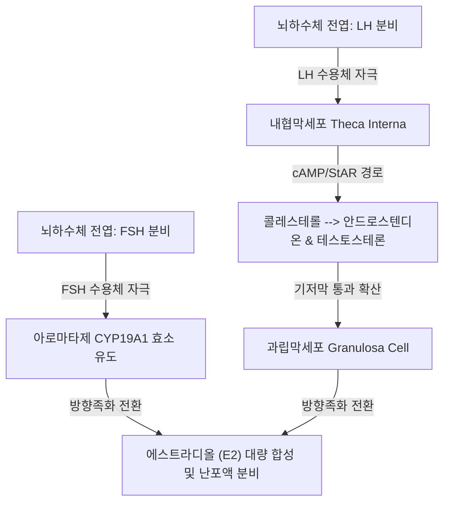

# 📑 [Netter Vol.1] Day 10: 난소 - 해부·내분비주기·낭종·PCOS·기형종·염전 및 난소암 종양학 (Section 10 완독)

> 📖 **원서 출처**: [The Netter Collection of Medical Illustrations - Volume 1, Reproductive System.pdf (pp. 202-230)](https://drive.google.com/file/d/1x-xTgPfUfiK7dsQyp5L5qfjFYSD_XyGm/view?usp=drivesdk)  
> 🏷️ **범위**: Section 10 전편 (Plate 10-1 ~ Plate 10-28, 총 28개 플레이트 전수 포함)  
> 📌 **핵심 테마**: 난소 미세해부학 및 인대(골반누두인대/난소동맥 vs 고유난소인대), 2-세포 2-성선자극호르몬 가설(Theca-LH vs Granulosa-FSH 아로마타제)과 배란 메커니즘, 폐경 내분비학(FSH 급증 및 에스트론 E1 전환), 터너(45,X) 및 스와이어 증후군(46,XY 선성 성선아세포종), 생리적 낭종(황체/테카루테인 낭종)과 자궁내막종(Chocolate cyst), 양성 상피종양(장액성 vs 거대 점액성 낭선종), 성숙 낭성 기형종(Dermoid cyst/Rokitansky 돌기) 및 급성 부속기 염전(Adnexal torsion 응급 정복술), 호르몬 분비 종양(과립막세포종 Call-Exner bodies vs 세르톨리-라이디히세포종 남성화), 다낭성 난소 증후군(PCOS 로테르담 기준/인슐린 저항성), 메이그스 증후군(섬유종·복수·흉수 3징), 크루켄베르크 전이성 종양(위암 유래 반지세포 Signet-ring), 난소 종양 진단 알고리즘(CA-125, HE4, ROMA) 및 유사 골반 종괴 감별

---

## 1. 개요 및 마스터 요약 (Executive Summary)

1. **난소 해부학, 혈관경 및 2-세포 2-성선자극호르몬 이론**:
   - 난소는 **골반누두인대(Infundibulopelvic / Suspensory ligament)**를 통해 복부대동맥 유래의 **난소동맥(Ovarian artery)**과 정맥을 공급받으며, **고유난소인대(Utero-ovarian ligament)**를 통해 자궁각에 연결됨.
   - **배아 발생 시계**: 제6주 비뇨생식릉 내측의 생식융기(Germinal ridge)에서 발생하며, 난황낭(Umbilical vesicle)에서 기원한 원시난모세포가 후장 장간막을 따라 난소 원기로 이주함. 임신 3개월경 난소도대(Gubernaculum)의 수축성 견인으로 골반강으로 하강함.
   - **2-Cell, 2-Gonadotropin 모델**:
     - **협막세포 (Theca interna cell)**: LH 수용체 자극 $\rightarrow$ 콜레스테롤로부터 **안드로겐(Androstenedione, Testosterone)** 합성.
     - **과립막세포 (Granulosa cell)**: FSH 수용체 자극 $\rightarrow$ **아로마타제(Aromatase)** 효소 유도 $\rightarrow$ 협막세포에서 혈관망을 뚫고 확산된 안드로겐을 **에스트라디올($\mathbf{E_2}$)**로 전환.
2. **배란, 황체 형성 및 폐경의 내분비학적 지표**:
   - 한 주기의 난포 코호트는 월경 제1일 약 **375일 전**부터 성숙을 시작하며, 제8일경부터 우성난포가 뇌하수체 독립적 자율 성장을 획득함.
   - 지속적인 고농도 에스트라디올($> 200\text{ pg/mL}$, $> 48\text{시간}$)의 양성 되먹임으로 **LH 급증(LH surge)**이 촉발되며, 제1감수분열 완성(제1극체 방출) 후 36시간 내 배란 완성.
   - **황체(Corpus luteum)**: 내협막의 모세혈관망을 따라 루테인 세포가 구심성 증식하며 프로게스테론을 분비(뇌간 체온조절중추 자극으로 기초체온 상승). 임신 시 hCG 자극으로 2개월간 난소 부피의 절반을 차지하며 유지되다가 **황체-태반 전이(Luteal-placental shift)** 완수.
   - **폐경(Menopause)**: 난포 고갈로 에스트라디올과 인히빈 분비가 중단되어 음성 되먹임 소실 $\rightarrow$ **혈청 FSH($> 100\text{ mIU/mL}$ 확진, $> 30\sim 40\text{ mIU/mL}$ 진단적) 및 LH 현저한 급증**. 폐경 후 주된 에스트로겐은 부신 안드로스텐디온의 지방조직 내 아로마타제 전환으로 생성되는 **에스트론($\mathbf{E_1}$)**임 (폐경 난소 간질은 LH 자극으로 안드로겐을 주 생산).
3. **선천 기형, 양성 난소 낭종, 기형종 및 부속기 염전(Adnexal Torsion)**:
   - **성선 이형성증(터너 45,X vs 스와이어 46,XY)**: 45,X의 60%는 단염색체성, 98%는 조기 유산. Y 염색체 물질(45,X/46,XY 모자이크, 46,XY) 존재 시 **성선모세포종 발생 위험이 $25\sim 30\%$**에 달하므로 조기 예방적 성선 절제술 필수. 편측 난소 결손 시 동측 비뇨기계 결손(신장/요관 무발생) 동반.
   - **기능성 낭종**: 난포 낭종($> 6\sim 8\text{ mm}$, 보통 $1\sim 2\text{ cm}$), 황체 혈종 및 황체 낭종($2\sim 4\text{ cm}$), 테카루테인 낭종(포상기태의 60%, 융모암종의 10%에서 $20\sim 30\text{ cm}$ 거대 벌집형 종대). 가임기 $6\text{ cm}$ 이하는 1~2주기 보존적 관찰.
   - **성숙 낭성 기형종 (Dermoid cyst)**: 삼배엽 유래(피부, 털, 피지, 치아, 뇌). 양측성 25%, 연골/골/치아 67% 동반. 로키탄스키 돌기(Rokitansky protuberance). $1\sim 2\%$에서 편평세포암 악성 변성.
   - **부속기 염전**: 부인과 응급의 $2\sim 3\%$, $5\sim 10\text{ cm}$의 이동성 종양(기형종, 낭선종) 호발. S상결장의 물리적 보호 작용으로 **우측에서 60% 호발**(충수염 오인 주의). 정맥/림프 울혈 $\rightarrow$ 동맥 폐색 $\rightarrow$ 출혈성 경색. 즉각적인 **복강경하 염전 정복술(Detorsion)** 및 낭종절제술이 원칙 (흑자색이라도 혈전색전 위험 $<0.2\%$이므로 90% 이상 기능 회복).
4. **호르몬 분비 종양 및 대사성 질환**:
   - **과립막세포종 (Granulosa Cell Tumor)**: 성인형(95%)은 폐경 후 질출혈 및 자궁내막암($10\sim 15\%$) 유발. 조직학적 **콜-엑스너 소체(Call-Exner bodies)** 및 '커피콩' 핵. 종양 표지자 인히빈 B(Inhibin B). 90%가 1기로 진단.
   - **세르톨리-라이디히세포종 (Sertoli-Leydig Cell Tumor)**: 남성화 종양의 최다 빈도($<0.5\%$). 테스토스테론 급증($> 200\text{ ng/dL}$)으로 인한 탈여성화 및 **남성화(Virilization - 다모증, 음핵비대, 저음화, 적혈구증가증)**. 라이디히 세포 내 라인케 결정(Crystalloids of Reinke, 20%).
   - **다낭성 난소 증후군 (PCOS)**: 로테르담 진단 기준(배란장애, 고안드로겐혈증, 초음파상 염주알 징후). 기저 병인인 인슐린 저항성(40%)과 LH/FSH 비율 역전($> 2:1$). '굴 모양 난소(Oyster ovaries)'와 백막 비후.
   - **난소 기질 과협막세포증 (Ovarian Hyperthecosis)**: 난소 기질 전반의 미만성 황체화로 중증 남성화 및 흑색극세포증 유발.
5. **난소 악성종양학 및 메이그스·크루켄베르크 증후군**:
   - **메이그스 증후군 (Meigs Syndrome)**: **난소 섬유종(Fibroma) + 복수(Ascites, 10cm 초과 시 40%) + 흉수(Hydrothorax, 우측 75%)**의 3징 (종양 절제 시 복수와 흉수 완전 소퇴).
   - **크루켄베르크 종양 (Krukenberg Tumor)**: 주로 **위암(70%)**에서 역행성 림프관/혈행성으로 전이된 양측성(66~75%) 고형 종양으로, 난소 외형을 유지하며 점액으로 가득 찬 **반지세포(Signet-ring cells)** 및 육종양 기질 증식이 특징. 간혹 에스트로겐 분비.
   - **상피성 난소암(EOC)**: 부인과 암 사망 1위, 평생 위험 1/70. 장액성 낭선암종 vs 점액성 낭선암종. 조기 외형 국한 시에도 20%에서 후복막 림프절 전이. 고칼슘혈증 동반 수질성 소세포암의 치명적 경과.
   - **난소암 선별 지표**: 폐경 전후 특이도가 상이한 **CA-125**와 양성 질환 간섭이 적은 **HE4**를 결합한 **ROMA(Risk of Ovarian Malignancy Algorithm)** 계산.

---

## 2. 난소 구조, 발생 및 호르몬 조절 (Plates 10-1 Montage ~ 10-5)

### Plate 10-1 | 난소의 구조 및 발생 (Ovarian Structures and Development)

![[Netter_V1_Plate10-1.png]]

#### 1) 난소의 배아 발생 및 하강 메커니즘
- **생식선 융기(Germinal ridges)의 형성**: 배아 발생 제6주에 뮐러관(Paramesonephric) 및 볼프관(Mesonephric) 내측의 체강 중피세포 증식으로 비뇨생식릉 상에 **생식선 융기(Germinal ridges)**가 출현함.
- **원시생식세포(Primary oocytes)의 기원 및 이동**:
  - 원시생식세포는 배아 자체 내부가 아니라 **난황낭(Umbilical vesicle / Yolk sac)** 내배엽 상피에서 기원함.
  - 임신 제4~5주경 후장 장간막(Mesentery of hindgut)을 따라 아메바성 위족 운동으로 이동하여 제6주경 마침내 배아 생식선 융기에 도착·정착함.
  - 이 원시생식세포들이 증식하여 출생 시 난소를 가득 채우는 수백만 개의 일차난모세포 코호트를 형성함.
- **난소의 골반강 하강과 도대(Gubernaculum)의 견인**:
  - 임신 제3개월(12주)부터 난소는 복강 후벽에서 골반강을 향해 점진적으로 하강을 개시함.
  - **난소도대(Gubernaculum)**는 태아 체간의 급속한 신장 속도보다 현저히 느리게 성장하는 섬유근성 복부 주름(Abdominal fold)으로, 결과적으로 난소 하단에 강력한 하방 견인력(Downward traction)을 가함.
  - 이후 난소도대의 중간부가 뮐러관이 정중선에서 융합하여 자궁저부(Uterine fundus)를 형성하는 부위에 유착·융합됨:
    - **외측 절반 (Lateral half)**: 자궁저부에서 대음순을 향해 주행하는 **자궁원인대 (Round ligament of uterus)**로 분화.
    - **내측 분절 (Medial portion)**: 난소 하극과 자궁각을 연결하는 **고유난소인대 (Ovarian ligament / Utero-ovarian ligament)**로 분화.
- **생애 주기에 따른 난소 외형의 진화**:
  - **유아기 난소 (Infant ovary)**: 창백하고 매끈한 표면을 지닌 **소시지 모양 (Sausage-shaped)**의 가늘고 긴 형태. 생애 첫 10년 동안 점진적으로 짧아지고 두꺼워짐.
  - **성숙기 난소 (Mature gonad)**: 성인 기준 약 $3 \times 2 \times 1\text{ cm}$, 중량 $5\sim 8\text{ g}$. 아몬드 모양(Almond-shaped)을 띠며, 반복되는 배란과 반흔 형성으로 표면이 움푹 패이고 주름진 흉터(Pitted and scarred by stigmata of ovulation)를 나타냄.
  - **노년기 난소 (Aging / Senile ovary)**: 위축되고 쭈글쭈글하게 수축된 형태.

#### 2) 난소의 지지 인대, 혈관경 및 조직학적 구획
- **난소와(Ovarian fossa of Waldeyer)**: 골반 측벽에서 외장골혈관(외측 상방)과 내장골혈관/요관(후방), 폐쇄신경(기저부) 사이에 위치한 오목한 해부학적 와.
- **3대 지지 구조 및 맥관 주행**:
  1. **골반누두인대 / 난소현수인대 (Infundibulopelvic / Suspensory ligament of ovary)**:
     - 난소 외측 상극을 골반 측벽에 고정하는 복막 주름.
     - **복부대동맥(L2 수준)에서 직접 분지한 난소동맥(Ovarian a.)**과 난소정맥총(Pampiniform-like ovarian venous plexus)이 주행.
     - 부속기 절제술(Salpingo-oophorectomy) 시 첫 번째 결찰 대상이며, 그 직하방을 교차 주행하는 **요관(Ureter)**의 손상 방지가 절대적 수술 원칙.
  2. **고유난소인대 (Ovarian ligament / Utero-ovarian lig.)**:
     - 난소 내측 하극을 자궁각(Uterine cornu) 후하방에 연결하는 섬유근성 띠 (난소도대 근위부 잔유물).
     - 자궁동맥의 난소지(Ovarian branch of uterine a.)가 이 인대를 따라 주행하여 난소 문에서 난소동맥과 강력한 아케이드 문합을 형성.
  3. **난소간막 (Mesovarium)**:
     - 광인대 후엽에서 연장되어 난소 문(Hilum)에 부착되는 복막 주름. 복막 코트가 난소 실질로 이행하는 경계선을 **파레-발다이어 선(Farre-Waldeyer line)**이라 부름.
- **조직학적 층상 구조와 미세구성**:
  - **발아상피 (Germinal epithelium of Waldeyer)**: 난소 표면을 덮는 단층 입방(Cuboidal) 내지 편평 중피세포층. 과거 난자를 생성한다고 오인되어 발아상피로 명명됨. 배란 파열 후 재생 과정에서 기질 내로 함입되어 **봉입 낭종(Inclusion cyst)**을 형성하며, 대다수 상피성 난소암의 조직학적 기원이 됨.
  - **백막 (Tunica albuginea)**: 발아상피 직하방의 치밀하고 무혈관성인 백색 교원 결합조직 피막.
  - **피질 (Cortex)**: 방추형 기질 세포(Stroma) 사이에 원시난포부터 성숙난포, 황체, 백체가 포절되어 존재하는 외측 기능 구역.
  - **수질 (Medulla)**: 난소 문에서 유입된 대형 나선동맥(Spiral arteries), 정맥총, 림프관 및 신경 섬유가 풍부한 성긴 혈관성 결합조직 구역.
  - **난소 문 세포 (Hilum cells / Leydig-like interstitial cells)**: 태생기 성분화 이전 미분화 생식선 간질세포의 잔유물로, 고환의 라이디히 세포와 형태학적·조직화학적으로 동일한 세포들이 난소 문에 상재함. 이 세포의 과형성이나 종양화(라이디히세포종)는 극심한 안드로겐 분비 및 **남성화(Virilization)**를 초래함.

#### 3) 난포 발달의 미세해부학 및 난포 폐쇄(Atresia)의 병리
- **발달 중인 난포의 조직학**:
  - 원시난포가 성숙을 시작하면 단층 상피와 함께 난소 표면에서 **수질 중심부 방향으로 침강(Sinks toward center)**함.
  - **과립막세포 (Granulosa cells)**: 다각형(Polygonal)의 균일한 형태, 경계가 뚜렷한 둥근 핵, 염색성이 낮은 세포질 내에 풍부한 미세과립(Granules) 함유. 다층으로 증식하며 난포를 둘러쌈.
  - **난포동 (Antrum)**: 과립막세포 층 사이에 편심성으로 **초승달 모양(Crescentic cavity)**의 강이 형성되며, 에스트로겐이 풍부한 난포액(Liquor folliculi)이 차오름.
  - **협막 (Theca)의 분화**:
    - **내협막 (Theca interna)**: 상피양(Epithelioid) 대형 세포들로 구성되며 **풍부한 모세혈관 및 림프관망**을 보유함. 혈관이 전혀 없는(Avascular) 과립막세포층에 필수 영양분을 공급하고 안드로겐을 합성하는 생명선.
    - **외협막 (Theca externa)**: 윤상으로 배열된 치밀한 결합조직 섬유와 방추형 세포로 구성된 질긴 외벽 피막.
- **성숙 난포(Graafian follicle)의 정밀 해부학**:
  - **난모세포 (Oocyte)**: 투명하고 맑은 원형질, 뚜렷한 핵막, 짙게 염색되는 둥근 핵과 편심성 인(Eccentric nucleolus)을 지닌 구형체.
  - **투명대 (Zona pellucida)**: 난모세포를 둘러싼 투명한 당단백질 막으로, 내부에 액체로 채워진 **난황주위강 (Perivitelline space)**을 형성하여 난자가 그 안에서 자유롭게 부유함.
  - **난구 (Cumulus oophorus)**: 난모세포를 난포벽의 과립막세포층에 고정시키는 조밀한 과립막세포 둔덕.
  - **방사관 (Corona radiata)**: 투명대 직외측에 접한 난구 세포들이 바깥쪽을 향해 **방사상(Radially outward)**으로 배열된 특수 보호층.
- **난포 폐쇄(Atresia)의 퇴행 순서 (Retrogressive sequence)**:
  1. 가장 먼저 **과립막세포층의 배열 와해 및 변성**이 시작됨.
  2. 방사관의 방사형 배열이 소실되고 흩어짐.
  3. 난포강이 위축되고 난모세포 자체가 고유 형태학적 특징을 잃고 용해됨.
  4. 물결 모양의 동심원상 띠 형태로 **초자질(Hyaline)이 침착**됨.
  5. 이 시점까지 내협막은 일시적으로 대형 소포성 핵을 가진 세포층으로 유지되다가 결국 퇴행하여 최종적으로 **무정형 초자질 반흔 (Amorphous hyaline scar / Corpus atreticum)**으로 소멸함.

---

### Plate 10-2 | 난소 주기의 내분비 조절 (Endocrine Relations During Cycle)

![[Netter_V1_Plate10-2.png]]

#### 1) 2-세포 2-성선자극호르몬 가설 (Two-Cell, Two-Gonadotropin Theory)
난포 내 에스트로겐 합성은 협막세포와 과립막세포의 분업 및 상호작용으로 완성됩니다:



1. **내협막세포 (Theca interna cell)**:
   - **LH 수용체** 발현.
   - LH 자극으로 cAMP 경로 활성화 $\rightarrow$ StAR 단백질 및 $17\alpha$-hydroxylase / 17,20-lyase 활성화 $\rightarrow$ 콜레스테롤을 **안드로스텐디온(Androstenedione)**과 **테스토스테론**으로 전환.
   - 협막세포는 아로마타제 효소가 결핍되어 있어 안드로겐을 에스트로겐으로 직접 전환하지 못함.
2. **과립막세포 (Granulosa cell)**:
   - **FSH 수용체** 발현. (난포기 초기에는 LH 수용체가 없음).
   - FSH 자극으로 **아로마타제(Aromatase / CYP19A1)** 효소의 전사 유도.
   - 풍부한 혈관망을 가진 내협막에서 기저막을 통과해 확산되어 들어온 안드로겐을 기질로 포획하여 강력한 **에스트라디올($\mathbf{E_2}$)**로 방향족화(Aromatization) 전환 후 난포액 및 혈류로 분비.

#### 2) 난포 코호트 동원과 성숙 주기의 시간표
- **375일 성숙 여정**: 월경 주기 제1일에 성장 반응을 시작하는 난포 코호트는 해당 주기 개시 약 **375일 전**에 원시난포 풀에서 빠져나와 발달을 시작한 세포군임. 출생 후 일생 동안 끊임없이 난포들이 동원되며, 대다수는 도중에 폐쇄체로 사멸함.
- **사춘기 초경 전후의 비배란성 주기**:
  - 태아기 및 유아기에도 난포는 동(Antrum) 형성 단계까지 자라다가 폐쇄되는 과정이 반복됨.
  - 사춘기에 접어들면 하나 이상의 난포가 자라 자궁내막을 증식시킬 만큼 충분한 에스트로겐을 생산함. 그러나 양성 되먹임 축 미성숙으로 배란에 도달하지 못하고 난포가 폐쇄되면서 에스트로겐 소퇴에 따른 **소퇴성 파탄 출혈(Breakdown bleeding)**이 발생함.
  - 완전한 배란성 성숙 주기가 안착되기까지는 초경 후 수개월에서 1년 이상의 시간이 소요됨.
- **뇌하수체 의존기 vs 자율 성장기 (Day 8의 분기점)**:
  - 월경 제1일에는 에스트로겐 분비가 낮아 음성 되먹임이 풀리며 혈청 FSH가 상승하여 난포 코호트의 성장을 자극함.
  - 난포 발달은 첫 1주일 동안 뇌하수체 자극에 절대적으로 의존하지만, **주기 제8일경 이후부터는 난포 자체의 자율적 성장(Autonomous development)** 능력을 획득하여 뇌하수체 자극 의존도가 낮아짐.
  - 주기 제12일까지 에스트로겐 생산 증가로 FSH 분비가 억제됨에도 불구하고 선택된 우성난포는 자율적으로 성장을 가속화함.

#### 3) 배란 중간기 출혈 및 황체기 내분비 동태
- **중간기 출혈 (Midcycle bleeding / Spotting)**: 배란 직후, 성숙 난포의 기능적 에스트로겐 정점과 막 형성되는 황체의 호르몬 생산 개시 사이의 지연기(Lag period) 동안 혈중 에스트로겐이 일시적으로 소폭 감소함. 이로 인해 배란기 전후 1~2일간 자궁내막의 국소 탈락으로 소량의 질 점상 출혈이 나타날 수 있음.
- **황체 형성의 구심성 증식 (Centripetal proliferation)**:
  - 파열된 난포강은 수 시간 내에 혈괴(Blood clot)로 채워짐.
  - 내협막에서 피브린 가닥을 따라 모세혈관망이 중심부를 향해 뻗어 들어감.
  - 황색 지질색소인 **루테인(Lutein)**을 함유한 협막루테인 및 과립막루테인 세포들이 모세혈관망과 함께 중심부를 향해 **구심성(Centripetally)**으로 급속 증식하여 벽을 두껍게 접어 넣음.
- **프로게스테론의 전신 생리 효과**:
  - 배란 후 급격히 프로게스테론 분비가 가속화되어 **48시간 이내에 자궁내막의 선 분비 변화(Secretory changes)**를 유도함.
  - **기초체온(BBT) 상승**: 프로게스테론이 뇌간(Brainstem)의 **체온조절중추(Thermal center)**를 직접 자극하여 기초체온을 $0.3\sim 0.5^\circ\text{C}$ 상승시키며, 황체가 기능하는 기간 내내 유지됨.
  - **자궁경관점액 변화**: 점액량이 급감하고 매우 끈적끈적(Scanty and viscid)해지며, 슬라이드 건조 시 관찰되던 **양치엽상 결정(Fernlike pattern)이 완전히 소실**됨.
- **주기 제20일의 정점과 황체 퇴행**:
  - 주기 제20일경 혈중 에스트로겐은 배란 직전 수준에 필적하는 제2의 피크에 도달하고, 프로게스테론 분비도 최고조를 이룸.
  - 수정 및 착상이 일어나지 않으면 주기 제25~26일경 황체 퇴행이 개시됨. 에스트로겐과 프로게스테론이 급락하면서 자궁내막 나선동맥 경련, 허혈, 자가융해 및 괴사성 탈락(월경 출혈)이 일어남.
  - 주기 제28일, 억제에서 풀려난 뇌하수체가 즉각 FSH 분비를 재개하여 다음 주기의 새로운 난포 코호트를 가동함.

---

### Plate 10-3 | 난소 주기: 난포 발달에서 황체 형성까지 (Ovarian Cycle)

![[Netter_V1_Plate10-3.png]]

#### 1) 난포 성장 속도와 우성난포의 패권(Ascendancy) 획득
- **완만한 초기 성장**: 난포 코호트 성장은 비교적 균일하지만 초기 10~12일 동안은 완만하게 진행됨. 과립막세포층이 두꺼워지고 에스트로겐이 풍부한 난포액이 차오르며 난포 직경이 약 **$0.5\text{ cm}$**에 이름.
- **표면 외측 이동 및 우성난포의 돌출**:
  - 직경 $0.5\text{ cm}$에 도달한 난포들은 난소 중심부에서 표면을 향해 외측으로 이동하기 시작함.
  - 성장 주기 개시 약 12일째, 양측 난소 중 단 하나의 난포가 **'패권(Gain ascendancy)'**을 장악하여 단기간 내에 **$1.5\sim 2.0\text{ cm}$** 직경으로 폭발적 팽창을 이루며 난소 표면 바깥으로 뚜렷하게 돌출됨.
- **동시성 폐쇄 파동 (Sudden wave of atresia)**:
  - 우성난포의 급성장과 동시에 양측 난소의 나머지 모든 하위 발달 난포들을 일제히 도태시키는 돌발적인 폐쇄 파동이 발생함.
  - 폐쇄 과정에서 **과립막세포층이 가장 먼저 변성·퇴행**하며, 협막세포는 일시적으로 호르몬 분비를 지속함.

#### 2) 배란의 분자생물학적 기전과 물리적 파열
- **제1감수분열 완성**: LH 서지 자극에 의해 일차난모세포는 오랫동안 멈춰 있던 제1감수분열(Prophase I)을 완료하고 **제1극체(First polar body)를 압출**하여 염색체 수를 46개에서 **23개(반수체)**로 반감시킴. 난자는 제2감수분열 중기(Metaphase II)에서 다시 정지된 채 배란됨.
- **부종에 의한 난자 분리**: LH 자극으로 과립막세포들이 심한 세포간 부종(Edema)에 의해 넓게 벌어지면서, 난자와 이를 감싸고 있는 난구(Cumulus) 복합체가 난포 내벽에서 느슨하게 분리되어 난포액 속으로 둥둥 뜨게 됨.
- **무혈관 구역(Stigma) 형성과 파열**:
  - 난포가 표면으로 팽창함에 따라 난소 표면 직하방의 가장 얇고 취약한 부위에서 모세혈관망이 압박을 받아 혈류가 차단되면서 **상대적 무혈관 구역(Avascular area / Stigma)**이 형성됨.
  - 플라스미노겐 활성제, 콜라게나아제 등 단백분해효소에 의한 조직 용해와 난포 내압이 복합 작용하여 스티그마 부위가 파열됨.
  - 난자, 방사관, 난구세포 덩어리 및 난포액이 복강 내로 힘차게 분출되어 난관채(Fimbriae)에 의해 포획됨.

#### 3) 출혈난포, 성숙 황체 및 임신 황체의 운명
- **출혈난포 (Corpus hemorrhagicum)**:
  - 배란 직후 고도로 혈관화되어 있던 내협막 모세혈관들이 찢어지면서 난포강 내로 출혈이 발생하여 혈액으로 채워진 출혈난포를 형성함.
  - 파열 부위는 정상적으로 피브린 마개에 의해 즉각 봉합되지만, 응고 장애가 있는 환자에서는 지속적인 복강내 대량 출혈(Hemoperitoneum)을 일으켜 응급 수술이 필요할 수 있음.
- **성숙 황체 (Mature corpus luteum)**:
  - 잔존 과립막세포와 내협막세포들이 루테인화되어 내협막 모세혈관망을 지지대로 삼아 피브린 혈괴 속으로 안쪽으로 주름잡혀 들어가며(Infolding) 자람.
  - 단면상 두껍고 노란 톱니 모양의 테두리가 중심부 피브린 혈괴를 둘러싼 성숙 황체 완성.
- **임신 황체 (Corpus luteum of pregnancy)**:
  - 임신이 성립되면 배아의 영양배엽에서 분비되는 사람 융모성 성선자극호르몬(hCG)의 자극으로 퇴행하지 않고 지속 성장함.
  - 선명한 황색(Bright-yellow)의 거대 체를 형성하여 **난소 전체 부피의 최대 절반($1/2$)까지 차지**함.
  - 임신 제2개월(8주) 이후부터 점진적 퇴행이 시작되며, 태반이 스테로이드 합성을 전담하는 **황체-태반 전이 (Luteal-placental shift)**가 일어남.
- **백체 (Corpus albicans)**:
  - 임신이 되지 않으면 황체는 퇴행함. 황색 테두리가 급속히 수축하고 루테인 세포들이 결합조직 가닥에 지지된 무정형 초자질 덩어리(Amorphous hyaline masses)로 변성되면서 고유의 노란색을 완전히 잃음.
  - 쭈글쭈글하게 수축된 백색 섬유성 반흔인 백체(Corpus albicans)로 영구 보존됨.
- **노인성 난소 (Senile ovary)**:
  - 주름지고 쪼그라든(Shrunken and puckered) 장기로 난포가 거의 또는 전혀 존재하지 않으며, 대부분 오래된 백체(Corpora albicantia)와 폐쇄체(Corpora atretica)로 채워짐.
  - 폐경 후에도 난소 간질은 완전히 불활성화되지 않고 낮은 수준이지만 보다 안드로겐 우위(More androgenic profile)의 호르몬을 지속적으로 합성함.

---

### Plate 10-4 | 생애 주기에 따른 호르몬 영향 (Hormonal Influence During Life)

![[Netter_V1_Plate10-4.png]]

#### 1) 태아 및 신생아기의 모체 에스트로겐 영향
- **태반의 에스트로겐 투과성**: 태반은 분만 직전 모체의 고농도 에스트로겐에 대해 전혀 장벽 역할을 하지 못함.
- **신생아의 조기 에스트로겐 자극 징후**:
  - 출생 직후 신생아(남아·여아 모두)의 유방이 종창(Enlargement)될 수 있으며, 간혹 젖(Witch's milk)이 분비되기도 함.
  - 여아 신생아의 외생식기가 조숙하게 발달하고, 자궁내막이 증식 상태를 나타냄.
  - 출생 후 약 1주일 이내에 모체 에스트로겐 공급이 차단되면서 이러한 모든 자극 징후가 자연 소퇴하며, 간혹 에스트로겐 소퇴성 신생아 질출혈(Neonatal withdrawal bleeding)이 일시 관찰될 수 있음.
- **유아기부터 사춘기까지의 난소 변화**:
  - 지속적인 원시난포의 동원과 폐쇄가 연속되면서 섬유성 기질(Fibrous stroma)과 간질 조직이 난소 내에 서서히 축적됨.
  - 난소는 점진적으로 두꺼워지고 무게가 증가함.

#### 2) 난모세포 고갈 곡선과 사춘기 발현 순서
- **난자 수의 비가역적 감소 곡선**:
  - 태생 20주경: 약 **$600\sim 700$만 개**로 일생 중 정점 도달.
  - 출생 시: 대규모 세포자멸사로 **$100\sim 200$만 개**로 급감.
  - 사춘기 초경 시: 약 **$30\sim 40$만 개**만 잔존.
  - 일생 동안 실제 배란되는 난자는 약 **$400\sim 500$개**에 불과하며 나머지는 모두 폐쇄체(Atresia)로 소멸.
- **여성 사춘기 발현의 정상 5단계 순서**:
  1. **부신피질발달 (Adrenarche)**: DHEA-S 분비 증가 (땀 냄새, 피지).
  2. **유방발달 (Thelarche)**: 에스트로겐 자극에 의한 유선 싹 형성 (보통 만 9.5~10세, 첫 징후).
  3. **치모발달 (Pubarche)**: 안드로겐 자극에 의한 음모 및 액모 출현.
  4. **최대 성장 분출 (Peak Height Velocity, Growth spurt)**: 유방 발달 1년 후 급성장.
  5. **초경 (Menarche)**: 유방 발달 약 2~2.5년 후 발현 (평균 만 12.5~12.8세). 초경 후 키 성장은 대개 $3\sim 5\text{ cm}$ 이내로 둔화.

#### 3) 임신 중 호르몬 역학 및 수유성 무월경
- **임신 중 호르몬 분비 곡선**:
  - **사람 융모성 성선자극호르몬(hCG)**: 마지막 월경일(LMP) 기준 **약 90일(임신 12~13주)경에 생산 정점**에 도달한 후 감소하여 평체(Plateau)를 유지함.
  - **황체와 태반의 분업**: 임신 첫 3개월 동안은 난소 황체가 프로게스테론과 에스트로겐 분비를 전담하여 임신을 유지하며, 이후 태반이 만삭까지 분비를 전담함.
  - **스테로이드의 선형적 증가**: 에스트로겐과 프로게스테론 농도는 임신 9개월 동안 대략 선형적(Linear)으로 꾸준히 증가함.
  - **유방의 반응**: 에스트로겐과 프로게스테론의 지속적 자극으로 유선 도관(Ductal) 및 소포(Alveolar) 조직이 현저히 비대·증식하고 울혈되지만, 높은 스테로이드 농도가 프로락틴 작용을 차단하여 실제 유즙 분비는 일어나지 않음.
- **산욕기 수유성 무월경 (Lactational Amenorrhea)**:
  - 분만 시 태반 배출로 고농도 에스트로겐과 프로게스테론이 급격히 소퇴함.
  - 영아의 유두 흡철 반사(Suckling reflex)에 의한 신경내분비 회로가 활성화되어 뇌하수체 전엽에서 **프로락틴(Prolactin)** 분비가 촉진됨.
  - 프로락틴은 시상하부의 GnRH 박동성 분비를 억제하여 난소 활동을 차단함.
  - **완전 모유수유(Fully breastfeeding)**를 시행하는 여성에서는 약 **6개월 동안 난소 활동이 완전히 억제(Held in abeyance)**됨 (혼합 수유 시에는 더 일찍 난소 기능 재개).
  - **주의 임상 진주**: 이유(Weaning) 전이라도 뇌하수체-난소 축이 재확립될 수 있으므로, **첫 월경이 시작되기 전에 배란이 먼저 일어나 재임신이 가능**함.

---

### Plate 10-5 | 폐경과 폐경후 변화 (Menopause)

![[Netter_V1_Plate10-5.png]]

#### 1) 폐경의 정의, 역학 및 조기 폐경 위험 인자
- **폐경의 공식 정의**: 노화, 화학요법(특히 알킬화제 Alkylating agents), 방사선 치료 또는 양측 난소 절제술 등으로 인해 난소의 정상 스테로이드 합성이 영구적으로 소실되어 **12개월 연속 무월경**이 지속된 상태 (Endocrinopathy).
- **역학 통계**:
  - 자연 폐경의 중앙값 연령: **51.5세** (95%의 여성이 만 44세에서 55세 사이에 전이 과정을 거침; 미국 평균 $51 \pm 2$세).
- **조기 폐경의 촉진 위험 인자**:
  - **흡연 (Cigarette smoking)**: 난모세포 독성으로 폐경을 약 1~2년 앞당김.
  - 만성 소모성 질환 및 심각한 영양 불량.
  - **유전적 결함**: **X 염색체 장완(Xq)의 유전 물질 결실**.

#### 2) 전신 증상군 및 비뇨생식기 위축
- **혈관운동 증상 (Vasomotor symptoms)**: 폐경 여성의 **최대 85%**가 안면홍조(Hot flashes), 홍조(Flushes) 및 야간발한(Night sweats)을 경험함. 양측 난소 절제 등 호르몬 농도가 급격히 낙하(Steepest decline)할 때 가장 심각함.
- **비뇨생식기 위축 증후군 (GSM / Urogenital atrophy)**:
  - 질 상피 위축, 외음부 통증(Vulvodynia), 성교통(Dyspareunia) 및 질 건조증.
  - 배뇨통(Dysuria), 요절박(Urinary urgency), 절박요실금(Urgency incontinence), 빈뇨, 야간뇨 및 복압성 요실금(SUI) 발생 빈도 급증.
  - 질 건조증과 무관하게 독립적인 성욕 감퇴(Decrease in libido) 발생.
- **골대사 및 심혈관계 위험**: 에스트로겐 결핍으로 인한 급격한 골량 소실(Accelerated bone loss) 및 동맥경화/심혈관 질환 위험 급증 (특히 조기 외과적 폐경 환자에서 뚜렷함).

#### 3) 폐경 후 난소의 호르몬 활성과 에스트론($E_1$) 전환
- **폐경 후 난소의 잔존 내분비 기능**:
  - 폐경 후 난소는 결코 기능이 완전히 정지된 휴면 장기가 아님.
  - 고농도로 분비되는 뇌하수체 **LH가 난소 기질 내의 협막세포 섬(Theca cell islands)을 지속적으로 자극**함.
  - 그 결과 난소에서 **테스토스테론(Testosterone)**과 **안드로스텐디온(Androstenedione)**이 지속 생산됨. 비록 가임기보다 절대량은 적으나, **폐경 후 난소의 주요 호르몬 분비 산물은 안드로겐**임.
- **말초 아로마타제와 에스트론($E_1$) 역전**:
  - 가임기: 난소 과립막세포에서 생산되는 강력한 **에스트라디올($E_2$)**이 주류 ($E_2 > E_1$).
  - 폐경 후: 난소 $E_2$ 분비 소실 $\rightarrow$ 부신피질 및 난소에서 유래한 안드로스텐디온이 비만/말초 지방조직의 아로마타제에 의해 **에스트론($E_1$)**으로 전환됨 $\rightarrow$ **$E_1 / E_2$ 비율 역전 ($E_1 > E_2$)**.
  - 비만 여성은 말초 $E_1$ 생산이 많아 안면홍조는 덜 겪을 수 있으나, 대립되지 않은 에스트로겐 노출로 **자궁내막증식증 및 자궁내막암 위험이 급증**함.

#### 4) 진단 검사 수치, 감별 진단 및 관리 원칙
- **호르몬 검사 진단 기준**:
  - **혈청 FSH 수치**: **$> 100\text{ mIU/mL}$이면 폐경 확진**. $40\sim 50\text{ mIU/mL}$ 범위도 전형적 증상이 동반되면 폐경을 지지하지만 단회 측정값은 변동성이 커서 절대적이지 않음.
  - **혈청 에스트라디올($E_2$)**: 통상 $< 15\text{ pg/mL}$로 감소하나 변동폭이 있어 난소 부전 확진 지표로는 FSH보다 덜 신뢰됨.
- **필수 감별 진단 및 정밀 검사**:
  - 성생활을 하는 주폐경기 여성에서 **임신 반응 검사(hCG)** 필수 (비정형 임신 배제).
  - 비정형 증상 시 갑상선기능저하증, 다낭성 난소 증후군(PCOS), 프로락틴 분비 선종, 시상하부 기능장애 감별.
  - **30세 미만 조기 난소기능부전 환자**: 반드시 **염색체 핵형 분석(Karyotype)** 시행 (Y 염색체 모자이크 유무 확인 필수).
  - 비주기적 부정출혈 발생 시: 골반 진찰, 자궁경부 세포검사(Pap smear) 및 **자궁내막 생검(Endometrial biopsy)** 필수.
- **호르몬 대체요법 (HRT / ERT)의 현대 원칙**:
  - 혈관운동 증상 및 비뇨생식기 증상 완화를 위해 제한된 기간 동안 사용 권장.
  - **자궁이 보존된 여성**: 에스트로겐 단독 요법 시 자궁내막암 발생 위험이 **$6\sim 8$배 급증**하므로, 반드시 프로게스틴(Progestin)을 병용 투여하여 내막을 보호해야 함.

## 3. 선천 기형, 기능성 낭종 및 자궁내막종 (Plates 10-6 ~ 10-10)

### Plate 10-6 | 난소의 선천성 기형 (Developmental Anomalies)

![[Netter_V1_Plate10-6.png]]

#### 1) 터너 증후군(Turner Syndrome)의 신체적 특징 및 선천 기형
- **난소 무발생(Agenesis)과 성선 부전**:
  - 난소 기능 상실은 터너 증후군의 핵심 지표임.
  - 사춘기 이후 원발성 무월경(Primary amenorrhea)과 이차 성징의 완전한 결손으로 확진되는 경우가 많음.
  - **에스트로겐 결핍 징후**: 미발달된 외생식기 및 유방, 희소한 음모 및 액모, 골단 융합 지연(Delayed epiphyseal union), 골다공증, 조기 피부 미세 주름 형성(Precocious senility / Fine wrinkling of skin).
- **특징적 신체 계측 및 골격 기형**:
  - **저신장 (Short stature)**: 평균 신장 **52인치 (약 132 cm)**이며, 58인치 (약 147 cm)를 초과하는 경우가 극히 드묾.
  - **외번주 (Cubitus valgus)**: 팔을 폈을 때 아래팔이 바깥쪽으로 과도하게 꺾이는 운반각(Carrying angle) 증가.
  - **익상경 (Webbing of neck)**: 유양돌기 기저부에서 어깨선으로 이어지는 양측성 날개 모양의 피부 주름.
  - **두경부 및 흉곽 기형**: 낮은 후두 모발선(Low posterior hairline), 고궁구개(High-arched palate), 넓은 방패가슴(Shield chest).
- **동반 심혈관 및 신경계 기형**:
  - 좌심계 기형 호발: 대동맥 축착(Coarctation of aorta), 이첨판 대동맥판막(Bicuspid aortic valve).
  - 감각신경성 난청 및 신생아기 손발의 선천성 림프부종.

#### 2) 편측 난소 결손, 이소성 난소 및 과잉 난소
- **편측 난소 무발생 (Absence of one ovary / Ovarian agenesis)**:
  - 단독 난소 결손은 매우 희귀함.
  - 비뇨생식릉의 발생학적 결손으로 인해 **거의 예외 없이 동측 난관 결손, 단각자궁(Half the uterus / Unicornuate uterus), 동측 신장 무발생(Renal agenesis) 및 요관 결손**이 반드시 동반됨.
- **이소성 난소 (Ectopic ovary)**:
  - 발생기 난소의 하강 부전이나 과도한 이동으로 발생.
  - 요근(Psoas muscle) 상부, 요추 부위(Lumbar region), 또는 서혜부 탈장낭(Inguinal hernia sac) 내부에서 발견될 수 있음 (대개 난관의 채부 말단만 부착된 형태).
- **과잉 난소(Supernumerary / Third ovary) 및 부난소(Accessory ovary)**:
  - **과잉 난소 (Supernumerary ovary)**: 정상 난소와 완전히 분리되어 독립된 혈관경을 가진 제3의 난소 조직.
  - **부난소 (Accessory ovary)**: 정상 난소와 인접하여 연결되어 있거나 광인대 내에 매몰된 소결절 형태의 난소 조직 덩어리.

---

### Plate 10-7 | 성선 이형성증 (Gonadal Dysgenesis)

![[Netter_V1_Plate10-7.png]]

#### 1) 성선 이형성증의 유전학적 스펙트럼과 역학
- **역학 통계**:
  - 성선 이형성증 전체 발생률: 여아 출생 **2,500명당 1명**.
  - 고전적 터너 증후군 발생률: 여아 출생 **2,700명당 1명**.
  - **45,XO 수정란의 자연 도태**: 단일 X 염색체를 가진 45,XO 수정란의 **$98\%$는 임신 초기에 자연 유산**되며, 2% 미만만이 살아서 출생함.
- **염색체 결실 유형과 임상 표현형의 상관관계**:
  - **45,XO 완전 결실 (약 60%)**: 전형적인 터너 증후군 낙인(Stigmata) 및 왜소증 발현.
  - **부분 결실 (Partial deletions)**:
    - **X 염색체 단완(Xp) 결실**: **왜소증(Short stature)**을 결정하는 SHOX 유전자 결손으로 키가 작음.
    - **X 염색체 장완(Xq) 결실**: 키는 정상일 수 있으나 난모세포의 가속화된 폐쇄로 **원발성 무월경 및 불임** 초래.
  - **모자이크 및 구조 이상 (약 40%)**: 45,X/46,XX, 45,X/46,XY, 동원체 염색체[iso(Xq)], 고리 염색체[ring(X)] 등 다양한 이형태.

#### 2) 터너 증후군 vs 스와이어 증후군(순수 성선 이형성증) 감별
| 감별 지표 | 터너 증후군 (Turner Syndrome) | 스와이어 증후군 (Swyer Syndrome) |
| :--- | :--- | :--- |
| **핵형 (Karyotype)** | **45,X (60%)** 또는 모자이크 | **46,XY** (SRY 유전자 결손 또는 돌연변이) |
| **신장 (Stature)** | **저신장 ($< 150\text{ cm}$, 평균 $132\text{ cm}$)** | **정상 키 또는 장신 ($> 150\text{ cm}$)** |
| **터너 낙인(Stigmata)** | 익상경, 방패가슴, 외번주 등 전형적 동반 | **터너 낙인 없음 (외형상 정상 여성)** |
| **성선 형태** | 섬유성 줄무늬 성선 (Streak gonads) | 섬유성 줄무늬 성선 (Streak gonads) |
| **내생식기 구조** | 자궁 및 질 정상 존재 (미성숙 유아형) | 자궁, 난관, 질 정상 존재 (MIF 결핍에 기인) |
| **종양 발생 위험** | 극히 낮음 (Y 모자이크 없을 시) | **성선모세포종(Gonadoblastoma) 위험 $25\sim 30\%$** |
| **외과적 치료 원칙** | 호르몬 대체요법 위주 | **진단 즉시 예방적 양측 성선 절제술 필수** |

#### 3) 병태생리, 신체 기형 빈도 및 임상 관리 원칙
- **가속화된 난모세포 폐쇄 (Accelerated oocyte atresia)**:
  - 배아 제6주경 원시생식세포가 미분화 성선으로 정상 이동하지만, 두 번째 X 염색체의 유지 인자가 결핍되어 성선에 도달한 직후 급속한 세포자멸사를 겪음.
  - 그 결과 사춘기 무렵 난소 피질에는 난모세포가 완전히 고갈되어 호르몬 비활성 상태인 백색의 **섬유성 줄무늬 성선(Fibrous streak gonads)**만 남음.
- **원발성 무월경의 핵심 원인**: 원발성 무월경으로 내원하는 여성의 **약 60%**가 태아기 및 신생아기의 성선 분화 이상(성선 이형성증)에 기인함.
- **신체 기형 통계**:
  - 넓은 간격의 형성부전 유두: **80%**.
  - 방패가슴, 손발 림프부종, 외번주, 다발성 색소 모반, 청력 장애: **70~75%**.
  - 익상경, 제4중수골 단축(Short fourth metacarpal): **66% (2/3)**.
- **내분비 지표**: 난소의 에스트로겐 합성 부전으로 뇌하수체 음성 되먹임이 완전히 상실되어 **소변 및 혈청 성선자극호르몬(FSH, LH) 수치가 극도로 상승**함 (소변 생식선자극호르몬 $> 50\mu\text{g/L}$).
- **치료 지침**:
  - 만 10세 이전에 진단된 터너 증후군: 최종 성인 키 개선을 위해 **재조합 인간 성장호르몬(rhGH)** 조기 투여.
  - 이차 성징 유도 및 골다공증 예방을 위한 단계적 **호르몬 대체요법(HRT)** 시행.
  - **Y 염색체 물질(45,X/46,XY 모자이크 또는 46,XY) 보유 환자**: **$25\sim 30\%$에서 성선모세포종 또는 미분화세포종(Dysgerminoma)이 발생**하므로 즉각적인 **복강경하 양측 줄무늬 성선 절제술(Bilateral gonadectomy)**이 절대적 표준 치료임.

---

### Plate 10-8 | 생리적 변이 및 비종양성 낭종 (Physiologic Variations, Nonneoplastic Cysts)

![[Netter_V1_Plate10-8.png]]

#### 1) 생리적 기능성 낭종의 임상 의의
난소 내부에서 발견되는 소낭성 구조물의 대다수는 정상 배란 주기의 생리적 변이(Physiologic variations)임. 이들은 자율적 증식 능력이 없는 **비종양성(Nonneoplastic)** 병변이므로 진성 난소 신생물(True ovarian neoplasm)과의 정확한 감별이 불필요한 수술을 방지하는 핵심임.

#### 2) 3대 기능성 낭종 및 후속 병변의 병리
1. **난포 낭종 (Follicle Cyst / Hydrops folliculi)**:
   - **정의 및 크기**: 배란에 실패한 난포가 지속적으로 액체를 흡수하여 팽만된 상태로, 직경 **$6\sim 8\text{ mm}$ 초과** 시 낭종으로 분류하며 대개 **$1\sim 2\text{ cm}$** (경우에 따라 $5\sim 6\text{ cm}$) 크기임.
   - **육안 및 현미경 소견**: 난소 표면으로 약간 돌출하거나 피질 심부에 위치함. 벽이 매우 얇고 투명하며 맑은 수양성 액체로 채워짐. **천자 시 높은 내압으로 인해 액체가 뿜어져 나옴(Spurt out under pressure)**. 내벽은 매끈하고 윤기 나며, 과립막세포층은 다양한 두께로 잔존하거나 변성 소견을 보임.
   - **골반 진찰 및 임상 원칙**: 편측성의 매끈하고 약간의 압통을 동반한 자두 크기(Plum-sized)의 이동성 난소 종괴로 만져짐. 가임기 여성에서 직경 **$6\text{ cm}$ 이하의 낭성 종괴는 생리적 변이로 간주하고 $1\sim 2$주기 동안 초음파 추적 관찰**하는 것이 원칙 (자연 흡수 소퇴 확인).
2. **황체 혈종 (Corpus Luteum Hematoma)**:
   - 황체 형성의 혈관화 단계(Stage of vascularization)에서 내협막 모세혈관망으로부터 난포강 내부로 과도한 출혈이 발생하여 형성됨.
   - 혈종 내압 상승으로 인해 국소 복통, 난소 종대 및 뚜렷한 압통을 초래하며 소형 낭종의 염전과 유사한 증상을 나타냄.
3. **황체 낭종 (Corpus Luteum Cyst)**:
   - 황체 혈종의 중심부 혈액이 흡수되고 장액성 또는 투명한 액체로 치환되면서 발생.
   - 직경 보통 **$2\sim 4\text{ cm}$**. 절단면상 낭종벽을 둘러싼 **특유의 뚜렷한 황색 테두리(Yellowish hue)**가 육안으로 식별됨.
4. **백체 낭종 (Corpus Albicans Cyst)**:
   - 황체 낭종의 루테인 세포들이 치밀하고 파도 모양의 섬유성/교원성 결합조직(Wavy band of fibrous or collagenous tissue)으로 대체된 영구적 흉터성 낭종.

#### 3) 난포 및 황체 파열의 주기별 타이밍과 급성 복증 감별
- **배란기 성숙 난포 파열**: 월경 주기 **제12~16일경** 호발. 가벼운 복강내 출혈과 함께 **배란통(Mittelschmerz)** 유발.
- **출혈성 황체 파열 (Ruptured Hemorrhagic Corpus Luteum)**:
  - 월경 주기 **마지막 1주일 (제21~28일경)**에 집중 호발.
  - **유발 요인**: 자연 파열 외에도 복부 외상, 골반 내진, **성교(Coitus)**, 격렬한 운동 등에 의해 호발.
  - **임상 징후**: 급작스러운 하복부 격통, 오심, 구토, 복벽 근긴장 및 반발통. 복강내 대량 출혈 시 혈복강(Hemoperitoneum), 빈맥, 혈압 강하 및 저혈량성 쇼크 초래 $\rightarrow$ **급성 충수염(Acute appendicitis) 및 난관 자궁외임신 파열(Ruptured ectopic pregnancy)과의 즉각적인 감별 필수**.

---

### Plate 10-9 | 골반 자궁내막증 II: 난소 자궁내막종 (Endometriosis II — Pelvis / Endometrioma)

![[Netter_V1_Plate10-9.png]]

#### 1) 자궁내막증의 병인 4대 가설 및 역학
자궁내막 조직(선 및 기질)이 자궁강 외부의 이소성 위치에 착상하여 호르몬 반응성을 유지하는 질환으로 비종양성이지만 조직 파괴적임:
1. **월경혈 역류설 (Sampson's Retrograde Menstruation)**: 난관을 통한 월경혈의 복강 내 역류 및 복막/난소 표면 착상 (가장 지배적인 가설).
2. **체강상피 화생설 (Meyer's Coelomic Metaplasia)**: 난소 표면 중피 및 복막 체강상피가 호르몬/염증 자극에 의해 자궁내막 상피로 화생.
3. **림프성 및 혈행성 파종설 (Halban's Dissemination)**: 자궁내막 세포가 골반 림프관이나 정맥을 타고 원격 장기로 파종.
4. **의원성 이식설 (Iatrogenic Transplantation)**: 제왕절개 수술 반흔, 개복 수술 시 기계적 전파.
- **역학 통계**:
  - 호발 연령: **30~40세**.
  - 전체 가임기 여성의 **$5\sim 15\%$**, 부인과 개복술 환자의 **$20\%$**, 만성 골반통 환자의 **$30\%$**, **불임 환자의 $30\sim 50\%$**에서 발견됨 (소병변의 30%는 무증상).

#### 2) 임상 징후 및 골반 진찰 소견
- **주기적 동통의 특징**:
  - 통증은 특징적으로 **월경 시작 전(Premenstrually)에 시작**되어 월경혈 배출이 본격화되면 점차 완화됨.
  - 만성 골반통, **심부 성교통(Deep thrust dyspareunia)**, 천골부 요통(Sacral backache), 배변통(Dyschezia).
- **장기별 침범 증상**:
  - **직장질중격 및 직장 침범**: 직장통 및 장벽 침투 시 **주기적 직장 출혈 (Cyclic rectal bleeding)**.
  - **방광 침범**: 방광 자극 증상 및 **주기적 혈뇨 (Periodic hematuria)**.
- **골반 양손진찰(Bimanual examination) 징후**:
  - 천골자궁인대(Uterosacral ligament), 더글라스와(Cul-de-sac), 자궁 후벽에서 만져지는 **작고 단단하며 압통이 있는 고정된 결절들(Small, firm, tender, fixed nodules)**.
  - 자궁의 고정된 후굴 및 후굴곡(Fixed retroversion and retroflexion).

#### 3) 난소 자궁내막종(Chocolate Cyst)의 육안 병리와 합병증
- **복막 병변의 다형성**: 투명한 수포(Clear vesicles) $\rightarrow$ 붉은 불꽃 병변(Red blebs) $\rightarrow$ 고전적인 암갈색의 **'담배 진액 착색(Tobacco-stained)'** 또는 화약 그을림(Powder-burn) 수축 반흔.
- **난소 초콜릿 낭종 (Endometrioma / Chocolate cyst)**:
  - 크기는 대개 레몬이나 오렌지 크기(직경 $10\text{ cm}$ 미만)이며, **흔히 양측성(Bilateral)**으로 발생함.
  - 외표면은 불규칙하고 쭈글쭈글하며 광인대 후엽, 자궁, 골반 측벽, 직장S상결장과 **치밀한 섬유성 유착(Dense adhesions)**을 형성함.
  - 낭종 내부에는 반복된 월경 출혈로 인한 암갈색의 끈적끈적한 오래된 혈액(Thick chocolate fluid)이 가득 차 있음. 수술적 박리 시 쉽게 터져 골반강 내로 유출됨.
- **악성 변성 위험**: 자궁내막종의 약 **$1\%$ 미만**에서 상피성 난소암인 **투명세포암(Clear cell carcinoma)** 또는 **자궁내막양암(Endometrioid carcinoma)**으로 악성화될 수 있음.

---

### Plate 10-10 | 난소 감염 및 난소 주위염 (Infections / Perioophoritis)

![[Netter_V1_Plate10-10.png]]

#### 1) 난소 감염의 3대 전파 경로
난소는 두꺼운 백막(Tunica albuginea) 피막 덕분에 원발성 감염에 저항성이 높으며, 대부분 이차적으로 감염됨:
1. **점막 상행 감염 (Ascending mucosal infection)**: 임균(Neisseria gonorrhoeae) 또는 클라미디아(Chlamydia trachomatis)가 자궁경관 $\rightarrow$ 자궁내막 $\rightarrow$ 난관 점막을 타고 상행하여 골반염증성질환(PID)을 유발하고 난소 표면으로 파급.
2. **림프관 파종 (Lymphatic spread)**: 특히 **연쇄상구균(Streptococcus)** 감염 시 호발. 산욕기 감염, 유산 후 감염, 자궁경부 소작술 및 조작술, 라듐 탠덤 삽입, 자궁축농증 등에서 자궁 방결합조직(Parametrium)을 거쳐 난소 문(Hilum)으로 림프관을 타고 침투 $\rightarrow$ 난소 실질 내 다발성 미세 농양 형성.
3. **혈행성 파종 (Hematogenous spread)**: 원격 장기의 감염소로부터 혈류를 통해 전파. 유행성이하선염(Mumps oophoritis), 성홍열, 홍역, 디프테리아, 편도선염, 장티푸스, 콜레라 및 결핵균 전이. 인접 장기(급성 충수염, 게실염)로부터의 직접 접촉 전파.

#### 2) 배란 개구부(Open punctum)와 난관난소농양(TOA)의 병태생리
- **배란 파열 개구부의 감염 포털 역할**:
  - 백막으로 둘러싸인 정상 난소 표면은 균의 침입을 막아 얕은 섬유소성 유착(난소주위염, Perioophoritis)에 그침.
  - 그러나 **배란 직후 열려 있는 성숙난포의 파열 개구부(Open punctum of ruptured graafian follicle)**나 얇게 덮인 출혈성 황체는 골반강 내 세균이 난소 깊숙한 실질 내부로 침투하는 결정적인 진입 관문(Favorable point of entry)을 제공함.
- **난관난소농양 (Tuboovarian Abscess, TOA)**:
  - 난소 실질 농양이 팽창하면서 인접한 난관농양(Pyosalpinx)과 융합되고, 중간 조직이 융해·와해되면서 거대한 단일 농양 강(Single chamber)을 형성함.
  - 초기 임균성 병변에 대장균(E. coli), 박테로이데스(Bacteroides), 혐기성 연쇄상구균이 복합 중복 감염됨.
  - **치명적 합병증**: 농양이 골반강, 직장, 방광, 질 또는 복강 내로 자유 천공(Free rupture)되어 급성 패혈성 쇼크 초래 위험.
- **난관난소낭종 (Tuboovarian Cyst)**:
  - 급성 감염이 가라앉고 고름이 맑은 삼출액으로 흡수·치환되면서 형성됨.
  - 얇은 벽을 지닌 **거대한 레토르트 모양(Large, retort-shaped)**의 낭성 종괴로 골반 복막, 광인대 및 자궁에 치밀하게 유착됨.
- **골반 결핵 (Pelvic Tuberculosis)**:
  - 거의 예외 없이 폐결핵 등 원격 병소에서 혈행성으로 전이됨.
  - 난관 점막 및 난소 표면에 건락성 괴사(Caseous necrosis)를 동반한 결핵 결절 형성.
  - 골반 장기 전체가 석고처럼 딱딱하게 굳어붙는 **'동결 골반 (Frozen pelvis)'**을 형성하여 진행성 난소암 및 복막 암종증과 완벽히 유사한 양상을 보임.

## 4. 양성 상피종양, 기형종 및 부속기 염전 (Plates 10-11 ~ 10-16)

### Plate 10-11 | 장액성 낭선종 (Serous Cystoma and Cystadenoma)

![[Netter_V1_Plate10-11.png]]

#### 1) 가장 흔한 난소 양성 상피성 신생물의 역학 및 특징
- **역학**: 난소의 낭선종(Cystadenoma)은 전체 난소 신생물 중 가장 흔하며, 장액성 낭선종은 전체 양성 난소 종양의 약 **$25\sim 30\%$**를 차지함.
- **임상적 발견 양상**: 대부분의 양성 난소 종양은 정기 부인과 골반 진찰 시 우연히 무증상 종괴로 발견됨. 수년간 자각 증상 없이 서서히 자라나며, 종괴가 골반강을 넘어 복강 내로 돌출할 때 비로소 하복부 둘레 증가나 둔한 압박감으로 인지됨.
- **단순 장액성 낭종 (Simple serous cystoma)**:
  - 표면이 매끈하고 얇은 반투명 피막으로 둘러싸인 단방성(Unilocular) 낭종.
  - 내강은 맑은 담황색(Clear straw-colored)의 장액성 액체로 채워짐.
  - 내벽 상피는 난관 점막을 모방하는 단층 저입방(Low cuboidal) 또는 섬모 원주상피(Ciliated columnar cells)로 피개됨.
  - 낭종 내부에서는 상피의 지속적인 액체 분비와 벽을 통한 재흡수가 평형을 이루며 완만하게 팽창함.
- **장액성 낭선종 (Serous cystadenoma)**:
  - 단순 낭종과 달리 상피의 선종성 증식(Adenomatous proliferation)이 동반되어 섬유성 결합조직 격벽에 의해 여러 개의 방으로 나뉘는 **다방성 (Multilocular)** 구조를 형성함.

---

### Plate 10-12 | 유두상 장액성 낭선종 (Papillary Serous Cystadenoma)

![[Netter_V1_Plate10-12.png]]

#### 1) 유두상 돌기의 분포에 따른 해부학적·임상적 차이
장액성 낭선종 내부 또는 외부에 상피 및 섬유성 유두상 돌기(Papillary growths)가 돋아난 형태:
- **내벽 국한형 (Intracystic papillations only)**:
  - 유두상 증식이 낭종 내강 벽에만 국한된 경우.
  - 대개 **단측성(Unilateral)**으로 발생하며, 크기가 **매우 거대하게 성장**하는 경향을 보임.
- **내·외벽 동시 침범형 (Internal and external papillary masses)**:
  - 낭종 내부뿐만 아니라 난소 외표면 장막으로도 유두상 증식이 돌출된 경우.
  - 크기는 상대적으로 작지만, **양측성(Bilateral)**으로 발생할 빈도가 현저히 높음.

#### 2) 유두상 증식의 다채로운 육안 성상과 모래종체
- **유두상 돌기(Papillary excrescences)의 형태학**:
  - 편평형(Flat), 사마귀형(Warty), 결절형(Nodular)에서 섬세한 융모형(Villous)까지 다양함.
  - 미세한 유경성 분지 유두들이 융합하여 거대한 **콜리플라워 (Cauliflower) 양상의 종괴**를 형성함.
- **색조 변화의 병리학적 기전**:
  - **울혈(Congestion)** 동반 시: 선명한 적색 또는 라즈베리(Raspberry) 색상.
  - **부종(Edema) 및 점액성(Myxomatous) 변성** 시: 백색의 부어오른 반투명(Dead-white, swollen, translucent) 성상.
  - **조직 괴사 및 지방 변성** 시: 회황색(Grayish-yellow) 색조.
- **모래종체 (Psammoma bodies)**:
  - 유두 중심부의 퇴행성 혈관 및 결합조직 주위로 동심원상 칼슘 인산염이 침착되어 형성된 미세 석회화 소체.
  - 수술 시 종양의 유두상 표면을 손으로 촉진하면 **모래알처럼 서걱거리는 독특한 촉감 (Sandy to the touch)**을 제공함.
- **경계성 및 악성 감별**:
  - 육안상 유두상 돌기가 외벽으로 노출되어 있으면 악성 복막 파종과 구별이 극히 어려움.
  - 상피세포의 중층화, 핵 비전형도(Atypia), 기질 침윤(Stromal invasion) 유무를 확인하기 위해 **수술 중 동결절편(Frozen section) 조직 생검**이 필수적임.

---

### Plate 10-13 | 장액성 선섬유종 및 낭선섬유종 (Papilloma, Serous Adenofibroma and Cystadenofibroma)

![[Netter_V1_Plate10-13.png]]

#### 1) 섬유성 기질이 상피를 압도하는 3대 아형 분류
장액성 상피 증식에 비해 난소 기질 유래의 치밀한 섬유 결합조직 증식이 현저하여 단단한 고형 성상을 띠는 질환군:
1. **표면 유두종 (Surface Papilloma)**:
   - 장액성 상피로 둘러싸인 고형 섬유성 유두종이 난소 표면에서 외생성으로 자라남.
   - 미세하고 고운 사마귀 모양(Fine warty excrescences)부터 난소 전체를 둘러싸고 골반강을 메우는 **거대 콜리플라워 종괴**까지 다양함.
   - 조직학적으로 단층의 중피 또는 입방세포로 피개되어 양성이지만, 육안상 광범위한 침윤성 암종으로 오인되기 쉬움.
2. **선섬유종 (Adenofibroma)**:
   - 풍부하고 치밀한 섬유 결합조직 기질 내에 장액성 상피로 내벽이 덮인 세관 및 선상 틈새(Adenomatous clefts)가 매몰되어 있는 단단한 고형 종양. (난소 외에 자궁경부, 자궁체부에서도 드물게 발생).
3. **낭선섬유종 (Cystadenofibroma)**:
   - 낭포성 공간을 형성하고 있으나, 종양 전체 부피 중 **섬유 결합조직 성분이 25% 이상**을 차지하는 단단한 복합 종양.

---

### Plate 10-14 | 점액성 낭선종 (Mucinous Cystadenoma)

![[Netter_V1_Plate10-14.png]]

#### 1) 역학, 매머드급 종괴 및 장액성과의 비교
- **호발 연령 및 빈도**: 전체 난소 양성 종양의 **$15\sim 20\%$**. 가임기 여성(20~50세)에서 호발하며, 사춘기 전이나 폐경 후에는 매우 드묾.
- **장액성 낭선종과의 결정적 차이점**:
  - **단측성 우세**: 장액성에 비해 **양측성 발생 빈도가 $10\%$에 불과**함 (90%는 편측성).
  - **유두상 증식 드묾**: 유두상 돌기 형성이 약 $10\%$로 낮음.
  - **낮은 악성화율**: 악성 빈도가 $5\sim 15\%$로 장액성보다 현저히 낮음.
- **매머드급 거대 종괴 (Mammoth Cysts)**:
  - 인간의 몸에서 자라나는 종양 중 가장 거대하게 성장할 수 있는 신생물.
  - 진단 시 이미 직경 **$15\sim 30\text{ cm}$** 이상에 도달하며, 방치 시 무게가 **$10\sim 30\text{ kg}$ 이상에 달하여 복부 전체를 임신 만삭 이상으로 팽만**시킴.

#### 2) 육안 및 미세조직학적 특징
- **벌집 모양 다방성 구조 (Multilocular honeycomb)**:
  - 외표면은 소엽상(Lobulated)으로 매끈하고 팽팽한(Tensely cystic) 성상을 띰.
  - 내부는 무수히 많은 작은 결합조직 섬유성 격벽으로 세분되어 있으며, 내강은 끈적끈적한 젤라틴 양상의 **점액(Mucin / Pseudomucin)**으로 채워짐.
- **조직학적 피개 상피**:
  - 기저부로 납작하게 밀려난 타원형 핵과 세포질 정점부에 풍부한 점액 소포(Mucin droplets)를 함유한 **키 큰 단층 비섬모 원주상피세포(Tall nonciliated columnar epithelium / Goblet cells)**로 구성됨.
  - 자궁경관 내막 상피(Endocervical type) 또는 장점막 상피(Intestinal type)와 유사함.

#### 3) 합병증 및 수술적 절대 주의사항
- **경염전 (Torsion of pedicle, 20%)**: 점액성 낭선종은 흔히 긴 줄기(Pedicle)를 가지고 있어 전체 환자의 **무려 $20\%$에서 부속기 염전**이 발생함.
- **복막 가점액종 (Pseudomyxoma Peritonei, PMP)**:
  - 낭종 피막의 자발적 천공, 수술 시 부주의한 파열 또는 트로카(Trocar) 천자 흡인 시 점액 상피세포가 복강 내로 누출되어 파종됨.
  - 복막 표면에 상피세포가 착상하여 대량의 젤리 같은 점액질 복수가 복강 전체를 가득 채우는 치명적 합병증 유발.
  - **수술 원칙**: 낭종을 흡인하거나 터뜨리지 말고 피막을 온전히 유지한 채 일측 난관난소절제술(Unilateral salpingo-oophorectomy)을 시행해야 함. 충수돌기 점액종(Appendiceal mucocele)이 원발소인 경우가 많으므로 **반드시 충수절제술(Appendectomy)을 병행**해야 함.
- **가성 메이그스 증후군 (Pseudo-Meigs)**: 드물게 거대 점액성 낭선종에서도 다량의 복수와 흉수가 동반될 수 있음.

---

### Plate 10-15 | 난소 기형종: 성숙 낭성 기형종 (Teratomata / Mature Cystic Teratoma — Dermoid Cyst)

![[Netter_V1_Plate10-15.png]]

#### 1) 역학, 기원 및 육안 병리
- **역학 통계**:
  - 가임기 젊은 여성(소아~30대)에서 가장 흔한 난소 종양으로, **전체 난소 종양의 $20\sim 25\%$**, **전체 양성 난소 종양의 $1/3$**을 차지함.
  - **양측성 발생 빈도**: 전체 증례의 **무려 $25\%$에서 양측 난소를 동시 침범**함.
  - 크기는 미세한 크기부터 최대 **$40\text{ cm}$**까지 다양함.
- **기원**: 전능 분화능을 유지한 단일 배아 생식세포(Germ cell)가 단위발생(Parthenogenesis)을 통해 외배엽, 중배엽, 내배엽의 성숙 조직으로 분화하여 발생.
- **육안 성상 및 내용물의 물리적 특성**:
  - 둥글거나 타원형의 피막을 가진 무겁고 반죽 같은(Doughy and heavy) 성상.
  - 매끈하고 불투명한 회백색 또는 황색 표면.
  - 낭종을 절개하면 치즈 같은 피지(Sebaceous material)와 긴 털 뭉치들이 쏟아져 나옴. 이 피지성 지방질 내용물은 체온에서는 유동적이지만 **실온이나 냉각 시 단단하게 굳어지는 라드(Lardaceous) 특성**을 가짐.

#### 2) 로키탄스키 돌기와 3배엽 구성
- **로키탄스키 돌기 (Rokitansky Protuberance / Dermoid Plug)**:
  - 낭종 내벽의 한쪽으로 치우쳐 융기된 두터운 결절 부위로, 태아의 배아 원판(Embryonic area)에 해당함.
  - 두피를 닮은 피부로 덮여 있으며, 낭종 내부의 머리카락 뭉치들은 대부분 이 플러그에서 돋아남.
  - **모발의 독특성**: 자라난 머리카락의 색깔은 **환자 본인의 모발 색깔과 전혀 무관함(Bears no relation to that of the host)**!
- **연골, 골 및 치아 빈도**:
  - 환자의 **무려 $2/3 (약 67\%)$에서 골조직, 연골 및 치아(Teeth)가 발견**됨.
  - 단순 복부 X-선(KUB) 또는 골반 CT에서 뚜렷한 칼슘 석회화 음영을 보여 수술 전 즉각 확진 가능.
- **3배엽 조직학적 분포**:
  - **외배엽 (가장 우세)**: 중층편평상피, 피지선, 한선, 모낭, 뇌조직.
  - **중배엽**: 뼈, 연골, 지방조직, 평활근, 치아.
  - **내배엽**: 갑상선 소포 조직, 호흡기 기관지 상피, 위장관 점막 상피.

#### 3) 합병증 및 특수 단배엽성 변이
- **악성 변성 ($1\sim 2\%$)**:
  - 대부분 40세 이상의 고령 또는 폐경 후 여성에서 발생함.
  - 외배엽의 중층편평상피에서 기원하는 **편평세포암(Squamous cell carcinoma)**이 80% 이상을 차지함.
- **화학적 복막염 (Chemical peritonitis)**:
  - 기형종이 파열되면 자극성이 극히 강한 피지(Sebum)가 복강 내로 유출되어 극심한 이물 육아종성 화학적 복막염을 유발하므로 세심한 흡인 및 세척 필수.
- **특수 단배엽성 기형종 (Monodermal Teratomas)**:
  - **난소 갑상선종 (Struma ovarii)**: 종양 조직의 $50\%$ 이상이 성숙 기능성 갑상선 조직으로 구성된 종양. 환자의 **$5\sim 10\%$에서 실제 갑상선기능항진증(Thyrotoxicosis)**을 유발함.
  - **난소 카르시노이드 종양 (Ovarian carcinoid tumor)**: 은친화성 크롬친화세포(Argentaffin cells)에서 유래하여 세로토닌을 분비. 간 전이를 거치지 않고 난소정맥을 통해 전신 순환으로 직행하므로, 간 전이가 없어도 안면 홍조, 수양성 설사, 기관지 경련의 **카르시노이드 증후군(Carcinoid syndrome)**을 초래함.

---

### Plate 10-16 | 부속기 염전 (Adnexal Torsion / Ovarian Torsion)

![[Netter_V1_Plate10-16.png]]

#### 1) 역학, 호발 소인 및 해부학적 특이성
- **역학 통계**:
  - 부인과 응급 수술(Gynecologic operative emergencies)의 **$2\sim 3\%$**를 차지함.
  - 호발 연령: **20대 중반 (Mid-20s)**의 젊은 가임기 여성.
  - 원인: 환자의 **$50\sim 60\%$에서 난소 종양 또는 낭종이 동반**됨 (특히 무게중심이 불균형한 성숙 낭성 기형종과 장액성/점액성 낭선종).
  - **임신 중 발생 빈도**: 전체 염전 증례의 **$20\%$가 임신 중(특히 임신 1분기)**에 발생하며, 배란 유도(과배란 유도제) 후 난소과자극증후군(OHSS) 상태에서도 호발함.
- **소아 및 사춘기 전 여아의 독특한 염전 기전**:
  - 사춘기 전 여아에서는 종양이 없이도 정상 난소가 염전될 수 있음.
  - 사춘기 개시 시 성선자극호르몬의 급증으로 난소가 골반 입구(Pelvic brim)의 사춘기 전 위치에서 진골반강(True pelvis) 내부로 하강하는 이동이 일어남.
  - 이 시기 일부 어린 여아는 지지 인대(골반누두인대 및 고유난소인대)가 상대적으로 길고 느슨하여 기계적으로 회전하기 쉬움.
- **우측 60% 호발의 해부학적 이유**:
  - 부속기 염전의 **약 $60\%$가 우측 부속기에서 발생**하여 급성 충수돌기염과 빈번히 혼동됨.
  - **해부학적 기전**: 좌측 하복부 진골반에는 **S상결장(Sigmoid colon)**이 위치하여 좌측 부속기가 회전할 수 있는 물리적 공간을 차단·보호해 주기 때문에 상대적으로 개방된 우측에서 염전이 훨씬 호발함.

#### 2) 혈역학적 파탄 순서와 병태생리
골반누두인대와 고유난소인대를 축으로 부속기가 회전하면서 단계적 혈류 차단 발생:
1. **정맥 및 림프관 폐쇄 (초기 단계)**:
   - 혈관벽이 얇고 내압이 낮은 **난소정맥 및 림프관이 먼저 압박·폐쇄**됨.
   - 두꺼운 난소동맥 혈류는 지속적으로 유입되나 정맥 배액이 완전히 차단되어 **난소가 정상의 수배로 급속 부종(Edema)되고 암적색/자색 울혈(Engorgement)**에 빠짐.
2. **동맥 폐색 및 출혈성 경색 (진행 단계)**:
   - 팽창된 조직 내압이 동맥 수축기 혈압을 넘어서거나 염전 회전축이 더욱 조여지면서 **난소동맥 혈류마저 완전 차단**됨.
   - 급성 허혈성 괴사(Ischemic necrosis)와 함께 혈관 파열로 조직 전체가 피로 흥건해지는 **흑자색 출혈성 경색 (Hemorrhagic infarction / Gangrene)**으로 진행함.

#### 3) 임상 양상 및 현대 외과적 보존 치료 원칙
- **임상 징후**: 갑작스럽고 쥐어짜는 듯한 극심한 편측 하복부 통증, 오심, 구토(70%). 종양 허혈 괴사 및 이차 염증으로 미열, 백혈구 증가증(Leukocytosis), 적혈구 침강속도(ESR) 상승 동반.
- **초음파 도플러 소견**: 난소 비대($> 4\text{ cm}$), 피질 소낭포들의 주변부 전위, 골반누두인대 축의 혈관 꼬임 결절인 **소용돌이 징후 (Whirlpool sign)**.
- **외과적 응급 수술의 패러다임 전환 (복강경하 염전 정복술)**:
  - **과거의 잘못된 관행**: 꼬임을 풀면 괴사 조직에서 발생한 혈전이 하대정맥과 폐로 이동해 치명적인 폐색전증(Pulmonary embolism)을 유발할 것이라 우려하여 꼬인 상태 그대로 난관난소절제술을 시행함.
  - **현대 절대 표준 치료**:
    - 대규모 임상 연구 결과, 염전 정복술 후 **폐색전증 발생률은 극히 미미($< 0.2\%$)**함이 입증됨.
    - 따라서 **종양이 검푸르거나 흑자색(Black and blue / Gangrenous)으로 보여도 절대로 즉각 절제하지 않고, 즉시 꼬임을 풀어주는 복강경하 염전 정복술(Laparoscopic detorsion)을 시행하는 것이 절대 원칙**임.
    - 염전을 푼 후 수 분~수십 분 내에 동맥 혈류가 재개되며, **$90\%$ 이상의 환자에서 난소의 난포 성장 및 배란 기능이 완벽하게 정상 회복**됨. 가임력 보존을 위해 낭종절제술(Cystectomy)을 병행하고 필요한 경우 난소고정술(Oophoropexy)을 시행함.

## 5. 호르몬 분비 종양, PCOS 및 기질성 신생물 (Plates 10-17 ~ 10-22)

### Plate 10-17 | 여성화 난소 종양: 과립막세포종 (Feminizing Neoplasms — Granulosa Cell Tumor)

![[Netter_V1_Plate10-17.png]]

#### 1) 성선기질종양(Sex Cord-Stromal Tumor)과 과립막세포종의 역학
- **기원**: 성숙 난포의 과립막세포(Granulosa cells)를 형태학적 및 배열상으로 모방하는 세포들로 구성된 여성화 난소 신생물.
- **빈도**: 전체 호르몬 분비성 난소 종양 중 가장 흔하며, 난소 악성종양의 약 $2\sim 5\%$를 차지함. 저등급 악성(Low-grade malignancy) 종양에 속함.
- **임상적 병기**: 조직학적 분화도보다 수술 당시의 병기가 절대적 예후 인자이며, **진단 시 전체 환자의 $90\%$가 제1기(Stage I)**로 발견되어 비교적 양호한 장기 생존율을 보임. 단, 치료 후 10~20년이 경과한 뒤에도 늦게 재발하는 **만기 지연 재발(Late recurrence)**이 특징적임.

#### 2) 연령별 임상 표현형 및 자궁내막 합병증
대량의 **에스트로겐(Estrogen)**을 지속적으로 분비하여 환자의 연령대에 따라 극적인 내분비학적 이상을 초래함:
- **소아기 (유아형 Juvenile GCT, 약 5%)**:
  - **가성 성조숙증 (Isosexual pseudoprecocious puberty)**: 유방 조기 발달, 음모 출현, 액모 형성, 급속 골성장 및 무배란성 질출혈.
- **가임기 (약 30%)**:
  - 지속적인 무배란, 희발월경, 불규칙한 부정자궁출혈(Menometrorrhagia) 및 불임.
- **폐경 후 (성인형 Adult GCT, 약 65~70%)**:
  - 가장 흔한 발현 형태로 **폐경 후 질출혈 (Postmenopausal bleeding)**이 주소임.
  - **자궁내막 병변의 동반**: 대립되지 않은 지속적인 에스트로겐 자극으로 인해 **자궁내막증식증(Endometrial hyperplasia)이 $25\sim 50\%$**, **진성 자궁내막암(Endometrial adenocarcinoma)이 무려 $10\sim 15\%$에서 동반**됨. 따라서 과립막세포종 진단 또는 의심 시 **반드시 분별 자궁내막 소파생검(Fractional D&C)을 동시 시행**해야 함.
- **기타 합병증**: 종양의 크기와 무게로 인한 하복통, 골반 압박감, 줄기 염전(Torsion), 경색 및 파열. 환자의 **$10\%$에서 복수(Ascites)**가 동반되며 메이그스 증후군을 유발하기도 함.

#### 3) 조직학적 2대 특징 소견 및 협막세포종(Thecoma)
- **콜-엑스너 소체 (Call-Exner Bodies)**:
  - 성인형 과립막세포종의 가장 특징적인 병리 소견.
  - 미성숙 원시 난포를 흉내 내듯, 호산성(Eosinophilic) 단백질 중심 액체 주위를 다각형 과립막세포들이 둥글게 로제트(Rosette) 모양으로 둘러싸고 있는 미세 소포 구조.
- **커피콩 핵 (Coffee-Bean Nuclei)**:
  - 세포핵 중심을 세로 방향으로 관통하는 뚜렷한 주름 고랑(Longitudinal nuclear groove)이 관찰되어 마치 커피콩을 연상시킴.
- **종양 표지자**: 과립막세포에서 분비되는 당단백질인 **인히빈 B (Inhibin B)** 및 항뮐러관호르몬(AMH) 수치가 치료 반응 모니터링과 만기 재발 조기 발견에 절대적인 표지자로 사용됨.
- **협막세포종 (Thecoma / Theca Cell Tumor)**:
  - 내협막세포를 닮은 지질(Lipid)이 풍부한 방추형 세포들로 구성된 양성 기질 종양.
  - 과립막세포종과 생물학적으로 유사하며 종종 과립막-협막세포종의 혼합 형태로 출현함.
  - **호발 연령의 특이성**: 전체 환자의 **$70\%$가 폐경 및 폐경 후 여성**에서 발생하며, 30세 미만에서는 매우 드물고 **사춘기 이전에는 결코 발생하지 않음**. 호르몬 분비 효과(에스트로겐 과다)는 과립막세포종과 동일함.

---

### Plate 10-18 | 남성화 난소 종양: 세르톨리-라이디히세포종 (Masculinizing Neoplasms — Sertoli-Leydig Cell Tumor)

![[Netter_V1_Plate10-18.png]]

#### 1) 역학, 기원 및 분류
- **역학**: 전체 난소 신생물의 **$0.5\%$ 미만**을 차지하는 극히 희귀한 성선기질종양(Sex cord-stromal tumor).
- **분류**: 남성화 난소 종양은 크게 **세르톨리-라이디히세포종 (Sertoli-Leydig cell tumor, 과거명 아레노블라스토마 Arrhenoblastoma)**과 **부신잔유종양 (Adrenal rest tumor)**으로 양분됨.
- **기원**: 미분화 양성 성선의 원시 남성 방향 분화 세포(Male-directed cells)에서 유래하여 고환의 조직학적 구조를 모방함.
- **연령 분포 및 육안 성상**:
  - 환자의 **$70\%$가 30세 이상**이며, 50세 이상은 $10\%$ 미만임.
  - **$95\%$가 편측성(Unilateral)**으로 발생.
  - 직경 대개 $5\sim 15\text{ cm}$의 단단하고 매끈하며 피막에 싸인 소엽상 고형 종양. 절단면은 단단하고 특징적인 **회황색(Grayish-yellow)**을 띠며, 다발성 괴사, 출혈 및 낭성 변성을 동반함.

#### 2) 탈여성화 및 남성화(Virilization)의 2단계 임상 경과
과도한 테스토스테론 및 안드로스텐디온 분비로 인해 전형적인 2단계 신체 변화가 전개됨:
1. **제1단계: 탈여성화 (Defeminization)**:
   - 희발월경 및 **속발성 무월경 (Secondary amenorrhea)**.
   - 불임, 여성형 체형 곡선 상실, **유방 위축 (Decrease in size of breasts)**.
   - 외생식기 위축 및 피부의 거칠어짐(Coarse skin texture).
2. **제2단계: 남성화 (Masculinization / Virilization)**:
   - **다모증 (Hirsutism)**: 턱수염, 콧수염, 가슴털, 배꼽 주변 체모.
   - **남성형 치모 (Male escutcheon)**: 역삼각형이 아닌 배꼽을 향해 마름모꼴로 올라가는 치모 배열.
   - **음핵 비대 (Clitoromegaly)**: 음핵 귀두 직경 $> 10\text{ mm}$.
   - **저음화 (Hoarseness / Deepening of voice)**: 후두 연골 비대로 영구적인 목소리 굵어짐.
   - 중증 결절성 여드름(Acne), 근육 발달 증가, 남성형 탈모(Temporal balding).
   - 안드로겐 자극에 의한 골수 적혈구 조혈 촉진으로 **적혈구증가증 (Erythrocytosis)** 동반 가능.

#### 3) 검사실 수치 감별 및 외과적 치료 원칙
- **검사실 호르몬 분석**:
  - 혈청 **테스토스테론 수치 급증 (통상 $> 200\text{ ng/dL}$)**.
  - **소변 17-케토스테로이드(17-KS)는 대개 정상 또는 경도 상승**에 그침.
  - 부신 기원 안드로겐인 **DHEA-S는 정상 범위**를 유지함 (부신피질 종양 배제 지표).
  - 혈액 검사만으로 부신성 남성화와 난소성 남성화를 100% 감별하기 어려우므로 골반 초음파/MRI 및 부신 CT 촬영이 필수적임.
- **조직학적 특징**:
  - 세르톨리 세포로 구성된 세관 구조(Tubular patterns)가 우세함.
  - 기질 내 지질을 함유한 라이디히 세포가 산재하며, 전체 종양의 **$20\%$에서 특이적 막대 모양의 라인케 결정 (Crystalloids of Reinke)**이 세포질 내에서 관찰됨.
- **치료 및 예후**:
  - 저등급 악성(Low-grade malignancy) 거동을 보이며, 5년 생존율은 **$70\sim 90\%$**.
  - 가임력을 보존해야 하는 젊은 여성의 제1A기 종양: **복강경하 또는 개복하 일측 난관난소절제술 (Unilateral salpingo-oophorectomy, USO)** 시행.
  - 미분화 저분화도 종양이나 진행 병기: 전발전자궁절제술 및 양측 부속기 절제술 시행 후 **VAC 복합 항암화학요법 (Vincristine, Actinomycin D, Cyclophosphamide)** 병행.

---

### Plate 10-19 | 내분비질환 I: 황체화 병변 (Endocrinopathies I — Luteinization)

![[Netter_V1_Plate10-19.png]]

#### 1) 테카 루테인 낭종(Theca Lutein Cysts)의 병태생리 및 역학
- **병인**: 비정상적으로 극단화된 고농도 성선자극호르몬(특히 **사람 융모성 성선자극호르몬 $\mathbf{\beta\text{-hCG}}$**)에 난소 협막세포가 과도하게 반응하여 발생하는 양측성 난소 비대 질환.
- **역학 통계**:
  - **포상기태 (Hydatidiform mole) 환자의 약 $60\%$**에서 촉지 가능한 거대 테카 루테인 낭종 동반!
  - **융모암종 (Choriocarcinoma) 환자의 약 $10\%$**에서 발생.
  - 다태 임신(Multiple gestations), 당뇨병 임신, 태아수종(Hydrops fetalis), 배란 유도제(클로미펜, 고나도트로핀) 투여 후 난소과자극증후군(OHSS) 상태에서도 발생.
- **육안 및 현미경 소견**:
  - 대개 **양측성(Bilateral)**으로 발생하며 종종 비대칭적임.
  - 난소 크기는 미세한 종대부터 직경 **$20\sim 30\text{ cm}$의 매머드급**까지 거대화됨.
  - 외표면은 소엽상으로 매끈하며, 절단면은 얇은 벽을 지닌 무수히 많은 소낭포들이 **벌집 모양 (Honeycombed multilocular)**을 나타냄. 내강 액체는 맑거나 호박색(Amber) 또는 혈성 액체로 채워짐.
  - 조직학적으로 **내협막세포(Theca interna cells)가 현저하게 증식하고 풍부한 지질을 함유하며 황체화(Hyperplastic and luteinized)**되어 두꺼운 세포층을 형성함.
- **임상 경과 및 치료 절대 원칙**:
  - 낭종의 거대한 크기로 인한 복부 팽만과 압박감 외에는 무증상인 경우가 많음.
  - 포상기태의 자궁 흡인 배출 등 **원발 임신 병변이 종결되면 혈중 hCG가 소실됨에 따라 수 주~수개월 내에 자발적으로 완벽히 소퇴(Gradually regress and disappear)**함.
  - **외과적 절제는 절대 금기**이며, 염전이나 출혈 파열 등 급성 복증 합병증이 발생하지 않는 한 보존적 관찰이 원칙임.

#### 2) 난소 기질 과협막세포증(Ovarian Hyperthecosis)과 임신성 황체종
- **난소 기질 과협막세포증 (Ovarian Hyperthecosis)**:
  - 다낭성 난소 증후군(PCOS)의 가장 중증화된 스펙트럼으로 간주되는 미만성 난소 황체화 내분비 질환.
  - **임상 징후**: 얼굴, 체간, 사지의 두드러지고 진행성인 다모증, 남성형 치모, 음핵 비대, 저음화, 비만, 희발/무월경, 불임. **극심한 인슐린 저항성 및 흑색극세포증 (Acanthosis nigricans)** 동반.
  - **병리 소견**: 난소가 정상의 **$2\sim 5$배로 대칭적 비대**를 보이며, 단단하고 매끈한 회백색 표면에 황색조 반점들이 산재함.
  - **현미경 결정적 차이**: 단순 PCOS와 달리, 난포 주변뿐만 아니라 **난소 수질 기질(Ovarian medullary stroma) 전반에 걸쳐 지질이 풍부한 황체화 협막세포 섬(Islands of luteinized theca cells)들이 미만성으로 침윤**해 있음.
- **임신성 황체종 (Pregnancy Luteoma)**:
  - 임신 후반기(주로 3분기)에 모체의 hCG 자극에 반응하여 난소 기질 세포들이 결절성으로 증식하는 비종양성 가성 병변.
  - 환자의 약 $30\%$에서 모체 남성화, 여아 태아의 약 $50\%$에서 외생식기 남성화를 유발함.
  - 분만 후 태반 배출과 함께 hCG가 정상화되면 **흔적 없이 자연 소퇴**하므로 불필요한 난소 절제술을 피해야 함.

---

### Plate 10-20 | 내분비질환 II: 다낭성 난소 증후군 (Endocrinopathies II — Polycystic Ovary Syndrome, PCOS)

![[Netter_V1_Plate10-20.png]]

#### 1) 스타인-레벤탈 증후군과 역학
- **역사적 기술**: 1935년 어빙 스타인(Irving Stein)과 마이클 레벤탈(Michael Leventhal)이 **무월경, 불임, 경도 다모증, 비만**의 4대 증상과 양측성으로 비대해진 다낭성 난소를 가진 여성 환자군을 보고하면서 **스타인-레벤탈 증후군(Stein-Leventhal Syndrome)**으로 명명됨.
- **역학 통계**:
  - 가임기 여성의 **최대 $5\sim 10\%$**에서 이환되는 가장 흔한 내분비 질환.
  - 부인과 영역에서 **속발성 무월경(Secondary amenorrhea) 원인의 $30\%$**를 차지함.

#### 2) 로테르담(Rotterdam) 진단 기준 (2개 이상 만족 시 확진)
1. **배란 장애 (Ovulatory dysfunction)**: 희발월경(Oligomenorrhea, 연간 8회 미만 또는 주기 $> 35$일) 또는 무월경(Amenorrhea).
2. **고안드로겐혈증 (Hyperandrogenism)**:
   - 임상적: 다모증(Ferriman-Gallwey 점수 $\ge 8$), 중증 낭포성 여드름, 남성형 탈모.
   - 생화학적: 혈청 총/유리 테스토스테론 상승.
3. **다낭성 난소 형태 (Polycystic Ovarian Morphology, 초음파 소견)**:
   - 질식 초음파상 한쪽 또는 양쪽 난소에서 직경 **$2\sim 9\text{ mm}$ 크기의 미성숙 동난포가 20개 이상** 관찰되거나, 난소 부피가 **$\ge 10\text{ mL}$**로 증대됨.
   - 난소 피질 피막 직하방을 따라 소낭포들이 염주알 모양으로 배열된 **목걸이 징후 ("String of pearls")** 및 중심부 고에코성 기질(Stroma) 비대.
   - *(단, 선천성 부신과형성증, 쿠싱 증후군, 고프로락틴혈증 등 타 배란장애 질환의 배제가 전제되어야 함).*

#### 3) 분자 병태생리, 검사실 수치 및 육안 병리
- **신경내분비 축 교란**:
  - 시상하부 GnRH 박동성 분비의 빈도 및 진폭 증가 $\rightarrow$ 뇌하수체 전엽의 **황체형성호르몬(LH) 과분비** 및 FSH 분비 상대적 저하.
  - **진단적 호르몬 비율**: **$\mathbf{LH / FSH \text{ 비율 } > 2:1}$** (약 $60\sim 70\%$의 환자에서 관찰됨).
  - 과도한 LH는 난소 내협막세포를 지속 자극하여 **안드로스텐디온과 테스토스테론을 대량 합성**시킴.
- **인슐린 저항성 (Insulin Resistance, 환자의 40~50%)**:
  - 비만 여부와 관계없이 말초 포도당 수송체(GLUT4) 결함에 의한 고인슐린혈증 발생.
  - 고농도 인슐린은 난소 협막세포의 인슐린/IGF-1 수용체에 직접 결합하여 LH와 협동적으로 **안드로겐 합성을 폭발적으로 촉진**함.
  - 동시에 간에서 **성호르몬결합글로불린(SHBG) 합성을 강력히 억제**하여 혈중 활성형 **유리 테스토스테론(Free testosterone) 분율을 급증**시키는 악순환 형성.
- **검사실 수치 지표**:
  - 혈청 총 테스토스테론: 통상 **$70\sim 120\text{ ng/dL}$** (경도~중등도 상승).
  - 혈청 안드로스텐디온: **$3\sim 5\text{ ng/mL}$**.
  - **DHEA-S 상승**: 환자의 **약 $50\%$**에서 동반 (부신 안드로겐 경로 활성화 반영).
  - 부신 질환 배제를 위한 24시간 소변 유리 코르티솔(UFC), 1mg 덱사메타손 억제 검사, 17-OHP 검사 시행.
- **육안 병리 소견**:
  - 양측 난소가 정상의 **$2\sim 5$배로 대칭적 비대** (골프공 크기).
  - 두껍고 백색으로 섬유화된 백막 피막으로 인해 반짝이는 **'진주빛 굴 모양 난소 ("Oyster" ovaries)'** 형태를 띰.
  - 절단면상 피질 하부에 다수의 소낭포가 목걸이처럼 rim을 이루며, **배란 흔적인 최근의 황체나 백체가 관찰되지 않음** (만성 무배란 증명).
  - 자궁내막 생검 시 지속적 에스트로겐 자극에 의한 단순 증식기(Proliferative phase) 소견.

---

### Plate 10-21 | 무분화세포종 및 브레너 종양 (Dysgerminoma, Brenner Tumor)

![[Netter_V1_Plate10-21.png]]

#### 1) 무분화세포종(Dysgerminoma)의 역학 및 생물학적 특성
- **역학 및 기원**:
  - 원시 생식세포(Germ cell)에서 기원하는 악성 종양으로, **남성 고환의 정상피종(Seminoma)과 형태학적·면역조직화학적으로 완벽히 동일한 여성 대응물**.
  - 전체 악성 생식세포종양 중 가장 흔함 (난소 악성종양의 $1\sim 2\%$).
  - **호발 연령**: 전체 환자의 **$75\%$ 이상이 10~30세 사이의 젊은 여성**에서 발생함.
  - 성선 저형성증 또는 가성반음양(Pseudohermaphroditism) 환자의 이형성 성선에서 동반 빈도가 높음.
  - **$90\%$ 이상에서 편측성(Unilateral)**으로 발생.
- **임상 징후 및 전이 양상**:
  - 급속 성장하는 골반 종괴. 종양 중심부 괴사로 인한 **미열(Low-grade fever), 백혈구 증가증, 적혈구 침강속도(ESR) 상승**이 흔히 동반됨.
  - 약 $5\%$에서 종양 줄기 염전 및 출혈성 경색 발생. 복수 동반 빈번.
  - **전이 경로**: 피막 천공을 통한 직접 침윤 및 복막 파종 외에도, **골반 및 대동맥주위 림프절을 통한 림프성 확산(Lymphatic spread)이 가장 주된 조기 전이 경로**임.
- **혈청 종양 표지자**: 젖산탈수소효소 **LDH (Lactate dehydrogenase)**가 가장 신뢰할 수 있는 모니터링 표지자임.

#### 2) 무분화세포종의 육안·조직학적 특징 및 치료 예후
- **육안 소견**: 직경 $3\sim 5\text{ cm}$ 소결절부터 골반강 전체를 메우는 거대 종괴까지 다양함. 단단하고 고무 같거나(Rubbery), 부드럽고 뇌수(Brainlike) 같은 다육성 회색 절단면을 보이며 괴사와 출혈이 혼재함.
- **현미경 조직학 소견**:
  - **종양 세포**: 풍부하고 투명한 글리코겐 세포질(Glycogen-rich clear cytoplasm)과 뚜렷한 핵막, 크고 둥근 중심핵 및 현저한 인(Prominent nucleoli)을 지닌 크고 균일한 다각형 세포들이 판(Sheets)이나 줄(Cords)을 형성.
  - **기질 반응**: 종양 세포 둥지 사이를 가르는 성긴 섬유성 중격 내부로 **풍부한 T-림프구 침윤(T-lymphocyte infiltration)**과 유상피세포, 이물 거대세포(Foreign-body giant cells)를 동반한 비치즈성 육아종성 반응이 특징적임.
- **치료 및 탁월한 예후**:
  - **방사선 및 항암화학요법(BEP 요법: Bleomycin, Etoposide, Cisplatin)에 극도로 민감함**.
  - 종양이 난소에 국한된(직경 $< 15\text{ cm}$) 제1기 환자의 **5년 생존율은 $90\%$를 상회**함.
  - 가임기 여성에서는 자궁과 반대측 난소를 보존하는 일측 난관난소절제술(USO) 및 병기 설정술이 표준이며, 재발(20%)하더라도 항암화학요법으로 대부분 완치됨.

#### 3) 브레너 종양 (Brenner Tumor)
- **역학 및 조직학적 기원**:
  - 전체 난소 신생물의 **$1\sim 3\%$**를 차지하는 비교적 드문 상피성 종양.
  - 난소 표면 중피의 요로상피 화생 또는 발트하르트 세포 둥지(Walthard cell rests)에서 기원함.
  - 환자의 대다수가 **40세 이상 및 폐경 후 여성**에서 진단됨.
- **육안 및 임상적 특징**:
  - 대부분 무증상의 양성 종양으로 크기가 작음.
  - **우연한 병발**: **점액성 낭선종(Mucinous cystadenoma)의 외벽 내부에서 소결절 형태로 우연히 발견**되는 경우가 매우 흔함.
  - 단단한 회백색 결절로 육안상 난소 섬유종, 평활근종, 협막세포종과 구별이 거의 불가능함.
  - 드물게 메이그스 증후군을 유발하기도 함.
- **현미경 소견**: 풍부하고 치밀한 섬유 결합조직 기질 속에 비뇨기계의 **이행상피(Transitional epithelium / Urothelium)를 닮은 상피세포 둥지(Nests of transitional cells)**가 매몰되어 있음. 세포핵 중심에 세로 홈이 파인 **'커피콩 핵'** 소견이 관찰됨.

---

### Plate 10-22 | 기질성 종양: 난소 섬유종 및 메이그스 증후군 (Stromatogenous Neoplasms — Fibroma & Meigs Syndrome)

![[Netter_V1_Plate10-22.png]]

#### 1) 난소 섬유종(Ovarian Fibroma)의 병리 및 임상 양상
- **역학 및 기원**:
  - 난소 기질의 섬유아세포(Fibroblasts)에서 기원하는 가장 흔한 양성 고형 기질성 난소 종양.
  - **$90\%$가 편측성(Unilateral)**으로 발생하며, 다발성 섬유종은 $10\%$에 불과함.
  - 모든 연령에서 발생 가능하나 대다수는 **폐경 후(Postmenopausal)**에 진단됨.
  - 크기는 미세한 소결절부터 직경 **$27\text{ cm}$를 초과**하는 거대 종괴까지 다양함.
  - 무거운 고형 종양이므로 긴 줄기를 축으로 하는 **부속기 염전(Torsion of pedicle)**이 빈발함.
- **육안 소견**: 피막이 잘 형성된 단단하고 무거운 난원형 종양으로, 표면은 불규칙하게 융기(Irregularly bossed)되어 있고 매끈한 회백색을 띰. 절단면은 백색의 얽혀 있는 치밀한 **소용돌이 섬유 다발 (Dense, white, interlacing bundles of connective tissue)**을 나타냄.
- **퇴행성 변성 및 석회화**:
  - 종양이 거대해지면 중심부 순환 장애로 인해 부종, 초자질화, 출혈성 경색, 괴사 및 가성 낭포(Ragged cystic cavities)가 형성됨.
  - 환자의 **$10\%$에서 국소적 또는 미만성 석회화(Calcification)**가 발생함.
- **현미경 소견**: 경계가 불명확한 방추형 세포(Spindle-shaped cells)들이 풍부한 교원질 섬유 속에서 얽혀 소용돌이치는(Whorls) 형태로 배열됨.

#### 2) 메이그스 증후군(Meigs Syndrome)의 고전적 3징과 병태생리
1937년 조 라빈 메이그스(Joe Vincent Meigs)가 체계화한 증후군으로, 다음 3가지 소견이 공존함:
1. **골반의 양성 고형 종양 (특히 난소 섬유종 Ovarian Fibroma)**.
2. **복수 (Ascites)**.
3. **흉수 (Hydrothorax / Pleural effusion)**.

- **발생 기전 및 복수-흉수 역학**:
  - 종양이 클수록 복수 발생 빈도가 급증하며, **종양 직경이 $10\text{ cm}$를 초과하는 경우 환자의 $40\%$에서 복수가 형성**됨.
  - 단단한 섬유종 표면의 압박 및 불완전한 정맥/림프 배액으로 인해 종양 피막을 통해 대량의 간질액이 복강 내로 직접 삼출(Transudation)됨.
  - 복강 내에 고인 복수는 **횡격막의 림프관 통로(Transdiaphragmatic lymphatic channels)** 및 횡격막 결손 구멍을 통해 음압이 걸려 있는 흉강 내부로 일방향성으로 빨려 올라감.
- **흉수의 편측성 통계**:
  - **우측 흉수 (Right side): 무려 $75\%$**. (우측 횡격막의 림프망이 훨씬 발달되어 있기 때문).
  - **좌측 흉수 (Left side): $10\%$**.
  - **양측 흉수 (Bilateral): $15\%$**.
- **체액 성상**: 복수와 흉수는 모두 세포 성분이 없는 맑은 황색의 **누출액 (Transudate)**임.
- **임상적 중요성 및 완치**:
  - 거대한 고형 골반 종괴와 다량의 복수, 흉수가 동반되어 진행성 전이성 난소암(말기 복막 암종증)으로 흔히 오진됨.
  - 그러나 **양성 섬유종을 단순 외과적으로 절제하면 수일 이내에 복수와 흉수가 완벽하고 영구적으로 자연 소실**됨.
- **가성 메이그스 증후군 (Pseudo-Meigs Syndrome)**:
  - 섬유종 외에 선섬유종, 브레너 종양, 협막세포종, 난소 갑상선종(Struma ovarii), 점액성/장액성 낭선종, 심지어 자궁 평활근종(Uterine fibroid) 등 다른 양성 골반 종양에서 복수와 흉수가 동반된 경우를 지칭함.

## 6. 난소 악성종양 및 유사 병변 (Plates 10-23 ~ 10-28)

### Plate 10-23 | 원발성 낭성 난소암 (Primary Cystic Carcinoma)

![[Netter_V1_Plate10-23.png]]

#### 1) 역학, 위험 인자 및 치명성
- **역학 통계**:
  - 여성 생식기 악성종양 중 자궁내막암에 이어 두 번째로 흔하지만, **부인과 암 사망 원인 중 단연 1위 (Most common fatal gynecologic cancer)**를 차지함.
  - 여성의 평생 난소암 발생 위험도(Lifetime risk): **약 $1/70 (약 1.4\sim 1.5\%)$**.
  - **호발 연령**: 40~60세 여성에서 가장 높은 발생률을 기록함.
- **주요 조직학적 2대 아형**:
  1. **유두상 장액성 낭선암종 (Papillary Serous Cystadenocarcinoma)**: 상피성 난소암의 약 $70\sim 80\%$를 차지하는 가장 흔한 유형. 양측성 발생 빈도가 매우 높음 ($50\sim 70\%$).
  2. **점액성 유두상 낭선암종 (Mucinous Papillary Cystadenocarcinoma)**: 상피성 난소암의 약 $5\sim 10\%$. 거대한 다방성 종괴를 형성하며 장액성에 비해 양측성 빈도가 낮음 ($10\sim 20\%$).

#### 2) 상피성 난소암의 악성 의심 초음파 지표
복합 낭성 골반 종괴 평가 시 악성을 강력히 시사하는 5대 초음파 징후:
1. **두꺼운 다발성 격벽**: 격벽 두께가 **$> 3\text{ mm}$**로 비후되어 있는 경우.
2. **고형 유두상 돌기 (Solid papillary projections)**: 낭종 내벽 또는 외벽에서 돋아난 고형 결절.
3. **불규칙한 고형 성분 및 괴사 부위 혼재**.
4. **색도플러 초음파상 신생 혈관망 소견**: 종양 혈관의 평활근 결손으로 인한 **낮은 저항 지수 (Low Resistance Index, $\text{RI} < 0.4$)** 및 높은 확장기 혈류.
5. **동반된 복수(Ascites) 및 복막/대망 결절성 비후**.

#### 3) 전이 파종 양상 및 치료·선별 한계
- **3대 전이 경로**:
  1. **복강내 파종 (Transcoelomic peritoneal seeding)**: 가장 주된 경로. 암세포가 난소 피막을 뚫고 탈락하여 복막액의 시계방향 흐름을 타고 대망(Omentum), 우측 횡격막 하면(Right hemidiaphragm), 간 표면, 장간막 및 골반 복막에 광범위 파종 결절 형성.
  2. **림프관 전이 (Lymphatic spread)**: **육안상 난소에만 국한되어 보이는 조기 종양에서도 무려 $20\%$에서 이미 골반 및 대동맥주위 림프절 전이가 잠복**해 있음.
  3. **혈행성 전이 (Hematogenous spread)**: 진행기에서 간 실질, 폐, 흉막 및 골수 전이.
- **외과적 병기설정 및 종양감축술 (Cytoreductive surgery / Debulking)**:
  - 개복하 전자궁절제술, 양측 난관난소절제술, 대망절제술, 골반 및 대동맥주위 림프절 절제술, 복막 다발성 생검 및 잔존 종양 크기를 $1\text{ cm}$ 미만으로 줄이는 최대 종양감축술 시행.
  - 수술 후 **백금계(Cisplatin/Carboplatin) + 탁산계(Paclitaxel) 병용 복합 항암화학요법** 시행.
- **2차 추시 개복술 (Second-Look Surgery)**:
  - 1차 수술 및 보조 화학요법 완료 후 임상적 완전 관해 환자에서 미세 잠복 암세포를 육안 및 생검으로 확인하기 위해 시행되던 술식.
  - **임상적 한계**: 2차 추시 개복술에서 병리학적 음성(No evidence of disease) 판정을 받더라도 **5년 생존율은 약 $50\%$ 수준**에 머무르며, 이후에도 재발이 빈발함.
- **조기 선별의 한계와 유전성 암 예방**:
  - 현재까지 초음파나 종양 표지자(CA-125)를 이용한 일반 인구 대상 조기 선별 검사는 사망률 감소 효과가 입증되지 않음.
  - **가족성 암 증후군 고위험군 (BRCA1/2 돌연변이, 린치 증후군)**: 출산이 완료된 후 35~40세경 **예방적 양측 난소난관절제술 (Prophylactic bilateral salpingo-oophorectomy)**을 시행하는 것이 가장 확실한 예방법임. *(단, 이 경우에도 골반 복막에서 원발성 복막 장액성 암종 Primary peritoneal serous carcinoma이 발생할 위험은 극미량 잔존함).*

---

### Plate 10-24 | 원발성 고형 난소암 (Primary Solid Carcinoma)

![[Netter_V1_Plate10-24.png]]

#### 1) 고형 난소암의 조직학적 8대 아형 분류
낭포성 성분이 거의 없고 전체가 단단한 고형 상피세포 덩어리와 지질 결합조직 기질로 구성된 악성 종양군:
1. **고형 선암 (Solid adenocarcinoma)**: 선강 형성이 불명확하고 조밀한 상피 세포판으로 채워진 암종.
2. **수질암 / 소세포암 (Medullary carcinoma / Small cell carcinoma)**: 풍부한 상피 성분에 비해 결합조직 기질이 극히 적은 고등급 미분화 종양.
3. **경성암 (Scirrhous carcinoma)**: 치밀한 섬유성 결합조직 기질이 종양 전체를 압도하며, 악성 상피세포들이 좁은 세포 기둥이나 소둥지 형태로 흩어져 매몰된 단단한 암종.
4. **포상암 (Alveolar carcinoma)**: 상피세포 둥지들이 폐포처럼 결합조직 격벽에 의해 구획된 형태.
5. **단순암 (Carcinoma simplex)**: 상피 세포 성분과 섬유 기질 성분이 대략 균등하게 절반씩 차지하는 암종.
6. **총상/망상암 (Plexiform carcinoma)**: 악성 상피 기둥들이 그물망처럼 서로 문합하며 주행하는 형태.
7. **투명세포암 (Clear cell carcinoma)**: 글리코겐이 풍부한 투명 상피세포와 못대가리 세포로 구성된 암종.
8. **자궁내막양암 및 선극세포종 (Endometrioid carcinoma & Adenoacanthoma)**: 자궁내막 선암을 닮은 상피 증식 및 편평상피 화생이 동반된 암종.

#### 2) 고칼슘혈증 동반 난소 소세포암 (Small Cell Carcinoma with Hypercalcemia)
- **임상적 특징**:
  - 수질암의 범주에 속하는 극도로 침습적인 악성 신생물.
  - **15~30세 사이의 젊은 여성**에서 집중 호발함.
  - 환자의 대다수에서 부갑상선호르몬 관련 단백질(PTHrP) 분비에 의한 **중증 고칼슘혈증 (Hypercalcemia)**이 동반됨.
- **치명적 경과**:
  - 진단 당시 제1기 등 조기 병기에서 발견되어 수술을 시행하더라도, 화학요법과 방사선 치료에 극도로 저항성을 보이며 **거의 100% 재발하여 조기에 사망에 이르는 가장 치명적인 부인과 암** 중 하나임.

#### 3) 투명세포암(Clear Cell Carcinoma)과 자궁내막양암의 특수성
- **난소 투명세포암 (Clear Cell Carcinoma)**:
  - 상피성 난소암의 **$5\sim 11\%$**를 차지함.
  - 직경 최대 **$30\text{ cm}$**에 달하는 부분적 낭성 및 고형 종괴로, 절단면은 황색·회색·출혈성 부위가 섞여 있고 유두상 돌기로 인해 **벨벳 같은(Velvety) 외형**을 보임. 환자의 **$40\%$에서 양측성**으로 발생.
  - **현미경 소견**: 세포질 내에 글리코겐이 다량 함유되어 세포질이 비어 보이는 투명 세포와 세포 내강 쪽으로 둥근 핵이 튀어나온 **못대가리 세포 (Hobnail cells)**가 관찰됨.
  - **DES와의 관계 배제**: 질이나 자궁경부의 투명세포암과 달리, **난소 투명세포암은 태아기 디에틸스틸베스트롤(DES) 노출과 전혀 연관이 없음**!
  - 백금계 표준 항암제에 대한 반응률이 매우 낮아 진행기 예후가 불량함.
- **자궁내막양암 (Endometrioid Carcinoma)**:
  - 난소 상피성 신생물 전체의 약 $5\%$이지만, **악성 난소 상피암 중에서는 무려 $20\%$를 차지**함.
  - 호발 연령: **40~50대 여성**.
  - **자궁내막증과의 상관성**: 난소 자궁내막증 및 자궁내막종(초콜릿 낭종)과 빈번히 공존하지만, 대다수는 난소 표면 발아상피의 화생에서 직접 발생함.
  - 약 $15\sim 20\%$에서 원발성 자궁내막암이 자궁 내에 동시에 독립적으로 존재하는 동시성 암(Synchronous primary cancer) 형태로 발견됨.

---

### Plate 10-25 | 전이성 난소암: 크루켄베르크 종양 (Secondary Ovarian Carcinoma — Krukenberg Tumor)

![[Netter_V1_Plate10-25.png]]

#### 1) 전이성 난소암의 역학, 원발 장기 및 외형 보존성
- **역학 통계**:
  - 전체 난소 악성종양의 **약 $5\sim 10\%$**가 타 장기에서 전이된 이차성 암임.
  - **40~60대 여성**에서 호발함.
  - **양측성 빈도**: 전체 증례의 **$66\sim 75\%$에서 양측 난소를 동시 침범**함.
  - **복수(Ascites) 동반 빈도**: 환자의 **$50\%$**에서 대량 복수가 관찰됨.
- **원발 장기 분포**:
  - **위암 (Gastric adenocarcinoma, 특히 저분화 미만형 Diffuse type)**: 가장 흔한 원발소.
  - 대장 및 직장암(S상결장암), 충수암, 침윤성 소엽 유방암(Infiltrating lobular breast carcinoma), 담도암, 췌장암.
  - 여성 생식기 내 타 장기로부터의 전이: 자궁내막암, 난관암, 반대측 난소암.
- **원발암과의 결정적 육안 감별점 (난소 형태의 보존성)**:
  - 전이암은 직경 $20\sim 30\text{ cm}$까지 거대하게 비대해질 수 있음에도 불구하고, **난소 고유의 신장 모양 또는 타원형 윤곽(Kidney-shaped or oval contour)을 기적적으로 그대로 유지**함.
  - 두껍고 매끈한 섬유성 피막으로 싸여 있으며 주변 골반 조직과의 **유착이 거의 없음 (Little tendency toward adhesions)**. 이는 주변 조직을 닥치는 대로 파괴하고 유착을 형성하는 원발성 난소암과의 중대한 육안 감별점임.

#### 2) 크루켄베르크 종양(Krukenberg Tumor)의 병리학적 정의
1896년 프리드리히 크루켄베르크(Friedrich Krukenberg)가 기술한 특수 전이성 암종:
- **전이성 난소암 중 3위 빈도**: 상피성 전이암과 생식세포암에 이어 전이암의 **$14\%$**를 차지함. 인종적 편중은 없음.
- **조직학적 2대 필수 요건**:
  1. **반지세포 (Signet-Ring Cells)**:
     - 종양 세포가 세포질 내에 다량의 중성/산성 점액(Mucin)을 생산·저류시킴.
     - 팽창된 점액 방울이 세포핵을 세포막 한쪽 가장자리로 납작하게 밀어붙여(Nucleus flattened to one side) 마치 보석이 박힌 반지 모양을 나타냄.
  2. **난소 기질의 육종양 과형성 (Pseudosarcomatous stromal proliferation)**:
     - 난소 고유의 방추형 기질 세포들이 종양 침윤에 반응하여 육종처럼 치밀하고 격렬하게 과증식하고 점액성 변성을 보임.
- **내분비적 활성 (Endocrine activity)**:
  - 소화기계 기원의 전이암임에도 불구하고, 침윤된 난소 기질 세포들이 황체화 반응을 일으켜 **에스트로겐 등 성호르몬을 활발히 분비**함.
  - 이로 인해 폐경 후 여성에서 자궁내막 증식 및 질출혈이 동반되어 환자가 산부인과를 먼저 방문하게 됨.
- **전이 경로의 분자 병태생리 논쟁**:
  - **고전적 복강내 파종설(Transcoelomic seeding)의 모순**: 암세포가 위벽을 뚫고 복강 내로 떨어져 난소 표면에 착상한다는 과거 가설은, 크루켄베르크 종양이 **난소 표면이 아닌 난소 깊숙한 피질/수질 간질 내부에서부터 시작되며 외표면 피막은 완전히 정상**이라는 점을 설명하지 못함.
  - **현대 지배적 가설**: 위장관 림프관에서 후복막 림프절을 거쳐 난소 문으로 향하는 **역행성 림프관 파종 (Retrograde lymphatic spread)** 또는 **혈행성 전이 (Hematogenous spread)**가 주된 기전으로 인정됨.
- **예후**: 전이성 병변이므로 극히 불량하며 수술적 절제는 대개 고식적 감압 목적으로 시행됨.

---

### Plate 10-26 | 난소 종양의 진단 및 선별 전략 (Diagnosis of Ovarian Neoplasms)

![[Netter_V1_Plate10-26.png]]

#### 1) 연령대별 악성화 위험도 및 임상 징후
- **연령별 위험도 역학**:
  - 난소 종양은 모든 연령에서 발생 가능하지만 가임기에 최다 발생.
  - **소아기 (< 10세)**: 전체 난소 종양의 약 **$4\%$**에 불과하지만, **이 중 무려 $50\%$가 악성 종양**임 (무분화세포종, 미성숙 기형종, 난황낭종, 유아형 과립막세포종 등).
  - **전체 연령**: 발견되는 전체 난소 종양 중 악성 비율은 약 **$15\%$**.
  - **폐경 후 여성**: 발견되는 부속기 종괴의 **$30\sim 35\% (1/3)$가 악성 종양**임.
- **임상 증상의 2대 발현 양상**:
  1. **잠행성 무증상 성장 (Indolent / Silent growth)**: 대다수 난소 종양은 증상이 없어 정기 검진에서 우연히 발견됨. 종괴가 골반을 벗어날 정도로 커졌을 때 비로소 **하복부 둘레 증가(Increase in girth)**, 둔한 팽만감, 소화불량, 빈뇨, 요관 압박 등의 압박 증상으로 나타남.
  2. **급성 복증 파탄 (Catastrophic acute accidents)**:
     - **경염전 (Torsion of pedicle)**: 혈류 차단에 의한 급성 허혈성 통증.
     - **종양 내 급성 출혈 (Hemorrhage)**: 내압 상승으로 인한 심한 팽창통.
     - **자발적 또는 외상성 파열 (Rupture)**: 종양 내용물의 복강 유출로 인한 급성 복막염.
     - **이차 감염 및 골반강 내 감금 (Incarceration / Impaction)**: 천골 결절에 끼어 심한 배뇨 곤란 및 변비 유발.
  - 통증은 하복부 및 서혜부에 국한되거나 폐쇄신경 및 대퇴신경 압박으로 인해 **대퇴 전면 및 외측으로 방사**될 수 있음.

#### 2) 경구피임제(OCs)의 진단적 의미 및 폐경 후 관리 원칙
- **젊은 가임기 여성의 생리적 낭종에 대한 경구피임제 치료의 진실**:
  - 과거에는 젊은 여성의 소형 단순 낭포성 종괴에 대해 경구피임제를 투여하여 낭종 흡수를 촉진시키는 치료가 널리 쓰임 ($65\sim 75\%$ 소퇴율 보고).
  - 그러나 현대 연구에 따르면 **경구피임제는 이미 형성된 기능성 낭종의 소퇴 속도를 가속화하는 것이 아니라, 새로운 난포 성장과 배란을 억제하여 새로운 기능성 낭종의 발생을 예방하는 작용**임.
  - **결정적 진단 지표**: 경구피임제를 정상적으로 복용하고 있는 여성은 뇌하수체 성선자극호르몬이 억제되어 있으므로 생리적 난포 낭종이나 황체 낭종이 발생할 수 없음! 따라서 **경구피임제를 복용 중인 상태에서 새롭게 발생하거나 지속되는 부속기 종괴는 병적인 진성 신생물(Pathologic neoplasm)일 가능성이 극히 높으므로 적극적인 수술적 탐색이 요구됨**.
- **폐경 후 부속기 종괴의 관리 원칙**:
  - 폐경 후 여성에서는 기능성 낭종이 원칙적으로 발생하지 않으므로, 부속기 종괴의 악성 가능성이 $1/3$에 이름.
  - 초음파상 직경 **$6\text{ cm}$를 초과하는 종괴는 즉각적인 수술적 탐색 및 절제**가 절대 표준임.

#### 3) 종양 표지자 및 ROMA 알고리즘
- **CA-125 (Cancer Antigen 125)**:
  - 체강상피 유래의 고분자 당단백질. 진행성 상피성 난소암 환자의 $80\%$에서 $> 35\text{ U/mL}$로 상승.
  - **폐경 전 여성에서의 한계**: 자궁내막증, 자궁선근증, 자궁근종, 골반염, 임신, 월경혈 역류, 복막염 등 수많은 양성 질환에서도 흔히 위양성(False-positive)을 보여 특이도가 낮음.
  - 폐경 후 여성에서는 위양성 인자가 거의 없어 악성 예측도가 매우 높음.
- **HE4 (Human Epididymis Protein 4)**:
  - 상피성 난소암(장액성, 자궁내막양, 투명세포)에서 과발현되는 표지자.
  - **결정적 장점**: 자궁내막증 등 양성 부인과 질환에서 거의 상승하지 않으므로, **폐경 전 여성에서 CA-125의 낮은 특이도를 완벽하게 보완**함.
- **ROMA (Risk of Ovarian Malignancy Algorithm)**:
  - 폐경 전/후 상태, 혈청 CA-125 농도, 혈청 HE4 농도를 복합 회귀 공식에 대입하여 상피성 난소암의 악성 위험 확률(%)을 정밀 산출하는 표준 임상 알고리즘.
  - 조기 난소암 선별 및 수술 전 부인종양 전문의 의뢰 기준 수립에 기여.

---

### Plate 10-27 | 난소 종양 유사 병변 I: 소화기·비뇨기 및 복벽 병변 (Conditions Simulating Ovarian Neoplasms I)

![[Netter_V1_Plate10-27.png]]

골반 및 하복부 진찰 시 난소 신생물과 완벽하게 유사하여 오진되기 쉬운 비난소성 병변들의 정밀 감별:

#### 1) 소화기계 유사 병변
- **하수 팽만된 맹장 (Low-lying distended cecum)**:
  - 정상적으로 맹장은 우장골와(Right iliac fossa)의 장요근 위에 위치하며 서혜인대 중간부 내측에 놓임.
  - 그러나 해부학적 변이로 맹장이 골반연(Pelvic brim) 아래로 늘어지거나 진골반강 내에 완전히 매몰된 경우, 대변이나 가스로 차 있을 때 우측 난소 낭종으로 쉽게 오인됨.
- **중복 S상결장 (Redundant sigmoid colon)**:
  - S상결장이 길어져 진골반강 내부에서 자궁저부와 인접하여 위치하는 경우, 분변 감입이나 가스 팽만 시 좌측 또는 중앙 골반의 난소 신생물로 촉진됨.
- **충수 농양 (Appendiceal abscess)**:
  - 맹장이 하수되어 있거나 충수가 비정상적으로 길어 끝이 우측 골반강 깊숙이 위치하는 경우 발생.
  - 급성 충수염이 파열되면 국소 농양이 우측 난소 부속기 바로 주변에 형성되어, 부속기 종괴를 형성하고 난소 종양의 파열, 염전, 출혈과 임상적으로 구별이 불가능함.

#### 2) 부인과 및 산과적 유사 병변
- **부난소 낭종 (Paraovarian cyst / Paratubal cyst)**:
  - 광인대 내부의 배아 볼프관(중신관) 잔유물(Gartner duct, Epoophoron)에서 유래하는 인대내 낭종.
  - 난소 자체와는 분리되어 있으나 동일한 위치에서 단측성의 얇은 벽을 지닌 타원형 낭종으로 만져짐.
- **파열된 자궁외임신 및 골반 혈종 (Ruptured ectopic pregnancy with hematocele)**:
  - 난관 임신 파열로 더글라스와에 피가 고여 혈종을 형성하면 난소 종양의 급성 사고와 혼동됨.
- **자궁내 임신 (Intrauterine pregnancy)**:
  - 임신 초기 자궁체부는 부드럽고 낭포성으로 비대해짐.
  - **헤가르 징후 (Hegar sign)**: 임신 6~8주경 자궁 협부(Isthmus)가 극도로 부드러워져 질내 수지 검사 시 자궁체부와 경부 사이가 완전히 떨어진 것처럼 느껴져 체부를 난소 낭종으로 오인하기 쉬움.
  - **심한 후굴 임신 자궁**: 임신된 자궁이 더글라스와에 끼어 후방 난소 낭종으로 오진됨.
- **쌍각자궁의 한쪽 뿔 임신 (Pregnancy in one horn of bicornuate uterus)**:
  - 비임신 상태의 반대측 자궁각 옆에 낭성 종괴가 붙어 있는 형태로 만져져 부속기 종양으로 오인됨.
- **유경성 장막하 자궁근종 (Pedunculated subserosal fibroid)**:
  - 자궁과 가느다란 줄기로만 연결되어 골반강 내에서 자유롭게 움직이며, 줄기 염전 시 난소 염전과 동일한 증상 유발.

#### 3) 비뇨기계 및 복벽 유사 병변
- **팽만된 방광 (Distended urinary bladder)**:
  - 소변이 찬 방광은 하복부 정중선에서 부드럽고 얇은 벽을 가진 거대 낭종으로 촉진됨.
  - **감별법**: **도뇨관(Foley catheter)을 삽입하여 배뇨시키면 종괴가 즉각 마법처럼 소실됨**.
- **복벽 데스모이드 종양 (Desmoid tumor)**:
  - 하복부 전복벽의 복직근 및 건막에서 발생하는 양성의 치밀한 섬유성 종양. 골반 내에서 자라난 고형 난소 종양으로 오인될 수 있음.
- **요막관 낭종 (Urachal cyst)**:
  - 태생기 요막관(Urachus)의 불완전 폐쇄로 방광 천장과 배꼽 사이 전복벽 정중선(벽측 복막과 복벽 사이)에 액체가 저류하여 형성된 낭종.

---

### Plate 10-28 | 난소 종양 유사 병변 II: 후복막·장간막·신장 및 염증성 병변 (Conditions Simulating Ovarian Neoplasms II)

![[Netter_V1_Plate10-28.png]]

#### 1) 신장 기형 및 후복막 유사 종괴
- **골반신 (Pelvic Kidney, 이소성 신장)**:
  - 태생기 신장의 상승 부전으로 신장이 장골와(Iliac fossa) 또는 진골반강(True pelvis) 내에 영구 위치함.
  - 골반 진찰 시 후복막에 단단히 고정된 매끈하고 타원형인 **특유의 고무 같은 탄력성(Distinctive rubbery consistency)을 지닌 종괴**로 촉진됨.
  - **절대적 외과적 주의사항**: 난소 고형 종양(섬유종, 미분화암)으로 오인하여 **수술 중 함부로 절제하면 환자의 단 하나뿐인 정상 신장을 제거하여 영구적 무신증 및 혈액투석을 초래하는 비극**이 발생함! 골반 종괴 수술 전 경정맥 신우조영술(IVP) 또는 CT를 통한 양측 신장 위치 확인 필수.
  - 골반신 내에 수신증(Hydronephrosis)이 동반되면 거대 낭성 난소 종양과 완벽히 동일하게 촉진됨.
- **다낭신 (Polycystic kidney)**:
  - 양측 신피질과 수질이 거대한 다발성 낭종으로 치환되어 하복부와 골반 입구까지 내려옴. 거대한 다방성 난소 낭선종으로 오인 가능.
- **후복막 골반 신생물 (Retroperitoneal pelvic neoplasms)**:
  - 골반강 후복막 간극에서 발생하는 지방종, 섬유종, 육종, **천골전 기형종 (Presacral teratoma / dermoid)**, 전이암, 신경절신경종(Ganglioneuroma), 골연골종.
  - 직장 질 진찰 시 직장 후방 또는 외측에 단단히 고정된 종괴로 만져짐.
- **후복막 농양**: 척추 결핵에 의한 **요근 한성 농양 (Psoas cold abscess)**, 천장관절염, 골수염에 의한 농양이 골반강으로 흘러내려 부속기 농양으로 오인됨.

#### 2) 장간막 및 복막 유사 병변
- **장간막 낭종 및 대망 낭종 (Mesenteric and Omental cysts)**:
  - 소장간막, 횡행결장간막 또는 대망에서 발생하는 림프관종 등의 거대 낭종.
  - 줄기가 길어 골반강 내외로 자유롭게 움직이며 유경성 난소 낭종과 촉진상 구별이 불가능함.
- **복수 (Ascites)**:
  - 결핵성 복막염 등에 의해 장관과 복막 사이에 피포된 **피포성 복수 (Encysted ascites)**는 벽이 매끈한 거대 난소 낭선종으로 흔히 오진됨.
- **수술 및 골반염 후 장관-대망 유착 (Adherent bowel and omentum)**:
  - 과거 골반 수술이나 심한 PID의 후유증으로 대망, S상결장, 소장이 한 덩어리로 부속기 주위에 엉겨 붙어 단단하고 불규칙한 종괴 형성.

#### 3) 장관 종양 및 복벽 혈종
- **S상결장암 (Carcinoma of sigmoid colon)**:
  - S상결장의 불규칙하고 단단하며 고정된 종괴는 좌측 난소암과 상호 오진됨.
  - 배변 습관 변화, 리본 모양 변(Ribbon stools), 혈변, 장폐색 증상이 동반되며 대장내시경 및 바륨 관장으로 확진.
- **결장 게실염 (Diverticulitis of colon)**:
  - 게실 천공에 의한 결장 주위 봉와직염 및 염증성 종괴는 골반염증성 난관난소농양 또는 난소암으로 오인됨.
- **복직근 혈종 (Hematoma of rectus muscle)**:
  - 복벽의 직접 외상이나 심한 기침/긴장으로 복벽 하복부의 복직근 섬유 및 하복벽동맥 분지가 파열되어 형성된 혈종.
  - 하복부의 압통성 종창과 근경련을 보여 난소 종양의 급성 염전/파열로 오인됨.
  - **포더길 징후 (Fothergill's sign) 감별법**: 환자에게 머리와 상체를 들어 올려 **복벽 근육을 긴장(Tensing the abdominal muscles)시키도록 했을 때, 복강 내 난소 종괴는 복벽에 가려져 만져지지 않게 되지만 복직근 혈종은 여전히 뚜렷하고 단단하게 만져지며 좌우로 움직이지 않고 고정됨**.

---

## 7. 로컬 이미지 추출 자동화 스크립트 (Python snippet)

원서 PDF(`The Netter Collection of Medical Illustrations - Volume 1, Reproductive System.pdf`)에서 Section 10에 해당하는 28개 플레이트 고해상도 이미지를 추출하여 `첨부파일` 폴더에 일괄 저장할 수 있는 로컬 실행용 Python 스크립트입니다:

```python
import fitz  # PyMuPDF
import os

pdf_path = "The Netter Collection of Medical Illustrations - Volume 1, Reproductive System.pdf"
output_dir = "./헤르메스/책 읽기/Netter_Vol1_생식기계/첨부파일"
os.makedirs(output_dir, exist_ok=True)

doc = fitz.open(pdf_path)

# Section 10 전체 플레이트 목록 (Plate 10-1 ~ Plate 10-28, 총 28개)
plates_info = [
    ("Plate10-1", "Ovarian structures and development"),
    ("Plate10-2", "Endocrine relations during cycle"),
    ("Plate10-3", "Ovarian cycle"),
    ("Plate10-4", "Hormonal influence during life"),
    ("Plate10-5", "Menopause"),
    ("Plate10-6", "Developmental anomalies"),
    ("Plate10-7", "Gonadal dysgenesis"),
    ("Plate10-8", "Physiologic variations, nonneoplastic cysts"),
    ("Plate10-9", "Endometriosis II - Pelvis"),
    ("Plate10-10", "Infections"),
    ("Plate10-11", "Serous cystoma and cystadenoma"),
    ("Plate10-12", "Papillary serous cystadenoma"),
    ("Plate10-13", "Papilloma, serous adeno- and cystadenofibroma"),
    ("Plate10-14", "Mucinous cystadenoma"),
    ("Plate10-15", "Teratomata"),
    ("Plate10-16", "Adnexal Torsion"),
    ("Plate10-17", "Feminizing neoplasms"),
    ("Plate10-18", "Masculinizing neoplasms"),
    ("Plate10-19", "Endocrinopathies I - Luteinization"),
    ("Plate10-20", "Endocrinopathies II - Polycystic ovary syndrome"),
    ("Plate10-21", "Dysgerminoma, Brenner tumor"),
    ("Plate10-22", "Stromatogenous neoplasms"),
    ("Plate10-23", "Primary cystic carcinoma"),
    ("Plate10-24", "Primary solid carcinoma"),
    ("Plate10-25", "Secondary ovarian carcinoma"),
    ("Plate10-26", "Diagnosis of ovarian neoplasms"),
    ("Plate10-27", "Conditions simulating ovarian neoplasms I"),
    ("Plate10-28", "Conditions simulating ovarian neoplasms II"),
]

for plate_id, plate_title in plates_info:
    target_page = None
    search_term = f"Plate 10-{plate_id.split('-')[1]}"
    
    for page_num in range(len(doc)):
        text = doc[page_num].get_text()
        if search_term in text or plate_title.lower() in text.lower():
            target_page = page_num
            break
            
    if target_page is not None:
        page = doc[target_page]
        pix = page.get_pixmap(matrix=fitz.Matrix(3.0, 3.0))  # 300 DPI 상당
        img_name = f"Netter_V1_{plate_id}.png"
        save_path = os.path.join(output_dir, img_name)
        pix.save(save_path)
        print(f"[추출 완료] {img_name} (PDF p.{target_page+1})")
    else:
        print(f"[미검출] {plate_id}: {plate_title}")

doc.close()
print("=== Section 10 28개 플레이트 이미지 추출 완료 ===")
```

<!-- 보관 태그(1회용·링크오류, 필요시 복원): 난소, 난소낭종, 난소암, 기형종, 메이그스증후군 -->
