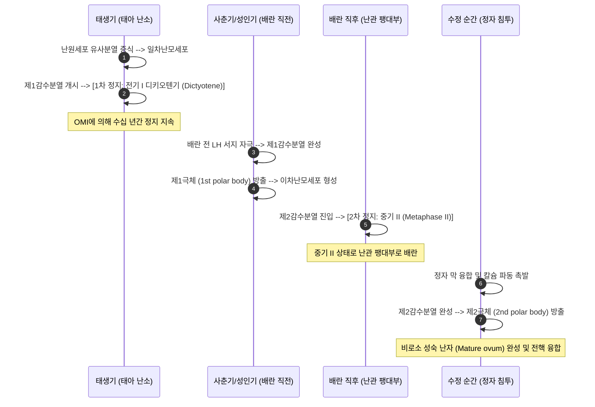
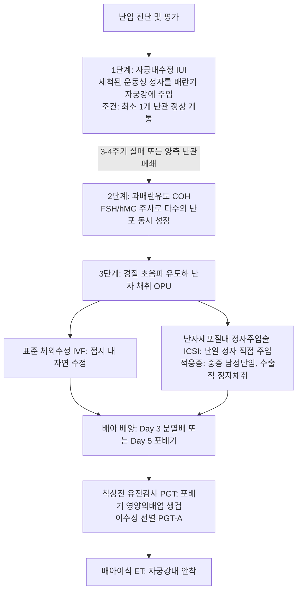

# 📑 [Netter Vol.1] Day 11: 난자와 생식의학 - 난자발생·수정·생식유전·난임평가·반복유산·보조생식(IVF) 및 피임학 (Section 11 완독)

> 📖 **원서 출처**: [The Netter Collection of Medical Illustrations - Volume 1, Reproductive System.pdf (pp. 232-240)](https://drive.google.com/file/d/1x-xTgPfUfiK7dsQyp5L5qfjFYSD_XyGm/view?usp=drivesdk)  
> 🏷️ **범위**: Section 11 전편 (Plate 11-1 ~ Plate 11-9, 총 9개 플레이트 전수 포함)  
> 📌 **핵심 테마**: 난모세포 감수분열 정지 기전(Prophase I Dictyotene $\rightarrow$ Metaphase II 배란 $\rightarrow$ 수정 시 완성), 수정 생리학(정자 수정능 획득, ZP3 결합 첨체반응, 피질반응 및 투명대 경화에 의한 다수정 차단), 초기 배아 염색체 이수성(Trisomy 16/21, Monosomy X), 난임 정의 및 원인 분류, 여성 난임 정밀 평가(AMH/AFC 난소예비능, HSG 난관개통도), 남성 난임 정액분석(WHO 6판) 및 정계정맥류, 반복유산(RPL) 5대 병인(항인지질항체증후군 APS 항응고 요법), 보조생식술(IUI $\rightarrow$ IVF 과배란유도 $\rightarrow$ ICSI $\rightarrow$ PGT 유전검사), 그리고 현대 피임학(복합경구피임제 COC의 배란억제, 미레나 IUD, 응급피임약 기전)

---

## 1. 개요 및 마스터 요약 (Executive Summary)

1. **난모세포의 독특한 2단계 감수분열 정지와 배란·수정**:
   - 일차난모세포는 태생기 난포형성 시 제1감수분열 전기인 **디키오텐기(Dictyotene stage of Prophase I)**에서 과립막세포의 OMI(Oocyte Maturation Inhibitor)에 의해 수십 년간 정지 상태로 유지됨.
   - 사춘기 이후 배란 직전 **LH 서지(LH surge)**의 자극으로 제1감수분열을 재개하여 **제1극체(First polar body)**를 방출하고, 즉시 제2감수분열로 진입하여 **중기 II(Metaphase II)**에서 다시 정지된 상태로 배란됨.
   - **제2감수분열 완성 및 제2극체 방출은 오직 '정자가 난자 내로 침입하여 수정(Fertilization)'될 때에만 촉발**됨.
2. **수정의 정밀 분자생물학적 시퀀스와 다수정 방지(Block to Polyspermy)**:
   - **수정능 획득 (Capacitation)**: 여성 생식기 내에서 정자 두부 콜레스테롤 제거 및 $\text{Ca}^{2+}$ 유입 $\rightarrow$ 과활성화 운동성 획득.
   - **첨체반응 (Acrosome Reaction)**: 투명대의 **ZP3 당단백질**과 결합하여 첨체 효소(Hyaluronidase, Acrosin)를 분비해 방사관과 투명대를 관통.
   - **융합 및 투명대 반응 (Zona Reaction)**: 정자의 Izumo1과 난자의 Juno 수용체 결합 $\rightarrow$ 난자 세포막 탈분극(급속 차단) 및 세포내 칼슘 파동 $\rightarrow$ 피질과립(Cortical granules)이 난황주위강으로 세포외유출되어 ZP2 절단 및 ZP3 변형 $\rightarrow$ **투명대 경화(Zona hardening)**로 추가 정자 진입을 완벽 차단(완만 차단).
3. **난임(Infertility)의 체계적 진단 알고리즘**:
   - **정의**: 피임 없이 정상적인 부부관계를 1년 이상 지속해도 임신이 되지 않는 상태 (여성 $\ge 35$세는 6개월).
   - **여성 난소예비능(Ovarian Reserve) 평가의 골드 스탠다드**:
     - **AMH (항뮐러관호르몬)**: 전포 및 초기 동난포에서 분비되며 생리 주기와 무관하게 안정적 측정 가능 (정상 $1.5\sim 4.0\text{ ng/mL}$, $< 1.0\text{ ng/mL}$ 시 난소기능저하 DOR).
     - **초음파상 동난포수(AFC)** 및 생리 2~3일째 혈청 FSH/E2.
   - **남성 평가**: WHO 6판 기준 정액검사(농도 $\ge 16\times 10^6/\text{mL}$, 전진운동성 $\ge 30\%$, 엄격기준 정상형태 $\ge 4\%$) 및 교정 가능한 주원인인 **정계정맥류(Varicocele)** 진찰.
4. **반복유산(RPL)과 항인지질항체증후군(APS)**:
   - 연속 2회 이상의 임신 손실.
   - 면역학적 원인인 **항인지질항체증후군(APS)**: 루푸스 항응고인자, 항카디오리핀 항체, 항$\beta_2$-당단백질I 항체 양성 $\rightarrow$ 태반 혈관 혈전증 및 태반 부전 유발 $\rightarrow$ **저용량 아스피린 + 저분자 헤파린(LMWH)** 병용 투여로 생존 출생률 $80\%$ 보장.
5. **보조생식술(ART) 및 피임학의 임상 원칙**:
   - 난관 개통성이 유지된 경증 난임은 **자궁내수정(IUI)**, 난관 폐쇄/중증 난임은 **체외수정(IVF-ET)**, 중증 남성 난임은 단일 정자를 직접 주입하는 **난자세포질내 정자주입술(ICSI)** 적용.
   - **피임 원칙**: 복합 경구피임제(COC)는 에스트로겐의 FSH 억제와 프로게스틴의 **LH 서지 억제(배란 차단)**가 주 기전임. **레보노르게스트렐 방출 IUD(미레나)**는 자궁경부 점액 비후 및 내막 위축을 유도하여 출혈 감소 효과를 겸비한 최고 효율 피임법.

---

## 2. 난자발생, 수정 및 생식유전학 (Plates 11-1 ~ 11-3)

### Plate 11-1 | 난모세포와 배란 (The Oocyte and Ovulation)

![[Netter_V1_Plate11-1.png]]

#### 1) 난자발생(Oogenesis)의 감수분열 정지 2단계
정자발생과 달리 난자발생은 태아기부터 시작되어 수십 년에 걸쳐 일어나는 불연속적인 분열 과정입니다:



#### 2) 난모세포 복합체(Cumulus-Oocyte Complex, COC)의 미세구조
- **방사관 (Corona radiata)**: 난모세포 외측을 감싸는 여러 층의 과립막세포(Cumulus cells). 세포간극 연접(Gap junctions)을 통해 아미노산, 포도당 등 대사 영양분을 공급.
- **투명대 (Zona pellucida)**:
  - 난모세포와 과립막세포가 공동 분비한 두께 $15\sim 20\,\mu\text{m}$의 당단백질 세포외 기질막.
  - **ZP1, ZP2, ZP3, ZP4**의 4대 당단백질로 구성.
  - **ZP3**: 종-특이적(Species-specific) **일차 정자 수용체(Primary sperm receptor)**로 작용하여 정자의 침봉 결합 및 첨체반응 촉발.
  - **ZP2**: 첨체반응을 마친 정자를 결합시키는 이차 수용체.
- **난황주위강 (Perivitelline space)**: 난포막(Oolemma)과 투명대 사이의 잠재적 틈새로, 감수분열 시 방출된 **제1극체**가 위치함.
- **피질과립 (Cortical granules)**: 난자 세포막 바로 아래 세포질에 밀집된 리소좀성 소포들로, 다수정 방지를 위한 단백분해효소(Ovastacin) 및 글리코시다아제 함유.

---

### Plate 11-2 | 수정 (Fertilization)

![[Netter_V1_Plate11-2.png]]

#### 1) 정자-난자 상호작용의 분자적 단계
수정은 난관 팽대부(Ampulla)에서 배란 후 $12\sim 24$시간 이내에 발생합니다:
1. **정자 수정능 획득 (Capacitation)**:
   - 여성 생식관(자궁 및 난관) 분비액에 노출되는 동안 정자 두부 원형질막의 콜레스테롤이 제거되고 당단백질 피복이 벗겨짐.
   - 막 투과성이 증가하여 $\text{Ca}^{2+}$ 및 $\text{HCO}_3^-$ 유입 $\rightarrow$ 아데닐산 고리화효소(sAC) 활성화 $\rightarrow$ cAMP 급증 $\rightarrow$ 편모의 채찍질 진폭이 극대화되는 **과활성화 운동성(Hyperactivation)** 획득.
2. **첨체반응 (Acrosome Reaction)**:
   - 과활성화된 정자가 방사관을 뚫고 난자 투명대의 **ZP3** 분자와 결합.
   - 정자 세포막과 첨체 외막이 다발성 융합을 일으키며 천공 형성 $\rightarrow$ 첨체 내 저장되어 있던 효소 분출:
     - **히알루로니다아제 (Hyaluronidase)**: 방사관 과립막세포 사이의 세포간질 용해.
     - **아크로신 (Acrosin)**: 강력한 트립신 유사 세린 단백분해효소로 투명대에 터널을 뚫고 통과.
3. **배아막 융합 (Gamete Membrane Fusion)**:
   - 정자 적도부(Equatorial segment)의 막 단백질인 **Izumo1**이 난자 막 수용체인 **Juno (Folate receptor 4)** 및 **CD9** 사량체 복합체와 도킹하여 세포막 융합 완성.

#### 2) 다수정 방지 기전 (Block to Polyspermy)
단 하나의 정자만이 수정되어 정상 2배체($2n=46$)를 유지하도록 보장하는 정밀한 2중 차단벽:
- **급속 전기적 차단 (Fast block to polyspermy)**:
  - 정자 막 융합 수 초 이내에 난자 막의 $\text{Na}^+$ 채널 개방 $\rightarrow$ 막 전위가 $-70\text{ mV}$에서 **$+20\text{ mV}$로 급속 탈분극**.
  - 양전하를 띤 난자 막은 추가 정자의 융합을 일시적으로 전기적 반발력으로 밀어냄. (포유류에서는 완만 차단이 주 기전).
- **완만 화학적 차단 / 투명대 반응 (Slow block / Zona Reaction)**:
  - 침투한 정자 머리에서 분비된 **포스포리파아제 C-제타 (PLC-$\zeta$)**가 난자 세포질의 $\text{IP}_3$ 수용체를 자극하여 소포체로부터 **주기적인 $\mathbf{Ca^{2+}}$ 진동파(Calcium oscillations)** 촉발.
  - 칼슘 급증으로 수천 개의 **피질과립(Cortical granules)**이 난황주위강으로 세포외유출(Exocytosis)됨.
  - 방출된 효소인 **오바스타신(Ovastacin)**이 ZP2를 절단하고 ZP3의 당사슬을 변형시킴 $\rightarrow$ 투명대가 화학적으로 단단하게 굳어지는 **투명대 경화 (Zona hardening)** 완성.
  - 어떠한 추가 정자도 투명대에 결합하거나 효소로 뚫을 수 없게 됨.

---

### Plate 11-3 | 생식유전학 (Genetics of Reproduction)

![[Netter_V1_Plate11-3.png]]

#### 1) 초기 자연유산의 염색체 이상과 모체 연령 효과
- **초기 자연유산(임신 1분기 유산)의 $50\sim 60\%$는 배아의 염색체 수적 이상(Aneuploidy)에 기인**:
  1. **상염색체 삼염색체증 (Autosomal Trisomy, 50%)**:
     - **Trisomy 16**: 자연유산 배아에서 가장 흔히 발견되는 삼염색체증 (100% 치사형, 출생 불가).
     - Trisomy 21 (다운 증후군), Trisomy 18 (에드워드 증후군), Trisomy 13 (파타우 증후군): 생존 출생 가능.
  2. **성염색체 단염색체증 (Monosomy X, 45,X, 10%)**:
     - 단일 염색체 이상 중 가장 높은 빈도. 터너 증후군 배아의 $99\%$는 임신 초기 자연유산됨.
  3. **다배수체 (Polyploidy, 15~20%)**:
     - 3배수체(Triploidy, 69,XXY/XXX) - 난자 1개에 정자 2개가 동시 수정되는 이수정(Dispermy)이 주원인 (부분포상기태 유발).
- **모체 연령과 감수분열 비분리 (Meiotic Nondisjunction)**:
  - 난모세포가 디키오텐기에 머무는 기간이 길어질수록(만 35세 이상) 염색체 동원체(Kinetochore) 및 코헤신(Cohesin) 단백질의 노화로 **제1감수분열 비분리(Nondisjunction)** 빈도가 기하급수적으로 급증.

---

## 3. 난임의 병인 및 남녀 정밀 평가 (Plates 11-4 ~ 11-6)

### Plate 11-4 | 불임의 원인 분류 (Infertility I — Causes)

![[Netter_V1_Plate11-4.png]]

#### 1) 난임의 정의 및 원인학적 역학 분포
- **임상적 정의**: 피임 없이 정상적인 성생활을 유지하였음에도 **1년 이내에 임신에 도달하지 못하는 상태** (여성 파트너 연령이 만 35세 이상인 경우 조기 개입을 위해 **6개월**로 단축).
- **원인 분포율**:
  - **여성 인자 ($40\sim 45\%$)**: 배란 장애($35\%$), 난관 및 복막 인자($35\%$, PID/자궁내막증), 자궁 인자($15\%$, 점막하근종/용종/유착), 경부 인자($5\%$).
  - **남성 인자 ($30\sim 40\%$)**: 정액 이상(무정자증, 핍정자증, 무력정자증), 정계정맥류, 잠복고환, 유전 질환.
  - **양측 복합 인자 ($15\sim 20\%$)**: 남녀 모두에게 이상 소견이 중첩.
  - **원인불명 난임 (Unexplained Infertility, $10\sim 15\%$)**: 기본 검사(정액검사, 배란 확인, 난관개통도, 자궁강 검사)가 모두 정상임에도 임신이 되지 않는 경우.

---

### Plate 11-5 | 여성 난임 평가 (Infertility II — Evaluation Female)

![[Netter_V1_Plate11-5.png]]

#### 1) 여성 난임의 3대 필수 검사 체계

| 평가 영역 | 표준 검사 항목 | 임상 판독 기준 및 해석 |
| :--- | :--- | :--- |
| **1. 배란 여부 확인**<br>(Ovulation) | **황체기 중기 혈청 프로게스테론**<br>(배란 후 7일째, 28일 주기 기준 21일째) | **$\mathbf{> 3\text{ ng/mL}}$: 배란 확인**<br>($> 10\text{ ng/mL}$: 양호한 황체 기능)<br>소변 LH 자가진단 키트(LH surge 감지) |
| **2. 난소 예비능 평가**<br>(Ovarian Reserve) | **혈청 AMH (항뮐러관호르몬)**<br>(생리 주기 무관 측정 가능) | **정상: $1.5\sim 4.0\text{ ng/mL}$**<br>**$\mathbf{< 1.0\text{ ng/mL}}$: 난소기능저하 (DOR)**<br>$> 5.0\text{ ng/mL}$: 다낭성난소증후군(PCOS) 의심 |
| | **질식 초음파상 동난포수 (AFC)**<br>(생리 2~3일째 $2\sim 10\text{ mm}$ 난포 개수 합) | **양측 합계 $< 5\sim 7$개**: 난소 예비능 감소<br>양측 합계 $> 20$개: PCOS 소견 |
| | **생리 2~3일째 혈청 FSH 및 $\text{E}_2$** | **기저 $\text{FSH} > 10\sim 15\text{ mIU/mL}$**: 난소 기능 부전 시사<br>기저 $\text{E}_2 > 60\sim 80\text{ pg/mL}$: FSH 억제된 위음성 주의 |
| **3. 난관 및 자궁강 평가**<br>(Anatomy) | **자궁난관조영술 (HSG)**<br>(생리 종료 후 배란 전 6~11일째) | 양측 난관의 조영제 개통 및 복강내 확산 확인<br>난관수종, 자궁강내 용종, 점막하 근종, 유착 결손 감별 |
| | **식염수 주입 자궁초음파 (SIS)** | 자궁강내 점막하 근종 및 자궁내막 용종 감별의 최고 민감도 |

---

### Plate 11-6 | 남성 난임 평가 (Infertility III — Evaluation Male)

![[Netter_V1_Plate11-6.png]]

#### 1) WHO 정액분석 6판(2021) 기준치 및 진찰 항목
- **검사 전제 조건**: 최소 2~7일간의 금욕 기간 준수, 검체 채취 후 1시간 이내 검사. 생물학적 변동성을 감안하여 최소 2주 간격으로 **2회 이상 반복 시행**.

| 정액 지표 | WHO 6판 하위 5백분위 기준치 (Lower Reference Limits) | 이상 소견 명칭 |
| :--- | :--- | :--- |
| **사정액 용적 (Volume)** | **$\ge 1.4\text{ mL}$** | 저용적증 (Hypospermia, 사정관폐색/역행성사정 의심) |
| **정자 농도 (Concentration)** | **$\ge 16 \times 10^6/\text{mL}$** | 핍정자증 (Oligozoospermia) |
| **총 정자수 (Total count)** | **$\ge 39 \times 10^6/\text{ejaculate}$** | 핍정자증 |
| **전진 운동성 (Progressive motility)** | **$\ge 30\%$** (총 운동성 $\ge 42\%$) | 무력정자증 (Asthenozoospermia) |
| **정상 형태 (Strict morphology)** | **$\ge 4\%$** (크루거 엄격 기준) | 기형정자증 (Teratozoospermia) |
| **생존율 (Vitality)** | **$\ge 54\%$** | 괴사정자증 (Necrozoospermia) |

#### 2) 정계정맥류 (Varicocele)의 중요성
- 남성 불임 환자의 **$35\sim 40\%$에서 발견되는 가장 흔한 치료 가능한 원인**.
- 덩굴정맥동(Pampiniform plexus)의 판막 부전으로 좌측 신정맥에서 혈액이 역류 $\rightarrow$ **고환 온도 상승, 저산소증, 정맥 울혈 및 산화 스트레스(ROS)** $\rightarrow$ 정자 생성 및 DNA 완전성 파괴.
- **수술적 미세현미경하 서혜하부 정계정맥류 절제술(Subinguinal microsurgical varicocelectomy)** 시행 시 $60\sim 70\%$에서 정액 지표 개선 및 자연 임신율 향상.

---

## 4. 반복 유산 및 보조생식술 (Plates 11-7 ~ 11-8)

### Plate 11-7 | 반복 유산 (Recurrent Abortion / Recurrent Pregnancy Loss — RPL)

![[Netter_V1_Plate11-7.png]]

#### 1) 반복유산의 5대 병인 및 항인지질항체증후군(APS)
- **정의**: 초음파상 임신낭이 확인된 임신의 **연속 2회 이상 임신 손실** (ASRM/ESHRE 가이드라인).
- **5대 핵심 병인군**:
  1. **부모의 염색체 구조 이상 ($3\sim 5\%$)**: 부부 중 한쪽의 **균형 보좌 전좌(Balanced reciprocal translocation)** 또는 로버트슨 전좌(Robertsonian translocation) $\rightarrow$ 감수분열 시 염색체 결손/중복 배아 형성 $\rightarrow$ 부부 핵형(Karyotyping) 분석 필수.
  2. **해부학적 자궁 기형 ($15\sim 20\%$)**: **중격자궁(Septate uterus, 가장 높은 유산율)**, 점막하 근종, 아셔만 증후군, 자궁경관무력증(IIOC).
  3. **내분비 이상 ($10\sim 15\%$)**: 조절되지 않는 당뇨병, 갑상선기능저하증(자가항체 TPO 양성), 황체기 결함.
  4. **자가면역 인자: 항인지질항체증후군 (APS, $15\sim 20\%$)**:
     - **가장 확실하게 치료 가능한 후천성 병인**.
     - **진단 기준 (임상 기준 1개 + 검사실 기준 1개)**:
       - 임신 10주 이전 3회 이상 연속 원인불명 유산, 또는 임신 10주 이후 형태학적 정상 태아의 자궁내 사망, 또는 전자간증/태반부전으로 인한 34주 이전 조산.
       - **루푸스 항응고인자(Lupus anticoagulant)**, **항카디오리핀 항체(aCL IgG/IgM)**, **항$\beta_2$-당단백질I 항체** 중 1개 이상이 12주 간격으로 2회 이상 양성.
     - **표준 치료**: **저용량 아스피린 ($100\text{ mg/day}$) + 예방적 저분자 헤파린 (LMWH, Enoxaparin)** 임신 전 기간 병용 투여 $\rightarrow$ 유산율을 낮추고 생존 출생률을 $80\%$까지 향상.
  5. **원인불명 (Idiopathic, 약 $50\%$)**: 배아 염색체 이수성이 대다수를 차지하며, 착상기 프로게스테론 보충요법 시행.

---

### Plate 11-8 | 보조생식술 (Assisted Reproduction — IUI, IVF, ICSI, PGT)

![[Netter_V1_Plate11-8.png]]

#### 1) 난임 치료의 단계적 사다리 (ART Spectrum)



1. **자궁내수정 (Intrauterine Insemination, IUI)**:
   - 남편 정액에서 운동성이 우수한 정자만을 원심분리 세척하여 농축시킨 후, 가느다란 카테터를 통해 자궁강 내부로 직접 주입. (자궁경부 점액 장벽 우회).
   - 적응증: 경증 남성 난임, 경부 인자, 원인불명 난임. **(주의: 최소 1개 이상의 난관이 완전히 개통되어 있어야 함)**.
2. **체외수정 및 배아이식 (IVF-ET)**:
   - 과배란유도 $\rightarrow$ 난자 채취 $\rightarrow$ 시험관 내 배양 및 수정 $\rightarrow$ 배아를 자궁 내로 이식.
   - 적응증: 양측 난관 폐쇄 또는 난관 절제 상태, 중증 자궁내막증, IUI 실패.
3. **난자세포질내 정자주입술 (Intracytoplasmic Sperm Injection, ICSI)**:
   - 도립현미경 하에서 미세조작기(Micromanipulator)를 이용하여 가장 형태가 온전한 **단 1개의 정자를 포획해 성숙 난자(Metaphase II)의 세포질 내로 미세바늘로 직접 찔러 주입**.
   - 적응증: 극심한 핍호/무력정자증, 비폐색성 무정자증 환자의 고환 미세추출 정자(micro-TESE), 과거 IVF 수정 실패군.
4. **착상전 유전검사 (Preimplantation Genetic Testing, PGT)**:
   - 배반포(포배기, Day 5~6) 단계에서 장차 태반이 될 **영양외배엽(Trophectoderm) 세포 $5\sim 8$개를 떼어내어(Biopsy)** 유전체 분석:
     - **PGT-A**: 염색체 이수성(Aneuploidy) 선별 $\rightarrow$ 정상 배아만 이식하여 고령 임산부 유산율 감소.
     - **PGT-M**: 부모가 보인자인 단일유전자 유전질환(혈우병, 낭포성섬유증 등)의 이환 배아 배제.

---

## 5. 피임학 (Plate 11-9)

### Plate 11-9 | 피임학 (Contraception)

![[Netter_V1_Plate11-9.png]]

#### 1) 주요 피임법의 작용 기전, 펄 지수(Pearl Index) 및 금기증

| 피임 방법 | 핵심 작용 기전 | 실패율 (완벽 사용 시) | 임상적 장점 및 특이 금기증 |
| :--- | :--- | :--- | :--- |
| **복합 경구피임제**<br>(COC: 에스트로겐 + 프로게스틴) | **1. 프로게스틴: LH 서지 억제 $\rightarrow$ 배란 차단**<br>2. 에스트로겐: FSH 억제 $\rightarrow$ 난포 동원 차단<br>3. 자궁경부 점액 농축 및 내막 위축 | **$0.3\%$** | 생리통 및 생리과다 완화, 난소암/내막암 예방<br>⚠️ **금기(WHO Cat 4): 만 35세 이상 흡연자 (혈전색전증/뇌졸중 위험)**, 혈전증 병력, 조짐성 편두통 |
| **자궁내장치 (IUD)**<br>- **레보노르게스트렐 방출형**<br>(미레나, 카일리나) | 자궁 내 국소 고농도 프로게스틴 방출:<br>- 경부 점액을 끈적하게 만들어 정자 침투 원천 봉쇄<br>- **자궁내막의 극심한 탈락막화 및 위축** | **$0.1\sim 0.2\%$** | **5~8년간 장기 피임 유지**<br>**월경과다 및 자궁선근증 환자의 일차 내과적 치료제**<br>(사용 1년 후 20~50%에서 무경월경 도달) |
| **자궁내장치 (IUD)**<br>- **구리 IUD**<br>(ParaGard) | 구리 이온의 정자 독성(살정 작용) 및 자궁내막 무균성 이물 염증 반응으로 착상 방해 | **$0.6\%$** | 비호르몬성 피임법 (호르몬 부작용 없음, 10년 유지)<br>월경통 및 월경량 증가 가능<br>**성교 후 5일 이내 응급피임법으로 적용 가능 (효과 99%)** |
| **피하 이식제**<br>(넥스플라논, Nexplanon) | 상완 피하에 에토노게스트렐 단일 로드 삽입:<br>지속적 배란 억제 및 경부 점액 점도 증가 | **$< 0.05\%$**<br>(가장 완벽한 가역적 피임) | 3~5년간 유지. 순응도 필요 없음. 부정출혈 빈발 |
| **영구 피임술**<br>(난관결찰술 / 정관절제술) | 난관 결찰 및 절제 (Pomeroy/Parkland 술식)<br>정관 결찰 및 절단 | $< 0.5\%$ | 영구적 불임 유도<br>(기회적 난관절제술 Opportunistic salpingectomy 시행 시 난소암 발생률 급감) |

#### 2) 응급 피임법 (Emergency Contraception, EC)의 감별
무방비 성교 후 원치 않는 임신을 막기 위한 응급 처치:
1. **구리 자궁내장치 (Copper IUD)**:
   - **가장 효과적인 응급피임법 (실패율 $< 0.1\%$)**.
   - 성교 후 **최대 5일(120시간) 이내**에 자궁 내 삽입 시 착상을 차단하며, 향후 10년간 장기 피임으로 지속 사용 가능.
2. **울리프리스탈 아세테이트 (Ulipristal acetate, 엘라원 Ella)**:
   - **선택적 프로게스테론 수용체 조절제 (SPRM)**.
   - 성교 후 **최대 120시간(5일) 이내** 단회 복용.
   - **LH 서지가 이미 시작된 후에도 배란을 효과적으로 지연/차단**할 수 있어 레보노르게스트렐보다 우수한 피임 효과 유지.
3. **레보노르게스트렐 (Levonorgestrel, 노레보/플랜B $1.5\text{ mg}$)**:
   - 성교 후 **최대 72시간(3일) 이내** 복용 (24시간 이내 복용 시 가장 높은 효과).
   - LH 서지 이전에만 배란을 지연시킬 수 있으며, 이미 LH 서지가 시작된 후에는 효과가 급격히 떨어짐.

---

## 6. 로컬 이미지 추출 자동화 스크립트 (Python snippet)

원서 PDF(`The Netter Collection of Medical Illustrations - Volume 1, Reproductive System.pdf`)에서 Section 11에 해당하는 9개 플레이트 고해상도 이미지를 추출하여 `첨부파일` 폴더에 일괄 저장할 수 있는 로컬 실행용 Python 코드입니다:

```python
import fitz  # PyMuPDF
import os

pdf_path = "The Netter Collection of Medical Illustrations - Volume 1, Reproductive System.pdf"
output_dir = "./헤르메스/책 읽기/Netter_Vol1_생식기계/첨부파일"
os.makedirs(output_dir, exist_ok=True)

doc = fitz.open(pdf_path)

# Section 11 전체 플레이트 목록 (Plate 11-1 ~ Plate 11-9, 총 9개)
plates_info = [
    ("Plate11-1", "The Oocyte and Ovulation"),
    ("Plate11-2", "Fertilization"),
    ("Plate11-3", "Genetics of Reproduction"),
    ("Plate11-4", "Infertility I - Causes"),
    ("Plate11-5", "Infertility II - Evaluation Female"),
    ("Plate11-6", "Infertility III - Evaluation Male"),
    ("Plate11-7", "Recurrent abortion"),
    ("Plate11-8", "Assisted Reproduction"),
    ("Plate11-9", "Contraception"),
]

for plate_id, plate_title in plates_info:
    target_page = None
    search_term = f"Plate 11-{plate_id.split('-')[1]}"
    
    for page_num in range(len(doc)):
        text = doc[page_num].get_text()
        if search_term in text or plate_title.lower() in text.lower():
            target_page = page_num
            break
            
    if target_page is not None:
        page = doc[target_page]
        pix = page.get_pixmap(matrix=fitz.Matrix(3.0, 3.0))  # 300 DPI 상당
        img_name = f"Netter_V1_{plate_id}.png"
        save_path = os.path.join(output_dir, img_name)
        pix.save(save_path)
        print(f"[추출 성공] {img_name} (PDF p.{target_page+1})")
    else:
        print(f"[검색 실패] {plate_id}: {plate_title}")

doc.close()
print("=== Section 11 9개 플레이트 이미지 추출 완료 ===")
```
