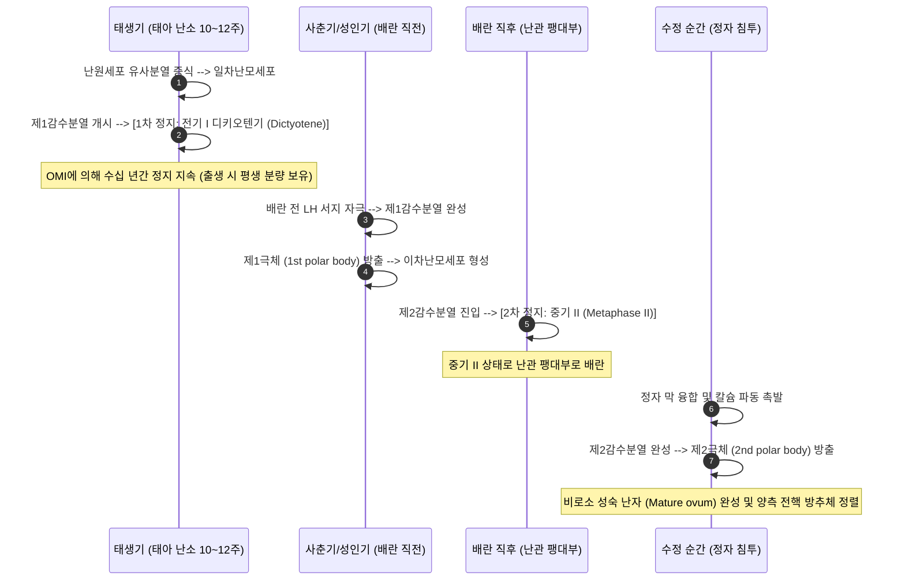
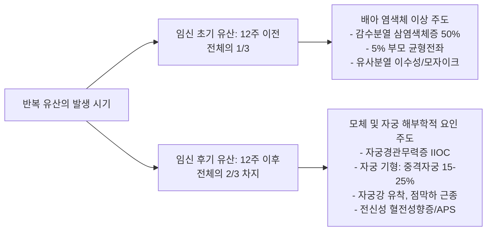
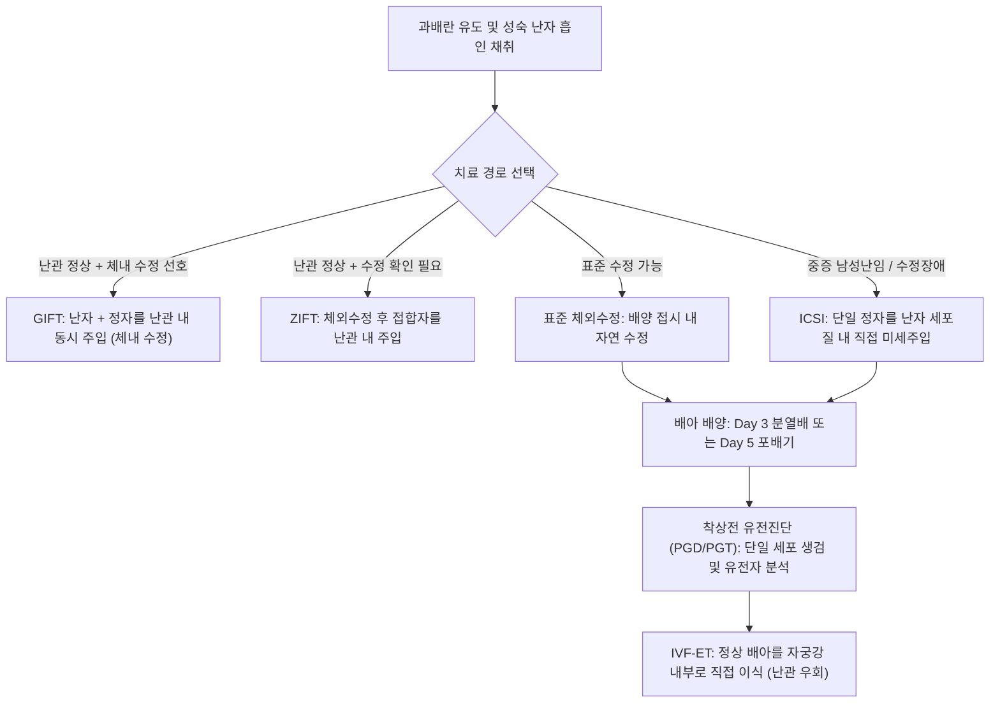

# 📑 [Netter Vol.1] Day 11: 난자와 생식의학 - 난자발생·수정·생식유전·난임평가·반복유산·보조생식(IVF) 및 피임학 (Section 11 완독)

> 📖 **원서 출처**: [The Netter Collection of Medical Illustrations - Volume 1, Reproductive System.pdf (pp. 232-240)](https://drive.google.com/file/d/1x-xTgPfUfiK7dsQyp5L5qfjFYSD_XyGm/view?usp=drivesdk)
> 🏷️ **범위**: Section 11 전편 (Plate 11-1 ~ Plate 11-9, 총 9개 플레이트 전수 포함)
> 📌 **핵심 테마**: 난포성장 주기(375일/13주기)와 배란 기전(난포액 1~3mL 급팽창, 콜라게나아제/프로스타글란딘, 피질 평활근 수축), 난모세포 감수분열 정지(Dictyotene $\rightarrow$ Metaphase II $\rightarrow$ 수정 시 완성), 수정 생리학(프로게스테론 결합 화학주성, 첨체반응, 전핵 형성 및 방추체 정렬, 난할 20시간, 부화 및 착상 3일, 최기형성 All-or-None), 생식유전학(남녀 배우자형성 대비, 태생 10~12주 난모세포 감수분열, 4분체 교차 및 유전자 연쇄 거리, 멘델식 우열과 단백질 역치), 난임 역학 및 원인(80~90% 1년 수태, 일차성 vs 이차성 예후 차이, 50% 무증상 난관인자, 뇌하수체 편평 호르몬선), 여성 난임 정밀 평가(HSG vs 복강경 색소통액, 사정후검사 PCT, AMH/AFC 난소예비능), 남성 난임 정밀 평가(50% 기여, 2% 치명적 기저질환, 80% 고환용적=세정관, 70~80일 정자형성주기, WHO 6판 기준, 정계정맥류 기립/앙와위 진찰, TRUS, 과당검사, SPA/HZA), 반복유산(RPL 0.4~0.8%, 70% 차기 정상임신, 2/3가 12주 이후 발생, APS 아스피린+헤파린 요법, 불필요한 배양/HLA 배제), 보조생식술(85~90% 비ART 치료, 성교빈도와 가임력, 과배란 유도제 및 다태임신 40%, IUI/GIFT/ZIFT/IVF/ICSI/PGD 비교, 낭포성섬유증 여성보인자 검사), 현대 피임학(미국 임신 49% 비의도적, 수정억제제 vs 배란/착상억제제, 청소년 LARC, 35세 이상 경구피임약 지침, 구리 IUD 응급피임 최대 10일).

---

## 1. 개요 및 마스터 요약 (Executive Summary)

1. **난포 성장(Folliculogenesis)의 장기 주기와 배란·황체의 내분비학 (Plate 11-1)**:
   - 원시난포가 배란에 이르는 과정은 약 **375일(13개 월경주기)**이 소요되며, 난포기와 황체기의 양방향 호르몬 피드백을 통해 **월경 주기 5~7일째 단 하나의 우성난포(Dominant follicle)**가 선택됨 (모체 연령 증가는 다배란 빈도 증가와 연관).
   - 배란 직전 LH 서지에 의해 난포액이 **$1\sim 3\text{ mL}$로 급격히 팽창**하고, 난포막세포에서 **콜라게나아제, 플라스민, 프로테아제 및 프로스타글란딘($\text{PGE}_2, \text{PGF}_{2\alpha}$)**이 분비되어 난소 기저막을 침식하고 피질 평활근 수축을 유발하여 난포를 파열시킴.
   - 배란 후 황체화 과립막세포는 배란 후 약 **10일째 에스트로겐/프로게스테론 분비 정점**에 도달하며, 비임신 시 **14~15일째 퇴행(Luteolysis)**함 (오직 태반 유래 hCG만이 황체 퇴행을 구원).
2. **수정 생리학, 초기 난할 및 착상 동역학 (Plate 11-2)**:
   - 난관 팽대부에서 정자 두부 수용체에 **프로게스테론이 결합하여 화학주성(Chemotaxis)**을 형성하고 운동성을 극대화함. 첨체반응 시 히알루로니다아제, **뉴라미니다아제(Neuraminidase)**, 아크로신이 분비됨.
   - 정자 침투 후 피질과립(Coronal/Cortical granules) 세포외유출로 투명대 경화(다수정 방지)가 일어나며, **정자 두부는 팽창하여 웅성 전핵**을 형성함.
   - **양측 전핵은 물리적으로 융합하지 않고 핵막이 소실된 후 방추체 상에 염색체가 직접 정렬**하여 제1 유사분열(난할, Cleavage)을 개시함. 최초 2세포기 형성에 **20시간**이 소요됨.
   - 수정란은 **3~4일간 난관을 이동**하여 자궁강에 진입하고, 포배기(Blastula)의 초기 영양외배엽이 투명대를 효소로 소화·탈출(Hatching)하여 **자궁강 진입 약 3일 후(수정 후 6~7일경) 착상**함. 이 기간의 독소/방사선 노출은 **'All-or-None(전무 아니면 치사)'** 법칙을 따름.
3. **생식유전학의 본질적 기전 (Plate 11-3)**:
   - **남녀 배우자형성의 대비**: 남성은 사춘기 이후 평생에 걸쳐 매일 수억 개의 정자(1개 정원세포당 4개 반수체 정자)를 생성하나, 여성은 **태생 10~12주에 제1감수분열 전기(Prophase I)에 진입**하여 출생 후 수십 년간 정지(Dictyotene) 상태를 유지하며 1개 난포당 단 1개의 성숙 난자만을 배출함.
   - **유전적 다양성**: 제1감수분열 전기의 **상동염색체 접합에 의한 4분체(Tetrad) 형성 및 키아스마(Chiasma)에서의 교차(Crossing over)**와 상동염색체 독립 분리에 의해 확보됨. 유전자 간 물리적 거리가 멀수록 독립적 유전 성향이 강해짐.
4. **난임의 체계적 역학 및 남녀 정밀 진단 (Plates 11-4 ~ 11-6)**:
   - **자연 수태율**: 정상 부부의 **80~90%는 1년 내, 92~95%는 2년 내에 임신**에 도달함. 1년(여성 35세 이상은 6개월) 이상 실패 시 난임으로 정의.
   - **일차성 vs 이차성 난임**: 과거 임신 기왕력이 없는 일차성 난임은 6년 치료 후에도 임신율이 $<40\%$이나, 이차성 난임은 3년 내 $>50\%$ 임신 성공. 특히 **여성 난관 인자의 50%는 골반염이나 수술 기왕력이 전혀 없는 '무증상(Silent) 질환'**임.
   - **남성 인자의 위중성**: 난임 원인의 50%를 차지하며, **환자의 2%에서 고환암이나 뇌하수체 종양 등 생명을 위협할 수 있는 중대 질환이 발견**됨. 고환 용적의 **80%가 정자생성 세정관**이므로 위축은 곧 정자생성 부전을 반영함. 정자형성 주기는 **70~80일**이 소요되므로 정액검사는 2~3개월 전 상태를 반영.
   - 진단 도구: 난관 평가(루빈 검사 폐기 $\rightarrow$ HSG 및 복강경하 색소통액검사), 배란 평가(소변 LH 키트, 황체기 P4, 연속 난포 초음파; 과거의 자궁내막 생검 dating 및 질세포진은 폐기), 사정후검사(PCT: ferning 및 spinnbarkeit 확인; ART 보편화로 임상 비중 감소), 음낭 신체진찰(정계정맥류는 기립위/앙와위 비교 진찰).
5. **반복유산(RPL)과 보조생식술(ART) (Plates 11-7 ~ 11-8)**:
   - **반복유산의 역학**: 가임기 여성의 0.4~0.8%에서 발생. 원인불명군(40~50%)도 치료 없이 **차기 정상 임신율이 70%**에 달함. 유산의 **2/3는 임신 12주 이후 발생**하며 모체/자궁 인자가 주도(12주 이전 초기 유산은 배아 염색체 이상 주도). 자궁내막 세균배양 및 부부 HLA 검사는 불필요/비권장. APS는 **아스피린 + 헤파린(5000 U SC bid)** 병용.
   - **보조생식 원칙**: 난임 부부의 **85~90%는 일반 내외과적 치료 및 성교 타이밍 조절(주 4회 이상 성교 시 6개월 내 80% 임신 vs 주 1회 미만 시 15%)**로 해결 가능.
   - ART 스펙트럼: IUI(배란 24시간 내), GIFT(난자와 정자를 난관 내 직접 주입, 체내 수정), ZIFT(체외수정란을 난관 내 주입), IVF-ET(자궁강 직접 이식, 난관폐쇄 우회), ICSI(단일 정자 주입), PGD/PGT. 폐색성 무정자증(CFTR 변이 시 여성 파트너 보인자 검사 필수)과 비폐색성 무정자증(클라인펠터 증후군 47,XXY 등)의 감별.
6. **현대 피임학의 다면적 접근 (Plate 11-9)**:
   - 미국 임신의 49%가 비의도적 임신이며, 피임을 전혀 하지 않는 10%의 여성이 비의도적 임신의 50% 이상을 유발함.
   - 피임법의 2대 대분류: **수정 억제제(Fertilization inhibitors: 콘돔, 다이아프램, 질 스펀지, 살정제, 질외사정, 주기법, 영구불임술)** vs **배란 및 착상 억제제(Ovulation & implantation inhibitors: 복합 경구피임제, 피임패치, 질링, 피하이식봉, IUDs, 응급피임약)**.
   - 특수군 지침: 청소년은 순응도 무관한 **LARC(IUD, 임플란트)** 권장, 35세 이상 비흡연 여성은 저용량 경구피임약 폐경까지 유지 가능. 구리 IUD는 배란기 성교 후 **최대 10일 이내** 삽입 시에도 응급피임 효과 발휘.

---

## 2. 난자발생, 수정 및 생식유전학 (Plates 11-1 ~ 11-3)

### Plate 11-1 | 난모세포와 배란 (The Oocyte and Ovulation)

![[Netter_V1_Plate11-1.png]]

#### 1) 난포발달(Folliculogenesis)의 375일 주기와 우성난포 선택
- **난포 발달의 장기 타임라인**: 미발달 상태의 휴면 원시난포(Primordial follicle)가 동원되어 성숙 배란에 도달하기까지는 **약 375일(13개 월경주기)**의 긴 기간이 소요됩니다.
- **우성난포(Dominant follicle)의 단일화 선택**:
  - 시상하부-뇌하수체-난소 축의 양방향 호르몬 피드백을 통해 매 주기마다 **월경 주기 5~7일째 단 하나의 우성난포가 확립**됩니다.
  - **모체 연령 효과**: 고령 산모일수록 배란 시 난포가 2개 이상 동시 방출되는 빈도가 유의하게 증가하여 이란성 쌍태아(Fraternal twins) 임신율이 상승합니다.
- **성숙 그라프 난포(Mature Graafian follicle)의 조직학적 층위 구조**:
  1. **난모세포 (Oocyte)**: 제1감수분열 전기에 정지된 상태.
  2. **방사관 (Corona radiata)**: 난모세포를 직접 둘러싼 과립막세포 층.
  3. **난포벽 과립막세포 (Mural granulosa cells)**: 난포 내벽을 형성하며 에스트로겐 합성 담당.
  4. **기저막 (Basal lamina)**: 과립막세포층과 난포막세포층을 물리적으로 격리하는 보호막.
  5. **모세혈관망 (Capillary plexus)**: 난포막내층과 외층 사이에 풍부하게 발달하여 호르몬 및 기질 공급.
  6. **난포막내층 (Theca interna) 및 난포막외층 (Theca externa)**: LH 수용체를 발현하여 안드로겐을 합성하고 난소 기질 지지.
  7. **난포동 (Antrum)**: 히알루론산과 스테로이드가 농축된 난포액(Follicular fluid)으로 채워진 거대 강.
- **배란 직전(Preovulatory phase)의 세포학적·내분비적 변화**:
  - 과립막세포는 현저히 비대해지며 세포질 내에 **지질 봉입체(Lipid inclusions)**를 축적함.
  - 난포막세포층은 혈관 분포가 극대화되며 세포질의 **공포형성(Vacuolization)**을 겪음.
  - **인히빈(Inhibin) 분비 조절의 전환**: FSH 감소에 대응하여 인히빈 생성이 **LH 조절 체계로 전환**됨으로써 FSH가 급감하는 황체형성기에도 난포 및 황체 기능이 유지됨.

#### 2) 난자발생(Oogenesis)의 감수분열 정지 2단계
정자발생과 달리 난자발생은 태아기부터 시작되어 수십 년에 걸쳐 일어나는 불연속적인 분열 과정입니다:



#### 3) 난포 파열(배란)의 생화학적·생체역학적 기전
- **난포액의 급속 팽창**: 서서히 축적되던 난포액은 LH 서지와 난포벽 탄성 변화에 반응하여 **$1\sim 3\text{ mL}$까지 급격히 팽창**함.
- **효소적 난소 피질 침식 및 평활근 수축**:
  - 난포막세포와 과립막세포에서 **단백분해효소(Proteases), 콜라게나아제(Collagenase), 플라스민(Plasmin)**이 분비되어 난포를 덮고 있는 난소 표면 상피와 기저막 캡슐을 약화시킴.
  - 국소적으로 방출된 **프로스타글란딘 $\text{E}_2$ ($\text{PGE}_2$), 프로스타글란딘 $\text{F}_{2\alpha}$ ($\text{PGF}_{2\alpha}$) 및 기타 에이코사노이드(Eicosanoids)**가 난소 피질의 평활근 수축을 자극하여 난포 파열 및 난자 배출을 촉진함.
  - ⚠️ **임상적 원칙**: 충분히 성숙하지 못한 난포는 LH 서지가 발생하더라도 배란에 도달하지 못함. 배란된 난모세포-방사관 복합체는 난관채(Fimbria)에 포획되어 난관 내부로 운송됨.

#### 4) 황체(Corpus Luteum) 형성 및 내분비 피드백
- **황체 형성**: 파열된 난포 내벽의 과립막세포와 난포막세포가 LH 자극으로 황체화(Luteinization)되어 혈체(Corpus hemorrhagicum) 강을 채우며 증식함.
- **호르몬 정점과 퇴행**:
  - 배란 후 **약 10일째에 에스트로겐과 프로게스테론 생성이 최고조**에 도달함.
  - 수정 및 착상이 일어나지 않으면 배란 후 **약 14~15일째 황체 퇴행(Luteolysis)**이 완료되어 백체(Corpus albicans)로 변함.
  - **hCG의 황체 구조 (Rescue)**: 황체의 자가 퇴행을 막고 프로게스테론 분비를 지속시킬 수 있는 유일한 인자는 영양외배엽이 분비하는 인간 융모성 성선자극호르몬(hCG)임.
- **음성 피드백과 단일 배란 보장**:
  - 황체에서 분비되는 고농도의 에스트로겐, 프로게스테론, 인히빈이 시상하부의 GnRH 분비와 뇌하수체의 FSH/LH 분비를 강력히 억제함.
  - 이 억제 기전으로 인해 동일 주기에 다른 동포 난포들이 추가로 성숙하여 배란되는 것을 원천 차단함 (이 시스템의 억제 실패 시 이란성 쌍태아가 유발됨).

---

### Plate 11-2 | 수정 (Fertilization)

![[Netter_V1_Plate11-2.png]]

#### 1) 정자-난자 상호작용의 분자적 단계 및 화학주성
수정은 난관 팽대부(Ampulla)에서 배란 후 $12\sim 24$시간 이내에 완결됩니다:
1. **정자 수정능 획득 (Capacitation)과 프로게스테론 화학주성**:
   - 여성 생식관(자궁경관, 자궁강, 난관)을 통과하는 동안 정자 두부 원형질막의 콜레스테롤이 알부민 등에 의해 제거되고 당단백질 피복이 박리됨.
   - 막 투과성 변화로 $\text{Ca}^{2+}$ 유입 $\rightarrow$ cAMP 증가 $\rightarrow$ 편모의 진폭이 극대화되는 **과활성화 운동성(Hyperactivation)** 획득.
   - **프로게스테론 매개 화학주성 (Chemotaxis)**: 난구세포에서 분비된 프로게스테론이 정자 두부의 표면 수용체에 결합함으로써 난자를 향한 화학주성 주화성과 추가적인 운동성 촉진을 유도함.
2. **첨체반응 (Acrosome Reaction)**:
   - 과활성화된 정자가 방사관을 통과한 후 투명대의 **ZP3** 당단백질과 도킹.
   - 정자 원형질막과 첨체 외막이 다발성 융합 소포(Vesicles)를 형성하며 개구부를 형성하고 저장된 효소를 분출:
     - **히알루로니다아제 (Hyaluronidase)**: 과립막세포간 히알루론산 기질 용해.
     - **뉴라미니다아제 (Neuraminidase)**: 당쇄 절단을 통한 투명대 기질 통과 보조.
     - **아크로신 (Acrosin)**: 강력한 트립신 유사 단백분해효소로 투명대에 관통 터널을 형성.
3. **배아막 융합 (Gamete Membrane Fusion)**:
   - 정자 적도부(Equatorial segment)의 **Izumo1** 단백질이 난자 막의 **Juno (Folate receptor 4)** 및 **CD9** 수용체와 결합하여 막 융합 달성 $\rightarrow$ 정자 핵과 중심체 난자 세포질 진입.

#### 2) 다수정 방지 기전 (Block to Polyspermy)
- **급속 차단 (Fast block to polyspermy)**:
  - 정자 융합 수 초 내 난자 막 $\text{Na}^+$ 채널 개방 $\rightarrow$ 막 전위가 $-70\text{ mV}$에서 **$+20\text{ mV}$로 급속 탈분극**하여 일시적 반발 형성 (포유류에서는 완만 차단이 주 기전).
- **완만 차단 / 투명대 반응 (Slow block / Zona Reaction)**:
  - 정자 유래 **PLC-$\zeta$**에 의한 소포체 $\text{Ca}^{2+}$ 주기적 진동파 촉발.
  - 난황 바로 밑에 정렬해 있던 **피질과립(Coronal/Cortical granules)**이 난황주위강(Perivitelline space)으로 세포외유출(Exocytosis)됨.
  - 방출된 효소(Ovastacin 등)가 ZP2를 절단하고 ZP3 구조를 화학적으로 영구 변형시킴 $\rightarrow$ **투명대 경화(Zona hardening)** 완성으로 추가 정자의 결합 및 관통을 원천 차단.

#### 3) 전핵 형성, 방추체 정렬 및 초기 난할(Cleavage)의 특이성
- **웅성 전핵(Male pronucleus) 형성**: 정자 머리가 난자 세포질 내에서 팽창하면서 탈응축되어 웅성 전핵을 형성함.
- **제2감수분열 완성**: 난모세포는 자극을 받아 제2극체(Second polar body)를 난황주위강으로 방출하고 자성 전핵(Female pronucleus)을 완성함.
- **전핵의 비융합 및 방추체 정렬**:
  - ⚠️ **중요한 세포학적 사실**: 부계 및 모계의 반수체($1n$) 염색체 세트를 함유한 두 전핵은 **서로 물리적으로 융합(Fusion)하지 않음**.
  - 대신 **양측 전핵의 핵막이 소실(Dissolution of nuclear membranes)**되면서 노출된 염색체들이 제1 유사분열을 위해 세포질 내에 새로 형성된 **분열 방추체(Mitotic spindle) 적도판 위에 직접 배열**됨.
  - 이를 통해 비로소 $2n=46$개의 완전한 2배체(Diploid) 보수가 완성되며 수정 과정이 종결됨.
- **제1 난할(First cleavage)의 20시간 타임라인과 실패 원인**:
  - 방추체 상에 염색체가 정렬된 후 약 **20시간에 걸쳐 제1 난할**이 완료되어 2세포기 배아(Two-cell embryo)가 형성됨.
  - 상당수의 수정란이 난할을 완수하지 못하고 도태되는데, 주원인은 **방추체 상 염색체 정렬 실패, 방추체 형성을 지시하는 특정 유전자 결함, 모체 환경 내 독성 인자** 등임.

#### 4) 난관 수송, 부화(Hatching), 착상 및 최기형성 감수성
- **난관 이동**: 분열 중인 배아는 **3~4일에 걸쳐 난관을 하강**하여 자궁강(Endometrial cavity)에 도달함.
- **포배기 부화 (Blastocyst Hatching)**:
  - 포배기(Blastula stage)에 형성된 초기 영양외배엽(Early trophoblastic cells) 세포들이 단백분해효소를 분비하여 난자를 감싸고 있던 **투명대를 소화·융해**시킴.
  - 배아가 투명대를 뚫고 탈출하는 부화가 완료되어야 비로소 비후된 자궁내막으로 침투 가능.
- **착상 타임라인**: 자궁강에 진입한 후 **약 3일째(배란/수정 후 6~7일째)**에 자궁내막 착상(Implantation)이 시작됨.
- **방사선·약물 노출의 'All-or-None' 법칙**: 수정 후 착상 완료 전까지의 배아는 세포 분화 이전의 전능성 세포들로 구성되어 있어, 기형유발물질(Teratogen)이나 방사선에 노출될 경우 **완전히 사멸하여 유산되거나(All), 손상 세포를 완벽히 대체하여 기형 없이 정상 발육(None)**하는 독특한 감수성 양상을 보임.
- **일란성 쌍태아(Monozygotic Twinning) 발생 가능 창**: 일란성 쌍태아의 배아 분리는 2세포기부터 착상 직전 포배기 형성기까지의 기간 중 어느 시점에서든 발생할 수 있음 (분리 시점에 따라 융모막/양막 구조 결정).

---

### Plate 11-3 | 생식유전학 (Genetics of Reproduction)

![[Netter_V1_Plate11-3.png]]

#### 1) 남녀 배우자형성(Gametogenesis)의 근본적 대비
유성생식은 부모 양측의 반수체 배우자 결합을 통해 유전적 다양성을 확보하며, 이를 위해 감수분열(Meiosis I & II)을 거칩니다:

| 비교 항목 | 남성: 정자발생 (Spermatogenesis) | 여성: 난자발생 (Oogenesis) |
| :--- | :--- | :--- |
| **개시 시점** | **사춘기(Puberty)**에 개시 | **태생기(Fetal life, 10~12주)**에 개시 |
| **분열 지속성** | 사춘기 이후 평생 동안 연속적으로 진행 | 출생 전 정지 후 사춘기부터 매달 1개씩 재개 |
| **일일 생산량** | 매일 **수억(Several hundred million) 개** 생산 | 일생 동안 약 $400\sim 500$개만 성숙 배란 |
| **감수분열 산물** | 1개의 정원세포 $\rightarrow$ **4개의 균등한 기능성 정자** ($1n$) | 1개의 난원세포 $\rightarrow$ **단 1개의 성숙 난자** ($1n$) + 극체들 |
| **제1감수분열 전기** | 비교적 짧은 기간 내 완료 | **태생기 10~12주부터 배란 직전까지 수십 년간 정지** (가장 긴 단계) |
| **감수분열 완성** | 고환 내에서 사정 전 Meiosis II 완료 | **수정 시에만 비로소 Meiosis II 완성** (비수정 시 퇴화) |

#### 2) 제1감수분열 전기의 염색체 교차(Crossing Over)와 유전자 연쇄
- **상동염색체 접합 및 4분체 (Tetrad) 형성**:
  - 제1감수분열 전기 동안 복제된 상동염색체 쌍이 결합하는 접합(Synapsis)이 일어남.
  - 그 결과 각 상동염색체에서 유래한 2개씩의 염색분체, 즉 **총 4가닥의 염색분체로 이루어진 4분체(Tetrad)**가 형성됨.
- **교차(Crossing over)와 키아스마(Chiasma)**:
  - 비자매 염색분체 간에 물리적 절단과 교환이 일어나는 교차점인 **키아스마(Chiasma)**가 형성됨.
  - 이 과정에서 유전물질의 대규모 재배열이 일어나 **재조합 염색분체(Recombinant chromatids)**가 생성되며, 동일 염색체 상에 연쇄(Linked)되어 있던 유전 형질들이 분리(Unlinking)됨.
- **유전자 간 거리와 독립성의 법칙**:
  - 고전 멘델의 독립의 법칙은 서로 다른 염색체에 위치한 유전자 간에 완벽히 적용됨.
  - 동일 염색체 상에 위치한 유전자 쌍의 독립성 정도는 **두 유전자 사이의 물리적 거리(Distance)의 함수**임:
    - 서로 다른 염색체에 위치: 가장 완벽한 독립성.
    - 동일 염색체 상에서 멀리 위치: 높은 교차 빈도로 인해 부분적 독립성 획득.
    - 동일 염색체 상에서 매우 인접: 교차가 거의 일어나지 않아 강하게 연쇄되어 함께 유전됨.

#### 3) 멘델 유전학(Mendelian Inheritance)과 분자적 임상 해석
- **우성(Dominant)과 열성(Recessive)의 본질**:
  - 멘델의 우열 구분은 단백질 합성 능력 자체가 아니라 **표현형적 발현(Phenotypic expression)**에 기반함.
  - **단백질 역치 효과**: 한쪽 부모로부터 돌연변이(결손) 유전자를 물려받더라도, 다른 부모로부터 정상 유전자를 물려받아 세포 기능에 필요한 단백질을 역치 이상으로 충분히 생산해낼 수 있다면 임상적·표현형적으로 정상(보인자 상태)을 유지함.
  - 현대 분자유전학의 복잡성(선택적 유전자 불활성화, 후성유전학적 하향조절 등)에도 불구하고, 전통적 멘델 모델은 유전병 가계도 상담의 핵심적 임상 도구로 기능함.

#### 4) 초기 자연유산의 염색체 이상과 모체 연령 효과
- **초기 자연유산(임신 1분기 유산)의 $50\sim 60\%$는 배아의 염색체 수적 이상(Aneuploidy)에 기인**:
  1. **상염색체 삼염색체증 (Autosomal Trisomy, 50%)**:
     - **Trisomy 16**: 자연유산 배아에서 가장 흔히 발견되는 삼염색체증 (100% 치사형, 출생 불가).
     - Trisomy 21 (다운 증후군), Trisomy 18 (에드워드 증후군), Trisomy 13 (파타우 증후군): 생존 출생 가능.
  2. **성염색체 단염색체증 (Monosomy X, 45,X, 10%)**:
     - 단일 염색체 이상 중 가장 높은 빈도. 터너 증후군 배아의 $99\%$는 임신 초기 자연유산됨.
  3. **다배수체 (Polyploidy, 15~20%)**:
     - 3배수체(Triploidy, 69,XXY/XXX) - 난자 1개에 정자 2개가 동시 수정되는 이수정(Dispermy)이 주원인 (부분포상기태 유발).
- **모체 연령과 감수분열 비분리 (Meiotic Nondisjunction)**:
  - 난모세포가 디키오텐기에 머무는 기간이 길어질수록(만 35세 이상) 방추사 동원체(Kinetochore) 및 코헤신(Cohesin) 단백질 복합체의 노화로 인해 **제1감수분열 비분리(Nondisjunction)** 빈도가 기하급수적으로 급증함.

---

## 3. 난임의 병인 및 남녀 정밀 평가 (Plates 11-4 ~ 11-6)

### Plate 11-4 | 불임의 원인 분류 (Infertility I — Causes)

![[Netter_V1_Plate11-4.png]]

#### 1) 자연 수태율 통계 및 난임의 역학
- **자연 수태율(Natural Fecundability)**:
  - 정상적인 생식 능력을 가진 부부가 피임 없이 규칙적인 성생활을 할 경우 **1년 이내에 $80\%\sim 90\%$가 임신**에 도달함.
  - **2년 이내에는 $92\%\sim 95\%$가 임신**에 성공함.
- **난임의 임상적 정의**: 피임 없이 1년 이상 규칙적인 부부관계를 가졌음에도 임신에 도달하지 못하는 상태 (여성 파트너 연령이 **만 35세 초과인 경우 6개월**로 단축 평가). 미국 내 약 **610만 쌍**의 부부가 이환됨.
- **여성 연령의 결정적 영향**: 미국 여성의 약 20%가 첫 임신 시도를 35세 이후로 연기하고 있어 연령 관련 난임이 급증함 (남성의 연령에 따른 가임력 감소는 훨씬 덜 뚜렷함).

#### 2) 일차성 vs 이차성 난임의 분류와 현격한 예후 차이
- **일차성 난임 (Primary Infertility)**:
  - 임신 기왕력이 전혀 없는 여성(Nulligravida) 또는 자녀를 가져본 적이 없는 남성.
  - 전체 난임 환자의 절반 이상(>50%)을 차지하며, 원인불명(Idiopathic)이거나 염색체 이상이 원인일 가능성이 높음.
  - **장기 예후**: **6년간의 적극적 난임 치료 후에도 임신 성공률이 $40\%$ 미만**에 머묾.
- **이차성 난임 (Secondary Infertility)**:
  - 과거에 자연유산, 자궁외임신, 인공유산, 정상 분만 등 임신 결과와 상관없이 **과거에 최소 1회 이상 임신을 경험한 여성 또는 자녀를 둔 적이 있는 남성**.
  - **장기 예후**: **3년 이내에 $50\%$ 이상이 임신에 성공**하여 일차성에 비해 월등히 우수한 예후를 보임.

#### 3) 난임 원인의 분포율과 '무증상 난관 질환'의 중요성
- **남성 인자 ($35\sim 50\%$)**: 정자 생성 장애(무정자증, 핍정자증) 또는 수송 장애.
- **여성 인자 ($50\sim 60\%$)**:
  - **난관 질환 ($20\sim 30\%$)**: 가장 흔한 여성 원인.
  - **배란 장애 ($10\sim 20\%$)**: 시상하부-뇌하수체-난소 축 기능 부전.
  - **자궁경부 인자 ($5\%$)**: 점액 분비 장애 또는 협착.
- **원인불명 난임 ($10\sim 20\%$)**: 정밀 검사상 남녀 모두 정상 소견.
- ⚠️ **임상적 핵심 진주 (Silent Tubal Disease)**:
  - **난관 인자 난임으로 진단된 여성의 절반(50%)은 과거 골반염(PID), 성매개감염(Chlamydia), 골반 수술의 병력이 전혀 없음**.
  - 따라서 과거 병력 유무와 무관하게 모든 난임 여성에서 난관 개통도 검사가 필수적임.

#### 4) Netter 원도에 제시된 여성 난임의 해부학적·병태생리학적 병변 전수 정리
- **난관 장애 (Tubal Disorders)**: 난관 협착(Narrowing), 난관 폐쇄(Blockage), 난관염 후 골반 유착 및 반흔(Scarring).
- **자궁체부 장애 (Uterine Disorders)**:
  - 자궁근종 (Fibroids, 특히 자궁내막강을 변형시키는 점막하 근종).
  - 자궁내막 용종 (Endometrial polyps).
  - 자궁선근증 (Adenomyosis).
  - 자궁강 협착증 (Stenosis) 및 자궁강내 유착.
  - 자궁체부암 또는 육종 (Cancer or sarcoma of uterine body).
- **자궁경부 장애 (Cervical Disorders)**: 자궁경부 미란(Erosion), 하감(Chancre), 외상성 열상(Trauma), 자궁경부암 및 자궁경관내막암(Cancer of cervix or endocervix).
- **배란 부전 (Ovulation Failure)**:
  - 뇌하수체 호르몬 분비선(FSH, LH)이 주기 전반(Day 7, 14, 21, 28)에 걸쳐 전혀 서지를 형성하지 못하고 완전히 **편평한 수치(Flat pituitary hormone levels)**를 유지함.
  - 이에 따라 난소 내 난포 성숙 및 배란, 황체 형성이 전무한 **난소 활성 정지(Corresponding ovarian inactivity)** 상태 유발.
  - 촉발 요인: 고령, 비만(Obesity), 과도한 운동 훈련(Athletic overtraining), 약물 및 독소 노출.

---

### Plate 11-5 | 여성 난임 평가 (Infertility II — Evaluation Female)

![[Netter_V1_Plate11-5.png]]

#### 1) 난관 개통도 및 골반강 평가: 고식적 검사의 진화
- **루빈 검사 (Rubin Test)의 폐기**: 과거 이산화탄소($\text{CO}_2$) 가스를 자궁경관을 통해 주입하고 복강 내 압력 변화와 어깨 통증(횡격막 자극)으로 개통도를 판정하던 고식적 검사는 위험성과 부정확성으로 완전히 폐기됨.
- **자궁난관조영술 (Hysterosalpingography, HSG)**:
  - 방사선 비투과성 조영제를 자궁경부를 통해 주입하여 형광투시 하에 자궁강 윤곽과 난관 개통성, 복강 내 조영제 확산(Spillage)을 실시간 평가.
  - 자궁 기형, 점막하 근종, 아셔만 증후군 등 자궁강 내부 결손 평가에 우수함.
- **복강경하 색소통액검사 (Laparoscopy with Chromopertubation)**:
  - 전신마취 하에 복강경으로 골반강을 직접 관찰하면서 메틸렌 블루나 인디고카민 염료를 주입하여 난관채를 통한 염료 유출을 직접 육안 확인.
  - 골반 유착, 경증 자궁내막증, 난관채 병변의 진단과 동시에 유착박리술 등 수술적 교정이 가능한 최고 정확도의 표준 검사.

#### 2) 배란 평가의 과거와 현재 (Netter 기술 변천사)
- **기초체온법 (Basal Body Temperature, BBT)**:
  - 배란 후 황체에서 분비되는 프로게스테론의 시상하부 체온조절중추 자극 효과로 체온이 $0.3\sim 0.5^\circ\text{F}$ ($0.2\sim 0.4^\circ\text{C}$) 상승하는 양상(Biphasic curve)을 측정.
  - 현대에는 **소변 LH 서지 감지 키트(Urinary LH kit)**로 대부분 대체됨 (단, LH 서지가 반드시 100% 난포 파열을 보장하는 것은 아님).
- **자궁내막 생검 및 연대 측정 (Endometrial Biopsy and Dating)**:
  - presumed 배란 후 황체기 중기에 자궁내막을 채취하여 분비기 내막 변화(Secretory phase)를 조직학적으로 판독함으로써 황체 기능과 표적 장기 반응을 검증하던 방식. 현재는 침습성으로 인해 **혈청 프로게스테론 단독 측정**으로 대체됨.
- **질세포진 검사 (Vaginal Cytology)**: 에스트로겐 및 프로게스테론의 호르몬 지수를 평가하던 방법으로 현재는 완전히 배제됨.
- **연속 난포 초음파 (Serial Follicular Ultrasound)**: 난포가 $18\sim 24\text{ mm}$로 성장한 후 갑작스러운 허탈 및 골반강 내 소량의 복수를 실시간 확인함으로써 확실한 배란 증거 제공.

#### 3) 사정후/성교후 검사 (Postcoital Test, PCT / Sims-Huhner Test)
배란 직전 성교 후 $2\sim 12$시간 이내에 자궁경관 점액을 채취하여 현미경으로 관찰하는 검사:
- **최적 소견 (Optimal PCT)**:
  - 에스트로겐 자극이 극대화된 상태로 점액 내 수분 함량이 풍부함.
  - 고배율 시야당 10개 이상의 활발한 전진 운동 정자가 질서정연하게 관찰됨.
  - **양치상 형성(Ferning/Arborization)**이 뚜렷하고, 점액을 당겼을 때 $8\sim 10\text{ cm}$ 이상 끊어지지 않고 늘어나는 **높은 견사성(Spinnbarkeit)**을 보임.
- **불량 소견 (Suboptimal PCT)**:
  - 백혈구와 상피세포가 밀집된 탁하고 끈적한 점액 내에 소수의 둔한 정자만 관찰됨. 양치상이 전혀 관찰되지 않음(Nonferning).
- ⚠️ **현대적 관점**: IUI(자궁내수정)가 널리 보급되어 자궁경부 점액 장벽을 가느다란 도관으로 간단히 우회할 수 있게 됨에 따라, PCT 검사의 임상적 시행 빈도와 중요성은 크게 감소함.

#### 4) 여성 난임 3대 핵심 평가 요약표

| 평가 영역 | 표준 검사 항목 | 임상 판독 기준 및 병태생리 |
| :--- | :--- | :--- |
| **배란 기능**<br>(Ovulation) | **황체기 중기 혈청 프로게스테론**<br>(다음 생리 예정 7일 전) | **$> 3\text{ ng/mL}$**: 배란 확진 ($> 10\text{ ng/mL}$: 양호한 황체 기능)<br>소변 LH 서지 키트 양성 후 $24\sim 36$시간 내 배란 |
| **난소 예비능**<br>(Ovarian Reserve) | **혈청 AMH (항뮐러관호르몬)**<br>(주기 무관 안정적 측정) | **정상: $1.5\sim 4.0\text{ ng/mL}$**<br>**$< 1.0\text{ ng/mL}$**: 난소기능저하 (DOR)<br>$> 5.0\text{ ng/mL}$: 다낭성난소증후군 (PCOS) |
| | **질식초음파 동난포수 (AFC)** | 양측 합계 $< 5\sim 7$개: 난소 예비능 감소 |
| | **생리 2~3일째 혈청 FSH / $\text{E}_2$** | 기저 $\text{FSH} > 10\sim 15\text{ mIU/mL}$: 난소 부전 시사<br>기저 $\text{E}_2 > 60\sim 80\text{ pg/mL}$: FSH를 억제하는 위음성 주의 |
| **해부학적 개통성**<br>(Anatomy) | **자궁난관조영술 (HSG)** | 양측 난관의 조영제 개통 및 복강 내 확산 확인<br>자궁 기형, 점막하 근종, 아셔만 증후군 확인 |
| | **복강경 검사 (Laparoscopy)** | 골반 유착, 자궁내막증 병변의 직접 관찰 및 동시 치료 |

---

### Plate 11-6 | 남성 난임 평가 (Infertility III — Evaluation Male)

![[Netter_V1_Plate11-6.png]]

#### 1) 남성 평가의 원칙과 2% 잠재적 치명 질환
- **원인 기여도**: 전체 난임 부부의 **$50\%$에서 남성 인자가 직접적 원인 또는 복합 요인으로 관여**함.
- ⚠️ **중대한 임상 경고**: **남성 난임 환자의 약 $2\%$에서는 불임 증상 이면에 생명을 위협할 수 있는 잠재적 기저 질환이 존재**함 (예: 무증상 고환암, 뇌하수체 거대선종/프로락틴종 등). 따라서 남성 평가는 단순 정액검사에 그치지 않고 체계적인 의학적 진찰로 수행되어야 함.

#### 2) 체계적인 7대 문진(History) 프로토콜
1. **전신 질환 및 감염력**: 당뇨병(역행성 사정), 낭포성섬유증(선천성 정관 결손), 고환암, 볼거리(Mumps 고환염에 의한 세정관 위축), 최근의 고열 질환.
2. **수술 및 외상력**: 잠복고환에 대한 고환고정술(Orchiopexy), 서혜부 탈장봉합술(Herniorrhaphy 시 정관 손상 위험), 골반·후복막·방광·전립선 수술, 고환 둔상.
3. **가족력**: 잠복고환증, 신체 정중선 결손(Midline defects), 성선기능저하증(Kallmann 증후군).
4. **발달 및 약물력**: 요도하열, 잠복고환, 항암제, 설파살라진, 케토코나졸, 알파차단제 복용력.
5. **사회력 및 생식독소 (Gonadotoxins)**: 만성 음주, 흡연, 기분전환용 마약, **단백동화 스테로이드(Anabolic steroids)** 남용 (시상하부-뇌하수체 축을 완벽 차단하여 무정자증 유발).
6. **성생활력**: **살정 효과가 있는 윤활제(Spermicidal lubricants)** 사용 여부, 성교 타이밍 오류, 발기부전 및 사정 장애.
7. **직업적 노출력**: 전리방사선, 만성 고열 환경(용광로, 사우나, 장시간 운전), 벤젠계 유기용매, 염료, 살충제, 제초제, 납·수은 등 중금속.

#### 3) 신체 진찰의 핵심 해부학적 지표
- **체격 및 이차성징**: 고도 비만, 여성형 유방(Gynecomastia), 체모 분포 저하(Klinefelter 증후군 시사).
- **음경 (Phallus)**: 요도하열(Hypospadias, 정액의 질 내 사정 장애), 음경굴곡증(Chordee), 페이로니 경결판(Plaques), 성병 궤양.
- **고환 (Testes)**:
  - 고환의 크기, 경도, 표면 요철 진찰.
  - 💡 **핵심 생리학**: **고환 전체 용적의 $80\%$는 정자를 생산하는 세정관(Seminiferous tubules)이 차지**함. 따라서 고환의 위축(길이 $< 3.5\text{ cm}$, 용적 $< 15\sim 20\text{ mL}$)은 세정관 파괴와 정자 생성능의 비가역적 저하를 직접 반영함.
- **부고환 (Epididymides)**: 경결(Induration), 통증성 팽만, 결절 촉진 (과거 임균/클라미디아 감염에 의한 폐색 확인).
- **정관 (Vas deferens)**: 양측 정삭을 따라 고유 정관을 세밀히 촉진하여 **선천성 양측 정관 무형성증(CBAVD, 낭포성섬유증 유전자 CFTR 돌연변이 연관)** 유무를 감별.
- **정삭 및 정계정맥류 (Varicocele)**:
  - 음낭 내 종괴가 지방종인지 정계정맥류인지 감별하기 위해 반드시 **앙와위(누운 자세)와 기립위(선 자세), 발살바 호흡(Valsalva maneuver)을 병행하여 진찰**.
  - 임상적으로 유의미한 정계정맥류는 신체 진찰을 통해 확진됨.
- **직장수지검사 (DRE)**: 전립선 압통, 거대 낭종 또는 확장된 정낭(사정관 폐쇄 시사) 확인.

#### 4) 정액분석(Semen Analysis)의 생물학적 특성과 판독 기준
- **검사 조건**: $2\sim 3$일간의 금욕 기간 준수. 정액 품질의 극심한 생물학적 변동성으로 인해 최소 2주 간격으로 **2회 이상 검사** 필수. 윤활제 사용 금지 및 체온 상태 유지 운반.
- **70~80일의 정자생성주기 (Spermatogenic Cycle)**: 정원세포가 성숙 정자로 분화하는 데 **약 $70\sim 80$일**이 소요되므로, 현재 시행한 정액검사 결과는 **최근 2~3개월 전에 겪었던 고열, 질병, 약물, 스트레스의 결과물**을 반영함.

| 정액 지표 | WHO 6판 기준치 (Lower limits) | 이상 소견 명칭 | 병태생리 및 임상적 의의 |
| :--- | :--- | :--- | :--- |
| **사정액 용적** | **$\ge 1.4\text{ mL}$** | 저용적증 (Hypospermia) | 사정관 폐쇄, 역행성 사정, 정낭 결손 |
| **정자 농도** | **$\ge 16 \times 10^6/\text{mL}$** | 핍정자증 (Oligozoospermia) | 세정관 형성 부전, 내분비 장애 |
| **총 정자수** | **$\ge 39 \times 10^6/\text{ejaculate}$** | 핍정자증 | 절대적 수정 정자 수 부족 |
| **전진 운동성** | **$\ge 30\%$** (총 운동성 $\ge 42\%$) | 무력정자증 (Asthenozoospermia) | 편모 이상, 정계정맥류, 항정자항체 |
| **정상 형태** | **$\ge 4\%$** (Kruger 엄격기준) | 기형정자증 (Teratozoospermia) | 첨체 결손, DNA 단편화, 투명대 관통 불가 |
| **생존율** | **$\ge 54\%$** | 괴사정자증 (Necrozoospermia) | 부고환 독성 인자, 섬모부동 증후군 |

#### 5) 정계정맥류, 내분비 평가 및 원인불명 정밀 특수 검사
- **정계정맥류 (Varicocele)**: 남성 난임의 $35\sim 40\%$를 차지하는 가장 흔한 수술적 교정 가능 병인. 덩굴정맥동 울혈 $\rightarrow$ 고환 온도 상승, 산화 스트레스(ROS) 증가 $\rightarrow$ 정액 지표 저하. 현미경하 서혜하부 절제술로 $60\sim 70\%$ 호전.
- **호르몬 평가**: 정자 농도가 현저히 낮거나($< 10\times 10^6/\text{mL}$) 내분비 증상이 있을 때 혈청 테스토스테론 및 FSH 측정 (임상적 내분비병증 빈도는 약 2%).
- **정밀 부가 검사**:
  - **정액 과당 검사 (Semen Fructose)**: 무정자증 환자에서 과당이 음성이면 정낭 무형성 또는 사정관 완전 폐쇄를 시사.
  - **사정후 요검사 (Postejaculate Urinalysis)**: 사정 후 소변에서 정자가 검출되면 방광경부 폐쇄 부전에 의한 역행성 사정(Retrograde ejaculation) 진단.
  - **경직장 초음파 (TRUS)**: 사정관 폐쇄 및 정낭 낭종 확인.
- **원인불명 난임에서의 정밀 정자 기능 검사**:
  - 남녀 검사가 모두 정상인 원인불명 난임의 약 **$10\%$에서 항정자항체(Antisperm antibodies, ASA)**가 양성이며, 또 다른 **$10\%$에서 정자 염색질 구조 이상(높은 수준의 변성된 정자 DNA, 높은 DNA fragmentation)**이 발견됨.
  - 특수 기능 분석: 햄스터 난자 침투 분석(Sperm Penetration Assay, SPA), 반투명대 결합 분석(Hemizona Assay, HZA)을 통해 수정 장애 진단 후 IUI 또는 ICSI 진행.

---

## 4. 반복 유산 및 보조생식술 (Plates 11-7 ~ 11-8)

### Plate 11-7 | 반복 유산 (Recurrent Abortion / Recurrent Pregnancy Loss — RPL)

![[Netter_V1_Plate11-7.png]]

#### 1) 반복유산의 역학 및 무치료 생존 출생률
- **정의**: 임신 1분기(First trimester) 내에 **연속 2회 이상, 또는 총 3회 이상의 자연유산**이 발생한 경우 (가임기 여성의 **$0.4\%\sim 0.8\%$**에서 발생).
- **원인불명군의 양호한 예후**:
  - 모든 검사를 시행해도 약 **$40\%\sim 50\%$에서는 뚜렷한 원인이 발견되지 않음(Idiopathic)**.
  - 💡 **임상적 핵심 희망**: **원인불명 반복유산 환자의 약 $70\%$는 어떠한 특별한 치료적 중재 없이도 다음 임신에서 정상 만삭 분만에 성공**함.

#### 2) 임신 주수에 따른 병인학적 극적 차이: 초기 vs 후기 유산
유산이 발생하는 임신 주수는 병인을 감별하는 가장 강력한 임상적 열쇠입니다:



- **임신 12주 이전 초기 유산 (Early losses)**:
  - 배아 자체의 염색체 이상(Disorders of meiosis during gametogenesis)이 가장 흔함.
  - **부모 염색체 균형 이상**: 반복유산 부부의 **$5\%$에서 부모 한쪽의 균형 전좌(Balanced translocation)**가 발견됨 $\rightarrow$ 부모 핵형 검사(Parental karyotyping) 강력 권고. 유산 조직(Abortus) 염색체 분석은 신선 조직과 특수 운반 배지가 필요함.
- **임신 12주 이후 후기 유산 (Late losses)**:
  - ⚠️ **Netter 핵심 데이터**: **반복 유산의 3분의 2($\mathbf{66.7\%}$)는 임신 12주 이후에 발생**하며, 이는 유전적 요인보다 **모체 해부학적·환경적 요인이 반복유산에 더 큰 비중으로 관여함**을 입증함.
  - 자궁 기형은 반복유산 여성의 **$15\%\sim 25\%$**에서 발견됨.
  - 흔한 질환: **자궁경관무력증(Incompetent cervix)**, **자궁 중격(Septate uterus, 유산율 최고)**, 쌍각자궁(Bicornuate uterus), 자궁강내 유착(Synechia/Asherman), 점막하 근종(Submucous fibroid).
  - 진단 및 치료: **자궁경(Hysteroscopy)** 및 자궁식염수초음파(SIS)가 표준 진단·수술 도구임.

#### 3) 전신·면역학적 원인과 항인지질항체증후군(APS) 표준 요법
- **항인지질항체증후군 (Antiphospholipid Syndrome, APS)**:
  - 가장 확실하게 치료 가능한 자가면역 질환으로, 태반 미세혈관 혈전증 및 탈락막 경색을 유발.
  - 검사실 기준: **루푸스 항응고인자(Lupus anticoagulant)**, **항카디오리핀 항체(aCL)**, **항$\beta_2$-당단백질I 항체** 중 1개 이상이 12주 간격 2회 이상 양성.
  - **검증된 표준 치료법**: **저용량 아스피린 ($80\sim 100\text{ mg/day}$) + 저분자 헤파린 또는 피하 헤파린 (5000 units SC 1일 2회)** 임신 확인 직후부터 병용 투여 $\rightarrow$ 유산율 급감 및 생존 출생률 $80\%$ 보장.
- **불필요한 / 비권장 검사 및 치료 (Evidence-based Rules)**:
  - ❌ **자궁내막 세균 배양(Endometrial bacteriological cultures)**: 일상적 시행 불필요.
  - ❌ **부부 HLA 타이핑(HLA typing)**: 유용성 없음.
  - ❌ **경험적 프로게스테론 및 갑상선 호르몬 투여**: 정상 갑상선 기능을 가진 원인불명 환자에게 경험적으로 투여하는 것은 유산 예방 효과가 입증되지 않음.

---

### Plate 11-8 | 보조생식술 (Assisted Reproduction — IUI, IVF, ICSI, PGT)

![[Netter_V1_Plate11-8.png]]

#### 1) 보조생식술의 기본 철학과 성교 빈도의 임상 통계
- **비침습적 치료의 우선 원칙**: 난임 치료를 원하는 부부의 **$85\%\sim 90\%$는 체외수정(IVF)과 같은 고비용의 침습적 고난도 기술 없이 일반적인 내과적·외과적 치료 및 성교 지도만으로 임신에 성공**함.
- **성교 빈도(Coital Frequency)와 수태율의 상관관계**:
  - **주 4회 이상 성교하는 부부**: 시도 첫 6개월 이내에 **$80\%$ 이상이 임신에 도달**함.
  - **주 1회 미만 성교하는 부부**: 6개월 내 임신율이 **약 $15\%$**에 불과함.
  - **최적의 권장 가임기 성교법**: 배란 추정일 **$3\sim 4$일 전부터 배란 후 $2\sim 3$일까지 이틀에 한 번씩(Every-other-day)** 규칙적인 성관계를 유지하도록 지도함 (소변 LH 키트로 배란일 예측).

#### 2) 배란 유도 약제와 다태임신의 위험성
- 배란 장애 여성(약 20%)에 대한 약물 중재:
  - 간접 요법: 체중 감량, 메트포르민 (인슐린 저항성 PCOS 환자).
  - 직접 호르몬 조절: **클로미펜(Clomiphene citrate)**, 타목시펜, **아로마타제 억제제(Letrozole)**, 성선자극호르몬 주사(FSH/hMG).
- ⚠️ **다태임신(Multiple Gestations) 합병증**:
  - 난소 자극을 동반한 모든 보조생식술은 다태임신 위험을 **최대 $40\%$**까지 증가시킴.
  - 이 중 대부분은 **쌍태아($25\%$)**이며, 삼태아 이상의 고차 다태임신도 **$5\%$**를 차지하여 조산 및 주산기 합병증의 주요인이 됨.

#### 3) 보조생식술 5대 기법의 적응증 및 메커니즘 비교 (Netter 원도 전수 수록)

| 보조생식 술식 | 핵심 조작 및 메커니즘 | 필수 전제 조건 및 적응증 | 임상적 특징 및 우회 경로 |
| :--- | :--- | :--- | :--- |
| **자궁내수정**<br>(**IUI**,<br>Intrauterine Insemination) | 남편 정액을 세척·원심분리하여 운동성 우수 정자 농축 후, 배란 **24시간 이내**에 도관으로 자궁강 내 직접 주입 | **최소 1개 이상의 난관 개통 필수**<br>경증 남성 난임, 경부 인자, 원인불명 난임 | 자궁경부 점액 장벽을 우회.<br>가장 비침습적인 1단계 시술 |
| **배우자 난관내이식**<br>(**GIFT**,<br>Gamete Intrafallopian Transfer) | 과배란 유도 후 흡인 채취한 **난자와 농축 정자를 수정시키지 않고 카눌라를 통해 난관 팽대부 내로 동시 주입** | **최소 1개 이상의 정상 난관 필수**<br>종교적·윤리적 이유로 체외 수정을 기피하는 부부 | **수정이 여성의 체내(난관)에서 자연적으로 발생**함.<br>(현재는 거의 시행되지 않음) |
| **접합자 난관내이식**<br>(**ZIFT**,<br>Zygote Intrafallopian Transfer) | 체외에서 정자와 난자를 수정시켜 **전핵/접합자(Zygote)를 확인한 후 복강경하에 난관 내로 직접 주입** | **최소 1개 이상의 정상 난관 필수**<br>수정 여부 확인 필요하나 난관 환경 선호 시 | 수정을 체외에서 확인한 후 초기 배아를 난관으로 보냄.<br>(현대 IVF 발달로 대체됨) |
| **체외수정 및 배아이식**<br>(**IVF-ET**,<br>In Vitro Fertilization) | 과배란 유도 후 채취한 난자와 정자를 배양접시 내에서 수정시켜 배양 후, 도관으로 **자궁강 내로 직접 이식** | **양측 난관 폐쇄/절제**, 중증 자궁내막증, IUI 수회 실패 | **난관 폐쇄를 완벽히 우회**.<br>전체 난임 서비스의 약 5% 차지 (채취당 생존출생률 약 32%) |
| **난자세포질내 정자주입술**<br>(**ICSI**,<br>Intracytoplasmic Sperm Injection) | 미세조작기를 이용해 **단 1개의 정자를 선별하여 성숙 난자(Metaphase II)의 세포질 내로 미세바늘로 직접 찔러 주입** | **중증 핍호/무력정자증**, 과거 IVF 수정 실패, 고환/부고환 수술적 정자 채취 환자 | 단 **1개의 정자/난자**만으로 수정 가능.<br>투명대 결합 및 관통 결함을 완벽 극복 |



#### 4) 무정자증 환자의 정자 채취 및 유전학적 스크리닝
- **폐색성 무정자증 (Obstructive Azoospermia, OA)**:
  - 고환의 정자 생성은 정상이므로 부고환(MESA/PESA) 또는 고환(TESE)에서 우수한 정자를 쉽게 흡인 채취 가능.
  - ⚠️ **낭포성섬유증(CF) 유전 상담 필수**: 선천성 정관 무형성증(CBAVD) 환자의 대다수는 CFTR 돌연변이 보인자임. 환자의 정자로 ICSI를 시행하기 전, **반드시 여성 파트너의 CF 대립유전자 보인자 검사를 시행**하여 태아의 낭포성섬유증 이환 위험을 사전에 차단해야 함.
- **비폐색성 무정자증 (Nonobstructive Azoospermia, NOA)**:
  - 원발성 고환 부전 상태. **클라인펠터 증후군(47,XXY)**이나 Y염색체 미세결손(AZF)과 같은 염색체 이상이 흔함.
  - 고환 미세추출술(micro-TESE)을 통해 국소적으로 정자가 생성되는 세정관을 찾아 단 몇 마리의 정자라도 획득하면 ICSI를 통해 자녀 출산 가능.
- **착상전 유전진단 (PGD/PGT)**: 인간게놈프로젝트와 단일 세포 DNA 증폭 기술(PCR/NGS)의 결합으로, 포배기 영양외배엽 세포를 생검하여 단일유전자 결함(PGT-M) 및 염색체 이수성(PGT-A)을 선별 이식함.

---

## 5. 피임학 (Plate 11-9)

### Plate 11-9 | 피임학 (Contraception)

![[Netter_V1_Plate11-9.png]]

#### 1) 피임의 사회역학적 현황과 비의도적 임신
- **미국의 비의도적 임신 역학**:
  - 미국 내 전체 임신의 **거의 절반($49\%$)이 계획되지 않은 비의도적 임신(Unplanned pregnancies)**임.
  - 피임이 필요한 가임기 여성의 $90\%$가 어떤 형태로든 피임을 사용하고 있음.
  - ⚠️ **충격적인 역학적 사실**: **피임을 전혀 사용하지 않는 $10\%$의 여성이 전체 비의도적 임신의 절반 이상($>50\%$)을 발생**시킴.
  - 나머지 비의도적 임신은 피임법 자체의 실패율(Method failure) 또는 부정확하거나 일관되지 못한 사용(User failure)에 기인함.
- **피임법 선택의 다면적 결정 요인**:
  - 이상적인 단 하나의 피임법은 존재하지 않음.
  - 최종 선택은 피임 효과와 부작용 위험뿐만 아니라 교육 수준, 문화적 배경, 비용, 구입 용이성, **성교 의존성(Coital dependence)**, 성적 표현의 자발성(Spontaneity) 저해 여부, 개인적 선호도에 따라 결정됨.

#### 2) Netter 원도 분류에 따른 피임법의 2대 대분류 체계

```mermaid
graph TD
  Contra[현대 피임법의 2대 분류] --> InhibFert[1. 수정 억제제 (Fertilization Inhibitors)<br>정자와 난자의 물리적·시간적 만남 차단]
  Contra --> InhibOvulImplant[2. 배란 및 착상 억제제 (Ovulation & Implantation Inhibitors)<br>난포 발생 억제, 배란 차단 및 내막 수용성 파괴]

  InhibFert --> MechBarrier[기계적 장벽: 남성/여성 콘돔, 페서리, 질 스펀지]
  InhibFert --> ChemBarrier[화학적 장벽: 살정제 Nonoxynol-9]
  InhibFert --> TempBarrier[행동/시간적: 질외사정, 주기법, 성교 금욕]
  InhibFert --> PermSteril[영구 불임술: 난관결찰술, 정관절제술]

  InhibOvulImplant --> Hormonal[호르몬성: 경구피임약, 피임패치, 질링, 피하이식봉]
  InhibOvulImplant --> Intrauterine[자궁내장치: 레보노르게스트렐 IUD, 구리 IUD]
  InhibOvulImplant --> Emergency[응급피임약: 울리프리스탈, 레보노르게스트렐]
```

1. **수정 억제제 (Fertilization Inhibitors)**: 정자와 난자가 물리적으로 만나는 경로를 원천 차단함.
   - **기계적 장벽 장치 (Mechanical barriers)**: 남성용 콘돔, 여성용 콘돔, 자궁경부 다이아프램(Diaphragm), 질 스펀지(Contraceptive sponge).
   - **화학적 장벽 (Chemical barriers)**: 살정제 (Spermicides, 노녹시놀-9 등).
   - **행동 및 시간적 장벽 (Temporal/Behavioral barriers)**: 질외사정(Withdrawal), 가임기 인식 주기법(Rhythm method), 성교 금욕(Abstinence).
   - **영구 피임술 (Surgical sterilization)**: 여성 난관결찰술(Tubal ligation), 남성 정관절제술(Vasectomy).
2. **배란 및 착상 억제제 (Ovulation and Implantation Inhibitors)**:
   - **복합 호르몬 제제**: 복합 경구피임제(COC), 피임 패치(Transdermal patch, Evra), 질 링(Vaginal ring, NuvaRing), 피하 이식봉(Nexplanon).
   - **자궁내장치 (IUDs)**: 호르몬 방출형(Mirena) 및 구리 IUD(ParaGard).
   - **사정후 응급피임약 ("Morning After" pill)**: 고용량 레보노르게스트렐, 울리프리스탈.
3. **이중 복합 작용 기전**:
   - 호르몬 피임제는 일차적으로 **난포 발달 억제 및 LH 서지 차단(배란 억제)**으로 작용하나, 배란이 일어나더라도 자궁경부 점액을 비후시켜 정자 침투를 막고 자궁내막을 위축시켜 착상을 방해하는 다중 방어벽을 형성함.
   - 구리 IUD는 일차적으로 구리 이온의 **정자 및 난자 독성(살정 작용)**으로 작용하며, 수정이 발생하더라도 자궁내막 무균성 이물 염증으로 착상을 완벽히 차단함.

#### 3) 생애주기별 피임 상담 임상 가이드라인
- **청소년 (Adolescent Patients)**:
  - ⚠️ **순응도(Compliance)의 한계**: 매일 일정한 시간에 복용해야 하는 경구피임약(특히 복용 시간이 수 시간만 어긋나도 실패하는 프로게스틴 단일 정제 POP)이나 성교 시마다 착용해야 하는 장벽 피임법은 청소년에서 실패율이 극히 높음.
  - **권장 전략**: 사용자의 일상적 기억이나 노력에 의존하지 않는 **장기 가역적 피임법(LARC: IUD, 피하 이식봉 Nexplanon, 데포 주사제)**이 가장 안전하고 우수함.
  - 반드시 원치 않는 임신 예방과 함께 성매개감염(STI)을 예방하기 위한 **콘돔 병용(이중 방어, Dual protection)** 교육을 병행해야 함.
- **35세 이상 여성 (Patients Over Age 35)**:
  - **흡연을 하지 않고 심혈관 위험인자가 없다면 35세 이후에도 폐경 직전까지 저용량 복합 경구피임제를 안전하게 복용 가능**.
  - 순응도가 높으므로 사용 지향적 방법도 안정적으로 적용 가능하며, LARC나 영구 불임술도 훌륭한 대안임.
  - 폐경이 임상적(1년간 무월경) 또는 혈청학적(고농도 FSH)으로 완전히 확인될 때까지 피임을 중단해서는 안 됨.

#### 4) 주요 피임법 상세 비교 및 응급피임학 요약표

| 피임 방법 | 핵심 작용 기전 | 실패율 (완벽 사용 시) | 장점 및 특이 금기증 |
| :--- | :--- | :--- | :--- |
| **복합 경구피임제**<br>(COC) | **1. 프로게스틴: LH 서지 억제 $\rightarrow$ 배란 차단**<br>2. 에스트로겐: FSH 억제 $\rightarrow$ 난포 동원 차단<br>3. 경부 점액 농축 및 자궁내막 위축 | **$0.3\%$** | 생리통 완화, 난소암/내막암 위험 감소<br>⚠️ **절대 금기: 만 35세 이상 흡연자 (혈전색전증 위험)** |
| **레보노르게스트렐 IUD**<br>(미레나, 카일리나) | 국소 고농도 프로게스틴 분비:<br>- 경부 점액 점도 극대화로 정자 차단<br>- **자궁내막의 강력한 탈락막화 및 위축** | **$0.1\sim 0.2\%$** | **$5\sim 8$년간 최고 효율 유지**<br>월경과다 및 자궁선근증의 일차 내과적 치료제 |
| **구리 자궁내장치**<br>(ParaGard) | 구리 이온의 정자/난자 독성(살정 작용) 및 무균성 자궁내막 염증 반응으로 착상 차단 | **$0.6\%$** | 비호르몬성 (10년 유지). 월경량/통증 증가 가능<br>**배란기 성교 후 최대 10일 이내 응급피임 가능** |
| **피하 이식봉**<br>(넥스플라논) | 상완 피하 에토노게스트렐 지속 분비:<br>배란 억제 및 경부 점액 농축 | **$< 0.05\%$** | 3년간 유지. 현존 최저 실패율. 부정출혈 가능 |
| **영구 피임술**<br>(난관결찰 / 정관절제) | 난관 결찰 및 절제 (Pomeroy 술식)<br>정관 절제 (Vasectomy) | $< 0.5\%$ | 영구적 불임. 난관절제술 병행 시 난소암 예방 |

#### 5) 응급 피임법 (Emergency Contraception, EC) 가이드라인
- **구리 IUD (Copper IUD)**:
  - **가장 강력한 응급피임법 (실패율 $< 0.1\%$)**.
  - 무방비 성교 후 **최대 5일(120시간) 이내**, 또는 배란기 성교의 경우 **최대 10일 이내(up to 10 days after midcycle intercourse)**에 자궁 내 삽입 시 착상을 완벽히 차단하며 향후 10년간 장기 피임으로 전환 가능.
- **울리프리스탈 아세테이트 (Ulipristal acetate, 엘라원 $30\text{ mg}$)**:
  - 선택적 프로게스테론 수용체 조절제(SPRM).
  - 무방비 성교 후 **최대 120시간(5일) 이내** 단회 복용.
  - **LH 서지가 이미 시작된 시점에도 배란을 지연·차단**할 수 있어 호르몬 제제 중 가장 우수한 성공률 유지.
- **레보노르게스트렐 (Levonorgestrel, 노레보 $1.5\text{ mg}$ 또는 $0.75\text{ mg}$ 2회)**:
  - 무방비 성교 후 **최대 72시간(3일) 이내** 복용 (원문 기준 120시간 이내까지도 사용 가능).
  - LH 서지 이전에만 배란 지연 효과가 있으며, LH 급증 후에는 효과가 급감함.

---

## 6. 로컬 이미지 추출 자동화 스크립트 (Python snippet)

원서 PDF(`The Netter Collection of Medical Illustrations - Volume 1, Reproductive System.pdf`)에서 Section 11에 해당하는 9개 플레이트 고해상도 이미지를 추출하여 `첨부파일` 폴더에 일괄 저장할 수 있는 로컬 실행용 Python 코드입니다:

```python
import fitz  # PyMuPDF
import os

pdf_path = "The Netter Collection of Medical Illustrations - Volume 1, Reproductive System.pdf"
output_dir = "./헤르메스/책 읽기/Netter_Vol1_생식기계/첨부파일"
os.makedirs(output_dir, exist_ok=True)

doc = fitz.open(pdf_path)

# Section 11 전체 플레이트 목록 (Plate 11-1 ~ Plate 11-9, 총 9개)
plates_info = [
    ("Plate11-1", "The Oocyte and Ovulation"),
    ("Plate11-2", "Fertilization"),
    ("Plate11-3", "Genetics of Reproduction"),
    ("Plate11-4", "Infertility I - Causes"),
    ("Plate11-5", "Infertility II - Evaluation Female"),
    ("Plate11-6", "Infertility III - Evaluation Male"),
    ("Plate11-7", "Recurrent abortion"),
    ("Plate11-8", "Assisted Reproduction"),
    ("Plate11-9", "Contraception"),
]

for plate_id, plate_title in plates_info:
    target_page = None
    search_term = f"Plate 11-{plate_id.split('-')[1]}"

    for page_num in range(len(doc)):
        text = doc[page_num].get_text()
        if search_term in text or plate_title.lower() in text.lower():
            target_page = page_num
            break

    if target_page is not None:
        page = doc[target_page]
        pix = page.get_pixmap(matrix=fitz.Matrix(3.0, 3.0))  # 300 DPI 상당
        img_name = f"Netter_V1_{plate_id}.png"
        save_path = os.path.join(output_dir, img_name)
        pix.save(save_path)
        print(f"[추출 성공] {img_name} (PDF p.{target_page+1})")
    else:
        print(f"[검색 실패] {plate_id}: {plate_title}")

doc.close()
print("=== Section 11 9개 플레이트 이미지 추출 완료 ===")
```

<!-- 보관 태그(1회용·링크오류, 필요시 복원): 생식내분비학, 불임학, 수정생리, 보조생식술, 피임학, 반복유산 -->
