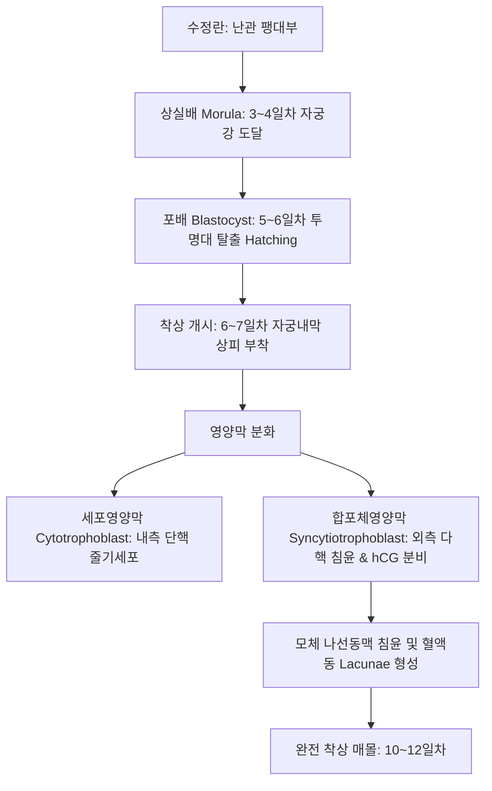
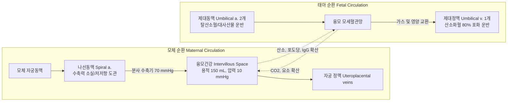
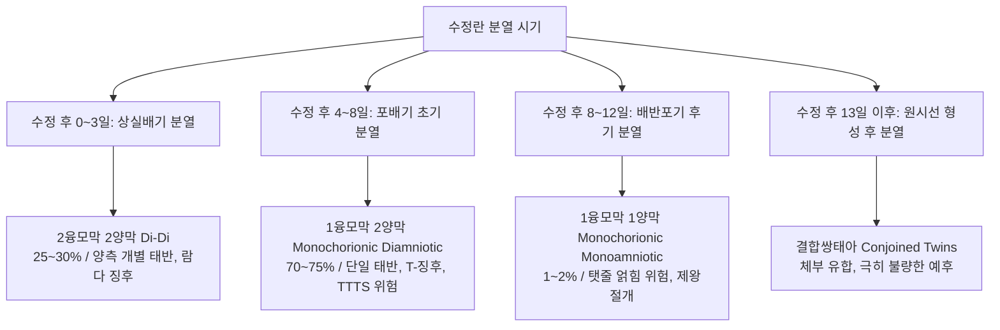
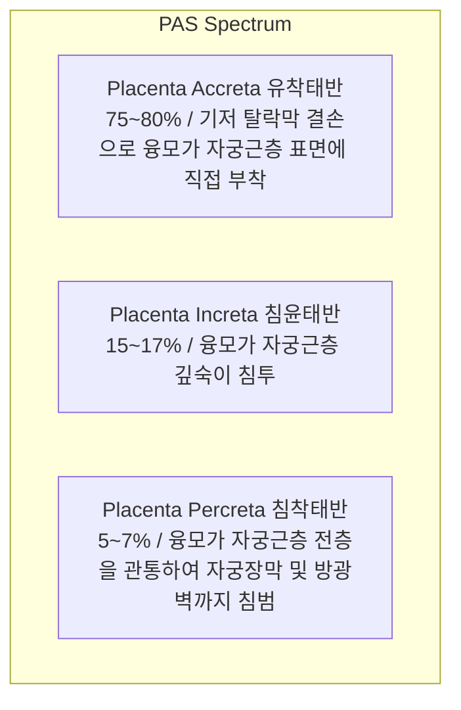
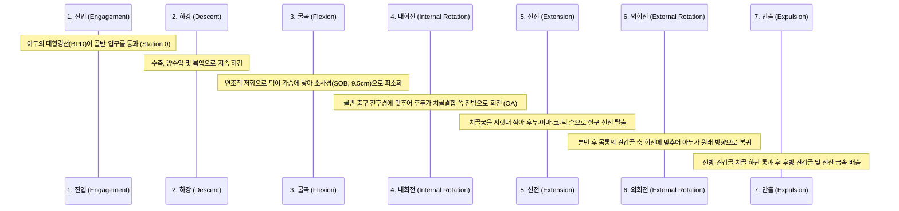
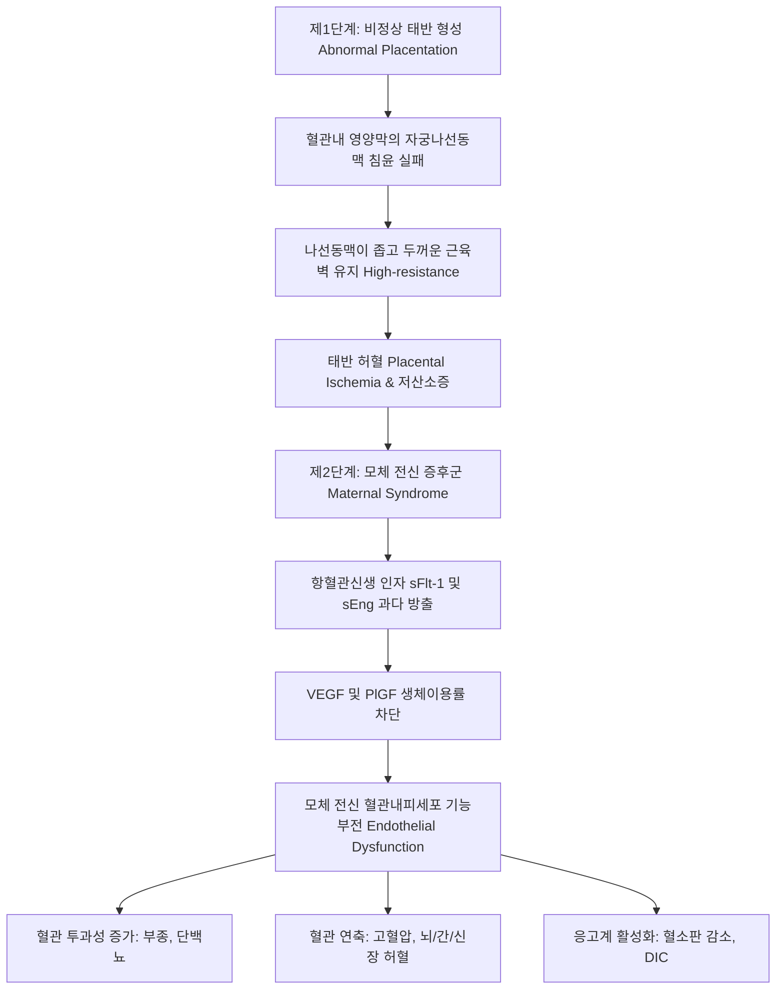

# 📑 [Netter Vol.1] Day 12: 임신 - 착상·태아발생·태반순환·산과합병증·전자간증 및 분만학 (Section 12 완독)

> 📖 **원서 출처**: [The Netter Collection of Medical Illustrations - Volume 1, Reproductive System.pdf (pp. 242-281)](https://drive.google.com/file/d/1x-xTgPfUfiK7dsQyp5L5qfjFYSD_XyGm/view?usp=drivesdk)  
> 🏷️ **범위**: Section 12 전편 (Plate 12-1 ~ Plate 12-39, 총 39개 플레이트 전수 포함)  
> 📌 **핵심 테마**: 포배기 착상 분자생물학(탈락막화, 영양막 침윤) 및 삼분기별 기관발생 이정표, 융모간강 태반 순환과 모체-태아-태반 단위 내분비학(hCG, hPL, 프로게스테론, 에스트리올 E3 생합성), 이소성 임신(난관 팽대부/협부 파열, 메토트렉세이트 MTX 기준) 및 자연유산·자궁경관무력증(맥도날드/시로드카 봉합술), 다태임신 융모막성/양막성 감별 및 쌍태아 수혈 증후군(TTTS), 후기 임신 출혈의 양대 축인 전치태반(통증 없는 선홍색 출혈) vs 태반조기박리(통증성 암적색 출혈, 쿠벨레르 자궁, DIC), 유착태반 스펙트럼(PAS), 임신융모질환(완전/부분 포상기태, 융모암), 분만 4단계 및 두정위 진입-하강-굴곡-내회전-신전-외회전-만출의 7대 주운동(Cardinal movements), 기계분만(겸자/흡입), 3·4도 산과적 회음열상 복구, 제왕절개술(Pfannenstiel & 저부 횡절개), 산과적 응급(자궁파열, 자궁내번증 정복술, 양수색전증 AFE), 임신성 고혈압 질환 스펙트럼(전자간증 2단계 병태생리, 나선동맥 리모델링 부전, sFlt-1/PlGF 불균형, HELLP 증후군, 황산마그네슘 경련 예방 및 아스피린 예방), 자궁내 태아성장지연(IUGR 대칭형 vs 비대칭형, 제대동맥 도플러 반전), Rh 동종면역(로감 투여 원칙), 선천성 매독 및 산욕기 패혈증(산욕열)

---

## 1. 개요 및 마스터 요약 (Executive Summary)

1. **포배기 착상(Implantation) 및 태반 형성(Placentation)의 분자생물학**:
   - 수정 후 6~7일째 투명대를 탈출한 포배(Blastocyst)가 자궁내막에 부착(Apposition) 및 침윤(Invasion)을 개시. 영양외배엽은 다핵체인 **합포체영양막(Syncytiotrophoblast)**과 단핵체인 **세포영양막(Cytotrophoblast)**으로 분화.
   - **나선동맥(Spiral artery)의 2단계 리모델링**: 혈관내 세포영양막이 모체 자궁나선동맥 내피와 중막 평활근을 파괴하고 침윤하여 저저항·고유량(Low-resistance, High-capacitance) 도관으로 변환. 이 과정의 실패가 전자간증(Preeclampsia)과 태아성장지연(IUGR)의 근본 기전임.
2. **모체-태반-태아 내분비 협동 단위 (Fetoplacental Unit)**:
   - **hCG (융모성 성선자극호르몬)**: 합포체영양막에서 분비되어 임신 8~10주까지 황체를 유지(프로게스테론 분비 지속). 임신 10주경 피크 도달 후 안정화.
   - **프로게스테론 ($P_4$)**: 임신 8주 이후 태반이 전담 합성(모체 콜레스테롤 이용). 자궁근 수축을 억제하여 임신 유지.
   - **에스트리올 ($E_3$)**: 모체와 태반은 $16lpha$-수산화 효소가 결핍되어 있으므로, 반드시 **태아 간(Liver)**의 $16lpha$-OH DHEA-S 합성과 **태반 술파타아제/아로마타제**의 협동을 거쳐야만 합성 가능 $
ightarrow$ 태아 웰빙(Well-being)의 가장 민감한 지표.
3. **산과적 출혈의 감별 및 응급 관리**:
   - **임신 초기 출혈**: 자궁외임신(Ectopic pregnancy, 95% 난관 호발 $
ightarrow$ MTX 의학적 요법 vs 복강경 수술), 절박/불가피/불완전 유산, 포상기태(Snowstorm appearance, 현저한 hCG 상승).
   - **임신 후기 출혈**:
     - **전치태반 (Placenta Previa)**: 자궁내구(Internal os)를 덮는 태반. **무통성 선홍색 질출혈**. 내진 절대 금기(초음파 진단), 제왕절개 필수.
     - **태반조기박리 (Abruptio Placentae)**: 분만 전 기저 탈락막의 조기 박리. **극심한 통증성 암적색 질출혈, 판자 같은 자궁 경직(Board-like rigidity)**, 소비성 응고장애(DIC) 및 자궁근층 내 광범위 출혈인 **쿠벨레르 자궁(Couvelaire uterus)** 유발.
     - **유착태반 스펙트럼 (PAS)**: 제왕절개 기왕력 및 전치태반 동반 시 급증. 기저 탈락막 결손으로 융모가 자궁근층에 유착(Accreta), 침투(Increta), 장막 돌파(Percreta).
4. **분만 기전, 진행 단계 및 산과적 손상**:
   - **분만 4단계**: 1기(진통 개시~자궁경관 10 cm 완전 개대, 잠재기/활성기), 2기(완전 개대~태아 분만), 3기(태아 분만~태반 만출, 30분 이내), 4기(태반 만출 후 1~2시간, 산후출혈 집중 감시).
   - **두정위 정상 분만의 7대 주운동 (Cardinal Movements)**: 진입(Engagement) $
ightarrow$ 하강(Descent) $
ightarrow$ 굴곡(Flexion) $
ightarrow$ 내회전(Internal rotation, AP 축 일치) $
ightarrow$ 신전(Extension, 질구 탈출) $
ightarrow$ 외회전(External rotation, 어깨 회전 동기화) $
ightarrow$ 만출(Expulsion).
   - **산과적 회음 열상**: 1도(질 점막/회음 피부), 2도(회음체 근육), 3도(항문괄약근 EAS/IAS 파열), 4도(항문직장 점막 완전 파열). 3·4도 열상은 대변 실금 방지를 위해 end-to-end 또는 overlapping 무장력 봉합 필수.
5. **고위험 임신 병태생리: 전자간증, IUGR 및 동종면역**:
   - **전자간증(Preeclampsia)**: 임신 20주 이후 발생한 고혈압($\ge 140/90	ext{ mmHg}$) + 단백뇨($\ge 300	ext{ mg/24hr}$) 또는 표적장기 손상(혈소판 감소, 간기능 이상, 신기능 부전, 폐부종, 뇌/시각 증상). 태반 허혈 $
ightarrow$ 항혈관신생 인자(**sFlt-1**, sEng) 과다 분비 $
ightarrow$ 전신 모체 혈관내피세포 손상. 근치적 치료는 **분만(Delivery)**이며, 경련 예방은 **황산마그네슘($	ext{MgSO}_4$)**.
   - **태아성장지연 (IUGR)**: 추정 체중 < 10백분위수. 초기 감염/유전 원인의 대칭형(Symmetric) vs 후기 태반부전 원인의 비대칭형(Asymmetric, Head sparing). 제대동맥 도플러 이완기말 혈류 소실/역전(AEDV/REDV) 시 응급 분만 적응증.
   - **Rh 동종면역**: Rh 음성 산모가 Rh 양성 태아 적혈구(D 항원)에 감작되어 발생하는 항체 매개성 용혈(태아수종 Hydrops fetalis). 감작 예방을 위해 **28주 및 분만 후 72시간 이내에 항-D 면역글로불린(로감, RhoGAM) $300\,\mu	ext{g}$** 근주.

---

## 2. 착상, 배아발생 및 삼분기별 발달 이정표 (Plates 12-1 ~ 12-4)

### Plate 12-1 | 배아의 착상 및 초기 발생 (Implantation and Early Development of Ovum)

![[Netter_V1_Plate12-1.png]]

#### 1) 포배기 착상의 분자생물학적 시퀀스
- **시간적 타임라인**: 배란 및 수정 후 3~4일차에 16~32세포기 상실배(Morula)가 자궁강 내로 진입 $
ightarrow$ 액체가 유입되며 포배강(Blastocoel)을 형성하는 포배(Blastocyst) 형성 $
ightarrow$ 수정 후 5~6일째 투명대(Zona pellucida)를 뚫고 탈출(Hatching) $
ightarrow$ **수정 후 6~7일째 착상 개시, 10~12일째 자궁내막 기질 내 완전 매몰**.
- **착상의 3단계 기전**:
  1. **접촉/부착 (Apposition)**: 자궁내막 표면의 피노포드(Pinopodes) 돌출과 배아 영양외배엽 표면의 L-selectin 및 인테그린(Integrin $lpha_veta_3, lpha_4eta_1$)의 상호작용으로 위치 고정.
  2. **유착 (Adhesion)**: 세포외 기질 단백질(피브로넥틴, 라미닌)을 매개로 트로포블라스트가 자궁내막 상피에 강고히 결합.
  3. **침윤 (Invasion)**: 합포체영양막이 기질금속단백분해효소(MMP-2, MMP-9)를 분비하여 세포간질 및 모체 모세혈관벽을 용해하며 내막 기질 깊숙이 파고듦.
- **영양막세포(Trophoblast)의 2중 분화**:
  - **내측 세포영양막 (Cytotrophoblast, Langhans cells)**: 단핵을 가진 증식성 줄기세포 구획으로 체세포분열을 지속하여 외측으로 세포를 공급.
  - **외측 합포체영양막 (Syncytiotrophoblast)**: 세포막 경계가 소실된 다핵 합포체로, 단백분해효소를 분비해 침윤을 주도하고 **hCG, 프로게스테론, hPL** 등 임신 유지 호르몬을 대량 분비.

#### 2) 자궁내막의 탈락막 반응 (Decidualization)
프로게스테론의 지속적인 자극으로 자궁내막 기질세포가 글리코겐과 지질을 풍부하게 함유한 다각형의 팽윤된 **탈락막세포(Decidual cells)**로 전환:
- **기저 탈락막 (Decidua basalis)**: 착상 부위 바로 아래에 위치하며, 장차 태반의 모체측 판(Maternal component)을 형성.
- **피막 탈락막 (Decidua capsularis)**: 성장하는 포배의 표면을 덮는 탈락막층으로 임신 중기 이후 자궁강 반대편 벽과 접촉하며 소퇴.
- **벽 탈락막 (Decidua parietalis / vera)**: 착상 부위 이외의 자궁강 전체를 둘러싸는 나머지 내막. 임신 14~16주에 피막 탈락막과 융합하여 자궁강(Uterine cavity) 폐쇄.



---

### Plate 12-2 | 임신 제1삼분기 발달 이정표 (Developmental Events of the First Trimester)

![[Netter_V1_Plate12-2.png]]

#### 1) 배아기 (Embryonic Period: 수정 후 3~8주, 임신 5~10주)
모든 주요 체내 기관 원기가 형성되는 **기관형성기(Organogenesis)**로 최기형성 물질(Teratogen)에 가장 취약한 결정적 시기:
- **3~4주 (배아 크기 $2\sim 4	ext{ mm}$)**:
  - 신경관(Neural tube) 형성 및 전방 신경공(Day 25)과 후방 신경공(Day 27)의 폐쇄 (엽산 $400\,\mu	ext{g}\sim 4	ext{ mg}$ 투여가 결손 예방의 절대적 표준).
  - 심장 원기가 박동을 시작 ($21\sim 22$일경 심장 수축 개시). 원시 혈액 순환 성립.
- **5~6주 ($8\sim 12	ext{ mm}$)**:
  - 상하지 지아(Limb buds) 출현 및 안배(Optic cup), 이포(Otic vesicle) 발달.
  - 질식 초음파로 배아 극(Fetal pole)과 규칙적인 심박동(Fetal heart motion, $100\sim 115	ext{ bpm}$) 확인 가능.
- **7~8주 ($20\sim 30	ext{ mm}$)**:
  - 손가락과 발가락의 분리, 안면부 윤곽 형성.
  - 생리적 제대 탈장(Physiological umbilical herniation): 급속히 성장하는 중장이 제대 내로 돌출되었다가 10~11주에 복강 내로 복귀.

#### 2) 제1삼분기 초음파 및 염색체 선별 검사
- **두둔길이 (Crown-Rump Length, CRL)**: 임신 8~13주 사이 임신 주수(Gestational age)를 가장 정확하게 측정하는 표준 지표 (오차 범위 $\pm 3\sim 5$일).
- **목덜미 투명대 (Nuchal Translucency, NT)**: 임신 $11\sim 13^{+6}$주(CRL $45\sim 84	ext{ mm}$)에 측정. NT $\ge 3.0\sim 3.5	ext{ mm}$ 시 다운 증후군(Trisomy 21) 등 이수성 및 선천성 심장 기형 위험 급증.
- **Combined Screening**: 모체 혈청 PAPP-A(감소) + 유리 $eta$-hCG(증가) + 초음파 NT 두께 측정 $
ightarrow$ 다운 증후군 선별도 $85\sim 90\%$.

---

### Plate 12-3 | 임신 제2삼분기 발달 이정표 (Developmental Events of the Second Trimester)

![[Netter_V1_Plate12-3.png]]

#### 1) 태아기 급속 성장과 기능적 분화 (14~27주)
- **16~20주**:
  - 외생식기 분화가 완성되어 초음파상 태아 성별 감별 가능.
  - **태동 자각 (Quickening)**: 초산모는 18~20주, 경산모는 16~18주에 최초로 태동을 인지.
  - 태지(Vernix caseosa)와 배냇머리/솜털(Lanugo)이 전신 피부를 덮어 양수로부터 보호.
- **20~24주**:
  - 급속한 체중 증가 ($500	ext{ g}$ 도달). 정밀 초음파(Level II targeted ultrasound)로 전신 해부학적 구조(뇌실, 심장 4-chamber view/유출로, 척추, 신장, 복벽, 사지) 기형 정밀 선별.
  - 청각 기능 발달로 외부 소리에 반응.
- **24~26주 (생존 한계기, Limit of Viability)**:
  - 폐포 내 제2형 폐포세포(Type II pneumocytes)가 분화하여 **폐 표면활성제(Surfactant)**를 분비하기 시작.
  - 현대 신생아 집중치료(NICU) 하에서 적극적 소생술 시 생존 가능성이 유의미하게 확보되는 경계선.

---

### Plate 12-4 | 임신 제3삼분기 발달 이정표 (Developmental Events of the Third Trimester)

![[Netter_V1_Plate12-4.png]]

#### 1) 체중 축적, 폐 성숙 및 분만 준비 (28~40주)
- **28~32주**: 태아 체중이 $1000	ext{ g}$에서 $1800	ext{ g}$으로 급증. 중추신경계의 체온 조절 능력이 발달하고 리듬성 호흡 운동이 관찰됨. 피하지방 축적 개시.
- **34~36주**:
  - 폐 성숙 완성: 레시틴/스핑고미엘린(L/S ratio) 비가 $\ge 2.0$에 도달하고 포스파티딜글리세롤(PG) 양성 전환 $
ightarrow$ 신생아 호흡곤란증후군(RDS) 위험 극적 감소.
  - 양수량이 34~36주에 최대($800\sim 1000	ext{ mL}$)에 도달한 후 분만 예정일이 가까워지며 점진적 감소.
- **37주 이후 (만삭, Full Term)**:
  - 임신 $37^{+0}\sim 41^{+6}$주. 고환이 음낭 내로 완전히 하강. 태아 머리가 골반 내로 진입(Lightening / Engagement).

---

## 3. 태반학, 태아-모체 혈류역학 및 임신 내분비학 (Plates 12-5 ~ 12-7)

### Plate 12-5 | 태반 및 태아막의 발생 (Development of Placenta and Fetal Membranes)

![[Netter_V1_Plate12-5.png]]

#### 1) 융모(Chorionic Villi)의 3단계 형태 형성학
- **일차 융모 (Primary villus, 임신 2주 말)**: 중심부의 세포영양막 돌기를 외측 합포체영양막이 둘러싼 단순 기둥 구조.
- **이차 융모 (Secondary villus, 임신 3주 초)**: 융모 중심부로 배외 중배엽(Extraembryonic mesoderm) 결합조직이 침투하여 기질 지지대 형성.
- **삼차 융모 (Tertiary villus / Definitive placental villus, 임신 3주 말)**: 중배엽 기질 내에서 배아 모세혈관망이 신생 혈관 형성(Angiogenesis)을 통해 개통되어 배아-태반 순환 성립.

#### 2) 태반 혈액 장벽 (Placental Barrier)의 성숙
- **임신 초기 4층 구조**:
  1. 합포체영양막 (Syncytiotrophoblast)
  2. 세포영양막 (Cytotrophoblast)
  3. 융모 간질 결합조직 (Mesodermal stroma)
  4. 태아 모세혈관 내피세포 (Fetal capillary endothelium)
- **임신 후기 박막화 (Thinning)**: 세포영양막이 대부분 소퇴되고 모세혈관이 합포체 표면 바로 아래로 밀착하여 **합포모세혈관막(Vasculosyncytial membrane, 두께 $2\sim 4\,\mu	ext{m}$)** 형성 $
ightarrow$ 산소 및 가스 교환 확산 효율을 극대화.

---

### Plate 12-6 | 태반 순환 및 태아-모체 혈류역학 (Circulation in Placenta)

![[Netter_V1_Plate12-6.png]]

#### 1) 융모간강(Intervillous Space)의 독특한 혈류역학
- **모체 혈류 공급**: 모체의 자궁나선동맥(Spiral arteries, 약 80~100개)에서 분출된 혈액이 높은 압력($70\sim 80	ext{ mmHg}$)으로 융모간강 저부에서 분수처럼 뿜어져 나와 융모 표면을 적신 후, 낮은 압력($8	ext{ mmHg}$)의 탈락막 정맥(Uteroplacental veins)으로 유출.
- **태반 혈류량**: 만삭 시 분당 약 **$500\sim 750	ext{ mL/min}$**의 모체 심박출량의 $10\sim 15\%$가 자궁태반 순환에 공급됨.
- **혈류 분리 원칙**: 모체 혈액과 태아 혈액은 정상 상태에서 **절대 직접 섞이지 않는 혈모체성(Hemochorial) 태반 구조**. 모든 영양소, 전해질, 가스는 확산(산소, $	ext{CO}_2$), 촉진확산(포도당 by GLUT1), 능동수송(아미노산, 철, 칼슘), 수용체 매개 세포내이입(IgG 항체)을 통해 선택적 수송.



---

### Plate 12-7 | 임신 중 내분비 및 호르몬 변동 (Hormonal Fluctuations in Pregnancy)

![[Netter_V1_Plate12-7.png]]

#### 1) 주요 임신 호르몬의 분비 곡선 및 생리적 역할
- **hCG (Human Chorionic Gonadotropin)**:
  - 합포체영양막에서 생산되는 당단백질 호르몬 ($eta$-소단위체가 고유 특이성 보유).
  - 착상 직후부터 혈중 농도가 48시간마다 2배로 증가(Doubling time)하여 **임신 8~10주에 피크($100,000	ext{ mIU/mL}$)** 도달 후 하강하여 임신 후반기 낮은 평형 유지.
  - 작용: 임신 7~9주까지 황체(Corpus luteum) 퇴화를 막아 프로게스테론 지속 분비 유도, 남성 태아 고환의 라이디히 세포를 자극하여 테스토스테론 합성 유도.
- **프로게스테론 ($P_4$)**:
  - 임신 초기 황체에서 분비되다가 **임신 7~9주 황체-태반 이행기(Luteal-placental shift)**를 거쳐 태반이 전담 분비.
  - 분만 직전까지 지속적으로 우상향 증가 (만삭 시 $100\sim 200	ext{ ng/mL}$).
  - 작용: 자궁근층 정지 상태(Myometrial quiescence) 유지(갭결합 억제), 면역 관용 유도, 모유 수유를 위한 유선 포상세포 발달.
- **hPL (Human Placental Lactogen / Human Chorionic Somatomammotropin, hCS)**:
  - 태반 크기에 비례하여 임신 3분기까지 직선적으로 증가.
  - 항인슐린 효과(모체 포도당 흡수 억제 및 지방분해 촉진)를 유발하여 태아에게 포도당과 지방산을 우선 공급 $
ightarrow$ **임신성 당뇨병(GDM)의 주된 병태생리적 원인 호르몬**.
- **에스트리올 ($E_3$)과 태아-태반 단위 (Fetoplacental Unit)**:
  - 임신 중 주된 에스트로겐은 $E_3$로, 전체 에스트로겐의 $90\%$를 점유.
  - 합성 기전: 태반에는 $17lpha$-hydroxylase 및 17,20-desmolase가 결핍되어 모체 콜레스테롤로부터 안드로겐을 직접 만들 수 없음 $
ightarrow$ 태아 부신이 DHEA-S를 합성 $
ightarrow$ 태아 간에서 $16lpha$-OH DHEA-S로 수산화 $
ightarrow$ 태반의 술파타아제와 아로마타제가 최종적으로 $E_3$ 합성 $
ightarrow$ **태아의 간, 부신, 태반이 모두 온전해야만 합성되므로 태아 안녕 평가의 핵심 척도**.

---

## 4. 자궁외임신, 유산, 자궁경관무력증 및 다태임신 (Plates 12-8 ~ 12-13)

### Plate 12-8 | 자궁외임신 I: 난관 임신 (Ectopic Pregnancy I—Tubal Pregnancy)

![[Netter_V1_Plate12-8.png]]

#### 1) 발생 부위별 역학 및 병인
- **발생 빈도**: 전체 임신의 $1\sim 2\%$. 모성 사망의 주요 원인(임신 1분기 모성 사망의 $9\%$).
- **호발 부위**:
  - **난관 팽대부 (Ampulla)**: $70\sim 80\%$ (가장 흔함).
  - **난관 협부 (Isthmus)**: $12\%$ (내경이 좁아 조기 파열 빈발).
  - **난관 채부 (Fimbria)**: $5\%$.
  - **간질부 (Interstitium / Cornu)**: $2\sim 3\%$ (자궁근층 파열 시 치명적 대량 출혈).
- **위험 인자**: 골반염증성 질환(PID, 난관 유착), 난관 수술 기왕력, 이전 자궁외임신 병력, 자궁내장치(IUD) 사용 중 임신, 보조생식술(ART), 흡연(난관 섬모 운동성 저하).

---

### Plate 12-9 | 자궁외임신 II: 난관 파열 및 난관 유산 (Ectopic Pregnancy II—Rupture, Abortion)

![[Netter_V1_Plate12-9.png]]

#### 1) 임상 양상 및 진단 알고리즘
- **3대 전형적 징후**: 무월경 후 **하복부 통증, 질 출혈, 부속기 종괴(Adnexal mass)** 촉지.
- **파열 시 징후**: 급격한 복막자극 징후(반발통, 판자형 복벽), 횡격막 자극에 의한 어깨 연관통(Kehr sign), 혈복강으로 인한 저혈량성 쇼크.
- **진단 판정 기준**:
  - **초음파상 가별치 (Discriminatory Zone)**: 질식 초음파로 자궁강 내 임신낭(Gestational sac)이 보여야 하는 혈청 $eta$-hCG 임계 수치는 **$1500\sim 2000	ext{ mIU/mL}$**. 이 수치를 초과함에도 자궁강이 비어 있고 부속기 복합 종괴가 관찰되면 자궁외임신 확진.
  - 가임신낭(Pseudogestational sac): 자궁내막 중심부에 위치한 탈락막 반응 액체로 난황낭(Yolk sac)이 관찰되지 않음.
- **치료 원칙**:
  - **의학적 요법 (Methotrexate, MTX)**:
    - 적응증: 혈역학적 안정, 미파열 종괴 $< 3.5	ext{ cm}$, 초기 $eta	ext{-hCG} < 5000	ext{ mIU/mL}$, 태아 심박동 음성.
    - 투여 프로토콜: 단일 용량($50	ext{ mg/m}^2$ 근주), Day 4와 Day 7의 hCG를 비교하여 $15\%$ 이상 감소 확인.
  - **외과적 수술 (Laparoscopy)**:
    - 혈역학적 불안정, 파열 의심, MTX 금기 시 즉각적인 복강경/개복 난관절제술(Salpingectomy) 또는 난관절개술(Salpingostomy).

---

### Plate 12-10 | 자궁외임신 III: 간질부, 복강 및 난소 임신 (Ectopic Pregnancy III—Interstitial, Abdominal, Ovarian)

![[Netter_V1_Plate12-10.png]]

#### 1) 비전형적 자궁외임신의 위험성
- **간질부 임신 (Interstitial / Cornual Pregnancy)**:
  - 난관이 자궁근층을 통과하는 부위 착상. 근층의 신장성으로 인해 임신 8~16주까지 무증상으로 진행되다가 파열.
  - 자궁동맥-난소동맥 문합부의 파열로 **수 분 내에 수 리터의 치명적 대량 출혈(Exsanguination)** 발생 $
ightarrow$ 자궁각 쐐기절제술(Cornual wedge resection) 또는 전자궁절제술 필요.
- **복강 임신 (Abdominal Pregnancy)**:
  - 일차성 착상 또는 난관 유산 후 이차성 복강내 착상. 대망(Omentum), 장간막, 복막 장막에 태반 형성 $
ightarrow$ 태반 박리 시 조절되지 않는 출혈 위험으로 태아 만출 후 태반을 그대로 두고 퇴화를 유도하는 경우가 많음.
- **자궁경부 임신 (Cervical Pregnancy)**:
  - 자궁내구 하방 경관 내 착상. 질식 분만 시도나 소파술 시 대량 출혈 유발 $
ightarrow$ 자궁동맥 색전술(UAE) 및 MTX 우선 고려.

---

### Plate 12-11 | 자연유산의 분류 및 임상 관리 (Abortion)

![[Netter_V1_Plate12-11.png]]

#### 1) 자연유산(Spontaneous Abortion)의 5단계 감별 기준

| 유산 유형 | 자궁경관 개대 (Cervical Os) | 질 출혈 및 복통 | 임신 조직 배출 여부 | 임상 처치 및 치료 방침 |
| :--- | :--- | :--- | :--- | :--- |
| **절박유산 (Threatened)** | **닫힘 (Closed)** | 경미한 출혈, 가벼운 하복통 | 없음 (태아 생존 확인) | 침상 안정, 프로게스테론 보충, 경과 관찰 |
| **불가피유산 (Inevitable)** | **열림 (Open)** | 중등도~중증 출혈 및 진통 | 없음 (양막 파수 동반 흔함) | 임신 지속 불가, 자궁수축제 또는 소파술(D&C) |
| **불완전유산 (Incomplete)** | **열림 (Open)** | 심한 출혈 및 지속 통증 | 태반 등 일부 잔류 조직 배출 | 대량 출혈 위험, 즉각적인 흡인소파술(D&E) |
| **완전유산 (Complete)** | **닫힘 (Closed)** | 출혈 및 통증 완화/소실 | 태아 및 태반 완전 배출 | 초음파로 빈 자궁강 확인, 추적 관찰 |
| **계류유산 (Missed)** | **닫힘 (Closed)** | 증상 없음 (임신 증상 소실) | 자궁 내 사망 태아 잔류 ($\ge 4$주) | 약물 유도(Misoprostol) 또는 계획적 흡인소파술 |

> ⚠️ **Clinical Pearl**: 계류유산 배아가 4~6주 이상 장기 잔류할 경우, 괴사된 태반 조직에서 트롬보플라스틴이 모체 순환으로 방출되어 **소비성 응고장애(DIC)**를 유발할 수 있으므로 혈소판, 피브리노겐, FDP를 반드시 선제 검사해야 합니다.

---

### Plate 12-12 | 자궁경관무력증 및 봉합술 (Cervical Insufficiency)

![[Netter_V1_Plate12-12.png]]

#### 1) 병태생리 및 임상 징후
- **정의**: 자궁 수축이나 진통 없이 임신 2분기(16~24주)에 자궁경관이 통증 없이 무통성으로 개대되어 양막이 탈출하고 유산 또는 조산에 이르는 상태.
- **원인**: 선천성 경부 형성부전, 과거 자궁경부 원추절제술(LEEP, Cone biopsy) 기왕력, 과거 분만 시 경부 열상, 다산력.
- **초음파 소견**: 질식 초음파상 자궁경부 길이(Cervical length) $< 25	ext{ mm}$, 자궁내구의 쐐기형 깔때기 현상(**Funneling** $\ge 25\sim 40\%$), 양막포의 모래시계형 탈출(Hourglass herniation).
- **외과적 자궁경부봉합술 (Cervical Cerclage)**:
  - **맥도날드 수술 (McDonald technique)**: 자궁경부와 질 점막 경계 부위를 비흡수성 봉합사(Mersilene tape)로 지갑끈 모양(Purse-string) 봉합. 임신 36~37주에 봉합사 제거.
  - **시로드카 수술 (Shirodkar technique)**: 방광을 박리하여 밀어 올린 후 자궁내구(Internal os) 높이에서 점막하 봉합.

---

### Plate 12-13 | 다태임신: 융모막성, 양막성 및 합병증 (Multiple Gestation)

![[Netter_V1_Plate12-13.png]]

#### 1) 일란성 쌍태아(Monozygotic Twins)의 분열 시기별 난막 분류



#### 2) 쌍태아간 수혈 증후군 (Twin-to-Twin Transfusion Syndrome, TTTS)
- **발생 조건**: 1융모막 쌍태아(MCDA)에서 태반 표면의 깊은 **동맥-정맥 문합(Arteriovenous anastomoses)**을 통해 혈류가 일방통행으로 흐를 때 발생.
- **임상 징후**:
  - **공혈아 (Donor twin)**: 저혈량증, 빈혈, 핍뇨, 심한 양수과소증(Oligohydramnios, Stuck twin), 성장지연.
  - **수혈아 (Recipient twin)**: 고혈량증, 다혈구증, 다뇨, 심한 양수과다증(Polyhydramnios), 울혈성 심부전 및 태아수종(Hydrops fetalis).
- **표준 치료**: 임신 16~26주에 **태아경하 태반 문합혈관 레이저 광응고술(Fetoscopic Laser Photocoagulation)**로 비정상 문합혈관을 완전히 차단.

---

## 5. 태반 병리, 후기 산과 출혈 및 융모질환 (Plates 12-14 ~ 12-21)

### Plate 12-14 | 태반 형태학 및 미세구조 (Placenta I—Form and Structure)

![[Netter_V1_Plate12-14.png]]

#### 1) 만삭 태반의 정상 해부학적 제원
- **형태 및 크기**: 원반형(Discoid), 직경 $15\sim 20	ext{ cm}$, 중앙부 두께 $2\sim 3	ext{ cm}$, 중량 약 $500	ext{ g}$ (태아 체중의 약 $1/6$).
- **양면의 구조**:
  - **태아면 (Fetal surface)**: 매끄럽고 광택이 있는 양막(Amnion)으로 덮여 있으며, 중앙에 제대가 부착되고 융모막 혈관들이 방사상으로 주행.
  - **모체면 (Maternal surface)**: 암적색의 해면양 구조로, 탈락막 중격(Decidual septa)에 의해 $15\sim 20$개의 **태반엽(Cotyledons)**으로 분할.

---

### Plate 12-15 | 태반 부속물: 제대, 양막 및 난막 이상 (Placenta II—Numbers, Cord, Membranes)

![[Netter_V1_Plate12-15.png]]

#### 1) 제대(Umbilical Cord) 및 태반의 형태학적 변이
- **정상 제대**: 길이 $50\sim 60	ext{ cm}$, 직경 $1.5\sim 2.0	ext{ cm}$. **2개의 제대동맥과 1개의 제대정맥**이 바르톤 젤리(Wharton's jelly)에 싸여 나선형으로 꼬여 있음.
- **단일 제대동맥 (Single Umbilical Artery, SUA)**: 제대동맥이 1개만 존재하는 기형(빈도 $0.5\sim 1\%$). 심장, 신장, 비뇨기계 기형 및 염색체 이상(Trisomy 18) 동반율 증가 $
ightarrow$ 정밀 태아 초음파 필수.
- **태반 부착 및 형태 이상**:
  - **유주 태반 (Succenturiate lobe)**: 주 태반과 떨어진 보조 태반엽이 존재하며 혈관으로 연결됨 $
ightarrow$ 분만 후 보조엽 잔류로 산후출혈 및 감염 유발.
  - **유곽 태반 (Circumvallate placenta)**: 태반 가장자리가 이중 주름의 백색 섬유성 융기륜으로 둘러싸여 태반 조기박리 위험 증가.
  - **난막 부착 제대 (Velamentous insertion)**: 제대 혈관이 태반 실질이 아닌 난막을 주행 $
ightarrow$ 이 혈관이 자궁내구를 통과할 때 **전치혈관(Vasa Previa)** 형성 $
ightarrow$ 양막 파수 시 태아 혈관 파열로 급성 태아 사망(모체 사망률 0%, 태아 사망률 $>60\%$).

---

### Plate 12-16 | 전치태반 (Placenta Previa)

![[Netter_V1_Plate12-16.png]]

#### 1) 분류 및 임상 관리 원칙
- **해부학적 4대 분류**:
  1. **완전 전치태반 (Complete)**: 자궁내구를 태반이 완전히 덮음.
  2. **부분 전치태반 (Partial)**: 자궁내구를 태반이 부분적으로 덮음.
  3. **변연 전치태반 (Marginal)**: 태반 끝이 자궁내구 경계에 도달.
  4. **저치 태반 (Low-lying)**: 태반 가장자리가 자궁내구로부터 $2	ext{ cm}$ 이내에 위치.
- **임상 징후**: 임신 후반기(28주 이후) 통증이 전혀 없는 **무통성 선홍색 질출혈(Painless bright red bleeding)**.
- **금기 사항**: **손가락 내진(Digital vaginal examination) 절대 금기** (태반을 직접 자극하여 치명적 파열 유발 가능). 질식 초음파(Transvaginal US)로 안전하게 진단.
- **분만 방침**: 완전 및 부분 전치태반은 반드시 **선택적 제왕절개술(Cesarean delivery)** 시행.

---

### Plate 12-17 | 태반조기박리 (Abruptio Placentae)

![[Netter_V1_Plate12-17.png]]

#### 1) 병태생리 및 임상 스펙트럼
- **정의**: 정상 부위에 착상된 태반이 태아 만출 이전인 임신 20주 이후에 자궁벽으로부터 조기 분리되는 질환.
- **위험 인자**: **모체 고혈압 및 전자간증(가장 강력한 인자)**, 외상, 복부 충격, 흡연, 코카인 남용, 급격한 자궁내압 감소(양수과다증 파수 후).
- **출혈 양상**:
  - **외출혈형 (Revealed, 80%)**: 혈액이 난막과 자궁벽 사이를 박리하여 질을 통해 배출.
  - **은폐형 (Concealed, 20%)**: 태반 후방에 혈종이 갇혀 질 출혈은 없으나 자궁내압이 극도로 상승하여 태아 사망 및 DIC 위험이 훨씬 높음.
- **임상 징후**: **극심한 지속성 하복부 통증, 암적색 질출혈, 자궁 압통 및 판자 같은 자궁 경직(Tetanic contraction)**, 태아 심박동 이상(태아 곤란증).

---

### Plate 12-18 | 유착태반 스펙트럼 (Placenta Accreta Spectrum — PAS)

![[Netter_V1_Plate12-18.png]]

#### 1) 침윤 깊이에 따른 병리학적 3단계



- **위험 인자**: **이전 제왕절개 횟수와 전치태반의 동반 여부** (제왕절개 1회 + 전치태반 = 유착태반 위험 $25\%$, 제왕절개 3회 이상 + 전치태반 = 위험 $>60\%$).
- **치료**: 태반을 무리하게 손으로 떼어내려 시도할 경우 치명적 대량 출혈 발생 $
ightarrow$ 태반을 제자리에 둔 채 시행하는 **제왕절개 전자궁적출술(Cesarean Hysterectomy)**이 표준 외과 치료.

---

### Plate 12-19 | 쿠벨레르 자궁 및 양수색전증 (Couvelaire Uterus, Amniotic Fluid Embolism)

![[Netter_V1_Plate12-19.png]]

#### 1) 쿠벨레르 자궁 (자궁태반 졸중, Uteroplacental Apoplexy)
- 태반조기박리 시 광범위한 태반후 혈종의 혈액이 자궁근육층 섬유 사이와 장막하 복막으로 침윤되어 자궁 표면이 얼룩덜룩한 암자색/청자색(Mottled, purplish)으로 변색되는 현상.
- 자궁근섬유 손상으로 분만 후 **자궁이완증(Uterine atony) 및 난치성 산후출혈** 유발.

#### 2) 양수색전증 (Amniotic Fluid Embolism, AFE)
- 분만 중 또는 분만 직후 양수 성분(태아 편평상피세포, 태지, 점액)이 찢어진 자궁 경부 정맥이나 태반 부착부 정맥동을 통해 모체 폐순환으로 유입되어 발생하는 치명적 과민면역 반응.
- **3대 급성 증상**:
  1. 돌발성 호흡곤란 및 청색증 (급성 폐혈관 연축 $
ightarrow$ 급성 폐성심)
  2. 심혈관계 허탈 및 저혈량성 쇼크, 심정지
  3. 전신적 소모성 응고장애(**전격성 DIC**) 및 조절되지 않는 대량 출혈
- **치료**: A-OK 요법 (Atropine, Ondansetron, Ketorolac), 즉각적인 심폐소생술 및 대량 수혈 팩(MTP) 투여.

---

### Plate 12-20 | 태반 결절성 병변 및 가성경색 (Nodular Lesions of Placenta Other Than True Infarcts)

![[Netter_V1_Plate12-20.png]]

#### 1) 태반 결절성 병변의 감별
- **융모간 섬유소 침착 (Intervillous Fibrin Deposition)**: 모체 혈류 정체로 융모간강에 섬유소가 침착된 백색 결절. 경미한 경우 임상적 의의 없음.
- **태반 융모막혈관종 (Chorioangioma)**: 태반의 가장 흔한 양성 혈관종양. 직경 $>5	ext{ cm}$인 경우 태아 동정맥 단락을 형성하여 고박출성 심부전, 비면역성 태아수종, 양수과다증 유발 가능.
- **탈락막 낭종 (Decidual cyst)** 및 양막하 혈종.

---

### Plate 12-21 | 임신융모질환 (Gestational Trophoblastic Disease — GTD)

![[Netter_V1_Plate12-21.png]]

#### 1) 완전 포상기태 vs 부분 포상기태의 정밀 유전학적 감별

| 병리 및 유전 지표 | 완전 포상기태 (Complete Mole) | 부분 포상기태 (Partial Mole) |
| :--- | :--- | :--- |
| **핵형 (Karyotype)** | **46,XX (90%)**, 46,XY (100% 부계 기원) | **69,XXY, 69,XXX (3배수체)** |
| **수정 메커니즘** | 무핵 난자 + 1개 정자 복제 또는 2개 정자 수정 | 정상 반수체 난자($23,X$) + 2개 정자 수정 |
| **태아 및 양막 조직** | **완전 결여 (No embryo/fetus)** | **존재 (비정상 배아/태아 조직 관찰)** |
| **융모 수종성 변화** | 모든 융모의 광범위 포도송이양 부종 | 국소적 융모 부종, 정상 융모 혼재 |
| **영양막 증식** | 전반적이고 심한 비정형 증식 | 경미하고 국소적인 증식 |
| **혈청 $eta$-hCG 수치** | **극도로 상승 ($>100,000	ext{ mIU/mL}$)** | 정상 또는 경미한 상승 |
| **초음파 소견** | 눈보라 징후 (**Snowstorm / Grapelike pattern**) | 태아 조직과 동반된 태반 낭포성 변화 |
| **악성 변성 위험도** | **$15\sim 20\%$ 침윤성 기태, $2\sim 3\%$ 융모암** | $< 4\sim 5\%$ 지속성 융모종양 |

#### 2) 치료 및 추적 관찰 원칙
- 자궁 흡인소파술(Suction curettage)로 내용물 완전 제거.
- **주간 혈청 $eta$-hCG 추적**: 수치가 3주 연속 정상화될 때까지 매주 측정 후, 매월 6개월간 추적.
- 추적 기간 중 엄격한 피임 필수 (임신 시 hCG 상승으로 재발 판정 불가).
- 수치가 안정화되지 않고 정체(Plateau)되거나 재상승 시 임신융모종양(GTN: 침윤성기태, 융모암)으로 진단하여 메토트렉세이트(MTX) 항암화학요법 개시.

---

## 6. 분만의 신경생리, 정상 분만 기전 및 산과 손상 (Plates 12-22 ~ 12-27)

### Plate 12-22 | 분만의 신경생리학 및 분만 진통 경로 (Neuropathways in Parturition)

![[Netter_V1_Plate12-22.png]]

#### 1) 분만 진통의 신경 전달 경로와 마취 차단점
- **분만 1기 통증 (자궁경관 개대 및 자궁체부 수축 통증)**:
  - 내장 구심성 통각 신경섬유(Visceral afferent C-fibers)가 하복신경총(Hypogastric plexus)을 거쳐 **T10, T11, T12, L1 척수 분절**로 진입 $
ightarrow$ 하복부, 요천추부 연관통 유발.
- **분만 2기 통증 (질벽 신전, 골반저 및 회음부 신장 통증)**:
  - 체성 신경섬유(Somatic sensory fibers)인 **음부신경(Pudendal nerve, S2, S3, S4)**을 통해 전달.
- **산과 마취의 해부학적 적용**:
  - **경막외 마취 (Epidural analgesia)**: L3-L4 요추 간격을 통해 경막외강에 카테터 거치 $
ightarrow$ T10부터 S5 분절까지 차단하여 1기와 2기 통증을 모두 완벽 제어하는 골드 스탠다드.
  - **음부신경 차단술 (Pudendal nerve block)**: 좌골가시(Ischial spine) 후하방을 통과하는 음부신경을 국소마취하여 회음 절개 및 겸자/흡입 분만 시 회음부 통증 차단.

---

### Plate 12-23 | 정상 분만 기전 및 7대 주운동 (Normal Birth)

![[Netter_V1_Plate12-23.png]]

#### 1) 두정위(Vertex) 정상 분만의 7대 주운동 (Cardinal Movements of Labor)
골반 입구에서 출구까지 불규칙한 골반 강 구조에 적응하며 태아 머리가 통과하는 일련의 회전 역학:



---

### Plate 12-24 | 수술적 질식 분만: 겸자 및 흡입 분만 (Operative Vaginal Delivery)

![[Netter_V1_Plate12-24.png]]

#### 1) 겸자 분만(Forceps) 및 흡입 분만(Vacuum)의 필수 선결 조건
1. 자궁경관의 완전 개대 ($10	ext{ cm}$)
2. 양막 파수 완료
3. 아두의 진입 확립 (Station $\ge +2$) 및 정확한 아두 위치/방향 파악
4. 아두-골반 불균형(CPD)이 없을 것
5. 산모 방광 도뇨 배출 완료
6. 응급 제왕절개 전환이 즉각 가능한 수술실 대비
- **합병증 감시**:
  - 모체: 3·4도 회음열상, 질벽 혈종, 요실금.
  - 신생아: 두혈종(Cephalohematoma), 모상건막하 출혈(Subgaleal hemorrhage, 흡입 분만 시 생명 위협 위험), 안면신경 마비(겸자 압박).

---

### Plate 12-25 | 산과적 열상 I: 회음부 열상 및 절개술 (Obstetric Lacerations I—Vagina, Perineum, Vulva)

![[Netter_V1_Plate12-25.png]]

#### 1) 회음 열상(Perineal Laceration)의 4단계 국제 분류 (Sultan Classification)

| 열상 분류 | 손상 해부학적 구조 | 임상적 의의 및 복구 방법 |
| :--- | :--- | :--- |
| **제1도 (1st degree)** | 질 점막 및 회음부 피부에 국한 | 출혈이 없으면 봉합 생략 가능, 흡수성 봉합사 단순 봉합 |
| **제2도 (2nd degree)** | **회음체(Perineal body) 근육층 손상**<br>(구해면체근, 회음횡근 침범, 괄약근 보존) | 질 점막 연속 봉합 후 회음 근육층 및 피하/피부 층별 봉합 |
| **제3도 (3rd degree)** | **항문괄약근 복합체 (Anal Sphincter Complex) 손상**<br>- 3a: 외항문괄약근(EAS) 두께 $< 50\%$ 파열<br>- 3b: EAS 두께 $> 50\%$ 파열<br>- 3c: 내항문괄약근(IAS)까지 파열 | 분만실 수술 조명 하 정밀 박리 후 PDS나 Vicryl을 이용한<br>**End-to-end 또는 Overlapping 무장력 봉합** 필수 |
| **제4도 (4th degree)** | **항문직장 점막 (Anorectal mucosa) 완전 관통 파열**<br>(항문관 내강 노출) | 직장 점막하층 봉합 $
ightarrow$ IAS 복구 $
ightarrow$ EAS 복구의 3중 복원<br>대변 완하제 및 광범위 항생제 필수 (직장질누공 RVF 예방) |

---

### Plate 12-26 | 산과적 열상 II: 골반근막 및 지지 구조 (Obstetric Lacerations II—Fibromuscular Support)

![[Netter_V1_Plate12-26.png]]

#### 1) 항문거근 복합체 손상과 만성 골반장기탈출증(POP)
- 거근열공(Levator hiatus)이 아두 통과 시 과도하게 신장되면서 **치골직장근(Puborectalis) 및 치골미골근(Pubococcygeus)**이 치골지 부착부에서 견열(Avulsion) 손상 발생.
- 회음체 결손과 골반내근막 파열이 누적될 경우, 수년~수십 년 후 **자궁탈출증, 방광류, 직장류** 및 요실금/변실금의 직접적 원인 제공.

---

### Plate 12-27 | 제왕절개술 (Cesarean Delivery)

![[Netter_V1_Plate12-27.png]]

#### 1) 수기 및 절개 방식
- **피부 절개**: 프란넨스틸(Pfannenstiel) 횡절개(미용상 우수, 근막 분리) vs 하복부 정중선 수직 절개(응급 시 신속한 태아 만출).
- **자궁 절개**:
  - **자궁하부 횡절개 (Kerr incision, Low transverse)**: 가장 보편적. 출혈이 적고 근육층 치유가 우수하여 차기 임신 시 **자궁파열 위험이 매우 낮음 ($< 1\%$)** $
ightarrow$ 차기 임신 시 VBAC(제왕절개 후 질식분만) 시도 가능.
  - **고전적 종절개 (Classical incision)**: 자궁체부 능동 분절을 수직 절개. 전치태반, 유착태반, 극소저체중아 둔위 등 특수 상황에 국한되나, 차기 임신 시 **진통 전 자궁파열 위험($4\sim 10\%$)**이 높아 다음 임신 시 선택적 제왕절개 필수 (VBAC 절대 금기).

---

## 7. 주산기 응급 및 산과 합병증 (Plates 12-28 ~ 12-30)

### Plate 12-28 | 자궁파열 (Rupture of the Uterus)

![[Netter_V1_Plate12-28.png]]

#### 1) 원인 및 임상적 파국
- **가장 흔한 원인**: **이전 제왕절개 반흔 부위의 파열** (특히 고전적 수직 절개 또는 다회 제왕절개 후 옥시토신/프로스타글란딘 유도분만 시 급증).
- **특이적 징후**:
  - **태아 심박동의 급격하고 지속적인 서맥 (Fetal bradycardia, 가장 흔하고 신뢰할 수 있는 초기 징후)**.
  - 규칙적이던 자궁 수축 압력의 돌연한 소실(Intrauterine pressure catheter상 수축 정지).
  - 아두 하강도의 후퇴(Station regression, 골반 내 진입했던 아두가 복강으로 튕겨 올라감).
  - 산모의 칼로 찌르는 듯한 파열 통증 및 급속한 저혈량성 쇼크.
- **치료**: 즉각적인 개복술을 통한 태아 만출 및 자궁 봉합 또는 전자궁절제술.

---

### Plate 12-29 | 자궁내번증 (Uterine Inversion)

![[Netter_V1_Plate12-29.png]]

#### 1) 발생 원인 및 존슨 정복술 (Johnson Maneuver)
- **원인**: 태반이 아직 분리되지 않은 상태에서 자궁저부를 과도하게 누르거나 탯줄을 무리하게 잡아당길 때(Cord traction), 자궁이완증 동반 시 호발.
- **증상**: 질 밖으로 뒤집힌 자궁체부가 종괴로 돌출, 복부 촉진 시 자궁저부가 만져지지 않고 분화구처럼 함몰, **신경성 쇼크(미주신경 반사로 인한 서맥) + 대량 산후출혈 쇼크**.
- **즉각 처치**:
  - 즉시 자궁수축제(옥시토신) 투여를 중단하고, 자궁이완제(니트로글리세린, 황산마그네슘) 투여 하에 **존슨 정복술(손 전체로 자궁저부를 질원개 쪽으로 밀어 올려 해부학적 정위치로 환원)** 시행.
  - 환원 성공 직후 즉시 고용량 옥시토신을 투여하여 자궁을 강하게 수축시켜 재내번 방지.

---

### Plate 12-30 | 임신 중 비뇨기계 합병증 (Urinary Complications of Pregnancy)

![[Netter_V1_Plate12-30.png]]

#### 1) 생리적 수신증 및 감염 감별
- **생리적 신우요관 확장 (Hydronephrosis of Pregnancy)**: 프로게스테론에 의한 요관 평활근 이완 및 임신 자궁의 우측 편위(Dextrorotation)에 따른 우측 요관 압박으로 **우측 신우/요관 확장이 $90\%$에서 현저**.
- **무증상 세균뇨 (Asymptomatic Bacteriuria)**: 일반인과 달리 임신부에서는 $20\sim 40\%$가 **급성 신우신염(Acute Pyelonephritis)**으로 진행하여 조산, 패혈증을 유발하므로 임신 1분기 필수 선별 배양 검사 및 발견 시 즉각 항생제 치료.

---

## 8. 임신성 고혈압 질환: 전자간증·자간증 스펙트럼 (Plates 12-31 ~ 12-35)

### Plate 12-31 | 전자간증 I: 병태생리 및 전신 증상 (Preeclampsia I—Symptoms)

![[Netter_V1_Plate12-31.png]]

#### 1) 진단 기준 및 중증도 판정 (ACOG 기준)
- **전자간증 (Preeclampsia) 진단 기준**:
  - 임신 20주 이후 정상 혈압이던 산모에서 **수축기 혈압 $\ge 140	ext{ mmHg}$ 또는 이완기 혈압 $\ge 90	ext{ mmHg}$** (4시간 간격 2회) 발생.
  - AND **단백뇨 ($\ge 300	ext{ mg/24hr}$ 또는 단백/크레아티닌 비율 P/C ratio $\ge 0.3$)**.
  - 단백뇨가 없더라도 다음의 **표적장기 손상** 중 하나 이상 동반 시 확진:
    1. 혈소판 감소증 (Thrombocytopenia: $< 100,000/\mu	ext{L}$)
    2. 신기능 부전 (Serum Creatinine $> 1.1	ext{ mg/dL}$ 또는 기저치의 2배)
    3. 간기능 이상 (AST/ALT가 정상 상한선의 2배 이상 상승)
    4. 폐부종 (Pulmonary edema)
    5. 새로운 신경학적 증상(지속적 두통, 시야 흐림, 암점)
- **중증 전자간증 (Preeclampsia with Severe Features)**:
  - 혈압 $\ge 160/110	ext{ mmHg}$ 또는 상기 표적장기 손상 징후 동반.

---

### Plate 12-32 | 전자간증 II: 안과적 혈관병증 및 망막 변화 (Preeclampsia II—Ophthalmologic Changes)

![[Netter_V1_Plate12-32.png]]

#### 1) 안저 소견 및 뇌부종 연관성
- 망막 세동맥의 국소적 및 미만성 연축(Arteriolar spasm), 망막 부종, 삼출물(Exudates) 및 면화반(Cotton-wool spots).
- 심한 경우 **장액성 망막 박리(Serous retinal detachment)** 및 뇌 후두엽 부종에 의한 **피질 맹(Cortical blindness / PRES: Posterior Reversible Encephalopathy Syndrome)** 유발. 대부분 분만 후 혈압 안정화와 함께 가역적으로 완전 회복.

---

### Plate 12-33 | 전자간증 III: HELLP 증후군 및 내장 병변 (Preeclampsia III—Visceral Lesions)

![[Netter_V1_Plate12-33.png]]

#### 1) HELLP 증후군의 3대 진단 지표
중증 전자간증의 가장 위중한 변이 형태로 모체 사망률 $1\sim 3\%$:
1. **H (Hemolysis)**: 미세혈관병성 용혈성 빈혈 (말초혈액도말상 분열적혈구 Schistocytes, 총 빌리루빈 $\ge 1.2	ext{ mg/dL}$, 혈청 LDH $\ge 600	ext{ IU/L}$).
2. **EL (Elevated Liver enzymes)**: 간세포 괴사로 인한 혈청 AST/ALT $\ge 70	ext{ IU/L}$ (정상의 2배 이상), 심와부/우상복부 산통(글리슨막 신전).
3. **LP (Low Platelets)**: 소모성 혈소판 감소증 ($< 100,000/\mu	ext{L}$).
- **치명적 합병증**: 간 피막하 혈종(Hepatic subcapsular hematoma) 및 **간 파열(Hepatic rupture)** $
ightarrow$ 복강내 대량 출혈로 응급 간색전술/수술 요함.

---

### Plate 12-34 | 전자간증 IV: 태반 경색 및 나선동맥 부전 (Preeclampsia IV—Placental Infarcts)

![[Netter_V1_Plate12-34.png]]

#### 1) 2단계 병태생리 가설 (Two-Stage Model)



- **태반 소견**: 태반 조기 노화, 광범위한 합포체 결절(Syncytial knots), 탈락막 세동맥의 급성 죽종(Acute atherosis), 다발성 태반 경색(Placental infarcts).

---

### Plate 12-35 | 모체 태반혈류 저하의 원인 (Causes of Decreased Maternal Circulation)

![[Netter_V1_Plate12-35.png]]

#### 1) 앙와위 저혈압 증후군 (Supine Hypotensive Syndrome)
- 임신 후반기 산모가 등을 대고 누울 때(Supine), 무거운 임신 자궁이 **하대정맥(IVC)과 복부대동맥을 직접 압박**.
- 정맥 환류량 급감 $
ightarrow$ 심박출량 감소 $
ightarrow$ 모체 저혈압, 실신 및 자궁태반 순환 저하로 태아 서맥 촉발.
- **즉각 처치**: 산모를 **좌측와위(Left lateral decubitus position)**로 눕혀 대정맥 압박을 해제하면 즉시 혈압과 태반 혈류가 정상화됨.

---

## 9. 태아 성장지연, Rh 동종면역, 감염 및 산욕기 패혈증 (Plates 12-36 ~ 12-39)

### Plate 12-36 | 자궁내 태아성장지연 (Intrauterine Growth Restriction — IUGR)

![[Netter_V1_Plate12-36.png]]

#### 1) 대칭형 vs 비대칭형 IUGR 정밀 비교

| 특성 구분 | 대칭형 IUGR (Symmetric, 20~30%) | 비대칭형 IUGR (Asymmetric, 70~80%) |
| :--- | :--- | :--- |
| **발생 시기** | **임신 1~2분기 (초기 세포증식기 손상)** | **임신 3분기 (후기 세포비대기 손상)** |
| **주요 병인** | 염색체 이상(Aneuploidy), 선천성 기형, TORCH 감염 | **태반관류부전(전자간증, 모체 만성질환)** |
| **체형 비율** | **두위(HC), 복위(AC), 대퇴골(FL) 균등 감소** | **복위(AC) 현저한 감소, 두위(HC) 상대적 보존 (Head-sparing)** |
| **뇌 보호 효과** | 없음 (전체 뇌 발육 저하) | **존재 (혈류가 심장과 뇌로 우선 공급)** |
| **세포 수 vs 크기** | 총 세포 수 자체가 감소 | 세포 수는 정상이나 글리코겐 고갈로 세포 크기 감소 |
| **예후** | 불량 (영구적 신경학적 장애 가능) | 적절한 영양 및 분만 관리 시 양호한 출생 후 회복 |

#### 2) 도플러 혈류 검사를 이용한 분만 타이밍 결정
- **제대동맥 도플러 (Umbilical Artery Doppler)**:
  - 태반 저항 증가 $
ightarrow$ S/D 비 증가 $
ightarrow$ **이완기말 혈류 소실 (Absent End-Diastolic Velocity, AEDV, 34주 분만 고려)** $
ightarrow$ **이완기말 혈류 역전 (Reversed End-Diastolic Velocity, REDV, 30~32주 응급 제왕절개 적응증)**.
- **정맥관 (Ductus Venosus) 도플러**: a-wave 역전 시 산증 및 급사 임박 신호.

---

### Plate 12-37 | 태아적아구증: Rh 동종면역 (Erythroblastosis Fetalis — Rh Sensitization)

![[Netter_V1_Plate12-37.png]]

#### 1) 병태생리 및 면역학적 기전
- **발생 전제**: **Rh 음성 모체($	ext{Rh D}^-$)**가 **Rh 양성 태아($	ext{Rh D}^+$)**를 임신하여 태반 조기박리, 양수천자, 유산, 분만 시 태아 적혈구가 모체 순환으로 누출($\ge 0.1	ext{ mL}$).
- 모체 면역계가 D 항원에 감작되어 IgM을 거쳐 **IgG 항-D 항체** 생성 $
ightarrow$ 다음 임신에서 IgG가 태반 장벽을 통과하여 태아 적혈구의 D 항원에 결합 $
ightarrow$ 태아 비장 대식세포에서 세포외 혈구용혈.
- **결과**: 중증 태아 빈혈 $
ightarrow$ 골수 외 조혈(간비종대) $
ightarrow$ 저알부민혈증, 문맥압 항진증, 모세혈관 누출 $
ightarrow$ 복수, 흉수, 심낭삼출, 전신 피하부종을 동반한 **태아수종 (Hydrops Fetalis)** 및 태내 사망.
- **중뇌동맥(MCA) 도플러 평가**: 최고수축기혈류속도(MCA-PSV) $> 1.5	ext{ MoM}$ 시 중증 빈혈 판정 $
ightarrow$ 자궁 내 제대정맥 수혈(PUBS) 시행.
- **예방 원칙 (RhoGAM)**:
  - **임신 28주**에 비감작 Rh 음성 산모에게 **로감(Anti-D Immune Globulin) $300\,\mu	ext{g}$** 예방적 투여.
  - **분만 후 72시간 이내** 신생아가 Rh 양성이면 로감 $300\,\mu	ext{g}$ 추가 투여. (모체혈 내 태아 적혈구 유입량 측정은 클라인하우어-베트케 Kleihauer-Betke 검사).

---

### Plate 12-38 | 선천성 및 임신성 매독 (Syphilis in Pregnancy)

![[Netter_V1_Plate12-38.png]]

#### 1) 태반 병리와 선천성 매독 증후군
- **원인균**: *Treponema pallidum* (나선균). 임신 전 기간에 걸쳐 태반을 통과하여 태아 감염 유발 가능.
- **태반 소견**: 매우 크고 창백하며 두꺼운 부종성 태반, 현미경하 융모주위염 및 혈관내피 증식성 폐쇄.
- **선천성 매독 임상 징후**:
  - 조기 선천성 매독 ($< 2$세): 수포성 발진, 매독성 비염(Snuffles, 피고름 콧물), 간비종대, 골연골염.
  - 후기 선천성 매독 ($> 2$세): **허친슨 3징 (Hutchinson's triad: 허친슨 치아, 간질성 각막염, 제8뇌신경 감각신경성 난청)**, 안장코(Saddle nose), 세이버 정강이(Saber shin).
- **치료**: **벤자틴 페니실린 G (Benzathine Penicillin G)** 근주가 유일하게 입증된 표준 치료 (페니실린 알레르기 임산부라도 탈감작 후 페니실린 투여 필수).

---

### Plate 12-39 | 산욕기 감염 및 패혈증 (Puerperal Infection)

![[Netter_V1_Plate12-39.png]]

#### 1) 산욕열(Puerperal Fever)의 원인 및 단계적 파급
- **산욕열의 정의**: 분만 후 첫 24시간을 제외하고 산후 10일 이내에 구강 체온 **$\ge 38.0^\circ	ext{C}$가 2일 이상 지속**되는 상태.
- **1차적 병소: 산후 자궁내막염 (Endometritis)**:
  - 제왕절개 후 발생률이 질식 분만의 $5\sim 10$배. 다균성(호기성+혐기성 세균 혼합) 감염.
  - 징후: 하복부 자궁 압통, 악취 나는 오로(Foul-smelling lochia), 백혈구 증다증.
  - 표준 항생제 요법: **클린다마이신 (Clindamycin) + 젠타마이신 (Gentamicin)** 정주 (열 소실 후 24~48시간까지 유지).
- **합병증: 패혈성 골반혈전정맥염 (Septic Pelvic Thrombophlebitis, SPT)**:
  - 광범위 항생제 투여에도 불구하고 원인불명의 고열과 오한이 지속되는 경우 의심.
  - 골반 정맥 또는 난소정맥(Ovarian vein) 내 감염성 혈전 형성 $
ightarrow$ 골반 CT로 확진 후 **항생제 + 헤파린(Heparin)** 항응고 요법 병용 시 48~72시간 내 해열.

---

## 10. 로컬 이미지 추출 자동화 스크립트 (Python snippet)

원서 PDF(`The Netter Collection of Medical Illustrations - Volume 1, Reproductive System.pdf`)에서 Section 12에 해당하는 39개 플레이트의 고해상도 이미지를 추출하여 `첨부파일` 폴더에 일괄 저장할 수 있는 로컬 실행용 Python 코드입니다:

```python
import fitz  # PyMuPDF
import os

pdf_path = "The Netter Collection of Medical Illustrations - Volume 1, Reproductive System.pdf"
output_dir = "./헤르메스/책 읽기/Netter_Vol1_생식기계/첨부파일"
os.makedirs(output_dir, exist_ok=True)

doc = fitz.open(pdf_path)

# Section 12 전체 39개 플레이트 정보 매핑 (Plate 12-1 ~ Plate 12-39)
plates_info = [
    ("Plate12-1", "Implantation and Early Development of Ovum"),
    ("Plate12-2", "Developmental Events of the First Trimester"),
    ("Plate12-3", "Developmental Events of the Second Trimester"),
    ("Plate12-4", "Developmental Events of the Third Trimester"),
    ("Plate12-5", "Development of Placenta and Fetal Membranes"),
    ("Plate12-6", "Circulation in Placenta"),
    ("Plate12-7", "Hormonal Fluctuations in Pregnancy"),
    ("Plate12-8", "Ectopic Pregnancy I—Tubal Pregnancy"),
    ("Plate12-9", "Ectopic Pregnancy II—Rupture, Abortion"),
    ("Plate12-10", "Ectopic Pregnancy III—Interstitial, Abdominal, Ovarian"),
    ("Plate12-11", "Abortion"),
    ("Plate12-12", "Cervical Insufficiency"),
    ("Plate12-13", "Multiple Gestation"),
    ("Plate12-14", "Placenta I—Form and Structure"),
    ("Plate12-15", "Placenta II—Numbers, Cord, Membranes"),
    ("Plate12-16", "Placenta Previa"),
    ("Plate12-17", "Abruptio Placentae"),
    ("Plate12-18", "Placenta Accreta"),
    ("Plate12-19", "Couvelaire Uterus, Amniotic Fluid Embolism"),
    ("Plate12-20", "Nodular Lesions of Placenta Other Than True Infarcts"),
    ("Plate12-21", "Gestational Trophoblastic Disease"),
    ("Plate12-22", "Neuropathways in Parturition"),
    ("Plate12-23", "Normal Birth"),
    ("Plate12-24", "Operative Vaginal Delivery"),
    ("Plate12-25", "Obstetric Lacerations I—Vagina, Perineum, Vulva"),
    ("Plate12-26", "Obstetric Lacerations II—Fibromuscular Support"),
    ("Plate12-27", "Cesarean Delivery"),
    ("Plate12-28", "Rupture of the Uterus"),
    ("Plate12-29", "Uterine Inversion"),
    ("Plate12-30", "Urinary Complications of Pregnancy"),
    ("Plate12-31", "Preeclampsia I—Symptoms"),
    ("Plate12-32", "Preeclampsia II—Ophthalmologic Changes"),
    ("Plate12-33", "Preeclampsia III—Visceral Lesions"),
    ("Plate12-34", "Preeclampsia IV—Placental Infarcts"),
    ("Plate12-35", "Causes of Decreased Maternal Circulation"),
    ("Plate12-36", "Intrauterine Growth Restriction"),
    ("Plate12-37", "Erythroblastosis Fetalis"),
    ("Plate12-38", "Syphilis"),
    ("Plate12-39", "Puerperal Infection"),
]

print(f"총 {len(plates_info)}개 플레이트 검색 및 추출 시작...")

for plate_id, plate_title in plates_info:
    num_suffix = plate_id.replace("Plate12-", "")
    search_terms = [
        f"Plate 12-{num_suffix}",
        f"12-{num_suffix}",
        plate_title.lower()
    ]
    
    target_page = None
    for page_num in range(len(doc)):
        text = doc[page_num].get_text().lower()
        if any(term.lower() in text for term in search_terms):
            target_page = page_num
            break
            
    if target_page is not None:
        page = doc[target_page]
        pix = page.get_pixmap(matrix=fitz.Matrix(3.0, 3.0))  # 300 DPI 고해상도
        img_filename = f"Netter_V1_{plate_id}.png"
        save_path = os.path.join(output_dir, img_filename)
        pix.save(save_path)
        print(f"✅ [추출 성공] {img_filename} (PDF p.{target_page+1})")
    else:
        print(f"⚠️ [페이지 미발견] {plate_id}: {plate_title}")

doc.close()
print("=== Section 12 전체 39개 플레이트 이미지 추출 완료 ===")
```
