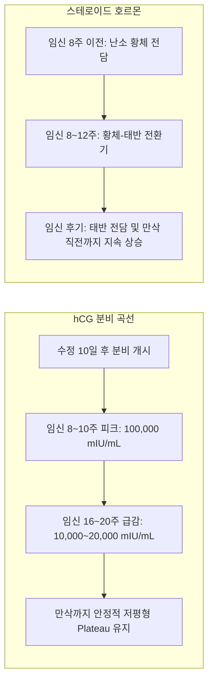
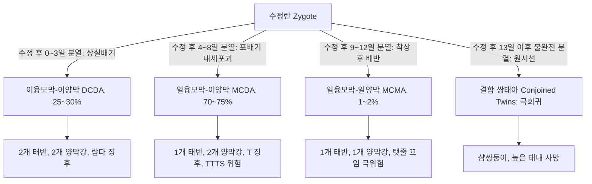
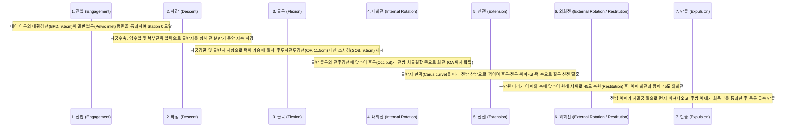
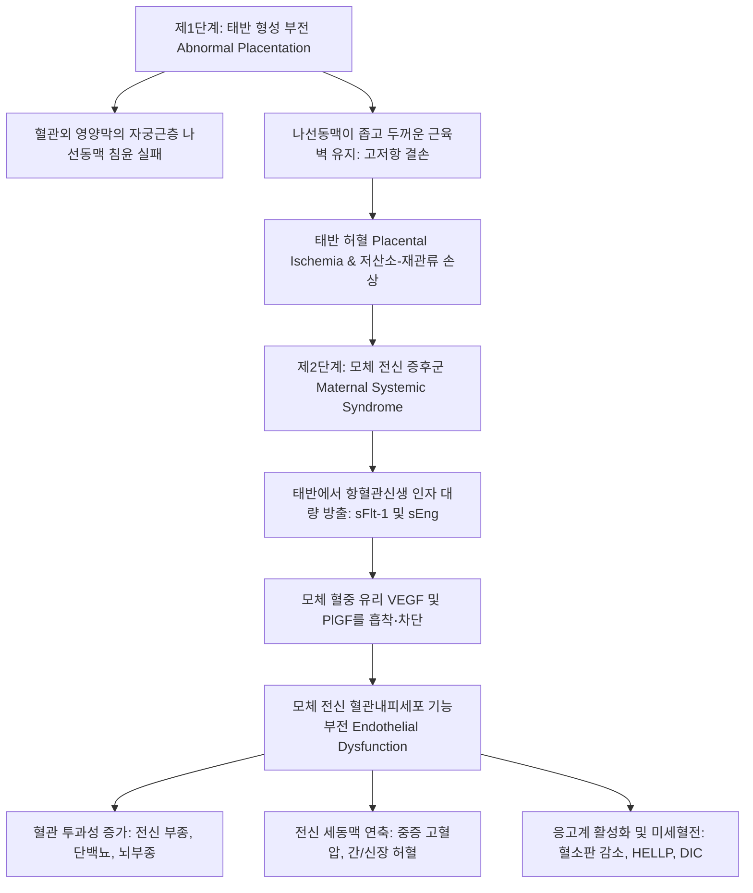
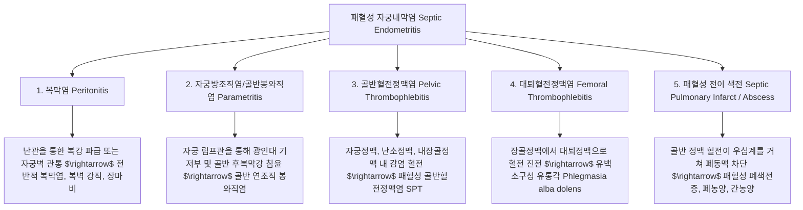

# 📑 [Netter Vol.1] Day 12: 임신 - 착상·태아발생·태반순환·산과합병증·전자간증 및 분만학 (Section 12 완독)

> 📖 **원서 출처**: [The Netter Collection of Medical Illustrations - Volume 1, Reproductive System.pdf (pp. 242-281)](https://drive.google.com/file/d/1x-xTgPfUfiK7dsQyp5L5qfjFYSD_XyGm/view?usp=drivesdk)  
> 🏷️ **범위**: Section 12 전편 (Plate 12-1 ~ Plate 12-39, 총 39개 플레이트 전수 포함)  
> 📌 **핵심 테마**: 포배기 착상 분자생물학(탈락막화, 영양막 침윤) 및 삼분기별 기관발생 이정표, 융모간강 태반 순환과 모체-태아-태반 단위 내분비학(hCG, hPL, 프로게스테론, 에스트리올 E3 생합성), 이소성 임신(난관 팽대부/협부 파열, 메토트렉세이트 MTX 기준) 및 자연유산·자궁경관무력증(맥도날드/시로드카 봉합술), 다태임신 융모막성/양막성 감별 및 쌍태아 수혈 증후군(TTTS), 후기 임신 출혈의 양대 축인 전치태반(통증 없는 선홍색 출혈) vs 태반조기박리(통증성 암적색 출혈, 쿠벨레르 자궁, DIC), 유착태반 스펙트럼(PAS), 임신융모질환(완전/부분 포상기태, 융모암), 분만 4단계 및 두정위 진입-하강-굴곡-내회전-신전-외회전-만출의 7대 주운동(Cardinal movements), 기계분만(겸자/흡입), 3·4도 산과적 회음열상 복구, 제왕절개술(Pfannenstiel & 저부 횡절개), 산과적 응급(자궁파열, 자궁내번증 정복술, 양수색전증 AFE), 임신성 고혈압 질환 스펙트럼(전자간증 2단계 병태생리, 나선동맥 리모델링 부전, sFlt-1/PlGF 불균형, HELLP 증후군, 황산마그네슘 경련 예방 및 아스피린 예방), 자궁내 태아성장지연(IUGR 대칭형 vs 비대칭형, 제대동맥 도플러 반전), Rh 동종면역(로감 투여 원칙), 선천성 매독 및 산욕기 패혈증(산욕열)

---

## 1. 개요 및 마스터 요약 (Executive Summary)

1. **포배기 착상(Implantation) 및 태반 형성(Placentation)의 분자생물학**:
   - 수정 후 6~7일째 투명대를 탈출한 포배(Blastocyst)가 자궁내막에 부착(Apposition) 및 침윤(Invasion)을 개시. 영양외배엽은 다핵체인 **합포체영양막(Syncytiotrophoblast)**과 단핵체인 **세포영양막(Cytotrophoblast)**으로 분화.
   - **나선동맥(Spiral artery)의 2단계 리모델링**: 혈관외 세포영양막이 모체 자궁나선동맥 내피와 중막 평활근을 파괴하고 침윤하여 저저항·고유량(Low-resistance, High-capacitance) 도관으로 변환. 이 과정의 실패가 전자간증(Preeclampsia)과 태아성장지연(IUGR)의 근본 기전임.
2. **모체-태반-태아 내분비 협동 단위 (Fetoplacental Unit)**:
   - **hCG (융모성 성선자극호르몬)**: 합포체영양막에서 분비되어 임신 8~10주까지 황체를 유지(프로게스테론 분비 지속). 임신 10주경 피크 도달 후 안정화.
   - **프로게스테론 ($P_4$)**: 임신 8주 이후 태반이 전담 합성(모체 콜레스테롤 이용). 자궁근 수축을 억제하여 임신 유지.
   - **에스트리올 ($E_3$)**: 모체와 태반은 $16\alpha$-수산화 효소가 결핍되어 있으므로, 반드시 **태아 간(Liver)**의 $16\alpha$-OH DHEA-S 합성과 **태반 술파타아제/아로마타제**의 협동을 거쳐야만 합성 가능 $\rightarrow$ 태아 웰빙(Well-being)의 가장 민감한 지표.
3. **산과적 출혈의 감별 및 응급 관리**:
   - **임신 초기 출혈**: 자궁외임신(Ectopic pregnancy, 95% 난관 호발 $\rightarrow$ MTX 의학적 요법 vs 복강경 수술), 절박/불가피/불완전 유산, 포상기태(Snowstorm appearance, 현저한 hCG 상승).
   - **임신 후기 출혈**:
     - **전치태반 (Placenta Previa)**: 자궁내구(Internal os)를 덮는 태반. **무통성 선홍색 질출혈**. 내진 절대 금기(초음파 진단), 제왕절개 필수.
     - **태반조기박리 (Abruptio Placentae)**: 분만 전 기저 탈락막의 조기 박리. **극심한 통증성 암적색 질출혈, 판자 같은 자궁 경직(Board-like rigidity)**, 소비성 응고장애(DIC) 및 자궁근층 내 광범위 출혈인 **쿠벨레르 자궁(Couvelaire uterus)** 유발.
     - **유착태반 스펙트럼 (PAS)**: 제왕절개 기왕력 및 전치태반 동반 시 급증. 기저 탈락막 결손으로 융모가 자궁근층에 유착(Accreta), 침투(Increta), 장막 돌파(Percreta).
4. **분만 기전, 진행 단계 및 산과적 손상**:
   - **분만 4단계**: 1기(진통 개시~자궁경관 10 cm 완전 개대, 잠재기/활성기), 2기(완전 개대~태아 분만), 3기(태아 분만~태반 만출, 30분 이내), 4기(태반 만출 후 1~2시간, 산후출혈 집중 감시).
   - **두정위 정상 분만의 7대 주운동 (Cardinal Movements)**: 진입(Engagement) $\rightarrow$ 하강(Descent) $\rightarrow$ 굴곡(Flexion) $\rightarrow$ 내회전(Internal rotation, AP 축 일치) $\rightarrow$ 신전(Extension, 질구 탈출) $\rightarrow$ 외회전(External rotation, 어깨 회전 동기화) $\rightarrow$ 만출(Expulsion).
   - **산과적 회음 열상**: 1도(질 점막/회음 피부), 2도(회음체 근육), 3도(항문괄약근 EAS/IAS 파열), 4도(항문직장 점막 완전 파열). 3·4도 열상은 대변 실금 방지를 위해 end-to-end 또는 overlapping 무장력 봉합 필수.
5. **고위험 임신 병태생리: 전자간증, IUGR 및 동종면역**:
   - **전자간증(Preeclampsia)**: 임신 20주 이후 발생한 고혈압($\ge 140/90\,\text{mmHg}$) + 단백뇨($\ge 300\,\text{mg/24hr}$) 또는 표적장기 손상(혈소판 감소, 간기능 이상, 신기능 부전, 폐부종, 뇌/시각 증상). 태반 허혈 $\rightarrow$ 항혈관신생 인자(**sFlt-1**, sEng) 과다 분비 $\rightarrow$ 전신 모체 혈관내피세포 손상. 근치적 치료는 **분만(Delivery)**이며, 경련 예방은 **황산마그네슘($\text{MgSO}_4$)**.
   - **태아성장지연 (IUGR)**: 추정 체중 < 10백분위수. 초기 감염/유전 원인의 대칭형(Symmetric) vs 후기 태반부전 원인의 비대칭형(Asymmetric, Head sparing). 제대동맥 도플러 이완기말 혈류 소실/역전(AEDV/REDV) 시 응급 분만 적응증.
   - **Rh 동종면역**: Rh 음성 산모가 Rh 양성 태아 적혈구(D 항원)에 감작되어 발생하는 항체 매개성 용혈(태아수종 Hydrops fetalis). 감작 예방을 위해 **28주 및 분만 후 72시간 이내에 항-D 면역글로불린(로감, RhoGAM) $300\,\mu\text{g}$** 근주.

---

## 2. 착상, 배아발생 및 삼분기별 발달 이정표 (Plates 12-1 ~ 12-4)

### Plate 12-1 | 배아의 착상 및 초기 발생 (Implantation and Early Development of Ovum)

![[Netter_V1_Plate12-1.png]]

#### 1) 포배기 착상의 분자생물학적 시퀀스 및 초기 배아 분화
- **시간적 타임라인 (Chronological Timeline)**:
  - **수정 (Fertilization)**: 대개 난관 팽대부(Ampulla of oviduct)에서 발생. 정자가 난자에 진입한 직후, 웅성 및 자성 전핵(Male and female pronuclei)이 융합하여 분할핵(Segmentation nucleus)을 형성.
  - **난할 및 상실배 형성 (Cleavage & Morula)**: 분할핵의 급격한 체세포분열로 수정 후 3~4일차에 16~32세포기 상실배(Morula)가 형성되어 난관 연동운동과 섬모운동에 의해 자궁강 내로 진입.
  - **포배 형성 (Blastocyst formation)**: 상실배 외측 세포들이 더 빠르게 증식하여 구형을 이루고 반유동성 물질(Semi-fluid substance)을 분비하여 중심부에 액체로 채워진 포배강(Blastocoel)을 형성.
    - 외측 단층의 외배엽성 세포: **원시 영양막(Primitive trophoblast)**.
    - 한쪽 극에 치우친 느리게 분열하는 세포 덩어리: **내세포괴(Inner cell mass / Embryoblast)** $\rightarrow$ 배아 본체 형성의 기원.
  - **부화 (Hatching)**: 수정 후 5~6일째 단백분해효소 작용으로 투명대(Zona pellucida)를 뚫고 탈출.
  - **자궁 유액(Uterine milk)에 의한 영양 공급**: 착상 전 자궁강 내에 자유롭게 부유하는 동안 자궁내막 선(Endometrial glands)에서 분비되는 글리코겐, 지질, 뮤신이 풍부한 자궁 유액을 흡수하여 배아 성장.
  - **착상 개시 및 완료**: 수정 후 6~7일째 착상 개시, **수정 후 10~12일째 자궁내막 기질 내로 완전히 매몰(Completely embedded)**.

- **착상의 3단계 기전 (Three Phases of Implantation)**:
  1. **접촉/부착 (Apposition)**: 착상창(Implantation window, LH 피크 후 6~10일) 동안 자궁내막 상피 표면에 돌출하는 미세융모 복합체인 **피노포드(Pinopodes)**와 영양외배엽 표면의 L-selectin 및 인테그린(Integrin $\alpha_v\beta_3, \alpha_4\beta_1$)의 특이적 결합으로 초기 위치 고정.
  2. **유착 (Adhesion)**: 세포외기질 단백질(피브로넥틴, 라미닌) 및 E-cadherin 상호작용을 통해 영양막세포가 자궁내막 상피 기저막에 견고히 부착.
  3. **침윤 (Invasion)**: 합포체영양막이 기질금속단백분해효소(MMP-2, MMP-9, Collagenase)를 분비하여 자궁내막 상피간질과 기저막을 분해하고 기질 깊숙이 파고듦.

- **영양막세포(Trophoblast)의 2중 분화**:
  - **내측 세포영양막 (Cytotrophoblast, Langhans cells)**: 뚜렷한 세포막과 단핵을 가진 증식성 줄기세포 구획. 활발한 체세포분열을 지속하여 외측으로 세포를 공급.
  - **외측 합포체영양막 (Syncytiotrophoblast)**: 세포막 경계가 소실된 다핵 합포체(Multinucleated syncytium). 단백분해효소를 분비해 모체 기질 침윤을 주도하며, 모체 혈관벽을 침식하여 혈액이 차는 **혈액동(Lacunae)**을 형성. **hCG, 프로게스테론, hPL** 등 임신 유지 호르몬을 대량 합성·분비.

- **2배엽 배반 (Bilaminar Embryonic Disc) 및 배아외 구조 형성**:
  - 내세포괴는 **상배엽(Epiblast, 원시 외배엽)**과 **하배엽(Hypoblast, 원시 내배엽)**으로 분화.
  - 상배엽 내부에서 양막세포(Amnioblasts)로 둘러싸인 **양막강(Amniotic cavity)** 형성.
  - 하배엽 가장자리 세포들이 증식하여 호이저막(Heuser\'s exocoelomic membrane)을 형성하고 내부의 **원발난황낭(Primary yolk sac)**을 둘러쌈.
  - 배아외 중배엽(Extraembryonic mesoderm)이 발생하여 영양막 내면과 난황낭 외면을 감싸며 배아외 체강(Chorionic cavity) 형성.

#### 2) 자궁내막의 탈락막 반응 (Decidualization) 및 과도 침윤 억제 기전
- **탈락막세포 전환**: 배란 후 프로게스테론의 지속적인 자극으로 자궁내막 기질세포가 다량의 글리코겐과 지질을 축적하여 크고 다각형인 **탈락막세포(Decidual cells)**로 전환. 배아에 국소 영양을 공급하고 면역학적 거부반응 억제.
- **해부학적 3개 탈락막 구획 (Decidual Zones)**:
  - **기저 탈락막 (Decidua basalis)**: 착상 부위 바로 아래(영양막 심층)에 위치하며, 나선동맥이 개구하고 장차 성숙 태반의 모체측 판(Maternal basal plate)을 형성.
  - **피막 탈락막 (Decidua capsularis)**: 성장하는 포배의 표면을 덮어 자궁강 내강 쪽으로 돌출하는 얇은 탈락막층. 배아 성장에 따라 신전되며 혈류 공급이 줄어들어 점차 위축·퇴화.
  - **벽 탈락막 (Decidua parietalis / vera)**: 착상 부위 이외의 자궁강 전체를 둘러싸는 나머지 자궁내막. **임신 14~16주경** 배아의 급격한 팽창으로 피막 탈락막과 벽 탈락막이 접촉·융합하여 자궁강(Uterine cavity) 폐쇄.
- **니타부흐 층 (Nitabuch\'s layer)**:
  - 침윤하는 합포체영양막과 기저 탈락막이 만나는 경계면에 형성되는 **섬유소원성 변성층(Fibrinoid degeneration zone)**.
  - 영양막의 과도한 자궁근층 침윤을 차단하는 생리적 방어벽 역할을 수행. 이 층의 형성 부전 시 유착태반 스펙트럼(Placenta Accreta Spectrum)이 발생함.

---

### Plate 12-2 | 임신 제1삼분기 발달 이정표 (Developmental Events of the First Trimester)

![[Netter_V1_Plate12-2.png]]

#### 1) 배아기 및 초기 태아기 발달 시퀀스 (수정 후 3~12주, 임신 5~14주)
- **제1삼분기 개요 및 손실률**:
  - 임신 첫 14주는 전 생애의 형태학적 기초가 확립되는 가장 결정적인 시기.
  - **수정란의 50%~60%가 제1삼분기를 완주하지 못하고 자연 도태(생화학적 임신 손실, 유산)**됨.
  - **황체-태반 호르몬 전환 (Luteal-Placental Shift)**: 임신 7~9주부터 시작되어 **임신 12주경** 태반이 프로게스테론과 에스트로겐의 전담 분비원으로 완전히 교체됨. 이 전환이 순조롭지 못할 경우 호르몬 결핍으로 유산 발생.

- **주차별 정량적 발달 이정표 (Netter Text & Chart 발췌)**:
  - **수정 후 4주 (임신 6주)**:
    - **두둔길이 (Crown-Rump Length, CRL)**: 약 $4\sim 5\,\text{mm}$.
    - C-자형 배아 굴곡, 신경관(Neural tube) 폐쇄 완료, 원시 심장관(Heart tube) 박동 및 혈류 순환 개시.
    - 4쌍의 아가미궁(Branchial/pharyngeal arches), 시각소포(Optic pit), 이배(Otic pit), 상/하악 돌기 및 사지 싹(Limb buds) 출현.
  - **수정 후 8주 (임신 10주, 배아기 완료)**:
    - **CRL**: 약 $30\,\text{mm}$ ($3\,\text{cm}$), 체중 약 $1\sim 2\,\text{g}$.
    - 모든 주요 기관계의 원기(Primordia) 형성 완료 (기관형성기 Organogenesis 종료).
    - 손가락과 발가락이 완전히 분리되며 물갈퀴 소실, 팔꿈치와 무릎 굴곡 가능.
    - 안검(Eyelids) 형성, 귓바퀴 윤곽 형성, 꼬리 퇴화.
    - **생리적 제대 탈장 (Physiological umbilical herniation)**: 장관의 급격한 신장으로 중장(Midgut)이 제대 기저부로 탈출했다가 임신 10~11주에 복강 내로 완전 정복.
    - 외생식기가 발달하나 남녀 형태 감별은 불가능.
  - **임신 10주 (수정 후 8주 이후)**: CRL 약 $61\,\text{mm}$, 체중 약 $14\,\text{g}$.
  - **임신 12주**: CRL 약 $87\,\text{mm}$, 체중 약 $45\,\text{g}$. 사람의 얼굴 윤곽 완비, 손톱(Fingernails) 원기 출현, 신장에서 원시 소변 분비 개시.
  - **임신 14주**: CRL 약 $120\,\text{mm}$, 체중 약 $110\,\text{g}$.

#### 2) 제1삼분기 초음파 및 선별 검사 지표
- **경질 초음파 (TVUS) 소견과 혈청 $\beta$-hCG 판별치 (Discriminatory Zone)**:
  - 혈청 $\beta$-hCG가 **$1,500\sim 2,000\,\text{mIU/mL}$**에 도달하면 TVUS상 정상 자궁내 임신낭(Gestational Sac, GS)이 반드시 관찰되어야 함 (이 수치 이상인데 GS가 없으면 자궁외임신 강력 의심).
  - 임신 5~6주: 난황낭(Yolk sac) 확인.
  - 임신 6주경: 배아 극(Embryonic pole) 및 태아 심박동(Fetal cardiac activity, 100~120 bpm) 확인.
- **제1삼분기 다운증후군(21삼염색체증) 선별 검사 (11~13주+6일)**:
  - **목덜미 투명대 (Nuchal Translucency, NT)**: 태아 후경부 피하 두께 측정 (비정상 기준: $\ge 3.0\sim 3.5\,\text{mm}$).
  - **모체 혈청 이중 표지자 (Combined test)**:
    - **PAPP-A (Pregnancy-associated plasma protein A)**: 현저한 감소.
    - **Free $\beta$-hCG**: 현저한 증가.
- **확진 및 조기 유전 진단**:
  - **융모막 융모 생검 (Chorionic Villus Sampling, CVS)**: 임신 10~13주에 경복부 또는 경경부로 융모막 조직을 채취하여 염색체/유전자 분석.
  - **세포 유리 DNA (Cell-free DNA / NIPT)**: 임신 10주부터 모체 혈액 내 태아 유래 cfDNA 분석 (민감도 $>99\%$).

---

### Plate 12-3 | 임신 제2삼분기 발달 이정표 (Developmental Events of the Second Trimester)

![[Netter_V1_Plate12-3.png]]

#### 1) 태아기 급속 성장과 기능적 분화 (14~28주)
- **임상적 특징 및 모체 생리 변화**:
  - 임신 손실 위험이 급격히 감소하며, $\beta$-hCG 수치가 안정적 정체기(Plateau)에 접어들어 입덧(Morning sickness)과 유방 압통이 호전됨.
  - **모체 혈류량 및 심박출량 증가**: 제2삼분기 말까지 모체 혈액량과 심박출량이 비임신 대비 **$20\%$ 이상 증가**.
  - 자궁 증대로 복강 장기가 압박되어 속쓰림(Heartburn)과 변비(Constipation) 발생.
  - 제2삼분기 말(26~28주)에는 치질(Hemorrhoids)과 요통(Low back pain)이 호발하며, **임신 26주경 유선에서 초유(Colostrum)가 처음으로 확인**됨.
  - **제2삼분기 임신 손실 원인**: 상행성 감염에 의한 급성 융모양막염(Acute chorioamnionitis) 및 태반 염증, 태아 이수성 염색체 이상, 모체 혈전성향증(Thrombophilias), 자궁경관무력증(Cervical insufficiency).

- **태아 발달 이정표 (주차별 CRL 및 체중 정밀 제원)**:
  - **임신 14주**: CRL $87\,\text{mm}$, 체중 $45\,\text{g}$.
  - **임신 16주**: CRL $120\,\text{mm}$, 체중 $110\,\text{g}$.
    - **태아가 태반 무게를 추월하기 시작 (Fetus begins to outweigh placenta)**.
    - 외생식기가 초음파상 남녀 감별이 가능할 정도로 완전히 형성.
    - 췌장에서 인슐린 분비 개시, 신장에서 소변 배출 시작 $\rightarrow$ **태아 소변이 양수(Amniotic fluid)의 주성분**을 이룸. 태아가 양수를 삼키며 위장관 기능 연습.
    - 잇몸 속에서 치배(Tooth buds) 형성.
  - **여아 태아의 난모세포 피크 (Peak Oocyte Pool)**:
    - **임신 16~20주경 여아 난소 내 원시 난모세포 수가 전 생애 최대치인 $600만\sim 700만\text{개}$에 도달**. 이후 퇴화(Atresia)되어 출생 시 약 100만 개, 사춘기에는 30만 개로 감소.
  - **임신 18주**: CRL $160\,\text{mm}$, 체중 $200\,\text{g}$.
    - **태동 자각 (Quickening)**: 초산부는 18~20주, 경산부는 16~18주에 최초 자각.
  - **임신 20주**: CRL $200\,\text{mm}$, 체중 $320\,\text{g}$.
    - 솜털(Lanugo)과 태지(Vernix caseosa) 발달, 태변(Meconium)이 소화관 내에 축적.
  - **임신 22주**: CRL $210\,\text{mm}$, 체중 $460\,\text{g}$. 얼굴 표정 근육 발달.
  - **임신 24주**: CRL $250\,\text{mm}$, 체중 $630\,\text{g}$.
    - **태아 생존력 개시 (Beginning of Fetal Viability)**: 제2형 폐포상피세포에서 표면활성물질(Surfactant) 분비 개시.
    - 외이 및 내이 형성으로 외부 소리를 듣고 반응(Auditory response).
    - 수면-각성 주기 확립 (하루 18시간 수면, 6시간 각성).
  - **임신 26주**: 체중 약 $820\,\text{g}$. 손톱(Fingernails) 완비.
  - **임신 28주**: 체중 약 $1,000\,\text{g}$ ($1\,\text{kg}$).

- **제2삼분기 선별 검사 및 산전 진단**:
  - **모체 혈청 사중 선별 검사 (Quad screen, 15~20주)**: MSAFP, hCG, Unconjugated Estriol ($uE_3$), Inhibin A.
  - **양수천자 (Amniocentesis, 15~20주)**: 세포유전학적 염색체 핵형 분석.
  - **정밀 태아 정밀초음파 (Level II ultrasound, 18~22주)**: 해부학적 기형 전수 검사.

---

### Plate 12-4 | 임신 제3삼분기 발달 이정표 (Developmental Events of the Third Trimester)

![[Netter_V1_Plate12-4.png]]

#### 1) 체중 축적, 폐 성숙 및 분만 준비 (27~40+주)
- **임상적 특징 및 제3삼분기 호발 합병증**:
  - 전자간증(Preeclampsia), 임신성 고혈압, 임신성 당뇨병, 산전 출혈(전치태반, 태반조기박리), 양수량 이상(과다증/과소증), 조기진통(Preterm labor), 자궁내 태아성장지연(IUGR) 등이 주로 발현.
- **태아의 해부생리학적 성숙**:
  - **체지방 축적 (Fetal Fat Accumulation)**: 임신 32주부터 피하지방 축적이 급증하여 만삭 태아 체중의 **약 $15\%$**를 차지. 독립적 신생아 생존 시 체온 유지와 초기 에너지 저장고 역할.
  - **골격계 발달**: 임신 29주경 태아는 **300개의 뼈**를 보유. 출생 후 성장판 융합(90개 이상의 뼈 융합)을 거쳐 성인의 206개 뼈로 완성됨.
  - **고환 강하 (Testicular Descent)**: 남아 태아에서 인도대(Gubernaculum, 여아에서는 자궁원인대 Round ligament에 해당)의 유도 하에 임신 28~32주에 서혜관을 거쳐 **임신 38주경 음낭(Scrotum) 내로 완전 하강**.
  - **태위 확정 (Fetal Presentation)**: 임신 36주경 대부분 최종 태위(두정위 Vertex 95%, 둔위 Breech 3~4%, 횡위 Transverse <1%)로 정착.
  - 파악 반사(Firm grasp reflex) 확립 (임신 36주).

- **모체 혈역학 및 자궁수축 준비**:
  - **심혈관계 최대 적응**: 모체 혈액량이 거의 2배(40~50%) 증가하고 심박출량이 극대화. 만삭 시 **모체 심박출량의 $20\%$ ($700\sim 1000\,\text{mL/min}$)**가 자궁과 태반으로 관류됨.
  - **자궁근의 분만 준비**: 임신 후기 자궁근세포막에 **옥시토신 수용체(Oxytocin receptors)가 수십 배 폭증**하고 세포 간 신호 전달 통로인 **간극연접(Gap junctions, Connexin 43)**이 급증하여 동시 협조적 수축(Coordinated contractions)이 가능한 기능적 합포체를 형성.
  - **브랙스톤-힉스 수축 (Braxton-Hicks contractions)**: 불규칙한 무통성 가진통이 점차 빈번해짐.
  - **양수량 변화**: **임신 36~37주경 약 $1,000\,\text{mL}$ ($1\,\text{L}$)로 피크**에 도달한 후, 만삭(40주)에 약 $800\,\text{mL}$, 과숙 임신 시 급격히 감소 ($<500\,\text{mL}$).

- **모체 해부학적 적응 및 증상 변화**:
  - 자궁 증대로 횡격막과 위장관이 밀려올라가 조기 포만감, 위식도역류, 변비 지속.
  - 모체의 무게중심이 전방으로 이동하면서 척추 전만증(Lumbar lordosis) 발생 $\rightarrow$ 요통 및 특유의 **오리걸음(Duck waddle)** 보행.
  - **태아 진입 및 하강 (Lightening / Pelvic descent, 초산부 약 36주)**:
    - 아두가 골반 내로 내려앉으며 자궁저부 높이가 감소.
    - 호흡 곤란 및 위장 장애는 완화되나, 방광 압박으로 빈뇨(Urinary frequency) 악화 및 골반 압박감 증가.

- **산전 모니터링 및 과숙 임신 관리**:
  - **태동 측정 (Kick counts)**: 산모가 측정한 태동이 1시간당 4회 이상이면 태아 안녕을 시사.
  - **태반 노화 (Placental Senescence)**: 임신 40주 이후 태반 기능 부전 위험 급증 $\rightarrow$ 비수축검사(NST), 자궁수축자극검사(CST), 생물리학적 계측(Biophysical Profile, BPP: 호흡, 태동, 긴장도, 양수량, NST), 도플러 혈류 검사 필수 시행.

---

## 3. 태반학, 태아-모체 혈류역학 및 임신 내분비학 (Plates 12-5 ~ 12-7)

### Plate 12-5 | 태반 및 태아막의 발생 (Development of Placenta and Fetal Membranes)

![[Netter_V1_Plate12-5.png]]

#### 1) 융모(Chorionic Villi)의 3단계 형태 형성학 및 영양막 세포각
- **영양막의 분화**: 포배 착상과 함께 영양외배엽은 내측의 단핵 세포영양막(Cytotrophoblast, Langhans layer)과 외측의 다핵 합포체영양막(Syncytiotrophoblast)으로 분화.
- **융모의 3단계 발생 시퀀스 (Stages of Villus Development)**:
  1. **원발융모 (Primary villi, 수정 후 11~13일)**:
     - 합포체영양막의 내측으로 세포영양막 세포들이 원주상으로 증식하여 파고든 단순 원통형 세포 기둥.
  2. **차발융모 (Secondary villi, 수정 후 16일)**:
     - 배아외 체강 중배엽(Extraembryonic somatic mesoderm)이 원발융모의 세포영양막 중심부로 침투하여 결합조직 중심축(Connective tissue core)을 형성.
  3. **삼발융모 (Tertiary villi, 수정 후 21일)**:
     - 중배엽 기질 내의 간엽세포가 혈관내피세포와 원시 혈구로 분화하여 모세혈관망(Capillary network) 및 세동맥·세정맥을 형성.
     - 융모 내 모세혈관이 배아 본체의 심혈관계 및 제대혈관(Umbilical vessels)과 문합을 완성하여 **배아-태반 순환(Fetoplacental circulation) 가동**.
- **세포영양막 세포각 (Cytotrophoblastic Shell)**:
  - 융모 끝부분의 세포영양막 세포들이 합포체영양막을 뚫고 나와 외측으로 확장되면서 서로 융합하여 기저 탈락막 표면에 형성하는 완전한 세포층.
  - 융모막낭을 모체 자궁벽(기저 탈락막)에 강고히 고정시키는 닻(Anchor) 역할을 수행.

#### 2) 태반막 및 융모막의 국소 분화
- **엽상 융모막 (Chorion frondosum)**:
  - 기저 탈락막과 맞닿은 착상 부위의 융모들은 풍부한 모체 혈류 공급을 받아 가지를 치며 폭발적으로 증식하여 성숙 태반의 태아측 구성요소(Fetal placenta)를 형성.
- **평활 융모막 (Chorion laeve)**:
  - 피막 탈락막 쪽으로 돌출한 융모들은 배아의 팽창으로 압박받고 혈류가 차단되면서 점차 허혈성 위축 및 변성을 거쳐 **임신 3~4개월경 무혈관성의 얇고 투명한 평활 융모막(Smooth chorion)**으로 전환.
  - 양막(Amnion)과 평활 융모막이 융합하여 단일한 **양막융모막(Amniochorionic membrane)**을 형성.

#### 3) 태반 혈액 장벽 (Placental Barrier)의 성숙 및 호프바우어 세포
- **초기 임신 태반 장벽 (두께 약 $25\,\mu\text{m}$, 4개 층)**:
  1. 합포체영양막 (Syncytiotrophoblast)
  2. 연속적인 세포영양막층 (Langhans layer)
  3. 융모 기질 간엽 및 기저막 (Mesenchymal stroma & basement membrane)
  4. 태아 모세혈관 내피세포 (Capillary endothelium)
- **만삭 태반 장벽 (두께 약 $2\sim 3\,\mu\text{m}$, 2개 층으로 극적 박형화)**:
  - 세포영양막이 불연속적으로 퇴화하여 얇아진 합포체영양막과 태아 모세혈관 내피세포가 기저막을 사이에 두고 거의 직접 맞닿아 가스 및 영양소 확산 효율을 극대화.
  - 노화된 합포체 핵들이 모여 형성하는 **합포체 결절(Syncytial knots)** 관찰.
- **호프바우어 세포 (Hofbauer cells)**:
  - 융모 기질 내에 상주하는 태아 유래 원시 대식세포(Histiocyte/Macrophage).
  - 식세포 작용, 조직 리모델링 및 항원 전달 억제를 통한 국소 면역 조절 기능을 담당.

---

### Plate 12-6 | 태반 순환 및 태아-모체 혈류역학 (Circulation in Placenta)

![[Netter_V1_Plate12-6.png]]

#### 1) 융모간강(Intervillous Space)의 혈류역학 및 순환 완성
- **발생적 기원**: 융모간강은 원시 영양막 침윤 시 모체 나선동맥과 정맥동을 개방하면서 형성된 혈액동(Lacunae)들이 서로 융합하여 형성된 거대한 단일 모체 혈액 웅덩이(Blood lake).
- **모체 태반 혈류망 완성 시기**: **임신 제1삼분기 말(임신 12~13주경)에 모체 나선동맥의 혈류망 리모델링이 완료**되어 본격적인 태반 관류 개시 (이 과정의 장애가 전자간증 및 IUGR의 병인).
- **융모간강의 혈류역학적 압력 경사**:
  - 모체 나선세동맥(80~100개 개구)에서 박출되는 혈액의 수축기 압력: **$70\sim 80\,\text{mmHg}$**.
  - 융모간강 내부 압력: **약 $10\,\text{mmHg}$** (자궁 수축 시 $30\sim 50\,\text{mmHg}$로 상승).
  - 모체 자궁정맥의 압력: **약 $8\,\text{mmHg}$**.
  - **분수 효과 (Fountain jet effect)**: 압력 차에 의해 나선동맥에서 솟구친 동맥혈 분출류(Jet)가 융모간강 천장인 융모막판(Chorionic plate) 쪽으로 쏘아 올려진 후, 부유 융모(Floating villi) 사이를 천천히 세척하듯 흘러내리며 가스 및 물질 교환을 수행하고 기저판 및 변연동으로 배출.
- **태반 내부의 혈액 산소포도 경사 (Quality of Blood Gradient)**:
  - 기저 탈락막에 인접한 모체측 심부: 고산소 동맥혈(Arterial blood).
  - 융모막하강(Subchorial space): 저산소 정맥혈(Venous blood) 양상.

#### 2) 태아-태반 순환 구조
- **제대동맥 (Two Umbilical Arteries)**:
  - 태아 내장골동맥(내하복동맥 Hypogastric arteries)의 직접적인 연장선.
  - 이산화탄소와 요소, 젖산 등 대사 노폐물을 가득 실은 정맥혈 성상의 혈액을 융모 모세혈관망으로 운반.
- **제대정맥 (One Umbilical Vein)**:
  - 융모 모세혈관망에서 산소와 영양소를 공급받은 신선한 동맥혈 성상의 혈액을 태아 체내(정맥관 Ductus venosus 및 하대정맥 IVC)로 수송.
- **영양막 허혈의 원리**:
  - 융모 영양막은 모체 융모간강의 혈액으로부터 직접 산소와 영양을 흡수하므로, 모체 혈류가 정체·차단되면 즉각적인 **융모 경색(Villus infarction)**이 유발됨.

#### 3) 자궁탈락막 중격, 태반엽 및 변연동의 병리해부학
- **탈락막 중격 (Decidual Septa)과 태반엽(Cotyledons)**:
  - 기저 탈락막에서 융모간강 쪽으로 융기된 쐐기형 결합조직 돌기들로, 태반을 15~20개의 기능적 분엽인 **코틸레돈(Cotyledons)**으로 불완전 구획화 (융모막판까지 도달하지는 않음).
- **변연동 (Marginal Sinus)**:
  - 태반의 가장자리 둘레를 주행하는 거대한 원형 정맥동으로, 탈락막 변연부(Decidua marginalis)의 회색 조직 륜 밑을 통과.
  - 태반 정맥혈 배출의 주요 통로 중 하나이나, **폐쇄, 혈전증, 파열(Rupture of marginal sinus)** 및 국소 탈락막 퇴행성 변화가 빈번하게 발생하는 호발 부위.

#### 4) 태반의 복합 내분비 장기로서의 기능
- 수정 후 10일경부터 랑한스 세포영양막 및 합포체영양막에서 hCG 합성 개시.
- **임신 2개월(8주) 말부터 태반이 에스트로겐과 프로게스테론의 체내 최대 생산 공장**으로 등극.
- 태반락토겐(hPL / hCS), 인슐린유사성장인자(IGF-1, IGF-2), 릴랙신(Relaxin), 프로스타글란딘 등 다채로운 내분비·자가분비 호르몬 분비.

---

### Plate 12-7 | 임신 중 내분비 및 호르몬 변동 (Hormonal Fluctuations in Pregnancy)

![[Netter_V1_Plate12-7.png]]

#### 1) 주요 임신 호르몬의 생화학 및 분비 역학



- **융모성 성선자극호르몬 (hCG)**:
  - **분자 구조**: 분자량 $36.7\,\text{kDa}$, 244개 아미노산 잔기로 구성된 이종이량체 당단백질(Heterodimeric glycoprotein).
    - **$\alpha$-소단위 (92 AA)**: LH, FSH, TSH와 아미노산 서열이 $100\%$ 동일.
    - **$\beta$-소단위 (145 AA)**: hCG 고유의 생물학적·면역학적 특이성을 부여하는 C-말단 펩타이드(CTP, 32 AA) 보유.
  - **초민감도 검출**: 화학발광 면역분석법(Chemiluminescent immunoassay)으로 혈청 농도 **$5\,\text{mIU/mL}$까지 정량 검출**.
  - **생리적 기능**:
    1. **임신 초기 황체 구조적 구조(Rescue)**: 황체의 LH/CG 수용체에 결합하여 프로그램된 퇴화를 막고 지속적인 프로게스테론 분비를 유도하여 착상 내막(탈락막) 유지.
    2. **모체 면역관용 유도**: hCG의 강한 음전하(Sialic acid 잔기)가 모체 면역세포를 정전기적으로 밀어내어 반동종이식편(Semiallograft)인 태아를 면역 거부로부터 보호.
    3. **태아 고환의 테스토스테론 합성 자극**: 라이디히 세포(Leydig cells)를 자극하여 남성 외생식기 분화 유도.
  - **분비 궤적**: 착상 직후 지수함수적으로 증가하여 **임신 8~10주(임신 3개월)에 최대 피크($100,000\,\text{mIU/mL}$)** 도달 $\rightarrow$ 4~5개월경 급격히 하강 $\rightarrow$ 저수준 평형을 이루며 만삭까지 지속.

- **프로게스테론 ($P_4$) 및 프레그난디올 (Pregnanediol)**:
  - **생합성 경로**: 임신 8주 이후 태반 합포체영양막이 모체 순환의 **저밀도 지단백 콜레스테롤(Maternal LDL cholesterol)**을 섭취하여 합성 (태반은 $17\alpha$-hydroxylase가 결핍되어 있어 안드로겐으로 전환하지 못하고 순수 프로게스테론을 대량 방출).
  - **생리적 작용**: 자궁 평활근의 안정화(수축 억제, Resting membrane potential 음전하화), 자궁경부 폐쇄 유지, 모체 T세포 면역 억제.
  - **황체 절제술(Oophorectomy)과의 관계**: **임신 4개월(16주) 이후에는 양측 난소를 절제하더라도 태반 프로게스테론 분비가 충분하여 임신이 안전하게 유지**됨.
  - **분만 개시 기전**: 임신 마지막 달에 기능적 프로게스테론 활성 감소(Progesterone withdrawal)가 발생하여 분만 진통 유발을 촉진.
  - **배설 대사체**: 모체 소변 내 **프레그난디올(Pregnanediol)** 형태로 배설.

- **에스트로겐 ($E_1, E_2, E_3$) 및 에스트리올 ($E_3$)의 태아-태반 협동 단위**:
  - 임신부 혈청 에스트로겐의 $90\%$ 이상을 차지하는 **에스트리올($E_3$)**은 단독 합성이 불가능하며 반드시 3자 협동 단계를 거침:
    1. 모체 콜레스테롤 $\rightarrow$ 태반에서 **프레그네놀론(Pregnenolone)** 합성.
    2. 태아 부신피질: 태아 황체 대두층에서 **DHEA-S** 합성.
    3. **태아 간 (Fetal Liver)**: 필수적인 **$16\alpha$-수산화 효소($16\alpha$-hydroxylase)**에 의해 **$16\alpha$-OH DHEA-S**로 전환.
    4. **태반 (Placenta)**: 스테로이드 술파타아제(Sulfatase)로 황산기를 제거하고 아로마타아제(Aromatase)로 A-링을 방향족화하여 최종 **에스트리올($E_3$)** 합성.
  - **임상적 가치**: 태아 간과 부신, 태반 기능이 모두 정상이어야만 합성되므로 태아 안녕 평가(Fetal well-being)의 가장 민감한 지표.

- **인간 태반락토겐 (hPL / Human Chorionic Somatomammotropin, hCS)**:
  - 모체 말초조직의 인슐린 감수성을 떨어뜨리는 항인슐린 작용(Anti-insulin effect)과 지방분해(Lipolysis) 촉진 $\rightarrow$ 모체 혈중 포도당과 유리지방산을 상승시켜 태아로의 당 공급을 극대화 (임신성 당뇨병 유발 요인).
- **부신피질 호르몬**:
  - 코르티솔(Cortisol) 및 알도스테론(Aldosterone) 역시 임신 중 현저히 상승하여 모체 혈장량 팽창 및 대사 조절에 기여.

---

## 4. 자궁외임신, 유산, 자궁경관무력증 및 다태임신 (Plates 12-8 ~ 12-13)

### Plate 12-8 | 자궁외임신 I: 난관 임신 (Ectopic Pregnancy I—Tubal Pregnancy)

![[Netter_V1_Plate12-8.png]]

#### 1) 발생 부위별 역학 및 병인론
- **정의 및 역학적 심각도**:
  - 수정란(포배)이 정상적인 자궁체부 내막 강 이외의 부위에 착상하여 발육하는 질환.
  - 미국 전체 임신의 **약 $2\%$**를 차지하나, **임신 제1삼분기 모체 사망 원인의 1위 (산과 모체 사망률의 $9\%$)**를 차지하는 치명적인 산과적 응급 질환.
- **해부학적 착상 부위별 발생 빈도**:
  - **난관 임신 (Tubal pregnancy, $\sim 95\%$)**:
    - **난관 팽대부 (Ampulla)**: **$70\sim 80\%$** (가장 호발).
    - **난관 협부 (Isthmus)**: **$12\%$** (내강이 좁아 조기 파열 호발).
    - **난관 팽대채부 (Fimbria)**: **$5\sim 11\%$**.
    - **난관 간질부/각부 (Interstitial / Cornual)**: **$2\sim 4\%$** (파열 시 대량 출혈).
  - **비난관성 자궁외임신 ($\sim 5\%$)**:
    - 난소 임신 (Ovarian): $0.5\sim 1\%$.
    - 복강 임신 (Abdominal): $1\sim 2\%$.
    - 자궁경부 임신 (Cervical): $0.1\%$.
    - 제왕절개 반흔 임신 (Cesarean scar pregnancy): $1\sim 2\%$.

- **고위험 유발 인자 (Etiology & Risk Factors)**:
  - **기왕 자궁외임신 병력**: 1회 기왕력 시 재발률 $10\%$, 2회 이상 기왕력 시 재발률 **$25\%$ 이상**.
  - **난관 수술 및 재건술**: 난관 결찰술 실패 또는 복원술 기왕력.
  - **골반염증성 질환 (PID)**: 특히 *Chlamydia trachomatis* 감염에 의한 만성 난관염 $\rightarrow$ 난관 점막 섬모의 소실 및 섬유화 유착으로 수정란 이동 정체.
  - **보조생식술 (ART / IVF)**: 배아 이식 시 자궁-난관 역류 및 배아 다수 이식.
  - **자궁내장치 (IUD)**: IUD 자체가 자궁외임신을 유발하지는 않으나, IUD 사용 중 임신이 성립될 경우 자궁외임신 비율이 상대적으로 급증.
  - 흡연(난관 섬모 운동 억제), 디에틸스틸베스트롤(DES) 자궁내 노출, 자궁내막증(Endometriosis).

#### 2) 자궁내막 병리 및 아리아스-스텔라 반응 (Arias-Stella Reaction)
- **탈락막 주물 (Decidual Cast)**:
  - 자궁외임신에서도 모체 혈중 프로게스테론 상승으로 자궁내막 기질이 풍부하게 탈락막화됨. 그러나 영양막이 자궁 내에 없어 융모는 관찰되지 않으며, 호르몬이 급락할 때 탈락막 해면층 전체가 삼각형의 자궁 강 모양을 유지한 채 통째로 질 밖으로 탈락·배출(Decidual cast)될 수 있음.
- **아리아스-스텔라 반응 (Arias-Stella Reaction)**:
  - 융모 영양막에서 분비되는 호르몬 자극에 의해 자궁내막 선상피세포가 보이는 특징적인 비정형 반응.
  - 선세포의 거대화, 세포질의 광범위한 공포화(Vacuolization), 농축되고 과염색질화된 거대 기형 핵(Marked nuclear pleomorphism & hyperchromasia) 관찰.
  - **임상적 중요성**: 악성 선암(Clear cell adenocarcinoma)으로 오진하지 않도록 병리학적 감별 필수.

---

### Plate 12-9 | 자궁외임신 II: 난관 파열 및 난관 유산 (Ectopic Pregnancy II—Rupture, Abortion)

![[Netter_V1_Plate12-9.png]]

#### 1) 난관 임신의 자연 경과 (Natural History)
1. **난관 유산 (Tubal Abortion)**:
   - 팽대부나 팽대채부 임신에서 호발. 난관벽으로부터 배아가 박리되어 난관채부 개구부를 통해 복강 내로 밀려 나옴.
   - 복강 내 출혈이 직장자궁와(Pouch of Douglas)에 고여 골반 혈종(Pelvic hematocele)을 형성하거나 흡수되며, 드물게 복강 내 장기에 2차 착상(Secondary abdominal pregnancy)함.
2. **난관 파열 (Tubal Rupture)**:
   - 영양막이 얇은 난관 근육층과 장막을 뚫고 혈관을 침식하여 난관벽이 파열.
   - **난관 협부(Isthmus) 파열**: 내강이 극히 좁고 신전성이 없어 **임신 6~8주의 매우 이른 시기에 파열**.
   - **난관 팽대부(Ampulla) 파열**: 비교적 내강이 넓어 **임신 8~12주경** 파열.
   - 난관 동맥지 손상으로 복강 내로 폭발적인 대량 출혈 유발.
3. **자연 퇴행 (Spontaneous Regression)**: 호르몬 결핍으로 배아가 자연 흡수·사멸.

#### 2) 임상 양상 및 응급 신체 검진
- **고전적 3대 증상 (Classic Triad)**:
  1. 무월경 (Amenorrhea, 대개 $6\sim 8$주)
  2. 비정상 질출혈 (Abnormal vaginal bleeding, 갈색 착색 또는 선홍색)
  3. 일측성 하복부 및 골반 통증 (Unilateral pelvic pain)
- **복강내 대량 출혈(Hemoperitoneum) 특이 증상**:
  - **어깨 연관통 (Kehr\'s sign)**: 복강 내 다량의 혈액이 횡격막을 자극하여 **횡격막신경(Phrenic nerve, C3~C5)**을 통해 동측 어깨 끝으로 연관통 방사.
  - **후중감 / 배변감 (Tenesmus)**: 더글라스와에 고인 응고 혈액이 직장 전벽을 압박하여 지속적인 대변 마려움 유발.
  - **샹들리에 징후 (Chandelier sign)**: 내진 시 자궁경관을 움직일 때 복막 자극으로 인해 환자가 천장에 닿을 듯이 비명을 지르며 심한 압통 호소 (Cervical motion tenderness).
  - 반발 압통(Rebound tenderness), 복벽 강직, 저혈량성 쇼크(빈맥, 저혈압, 실신).

#### 3) 정밀 진단 알고리즘 및 치료 지침
- **진단 프로토콜**:
  - **혈청 정량적 $\beta$-hCG + 질식 초음파 (TVUS)**:
    - **판별치 (Discriminatory Zone, $1,500\sim 2,000\,\text{mIU/mL}$)**: TVUS상 자궁내 임신낭이 보이지 않는데 $\beta$-hCG가 이 기준 이상이면 자궁외임신으로 간주.
    - 판별치 미만인 경우 **48시간 간격 혈청 $\beta$-hCG 연속 추적**: 정상 자궁내 임신은 48시간 동안 최소 $35\sim 53\%$ 이상 상승하나, 자궁외임신은 수치가 정체(Plateau)되거나 비정상적 완만한 상승을 보임.
  - **더글라스와 천자술 (Culdocentesis)**: 질 후원개를 통해 직장자궁와를 천자하여 응고되지 않는 암적색 혈액(Non-clotting dark blood) 흡인 시 복강내 출혈 확진 (현재는 고해상도 초음파로 대체).
- **치료 지침**:
  - **약물 치료 (Methotrexate, MTX 요법)**:
    - 엽산 길항제로 빠르게 분열하는 영양막 DNA 합성을 차단.
    - **적응증**: 활력징후 안정, 난관 종괴 직경 $<3.5\,\text{cm}$, 태아 심박동 음성, 기저 $\beta$-hCG $<5,000\,\text{mIU/mL}$, 간·신기능 정상.
    - 용법: 단일 용량 $50\,\text{mg/m}^2$ BSA 근주. 4일차와 7일차 hCG 측정하여 $15\%$ 이상 감소 확인.
  - **수술 치료 (복강경 수술 Laparoscopy)**:
    - **선상 난관절개술 (Linear salpingostomy)**: 난관 장막의 대간막측(Antimesenteric border)을 절개하고 착상 조직을 흡인 제거한 후 난관을 보존 (향후 임신 희망자, 반대측 난관 손상 시).
    - **난관절제술 (Salpingectomy)**: 난관이 심하게 파열되었거나 대량 출혈, 동일 난관 재발, 출산 완료 여성에서 난관 전체 절제.

---

### Plate 12-10 | 자궁외임신 III: 간질부, 복강 및 난소 임신 (Ectopic Pregnancy III—Interstitial, Abdominal, Ovarian)

![[Netter_V1_Plate12-10.png]]

#### 1) 비전형적 자궁외임신의 유형별 위험성 및 수술 원칙
- **난관 간질부 / 자궁각 임신 (Interstitial / Cornual Pregnancy, 2~4%)**:
  - **해부학적 특징**: 자궁근층 벽 내부를 통과하는 난관 간질부(Intramural tubal segment)에 착상.
  - **파열 양상**: 두꺼운 자궁근층에 둘러싸여 있어 신전성이 좋으므로 파열 시기가 늦어져 **임신 12~16주까지 무증상으로 성장** 가능.
  - **치명적 위험**: 파열 시 자궁동맥과 난소동맥의 풍부한 문합혈관망(샘슨 동맥 Sampson\'s artery)이 찢어지며 분수 같은 폭발적 대량 출혈 발생 $\rightarrow$ 모체 사망률이 $2\sim 2.5\%$로 일반 난관 임신의 수배에 달함.
  - **치료**: 복강경 또는 개복하 **자궁각 절제술(Cornual wedge resection)** 또는 각부절개술(Cornuostomy). 자궁벽 파괴가 심한 경우 자궁적출술(Hysterectomy) 필요.

- **복강 임신 (Abdominal Pregnancy, 1~2%)**:
  - **분류**:
    - 일차성 (Primary, Studdiford 기준: 양측 난관/난소 정상, 자궁누공 부재, 복막 표면에 독점적 착상).
    - 이차성 (Secondary, 훨씬 흔함): 난관 유산 또는 난관 파열 후 배아가 복막, 대망, 장간막, 복부 장기에 재착상.
  - **위험성**: 모체 사망률이 정상 임신의 90배, 난관 임신의 7~8배. 태아 기형 발생률 $20\sim 40\%$, 주산기 사망률 $75\sim 95\%$.
  - **특이적 징후**: 지속적인 복통, 극심한 태동 통증, 모체 복벽 바로 밑에서 태아 윤곽이 비정상적으로 또렷이 만져짐(Easily palpable superficial fetal parts), 고위 횡위(Transverse lie). 초음파/MRI상 태아 주위를 둘러싸는 자궁근층 음영 결여.
  - **외과적 절대 원칙 (Critical Surgical Principle)**:
    - 즉각적인 개복술 시행.
    - **장간막, 대동맥, 대정맥, 간, 장관에 부착된 태반을 절대로 억지로 박리하려 하지 말 것! (Catastrophic uncontrollable hemorrhage 유발)**.
    - 탯줄을 태반 기저부에서 단단히 결찰·절단하고 **태반은 그대로 복강 내에 남겨둔 채(Placenta left in situ)** 복벽을 닫음. 수술 후 혈청 $\beta$-hCG 추적 및 자연 흡수를 유도 (필요 시 MTX 보조요법 고려).

- **난소 임신 (Ovarian Pregnancy, 0.5~1%)**:
  - 배란되지 않은 난포 내 수정 또는 난관 역류 착상.
  - **슈피겔베르크 4대 진단 기준 (Spiegelberg\'s Criteria)**:
    1. 착상 부위 측의 난관이 온전하며 난소와 완전히 분리되어 있을 것.
    2. 임신낭이 정상 난소 해부학적 위치를 차지할 것.
    3. 임신낭이 자궁난소인대(Utero-ovarian ligament)를 통해 자궁과 연결되어 있을 것.
    4. 임신낭 벽 조직학적 검사상 명확한 난소 조직(Ovarian stroma)이 증명될 것.
  - **치료**: 정상 난소 실질을 최대한 보존하는 **난소 쐐기절제술(Ovarian wedge resection)** 또는 낭종절제술.

- **자궁경부 임신 (Cervical Pregnancy, 0.1%)**:
  - 자궁내구(Internal os) 아래쪽 자궁경관 점막에 착상.
  - 무통성 다량 질출혈, 모래시계형 자궁(Hourglass uterus). 자궁경부 혈관 파열 시 지혈이 극히 어려워 자궁동맥색전술(UAE), 국소 MTX 주입 또는 응급 자궁적출술 시행.

---

### Plate 12-11 | 자연유산의 분류 및 임상 관리 (Abortion)

![[Netter_V1_Plate12-11.png]]

#### 1) 자연유산(Spontaneous Abortion)의 5단계 감별 기준
- **정의 및 역학**:
  - 임신 20주 이전 또는 태아 체중 $<500\,\text{g}$ 상태에서 임신이 종결되는 현상.
  - 임상적으로 확인된 임신의 $15\sim 20\%$에서 발생하며, 전체 유산의 **$80\%$ 이상이 임신 12주 이내**에 발생.
  - **원인**: **염색체 이상이 조기 유산 원인의 $50\sim 60\%$** 차지 (상염색체 삼염색체증 Autosomal trisomies가 과반수: 16, 21, 22번 등; 터너 증후군 45,X; 3배수체 Triploidy). 감염(Listeria, Toxoplasma), 내분비 이상(조절되지 않는 당뇨병, 갑상선 기능 이상, 황체기 결함), 항인지질항체 증후군(APS), 자궁 기형(중격자궁), 자궁경관무력증.

| 유산 임상 분류 | 자궁경관 개대 (Cervical Os) | 질출혈 및 하복부 통증 | 임신 산물 (POC) 배출 | 초음파 소견 및 관리 원칙 |
| :--- | :--- | :--- | :--- | :--- |
| **절박유산 (Threatened)** | **닫힘 (Closed)** | 경미한 출혈, 가벼운 생리통양 경련통 | 없음 (No expulsion) | **태아 심박동 확인 (Viable)**<br>약 $50\%$가 정상 임신으로 유지됨. 안정 및 경과 관찰 |
| **불가피유산 (Inevitable)** | **열림 (Open)** | 중등도~중증 출혈, 강한 자궁 수축통 | 없음 (배출 직전) | 양막 파수(PROM), 양수 유출 관찰<br>임신 유지 불가 $\rightarrow$ 자연 배출 대기 또는 자궁배출술 |
| **불완전유산 (Incomplete)** | **열림 (Open)** | **지속적인 다량 출혈**, 심한 경련통 | **일부 배출 (태반/조직 일부 자궁 내 잔류)** | 잔류 조직으로 인해 자궁 수축 억제 $\rightarrow$ 대량 출혈 및 감염 위험<br>미소프로스톨(Misoprostol) 투여 또는 **응급 자궁소파술(D&C)** |
| **완전유산 (Complete)** | **닫힘 (Closed)** | 출혈 급감, 복통 소실 | **태아 및 태반 전편 완전 배출** | 자궁이 작고 단단하게 수축, 자궁강 내 빈 상태 확인<br>경과 관찰 및 추가 수술 불필요 |
| **계류유산 (Missed)** | **닫힘 (Closed)** | 출혈 없음 또는 경미한 점상 출혈, 통증 없음 | 없음 (자궁 내 잔류) | 배아 사망 후 자궁 내 수주일간 체류<br>CRL $\ge 7\,\text{mm}$에 심박동 부재 또는 태낭 $\ge 25\,\text{mm}$에 배아 결손<br>**위험: 4~6주 이상 방치 시 조직 트롬보플라스틴 유리로 DIC 촉발** |

#### 2) 패혈유산 (Septic Abortion) 및 반복유산 (Recurrent Pregnancy Loss)
- **패혈유산 (Septic Abortion)**:
  - 잔류 임신 조직의 감염으로 인한 전신 패혈증.
  - 고열, 오한, 악취 나는 화농성 오로, 복막 자극 징후, 백혈구 증다증, 패혈성 쇼크 유발.
  - 즉각적인 광범위 정맥 항생제(Ampicillin + Gentamicin + Clindamycin) 투여 및 항생제 투여 하에 신속한 자궁강 소파 배출술 시행.
- **반복유산 (Recurrent Pregnancy Loss, RPL)**:
  - 연속 2회 또는 3회 이상의 자연유산.
  - 정밀 원인 규명: 부부 염색체 핵형 분석, 항인지질항체(루푸스 항응고인자, 항카디오리핀 항체, 항-$\beta_2$ GPI), 자궁강 영상검사(자궁난관조영술 HSG, 자궁내시경), 갑상선 및 당뇨 스크리닝.

---

### Plate 12-12 | 자궁경관무력증 및 봉합술 (Cervical Insufficiency)

![[Netter_V1_Plate12-12.png]]

#### 1) 병태생리 및 임상 징후
- **정의**:
  - 임신 제2삼분기(주로 $16\sim 24$주)에 **진통(자궁 수축)이나 출혈이 전혀 없이 무통성으로 자궁경관이 개대되고 소실(Painless cervical dilation & effacement)**되어 양막 탈출, 조기 양막 파수 및 미숙 태아의 급속한 유산·조산으로 이어지는 임상 질환.
- **정상 자궁경관 길이 및 역학적 제원**:
  - **임신 14~28주 정상 경관 길이: 약 $4.1\,\text{cm}$ ($\pm 1.02\,\text{cm}$)**.
  - 만삭(40주)으로 갈수록 점차 단축되어 평균 $2.5\sim 3.2\,\text{cm}$가 됨.
  - **비정상 단축 기준**: 임신 24주 이전 경질초음파상 **자궁경관 길이 $< 25\,\text{mm}$ ($2.5\,\text{cm}$)**는 조산의 강력한 위험 인자.
  - **자궁경관 깔때기 형성 (Cervical Funneling)**: 자궁내구(Internal os)가 역삼각형 형태로 벌어지며 양막낭이 경관 내로 팽출하는 현상 (T $\rightarrow$ Y $\rightarrow$ V $\rightarrow$ U 형태 진행).
- **병인 및 위험 인자**:
  - 기왕 산과적 손상: 이전 분만 시의 자궁경관 열상, 인공유산 시의 과도한 기계적 경관 확장(Mechanical dilation).
  - 부인과적 수술: 자궁경부 원추절제술(Cold knife cone biopsy), 루프환상전극절제술(LEEP).
  - 선천적 요인: 자궁 기형(단각/쌍각자궁), 엘러스-단로스 증후군(Ehlers-Danlos syndrome, 콜라겐 결핍), 태아기 DES 노출.

#### 2) 외과적 자궁경관 봉합술 (Cervical Cerclage) 수기 및 관리
- **시술 원리**: 자궁내구 높이에서 비흡수성 봉합사를 원형으로 둘러매어(Purse-string suture) 경관 개대를 물리적으로 지지.
- **대표적 수기 비교**:
  - **맥도날드 술식 (McDonald technique)**:
    - 가장 흔히 시행. 질 점막 절개 없이 외경부와 질 원개 경계부에서 굵은 비흡수성 봉합사(Mersilene tape 또는 Prolene)를 이용하여 4~5회 쌈지봉합(Purse-string) 후 전방에서 결찰.
  - **시로드카 술식 (Shirodkar technique)**:
    - 전후 질 점막을 절개하여 방광을 상방으로 박리 거상한 후, 자궁내구에 더 가까운 고위부에서 근육층 하부로 터널을 뚫어 봉합사를 통과시킨 후 후방에서 결찰.
  - **경복부 봉합술 (Transabdominal Cerclage, TAC)**:
    - 개복 또는 복강경으로 자궁-경부 접합부에서 자궁동맥 내측으로 테이프를 둘러매는 영구 봉합.
    - 적응증: 이전 질식 봉합술 실패, 자궁경부의 해부학적 결손(광범위 원추절제술 후, 질식 접근 불가 시). 영구 거치되므로 제왕절개 분만 필수.
- **수술 타이밍 및 제거 시기**:
  - **선택적 예방 봉합술 (Elective cerclage)**: 기왕력 기반으로 **임신 10~14주(대개 12~14주)**에 시행.
  - **봉합사 제거 시기**: 질식 분만을 위해 **임신 36~38주경 외래에서 발사**.
  - **응급 제거 적응증**: 예정 시기 이전이라도 **억제되지 않는 불가역적 조기 진통이 시작되면 즉시 봉합사를 제거**해야 함 (봉합사를 둔 채 자궁이 수축하면 자궁파열, 자궁경부 절단성 열상 유발).
- **치료 성적**: 정확한 진단 하에 봉합술 시행 시 **태아 생존율이 $20\%$에서 $80\%$로 비약적 상승**.
- **금기증**: 활력 있는 질출혈, 활동성 자궁 수축, 융모양막염, 양막 파수, 치명적 태아 기형.

---

### Plate 12-13 | 다태임신: 융모막성, 양막성 및 합병증 (Multiple Gestation)

![[Netter_V1_Plate12-13.png]]

#### 1) 다태임신의 역학 및 주산기 부담
- **발생률 추이**: 미국 출생아의 **약 $3.4\%$**가 쌍태아 이상 (1980년 이후 배란유도제, 시험관 아기 등 보조생식술 확대 및 30세 이상 고령 임신 증가로 약 $70\%$ 급증).
- **헬린 법칙 (Hellin\'s Rule)**: 자연 발생 다태임신 빈도 $\rightarrow$ 쌍태아 $1:89$, 삼태아 $1:89^2$ ($\sim 1/8,000$), 사태아 $1:89^3$ ($\sim 1/700,000$).
- **소멸 쌍태아 (Vanishing Twin)**: 임신 초기에 초음파로 확인된 쌍태아 임신의 **최대 $50\%$**에서 한쪽 배아가 출혈 없이 또는 경미한 출혈과 함께 자연 흡수·도태됨.
- **주산기 이환율 및 사망률의 불균형적 기여**:
  - 단태아 대비 주산기 사망률이 **$2\sim 5$배** 높음.
  - 조산($<37$주)의 $17\%$, 조기 조산($<32$주)의 $23\%$, 저체중아($<2500\,\text{g}$)의 $24\%$, 극소저체중아($<1500\,\text{g}$)의 $26\%$를 다태임신이 차지.
  - 뇌성마비(Cerebral Palsy) 위험이 단태아 대비 **3배** 높음. 삼태아의 $1/5$, 사태아의 $1/2$에서 최소 1명의 아동이 뇌성마비 등 중증 영구 장애를 겪음.
- **모체 영양 권고**: 쌍태아 임신부는 정상 단태아 임신 대비 **하루 약 $300\sim 330\,\text{kcal}$의 추가 열량** 및 철분, 엽산 증량 섭취 필수.

#### 2) 일란성 쌍태아(Monozygotic Twins)의 분열 시기별 난막 분류



- **이란성 쌍태아 (Dizygotic, 2/3)**: 2개 난자 + 2개 정자 $\rightarrow$ 항상 **이융모막-이양막 (DCDA)**.
- **일란성 쌍태아 (Monozygotic, 1/3, 출생 $1,000$건당 $4$건)**:
  1. **수정 후 0~3일 분열 (상실배 단계)**: **이융모막-이양막 (DCDA, 25~30%)**
     - 완전히 분리된 2개의 태반과 2개의 양막강 형성.
     - 초음파 소견: 분리막 기저부에 두꺼운 영양막 조직이 쐐기형으로 끼어드는 **람다 징후 (Lambda sign / Twin-peak sign)** 관찰.
  2. **수정 후 4~8일 분열 (포배기, 내세포괴 형성 후)**: **일융모막-이양막 (MCDA, 70~75%)**
     - 1개의 태반을 공유하고, 2개의 독립된 양막강 형성.
     - 초음파 소견: 얇은 두 층의 양막이 태반에 수직으로 닿는 **T 징후 (T sign)** 관찰.
     - **위험**: 혈관 문합에 따른 쌍태아 수혈 증후군(TTTS), 빈혈-적혈구증다증 연속체(TAPS) 호발.
  3. **수정 후 9~12일 분열 (양막 형성 완료 후)**: **일융모막-일양막 (MCMA, 1~2%)**
     - 1개의 태반과 **단일 양막강(No dividing membrane)** 공유.
     - **극심한 위험**: 두 태아의 탯줄이 서로 얽히는 **제대 교락(Cord entanglement / knotting)**으로 인한 태내 돌연사로 **태아 사망률이 $50\%$**에 육박 $\rightarrow$ 임신 24~28주부터 입원 모니터링 및 임신 32~34주 조기 제왕절개 분만 필수.
  4. **수정 후 13일 이후 분열 (원시선 Primitive streak 출현 후)**: **결합 쌍태아 (Conjoined Twins, 1/50,000~1/100,000)**
     - 불완전 분열로 신체 일부가 결합된 기형 (흉결합체 Thoracopagus, 두개결합체 Craniopagus 등).

#### 3) 쌍태아간 수혈 증후군 (Twin-to-Twin Transfusion Syndrome, TTTS)
- **발생 기전**: 일융모막(MCDA) 태반 표면 및 심부에서 태아 간 혈관 문합, 특히 **심부 동맥-정맥 문합(Deep Arteriovenous anastomoses)**의 혈류 불균형으로 발생 (MCDA 쌍태아의 $10\sim 15\%$).
- **공혈아 (Donor twin)**:
  - 지속적인 혈액 상실 $\rightarrow$ 저혈량증, 핍뇨, **심한 양수과소증 (Oligohydramnios, 최대 수직 포켓 MVP $< 2\,\text{cm}$)**, 양막에 갇혀 움직이지 못하는 **갇힌 쌍태아(Stuck twin)** 소견, 태아성장지연(IUGR), 중증 빈혈.
- **수혈아 (Recipient twin)**:
  - 과도한 혈류 유입 $\rightarrow$ 고혈량증, 다뇨, **양수과다증 (Polyhydramnios, MVP $> 8\,\text{cm}$)**, 심근 비대, 고박출성 심부전, 삼첨판 역류, 전신 부종(태아수종 Hydrops fetalis), 다혈구증.
- **킨테로 병기 분류 (Quintero Staging)**:
  - 1기: 양수량 불균형 (MVP $<2\,\text{cm}$ vs $>8\,\text{cm}$).
  - 2기: 공혈아의 방광 음영 불가시화(무뇨).
  - 3기: 도플러 혈류 이상 (제대동맥 이완기말 혈류 소실/역전, 정맥관 a-wave 역전).
  - 4기: 태아수종(Hydrops) 발생.
  - 5기: 한쪽 또는 양쪽 태아 사망.
- **표준 치료**: 임신 16~26주에 시행하는 **태아내시경 레이저 광응고술 (Fetoscopic Laser Photocoagulation of anastomotic vessels, Solomon technique)**이 신경학적 손상 없는 생존율을 획기적으로 향상시키는 골드 스탠다드.

---

## 5. 태반 병리, 후기 산과 출혈 및 융모질환 (Plates 12-14 ~ 12-21)

### Plate 12-14 | 태반 형태학 및 미세구조 (Placenta I—Form and Structure)

![[Netter_V1_Plate12-14.png]]

#### 1) 만삭 태반의 정상 해부학적 제원 및 양면 구조
- **정량적 제원**:
  - 형태: 원형 또는 타원형의 납작한 원반형(Discoid cake).
  - 직경: **$15\sim 20\,\text{cm}$**, 두께: 중심부 **$2\sim 3\,\text{cm}$** (가장자리로 갈수록 얇아짐).
  - 중량: **$500\sim 600\,\text{g}$** (만삭 태아 체중의 약 **$1/6$**, 태아:태반 중량비 약 $6:1$).
- **태아면 (Fetal Surface / Chorionic Plate)**:
  - 매끄럽고 반짝이며, 반투명한 **양막(Amnion)**으로 덮여 있음.
  - 탯줄(제대)이 대개 중심부(Central) 또는 편심부(Eccentric)에 부착.
  - 탯줄 부착부로부터 **융모막 혈관(Chorionic vessels)**들이 바퀴살 모양(Spokes of a wheel)으로 사방으로 방사상 주행하며 분지하여 융모 줄기 속으로 침투.
- **모체면 (Maternal Surface / Basal Plate)**:
  - 암적자색(Dark reddish-purple)의 울퉁불퉁한 육안 소견.
  - 깊은 고랑인 **탈락막 구(Decidual sulci)**에 의해 **$15\sim 20\text{개의 볼록한 태반엽(Cotyledons)}$**으로 구획화.
  - 분만 시 박리된 얇은 회백색의 **기저 탈락막 조밀층(Decidua basalis compacta)** 파편으로 덮여 있음.

#### 2) 현미경적 미세구조 및 융모의 지형학
- **양막층 구조**: 단층 입방/원주상피세포 $\rightarrow$ 기저막 $\rightarrow$ 조밀층(Compact layer) $\rightarrow$ 섬유아세포층(Fibroblast layer) $\rightarrow$ 해면층(Spongy layer).
- **융모막판 (Chorionic plate)**: 치밀 결합조직과 융모막 혈관으로 구성.
- **융모 줄기 (Stem / Truncal Villi)**: 융모막판에서 기원하여 융모간강으로 하강하는 굵은 기둥 융모로, 중간 융모(Intermediate villi)를 거쳐 무수한 종말/부유 융모(Terminal/floating villi)로 분지.
- **고정 융모 (Anchoring Villi)**: 기저판(Basal plate)까지 완전히 뻗어 세포영양막 세포각(Cytotrophoblastic shell)을 통해 모체 기저 탈락막에 단단히 결합하는 지지 융모.
- **탈락막 중격 (Decidual Septa)**: 기저 탈락막에서 융모간강 쪽으로 솟아오른 결합조직 돌기로, 태반을 불완전하게 코틸레돈으로 나눔 (융모막판에 완전히 닿지는 않음).

---

### Plate 12-15 | 태반 부속물: 제대, 양막 및 난막 이상 (Placenta II—Numbers, Cord, Membranes)

![[Netter_V1_Plate12-15.png]]

#### 1) 태반 형태의 구조적 변이
- **이엽 태반 (Placenta bipartita / duplex)**: 태반이 거의 동일한 크기의 2개 엽으로 완전히 분리되어 있으며, 공통의 융모막과 혈관으로 연결됨.
- **부태반 (Placenta succenturiata)**:
  - 주 태반 원반과 분리된 1개 이상의 작은 부속 엽(Accessory lobe)이 난막을 가로지르는 태아 혈관(Vasa)을 통해 주 태반과 연결됨.
  - **치명적 위험**: 분만 후 부태반이 자궁 내에 잔류(Retained lobe)하여 심각한 **산후출혈(PPH) 및 자궁내막염**을 유발하거나, 난막 통과 혈관이 자궁내구를 가로지르면 **전치혈관(Vasa Previa)**을 형성하여 파수 시 태아 실혈사 유발.
- **막성 태반 (Placenta membranacea)**:
  - 평활 융모막의 퇴화 실패로 전체 난막낭이 얇은 기능성 태반 융모 조직으로 둘러싸임 $\rightarrow$ 반복성 산전 출혈, 조산, 광범위 유착태반 유발.
- **유창 태반 (Placenta fenestrata)**: 태반 중앙부에 융모 조직 결손 창(Window-like defect)이 존재하는 변이.
- **유곽 태반 (Placenta circumvallata)**:
  - 융모막판이 기저판보다 작아, 양막과 융모막이 가장자리에서 중심 쪽으로 되접히면서 태아면에 **두꺼운 백색의 융기된 융모막-탈락막 륜(Raised, rolled fibro-decidual ring)**을 형성.
  - 산전 출혈, 조기진통, 양수과소증, 태반조기박리 위험 증가.
- **유연 태반 (Placenta circummarginata)**: 백색 링이 평평하게 존재하며 융기된 턱이 없어 임상적 위험 없음.

#### 2) 탯줄(Umbilical Cord)의 정상 해부학 및 이상
- **정상 제원**:
  - 길이: **평균 $50\sim 60\,\text{cm}$** (범위 $30\sim 100\,\text{cm}$), 직경: **$1\sim 2\,\text{cm}$**.
  - **나선형 염전 (Helical Coils)**: $40\sim 50\text{회의 나선}$을 그리며 꼬여 있음 (약 $80\%$가 좌회전 Sinistral).
  - **단면 구조**: 2개의 제대동맥(Umbilical arteries), 1개의 제대정맥(Umbilical vein)이 히알루론산과 황산콘드로이틴이 풍부한 젤라틴성 결합조직인 **와튼 우무(Wharton\'s jelly)**에 매몰되어 있음 (신경과 림프관 결여).
- **길이의 이상**:
  - **단제대 (Short cord, $<30\,\text{cm}$)**: 분만 진통 중 탯줄 견인으로 인한 태반조기박리, 제대 파열, 아두 하강 장애, 태아 절박가사 유발.
  - **과장제대 (Long cord, $>100\,\text{cm}$)**: 제대 탈출(Cord prolapse), 제대 결절(진정 결절 True knot, 빈도 $1\%$), 경부 권락(Nuchal cord, 분만의 $20\sim 30\%$) 위험 급증.
- **단일 제대동맥 (Single Umbilical Artery, SUA / 2-vessel cord)**:
  - 제대동맥 중 하나가 무발생 또는 위축되어 동맥 1개, 정맥 1개만 존재하는 기형 (단태아 $0.5\sim 1\%$, 다태아 $3\sim 5\%$).
  - **임상적 의의**: 선천성 기형(심혈관계, 비뇨생식기계, 소화기계) 및 18삼염색체증(에드워드 증후군), 자궁내 태아성장지연(IUGR)과 강력한 연관성 $\rightarrow$ 태아 정밀 정밀초음파 및 심초음파 필수.
- **탯줄 부착 이상 (Cord Insertions)**:
  - 정상: 중심성(Central) 또는 편심성(Eccentric).
  - **변연 부착 (Marginal insertion / Battledore placenta, $5\sim 7\%$)**: 탯줄이 태반 가장자리 rim에 부착.
  - **난막 부착 (Velamentous insertion, $\sim 1\%$)**: 탯줄이 태반에 직접 닿지 못하고 난막에 부착되어, 제대 혈관들이 와튼 우무의 보호 없이 난막 사이를 노출된 채 주행.
    - 이 혈관들이 자궁내구를 지나갈 때 **전치혈관 (Vasa Previa)** 형성 $\rightarrow$ 양막 파수 시 혈관 파열로 몇 분 만에 태아 혈액의 $50\sim 60\%$가 유출되어 태아 실혈사망 초래.

---

### Plate 12-16 | 전치태반 (Placenta Previa)

![[Netter_V1_Plate12-16.png]]

#### 1) 분류 및 임상 병태생리
- **정의 및 빈도**:
  - 태반이 자궁하부(Lower uterine segment)에 착상하여 자궁내구(Internal cervical os)를 완전히 또는 부분적으로 덮고 있는 상태.
  - 만삭 분만의 **약 $0.5\%$ (200건당 1건)**에서 발생.
- **해부학적 분류 (Anatomical Classification)**:
  1. **완전 전치태반 (Complete / Total Previa)**: 태반이 자궁내구를 완전히 덮음.
  2. **부분 전치태반 (Partial Previa)**: 태반이 자궁내구를 불완전하게 부분적으로 덮음.
  3. **변연 전치태반 (Marginal Previa)**: 태반의 가장자리가 자궁내구의 경계에 닿아 있음 ($0\sim 2\,\text{cm}$ 이내).
  4. **저치태반 (Low-lying Placenta)**: 태반 가장자리가 자궁내구로부터 $2\sim 3\,\text{cm}$ 이내에 위치하나 닿지는 않음.
- **위험 인자 (Risk Factors)**:
  - **기왕 제왕절개 분만력 (가장 결정적 위험 인자)**: 제왕절개 횟수가 증가할수록 기하급수적으로 위험 상승 (1회 CS: $0.65\%$, 2회 CS: $1.8\%$, 3회 CS: $3\%$, 4회 이상 CS: **$10\%$**).
  - 이전의 자궁 수술(근종적출술, D&C 소파술), 고령 산모($>35$세), 다산부(Multiparity), 다태임신, 흡연.
- **임상적 특징**:
  - **무통성 선홍색 질출혈 (Painless Bright Red Bleeding)**: 임신 제2삼분기 후반 또는 제3삼분기(임신 28~32주경 전구 출혈 Sentinel bleed)에 자궁 수축이나 복통 없이 돌발성으로 발생.
  - 자궁은 부드럽고 이완되어 있으며 압통이 없음 (Soft, nontender, relaxed uterus).

#### 2) 진단상의 절대 금기 및 임상 관리 원칙
- **절대적 금기 (Strict Contraindication)**:
  - **초음파로 태반 위치를 확인하기 전에는 절대로 수지 내진(Digital vaginal examination)을 시행해서는 안 됨!** (손가락으로 덮고 있는 태반을 찌르거나 찢어 순식간에 치명적인 대량 출혈 유발).
- **진단**: 경복부 및 경질 초음파(TVUS)가 안전하고 정확한 골드 스탠다드.
- **치료 및 분만 지침**:
  - 혈역학적 안정화, 대구경 IV 확보, 혈액 교차시험, Rh 음성 산모 시 로감 투여.
  - 임신 34주 이전 조기 출혈 시: 입원 침상 안정, 태아 폐성숙을 위한 코르티코스테로이드(베타메타손) 투여.
  - **분만 방식**: **완전 전치태반은 질식 분만이 불가능하므로 반드시 제왕절개술(Cesarean delivery) 시행** (임신 36~37주경 계획 제왕절개).
  - **유착태반(PAS) 동반 주의**: 이전 제왕절개 반흔 부위에 전치태반이 동반된 경우 유착태반 동반 위험이 극도로 상승하므로 제왕절개 전자궁적출술 대비 필수.

---

### Plate 12-17 | 태반조기박리 (Abruptio Placentae)

![[Netter_V1_Plate12-17.png]]

#### 1) 병태생리 및 임상 스펙트럼
- **정의 및 빈도**:
  - 정상적으로 착상되어 있던 태반이 태아 분만 이전에 자궁벽(기저 탈락막)으로부터 조기에 부분적 또는 완전히 분리·박리되는 질환.
  - 분만의 **약 $0.7\sim 1\%$ (100~150건당 1건)**에서 발생하며, 주산기 사망률이 **$20\sim 35\%$**에 이르는 산과적 파국.
- **병태생리 기전**:
  - 기저 탈락막의 나선세동맥 파열 $\rightarrow$ 탈락막 내 출혈 및 혈종 형성 $\rightarrow$ 태반후 혈종(Retroplacental hematoma)의 압력 증가로 태반과 자궁벽 박리 확대 $\rightarrow$ 박리 부위 융모의 압박 허혈 및 파괴 $\rightarrow$ 손상된 탈락막에서 다량의 **조직인자(Tissue factor / Thromboplastin)**가 모체 순환계로 유리되어 **파종성 혈관내 응고(DIC)** 촉발.
- **위험 인자**:
  - **모체 고혈압 (만성 고혈압 또는 전자간증)**: 중증 박리증의 **$50\%$**를 차지하는 최대 원인.
  - 복부 둔상(교통사고, 폭행, 낙상), 돌발적 자궁 감압(양수과다증 파수, 쌍태아 첫째아 분만 직후), 코카인 투약, 흡연, 기왕 박리력(1회 후 재발률 $10\%$, 2회 후 재발률 $25\%$), 단제대, 혈전성향증.
- **임상 양상 및 2대 출혈 패턴**:
  - **외출혈형 (External hemorrhage, $\sim 80\%$)**: 혈종의 혈액이 태반 가장자리와 난막 사이를 박리시키며 자궁경관을 통해 외부로 유출.
  - **은닉출혈형 (Concealed hemorrhage, $\sim 20\%$)**: 태반 중앙부 박리로 혈액이 태반 뒤에 완전히 갇히거나 양막강 내로 파열됨 $\rightarrow$ 외부 출혈량이 적거나 없어 진단이 지연되며 모체 쇼크 및 DIC, 태아 사망 위험이 훨씬 극심.
- **고전적 4대 징후**:
  1. **통증성 암적색 질출혈 (Painful dark-red bleeding)**.
  2. **지속적인 극심한 복통 및 요통**.
  3. **자궁의 과긴장 및 판자 같은 경직 (Board-like uterine rigidity & hypertonus)**: 자궁이 수축 사이에 이완되지 않고 돌처럼 딱딱함.
  4. **태아 심박동 이상 (Fetal distress)**: 태아 서맥, 후기 감속, 태내 사망.

#### 2) 치명적 합병증 및 응급 치료
- **중증 합병증**:
  - **소모성 응고장애 (DIC)**: 피브리노겐 급감($<150\,\text{mg/dL}$), 혈소판 감소, FDP 및 D-dimer 폭증.
  - 저혈량성 쇼크, 급성 신세뇨관 괴사(ATN), 시한 증후군(Sheehan syndrome, 뇌하수체 괴사), 쿠벨레르 자궁(Couvelaire uterus).
- **응급 치료 프로토콜**:
  - 즉각적인 2개 이상의 대구경 정맥로 확보, 농축적혈구, 신선동결혈장(FFP), 혈소판, 한랭침전물(Cryoprecipitate) 대량 수혈.
  - 태아가 생존해 있고 심박동 이상이 관찰되거나 모체 상태가 불안정하면 **즉각적인 응급 제왕절개술 시행**.
  - 경증이고 태아가 만삭이며 안녕 상태이고 산모가 안정적일 때만 엄격한 감시 하에 조기 양막절개술(Amniotomy: 자궁내압 감압 및 혈관내 트롬보플라스틴 유입 차단)과 함께 질식 분만 시도.

---

### Plate 12-18 | 유착태반 스펙트럼 (Placenta Accreta Spectrum — PAS)

![[Netter_V1_Plate12-18.png]]

#### 1) 침윤 깊이에 따른 병리학적 3단계 (FIGO Classification)
기저 탈락막의 결손(Decidua basalis 결여 및 니타부흐 층 소실)으로 태반 융모가 자궁근층에 직접 유착되거나 침투하는 질환:
1. **유착태반 (Placenta Accreta vera, 75~80%)**:
   - 융모가 자궁근층 표면에 직접 닿아 부착되어 있으나, 근섬유 내부로 파고들지는 않은 상태.
2. **감입태반 (Placenta Increta, 15~17%)**:
   - 융모가 자궁근층 깊숙이 침투하여 근육 세포 사이로 파고든 상태.
3. **침윤태반 (Placenta Percreta, 5~7%)**:
   - 융모가 자궁근층의 전 층을 완전히 관통하여 자궁 장막(Serosa)을 뚫고 나가, 인접 골반 장기인 **방광(Urinary bladder), 광인대, 직장**까지 직접 침범한 최중증 형태.

#### 2) 상승적 위험 인자 (Synergistic Risk Factors)
- **가장 강력한 상승 인자: 제왕절개 기왕력 + 전치태반 동반**:
  - 전치태반 단독 (제왕절개력 없음): 유착태반 위험 $1\sim 5\%$.
  - 전치태반 + 이전 제왕절개 1회: 유착태반 위험 **$11\sim 25\%$**.
  - 전치태반 + 이전 제왕절개 2회: 유착태반 위험 **$35\sim 40\%$**.
  - 전치태반 + 이전 제왕절개 3회: 유착태반 위험 **$>60\%$**.
- 기타 위험: 이전 자궁근종적출술, 소파술, 아셔만 증후군(Asherman syndrome), 자궁내막소작술.

#### 3) 산전 초음파 진단 및 외과적 처치 지침
- **산전 도플러 초음파 소견**:
  - 태반 실질 내의 불규칙한 혈관동괴(Placental lacunae / "Swiss-cheese" pattern) 및 고유속 난류(Turbulent flow).
  - 정상적인 태반후방 저에코 영역(Retroplacental hypoechoic clear zone)의 완전 소실.
  - 자궁 장막-방광 경계면의 비후, 불규칙성 또는 신생혈관 과다 증식.
- **외과적 골든 룰 (Golden Rule of PAS Delivery)**:
  - 태아 분만 후 태반이 자연 분리되지 않을 때, **손으로 억지로 태반을 떼어내려 시도하는 것은 절대 금기!** (자궁동맥으로부터 수 분 만에 수천 mL의 치명적 대량 출혈 유발).
  - **표준 치료법: 제왕절개 전자궁적출술 (Cesarean Hysterectomy)**:
    - 임신 34주~35주+6일경 다학제 수술팀(산과, 부인종양과, 비뇨의학과, 마취과, 인터벤션 영상의학과) 구성.
    - 태반 부착부를 피해 자궁저부 고위 절개로 태아를 분만하고 탯줄을 결찰한 후, **태반을 자궁벽에 그대로 부착해 둔 채로(Placenta left in situ) 즉시 전자궁적출술 시행**.
    - 수술 전 인터벤션 영상의학을 통한 내장골동맥 풍선폐쇄술(Internal iliac balloon occlusion) 또는 수술 중 골반 혈관 결찰 병행.

---

### Plate 12-19 | 쿠벨레르 자궁 및 양수색전증 (Couvelaire Uterus, Amniotic Fluid Embolism)

![[Netter_V1_Plate12-19.png]]

#### 1) 쿠벨레르 자궁 (자궁태반 졸중, Uteroplacental Apoplexy)
- **병리해부학**:
  - 중증 은닉형 태반조기박리 시 형성된 거대한 고압의 태반후 혈종의 혈액이 자궁근육층의 평활근 다발 사이와 장막하 복막 조직으로 광범위하게 해리·침윤되는 현상.
  - 심한 경우 광인대, 난관, 난소 실질까지 혈종이 파급됨.
- **육안 소견**: 자궁 표면이 얼룩덜룩한 암자색, 청자색, 구릿빛(Mottled, dark purplish-blue)의 반상출혈성 변색을 보이며, 자궁이 물렁물렁하고 탄력을 잃음 (Soft, boggy uterus).
- **기능적 손상**:
  - 혈액 침윤으로 자궁근섬유의 수축 기구가 물리적·기능적으로 파괴되어 분만 후 극심한 **자궁이완증(Uterine atony) 및 난치성 산후출혈** 유발.
- **현대적 관리**:
  - 과거에는 즉각적인 자궁적출술을 시행했으나, 현대에는 강력한 자궁수축제(Oxytocin, Carbo-prost, Misoprostol), 자궁압박봉합술(B-Lynch suture), 파종성 혈관내 응고(DIC) 교정을 집중적으로 시행하여 자궁 수축력이 회복되면 자궁을 보존할 수 있음 (반응하지 않을 때만 자궁적출).

#### 2) 양수색전증 (Amniotic Fluid Embolism, AFE / Anaphylactoid Syndrome of Pregnancy)
- **역학 및 위험도**:
  - 분만 $40,000\sim 80,000$건당 1건으로 드물지만, **모체 사망률이 $20\sim 60\%$**에 달하며 생존자의 대다수에서 심각한 영구적 신경학적 손상이 남는 최악의 산과적 재앙.
- **병인 및 면역알레르기 기전**:
  - 분만 진통 중, 제왕절개 중, 또는 태반 박리 시 자궁경부 정맥이나 태반 부착부 정맥동 파열 부위를 통해 양수 성분(태아 편평상피 탈락세포, 태지 Vernix, 솜털 Lanugo, 점액 Mucin, 내피세포, 프로스타글란딘, 엔도텔린, 류코트리엔)이 모체 정맥 순환으로 대량 유입.
  - 단순 기계적 폐색전증이 아니라 모체 면역계의 초급성 아나필락시스양 반응(Anaphylactoid reaction) 촉발.
- **이차성 2단계 병태생리 반응 (Biphasic Pathophysiological Response)**:
  1. **제1단계 (급성 심폐 허탈기)**: 폐혈관의 초급성 연축 $\rightarrow$ 급격한 폐동맥 고혈압 $\rightarrow$ 급성 우심부전(Acute cor pulmonale) $\rightarrow$ 심각한 환기-관류 불균형, 청색증, 극심한 저산소증, 심인성 쇼크 및 돌발성 심정지.
  2. **제2단계 (좌심부전 및 전격성 DIC기)**: 생존한 산모에서 좌심실 부전 및 급성 폐부종 발생 $\rightarrow$ 양수 내 조직인자에 의해 전신 응고계가 폭발적으로 활성화되어 **전격성 소모성 응고장애(Fulminant DIC) 및 통제 불능의 전신 대량 출혈** 초래.
- **임상적 3대 징후**: 돌발성 호흡곤란/청색증, 심혈관계 허탈/쇼크, 전격성 DIC 출혈.
- **소생술 프로토콜**:
  - 기도확보 및 $100\%$ 고농도 산소 투여, 기관내 삽관.
  - 승압제(Norepinephrine) 및 강심제 투여, 체외막산소공급(ECMO) 고려.
  - 대량 수혈 프로토콜(MTP): 농축적혈구, FFP, 혈소판, 동결침전물 투여.
  - **A-OK 요법**: Atropine($0.8\sim 1\,\text{mg}$, 미주신경성 폐혈관 연축 차단), Ondansetron($8\,\text{mg}$, 세로토닌 $5-\text{HT}_3$ 차단), Ketorolac($30\,\text{mg}$, 트롬복산 합성 억제).
  - **사후 제왕절개술 (Perimortem Cesarean Delivery)**: 산모 심정지 발생 후 4분 이내에 심폐소생술이 실패하면 즉시 분만을 시행하여 하대정맥 압박을 해소하고 태아를 구출해야 함.

---

### Plate 12-20 | 태반 결절성 병변 및 가성경색 (Nodular Lesions of Placenta Other Than True Infarcts)

![[Netter_V1_Plate12-20.png]]

#### 1) 진성 태반 경색과의 감별 개요
- 육안적으로 진성 경색(True infarcts)과 유사하게 보이는 다양한 비경색성 결절 병변(Degenerative lesions)들은 융모 괴사의 부재로 병리학적 감별이 가능함.
- 경미한 병변은 만삭 정상 태반에서도 흔히 관찰되나, 원인 불명의 태내 태아 사망(IUFD) 태반에서 이러한 결절성 병변이 훨씬 빈번하고 다발성으로 관찰됨.

#### 2) 결절성 병변의 유형별 병리 소견
- **융모간 섬유소 침착 (Intervillous Fibrin Deposition / Fibrin Plaque)**:
  - 융모막판과 평행하게 층판상(Laminations)으로 침착된 치밀한 백색 섬유소 덩어리.
  - 섬유소 그물망 내에 적혈구가 포획되어 다양한 정도의 용혈을 보임. 소수의 갇힌 융모가 허혈성으로 보일 수 있으나, 괴사된 융모가 극히 드물다는 점에서 진성 경색과 명확히 구별됨. 임상적 의의는 없음.
- **융모간 혈전 (Intervillous Thrombi)**:
  - 혈류가 순환하는 융모간강 내에서 형성된 혈관내 응고 덩어리(Intravascular clot). 섬유소, 혈소판, 적혈구의 미세한 층판 구조를 보임.
  - 합포체영양막의 미세 파열 부위에서 기원하며 섬유소 침착으로 자연 봉합됨.
  - **임상적 중요성**: 태아 적혈구가 모체 순환으로 누출되는 미세 통로가 되어 **Rh(D) 또는 ABO 혈액형 동종면역 감작(Alloimmunization)**을 촉발할 수 있음.
- **태반 혈종 (Placental Hematomas)**:
  - 혈관 파열로 혈액이 순환 혈류 밖 조직 내로 쏟아져 응고된 덩어리.
  - 태아 혈관 파열(제대, 융모막판, 코틸레돈 줄기) 또는 모체 혈관 파열(탈락막 중격, 기저 탈락막).
  - 변연동 파열(Marginal sinus rupture) 시 태반 rim 부위에 거대한 혈종 형성.
- **낭성 변성 (Cystic Degeneration)**:
  - 탈락막 중격 또는 영양막 세포 기둥 내 국소 부위가 액화 괴사되어 와튼 우무와 유사한 점액성 물질(Mucinous material)로 채워진 낭포성 공간을 형성. 융모 괴사가 없어 경색과 구별.
- **태반 융모막혈관종 (Chorioangioma)**:
  - 원시 융모 중배엽 혈관에서 기원하는 태반의 가장 흔한 양성 혈관종양 (단발성의 암적색 소엽상 결절).
  - 직경 $>5\,\text{cm}$인 거대 혈관종의 경우 다량의 태아 혈류가 종양 내 동정맥 단락으로 우회되어 **태아 고박출성 심부전, 비면역성 태아수종, 양수과다증, 혈소판감소증** 유발.

---

### Plate 12-21 | 임신융모질환 (Gestational Trophoblastic Disease — GTD)

![[Netter_V1_Plate12-21.png]]

#### 1) 완전 포상기태 vs 부분 포상기태의 정밀 유전학적 감별

| 병리 및 유전 지표 | 완전 포상기태 (Complete Hydatidiform Mole) | 부분 포상기태 (Partial Hydatidiform Mole) |
| :--- | :--- | :--- |
| **핵형 (Karyotype)** | **$46,XX$ ($90\%$), $46,XY$ ($10\%$)**<br>(모두 $100\%$ 부계 유전 Androgenetic) | **$69,XXY$ ($70\%$), $69,XXX, 69,XYY$**<br>(3배수체 Triploidy: 모계 1세트 + 부계 2세트) |
| **수정 메커니즘** | 핵이 불활성화/결손된 무핵 난자에<br>1개 정자 침투 후 자가 복제 또는 2개 정자 수정 | 정상 반수체 난자($23,X$)에<br>2개의 정자가 동시 수정(Dispermic) |
| **태아 및 양막 조직** | **완전 결여 (No embryo/fetus or amnion)** | **존재 (비정상 배아/태아 및 적혈구 관찰)** |
| **융모 형태학** | **전체 융모의 광범위한 포도송이양 낭포성 수종**<br>(Fetal vessel 완전 결여, 무혈관성 융모) | **국소적 융모 수종**, 정상 융모가 혼재됨<br>(scalloping 및 trophoblast 함입 낭포) |
| **영양막 증식** | 합포체 및 세포영양막의 **전반적이고 심한 증식** | 경미하고 국소적인 합포체영양막 증식 |
| **혈청 $\beta$-hCG 농도** | **극도로 상승 ($>100,000\,\text{mIU/mL}$)** | 정상 범위 또는 경미한 상승 |
| **임상적 특징** | 자궁 크기가 임신 주수보다 현저히 거대함<br>황체화낭종(Theca lutein cysts, $20\sim 30\%$), 심한 입덧($8\%$),<br>**임신 20주 이전의 조기 전자간증 (거의 병발적 확진)**,<br>갑상선 기능 항진증(hCG의 TSH 유사 작용) | 계류유산이나 불완전유산으로 오진되기 쉬움<br>자궁 크기는 주수보다 작거나 동일함 |
| **초음파 소견** | 눈보라 징후 (**Snowstorm / Swiss-cheese pattern**),<br>태아 음영 부재 | 태반의 부분 낭포성 변화와 기형 태아 음영 동반 |
| **악성 변성 위험도** | **$15\sim 25\%$ 침윤성 기태, $2\sim 3\%$ 융모암** | **$<4\sim 5\%$ 지속성 임신융모종양 (GTN)** |

#### 2) 치료 및 수술 후 종양학적 추적 지침
- **일차 치료**:
  - 즉각적인 **자궁 흡인소파술 (Suction curettage)** 시행 (자궁벽 천공 방지를 위해 대구경 흡인 카테터 사용).
  - 큰 기태 자궁은 자궁 무력증(Uterine atony) 및 대량 출혈 위험이 높으므로 시술 중 **옥시토신 정주를 병행하고 수혈을 즉시 대비**.
- **혈청 $\beta$-hCG 종양 표지자 추적 감시 프로토콜**:
  - 자궁 배출 후 **$\beta$-hCG가 정상치($<5\,\text{mIU/mL}$)에 도달할 때까지 매 1~2주 간격으로 연속 측정**.
  - **3주 연속 정상치**를 확인한 후, **매월 1회씩 최소 6~12개월간 추적 검사**.
  - 추적 관찰 기간 동안 **최소 1년간 엄격한 피임(경구피임약 권장, 자궁내장치 제외)** 필수 (임신 시 hCG 상승으로 기태 재발/악성화 감별 불가).
  - 배출 후 12주가 지나도 수치가 $10\,\text{mIU/mL}$ 이상으로 지속되거나 수치가 정체(Plateau) 또는 재상승 시 악성화 판정.

#### 3) 악성 임신융모종양: 융모암 (Choriocarcinoma)
- **병리학적 특성**:
  - 기태의 약 $80\%$가 양성 경과를 밟으나, 약 $15\sim 25\%$가 침윤성 기태(Invasive mole)로, $3\sim 5\%$가 전이성 병변으로 진행.
  - **융모암 (Choriocarcinoma / Chorioepithelioma)**:
    - 융모 형태(Chorionic villi)를 전혀 형성하지 않고, 역형성의 다핵 합포체영양막과 단핵 세포영양막이 뒤엉켜 자궁근층과 혈관을 광범위하게 파괴하며 침윤하는 고도 악성 상피성 종양.
    - 선행 임신: 포상기태($50\%$), 자연유산($25\%$), 정상 만삭 임신($22\sim 25\%$), 자궁외임신($2\sim 3\%$).
- **전이 양상**: 혈행성 전이가 극히 조기에 발생 $\rightarrow$ **폐 ($80\%$)**, 질 ($30\%$), 뇌 ($10\%$), 간 ($10\%$).
- **예후 및 치료 성적**:
  - 항암화학요법에 극도로 민감하여 **완치율이 $>90\%$에 달함**.
  - 저위험군: 메토트렉세이트(MTX) 또는 액티노마이신-D 단독 요법.
  - 고위험군: EMA-CO 복합 항암화학요법 (Etoposide, Methotrexate, Actinomycin D, Cyclophosphamide, Oncovin).
  - 완치를 위해 자궁적출술이 필요한 환자는 전체의 $5\%$ 미만에 불과.

---

## 6. 분만의 신경생리, 정상 분만 기전 및 산과 손상 (Plates 12-22 ~ 12-27)

### Plate 12-22 | 분만의 신경생리학 및 분만 진통 경로 (Neuropathways in Parturition)

![[Netter_V1_Plate12-22.png]]

#### 1) 분만 진통의 2단계 신경 전도 경로
- **분만 제1기 진통 통증 (First Stage Pain: 자궁 수축 및 경관 개대)**:
  - **자극원**: 자궁체부 평활근의 수축성 허혈, 자궁하부 및 자궁경관의 기계적 신전(Stretching/Effacement/Dilation).
  - **신경 전도로**: 내장 구심성 무수 C-섬유(Visceral afferent C-fibers)가 교감신경 경로를 따라 주행 $\rightarrow$ 자궁신경총(Uterine plexus) $\rightarrow$ 하하복신경총(Inferior hypogastric plexus) $\rightarrow$ 하복신경(Hypogastric nerve) $\rightarrow$ 상하복신경총(Superior hypogastric plexus) $\rightarrow$ 요추 교감신경간(Lumbar sympathetic chain) $\rightarrow$ 백색교통지를 거쳐 **T10, T11, T12, L1 척수 분절 후근(Posterior nerve roots)**으로 진입.
  - **연관통 영역 (Referred Pain)**: 하복부 벽, 요천추부(Lower back), 장골능, 둔부로 방사.
- **분만 제2기 만출기 통증 (Second Stage Pain: 질벽 및 골반저 신전)**:
  - **자극원**: 아두 하강에 의한 하부 질강, 질구, 외음부, 회음체 및 골반저 연조직의 극심한 기계적 압박 및 신장·열상.
  - **신경 전도로**: 체성 감각 유수 A-$\delta$ 및 C-섬유(Somatic sensory fibers)인 **음부신경(Pudendal nerve, S2, S3, S4 신경근)**을 통해 척수 천골 분절로 직접 전달. 일부 전방 회음부는 장골서혜신경(Ilioinguinal nerve, L1) 및 음부대퇴신경(Genitofemoral nerve, L1~L2), 후방은 후대퇴피신경(Posterior femoral cutaneous nerve, S1~S3)이 분지 지배.

#### 2) 산과 마취의 해부학적 차단점 및 약리학
- **경막외 마취 (Lumbar Epidural Analgesia)**:
  - 분만 진통 완화의 골드 스탠다드.
  - L3-L4 또는 L4-L5 요추 극돌기 사이로 바늘을 진입시켜 경막외강(Epidural space)에 카테터 거치.
  - **차단 범위**: 저농도 국소마취제(Bupivacaine/Ropivacaine) + 아편유사제(Fentanyl) 주입으로 **T10부터 S5 분절까지 광범위 차단** $\rightarrow$ 제1기 내장통과 제2기 체성통을 동시에 완벽 제어.
- **척추 마취 (Spinal / Subarachnoid Block)**:
  - 지주막하강(CSF)으로 단회 주입. 신속하고 강력한 운동 및 감각 신경 차단. 주로 **제왕절개술 시행 시 T4 감각 차단 레벨(유두 높이)**을 목표로 사용.
- **경막외-척추 병용 마취 (Combined Spinal-Epidural, CSE)**: 지주막하 약물로 즉각적인 통증 완화를 얻고, 경막외 카테터로 지속 제어.
- **음부신경 차단술 (Pudendal Nerve Block)**:
  - 경질(Transvaginal) 또는 경회음 경로로 바늘을 좌골가시(Ischial spine) 후하방의 천골가시인대(Sacrospinous ligament)를 관통하여 주입.
  - **음부신경(S2~S4)**을 국소마취하여 하부 질강, 외음부 및 회음부를 마취. 제2기 진통 완화, 회음절개술 및 열상 복구, 겸자/흡입 분만 시 필수적 수기.
- **자궁경관방 차단술 (Paracervical Block)**:
  - 질 외측 원개 3시 및 9시 방향 점막하로 마취제를 주입하여 프랑켄호이저 신경절(Frankenhauser\'s ganglion) 차단.
  - **임상적 위험**: 자궁동맥 연축 또는 태반 통과에 의한 태아 약물 독성으로 **급격한 태아 서맥(Fetal bradycardia)**을 유발할 위험이 높아 현대 산과에서는 거의 퇴출됨.

---

### Plate 12-23 | 정상 분만 기전 및 7대 주운동 (Normal Birth)

![[Netter_V1_Plate12-23.png]]

#### 1) 분만의 정의 및 4개 진행 단계
- **정상 분만(Labor)**: 임신 37~42주 사이에 규칙적이고 고통스러운 자궁 수축이 발생하여 자궁경관의 점진적인 소실(Effacement)과 개대(Dilation)를 일으키고 태아를 만출하는 과정.
- **분만 제1기 (진통 개시 ~ 자궁경관 10 cm 완전 개대)**:
  - **잠재기 (Latent phase)**: 경관 소실과 함께 $4\sim 6\,\text{cm}$까지 서서히 개대되는 단계.
  - **활성기 (Active phase)**: 급속한 경관 개대 ($>6\,\text{cm}$ 이후). 개대 속도 기준: 초산부 $\ge 1.2\,\text{cm/hr}$, 경산부 $\ge 1.5\,\text{cm/hr}$.
- **분만 제2기 (자궁경관 완전 개대 ~ 태아 만출)**:
  - 산모의 복압 투입(배림/밀어내기 Pushing)과 아두 하강.
  - 평균 소요 시간: 초산부 약 50분 (경막외마취 시 최대 3시간까지 허용), 경산부 약 20분 (경막외마취 시 2시간 허용).
- **분만 제3기 (태아 만출 ~ 태반 배출)**:
  - 태반 분리 및 만출. 대개 $5\sim 15$분 소요. **30분 이상 지연 시 잔류태반(Retained placenta)**으로 진단하고 용수박리술 대비.
- **분만 제4기 (태반 만출 후 1~2시간)**:
  - 자궁근 수축(지혈 십자근섬유 "Living ligatures") 확립 및 활력징후 안정화 단계. **이완성 산후출혈(PPH) 발생 위험이 가장 높은 집중 감시 기간**.

#### 2) 두정위(Vertex) 정상 분만의 7대 주운동 (Cardinal Movements of Labor)
불규칙한 원통형 골반 강을 통과하기 위해 태아가 취하는 일련의 정밀한 역학적 회전 운동:



---

### Plate 12-24 | 수술적 질식 분만: 겸자 및 흡입 분만 (Operative Vaginal Delivery)

![[Netter_V1_Plate12-24.png]]

#### 1) 적응증 및 절대적 선결 조건
- **적응증**:
  - 분만 제2기 지연 (초산부 3시간 이상, 경산부 2시간 이상 진행 정지).
  - 태아 절박가사 (비안심 태아 심박동 양상).
  - 산모의 복압 투입 금기 질환 (중증 심장 질환, 뇌혈관 기형, 대동맥류 등).
- **시행을 위한 필수 선결 조건 (ACOG Criteria)**:
  1. 자궁경관이 **$10\,\text{cm}$ 완전 개대**되어 있을 것.
  2. 양막이 파수되어 있을 것.
  3. 아두의 골반 내 **진입이 확립(Station $\ge +2$)**되어 있을 것.
  4. 태아의 정확한 두위 및 방향(후두 위치)이 확인되어 있을 것.
  5. 아두-골반 불균형(CPD)이 배제되어 있을 것.
  6. 산모 방광이 도뇨관으로 완전히 비워져 있을 것.
  7. 적절한 마취 및 즉각적인 응급 제왕절개 전환 수술팀이 대기하고 있을 것.

#### 2) 스테이션 분류 및 기구별 특성
- **하강도(Station)에 따른 분류**:
  - **출구 분만 (Outlet)**: 두피가 음순을 벌리지 않고도 보이며 두개골이 골반저에 도달, 아두 회전 $\le 45^\circ$.
  - **저위 분만 (Low)**: 아두 선진부 최저점이 Station $\ge +2$에 위치.
  - **중위 분만 (Mid)**: Station 0과 $+2$ 사이 (심각한 모체·태아 합병증으로 현대에는 원칙적 기피).
  - **고위 분만 (High)**: Station 0 상방 (**절대 금기**).
- **산과용 겸자(Forceps)의 종류**:
  - **심슨 겸자 (Simpson forceps)**: 두개골 몰딩(Molding)이 심한 머리에 맞도록 세장형 두부 만곡(Cephalic curve) 보유.
  - **엘리엇 / 터커-맥클레인 겸자 (Elliot / Tucker-McLean forceps)**: 몰딩이 적고 둥근 머리에 적합.
  - **킬랜드 겸자 (Kielland forceps)**: 골반 만곡(Pelvic curve)이 평평하여 비전형적 위치(비동기착 Asynclitism, 횡정지 Transverse arrest) 아두의 회전 겸자로 특화.
  - **파이퍼 겸자 (Piper forceps)**: 둔위 분만 시 후속 아두(Aftercoming head) 만출 전용 특수 겸자.
- **흡입 분만 (Vacuum Extractor)**: 굴곡점(Flexion point)에 컵을 정확히 흡착시켜 견인. 3회 견인 실패 또는 20분 초과 시 즉시 중단하고 제왕절개 전환.

#### 3) 합병증 프로파일
- 모체: 3·4도 회음열상, 질벽 및 자궁경부 심부 혈종, 산후 요폐, 만성 골반저 이완.
- 신생아: 두혈종(Cephalohematoma), **모상건막하 출혈 (Subgaleal Hemorrhage)**(흡입 분만 시 두피와 건막 사이 대량 출혈로 신생아 순환 혈류의 절반이 저류되어 사망 가능), 안면신경 마비(Facial nerve palsy, 겸자 압박), 두개골 골절, 망막 출혈.

---

### Plate 12-25 | 산과적 열상 I: 회음부 열상 및 절개술 (Obstetric Lacerations I—Vagina, Perineum, Vulva)

![[Netter_V1_Plate12-25.png]]

#### 1) 회음 열상(Perineal Laceration)의 4단계 국제 분류 (Sultan Classification)

| 열상 분류 | 손상 해부학적 구조 | 임상적 의의 및 정밀 봉합 복구 수기 |
| :--- | :--- | :--- |
| **제1도 (1st degree)** | 질 점막 상피 및 회음부 피부에 국한 | 활력 출혈이 없으면 봉합 생략 가능. 필요 시 $3-0$ 흡수사 단순 봉합 |
| **제2도 (2nd degree)** | **회음체(Perineal body) 근육층 파열**<br>(구해면체근, 천회음횡근 침범, 괄약근 보존) | 질 점막 연속 봉합 $\rightarrow$ 회음체 근육 결손 결절 봉합 $\rightarrow$ 피하 및 피부 층별 봉합 |
| **제3도 (3rd degree)** | **항문괄약근 복합체 (Anal Sphincter Complex) 손상**<br>- **3a**: 외항문괄약근(EAS) 두께 $<50\%$ 파열<br>- **3b**: EAS 두께 $>50\%$ 파열<br>- **3c**: 내항문괄약근(IAS)까지 동반 파열 | **수술실 조명 하 마취 상태에서 정밀 박리 후 복구**<br>- IAS: $3-0$ PDS로 결절 또는 매트리스 봉합<br>- EAS: $2-0$ 또는 $3-0$ PDS/Vicryl로 **End-to-end 또는 Overlapping 무장력 봉합** |
| **제4도 (4th degree)** | **항문직장 점막 (Anorectal mucosa) 완전 관통 파열**<br>(항문관 내강 노출, EAS + IAS 완전 단열) | 1. 직장 점막하층 봉합 (내강 관통 금지, $4-0$ Vicryl)<br>2. IAS 봉합 $\rightarrow$ 3. EAS 복합체 봉합 $\rightarrow$ 4. 회음체 재건<br>**변실금 및 직장질누공(RVF) 방지**: 대변 완하제 및 예방적 항생제 필수 |

#### 2) 회음절개술 (Episiotomy)의 유형 및 논쟁
- **정중 회음절개술 (Median / Midline Episiotomy)**:
  - 후음순교련(Posterior fourchette)에서 항문 방향으로 수직 절개.
  - 장점: 해부학적 층 복구가 매우 쉽고, 출혈이 적으며, 산후 통증이 적고 성교통이 적음.
  - 치명적 단점: **제3도 및 제4도 항문괄약근 열상으로 연장(Extension)될 위험이 극도로 높음**.
- **중외측 회음절개술 (Mediolateral Episiotomy)**:
  - 정중선에서 $45\sim 60^\circ$ 외측(좌골결절 방향)으로 절개.
  - 장점: **항문괄약근 복합체로의 열상 파급을 효과적으로 방어**.
  - 단점: 출혈량이 많고, 근육층 재건이 까다로우며, 산후 통증 및 성교통 지속 빈도 증가.

---

### Plate 12-26 | 산과적 열상 II: 골반근막 및 지지 구조 (Obstetric Lacerations II—Fibromuscular Support)

![[Netter_V1_Plate12-26.png]]

#### 1) 항문거근 복합체 손상과 만성 골반장기탈출증(POP)
- **손상 메커니즘**:
  - 아두가 중골반(Mid-pelvis)에 정체되거나 겸자 견인 시 아래쪽-외측으로 과도한 장력이 가해질 때, **치골미골근(Pubococcygeus) 기둥과 질-직장 사이의 교차 근섬유(Interdigitating / Intercolumnar fibers) 및 내장 골반근막**이 좌골가시(Ischial spine) 높이에서 광범위하게 파열·분리됨.
  - 질벽이 외항문괄약근 상방에서 직장 전벽과 완전히 해리되어 분리됨.
- **후방 치골직장근 파열과 직장류 (Rectocele)**:
  - 골반저와 직장을 지지하는 핵심 구조인 **치골직장근(Puborectalis)** 후방 섬유가 파열되면 직장 전벽 지지 구조가 붕괴되어 산후 수개월~수년 후 **직장류(Rectocele)**로 진행.
- **치골미골근 기시부 견열 (Pubococcygeus Avulsion)**:
  - 부적절한 겸자 날 삽입 및 회전력에 의해 치골미골근이 상치골지(Superior pubic ramus) 내면의 골막 부착부 근처에서 찢어지거나 박리됨.
  - **위험**: 분만 당시에는 심부 골반 혈종(Paravaginal / Retroperitoneal hematoma) 및 잠재적 대량 출혈을 일으키며 발견이 극히 어려움.
  - **장기 후유증**: 골반 가로막의 한쪽 날개 전체가 지지력을 상실하여 만성적인 **골반장기탈출증(Pelvic Organ Prolapse: 자궁탈출증, 방광류, 직장류) 및 요실금·변실금**의 근본 원인 제공.
- **수술적 복구 원칙**:
  - 선명한 시야 확보, 철저한 지혈, 무장력 해부학적 층별 재근접(Tension-free anatomical reapproximation). 분만 후 원인 불명의 질출혈 지속 시 자궁하부 파열 가능성을 염두에 두고 **용수 자궁 탐색(Manual uterine exploration)** 필수.

---

### Plate 12-27 | 제왕절개술 (Cesarean Delivery)

![[Netter_V1_Plate12-27.png]]

#### 1) 역학, 위험도 및 장기 예후에 관한 과학적 분석
- **발생률 동향**: 전 세계적으로 $10\sim 50\%$ 이상, 미국은 1990년대 초까지 20년간 5배 급증하여 약 $30\sim 32\%$에 도달 (소송 부담, 전자태아감시장치 보편화, 거대아, 반복 제왕절개 증가).
- **모체 사망 위험도**: 제왕절개술은 주요 개복 수술이므로 **모체 사망률이 질식 분만 대비 $3\sim 4$배 높음**.
- **단기 및 장기 합병증**:
  - 모체: 과다 출혈, 자궁내막염, 수술 부위 감염, 혈전색전증, 방광 및 장 손상, 장폐색.
  - 신생아: 의인성 조산 및 신생아 일과성 빈호흡(TTN) 등 호흡기 합병증 증가.
  - **차기 임신 합병증 (Cumulative Risks)**: 제왕절개 횟수가 누적될 때마다 **자궁파열, 전치태반, 유착태반 스펙트럼(PAS), 제왕절개 전자궁적출술 위험이 기하급수적으로 폭증**.
- **골반저 및 수유 예후 분석 (Netter 원문 특기사항)**:
  - 제왕절개 분만이 골반저 기능 장애와 요실금을 예방한다는 통설과 달리, **분만 후 2년 및 5년 시점의 복압성 요실금(SUI) 발생률을 장기 추적 분석한 결과 분만 방식(제왕절개 vs 질식분만)에 따른 유의미한 차이가 없음**이 입증됨.
  - 분만 후 3개월 및 24개월 시점의 모유 수유율 역시 분만 방식에 의해 영향을 받지 않음.

#### 2) 복벽 및 자궁 절개 방식과 VBAC 평가
- **복벽 절개 (Abdominal Skin Incision)**:
  - **프란넨스틸 횡절개 (Pfannenstiel low transverse)**: 치골결합 상방 $2\sim 3\,\text{cm}$의 피부 주름을 따라 절개. 미용상 우수하고 탈장 위험이 적으나 수술창 확장이 제한됨.
  - **하복부 정중 수직 절개 (Vertical midline)**: 응급 시 신속한 복강 진입이 가능하며 상방 확장이 용이.
- **자궁 절개 방식 (Uterine Hysterotomy Classification)**:
  1. **자궁하부 횡절개 (Low Transverse / Kerr incision)**:
     - 얇고 비수축성인 자궁하부 분절(Lower uterine segment)을 횡절개. 방광판을 아래로 박리.
     - 출혈이 적고 봉합이 용이하며 치유가 우수하여 **차기 임신 시 진통 중 자궁파열 위험이 가장 낮음 ($0.5\sim 0.9\%$)** $\rightarrow$ 차기 임신 시 **VBAC(제왕절개 후 질식분만 시도 TOLAC)**의 적응증.
  2. **자궁하부 종절개 (Low Vertical / Kronig incision)**: 하부 분절을 수직 절개. 상방으로 연장 가능.
  3. **고전적 종절개 (Classical incision)**:
     - 두껍고 수축력이 강한 자궁체부(Upper contractile corpus)를 수직 절개.
     - 적응증: 태아 횡위(등이 아래로 향한 경우), 극소저체중아로 자궁하부가 미형성된 경우, 광범위 전치태반/유착태반, 자궁경부 거대 근종.
     - **경고**: 차기 임신 시 진통 전 또는 진통 중 **자궁파열 위험이 $4\sim 10\%$로 극도로 높음** $\rightarrow$ **차기 임신 시 VBAC 절대 금기 (반드시 선택적 제왕절개 시행)**.

#### 3) 수술적 절차의 단계별 핵심
1. 방광 견인기(Bladder retractor)로 방광을 보호하며 자궁하부 노출.
2. 자궁하부 중앙을 메스로 작게 횡절개한 후 양측으로 둔적 또는 가위로 확장.
3. 양막 파수 후 시술자의 손을 태아 머리 아래로 넣어 지렛대 삼아 아두 분만.
4. 신생아 흡인 및 탯줄 결찰 후 태반 만출.
5. 자궁을 복벽 밖으로 외번(Exteriorization)하여 2층 흡수사 봉합으로 자궁벽 복구 및 지혈 확인.
- **VBAC (Vaginal Birth After Cesarean)**:
  - 단일 저위 횡절개 기왕력 산모에서 성공률 $60\sim 80\%$. 단, 자궁파열 위험($\sim 0.7\%$)에 대비해 즉각적인 응급 제왕절개 수술 시설과 인력이 구비된 병원에서만 시행되어야 하므로 미국 내 VBAC 시행률은 $15\%$ 미만으로 감소함.

---

## 7. 주산기 응급 및 산과 합병증 (Plates 12-28 ~ 12-30)

### Plate 12-28 | 자궁파열 (Rupture of the Uterus)

![[Netter_V1_Plate12-28.png]]

#### 1) 병태생리 및 유발 인자
- **완전 파열 (Complete Rupture) vs 불완전 파열 (Incomplete / Dehiscence)**:
  - 완전 파열: 자궁내막, 자궁근층, 자궁장막(Peritoneum)을 포함한 전 층이 파열되어 자궁강과 복강이 직접 통하는 상태.
  - 열개(Dehiscence): 자궁근층의 결손에도 불구하고 장막층이 온전하게 유지되어 있는 상태.
- **주요 원인 및 고위험 요인**:
  - **이전 자궁 수술 반흔 (Most common cause)**: 이전 고전적 제왕절개 반흔($4\sim 10\%$), 다회 저위 횡절개 반흔($1\sim 2\%$), 자궁내막강 침범 근종적출술(Myomectomy) 기왕력.
  - **분만폐쇄 및 아두-골반 불균형 (CPD)**: 비교정 자궁에서 진행 장애로 자궁하부가 극도로 얇아지고 신전됨 $\rightarrow$ 두꺼운 능동 수축성 상부 분절과 얇아진 수동 하부 분절 경계에 **반들 병적 퇴축륜 (Bandl\'s Pathologic Retraction Ring)** 형성 후 파열.
  - **부적절한 자궁수축제 사용**: 이전 제왕절개 기왕력 산모에서 옥시토신의 과다 투여 또는 **프로스타글란딘(Misoprostol) 투약 (VBAC 시 금기)**.
  - 다산부(Grand multiparity), 자궁 과다 팽만(다태임신, 양수과다증), 기계분만(중위 겸자, 내회전술), 외상.

#### 2) 임상 증상 및 치명적 파국 징후
- **가장 신뢰할 수 있는 초기 징후: 돌발성·지속적 태아 서맥 (Sudden Severe Fetal Bradycardia)**:
  - 전자태아감시장치상 갑작스러운 태아 심박동 급락(서맥) 및 반복되는 심한 변이성/후기 감속 관찰.
- **자궁 내압 및 수축 양상의 급변**:
  - 규칙적이던 심한 진통 수축이 파열 순간 칼로 찢는 듯한 돌발 통증(Tearing pain)과 함께 **갑자기 멈추고 자궁 내압이 소실**됨 (산모는 진통이 사라져 편안해졌다고 착각할 수 있음).
- **선진부 후퇴 징후 (Loss of Station / Station Regression)**:
  - 골반 강 내로 깊숙이 내려와 있던 아두 선진부가 파열 부위를 통해 복강 내로 빠져나가면서 위로 쑥 올라가 만져지지 않음.
- **복부 촉진 소견**:
  - 수축하여 작아진 빈 자궁(Contracted empty uterus) 옆으로 **복벽 바로 밑에서 태아 신체 부위가 직접 만져짐**.
- **모체 허탈**: 복강내 대량 출혈로 인한 급격한 저혈량성 쇼크, 저혈압, 빈맥, 의식 소실 (외부 질출혈은 경미할 수 있음).

#### 3) 응급 외과적 처치 프로토콜
- 즉각적인 **응급 개복술(Emergency Laparotomy)** 시행.
- 대량 수혈 프로토콜 가동 하에 신속한 태아 만출.
- **자궁 보존적 봉합술**: 파열 부위 경계가 깨끗하고 자궁동맥 손상이 없으며 향후 임신을 희망하는 경우 결손부를 다층 흡수사 봉합.
- **응급 자궁적출술 (Emergency Hysterectomy)**: 파열 부위가 자궁경부, 광인대, 자궁동맥으로 광범위하게 연장되어 지혈이 불가능하거나 조직 결손이 심한 경우 생명 구명을 위해 즉시 시행.

---

### Plate 12-29 | 자궁내번증 (Uterine Inversion)

![[Netter_V1_Plate12-29.png]]

#### 1) 발생 원인 및 병태생리
- **정의 및 중증도 분류**:
  - 자궁저부(Fundus)가 장갑 손가락이 뒤집히듯 자궁강 내로 함입되거나 자궁경관을 지나 질 밖으로 완전히 탈출하는 산과적 응급 질환.
  - 1도(불완전): 자궁저부가 함입되었으나 자궁경관을 통과하지 않음.
  - 2도(완전): 자궁저부가 경관을 통과하여 질 내에 위치.
  - 3도(탈출): 뒤집힌 자궁저부가 외음부(질구) 밖으로 돌출.
  - 4도(전체): 자궁과 질벽이 완전히 뒤집혀 전도됨.
- **주요 유발 요인 (Iatrogenic & Intrinsic Factors)**:
  - **태반 미분리 상태에서의 과도한 탯줄 견인 (Cord traction)**: 가장 흔한 의인성 원인.
  - **이완된 자궁저부에 가해진 무리한 복부 압박 (Vigorous fundal pressure / Credé maneuver)**.
  - 기저 질환: 비정상 유착태반(PAS), 거대아/다태아에 의한 자궁 과다 팽만, 다산부의 자궁 무력증(Uterine atony), 황산마그네슘 등 자궁이완제 사용, 급속 분만.
- **임상적 특징 및 신경성-출혈성 복합 쇼크**:
  - 질구로 돌출하는 암적색의 거대한 종괴(자궁저부, 태반 부착 흔적).
  - 복부 촉진 시 자궁저부가 만져지지 않고 분화구처럼 푹 꺼진 함몰(Funnel-like depression) 촉지.
  - **신경성 쇼크 (Neurogenic Shock)**: 자궁저부가 뒤집히며 광인대, 난소인대 및 복막 주름이 강하게 아래로 끌려 내려가 **미주신경(Vagus nerve)이 자극되어 극심한 서맥(Bradycardia)과 혈압 급락** 발생.
  - **출혈성 쇼크 (Hemorrhagic Shock)**: 태반 부착부 정맥동 개방으로 인한 통제 불능의 분출성 대량 출혈 병발 $\rightarrow$ 실혈량 저평가로 사망 위험 급증.

#### 2) 존슨 정복술 (Johnson Maneuver) 및 외과적 환원 수기
- **외과적 골든 룰 (Golden Rule of Inversion)**:
  - **태반이 아직 자궁벽에 붙어 있다면, 절대로 태반을 먼저 떼어내지 말 것!** (태반을 강제로 분리하면 대량 출혈로 산모가 즉사하며 자궁벽의 긴장도가 사라져 환원이 불가능해짐). 태반은 자궁을 원래 위치로 환원시킨 후에 떼어내야 함.
- **비수술적 도수 정복술 (Johnson Maneuver)**:
  - 시술자의 손바닥 전체로 뒤집힌 자궁저부를 감싸 쥐고, 손가락 끝은 자궁하부 경관 륜(Cervical ring)을 향하게 한 후 골반축을 따라 상방 및 전방(배꼽 방향)으로 일정하게 부드럽게 밀어 올림.
  - 자궁수축제 투여를 즉시 중단하고 자궁경관 경련을 풀기 위해 자궁이완제(니트로글리세린 $100\sim 200\,\mu\text{g}$ IV, 테르부탈린, 또는 할로탄/세보플루란 흡입마취) 투여.
  - 자궁이 복강 내 제자리로 복귀되면 손을 바로 빼지 말고, 즉시 **고용량 옥시토신(Oxytocin) 및 카보프로스트(Carboprost)를 투여하여 자궁이 강력하게 수축할 때까지 양손으로 자궁을 압박 지혈**.
- **수술적 정복술 (Laparotomy Intervention)**:
  - 도수 환원이 실패한 경우(경관 륜의 림이 단단히 닫힌 경우):
    - **헌팅턴 술식 (Huntington procedure)**: 개복 후 함입된 자궁저부의 양측 원인대(Round ligaments)를 앨리스 클램프(Allis forceps)로 순차적으로 잡고 상방으로 당겨 올림.
    - **홀테인 술식 (Haultain procedure)**: 좁아진 후방 자궁경부 수축륜을 수직으로 절개하여 조임을 푼 후 쉽게 정복하고 절개부를 봉합.

---

### Plate 12-30 | 임신 중 비뇨기계 합병증 (Urinary Complications of Pregnancy)

![[Netter_V1_Plate12-30.png]]

#### 1) 생리적 수신증 (Hydronephrosis of Pregnancy)의 해부생리학
- **발생 시기 및 해부학적 편측성**:
  - 임신 4개월(16주) 이후 상부 $1/3$ 요관과 신우의 현저한 확장이 시작됨.
  - **우측 요관 및 신우 확장이 $90\%$에서 좌측보다 훨씬 현저함 (Right > Left predilection)**.
- **다인자성 발생 기전**:
  1. **호르몬 요인 (Hormonal effect)**: 프로게스테론의 요관 평활근 이완 작용으로 요관의 연동운동 빈도 및 긴장도(Tone)가 급감.
  2. **기계적 압박 (Mechanical compression)**: 우측으로 편위·회전된 **임신 자궁의 우측 편위(Dextrorotation)**에 의해 골반연(Pelvic brim)에서 우측 요관이 강하게 압박됨.
  3. **혈관성 압박 (Vascular crossing)**: 확장된 우측 난소정맥총(Right ovarian vein complex)이 우측 요관을 비스듬히 가로지르며 압박. 반면 좌측 요관은 S상 결장(Sigmoid colon)이 쿠션 역할을 하여 자궁 압박을 완충해 줌.
- **임상적 결과**: 요관의 굴곡 및 사행(Tortuosity), 요 정체(Stasis, 상부 요로계에 $200\sim 300\,\text{mL}$의 소변 잔류), 신배의 평탄화(Flattened calyces). 분만 후 $4\sim 6$주 내에 완전 정상화.

#### 2) 요로 감염 스펙트럼 및 급성 신우신염의 위험성
- **무증상 세균뇨 (Asymptomatic Bacteriuria, ASB)**:
  - 임신부의 $2\sim 7\%$에서 발생 (배양상 단일 균주 $\ge 10^5\,\text{CFU/mL}$).
  - 비임신 여성과 달리 임신부에서는 생리적 요 정체 및 방광요관 역류로 인해 **치료하지 않을 경우 $20\sim 40\%$가 급성 신우신염으로 급속히 악화**.
  - 모든 임신부는 **임신 첫 산전 진찰 시 청결 채취 중간뇨 배양 검사 필수 시행** 및 발견 시 즉각 항생제(Nitrofurantoin, Amoxicillin-clavulanate, Cephalexin) 치료.
- **급성 신우신염 (Acute Pyelonephritis)**:
  - 임신부의 $1\sim 2\%$에서 호발하는 가장 흔한 심각한 내과적 산과 합병증 (주로 임신 2, 3분기).
  - **원인균**: **대장균 (*Escherichia coli*)이 $80\sim 90\%$ 이상**, 기타 *Klebsiella pneumoniae*, *Proteus*, Group B Streptococcus(GBS).
  - **임상 징후**: 갑작스러운 고열(High fever, 오한 동반), 심한 요통 및 **늑골척추각 압통(Costovertebral angle / CVA tenderness, 주로 우측)**, 오심, 구토, 농뇨, 백혈구 증다증.
  - **치명적 위험**: 패혈증(Sepsis), 박테리아 내독소(Endotoxin)에 의한 **급성 호흡곤란 증후군 (ARDS)**, 조기 진통 및 조산(Preterm delivery), 일과성 신기능 장애.
  - **치료**: 즉각적인 입원, 충분한 정맥 수액 요법, 광범위 정맥 항생제(Cefazolin, Ceftriaxone, 또는 Ampicillin + Gentamicin) 투여. 열 소실 후 경구 전환하여 총 14일 치료 및 만삭 분만 시까지 매일 저용량 예방적 항생제 요법 유지.

---

## 8. 임신성 고혈압 질환: 전자간증·자간증 스펙트럼 (Plates 12-31 ~ 12-35)

### Plate 12-31 | 전자간증 I: 병태생리 및 전신 증상 (Preeclampsia I—Symptoms)

![[Netter_V1_Plate12-31.png]]

#### 1) 진단 기준 및 중증도 판정 (ACOG Diagnostic Criteria)
- **전자간증 (Preeclampsia)의 정의**:
  - 임신 20주 이후 정상 혈압이던 산모에서 **수축기 혈압 $\ge 140\,\text{mmHg}$ 또는 이완기 혈압 $\ge 90\,\text{mmHg}$** (최소 4시간 간격 2회 이상 측정)의 새로운 고혈압 발생.
  - AND **단백뇨 ($\ge 300\,\text{mg/24hr}$ 요채취 또는 소변 단백/크레아티닌 비율 P/C ratio $\ge 0.3\,\text{mg/mg}$, 또는 시험지봉 검사 $1+$)**.
- **단백뇨가 없더라도 확진 가능한 표적장기 기능부전 징후**:
  1. **혈소판 감소증 (Thrombocytopenia)**: $< 100,000/\mu\text{L}$.
  2. **신기능 부전 (Renal Insufficiency)**: 혈청 크레아티닌 $> 1.1\,\text{mg/dL}$ 또는 기저치의 2배 이상 상승.
  3. **간기능 이상 (Impaired Liver Function)**: 혈청 아미노전이효소(AST/ALT)가 정상 상한선의 2배 이상 상승.
  4. **폐부종 (Pulmonary Edema)**.
  5. **중추신경계 및 시각 장애**: 약물로 조절되지 않는 심한 새로운 두통, 시야 흐림(Blurred vision), 암점(Scotomata).
- **중증 전자간증 (Preeclampsia with Severe Features)**:
  - 수축기 혈압 $\ge 160\,\text{mmHg}$ 또는 이완기 혈압 $\ge 110\,\text{mmHg}$ (수 분 간격 재측정 확인), 또는 상기 표적장기 손상 징후 동반.
- **중추신경계 과흥분성과 자간증 전구 증상**:
  - 심부건 반사 항진(Hyperreflexia) 및 **발목 발작(Ankle clonus)**: 뇌피질의 자극성이 극대화되어 경련 발작(자간증 Eclampsia)이 임박했음을 알리는 핵심 신체 소견.

#### 2) 경련 예방(황산마그네슘) 및 산과적 처치 지침
- **황산마그네슘 ($\text{MgSO}_4$) 요법 (골드 스탠다드)**:
  - 작용 기전: 운동신경 말판에서 아세틸콜린 유리를 억제하고 NMDA 수용체를 차단하며 뇌혈관 연축을 해소하여 항경련 작용 발휘.
  - **투여 프로토콜 (Zuspan Regimen)**:
    - 부하 용량: $4\sim 6\,\text{g}$ IV를 $15\sim 20$분에 걸쳐 서서히 점적 정주.
    - 유지 용량: $1\sim 2\,\text{g/hr}$로 지속 정맥 주입 (분만 후 24시간까지 유지).
  - **치료 혈중 농도 및 독성 감시**:
    - 치료적 유효 혈청 농도: **$4.8\sim 8.4\,\text{mg/dL}$ ($4\sim 7\,\text{mEq/L}$)**.
    - 슬개건 반사 소실 (Loss of Patellar Reflex): **$\ge 10\,\text{mg/dL}$** (초기 독성 지표).
    - 호흡 억제 (Respiratory Arrest): **$\ge 12\,\text{mg/dL}$**.
    - 심정지 (Cardiac Arrest): **$\ge 15\sim 20\,\text{mg/dL}$**.
  - **해독제**: 독성 징후 관찰 시 즉시 $\text{MgSO}_4$ 투여를 중단하고 **$10\%$ 글루콘산칼슘 (Calcium Gluconate) $1\,\text{g}$ ($10\,\text{mL}$)을 3분에 걸쳐 정맥 주우**.
- **근치적 치료 및 고위험군 예방**:
  - **유일한 근치적 치료: 분만 (Delivery of Fetus and Placenta)**.
  - 고위험군 산모(이전 전자간증 병력, 다태임신, 만성고혈압, 당뇨병, 자가면역질환 등): **임신 12~16주부터 매일 저용량 아스피린($81\sim 150\,\text{mg/day}$) 예방 투여**.

---

### Plate 12-32 | 전자간증 II: 안과적 혈관병증 및 망막 변화 (Preeclampsia II—Ophthalmologic Changes)

![[Netter_V1_Plate12-32.png]]

#### 1) 전신 세동맥 연축의 직접적 창구로서의 안저 소견
- **검안경 검사의 의의**: 망막 혈관은 인체에서 생체 내 미세순환계를 직접 육안으로 관찰할 수 있는 유일한 부위로, 전자간증의 전신 세동맥 연축(Systemic arteriolar spasm)의 심각도를 실시간 반영.
- **주요 망막 혈관 병변**:
  - **망막 세동맥 연축 (Arteriolar Spasm)**: 가장 조기에 흔히 나타나는 소견. 국소적(Segmental) 또는 미만성 연축으로 혈관 구경이 불규칙해지고 구리선/은선 반사(Copper/silver wiring) 관찰.
  - **망막 부종 (Retinal Edema)**: 망막 전반의 창백화 및 중심와 반사(Foveal reflex) 소실.
  - **출혈 및 삼출물**: 표재성 화염상 출혈(Flame-shaped hemorrhages) 및 망막 신경섬유층의 미세경색으로 인한 연성 백반인 **면화반(Cotton-wool spots)** 관찰.
  - **시신경유두 부종 (Papilledema)**: 두개내압 상승 및 광범위 뇌부종을 반영하며, **자간증 경련 발작이 임박했음을 시사하는 위험 징후**.

#### 2) 장액성 망막 박리 및 피질 맹
- **장액성 망막 박리 (Bullous / Serous Retinal Detachment)**:
  - 맥락막 세동맥의 심한 혈관 연축과 허혈로 인해 맥락막모세혈관의 혈관-망막 장벽이 붕괴됨.
  - 신경감각망막과 망막색소상피(RPE) 사이에 다량의 장액성 삼출물이 저류하여 거대한 수포성 망막 박리가 발생하며, 환자는 급격하고 심각한 시력 상실(Acute visual loss)을 호소.
  - **예후 및 처치**: 수술적 박리 복구가 필요하지 않으며, **분만 후 혈압이 안정화되면 수주일 내에 망막하액이 자연 흡수되어 영구적 시력 장애 없이 완전 회복**됨.
- **피질 맹 (Cortical Blindness)**:
  - 안구 자체의 병변이 아니라, 뇌 후두엽의 국소 허혈 및 부종으로 인한 **가역적 후두부 뇌병증 증후군 (PRES: Posterior Reversible Encephalopathy Syndrome)**에 의해 유발.
  - 동공 반사(Pupillary light reflex)는 완전히 정상으로 유지되는 것이 망막 질환과의 감별 포인트. 분만 후 혈압 조절 시 완치.

---

### Plate 12-33 | 전자간증 III: HELLP 증후군 및 내장 병변 (Preeclampsia III—Visceral Lesions)

![[Netter_V1_Plate12-33.png]]

#### 1) HELLP 증후군의 3대 진단 지표 및 병태생리
중증 전자간증 환자의 $10\sim 20\%$에서 발생하는 최중증 혈관 내피세포 파괴 증후군:
1. **H (Hemolysis, 용혈)**:
   - 미세혈관병성 용혈성 빈혈 (Microangiopathic Hemolytic Anemia, MAHA).
   - 손상된 혈관 내피와 섬유소 그물망을 적혈구가 통과하며 찢어짐 $\rightarrow$ 말초혈액도말상 **분열적혈구(Schistocytes)**, 헬멧세포(Helmet cells) 관찰.
   - **혈청 LDH $\ge 600\,\text{IU/L}$**, 간접 빌리루빈 $\ge 1.2\,\text{mg/dL}$, 합토글로빈(Haptoglobin) 급감.
2. **EL (Elevated Liver enzymes, 간효소치 상승)**:
   - 간세포의 허혈성 괴사 $\rightarrow$ **혈청 AST 및 ALT가 정상 상한치의 2배 이상 상승 ($\ge 70\,\text{IU/L}$)**.
   - 우상복부 및 심와부 산통(Epigastric / RUQ pain): 간 혈류 울혈 및 글리슨막(Glisson\'s capsule)의 급격한 신전에 기인.
3. **LP (Low Platelets, 혈소판 감소증)**:
   - 전신 혈관 내피 손상 부위에서의 혈소판 소모 $\rightarrow$ **혈소판 수치 $< 100,000/\mu\text{L}$**.
- **모체 합병증**: 간 피막하 혈종(Hepatic subcapsular hematoma) 파열, DIC, 급성 신부전, 태반조기박리, 폐부종.

#### 2) 간 피막하 혈종 파열 (Hepatic Subcapsular Rupture)
- 문맥 주변부의 섬유소 혈전 및 간세포 출혈성 괴사가 융합되어 글리슨 피막 밑에 거대한 혈종 형성.
- 경미한 복압 증가나 자발적으로 피막이 파열되면 복강 내로 폭발적인 대량 출혈 발생 $\rightarrow$ 모체 사망률 $50\%$에 육박.
- 치료: 즉각적인 개복술, 외과적 지혈 거즈 패킹(Surgical packing), 인터벤션하 간동맥 색전술(Hepatic artery embolization), 유전자재조합 VIIa 인자 투여.

#### 3) 신장 및 중추신경계 특이 병리
- **신장: 사구체 모세혈관내피증 (Glomerular Endotheliosis)**:
  - **전자간증의 병리조직학적 특징적 병변(Pathognomonic renal lesion)**.
  - 모세혈관 내피세포의 극심한 종창(Swelling)과 세포질 공포화, 지질 침착, 기저막과 내피 사이에 섬유소양 물질 침착으로 **사구체 모세혈관 내강이 완전히 협착·폐쇄**됨.
  - 내피세포 창구(Fenestrae)가 소실되어 사구체여과율(GFR)이 $30\sim 40\%$ 감소, 혈청 요산 배출 감소로 인한 **고요산혈증(Hyperuricemia)** 및 광범위 단백뇨 유발.
- **뇌 (Brain)**:
  - 피질하 백질의 혈관원성 뇌부종(Vasogenic edema), 점상 출혈(Petechiae), 다발성 미세경색, 두개내 대량 뇌출혈(Intracerebral hemorrhage: 자간증 모체 사망 원인 1위).

---

### Plate 12-34 | 전자간증 IV: 태반 경색 및 나선동맥 부전 (Preeclampsia IV—Placental Infarcts)

![[Netter_V1_Plate12-34.png]]

#### 1) 2단계 병태생리 가설 (Two-Stage Model of Preeclampsia)



- **혈관 리모델링 부전**: 정상 임신에서는 혈관외 세포영양막이 탈락막을 지나 자궁근층 내 나선동맥벽까지 침투하여 평활근과 탄력섬유를 파괴하고 저저항·고유량 도관으로 리모델링함. 전자간증에서는 침윤이 탈락막 표층에 그쳐 근층 동맥이 좁고 두꺼운 근육벽을 유지하여 혈관 저항이 극도로 높고 관류량이 급감함.
- **혈관신생 인자 불균형**: 허혈 태반에서 분비된 가용성 fms-유사 티로신 인산화효소-1(**sFlt-1**)과 가용성 엔도글린(**sEng**)이 모체의 순환 VEGF와 태반성장인자(**PlGF**)를 중화시켜 전신 혈관내피세포 사멸 및 기능 붕괴를 초래.

#### 2) 진성 태반 경색 (True Placental Infarcts)의 4단계 병리학적 진행 (Netter 분류)
모체 나선동맥 혈류가 급격히 중단되어 해당 코틸레돈의 융모들이 겪는 허혈성 괴사 과정:
1. **결절성 허혈기 (Nodular Ischemia)**:
   - 나선동맥 폐색 직후 융모간강이 허탈되며 융모들이 치밀하게 밀착. 육안적으로 창백하고 밀도가 높은 결절로 관찰.
2. **급성 적색 경색기 (Acute Red Infarct)**:
   - 태아가 생존해 있는 경우 태아측 제대 순환에 의해 폐색되지 않은 융모 모세혈관망이 극도로 확장되고 태아 혈액이 충혈되어 **치밀하고 암적색을 띠는 뚜렷한 결절** 형성. (태아가 이미 사망한 경우에는 울혈이 발생하지 않고 허혈성 창백 상태 유지).
3. **아급성 경색기 (Subacute Infarct)**:
   - 융모 영양막 및 기질 세포가 완전 괴사에 빠지며 핵이 농축(Pyknosis), 핵붕괴(Karyorrhexis), 핵용해(Karyolysis)를 겪음. 융모 내 적혈구가 용혈되어 **황색(Yellowish hue)**으로 탈색됨.
   - **생체-괴사 조직 경계면에 호중구(Neutrophils)가 밀집하여 치밀한 염증성 반응 륜(Dense reaction ring)을 형성**.
4. **치유/만성 백색 경색기 (Healing / White Infarct)**:
   - **태반에는 섬유아세포 증식이나 모세혈관 증식에 의한 육아조직 치유(Organization)가 전혀 일어나지 않음**.
   - 대신 병변 가장자리에 석회화(Calcification)가 일어나며 회백색의 단단한 반흔으로 굳어지고, 중심부는 액화 괴사되어 낭포성 공간(Cystic cavity)을 형성.

#### 3) 태반 경색의 임상적 합병증
- 대형 경색 부위에 포함된 코틸레돈 줄기(Cotyledon stalk)의 태아 혈관이 괴사되어 파열되면 태아 혈액이 경색 부위로 쏟아져 나와 **태반후 출혈을 일으키고 태반조기박리의 직접적 방아쇠**로 작용.
- 태아 적혈구가 모체 순환계로 쏟아져 들어가 **Rh(D) 동종면역 항체 감작을 촉발**.

---

### Plate 12-35 | 모체 태반혈류 저하의 원인 (Causes of Decreased Maternal Circulation)

![[Netter_V1_Plate12-35.png]]

#### 1) 모체 태반 순환 장애를 유발하는 5대 병태학적 원인군 (Netter 분류)
1. **자궁 혈관 자체의 질환 (Diseases of Uterine Vessels)**:
   - **탈락막 세동맥의 급성 죽종 (Acute Atherosis)**:
     - 전자간증 태반의 **약 $50\%$**에서 관찰되는 특징적 병변.
     - 기저 탈락막 및 벽 탈락막 세동맥의 내막하에 지질이 침착되고, 편광현미경하에서 복굴절(Doubly refractive)을 보이는 **지방포식세포(Lipophages / Foam cells)**가 내막을 침윤.
     - 혈관 내막의 극심한 비후, 섬유소양 괴사, 내강 폐쇄 유발. 자궁근층 혈관이나 태아 혈관에는 발생하지 않으며, **분만 후 즉시 완전 퇴행**함.
   - **만성 본태성 고혈압의 세동맥 경화증 (Arteriolar Sclerosis)**: 세동맥의 초자화(Hyalinization) 및 내강 협착.
   - **급성 융모양막염에 동반된 혈관염 (Angiitis / Vasculitis)**.
2. **태반의 조기 박리 (Premature Separation)**: 태반후 혈종에 의한 기계적 압박 및 혈류 차단.
3. **자궁내압의 현저한 상승 질환 (Conditions Causing Increased Intrauterine Pressure)**:
   - **다태임신 (Multiple pregnancy), 거대아 (Macrosomia), 양수과다증 (Polyhydramnios), 포상기태 (Hydatidiform mole)**.
   - 자궁벽의 과도한 신전으로 얇은 벽을 가진 탈락막 세정맥과 세동맥이 압박·허탈되어 태반 관류압이 급감하고 전자간증 발병률이 상승.
4. **융모간강 또는 변연동의 광범위 혈전증 (Extensive Thrombosis)**: 정맥 환류 차단에 의한 태반 경색.
5. **모체의 돌연사 (Death of the Mother)**:
   - 모체 심정지 후 태아 심장이 수 분간 계속 박동할 때, 전 태반에 걸쳐 결절성 허혈(Nodular ischemia)과 국소 융모 모세혈관 울혈이 발생하는 급성 출혈성 경색의 극초기 단계가 가시화됨.

#### 2) 앙와위 저혈압 증후군 (Supine Hypotensive Syndrome)
- **병태생리**:
  - 임신 후반기 산모가 등을 대고 똑바로 누울 때(Supine position), 크고 무거운 임신 자궁이 척추 앞을 주행하는 **하대정맥(IVC)과 복부대동맥을 직접 압박**.
  - 우심방으로의 정맥 환류량(Venous return)이 급감하여 심박출량이 떨어지고, 모체 저혈압, 어지러움, 식은땀, 실신 발생.
  - 자궁 관류압이 급락하여 **태아 저산소증 및 급격한 태아 서맥** 유발.
- **즉각 처치**:
  - 산모를 즉시 **좌측와위(Left lateral decubitus position)**로 돌려 눕히면 하대정맥 압박이 즉시 해제되어 모체 혈압과 태반 혈류량이 즉각적으로 정상 회복됨.

---

## 9. 태아 성장지연, Rh 동종면역, 감염 및 산욕기 패혈증 (Plates 12-36 ~ 12-39)

### Plate 12-36 | 자궁내 태아성장지연 (Intrauterine Growth Restriction — IUGR)

![[Netter_V1_Plate12-36.png]]

#### 1) 대칭형 vs 비대칭형 IUGR의 병태생리학적 정밀 비교
- **정의 및 주산기 위험도**:
  - 해당 임신 주수의 초음파 추정 체중(Estimated Fetal Weight, EFW) 또는 복위(Abdominal Circumference, AC)가 **하위 10백분위수 미만($<10\text{th percentile}$)**인 상태.
  - 주산기 이환율 및 사망률이 적정체중아(AGA) 대비 **$6\sim 10$배 증가**.

| 임상 및 계측 지표 | 대칭형 IUGR (Symmetric / Type I, 20~30%) | 비대칭형 IUGR (Asymmetric / Type II, 70~80%) |
| :--- | :--- | :--- |
| **손상 발생 시기** | **임신 제1삼분기 또는 제2삼분기 초 (세포과다증식기 Hyperplasia)** | **임신 제3삼분기 (세포비대기 Hypertrophy)** |
| **근본 병인** | **태아 자체의 내인성 결함**<br>- 삼염색체증(18, 13번), 선천성 염색체 기형<br>- 선천성 감염(TORCH: CMV, Rubella, Toxoplasma)<br>- 기형유발물질 노출(약물, 알코올, 중증 영양실조) | **자궁태반 혈류관류 부전 (Uteroplacental Insufficiency)**<br>- 전자간증, 만성 고혈압, 신장 질환, 당뇨병 혈관합병증<br>- 항인지질항체 증후군, 혈전성향증, 다발성 태반 경색 |
| **신체 계측 비율** | **두위(HC), 복위(AC), 대퇴골길이(FL) 모두 균등하게 감소**<br>$\rightarrow$ **HC/AC 비율이 정상 범위를 유지** | **복위(AC)가 현저히 감소, 두위(HC)와 대퇴골길이는 상대적 보존**<br>$\rightarrow$ **HC/AC 비율이 비정상적으로 급상승 ($>95\text{th percentile}$)** |
| **뇌 보호 효과<br>(Brain-Sparing)** | **결여됨**<br>(세포 분열 자체가 억제되어 뇌 발육도 함께 저하) | **현저하게 작동**<br>(한정된 산소와 영양을 생명 중추인 **뇌, 심장, 부신**으로 우선 재분배) |
| **장기 병리 소견** | 뇌를 포함한 모든 장기의 세포 수 자체가 감소 | 뇌 용적은 정상이나, **간 글리코겐 고갈 및 피하지방 결손**으로 복부 위축 |
| **양수량 (AFV)** | 정상 양수량 또는 양수과다증 동반 가능 | **양수과소증 (Oligohydramnios)** 호발 (신장 혈류 감소 $\rightarrow$ 소변량 급감) |
| **출생 후 예후** | 불량 (성장 잠재력 결손으로 출생 후에도 왜소증 및 신경 장애 지속) | 양호 (출생 후 영양 공급 시 신속한 따라잡기 성장 Catch-up growth 달성) |

#### 2) 다혈관 도플러(Multivessel Doppler) 혈류 속도 파형과 분만 타이밍 결정
- **제대동맥 도플러 (Umbilical Artery Doppler)**:
  - 태반 혈관망 폐색 및 저항을 직접 반영.
  - 태반 혈관의 $60\sim 70\%$가 차단되면 **이완기말 혈류 소실 (Absent End-Diastolic Velocity, AEDV)** 발생 $\rightarrow$ 주산기 사망률 급증, 임신 33~34주에 분만 권고.
  - 질환 악화 시 **이완기말 혈류 역전 (Reversed End-Diastolic Velocity, REDV)** 발생 $\rightarrow$ 태아 산증 및 태내 사망 임박 징후, **임신 30~32주에 스테로이드 투여 하 즉각적인 응급 제왕절개술 시행**.
- **중뇌동맥 도플러 (Middle Cerebral Artery, MCA Doppler)**:
  - 뇌 보호 효과로 인해 뇌혈관 확장 발생 $\rightarrow$ 박동지수(Pulsatility Index, PI) 감소 및 확장기 혈류 증가.
- **정맥관 도플러 (Ductus Venosus, DV Doppler)**:
  - 태아 우심실 후부하 및 중심정맥압을 반영.
  - 심방 수축기 역전파(**Reversed a-wave**) 출현 시: 태아 심근 산증 및 수 시간 내 심정지 임박을 의미하는 최후의 신호 $\rightarrow$ **즉각적인 응급 분만 절대 적응증**.

---

### Plate 12-37 | 태아적아구증: Rh 동종면역 (Erythroblastosis Fetalis — Rh Sensitization)

![[Netter_V1_Plate12-37.png]]

#### 1) 면역병태생리 및 태아 용혈 연쇄반응
- **발생 기전**:
  - **$\text{Rh D}$ 음성 모체**가 **$\text{Rh D}$ 양성 태아**를 임신한 상태에서 분만, 유산, 자궁외임신, 양수천자, 태반조기박리, 복부 외상 등으로 인해 태아 적혈구가 모체 순환으로 누출(Fetomaternal hemorrhage, $\ge 0.1\,\text{mL}$의 혈액으로도 감작 성립).
  - 모체 면역계가 D 항원을 이물질로 인식하여 1차 면역반응으로 IgM 항체를 형성(IgM은 태반 통과 불가하므로 첫째 아이는 정상 분만).
  - 차기 $\text{Rh D}$ 양성 태아 임신 시, 모체 기억 B세포가 활성화되어 대량의 **항-D IgG 항체**를 합성.
  - **IgG 항체는 태반의 Fc 수용체를 통해 태반 장벽을 자유롭게 통과**하여 태아 순환계로 침입 $\rightarrow$ 태아 적혈구의 D 항원에 결합.
  - 항체로 감작된 태아 적혈구가 태아 비장의 대식세포에 의해 포식·파괴되는 **세포외 혈구용혈(Extravascular hemolysis)** 촉발.

#### 2) 태아수종 (Hydrops Fetalis) 및 핵황달 (Kernicterus)
- **태아수종 (Hydrops Fetalis)의 파국적 연쇄반응**:
  1. 중증 태아 용혈성 빈혈 $\rightarrow$ 조직 저산소증 발생.
  2. 간과 비장에서 보상성 **골수외 조혈(Extramedullary hematopoiesis)**이 극대화되어 극심한 **간비종대(Hepatosplenomegaly)** 초래.
  3. 증식된 적혈구계 조혈 섬유 조직이 간 실질을 압박하여 간문맥 고혈압 및 간세포 기능부전 $\rightarrow$ **저알부민혈증(Hypoalbuminemia)** 발생.
  4. 고박출성 심부전(High-output heart failure)과 저알부민혈증에 의한 혈장 교질삼투압 급락이 겹쳐 전신 모세혈관 누출 발생.
  5. 태아 전신에 체액이 저류하여 **복수(Ascites), 흉수(Pleural effusion), 심낭삼출(Pericardial effusion), 전신 피하 부종(Anasarca) 및 거대 부종 태반**을 동반한 **태아수종 (Hydrops fetalis)**으로 진행하여 자궁 내 사망.
- **신생아 핵황달 (Kernicterus)**:
  - 태내에서는 용혈로 생성된 간접 빌리루빈이 태반을 통해 모체로 배출되어 안전함.
  - 출생 직후에는 미성숙한 신생아 간의 글루쿠론산 포합 효소(Glucuronyl transferase)가 결핍되어 혈중 **비포합 간접 빌리루빈이 폭증**.
  - 지용성 간접 빌리루빈이 미성숙한 혈액-뇌 장벽(BBB)을 통과하여 **기저핵(Basal ganglia), 시상하핵, 해마**에 침착·염색됨 $\rightarrow$ 무기력, 근긴장이상, 후궁반장(Opisthotonos), 무도무정위운동, 청신경 손상(난청) 및 사망을 초래하는 **핵황달(Bilirubin encephalopathy)** 유발.

#### 3) 산전 감시 및 로감(RhoGAM) 예방 프로토콜
- **모체 항체 역가 검사 (Indirect Coombs Test)**: 임계 역가 **$\ge 1:16$ 또는 $1:32$** 도달 시 태아수종 고위험군으로 분류.
- **중뇌동맥 최고수축기혈류속도 (MCA-PSV 도플러)**:
  - 태아 빈혈의 비침습적 골드 스탠다드 평가법. 혈액 점도 저하 및 고박출성 순환으로 **$\text{MCA-PSV} > 1.5\,\text{MoM}$ (Multiples of the Median)** 관찰 시 중등도~중증 태아 빈혈 확진.
  - 즉각적인 경피적 제대혈 채취(PUBS / Cordocentesis)를 통한 적혈구용적률 확인 및 **자궁내 혈관내 수혈(Intrauterine Transfusion, IUT: O형 Rh-, CMV 음성, 방사선 조사 농축적혈구)** 시행.
- **항-D 면역글로불린 (RhoGAM) 투여 원칙**:
  - **임신 28주**: 모든 비감작 $\text{Rh D}$ 음성 산모에게 **로감 $300\,\mu\text{g}$ (1,500 IU)** 예방적 근주.
  - **분만 후 72시간 이내**: 신생아가 $\text{Rh D}$ 양성이면 **로감 $300\,\mu\text{g}$** 추가 근주.
  - 기타 감작 가능 사건(유산, 자궁외임신, 양수천자, 융모막생검, 둔위회전술, 복부 외상, 산전 질출혈) 발생 시 즉시 투여.
  - 대량 태아-모체 출혈 의심 시 **클라인하우어-베트케 검사 (Kleihauer-Betke test)**로 모체혈 내 태아 적혈구 용적을 정량 산출하여 로감 용량 증량 (태아 전혈 $30\,\text{mL}$당 로감 $300\,\mu\text{g}$).

---

### Plate 12-38 | 선천성 및 임신성 매독 (Syphilis in Pregnancy)

![[Netter_V1_Plate12-38.png]]

#### 1) 병인 및 태아 감염 경로
- **병원체**: 나선형 스피로헤타 세균인 *Treponema pallidum* (창백트레포네마).
- **태반 통과 감염**:
  - 임신 전 기간에 걸쳐 모체 혈류로부터 태반막을 관통하여 태아 순환계로 직접 전파 가능.
  - 그러나 태아가 면역학적 반응성을 획득하고 트레포네마에 대한 세포성 염증 손상을 일으키는 시기는 주로 **임신 16~18주 이후**이므로, 중증 태아 손상과 태내 사망은 임신 중반기 이후에 집중됨.
  - 모체 선별 검사: 임신 첫 진찰 시 모든 산모에게 **비트레포네마 선별 검사 (VDRL 또는 RPR)** 필수 시행 $\rightarrow$ 양성 시 **트레포네마 확진 검사 (FTA-ABS 또는 TP-PA)**로 확진. 고위험군은 임신 28주 및 분만 시 재검사.

#### 2) 태반 병리학 및 태아 내부 장기 부검 소견 (Netter 소견)
- **태반 소견 (Placental Pathology)**:
  - 비정상적으로 **거대하고 창백하며 무겁고 부종이 심한 태반 (Large, pale, boggy placenta)**.
  - 정상 태반:태아 중량비($1:6$)가 파괴되어 **$1:2$ 또는 $1:3$까지 태반이 비대**.
  - **현미경 소견**: 미만성 만성 융모염, 융모 기질 섬유화로 혈관이 없는 곤봉상 융모(Avascular clubbed villi), 태아 융모 혈관의 **폐쇄성 혈관내막염 (Obliterative Endarteritis)**: 혈관 내막 세포의 양파껍질 모양(Onion-skin) 동심원상 증식으로 내강 폐쇄.
- **매독 태아 소견 (Macerated Syphilitic Fetus)**:
  - 심한 자궁내 태아성장지연(IUGR), 조산, 또는 자궁 내 사망 후 체류로 인한 피부 침연(Maceration).
  - 건조하고 부서지기 쉬운 회색 피부, 수포성 발진(Pemphigus syphiliticus), 광범위한 표피 박탈(Sloughed skin).
  - **내부 장기 부검**: 간과 비장의 미만성 간질성 염증 및 섬유화(현저한 간비종대), 폐의 백색 경화성 폐렴(**Pneumonia alba**: 폐포 벽의 치밀한 섬유화로 크고 무거우며 창백한 폐), 신장 및 췌장의 염증.
  - **병리진단적 특징 소견: 매독성 골연골염 (Syphilitic Osteochondritis / Periostitis)**:
    - 골단부(Epiphysis)의 골화 장애 및 연골 파괴로 톱니 모양(Serrated)의 불규칙한 석회화 띠 형성. 방사선상 상악골, 대퇴골, 경골 상단 내측의 대칭성 골침식인 **윔버거 징후 (Wimberger sign)** 관찰.
  - **확진 검사**: 태아 간, 폐, 비장 조직의 **레바디티 은염색 (Levaditi silver stain)** 또는 암시야 현미경 검사로 조직 내 무수한 나선균(*T. pallidum*) 증명.

#### 3) 선천성 매독 임상 징후 및 치료
- **조기 선천성 매독 (Early Congenital Syphilis, 출생 후 2년 이내)**:
  - 매독성 비염 (Snuffles, 혈성 화농성 콧물), 손발바닥의 반구진성 수포성 매독진, 간비종대, 황달, 림프절 종대, 가성마비(Parrot sign).
- **후기 선천성 매독 (Late Congenital Syphilis, 2세 이후 발현)**:
  - **허친슨 3징 (Hutchinson\'s Triad)**:
    1. **허친슨 치아 (Hutchinson teeth)**: 중앙부가 쐐기 모양으로 파인 영구 절치 (및 상실치 Mulberry molars).
    2. **간질성 각막염 (Interstitial keratitis)**: 만성 각막 혼탁 및 실명.
    3. **제8뇌신경 난청 (Eighth nerve deafness)**: 감각신경성 청력 소실.
  - 안장코(Saddle nose), 세이버 정강이(Saber shins, 경골 전방 굴곡), 구각열구(Rhagades), 클러튼 관절(Clutton joints).
- **치료**:
  - **벤자틴 페니실린 G (Benzathine Penicillin G) 근주가 유일하게 입증된 표준 치료법**.
  - 페니실린 알레르기 산모라도 에리스로마이신 등 대체 항생제는 태반을 충분히 통과하지 못하므로, **반드시 입원하에 페니실린 탈감작(Penicillin desensitization)을 시행한 후 페니실린 치료를 완료**해야 함.
  - 치료 개시 후 수 시간 내 균체 파괴로 인한 **야리시-헤륵스하이머 반응 (Jarisch-Herxheimer reaction)**: 고열, 오한, 자궁 수축, 태아 절박가사 유발 가능하므로 태아 심박동 집중 감시 필요. 적절한 치료에도 불구하고 감염이 지연 발견된 경우 태아 감염률이 최대 $14\%$에 이를 수 있음.

---

### Plate 12-39 | 산욕기 감염 및 패혈증 (Puerperal Infection)

![[Netter_V1_Plate12-39.png]]

#### 1) 산욕열의 정의, 역학 및 위험 요인
- **산욕열 (Puerperal Morbidity / Fever)의 공식 정의**:
  - 분만 후 첫 24시간을 제외하고, **산후 10일 이내에 구강 체온이 $\ge 38.0^\circ\text{C}$ ($100.4^\circ\text{F}$) 이상으로 최소 2일 이상 지속**되는 감염 상태.
- **역학**:
  - 항생제 도입 이전 인류 역사 수 세기 동안 모체 사망 원인의 압도적 1위. 현대 선진국에서는 분만 $100,000$건당 $0.6$명 수준으로 격감.
  - **분만 형태별 감염 발생률**:
    - 정상 질식 분만: **$1\sim 3\%$**.
    - 예정된 선택적 제왕절개 분만: **$5\sim 15\%$**.
    - **응급 미예정 제왕절개 분만: $15\sim 20\%$ (질식 분만 대비 $5\sim 10$배 이상 급증)**.
- **주요 위험 요인**: 제왕절개 분만(단일 최대 위험 인자), 조기 양막 파수 및 파수 지연($>18\sim 24$시간), 지연 진통, 빈번한 무균 조작 없는 내진, 내장형 전자태아감시장치 사용, 태반 수동박리술(Manual removal), 산과적 질·경부 열상, 산전 빈혈, 저소득층.

#### 2) 미생물학 및 1차 병소 (산후 자궁내막염)
- **다균성 감염 (Polymicrobial Infection)**:
  - 산후 자궁내막염 환자의 **$70\%$ 이상이 정상 질강 및 자궁경부 상재균인 호기성 세균과 혐기성 세균이 $2\sim 3\text{종}$ 이상 복합 작용**하는 혼합 감염.
  - **주요 원인균**:
    - **혐기성 연쇄상구균**: *Peptostreptococcus*, *Peptococcus*.
    - **혐기성 그람음성 간균**: *Bacteroides fragilis*, *Prevotella bivia* (과거 *Bacteroides bivius*).
    - **호기성 세균**: Group B Streptococcus (GBS, *Streptococcus agalactiae*), *Enterococcus faecalis*, *Escherichia coli*, *Gardnerella vaginalis*, *Ureaplasma urealyticum*.
    - **A군 용혈성 연쇄상구균 (*Streptococcus pyogenes*, GAS)**:
      - **임상적 주의**: 고열과 전격성 패혈증 쇼크를 유발하지만, 혐기성 균과 달리 **악취가 전혀 없고 양이 적은 오로 (Scanty, odorless lochia)**를 보이는 치명적 변이형.
    - **클라미디아 (*Chlamydia trachomatis*)**: 분만 $1\sim 6$주 후에 발현하는 지연형 산후 자궁내막염(Late-onset endometritis)의 주원인.
- **병리학적 소견**:
  - 태반 부착부와 박리된 탈락막이 세균 증식의 최적 배지 제공. 자궁내막은 괴사되고 황록색(Yellowish-green) 또는 부패한 혈액으로 검게 변색됨(Blackish discharge).

#### 3) 패혈성 자궁내막염의 5대 파급 경로 (Netter 원문 핵심 도해)



#### 4) 임상 진단 및 정맥 항생제 치료 요법
- **임상 징후**: 분만 후 발열, 빈맥, 하복부 자궁 저부의 극심한 압통(Bimanual uterine tenderness), 악취 나는 화농성 오로(Foul-smelling purulent lochia). 복막염 파급 시 복부 판자상 강직, 반발 압통, 장음 소실.
- **표준 1차 정맥 항생제 요법 (Gold Standard)**:
  - **클린다마이신 (Clindamycin) $900\,\text{mg}$ IV q8h + 젠타마이신 (Gentamicin) $1.5\,\text{mg/kg}$ IV q8h (또는 $5\,\text{mg/kg}$ 1일 1회 단일요법)**.
  - 장구균(Enterococcus) 감염 의심 또는 GBS 보균 산모: **암피실린 (Ampicillin) $2\,\text{g}$ IV q6h** 병용 투여 (3제 요법).
  - 환자가 해열되고 임상 증상이 완전히 호전된 후 **$24\sim 48$시간 동안 유지**한 후 중단 (경구 항생제 유지 불필요).
- **불응성 발열의 감별 진단**:
  - 적절한 광범위 항생제 투여 후 48~72시간이 지나도 발열이 지속되는 경우:
    1. 수술 상처 감염 및 복벽 혈종/농양.
    2. 골반강 내 농양 (Pelvic abscess) $\rightarrow$ 골반 CT/초음파 및 경피적 배농술.
    3. **패혈성 골반혈전정맥염 (Septic Pelvic Thrombophlebitis, SPT)**:
       - 골반 및 난소정맥의 감염성 혈전증. 항생제 치료에 반응하지 않는 고열, 오한(Spiking fever) 지속.
       - 진단적 치료: **정맥 헤파린 (Heparin) 항응고 요법**을 항생제와 병용 투여 시 $48\sim 72$시간 내 극적으로 해열됨.

---

## 10. 로컬 이미지 추출 자동화 스크립트 (Python snippet)

원서 PDF(`The Netter Collection of Medical Illustrations - Volume 1, Reproductive System.pdf`)에서 Section 12에 해당하는 39개 플레이트의 고해상도 이미지를 추출하여 `첨부파일` 폴더에 일괄 저장할 수 있는 로컬 실행용 Python 코드입니다:

```python
import fitz  # PyMuPDF
import os

pdf_path = "The Netter Collection of Medical Illustrations - Volume 1, Reproductive System.pdf"
output_dir = "./헤르메스/책 읽기/Netter_Vol1_생식기계/첨부파일"
os.makedirs(output_dir, exist_ok=True)

doc = fitz.open(pdf_path)

# Section 12 전체 39개 플레이트 정보 매핑 (Plate 12-1 ~ Plate 12-39)
plates_info = [
    ("Plate12-1", "Implantation and Early Development of Ovum"),
    ("Plate12-2", "Developmental Events of the First Trimester"),
    ("Plate12-3", "Developmental Events of the Second Trimester"),
    ("Plate12-4", "Developmental Events of the Third Trimester"),
    ("Plate12-5", "Development of Placenta and Fetal Membranes"),
    ("Plate12-6", "Circulation in Placenta"),
    ("Plate12-7", "Hormonal Fluctuations in Pregnancy"),
    ("Plate12-8", "Ectopic Pregnancy I—Tubal Pregnancy"),
    ("Plate12-9", "Ectopic Pregnancy II—Rupture, Abortion"),
    ("Plate12-10", "Ectopic Pregnancy III—Interstitial, Abdominal, Ovarian"),
    ("Plate12-11", "Abortion"),
    ("Plate12-12", "Cervical Insufficiency"),
    ("Plate12-13", "Multiple Gestation"),
    ("Plate12-14", "Placenta I—Form and Structure"),
    ("Plate12-15", "Placenta II—Numbers, Cord, Membranes"),
    ("Plate12-16", "Placenta Previa"),
    ("Plate12-17", "Abruptio Placentae"),
    ("Plate12-18", "Placenta Accreta"),
    ("Plate12-19", "Couvelaire Uterus, Amniotic Fluid Embolism"),
    ("Plate12-20", "Nodular Lesions of Placenta Other Than True Infarcts"),
    ("Plate12-21", "Gestational Trophoblastic Disease"),
    ("Plate12-22", "Neuropathways in Parturition"),
    ("Plate12-23", "Normal Birth"),
    ("Plate12-24", "Operative Vaginal Delivery"),
    ("Plate12-25", "Obstetric Lacerations I—Vagina, Perineum, Vulva"),
    ("Plate12-26", "Obstetric Lacerations II—Fibromuscular Support"),
    ("Plate12-27", "Cesarean Delivery"),
    ("Plate12-28", "Rupture of the Uterus"),
    ("Plate12-29", "Uterine Inversion"),
    ("Plate12-30", "Urinary Complications of Pregnancy"),
    ("Plate12-31", "Preeclampsia I—Symptoms"),
    ("Plate12-32", "Preeclampsia II—Ophthalmologic Changes"),
    ("Plate12-33", "Preeclampsia III—Visceral Lesions"),
    ("Plate12-34", "Preeclampsia IV—Placental Infarcts"),
    ("Plate12-35", "Causes of Decreased Maternal Circulation"),
    ("Plate12-36", "Intrauterine Growth Restriction"),
    ("Plate12-37", "Erythroblastosis Fetalis"),
    ("Plate12-38", "Syphilis"),
    ("Plate12-39", "Puerperal Infection"),
]

print(f"총 {len(plates_info)}개 플레이트 검색 및 추출 시작...")

for plate_id, plate_title in plates_info:
    num_suffix = plate_id.replace("Plate12-", "")
    search_terms = [
        f"Plate 12-{num_suffix}",
        f"12-{num_suffix}",
        plate_title.lower()
    ]
    
    target_page = None
    for page_num in range(len(doc)):
        text = doc[page_num].get_text().lower()
        if any(term.lower() in text for term in search_terms):
            target_page = page_num
            break
            
    if target_page is not None:
        page = doc[target_page]
        pix = page.get_pixmap(matrix=fitz.Matrix(3.0, 3.0))  # 300 DPI 고해상도
        img_filename = f"Netter_V1_{plate_id}.png"
        save_path = os.path.join(output_dir, img_filename)
        pix.save(save_path)
        print(f"✅ [추출 성공] {img_filename} (PDF p.{target_page+1})")
    else:
        print(f"⚠️ [페이지 미발견] {plate_id}: {plate_title}")

doc.close()
print("=== Section 12 전체 39개 플레이트 이미지 추출 완료 ===")
```

<!-- 보관 태그(1회용·링크오류, 필요시 복원): 태반학, 산과학, 전자간증, 분만학, 고위험임신 -->
