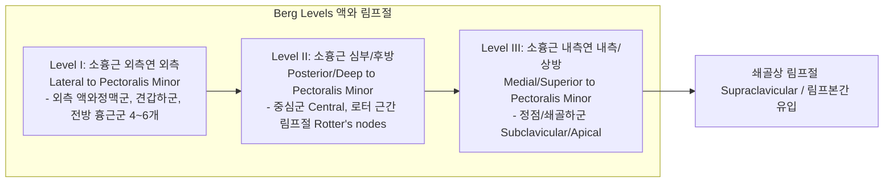

# 📑 [Netter Vol.1] Day 13: 유방 - 정상해부·림프순환·수유생리·섬유낭성변화·섬유선종 및 유방암 종양학 (Section 13 완독)

> 📖 **원서 출처**: [The Netter Collection of Medical Illustrations - Volume 1, Reproductive System.pdf (pp. 284-305)](https://drive.google.com/file/d/1x-xTgPfUfiK7dsQyp5L5qfjFYSD_XyGm/view?usp=drivesdk)  
> 🏷️ **범위**: Section 13 전편 (Plate 13-1 ~ Plate 13-22, 총 22개 플레이트 전수 포함)  
> 📌 **핵심 테마**: 유방 실질 구조(15~20개 유선엽, 쿠퍼 인대, 몽고메리선) 및 말단 유관소엽단위(TDLU) 미세해부, 제4늑간신경(T4) 외측피부분지 매개 유두 감각, 3대 혈액 공급망(내흉 60%, 외측흉 30%, 후늑간 전지 10%)과 척추주위 뱃슨 정맥총(Batson's plexus) 및 표재정맥-폐 순환 전이 기전, 버그(Berg) 3단계 액와 림프절(30~60개) 및 특수 림프 배액로(그로스만 경로 Groszman, 게로타 경로 Gerota, 반대측 교차 경로 Cross-mammary)와 감시 림프절 생검(SLNB), 신생아기 유방 반응(마녀의 젖 Witch's milk, Mastitis neonatorum)과 태너(Tanner) 5단계 사춘기 발달(10.8세 thelarche), 프로락틴(유즙 합성) 및 옥시토신(근상피세포 사출 반사) 매개 수유 생리학(수유 절정기 유방 부피의 20~33% 차지), 발생학적 변이(폴란드 증후군 Poland syndrome, 부유두, Kajava 8단계 부유방, 처녀성/임신성 거대유방증), 남성 유방 발달(사춘기 결절 Puberty node)과 에스트로겐/안드로겐 불균형(아로마타제, SHBG 매개) 여성형 유방증(Gynecomastia), 산욕기 유방 울혈 및 수유기 급성 유선염(황색포도상구균, 신생아 2개월 미만 수유 시 TMP/SMX 금기, 4대 부위 농양 배농), 유즙누출증(고프로락틴혈증, 키아리-프롬멜 Chiari-Frommel vs 아후마다-델카스티요 Ahumada-del Castillo 증후군) vs 혈성 병적 유두 분비물(관내 유두종 50%, 악성 10~15%), 전흉벽 표재성 몬도르 혈전정맥염(Mondor disease, 얕은 고랑 징후, 항생제/항응고제 금기), 영상 판독 체계(MMG 1~2 mm 병변 2년 조기발견, 30% 사망률 감소, BI-RADS Cat 0~6), 섬유낭성 변화 3단계 진행 및 스펙트럼(접시 가장자리 saucer edge 유방통, 선증, 블루돔 낭종 흡인 지침, 아포크린 화생, 비정형 증식증 5배 암 위험도), 20~30대 다발성 가동성 섬유선종(Breast mouse, 출혈성 경색 빈발) 및 요하네스 뮐러 엽상종양(Phyllodes tumor, 7~8 lb, 10% 육종성 변성, 1 cm 광범위 절제), 유방 육종(Tremendous size without nodal metastasis), 유방암 임상 징후(배가시간 100일, 설익은 배 사각거림, 피부/유두 함몰, 오렌지껍질 징후), 상피내암(DCIS 10년 내 35% 침윤 vs LCIS 75% 폐경전 진단 및 유관암 발생 역설) 및 침윤성 암(IDC 75~80% vs ILC 10~15% 인도열 단일줄 침윤, 팽출성 국한암), 전격성 진피 림프관/혈관 폐색 염증성 유방암(백혈구 15,000 급상승, Carcinoma en cuirasse), 유전성 유방암 HBOC(BRCA1 삼중음성 vs BRCA2 남성 유방암/호르몬 양성, 부계 유전, 2-히트 가설, PARP 저해제), 유두 습진양/궤양형 파제트병(하부 유관 동반 생검, 파제트 세포), 그리고 남성 유방암의 2년 지연 진단 특성과 호르몬 치료

---

## 1. 개요 및 마스터 요약 (Executive Summary)

1. **유방의 외과적 해부학, 지지 구조, 미세해부 및 감각 신경**:
   - 유방은 제2~6늑골, 흉골 외측연에서 중액와선(Midaxillary line)에 걸쳐 대흉근막(Pectoralis major fascia, 후면 2/3)과 전거근막(외측 1/3) 위에 위치함. 상외측으로 **스펜스 액와 미부(Axillary tail of Spence)**가 연장됨.
   - 유방 심부 근막과 대흉근막 사이에는 느슨한 소포성 결합조직으로 이루어진 **유방후 공간(Retromammary space of Chassaignac)**이 존재하여 유방의 생리적 가동성을 부여하며, 외과적 박리 및 보형물 삽입의 기본 평면이 됨.
   - **쿠퍼 인대 (Cooper's suspensory ligaments)**: 심부 근막에서 기원하여 실질 엽 사이를 지나 진피로 뻗는 섬유성 격막. 유방의 형태를 지지하며 비팽팽성(not taut) 특성으로 유방의 자연스러운 움직임을 허용하나, 노화 시 이완되어 **유방하수(Breast ptosis)**를 유발하고, 암 침윤 시 구축으로 특징적인 **피부 함몰(Skin dimpling)**을 유발함.
   - **유두-유륜 복합체(NAC) 및 몽고메리선**: 유륜(직경 1.5~2.5 cm) 피하에는 유두를 윤활하는 피지선인 **몽고메리선(Glands of Montgomery)**과 평활근 다발이 존재하여 수축 시 유두를 경직/발기(Stiffen)시켜 신생아 흡철을 도움. 유두 감각은 **제4늑간신경의 외측피부분지(Lateral cutaneous branch of T4)**가 핵심적으로 담당.
   - **말단 유관소엽단위 (Terminal Ductal Lobular Unit, TDLU)**: 소엽(Lobule/Acini)과 종말 유관이 만나는 미세 기능 단위로, **유방 섬유선종, 섬유낭성 질환, 관상피내암(DCIS), 소엽상피내암(LCIS), 침윤성 암 등 대다수 병변의 공통 기원지**임.
2. **혈관 공급망, 뱃슨 정맥총(Batson's plexus) 및 혈행성 전이 기전**:
   - **동맥 혈류**: 내흉동맥(Internal mammary a., 60%), 외측흉동맥(Lateral thoracic a., 30%), 제3~5후늑간동맥 외측피부분지의 전지(Anterior rami, 10%). 3대 동맥 분지가 유륜 주위에서 **원형 혈관총(Circular plexus)**을 형성하여 유두 혈류를 보장함.
   - **정맥 환류와 골/폐전이**: 표재 정맥(할러 정맥륜)은 액와·내흉·늑간정맥뿐만 아니라 **폐(Lungs)로 직접 연결**되어 폐 전이를 유발함. 후늑간정맥은 무판막 척추주위 정맥총(**Batson's plexus**)과 문합하여 복압 상승 시 대정맥계를 거치지 않고 **척추, 골반골, 뇌로 혈행성 조기 골전이**를 유발함.
3. **림프 배액 체계, 특수 림프경로 및 감시 림프절 생검 (SLNB)**:
   - **액와 림프 배액 (75% 이상)**: 액와부에는 30~60개의 림프절이 지방 패드 내에 엇갈리게 고정되어 있음. 소흉근을 기준으로 **Level I (외측)** $\rightarrow$ **Level II (심부, 로터 근간 림프절 Rotter's nodes 포함)** $\rightarrow$ **Level III (내측/상방, 쇄골하)**로 단계적 전이.
   - **특수 림프 배액로**:
     - **그로스만 경로 (Groszman pathway)**: 대흉근을 관통해 로터 림프절을 거쳐 쇄골하 림프절로 직행하는 심부 근막 경로.
     - **게로타 부유방 경로 (Paramammary route of Gerota)**: 유방 하내측에서 복벽 림프관을 타고 **간(Liver) 및 횡격막하 림프절**로 연결.
     - **반대측 교차 림프경로 (Cross-mammary pathway)**: 표재 림프관을 통해 정중선을 넘어 **반대측 유방 및 액와부**로 배액 (반대측 유방암 전이 기전).
   - 감시 림프절 생검(SLNB)으로 불필요한 액와 림프절 곽청술(ALND)을 생략. 약 3% 미만의 환자에서만 액와 외 림프절이 단독 양성으로 나타남.
4. **발생학, 태너 단계, 신생아기 유방 반응 및 발생학적 변이**:
   - **신생아기 반응**: 모체 에스트로겐의 태반 전달로 인해 신생아의 약 10%에서 선 조직이 커지는 **신생아 유선염(Mastitis neonatorum)**과 생후 2~3일경 유즙 유사 분비물인 **"마녀의 젖(Witch's milk)"**이 관찰되며 2~3주 내 소퇴함.
   - **사춘기 및 성숙기 발달**: 미국 여아 기준 유방 싹(Thelarche) 평균 연령은 **10.8 (±1.1)세**. 에스트로겐은 유관 신장과 유관주위 섬유조직 증식을 주도하며, 배란 후 **프로게스테론의 특이적 작용에 의해 소엽 및 선포(Lobules & acini)의 본격적인 개화(Unfolding)**가 완성됨 (초경 후 1~1.5년 소요). 마샬-태너(Tanner) 5단계 분류 적용.
   - **발생학적 변이**: 결손증(Athelia/Amastia)은 **폴란드 증후군(Poland syndrome)**과 연관될 수 있음. 부유두(Polythelia, 1~2%)는 정중선 방향 하방 5~6 cm에 호발하며 모반으로 오인되기 쉬움. 부유방(Polymastia)은 아시아 여성에서 5~6%로 호발하며 Kajava 8단계로 분류됨. 특히 **유두가 결여된 액와부 이상 유선 조직(Aberrant tissue)은 완전 부유방보다 악성 변성 위험이 더 높음**.
5. **수유 생리학 (Lactation)의 이중 호르몬 축 및 분자기전**:
   - **유즙 합성**: 뇌하수체 전엽의 **프로락틴(Prolactin)**이 선포세포의 카제인, 유당, 지질 합성을 주도. 임신 3삼분기에 약 200 ng/mL까지 치솟으나 태반 에스트로겐이 수용체를 차단하다가 분만 후 태반 만출 1~2일 뒤 억제가 해제되어 3~4일째부터 본격 수유 개시.
   - **유즙 사출 반사 (Let-down reflex)**: 흡철 자극 $\rightarrow$ 뇌하수체 후엽의 **옥시토신(Oxytocin)** 분비 $\rightarrow$ 선포 주위 **근상피세포(Myoepithelial cells)의 강력한 수축** $\rightarrow$ 유관 압착 및 유관동 분출.
   - 수유 절정기에 저장된 모유는 **전체 유방 부피의 1/5~1/3 (20~33%)**을 차지함. 지속적인 모유 수유는 GnRH 펄스를 차단하여 약 6개월간 수유성 무월경 유도.
6. **남성 유방 및 여성형 유방증 (Gynecomastia)**:
   - 14~17세 소년의 2/3에서 유두 하부에 단추 모양의 **사춘기 결절(Puberty node)**이 촉지되며 대개 21세 전 자연 퇴축.
   - 병태생리: 유효 에스트로겐 증가 또는 안드로겐 억제 감소. 근육·지방 조직의 **말초 아로마타제(Aromatase)** 활성이 핵심.
   - 갑상선기능항진증 시 간의 **성호르몬 결합 글로불린(SHBG) 증가로 유리 테스토스테론 감소** 및 말초 방향화 증가로 유발.
   - 원인 약물: Spironolactone, Digoxin, Cimetidine 외에도 Metronidazole, Ranitidine, Phenothiazines, Methadone 등. 유륜연 절개(Webster incision)를 통한 피하 유방절제술 시행.
7. **산욕기 질환, 유방염, 농양 및 몬도르병 (Mondor Disease)**:
   - **유방 울혈**: 분만 후 3~4일경 림프/정맥 울혈. 유두 편평화 시 유축으로 감압. 수유 영구 중단 시 유방을 붕대로 단단히 동여매고 냉찜질/진통제 투여.
   - **급성 유선염**: *S. aureus* 감염. 체온 40.5~41°C까지 급상승 가능하며 48시간 내 화농 개시. 모유 수유 지속 원칙. **단, 생후 2개월 미만 영아를 수유하는 산모에게는 신생아 핵황달(Kernicterus) 위험으로 TMP/SMX (Bactrim) 투여 절대 금기**.
   - **농양 4대 위치**: 피하(Subcutaneous), 유두하(Subareolar), 유방실질내(Intramammary - 루공 형성 가능), 유방후(Retromammary - 간질형 유선염).
   - **몬도르병 (Mondor Disease)**: 흉복벽정맥의 표재성 혈전정맥염. 팔을 들었을 때 피부에 **얕은 고랑(Shallow groove)**과 팽팽한 피하 밧줄(Cord) 형성. MMG상 염주알 모양 정맥 관찰. **항생제와 항응고제는 효과가 없어 투여 금기이며 2~3주(최대 6주) 내 자연 소퇴**.
8. **유즙누출증 및 병적 유두 분비물**:
   - **유즙누출증**: 고프로락틴혈증 매개. 공복·안정 상태 채혈 필수. 프로락틴 수치와 선종 크기의 상관관계는 불량함.
   - 고전 증후군: 산후 지속성인 **키아리-프롬멜 증후군 (Chiari-Frommel syndrome)** vs 비임신성 자발성인 **아후마다-델 카스티요 증후군 (Ahumada-del Castillo syndrome)**.
   - **병적 유두 분비물**: 일측성, 단일 유관, 자발적 혈성/장액혈성. **관내 유두종(40~50%)**이 최빈발 양성 원인이며, 유방암(10~15%) 감별을 위한 미세유관절제술 필요.
9. **유방 영상 진단 체계 (Breast Imaging & BI-RADS)**:
   - 유방촬영술(MMG): 촉지되기 약 2년 전에 1~2 mm 미세 병변 및 미세석회화 발견, 사망률 최대 30% 감소, 진단 정확도 85%, 위음성률 10~15%, 방사선 노출 <1 rad.
   - BI-RADS Cat 0~6 체계화. 고위험군(BRCA)은 MMG에 유방 MRI 병용.
10. **섬유낭성 변화 스펙트럼 (Fibrocystic Changes)**:
    - 임상 특징: 손으로 쥐었을 때 얇고 단단한 **"접시 가장자리(Saucer edge)"** 촉감, 어깨/상완 방사통.
    - **3단계 진행 과정**: 1단계(기질 증식) $\rightarrow$ 2단계(유관/선포 증식, 선증, 낭종 형성) $\rightarrow$ 3단계(거대 낭종 형성, 통증 감소).
    - **블루돔 낭종 (Blue-domed cyst)**: 갑작스러운 출현, 찌르는 통증, 투광성 양호. 22~25G 바늘 흡인 시 담황색/암갈색/녹색 액체는 무해하나 혈성 액체는 조직검사 필수. 일상적 세포진은 위양성/위음성이 높아 무용.
    - **듀폰-페이지 암 위험도**: 비증식성(1.0배) $\rightarrow$ 비정형 없는 증식성(1.5~2.0배) $\rightarrow$ **비정형 증식증(ADH/ALH, 4.0~5.0배 급증)**.
11. **양성 종양, 엽상종양 및 육종**:
    - **섬유선종 (Fibroadenoma)**: 20~25세 피크, 흑인 2배 호발, 고가동성 "유방 마우스(Breast mouse)". 단면상 소용돌이 돌출 및 출혈성 경색 빈발.
    - **관내 유두종 (Intracystic Papilloma)**: 혈성 분비물(50%), **약 10%에서 악성 변성 동반**. 다발성 14%.
    - **엽상종양 (Phyllodes Tumor)**: 요하네스 뮐러(Johannes Müller) 기술. 수년간 잠복 후 급격 거대화, 평균 무게 7~8 lb (3.2~3.6 kg). 거대함에도 유두 함몰 없음. 간질 과세포성, 10% 육종성 변성, 국소 재발 방지를 위해 **최소 1 cm 안전 절제연** 필수, 악성 시 30% 사망률.
    - **유방 육종 (Mammary Sarcoma)**: 1~2%, 섬유방추상세포형(>50%). **거대한 크기에도 불구하고 액와 림프절 침범이 결여된 점(Tremendous size without nodal metastasis)이 암종과의 결정적 감별점**. 폐 전이 최빈발.
12. **유방암 종양학, 병기 및 분자 아형**:
    - 역학: 여성 암 1/3, 암 사망 18%. **평균 종양 배가 시간은 약 100일**로 임상 촉지 전 수년간 성장.
    - 육안 소견: 단면이 오목하고 모래처럼 사각거려 **"설익은 배(Unripe pear)"**를 자르는 듯한 질감(Gritty and concave). 상부 지방 위축으로 손가락에 매우 가깝게 만져짐.
    - **상피내암 비교**: DCIS(10년 내 35% 침윤암 진행, 5~10% 동시성 침윤암 동반) vs LCIS(75%가 폐경 전, 양측성 위험 지표, 20% 침윤암 발생하되 **대부분 유관암으로 발생하는 역설**).
    - **침윤성 암 비교**: IDC(75~80%, E-cadherin 양성, Desmoplasia) vs ILC(10~15%, CDH1 결손, E-cadherin 음성, 인도열 Indian-file 단일줄 침윤, 질퍽하고 묵직한 촉감, 양측성/다발성). 유두상/교질/면포성 등 국한암은 흉벽 외측으로 팽출(Bulge outwardly).
13. **특수 악성종양 (염증성 유방암, HBOC, 파제트병, 남성 유방암)**:
    - **염증성 유방암 (Inflammatory Carcinoma, T4d)**: 전신 감염을 모방하며 **백혈구 수가 15,000/$\mu\text{L}$까지 급상승**. 진피 림프관 및 표재 혈관의 암세포 색전 폐색. 갑옷암(Carcinoma en cuirasse) 형태. 5년 생존율 25~50%.
    - **유전성 유방암 (HBOC)**: 상염색체 우성, **부계(Father's side) 전달 동일 성립**, 크누슨의 2-히트 가설. BRCA1(17q, 삼중음성암) vs BRCA2(13q, 남성 유방암 평생위험 5~10%, 호르몬 양성). PARP 저해제(합성 치사).
    - **유두 파제트병 (Paget's Disease)**: 습진형 및 궤양형. **>95%에서 하부 유관암 동반, 50%에서 이미 액와 림프절 촉지**. 식염수 도말 압인 세포진(Touch smear) 활용. 생검 시 반드시 **피부와 함께 기저 유관 조직을 포함**해야 함.
    - **남성 유방암**: 전체 유방암의 1%. 얇은 조직으로 인해 조기 피부 궤양/유두 침범. **진단 전 평균 2년의 심각한 진단 지연**. 90% 이상 IDC이며 **남성에서는 LCIS가 발생하지 않음**. 호르몬 수용체 양성률 극히 높아 타목시펜 표준 적용.
---

## 2. 유방의 정상 해부학, 혈관 및 림프 배액 체계 (Plates 13-1 ~ 13-3)

### Plate 13-1 | 유방의 위치와 해부학적 구조 (Position and Structure)

![[Netter_V1_Plate13-1.png]]

#### 1) 육안 해부학적 위치, 후방 근육층 및 지지 구조
- **해부학적 경계 (Boundaries)**:
  - 수직 범위: 제2늑골(상계)에서 제6늑골(하계, Inframammary fold)까지 연장됨.
  - 수평 범위: 흉골 외측연(Lateral sternal border)에서 전액와선 및 중액와선(Midaxillary line)까지 분포.
  - **스펜스 액와 미부 (Axillary tail of Spence)**: 상외측 사분면(UOQ)의 유선 실질이 대흉근 외측연을 따라 심부 근막 결손부를 관통하여 액와부(Axilla)로 길게 뻗어나간 해부학적 돌출부. 유선 조직의 체적이 가장 커 유방 신생물의 최다 호발 부위(50~60%)임.
- **후방 근육층과의 관계 (Deep Relations)**:
  - 유방 실질 후면의 약 **$2/3$는 대흉근(Pectoralis major)**을 감싸는 심부 흉근막(Pectoral fascia) 위에 안착함.
  - 외측 **$1/3$은 전거근(Serratus anterior)** 및 외복사근(External oblique), 그리고 복직근초(Rectus sheath) 상부와 접함.
  - **유방후 공간 (Retromammary space of Chassaignac)**: 유방 심부 근막과 대흉근막 사이에 개재된 느슨한 유착성 소포성 결합조직(Loose alveolar adipose tissue) 평면. 정상 유방이 흉벽 근육 위에서 마찰 없이 자유롭게 미끄러지듯 유동하도록 보장하며, 유방 확대 및 재건술 시 보형물(Implant) 삽입의 주요 외과적 박리 평면(Surgical plane)임.
- **쿠퍼 인대 (Cooper's Suspensory Ligaments)와 유방하수**:
  - 심부 흉근막에서 기원하여 유방 실질 엽(Lobes) 사이를 관통하여 진피층(Dermis)에 단단히 부착되는 치밀 섬유성 결합조직 격막(Fibrous septa).
  - 유방의 원추형 형태와 구조적 돌출도를 지지함. 이 인대들은 팽팽하지 않고 다소 느슨하여 유방의 자연스러운 움직임을 허용하지만, 노화(Aging)와 중력에 따라 점차 이완(Relaxation)되면서 **유방하수(Breast ptosis)**를 초래함.
  - **임상적 중요성**: 악성 침윤성 종양이 쿠퍼 인대를 침범할 경우 결합조직 반응(Desmoplasia)과 섬유성 수축(Fibrous contraction)으로 인해 피부가 안쪽으로 끌려 들어가는 특징적인 **피부 함몰(Skin dimpling)**이 발생함.

#### 2) 유두-유륜 복합체(NAC) 및 신경 지배 (Innervation)
- **유륜 (Areola mammae)**:
  - 성숙한 여성 유방 둔덕의 중앙에 위치하는 직경 **$1.5\sim 2.5	ext{ cm}$**의 원형 색소 침착 피부 영역.
  - **몽고메리선 (Glands of Montgomery)**: 유륜 피하의 얇은 피하 결합조직층에 위치한 대형 변형 피지선(Modified sebaceous glands)으로, 임신 및 수유기에 융기되어 **몽고메리 결절(Montgomery tubercles)**을 형성하며, 유두와 유륜을 윤활하고 세균 침입을 막는 보호 지질성 분비물을 분비함.
  - **유륜 평활근 다발 (Smooth muscle bundles)**: 유륜 진피 내 방사상 및 원형으로 배열된 평활근 섬유 다발로, 기계적 자극이나 한랭 노출 시 수축하여 유두를 발기·경직(Stiffen)시켜 신생아의 입술 흡철(Grasp/Latch)을 용이하게 함.
- **유두 (Nipple / Mammary papilla)**:
  - 유방 표면에서 수 밀리미터 돌출된 원추형 구조로, 주름진 피부와 섬유근성 조직으로 둘러싸인 **$15\sim 20$개의 주유관(Lactiferous ducts)** 개구부를 포함함.
- **감각 신경 분포 (Sensory Innervation)**:
  - 유방 피부 및 실질의 감각은 흉추 피부절(Dermatomes)을 따르며, 주로 **제3~5늑간신경(Intercostal nerves T3~T5)의 전외측(Anterolateral) 및 전내측(Anteromedial) 피부 분지**에 의해 공급됨.
  - **유두-유륜 복합체(NAC)의 감각 지배**: **제4늑간신경의 외측피부분지(Lateral cutaneous branch of T4)**가 주신경 공급망을 형성함. 유방 축소술이나 보형물 성형술 시 이 신경 분지의 손상을 방지하는 것이 수유 반사 및 성적 감각 보존의 핵심 외과적 랜드마크임.
  - 유방 상부 및 외측부: 경신경총 하부 분지에서 기원하는 **쇄골상신경(Supraclavicular nerves)**이 피부 감각을 보조함.

#### 3) 유선 실질의 분지 체계 및 말단 유관소엽단위 (TDLU)
- **유선엽 (Lobes)**: 유방 한쪽당 방사상으로 배열된 **$15\sim 20$개의 독립된 유선엽**으로 구성되며, 각 엽은 지방 및 섬유성 간질에 의해 분리됨.
- **유관 체계**:
  - 각 엽은 중심부를 향해 주행하는 단일 주유관(Lactiferous duct)으로 배액됨.
  - 유두 직하부 및 기저부에서 주유관이 국소 팽대되어 우유를 일시적으로 저장하는 **유관동(Lactiferous sinus / Ampulla)**을 형성한 뒤 유두 표면의 독립된 미세 개구부로 개구함.
  - 주유관으로부터 수많은 2차 세관(Secondary tubules)이 싹터 나와 말단 소엽으로 분지함.
- **말단 유관소엽단위 (Terminal Ductal Lobular Unit, TDLU)**:
  - 다수의 맹낭성 포상구조(Alveoli / Acini)가 포도송이처럼 모인 소엽(Lobule)과 이를 배액하는 종말 관소관(Terminal ductule)으로 구성된 유방의 핵심 기능 단위.
  - **호르몬 반응성이 가장 높은 상피 구획**으로, 대부분의 유방 병변(낭종, 섬유선종, 관상피내암 DCIS, 소엽상피내암 LCIS, 침윤성 관암 및 소엽암)이 바로 이 TDLU 상피세포에서 기원함.
- **연령 및 생리주기별 실질-기질 비율 변화**:
  - 종말 세관과 선포 구조는 가임기에 가장 풍부하며, 임신 및 수유기에 완전한 생리적 발달을 이룸.
  - 비임신·비수유기에는 섬유성 및 지방성 간질(Stroma)의 상대적 비율이 유방의 크기와 단단함(Consistency)을 결정함.
  - **폐경(Menopause) 후**: 호르몬 소퇴로 인해 선포 및 유관 상피 조직(Parenchyma)이 급격히 퇴축·위축되고 지방 조직(Adipose tissue)으로 광범위하게 치환됨. (유방촬영술상 X선 투과도가 증가하여 병변 판독이 용이해지는 해부학적 배경).

---

### Plate 13-2 | 유방의 혈액 공급 (Blood Supply)

![[Netter_V1_Plate13-2.png]]

#### 1) 3대 동맥 공급망의 기원과 해부학적 주행
유방은 하행흉대동맥, 쇄골하동맥, 액와동맥에서 기원하는 풍부한 다원적 혈류망을 갖추고 있어 측부 순환이 매우 발달되어 있습니다:
1. **내흉동맥 (Internal Thoracic / Internal Mammary Artery, 쇄골하동맥 1차 분지)**:
   - **전체 유방 혈류의 약 $60\%$ 공급** (유방 내측 및 중앙부 전담).
   - 흉강 내부에서 상부 6개 늑연골의 후방, 벽측 흉막(Parietal pleura) 바로 바깥층을 따라 하행함.
   - 제1~4늑간강을 관통하는 **전방 천공지(Anterior perforating branches)**를 분지하며, 대흉근을 뚫고 나와 내측 유방지(Medial mammary branches)를 형성함. 특히 **제2, 3천공지가 가장 굵고 많은 혈류를 공급**함.
2. **외측흉동맥 (Lateral Thoracic Artery, 액와동맥 2차 분지)**:
   - **전체 유방 혈류의 약 $30\%$ 공급** (유방 상외측 및 외측부 담당).
   - 소흉근(Pectoralis minor)의 외측연 및 하연을 따라 주행하며 외측 유방지(Lateral mammary branches)를 분지함.
   - 여성에서 특히 발달하여 대흉근 외측연을 감아 돌아 유방 외상방으로 진입하는 **외측유방동맥(External mammary artery)**을 냄.
3. **후늑간동맥 분지 (Posterior Intercostal Arteries, 하행흉대동맥 분지, 약 $10\%$)**:
   - 제3, 4, 5후늑간동맥의 외측피부분지(Lateral cutaneous branches)가 흉벽 외측 근육을 관통한 뒤 전지(Anterior rami)와 후지(Posterior rami)로 분기함.
   - **오직 전지(Anterior rami)만이 유방 외측 실질로 진입**하여 혈액을 공급함.
4. **기타 보조 동맥망**:
   - **흉견봉동맥 (Thoracoacromial artery)**: 액와동맥 전면에서 기원하는 짧은 체간(Short trunk)으로 소흉근 상연에 덮여 있으며, 흉근 분지(Pectoral branch)를 내어 유방 기저부에 혈류를 보조함.
   - **흉배동맥 (Thoracodorsal artery)** 분지 및 견갑하동맥(Subscapular a.) 분지.

#### 2) 미세 혈관총(Vascular Plexus)과 외과적 함의
- **유륜 주위 원형 혈관총 (Circular plexus around the areola)**: 내흉동맥, 외측흉동맥, 늑간동맥 분지들이 유두-유륜 복합체 기저부에서 문합하여 고리 모양의 혈관총을 형성함으로써 유두 및 유륜의 안정적 혈액 공급을 보장함.
- **진피하 혈관총 (Subdermal plexus)**: 유방 피부를 영양하며, 유방 실질 심부의 혈관망(Deep parenchymal plexus)과 광범위하게 수직 관통 문합을 이룸.
- **외과적 주의점**:
  - 유두 주위의 완전 원형 절개(Circular periareolar incision) 시 원형 혈관망이 손상되어 유두 허혈 및 괴사(Nipple necrosis) 위험이 있으므로 주의를 요함.
  - 유방의 풍부한 혈관망은 종양 절제술 및 유방 축소·재건 성형술 시 피부 피판(Skin flaps)의 생존율을 극대화하는 장점을 제공하지만, 악성 세포의 혈행성 전신 파종 통로를 제공하는 양날의 검이 됨.

#### 3) 정맥 환류와 뱃슨 정맥총(Batson's Plexus)의 임상 병리
- **천층 정맥망 (Superficial Venous Network)**:
  - 유두 주위에서 **할러 정맥륜 (Circulus venosus of Haller)**을 형성하여 피하 혈류를 수렴한 뒤 내흉정맥, 액와정맥, 후늑간정맥으로 환류됨.
  - 이 표재 정맥들은 **폐순환계(Pulmonary circulation)로 직접 유입되는 측부 경로**를 형성하여, 유방암 세포가 대정맥계 및 표재 정맥을 통해 **폐(Lungs)로 색전성 전이**를 일으키는 해부학적 기전을 제공함.
- **심층 정맥망 (Deep Venous Network)**: 동맥과 나란히 주행하여 액와정맥(Axillary v.)과 내흉정맥(Internal thoracic v.)으로 유입됨. (액와정맥은 분지 주행 변이가 심하여 액와부 수술 시 박리에 주의 요망).
- **뱃슨 척추정맥총 (Batson's Vertebral Venous Plexus)과 골전이 기전**:
  - 후늑간정맥은 척추골 주변과 척추관 내부에 그물망처럼 얽혀 있는 **판막이 없는(Valveless) 척추정맥총(Batson's plexus)**과 직접 문합함.
  - 기침, 배변, 운동 등으로 흉강압 및 복강압이 상승할 때 혈류가 상대정맥을 우회하여 척추정맥총으로 역류(Retrograde flow)함.
  - **유방암 세포가 대정맥계나 폐 모세혈관 필터를 거치지 않고 직접 흉추, 요추, 골반골 및 두개골로 조기 혈행성 골전이(Hematogenous bone metastasis)**를 유발하는 결정적 해부학적 고속도로 역할을 함.
- **정맥 혈전염**: 유방 실질 정맥은 신체 타 부위와 마찬가지로 염증과 혈전증에 취약하여 **몬도르병(Mondor disease)**을 유발함.

---

### Plate 13-3 | 유방의 림프 배액 체계 (Lymphatic Drainage)

![[Netter_V1_Plate13-3.png]]

#### 1) 림프총의 해부학적 평면과 림프절 배열
- **2대 림프총 평면**:
  - **표재/유륜하 림프총 (Superficial or Subareolar plexus)**: 중앙부 유선 조직, 유두, 유륜 및 유방 피부의 림프액 수렴.
  - **심부/근막 림프총 (Deep or Fascial plexus)**: 유선 실질 심부 및 대흉근막 상부의 림프액 수렴.
  - 두 림프총 모두 소엽간 공간(Interlobular spaces)과 주유관 벽(Walls of lactiferous ducts)의 모세림프관망에서 기원함.
- **림프절의 해부학적 고정 양상**:
  - 유방 림프절들은 일직선으로 단순 연결되어 있지 않고, 액와 지방 패드(Fat pads) 내에 **불규칙하고 엇갈리게(Staggered and variable) 매몰·고정**되어 있어 외과적 액와 곽청술 시 정밀한 해부학적 박리가 요구됨.
  - 액와강 내에는 일반적으로 **$30\sim 60$개에 달하는 림프절**이 존재하며, 전체 유방 림프액의 **약 $75\%$**를 처리함.

#### 2) 액와 림프절의 해부학적 3단계 (Berg Levels)
소흉근(Pectoralis minor muscle)과의 3차원적 위치 관계를 기준으로 3개 레벨로 분류합니다:



- **Level I (하위 액와군, Low Axillary)**: 소흉근 외측 경계의 외측 및 하방. 외측 액와정맥군(Lateral/axillary vein group), 후방 견갑하군(Subscapular group), 전방 흉근군(Anterior pectoral group, 4~6개로 외측흉동맥을 따라 주행). 유방암 림프 전이의 제1차 정거장.
- **Level II (중간 액와군, Midaxillary)**: 소흉근 바로 뒤쪽 및 심부에 위치하는 중심 림프절군(Central axillary nodes)과, 대흉근과 소흉근 사이 근간 공간에 위치하는 **로터 림프절 (Rotter's interpectoral nodes)**을 포함.
- **Level III (상위 액와 / 정점 림프절군, Apical / Subclavicular)**: 소흉근 내측 경계의 내측 및 상방, 쇄골 바로 아래 액와정맥과 쇄골하정맥이 만나는 정점에 위치.

#### 3) 특수 림프 배액 경로 (Named Pathways)
유방암은 전형적인 순차적 액와 배액 외에도 다음과 같은 특수 우회 경로를 통해 전이될 수 있습니다:
1. **그로스만 경로 (Groszman Pathway)**:
   - 심부 근막 림프총(Deep fascial plexus)이 대흉근 실질을 직접 관통하여 대·소흉근 사이의 **로터 림프절(Rotter's nodes)**로 진입한 후 곧바로 **Level III 쇄골하 림프절(Subclavian nodes)**로 직행하는 우회 경로.
2. **게로타 부유방 경로 (Paramammary Route of Gerota)**:
   - 유방의 하내측 사분면에서 기원한 림프관이 복직근초 전엽 및 복벽 림프관을 뚫고 하행하여 **횡격막하 림프절(Subdiaphragmatic / Inferior phrenic nodes) 및 간(Liver)**으로 직접 배액되는 경로. (하내측 유방암의 조기 간 전이 기전).
3. **반대측 교차 림프경로 (Cross-Mammary Pathway)**:
   - 표재 림프관이 흉골 정중선(Midline)을 가로질러 **반대측 유방 및 반대측 액와 림프절**로 직접 연결되는 경로. 일측성 원발암이 흉벽 피부를 침범하거나 반대측 유방으로 전이되는 해부학적 통로.
4. **전종격동 림프절 경로 (Anterior Mediastinal Pathway)**:
   - 유방 하내측의 근막 림프관이 흉골 하부를 통과하여 상행 대동맥 전방의 전종격동 림프절(Anterior mediastinal nodes)로 유입되는 경로.
5. **후늑간 림프 경로 (Posterior Intercostal Route)**:
   - 척추골을 따라 후방에 위치한 늑간 림프절(Intercostal glands along the vertebral column)로 배액.
6. **내흉 림프절 (Internal Mammary / Parasternal Nodes)**:
   - 유방 림프액의 약 **$15\sim 20\%$** 배액. 흉골연을 따라 늑연골 사이 늑간강에 위치하며 주로 내측 사분면 종양에서 높은 전이율을 보임.

#### 4) 감시 림프절 생검 (Sentinel Lymph Node Biopsy, SLNB)
- **개념**: 원발 종양에서 림프류를 타고 가장 먼저 도달하는 1~3개의 첫 관문 림프절(감시 림프절)을 동정하여 전이 여부를 평가하는 표준 술식.
- **이중 추적자 기법 (Dual Tracer Technique)**: 종양 주위에 테크네슘 방사성 콜로이드($^{99m}	ext{Tc}$-phytate/nanocolloid)와 청색 염료(Isosulfan blue / Indocyanine green)를 동시 주입하여 감마 프로브 계측 및 육안 착색 림프절을 동정.
- **임상적 적중률**: 대부분의 림프 전이는 종양 위치에 따라 액와 림프절 사슬로 예측 가능하게 진행함. 특히 **전이 양성 림프절이 액와 외 부위(내흉 림프절 단독 등)에만 존재하는 경우는 전체 환자의 약 $3\%$ 미만에 불과**하므로 액와 감시 림프절 평가가 유방암 병기 설정의 표준으로 확립됨. 음성 시 불필요한 ALND를 생략하여 상지 림프부종, 신경 손상 합병증을 방지함.
---

## 3. 발생학, 태너 단계, 수유 생리 및 선천 기형 (Plates 13-4 ~ 13-6)

### Plate 13-4 | 유방의 발생과 발달 단계 (Developmental Stages)

![[Netter_V1_Plate13-4.png]]

#### 1) 배아기 발생 및 신생아기 유방 현상
- **배아기 유선능 (Mammary Ridge / Milk Line)**:
  - 배아 5~6주(태아 6~12주)경 외배엽(Ectoderm) 세포가 국소 비후하여 액와부에서 서혜부까지 양측으로 주행하는 한 쌍의 원시 유선능(Milk line) 형성.
  - 정상 인간 배아에서는 흉부 제4늑간에 위치한 한 쌍을 제외한 나머지 부위의 유선능은 완전히 퇴화·흡수됨.
  - 외배엽성 상피 싹이 간엽(Mesenchyme) 속으로 함입되어 16~20개의 고형 상피 삭(Solid cords)을 형성하고, 태아 후반기에 중심부가 개통되어 유관(Ducts)이 형성됨.
- **신생아기 유방의 임상 생리**:
  - 만삭 신생아(특히 **과숙아 Postterm infants**에서 현저)는 남녀 모두 출생 시 유방이 반구형 융기(Hemispheroidal elevations)로 만져지는 부드럽고 가동성 있는 연성 종괴로 촉지됨.
  - 조직학적으로 분지하는 관상 채널과 상피층, 그리고 말단부의 기저세포 마개(미래의 유관 및 선소엽)가 뚜렷이 관찰됨.
  - 많은 신생아에서 **외반된 유두(Everted nipple)**가 관찰되며, 신생아의 약 **$10\%$**에서 선 조직이 크게 증대되는 **신생아 유선염(Mastitis neonatorum)**이 관찰되나, 이는 실제 감염성 염증이 아님.
  - **마녀의 젖 (Witch's milk)**: 생후 2~3일경부터 신생아 유두에서 우유 같은 분비물이 나올 수 있음. 이는 태아 말기에 태반을 통해 전달된 고농도의 모체 에스트로겐 자극에 기인한 현상임.
  - 출생 후 2~3주 이내에 모체 호르몬 소퇴와 함께 급격한 퇴축(Involution)을 거쳐 유아기·아동기의 **정지기(Quiescent stage)**로 진입함. 이 시기 유방은 납작한 상피로 덮인 몇 개의 분지된 흔적 유관과 교원 결합조직으로만 구성됨.

#### 2) 사춘기 및 성숙기 발달의 호르몬 조절
- **사춘기 유방 발달의 개시**:
  - 미국 여아 기준 유방 싹(Breast bud) 출현의 평균 연령은 **$10.8\ (\pm 1.1)	ext{세}$**.
  - 뇌하수체 전엽의 FSH 자극으로 난소 난포가 성숙하며 에스트로겐(Estrogen) 분비가 급증함.
  - **에스트로겐의 작용**: 주유관의 길이 신장(Elongation), 유관 상피세포의 중복 증식, 관 말단에서 장차 소엽이 될 원시 싹(Sprouts) 형성. 특히 **유관주위 섬유성 결합조직(Periductal fibrous tissue)의 급속한 증식**을 유도하여 청소년기 유방의 크기와 단단함(Firmness)을 결정함. 유두와 유륜도 함께 증대되고 멜라닌 색소 침착이 진행됨.
- **성숙기 (Maturity)와 프로게스테론의 특이 작용**:
  - 배란(Ovulation)이 시작되고 황체에서 프로게스테론(Progesterone)이 분비되면서 제2단계 발달로 진입.
  - 성인 여성에서 프로게스테론은 항상 에스트로겐이 공존할 때 작용하지만, **소엽(Lobules) 및 선포(Acini) 구조의 본격적인 개화와 분화(Beginning unfolding of lobules)는 프로게스테론의 특이적 작용(Specific effect)**임.
  - 유선 소엽 분화는 **초경 후 약 $1\sim 1.5	ext{년}$**에 걸쳐 완성되지만, 이후 매 생리주기의 호르몬 자극 및 임신을 거치며 추가적인 선포 발달이 지속됨.

#### 3) 마샬-태너 5단계 (Marshall & Tanner Stages)
1969년 Marshall과 Tanner가 정립한 사춘기 성적 성숙도 평가 척도:

| 태너 단계 | 형태학적 발달 특징 (Morphology) | 내분비 및 임상 의의 |
| :--- | :--- | :--- |
| **Stage 1 (사춘기 전)** | 유두 끝부분의 단순 융기만 관찰, 선 조직 없음 | 기저 호르몬 상태 |
| **Stage 2 (유방 싹, Thelarche)** | **유방 싹(Breast bud)** 출현. 유두 및 유륜 하부 선 조직 융기, 유륜 직경 확대 | 시상하부-뇌하수체-난소축(HPG) 재활성화 (평균 10.8세, **사춘기의 가장 빠른 징후**) |
| **Stage 3 (지속 증대)** | 유방과 유륜이 하나의 완만한 곡면을 이루며 전반적 확대, 분리 윤곽 없음 | 지속적인 에스트로겐 및 GH 자극 |
| **Stage 4 (이차 둔덕)** | **유륜과 유두가 유방 둔덕 위로 돌출하여 별도의 '이차 둔덕(Secondary mound)' 형성** | 프로게스테론 작용 추가 (초경 직전~직후) |
| **Stage 5 (성숙 유방)** | 유륜이 유방 전체 윤곽선 안으로 매끄럽게 복귀되고 **유두만 돌출된 성인형 유방 완성** | 배란 주기 확립 및 성인 호르몬 평형 (**초경 Menarche은 가장 늦은 징후**) |

---

### Plate 13-5 | 유방의 기능적 변화 및 수유 생리 (Functional Changes and Lactation)

![[Netter_V1_Plate13-5.png]]

#### 1) 임신 중 삼분기(Trimesters)별 조직학적 분화
비임신 여성의 유방은 분비 기능이 불완전하며, 임신 중에만 젖 생산을 위한 해부학적 리모델링이 완성됩니다:
- **임신 제1삼분기 (1st Trimester)**:
  - 주유관에서 돋아나는 말단 세관(Terminal tubules)이 폭발적으로 증식하여 장차 선포를 형성할 상피세포 수를 최대로 확보함.
- **임신 제2삼분기 (Midtrimester)**:
  - 증식된 말단 세관들이 한데 뭉쳐 거대한 소엽(Large lobules)을 형성함.
  - 관강(Lumina)이 확장되기 시작하며, 형성된 선포 구조는 입방상피(Cuboidal epithelium)로 피복됨. 일부 선포 내강에 소량의 **초유(Colostrum)** 분비물이 관찰되기 시작함.
- **임신 제3삼분기 (Last third of pregnancy)**:
  - 선포 구조들이 고농도 순환 에스트로겐 및 프로게스테론의 자극으로 점진적이고 극대화된 낭포성 확장을 거침.

#### 2) 프로락틴 동태와 수유의 이중 호르몬 축
- **임신 중 억제와 분만 후 개시 분자기전**:
  - 착상 직후부터 에스트로겐 상승과 함께 뇌하수체 전엽의 유즙분비세포(Pituitary lactotrophs)가 비대(Hypertrophy) 및 과형성(Hyperplasia)됨.
  - 혈중 프로락틴은 임신 기간 내내 꾸준히 상승하여 **임신 3삼분기에 약 $200	ext{ ng/mL}$로 최고치(Peak)**에 도달함.
  - **임신 중 젖분비가 일어나지 않는 이유**: 태반에서 분비되는 **고농도의 순환 에스트로겐과 프로게스테론이 선포세포의 프로락틴 수용체(Prolactin receptor) 작용을 길항적으로 차단**하기 때문임.
  - 분만 후 태반이 만출되면 1~2일 내에 에스트로겐이 급락하면서 수용체 억제가 해제되어, **분만 3~4일째부터 본격적인 유즙 합성(Lactogenesis)**이 시작됨.
- **산후 프로락틴 농도 추이**:
  - **비수유 여성**: 프로락틴 수치가 출산 후 **$2\sim 3	ext{주}$ 내에 정상 기저 농도로 급격히 복귀**함.
  - **수유 여성**: 기저 프로락틴 농도는 출산 후 6개월 내에 점차 비임신 수준으로 낮아지지만, 아기가 젖을 빨 때마다(**Act of suckling**) 급격한 프로락틴 분비 펄스가 유발되어 지속적인 유즙 생성을 자극함.

```mermaid
graph TD
    subgraph 1. 유즙 생성 Lactogenesis
        Suck_PRL[유두 흡철 자극 / 도파민 억제] --> PitAnt[뇌하수체 전엽 Anterior Pituitary]
        PitAnt -->|프로락틴 Prolactin 펄스 분비| Acinar[선포 입방/원주상피세포]
        Acinar -->|카제인, 유당, 지질 합성 및 분비| MilkStorage[선포 내강 모유 저장]
    end
    subgraph 2. 유즙 사출 반사 Let-Down Reflex
        Nipple_Sens[유두 기계수용체 자극 T4 신경] --> SpinalCord[척수 상행 신경로]
        SpinalCord --> Hypothal[시상하부 / 뇌하수체 후엽]
        Hypothal -->|옥시토신 Oxytocin 방출| Myoepithel[선포 주위 근상피세포 Myoepithelial cells]
        Myoepithel -->|강력한 평활근성 동시 수축| Expel[유관 압착 및 유관동 분출]
    end
```



- **수유 절정기 유방의 물리적 용적 (Breast Volume)**:
  - 선포 내강의 입방/원주상피세포에서 모유 분비가 이루어지며, 기저부 또는 첨부에 위치한 핵과 얇은 결합조직 띠, 모세혈관망이 지지함.
  - 분비 소구(Secretory globules)와 박리된 상피세포로 선포가 가득 채워짐.
  - **수유 절정기(Height of lactation) 동안 유즙 분비 및 저장은 전체 유방 부피의 $1/5\sim 1/3\ (20\sim 33\%)$를 차지함!**
- **수유성 무월경 (Lactational Amenorrhea)**:
  - 지속적인 흡철 자극에 의한 고프로락틴혈증은 시상하부의 **GnRH 펄스 분비를 강력히 억제**하여 뇌하수체 LH/FSH 분비를 차단함으로써 약 **6개월간 난포 성숙과 배란을 억제**함 (자연 피임 효과).
- **비임신 여성의 프로락틴 생리적 변동**:
  - 유방/유두 자극뿐만 아니라 정오 식사(Noonday meal), 격렬한 운동, 수면, 급성 스트레스에 의해서도 프로락틴이 급상승함.
  - 하루 중 **야간 수면 중과 이른 오후(Early afternoon)**에 생리적 최고 농도를 기록함.

---

### Plate 13-6 | 부유두, 부유방 및 유방 비대증 (Polythelia, Polymastia, Hypertrophy)

![[Netter_V1_Plate13-6.png]]

#### 1) 선천성 결손 및 폴란드 증후군 (Poland Syndrome)
- **무유방증(Amastia) / 무유두증(Athelia) / 형성부전(Aplasia)**: 극히 희귀한 선천 기형.
- **폴란드 증후군 (Poland Syndrome)**과의 연관:
  - 일측성 무유방증/무유두증과 함께 **대흉근(흉근 흉골두) 결손, 제2~5늑골 결손, 동측 상지의 합지증(Syndactyly) 또는 단지증(Brachydactyly), 척추 기형** 등이 복합되어 나타남.

#### 2) 부유두 (Polythelia)
- 배아기 유선능의 불완전한 소퇴로 발생하며, 남성의 **$1\%$**, 여성의 **$2\%$**에서 발견됨 (대부분 산발적).
- **호발 위치**: 정상 유두에서 **$5\sim 6	ext{ cm}$ 아래쪽 하방, 정중선 방향(Medially)**으로 치우친 부위에 호발함. (유방 상부에서는 밀크 라인이 외측 액와부를 향해 달리고, 유방 하부에서는 내측 서혜부를 향해 주행하기 때문).
- 대개 하부 유선 조직을 동반하지 않으며, 단순한 **점(Mole)이나 모반(Birthmark)**으로 오인되는 경우가 흔함.
- 신생아 비뇨기계 기형(수신증, 중복요관)과의 연관성이 보고되어 세밀한 이학적 검진 필요.

#### 3) 부유방 (Polymastia)
- 완전한 선 조직(Glandular tissue)을 포함하는 과잉 유방 조직.
- **호발 부위 및 인종적 차이**:
  - **액와부(Axilla)가 전체의 $90\%$**를 차지함.
  - 유럽계 여성에서는 $1\sim 2\%$의 빈도를 보이는 반면, **아시아계 여성에서는 $5\sim 6\%$로 현저히 높은 유병률**을 보임.
- **카자바 분류 (Kajava's Classification, 8단계)**:
  - 선 조직, 유두, 유륜, 지방 조직, 모발 뭉치(Tufts of hair)의 존재 유무에 따라 단순 모발 흉반부터 완전한 소형 유방(Milk-bearing miniature breast)까지 8단계로 세분화.
- **임상적 및 종양학적 중요성**:
  - 정상 유방과 동일하게 호르몬 주기에 반응하므로 **임신 및 수유기 동안 부유방의 팽창, 울혈 통증, 유즙 분비**가 발생함.
  - **종양 위험도**: **유두 없이 액와부에 위치한 이상 유선 조직(Aberrant mammary tissue without nipple)은 유두를 갖춘 완전한 부유방에 비해 악성 변성 위험이 더 높음!** (정상 유방과 동일하게 섬유선종 및 암종 발생 가능).
  - 2000년 American Journal of Cardiology 논문에서 **승모판 탈출증 (Mitral Valve Prolapse, MVP)**과의 유의한 연관 가능성이 제기됨.

#### 4) 유방 비대증 (Hypertrophy) 및 비대칭 (Asymmetry)
- **조발성/유아기 비대증 (Precocious / Infantile Hypertrophy)**: 소아기 난소 내분비 이상(과립막세포종 등)과 연관되며 양측 대칭적이고 정도가 심하지 않음.
- **처녀성 거대유방증 (Virginal / Juvenile Hypertrophy) 및 임신성 비대증 (Gravid Hypertrophy)**:
  - 사춘기 급성장기 또는 임신 중 정상 호르몬 수치에 대한 유방 기질의 국소적 과민 반응으로 발생.
  - 일측성 또는 양측성으로 발생하며 유방이 거대하게 팽창함. 조직학적으로 **비대해진 유관과 막대한 양의 섬유성 기질(Fibrous stroma)**로 구성됨.
  - 한번 형성된 비대는 자연 퇴축되지 않고 영구 지속되며 청소년의 자아상 장애, 척추 변형, 피부 궤양을 유발함. **유일한 효과적 치료는 축소성형술 (Reduction mammoplasty)**.
- **유방 비대칭 (Breast Asymmetry)**:
  - 전체 진찰 여성의 **약 $3\%$**에서 반대측 유방 대비 뚜렷한 용적 차이가 관찰됨. 만져지는 종괴나 비정상 소견이 동반되지 않는 한 정상적인 양성 변이로 간주함.
---

## 4. 양성 유방 질환, 유방염, 여성형 유방증 및 몬도르병 (Plates 13-7 ~ 13-10)

### Plate 13-7 | 여성형 유방증 (Gynecomastia)

![[Netter_V1_Plate13-7.png]]

#### 1) 병태생리 및 내분비 기전
- **핵심 분자 기전**: **유효 에스트로겐(자극성) 작용의 증가 또는 안드로겐(억제성) 작용의 결핍/차단**, 또는 정상 순환 에스트로겐에 대한 유방 조직의 감수성 증가로 인한 남성 유방 실질(Glandular tissue)의 양성 증식.
- **에스트로겐의 조직학적 영향**: 유관 상피세포 과형성(Ductal hyperplasia), 유관 신장 및 분지, 유관주위 섬유아세포(Periductal fibroblasts) 증식 및 모세혈관 분포 증가. (여성의 에스트로겐 반응 유방 조직학 소견과 동일).
- **말초 아로마타제 (Aromatase)의 결정적 역할**:
  - 남성에서 순환 에스트로겐의 대부분은 고환 직접 분비가 아니라, **근육, 피부 및 지방 조직에 존재하는 아로마타제에 의해 테스토스테론 및 안드로스텐디온이 에스트라디올(E2) 및 에스트론(E1)으로 말초 전환**되어 생성됨.
  - 따라서 **과체중/비만 청소년 소년**에서 지방 조직 증가에 따른 아로마타제 활성 증가로 여성형 유방증이 훨씬 빈발하고 중증화됨.

#### 2) 임상적 표현형 및 감별 진단
- **사춘기 결절 (Puberty Node)**:
  - 14~17세 소년의 **$2/3 (66\%)$**에서 유두 바로 밑에 만져지는 단추 모양의 단단한 유선 조직 판(Button-shaped plaque of mammary tissue). 사춘기 여성형 유방증 유병률은 $4\sim 69\%$. 대부분 21세 이전에 자연 퇴축(Involutes)함.
- **가성 여성형 유방증 (Pseudogynecomastia)과의 감별**: 단순 비만으로 인한 지방 침착(Fat deposition without glandular proliferation)과 구별하기 위해, 엄지와 검지로 유두-유륜을 집었을 때 **직경 $\ge 2	ext{ cm}$의 단단한 원반형 선 조직(Discoid glandular tissue)**이 촉지되어야 함.
- **섬유선종성 형태 (Fibroadenomatous Form)**:
  - 성인 및 사춘기 남성에서 증식된 조직이 비정상적으로 크고 단단하여 임상적으로 양성 섬유선종(Fibroadenoma)으로 오진되기도 함 (Plate 도판: Fibroadenomatous form of gynecomastia).
- **생리적 3대 피크**:
  1. 신생아기 ($60\sim 90\%$): 모체 에스트로겐 전달 (수주 내 소퇴).
  2. 사춘기 ($50\sim 70\%$, 13~14세): 부신 안드로겐의 일시적 말초 방향화 우세 (1~2년 내 퇴축).
  3. 고령기 ($50\sim 80\%$, 50세 이상): 고환 테스토스테론 분비 저하 및 체지방 증가에 따른 아로마타제 활성화.

#### 3) 병적 원인 질환 및 약물 유발 인자
- **내분비 및 전신 질환**:
  - **갑상선기능항진증 (Hyperthyroidism)**: 갑상선호르몬에 의해 간에서 **성호르몬 결합 글로불린(SHBG) 합성이 급증 $
ightarrow$ 순환 유리 테스토스테론(Free T) 감소** + 말초 아로마타제 활성 증가가 복합되어 유효 에스트로겐 우세를 초래함.
  - **간경변증 (Liver Cirrhosis)**: 간의 에스트로겐 대사 저하 및 SHBG 증가.
  - **클라인펠터 증후군 (47,XXY)**: 고환 세정관 초자화(Hyalinization)로 생식선기능저하 유발, **유방암 발생 위험이 20~50배 급증**.
  - **고환 및 부신 종양**: 융모상피암(Chorioepithelioma - hCG 분비), 기형종(Teratoma), 라이디히 간질세포종(Leydig cell tumor), 여성화 부신피질암.
  - 안드로겐 불감성 증후군 (AIS), 선천성 부신 과형성증 (CAH), 뇌하수체 기능저하증.
- **약물성 원인**:
  - 심혈관계: **디곡신(Digoxin)**, 칼슘채널차단제(CCB), **스피로놀락톤(Spironolactone - 안드로겐 수용체 차단 및 합성 억제)**.
  - 위장관계/항생제: **시메티딘(Cimetidine)**, **라니티딘(Ranitidine)**, **메트로니다졸(Metronidazole)**, 이소니아지드(Isoniazid), 케토코나졸(Ketoconazole).
  - 신경정신계: **페노티아진(Phenothiazines)**, 항정신병제, 삼환계 항우울제.
  - 기호품/물질남용: 알코올, 마리화나(Marijuana), **메사돈(Methadone), 암페타민(Amphetamines)**.
- **치료**: 원인 교정 및 보존 관찰. 영구 섬유화 또는 미용적/심리적 고통 시 **유륜 가장자리를 따르는 반원형 절개(Webster's semicircular periareolar incision)**를 통한 피하 유방절제술(Subcutaneous/Simple mastectomy) 시행.

---

### Plate 13-8 | 유방 울혈 및 산욕기 유선염/농양 (Painful Engorgement, Puerperal Mastitis)

![[Netter_V1_Plate13-8.png]]

#### 1) 유방 울혈 (Painful Engorgement)
- **발병 기전 및 시기**:
  - 모유 분비가 본격화되기 직전인 **분만 후 제3~4일경**, 혈관 및 림프관의 급격한 울혈(Vascular & lymphatic stasis) 및 유즙 정체로 발생. 이미 확립된 수유가 갑자기 중단되었을 때도 발생.
- **임상 양상**:
  - **양측 유방 전체**가 무겁고 팽창하며 단단하고 심한 압통과 열감 동반.
  - 특히 **스펜스 액와 미부(Axillary tail of Spence)가 뚜렷하게 팽대**되어 액와부 통증 유발.
  - 발열은 거의 없거나 $1\sim 2^\circ	ext{F}$ 미만의 미열에 그침.
  - 유방 피부가 부종성으로 변하고 **유두가 너무 편평(Flattened)해져 신생아가 입으로 물지 못하는(Cannot latch/grasp) 상황** 발생.
- **관리 원칙**:
  - 수유 전 유축기(Pumping)나 손 착유로 유두 주위 모유를 일부 배출하여 유륜을 부드럽게 감압한 후 아기에게 젖을 물림. (경산부보다 **초산모에서 울혈이 훨씬 심함**).
  - 수유를 영구 중단하는 경우: 유방을 압박 붕대로 단단히 동여매고(Firmly bound), 얼음찜질과 진통제를 사용하여 통증을 완화함.

#### 2) 급성 수유기 유선염 (Acute Puerperal Mastitis)
- **역학 및 감염 경로**:
  - 미국 수유 여성의 약 **$10\%$**에서 발생하며, 환자의 **$50\%$ 이상이 초산모**. 수유 첫 4개월 이내에 호발.
  - 감염 관문: 수유 중 손상된 **유두 균열(Cracked nipple)**을 통해 신생아의 비인두 및 구강 상재균인 **황색포도상구균 (*Staphylococcus aureus*)**이 유관으로 침입.
- **전격성 진행과 전신 징후**:
  - 백혈구 증가증(Leukocytosis), 일측성 쐐기형(Wedge-shaped) 국소 발적 및 압통.
  - 감염이 급격히 악화되어 체온이 **$105^\circ\sim 106^\circ	ext{F}\ (40.5^\circ\sim 41^\circ	ext{C})$까지 치솟을 수 있으며, 48시간 이내에 화농(Suppuration)이 시작**될 수 있음.
- **치료 지침 및 MRSA 금기 약물**:
  - **모유 수유 절대 중단 금지**: 감염 유방의 모유 정체를 배출하는 것이 가장 중요하므로 환측을 포함하여 적극적 수유 지속.
  - 1차 항생제: 페니실리나제 저항성 페니실린 (Dicloxacillin, Cephalexin).
  - MRSA 감염 의심 시 Ciprofloxacin, Clindamycin, Trimethoprim/Sulfamethoxazole (TMP/SMX) 고려.
  - **중요 금기 경고**: **생후 2개월 미만의 영아에게 수유 중인 여성에게는 빌리루빈 전위 및 신생아 핵황달(Kernicterus) 위험 때문에 TMP/SMX (Bactrim) 투여가 절대 금기**임!

#### 3) 유선염의 3대 해부학적 유형 및 농양의 4대 위치
- **유선염의 3대 해부학적 아형 (Subtypes of Mastitis)**:
  1. **유두하형 (Subareolar form)**: 염증과 농양이 유두 바로 직하부에 국한됨.
  2. **선형 / 유방실질형 (Glandular / Intramammary form)**: 하나 이상의 유선엽을 침범하며, 농양 형성 시 자발적으로 터져 피부 **루공(Sinus tract)**을 형성할 수 있음.
  3. **간질형 (Interstitial form)**: 결합조직과 피하지방을 침범하며, 대흉근막 상부에 걸쳐 광범위한 **유방후 농양(Retromammary abscess)**을 초래함.
- **유방 농양(Abscess)의 4대 위치 (도판 레이블)**:
  - **피하 농양 (Subcutaneous)**, **유두하 농양 (Subareolar)**, **유방실질내 농양 (Glandular / Intramammary)**, **유방후 농양 (Retromammary)**.
- **배농 원칙**:
  - 열찜질로 병변을 국소화한 후, 초음파 유도하 흡인(Needle aspiration) 또는 피부 할선에 평행한 외과적 절개배농(Incision and drainage, I&D) 시행. 배농 중에도 반대편 수유 지속.
- **만성 유선염 및 비수유기 유선염의 위험성**:
  - 급성 감염 후 수주~수개월간 아급성 징후가 지속되는 만성 유선염(Chronic mastitis)으로 이행 가능.
  - **비수유기 여성이나 폐경 후 여성에서 발생한 유선염/농양 증상은 염증성 유방암(Inflammatory breast cancer)이 농양 뒤에 숨어 있을 가능성(Masked carcinoma)을 반드시 의심하고 조직검사를 시행해야 함**.

---

### Plate 13-9 | 유즙 누출증 및 유두 분비물 (Galactorrhea)

![[Netter_V1_Plate13-9.png]]

#### 1) 병태생리 및 다양한 병인 체계
- **유즙누출증 (Galactorrhea)**:
  - 비수유기 여성에서 자발적으로 발생하는 양측성, 다공성, 유백색 유두 분비물 (연구 대상에 따라 여성의 $1\sim 30\%$에서 보고됨).
  - 대부분의 병적 경로는 **고프로락틴혈증 (Hyperprolactinemia)**으로 귀결됨.
- **신경성 반사 자극 (Neural Pathways)**:
  - 만성 유방 자극, 지속적인 흡철, **대상포진 (Herpes zoster)**, **개흉술/유방 수술 기왕력**, 양성 낭종성 질환 등 흉벽 감각신경의 만성 자극이 시상하부를 자극하여 프로락틴 분비를 유도.
- **약물 및 식이 인자**:
  - 도파민 차단제/고갈제: 항정신병제, 메토클로프라미드, 삼환계 항우울제, 신경안정제.
  - **감초 (Licorice)**: 과량 섭취 시 가임상 유사 고프로락틴성 증상을 유발할 수 있음.
- **전신 질환**:
  - 원발성 갑상선기능저하증 (TRH 상승 매개), **말단비대증 (Acromegaly - GH/PRL 동시 분비)**, 쿠싱병, 자가면역질환(루푸스, 사코이드증).
- **고전적 유즙누출-무월경 증후군 (Eponymous Syndromes)**:
  - **키아리-프롬멜 증후군 (Chiari-Frommel Syndrome)**: 분만 후 정상적인 기간을 훨씬 넘어 **장기간 지속되는 유즙누출증과 무월경**, 에스트로겐/FSH 결핍 및 자궁 위축을 동반하는 증후군.
  - **아후마다-델 카스티요 증후군 (Ahumada-del Castillo Syndrome)**: **선행 임신이나 말단비대증 없이** 자발적으로 발생하는 무월경, 유즙누출증, 저성선자극호르몬 상태를 특징으로 하는 증후군 (Forbes-Albright 증후군과 유사).

#### 2) 임상적 합병증 및 진단 알고리즘
- **저성선자극호르몬성 저에스트로겐혈증의 장기 합병증**:
  - 환자의 약 $1/3$에서 무월경 또는 불임(Infertility) 동반. 장기화될 경우 **골다공증(Osteoporosis), 질 및 외음부 위축증, 성교통(Dyspareunia), 성욕 감퇴** 유발.
- **혈청 프로락틴 채혈 원칙**:
  - 식사(특히 점심 식사) 및 스트레스에 의해 급상승하므로, 반드시 **공복 및 안정 상태(Fasting, resting state)**에서 채혈해야 함.
- **영상 및 시야 검사**:
  - 프로락틴 상승 시 접형골 안장(Sella turcica)의 조영 MRI 또는 CT 필수.
  - **주의점**: **혈청 프로락틴 수치와 뇌하수체 종양의 물리적 크기 사이의 상관관계는 불량함(Poor correlation)**.
  - **거대선종 (Macroadenoma, $\ge 10	ext{ mm}$)**: 시교차(Optic chiasm) 압박에 의한 양이측 반맹(Bitemporal hemianopsia) 여부를 확인하기 위해 **시야 검사(Visual field testing)** 필수.

#### 3) 치료 및 추적 프로토콜
- **약물 치료**:
  - 1차 치료제: 도파민 수용체 작용제인 **브로모크립틴(Bromocriptine)** 또는 카버골린(Cabergoline).
  - 부작용: 초기 며칠간 오심, **기립성 저혈압, 어지러움, 실신(Syncope)**, 졸림 발생 가능. 페노티아진이나 부티로페논과 병용 시 길항 작용 주의.
- **추적 관리 일정**:
  - 프로락틴 농도: **$6\sim 12	ext{개월}$마다** 추적.
  - 시야 검사: **매년** 재평가.
  - 뇌하수체 영상(MRI/CT): 종양 크기에 따라 **$2\sim 5	ext{년}$ 간격**으로 재평가.
- **외과적 수술 (TSS)**:
  - 급성장하거나 약물 불응성 거대선종인 경우 **경접형동 접근법(Transsphenoidal surgery)**으로 종양 절제. 수술 후 **범뇌하수체기능저하증(Panhypopituitarism)** 발생 위험이 있으므로 갑상선 및 부신피질 호르몬의 면밀한 보충 및 모니터링 필수.

---

### Plate 13-10 | 몬도르병: 전흉벽 표재성 혈전정맥염 (Mondor Disease)

![[Netter_V1_Plate13-10.png]]

#### 1) 역사, 정의 및 병태생리
- **역사 및 명칭**: 1939년 프랑스 외과의사 앙리 몬도르(Henri Mondor, 1885~1962)가 최초로 기술. **표재성 혈관염(Superficial angiitis)**으로도 불림.
- **정의**: 전흉벽 및 상복부의 표재 정맥인 **흉복벽정맥(Thoracoepigastric vein)** 또는 외측흉정맥, 드물게 상복벽정맥의 급성 표재성 혈전정맥염(Superficial thrombophlebitis).
- **역학**: $30\sim 60	ext{세}$ 여성 호발.
- **파제트-슈뢰터 증후군 (Paget-Schroetter Disease)과의 감별**:
  - 격렬한 상지 운동 후 액와정맥 또는 쇄골하정맥에 발생하는 **상지 심부정맥혈전증 (Upper extremity DVT / Effort thrombosis)**을 의미하며, 표재 정맥염인 몬도르병과는 임상적 중증도와 치료법이 완전히 다름.
- **유발 원인**:
  - 최근의 임신, 흉벽 외상, 격렬한 상체 운동, 꽉 끼는 속옷, 유방 수술 기왕력.
  - **유방확대성형술(Augmentation mammoplasty) 후 발병**: 환자의 **약 $2\%$ 미만**에서 발생하며, 수술 후 $3\sim 6	ext{주}$경 유방 하부에서 복부로 뻗는 삭상 구조가 나타나 수개월간 지속되다 자연 소퇴함.

#### 2) 임상 징후 및 신체 진찰 소견
- **전형적 증상**: 유방 상외측 사분면의 급성 통증과 국소 압통, 발적.
- **신체 진찰 (Groove & Dimpling Sign)**:
  - **환측 팔을 머리 위로 들어올릴 때(Arm elevation)** 혈전화된 정맥이 팽팽하게 당겨지면서, 피부 표면에 **얕은 고랑(Shallow groove)**이 패이고 **피부 함몰(Dimpling)과 팽팽한 피하 밧줄 모양의 코드(Cord-like structure)**가 시진 및 촉진상 극명하게 두드러짐.
- **염증성 유방암(IBC)과의 감별**:
  - 몬도르병은 **갑작스러운 급성 통증 발현, 초기의 피부 유착, 그리고 시간이 지남에 따른 점진적인 자연 호전(Progressive improvement)**을 보이므로 지속적으로 악화되는 염증성 암과 구별됨.

#### 3) 영상 진단 및 특수 형태
- **영상 소견**:
  - **유방촬영술(MMG)**: 피부 함몰과 함께 주행하는 **염주알 모양의 피하 정맥(Beaded subcutaneous vein)** 음영 관찰. 오래된 정맥에서는 드물게 혈관 석회화 관찰.
  - **초음파(US)**: 혈전으로 폐색되어 압박되지 않는 **관상의 저에코 구조(Tubular, hypoechoic structure)** 확인.
- **특수 형태: 음경 몬도르병 (Penile Mondor Disease)**:
  - 음경 배부 표재 정맥(Superficial dorsal vein of the penis)의 혈전증으로, 음경 배면에 거의 무통성의 단단한 삭상 경결이 급작스럽게 발생하는 희귀 양태.
- **치료 지침 (금기 사항)**:
  - **양성 자가제한성(Benign, self-limited) 질환**으로, 통상 **$2\sim 3	ext{주}$ 이내에 호전되기 시작하여 $6	ext{주}$ 정도면 자연적으로 완전 관해**됨.
  - **치료 금기 사항**: **항생제(Antibiotics)와 항응고제(Anticoagulants)는 질환의 경과에 아무런 치료적 효과가 없으므로 투여하지 않음 (Not indicated)**.
  - 표준 치료: 대증적 소염진통제(NSAIDs), 국소 온찜질, 그리고 일상생활 및 운동 시 유방 움직임을 최소화하는 **잘 맞는 지지 브래지어(Supportive bra)** 착용.
---

## 5. 영상 진단, 섬유낭성 변화 및 양성 종양 (Plates 13-11 ~ 13-16)

### Plate 13-11 | 유방 영상 진단: MMG, 초음파 및 BI-RADS (Breast Imaging)

![[Netter_V1_Plate13-11.png]]

#### 1) 선별검진의 핵심 지표 및 방사선 노출
- **유방촬영술 (Mammography, MMG)의 조기 진단 가치**:
  - 임상적으로 손에 만져지기 **약 2년 전에 직경 $1\sim 2	ext{ mm}$ 크기의 미세 병변 및 미세석회화(Microcalcifications)를 발견** 가능.
  - 만져지지 않는 무증상 잠재성 유방암의 **$1/3$ 이상이 미세석회화로만 발견**됨.
  - 정기적 유방촬영술 선별검진은 유방암 사망률을 **최대 $30\%$까지 감소**시킴.
- **선별검진 가이드라인**:
  - 40~49세: 1~2년 간격 선별 유방촬영술.
  - 50세 이상: 매년 선별 유방촬영술 및 임상 유방 진찰(CBE).
  - **가족력 고위험군**: 폐경 전 유방암을 진단받은 1차 직계가족이 있는 경우, **해당 가족의 진단 연령보다 약 5년 일찍 선별검진을 시작**함.
  - **유전성 고위험군 (BRCA1/2 돌연변이)**: 유방촬영술에 **유방 MRI를 보조적으로 병용**. (단, 높은 위양성률 때문에 MRI 단독 선별검사는 금기).
- **진단 정확도 및 통계 수치**:
  - 전반적 악성 진단 정확도는 약 **$85\%$**, 위음성률(False-negative rate)은 **$10\sim 15\%$**. (젊은 가임기 여성의 치밀 유방에서 위음성률 증가).
  - 선별검사 대상자의 **약 $10\%$에서 추가 정밀 촬영(Additional views / Recalls)**이 필요함.
  - 선별검사 대상자의 **$1\sim 2\%$에서 확진을 위한 조직 생검(Biopsy)**으로 진행됨.
  - 총 방사선 피폭량은 **$<1	ext{ rad}$ (통상 $0.4	ext{ rad} / 4	ext{ mGy}$ 미만)**로 극히 안전함.

#### 2) 유방 영상 촬영 방향과 초음파/기타 영상 양식
- **표준 유방촬영 투영법 (Projections)**:
  - 통상 양측 유방에 대해 직각을 이루는 2방향 기본 촬영 시행:
    1. **상하 방향 (Craniocaudal, CC)**: 정상 지방 유방에서 투과성 지방 음영(Translucent fatty tissue)과 혈관 음영 묘출.
    2. **외측 방향 (Lateral, ML) 또는 내외 사방향 (Mediolateral oblique, MLO)**: 치밀 유방에서 유관, 선 성분, 결합조직 음영 묘출.
    3. **내외 방향 (Mediolateral, ML)**: 늑골(Rib) 및 흉벽 심부 유방 조직의 정밀 관찰이 필요할 때 추가 시행.
- **유방초음파 (Breast Ultrasonography)**:
  - 비침습적이고 저렴하며 방사선 피폭이 없어 **낭종(Cyst)과 고형 종괴(Solid mass)를 감별하는 표준 도구**.
  - 만져지나 MMG상 나타나지 않는 잠재 병변 평가, **30세 미만 젊은 여성의 1차 검사**, 치밀 유방의 보조 선별검사로 유용. (단, 검사자 의존적이며 위양성률과 불필요한 생검률을 높일 수 있음).
- **기타 실험적/보조적 양식**:
  - 유방 전자기 임피던스(T-scan), 분자유방영상(Scintimammography), 열화상(Thermography), 광투과법(Transillumination) 등은 임상적 유효성이 확립되지 않았거나 실험적 단계임.

#### 3) ACR BI-RADS 판독 범주 총괄
미국영상의학회(ACR) 유방 영상 보고 및 데이터 체계:

| BI-RADS 범주 | 임상 평가 및 진단 소견 | 악성 위험도 | 권고 임상 조치 (Management) |
| :--- | :--- | :--- | :--- |
| **Category 0** | 불완전한 검사 (추가 영상 검사 필요) | 판정 불가 | 이전 필름 비교, 추가 확대/압박 촬영, 초음파 시행 |
| **Category 1** | **음성 (Negative)**: 특이 소견 없는 정상 유방 | $0\%$ | 연령에 따른 정기 선별 검진 지속 |
| **Category 2** | **양성 소견 (Benign)**: 단순 낭종, 석회화된 섬유선종, 지방종 | $0\%$ | 정기 선별 검진 지속 |
| **Category 3** | **양성 가능성 높음 (Probably Benign)**: 타원형 고형 종괴 | $< 2\%$ | **6개월 간격 단기 추적 초음파 검사** |
| **Category 4** | **악성 의심 (Suspicious Abnormality)**<br>- 4A: 낮은 악성 의심 ($2\sim 10\%$)<br>- 4B: 중간 악성 의심 ($10\sim 50\%$)<br>- 4C: 중등도/고도 악성 의심 ($50\sim 95\%$) | $2\sim 95\%$ | **조직검사 필수 (Core needle biopsy)** |
| **Category 5** | **고도 악성 시사 (Highly Suggestive of Malignancy)**<br>침상 연연, 높은 종횡비, 미세 다형성 석회화 | $> 95\%$ | **확진 조직검사 및 암 치료 계획 수립** |
| **Category 6** | **조직학적으로 이미 확진된 악성 종양** | $100\%$ | 수술, 선행항암요법 등 치료 시행 |

---

### Plate 13-12 | 섬유낭성 변화 I: 유방통 (Fibrocystic Change I: Mastodynia)

![[Netter_V1_Plate13-12.png]]

#### 1) 주기적 유방통(Cyclic Mastalgia)의 병인 및 임상상
- **정의 및 내분비적 배경**:
  - 섬유낭성 변화(과거 섬유낭성 질환)는 유방통(Mastalgia/Mastodynia), 유방 낭종, 미만성 결절감을 포괄하는 비특이적 용어로 여성 유방 증상의 최다 빈도를 차지함.
  - 월경 주기 황체기 후반의 호르몬 불균형(에스트로겐 우세 및 프로게스테론 상대적 결핍)에 의해 간질 부종, 혈관 충혈, 수분 저류 발생.
- **임상 징후 및 촉진 소견**:
  - 월경 전 수일~1주일간 극심해지다가 월경 시작과 함께 완화되나, 질환이 진행되면 **월경 주기 내내 통증이 지속**되는 양상으로 악화됨.
  - 주로 30~40대 여성에서 호발하며 **양측 상외측 사분면(UOQ)**에 **압통을 동반한 부종성 과립상 팽창부(Tender, granular swelling / Cobblestone nodularity)**가 만져짐.
  - **감별 경고**: 비주기적 통증 및 **일측성(Unilateral) 또는 국소적 통증(Localized pain)**은 악성 종양을 포함한 기저 병적 질환을 시사하므로 철저한 평가 필요.
- **비실질성 흉벽 통증과의 감별**:
  - 거대 유방의 중력에 의한 쿠퍼 인대 견인 및 신경 신장통 (지지 브래지어 및 체중 감량으로 호전).
  - 척추염, 피로, 호흡기 감염 등에 합병된 **늑간신경통 (Intercostal neuralgia)**, 대상포진 후 신경통(Postherpetic neuralgia).
  - **티체 증후군 (Tietze syndrome)** 및 늑연골염(Costochondritis), 섬유근육통.

#### 2) 병리 조직학적 소견
- 생검 시 조직은 정상보다 치밀하고 섬유질이 풍부함.
- **육안 및 저배율**: 치밀한 백색 간질(Dense white stroma) 내에 선소엽 조직들이 **"작은 분홍색 점 (Small pink dots)"**으로 두드러져 보이며 드문드문 미세 낭종이 관찰됨.
- **현미경 소견**: 선소엽들이 **발육부전성/왜곡(Stunted or irregular)**되어 있고 미세 낭포성 확장을 보이며, 염색성이 떨어지는 미성숙 증식성 결합조직이 둘러쌈.

#### 3) 단계별 치료 및 관리
- **보존적 및 식이 요법**: 암에 대한 공포 안심(Reassurance), 밤낮으로 착용하는 잘 맞는 지지 브래지어, 국소 온찜질. **메틸크산틴(카페인, 초콜릿) 섭취 제한**, 월경 전 염분 및 수분 섭취 제한, 비타민 A/E, **달맞이꽃 종자유(Evening primrose oil)** 및 **체이스트베리(Chasteberry)**.
- **약물 치료**:
  - **복합 경구피임약 (Combination OCs)**: 환자의 **$70\sim 90\%$에서 증상 호전**.
  - 난치성 환자: **스피로놀락톤 (Spironolactone)**, **다나졸 (Danazol - 월경 시작 시 또는 임신 배제 후 투여)**, **브로모크립틴 (초기 며칠간 기립성 저혈압 주의)**.
  - 초난치성 환자: 성선자극호르몬 방출호르몬 작용제(GnRH agonists) 선별 사용.

---

### Plate 13-13 | 섬유낭성 변화 II: 선증 (Fibrocystic Change II: Adenosis)

![[Netter_V1_Plate13-13.png]]

#### 1) 임상적 특징 및 독특한 촉진 소견
- **역학**: 여성의 **$60\sim 75\%$**에 영향을 미치며, $30\sim 50	ext{세}$ 사이에 가장 흔함 (21세 미만은 $10\%$ 미만).
- **촉진 소견 (Saucer Edge Sign)**:
  - 선증에 이환된 유방은 대개 작고 치밀하며, 손으로 쥐었을 때 가장자리가 마치 **"접시 테두리 (Edged like a saucer)"**처럼 얇고 단단하게 잡히는 독특한 양상을 띰.
  - 유방 외측 및 상외측 둘레를 따라 직경 $1	ext{ mm}\sim 1	ext{ cm}$ 크기의 다발성 결절과 삭상 비후(Ropy thickening)가 촉지됨.
  - 통증은 월경 직전에 가장 심하며, **어깨(Shoulders)나 상완(Upper arms)으로 방사**될 수 있음. (단, 유방 선증 환자의 최대 $50\%$는 무증상일 수 있음).

#### 2) 섬유낭성 변화의 3단계 진행 과정 (Three Steps of Evolution)
1. **제1단계**: 상외측 사분면을 중심으로 한 **간질 기질의 증식 (Proliferation of stroma)**.
2. **제2단계**: **유관 및 선포 상피세포의 활발한 증식**, 선증(Adenosis) 발생 및 미세 낭종 형성.
3. **제3단계**: **더 큰 낭종 형성 (Larger cysts)** 및 섬유화 고착, 주기적 통증은 점차 감소.

#### 3) 병리학적 소견 및 경화성 선증 (Sclerosing Adenosis)
- **미세 병리**:
  - 종말 세관들이 증식하여 기저세포의 고형 싹(Solid plugs)을 형성하여 단면상 관선종(Duct adenoma)처럼 보이거나, 치밀한 섬유 삭이 소엽을 침투하여 **경화성 선종(Fibrosing adenoma / Sclerosing adenosis)** 양상을 띰.
  - **감별 포인트**: 폐경 전 연령, 말초 다발성 결절, 혈성이 아닌 **갈색(Brownish) 유두 분비물**, 양측성 침범은 악성 종양보다 선증을 시사함.
- **경화성 선증의 악성 모방성**:
  - 중심부 소엽 간질의 심한 섬유화 및 탄력섬유증식(Elastosis)으로 유관이 왜곡되어, **유방촬영술상 침상 종괴(Spiculated mass) 및 다형성 미세석회화**를 보여 **침윤성 유관암(IDC)과 구별 불가**. 조직검사(Core biopsy)로 이중 상피층 보존 확인 필수.
  - **암 위험도**: 비정형성이 동반된 관증식증이나 아포크린 화생 시 향후 **유방암 발생 위험이 5배(Fivefold increase) 급증**함.

---

### Plate 13-14 | 섬유낭성 변화 III: 낭종성 질환 (Fibrocystic Change III: Cystic Change)

![[Netter_V1_Plate13-14.png]]

#### 1) 낭종 형성 기전 및 임상 양상
- **역학**: 가임기 여성의 약 **$50\%$**에서 낭종이 형성되며, 여성 4명 중 1명이 유방 문제로 내원함.
- **임상적 특징**:
  - 이전에 정상이던 지방성 유방에서 **갑작스럽게 출현(Abrupt appearance)**하며, **찌르는 듯하거나 쏘는 감각(Sticking or stinging sensation)**을 동반함.
  - 환자의 약 **$6\%$**에서 장액성 유두 분비물(Serous discharge)이 동반될 수 있음.
  - **촉진**: 양손 끝으로 번갈아 누를 때 손가락 사이에서 탄력 있게 움직이는 **파동성 둥근 종괴(Fluctuating mass between fingertips)**로 만져짐.
  - **투광 검사 (Transillumination)**: 정상 유방 실질과 낭종 모두 빛을 매우 잘 투과함.
  - **위치**: 주로 유두와 유방 외연의 중간 지점(Midway between nipple and periphery)에 위치.
- **육안 소견**: 낭종을 수술적으로 노출 시 피하지방 쪽으로 불룩하게 솟아오른 얇은 피막의 **"블루돔 낭종 (Blue-domed cyst of Bloodgood)"** 관찰. 아포크린 화생(Apocrine metaplasia) 동반.

#### 2) 낭종 천자액 성상별 임상 지침
22~25게이지 주사침으로 초음파 유도하 세침 흡인을 시행하며, 흡인액의 성상에 따라 다음과 같이 조치함:
- **담황색/짚색(Straw-colored) 또는 혼탁한 액체**: 전형적인 양성 섬유낭성 변화 액체.
- **암갈색 또는 짙은 녹색(Dark brown or green) 액체**: 오랜 기간 지속된 낭종(Longstanding cyst)에서 출혈과 분비액 변성으로 나타나며, 역시 **무해(Innocuous)**함.
- **혈성 액체 (Bloody fluid)**: 낭내 유두종 또는 낭포성 유방암 가능성이 있으므로 즉시 세포진 및 추가 정밀 검사 필수.
- **세포진 검사(Cytology)의 무용성**: 비혈성 낭종액에 대한 통상적인 세포진 검사는 **위양성 및 위음성률이 용납할 수 없을 정도로 높아 가치가 없음(Of little value)**.
- **흡인 후 추적 관리**:
  - 흡인 후 종괴가 완전히 소실되고 **$2\sim 4	ext{주}(1	ext{개월})$ 후 추적 진찰**에서 재발하지 않으면 추가 치료 불필요.
  - 만약 흡인 시 완전히 소실되지 않거나, 단기간 내에 재발하거나, 만져지는 잔여 고형 종괴가 남는 경우 **즉시 중심부 바늘생검(Core needle biopsy) 또는 절제 생검**을 시행해야 함.
- **낭종 파열의 위험**: 낭종 벽이 파열되어 내용물이 주변 기질로 누출되면 심한 화학적 무균성 염증 반응을 일으켜 피부 함몰 및 경결을 유발하여 유방암을 완벽히 모방함.

#### 3) 듀폰-페이지 (Dupont & Page) 조직학적 암 위험도 분류
1. **비증식성 병변 (Nonproliferative, 상대위험도 1.0배 - 암 위험 증가 없음)**:
   - 단순 낭종, 아포크린 화생, 기질 섬유화, 경미한 관상피 증식증.
2. **비정형 없는 증식성 병변 (Proliferative without Atypia, 상대위험도 1.5~2.0배)**:
   - 중등도/현저한 보통 관증식증(UDH), 경화성 선증(Sclerosing adenosis), 관내 유두종증(Papillomatosis).
3. **비정형 증식증 (Atypical Hyperplasia, 상대위험도 4.0~5.0배 - 고위험 전암성 병변)**:
   - **비정형 관증식증 (Atypical Ductal Hyperplasia, ADH)** 및 **비정형 소엽증식증 (Atypical Lobular Hyperplasia, ALH)** $
ightarrow$ 완전 외과적 절제 및 타목시펜 화학예방 고려.

---

### Plate 13-15 | 양성 섬유선종 및 낭내 유두종 (Benign Fibroadenoma, Intracystic Papilloma)

![[Netter_V1_Plate13-15.png]]

#### 1) 섬유선종 (Fibroadenoma)
- **역학**:
  - 유방 종괴 중 가장 흔한 양성 고형 종양. 피크 연령은 **$20\sim 25	ext{세}$**, 대부분 30세 미만에서 진단됨.
  - **흑인 여성에서 2배 호발** (유방 주소의 $30\%$ 차지). 고호르몬 상태(사춘기, 임신, 에스트로겐 대체요법)에서 급속 성장.
  - 환자의 **$15\sim 20\%$에서 다발성(Multiple)**, **$10\sim 20\%$에서 양측성(Bilateral)**으로 발생. 평균 크기 $2\sim 3	ext{ cm}$ (최대 $6\sim 10	ext{ cm}$).
  - 진단 전 평균 증상 지속 기간: **약 3년 미만 (Just under 3 years)**.
- **임상 진찰**: 단단하고 무통성이며 고무 같은 탄력성을 지니고, 피막에 둘러싸여 손가락 사이로 미끄러지듯 도망치는 고도의 가동성을 보여 **"유방 마우스(Breast mouse)"**로 불림.
- **육안 단면 소견**: 구형 또는 난원형의 분홍색 또는 회백색(Pink or tan-white) 섬유성 소용돌이(Fibrous whorls)가 융기하여 돌출됨. **출혈성 경색 (Hemorrhagic infarcts)이 흔히 동반됨**.
- **병리 조직학적 분류**:
  - **관내형 (Intracanalicular myxoma)**: 느슨하고 염색성이 떨어지는 기질이 관강을 납작한 틈새형으로 압박.
  - **관주위형 (Pericanalicular fibroadenoma)**: 기질과 유관 증식이 균형을 이루며 관강 주위를 동심원상으로 둘러쌈.
- **거대 유방 점액종 (Giant Mammary Myxoma)**:
  - 사춘기, 임신, 폐경 주변기에 급속 성장하는 거대 섬유선종. 드물게 발생하는 악성 변성은 대부분 섬유육종(Fibrosarcoma) 형태로 나타남.
  - 폐경 후에는 대개 초자화(Hyalinization)되고 석회화(Popcorn calcification)되며 퇴축함. 단순 절제술로 완치.

#### 2) 양성 낭내/관내 유두종 (Benign Intracystic / Intraductal Papilloma)
- **역학**: 섬유선종 빈도의 약 절반($1/2$). 주로 **폐경기 전후(At or near menopause)**, 유방 **중앙부(Central zone)** 주유관에서 호발. 증상 기간은 6개월~5년.
- **임상 증상**:
  - **자발적 혈성/장액혈성 유두 분비물 (Sanguineous nipple discharge, $50\%$의 증례)**.
  - 유두 근처에서 만져지는 경미한 압통성 종괴.
- **악성 변성 위험도**:
  - **단일 유두종의 약 $10\%$에서 악성 변화(Malignant change) 발생!**
  - 환자의 **$14\%$에서 일측 또는 양측에 다발성 유두종(Multiple papillomas)** 동반.
- **병리 및 수술적 치료**:
  - 주유관 내강으로 섬유혈관성 축(Fibrovascular stalk)을 중심으로 수목상(Arborescent) 상피세포가 증식하며 기저막은 온전함.
  - 주종양 주변 유관이나 분지 내에 이차성 미세 유두종(Secondary papillomas)이 동반될 수 있으므로 주변 유관을 탐색하여 함께 절제해야 함. 고령 환자에서 재발하는 유두종증은 단순 유방절제술(Simple mastectomy) 고려.

---

### Plate 13-16 | 거대 점액종 / 엽상종양 및 육종 (Giant Myxoma, Sarcoma)

![[Netter_V1_Plate13-16.png]]

#### 1) 엽상종양 (Phyllodes Tumor / 과거 Cystosarcoma Phyllodes)
- **역사**: 19세기 초 독일 생리학자 요하네스 뮐러(Johannes Müller)가 "엽상낭육종(Cystosarcoma phyllodes)"으로 최초 명명. 대부분 양성이므로 '엽상종양' 또는 '거대 점액종(Giant myxoma)'으로 명칭 정립.
- **임상 경과 및 특징**:
  - 전체 유방 종양의 **$<1\%$**. $40\sim 50	ext{대}$ 호발.
  - 성장 기간이 **$6\sim 7	ext{년에 달하다가 마지막 수주 사이에 폭발적으로 급성장}$**하는 독특한 자연사를 보임.
  - 평균 종양 무게가 **$7\sim 8	ext{ 파운드 (약 }3.2\sim 3.6	ext{ kg)}$**에 달하는 거대 종괴 형성.
  - **양성 특성의 유지**: 거대한 부피와 피부 표재 정맥 확장에도 불구하고, 종양은 피막화되어 있고 가동성이 유지되며, **피부 침윤이나 액와 림프절 전이가 없고 유두 함몰(Nipple retraction)이 일어나지 않음**.
- **병리 조직학**:
  - 기저의 **관내 점액종(Preexisting intracanalicular myxoma)**에서 기원.
  - 육안 단면상 잎사귀 모양의 갈라진 틈(Leaf-like clefts)을 형성. 점액성 결합조직과 섬유 삭, 간질의 과세포성(Stromal hypercellularity).
  - 장기간 방치 시 **약 $10\%$에서 육종성 악성 변성(Sarcomatous change)** 발생.
- **외과 치료 원칙**:
  - 국소 재발률이 극도로 높으므로 단순 핵출술은 절대 금기이며, **최소 $1	ext{ cm}$ 이상의 정상 유방 조직 안전연을 포함하는 광범위 국소 절제술(Wide local excision with margin)** 또는 **대흉근막을 포함하는 단순 유방절제술(Simple mastectomy with pectoral fascia)** 시행.
  - 림프절 전이가 거의 없으므로 고식적 ALND는 불필요.
  - **악성 엽상종양 환자의 약 $30\%$가 혈행성 전이로 사망**함. 항암화학요법 및 방사선 치료는 효과가 없음.

#### 2) 유방 육종 (Mammary Sarcoma)
- **역학**: 전체 유방 종양의 **$1\sim 2\%$**. 호발 연령은 **$45\sim 55	ext{세}$**.
- **조직형 분류**:
  - **섬유방추상세포 육종 (Fibrospindle cell-type sarcoma, 전체의 $>50\%$)**: 유방 기질 또는 기저 섬유선종의 간질에서 기원.
  - 기타: 골육종(Osteogenic), 림프육종(Lympho-), 근육종(Myo-), 지방육종(Lipo-), 골수육종(Myelosarcoma).
- **임상 징후 및 암종과의 결정적 감별점**:
  - 통증과 함께 급속한 성장, 거대한 크기, 단단한 경도, 피부 궤양 및 버섯양 돌출(Fungation).
  - 수년간 무증상으로 정체되어 있던 섬유선종이 갑자기 통증을 동반하며 침윤성 육종으로 돌변할 수 있음.
  - **유방암(Carcinoma)과의 결정적 감별점: 거대한 크기에도 불구하고 액와 림프절 침범이 완전히 결여됨 (Tremendous size and the ABSENCE of axillary node involvement)!**
- **치료 및 전이 양상**:
  - 표준 치료: 대흉근막 침윤을 고려한 **근치적 유방절제술 (Radical mastectomy)**.
  - 전이 경로: 림프관이 아닌 혈행성 전이로, **폐(Lungs, 최다 빈도)** $
ightarrow$ 뼈 $
ightarrow$ 심장(Heart) $
ightarrow$ 간 순으로 파종됨.
---

## 6. 유방암: 병기, 침윤성 암종 및 특수 아형 (Plates 13-17 ~ 13-19)

### Plate 13-17 | 유방암의 임상 징후 및 병기 (Breast Cancer Overview)

![[Netter_V1_Plate13-17.png]]

#### 1) 역학 및 자연사 (Doubling Time)
- **글로벌 및 역학 통계**:
  - 미국 여성은 세계에서 가장 높은 유방암 발생률을 보임.
  - 전 세계적으로 폐암에 이어 2번째 호발암 (남녀 통합 전체 암 발생의 **$10.4\%$**), 암 사망 원인 5위.
  - **여성 악성 종양의 약 $1/3$이 유방암**이며, 여성 암 사망의 **$18\%$**를 차지함 (연간 자동차 사고 사망자 수와 유사).
  - 연령 분포: **40세 이상이 $85\%$**, **50세 이상이 $75\%$** 차지. 유전적/가족력 연관 암은 $5\sim 10\%$.
- **종양 배가 시간 (Doubling Time)과 자연사**:
  - 유방암의 **평균 종양 배가 시간(Average doubling time)은 약 100일**로 추정됨.
  - 따라서 종양이 임상적으로 만져지는 직경 $1	ext{ cm}$ 크기에 도달하기까지 **수년간(수년~10년 이상)의 무증상 잠복 성장 기간**을 거치게 됨.
- **발견 계기**:
  - 환자 스스로 만져지는 멍울 발견: **$55\sim 65\%$**.
  - 종괴 없는 선별 유방촬영술 이상 소견: **$35\%$**.
  - 일상적인 정기 진찰 중 우연 발견: 전체의 약 $1/4 (25\%)$.
  - **호발 부위**: 촉지되는 종양의 약 **$60\%$가 상외측 사분면(UOQ)**에 위치.

#### 2) 임상적 진찰 징후 및 육안 병리 소견
- **악성 종괴의 이학적 특징**:
  - 35세 이상 여성에서 기존 유방 조직과 확연히 구분되는 단일 종괴(Single lump).
  - 돌처럼 단단하고(Stony hard), 경계가 불규칙하며, 주변 조직에 고정(Fixed)되어 움직임이 제한됨.
  - **상부 지방 위축에 의한 근접감 (Apparent nearness)**: 종양 상부의 피하지방 조직이 조기에 위축·소실되어 진찰자의 손가락 바로 밑에 비정상적으로 가깝게 만져지는 느낌을 줌.
  - 환자의 팔이나 유방을 움직일 때 나타나는 **피부 함몰(Skin dimpling)** 및 **유두 함몰/편위(Nipple retraction/deviation)**.
- **육안 병리 소견 (Gross Pathology)**:
  - 치밀하고 황백색을 띠는 별모양(Stellate)의 경화성 종괴.
  - 절제 단면은 오목(Concave)하며, 만져보거나 자를 때 모래알이 사각거리는 듯하여 마치 **"설익은 배 (Unripe pear)"**를 씹거나 자르는 듯한 독특한 촉감(Gritty and concave cut surface)을 보임.
  - 2차 세균 감염이 없는 한 중심부 괴사는 드물며, 주변 지방 및 섬유성 간질로 침윤성 돌기를 뻗음.

#### 3) 치료 패러다임의 역사적 전환
- **할스테드 근치절제술 시대의 한계**:
  - 과거 Halsted 근치절제술 시행 시 5년 생존율은 액와 림프절 음성 시 $70\%$, 림프절 전이 양성 시 $20\%$에 불과했음.
- **생물학적 패러다임의 전환 (Fisher 가설)**:
  - 유방암은 국소적으로 퍼져나가는 질환이 아니라, **임상적 진단 시점에 이미 전신적인 잠재적 혈행성 미세전이(Occult vascular dissemination)가 발생해 있는 전신 질환(Systemic disease)**이라는 인식이 확립됨.
  - 이에 따라 초광범위한 절제술 대신 **유방보존수술(BCS) + 방사선 치료(RT)**와 함께 **전신 요법(항암화학요법, 내분비 치료, 분자 표적 치료)**을 병용하는 다학제적 통합 치료가 표준으로 정립됨.

---

### Plate 13-18 | 관내암종 및 침윤성 암종 (Intraductal and Lobular Adenocarcinoma)

![[Netter_V1_Plate13-18.png]]

#### 1) 비침윤성 상피내암의 비교: DCIS vs LCIS

```mermaid
graph TD
    subgraph Carcinoma In Situ 비침윤성 상피내암
        DCIS[관상피내암 DCIS<br>- 전체 상피내암의 80%<br>- 폐경 주변기 및 폐경 후 호발<br>- 군집성 미세석회화로 발견 80%<br>- 10년 내 35%에서 침윤암 진행<br>- 생검 시 5~10%에서 동시성 침윤암 동반<br>- 수술적 완전 절제 + 방사선 치료 필수]
        LCIS[소엽상피내암 LCIS<br>- 75%가 폐경 전 젊은 여성에서 호발<br>- 석회화 없음, 우연한 조직학적 발견<br>- E-cadherin 결손으로 세포 응집력 결여<br>- 양측 유방 침윤암 발생의 위험 표지자 (평생 20%)<br>- 역설: 이후 발생하는 암의 대부분은 유관암!<br>- 추적 관찰 및 Tamoxifen 화학예방]
    end
```

- **관상피내암 (DCIS)**:
  - 기저막을 뚫지 않고 유관 내강에 국한된 악성 증식.
  - 이질적인 종양군으로 구성되며, 진단 후 **10년 이내에 환자의 약 $35\%$에서 침윤성 암으로 진행**함.
  - 진단 생검 시 **$5\sim 10\%$의 환자에서 이미 동일 유방 내에 만져지지 않는 동시성 침윤성 암(Simultaneous invasive carcinoma)이 동반**되어 있음.
- **소엽상피내암 (LCIS)**:
  - 진정한 암이나 전암병변이 아니라 **양측 유방 전체의 침윤성 암 발생 위험을 예고하는 생물학적 위험 표지자(Risk marker)**.
  - 환자의 **$3/4 (75\%)$가 폐경 전(Premenopausal)** 연령층에서 호발함.
  - 침윤성 암으로의 잠복기가 20년 이상으로 길며, 약 **$20\%$의 환자에서 결국 침윤암이 발생**함.
  - **LCIS의 임상적 역설 (Paradox)**: LCIS로 진단된 환자에서 향후 발생하는 침윤성 유방암의 대부분은 소엽암이 아니라 **침윤성 유관암(Invasive ductal carcinoma)으로 발생**함!

#### 2) 침윤성 암종의 양대 축: IDC vs ILC

| 병리 및 임상 지표 | 침윤성 유관암 (Invasive Ductal Carcinoma, IDC) | 침윤성 소엽암 (Invasive Lobular Carcinoma, ILC) |
| :--- | :--- | :--- |
| **발생 빈도** | **전체 유방암의 $75\sim 80\%$ (최빈발)** | 전체 유방암의 $10\sim 15\%$ |
| **E-cadherin 발현** | **양성 (세포막 접착 단백질 온전)** | **음성 (CDH1 유전자 변이로 발현 결손)** |
| **현미경 침윤 양태** | 선강 형성, 고형 세포 판, 심한 섬유모세포성 **결합조직형성(Desmoplasia) 동반한 경성 종괴** | 결합조직 반응 없이 단일 세포가 좁은 틈을 따라 일렬로 침윤하는 **"인도열 패턴 (Indian-file pattern)"** |
| **촉진 소견의 차이** | 돌처럼 단단하고 명확한 경계의 결절 | **질퍽하고 반가동성이며(Boggy and semimovable)**, 유방을 위로 들어올렸을 때 처지고 묵직함(Dependent and heavy) |
| **양측성 및 다발성** | 주로 일측성, 단일 중심성 | **양측성(Bilateral, $20\sim 30\%$) 및 다중중심성(Multicentric)** 호발 |
| **영상 진단 민감도** | MMG상 미세석회화 및 침상 종괴로 명확 | 미만성 침윤으로 종괴 형성이 적어 **MMG 위음성률 극히 높음** (MRI 필수) |
| **수용체 및 전이 부위** | 아형에 따라 다양 (Luminal, HER2, TNBC)<br>폐, 간, 뼈, 뇌로 호발 | **ER/PR 양성률 극히 높음 ($>90\%$), HER2 음성**<br>복막, 장간막, 난소, 후복막, 뇌수막 등 비전형적 전이 |

#### 3) 국한성 선암종(Circumscribed Adenocarcinomas) 및 특수 아형
침윤성 유관암의 약 **$10\%$**는 균일한 조직학적 특성을 지닌 특수 아형으로 분류되며, 일반적인 경성 침윤암에 비해 경계가 명확하고 부드러우며 예후가 양호한 편입니다:
- **팽출성 성장 특성 (Bulging Outwardly)**:
  - 유두상(Papillary), 교질/점액성(Gelatinous/Colloid), 면포상(Comedo) 등 국한성 암은 침윤성 경성암처럼 유방 조직을 안쪽으로 끌어당겨 함몰시키는 대신 **흉벽 바깥쪽을 향해 밖으로 불룩하게 팽출(Bulge outwardly)**하는 독특한 성장 양상을 보임.
  - 피부 유착이나 궤양, 액와 림프절 전이가 병의 경과 중 훨씬 늦게 나타나며 서서히 거대화됨.
- **주요 특수 아형의 병리 소견**:
  - **수질암 (Medullary Carcinoma)**: 부드럽고 경계가 명확하며, 현미경하에서 **림프구 및 형질세포의 광범위한 기질 침윤**과 고등급 핵을 보임 (예후 양호).
  - **교질/점액암 (Colloid / Gelatinous Carcinoma)**: 부드러운 젤리 같은 경도. 단면상 **미끈거리는 회색 점액질 물질(Slimy, gray, mucoid material)이 흘러나오며 벌집 모양(Honeycombed)**을 형성함. 풍부한 세포외 점액 풀 속에 악성 세포 군집이 떠 있음.
  - **면포암 (Comedocarcinoma)**: 중심부 광범위한 괴사(Central necrosis). 절제면이나 유관을 압박하면 **면포 모양의 치즈 같은 괴사 마개(Comedones)**가 국소적으로 분출됨.
  - **유두상 암 (Papillary Carcinoma)**: 섬유혈관성 줄기를 지닌 유두상 돌출을 보이며 종종 혈액으로 찬 낭성 공동을 형성함.

---

### Plate 13-19 | 염증성 유방암 (Inflammatory Carcinoma)

![[Netter_V1_Plate13-19.png]]

#### 1) 정의, 동의어 및 역학
- **정의 및 분류**:
  - 전체 유방암의 **$1\sim 5\%$**를 차지하는 가장 치명적이고 공격적인 국소 진행성 유방암.
  - 특정 단일 세포형이 아니며, TNM 병기상 독자적인 분류인 **T4d**를 부여받으며 **진단 즉시 최소 Stage IIIB 이상**으로 판정됨.
- **역사적 명칭 및 동의어**:
  - 과거 명칭: **암성 유선염 (Carcinomatous mastitis)**.
  - 비만 유방 및 임신·수유기 여성에서 호발하여 **수유기 암 (Lactation cancer)**으로도 불림.
  - 발적과 피부 부종이 복부와 서혜부까지 파급되어 **단독양 암 (Erysipeloid cancer)**으로도 명명됨.
- **역학적 특징**:
  - 타 유방암에 비해 **젊은 여성에서 호발**하며, 백인보다 **흑인 여성에서 더 젊은 나이에 높은 빈도**로 발생함. 남성에서도 드물게 발생할 수 있음.

#### 2) 병형 분류: 일차형 vs 이차형 vs 갑옷암
- **일차형 (Primary Form)**:
  - 염증 징후가 나타나기 불과 수주 전에 유방이나 액와부에서 작은 종괴를 먼저 인지한 후 전격성 염증 징후가 폭발하는 형태.
- **이차형 (Secondary Form)**:
  - 피부 염증이 생기기 수개월 전부터 이미 유방 종괴가 존재했거나 거대한 종양으로 진행한 경우, 또는 **유방절제술 수술 흉터(Mastectomy scar) 부위의 피부에 암세포가 재발**하여 염증성 징후를 보이는 형태.
- **갑옷암 / 렌즈상 암 (Carcinoma en cuirasse / Lenticular Cancer)**:
  - 암세포의 피하 침윤이 부종(Edema) 없이 보다 서서히, 미만성으로 진행되면서 **전흉벽 피부가 두꺼운 가죽이나 갑옷처럼 단단하게 굳어지는(En cuirasse)** 극단적인 국소 재발 형태.

#### 3) 임상 증상, 전신 반응 및 검사 소견
- **전격성 피부 변화**:
  - 유방 피부의 **$1/3$ 이상을 침범하는 급격한 홍반(Erythema), 열감, 팽창**.
  - 진피 림프관 울혈로 모낭이 깊게 파이는 전형적인 **오렌지 껍질 징후 (Peau d'orange)** 및 다발성 미세 결절 형성.
  - 병변이 목(Neck), 동측 팔(Down the arm), 반대측 유방 및 어깨, 복벽으로 급속 파급됨.
- **전신 염증 반응의 모방 (진단적 함정)**:
  - 종양 침윤에 의해 **미열(Low-grade fever)**, 액와 림프절 비대, 그리고 **백혈구 수가 $15,000/\mu	ext{L}$까지 치솟는 심한 백혈구 증가증(Leukocytosis)**이 동반됨!
  - 이로 인해 단순 급성 유선염이나 봉와직염으로 오진되어 항생제만 투여하며 골든타임을 놓치기 쉬움.
  - 전형적인 증상 지속 기간은 **4개월 미만 (Usually < 4 months)**.

#### 4) 병리 기전 및 통합 치료 지침
- **병리학적 결정 소견**:
  - 피부 펀치 생검(Punch biopsy) 시 진정한 호중구성 염증 반응은 거의 없으며, **진피 림프관(Dermal lymphatics) 및 표재 혈관(Superficial blood vessels) 내에 침윤한 암세포 색전(Tumor emboli)에 의한 완전한 기계적 폐색**이 관찰됨.
- **치료 원칙**:
  - 즉각적인 수술은 파종을 가속화하므로 절대 금기.
  - **선행 항암화학요법(Neoadjuvant Chemotherapy)을 최우선 시행**하여 전신 미세전이를 억제하고 종양을 축소시킨 후, **변형 근치절제술(MRM) $
ightarrow$ 수술 후 방사선 치료 $
ightarrow$ 호르몬 요법**의 적극적 3제 병합 치료 시행.
  - HER2 수용체 과발현율이 높아 **트라스투주맙 (Trastuzumab / Herceptin)** 표적 치료가 필수적으로 적용됨.
  - 5년 생존율은 **$25\sim 50\%$**로 유방암 중 가장 공격적인 예후를 보임.
---

## 7. 유전성 유방암, 파제트병 및 남성 유방암 (Plates 13-20 ~ 13-22)

### Plate 13-20 | 유전성 유방암 및 BRCA 돌연변이 (Hereditary Breast Disease)

![[Netter_V1_Plate13-20.png]]

#### 1) 유전성 유방-난소암 증후군 (HBOC)의 유전학
- **역학 및 가계도 특성**:
  - 전체 유방암의 **$5\sim 10\%$**가 가족성/유전적 요인에 의해 발생함.
  - 조기 발병(대개 50세 이전), 높은 양측성 암 빈도, 동일 환자에서 유방암과 난소암 동시 발생.
  - **상염색체 우성 (Autosomal Dominant) 유전 패턴**: **모계뿐만 아니라 부계(Father's side)를 통한 수직 전달(Vertical transmission)도 동일하게 성립**하므로, 아버지 측 가족력의 유방암, 난소암, 전립선암 유무를 반드시 철저히 조사해야 함.
  - 동반 암종: 난관암(Fallopian tube cancer), 원발성 복막암, 전립선암, 췌장암, 흑색종.
  - **아슈케나지 유대인 (Ashkenazi Jewish Ancestry)**: 일반 인구 대비 HBOC 증후군 위험이 **10배 이상(>10-fold increase)** 급증하며, 고유의 3대 창시자 돌연변이(Founder mutations) 보유. 네덜란드, 아이슬란드, 스웨덴 인구집단에서도 특이 재발성 돌연변이 확인.
- **분자종양학 및 크누슨의 2-히트 가설 (Knudson's Two-Hit Hypothesis)**:
  - 생식세포(Germline)를 통해 하나의 변이된 대립유전자를 물려받은 상태만으로는 종양이 형성되지 않음.
  - 출생 후 환경 노출(화학적, 물리적, 생물학적) 또는 세포 복제 중 우연한 복제 오류에 의해 **나머지 정상 대립유전자에 2차 체세포 돌연변이/소실(Second hit / LOH)**이 일어남으로써 상동 재조합 복구 기능이 상실되어 악성 변성이 촉발됨.

#### 2) BRCA1 vs BRCA2 분자종양학적 비교

| 유전학 및 임상 특성 | BRCA1 유전자 돌연변이 | BRCA2 유전자 돌연변이 |
| :--- | :--- | :--- |
| **염색체 위치** | 염색체 **17q21** | 염색체 **13q12** (1995년 염기서열 규명) |
| **생물학적 기능** | 상동 재조합(HR) 매개 DNA 이중가닥 절단(DSB) 복구 종양억제유전자 | 상동 재조합 복구 복합체(RAD51 연계) 매개 종양억제유전자 |
| **평생 유방암 위험도** | **$65\sim 85\%$** | **$45\sim 85\%$** |
| **평생 난소암 위험도** | **$40\sim 50\%$** | **$15\sim 20\%$** |
| **남성 유방암 평생 위험** | $1\sim 2\%$ 미만 | **$5\sim 10\%$ (남성 유방암 위험 최대 100배 증가, 핵심 인자)** |
| **면역조직화학적 특성** | **삼중음성 유방암 (TNBC: ER-, PR-, HER2-) 빈발 ($70\%$)**, 고등급 핵 | 주로 **호르몬 수용체 양성 (ER+, PR+)**, Luminal 유사형 |
| **표적 치료제** | **PARP 저해제 (Olaparib, Talazoparib)**<br>(합성 치사 Synthetic Lethality 유도) | **PARP 저해제**, 호르몬 차단 요법 (Tamoxifen) |
| **예방적 수술 권고** | 예방적 양측 유방절제술 (위험 $90\%$ 감소)<br>**$35\sim 40	ext{세경}$ 예방적 난소난관절제술 (RRSO)** | 예방적 양측 유방절제술<br>**$40\sim 45	ext{세경}$ 예방적 난소난관절제술 (RRSO)** |

- **BRCA3 연구의 역사적 언급**: 원문 텍스트에 언급된 바와 같이 염색체 8번에 매핑된 BRCA3 후보 유전자에 대한 연관 연구가 진행된 바 있음.
- **선별검진 가이드라인**:
  - 만 20세부터 매월 유방 자가검진(BSE).
  - 만 **$25\sim 35	ext{세}$부터 6~12개월 간격의 임상 유방 진찰(CBE) 및 연 1회의 선별 유방촬영술(MMG)과 유방 조영 MRI 병용**.
  - 난소암은 조기 진단을 위한 효과적인 선별검사 도구가 없으므로 출산 완료 후 예방적 양측 난소난관절제술(RRSO)이 생존율 향상의 핵심임.

---

### Plate 13-21 | 유두의 파제트병 (Paget Disease of the Nipple)

![[Netter_V1_Plate13-21.png]]

#### 1) 역학, 병인 및 발생 기전
- **역학**:
  - 전체 유방암의 **$1\sim 2\%$**를 차지하는 희귀 악성 질환.
  - 평균 진단 연령: **여성 62세, 남성 69세**. 평균 증상 기간은 **약 3년에 달함**.
  - 극히 드물게 외음부 피부를 침범할 수 있음 (Extramammary Paget disease).
  - **양측성 발생률은 $5\%$ 미만**.
- **병인 및 기저 암과의 절대적 연관성**:
  - 표피-진피 경계부의 다능성 줄기세포 기원설도 있으나, 대부분은 **하부 유방 실질 내에 존재하는 기저 유관암(Infiltrating or intraductal carcinoma, DCIS 또는 IDC)**에서 기원함.
  - **환자의 $>95\%$에서 하부 유방 실질 내 악성 종양이 동반**되어 있으며, 암세포가 주유관 내강을 타고 상행하여 유두 표피층으로 이동·침투한 것임.
  - 유두 병변이 유방 멍울보다 먼저 발견되는 경우가 대부분이나, 유방 멍울이 먼저 만져지는 경우도 있음.

#### 2) 2대 임상 유형과 진찰 소견
- **2대 임상 표현형 (도판 레이블)**:
  1. **습진형 (Eczematous type)**: 유두 및 유륜에 가려움증, 붉은 홍반, 마른 비늘(Scaling) 및 가피(Crusting) 형성. 단순 습진이나 접촉 피부염으로 오인되어 스테로이드 연고를 바르며 수개월~수년간 치료가 지연됨.
  2. **육아종성 / 궤양형 (Granular / Ulcerating type)**: 붉은 과립상의 육아 표면을 띠며, 수개월 후 두 유형 모두 궤양화(Ulceration)되어 장액성 또는 혈성 삼출액이 스며 나옴.
- **액와 림프절 전이 빈도**:
  - **진단 당시 환자의 약 $50\%$에서 이미 만져지는 액와 림프절 비대(Palpable axillary nodes in ~50%)가 동반**되어 있음!

#### 3) 병리 조직학적 확진 및 생검 원칙
- **도말 압인 세포진 검사 (Touch Smear / Scrape Cytology)**:
  - 생리식염수로 유두 표면 가피를 부드럽게 불린 후 표면을 부드럽게 긁어 슬라이드에 도말하면 특징적인 대형 파제트 세포를 조기에 관찰 가능.
- **미세 병리 소견**:
  - 표피 전층에 산재하거나 군집을 이루는 대형 악성 상피세포인 **파제트 세포 (Paget cells)** 확인.
  - 풍부하고 맑은 세포질(Abundant clear cytoplasm), 점액(Mucin) 함유, 다형성의 뚜렷한 핵소체, 빈번한 유사분열상.
  - **면역화학염색**: PAS 양성, **뮤신(Mucin) 양성, Cytokeratin 7(CK7) 양성, HER2 과발현 ($80\sim 90\%$)**.
- **조직 생검 시 절대적 임상 원칙**:
  - 유두 병변이 국소 청결 조치나 바셀린 도포 후에도 수일 내에 치유되지 않으면 즉시 생검 시행.
  - **생검 시 피부 표피층뿐만 아니라 기저부 유방 유관의 대표적인 부위(Representative portion of underlying mammary ducts)를 반드시 깊게 포함하여 채취**해야만 하부 유관암을 놓치지 않음!
- **치료**: 유두-유륜 복합체를 광범위 절제하는 유방보존술 + 방사선 치료, 또는 유방전절제술(Mastectomy) + 감시 림프절 생검.

---

### Plate 13-22 | 남성 유방 악성종양 (Malignancies of Male Breast)

![[Netter_V1_Plate13-22.png]]

#### 1) 역학, 위험 인자 및 진단 지연의 배경
- **역학 통계**:
  - 전체 신체 악성 종양의 약 **$0.1\%$**, 전체 유방암의 약 **$1\%$**를 차지함 (여성 유방암보다 약 100배 드묾).
  - 미국 기준 연간 2,000건 미만 발생, 500명 미만 사망.
  - 평균 진단 연령: **$60\sim 70	ext{세}$**.
- **진단 지연의 원인과 심각성**:
  - **증상 시작부터 확진까지 평균 지속 기간이 무려 2년(Average duration of 2 years)**에 달함!
  - 남성 본인과 진찰 의사 모두 남성 유방이라는 흔적 기관(Rudimentary organ)에 악성 종양이 발생할 수 있다는 점을 간과하고 무시하기 때문임.
- **위험 인자**:
  - **BRCA2 유전자 돌연변이 (가장 강력한 유전 인자, 평생 위험 $5\sim 10\%$)**.
  - **클라인펠터 증후군 (47,XXY, 고성선자극호르몬성 저에스트로겐/안드로겐 불균형으로 위험도 20~50배 급증)**.
  - 간경변증, 외인성 여성호르몬 투여, 고환염/잠복고환, 흉벽 방사선 피폭 기왕력.

#### 2) 임상적 취약성 및 진찰 소견
- **조기 피부 궤양과 유두 침범의 필연성**:
  - 남성 유방은 피하지방층과 선 실질 조직의 두께가 극도로 얇기 때문에, 종양이 조금만 자라도 **피부 궤양(Ulceration) 또는 유두 침범/함몰이 거의 규칙적으로 질병 초기에 출현**함.
  - 환자들은 흔히 흉벽의 국소 통증이나 가벼운 외상(Trauma)을 계기로 병원을 찾음.
  - 종양은 매우 단단하고 불규칙하며 피부 및 대흉근에 강하게 고착(Firmly attached)되어 있고, 진단 시 이미 액와 림프절이 비대되어 있는 경우가 흔함.
- **중년 남성 유방 종괴의 외과적 원칙**:
  - 비록 섬유선종, 관내유두종, 지방종, 표피낭종 등 양성 병변이 피부 가동성이 유지되고 부드럽다 하더라도, **중년 남성에서 만져지는 모든 결절성 종괴는 임상 소견만으로 악성을 배제해서는 절대 안 되며 반드시 절제 생검(Excisional biopsy)을 시행하여 조직학적으로 확인**해야 함.

#### 3) 병리학적 특징 및 치료
- **병리학적 소견**:
  - 절제 단면은 희고 단단하며 침윤성 성장을 보임. 땀샘(Sweat glands)이나 유방 상피 잔유물에서 기원하는 저등급 선암종 비율이 높음.
  - **$90\%$ 이상이 침윤성 유관암 (Invasive Ductal Carcinoma, IDC)**.
  - 침윤성 소엽암(ILC), 염증성 암, 유두 파제트병도 남성에서 보고됨.
  - **결정적 감별 사실: 남성에서는 소엽상피내암 (Lobular Carcinoma In Situ, LCIS)이 결코 발생하지 않음 (LCIS has NOT been seen in men)!**
- **호르몬 수용체 및 예후**:
  - 호르몬 수용체 양성률이 극도로 높음: **ER 양성 $85\sim 90\%$, PR 양성 $75\sim 80\%$**.
  - 병기별 생존율은 동일 병기의 여성 유방암과 완전히 동일함. (남성 유방암의 예후가 나쁜 것으로 알려진 이유는 얇은 흉벽 구조와 진단 지연으로 인해 조기에 림프절 및 흉벽 침윤을 동반한 후기 병기에서 발견되기 때문임).
  - 표준 치료: **유방전절제술(Simple/MRM) + 감시 림프절 생검(SLNB)** 시행 후, 높은 ER 양성률에 기반하여 **타목시펜 (Tamoxifen)** 항호르몬 요법을 표준으로 시행.
- **남성 유방 육종 (Sarcoma of Male Breast)**:
  - 극히 희귀하나 **섬유방추상세포 육종(Fibrospindle sarcoma)** 또는 **림프육종(Lymphosarcoma)**이 보고됨.
  - 피부 유착과 급속 성장을 보이는 고도 악성 종양.
  - 치료: 단순 유방절제술 시행. 림프육종 또는 지방육종으로 판명된 경우 **수술 후 방사선 조사(Postoperative irradiation)**를 반드시 병행해야 함.

---

## 8. 로컬 이미지 추출 자동화 스크립트 (Python snippet)

원서 PDF(`The Netter Collection of Medical Illustrations - Volume 1, Reproductive System.pdf`)에서 Section 13에 해당하는 22개 플레이트의 고해상도 이미지를 추출하여 `첨부파일` 폴더에 일괄 저장할 수 있는 로컬 실행용 Python 코드입니다:

```python
import fitz  # PyMuPDF
import os

pdf_path = "The Netter Collection of Medical Illustrations - Volume 1, Reproductive System.pdf"
output_dir = "./헤르메스/책 읽기/Netter_Vol1_생식기계/첨부파일"
os.makedirs(output_dir, exist_ok=True)

doc = fitz.open(pdf_path)

# Section 13 전체 22개 플레이트 정보 매핑 (Plate 13-1 ~ Plate 13-22)
plates_info = [
    ("Plate13-1", "Position and Structure"),
    ("Plate13-2", "Blood Supply"),
    ("Plate13-3", "Lymphatic Drainage"),
    ("Plate13-4", "Developmental Stages"),
    ("Plate13-5", "Functional Changes and Lactation"),
    ("Plate13-6", "Polythelia, Polymastia, Hypertrophy"),
    ("Plate13-7", "Gynecomastia"),
    ("Plate13-8", "Painful Engorgement, Puerperal Mastitis"),
    ("Plate13-9", "Galactorrhea"),
    ("Plate13-10", "Mondor Disease"),
    ("Plate13-11", "Breast Imaging"),
    ("Plate13-12", "Fibrocystic Change I: Mastodynia"),
    ("Plate13-13", "Fibrocystic Change II: Adenosis"),
    ("Plate13-14", "Fibrocystic Change III: Cystic Change"),
    ("Plate13-15", "Benign Fibroadenoma, Intracystic Papilloma"),
    ("Plate13-16", "Giant Myxoma, Sarcoma"),
    ("Plate13-17", "Breast Cancer"),
    ("Plate13-18", "Intraductal and Lobular Adenocarcinoma"),
    ("Plate13-19", "Inflammatory Carcinoma"),
    ("Plate13-20", "Hereditary Breast Disease"),
    ("Plate13-21", "Paget's Disease of the Nipple"),
    ("Plate13-22", "Malignancies of Male Breast"),
]

print(f"총 {len(plates_info)}개 플레이트 검색 및 추출 시작...")

for plate_id, plate_title in plates_info:
    num_suffix = plate_id.replace("Plate13-", "")
    search_terms = [
        f"Plate 13-{num_suffix}",
        f"13-{num_suffix}",
        plate_title.lower()
    ]
    
    target_page = None
    for page_num in range(len(doc)):
        text = doc[page_num].get_text().lower()
        if any(term.lower() in text for term in search_terms):
            target_page = page_num
            break
            
    if target_page is not None:
        page = doc[target_page]
        pix = page.get_pixmap(matrix=fitz.Matrix(3.0, 3.0))  # 300 DPI 고해상도
        img_filename = f"Netter_V1_{plate_id}.png"
        save_path = os.path.join(output_dir, img_filename)
        pix.save(save_path)
        print(f"✅ [추출 성공] {img_filename} (PDF p.{target_page+1})")
    else:
        print(f"⚠️ [페이지 미발견] {plate_id}: {plate_title}")

doc.close()
print("=== Section 13 전체 22개 플레이트 이미지 추출 완료 ===")
```

<!-- 보관 태그(1회용·링크오류, 필요시 복원): 유방외과, 유방, 수유생리, 섬유선종, 유전성유방암 -->
