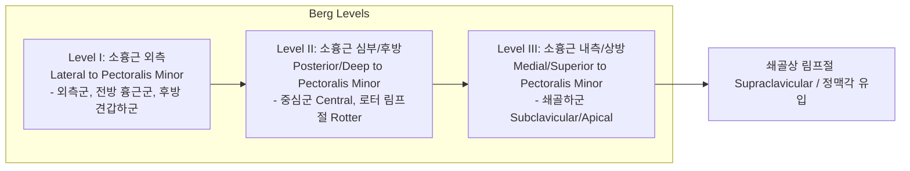
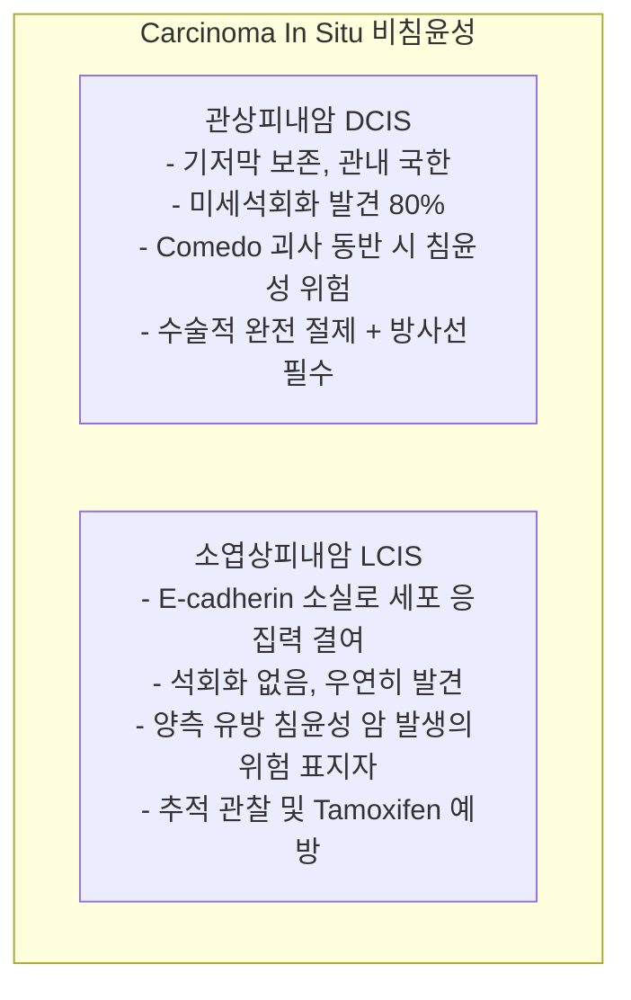

# 📑 [Netter Vol.1] Day 13: 유방 - 정상해부·림프순환·수유생리·섬유낭성변화·섬유선종 및 유방암 종양학 (Section 13 완독)

> 📖 **원서 출처**: [The Netter Collection of Medical Illustrations - Volume 1, Reproductive System.pdf (pp. 284-305)](https://drive.google.com/file/d/1x-xTgPfUfiK7dsQyp5L5qfjFYSD_XyGm/view?usp=drivesdk)  
> 🏷️ **범위**: Section 13 전편 (Plate 13-1 ~ Plate 13-22, 총 22개 플레이트 전수 포함)  
> 📌 **핵심 테마**: 유방 실질 구조(15~20개 유선엽, 쿠퍼 인대) 및 말단 유관소엽단위(TDLU) 미세해부, 3대 혈액 공급망(내흉동맥, 외측흉동맥, 후늑간동맥)과 척추주위 뱃슨 정맥총(Batson's plexus) 혈행성 골전이 기전, 버그(Berg) 3단계 액와 림프절 배액 체계 및 감시 림프절 생검(SLNB), 태너(Tanner) 5단계 사춘기 발달과 프로락틴/옥시토신 매개 수유 생리학(유즙 합성 vs 근상피세포 사출 반사), 발생학적 변이(부유두, 부유방, 처녀성 거대유방증), 에스트로겐/안드로겐 불균형 매개 여성형 유방증(Gynecomastia), 수유기 급성 유선염(황색포도상구균) 및 농양 배농 원칙, 유즙누출증(고프로락틴혈증) vs 혈성 병적 유두 분비물(관내 유두종 50%, 악성 10~15%), 전흉벽 표재성 몬도르 혈전정맥염, BI-RADS 영상 판독 분류(Cat 1~6), 섬유낭성 변화 스펙트럼(유방통, 선증, 블루돔 낭종, 아포크린 화생, 비정형 증식증 암 위험도), 20~30대 다발성 가동성 섬유선종(Breast mouse) 및 간질 과세포성 엽상종양(Phyllodes tumor, 1 cm 안전 절제연), 유방암 임상 징후(피부 함몰, 오렌지껍질 징후 peau d'orange), 상피내암(DCIS 석회화 vs LCIS 양측성 위험 지표) 및 침윤성 암(IDC 80% vs ILC 인도열 단일줄 침윤), 전격성 진피 림프관 폐색 염증성 유방암, 유전성 유방암 증후군(BRCA1 삼중음성 TNBC vs BRCA2 남성 유방암/호르몬 양성, PARP 저해제), 유두 습진양 파제트병(하부 유관암 동반, 파제트 세포), 그리고 남성 유방암의 호르몬 수용체 양성 특성과 임상 관리

---

## 1. 개요 및 마스터 요약 (Executive Summary)

1. **유방의 외과적 해부학, 지지 구조 및 말단 유관소엽단위 (TDLU)**:
   - 유방은 제2~6늑골, 흉골 외측연에서 중액와선에 걸쳐 대흉근막(Pectoralis major fascia) 위에 위치함.
   - **쿠퍼 인대 (Cooper's suspensory ligaments)**: 심부 근막에서 진피로 뻗어 유방 실질을 지지하는 섬유성 격막으로, 암 침윤 시 구축을 일으켜 특징적인 **피부 함몰(Skin dimpling)**을 유발함.
   - **말단 유관소엽단위 (Terminal Ductal Lobular Unit, TDLU)**: 소엽(Lobule)과 종말 유관이 만나는 미세 기능 단위로, **유방 섬유선종, 섬유낭성 질환, 관상피내암(DCIS), 소엽암 등 대다수 양성 및 악성 상피성 병변의 공통 기원지**임.
2. **혈관 공급, 뱃슨 정맥총(Batson's plexus) 및 액와 림프절 전이 경로**:
   - **동맥**: 내흉동맥(Internal mammary a., 60%), 외측흉동맥(Lateral thoracic a., 30%), 늑간동맥 분지(10%).
   - **정맥**: 늑간정맥을 통해 무판막 척추주위 정맥총(**Batson's vertebral plexus**)과 직접 연결되어 복압 상승 시 대정맥계를 거치지 않고 **척추, 골반, 뇌로 혈행성 조기 골전이**를 유발하는 해부학적 고속도로 역할을 함.
   - **림프 배액 (75% 이상 액와 배액)**: 소흉근(Pectoralis minor)을 기준으로 **Berg Level I (외측)** $
ightarrow$ **Level II (심부/후방, Rotter 림프절 포함)** $
ightarrow$ **Level III (내측/상방, 쇄골하)**로 단계적 전이. 감시 림프절 생검(SLNB)으로 불필요한 액와 림프절 곽청술(ALND)에 따른 림프부종 합병증을 최소화.
3. **내분비 조절 및 수유(Lactation)의 이중 호르몬 축**:
   - **유즙 합성**: 뇌하수체 전엽의 **프로락틴(Prolactin)**이 선포세포를 자극하여 유즙 단백질(카제인)과 젖당 합성 주도. (임신 중에는 고농도 에스트로겐/프로게스테론이 수용체를 차단하여 억제되다가 분만 후 태반 만출로 급격히 개시됨).
   - **유즙 사출 반사 (Let-down reflex)**: 유두 흡철 자극 $
ightarrow$ 시상하부 $
ightarrow$ 뇌하수체 후엽의 **옥시토신(Oxytocin)** 분비 $
ightarrow$ 선포 주위 **근상피세포(Myoepithelial cells)의 강력한 수축** $
ightarrow$ 유관동을 통해 유즙 사출.
4. **양성 질환의 감별: 염증, 섬유낭성 변화 및 섬유선종**:
   - **수유기 유선염 (Mastitis)**: *S. aureus* 감염. 모유 수유를 지속하며 항생제 투여. 파동성 농양 형성 시 초음파 유도하 흡인 또는 절개배농.
   - **섬유낭성 변화 (Fibrocystic Changes)**: 에스트로겐 우세로 인한 주기적 유방통(Mastodynia), 낭종(Blue-domed cyst), 경화성 선증. 비정형 증식증(ADH/ALH) 동반 시 암 위험 $4\sim 5$배 증가.
   - **섬유선종 (Fibroadenoma)**: 20~30대 호발, 경계 명확, 압통 없음, 극도로 유동적인 "유방 마우스(Breast mouse)".
   - **엽상종양 (Phyllodes Tumor)**: 간질 세포의 과세포성 및 분열능 증가. 악성 변성 및 국소 재발 방지를 위해 **최소 $1	ext{ cm}$ 이상의 광범위 안전 절제연** 필수.
5. **유방 악성종양학, 분자 아형 및 특수 병태**:
   - **조직학적 분류**: 침윤성 유관암(IDC, 80%, 가장 흔함) vs 침윤성 소엽암(ILC, 10~15%, E-cadherin 결손, 인도열 Indian-file 침윤, 양측성/다발성 호발).
   - **염증성 유방암 (Inflammatory carcinoma)**: 진피 림프관의 암세포 엠볼라이 폐색 $
ightarrow$ 급격한 오렌지 껍질(Peau d'orange) 징후, 최악의 예후.
   - **유전성 유방암**: BRCA1(삼중음성암 TNBC, 난소암 고위험) vs BRCA2(호르몬 수용체 양성, 남성 유방암, 췌장암 고위험).
   - **유두 파제트병 (Paget's disease)**: 유두 습진양 병변, 표피 내 대형 파제트 세포 침윤, $>95\%$에서 하부 기저 유관암(DCIS/IDC) 동반.

---

## 2. 유방의 정상 해부학, 혈관 및 림프 배액 체계 (Plates 13-1 ~ 13-3)

### Plate 13-1 | 유방의 위치와 해부학적 구조 (Position and Structure)

![[Netter_V1_Plate13-1.png]]

#### 1) 육안 해부학적 위치 및 지지 인대
- **해부학적 경계**:
  - 수직 범위: 제2늑골(상계)에서 제6늑골(하계, Inframammary fold)까지.
  - 수평 범위: 흉골 외측연에서 중액와선(Midaxillary line)까지.
  - **스펜스 액와 미부 (Axillary tail of Spence)**: 상외측(UOQ) 유방 조직이 심부 근막 결손부를 뚫고 액와부(Axilla)로 연장되는 해부학적 돌출부로, 유방 종양의 최빈발 부위.
- **후방 근육층과의 관계**:
  - 유방 실질 후면의 $2/3$는 **대흉근(Pectoralis major)**을 덮는 심부 근막에 안착.
  - 외측 $1/3$은 **전거근(Serratus anterior)** 및 외복사근(External oblique), 복직근초 상부와 접함.
  - **유방후 공간 (Retromammary space of Chassaignac)**: 유방 심부 근막과 대흉근막 사이의 느슨한 유착성 소포성 결합조직 공간 $
ightarrow$ 정상 유방이 흉벽 위에서 자유롭게 미끄러지듯 움직이도록 보장하며, 유방 보조물 삽입 수술의 주요 해부학적 평면.
- **쿠퍼 인대 (Cooper's Suspensory Ligaments)**:
  - 심부 대흉근막에서 기원하여 유방 실질 엽(Lobes) 사이를 관통하여 진피층(Dermis)에 강하게 부착되는 치밀 섬유성 결합조직 격막.
  - 유방의 형태와 돌출도를 구조적으로 지지함.
  - **임상적 중요성**: 악성 종양이 쿠퍼 인대를 침윤할 경우 섬유화 수축으로 인해 피부가 딸려 들어가 오목해지는 **피부 함몰(Skin dimpling)**이 나타남.

#### 2) 유선 실질의 분지 구조 및 TDLU
- **유선엽 (Lobes)**: 한쪽 유방당 방사상으로 배열된 $15\sim 20$개의 독립적인 엽으로 구성. 각 엽은 지방 및 섬유성 간질에 의해 분리됨.
- **유관 체계**:
  - 각 엽은 단일한 **주유관(Lactiferous duct)**으로 배액됨.
  - 유두(Nipple) 바로 아래에서 주유관이 팽대되어 우유를 일시 저장하는 **유관동(Lactiferous sinus)**을 형성.
  - 유두 표면에 $15\sim 20$개의 미세한 독립 개구부로 개구.
- **말단 유관소엽단위 (Terminal Ductal Lobular Unit, TDLU)**:
  - 소포(Alveoli / Acini)가 포도송이처럼 모인 소엽(Lobule)과 이를 배액하는 말단 유관(Terminal ductule)으로 구성된 유방의 기본 기능 단위.
  - **호르몬 반응성이 가장 높은 구획**으로, 대부분의 유방 병변(낭종, 섬유선종, 관내상피내암 DCIS, 소엽상피내암 LCIS, 침윤성 암)이 바로 이 TDLU의 상피세포에서 발생함.

---

### Plate 13-2 | 유방의 혈액 공급 (Blood Supply)

![[Netter_V1_Plate13-2.png]]

#### 1) 3대 동맥 공급망의 기원과 분포
유방은 풍부한 다원적 동맥 혈류망을 형성하여 측부 순환이 고도로 발달되어 있습니다:
1. **내흉동맥 (Internal Thoracic / Internal Mammary Artery, 쇄골하동맥 분지)**:
   - **전체 유방 혈류의 약 $60\%$ 공급** (주로 내측 및 중앙부).
   - 제1~4늑간을 관통하는 전방 천공지(Anterior perforating branches)를 분지하여 대흉근을 뚫고 유방 내측 실질로 진입. (제2, 3천공지가 가장 굵음).
2. **외측흉동맥 (Lateral Thoracic Artery, 액와동맥 2차 분지)**:
   - **전체 유방 혈류의 약 $30\%$ 공급** (주로 상외측 및 외측부).
   - 소흉근 외측연을 따라 주행하며 외측 유방지(External mammary branches)를 냄.
3. **기타 보조 동맥망 (약 $10\%$)**:
   - 흉견봉동맥(Thoracoacromial a.)의 흉근 분지.
   - 제3~5후늑간동맥(Posterior intercostal arteries)의 외측 피부 분지.
   - 견갑하동맥(Subscapular a.) 분지.

#### 2) 정맥 환류와 뱃슨 정맥총(Batson's Plexus)의 임상 병리
- **천층 정맥망**: 유두-유륜 복합체 주위에서 **할러 정맥륜(Circulus venosus of Haller)**을 형성한 후 액와정맥 및 내흉정맥으로 유입.
- **심층 정맥망**: 내흉정맥(Internal thoracic v.), 액와정맥(Axillary v.), 후늑간정맥(Posterior intercostal v.)으로 환류.
- **뱃슨 척추정맥총 (Batson's Vertebral Venous Plexus)과 골전이**:
  - 후늑간정맥은 척추관 내부의 무판막(Valveless) 척추주위 정맥총과 직접 자유롭게 문합함.
  - 기침, 배변 등으로 복압/흉압이 상승할 때 혈류가 상대정맥을 우회하여 척추정맥총으로 역류함.
  - **유방암 세포가 대정맥이나 폐 모세혈관 필터를 거치지 않고 직접 흉추, 요추, 골반골 및 두개골로 색전성 혈행 전이를 일으키는 핵심 해부학적 경로**를 제공.

---

### Plate 13-3 | 유방의 림프 배액 체계 (Lymphatic Drainage)

![[Netter_V1_Plate13-3.png]]

#### 1) 액와 림프절의 해부학적 3단계 (Berg Levels)
유방 림프액의 **$75\sim 85\%$는 동측 액와 림프절(Axillary lymph nodes)**로 배액되며, 소흉근(Pectoralis minor)과의 위치 관계에 따라 3개 레벨로 외과적 분류를 시행합니다:



- **Level I (하위 액와)**: 소흉근 외측 경계의 외측에 위치 (외측 액와 정맥군, 견갑하군, 외측흉근 전방군). 유방암 전이의 첫 번째 정거장.
- **Level II (중간 액와)**: 소흉근 바로 뒤쪽 및 심부에 위치. 대흉근과 소흉근 사이의 **로터 근간 림프절(Rotter's interpectoral nodes)**을 포함.
- **Level III (상위 액와 / 정점)**: 소흉근 내측 경계의 내측 및 상방에 위치하는 쇄골하(Subclavicular / Apical) 림프절군.

#### 2) 내흉 및 기타 림프 배액로
- **내흉 림프절 (Internal Mammary Nodes)**: 유방 림프액의 약 $15\sim 20\%$ 배액. 흉골연을 따라 늑연골 사이 늑간강에 위치. 주로 유방 내측 사분면 종양에서 전이율이 높음.
- **감시 림프절 생검 (Sentinel Lymph Node Biopsy, SLNB)**:
  - 원발 종양에서 림프관을 타고 가장 먼저 도달하는 첫 번째 림프절(Sentinel node)을 찾아 조직검사하는 술식.
  - **이중 추적자 기법 (Dual tracer)**: 방사성 동위원소($^{99m}	ext{Tc}$-phytate/nanocolloid)와 청색 염료(Isosulfan blue / Indocyanine green)를 종양 주위에 주입하여 감마 프로브와 육안 착색으로 감시 림프절을 동정.
  - SLNB가 음성이면 전신 림프부종, 신경 손상, 견관절 운동 제한을 유발하는 고식적 액와 림프절 곽청술(ALND)을 생략하여 삶의 질을 보존.

---

## 3. 발생학, 태너 단계, 수유 생리 및 선천 기형 (Plates 13-4 ~ 13-6)

### Plate 13-4 | 유방의 발생과 발달 단계 (Developmental Stages)

![[Netter_V1_Plate13-4.png]]

#### 1) 배아기 유선능(Mammary Ridge)의 발생
- 배아 5~6주경 외배엽이 비후하여 액와부에서 서혜부까지 양측으로 주행하는 원시 **유선릉 / 밀크 라인(Mammary ridge / Milk line)** 형성.
- 정상 인간 배아에서는 흉부 4번째 늑간에 위치한 한 쌍을 제외하고 나머지 부위의 유선능은 완전히 퇴화·흡수됨.
- 외배엽성 상피 싹이 기질 내부로 함입되어 16~20개의 실질 삭(Cords)을 형성하고 임신 후반기에 관강(Lumen)이 개통되어 유관 형성.

#### 2) 사춘기 유방 발달의 태너 5단계 (Tanner Stages of Breast Development)

| 태너 단계 | 발달 특징 (Morphological Characteristics) | 내분비적 배경 |
| :--- | :--- | :--- |
| **Stage 1 (사춘기 전)** | 유두 끝부분의 단순 융기만 관찰, 선 조직 없음 | 기저 에스트로겐 상태 |
| **Stage 2 (유방 싹, Thelarche)** | **유방 싹(Breast bud)** 출현. 유두 및 유륜 하부 선 조직 융기, 유륜 직경 확대 | 시상하부-뇌하수체-난소축(HPG) 재활성화, 에스트로겐 분비 개시 (평균 9~11세) |
| **Stage 3 (지속 증대)** | 유방과 유륜이 하나의 완만한 곡면을 이루며 전반적 확대, 외곽선 분리 없음 | 지속적인 에스트로겐 및 성장호르몬 자극 |
| **Stage 4 (이차 융기)** | **유륜과 유두가 유방 둔덕 위로 돌출하여 별도의 '이차 둔덕(Secondary mound)' 형성** | 프로게스테론 작용 추가 (초경 직전~직후) |
| **Stage 5 (성숙 유방)** | 유륜이 유방 전체 윤곽선 안으로 매끄럽게 흡수 복귀되고 **유두만 돌출된 성인형 유방 완성** | 배란 주기 확립 및 성인 호르몬 평형 |

---

### Plate 13-5 | 유방의 기능적 변화 및 수유 생리 (Functional Changes and Lactation)

![[Netter_V1_Plate13-5.png]]

#### 1) 수유의 2단계 호르몬 협동 기전

```mermaid
graph TD
    subgraph 1. 유즙 생성 Lactogenesis
        PRL_Stim[신생아 흡철 자극 / 도파민 억제] --> PitAnt[뇌하수체 전엽 Anterior Pituitary]
        PitAnt -->|프로락틴 Prolactin 분비| Acinar[유선 포상세포 Alveolar cells]
        Acinar -->|카제인, 유당, 지질 합성| MilkProd[유즙 생산 및 선포 내 저장]
    end
    subgraph 2. 유즙 사출 Milk Ejection Reflex
        Nipple_Mech[유두 기계적 수용체 자극] --> Spinal[척수 신경 전달]
        Spinal --> PitPost[시상하부 / 뇌하수체 후엽 Posterior Pituitary]
        PitPost -->|옥시토신 Oxytocin 방출| Myoepithel[선포 주위 근상피세포 Myoepithelial cells]
        Myoepithel -->|강력한 평활근성 수축| Ejection[유관 압착 및 유관동 분출]
    end
```



- **임신 중 억제와 분만 후 개시**:
  - 임신 중 프로락틴 수치는 매우 높으나, 태반에서 분비되는 **고농도의 에스트로겐과 프로게스테론이 포상세포의 프로락틴 수용체를 길항 억제**하여 실제 젖분비가 일어나지 않음.
  - 분만 시 **태반이 만출되면서 에스트로겐과 프로게스테론이 급락** $
ightarrow$ 프로락틴의 억제 해제 $
ightarrow$ 분만 후 2~3일째부터 본격적인 유즙 생성(Lactogenesis II) 개시.
- **초유 (Colostrum)**:
  - 분만 후 첫 2~4일간 분비되는 진하고 노란 액체.
  - 성숙유에 비해 단백질, 비타민 A, 면역글로불린(**분비형 IgA, sIgA**)이 극도로 풍부하여 신생아의 장관 점막 면역 장벽을 확립하고 태변 배출 촉진.
- **수유성 무월경 (Lactational Amenorrhea)**:
  - 수유 자극에 의한 지속적인 프로락틴 상승은 시상하부의 **GnRH 펄스 분비를 억제** $
ightarrow$ 뇌하수체 LH/FSH 분비 차단 $
ightarrow$ 무배란 및 무월경 유도 (자연적 산후 피임 효과).

---

### Plate 13-6 | 부유두, 부유방 및 유방 비대증 (Polythelia, Polymastia, Hypertrophy)

![[Netter_V1_Plate13-6.png]]

#### 1) 선천성 유방 기형의 스펙트럼
- **부유두 (Polythelia)**:
  - 가장 흔한 선천 기형(인구의 $1\sim 5\%$). 배아기 유선능 주행선을 따라 단독 과잉 유두가 잔존. 남녀 모두 발생.
  - 신생아 비뇨기계 기형(수신증, 중복요관)과의 연관성이 보고되어 정밀 진찰 필요.
- **부유방 (Polymastia)**:
  - 유선 실질 조직을 동반한 완전한 여분의 유방. **액와부(겨드랑이)가 최빈발 부위($90\%$)**.
  - 정상 유방과 동일한 호르몬 반응을 보이므로 **임신 및 수유기 동안 통증, 팽창, 유즙 분비**가 발생하며, 정상 유방과 동일하게 유방암 발생 가능 $
ightarrow$ 외과적 절제술로 완치.
- **처녀성 거대유방증 (Virginal / Juvenile Hypertrophy)**:
  - 사춘기 급성장기에 정상 수치의 호르몬에 대해 유방 기질 및 유관 조직이 국소적으로 과민 반응하여 양측 유방이 비정상적으로 거대해지는 양태 $
ightarrow$ 척추 측만증, 피부 궤양 유발 시 축소성형술(Reduction mammoplasty) 시행.

---

## 4. 양성 유방 질환, 유방염, 여성형 유방증 및 몬도르병 (Plates 13-7 ~ 13-10)

### Plate 13-7 | 여성형 유방증 (Gynecomastia)

![[Netter_V1_Plate13-7.png]]

#### 1) 병태생리 및 진단적 감별
- **핵심 기전**: **유효 에스트로겐 작용 증가 또는 안드로겐 작용 감소/차단**으로 인한 남성 유방 선 조직(Glandular tissue)의 양성 증식.
- **가성 여성형 유방증(Pseudogynecomastia)과의 감별**: 단순 비만으로 인한 유방 지방 축적과 구별하기 위해, 엄지와 검지로 유두-유륜 복합체 하부를 집었을 때 **직경 $\ge 2	ext{ cm}$의 단단하고 동심원적인 원반형 선 조직(Discoid glandular tissue)**이 촉지되어야 함.
- **생리적 3대 피크**:
  1. **신생아기 (60~90%)**: 태반을 통해 전달된 모체 에스트로겐 영향 (수주 내 소퇴).
  2. **사춘기 (50~70%, 13~14세)**: 고환 테스토스테론보다 부신 안드로겐의 말초 아로마타제 에스트로겐 전환이 일시적 우세 (대부분 1~2년 내 자연 퇴축).
  3. **고령기 (50~80%, 50세 이상)**: 고환 기능 저하에 따른 유리 테스토스테론 감소 및 체지방 증가로 인한 아로마타제 활성 증가.
- **병적 및 약물성 원인**:
  - **내분비/전신 질환**: 간경변(간의 에스트로겐 대사 불능, SHBG 증가), 만성 신부전(고요산혈증 및 생식선 기능저하), 갑상선기능항진증, 고환 종양(라이디히세포종, hCG 분비 융모암), **클라인펠터 증후군(47,XXY, 유방암 위험 20~50배 급증)**.
  - **원인 약물 (DISCO 약어)**:
    - **D**igoxin, **I**soniazid, **S**pironolactone (안드로겐 수용체 차단), **C**imetidine / Calcium channel blockers, **O**estrogens / Ketoconazole (테스토스테론 합성 차단), Finasteride, 항정신병제, 마리화나.

---

### Plate 13-8 | 유방 울혈 및 산욕기 유선염/농양 (Painful Engorgement, Puerperal Mastitis)

![[Netter_V1_Plate13-8.png]]

#### 1) 수유기 유방 통증의 단계별 감별 및 관리

| 임상 병태 | 병인 및 발병 시기 | 임상 양상 | 표준 치료 및 수유 지침 |
| :--- | :--- | :--- | :--- |
| **유방 울혈<br>(Engorgement)** | 분만 후 2~4일경 림프/정맥 울혈 및 유즙 정체 | **양측성**, 미만성 팽창, 단단함, 전신 발열 없음 (미열 가능) | **수유 지속**, 수유 전 온찜질, 수유 후 냉찜질, 유축으로 잔여 유즙 완전 배출 |
| **급성 수유기 유선염<br>(Puerperal Mastitis)** | 유두 균열을 통한 **황색포도상구균 (*S. aureus*)** 침입 (분만 2~3주경 호발) | **일측성**, 국소 **쐐기형(Wedge-shaped) 발적·열감·압통**, 오한, **고열 ($\ge 38.5^\circ	ext{C}$)** | **모유 수유 절대 중단 금지 (환측 포함 지속 수유)**<br>페니실리나제 저항성 항생제 (Dicloxacillin, Cephalexin 10~14일) |
| **유방 농양<br>(Breast Abscess)** | 유선염의 치료 지연 또는 불충분한 배농으로 인한 국소 화농성 괴사 | 발적 부위 중심에 만져지는 **파동성(Fluctuant) 압통성 종괴** | **초음파 유도하 세침흡인 또는 외과적 절개배농(I&D)**<br>배농 중에도 반대편 수유 지속 (환측은 유축 배출) |

---

### Plate 13-9 | 유즙 누출증 및 유두 분비물 (Galactorrhea)

![[Netter_V1_Plate13-9.png]]

#### 1) 생리적 유즙누출 vs 병적 유두 분비물의 감별 알고리즘
- **유즙누출증 (Galactorrhea)**:
  - 수유기와 무관하게 지속되는 양측성, 다공성(Multiple ducts), 유백색(Milky) 분비물.
  - **원인: 고프로락틴혈증 (Hyperprolactinemia)**:
    1. 뇌하수체 선종: **프로락틴종 (Prolactinoma)** $
ightarrow$ 혈청 프로락틴 수치 측정 및 뇌하수체 조영 MRI.
    2. 원발성 갑상선기능저하증: 갑상선호르몬 결핍 $
ightarrow$ 시상하부 TRH 대상성 상승 $
ightarrow$ 뇌하수체 프로락틴 분비 자극.
    3. 약물성: 도파민 길항제(Haloperidol, Risperidone, Metoclopramide), 삼환계 항우울제, 항고혈압제(Verapamil).
  - 치료: 도파민 작용제(**카버골린 Cabergoline, 브로모크립틴 Bromocriptine**).
- **병적 유두 분비물 (Pathologic Nipple Discharge)**:
  - 특징: **일측성 (Unilateral), 단일 유관 (Single duct), 자발적 (Spontaneous, 짜지 않아도 나옴), 혈성 (Bloody) 또는 장액혈성 (Serosanguinous)**.
  - 원인 질환 분포:
    - **관내 유두종 (Intraductal Papilloma)**: $40\sim 50\%$ (가장 흔한 양성 원인).
    - **유관 확장증 (Duct ectasia)**: $15\sim 20\%$.
    - **유방암 (DCIS 또는 침윤성 암)**: $10\sim 15\%$ (연령 증가 시 악성 가능성 급증).
  - 진단 및 치료: 유방촬영술, 초음파, 연성 관내시경(Ductoscopy) 및 **미세유관절제술(Microdochectomy)**.

---

### Plate 13-10 | 몬도르병: 전흉벽 표재성 혈전정맥염 (Mondor Disease)

![[Netter_V1_Plate13-10.png]]

#### 1) 임상 양상 및 경과
- **정의**: 전흉벽 및 상복부 표재 정맥인 **흉복벽정맥(Thoracoepigastric vein)** 또는 외측흉정맥의 급성 표재성 혈전정맥염(Superficial thrombophlebitis).
- **유발 인자**: 유방 수술 기왕력, 격렬한 상체 운동, 흉벽 외상, 꽉 끼는 브래지어 착용, 드물게 하부 유방암에 의한 정맥 압박.
- **신체 진찰 소견**: 팔을 들어 올릴 때 전흉벽 피부 아래에서 팽팽하게 당겨지는 **압통성의 단단한 피하 "밧줄 / 코드(Cord-like structure)"**가 시진 및 촉진됨.
- **예후 및 치료**: 전형적인 양성 자가제한성(Self-limiting) 질환으로, 4~8주 이내에 자연적으로 재개통되며 소퇴함. 국소 온찜질 및 경구 소염진통제(NSAIDs) 보존 치료. (단, 기저 유방암 배제를 위해 유방촬영술 시행 권장).

---

## 5. 영상 진단, 섬유낭성 변화 및 양성 종양 (Plates 13-11 ~ 13-16)

### Plate 13-11 | 유방 영상 진단: MMG, 초음파 및 BI-RADS (Breast Imaging)

![[Netter_V1_Plate13-11.png]]

#### 1) 유방 영상 판독 체계 (ACR BI-RADS Classification)

| BI-RADS 범주 | 임상 평가 및 진단 소견 | 악성 위험도 | 권고 임상 조치 (Management) |
| :--- | :--- | :--- | :--- |
| **Category 0** | 불완전한 검사 (추가 영상 검사 필요) | 판정 불가 | 이전 필름 비교, 추가 확대/압박 촬영, 초음파 시행 |
| **Category 1** | **음성 (Negative)**: 특이 소견 없는 정상 유방 | $0\%$ | 연령에 따른 정기 선별 검진 지속 |
| **Category 2** | **양성 소견 (Benign)**: 단순 낭종, 석회화된 섬유선종, 지방종 | $0\%$ | 정기 선별 검진 지속 |
| **Category 3** | **양성 가능성 높음 (Probably Benign)**: 타원형 고형 종괴 | $< 2\%$ | **6개월 간격 단기 추적 초음파 검사** |
| **Category 4** | **악성 의심 (Suspicious Abnormality)**<br>- 4A: 낮은 악성 의심 ($2\sim 10\%$)<br>- 4B: 중간 악성 의심 ($10\sim 50\%$)<br>- 4C: 중등도/고도 악성 의심 ($50\sim 95\%$) | $2\sim 95\%$ | **조직검사 필수 (Core needle biopsy)** |
| **Category 5** | **고도 악성 시사 (Highly Suggestive of Malignancy)**<br>침상 연연, 높은 종횡비, 미세 다형성 석회화 | $> 95\%$ | **확진 조직검사 및 암 치료 계획 수립** |
| **Category 6** | **조직학적으로 이미 확진된 악성 종양** | $100\%$ | 수술, 선행항암요법 등 치료 시행 |

---

### Plate 13-12 | 섬유낭성 변화 I: 유방통 (Fibrocystic Change I: Mastodynia)

![[Netter_V1_Plate13-12.png]]

#### 1) 주기적 유방통(Cyclic Mastalgia)의 병인 및 임상상
- **내분비적 기전**: 여성호르몬(에스트로겐 우세 및 프로게스테론 상대적 결핍)의 불균형으로 인해 월경 주기 황체기 후반에 유방 실질 및 간질에 수분 저류, 혈관 충혈 및 결합조직 부종 발생.
- **임상 징후**:
  - 월경 시작 수일~1주일 전 극심해지는 둔통 및 압통, 월경 시작과 함께 완화/소실.
  - 주로 30~40대 여성에서 호발하며 **양측 상외측 사분면(UOQ)**에 미만성의 몽우리/결절감(Cobblestone nodularity) 촉지.
- **감별 및 관리**:
  - 비주기적 유방통(Noncyclic mastalgia) 및 흉벽 근골격계 통증(티체 증후군 Tietze syndrome, 늑연골염)과의 감별.
  - 지지력이 우수한 브래지어 착용, 카페인/초콜릿 제한, 달맞이꽃 종자유(Evening primrose oil), 증상 중증 시 다나졸(Danazol) 또는 타목시펜(Tamoxifen) 단기 투여.

---

### Plate 13-13 | 섬유낭성 변화 II: 선증 (Fibrocystic Change II: Adenosis)

![[Netter_V1_Plate13-13.png]]

#### 1) 선포 증식과 경화성 선증(Sclerosing Adenosis)
- **병리학적 특징**:
  - 말단 유관소엽단위(TDLU) 내에서 소포/선포(Acini)의 수가 병적으로 증가하는 현상.
  - **경화성 선증 (Sclerosing Adenosis)**: 선포의 증식과 함께 중심부 소엽 간질의 심한 섬유화 및 탄력섬유증식(Elastosis)이 동반되어 선관 구조가 심하게 압박·신장되고 왜곡됨.
- **임상적 난점 (악성 위장성)**:
  - 촉진 시 단단한 결절로 만져질 수 있으며, **유방촬영술상 왜곡된 별모양 종괴(Spiculated mass) 및 다형성 미세석회화(Microcalcifications)**를 형성하여 **침윤성 유관암(IDC)과 영상학적으로 구별이 불가능**.
  - 코어 생검(Core needle biopsy) 또는 절제 생검을 통한 조직학적 확진 필수 (이중 상피/근상피층의 보존 확인).
  - 유방암 발생의 **상대 위험도 1.5~2.0배** 경미한 증가.

---

### Plate 13-14 | 섬유낭성 변화 III: 낭종성 질환 (Fibrocystic Change III: Cystic Change)

![[Netter_V1_Plate13-14.png]]

#### 1) 낭종 형성 및 아포크린 화생(Apocrine Metaplasia)
- **육안 및 현미경 소견**:
  - 말단 유관의 폐쇄 및 분비액 정체로 인해 직경 수 밀리미터에서 수 센티미터 크기의 낭종들이 다발성으로 형성됨.
  - 낭종 내부의 탁한 갈색/청색 삼출액이 얇은 피막을 통해 비쳐 보여 육안적으로 **"블루돔 낭종 (Blue-domed cysts of Bloodgood)"**으로 불림.
  - 낭종을 둘러싼 상피는 호르몬 자극에 반응하여 분비 과립이 풍부한 호산성 원주세포로 변하는 **아포크린 화생(Apocrine metaplasia)**을 흔히 동반.
- **듀폰-페이지 (Dupont & Page) 암 위험도 분류 총괄**:
  1. **비증식성 병변 (위험도 1.0배, 암 위험 증가 없음)**: 단순 낭종, 아포크린 화생, 섬유화, 경미한 유관 증식증.
  2. **비정형 없는 증식성 병변 (위험도 1.5~2.0배)**: 중등도/현저한 관상피 증식증(UDH), 경화성 선증, 관내 유두종증.
  3. **비정형 증식증 (위험도 4.0~5.0배, 고위험 전암병변)**: **비정형 관증식증(ADH)** 및 **비정형 소엽증식증(ALH)** -> 조직검사 절제 후 철저한 정기 선별 추적 및 화학예방 고려.


### Plate 13-15 | 양성 섬유선종 및 낭내 유두종 (Benign Fibroadenoma, Intracystic Papilloma)

![[Netter_V1_Plate13-15.png]]

#### 1) 섬유선종 (Fibroadenoma)
- **역학**: 20~30대 젊은 여성에서 가장 흔히 진단되는 양성 고형 종양.
- **특징**: 에스트로겐 의존성 종양으로 임신 중 크기가 커지고 폐경 후 퇴축 및 석회화(Popcorn calcification) 진행.
- **진찰 소견**: 통증이 없고 둥글거나 타원형이며 경계가 매우 뚜렷하고, 촉진 시 손가락 사이로 미끄러져 도망치는 듯한 고도의 가동성을 보여 **"유방 마우스(Breast mouse)"**로 명명됨.
- **조직학**: 기질(Stroma)과 유관 상피의 복합 증식:
  - 관내형(Intracanalicular): 증식한 기질이 관강을 압박하여 틈새형으로 납작하게 변형.
  - 관주위형(Pericanalicular): 둥근 관강 주위를 동심원상으로 기질이 둘러쌈.

#### 2) 관내/낭내 유두종 (Intraductal / Intracystic Papilloma)
- 주유관 내강으로 돌출하는 섬유혈관성 축(Fibrovascular core)을 지닌 사마귀양 상피 증식.
- **자발적 혈성 유두 분비물(Bloody discharge)의 가장 흔한 원인 ($50\%$)**.
- 유두 근처에서 작은 종괴가 촉지될 수 있으며, 압박 시 특정 개구부에서 혈성 분비물 분출.

---

### Plate 13-16 | 거대 점액종 / 엽상종양 및 육종 (Giant Myxoma, Sarcoma)

![[Netter_V1_Plate13-16.png]]

#### 1) 엽상종양 (Phyllodes Tumor / 과거 Cystosarcoma Phyllodes)
- **임상 양상**: 40~50대 여성 호발. 섬유선종과 유사하게 만져지나 **수개월 내에 직경 $5\sim 10	ext{ cm}$ 이상으로 급격히 거대화**되어 피부를 얇게 늘이고 표재 정맥 확장을 유발.
- **조직학적 특징**:
  - 섬유선종과 달리 **간질 성분의 현저한 과세포성(Stromal hypercellularity)** 및 다형성.
  - 잎사귀 모양의 갈라진 틈(Leaf-like clefts)을 형성하는 육안 소견에서 명명.
- **3단계 악성도 분류**:
  1. **양성 (Benign, 60~70%)**: 유사분열 $< 4/10	ext{ HPF}$, 경계 명확.
  2. **경계성 (Borderline, 15~20%)**: 유사분열 $4\sim 9/10	ext{ HPF}$.
  3. **악성 (Malignant, 10~15%)**: 유사분열 $\ge 10/10	ext{ HPF}$, 침윤성 경계, 심한 간질 비정형성.
- **외과 치료 원칙**:
  - 국소 재발률이 매우 높으므로 단순 핵출술(Enucleation)은 절대 금기이며, **최소 $1	ext{ cm}$ 이상의 정상 유방 조직을 포함하는 광범위 국소 절제술(Wide local excision with margin)** 또는 전절제술 시행.
  - 림프절 전이는 극히 드물고 혈행성(폐, 뼈) 전이를 일으키므로 고식적 액와 림프절 곽청술은 불필요.

---

## 6. 유방암: 병기, 침윤성 암종 및 특수 아형 (Plates 13-17 ~ 13-19)

### Plate 13-17 | 유방암의 임상 징후 및 병기 (Breast Cancer Overview)

![[Netter_V1_Plate13-17.png]]

#### 1) 유방암의 전형적 임상 징후
- **호발 부위**: **상외측 사분면 (Upper Outer Quadrant, UOQ, 50%)** $
ightarrow$ 유선 실질이 가장 많이 분포하기 때문.
- **악성 종괴의 촉진 특성**: 통증이 없고(Painless), 단단하며(Hard/Stone-like), 경계가 불규칙하고(Irregular margin), 주변 조직 및 흉벽에 고정(Fixed)되어 움직이지 않음.
- **피부 및 유두 변화**:
  - **피부 함몰 (Skin dimpling)**: 쿠퍼 인대의 암성 침윤 및 섬유성 견인.
  - **유두 함몰 및 편위 (Nipple retraction/deviation)**: 주유관의 섬유화 단축.
  - **오렌지 껍질 징후 (Peau d'orange)**: 피하 진피 림프관의 암세포 폐색으로 림프부종이 발생하나, 땀샘과 모낭 부위는 피부에 단단히 고정되어 함몰된 채 남아 오렌지 가죽처럼 보이는 소견 (진행성 국소 암의 징후).

---

### Plate 13-18 | 관내암종 및 침윤성 암종 (Intraductal and Lobular Adenocarcinoma)

![[Netter_V1_Plate13-18.png]]

#### 1) 비침윤성 상피내암: DCIS vs LCIS



#### 2) 침윤성 유방암의 양대 축: IDC vs ILC

| 병리 및 임상 지표 | 침윤성 유관암 (Invasive Ductal Carcinoma, IDC) | 침윤성 소엽암 (Invasive Lobular Carcinoma, ILC) |
| :--- | :--- | :--- |
| **발생 빈도** | **전체 유방암의 $75\sim 80\%$ (가장 흔함)** | 전체 유방암의 $10\sim 15\%$ |
| **E-cadherin 발현** | **양성 (세포막 접착 단백 보존)** | **음성 (CDH1 유전자 변이로 발현 결손)** |
| **현미경 침윤 패턴** | 선강 형성(Tubule formation), 세포 집괴(Sheets),<br>심한 결합조직형성(Desmoplasia) 동반한 경성 종괴 | 결합조직형성 없이 단일 세포가 일렬로 침윤하는<br>**인도열 패턴 ("Indian-file" / Single-file pattern)** |
| **양측성 및 다발성** | 주로 일측성, 단일 병소 중심 | **양측성(Bilateral, $20\sim 30\%$) 및 다중중심성(Multicentric)** |
| **영상 진단 민감도** | 유방촬영술상 미세석회화 및 침상 종괴로 명확 | 미만성 침윤으로 종괴 형성이 적어 **MMG 위음성률 높음** (MRI 필수) |
| **호르몬 수용체** | 아형에 따라 다양 (Luminal A/B, HER2, TNBC) | **ER/PR 양성률 극히 높음 ($>90\%$)**, HER2는 거의 항상 음성 |
| **전이 장기 특성** | 폐, 간, 뼈, 뇌로 호발 | 복막, 후복막, 위장관 장간막, 난소, 뇌수막 등 비전형적 전이 |

---

### Plate 13-19 | 염증성 유방암 (Inflammatory Carcinoma)

![[Netter_V1_Plate13-19.png]]

#### 1) 병태생리 및 공격적 임상 양상
- **정의**: 전체 유방암의 $1\sim 2\%$를 차지하나 가장 치명적인 초고위험 국소 진행성 유방암 (진단 시 최소 T4d, stage IIIB 이상).
- **임상 징후**:
  - 유방 피부의 **$1/3$ 이상을 침범하는 급격한 발적(Erythema), 부종(Edema), 열감**.
  - 만져지는 뚜렷한 종괴가 없는 경우가 많으며, 유방 전체가 급속히 비대해지고 단단해짐.
  - 피부 전반에 걸친 심한 **오렌지 껍질(Peau d'orange)** 외관.
- **병리학적 특징**:
  - 진피층 펀치 생검(Punch biopsy) 시 **진피 모세림프관 내 암세포 엠볼라이(Dermal lymphatic emboli)에 의한 광범위한 폐색**이 관찰됨. (진정한 염증 반응이 아닌 림프 울혈에 의한 가성 염증).
- **임상 진주 및 치료 방침**:
  - 비수유기 여성에서 유선염(Mastitis) 증상으로 오인하여 항생제를 투여했으나 1~2주 내에 호전되지 않는 경우 반드시 염증성 유방암을 의심하고 피부 펀치 생검 시행.
  - 즉각적인 수술은 금기이며, **선행항암화학요법(Neoadjuvant Chemotherapy)으로 병기를 낮춘 후 유방전절제술(Modified Radical Mastectomy) 및 방사선 치료, 표적치료**의 다학제 복합 치료 시행.

---

## 7. 유전성 유방암, 파제트병 및 남성 유방암 (Plates 13-20 ~ 13-22)

### Plate 13-20 | 유전성 유방암 및 BRCA 돌연변이 (Hereditary Breast Disease)

![[Netter_V1_Plate13-20.png]]

#### 1) BRCA1 vs BRCA2 유전자의 분자종양학적 비교

| 유전학 및 임상 특성 | BRCA1 유전자 돌연변이 | BRCA2 유전자 돌연변이 |
| :--- | :--- | :--- |
| **염색체 위치** | 염색체 **17q21** | 염색체 **13q12** |
| **생물학적 기능** | 상동 재조합(Homologous Recombination)을 통한 DNA 이중가닥 절단(DSB) 복구 종양억제유전자 | 상동 재조합 복구 복합체(RAD51) 매개 종양억제유전자 |
| **평생 유방암 위험도** | **$65\sim 85\%$** | **$45\sim 85\%$** |
| **평생 난소암 위험도** | **$40\sim 50\%$** | **$15\sim 20\%$** |
| **기타 연관 암종** | 난관암, 복막암, 췌장암 | **남성 유방암 (평생 위험 $6\sim 8\%$, 가장 밀접)**, 전립선암, 췌장암, 흑색종 |
| **면역조직화학적 특성** | **삼중음성 유방암 (TNBC: ER-, PR-, HER2-) 빈발 ($70\%$)**, 높은 등급 | 주로 **호르몬 수용체 양성 (ER+, PR+)**, Luminal 유사 아형 |
| **표적 치료제** | **PARP 저해제 (Olaparib, Talazoparib)**<br>(합성 치사 Synthetic Lethality 유도) | **PARP 저해제**, 호르몬 치료제 |
| **예방적 수술 권고** | 예방적 양측 유방절제술 (암 발생 위험 $90\%$ 감소)<br>**$35\sim 40$세경 예방적 난소난관절제술 (RRSO)** 필수 | 예방적 양측 유방절제술<br>**$40\sim 45$세경 예방적 난소난관절제술 (RRSO)** |

---

### Plate 13-21 | 유두의 파제트병 (Paget Disease of the Nipple)

![[Netter_V1_Plate13-21.png]]

#### 1) 병인 및 임상 진단
- **임상 양상**:
  - 유두 및 유륜에 발생하는 편측성의 **만성 습진양(Eczematous), 홍반성, 삼출성 가피(Crusting), 궤양 및 가려움증**.
  - 국소 스테로이드 연고 치료에 전혀 반응하지 않거나 일시적 호전 후 재발.
- **기저 악성종양과의 절대적 연관성**:
  - **환자의 $>95\%$에서 하부 유방 실질 내 기저 유관암(Ductal Carcinoma, DCIS 또는 침윤성 관암)**이 동반되어 있음.
  - 유관 내 암세포가 주유관을 타고 상행하여 유두 표피층으로 침윤한 병태.
- **병리학적 소견**:
  - 유두 표피 전층에 걸쳐 침윤한 크고 창백한 원형의 **파제트 세포 (Paget cells)** 관찰.
  - 풍부한 호염기성/투명 세포질, 다형성 핵, **뮤신(Mucin) 염색 양성, PAS 양성, Cytokeratin 7(CK7) 및 HER2 양성**.
- **진단 및 치료**:
  - 유두 병변의 **전층 펀치 생검(Full-thickness punch biopsy)**으로 확진.
  - 기저 유방 종양에 대한 유방촬영술 및 초음파 필수. 유두-유륜 복합체 절제를 포함한 유방 보존술 $\pm$ 방사선 치료 또는 유방전절제술.

---

### Plate 13-22 | 남성 유방 악성종양 (Malignancies of Male Breast)

![[Netter_V1_Plate13-22.png]]

#### 1) 남성 유방암의 역학, 위험 인자 및 임상 경과
- **역학**: 전체 유방암의 약 $1\%$, 전체 남성 암의 $0.1\%$. 평균 진단 연령 $65\sim 70$세 (여성보다 약 5~10년 고령).
- **위험 인자**:
  1. **BRCA2 유전자 돌연변이 (가장 강력한 유전 인자, 위험도 최대 100배 증가)**.
  2. **클라인펠터 증후군 (47,XXY, 고성선자극호르몬성 생식선기능저하로 위험도 20~50배 증가)**.
  3. 고에스트로겐혈증: 간경변, 외인성 에스트로겐 투여, 비만, 잠복고환, 고환염.
  4. 흉벽 방사선 노출 기왕력.
- **병리학적 특징**:
  - 남성 유방은 소엽(Lobules)이 거의 발달하지 않으므로, **$90\%$ 이상이 침윤성 유관암 (Invasive Ductal Carcinoma, IDC)**임. (소엽암은 극히 희귀).
  - **호르몬 수용체 양성률이 극도로 높음 (ER 양성 $85\sim 90\%$, PR 양성 $75\sim 80\%$)**.
- **임상적 취약성 및 치료**:
  - 남성은 유방 실질 및 피하지방층이 매우 얇아 종양이 조기에 대흉근, 흉벽 및 피부를 직접 침윤하고 액와 림프절 전이가 빠르게 발생하여 진단 시 병기가 높은 편임.
  - 표준 수술: **유방전절제술 (Simple/Modified Radical Mastectomy) + 감시 림프절 생검 (SLNB)**.
  - 전신 치료: 높은 호르몬 수용체 양성률에 기반하여 **타목시펜 (Tamoxifen)** 항에스트로겐 요법이 필수적 표준 치료.

---

## 8. 로컬 이미지 추출 자동화 스크립트 (Python snippet)

원서 PDF(`The Netter Collection of Medical Illustrations - Volume 1, Reproductive System.pdf`)에서 Section 13에 해당하는 22개 플레이트의 고해상도 이미지를 추출하여 `첨부파일` 폴더에 일괄 저장할 수 있는 로컬 실행용 Python 코드입니다:

```python
import fitz  # PyMuPDF
import os

pdf_path = "The Netter Collection of Medical Illustrations - Volume 1, Reproductive System.pdf"
output_dir = "./헤르메스/책 읽기/Netter_Vol1_생식기계/첨부파일"
os.makedirs(output_dir, exist_ok=True)

doc = fitz.open(pdf_path)

# Section 13 전체 22개 플레이트 정보 매핑 (Plate 13-1 ~ Plate 13-22)
plates_info = [
    ("Plate13-1", "Position and Structure"),
    ("Plate13-2", "Blood Supply"),
    ("Plate13-3", "Lymphatic Drainage"),
    ("Plate13-4", "Developmental Stages"),
    ("Plate13-5", "Functional Changes and Lactation"),
    ("Plate13-6", "Polythelia, Polymastia, Hypertrophy"),
    ("Plate13-7", "Gynecomastia"),
    ("Plate13-8", "Painful Engorgement, Puerperal Mastitis"),
    ("Plate13-9", "Galactorrhea"),
    ("Plate13-10", "Mondor Disease"),
    ("Plate13-11", "Breast Imaging"),
    ("Plate13-12", "Fibrocystic Change I: Mastodynia"),
    ("Plate13-13", "Fibrocystic Change II: Adenosis"),
    ("Plate13-14", "Fibrocystic Change III: Cystic Change"),
    ("Plate13-15", "Benign Fibroadenoma, Intracystic Papilloma"),
    ("Plate13-16", "Giant Myxoma, Sarcoma"),
    ("Plate13-17", "Breast Cancer"),
    ("Plate13-18", "Intraductal and Lobular Adenocarcinoma"),
    ("Plate13-19", "Inflammatory Carcinoma"),
    ("Plate13-20", "Hereditary Breast Disease"),
    ("Plate13-21", "Paget's Disease of the Nipple"),
    ("Plate13-22", "Malignancies of Male Breast"),
]

print(f"총 {len(plates_info)}개 플레이트 검색 및 추출 시작...")

for plate_id, plate_title in plates_info:
    num_suffix = plate_id.replace("Plate13-", "")
    search_terms = [
        f"Plate 13-{num_suffix}",
        f"13-{num_suffix}",
        plate_title.lower()
    ]
    
    target_page = None
    for page_num in range(len(doc)):
        text = doc[page_num].get_text().lower()
        if any(term.lower() in text for term in search_terms):
            target_page = page_num
            break
            
    if target_page is not None:
        page = doc[target_page]
        pix = page.get_pixmap(matrix=fitz.Matrix(3.0, 3.0))  # 300 DPI 고해상도
        img_filename = f"Netter_V1_{plate_id}.png"
        save_path = os.path.join(output_dir, img_filename)
        pix.save(save_path)
        print(f"✅ [추출 성공] {img_filename} (PDF p.{target_page+1})")
    else:
        print(f"⚠️ [페이지 미발견] {plate_id}: {plate_title}")

doc.close()
print("=== Section 13 전체 22개 플레이트 이미지 추출 완료 ===")
```
