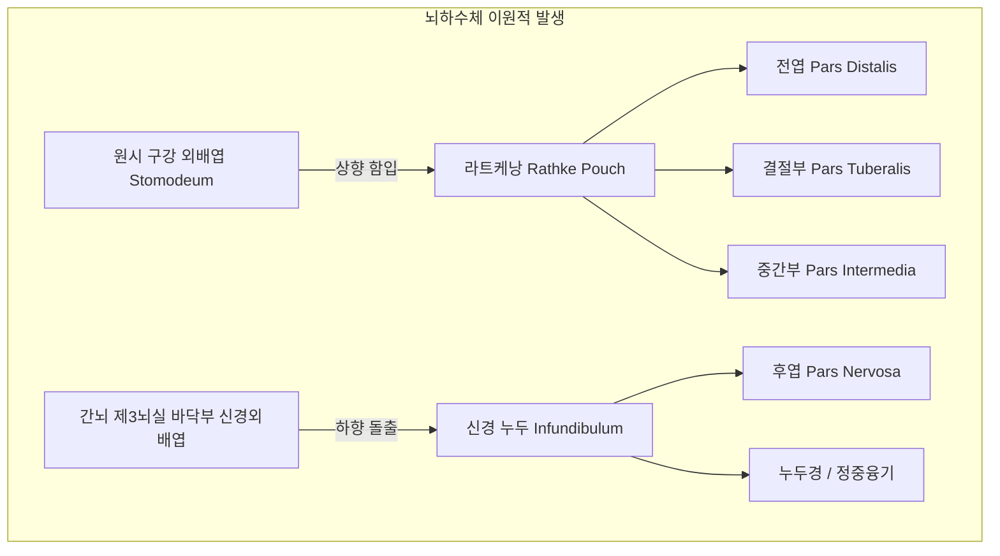
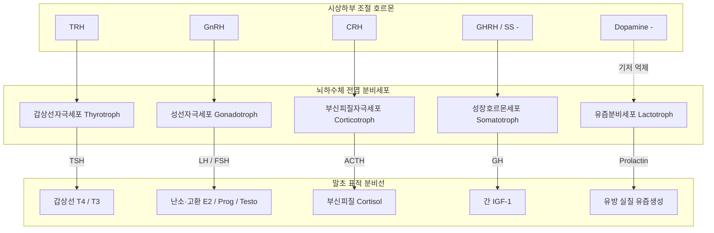
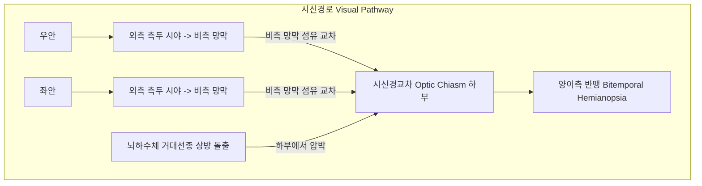
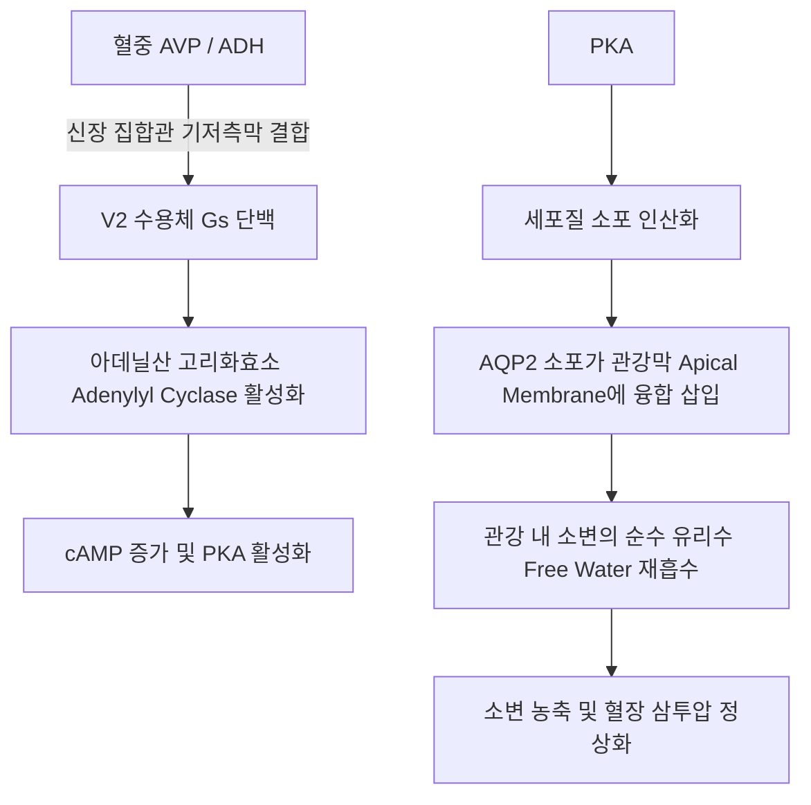

# 📑 [Netter Vol.2] Day 01: 뇌하수체와 시상하부 - 발생·혈류망·피드백·선종·기능저하증·요붕증 및 신경외과 수술학 (Section 1 완독)

> 📖 **원서 출처**: [The Netter Collection of Medical Illustrations - Volume 2, The Endocrine System.pdf (pp. 3-33)](https://drive.google.com/file/d/1TnVzK8w2Nm2lU3SzGlFBLguBf8pjaMkt/view?usp=drivesdk)
> 🏷️ **범위**: Section 1 전편 (Plate 1-1 ~ Plate 1-31, 총 31개 플레이트 전수 포함)
> 📌 **핵심 테마**: 뇌하수체 이원적 발생(구강 외배엽 라트케낭 vs 간뇌 신경외배엽), 시상하부-뇌하수체 문맥계(Hypothalamo-hypophysial portal system) 혈류망과 롱루프/숏루프 피드백 조절축, 해면정맥동(Cavernous sinus) 및 삼차신경/외안근 신경 주행 관계, 안상부 종양(두개인두종 Craniopharyngioma) 및 시신경교차 압박성 양이측 반맹(Bitemporal hemianopsia), 전엽 기능저하증(소아 성장호르몬 결핍증, 성인 칼만 증후군, 범뇌하수체 기능저하증), 산후 대출혈에 의한 허혈성 뇌하수체 괴사(쉬한 증후군 Sheehan syndrome) 및 치명적 뇌하수체 졸중(Pituitary apoplexy 응급 감압술), 기능성 선종의 병태생리(GH 과다 말단비대증/거인증, 고프로락틴혈증/프로락틴종 도파민 작용제, ACTH 분비 쿠싱병 및 양측 부신절제 후 넬슨 증후군 Nelson syndrome), 비기능성 선종(NFPA), 후엽 호르몬(옥시토신 자궁수축·사출반사 vs 바소프레신 AVP/V2 수용체 아쿠아포린-2 매개 수분재흡수), 중추성 요붕증(Central DI 수분제한검사 및 dDAVP 반응), 랑게르한스 세포 조직구증(LCH) 및 전이성 종양, 내시경하 경접형동 접근 수술학(Endoscopic Endonasal Transsphenoidal Approach, TSA).

---

## 1. 개요 및 마스터 요약 (Executive Summary)

1. **뇌하수체의 이원적 발생학과 문맥 혈류학 (Embryology & Portal Vasculature)**:
   - **이원적 기원**: 전엽(Adenohypophysis)은 구강 외배엽이 함입된 **라트케낭(Rathke's pouch)**에서 기원하고, 후엽(Neurohypophysis)은 간뇌(Diencephalon) 바닥에서 하향 돌출된 **신경외배엽(Neuroectoderm)**에서 발생함. 라트케낭 잔유물에서 발생하는 양성 상피종양이 **두개인두종(Craniopharyngioma)**임.
   - **문맥 혈류계(Hypothalamo-Hypophysial Portal System)**: 상하수체동맥(Superior hypophysial a.)이 정중융기(Median eminence)에서 1차 모세혈관망을 형성 $\rightarrow$ 문맥소정맥(Portal venules) $\rightarrow$ 전엽 실질 내 2차 모세혈관동(Sinusoids)으로 유입. 시상하부 방출/억제 호르몬이 전신 순환으로 희석되지 않고 초고농도로 전엽 내분비세포에 직달하는 혈역학적 도관.

2. **안장(Sella) 주위 해부학 및 신경학적 압박 병태생리**:
   - 터키안(Sella turcica)은 접형골체(Sphenoid body)에 위치하며 상방은 안장격막(Diaphragma sellae)으로 덮여 있음.
   - 선종이 상방으로 안장격막을 뚫고 확장(Suprasellar extension) 시 시신경교차(Optic chiasm) 하부를 압박하여 교차하는 비측(Nasal) 망막 신경섬유가 손상 $\rightarrow$ 전형적인 **양이측 반맹(Bitemporal hemianopsia)** 유발.
   - 선종이 측방으로 확장 시 **해면정맥동(Cavernous sinus)**을 침범하여 내경동맥(ICA) 및 뇌신경(CN III, IV, $V_1$, $V_2$, VI)을 압박 $\rightarrow$ 안근마비(Ophthalmoplegia), 복시 및 안면 감각 이상 유발.

3. **뇌하수체 기능저하증(Hypopituitarism)과 허혈성·출혈성 응급**:
   - **쉬한 증후군 (Sheehan Syndrome)**: 임신 중 생리적으로 2배 비대해진 전엽이 분만 시 대량 산후출혈(PPH) 및 저혈압 쇼크로 인해 전격성 허혈성 응고괴사에 빠지는 질환. **산후 유즙 분비 부전(Agalactorrhea)**과 무월경으로 발현하며 점진적 전엽 기능 부전 초래.
   - **뇌하수체 졸중 (Pituitary Apoplexy)**: 기저 선종 내부의 급격한 경색 또는 출혈. 극심한 "벼락 두통(Thunderclap headache)", 시력 상실, 안근마비, 급성 부신피질기능저하성 쇼크 동반 $\rightarrow$ 즉각적인 고용량 코르티코스테로이드 투여 및 **응급 신경외과적 경접형동 감압술(Transsphenoidal decompression)** 필수.

4. **과분비성 뇌하수체 선종 (Hyperfunctioning Pituitary Adenomas)**:
   - **프로락틴종 (Prolactinoma, 40~50%, 최빈발)**: 무월경-유즙누출증(여성), 성욕 감퇴·발기부전(남성). 일차 치료는 수술이 아닌 **도파민 $D_2$ 작용제(카버골린 Cabergoline, 브로모크립틴 Bromocriptine)**.
   - **성장호르몬 분비 선종 (GH Adenoma, 15~20%)**: 골단판 유합 전 소아는 **거인증(Gigantism)**, 유합 후 성인은 **말단비대증(Acromegaly)**. 선별검사는 **혈청 IGF-1(소마토메딘 C)**, 확진은 75g 경구포도당부하검사(OGTT) 시 GH 억제 실패. 합병증으로 심근병증, 수면무호흡증, 대장용종/암 빈발 $\rightarrow$ 일차 치료는 경접형동 절제술(TSA), 약물로 소마토스타틴 수용체 리간드(SRL) 및 GH 수용체 길항제(Pegvisomant).
   - **ACTH 분비 선종 (쿠싱병 Cushing's Disease, 10~15%)**: 중심성 비만, 만월상안, 자색 선조. 양측 부신절제술 후 뇌하수체 ACTH 선종이 억제 해제되어 급속 팽창하고 전신 과색소침착을 보이는 질환이 **넬슨 증후군(Nelson syndrome)**.

5. **신경하수체(후엽) 생리와 중추성 요붕증 (Central Diabetes Insipidus)**:
   - 시상하부 시상상핵(SON) 및 뇌실방핵(PVN)의 대세포 신경분비세포에서 합성되어 신경하수체로 축삭 수송된 후 저장·방출되는 **아르기닌 바소프레신(AVP/ADH)**과 **옥시토신(Oxytocin)**.
   - AVP는 신장 집합관 주세포(Principal cells)의 $V_2$ 수용체에 결합 $\rightarrow$ cAMP/PKA 경로 활성화 $\rightarrow$ **아쿠아포린-2(Aquaporin-2) 수분 통로 소포를 관강막에 삽입**하여 유리수 재흡수.
   - **중추성 요붕증 (Central DI)**: 시상하부-후엽 축 파괴로 인한 AVP 분비 결핍 $\rightarrow$ 다뇨($> 3\text{ L/day}$), 저장성 뇨(뇨삼투압 $< 300\text{ mOsm/kg}$), 고나트륨혈증. 수분제한검사 시 소변 농축 실패하나, 외인성 바소프레신(dDAVP) 투여 시 뇨삼투압이 $50\%$ 이상 급상승하여 신성(Nephrogenic) 요붕증과 명확히 감별됨.

---

## 2. 발생학, 미세해부학 및 시상하부-뇌하수체 혈류축 (Plates 1-1 ~ 1-6)

### Plate 1-1 | 뇌하수체의 발생 (Development of the Pituitary Gland)

![[Netter_V2_Plate1-1.png]]

#### 1) 이원적 외배엽 기원 (Dual Embryological Origin)
- **배아 4~5주경 시작되는 상호 유도 분화**:
  1. **샘뇌하수체 / 전엽 (Adenohypophysis)**:
     - 원시 구강강(Stomodeum) 천장의 구강 외배엽이 두개강 쪽으로 상향 함입되어 형성된 **라트케낭(Rathke's pouch)**에서 기원.
     - 라트케낭 전벽은 비후되어 **원위부(Pars distalis, 전엽 본체)**를 형성하고, 전상방으로 뻗어 누두경을 감싸는 **결절부(Pars tuberalis)**를 형성.
     - 라트케낭 후벽은 후엽과 접촉하여 얇은 **중간부(Pars intermedia)**로 분화.
     - 라트케낭 줄기(Rathke's stalk)는 접형골 연골화와 함께 퇴화 소실됨. (잔유물 존재 시 인두뇌하수체 Pharyngeal hypophysis 형성).
  2. **신경뇌하수체 / 후엽 (Neurohypophysis)**:
     - 간뇌(Diencephalon) 바닥(제3뇌실 바닥부)의 신경외배엽이 하향 누두 돌출(Infundibular neuroectodermal outgrowth)을 일으켜 형성.
     - 원위부는 **신경부(Pars nervosa / Posterior lobe)**를 형성하고, 근위부는 **누두경(Infundibular stalk) 및 정중융기(Median eminence)**를 구성.



> ⚠️ **Clinical Pearl: 라트케낭 낭종(Rathke Cleft Cyst)과 두개인두종(Craniopharyngioma)**
> 라트케낭 내강이 완전히 폐쇄되지 않고 점액성 액체로 채워진 상피 잔유 낭종이 라트케낭 낭종이며, 라트케낭 상피 세포 잔유물이 종양성 증식을 일으키는 석회화 양성 종양이 두개인두종입니다.

---

### Plate 1-2 | 뇌하수체 구획 및 시상하부 연결 (Divisions of the Pituitary Gland and Relationship to the Hypothalamus)

![[Netter_V2_Plate1-2.png]]

#### 1) 뇌하수체 해부학적 구획과 기능적 분할
- **크기 및 중량**: 성인 기준 약 $13 \times 10 \times 6\text{ mm}$, 중량 $0.5\sim 0.6\text{ g}$ (임신 시 2배로 비대).
- **해부학적 구획**:
  - **샘뇌하수체 (전엽, Adenohypophysis, 전체의 75~80%)**:
    - **원위부 (Pars distalis)**: 주된 호르몬 분비 실질 세포(Somatotroph, Lactotroph, Corticotroph, Thyrotroph, Gonadotroph) 밀집.
    - **결절부 (Pars tuberalis)**: 누두경을 칼라(Collar) 형태로 감싸며 문맥 혈관 주행.
    - **중간부 (Pars intermedia)**: 사람에서는 퇴화되어 난포(Follicles)나 콜로이드 낭(Colloid cysts) 형태로 잔존.
  - **신경뇌하수체 (후엽, Neurohypophysis, 전체의 20~25%)**:
    - **신경부 (Pars nervosa)**: 신경분비세포 축삭 종말과 후엽 지지세포인 뇌하수체세포(Pituicytes)로 구성.
    - **누두경 (Infundibular stalk) 및 정중융기 (Median eminence)**.

---

### Plate 1-3 | 뇌하수체의 혈액 공급 및 문맥계 (Blood Supply of the Pituitary Gland)

![[Netter_V2_Plate1-3.png]]

#### 1) 시상하부-뇌하수체 문맥 혈류계 (Hypothalamo-Hypophysial Portal System)
- **상하수체동맥 (Superior Hypophysial Artery, SHA)**:
  - 내경동맥(ICA) 및 후교통동맥(PCoA)에서 분지.
  - 정중융기 및 뇌하수체 줄기 근위부로 진입하여 유창성(Fenestrated) 모세혈관 총인 **1차 모세혈관총(Primary capillary plexus)**을 형성.
- **문맥소정맥 (Hypophysial Portal Venules)**:
  - 1차 모세혈관망에서 모인 혈액이 누두경을 따라 평행하게 하향 주행하는 장문맥관(Long portal vessels)과 단문맥관(Short portal vessels)을 형성.
- **2차 모세혈관동 (Secondary Capillary Plexus / Sinusoids)**:
  - 전엽 실질 내에서 넓은 굴모양 혈관동(Sinusoids)으로 분지하여 전엽 내분비세포와 직접 밀접 접촉.
  - 시상하부 신경분비세포에서 방출된 CRH, TRH, GnRH, GHRH, Somatostatin, Dopamine이 전신 순환을 거치지 않고 직접 최고 농도로 전엽 표적세포에 도달.
- **하하수체동맥 (Inferior Hypophysial Artery, IHA)**:
  - 내경동맥의 수막하수체동맥간(Meningohypophyseal trunk)에서 분지하여 후엽(Pars nervosa)에만 직접 동맥혈을 단독 공급. 전엽 실질과는 직접 동맥 문합이 없음.

---

### Plate 1-4 | 뇌하수체의 육안 해부학 및 인접 구조 (Anatomy and Relationships of the Pituitary Gland)

![[Netter_V2_Plate1-4.png]]

#### 1) 3차원적 인접 해부학적 관계
- **상방**: 안장격막(Diaphragma sellae), 뇌하수체 줄기 관통구, 시신경교차(Optic chiasm, 전상방 $5\sim 10\text{ mm}$ 이격), 제3뇌실 바닥부.
- **하방**: 터키안저(Sellar floor), 얇은 접형골판, 접형동(Sphenoid sinus), 비인두강.
- **측방**: 양측 해면정맥동(Cavernous sinus), 내경동맥(ICA, C4 해면부), 안근 지배 뇌신경들.
- **전방**: 안장결절(Tuberculum sellae), 시신경구(Chiasmatic sulcus).
- **후방**: 안장등(Dorsum sellae), 후상돌기(Posterior clinoid processes), 뇌간(Basilar a., Pons).

---

### Plate 1-5 | 해면정맥동과의 해부학적 관계 (Relationship of the Pituitary Gland to the Cavernous Sinus)

![[Netter_V2_Plate1-5.png]]

#### 1) 해면정맥동(Cavernous Sinus) 주행 신경 및 혈관
- 뇌하수체 양측에 위치한 정맥동으로 경막 층 사이에 형성된 복잡한 정맥망:
  - **정맥동 내부를 관통하는 구조 (Free in sinus)**:
    1. **내경동맥 (Internal Carotid Artery, ICA)**: S자형 사이폰(Carotid siphon)을 형성.
    2. **외전신경 (CN VI, Abducens nerve)**: ICA 바로 외측 아래를 통과하여 외측 침범 시 가장 먼저 마비되어 **내사시 및 외측 주시 불능** 초래.
  - **정맥동 외측벽 경막 층에 포절된 구조 (Lateral wall, 상$\rightarrow$하 순서)**:
    1. **동안신경 (CN III, Oculomotor n.)**: 상검하수, 동공산대, 외안근 마비.
    2. **활차신경 (CN IV, Trochlear n.)**: 상사근 마비, 하향 안쪽 주시 불능.
    3. **삼차신경 안신경분지 ($V_1$, Ophthalmic n.)**: 각막 반사 소실, 이마 감각 저하.
    4. **삼차신경 상악신경분지 ($V_2$, Maxillary n.)**: 뺨 및 윗입술 감각 저하.

| 해면정맥동 구조 | 주행 위치 | 압박 시 임상 징후 |
| :--- | :--- | :--- |
| **CN VI (외전신경)** | 동맥(ICA) 바로 외측, 정맥강 내부 주행 | 외측 외전 장애, 수평 복시 (가장 조기 손상) |
| **CN III (동안신경)** | 외측벽 최상단 | 안검하수, 동공 산대(대광반사 소실), 하외측 편위 |
| **CN IV (활차신경)** | 외측벽 중간부 | 하향 계단 보행 시 수직 복시 |
| **CN $V_1, V_2$ (삼차신경)** | 외측벽 하단부 | 이마·뺨 안면부 감각 이상 및 삼차신경통 유사 동통 |
| **내경동맥 (ICA)** | 정맥동 중심부 관통 | 가성동맥류, 해면정맥동루(CCF), 뇌허혈 |

---

### Plate 1-6 | 터키안의 해부학 및 변이 (Relationships of the Sella Turcica)

![[Netter_V2_Plate1-6.png]]

#### 1) 터키안과 안장격막 결손 (Empty Sella Syndrome)
- **안장격막 (Diaphragma sellae)**: 터키안 상부를 덮는 경막 주름으로, 중심부에 뇌하수체 줄기(누두경)가 통과하는 작은 개구부가 있음.
- **공터키안 증후군 (Empty Sella Syndrome)**:
  - **일차성 (Primary)**: 안장격막 개구부가 선천적으로 불완전하거나 결손되어 지주막하강(Subarachnoid space)의 박동성 뇌척수액(CSF) 압력이 터키안 내부로 직접 전달 $\rightarrow$ 뇌하수체 실질이 터키안 바닥과 후벽으로 납작하게 압착되어 영상의학적(MRI)으로 터키안이 비어 보임. 비만, 다산부, 두개내압 상승(가성 뇌종양) 환자에서 호발하며 대개 내분비 기능은 정상 유지.
  - **이차성 (Secondary)**: 선종 수술 절제, 방사선 조사, 혹은 뇌하수체 졸중에 따른 선종 괴사 후 2차적으로 발생. 전엽 기능저하증 동반 빈도 높음.

---

## 3. 시상하부-뇌하수체 호르몬 분비 체계 및 안상부 병변 (Plates 1-7 ~ 1-12)

### Plate 1-7 | 뇌하수체 전엽 호르몬과 피드백 조절 (Anterior Pituitary Hormones and Feedback Control)

![[Netter_V2_Plate1-7.png]]

#### 1) 5대 전엽 세포군과 시상하부 신경호르몬 축 (Hypothalamic-Pituitary Axes)



- **5대 분비세포와 특성**:
  1. **Somatotroph (성장호르몬 분비세포, 50%)**: 산호성(Acidophil), GH 합성. 시상하부 GHRH에 의해 촉진, 소마토스타틴(SS)에 의해 억제.
  2. **Lactotroph / Mammotroph (프로락틴 분비세포, 15~20%)**: 산호성, Prolactin 합성. 시상하부 **도파민(Dopamine)에 의한 지속적 긴장성 음성 억제(Tonic inhibition)**를 받는 유일한 세포.
  3. **Corticotroph (부신피질자극세포, 15~20%)**: 염기호성(Basophil), POMC 전구체로부터 ACTH 합성. CRH 및 AVP에 의해 자극.
  4. **Thyrotroph (갑상선자극세포, 5%)**: 염기호성, TSH 합성. 시상하부 TRH에 의해 자극, 갑상선호르몬($T_3, T_4$)에 의해 음성 되먹임.
  5. **Gonadotroph (성선자극세포, 10%)**: 염기호성, LH와 FSH 동시 합성. 시상하부 GnRH의 박동성(Pulsatile) 분비에 의해 자극.

---

### Plate 1-8 | 뇌하수체 후엽 및 신경하수체 (Posterior Pituitary Gland)

![[Netter_V2_Plate1-8.png]]

#### 1) 시상하부-신경하수체 축의 구조 (Hypothalamo-Neurohypophysial System)
- **신경분비세포 기원**: 시상하부의 **시상상핵 (Supraoptic Nucleus, SON)** 및 **뇌실방핵 (Paraventricular Nucleus, PVN)**에 존재하는 대세포성 신경분비세포(Magnocellular neurosecretory neurons).
  - SON: 주로 **바소프레신 (AVP / ADH)** 합성 (약 5:1 비율).
  - PVN: 주로 **옥시토신 (Oxytocin)** 합성.
- **축삭 수송 및 헤링 소체 (Herring Bodies)**:
  - 전구체 단백질(Prepro-hormone)이 합성된 후 운반단백질인 **뉴로피신(Neurophysin I for oxytocin, Neurophysin II for AVP)**과 결합하여 무수신경섬유(시상하부-뇌하수체 신경로)를 통해 축삭 유동 수송됨.
  - 후엽 내 신경말단 팽대부에 과립 형태로 저장된 구조를 **헤링 소체(Herring bodies)**라 함.
- **뇌하수체세포 (Pituicytes)**: 후엽 실질을 구성하는 특수 성상교세포성 지지세포.

---

### Plate 1-9 | 안상부 병변의 임상 양상 (Manifestations of Suprasellar Disease)

![[Netter_V2_Plate1-9.png]]

#### 1) 안상부 질환의 3대 증후군 (Triad of Suprasellar Pathology)
1. **내분비 증후군**: 시상하부-뇌하수체 줄기 압박에 따른 범뇌하수체 기능저하증 + **고프로락틴혈증(줄기 절단 효과 Stalk section effect)** + **중추성 요붕증(Central DI)**.
2. **신경안과적 증후군**: 시신경교차 압박에 의한 시야 결손, 시력 저하, 시신경 위축.
3. **신경학적 증후군**: 제3뇌실 압박으로 인한 뇌척수액 순환 장애 $\rightarrow$ **폐쇄성 수두증(Obstructive hydrocephalus)** 및 두개내압 상승(ICP 상승, 두통, 오심·구토, 유두부종).

---

### Plate 1-10 | 두개인두종 (Craniopharyngioma)

![[Netter_V2_Plate1-10.png]]

#### 1) 병리조직학적 특징 및 임상 양상
- **발생 및 역학**: 라트케낭의 태생기 상피 잔유물에서 발생하는 양성(WHO Grade I) 상피성 종양. 소아기(5~14세)와 성인기(50~75세)의 이봉성(Bimodal) 호발.
- **2대 조직학적 아형**:
  1. **유두상 법랑질종형 (Adamantinomatous, 소아 호발)**: 치성 법랑질모세포종과 유사한 책상 배열(Palisading), 각질 덩어리인 "습성 각질(Wet keratin)", **다발성 낭종 및 현저한 석회화(90%)**, 낭종 내 콜레스테롤 결정이 풍부한 흑갈색 **"기계 기름(Machine oil)" 양 액체**가 특징.
  2. **유두상형 (Papillary, 성인 호발)**: 단단한 고형 종괴, 석회화 드묾, BRAF V600E 돌연변이 동반.
- **소아 임상 징후**: 성장호르몬 결핍에 따른 **심각한 저신장(Dwarfism)**, 사춘기 지연, 두개내압 상승 및 시야 결손.

---

### Plate 1-11 | 뇌하수체 종양의 시신경교차 압박 (Effects of Pituitary Tumors on the Visual Apparatus)

![[Netter_V2_Plate1-11.png]]

#### 1) 시야 장애의 해부학적 기전



- **양이측 반맹 (Bitemporal Hemianopsia)**:
  - 뇌하수체 종양이 안장격막을 뚫고 상방 성장 시, 시신경교차의 **하부 중앙**을 압박.
  - 양안의 비측(Nasal) 반망막에서 기원하여 교차하는 신경섬유(측두 시야 담당)가 선택적으로 차단됨.
  - 환자는 좌우 양쪽 바깥쪽 시야가 보이지 않아 터널 속을 보는 듯하거나 운전 중 측면 충돌 위험 증가.
  - 진행 시 상측두 분반맹(Bitemporal superior quadrantanopia)에서 시작하여 완전 양이측 반맹으로 진행.

---

### Plate 1-12 | 뇌하수체 줄기 및 비종양성 병변 (Nontumorous Lesions of the Pituitary Gland and Pituitary Stalk)

![[Netter_V2_Plate1-12.png]]

#### 1) 림프구성 뇌하수체염 및 육아종성 병변
- **림프구성 뇌하수체염 (Lymphocytic Hypophysitis)**:
  - 자가면역성 질환으로 **임신 말기 또는 산욕기 여성**에서 호발.
  - 뇌하수체 실질 및 누두경의 광범위한 림프구·형질세포 침윤과 비대. 선종으로 오인하기 쉬움.
  - ACTH 결핍이 조기에 나타나 부신 부전 쇼크 위험 높음. 스테로이드 치료에 극적 반응.
- **육아종성 질환**: 사르코이드증(Sarcoidosis), 결핵, 매독 등이 누두경을 침범하여 누두경 비후(Stalk thickening) 및 중추성 요붕증, 고프로락틴혈증 유발.

---

## 4. 뇌하수체 전엽 기능저하증 스펙트럼 및 응급 (Plates 1-13 ~ 1-18)

### Plate 1-13 | 소아청소년기 뇌하수체 전엽 결핍증 (Pituitary Anterior Lobe Deficiency in Childhood and Adolescence)

![[Netter_V2_Plate1-13.png]]

#### 1) 뇌하수체 왜소증 (Pituitary Dwarfism / Growth Hormone Deficiency)
- **성장 패턴**: 출생 체중은 정상이나, 생후 1~2세부터 성장 속도가 급격히 저하 ($< 4\text{ cm/year}$, 성장 곡선 3백분위수 미만).
- **신체적 특징**:
  - 신체 각 부위의 비율은 유지되는 **균형잡힌 저신장 (Proportionate dwarfism)** (연골무형성증의 불균형 왜소증과 감별).
  - 통통하고 어려 보이는 인형 같은 얼굴(Doll-like facies), 전두부 돌출, 미숙한 목소리, 중심성 복부 지방 축적, 치아 맹출 지연.
- **골연령 (Bone age)**: 방사선 소견상 역연령(Chronological age)에 비해 **골연령이 현저히 지연**.
- **진단 및 치료**: 인슐린 유발 저혈당 검사(ITT) 등 GH 자극검사 2가지 이상에서 피크 GH $< 10\text{ ng/mL}$. 재조합 인간 성장호르몬(rhGH) 피하 주사.

---

### Plate 1-14 | 성인 뇌하수체 전엽 기능저하증 (Pituitary Anterior Lobe Deficiency in Adults)

![[Netter_V2_Plate1-14.png]]

#### 1) 성인 결핍 순서 및 임상 증상
- **결핍의 전형적 순서**: **GH $\rightarrow$ LH/FSH $\rightarrow$ TSH $\rightarrow$ ACTH** ("Go Look For The Adenoma").
- **성인 GH 결핍증 (AGHD)**: 골밀도 감소(골다공증), 제지방량 감소, 체지방(내장지방) 증가, 활력 감소, 이상지질혈증, 심혈관 위험 증가.
- **성선기능저하증 (Secondary Hypogonadism)**: 여성은 무월경, 불임, 질 건조증, 골소실; 남성은 성욕 감퇴, 발기부전, 고환 위축, 음모 및 액와모 탈락, 근력 저하.
- **이차성 갑상선기능저하증**: 만성 피로, 한랭 불내성, 변비, 건조한 피부, 체중 증가. (원발성과 달리 갑상선종 Goiter가 없고 끈적한 점액수종 Myxedema가 덜함).
- **이차성 부신피질기능저하증**: 쇠약감, 식욕부진, 체중감소, 저혈당, 저혈압. (원발성 에디슨병과 달리 알도스테론 분비는 RAAS계에 의해 유지되므로 고칼륨혈증이 없고, ACTH 결핍으로 인해 **피부 과색소침착이 전혀 나타나지 않음**).

---

### Plate 1-15 | 선택적 및 부분적 뇌하수체 기능저하증 (Selective and Partial Hypopituitarism)

![[Netter_V2_Plate1-15.png]]

#### 1) 칼만 증후군 (Kallmann Syndrome)
- **병인**: 태생기 GnRH 분비 신경세포가 후각판(Olfactory placode)에서 시상하부로 정상 이동하지 못하는 발달 결함 (KAL1, FGFR1 유전자 변이).
- **핵심 2대 임상 징후**:
  1. **저성선자극호르몬성 성선기능저하증 (Hypogonadotropic Hypogonadism)**: 사춘기 지연, 작은 고환, 왜소음경, 무월경.
  2. **후각 소실 / 후각 저하 (Anosmia / Hyposmia)**: 후각망울(Olfactory bulb) 무발생 또는 저형성으로 냄새를 전혀 맡지 못함.
- 신체 계측: 에우누코이드 체형(Eunuchoid proportions: 상체/하체 비율 $< 0.9$, 양팔 벌린 길이 > 키).

---

### Plate 1-16 | 범뇌하수체 기능저하증 (Panhypopituitarism)

![[Netter_V2_Plate1-16.png]]

#### 1) 범뇌하수체 기능저하증의 전신 양상과 호르몬 보충 순서
- **임상 징후 (시몬즈병 Simmonds Disease)**: 전엽의 75% 이상 소실 시 증상 발현, 90% 이상 소실 시 전신 탈진, 한랭 불내성, 성선 위축, 심한 저혈압, 피부 창백(멜라닌 감소), 혼수.
- **⚠️ 호르몬 대체 요법의 절대 원칙 (Rule of Hormone Replacement)**:
  - **반드시 글루코코르티코이드(Hydrocortisone)를 갑상선호르몬(Levothyroxine)보다 먼저 투여하거나 최소 동시 투여해야 함!**
  - 부신 부전이 교정되지 않은 상태에서 레보티록신을 먼저 투여하면 간의 코르티솔 청소율이 급증하여 잠재적 부신 결핍 환자를 치명적인 **급성 부신 위기(Adrenal Crisis / Acute Adrenal Failure)**로 몰아넣음.

---

### Plate 1-17 | 산후 뇌하수체 경색: 쉬한 증후군 (Postpartum Pituitary Infarction: Sheehan Syndrome)

![[Netter_V2_Plate1-17.png]]

#### 1) 병태생리 및 진단적 징후
- **병태생리**:
  - 임신 중 에스트로겐 자극으로 뇌하수체 락토트로프 세포가 증식하여 부피가 2배로 팽창하나, 터키안 뼈 공간은 고정되어 있고 혈류 공급은 상대적으로 취약함.
  - 분만 시 대량 산후출혈(Severe PPH)로 인한 심한 저혈압 및 저혈량성 쇼크 발생 $\rightarrow$ 뇌하수체 상하수체동맥의 심한 혈관 연축 및 미세혈전 형성 $\rightarrow$ 전엽의 광범위한 **허혈성 응고괴사 (Ischemic coagulative necrosis)**.
- **초기 및 후기 임상 경과**:
  1. **첫 번째 징후**: **분만 후 젖이 전혀 돌지 않음 (Failure of lactation / Agalactorrhea)**.
  2. **두 번째 징후**: 출산 후 정상적인 월경이 재개되지 않는 **속발성 무월경 (Amenorrhea)**.
  3. **진행 징후**: 음모 및 액와모의 급격한 영구 탈락, 성욕 소실, 극심한 무기력, 한랭 불내성, 저혈당, 저나트륨혈증, 창백한 밀랍 피부.

---

### Plate 1-18 | 뇌하수체 졸중 (Pituitary Apoplexy)

![[Netter_V2_Plate1-18.png]]

#### 1) 신경외과적 및 내분비 응급 상황
- **정의**: 기존에 존재하던 뇌하수체 거대선종 내부로 급성 출혈(Hemorrhage) 또는 경색(Infarction)이 발생하여 종양 용적이 폭발적으로 급팽창하는 치명적 증후군.
- **임상 징후**:
  - **벼락 두통 (Thunderclap headache)**: 뇌지주막하출혈(SAH)과 유사한 갑작스럽고 극심한 후두부/전두부 통증.
  - **신경안과적 응급**: 급격한 양안 시력 상실, 완전 양이측 반맹.
  - **해면정맥동 압박**: CN III, IV, VI 급성 동시 마비로 인한 완전 안근마비(Ophthalmoplegia) 및 안검하수.
  - **내분비 쇼크**: 급성 부신피질자극호르몬 결핍으로 인한 치명적 혈압 강하, 저혈당 및 순환 허탈.
- **응급 처치 알고리즘**:
  1. 즉각적인 정맥용 고용량 하이드로코르티손(Hydrocortisone 100 mg IV stat) 투여.
  2. 조영 증강 뇌 MRI/CT 신속 확인.
  3. 의식 저하나 급격한 시력/시야 악화 시 24~48시간 이내 **응급 경접형동 감압술(Transsphenoidal decompression)** 시행.

---

## 5. 뇌하수체 전엽 기능성 선종 (GH, Prolactin, ACTH) 및 비기능성 종양 (Plates 1-19 ~ 1-24)

### Plate 1-19 | 뇌하수체성 거인증 (Pituitary Gigantism)

![[Netter_V2_Plate1-19.png]]

#### 1) 골단판 융합 이전의 GH 과다분비
- **발병 기전**: 소아 및 청소년기에 **골단판(Epiphyseal growth plates)이 닫히기 전** 지속적인 성장호르몬(GH) 과다 분비.
- **신체적 소견**:
  - 장골(Long bones)의 종적 과성장으로 신장이 $2.1\sim 2.7\text{ m}$에 이름.
  - 연조직 비대, 큰 손과 발, 거대설(Macroglossia), 하악 돌출.
  - 성선기능저하증이 흔히 동반되어 골단판 폐쇄가 더욱 지연되므로 키가 비정상적으로 계속 자람.
  - 심혈관계 부담으로 울혈성 심부전, 부정맥, 대사성 당뇨병이 조기 사망 원인.

---

### Plate 1-20 | 말단비대증 (Acromegaly)

![[Netter_V2_Plate1-20.png]]

#### 1) 성인 골단판 유합 후 GH/IGF-1 과다증의 전신 병태생리
- **신체 외형적 변화**:
  - **안면 골격**: 전두골 융기(Frontal bossing), 하악골 과성장에 따른 **하악전돌증(Prognathism)**, 치아 간격 벌어짐(Teeth spacing), 거대설(Macroglossia).
  - **말단부**: 신발과 반지 크기가 점점 커짐(손가락·발가락 굵어짐), 가죽 같은 두꺼운 피부, 다한증(Hyperhidrosis).
- **장기 비대 및 전신 합병증**:
  - 장기 거대증(Visceromegaly): 심장비대, 간종대, 갑상선종, 신장 비대.
  - **심혈관계**: 고혈압, 좌심실 비대, 확장성 심근병증 (주요 사망 원인).
  - **호흡기계**: 설근 비후 및 인두 연조직 증식에 따른 중증 **폐쇄성 수면무호흡증 (OSA)**.
  - **대사계**: GH의 항인슐린 작용으로 인한 인슐린 저항성, 내당능 장애 및 이차성 당뇨병 (30~50%).
  - **종양학**: **대장 용종 및 대장암(Colon cancer) 발생 위험 2~4배 증가** (정기 대장내시경 스크리닝 필수).

#### 2) 진단 및 치료 알고리즘
- **선별 검사**: **혈청 IGF-1(소마토메딘 C)** 측정 (GH의 박동성 분비 변동을 배제하는 가장 안정적인 지표).
- **확진 검사**: **75g 경구포도당부하검사(OGTT)** 시행 후 혈청 GH 측정 $\rightarrow$ 정상인은 GH가 $< 1.0\text{ ng/mL}$ (고감도 검사 시 $< 0.4$)로 억제되나, 말단비대증 환자는 **억제 실패(Nonsuppressible GH)**.
- **치료**:
  - 1차 치료: **경접형동 뇌하수체 선종 절제술 (TSA)**.
  - 약물 요법 (수술 불완전 또는 금기 시):
    1. **소마토스타틴 수용체 리간드 (SRL)**: 옥트레오타이드(Octreotide), 란레오타이드(Lanreotide) $\rightarrow$ SSTR2/5 결합하여 GH 분비 억제 및 종양 축소.
    2. **GH 수용체 길항제**: 페그비소만트(Pegvisomant) $\rightarrow$ 말초 간에서 IGF-1 생성 차단.
    3. **도파민 작용제**: 카버골린(Cabergoline, 경증 또는 프로락틴 동시 분비 시).

---

### Plate 1-21 | 프로락틴 분비 뇌하수체 선종 (Prolactin-Secreting Pituitary Tumor)

![[Netter_V2_Plate1-21.png]]

#### 1) 프로락틴종(Prolactinoma)의 임상 양상 및 크기별 감별
- **전체 기능성 뇌하수체 선종의 40~50% (가장 흔함)**.
- **성별 임상상 차이**:
  - **가임기 여성 (주로 미세선종 Microadenoma, $< 10\text{ mm}$)**: **무월경-유즙누출 증후군 (Amenorrhea-Galactorrhea syndrome)**, 불임, 질 건조증, 성교통. (프로락틴이 GnRH 박동성 분비를 차단하여 발생).
  - **남성 (주로 거대선종 Macroadenoma, $\ge 10\text{ mm}$)**: 성욕 감퇴, 발기부전, 여성형 유방증, 불임. 증상이 비특이적이어서 종양이 거대화된 후 두통, 시야 결손 등 신경학적 압박 증상으로 늦게 진단됨.
- **약물 요법의 우선성 (Medical Therapy First)**:
  - 거대선종으로 시야 장애가 동반된 경우라도 **일차 치료는 수술이 아닌 도파민 작용제(Dopamine agonist)**임.
  - **카버골린 (Cabergoline)**: 락토트로프의 $D_2$ 수용체에 고친화성으로 결합하여 80~90%에서 혈청 프로락틴 정상화 및 극적인 종양 크기 축소 달성 (브로모크립틴보다 우수한 효능과 내약성).

---

### Plate 1-22 | 코르티코트로핀 분비 선종 / 쿠싱병 (Corticotropin-Secreting Pituitary Tumor / Cushing Disease)

![[Netter_V2_Plate1-22.png]]

#### 1) 쿠싱병(Cushing Disease)의 진단 및 병태생리
- **정의**: 뇌하수체 전엽 코르티코트로프 미세선종에서 ACTH를 과다 분비하여 양측 부신피질 과형성 및 고코르티솔혈증을 초래하는 질환 (내인성 쿠싱 증후군의 70% 차지).
- **특징적 임상 징후**: 중심성 비만, 만월상안(Moon face), 버펄로 혹(Buffalo hump), 복부의 굵은 자색 선조(Purple striae, 폭 $> 1\text{ cm}$), 근위부 근력 저하(Muscle wasting), 피부 얇아짐 및 멍(Easy bruising), 골다공증, 조모증.
- **진단 단계**:
  1. **고코르티솔혈증 확인**: 24시간 소변 유리 코르티솔(UFC) 증가, 야간 침샘 코르티솔 증가, 1mg 야간 덱사메타손 억제검사(DST) 시 코르티솔 억제 실패.
  2. **ACTH 의존성 확인**: 혈장 ACTH 정상 이상 또는 상승 ($> 15\sim 20\text{ pg/mL}$).
  3. **원인 감별 (쿠싱병 vs 이소성 ACTH 증후군)**:
     - **고용량 덱사메타손 억제검사 (8mg HDDST)**: 뇌하수체 선종은 피드백 역치가 높아진 상태이므로 고용량에서는 코르티솔이 $> 50\%$ 억제됨 (이소성 소세포폐암 종양은 억제 안 됨).
     - **양측 하추체정맥동 채혈 (BIPSS)**: CRH 자극 전후로 하추체정맥동과 말초 혈액의 ACTH 비율(Central-to-peripheral ratio)이 $> 2$ (자극 후 $> 3$)이면 쿠싱병 확진.
- **치료**: 경접형동 선종 절제술(TSA)이 완치적 표준 치료.

---

### Plate 1-23 | 넬슨 증후군 (Nelson Syndrome)

![[Netter_V2_Plate1-23.png]]

#### 1) 양측 부신절제술 후의 공격적 종양 성장
- **병태생리**:
  - 쿠싱병 환자에서 뇌하수체 종양을 완치하지 못한 상태에서 중증 고코르티솔혈증 조절을 위해 양측 부신절제술(Bilateral adrenalectomy)을 시행한 경우 발생.
  - 부신 코르티솔에 의한 음성 되먹임이 완전히 소실됨 $\rightarrow$ 기저의 잠재성 ACTH 분비 뇌하수체 선종이 억제에서 풀려나 **공격적인 국소 침습성 거대 종양으로 급속 증식**.
- **핵심 2대 징후**:
  1. **전신 피부 및 점막의 흑갈색 과색소침착 (Hyperpigmentation)**: POMC 분해 산물인 막대한 양의 ACTH 및 $\alpha$-MSH 과다 분비가 멜라닌세포 $MC_1R$을 직접 자극.
  2. **국소 뇌 압박 징후**: 안장 파괴, 시신경교차 압박에 의한 시력 상실, 해면정맥동 침범.
- **예방 및 치료**: 쿠싱병에서 TSA를 통한 뇌하수체 종양 근치가 최우선이며, 부신절제술 시 정기적 뇌하수체 MRI 및 혈장 ACTH 추적 관찰; 발생 시 수술 및 방사선 수술(SRS).

---

### Plate 1-24 | 비기능성 뇌하수체 종양 (Clinically Nonfunctioning Pituitary Tumor)

![[Netter_V2_Plate1-24.png]]

#### 1) 임상적 특징 및 질량 효과 (Mass Effect)
- **전체 선종의 약 30~35%**: 대부분 성선자극세포(Gonadotroph) 기원으로, 생물학적 활성이 없는 당단백 호르몬 유리 소단위체($\alpha$-subunit, $\beta$-LH, $\beta$-FSH)만 소량 분비하거나 분비하지 않음.
- **발견 계기**: 호르몬 과다 증상이 없으므로 종양이 직경 $2\sim 4\text{ cm}$ 이상의 **거대선종(Macroadenoma)**으로 자란 후 질량 효과(두통, 양이측 반맹, 범뇌하수체 기능저하증) 또는 뇌영상 촬영 중 우연히(Incidentaloma) 발견됨.
- **가성 프로락틴종 (Pseudoprolactinoma / Stalk Section Effect)**:
  - 비기능성 거대종양이 누두경을 상방 압박하여 시상하부 도파민 전달을 차단함.
  - 이로 인해 전엽 락토트로프의 억제가 풀려 혈청 프로락틴이 경도~중등도로 상승 ($20\sim 100\text{ ng/mL}$, 드물게 $< 200$).
  - **진정한 프로락틴종(종양 크기에 비례하여 프로락틴 $> 250\sim 500\text{ ng/mL}$ 이상)**과 감별 필수. 도파민 작용제에 종양 축소 반응을 보이지 않으므로 **수술적 절제(TSA)**가 원칙.

---

## 6. 뇌하수체 후엽 생리, 수분 조절 및 요붕증 (Plates 1-25 ~ 1-27)

### Plate 1-25 | 옥시토신의 분비와 작용 (Secretion and Action of Oxytocin)

![[Netter_V2_Plate1-25.png]]

#### 1) 2대 표적 장기와 양성 되먹임 고리 (Positive Feedback Loop)
1. **유즙 사출 반사 (Milk Ejection / Let-Down Reflex)**:
   - 신생아의 유두 흡철 자극 $\rightarrow$ 늑간신경 감각 수용체 $\rightarrow$ 척수 전외측로 $\rightarrow$ 시상하부 PVN 자극 $\rightarrow$ 뇌하수체 후엽에서 옥시토신 분비.
   - 유선 소포 주위 **근상피세포(Myoepithelial cells)의 강력한 수축** $\rightarrow$ 유관 내 유즙을 유관동 및 유두로 사출. (청각, 시각적 자극이나 아기 울음소리로도 반사적 분비).
2. **분만 시 자궁 수축 (Parturition / Ferguson Reflex)**:
   - 임신 말기 자궁근층의 옥시토신 수용체 발현이 에스트로겐에 의해 수백 배 급증.
   - 태아 두부가 자궁경관을 기계적으로 압박 신전(Cervical stretch) $\rightarrow$ 시상하부 자극 $\rightarrow$ 대량 옥시토신 방출 $\rightarrow$ 자궁저부 평활근의 강력한 주기적 수축 $\rightarrow$ 태아 추가 하강 $\rightarrow$ 경관 압박 강화의 **전형적 양성 되먹임(Ferguson reflex)** 완성.

---

### Plate 1-26 | 바소프레신의 분비와 작용 (Secretion and Action of Vasopressin)

![[Netter_V2_Plate1-26.png]]

#### 1) AVP 합성, 분비 조절 및 분자적 신장 작용 기전
- **분비 조절의 이중 축**:
  1. **삼투압성 조절 (Osmoregulation, 극도로 민감)**:
     - 제3뇌실 주위 종판혈관기관(OVLT) 및 뇌하수체 전액 삼투수용체가 혈장 삼투압 변화 감지.
     - 정상 설정점: $280\sim 285\text{ mOsm/kg}$. **단 $1\%$의 삼투압 상승으로도 AVP 분비 급증**.
  2. **혈역학적 조절 (Hemodynamic Baroregulation, 고역치-대량 반응)**:
     - 경동맥동/대동맥궁 고압수용체 및 좌심방 저압수용체가 혈압 및 순환 혈액량 감지 (CN IX, X 경유).
     - 혈액량이 $7\sim 10\%$ 이상 급격히 감소할 때 삼투압 설정점을 무시하고 폭발적으로 분비.



- **표적 수용체 아형**:
  - **$V_1$ 수용체 ($V_{1a}$)**: 혈관 평활근에 분포 ($G_q/\text{PLC}/\text{IP}_3/\text{Ca}^{2+}$ 경로) $\rightarrow$ 전신 세동맥 수축 및 말초 저항 증가.
  - **$V_2$ 수용체**: 신장 수질 및 피질 집합관 주세포(Principal cells) 기저측막 분포 ($G_s/\text{cAMP}/\text{PKA}$ 경로) $\rightarrow$ **Aquaporin-2(AQP2)를 관강막에 수송·발현**시켜 수분 재흡수 극대화.

---

### Plate 1-27 | 중추성 요붕증 (Central Diabetes Insipidus)

![[Netter_V2_Plate1-27.png]]

#### 1) 감별 진단 및 수분제한검사 (Water Deprivation Test)
- **3대 다뇨증 감별**: 중추성 요붕증(Central DI), 신성 요붕증(Nephrogenic DI), 원발성 다음증(Primary polydipsia).

| 진단 검사 단계 | 중추성 요붕증 (Central DI) | 신성 요붕증 (Nephrogenic DI) | 원발성 다음증 (Primary Polydipsia) |
| :--- | :--- | :--- | :--- |
| **기저 혈장 삼투압** | 정상 상한 또는 상승 ($> 295\text{ mOsm/kg}$) | 정상 상한 또는 상승 ($> 295\text{ mOsm/kg}$) | 정상 하한 또는 저하 ($< 280\text{ mOsm/kg}$) |
| **수분 제한 후 소변 삼투압** | 농축 불가 ($< 300\text{ mOsm/kg}$) | 농축 불가 ($< 300\text{ mOsm/kg}$) | **정상 농축** ($> 500\sim 800\text{ mOsm/kg}$) |
| **dDAVP 투여 후 반응** | **소변 삼투압 $> 50\%$ 급상승** (완전 반응) | **소변 삼투압 변화 없음** ($< 9~10\%$) | 이미 농축되어 추가 상승 미미 ($< 9\%$) |
| **치료제** | **데스모프레신 (dDAVP 경구/비강 분무)** | 저염식, 티아지드 이뇨제(Thiazide), NSAIDs | 수분 섭취 제한, 행동 치료 |

---

## 7. 침윤성·전이성 병변 및 신경외과적 수술학 (Plates 1-28 ~ 1-31)

### Plate 1-28 & 1-29 | 랑게르한스 세포 조직구증 (Langerhans Cell Histiocytosis, LCH in Children & Adults)

![[Netter_V2_Plate1-28.png]]
![[Netter_V2_Plate1-29.png]]

#### 1) 뇌하수체 줄기 침범 병태생리
- **병인**: 수지상 랑게르한스 세포의 클론성 단핵구 증식 질환 (BRAF V600E 변이 $50\%$).
- **신경내분비적 특징**:
  - **시상하부 정중융기 및 뇌하수체 줄기(Infundibular stalk)를 특이적으로 침범**.
  - **가장 흔한 내분비 증상은 중추성 요붕증 (40~50%)**.
  - 조영 증강 뇌 MRI 소견: 정상 뇌하수체 후엽의 T1 고신호강도("Bright spot") 소실 및 **뇌하수체 줄기의 균일한 곤봉형 비후(Infundibular stalk enlargement)**.
  - 소아 한트-쉴러-크리스천병(Hand-Schüller-Christian triad): **골용해성 골병변 + 안구돌출증 + 요붕증**.

---

### Plate 1-30 | 뇌하수체 전이성 종양 (Tumors Metastatic to the Pituitary)

![[Netter_V2_Plate1-30.png]]

#### 1) 악성 종양 전이의 독특한 호발 부위
- **호발 암종**: **유방암(여성, 50%)**, **폐암(남성, 30~40%)**, 소화기계 암종, 신장암, 흑색종.
- **해부학적 전이 특이성**:
  - 전엽보다 **뇌하수체 후엽(Neurohypophysis)으로의 전이가 압도적으로 빈발 (후엽:전엽 비율 약 4:1)**.
  - 이유: 후엽은 **하하수체동맥(IHA)을 통해 전신 동맥혈을 직접 다량 공급받는 반면**, 전엽은 1차 모세혈관망을 거쳐 감압된 저압 저유량 문맥계를 통해 혈류를 받기 때문.
- **임상 징후**: 양성 선종과 달리 **급성 요붕증(Diabetes insipidus)과 조기 안근마비, 안와 주위 심한 통증**으로 발현.

---

### Plate 1-31 | 뇌하수체 수술: 경접형동 접근법 (Surgical Approaches to the Pituitary: Transsphenoidal Approach)

![[Netter_V2_Plate1-31.png]]

#### 1) 내시경하 경비강 경접형동 수술 (Endoscopic Endonasal Transsphenoidal Surgery, EEA/TSA)
- **수술의 골든 스탠다드**: 개두술(Transfrontal craniotomy)에 비해 뇌 견인 손상과 시신경 조작이 전혀 없어 대다수 안장 내 및 안상부 선종의 표준 외과 술식.
- **접근 경로 (Surgical Corridor)**:
  1. 비강(Nasal cavity) 진입 $\rightarrow$ 비중격 점막 절개 및 접형골동 자연 개구부(Sphenoid ostium) 동정.
  2. 접형골동 전벽 절제(Sphenoidotomy) 후 점막 제거 $\rightarrow$ 접형골동 내부의 터키안저(Sellar floor) 골벽 노출.
  3. 터키안저 골판 절제 및 하부 경막 십자 절개 $\rightarrow$ 선종 피막 절개 후 링 큐렛(Ring curette) 및 흡인기로 종양 선택적 박리 절제.
  4. 정상 뇌하수체 실질(오렌지빛 갈색)과 선종 조직(회백색의 무르고 부서지기 쉬운 연성 조직)의 육안적 감별.
- **주요 수술 합병증 및 방지책**:
  - **뇌척수액 비루 (CSF Rhinorrhea)**: 지주막 파열 시 발생. 비중격 점막피판(Nasoseptal flap) 및 자가 복부 지방/근막 이식으로 터키안저 재건.
  - **내경동맥 파열 (ICA Rupture)**: 해면정맥동 내측벽 결손 시 초응급 출혈 발생 가능 $\rightarrow$ 신경내비게이션(Neuronavigation) 및 도플러 초음파 필수.
  - **일시적 또는 영구적 요붕증 (Triphasic response)**: 수술 후 1~2일(요붕증) $\rightarrow$ 4~5일(손상된 신경말단에서 저장된 AVP 무차별 유출로 SIADH 저나트륨혈증) $\rightarrow$ 7일 이후(영구적 DI). 수술 후 엄격한 I&O 및 혈청 나트륨 감시 필수.

---

## 8. 로컬 이미지 추출 자동화 스크립트 (Python snippet)

원서 PDF(`The Netter Collection of Medical Illustrations - Volume 2, The Endocrine System.pdf`)에서 Section 1에 해당하는 31개 플레이트의 고해상도 이미지를 추출하여 `첨부파일` 폴더에 일괄 저장할 수 있는 로컬 실행용 Python 코드입니다:

```python
import fitz  # PyMuPDF
import os

pdf_path = "The Netter Collection of Medical Illustrations - Volume 2, The Endocrine System.pdf"
output_dir = "./헤르메스/책 읽기/Netter_Vol2_내분비계/첨부파일"
os.makedirs(output_dir, exist_ok=True)

doc = fitz.open(pdf_path)

# Section 1 전체 31개 플레이트 매핑 (Plate 1-1 ~ Plate 1-31)
plates_info = [
    ("Plate1-1", "Development of the Pituitary Gland"),
    ("Plate1-2", "Divisions of the Pituitary Gland and Relationship to the Hypothalamus"),
    ("Plate1-3", "Blood Supply of the Pituitary Gland"),
    ("Plate1-4", "Anatomy and Relationships of the Pituitary Gland"),
    ("Plate1-5", "Relationship of the Pituitary Gland to the Cavernous Sinus"),
    ("Plate1-6", "Relationships of the Sella Turcica"),
    ("Plate1-7", "Anterior Pituitary Hormones and Feedback Control"),
    ("Plate1-8", "Posterior Pituitary Gland"),
    ("Plate1-9", "Manifestations of Suprasellar Disease"),
    ("Plate1-10", "Craniopharyngioma"),
    ("Plate1-11", "Effects of Pituitary Tumors on the Visual Apparatus"),
    ("Plate1-12", "Nontumorous Lesions of the Pituitary Gland and Pituitary Stalk"),
    ("Plate1-13", "Pituitary Anterior Lobe Deficiency in Childhood and Adolescence"),
    ("Plate1-14", "Pituitary Anterior Lobe Deficiency in Adults"),
    ("Plate1-15", "Selective and Partial Hypopituitarism"),
    ("Plate1-16", "Severe Anterior Pituitary Deficiency or Panhypopituitarism"),
    ("Plate1-17", "Postpartum Pituitary Infarction"),
    ("Plate1-18", "Pituitary Apoplexy"),
    ("Plate1-19", "Pituitary Gigantism"),
    ("Plate1-20", "Acromegaly"),
    ("Plate1-21", "Prolactin-Secreting Pituitary Tumor"),
    ("Plate1-22", "Corticotropin-Secreting Pituitary Tumor"),
    ("Plate1-23", "Nelson Syndrome"),
    ("Plate1-24", "Clinically Nonfunctioning Pituitary Tumor"),
    ("Plate1-25", "Secretion and Action of Oxytocin"),
    ("Plate1-26", "Secretion and Action of Vasopressin"),
    ("Plate1-27", "Central Diabetes Insipidus"),
    ("Plate1-28", "Langerhans Cell Histiocytosis in Children"),
    ("Plate1-29", "Langerhans Cell Histiocytosis in Adults"),
    ("Plate1-30", "Tumors Metastatic to the Pituitary"),
    ("Plate1-31", "Surgical Approaches to the Pituitary")
]

print(f"총 {len(plates_info)}개 플레이트 검색 및 추출 시작...")

for plate_id, plate_title in plates_info:
    num_suffix = plate_id.replace("Plate1-", "")
    search_terms = [
        f"Plate 1-{num_suffix}",
        f"1-{num_suffix}",
        plate_title.lower()
    ]

    target_page = None
    for page_num in range(len(doc)):
        text = doc[page_num].get_text().lower()
        if any(term.lower() in text for term in search_terms):
            target_page = page_num
            break

    if target_page is not None:
        page = doc[target_page]
        pix = page.get_pixmap(matrix=fitz.Matrix(3.0, 3.0))  # 300 DPI 고해상도
        img_filename = f"Netter_V2_{plate_id}.png"
        save_path = os.path.join(output_dir, img_filename)
        pix.save(save_path)
        print(f"✅ [추출 성공] {img_filename} (PDF p.{target_page+1})")
    else:
        print(f"⚠️ [페이지 미발견] {plate_id}: {plate_title}")

doc.close()
print("=== Section 1 전체 31개 플레이트 이미지 추출 완료 ===")
```
