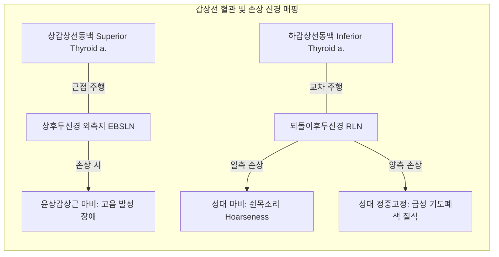
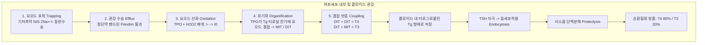
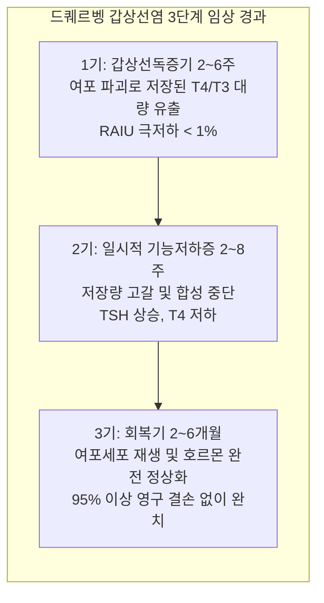

# 📑 [Netter Vol.2] Day 02: 갑상선 - 해부발생·호르몬생리·그레이브스병·갑상선염·결절 및 갑상선암 종양학 (Section 2 완독)

> 📖 **원서 출처**: [The Netter Collection of Medical Illustrations - Volume 2, The Endocrine System.pdf (pp. 36-63)](https://drive.google.com/file/d/1TnVzK8w2Nm2lU3SzGlFBLguBf8pjaMkt/view?usp=drivesdk)  
> 🏷️ **범위**: Section 2 전편 (Plate 2-1 ~ Plate 2-28, 총 28개 플레이트 전수 포함)  
> 📌 **핵심 테마**: 갑상선 외과적 해부학(되돌이후두신경 RLN 및 상후두신경 외측지 EBSLN 손상 방지), 맹공(Foramen cecum) 유래 갑상설관(Thyroglossal duct) 하강 발생학 및 선천 기형(갑상설관 낭종, 설갑상선), 갑상선호르몬 합성 5단계(NIS 요오드 포획, TPO 유기화 및 결합, 티로그로불린 음세포작용)와 탈요오드화 효소(D1/D2/D3) 말초 대사, 자가면역성 그레이브스병(TSI/TRAb 매개 미만성 증식, 안병증 GAG 침착 메커니즘, 갑상선 중독 발작 Thyroid storm), 중독성 선종(플러머병 Plummer disease 체세포 TSHR/Gsα 변이), 갑상선기능저하증 전신 병태생리(완태성 건반사, 점액수종 혼수 Myxedema coma, 신생아 크레틴병 Cretinism 선별검사), 정상기능성/비독성 갑상선종(흉골하 갑상선종 Substernal goiter 및 Pemberton 징후), 3대 갑상선염 정밀 감별(하시모토 림프구성 갑상선염 Hürthle 세포, 아급성 육아종성 드퀘르벵 경부 동통 및 ESR 급증, 리델 섬유성 갑상선염 IgG4 목석 경화), 그리고 5대 갑상선 악성종양학(유두암 PTC 핵내 봉입체/사종체, 여포암 FTC 혈관·피막 침윤 필수 판정, 수질암 MTC C세포 유래 칼시토닌 및 아밀로이드 침착/RET 변이, 역형성암 ATC 전격성 기도 폐색, 신세포암 유래 전이암).

---

## 1. 개요 및 마스터 요약 (Executive Summary)

1. **외과 해부학적 요충지와 후두신경 보존 (Surgical Anatomy & Nerve Preservation)**:
   - 갑상선은 C5~T1 높이에서 기관(Trachea) 2~4연골륜 전외측에 위치하며, 하갑상선동맥(Inferior thyroid a.)과 교차 주행하는 **되돌이후두신경 (Recurrent Laryngeal Nerve, RLN)**의 주행 변이를 숙지해야 함. 일측 손상 시 쉰목소리(Hoarseness), 양측 손상 시 성대 정중위 고정으로 인한 **급성 기도 폐색(Airway obstruction)** 유발.
   - 상갑상선동맥(Superior thyroid a.) 결찰 시 근접 주행하는 **상후두신경 외측지 (External branch of Superior Laryngeal Nerve, EBSLN)** 손상 시 윤상갑상근(Cricothyroid m.) 마비로 **고음 발성 장애(Loss of high pitch)** 발생.
   - 갑상선 피막 후면에 위치한 4개의 부갑상선(Parathyroid glands) 혈류 보존 실패 시 수술 후 급성 저칼슘혈증 강직(Tetany) 초래.

2. **발생학적 경로와 선천성 기형 (Embryology & Anomalies)**:
   - 배아 4주경 혀 기저부 인두저의 **맹공 (Foramen cecum)**에서 내배엽이 함입되어 하강하며 **갑상설관 (Thyroglossal duct)**을 형성.
   - 갑상설관이 퇴화되지 않고 잔존 시 경부 정중선에 **갑상설관 낭종 (Thyroglossal Duct Cyst)** 형성 (삼킴이나 혀 내밀기 시 상향 이동 $\rightarrow$ 설골 체부를 포함 절제하는 **시스트렁크 수술 Sistrunk procedure**로 완치). 하강 실패 시 혀 뿌리에 위치하는 **설갑상선 (Lingual thyroid)** 발생.

3. **호르몬 합성·분비의 분자생물학 및 말초 대사**:
   - 기저측막의 **나트륨-요오드 공수송체 (NIS, Na+/I- symporter)**에 의한 2차 능동수송 요오드 포획 $\rightarrow$ 관강막 펜드린(Pendrin) 수송 $\rightarrow$ **갑상선 과산화효소 (TPO, Thyroid Peroxidase)**에 의한 요오드 산화(Oxidation), 티로글로불린(Tg) 티로실 잔기 유기화(Organification, MIT/DIT 형성), 및 결합 반응(Coupling: DIT+DIT=T4, MIT+DIT=T3).
   - 순환 $T_4$는 간과 신장의 **제1형/2형 탈요오드화 효소 (Type 1/2 Deiodinase)**에 의해 활성형 $T_3$로 전환되며, 불활성화 경로는 **$rT_3$ (Reverse T3)** 및 제3형 효소(D3)에 의해 매개됨.

4. **갑상선기능항진증 vs 저하증의 임상 병태생리**:
   - **그레이브스병 (Graves Disease)**: TSH 수용체 자극 자가항체(**TSI / TRAb**)가 여포세포를 지속 자극하여 미만성 비대 및 자율성 과분비 유발. 안와 섬유아세포 TSHR/IGF-1R 자극으로 친수성 글리코사미노글리칸(GAG/Hyaluronan) 축적 및 외안근 부종 $\rightarrow$ **그레이브스 안병증 (Graves Ophthalmopathy)**.
   - **갑상선 중독 발작 (Thyroid Storm)**: 감염, 수술, 외상 등으로 촉발되는 초응급 상태. 고열($> 40^\circ\text{C}$), 빈맥, 심방세동, 섬망, 심부전 $\rightarrow$ **베타차단제(Propranolol) + 항갑상선제(PTU/Methimazole) + 요오드용액(Lugol/SSKI, 볼프-차이코프 효과) + 스테로이드(Dexamethasone, 말초 T4$\rightarrow$T3 전환 차단)**의 즉각적 4제 병용 요법.
   - **하시모토 갑상선염 (Hashimoto Thyroiditis)**: 자가면역성 여포세포 파괴(anti-TPO, anti-Tg), 광범위한 림프구 침윤 및 호산성 변성을 보이는 **훠틀 세포 (Hürthle / Askanazy cells)** 특징. 진행 시 점액수종 혼수(Myxedema coma) 위험.

5. **갑상선 결절 감별 및 5대 악성종양학**:
   - **갑상선 유두암 (Papillary Thyroid Carcinoma, PTC, 80~85%)**: 가장 흔하고 예후 양호. 림프절 전이 호발. 광학현미경 상 핵내 투명화(**Orphan Annie eye nuclei**), 핵 홈(Nuclear groove), 핵내 세포질 봉입체, 동심원상 석회화인 **사종체 (Psammoma bodies)**. BRAF V600E 변이 빈발.
   - **갑상선 여포암 (Follicular Thyroid Carcinoma, FTC, 10~15%)**: 세포학적 세침흡인(FNA)으로는 양성 여포선종과 감별 불가. 수술 검체 조직검사에서 **피막 침윤 (Capsular invasion)** 또는 **혈관 침윤 (Vascular invasion)**을 확인해야만 악성 확진. 혈행성 원격 전이(뼈, 폐) 호발.
   - **갑상선 수질암 (Medullary Thyroid Carcinoma, MTC, 3~5%)**: 신경능선(Neural crest) 유래 C세포(방여포세포)에서 기원하여 **칼시토닌 (Calcitonin)** 과다 분비. 기질 내 **아밀로이드 (Amyloid)** 침착. $25\%$에서 유전성(RET 원종양유전자 변이, **MEN 2A/2B** 동반).
   - **역형성 갑상선암 (Anaplastic Carcinoma, ATC, 1~2%)**: 노인 호발, 극도로 미분화된 육종양 악성 종양. 수주 내 경부 급속 팽창 및 기도 침범으로 진단 후 정중 생존기간 6개월 내외의 최악의 예후.

---

## 2. 갑상선의 해부학, 혈관경 및 후두신경 (Plates 2-1 ~ 2-2)

### Plate 2-1 | 갑상선과 부갑상선의 외과적 해부학 (Anatomy of the Thyroid and Parathyroid Glands)

![[Netter_V2_Plate2-1.png]]

#### 1) 육안 해부학적 위치 및 지지 인대
- **형태 및 위치**: 나비 넥타이 모양의 2개 엽(Lobes)과 이를 기관 전면에서 연결하는 **협부(Isthmus)**로 구성.
  - 협부는 제2~4 기관 연골륜(Tracheal rings) 전면에 위치.
  - 양측 엽은 갑상연골(Thyroid cartilage) 하부에서 제5~6 기관 연골륜 높이까지 상하 $4\sim 5\text{ cm}$, 폭 $2\sim 2.5\text{ cm}$로 연장.
  - 성인 정상 중량: 약 $15\sim 25\text{ g}$.
- **피막 및 고정 지지 구조**:
  - **진성 피막 (True fibrous capsule)**: 갑상선 실질에 단단히 밀착된 고유 결합조직 피막.
  - **가성 피막 (False capsule / Pretracheal fascia)**: 경추근막 흉골하층(Pretracheal layer of deep cervical fascia)이 갑상선을 완전히 둘러싸며 형성.
  - **베리 인대 (Suspensory Ligament of Berry / Lateral thyroid ligament)**: 갑상선 엽의 후내측면을 윤상연골(Cricoid cartilage) 및 상부 기관 연골에 단단히 결속시키는 치밀 섬유성 띠.
  - **임상적 의미**: 갑상선이 윤상연골 및 기관에 고정되어 있으므로, **연하(Swallowing) 운동 시 갑상선 종괴가 후두와 함께 상하로 움직임** $\rightarrow$ 경부 종괴 진찰 시 갑상선 기원 여부를 판별하는 핵심 신체 징후.

---

### Plate 2-2 | 갑상선의 혈관 지배 및 림프 배액 (Anatomy of Thyroid and Parathyroid: Blood Supply)

![[Netter_V2_Plate2-2.png]]

#### 1) 2대 주동맥망과 외과적 위험 신경 관계
갑상선은 단위 그램당 혈류량이 신장과 맞먹는 고관류 장기($4\sim 6\text{ mL/min/g}$)입니다:
1. **상갑상선동맥 (Superior Thyroid Artery, STA)**:
   - 외경동맥(ECA)의 첫 번째 전방 분지.
   - 갑상선 상극(Superior pole)으로 진입.
   - ⚠️ **상후두신경 외측지 (EBSLN, External Branch of Superior Laryngeal Nerve)**와의 관계:
     - 상갑상선동맥 분지와 아주 가깝게 평행 주행하여 상극 결찰 시 손상 위험 높음.
     - 지배 근육: **윤상갑상근 (Cricothyroid muscle)** $\rightarrow$ 성대를 신전시키고 긴장도를 조절하여 고음을 내는 근육.
     - 손상 징후: 성대 긴장도 저하로 **고음 발성 불능(Loss of high-pitched voice)**, 음성 피로(가수, 교사 등에서 치명적).
     - 방지 원칙: 상갑상선동맥 결찰 시 상극 표면에 최대한 바짝 붙여 개별 결찰(Ligate close to the thyroid capsule).
2. **하갑상선동맥 (Inferior Thyroid Artery, ITA)**:
   - 쇄골하동맥의 갑상경동맥간(Thyrocervical trunk)에서 분지.
   - 전사각근 전면을 가로질러 상행 후 내측으로 꺾여 갑상선 후외측면으로 진입.
   - ⚠️ **되돌이후두신경 (RLN, Recurrent Laryngeal Nerve)**과의 위험한 교차:
     - 하갑상선동맥의 주분지들 사이를 관통하거나 전방 또는 후방으로 교차하여 주행.
     - 특히 **베리 인대(Ligament of Berry) 하부에서 신경이 갑상선 실질에 극도로 근접**하여 후두로 진입하므로, 갑상선 절제술 시 신경 손상의 최빈발 부위.
     - 지배 근육: 윤상갑상근을 제외한 **모든 후두 고유근(성대 개폐근)** 및 성대 하부 점막 감각.
     - 손상 징후:
       - **일측성 손상**: 성대 마비, **쉰목소리 (Hoarseness)**, 흡인(Aspiration) 위험.
       - **양측성 손상**: 양측 성대가 정중위에 마비되어 흡기 시 성문이 열리지 않음 $\rightarrow$ **급성 질식 및 협착음(Stridor)** $\rightarrow$ **응급 기관절개술(Tracheostomy)** 필수.
     - 방지 원칙: 하갑상선동맥 결찰 시 신경과 멀리 떨어진 경동맥초 내측 본간부에서 결찰하거나(Trunk ligation), 갑상선 피막 위에서 미세 혈관들만 개별 결찰.
3. **최하갑상선동맥 (Arteria Thyroidea Ima, 약 3~10%)**:
   - 대동맥궁 또는 완두동맥간(Brachiocephalic trunk)에서 직접 기원하여 협부 전면으로 상행 진입하는 변이 동맥. 응급 기관절개술 시 대량 출혈의 원인.



---

## 3. 발생학, 선천 기형 및 호르몬 합성 생리 (Plates 2-3 ~ 2-7)

### Plate 2-3 & 2-4 | 갑상선과 부갑상선의 발생 (Development of the Thyroid and Parathyroid Glands)

![[Netter_V2_Plate2-3.png]]
![[Netter_V2_Plate2-4.png]]

#### 1) 갑상선 내배엽 하강 경로 (Thyroglossal Tract Descent)
- **기원**: 배아 4주경 원시 인두강 바닥부의 1번 및 2번 인두낭(Pharyngeal pouches) 사이 중앙선에서 내배엽성 상피가 비후하여 함입 $\rightarrow$ **갑상선 게실 (Thyroid diverticulum)** 형성.
- **하강 경로**:
  - 형성된 게실은 형성 중인 설골(Hyoid bone)과 후두 연골의 전면을 지나 아래로 길게 자라 내려감.
  - 이 하강 경로에 일시적으로 형성되는 관상 구조가 **갑상설관 (Thyroglossal duct)**임.
  - 혀 기저부 표면의 함입 시작점 잔유물이 성인의 **맹공 (Foramen cecum)**임.
- **최종 정착**: 배아 7주경 최종 목적지인 제2~4 기관연골륜 높이에 도달하여 협부와 양측 엽을 형성하고, 갑상설관은 대개 배아 8~10주경 완전 퇴화 소실됨.
- **C세포(방여포세포)의 기원**: 신경능선(Neural crest) 세포가 4번째 인두낭의 **후새체 (Ultimobranchial body)**로 이동한 후 갑상선 외측 상부에 융합되어 분산됨 $\rightarrow$ 칼시토닌(Calcitonin) 분비 C세포로 분화 (갑상선 수질암의 기원).

---

### Plate 2-5 | 갑상선의 선천성 기형 (Congenital Anomalies of the Thyroid Gland)

![[Netter_V2_Plate2-5.png]]

#### 1) 발생학적 하강 장애 및 잔유물 기형

| 선천 기형 | 발생 병태생리 및 위치 | 전형적 임상 소견 | 외과적 치료 원칙 |
| :--- | :--- | :--- | :--- |
| **갑상설관 낭종<br>(Thyroglossal Duct Cyst)** | 갑상설관이 퇴화하지 않고 상피 잔유관 내 낭성 체액 저류 (소아 경부 정중부 종괴의 70%) | 설골 바로 하부 또는 상부 **경부 정중선(Midline)**의 무통성 파동성 종괴.<br>★ **연하 또는 혀를 길게 내밀 때 종괴가 상방으로 딸려 올라감** | **시스트렁크 수술 (Sistrunk Operation)**:<br>낭종뿐만 아니라 설골 중심부(Body of hyoid bone) 및 맹공까지의 관로를 한 덩어리로 광범위 절제해야 재발 방지 |
| **설갑상선<br>(Lingual Thyroid)** | 갑상선 게실이 맹공에서 경부로 하강하지 못하고 혀 뿌리에 정체 | 혀 기저부(Base of tongue)의 붉은 혈관성 종괴. 연하곤란, 호흡곤란, 발음 장애.<br>★ **환자의 70%에서 경부에 정상 갑상선 조직이 전무함** | 수술 전 방사성 요오드 스캔으로 정상 갑상선 유무 확인 필수 (조직 절제 시 영구적 갑상선기능저하증 발생) |
| **추체엽<br>(Pyramidal Lobe)** | 갑상설관 원위부 잔유물이 섬유근성 조직으로 분화 (인구의 40~50%) | 협부 또는 좌측 엽 상연에서 설골 쪽으로 뻗어 있는 원뿔형 갑상선 실질 돌기 | 전절제술 시 잔유 조직을 남기지 않도록 상방 끝까지 추적 절제 |
| **갑상선 반무발생<br>(Thyroid Hemiagenesis)** | 일측 갑상선 엽의 선천적 결손 (좌측 엽 결손이 80%) | 대개 무증상이며 타 질환 검사 중 우연히 발견 | 잔여 엽의 대상성 비대 여부 확인 |

---

### Plate 2-6 | TSH의 여포세포 조절 기전 (Effects of Thyrotropin on the Thyroid Gland)

![[Netter_V2_Plate2-6.png]]

#### 1) TSH-TSHR 신호전달 폭포와 여포세포 활성화
- **TSH 수용체 (TSHR)**: 여포세포 기저측막에 위치하는 7회 막관통 G-단백 결합 수용체(GPCR).
- **이중 신호 전달계**:
  1. **$G_s$ / cAMP / PKA 경로 (주 경로)**:
     - 요오드 포획(NIS 유전자 전사 촉진), TPO 합성 및 활성화, 티로그로불린(Tg) 세포외유출 촉진.
     - 여포세포의 비대(Hypertrophy: 입방 $\rightarrow$ 원주상 상피) 및 증식(Hyperplasia) 유도.
  2. **$G_q$ / PLC / $\text{IP}_3$-$\text{Ca}^{2+}$ 경로 (보조 경로)**:
     - $\text{H}_2\text{O}_2$ 생성계(DUOX2)를 활성화하여 TPO의 산화 촉매 반응 가속화.
- **콜로이드 음세포작용 촉진**: TSH 자극 시 여포세포 정단막에서 위족(Pseudopodia)이 뻗어나와 콜로이드 내 요오드화 티로그로불린을 삼투 포식(Macropinocytosis)하여 리소좀 융합 분해 유도.

---

### Plate 2-7 | 갑상선호르몬의 합성과 말초 생리 (Physiology of Thyroid Hormones)

![[Netter_V2_Plate2-7.png]]

#### 1) 갑상선호르몬 생합성 5단계 시퀀스



#### 2) 말초 조직의 탈요오드화 효소 (Deiodinases) 시스템
- 갑상선에서 분비되는 호르몬의 $80\sim 90\%$는 전구물질 성격의 $T_4$(반감기 7일)이며, 실제 핵 수용체 친화도가 10~15배 높은 활성형 호르몬은 **$T_3$**(반감기 1일)임.
- **3대 탈요오드화 효소의 기능적 감별**:
  1. **제1형 탈요오드화 효소 (D1 / DIO1)**: 간, 신장, 갑상선에 분포. $T_4$의 외륜(Outer ring) 탈요오드화로 혈중 순환 $T_3$의 주 공급원 역할. PTU(프로필티오우라실)에 의해 억제됨.
  2. **제2형 탈요오드화 효소 (D2 / DIO2)**: 뇌, 뇌하수체 전엽, 갈색지방, 골격근 세포 내에 분포. 국소 조직 내부에서 $T_4 \rightarrow T_3$ 전환을 담당하여 뇌하수체 TSH 음성 피드백 조절의 핵심 센서.
  3. **제3형 탈요오드화 효소 (D3 / DIO3)**: 태반, 태아 조직, 뇌, 혈관종 등에 분포. 내륜(Inner ring)을 탈요오드화하여 $T_4 \rightarrow rT_3$(비활성), $T_3 \rightarrow T_2$로 분해하는 **불활성화(Inactivation) 효소**.

---

## 4. 자가면역성 갑상선기능항진증 및 결절성 질환 (Plates 2-8 ~ 2-13)

### Plate 2-8 & 2-9 | 그레이브스병의 임상 양상 (Graves Disease)

![[Netter_V2_Plate2-8.png]]
![[Netter_V2_Plate2-9.png]]

#### 1) 병태생리 및 전신 임상 징후
- **병인**: 자가면역 질환으로 TSH 수용체에 대한 자극성 자가항체인 **TSI (Thyroid Stimulating Immunoglobulin) / TRAb**가 지속적으로 여포세포를 자극하여 TSH 피드백을 무시하고 $T_3, T_4$를 자율성 과분비.
- **전형적 3대 징후 (Merseburg Triad)**:
  1. **갑상선기능항진증 (Hyperthyroidism)**
  2. **미만성 갑상선종 (Diffuse Goiter)**
  3. **안구돌출증 (Exophthalmos)**
- **전신 장기별 과대사 증상**:
  - **심혈관계**: 심계항진, 안정시 빈맥($> 90\text{ bpm}$), 맥압 증가, 수축기 고혈압, **심방세동 (Atrial Fibrillation, 노인 환자 10~15%)**, 고박출성 심부전.
  - **신경근육계**: 미세 진전(Fine tremor, 손을 앞으로 뻗었을 때 관찰), 신경과민, 정서 불안, 불면증, 근위부 근병증(의자에서 일어서기 힘듦).
  - **열 대사 및 피부**: 심한 열 불내성(Heat intolerance), 다한증, 따뜻하고 축축한 피부, 가늘어지는 모발, 조갑박리증(Plummer's nail).
  - **위장관계**: 장운동 항진으로 인한 잦은 배변 및 설사, 식욕 폭발에도 불구하고 지속적인 체중 감소.

---

### Plate 2-10 | 그레이브스 안병증 (Graves Ophthalmopathy)

![[Netter_V2_Plate2-10.png]]

#### 1) 안와 자가면역 병태생리 및 임상 징후
- **기전**:
  - 안와 전구 섬유아세포(Orbital preadipocyte fibroblasts)가 TSH 수용체 및 IGF-1 수용체를 발현.
  - 자가반응성 T세포 침윤 $\rightarrow$ 사이토카인(IFN-$\gamma$, TNF-$\alpha$) 분비 $\rightarrow$ 섬유아세포가 막대한 양의 **친수성 글리코사미노글리칸(GAG / Hyaluronic acid)** 합성 분비.
  - 삼투압에 의해 다량의 수분이 유입되어 외안근(Extraocular muscles) 및 안와 지방 조직의 극심한 부종 및 섬유화 유발 $\rightarrow$ 단단한 안와 원추강 내 압력 급상승으로 안구가 전방 돌출.
- **임상 징후**:
  - 안구돌출증(Proptosis / Exophthalmos), 결막 충혈 및 부종(Chemosis).
  - **외안근 섬유화 구축**: 하직근(Inferior rectus)과 내직근(Medial rectus)이 가장 먼저 침범되어 **상향 주시 장애 및 복시(Diplopia)** 발생.
  - 각막 궤양, 시신경 압박에 의한 시력 소실 위험.
  - 안검 징후: 안검 후퇴(Dalrymple 징후), 하향 주시 시 상안검 지연(Von Graefe 징후).
- ⚠️ **치료 주의점**: 방사성 요오드($^{131}\text{I}$) 치료 시 항원 유리로 안병증이 급격히 악화될 수 있으므로 고용량 경구 스테로이드 병용 필수.

---

### Plate 2-11 | 그레이브스병의 조직병리학 (Thyroid Pathology in Graves Disease)

![[Netter_V2_Plate2-11.png]]

#### 1) 현미경적 특징 소견
- **여포 상피 비대 및 과형성**: 정상 입방세포가 키가 큰 **키 큰 원주상 상피 (Tall columnar epithelium)**로 변형.
- **유두상 추벽 형성 (Papillary infoldings)**: 증식한 상피세포들이 여포 강 내부로 주름을 형성하며 돌출 (단, 유두암과 달리 섬유혈관성 축이 없음).
- **스캘로핑 (Colloid Scalloping)**: 상피세포 바로 주변의 콜로이드가 능동적 음세포작용으로 급격히 흡수되어 마치 벌레가 갉아먹은 듯한 창백한 원형의 **흡수 공포(Resorption vacuoles)** 형성.
- **간질 림프포 침윤**: 기질 내 림프구 및 형질세포 침윤, 배중심(Germinal centers) 형성.

---

### Plate 2-12 & 2-13 | 중독성 결절성 갑상선종 (Toxic Adenoma and Toxic Multinodular Goiter)

![[Netter_V2_Plate2-12.png]]
![[Netter_V2_Plate2-13.png]]

#### 1) 플러머병(Plummer Disease)의 분자병태생리 및 감별
- **중독성 선종 (Toxic Adenoma)**: 단일 자율성 결절.
- **중독성 다결절성 갑상선종 (Toxic Multinodular Goiter, TMNG / 플러머병)**: 다발성 자율 기능 결절. 고령자에서 호발.
- **분자 기전**: TSH 수용체 유전자(TSHR, 70%) 또는 G-단백질 $\alpha$-소단위체(GNAS)의 **체세포 기능획득 돌연변이 (Somatic gain-of-function mutation)** $\rightarrow$ TSH 자극 없이도 세포내 cAMP가 지속 활성화되어 자율적 호르몬 과분비 및 클론성 세포 증식.
- **그레이브스병과의 핵심 감별점**:
  1. **안병증 및 전경골 점액수종이 전혀 없음** (자가면역 항체 매개 질환이 아니기 때문).
  2. **방사성 요오드 섭취율(RAIU) 스캔**:
     - 그레이브스병: 미만성 균일 고섭취(Diffuse homogeneous uptake).
     - 중독성 결절: 결절 부위만 진하게 조영되는 **"열결절 (Hot nodule)"** 소견을 보이고, TSH 억제로 인해 결절 이외의 정상 갑상선 실질은 방사능 섭취가 완전히 차단되어 보이지 않음(Suppression of background).

---

## 5. 갑상선기능저하증 및 갑상선종 스펙트럼 (Plates 2-14 ~ 2-20)

### Plate 2-14, 2-15 & 2-16 | 성인 갑상선기능저하증 (Hypothyroidism in Adults)

![[Netter_V2_Plate2-14.png]]
![[Netter_V2_Plate2-15.png]]
![[Netter_V2_Plate2-16.png]]

#### 1) 전신 저대사 증후군과 점액수종 (Myxedema)
- **병태생리**: 갑상선호르몬 결핍 $\rightarrow$ 세포 대사율 저하, ATP 생산 감소, 진피 결합조직 내 히알루론산 및 점다당질(GAG) 축적으로 인한 삼투성 수분 저류.
- **점액수종 (Myxedema)**: 비함요 부종(Non-pitting edema). 손가락으로 눌러도 자국이 남지 않는 단단한 부종. 멍청해 보이는 무표정한 얼굴, 안와 주위 부종, 거대설, 쉰 목소리.
- **특징적 신체 진찰 소견**:
  - **완태성 심부건반사 (Hung-up / Delayed relaxation of DTR)**: 아킬레스건 반사 시 수축은 정상이지만 **이완기(Relaxation phase)가 매우 느리게 일어남** (특이도 높은 징후).
  - **피부 및 모발**: 건조하고 비늘 같은 거친 피부, 체모 탈락, **눈썹 외측 1/3 탈락 (Queen Anne's sign / Hertoghe 징후)**, 카로틴 대사 지연에 따른 피부의 오렌지빛 황변(Carotenemia, 공막 황달은 없음).
  - **심혈관계**: 서맥(Bradycardia), 심박출량 감소, 심낭삼출(Pericardial effusion, "물주머니 심장"), 저전압 심전도.
  - **생식 및 신경정신계**: 여성에서 과다월경(Menorrhagia), 빈발월경; TRH 상승으로 인한 고프로락틴혈증 및 유즙누출; 기억력 저하, 우울증, 심한 경우 점액수종 광기(Myxedema madness).

#### 2) 초응급: 점액수종 혼수 (Myxedema Coma)
- 중증 갑상선기능저하증 환자가 한랭 노출, 감염, 뇌졸중, 진정제 투여 등으로 대사 보상 기전이 파탄나며 발생.
- **치명적 4대 징후**: **중증 저체온증 (Hypothermia, $< 35^\circ\text{C}$)**, **의식 저하/혼수**, **저환기성 호흡부전(고이산화탄소혈증)**, **서맥 및 심한 저혈압**.
- **치료**:
  1. 즉각적인 **정맥용 하이드로코르티손 (Hydrocortisone 100 mg IV)** 투여 (동반된 부신 부전 배제 목적, 갑상선호르몬 단독 투여 시 부신 위기 유발 방지).
  2. **정맥용 레보티록신 ($T_4$) $\pm$ 리오티로닌 ($T_3$)** 부하 투여.
  3. 능동적 외부 가온 금지(혈관 확장으로 쇼크 악화 가능) $\rightarrow$ 수동적 담요 보온, 기계 환기 및 수액 공급.

---

### Plate 2-17 | 선천성 갑상선기능저하증 / 크레틴병 (Congenital Hypothyroidism / Cretinism)

![[Netter_V2_Plate2-17.png]]

#### 1) 신경발달 지연과 조기 스크리닝
- **원인**: 갑상선 형성부전(Dysgenesis: 무발생, 저형성, 이소성, 85%) 및 호르몬 합성장애(Dyshormonogenesis, 15%).
- **출생 직후 임상상**: 모체로부터 전달된 $T_4$로 인해 출생 시에는 대개 무증상. 수주~수개월에 걸쳐 서서히 발현:
  - 지속적인 신생아 황달(Prolonged physiologic jaundice).
  - 수유 곤란, 기면 상태, 변비, 쉰 울음소리(Hoarse cry).
  - **커다란 혀(Macroglossia)**, 건조하고 거친 피부, **배꼽탈장 (Umbilical hernia)**, 넓게 열린 대천문 및 소천문.
- **예후 및 선천성 대사이상 선별검사**:
  - 갑상선호르몬은 신생아기 뇌 신경 발달(수초화 및 시냅스 형성)에 필수적임.
  - 생후 수주 내에 발견하여 치료하지 않으면 비가역적인 **지적장애 (Mental retardation)** 및 왜소증을 초래하는 **크레틴병(Cretinism)**으로 비가역적 고착.
  - 생후 48~72시간째 모든 신생아 대상 발뒤꿈치 채혈(Guthrie test)을 통한 **선별 혈청 TSH 측정** 의무화. 진단 즉시 경구 L-티록신 투여.

---

### Plate 2-18, 2-19 & 2-20 | 비독성 갑상선종 및 흉골하 갑상선종 (Nontoxic Goiter and Substernal Extension)

![[Netter_V2_Plate2-18.png]]
![[Netter_V2_Plate2-19.png]]
![[Netter_V2_Plate2-20.png]]

#### 1) 결절성 갑상선종의 병인 및 압박 징후
- **병인**: 전 세계적으로는 요오드 결핍(Iodine deficiency, 풍토성 갑상선종 Endemic goiter)이 최빈 원인. 요오드 부족 $\rightarrow$ 호르몬 합성 저하 $\rightarrow$ 보상성 TSH 지속 상승 $\rightarrow$ 여포세포 미만성 증식 $\rightarrow$ 시간 경과에 따라 증식과 퇴축이 반복되며 **다결절성 갑상선종 (Multinodular Goiter, MNG)** 형성.
- **흉골하 갑상선종 (Substernal / Retrosternal Goiter)**:
  - 거대해진 갑상선이 흉골병(Manubrium) 뒤쪽 전종격동으로 하향 성장.
  - **압박 증상**: 기관 압박(흡기성 협착음, 호흡곤란), 식도 압박(연하곤란), RLN 압박(쉰목소리).
- **펨버턴 징후 (Pemberton's Sign)**:
  - 환자의 양팔을 머리 위로 높이 들고 1분간 유지하게 함.
  - 흉곽 입구(Thoracic inlet)가 좁아지며 흉골하 갑상선종이 쇄골하정맥 및 내경정맥을 압박.
  - **안면 홍조(Facial plethora), 청색증, 경정맥 팽대, 현훈 발생 시 펨버턴 징후 양성** $\rightarrow$ 외과적 흉골 절개 또는 경부 절제를 통한 수술적 적출 적응증.

---

## 6. 3대 갑상선염의 정밀 감별 (Plates 2-21 ~ 2-22)

### Plate 2-21 | 만성 림프구성 갑상선염 및 리델 갑상선염 (Hashimoto and Riedel Thyroiditis)

![[Netter_V2_Plate2-21.png]]

#### 1) 하시모토 갑상선염 (Hashimoto's Thyroiditis / Chronic Lymphocytic Thyroiditis)
- **역학**: 요오드 충분 지역에서 **성인 갑상선기능저하증의 가장 흔한 원인**. 중년 여성에서 호발 (여:남 = 10~20:1).
- **면역 병인**: 세포독성 T세포(CD8+) 및 자가항체 매개 여포세포 파괴.
  - **항-TPO 항체 (anti-thyroperoxidase antibody, 95% 이상 양성)**.
  - **항-Tg 항체 (anti-thyroglobulin antibody, 60~80% 양성)**.
- **조직학적 특징**:
  1. 광범위한 단핵구 침윤 및 배중심(Germinal centers)을 동반한 **림프 여포 (Lymphoid follicles)** 형성.
  2. **훠틀 세포 (Hürthle / Askanazy / Oxyphilic cells)**: 미토콘드리아가 고도로 증식하여 빽빽하게 채워진 붉고 과립상의 풍부한 호산성 세포질을 지닌 화생된 여포세포.
- **장기 합병증**: 갑상선기능저하증으로 영구 고착. 드물게 갑상선 기원의 **B세포 비호지킨 림프종 (Marginal zone B-cell lymphoma / DLBCL)** 발생 위험 60~80배 증가.

#### 2) 리델 갑상선염 (Riedel's Thyroiditis / Fibrous Struma)
- **병인**: **IgG4 연관 질환 (IgG4-Related Disease)**의 전신 스펙트럼 중 하나. 후복막 섬유화증, 경화성 담관염 동반 빈발.
- **특징**: 갑상선 실질이 치밀한 무세포성 교원질 섬유화로 대체되고, 섬유화가 갑상선 피막을 뚫고 주변 기관, 근육, 혈관초, 신경으로 침윤.
- **신체 진찰**: 돌처럼 단단하고 주변 경부 조직에 완전히 고정된 **"목석 같은 갑상선 (Woody / Iron-hard / Stony-hard thyroid)"**. 역형성 갑상선암과 임상적 감별 필수.

---

### Plate 2-22 | 아급성 갑상선염 (Subacute Thyroiditis / de Quervain Thyroiditis)

![[Netter_V2_Plate2-22.png]]

#### 1) 병태생리 및 3단계 임상 경과
- **원인**: 콕사키, 인플루엔자, 아데노바이러스 등 **선행 바이러스성 상기도 감염 2~8주 후** 발생. HLA-B35 연관.
- **특징적 징후**:
  - **갑상선 부위의 극심한 자발통 및 손을 댈 수 없을 정도의 압통 (Exquisite tenderness)**.
  - 통증이 턱, 귀 밑, 유양돌기 쪽으로 방사됨. 미열 및 전신 쇠약감 동반.
  - **적혈구침강속도 (ESR) 현저한 급증 ($> 50\sim 100\text{ mm/hr}$)**, CRP 상승.



- **조직학**: 파괴된 여포 주위로 이물 거대세포(Multinucleated giant cells)와 육아종성 침윤 형성.
- **치료**: 대증 요법. 경증은 고용량 아스피린/NSAIDs, 중증 시 경구 프레드니손(Prednisone) 투여 시 수일 내 통증 극적 호전.

---

## 7. 갑상선암 종양학 및 전이성 질환 (Plates 2-23 ~ 2-28)

### Plate 2-23 | 갑상선 유두암 (Papillary Thyroid Carcinoma, PTC)

![[Netter_V2_Plate2-23.png]]

#### 1) 역학 및 세포병리학적 특징 (전체 갑상선암의 80~85%)
- **역학**: 젊은 여성 호발, 소아 방사선 피폭 기왕력과 밀접, 예후가 가장 우수(10년 생존율 $> 95\%$). 림프관을 통한 조기 **국소 경부 림프절 전이 빈발 (40~50%)**.
- **분자 유전학**: **BRAF V600E 돌연변이 (60~70%)**, RET/PTC 유전자 재배열 (방사선 연관).
- **진단적 병리 조직 소견 (세침흡인 FNA 확진의 핵심)**:
  1. **오판 애니 눈 핵 (Orphan Annie Eyes nuclei / Ground-glass nuclei)**: 염색질이 주변부로 밀려나 핵 내부가 텅 비어 투명하고 유리알처럼 보이는 핵.
  2. **핵 홈 (Nuclear Grooves)**: 커피콩 모양으로 핵막이 세로로 접혀 들어간 주름.
  3. **핵내 세포질 가성봉입체 (Intranuclear Pseudoinclusions)**: 세포질이 핵 안으로 함입된 소견.
  4. **사종체 (Psammoma Bodies)**: 종양 유두 중심부의 경색 괴사 부위에 동심원상 층판 석회화(Concentric lamellated calcification)가 침착된 구조물 (유두암에 특이적).

---

### Plate 2-24 | 갑상선 여포암 (Follicular Thyroid Carcinoma, FTC)

![[Netter_V2_Plate2-24.png]]

#### 1) 양성 여포선종과의 감별 및 외과 종양학 (전체의 10~15%)
- **세침흡인(FNA)의 근본적 한계**:
  - 세포학적 흡인 검사로는 세포 자체의 비정형성만 볼 수 있으므로 **양성 여포선종(Follicular Adenoma)과 악성 여포암(FTC)을 절대 구별할 수 없음**.
  - 병리 보고는 "여포성 종양 (Follicular neoplasm)" 또는 "Bethesda Category IV"로 보고됨 $\rightarrow$ **진단적 진단 절제술(엽절제술 Lobectomy) 필수**.
- **악성 판정의 절대 기준 (Histologic Criteria for Malignancy)**:
  - 수술로 적출된 조직의 영구 병리 절편 전층을 현미경으로 관찰하여 다음 둘 중 하나 이상을 입증해야 함:
    1. **피막 침윤 (Capsular Invasion)**: 종양 세포가 섬유성 피막의 전층을 뚫고 외부로 돌파.
    2. **혈관 침윤 (Vascular Invasion)**: 피막 내 또는 피막 외벽의 정맥 혈관 강 내부로 종양 세포가 뚫고 들어가 내피에 부착.
- **전이 양상**: 림프절 전이는 드물고, **혈행성 전이 (Hematogenous spread)**가 우세하여 조기에 **뼈(Bone, 용혈성 병변), 폐(Lung)**로 원격 전이.

---

### Plate 2-25 | 갑상선 수질암 (Medullary Thyroid Carcinoma, MTC)

![[Netter_V2_Plate2-25.png]]

#### 1) C세포 기원과 신경내분비적 특징 (전체의 3~5%)
- **세포 기원**: 여포세포가 아닌 신경능선 유래의 **방여포세포 (C-cells / Parafollicular cells)**.
- **종양 표지자**: **칼시토닌 (Calcitonin)** 과다 분비 (진단 및 수술 후 재발 감시의 절대 지표) 및 CEA. 종양 분비 펩타이드(VIP, 세로토닌 등)로 인한 만성 설사 및 안면 홍조 동반.
- **유전학 및 MEN 연관**:
  - **산발성 (Sporadic, 75%)**: 단일 병소, 40~50대.
  - **유전성 (Hereditary, 25%)**: **RET 원종양유전자 (RET proto-oncogene) 생식세포 변이**. 다발성 및 양측성.
    - **MEN 2A**: 갑상선 수질암 + 갈색세포종(Pheochromocytoma) + 부갑상선 기능항진증.
    - **MEN 2B**: 갑상선 수질암 + 갈색세포종 + 점막 신경종(입술, 혀) + 마르판양 체형.
- **병리학**: 균일한 다각형/방추형 신경내분비 세포 증식, **콩고 레드(Congo red) 염색 시 편광현미경에서 사과빛 녹색 복굴절(Apple-green birefringence)을 보이는 아밀로이드 (Amyloid, 칼시토닌 섬유 중합체)** 침착.
- ⚠️ **방사성 요오드 치료 불응**: C세포 기원이므로 요오드를 섭취하지 않아 $^{131}\text{I}$ 치료가 전혀 듣지 않음. 근치적 수술(전절제 + 중심경부 림프절 곽청술) 및 RET 표적치료제(Selpercatinib, Cabozantinib)가 중심.

---

### Plate 2-26 | 훠틀세포암 (Hürthle Cell Carcinoma)

![[Netter_V2_Plate2-26.png]]

#### 1) 호산성 여포세포암의 고유 병리
- 여포암의 변이형으로 분류되기도 하나, WHO 분류상 독립 질환군(Oncocytic follicular carcinoma).
- 종양 세포의 $75\%$ 이상이 **훠틀 세포(호산성 세포)**로 구성. 세포질 내 비정상적인 미토콘드리아 과축적.
- 전형적 여포암보다 고령 호발, 더 공격적 경과, 원격 전이율 높음.
- **방사성 요오드 섭취율이 매우 낮아(10~20%)** 수술 후 방사성 요오드 절제술의 효과가 제한적임.

---

### Plate 2-27 | 역형성 갑상선암 (Anaplastic Thyroid Carcinoma, ATC)

![[Netter_V2_Plate2-27.png]]

#### 1) 인간 암 중 가장 공격적인 초고위험 암종 (전체의 1~2%)
- **역학 및 병인**: 고령(65세 이상) 호발. 기존의 분화 갑상선암(PTC 또는 FTC)이 $p53$ 종양억제유전자 결실 및 TERT 프로모터 변이 등을 획득하며 극도로 탈분화(Dedifferentiation)되어 발생.
- **임상 징후**:
  - **수주 만에 목 전체를 뒤덮으며 폭발적으로 자라나는 거대한 암성 종괴**.
  - 주변 연조직, 기도, 식도, 신경, 혈관을 완전히 동결하듯 침윤.
  - **호흡 곤란(Stridor), 연하 곤란, 극심한 목 통증, 쉰목소리**. 진단 당시 이미 50% 이상에서 폐, 뼈 원격 전이 동반.
- **조직학**: 방추세포(Spindle cells), 다핵 거대세포(Pleomorphic giant cells), 편평상피양 세포들이 얽힌 고도 미분화 육종양 외관, 광범위한 출혈 및 응고 괴사.
- **치료 및 예후**: 진단 즉시 최소 Stage IV로 분류. 수술적 완전 절제는 대부분 불가능하며, 기도 확보를 위한 고식적 방사선/화학요법, BRAF V600E 표적치료(Dabrafenib + Trametinib). 정중 생존 기간 3~6개월.

---

### Plate 2-28 | 갑상선 전이성 종양 (Tumors Metastatic to the Thyroid)

![[Netter_V2_Plate2-28.png]]

#### 1) 혈행성 전이 경로와 원발암 분포
- 갑상선의 높은 혈류 공급량으로 인해 타 장기 진행성 암세포의 혈행성 착상이 가능함.
- **최빈 원발암**: **신세포암 (Renal Cell Carcinoma, RCC, 30~40%로 가장 흔함)**. 신절제술 후 수년~10여 년 뒤에 갑상선 단독 전이로 발견되는 경우가 흔함.
- 기타 원발암: 폐암, 유방암, 소화기계 악성종양, 악성 흑색종.
- 임상적 의의: 갑상선 결절의 세침흡인 조직검사 시 투명 세포(Clear cells)가 보일 경우 신세포암 전이를 반드시 감별(RCC 항원, PAX8, CD10 면역염색)해야 함.

---

## 8. 로컬 이미지 추출 자동화 스크립트 (Python snippet)

원서 PDF(`The Netter Collection of Medical Illustrations - Volume 2, The Endocrine System.pdf`)에서 Section 2에 해당하는 28개 플레이트의 고해상도 이미지를 추출하여 `첨부파일` 폴더에 일괄 저장할 수 있는 로컬 실행용 Python 코드입니다:

```python
import fitz  # PyMuPDF
import os

pdf_path = "The Netter Collection of Medical Illustrations - Volume 2, The Endocrine System.pdf"
output_dir = "./헤르메스/책 읽기/Netter_Vol2_내분비계/첨부파일"
os.makedirs(output_dir, exist_ok=True)

doc = fitz.open(pdf_path)

# Section 2 전체 28개 플레이트 매핑 (Plate 2-1 ~ Plate 2-28)
plates_info = [
    ("Plate2-1", "Anatomy of the Thyroid and Parathyroid Glands"),
    ("Plate2-2", "Anatomy of the Thyroid and Parathyroid Glands (cont'd)"),
    ("Plate2-3", "Development of the Thyroid and Parathyroid Glands"),
    ("Plate2-4", "Development of the Thyroid and Parathyroid Glands (cont'd)"),
    ("Plate2-5", "Congenital Anomalies of the Thyroid Gland"),
    ("Plate2-6", "Effects of Thyrotropin on the Thyroid Gland"),
    ("Plate2-7", "Physiology of Thyroid Hormones"),
    ("Plate2-8", "Graves Disease"),
    ("Plate2-9", "Graves Disease (cont'd)"),
    ("Plate2-10", "Graves Ophthalmopathy"),
    ("Plate2-11", "Thyroid Pathology in Graves Disease"),
    ("Plate2-12", "Clinical Manifestations of Toxic Adenoma and Toxic Multinodular Goiter"),
    ("Plate2-13", "Pathophysiology of Toxic Adenoma and Toxic Multinodular Goiter"),
    ("Plate2-14", "Clinical Manifestations of Hypothyroidism in Adults"),
    ("Plate2-15", "Clinical Manifestations of Hypothyroidism in Adults (cont'd)"),
    ("Plate2-16", "Clinical Manifestations of Hypothyroidism in Adults (cont'd)"),
    ("Plate2-17", "Congenital Hypothyroidism"),
    ("Plate2-18", "Euthyroid Goiter"),
    ("Plate2-19", "Gross Pathology of Goiter"),
    ("Plate2-20", "Etiology of Nontoxic Goiter"),
    ("Plate2-21", "Chronic Lymphocytic Thyroiditis and Fibrous Thyroiditis"),
    ("Plate2-22", "Subacute Thyroiditis"),
    ("Plate2-23", "Papillary Thyroid Carcinoma"),
    ("Plate2-24", "Follicular Thyroid Carcinoma"),
    ("Plate2-25", "Medullary Thyroid Carcinoma"),
    ("Plate2-26", "Hürthle Cell Thyroid Carcinoma"),
    ("Plate2-27", "Anaplastic Thyroid Carcinoma"),
    ("Plate2-28", "Tumors Metastatic to the Thyroid")
]

print(f"총 {len(plates_info)}개 플레이트 추출 시작...")

for plate_id, plate_title in plates_info:
    num_suffix = plate_id.replace("Plate2-", "")
    search_terms = [f"Plate 2-{num_suffix}", f"2-{num_suffix}", plate_title.lower()]
    
    target_page = None
    for page_num in range(len(doc)):
        text = doc[page_num].get_text().lower()
        if any(term.lower() in text for term in search_terms):
            target_page = page_num
            break
            
    if target_page is not None:
        page = doc[target_page]
        pix = page.get_pixmap(matrix=fitz.Matrix(3.0, 3.0))  # 300 DPI 고해상도
        img_filename = f"Netter_V2_{plate_id}.png"
        pix.save(os.path.join(output_dir, img_filename))
        print(f"✅ [추출 성공] {img_filename} (PDF p.{target_page+1})")
    else:
        print(f"⚠️ [미발견] {plate_id}: {plate_title}")

doc.close()
print("=== Section 2 전체 28개 플레이트 이미지 추출 완료 ===")
```

<!-- 보관 태그(1회용·링크오류, 필요시 복원): 그레이브스병, 갑상선염, 갑상선암 -->
