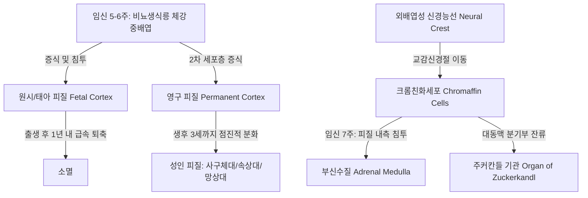
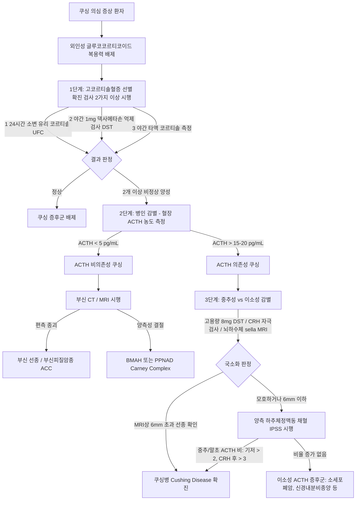
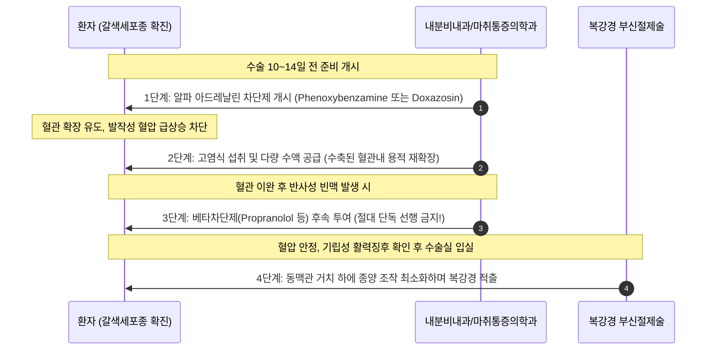

# Netter Endocrine Day 03: 부신 (Adrenal Gland) — 발생·해부·피질/수질 생리·쿠싱·알도스테론·갈색세포종 (pp. 67–98)

> 📖 **원서 출처**: [The Netter Collection - Volume 2, The Endocrine System.pdf (pp. 67-98)](https://drive.google.com/file/d/1TnVzK8w2Nm2lU3SzGlFBLguBf8pjaMkt/view?usp=drivesdk)
> 🏷️ **범위**: Section 3: Adrenal (Plate 3-1 ~ Plate 3-29, 총 29개 플레이트 전수 수록)
> 📌 **핵심 테마**: 부신피질 3층(사구체·속상·망상대) 및 수질의 이중 발생학적 기원과 혈관·신경 해부학, 스테로이드 호르몬 생합성 효소 결핍(21-OHD, 11β-OHD, 17α-OHD CAH 감별), 코르티솔 과다(쿠싱병 vs 이소성 ACTH vs 부신 선종/암종 vs PPNAD/Carney complex), 알도스테론 과다(원발성 알도스테론증 AVS 감별진단, RAAS 및 신혈관성 고혈압), 급성 부신위기 및 만성 에디슨병(일차성 vs 이차성 부신부전 감별), 부신수질 카테콜아민 생합성/대사(메타네프린 경로) 및 갈색세포종(10% 법칙의 유전학적 재조명, α차단 선행 원칙, 수술 전 처치), 부신 전이암의 감별.

---

## 1. 개요 및 마스터 요약 (Executive Summary)

* **이중 발생 및 독특한 혈관·신경 구조 (Plates 3-1 ~ 3-5)**:
  * **피질 (Cortex)**: 중배엽성 체강 상피(Coelomic mesothelium) 기원. 태아 피질(Fetal cortex)은 출생 후 1년 내 급속 퇴축하며, 영구 피질이 사구체대(Zona glomerulosa, 15%), 속상대(Zona fasciculata, 75%), 망상대(Zona reticularis, 10%)의 3층 구조로 분화.
  * **수질 (Medulla)**: 외배엽성 신경능선(Neural crest) 기원의 크롬친화세포(Chromaffin cells)가 교감신경절을 떠나 피질 내측으로 침투. 척수 중간외측핵(IML)에서 유래한 **절전 교감신경 콜린성 섬유(Preganglionic cholinergic fibers)**가 크롬친화세포와 직접 시냅스를 형성(변형된 절후 신경절 세포 역할).
  * **혈관 해부의 비대칭성**: 3대 동맥(상부신동맥-하횡격동맥 분지, 중부신동맥-복대동맥 분지, 하부신동맥-신동맥 분지)에서 유입된 혈류는 피질 모세혈관망을 거쳐 수질 중심정맥동으로 모임. **우측 부신정맥은 1cm 미만으로 짧아 하대정맥(IVC) 후외측벽으로 직결**되며, **좌측 부신정맥은 하횡격정맥과 합류하여 좌측 신정맥(Left renal vein)으로 유입**.
* **스테로이드 생합성 및 선천성 부신 과형성증 (Plates 3-6 ~ 3-8, 3-13 ~ 3-16)**:
  * 미토콘드리아 내막으로의 콜레스테롤 이동은 **StAR 단백질**이 매개하며, 속도결정효소인 **CYP11A1(SCC)**에 의해 프레그네놀론으로 전환.
  * 사구체대는 **CYP11B2(알도스테론 합성효소)**를 유일하게 발현(CYP17A1 결손), 속상대와 망상대는 **CYP17A1**을 발현하여 코르티솔과 부신 안드로겐(DHEA, DHEA-S) 생성.
  * **21-수산화효소 결핍증 (21-OHD, >90%)**: 코르티솔·알도스테론 결핍 + 17-OHP 축적 및 안드로겐 과다. 여아 모호성기, 남/여아 모두 저나트륨·고칼륨 염분소실성 부신위기 위험.
  * **11β-수산화효소 결핍증 (11β-OHD, 5-8%)**: DOC(약한 미네랄로코르티코이드) 축적으로 인한 **고혈압 + 저칼륨혈증 동반 남성화**.
  * **17α-수산화효소 결핍증 (17α-OHD)**: 성호르몬 및 코르티솔 결핍, 코르티코스테론/DOC 과다로 인한 **고혈압 + 저칼륨혈증 + 성적 미발달 (남녀 모두 외형상 여성형 외성기)**.
* **쿠싱 증후군의 단계별 진단 및 병태생리 (Plates 3-9 ~ 3-12)**:
  * 외인성 글루코코르티코이드 배제 $\rightarrow$ 3대 확진 검사 중 2개 이상 양성 (24시간 소변 유리 코르티솔 [UFC], 야간 1mg 덱사메타손 억제검사 [DST], 야간 타액 코르티솔).
  * 혈장 ACTH 농도 판정: <5 pg/mL (ACTH 비의존성: 부신 선종/암종/PPNAD $\rightarrow$ 복부 CT/MRI) vs >15-20 pg/mL (ACTH 의존성: 뇌하수체 쿠싱병 vs 이소성 ACTH 분비종양 $\rightarrow$ 고용량 8mg DST, CRH 자극검사, 양측 하추체정맥동 채혈 [IPSS]).
  * **Carney complex & PPNAD**: PRKAR1A 유전자 변이, 흑갈색 결절이 박힌 위축성 피질, 안면/점막 흑점, 심장 점액종, 고용량 DST 시 코르티솔이 역설적으로 증가(Paradoxical increase)하는 독특한 병태.
* **미네랄로코르티코이드와 원발성 알도스테론증 (Plates 3-17 ~ 3-20)**:
  * 알도스테론은 원위세뇨관/집합관 주세포의 MR 수용체 자극 $\rightarrow$ ENaC 및 $\text{Na}^+/\text{K}^+$-ATPase 활성화로 $\text{Na}^+$ 재흡수, $\text{K}^+$ 및 $\text{H}^+$ 배설 촉진(저칼륨혈증, 대사성 알칼리증).
  * 체액 팽창 시 압력성 이뇨와 ANP 분비로 나트륨 배설이 재개되는 **알도스테론 탈출 현상(Aldosterone escape)** 때문에 현저한 부종은 동반되지 않음.
  * 선별검사: ARR (알도스테론-레닌 비) $\ge 20\sim30$ $\rightarrow$ 생리식염수 부하시험 등으로 확진 $\rightarrow$ **부신정맥 채혈 (AVS, Adrenal Venous Sampling)**로 편측성 선종(APA, 복강경 부신절제술)과 양측성 과형성(IHA, 스피로놀락톤/에플레레논 약물치료)을 외과적으로 감별.
* **부신피질 기능부전 (Plates 3-21 ~ 3-24)**:
  * **급성 부신위기 (Adrenal crisis)**: 난치성 저혈압 쇼크, 복통, 고열, 저혈당. 즉각적인 **생리식염수 대량 수액 + IV Hydrocortisone 100mg** 투여(검사 결과 대기 금지).
  * **만성 원발성 (에디슨병)**: 자가면역성(80-90%, 21-OH 항체) 또는 결핵. **전신 피부/점막 과색소침착(POMC 유래 ACTH/α-MSH 증가)**, 저나트륨혈증, **고칼륨혈증(알도스테론 결핍)**.
  * **이차성 부신부전**: 뇌하수체 질환 또는 스테로이드 급격 중단. **과색소침착 없음(창백한 피부)**, **RAAS 보존으로 정상 칼륨 유지**, 수분 저류에 의한 희석성 저나트륨혈증.
* **부신수질 생리 및 갈색세포종/부신경절종 (Plates 3-25 ~ 3-29)**:
  * 카테콜아민 합성: 티로신 $\rightarrow$ L-DOPA $\rightarrow$ 도파민 $\rightarrow$ 노르에피네프린 $\rightarrow$ **에피네프린 (피질 유래 고농도 코르티솔에 의해 PNMT 유도)**.
  * 대사: COMT에 의해 **메타네프린(Metanephrine) 및 노르메타네프린(Normetanephrine)**으로 전환 후 최종 VMA로 배설.
  * **갈색세포종 (Pheochromocytoma)**: 두통, 발한, 빈맥(Classic triad). 진단은 혈장/소변 유리 메타네프린 측정.
  * **수술 전 처치 철칙**: **반드시 알파차단제(Phenoxybenzamine 등)를 최소 10~14일간 선행 투여**한 후, 빈맥 조절을 위해 **베타차단제를 후속 추가**. (베타차단제 단독 선행 투여 시 반동성 혈관수축으로 치명적 고혈압 위기 유발!).
  * 유전성 (>35-40%): MEN 2A/2B (RET), VHL, NF1, SDHB(악성 고위험)/SDHD.

---

## 2. 제1부: 부신의 발생학, 육안 해부학, 미세조직학 및 신경 분포 (Plates 3-1 ~ 3-5)

### Plate 3-1 | 부신의 발생 (Development of the Adrenal Glands)
![[Netter_V2_Plate3-1.png]]

#### 발생 기원 및 시간대별 분화 과정
1. **피질 (Adrenal Cortex, 중배엽 기원)**:
   * **임신 5~6주**: 비뇨생식릉(Urogenital ridge) 인근의 체강 상피(Coelomic mesothelium) 세포가 급격히 증식하여 후복막 간엽(Retroperitoneal mesenchyme)으로 침투, **원시 피질(Primitive / Fetal cortex)** 형성.
   * **임신 7~8주**: 원시 피질 외측으로 새로운 간엽 세포층이 둘러싸며 **영구 피질(Permanent / Adult cortex)**의 전구체를 형성. 이 시기 부신은 발달 중인 신장보다 거대함.
   * **출생 후 퇴축**: 출생 직후 태아 피질은 전체 부신 부피의 80% 이상을 차지하나, 출생 후 수주 내에 급격한 자멸사(Apoptosis)와 지방 변성을 겪으며 부신 무게의 1/3이 감소. 생후 1년 말까지 완전히 퇴축 소멸.
   * **영구 피질의 3층 분화**: 출생 시 얇았던 외측 영구 피질이 점진적으로 분화하여 생후 3세경에 성인의 3개 구역(사구체대, 속상대, 망상대) 구축 완료. (SF-1 [Steroidogenic factor 1] 전사인자가 분화의 핵심 조절자).
2. **수질 (Adrenal Medulla, 외배엽 기원)**:
   * **신경능선 세포(Neural crest cells)**가 원시 자율신경절(교감신경간)을 따라 복측으로 이동.
   * 일부 세포는 신경절 뉴런 대신 크롬염에 갈색으로 염색되는 내분비 세포인 **크롬친화세포(Chromaffin cells)**로 분화.
   * **임신 7주경**: 크롬친화세포 집단이 발달 중인 피질 내측면과 접촉하여 피질 실질 내부로 침투 진입. 태아기 중반에 피질 중앙에 모여 수질을 형성.
   * **주커칸들 기관 (Organ of Zuckerkandl)**: 하장간막동맥(IMA) 기시부 대동맥 분기부 주위에 형성되는 부신 외 최대 크롬친화세포 집단. 신생아기 카테콜아민의 주요 공급원 역할을 한 뒤 소아기에 점차 퇴축(성인에서 갈색세포종/부신경절종의 빈발 부위).



> ⚠️ **Clinical Pearl**:
> 부신 피질세포는 생식선(Gonad)과 발생학적 기원(비뇨생식릉)을 공유하므로, 발생 중 이동 이상으로 고환, 난소, 광인대(Broad ligament), 정삭(Spermatic cord) 등에 **부신 잔류 조직(Adrenal rests)**이 흔히 잔존할 수 있습니다. 이는 선천성 부신 과형성증(CAH) 환자에서 지속적인 ACTH 자극을 받아 고환 부신 잔류 종양(TART, Testicular Adrenal Rest Tumor)으로 비대해져 불임을 유발하는 임상적 원인이 됩니다.

---

### Plate 3-2 | 부신의 해부학 및 혈액 공급 I (Anatomy and Blood Supply of the Adrenal Glands)
![[Netter_V2_Plate3-2.png]]

### Plate 3-3 | 부신의 해부학 및 혈액 공급 II (Anatomy and Blood Supply of the Adrenal Glands (cont'd))
![[Netter_V2_Plate3-3.png]]

#### 좌우 부신의 위치, 외형 및 주변 장기 관계
* **위치 및 근막 관계**: 양측 신장의 상내측 극(Superior-medial pole)에 모자처럼 얹혀 있으며, **게로타 근막(Gerota's renal fascia)** 내부에 신장과 함께 싸여 있으나, 신장과 부신 사이는 얇은 섬유성 격막과 신주위 지방(Perirenal fat)으로 분리되어 있어 신장 적출 시에도 부신은 독립적으로 보존될 수 있음.
* **우측 부신 (Right Adrenal Gland)**:
  * 외형: 전형적인 **피라미드형 또는 삼각형(Pyramidal / Triangular shape)**.
  * 전면 내측: 하대정맥(IVC) 바로 뒤쪽에 밀착하여 위치.
  * 전면 외측: 간의 무장막구(Bare area of liver) 및 십이지장 하행부와 접함.
  * 후면: 횡격막 우측 각(Right crus of diaphragm).
* **좌측 부신 (Left Adrenal Gland)**:
  * 외형: **반월형 또는 초승달형(Semilunar / Crescentic shape)**으로 우측보다 다소 큼.
  * 전상부: 망낭(Lesser sac)을 사이에 두고 위(Stomach) 후벽과 접함.
  * 전하부: 췌장 미부(Pancreatic tail) 및 비장동맥·정맥(Splenic vessels)과 접함.
  * 후면: 횡격막 좌측 각(Left crus of diaphragm).

#### 동맥 공급망 (3대 동맥 체계)
부신은 단위 중량당 혈류량이 인체에서 가장 풍부한 장기 중 하나(신체 평균의 수십 배)이며, 사방에서 분지하는 다수의 작은 동맥 가지(Arterioles)로부터 공급받음:
1. **상부신동맥 (Superior Suprarenal Artery)**: **하횡격동맥(Inferior phrenic artery)**에서 분지하는 6~10여 개의 작은 미세 동맥지.
2. **중부신동맥 (Middle Suprarenal Artery)**: **복대동맥(Abdominal aorta)**의 복강동맥(Celiac trunk)과 상장간막동맥(SMA) 높이 사이에서 직접 분지.
3. **하부신동맥 (Inferior Suprarenal Artery)**: **신동맥(Renal artery)** 본간 또는 그 분지에서 상방으로 분지.

#### 정맥 환류 체계의 극적인 좌우 비대칭 (외과 및 시술적 핵심)
동맥망과 달리 정맥 배액은 각 부신의 중심 정맥동에서 모여 **단 하나의 주 부신정맥(Central / Main suprarenal vein)**으로 유출되며, 좌우 주행 경로가 완전히 다름:
* **우측 부신정맥 (Right Suprarenal Vein)**:
  * 길이가 **5~10mm 미만으로 극도로 짧고 굵음**.
  * 부신 전면의 문(Hilum)에서 나와 **하대정맥(IVC)의 후외측벽으로 직접 직결 유입**.
  * *외과적 중요성*: 우측 부신 절제술 시 간을 견인하고 IVC 후벽을 박리하는 과정에서 혈관 결찰 부주의로 IVC 열상 및 대량 출혈 위험이 매우 큼.
* **좌측 부신정맥 (Left Suprarenal Vein)**:
  * 길이가 약 **20~40mm로 비교적 길며**, 하방으로 주행.
  * **하횡격정맥(Inferior phrenic vein)과 합류**한 후, **좌측 신정맥(Left renal vein)의 상벽으로 수직 유입**.

| 비교 항목 | 우측 부신 (Right Adrenal) | 좌측 부신 (Left Adrenal) |
| :--- | :--- | :--- |
| **형태** | 피라미드형 / 삼각형 | 반월형 / 초승달형 |
| **인접 전면 장기** | 하대정맥(IVC), 간 무장막구, 십이지장 | 위 후벽(망낭 경계), 췌장 미부, 비장혈관 |
| **주 정맥 길이** | 매우 짧음 (약 5~10 mm) | 비교적 길음 (약 20~40 mm) |
| **정맥 유입처** | **하대정맥 (IVC) 후외측벽으로 직결** | **좌측 신정맥 (Left Renal Vein) 상벽으로 유입** (하횡격정맥과 합류) |
| **카테터 삽입 난이도 (AVS)** | 매우 높음 (짧은 혈관, 우측 간정맥 및 IVC 난류) | 수월함 (좌측 신정맥을 통해 안정적 진입) |

---

### Plate 3-4 | 부신의 신경 분포 (Innervation of the Adrenal Glands)
![[Netter_V2_Plate3-4.png]]

#### 자율신경로 및 신경내분비 연접의 특수성
* **신경 경로**:
  * 척수 흉수 분절(T5~T11)의 측각(Lateral horn / Intermediolateral cell column)에서 기원한 교감신경 원심성 섬유가 **대내장신경(Greater splanchnic n.)**, 소내장신경(Lesser splanchnic n.), 최하내장신경(Least splanchnic n.)을 통해 하강.
  * 복강신경절(Celiac ganglion), 복강신경총(Celiac plexus), 신신경총(Renal plexus)을 관통하여 부신 피질을 뚫고 수질로 진입.
* **시냅스 없는 절전 교감신경로 (Preganglionic Cholinergic Pathway)**:
  * 일반적인 내장 장기는 교감신경절에서 절후 뉴런으로 시냅스를 거친 후 노르에피네프린을 작동 물질로 전달받음.
  * 그러나 부신 수질로 가는 교감신경 섬유는 **중간 자율신경절에서 시냅스를 형성하지 않고 그대로 통과**함.
  * **아세틸콜린(Acetylcholine, ACh)**을 분비하는 **유수 절전 교감신경 섬유(Myelinated preganglionic fibers)**가 크롬친화세포의 **니코틴성 아세틸콜린 수용체(nAChR)**에 직접 종말 접합.
  * 즉, 부신 수질 크롬친화세포 자체가 발생학적으로 **변형된 절후 교감신경 뉴런(Modified postganglionic sympathetic neuron)**으로서 축삭(Axon) 대신 순환 혈액으로 호르몬(에피네프린, 노르에피네프린)을 분비함.

---

### Plate 3-5 | 부신의 조직학 (Histology of the Adrenal Glands)
![[Netter_V2_Plate3-5.png]]

#### 부신피질 3개 층과 수질의 조직학적/기능적 구조
피질(Cortex, 전체 부신의 80~90%)은 피막에서 수질 방향으로 배열된 명확한 3개 구역으로 구분되며, 중심부에 수질(Medulla, 10~20%)이 위치:
1. **사구체대 (Zona Glomerulosa, ~15%)**:
   * 외측 피막 바로 아래 위치.
   * 세포 배열: 작고 둥근 원형/난원형 세포들이 아치형(Arched cords) 또는 공 모양의 작은 덩어리(Clusters)를 형성.
   * 세포질: 지질 점적(Lipid droplets)이 적고 염기성 세포질을 띰.
   * 주요 생성 호르몬: **미네랄로코르티코이드 (Aldosterone)**.
   * 효소 특성: **CYP11B2 (Aldosterone synthase)** 발현, **CYP17A1 결손** (코르티솔/안드로겐 합성 불가).
   * 주 조절 인자: **안지오텐신 II (Angiotensin II)** 및 **혈청 칼륨 ($\text{K}^+$)** (ACTH 영향 미미).
2. **속상대 (Zona Fasciculata, ~75%)**:
   * 피질의 가장 두껍고 주요한 부피를 차지.
   * 세포 배열: 모세혈관 사이를 따라 방사상으로 길게 평행하게 뻗은 **2열의 긴 직선형 주세포 기둥(Cords)**.
   * 세포 특징: 세포질 내에 콜레스테롤과 중성지방이 가득 찬 미세 지질 점적이 극도로 풍부하여 통상적인 조직 고정/염색 시 지질이 씻겨 나가 스펀지처럼 구멍이 숭숭 뚫려 보여 **해면세포 (Spongiocytes)**라고 불림.
   * 주요 생성 호르몬: **글루코코르티코이드 (Cortisol, Corticosterone)**.
   * 효소 특성: **CYP17A1 (17α-hydroxylase)** 및 **CYP11B1 (11β-hydroxylase)** 풍부.
   * 주 조절 인자: **ACTH (뇌하수체 전엽 분비)**.
3. **망상대 (Zona Reticularis, ~10%)**:
   * 속상대와 수질 사이에 위치.
   * 세포 배열: 불규칙하게 분지하고 문합하는 **그물망 구조(Anastomosing network of cords)**.
   * 세포 특징: 지질 점적이 적고 호산성(Eosinophilic)이 강하며, 노화 및 소모의 지표인 갈색 **리포푸신(Lipofuscin) 색소 과립**이 농축 침착됨.
   * 주요 생성 호르몬: **부신 안드로겐 (DHEA, DHEA-S, Androstenedione)**.
   * 효소 특성: **CYP17A1 (17,20-lyase 활성)** 및 **SULT2A1 (Sulfotransferase)** 발현.
   * 주 조절 인자: **ACTH** 및 연령별 대사 인자.
4. **부신 수질 (Adrenal Medulla)**:
   * 크롬친화세포들이 모세혈관과 거대 정맥동 주위에 섬(Islands)과 둥지(Nests/Zellballen) 형태로 밀집.
   * **에피네프린 세포 (80%)**: 미세하고 작은 과립.
   * **노르에피네프린 세포 (20%)**: 크고 전자 밀도가 높은 조밀 과립.
   * **중심 정맥벽의 종주 평활근 다발 (Longitudinal smooth muscle bundles)**: 혈관 수축을 조절하여 호르몬이 전신 혈액으로 일시에 방출되는 펄스성 박출 조절.

```
[ 피막 (Fibrous Capsule) ]
  ├── 1. 사구체대 (Zona Glomerulosa, 15%): 구형 군집 ── [알도스테론] (Ang II, K+ 조절)
  ├── 2. 속상대 (Zona Fasciculata, 75%): 평행 세포삭, 해면세포 ── [코르티솔] (ACTH 조절)
  ├── 3. 망상대 (Zona Reticularis, 10%): 그물망, 리포푸신 ── [부신 안드로겐] (ACTH 조절)
[ 부신 수질 (Adrenal Medulla, 10-20%) ]: 크롬친화세포 ── [에피네프린 80%, 노르에피네프린 20%] (ACh 조절)
```

---

## 3. 제2부: 부신피질 호르몬의 생합성·대사 및 코르티솔의 작용 (Plates 3-6 ~ 3-8)

### Plate 3-6 | 부신피질 호르몬의 생합성 및 대사 I (Biosynthesis and Metabolism of Adrenal Cortical Hormones)
![[Netter_V2_Plate3-6.png]]

### Plate 3-7 | 부신피질 호르몬의 생합성 및 대사 II (Biosynthesis and Metabolism of Adrenal Cortical Hormones (cont'd))
![[Netter_V2_Plate3-7.png]]

#### 전신 스테로이드 생합성 맵 (Steroidogenesis Cascade)
모든 부신피질 호르몬의 공통 출발 원료는 **콜레스테롤(Cholesterol, 27탄소)**이며, 순환 혈중의 저밀도지단백(LDL) 수용체 매개 세포내유입(Endocytosis) 또는 아세테이트로부터의 신생 합성을 통해 확보:
1. **율속 단계 (Rate-limiting step)**:
   * 세포질 지질 점적의 콜레스테롤이 외막을 통과하여 내막으로 이동하는 과정은 **StAR (Steroidogenic Acute Regulatory) 단백질**에 의해 유도됨.
   * 미토콘드리아 내막의 **CYP11A1 (P450scc, Cholesterol side-chain cleavage enzyme)**에 의해 콜레스테롤 측쇄가 절단되어 **프레그네놀론 (Pregnenolone, 21탄소)** 생성. (ACTH가 StAR과 CYP11A1을 강력히 자극).
2. **미네랄로코르티코이드 경로 (사구체대)**:
   * $\text{Pregnenolone} \xrightarrow{3\beta-\text{HSD}} \text{Progesterone} \xrightarrow{\text{CYP21A2 (21-hydroxylase)}} \text{11-Deoxycorticosterone (DOC)} \xrightarrow{\text{CYP11B1}} \text{Corticosterone} \xrightarrow{\text{CYP11B2 (Aldosterone synthase)}} \text{18-OH-Corticosterone} \xrightarrow{\text{CYP11B2}} \text{Aldosterone}$
3. **글루코코르티코이드 경로 (속상대)**:
   * $\text{Pregnenolone} \xrightarrow{\text{CYP17A1 (17}\alpha\text{-hydroxylase)}} \text{17}\alpha\text{-OH-Pregnenolone} \xrightarrow{3\beta-\text{HSD}} \text{17}\alpha\text{-OH-Progesterone (17-OHP)}$
   * $\text{17-OHP} \xrightarrow{\text{CYP21A2 (21-hydroxylase)}} \text{11-Deoxycortisol (Compound S)} \xrightarrow{\text{CYP11B1 (11}\beta\text{-hydroxylase)}} \text{Cortisol (Compound F)}$
4. **부신 안드로겐 경로 (망상대)**:
   * $\text{17}\alpha\text{-OH-Pregnenolone} \xrightarrow{\text{CYP17A1 (17,20-lyase)}} \text{DHEA} \xrightarrow{\text{SULT2A1}} \text{DHEA-Sulfate (DHEA-S)}$
   * $\text{DHEA} \xrightarrow{3\beta-\text{HSD}} \text{Androstenedione}$ (말초 조직에서 테스토스테론 및 에스트로겐으로 전환)

#### 코르티솔 대사 및 11β-HSD 동종효소 셔틀 (11β-HSD1 vs 11β-HSD2)
혈중 코르티솔은 약 90%가 코르티솔 결합 글로불린(CBG / Transcortin)에, 7%가 알부민에 결합하며, 단 3~5%만이 활성 유리형(Free)으로 존재:
* **11β-HSD2 (Type 2, 불활성화 효소 - 신장 집합관 주세포, 결장)**:
  * 미네랄로코르티코이드 수용체(MR)는 알도스테론과 코르티솔에 대해 동일한 친화도(Affinity)를 가짐.
  * 순환 혈중 코르티솔 농도는 알도스테론보다 100~1000배 높으므로, 정상 상태에서 코르티솔이 신장 MR을 무차별 점유할 위험이 있음.
  * 신장 집합관의 **11β-HSD2는 활성 코르티솔을 불활성 코르티손(Cortisone)으로 즉각 산화 전환**시켜 MR을 코르티솔로부터 방어하고 알도스테론의 고유 결합을 보호.
  * *임상 결함 (AME 증후군 / 감초 섭취)*: 11β-HSD2 유전적 결핍 또는 감초(Licorice, Glycyrrhizic acid) 과다 섭취 시 11β-HSD2가 억제되어 코르티솔이 신장 MR을 과도하게 자극 $\rightarrow$ **가성 고알도스테론증 (저레닌 고혈압 + 저칼륨혈증 + 알도스테론 저하)** 유발.
* **11β-HSD1 (Type 1, 활성화 효소 - 간, 내장 지방 조직)**:
  * 불활성 코르티손을 활성 코르티솔로 환원 재생하여 국소 조직 내 글루코코르티코이드 신호전달 증폭.

---

### Plate 3-8 | 코르티솔의 생물학적 작용 (The Biologic Actions of Cortisol)
![[Netter_V2_Plate3-8.png]]

#### 세포 내 작용 기전 및 전신 생리 작용
코르티솔은 지용성으로 세포막을 단순 확산하여 세포질의 **글루코코르티코이드 수용체(GR)**에 결합. 열충격단백질(Hsp90)이 해리된 수용체-호르몬 복합체는 핵 내로 이동하여 **GRE(Glucocorticoid Response Element)**에 결합함으로써 표적 유전자 전사를 조절:

| 신체 계통 | 주요 생리 및 대사 작용 | 과다 시 병태생리 (쿠싱 증후군 소견) |
| :--- | :--- | :--- |
| **당 대사 (간)** | 당신생합성(Gluconeogenesis) 촉진, 글리코겐 합성 유도, 말초 당 흡수 억제 | 고혈당증, 인슐린 저항성, 이차성 당뇨병 유발 |
| **단백 대사 (근육·결합조직)** | 골격근 단백질 분해(Proteolysis) 촉진, 아미노산을 당신생 원료로 방출 | 근위부 근위축 및 근력저하, 피부菲薄화, 자반증, 자색 선조 |
| **지방 대사 (지방 조직)** | 말초 지방분해(Lipolysis) 촉진, 중심부 지방 재분배 유도 | 중심성 비만, 만월안(Moon face), 쇄골상와 지방 패드, 물소혹(Buffalo hump) |
| **면역 및 염증** | $\text{NF}-\kappa\text{B}$ 전사인자 억제, 리포코르틴-1 유도로 Phospholipase A2 억제, $\text{IL}-1, \text{IL}-2, \text{IL}-6, \text{TNF}-\alpha$ 합성 차단 | 면역 저하, 기회감염 취약, 호산구/림프구 감소, 호중구 탈변연(Demargination)으로 호중구 증가 |
| **골 및 칼슘 대사** | 조골세포 활성 억제, 파골세포 수명 연장, 장관 칼슘 흡수 억제, 신장 칼슘 배설 촉진 | 골다공증(Osteoporosis), 척추 압박골절, 고요산혈증, 신결석 |
| **심혈관계** | 혈관 평활근의 $\alpha_1$-아드레날린 수용체 발현 증가(카테콜아민에 대한 허용 작용 Permissive effect) | 혈관 긴장도 항진, 전신 고혈압 |
| **중추신경계 (CNS)** | 기분, 수면 각성 주기, 식욕 조절 | 감정 기복, 불면증, 우울증, 조증 및 인지기능 저하, 쿠싱 정신병 |

---

## 4. 제3부: 쿠싱 증후군: 임상상, 진단 검사, 병태생리 및 유전질환 (Plates 3-9 ~ 3-12)

### Plate 3-9 | 쿠싱 증후군 — 임상 소견 (Cushing Syndrome—Clinical Findings)
![[Netter_V2_Plate3-9.png]]

#### 전형적인 신체적 징후 및 진행 양상
* **체지방 재분배**:
  * **만월안 (Moon facies)**: 뺨과 턱 주위 피하지방 축적으로 둥글고 붉은 얼굴.
  * **안면 다혈증 (Facial plethora)**: 피부가 얇아지며 피하 모세혈관망이 노출되어 붉어짐.
  * **중심성 비만 (Truncal obesity)**: 팔다리는 마르고 복부와 몸통에 지방이 집중.
  * **경추배부 지방패드 (Dorsocervical fat pad / "Buffalo hump")** 및 **쇄골상와 지방패드 (Supraclavicular fat pad)**(쿠싱 증후군 특이도 매우 높음).
* **단백질 소모 및 피부 소견**:
  * **자색 선조 (Broad violaceous striae)**: 복부, 허벅지, 유방 부위에 너비 **1cm 이상**의 붉은색/보라색 피부 균열. (피하 콜라겐 파열 및 혈관 비침).
  * **근위부 근병증 (Proximal muscle weakness)**: 대퇴사두근 약화로 의자에서 손을 짚지 않고 일어나기 힘들거나 계단 오르기 장애.
  * **자반증 및 반상출혈 (Easy bruisability)**: 경미한 충격에도 모세혈관 파열로 멍 발생.
* **호르몬 불균형 동반 징후**: 여성의 다모증(Hirsutism), 여드름, 무월경 또는 희발월경(ACTH 과다 시 부신 안드로겐 동반 상승 때문).

---

### Plate 3-10 | 쿠싱 증후군의 진단 검사 (Tests Used in the Diagnosis of Cushing Syndrome)
![[Netter_V2_Plate3-10.png]]

#### 3단계 알고리즘적 접근법



1. **1단계: 고코르티솔혈증의 생화학적 확진 (최소 2개 이상 양성 필요)**:
   * **24시간 소변 유리 코르티솔 (UFC)**: 정상 상한치의 3배 이상 증가 시 강력 시사.
   * **야간 1mg 덱사메타손 억제검사 (Overnight 1mg DST)**: 밤 11시 덱사메타손 1mg 복용 후 익일 아침 8시 혈청 코르티솔 측정 $\rightarrow$ **$1.8\ \mu\text{g/dL}$ ($50\ \text{nmol/L}$) 초과** 시 억제 실패(양성).
   * **야간 타액 코르티솔 (Late-night salivary cortisol)**: 정상적인 코르티솔 일중 변동(Diurnal rhythm, 자정 최저점)의 상실 확인.
2. **2단계: ACTH 의존성 여부 판정**:
   * **혈장 ACTH < 5 pg/mL**: **ACTH 비의존성 (Adrenal Cushing)** $\rightarrow$ 복부 부신 CT/MRI 촬영.
   * **혈장 ACTH > 15~20 pg/mL**: **ACTH 의존성** $\rightarrow$ 뇌하수체 쿠싱병(Cushing disease) vs 이소성 ACTH 분비종양 감별 단계로 진입.
3. **3단계: ACTH 의존성 종양의 국소화 감별**:
   * **고용량 덱사메타손 억제검사 (High-dose 8mg DST)**: 뇌하수체 선종 세포는 불완전하나마 피드백 수용체가 잔존하여 기저치 대비 50% 이상 억제됨. 반면 이소성 ACTH 종양은 자율성이 강해 억제되지 않음.
   * **양측 하추체정맥동 채혈 (IPSS, Inferior Petrosal Sinus Sampling)**: 대퇴정맥을 통해 양측 하추체정맥동에 도관을 삽입하고 CRH 투여 전후 ACTH 농도를 측정.
     * **중추(하추체)/말초(대퇴) ACTH 비**: 기저 $\ge 2.0$, CRH 자극 후 $\ge 3.0$ $\rightarrow$ **쿠싱병 확진** (좌우 농도차로 선종의 편측 국소화 가능).
     * 비율 증가 부재 (<2.0) $\rightarrow$ **이소성 ACTH 증후군 (Ectopic ACTH)** 확진 (흉복부 흉부 CT, Octreotide/Gallium 스캔으로 소세포폐암, 기관지 유암종 등 수색).

---

### Plate 3-11 | 쿠싱 증후군의 병태생리 (Cushing Syndrome: Pathophysiology)
![[Netter_V2_Plate3-11.png]]

#### 원인별 병태생리 비교
1. **뇌하수체 ACTH 분비 선종 (Cushing Disease, 전체 내인성의 70%)**:
   * 대부분 미세선종(Microadenoma, <10mm).
   * ACTH 지속 분비로 양측 부신피질(속상대/망상대)의 미만성 과형성(Diffuse hyperplasia) 초래.
2. **이소성 ACTH 증후군 (Ectopic ACTH, ~10-15%)**:
   * 소세포폐암(SCLC), 기관지 유암종(Bronchial carcinoid), 췌장 신경내분비종양, 갑상선 수질암 등.
   * 급격하고 극도로 높은 ACTH/POMC 분비 $\rightarrow$ 전형적인 중심성 비만이 생길 틈도 없이 **심각한 저칼륨혈증성 대사성 알칼리증, 근육 소모, 전신 피부 흑색증** 급속 진행.
3. **원발성 부신 종양 (Adrenal Neoplasm, ~10-15%)**:
   * **부신 선종 (Adenoma, ~10%)**: 편측성, 대개 크기 <4cm, 경계 명확, 지질 풍부. 자율적 코르티솔 분비로 반대측 부신 피질 및 동측 정상 피질이 ACTH 결핍으로 **심하게 위축(Atrophy)**됨.
   * **부신피질암종 (ACC, ~5%)**: 크기가 크고(보통 >5-6cm), 불균일한 조영, 괴사 및 석회화 동반. 코르티솔과 함께 **안드로겐(DHEA-S)을 동시 과다 분비**하여 여성에서 급격한 남성화 동반.
4. **양측 대결절성 부신 과형성 (BMAH)**:
   * 부신 피질에 비정상적인 이소성 수용체(GIP 수용체 - 식후 쿠싱 유발, $\beta$-아드레날린 수용체, 바소프레신 V1 수용체 등)가 발현되어 다른 자극에 반응하여 코르티솔 분비.

---

### Plate 3-12 | 원발성 색소성 결절성 부신피질 질환(PPNAD)에 의한 쿠싱 증후군 (Cushing Syndrome Caused by Primary Pigmented Nodular Adrenocortical Disease)
![[Netter_V2_Plate3-12.png]]

#### 카니 복합체 (Carney Complex) 및 PPNAD의 특징
* **유전학적 배경**: **PRKAR1A 유전자 돌연변이** (단백질 인산화효소 A [PKA]의 R1α 조절 소단위 암호화 결함, 상염색체 우성 유전). PKA의 지속적 활성화로 세포 증식 및 자율적 스테로이드 생성 유도.
* **병리학적 소견 (PPNAD)**:
  * 부신 전체의 크기는 정상이거나 오히려 다소 작음.
  * 양측 부신 피질에 직경 1~4mm 크기의 **작고 짙은 흑색, 갈색, 적색의 색소성 결절(Pigmented nodules)**들이 무수히 박혀 있음.
  * 결절 내부 세포는 지질이 고갈되고 **리포푸신(Lipofuscin) 과립**이 빽빽하게 농축되어 흑색을 띰.
  * **결절 사이의 인접 피질은 현저히 위축(Atrophic cortex)**되어 있음.
* **카니 복합체 (Carney Complex)의 임상적 동반 소견**:
  1. **피부 색소 침착**: 안검(Eyelid), 입술 홍순 경계(Vermilion border of lips), 결막, 공막, 외음부의 다발성 흑점(Lentigines) 및 청색 모반(Blue nevi).
  2. **점액종 (Myxomas)**: 심장 심방 점액종(Atrial myxoma, 색전증 및 심부전 위험), 피부 및 유방 점액종.
  3. **내분비 종양**: 성장호르몬 분비 뇌하수체 선종(말단비대증), 고환 거대세포 석회화 세르톨리 세포종(LCCSCT), 갑상선 결절/암.
  4. **신경계 종양**: 사종체성 흑색 신경초종(Psammomatous melanotic schwannoma).
* **특이 생화학적 징후**: Liddle 고용량 덱사메타손 억제검사 시 코르티솔 분비가 억제되지 않고 오히려 **역설적으로 증가(Paradoxical rise in urinary cortisol)**하는 독특한 현상 관찰.

---

## 5. 제4부: 선천성 부신 과형성증(CAH), 스테로이드 대사 장애 및 안드로겐 작용 (Plates 3-13 ~ 3-16)

### Plate 3-13 | 비정상 스테로이드 생합성의 주요 차단 부위 (Major Blocks in Abnormal Steroidogenesis)
![[Netter_V2_Plate3-13.png]]

### Plate 3-14 | 전형적 선천성 부신 과형성증 (Classic Congenital Adrenal Hyperplasia)
![[Netter_V2_Plate3-14.png]]

#### CAH 3대 효소 결핍증의 분자병리 및 임상 감별

| 구분 | 21-수산화효소 결핍 (CYP21A2) | 11β-수산화효소 결핍 (CYP11B1) | 17α-수산화효소 결핍 (CYP17A1) |
| :--- | :--- | :--- | :--- |
| **빈도** | **전체 CAH의 >90% (최빈도)** | 약 5~8% | 약 1% 미만 (매우 희귀) |
| **염색체 / 유전자** | 6p21.3 (HLA 유전자 인접) | 8q24.3 | 10q24.3 |
| **차단 전 축적 물질** | **17-OH-Progesterone (17-OHP)**, 프로게스테론 | **11-Deoxycorticosterone (DOC)**, 11-Deoxycortisol | 코르티코스테론, DOC, 프로게스테론 |
| **알도스테론 작용** | **결핍** (염분소실) | **DOC 과다로 미네랄로코르티코이드 활성 항진** | **DOC 과다로 미네랄로코르티코이드 활성 항진** |
| **혈압 및 전해질** | **저혈압, 저나트륨혈증, 고칼륨혈증** | **고혈압, 고나트륨혈증, 저칼륨혈증** | **고혈압, 고나트륨혈증, 저칼륨혈증** |
| **안드로겐 분비** | **극심한 과다** (전구물질이 션트) | **과다** (안드로겐 션트) | **완전 결핍** (성호르몬 합성 차단) |
| **46,XX (여아) 표현형** | **모호성기 (Ambiguous genitalia)**, 음핵 비대, 음순 유합 (내부 장기 자궁/난소 정상) | **모호성기**, 음핵 비대, 남성화 | **여성 외성기 정상**, 사춘기 결여, 일차성 무월경 |
| **46,XY (남아) 표현형** | 외성기 정상 $\rightarrow$ 생후 1~2주 **염분소실 쇼크**로 응급 내원 | 외성기 정상 $\rightarrow$ 소아기 성조숙증 및 조기 골단 융합 | **여성형 외성기 (가성반음양)**, 정소 정체, 여성형 유방 |

#### 21-수산화효소 결핍증(21-OHD)의 임상 아형 및 치료 원칙
1. **전형적 염분소실형 (Salt-wasting type, ~75%)**:
   * 효소 활성 완전 소실 (<1%).
   * 생후 7~14일경 구토, 탈수, 난치성 저혈압 쇼크, 저나트륨혈증, 고칼륨혈증의 급성 위기 발현. (남아는 외성기가 정상이어서 진단이 지연되어 사망 위험 높음 $\rightarrow$ 신생아 선별검사 필수).
2. **전형적 단순 남성화형 (Simple virilizing type, ~25%)**:
   * 효소 활성 1~2% 잔존. 알도스테론 분비는 가까스로 유지되어 염분소실 위기는 모면하나, 태아기 안드로겐 노출로 여아는 프라더(Prader) 1~5단계의 외성기 남성화 동반.
3. **비전형적 만기 발현형 (Nonclassic / Late-onset type)**:
   * 효소 활성 20~50% 유지. 출생 시 정상 외성기. 청소년기/성인기에 다모증, 여드름, 무월경, 불임 등 다낭성 난소 증후군(PCOS)과 유사한 증상으로 발현.
4. **치료 원칙**:
   * **글루코코르티코이드 (Hydrocortisone)**: 결핍된 코르티솔을 보충함과 동시에 뇌하수체 ACTH를 음성 피드백으로 억제하여 과도한 부신 안드로겐 생성을 차단.
   * **미네랄로코르티코이드 (Fludrocortisone, 9α-플루오로히드로코르티손)**: 신장 염분 재흡수 촉진 및 혈장 레닌 정상화.
   * 영아기 소금(NaCl) 경구 보충, 스트레스 상황 시 하이드로코르티손 용량 증량(Stress dose), 여아의 외성기 성형술.

---

### Plate 3-15 | 부신 안드로겐의 생물학적 작용 (The Biologic Actions of Adrenal Androgens)
![[Netter_V2_Plate3-15.png]]

### Plate 3-16 | 성인 부신성기 증후군 (Adult Androgenital Syndromes)
![[Netter_V2_Plate3-16.png]]

#### 부신 안드로겐의 생리 및 성인 남성화 질환
* **부신 안드로겐의 생리적 의의**:
  * 망상대에서 생성되는 DHEA, DHEA-S, 안드로스텐디온은 자체의 안드로겐 수용체 결합력은 약함.
  * 말초 표적 조직(모낭, 피지선, 지방, 생식선)에서 $3\beta$-HSD, $17\beta$-HSD, $5\alpha$-환원효소에 의해 강력한 **테스토스테론(Testosterone)** 및 **디히드로테스토스테론(DHT)**으로 전환되어 활성을 발휘.
  * **부신피질기능항진 (Adrenarche)**: 6~8세경 망상대 성숙과 함께 부신 안드로겐 분비가 급증하여 음모/액모 발모, 피지 분비, 성인 체취 유발.
  * 성인 여성에서는 액모/음모 유지, 성욕(Libido)에 기여. 성인 남성에서는 고환 유래 테스토스테론이 압도적(95%)이므로 부신 안드로겐의 기여도는 미미함.
* **성인 남성화 질환 (Virilization in Adults)**:
  * **원발성 부신피질암종 (ACC)**: 급격히 진행하는 남성화, 체중 감소, 복부 종괴. 혈청 **DHEA-S가 현저히 상승 (>700~800 $\mu\text{g/dL}$)**.
  * **비전형적 CAH (Late-onset 21-OHD)**: ACTH 자극 후 17-OHP 검사로 확진 ($>1000\ \text{ng/dL}$).
  * **감별 질환 (PCOS vs 부신 종양)**: 천천히 진행하는 배란장애와 다모증은 PCOS 가능성이 높으나, 수개월 내 목소리 굵어짐(Deepening of voice), 측두부 탈모, 음핵 비대(Clitoromegaly), 근육질 체형 변화가 동반되는 급격한 남성화는 부신 또는 난소의 안드로겐 분비 악성종양을 강력히 시사.

---

## 6. 제5부: 미네랄로코르티코이드, 알도스테론증, AVS 및 신혈관성 고혈압 (Plates 3-17 ~ 3-20)

### Plate 3-17 | 알도스테론의 생물학적 작용 (The Biologic Actions of Aldosterone)
![[Netter_V2_Plate3-17.png]]

#### 신장 주세포에서의 작용 기전
알도스테론은 원위 곡세뇨관 후반부 및 피질 집합관의 **주세포 (Principal cells)** 기저측막을 통과하여 세포질의 **미네랄로코르티코이드 수용체(MR)**에 결합:
1. **단백질 발현 유도 (AIP, Aldosterone-Induced Proteins)**:
   * 기저측막의 **$\text{Na}^+/\text{K}^+$-ATPase 펌프** 활성화 및 발현 증가.
   * 정단막(Apical membrane)의 **상피성 나트륨 통로 (ENaC)**의 개방 및 세포막 삽입 촉진.
2. **이온 수송 결과**:
   * 세뇨관 강(Lumen)에서 세포 내로 $\text{Na}^+$ 재흡수 $\rightarrow$ 기저측막을 통해 모세혈관으로 이동.
   * $\text{Na}^+$ 재흡수로 세뇨관 내강에 음전하(Lumen-negative potential)가 형성됨.
   * 음전하 경사를 따라 정단막의 **ROMK 통로를 통해 $\text{K}^+$이 요중으로 분비 배설**.
   * 인접한 **간세포 (Intercalated cells)**의 정단막 $\text{H}^+$-ATPase 및 $\text{H}^+/\text{K}^+$-ATPase를 자극하여 **$\text{H}^+$ 이온 배설 촉진**.
3. **최종 효과**: **수분 및 나트륨 체내 저류 (혈압 상승), 저칼륨혈증, 대사성 알칼리증(Metabolic alkalosis)**.
4. **알도스테론 탈출 현상 (Aldosterone Escape)**:
   * 원발성 알도스테론증 환자에서 나트륨과 수분이 계속 축적되어 혈장량이 팽창하면, 심방벽이 늘어나 **심방성 나트륨이뇨 펩타이드(ANP)**가 분비되고 **압력성 나트륨이뇨(Pressure natriuresis)**가 발생.
   * 이로 인해 근위세뇨관에서 나트륨 재흡수가 억제되어 새로운 염분 균형에 도달하므로, **고혈압과 저칼륨혈증은 지속되지만 전신 부종(Edema)은 발생하지 않음**.

---

### Plate 3-18 | 원발성 알도스테론증 (Primary Aldosteronism)
![[Netter_V2_Plate3-18.png]]

#### 역학, 원인 및 선별/확진 프로토콜
이차성 고혈압의 가장 흔한 원인으로, 일반 고혈압 환자의 5~10%, 저항성 고혈압 환자의 약 20%를 차지:
* **주요 원인**:
  1. **특발성 양측성 부신 과형성 (IHA, Bilateral Idiopathic Hyperaldosteronism, ~60%)**: 양측 피질의 미만성/결절성 증식. (약물치료 대상).
  2. **알도스테론 분비 선종 (APA / Conn's syndrome, ~35-40%)**: 편측성 단일 선종, 직경 대개 <2cm, 육안상 황금빛 노란색(Golden yellow). KCNJ5 칼륨 통로 체세포 돌연변이 호발. (수술적 완치 대상).
  3. **당질코르티코이드 억제성 알도스테론증 (GRA / FH-I, <1%)**: 부등 교차로 인해 CYP11B1 프로모터와 CYP11B2 코딩 서열이 융합된 키메라 유전자 형성. 알도스테론 합성이 ACTH의 조절을 받게 됨. 소량의 덱사메타손 투여로 교정.
* **임상 소견**: 저항성 고혈압, 저칼륨혈증(근력저하, 다뇨, 야간뇨), 두통. 단, **환자의 50% 이상은 칼륨 수치가 정상**이므로 정상 칼륨이어도 의심 환자는 선별검사 필수.
* **진단 단계**:
  * **선별검사**: **ARR (Aldosterone-to-Renin Ratio)** 측정. (아침 기상 후 2시간 이상 활동 후 앉은 자세에서 채혈).
    * 혈장 알도스테론 농도(PAC, ng/dL) / 혈장 레닌 활성도(PRA, ng/mL/h) $\ge 20\sim30$ 및 $\text{PAC} \ge 15\ \text{ng/dL}$ 시 양성.
  * **확진검사**: 생리식염수 부하시험 (Saline infusion test, 4시간 동안 생리식염수 2L 투여 후 PAC > 5~10 ng/dL로 억제되지 않으면 확진) 또는 경구 나트륨 부하시험.

---

### Plate 3-19 | 원발성 알도스테론증 진단을 위한 부신정맥 채혈 (Adrenal Venous Sampling for Primary Aldosteronism)
![[Netter_V2_Plate3-19.png]]

#### AVS의 목적, 술기 및 판정 기준
CT/MRI 영상은 비기능성 우연종(Incidentaloma)이나 미세선종을 오인할 수 있으므로, **편측성 병변(부신절제술)과 양측성 병변(약물치료)을 완벽히 감별하는 골드 스탠다드**:
1. **술기**: 양측 대퇴정맥을 통해 우측 부신정맥, 좌측 부신정맥, 그리고 말초 하대정맥(IVC)에서 카테터를 거치하고 혈액을 채취 (ACTH 지속 정맥 주주 하에 흔히 시행).
2. **성공적 도관 삽입 여부 확인 (Selectivity Index)**:
   * 부신정맥 코르티솔 농도가 말초(IVC) 코르티솔 농도보다 월등히 높아야 카테터가 정확히 들어간 것임.
   * $\text{Selectivity Index} = \frac{\text{부신정맥 Cortisol}}{\text{말초 IVC Cortisol}} > 5.0$ (ACTH 지속 주입 시) 또는 $> 3.0$ (비자극 시).
3. **편측 국소화 판정 (Lateralization Index)**:
   * 좌우 부신의 희석 효과를 보정하기 위해 알도스테론 농도를 코르티솔 농도로 나눈 보정값(A/C ratio)을 계산.
   * $\text{Lateralization Index} = \frac{\text{우성측 (병변측) A/C 비}}{\text{비우성측 (반대측) A/C 비}} > 4.0$ (ACTH 자극 시).
   * **판정 결과**:
     * 측한화 성공 (LI > 4.0): **편측성 알도스테론 분비 선종(APA)** $\rightarrow$ **복강경 편측 부신절제술(Laparoscopic adrenalectomy)**로 완치.
     * 측한화 부재 (LI < 2.0 또는 3.0): **양측성 부신 과형성(IHA)** $\rightarrow$ 수술 적응증이 아니며, **MR 길항제(Spironolactone 또는 Eplerenone)** 약물치료.

---

### Plate 3-20 | 레닌-안지오텐신-알도스테론 시스템 및 신혈관성 고혈압 (Renin–Angiotensin–Aldosterone System and Renovascular Hypertension)
![[Netter_V2_Plate3-20.png]]

#### RAAS 생리 및 신동맥 협착의 혈역학
* **RAAS 활성화 기전**:
  * 신장 수입소동맥의 사구체옆장치(JGA)가 신관류압 저하, 치밀반(Macula densa)의 NaCl 전달 감소, 교감신경 $\beta_1$ 자극을 감지.
  * **레닌(Renin)** 분비 $\rightarrow$ 간에서 분비된 **안지오텐시노겐**을 **안지오텐신 I**로 분해 $\rightarrow$ 폐혈관 내피의 **ACE (Angiotensin Converting Enzyme)**에 의해 강력한 혈관수축 물질인 **안지오텐신 II (Ang II)**로 전환.
  * Ang II의 작용: 전신 세동맥 수축, 부신 사구체대에서 알도스테론 분비 자극, 중추 AVP 분비 및 갈증 유발.
* **신혈관성 고혈압 (Renovascular Hypertension)**:
  * **병태**: 신동맥 협착으로 신관류압이 저하되어 해당 신장에서 레닌이 폭발적으로 분비되는 **이차성 고알도스테론증 (고레닌 + 고알도스테론)**.
  * **2대 원발 질환**:
    1. **죽상동맥경화증 (Atherosclerotic Renal Artery Stenosis, ARAS, ~80-90%)**: 고령 남성, 흡연자, 신동맥 기시부(Proximal 1/3) 침범.
    2. **섬유근성이형성증 (Fibromuscular Dysplasia, FMD, ~10-20%)**: 젊은 여성(20~40대), 신동맥 중원위부(Distal 2/3) 침범, 혈관조영술상 전형적인 **염주알 모양("String-of-beads" sign)**.
  * **임상 징후 및 주의점**: 복부 잡음(Abdominal bruit), 난치성 고혈압. **양측 신동맥 협착 환자에게 ACE 억제제(ACEi)나 ARB를 투여하면 수출소동맥 수축이 풀려 사구체 여과압이 급락하면서 급성 신부전(Azotemia)**이 발생하므로 금기.

---

## 7. 제6부: 부신피질 기능부전 (급성 부신위기, 에디슨병, 이차성 부신부전) (Plates 3-21 ~ 3-24)

### Plate 3-21 | 급성 부신부전 — 부신 위기 (Acute Adrenal Failure—Adrenal Crisis)
![[Netter_V2_Plate3-21.png]]

#### 병태생리, 원인 및 초응급 치료 프로토콜
* **병태생리**: 코르티솔과 알도스테론의 급격한 결핍으로 혈관 긴장도 상실, 모세혈관 투과성 증가, 중증 탈수, 심박출량 격감으로 인한 **불응성 저혈량성/분배성 쇼크(Refractory shock)**.
* **주요 촉발 원인**:
  1. 기저 만성 부신부전 환자가 중증 감염, 외상, 수술, 심근경색 등 급성 스트레스 시 스테로이드 용량을 증량하지 않은 경우.
  2. 만성 스테로이드 복용 환자의 갑작스러운 투약 중단.
  3. **양측 부신 출혈/경색**:
     * **워터하우스-프리데릭센 증후군 (Waterhouse-Friderichsen syndrome)**: 수막구균(Neisseria meningitidis) 패혈증, DIC에 동반된 전격성 양측 부신 출혈.
     * 항인지질항체 증후군(APS), 헤파린 기인성 혈소판감소증(HIT).
* **임상 증상**: 승압제(Vasopressor) 및 수액에 반응하지 않는 저혈압, 극심한 복통, 측복부통, 고열, 오한, 구토, 혼돈 및 혼수, 저혈당.
* **초응급 처치 프로토콜 (Golden Rules)**:
  1. **검사 결과를 기다리지 않고 즉각적인 치료 개시!**
  2. **대량 수액 공급**: $0.9\%$ 생리식염수(NS) 및 $5\%$ 포도당 수액(D5W)을 첫 1시간에 1L 이상 급속 정주하여 저혈량 및 저혈당 교정.
  3. **고용량 수용성 하이드로코르티손 정주**:
     * **Hydrocortisone 100 mg IV 볼루스 투여** $\rightarrow$ 이후 24시간 동안 6~8시간마다 50~100 mg 정주 (또는 200 mg/day 지속 정주).
     * *주의*: 진단을 위해 즉시 급속 ACTH 자극검사를 시행하고자 할 때는 하이드로코르티손 대신 혈청 코르티솔 면역측정법에 교차반응하지 않는 **덱사메타손 (Dexamethasone 4 mg IV)**을 대체 투여할 수 있음.
  4. 고용량 하이드로코르티손(>100mg/day) 자체가 충분한 미네랄로코르티코이드 활성을 가지므로, **급성기에는 플루드로코르티손(Fludrocortisone)을 별도로 투여할 필요가 없음**.

---

### Plate 3-22 | 만성 원발성 부신부전 — 에디슨병 (Chronic Primary Adrenal Failure—Addison Disease)
![[Netter_V2_Plate3-22.png]]

#### 에디슨병의 병인, 증상 및 신체 소견
부신 피질의 90% 이상이 비가역적으로 파괴될 때 증상이 발현:
* **병인**:
  * **자가면역성 부신염 (Autoimmune adrenalitis, 선진국 원인의 80~90%)**: **21-수산화효소 자가항체 (21-OH antibody)** 양성. 단독으로 발생하거나 자가면역 다발성 내분비병증 증후군(APS-1 [AIRE 변이, 부갑상선저하증, 만성 점막피부 칸디다증] 또는 APS-2 [제1형 당뇨병, 자가면역 갑상선 질환 동반])의 일환으로 발생.
  * **감염성**: 결핵(Tuberculosis, 개발도상국 최빈 원인, 양측 부신 종대 및 석회화), 진균증(히스토플라스마증), 거대세포바이러스(CMV, AIDS 환자).
  * **침윤성**: 아밀로이드증, 혈색소침착증, 전이암.
* **임상 증상**:
  * 만성적인 쇠약감, 극심한 피로, 식욕부진, 체중 감소.
  * 위장관 증상: 오심, 구토, 만성 복통, 설사 또는 변비.
  * 기립성 저혈압(Orthostatic hypotension), 실신.
  * **염분 갈망 (Salt craving)**: 알도스테론 결핍에 따른 신장 염분 소실의 보상 반응.
* **특이 신체 소견 — 과색소침착 (Hyperpigmentation)**:
  * 코르티솔 결핍으로 시상하부-뇌하수체 음성 피드백이 상실되어 **POMC (Pro-opiomelanocortin)** 유전자 발현이 극도로 항진.
  * POMC 전구물질이 쪼개지며 **ACTH**와 함께 **$\alpha$-MSH (Melanocyte-stimulating hormone)**가 대량 방출.
  * 멜라닌세포의 MC1R 수용체를 자극하여 전신 피부가 검게 그을린 청동색(Bronze)으로 착색됨.
  * **호발 부위**: 햇빛 노출 부위, 마찰 부위(팔꿈치, 무릎, 손가락 관절 Knuckles), **손바닥 손금(Palmar creases)**, **구강 협점막(Buccal mucosa)**, 유두륜, 수술 흉터.

---

### Plate 3-23 | 원발성 부신부전의 검사실 소견 및 치료 (Laboratory Findings and Treatment of Primary Adrenal Insufficiency)
![[Netter_V2_Plate3-23.png]]

### Plate 3-24 | 이차성 부신부전의 검사실 소견 및 치료 (Laboratory Findings and Treatment of Secondary Adrenal Insufficiency)
![[Netter_V2_Plate3-24.png]]

#### 일차성 vs 이차성 부신피질 기능부전 완전 비교

| 감별 항목 | 일차성 부신부전 (에디슨병) | 이차성/삼차성 부신부전 |
| :--- | :--- | :--- |
| **병변 위치** | **부신 피질 자체**의 광범위한 파괴 | **뇌하수체 (ACTH 결핍)** 또는 **시상하부 (CRH 결핍)** |
| **주요 원인** | 자가면역성 부신염, 결핵, 부신 출혈 | **외인성 스테로이드 장기 복용 후 급격한 중단**, 뇌하수체 선종, 시한 증후군 |
| **혈장 ACTH** | **현저히 상승 (>100 pg/mL)** | **비정상적으로 저하 또는 정상 범위 (억제됨)** |
| **피부 소견** | **전신 및 점막 과색소침착 (청동색 피부)** | **과색소침착 없음 (오히려 창백한 피부 Alabaster-like)** |
| **알도스테론 분비** | **결핍** (사구체대 파괴 동반) | **정상 유지** (RAAS에 의해 정상 조절됨) |
| **혈청 전해질** | **저나트륨혈증 + 고칼륨혈증 (전형적)** | **저나트륨혈증만 단독 존재, 칼륨은 정상!** |
| **저나트륨혈증 기전** | 신장 염분 소실성 저혈량증 | 코르티솔 결핍에 의한 AVP(ADH) 탈억제로 희석성 저나트륨혈증 |
| **혈장 레닌 활성도** | 현저히 상승 (체액 저하 보상) | 정상 |
| **보충 약제** | **글루코코르티코이드 + 미네랄로코르티코이드(Fludrocortisone) 모두 필수** | **글루코코르티코이드만 보충 (Fludrocortisone 불필요!)** |

#### 표준 진단 및 유지 치료 프로토콜
* **급속 코신트로핀 자극검사 (Standard 250 μg Cosyntropin Test)**:
  * 합성 ACTH 1-24(Cosyntropin) 250 $\mu\text{g}$을 정맥 또는 근주하고 30분, 60분 후 혈청 코르티솔 측정.
  * **정상 반응**: 코르티솔 최고 농도 $\ge 18\ \mu\text{g/dL}$ ($500\ \text{nmol/L}$).
  * 최고 농도 $< 18\ \mu\text{g/dL}$ 시 부신부전 확진.
* **에디슨병의 평생 유지 요법**:
  1. **글루코코르티코이드**: **Hydrocortisone 15~25 mg/day** (생리적 일중 변동을 모방하여 아침 기상 시 10~15 mg, 점심/오후에 5~10 mg으로 2~3회 분할 복용).
  2. **미네랄로코르티코이드**: **Fludrocortisone 0.05~0.2 mg/day** 경구 투여 (혈압, 기립성 활력징후, 혈청 전해질, 레닌 활성도를 지표로 용량 조절).
  3. **환자 교육 (Sick-day rule)**: 발열성 질환이나 가벼운 감염 시 경구 용량을 2~3배 증량. 구토/설사로 경구 복용 불가 시 즉시 응급실 방문하여 비경구 주사(Hydrocortisone 100mg IM) 투여 교육. 응급 카드/인식 목걸이 착용.

---

## 8. 제7부: 부신수질 생리, 카테콜아민 대사, 갈색세포종 및 전이암 (Plates 3-25 ~ 3-29)

### Plate 3-25 | 부신수질과 카테콜아민 (Adrenal Medulla and Catecholamines)
![[Netter_V2_Plate3-25.png]]

### Plate 3-26 | 카테콜아민 합성, 저장, 분비, 대사 및 불활성화 (Catecholamine Synthesis, Storage, Secretion, Metabolism, and Inactivation)
![[Netter_V2_Plate3-26.png]]

#### 생합성 효소 캐스케이드와 코르티솔의 조절 작용
1. **생합성 5단계**:
   * $\text{L-Tyrosine} \xrightarrow{\text{Tyrosine Hydroxylase (TH, 세포질 속도결정효소)}} \text{L-DOPA}$
   * $\text{L-DOPA} \xrightarrow{\text{Aromatic L-amino acid decarboxylase (AADC)}} \text{Dopamine}$
   * $\text{Dopamine} \xrightarrow{\text{VMAT-1/2에 의해 분비과립 내로 능동 수송}} \xrightarrow{\text{Dopamine }\beta\text{-hydroxylase (DBH, 과립 내막)}} \text{Norepinephrine}$
   * $\text{Norepinephrine} \xrightarrow{\text{세포질로 유출}} \xrightarrow{\text{PNMT (세포질)}} \text{Epinephrine}$
   * $\text{Epinephrine} \xrightarrow{\text{VMAT-1에 의해 과립 내 재저장}} \text{크롬친화과립 내 안정화 저장}$
2. **피질-수질 문맥계와 PNMT의 유도**:
   * 부신 피질을 관류한 모세혈관혈은 피질-수질 문맥계(Adrenocortical portal system)를 통해 수질로 유입됨.
   * 이에 따라 수질 세포는 전신 동맥혈의 100배에 달하는 **초고농도의 코르티솔**에 노출됨.
   * 코르티솔은 **PNMT (Phenylethanolamine N-methyltransferase)** 유전자 발현을 강력하게 전사 유도하여 노르에피네프린을 에피네프린으로 전환시킴.
   * 따라서 부신 수질에서는 에피네프린이 80% 이상을 차지하지만, 피질과의 접촉이 없는 부신 외 부신경절종(Paraganglioma)에서는 PNMT가 발현되지 않아 거의 전적으로 **노르에피네프린**만을 분비함.

#### 카테콜아민의 불활성화 대사 경로와 메타네프린 (진단학적 열쇠)
* 분비된 카테콜아민은 신경 말단 재흡수(Uptake 1) 또는 비신경성 조직 흡수(Uptake 2) 후 두 가지 핵심 효소에 의해 대사됨:
  1. **COMT (Catechol-O-methyltransferase, 모세혈관 내피 및 실질)**
  2. **MAO (Monoamine oxidase, 미토콘드리아 외막)**
* **대사 산물 경로**:
  * $\text{Norepinephrine} \xrightarrow{\text{COMT}} \text{Normetanephrine} \xrightarrow{\text{MAO}} \text{VMA (Vanillylmandelic acid)}$
  * $\text{Epinephrine} \xrightarrow{\text{COMT}} \text{Metanephrine} \xrightarrow{\text{MAO}} \text{VMA}$
  * $\text{Dopamine} \xrightarrow{\text{COMT}} \text{Methoxytyramine} \xrightarrow{\text{MAO}} \text{HVA (Homovanillic acid)}$
* **메타네프린 검사의 임상적 우월성**:
  * 갈색세포종 종양 세포는 카테콜아민을 간헐적(Paroxysmal)으로 분비하지만, 종양 내부의 COMT에 의해 **유리 메타네프린(Metanephrine / Normetanephrine)으로의 대사는 지속적으로 일정하게 진행**됨.
  * 따라서 혈중 에피네프린 자체를 측정하는 것보다 **혈장 유리 메타네프린(Plasma free metanephrines)** 또는 **24시간 소변 분획 메타네프린(Fractionated urinary metanephrines)**을 측정하는 것이 민감도(97~99%)가 가장 뛰어난 선별검사임.

---

### Plate 3-27 | 갈색세포종과 부신경절종 I (Pheochromocytoma and Paraganglioma)
![[Netter_V2_Plate3-27.png]]

### Plate 3-28 | 갈색세포종과 부신경절종 II (Pheochromocytoma and Paraganglioma (cont'd))
![[Netter_V2_Plate3-28.png]]

#### 임상 3징, "10%의 법칙"의 현대적 재해석 및 유전 증후군
* **고전적 3대 증상 (Classic Triad of Paroxysms)**:
  1. **두통 (Headache)**: 심한 박동성 두통
  2. **발한 (Diaphoresis)**: 상체 중심의 폭발적 식은땀
  3. **빈맥 및 심계항진 (Tachycardia / Palpitations)**
  * *발작성 또는 지속성 고혈압*, 창백(Pallor, $\alpha_1$ 혈관수축), 기립성 저혈압(혈관 확장 부전 및 혈장량 감소), 고혈당, 카테콜아민 심근병증(Takotsubo cardiomyopathy 양상).
* **갈색세포종의 고전적 "10% 법칙" vs 현대 유전학적 진실**:
  * 10% 양측성 (Bilateral)
  * 10% 부신 외성 (Extra-adrenal, 즉 부신경절종 Paraganglioma)
  * 10% 악성 (Malignant, 전이성)
  * 10% 소아 발생
  * 10% 가족성/유전성 $\rightarrow$ **현대 유전체 분석 결과 환자의 35~40% 이상에서 생식세포계열(Germline) 돌연변이가 확인됨! (따라서 모든 갈색세포종/부신경절종 환자에게 유전 상담 및 유전자 패널 검사가 권고됨)**.

| 주요 유전 증후군 | 원인 유전자 / 염색체 | 주요 임상 특징 및 동반 종양 |
| :--- | :--- | :--- |
| **MEN 2A** | **RET 원종양유전자** (10q11.2) | 갑상선 수질암 (MTC, 100%), 갈색세포종 (50%, 양측성 빈발), 부갑상선 기능항진증 (20~30%) |
| **MEN 2B** | **RET (M918T 돌연변이)** | 갑상선 수질암 (매우 공격적), 갈색세포종 (50%), 점막 신경종(혀, 입술), 마르판양 체형 |
| **VHL 증후군** | **VHL 종양억제유전자** (3p25.3) | 중추신경계/망막 혈관모세포종, 신세포암(ccRCC), 갈색세포종(노르에피네프린 분비 우세), 췌장 신경내분비종양 |
| **신경섬유종증 1형 (NF1)** | **NF1 (Neurofibromin)** (17q11.2) | 카페오레 반점, 신경섬유종, 홍채 리쉬 결절(Lisch nodules), 갈색세포종 (1~5%) |
| **가족성 부신경절종 증후군** | **SDH 복합체 유전자** (SDHB, SDHD 등) | **SDHB**: 악성 전이율이 40~50%에 달함. **SDHD**: 모계 각인(Maternal imprinting, 부계 유전 시에만 질환 발현), 두경부 부신경절종 빈발 |

#### 영상 진단 및 수술 전 약물 준비 원칙 (CRITICAL)



* **수술 전 약물 준비의 절대 철칙 (The Cardinal Rule)**:
  1. **반드시 $\alpha$-차단제를 최소 10~14일간 먼저 투여!** (비선택적 비가역 $\alpha$-차단제인 **페녹시벤자민 [Phenoxybenzamine]** 또는 선택적 $\alpha_1$-차단제인 독사조신 [Doxazosin]).
  2. $\alpha$-차단제 투여 2~3일 후부터 고염식(High-salt diet)과 수액 섭취를 늘려 혈관 확장에 따른 기립성 저혈압을 막고 고갈되었던 혈관내 용적을 복원.
  3. **$\beta$-차단제(Propranolol, Atenolol 등)는 충분한 $\alpha$-차단이 완료된 후 빈맥 조절을 위해서만 추가 투여!**
  * ⚠️ **치명적 오류**: $\alpha$-차단제 없이 $\beta$-차단제를 단독으로 먼저 투여하면, 혈관 확장을 유도하던 $\beta_2$-수용체가 차단되고 **강력한 $\alpha_1$-수용체 매개 혈관수축만 홀로 남아 급격한 악성 고혈압 위기, 급성 폐부종, 심근경색, 뇌출혈로 급사**할 수 있음.

---

### Plate 3-29 | 부신으로 전이된 종양 (Tumors Metastatic to the Adrenal Glands)
![[Netter_V2_Plate3-29.png]]

#### 호발 원발암 및 양성 선종과의 감별 진단학
* **호발 원발 종양**:
  * 부신은 풍부한 동맥 모세혈관망과 정맥동 구조로 인해 **폐, 간, 뼈에 이어 인체에서 4번째로 암 전이가 빈발하는 장기**임.
  * **폐암 (Lung cancer, 30~50%, 비소세포폐암 및 소세포폐암 모두)**
  * **유방암 (Breast cancer)**
  * **악성 흑색종 (Malignant melanoma)**: 부신 친화성이 매우 높음.
  * **신세포암 (Renal cell carcinoma, RCC)**, 대장암, 위암, 악성 림프종.
* **임상 양상**: 대개 무증상 부신 우연종(Incidentaloma)으로 발견되며, 전이암이 양측 부신의 90% 이상을 광범위하게 파괴하지 않는 한 원발성 부신부전증은 드묾.
* **양성 부신피질 선종 vs 악성 전이암 감별 CT/MRI 소견**:

| 영상 평가 항목 | 양성 비기능성 선종 (Benign Adenoma) | 전이암 / 부신피질암종 (Metastasis / ACC) |
| :--- | :--- | :--- |
| **비조영 CT 감쇠도 (HU)** | **$\le 10\ \text{HU}$** (세포 내 지질이 풍부하여 저음영) | **$> 20\ \text{HU}$** (지질 고갈, 단백질 조밀로 고음영) |
| **조영 증강 후 지연 세척률** | **절대 세척률 (APW) $\ge 60\%$**, 상대 세척률 (RPW) $\ge 40\%$ | **지연 세척률 $< 60\%$** (조영제가 천천히 빠져나감) |
| **화학적 이동 MRI (Chemical Shift)** | **동위상 대비 역위상(Out-of-phase)에서 신호 강도 급격한 감쇄** (수분-지질 혼재) | 역위상 영상에서 신호 감쇄 없음 |
| **PET-CT (${}^{18}\text{F}$-FDG)** | 간 섭취 이하의 낮은 FDG 섭취 | 간 섭취를 크게 초과하는 강력한 고대사성 FDG 섭취 |
| **경피적 세침흡인 생검 (FNA)** | 불필요 | 원발암 기원이 불명확할 때 고려하되, **반드시 갈색세포종을 생화학적으로 배제한 후 시행!** (갈색세포종 생검 시 바늘 찔림 자극으로 카테콜아민이 폭발 방출되어 치명적 고혈압 위기 유발). |

---

## 9. 제8부: 핵심 감별진단 및 약리 매트릭스 총정리 (Synthesis Matrix)

### 1. 부신 질환 핵심 약리학 및 치료 매트릭스

| 질환군 | 1차 선택 약제 | 약리 기전 및 생리적 효과 | 임상 주의점 및 모니터링 |
| :--- | :--- | :--- | :--- |
| **급성 부신위기** | **IV Hydrocortisone** (100mg bolus $\rightarrow$ 100mg q6-8h) | GR 및 MR 동시 자극, 혈관 긴장도 회복, 면역 붕괴 억제 | 검사 대기 금지, 대량 식염수 수액 병행, Fludrocortisone 병용 불필요 |
| **만성 에디슨병** | **Oral Hydrocortisone + Fludrocortisone** | 일중 변동 모방 글루코코르티코이드 보충 + 원위세뇨관 $\text{Na}^+$ 재흡수 촉진 | 발열/스트레스 시 용량 2~3배 증량(Sick day rules), 혈압/전해질/레닌 추적 |
| **원발성 알도스테론증** | **Spironolactone** 또는 **Eplerenone** | 미네랄로코르티코이드 수용체(MR) 경쟁적 차단 | 스피로놀락톤은 항안드로겐 작용(여성형 유방, 성기능 장애), 에플레레논은 고선택적 MR 차단제로 부작용 적음, 고칼륨혈증 감시 |
| **쿠싱 증후군 (수술 불가 시)** | **Ketoconazole, Metyrapone, Osilodrostat** | 스테로이드 생합성 효소(CYP17A1, CYP11B1) 차단 | 간독성 모니터링, 급성 의원성 부신부전 발생 감시 |
| **갈색세포종 수술 전** | **Phenoxybenzamine $\rightarrow$ Propranolol** | $\alpha$-수용체 비가역 차단 후 $\beta$-수용체 차단 | **반드시 $\alpha$차단 10~14일 선행 후 $\beta$차단 추가**, 수액/고염식 보충 필수 |

---

## 10. 제9부: Netter 원서 기반 로컬 이미지 일괄 추출 스크립트 (Python Script)

로컬 환경에서 원서 PDF로부터 Section 3에 해당하는 29개 플레이트 전수 이미지를 추출하여 `첨부파일` 폴더에 옵시디언 규격(`![[Netter_V2_Plate3-X.png]]`)으로 저장하는 완전 자동화 코드입니다:

```python
import fitz  # PyMuPDF
import os

pdf_path = "The Netter Collection - Volume 2, The Endocrine System.pdf"
output_dir = "./헤르메스/책 읽기/Netter_Vol2_내분비계/첨부파일"
os.makedirs(output_dir, exist_ok=True)

doc = fitz.open(pdf_path)

plates_info = [
    ("Plate3-1", "Development of the Adrenal Glands"),
    ("Plate3-2", "Anatomy and Blood Supply of the Adrenal Glands"),
    ("Plate3-3", "Anatomy and Blood Supply of the Adrenal Glands (cont'd)"),
    ("Plate3-4", "Innervation of the Adrenal Glands"),
    ("Plate3-5", "Histology of the Adrenal Glands"),
    ("Plate3-6", "Biosynthesis and Metabolism of Adrenal Cortical Hormones"),
    ("Plate3-7", "Biosynthesis and Metabolism of Adrenal Cortical Hormones (cont'd)"),
    ("Plate3-8", "The Biologic Actions of Cortisol"),
    ("Plate3-9", "Cushing Syndrome—Clinical Findings"),
    ("Plate3-10", "Tests Used in the Diagnosis of Cushing Syndrome"),
    ("Plate3-11", "Cushing Syndrome: Pathophysiology"),
    ("Plate3-12", "Cushing Syndrome Caused by Primary Pigmented Nodular Adrenocortical Disease"),
    ("Plate3-13", "Major Blocks in Abnormal Steroidogenesis"),
    ("Plate3-14", "Classic Congenital Adrenal Hyperplasia"),
    ("Plate3-15", "The Biologic Actions of Adrenal Androgens"),
    ("Plate3-16", "Adult Androgenital Syndromes"),
    ("Plate3-17", "The Biologic Actions of Aldosterone"),
    ("Plate3-18", "Primary Aldosteronism"),
    ("Plate3-19", "Adrenal Venous Sampling for Primary Aldosteronism"),
    ("Plate3-20", "Renin–Angiotensin–Aldosterone System and Renovascular Hypertension"),
    ("Plate3-21", "Acute Adrenal Failure—Adrenal Crisis"),
    ("Plate3-22", "Chronic Primary Adrenal Failure—Addison Disease"),
    ("Plate3-23", "Laboratory Findings and Treatment of Primary Adrenal Insufficiency"),
    ("Plate3-24", "Laboratory Findings and Treatment of Secondary Adrenal Insufficiency"),
    ("Plate3-25", "Adrenal Medulla and Catecholamines"),
    ("Plate3-26", "Catecholamine Synthesis, Storage, Secretion, Metabolism, and Inactivation"),
    ("Plate3-27", "Pheochromocytoma and Paraganglioma"),
    ("Plate3-28", "Pheochromocytoma and Paraganglioma (cont'd)"),
    ("Plate3-29", "Tumors Metastatic to the Adrenal Glands")
]

print(f"총 {len(plates_info)}개 플레이트 추출 시작...")

for plate_id, plate_title in plates_info:
    num_suffix = plate_id.replace("Plate3-", "")
    search_terms = [f"Plate 3-{num_suffix}", f"3-{num_suffix}", plate_title.lower()]

    target_page = None
    for page_num in range(len(doc)):
        text = doc[page_num].get_text().lower()
        if any(term.lower() in text for term in search_terms):
            target_page = page_num
            break

    if target_page is not None:
        page = doc[target_page]
        pix = page.get_pixmap(matrix=fitz.Matrix(3.0, 3.0))
        img_filename = f"Netter_V2_{plate_id}.png"
        pix.save(os.path.join(output_dir, img_filename))
        print(f"✅ [추출 성공] {img_filename} (PDF p.{target_page+1})")
    else:
        print(f"⚠️ [미발견] {plate_id}: {plate_title}")

doc.close()
print("=== Section 3 전체 29개 플레이트 이미지 추출 완료 ===")
```

<!-- 보관 태그(1회용·링크오류, 필요시 복원): 부신, 해부생리학, 스테로이드생합성, 쿠싱증후군, 선천성부신과형성증, 원발성알도스테론증, 부신정맥채혈, 부신기능부전, 갈색세포종, 전이암 -->
