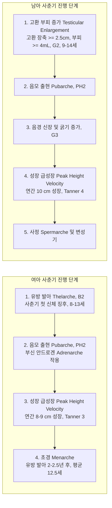

# Netter Endocrine Day 04: 생식내분비 (Reproduction) — 성분화·사춘기·DSD·성염색체이상·생식주기·유방질환 (pp. 100–126)

> 📖 **원서 출처**: [The Netter Collection - Volume 2, The Endocrine System.pdf (pp. 100-126)](https://drive.google.com/file/d/1TnVzK8w2Nm2lU3SzGlFBLguBf8pjaMkt/view?usp=drivesdk)
> 🏷️ **범위**: Section 4: Reproduction (Plate 4-1 ~ Plate 4-26, 총 26개 플레이트 전수 수록)
> 📌 **핵심 테마**: 성선·내생식관·외생식기의 3단계 성분화(SRY, SOX9, AMH, Testosterone, 5α-reductase/DHT), 생식샘 스테로이드 합성(난포 Two-cell Two-gonadotropin 이론, 테스토스테론-에스트라디올 경로), 정상 사춘기 개시(키스펩틴/GPR54 및 GnRH 박동성 분비)와 태너 병기(Tanner staging), 성조숙증(중추성 CPP vs 말초성 PPP/McCune-Albright), 성분화 이상(DSD: 46,XX CAH, 46,XY CAIS/5α-RD2/PMDS), 성염색체 이상 질환(47,XXY 클라인펠터, 45,X 터너 증후군), 고안드로겐혈증 및 다모증(PCOS vs 부신/난소 종양 감별), 정상 월경주기 호르몬 피드백 및 이상자궁출혈(PALM-COEIN), 남성 여성형 유방(진성 vs 가성, 에스트로겐/안드로겐 불균형) 및 고프로락틴혈증성 유즙누출증.

---

## 1. 개요 및 마스터 요약 (Executive Summary)

* **성결정 및 성분화의 3단계 법칙 (Plates 4-1 ~ 4-3)**:
  * **1단계 (성선 분화)**: Y염색체 단완의 **SRY 유전자** 발현 $\rightarrow$ **SOX9, SF-1, WT1** 활성화 $\rightarrow$ 미분화 생식선이 **고환(Testis)**으로 분화. (SRY 부재 시 WNT4, RSPO1, DAX1에 의해 난소 Ovary로 분화).
  * **2단계 (내생식관 분화)**: 고환의 **세르톨리 세포(Sertoli cells)**가 분비한 **AMH (항뮐러관호르몬 / MIS)**가 뮐러관(Paramesonephric duct)을 퇴축시킴. **라이디히 세포(Leydig cells)**가 분비한 **테스토스테론**이 볼프관(Mesonephric duct)을 부고환, 정관, 정낭으로 발달시킴. (여성은 AMH 부재로 뮐러관이 나팔관, 자궁, 질 상부 1/3로 발달, 테스토스테론 부재로 볼프관 퇴축).
  * **3단계 (외생식기 분화)**: 외생식기 조직의 **$5\alpha$-환원효소 2형(SRD5A2)**이 테스토스테론을 보다 강력한 **디히드로테스토스테론(DHT)**으로 전환 $\rightarrow$ 음경, 음경 요도, 음낭 형성. (DHT 부재 시 음핵, 소음순, 대음순, 질 하부 2/3 및 질전정 형성).
* **사춘기 생리 및 성조숙증 (Plates 4-5 ~ 4-11)**:
  * 시상하부 **키스펩틴(Kisspeptin) - GPR54(KISS1R)** 축 활성화 $\rightarrow$ GnRH의 야간 박동성 분비 재개 $\rightarrow$ 뇌하수체 LH/FSH 박동 분비 $\rightarrow$ 성호르몬 생성.
  * **사춘기 개시 신체 징후**: 여아는 **유방 발달(Thelarche, B2, 8~13세)**, 남아는 **고환 부피 증가($\ge 4\ \text{mL}$, G2, 9~14세)**가 첫 징후.
  * **성조숙증 (여아 <8세, 남아 <9세)**:
    * **중추성 성조숙증 (CPP, GnRH 의존성)**: HPG축의 조기 성숙. GnRH 자극검사 시 LH 분비 우세. 여아는 90% 특발성, 남아는 50% 이상 중추신경계 기질적 병변(시상하부 과오종 등). 치료는 **지속성 GnRH 작용제(Leuprolide)**로 수용체 탈감작 유도.
    * **말초성 성조숙증 (PPP, GnRH 비의존성)**: 자율적 성호르몬 분비로 LH/FSH 억제. **맥쿤-올브라이트 증후군 (McCune-Albright syndrome, GNAS 체세포 활성화 돌연변이, 밀크커피색 반점, 다발성 섬유성이형성증, 자율성 난소 낭종)**이 대표적.
* **성분화 이상 (DSD)의 정밀 감별 (Plates 4-12 ~ 4-15)**:
  * **46,XX DSD**: 안드로겐 과다 노출. 최빈 원인은 **21-수산화효소 결핍증 (21-OHD CAH)**. 자궁/난소 정상, 외성기 모호.
  * **46,XY 완전 안드로겐 불감성 증후군 (CAIS)**: 안드로겐 수용체(AR) 기능 상실. 외형상 전형적인 여성 표현형, 질 맹단(Blind pouch), **자궁/나팔관 결손 (AMH 정상 분비로 뮐러관 퇴축 완료)**, 잠복고환, 음모/액모 결여 ("Hairless woman").
  * **$5\alpha$-환원효소 2형 결핍증**: 출생 시 여성형 외성기 또는 모호성기 $\rightarrow$ 사춘기 시 고농도 테스토스테론에 의해 남성화 및 음경 발육 급진전 ("Guevedoces").
  * **지속성 뮐러관 증후군 (PMDS)**: AMH 또는 AMHR2 유전자 결함. 정상 남성 외성기이나 서혜부 탈장낭 내에 **자궁과 나팔관이 잔존**.
* **성염색체 이상 질환 (Plates 4-16 ~ 4-20)**:
  * **클라인펠터 증후군 (47,XXY)**: 고생식샘자극호르몬성 성선저하증, 긴 사지, 작고 단단한 섬유화된 고환(<4 mL), 무정자증, 여성형 유방(남성 유방암 위험 20~50배 증가).
  * **터너 증후군 (45,X)**: 난소 조기 폐화에 따른 **줄무늬 성선(Streak gonad)**, 왜소증(SHOX 유전자 결손), 익상경(Webbed neck), 외반주, 대동맥 축착/이엽성 대동맥판막, 말발굽신장.
* **고안드로겐혈증 및 유방 질환 (Plates 4-21 ~ 4-26)**:
  * **다모증/남성화**: PCOS(LH/FSH 비 상승, 배란장애, 인슐린 저항성) vs 부신피질암종(DHEA-S 급증) vs 난소 지질/세르톨리-라이디히 종양(테스토스테론 급증).
  * **남성 여성형 유방 (Gynecomastia)**: 유선 조직 증식(진성) vs 가성(지방). 에스트로겐/안드로겐 유효 비 증가가 본태.
  * **유즙누출증 (Galactorrhea)**: 도파민 억제 결손 또는 고프로락틴혈증(프로락틴선종, 항정신병제/위장관운동제, 원발성 갑상선저하증의 TRH 자극).

---

## 2. 제1부: 성결정, 성선 분화, 생식관 및 외생식기 발생 (Plates 4-1 ~ 4-3)

### Plate 4-1 | 성선의 분화 (Differentiation of Gonads)
![[Netter_V2_Plate4-1.png]]

#### 성결정의 유전학적 캐스케이드
수정 후 임신 6주까지 인간 배아의 원시 성선(Primitve bipotential gonad)은 남녀 구분 없이 동일한 양방향 잠재성을 가짐:
1. **남성 성결정 (Testicular Pathway)**:
   * **SRY (Sex-determining Region Y)** 유전자가 Y염색체 단완(Yp11.3)에 위치.
   * SRY 단백질이 HMG-box 전사인자로서 **SOX9** 유전자 전사를 강력히 상향 조절.
   * **SF-1 (Steroidogenic Factor 1)** 및 **WT1 (Wilms tumor 1)**과 상호작용하여 미분화 성선의 체세포를 **세르톨리 세포(Sertoli cell)**로 분화 유도.
   * 세르톨리 세포는 원시 생식세포(Primordial germ cells)를 둘러싸며 **고환끈(Testis cords)**을 형성하고 **라이디히 세포(Leydig cell)**의 분화를 유도.
2. **여성 성결정 (Ovarian Pathway)**:
   * SRY 유전자가 부재할 경우 활성화. 과거에는 수동적 경로로 여겨졌으나 능동적 유전 경로임이 규명됨.
   * **WNT4** 및 **RSPO1** 신호전달계가 **$\beta$-카테닌(β-catenin)**을 안정화하고 **DAX1**을 발현시켜 남성화 유전자인 SOX9을 억제.
   * 피질 성선 세포가 과립막세포(Granulosa cells) 및 난포막세포(Theca cells)로 분화하여 원시 난포(Primordial follicles) 형성.

```mermaid
graph TD
    A[원시 미분화 성선 Bipotential Gonad] --> B{Y염색체 SRY 유전자 유무}
    B -->|SRY 존재 (46,XY)| C[SOX9, SF-1, WT1 전사 활성화]
    C --> D[세르톨리 세포 Sertoli Cells 분화]
    D --> E[고환 형성 Testis Formation]
    D -->|AMH / MIS 분비| F[뮐러관 퇴축]
    E -->|라이디히 세포 유도 -> Testosterone 분비| G[볼프관 발달]
    
    B -->|SRY 부재 (46,XX)| H[WNT4, RSPO1, DAX1 활성화]
    H --> I[SOX9 억제 및 난소 분화 경로]
    I --> J[난포막 및 과립막세포 분화]
    J --> K[난소 형성 Ovary Formation]
    K -->|AMH 부재| L[뮐러관 보존 -> 여성 내생식관 발달]
    K -->|안드로겐 부재| M[볼프관 퇴축]
```

---

### Plate 4-2 | 생식관의 분화 (Differentiation of Genital Ducts)
![[Netter_V2_Plate4-2.png]]

#### 볼프관 vs 뮐러관의 상호 배타적 운명
임신 7주경 배아는 남녀 모두 두 세트의 원시 생식관을 보유함:
1. **중신관 (Mesonephric / Wolffian duct)**:
   * 남성 내생식기 원기.
   * 발달 조건: 동측 고환의 라이디히 세포에서 분비되는 **국소적 고농도 테스토스테론(Testosterone)**에 직접 의존. (순환 혈액이 아닌 국소 확산에 의존하므로, 편측 고환 결손 시 결손 측 볼프관은 퇴축함).
   * 유도 구조물: **부고환(Epididymis), 정관(Vas deferens), 정낭(Seminal vesicle), 사정관(Ejaculatory duct)**. (전립선은 요생식고원에서 유래).
2. **방중신관 (Paramesonephric / Müllerian duct)**:
   * 여성 내생식기 원기.
   * 남성에서의 퇴축: 태아 고환의 세르톨리 세포가 분비하는 TGF-$\beta$ 계열의 당단백질 호르몬인 **항뮐러관호르몬 (AMH / MIS, Müllerian Inhibiting Substance)**에 의해 능동적으로 자멸사(Apoptosis) 및 퇴축 소멸. (퇴축 잔존물: 고환수 [Appendix testis], 전립선소실 [Prostatic utricle]).
   * 여성에서의 발달: 고환 및 AMH가 부재하므로 뮐러관이 보존되어 자율적으로 발달.
   * 유도 구조물: **난관/나팔관(Fallopian tubes), 자궁(Uterus), 자궁경부(Cervix), 질 상부 1/3 (Upper 1/3 of vagina)**.

---

### Plate 4-3 | 외생식기의 분화 (Differentiation of External Genitalia)
![[Netter_V2_Plate4-3.png]]

#### 요생식동 및 $5\alpha$-환원효소 의존성
임신 9주까지 외생식기 원기는 **생식결절(Genital tubercle)**, **요생식주름(Urogenital folds)**, **음낭음순융기(Labioscrotal swellings)**로 구성됨:

| 원시 발생학적 구조 | 남성 분화 구조 (DHT 필수!) | 여성 분화 구조 (DHT 부재 시) |
| :--- | :--- | :--- |
| **생식결절 (Genital Tubercle)** | **음경두 (Glans penis)**, 음경해면체 | **음핵 (Clitoris)** |
| **요생식주름 (Urogenital Folds)** | 복측으로 융합되어 **음경 요도 (Penile urethra)** 및 음경체 형성 | 융합되지 않고 분리되어 **소음순 (Labia minora)** 형성 |
| **음낭음순융기 (Labioscrotal Swellings)** | 정중선에서 융합되어 **음낭 (Scrotum)** 형성 (고환 하강의 종착지) | 융합되지 않고 **대음순 (Labia majora)** 형성 |
| **요생식동 (Urogenital Sinus)** | 전립선 (Prostate gland), 요도구선 | **질 하부 2/3 (Lower vagina)** 및 질전정 (Vestibule) |

> ⚠️ **Clinical Pearl**:
> 볼프관(정관, 부고환) 발달은 **테스토스테론(Testosterone)** 자체에 의해 유도되지만, 외생식기 남성화(음경 신장, 음낭 융합, 전립선 발달)는 표적 조직 세포질의 **$5\alpha$-환원효소 2형(SRD5A2)**에 의해 변환된 초강력 안드로겐인 **디히드로테스토스테론 (DHT)**에 절대적으로 의존합니다. 따라서 $5\alpha$-환원효소가 결핍되면 볼프관 유래 내부 장기는 온전한 남성이지만, 외생식기는 여성형으로 태어나는 성분화 이상이 발생합니다.

---

## 3. 제2부: 생식샘 스테로이드 합성 및 수용체 생리 (Plate 4-4)

### Plate 4-4 | 테스토스테론 및 에스트로겐 합성 (Testosterone and Estrogen Synthesis)
![[Netter_V2_Plate4-4.png]]

#### 고환의 스테로이드 합성 (라이디히-세르톨리 협동)
* **라이디히 세포 (Leydig cell)**:
  * 뇌하수체 전엽의 **LH**가 LH 수용체(Gs 결합 GPCR)에 결합 $\rightarrow$ cAMP/PKA 경로 활성화 $\rightarrow$ StAR 단백질 인산화 및 콜레스테롤 유입.
  * 콜레스테롤 $\xrightarrow{\text{CYP11A1}} \text{Pregnenolone} \xrightarrow{\text{CYP17A1}} \text{17-OH-Preg} \rightarrow \text{DHEA} \rightarrow \text{Androstenedione} \xrightarrow{17\beta-\text{HSD3}} \textbf{Testosterone}$.
  * *효소 특이성*: 고환 라이디히 세포는 **$17\beta$-HSD 3형**을 고발현하여 안드로스텐디온을 테스토스테론으로 전환하는 능력이 매우 뛰어남.
* **세르톨리 세포 (Sertoli cell)**:
  * 뇌하수체 전엽의 **FSH** 자극 $\rightarrow$ **아로마타제 (Aromatase / CYP19A1)** 합성 유도, **안드로겐 결합 단백질 (ABP)** 및 **인히빈 B (Inhibin B)** 분비. (인히빈 B는 뇌하수체 FSH를 특이적으로 음성 피드백 억제).

#### 난포의 "2세포-2성선자극호르몬" 모델 (Two-Cell, Two-Gonadotropin Theory)
난소에서 에스트라디올($E_2$)의 합성은 하나의 세포에서 완결되지 못하며, 기저막을 경계로 분리된 두 세포의 정교한 분업 협동으로 이루어짐:
1. **난포막세포 (Theca Interna Cell)**:
   * **자극 호르몬**: **LH (Luteinizing Hormone)**.
   * **보유 효소**: **CYP17A1 ($17\alpha$-hydroxylase / 17,20-lyase)**를 풍부하게 발현.
   * **기능**: 콜레스테롤로부터 안드로겐(**Androstenedione 및 Testosterone**)을 왕성하게 합성.
   * **한계**: **아로마타제(CYP19A1) 효소가 결손**되어 있어 안드로겐을 에스트로겐으로 전환하지 못하고 기저막을 통해 과립막세포로 확산 전달.
2. **과립막세포 (Granulosa Cell)**:
   * **자극 호르몬**: **FSH (Follicle-Stimulating Hormone)**.
   * **보유 효소**: **아로마타제 (CYP19A1)** 및 $17\beta$-HSD 1형 발현.
   * **기능**: 난포막세포로부터 건너온 안드로겐을 넘겨받아 방향족화(Aromatization)하여 **에스트론($E_1$) 및 에스트라디올($E_2$)**로 최종 합성.
   * **한계**: **CYP17A1 효소가 결손**되어 있어 스스로 콜레스테롤로부터 안드로겐을 직접 합성할 수 없음.

```
[ 난포막세포 (Theca Cell) ] ── (LH 자극)
   콜레스테롤 ──(CYP17A1)──> 안드로스텐디온 / 테스토스테론
                                       │ (기저막 통과 확산)
                                       ▼
[ 과립막세포 (Granulosa Cell) ] ── (FSH 자극)
   안드로겐 전구체 ──(CYP19A1 아로마타제)──> 에스트라디올 (Estradiol, E2)
```

---

## 4. 제3부: 정상 사춘기 발달 및 태너 병기 (Plates 4-5 ~ 4-8)

### Plate 4-5 | 정상 사춘기 (Normal Puberty)
![[Netter_V2_Plate4-5.png]]

### Plate 4-6 | 정상 사춘기 II (Normal Puberty (cont'd))
![[Netter_V2_Plate4-6.png]]

### Plate 4-7 | 정상 사춘기 III (Normal Puberty (cont'd))
![[Netter_V2_Plate4-7.png]]

### Plate 4-8 | 정상 사춘기 IV — 태너 병기 (Normal Puberty (cont'd))
![[Netter_V2_Plate4-8.png]]

#### 사춘기 개시의 신경내분비적 트리거
* 소아기 동안 시상하부의 GnRH 박동성 분비는 중추성 GABA 억제와 극도로 예민한 성호르몬 음성 피드백에 의해 깊은 휴면 상태(Juvenile pause)를 유지함.
* 사춘기 진입 시 시상하부 궁상핵(Arcuate nucleus)의 **KNDy 뉴런 (Kisspeptin / Neurokinin B / Dynorphin)**이 활성화.
* **키스펩틴(Kisspeptin)**이 GnRH 뉴런의 **GPR54 (KISS1R)** 수용체에 결합하여 강력한 탈억제 신호를 전달.
* **야간 수면 중 GnRH 및 LH의 박동성 분비(Pulsatile secretion)**가 출현하는 것이 신경내분비학적 사춘기 개시의 홀마크.

#### 남녀 사춘기 이정표 및 태너 병기 (Tanner Stages / SMR 1~5)



| 병기 (Stage) | 여아 유방 발달 (Breast, B) | 남아 외생식기 발달 (Genitalia, G) | 공통 음모 발달 (Pubic Hair, PH) |
| :--- | :--- | :--- | :--- |
| **Tanner I** | 사춘기 전 (유두만 돌출) | 사춘기 전 (고환 부피 <4 mL) | 사춘기 전 (성모 없음, 솜털만 존재) |
| **Tanner II** | **유방 발아 (Breast bud)**: 유륜 하부 몽우리 형성 (첫 징후) | **고환 장축 $\ge 2.5\ \text{cm}$, 부피 $\ge 4\ \text{mL}$**, 음낭 피부 착색 (첫 징후) | 치골 결합 부위에 약간의 길고 엷은 색소의 직모 출현 |
| **Tanner III** | 유방과 유륜이 하나의 둔덕으로 지속 비대 | 음경 길이 신장 시작, 고환 부피 더욱 증가 (8~12 mL) | 굵고 곱슬거리며 짙은 성모가 치골 결합 위로 확산 |
| **Tanner IV** | **유륜과 유두가 솟아올라 유방 둔덕 위에 2차 둔덕(Secondary mound) 형성** | 음경 길이 및 둘레 현저한 발달, 귀두 발달, 고환 농색화 (12~15 mL) | 성인 양상의 성모이나 면적이 좁음 (대퇴 내측 침범 없음) |
| **Tanner V** | 성인형 (2차 둔덕이 평탄화되어 유두만 돌출) | 성인 크기 및 형태 (고환 부피 $>15\ \text{mL}$) | 성인형 역삼각형 분포, **허벅지 안쪽(대퇴 내측)까지 성모 침범** |

---

## 5. 제4부: 성조숙증 (Precocious Puberty) (Plates 4-9 ~ 4-11)

### Plate 4-9 | 성조숙증 I — 중추성 성조숙증 (Precocious Puberty)
![[Netter_V2_Plate4-9.png]]

### Plate 4-10 | 성조숙증 II — 말초성 성조숙증 (Precocious Puberty (cont'd))
![[Netter_V2_Plate4-10.png]]

### Plate 4-11 | 성조숙증 III — 불완전 변이형 (Precocious Puberty (cont'd))
![[Netter_V2_Plate4-11.png]]

#### 성조숙증의 정의 및 분류
* **정의**: 2차 성징이 **여아에서 만 8세 미만**, **남아에서 만 9세 미만**에 출현하는 경우.
* **임상적 위험성**: 성호르몬의 조기 노출로 골성숙이 급속히 촉진되어 소아기에는 또래보다 키가 크지만, **골단판(Growth plate)의 조기 융합**을 초래하여 최종 성인 신장(Final adult height)의 심각한 저하 및 심리사회적 부적응 유발.

| 구분 | 중추성 성조숙증 (CPP, 진성 / GnRH 의존성) | 말초성 성조숙증 (PPP, 가성 / GnRH 비의존성) |
| :--- | :--- | :--- |
| **병태생리** | 시상하부-뇌하수체-성선(HPG) 축의 조기 자율적 성숙 | HPG축과 무관하게 생식선이나 부신에서 자율적으로 성호르몬 과다 분비 |
| **GnRH 자극검사** | **LH 최고치 급증 ($\ge 5\ \text{IU/L}$), LH/FSH 피크 비 $> 0.66\sim1.0$** | **기저 및 자극 후 LH/FSH 완전 억제 (수치 불변)** |
| **성호르몬 농도** | 사춘기 수준으로 상승 (Estradiol / Testosterone) | 성호르몬 극단적 상승 (음성 피드백으로 LH/FSH 억제) |
| **발생 원인** | • **여아**: 80~90%가 **특발성 (Idiopathic)**<br>• **남아**: 50% 이상에서 **중추신경계 기질적 병변** (시상하부 과오종 Hypothalamic hamartoma, 뇌종양, 수두증, 두부 방사선) | • **맥쿤-올브라이트 증후군 (McCune-Albright)**<br>• 난소 과립막세포종, 라이디히세포종<br>• 부신 종양, 선천성 부신 과형성증(CAH)<br>• 가족성 남성 한정성 성조숙증 (Testotoxicosis) |
| **치료 원칙** | **지속성 GnRH 작용제 (GnRH agonist, 예: Leuprolide acetate depot, Triptorelin)** 매 4주 또는 12주 근주 $\rightarrow$ GnRH 수용체 탈감작 및 하향조절 | 원인 질환별 맞춤 치료 (종양 절제, 아로마타제 억제제 [Anastrozole], 항안드로겐제 [Spironolactone, Cyproterone]) |

#### 불완전 변이형 성조숙증 (Normal Variants)
1. **조기 유방발아 (Premature Thelarche)**: 생후 2세 미만 영유아에서 일시적인 미세 난포 활동으로 다른 성징, 성장 가속, 골연령 진행 없이 유방만 한쪽 또는 양쪽 발달. 대개 자연 퇴축하며 치료 불필요.
2. **조기 부신피질기능항진 (Premature Adrenarche)**: 8세 미만에 부신 망상대 조기 성숙으로 DHEA-S가 경미하게 상승하여 음모/액모, 성인 체취 출현. 골연령 진행 경미. (추후 PCOS 위험인자).
3. **조기 초경 (Premature Menarche)**: 유방 발달이나 골연령 진행 없이 질 출혈만 단독 발생.

---

## 6. 제5부: 성분화 이상 (Disorders of Sex Development, DSD) (Plates 4-12 ~ 4-15)

### Plate 4-12 | 성분화 이상 I — 분류 및 평가 (Disorders of Sex Development)
![[Netter_V2_Plate4-12.png]]

### Plate 4-13 | 성분화 이상 II — 46,XX DSD (Disorders of Sex Development (cont'd))
![[Netter_V2_Plate4-13.png]]

### Plate 4-14 | 성분화 이상 III — 46,XY DSD (Disorders of Sex Development (cont'd))
![[Netter_V2_Plate4-14.png]]

### Plate 4-15 | 성분화 이상 IV — 안드로겐 불감성 및 뮐러관 이상 (Disorders of Sex Development (cont'd))
![[Netter_V2_Plate4-15.png]]

#### 2006 시카고 합의안 분류 체계 (Consensus Classification)
과거의 반음양(Hermaphroditism), 가성반음양(Pseudohermaphroditism)이라는 낙인적 용어를 폐기하고 염색체 핵형에 기반한 표준 분류 도입:

```
성분화 이상 (DSD)
  ├── 1. 46,XX DSD (과거 '여성 가성반음양'): 난소 보유, 안드로겐 과다 노출
  ├── 2. 46,XY DSD (과거 '남성 가성반음양'): 고환 보유, 안드로겐 합성/작용 결함
  ├── 3. 성염색체 DSD: 터너 증후군(45,X), 클라인펠터(47,XXY), 혼합 성선 이형성증(45,X/46,XY)
  └── 4. 난소고환성 DSD (Ovotesticular DSD, 과거 '진성 반음양'): 동일 개체 내 난소와 고환 조직 공존
```

#### 주요 질환별 병태생리 및 임상 감별

| 질환명 | 핵형 | 성선 (Gonad) | 내부 생식관 | 외생식기 표현형 | 분자유전학적 결함 및 특징 |
| :--- | :--- | :--- | :--- | :--- | :--- |
| **선천성 부신 과형성증 (CAH, 21-OHD)** | **46,XX** | **정상 난소** (양측) | **정상 자궁, 난관, 질 상부** | **모호성기 (남성화)**: 음핵 비대, 음순 융합 | CYP21A2 결손. 코르티솔 결핍으로 ACTH 과다 $\rightarrow$ 안드로겐 과다 션트. 염분소실 쇼크 위험. |
| **완전 안드로겐 불감성 증후군 (CAIS)** | **46,XY** | **정상 고환** (복강/서혜부/대음순 내 잠복) | **자궁/난관/질상부 결손!** (볼프관도 발달 부전) | **완벽한 여성 외성기**, 질 맹단, **음모/액모 결여** | X염색체의 **안드로겐 수용체(AR) 기능 완전 상실**. AMH 정상 분비로 뮐러관 퇴축. 고환 유래 테스토스테론의 말초 방향족화로 여성 유방 발달 풍만. 사춘기 후 생식선 악성화 예방 위해 잠복고환 적출술. |
| **$5\alpha$-환원효소 2형 결핍증 (SRD5A2)** | **46,XY** | **정상 고환** | **정상 남성 내생식관** (정관, 부고환, 정낭) | 출생 시 모호성기/여성형 $\rightarrow$ **사춘기 시 급격한 남성화** | SRD5A2 변이. DHT 결핍으로 태아기 외생식기 남성화 실패. 사춘기 시 고농도 테스토스테론이 결함을 보상하여 음경 신장 및 근육 발달 ("Penis-at-12"). |
| **지속성 뮐러관 증후군 (PMDS)** | **46,XY** | **정상 고환** | **남성 도관 + 자궁/난관 공존!** | **완전한 정상 남성 외성기** | **AMH 유전자 또는 AMH 수용체(AMHR2)** 돌연변이. 뮐러관이 퇴축하지 못해 서혜부 탈장 수술 중 자궁과 난관이 우연히 발견됨 (Hernia uteri inguinalis). |

---

## 7. 제6부: 성염색체 이상 질환 — 클라인펠터 및 터너 증후군 (Plates 4-16 ~ 4-20)

### Plate 4-16 | 성염색체 수적 이상 (Errors in Chromosomal Sex)
![[Netter_V2_Plate4-16.png]]

### Plate 4-17 | 클라인펠터 증후군 (Klinefelter Syndrome)
![[Netter_V2_Plate4-17.png]]

#### 클라인펠터 증후군 (47,XXY)의 임상 병태
남성 500~1,000명당 1명꼴로 발생하는 가장 흔한 성염색체 이상 질환. 감수분열 시 성염색체의 비분리(Nondisjunction)가 원인:
* **내분비 병태생리**:
  * 사춘기 이후 정세관(Seminiferous tubules)의 진행성 초자화(Hyalinization) 및 섬유화, 세르톨리 세포 소실 $\rightarrow$ 인히빈 B 격감으로 **FSH 현저한 급증**.
  * 라이디히 세포 기능 부전 $\rightarrow$ **테스토스테론 저하**, 피드백 상실로 **LH 상승**.
  * 전형적인 **고생식샘자극호르몬성 성선저하증 (Hypergonadotropic hypogonadism)**.
* **신체적 특징 및 임상상**:
  1. **고환 소견**: 극도로 작고 단단한 고환 (**Testicular volume < 4 mL**, 길이 <2 cm). 무정자증(Azoospermia)으로 인한 불임.
  2. **체형**: **거인증양 체형(Eunuchoid proportions)** — 하지 성장판 폐쇄 지연으로 키가 크고 하지가 상체에 비해 비정상적으로 긺 (Arm span이 신장보다 5cm 이상 길거나 상하체 비 감소).
  3. **여성형 유방 (Gynecomastia, 38~50%)**: 에스트로겐/안드로겐 비율 역전으로 발생. **정상 남성 대비 남성 유방암 발병 위험이 20~50배 증가**하므로 정기 촉진 필수.
  4. 대사 및 신경인지: 복부 비만, 인슐린 저항성, 제2형 당뇨병, 골다공증, 언어 학습 장애 및 실행 기능 저하.
* **치료**: 사춘기 연령(12세경)부터 평생 지속적인 **테스토스테론 대체요법 (TRT)** 시행. (남성화 촉진, 골밀도 보존, 제지방량 증가, 삶의 질 개선).

---

### Plate 4-18 | 터너 증후군 — 성선 이형성증 I (Turner Syndrome)
![[Netter_V2_Plate4-18.png]]

### Plate 4-19 | 터너 증후군 — 임상 징후 II (Turner Syndrome (cont'd))
![[Netter_V2_Plate4-19.png]]

### Plate 4-20 | 터너 증후군 — 심혈관 합병증 및 관리 III (Turner Syndrome (cont'd))
![[Netter_V2_Plate4-20.png]]

#### 터너 증후군 (45,X)의 다기관 침범 및 전주기 관리
여아 약 2,000~2,500명당 1명 발생. 약 50%가 완전한 45,X 단일염색체이며, 나머지는 모자이크(45,X/46,XX) 또는 X염색체 구조 이상(동완염색체 Isochromosome Xq 등):
* **주요 신체 소견 및 발생 병태**:
  1. **줄무늬 성선 (Streak Gonads)**: 태아기 난모세포의 급격한 세포 자멸사 가속화로 난포가 전멸하고 백색 섬유성 띠 조직만 잔존. $\rightarrow$ **원발성 무월경 (Primary amenorrhea)**, 2차 성징 결여, 불임, 고생식샘자극호르몬성 성선저하증 (FSH/LH 현저한 상승).
  2. **저신장 (Short Stature)**: X염색체 위상염색체(PAR1)에 위치한 **SHOX (Short Stature Homeobox) 유전자의 반수부족(Haploinsufficiency)**이 원인. 치료하지 않을 경우 최종 성인 신장 평균 143cm에 불과.
  3. **림프관 형성 이상 소견**: 태아기 경부 낭성 림프종(Cystic hygroma) 흔적으로 인한 **익상경 (Webbed neck / Pterygium colli)**, 낮은 후두 모발선(Low hairline), 출생 시 손발등의 비함요 부종(Lymphedema).
  4. **골격계 기형**: 외반주(Cubitus valgus), **제4중수골 단축(Short 4th metacarpal)**, 고구개(High-arched palate), 방패형 흉곽(Shield chest)과 넓은 유두 간격.
* **생명을 위협하는 동반 기형 및 합병증**:
  * **심혈관계 (최대 사망 원인, 환자의 30~50%)**: **이엽성 대동맥판막 (Bicuspid aortic valve, 30%)**, **대동맥 축착 (Coarctation of aorta, 10%)**, **대동맥근 확장 및 대동맥 박리 (Aortic dissection)**.
  * **신장계 (30~40%)**: **말발굽신장 (Horseshoe kidney)**, 신우/요관 중복.
  * **자가면역 질환**: 하시모토 갑상선염(anti-TPO 양성, 30% 이상), 셀리악병, 제1형 당뇨병.
* **연령별 표준 치료 프로토콜**:
  1. **소아기 (4~6세경~)**: 성인 최종 신장 극대화를 위해 **재조합 인간 성장호르몬 (rhGH)** 고용량 매일 피하 투여.
  2. **사춘기 유도 (11~12세경)**: 골연령과 성장 추이를 고려하여 초저용량 **경구/경피 에스트로겐** 시작 $\rightarrow$ 서서히 증량하여 2년에 걸쳐 유방 발달 및 여성화 유도.
  3. **자궁내막 보호**: 유방 발달이 충분해지거나(Tanner 4) 파탄 출혈 발생 시 **프로게스토겐(Progestin)**을 주기적으로 병용 추가하여 자궁내막 증식증 및 암 예방.
  4. **Y염색체 모자이크(45,X/46,XY) 시 필수 조치**: 생식선모세포종(Gonadoblastoma) 악성화율이 15~30%에 달하므로 조기 **예방적 성선 절제술 (Prophylactic gonadectomy)** 필수.

---

## 8. 제7부: 고안드로겐혈증, 여성 생식주기 및 유방 질환 (Plates 4-21 ~ 4-26)

### Plate 4-21 | 다모증 및 남성화 I (Hirsutism and Virilization)
![[Netter_V2_Plate4-21.png]]

### Plate 4-22 | 다모증 및 남성화 II (Hirsutism and Virilization (cont'd))
![[Netter_V2_Plate4-22.png]]

#### 다모증 (Hirsutism) vs 남성화 (Virilization) 감별
* **다모증**: 안드로겐 민감 부위(인중, 턱, 가슴, 하복부, 등)에 굵고 짙은 성모(Terminal hair)가 남성형 패턴으로 과도하게 자라는 상태. (페리만-갤웨이 평가 점수 [Ferriman-Gallwey score] $\ge 8$점 시 임상적 다모증).
* **남성화**: 단순 다모증을 넘어 신체 전체가 남성화되는 중증 상태. **음핵 비대 (Clitoromegaly, 직경 >10mm)**, **목소리 굵어짐 (Deepening of voice)**, 측두부 탈모, 유방 위축, 어깨 근육 발달. $\rightarrow$ 부신피질암종(ACC) 또는 난소 안드로겐 분비 악성종양의 위험 신호.

| 감별 질환군 | 호르몬 분비 양상 | 임상적 특징 및 진단 기준 | 1차 치료 접근법 |
| :--- | :--- | :--- | :--- |
| **다낭성 난소 증후군 (PCOS, 최빈 원인)** | **LH/FSH 비 $> 2\sim3$**, 테스토스테론 경미 상승, DHEA-S 정상/경미 상승 | 만성 무배란/희발월경, 불임, 비만, 인슐린 저항성, 초음파상 난소 변연부 "진주목걸이" 모양 낭종 | 복합 경구피임제 (COC), 체중 감량, 메트포르민, 스피로놀락톤 |
| **비전형적 CAH (Late-onset 21-OHD)** | **17-OHP 현저한 상승** (ACTH 자극 후 $>1000\ \text{ng/dL}$) | 사춘기 이후 발현, 다모증, 여드름, 월경불순 (PCOS와 임상 양상 유사하여 감별 필수) | 저용량 글루코코르티코이드 (Dexamethasone 또는 Hydrocortisone) |
| **부신피질암종 (ACC)** | **DHEA-S 극단적 상승 ($>700\sim800\ \mu\text{g/dL}$)** | 수개월 내 급속히 진행하는 남성화, 복부 거대 종괴, 쿠싱 증후군 복합 동반 | 외과적 근치적 절제술, 미토탄 (Mitotane) |
| **난소 남성화 종양 (Sertoli-Leydig cell tumor)** | **혈청 테스토스테론 급증 ($>200\ \text{ng/dL}$)**, DHEA-S 정상 | 급격한 남성화, 폐경 후 여성에서 호발, 골반 초음파/MRI상 편측 난소 고형 종괴 | 난소 절제술 |

---

### Plate 4-23 | 여성 생식주기의 호르몬 조절 (Influence of Gonadal Hormones on Female Reproductive Cycle)
![[Netter_V2_Plate4-23.png]]

### Plate 4-24 | 비정상 자궁출혈의 원인 및 분류 (Functional and Pathologic Causes of Uterine Bleeding)
![[Netter_V2_Plate4-24.png]]

#### 정상 월경주기 3단계와 피드백 메커니즘
1. **난포기 (Follicular Phase, 1~14일)**:
   * 전기: FSH 자극으로 다수의 원시 난포가 성장 개시. 과립막세포에서 분비되는 에스트라디올($E_2$)이 증가하여 시상하부-뇌하수체에 음성 피드백을 가해 FSH를 감소시킴 $\rightarrow$ 최고 수용체를 가진 단 하나의 **우성 난포(Dominant follicle)**만 선택 생존하고 나머지는 폐화(Atresia).
   * 후기: 성숙 난포에서 분비된 **$E_2$ 농도가 $200\ \text{pg/mL}$ 이상으로 48시간 이상 지속 유지**되면, 역설적으로 시상하부에 **양성 피드백(Positive feedback)**으로 전환되어 폭발적인 **LH 서지 (LH surge)** 유발.
2. **배란 (Ovulation, 14일경)**:
   * LH 서지 개시 후 36~40시간(피크 후 10~12시간)에 성숙 난포벽이 파열되며 제2감수분열 중기 상태의 난자 배출.
3. **황체기 (Luteal Phase, 15~28일)**:
   * 파열된 난포가 과립막-황체세포로 변환되어 **황체(Corpus luteum)** 형성.
   * 다량의 **프로게스테론(Progesterone)**과 에스트로겐을 분비 $\rightarrow$ 자궁내막을 증식기(Proliferative)에서 글리코겐이 풍부한 **분비기(Secretory phase)**로 전환시켜 착상 준비.
   * 임신 실패 시 황체 퇴축(Luteolysis) $\rightarrow$ 프로게스테론 급격한 소퇴(Withdrawal) $\rightarrow$ 나선동맥 경련성 수축 및 허혈 괴사 $\rightarrow$ **월경 출혈 (Menstruation)**.

#### FIGO 비정상 자궁출혈 (AUB)의 PALM-COEIN 분류
* **구조적 병변 (PALM, 영상 및 조직검사로 확인)**:
  * **P**olyp (용종)
  * **A**denomyosis (자궁선근증)
  * **L**eiomyoma (자궁근종: 점막하 근종 Submucosal이 출혈 최빈도)
  * **M**alignancy & Hyperplasia (악성종양 및 자궁내막 증식증)
* **비구조적 원인 (COEIN, 전신 및 내분비 기능 이상)**:
  * **C**oagulopathy (응고병증: von Willebrand 질환)
  * **O**vulatory dysfunction (배란 장애: 무배란성 주기, PCOS, 갑상선 기능이상, 고프로락틴혈증 $\rightarrow$ 황체가 형성되지 않아 프로게스테론 없이 에스트로겐만 지속 노출되다가 불규칙하게 탈락하는 에스트로겐 파탄 출혈)
  * **E**ndometrial (자궁내막 국소 기능 이상)
  * **I**atrogenic (의원성: IUD, 항응고제, 피임제)
  * **N**ot otherwise classified (미분류)

---

### Plate 4-25 | 여성형 유방 (Gynecomastia)
![[Netter_V2_Plate4-25.png]]

### Plate 4-26 | 유즙누출증 (Galactorrhea)
![[Netter_V2_Plate4-26.png]]

#### 남성 여성형 유방 (Gynecomastia)의 병태 및 감별
* **정의 및 진찰**: 유두-유륜 복합체 하부에 동심원상으로 만져지는 **직경 2cm 이상의 고무 같거나 단단한 유선 조직(Glandular disk)**의 양성 증식. (단순 비만으로 지방만 침착된 가성 여성형 유방 [Pseudogynecomastia]과 촉진으로 엄격히 구별).
* **기본 병태**: **유효 에스트로겐 작용의 증가 또는 안드로겐 작용의 감소 (Estrogen/Androgen ratio 상승)**.
* **생리적 3대 호발기**:
  1. **신생아기 (60~90%)**: 태반을 통한 모체 에스트로겐 전달 (수주 내 소멸).
  2. **청소년 사춘기 (50~70%, 13~14세, Tanner 3~4)**: 고환의 테스토스테론보다 부신/말초 아로마타제에 의한 에스트로겐 생성이 일시적으로 앞서 발생 (대부분 1~2년 내 완전 자연 퇴축).
  3. **노년기 (50~80세, 24~65%)**: 체지방 증가로 아로마타제 활성 증가, 테스토스테론 분비 감소, SHBG 증가.
* **병적 원인 및 약제**:
  * 내분비 질환: 클라인펠터 증후군, 성선저하증, 간경변증(에스트로겐 간 대사 장애 + SHBG 증가), 만성 신부전, 갑상선 기능항진증.
  * 종양: Leydig/Sertoli 세포종, hCG 생성 생식세포종(hCG가 Leydig 세포 LH 수용체를 자극하여 에스트라디올 대량 생성 $\rightarrow$ **반드시 고환 촉진 및 고환 초음파 시행!**).
  * **약제성 원인 (전체의 20~25%)**:
    * 항안드로겐/이뇨제: **Spironolactone** (AR 차단 및 합성 억제), Flutamide, Finasteride.
    * 항진균제: **Ketoconazole** (스테로이드 합성 억제).
    * 심혈관/위장약: Digitalis (내인성 에스트로겐양 구조), Cimetidine (AR 차단), CCB.
    * 남용 약물: 아나볼릭 스테로이드 (말초에서 에스트로겐으로 과도한 방향족화), 마리화나, 알코올.

#### 유즙누출증 (Galactorrhea)과 고프로락틴혈증
* **정의**: 수유기와 무관하게 유두에서 유즙(Milky discharge)이 양측성, 다관성으로 분비되는 현상.
* **병태생리**:
  * 정상적으로 프로락틴 분비는 시상하부 결절누두로에서 분비되는 **도파민 (Dopamine, Prolactin-inhibiting factor)**에 의해 기저 억제 상태를 유지.
  * 도파민 억제 결손 또는 자극 물질 과다 시 **고프로락틴혈증 (Hyperprolactinemia)** 발생 $\rightarrow$ 유선 포상세포를 자극하여 젖 분비 유도, 동시에 시상하부 GnRH 박동을 억제하여 **무월경, 불임, 성욕 감퇴(Hypogonadotropic hypogonadism)** 유발.
* **주요 원인 감별**:
  1. **뇌하수체 종양**: **프로락틴선종 (Prolactinoma)**, 뇌하수체 줄기 압박(Stalk effect: 도파민 전달 차단).
  2. **약제성 (가장 흔한 비종양성 원인)**:
     * 항정신병제 (Haloperidol, Risperidone, Olanzapine - $D_2$ 도파민 수용체 차단제).
     * 위장관 운동제 (Metoclopramide, Domperidone).
     * 항우울제 (SSRI, 삼환계 항우울제), 혈압약 (Verapamil, Methyldopa).
  3. **전신 질환**:
     * **원발성 갑상선 기능저하증 (Primary Hypothyroidism)**: 갑상선호르몬 결핍으로 시상하부 **TRH (Thyrotropin-releasing hormone)** 분비가 보상적 급증 $\rightarrow$ TRH는 TSH뿐만 아니라 뇌하수체 젖분비세포를 직접 자극하여 **프로락틴 동반 분비 촉진**.
     * 만성 신부전 (신장 배설 감소).
  4. 흉벽 반사 자극: 흉부 대상포진, 흉곽 수술, 과도한 유두 자극.
* **진단 및 치료**:
  * 혈청 프로락틴, TSH, hCG(임신 배제), 신기능 검사 $\rightarrow$ **Sella MRI** 시행.
  * 프로락틴선종 1차 치료: 수술보다 **도파민 작용제 (Cabergoline, Bromocriptine)**가 최우선 선택 (종양 크기 축소 및 수치 정상화율 >80~90%).

---

## 9. 제8부: 핵심 감별진단 및 생식내분비 매트릭스 총정리 (Synthesis Matrix)

### 1. 성분화 이상 (DSD) 핵심 감별 매트릭스

| 질환명 | 염색체 | 내생식기 (자궁/난관) | 외생식기 표현형 | 혈중 테스토스테론 | 혈중 LH / FSH | 핵심 병태 및 임상 진주 |
| :--- | :--- | :--- | :--- | :--- | :--- | :--- |
| **21-OHD CAH** | 46,XX | **정상 존재** | 모호성기 (남성화) | 상승 | 정상 또는 상승 | 17-OHP 축적, 염분소실 쇼크 위험, 부신 비대 |
| **CAIS** | 46,XY | **완전 결손** | 완전 여성형 (질 맹단) | 정상 남성형 또는 상승 | **LH 상승** (피드백 불감) | 안드로겐 수용체 결손, 음모 없음, 잠복고환 보유 |
| **$5\alpha$-RD2 결핍** | 46,XY | **정상 남성관 (자궁 결손)** | 모호성기 $\rightarrow$ 사춘기 남성화 | 정상 남성형 | 정상 | DHT 결핍, 사춘기 "Penis-at-12", T/DHT 비 상승 |
| **터너 증후군** | 45,X | **미성숙 자궁 존재** | 유아성 여성형 | 극도로 저하 | **LH/FSH 극단적 상승** | 줄무늬 성선, 저신장(SHOX), 대동맥 박리 위험 |
| **클라인펠터** | 47,XXY | 정상 남성관 | 정상 남성 외형 (소고환) | 저하 | **LH/FSH 극단적 상승** | 정세관 초자화, 무정자증, 여성형 유방 |

---

## 10. 제9부: Netter 원서 기반 로컬 이미지 일괄 추출 스크립트 (Python Script)

로컬 환경에서 원서 PDF로부터 Section 4에 해당하는 26개 플레이트 전수 이미지를 추출하여 `첨부파일` 폴더에 옵시디언 규격(`![[Netter_V2_Plate4-X.png]]`)으로 저장하는 완전 자동화 코드입니다:

```python
import fitz  # PyMuPDF
import os

pdf_path = "The Netter Collection - Volume 2, The Endocrine System.pdf"
output_dir = "./헤르메스/책 읽기/Netter_Vol2_내분비계/첨부파일"
os.makedirs(output_dir, exist_ok=True)

doc = fitz.open(pdf_path)

plates_info = [
    ("Plate4-1", "Differentiation of Gonads"),
    ("Plate4-2", "Differentiation of Genital Ducts"),
    ("Plate4-3", "Differentiation of External Genitalia"),
    ("Plate4-4", "Testosterone and Estrogen Synthesis"),
    ("Plate4-5", "Normal Puberty"),
    ("Plate4-6", "Normal Puberty (cont'd)"),
    ("Plate4-7", "Normal Puberty (cont'd)"),
    ("Plate4-8", "Normal Puberty (cont'd)"),
    ("Plate4-9", "Precocious Puberty"),
    ("Plate4-10", "Precocious Puberty (cont'd)"),
    ("Plate4-11", "Precocious Puberty (cont'd)"),
    ("Plate4-12", "Disorders of Sex Development"),
    ("Plate4-13", "Disorders of Sex Development (cont'd)"),
    ("Plate4-14", "Disorders of Sex Development (cont'd)"),
    ("Plate4-15", "Disorders of Sex Development (cont'd)"),
    ("Plate4-16", "Errors in Chromosomal Sex"),
    ("Plate4-17", "Klinefelter Syndrome"),
    ("Plate4-18", "Turner Syndrome (Gonadal Dysgenesis)"),
    ("Plate4-19", "Turner Syndrome (Gonadal Dysgenesis) (cont'd)"),
    ("Plate4-20", "Turner Syndrome (Gonadal Dysgenesis) (cont'd)"),
    ("Plate4-21", "Hirsutism and Virilization"),
    ("Plate4-22", "Hirsutism and Virilization (cont'd)"),
    ("Plate4-23", "Influence of Gonadal Hormones on the Female Reproductive Cycle from Birth to Old Age"),
    ("Plate4-24", "Functional and Pathologic Causes of Uterine Bleeding"),
    ("Plate4-25", "Gynecomastia"),
    ("Plate4-26", "Galactorrhea")
]

print(f"총 {len(plates_info)}개 플레이트 추출 시작...")

for plate_id, plate_title in plates_info:
    num_suffix = plate_id.replace("Plate4-", "")
    search_terms = [f"Plate 4-{num_suffix}", f"4-{num_suffix}", plate_title.lower()]
    
    target_page = None
    for page_num in range(len(doc)):
        text = doc[page_num].get_text().lower()
        if any(term.lower() in text for term in search_terms):
            target_page = page_num
            break
            
    if target_page is not None:
        page = doc[target_page]
        pix = page.get_pixmap(matrix=fitz.Matrix(3.0, 3.0))
        img_filename = f"Netter_V2_{plate_id}.png"
        pix.save(os.path.join(output_dir, img_filename))
        print(f"✅ [추출 성공] {img_filename} (PDF p.{target_page+1})")
    else:
        print(f"⚠️ [미발견] {plate_id}: {plate_title}")

doc.close()
print("=== Section 4 전체 26개 플레이트 이미지 추출 완료 ===")
```
