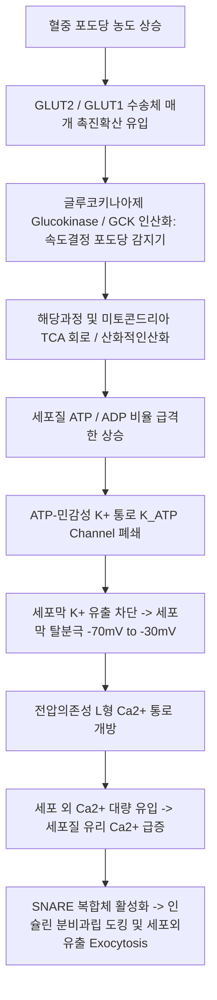
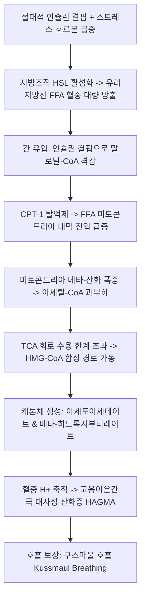
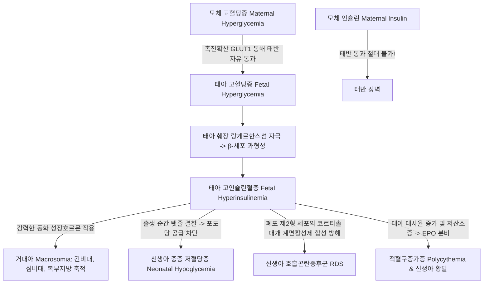

# Netter Endocrine Day 05: 췌장 및 당뇨병 (Pancreas & Diabetes) — 인슐린 분비·대사 파탄·합병증·임신성당뇨·인슐리노마 (pp. 129–151)

> 📖 **원서 출처**: [The Netter Collection - Volume 2, The Endocrine System.pdf (pp. 129-151)](https://drive.google.com/file/d/1TnVzK8w2Nm2lU3SzGlFBLguBf8pjaMkt/view?usp=drivesdk)
> 🏷️ **범위**: Section 5: Pancreas (Plate 5-1 ~ Plate 5-23, 총 23개 플레이트 전수 수록)
> 📌 **핵심 테마**: 췌장의 후복막 해부학 및 혈관망, 랑게르한스섬 4대 내분비 세포 구성(β, α, δ, PP), 포도당 유입과 $K_{\text{ATP}}$ 통로 폐쇄를 통한 인슐린 분비 분자 기전, 인슐린 수용체 신호전달(PI3K-Akt 대사 경로 vs MAPK 유사분열 경로), 탄수화물·지질·단백질 대사 조절, 인슐린 결핍의 병태생리(풍요 속의 기아)와 당뇨병성 케톤산증(DKA) 초응급 프로토콜, 제1형 당뇨병(자가면역성 랑게르한스섬염) vs 제2형 당뇨병(인슐린 저항성, 아밀로이드 침착 및 HHS), 4대 미세혈관/대혈관 합병증(당뇨망막병증, 키멜스틸-윌슨 결절성 당뇨신증, 당뇨신경병증, 죽상경화증 및 샤르코 당뇨발), 임신성 당뇨병(GDM, 태반 호르몬 및 페데르센 가설), 최신 항당뇨제 약리학(SGLT2i, GLP-1 RA, MDI/CGM), 저혈당증의 감별진단(인슐리노마, 위플 삼징, 72시간 공복시험, 외인성 인슐린 팩티셔스 감별).

---

## 1. 개요 및 마스터 요약 (Executive Summary)

* **췌장의 해부학 및 섬세포 미세구조 (Plates 5-1 ~ 5-3)**:
  * **육안 해부학**: 제1~2요추(L1-L2) 높이의 후복막 장기(미부 제외). 두부(십이지장 C-loop), 경부(SMV/포털정맥 합류부 전방), 체부(복대동맥/좌신정맥 횡단), 미부(비장문 접촉). 복강동맥(GDA $\rightarrow$ 상췌십이지장동맥)과 SMA(하췌십이지장동맥)의 이중 문합망 및 비장동맥 분지에서 혈류 공급.
  * **랑게르한스섬 (Islets of Langerhans)**: 췌장 부피의 1~2%에 불과하나 혈류의 10~15% 수용. 중심부에 **$\beta$-세포 (60~70%, 인슐린·C-펩타이드·아밀린 분비)**가 밀집하고, 변연부에 **$\alpha$-세포 (15~20%, 글루카곤)** 및 **$\delta$-세포 (5~10%, 소마토스타틴)**가 위치. 미세순환이 중심에서 외곽으로 향하는 원심성(Centrifugal) 구조로, 고농도 국소 인슐린이 글루카곤 분비를 억제함.
* **인슐린 분비 및 수용체 신호전달 (Plates 5-4 ~ 5-8)**:
  * **포도당 유도 인슐린 분비**: GLUT2/1 유입 $\rightarrow$ 글루코키나아제(GCK, 분자적 포도당 감지기) 인산화 $\rightarrow$ ATP/ADP 비 증가 $\rightarrow$ **$K_{\text{ATP}}$ 칼륨 통로(Kir6.2 + SUR1) 폐쇄** $\rightarrow$ 세포막 탈분극 $\rightarrow$ 전압의존성 L형 $\text{Ca}^{2+}$ 통로 개방 $\rightarrow$ $\text{Ca}^{2+}$ 유입 $\rightarrow$ 인슐린 분비과립의 세포외유출(Exocytosis).
  * **수용체 신호전달 이원화**: 인슐린 수용체(RTK) 활성화 $\rightarrow$ IRS 인산화 $\rightarrow$ **PI3K - Akt 경로 (GLUT4 세포막 이동, 글리코겐 합성, 당신생 차단, 지질분해 억제)** vs **Ras - Raf - MEK - ERK 경로 (세포 증식 및 유사분열 촉진)**.
* **인슐린 결핍과 당뇨병성 케톤산증 (Plates 5-9 ~ 5-10)**:
  * 인슐린 결핍 시 호르몬민감성지방분해효소(HSL) 탈억제로 유리지방산(FFA)이 간으로 대량 유입. 말로닐-CoA 저하로 **CPT-1 활성화** $\rightarrow$ 미토콘드리아 내 $\beta$-산화 폭증 $\rightarrow$ 아세틸-CoA 축적 $\rightarrow$ 케톤체(**아세토아세테이트, $\beta$-히드록시부티레이트**) 생성.
  * **DKA 치료 3대 원칙**: 대량 생리식염수 수액 공급 $\rightarrow$ **저칼륨혈증 배제(K > 3.3 mEq/L 확인 후 인슐린 투여)** $\rightarrow$ 지속적 정맥 인슐린 주입.
* **제1형 vs 제2형 당뇨병의 병인론 (Plates 5-11 ~ 5-12)**:
  * **제1형 당뇨병**: 유전적 소인(HLA-DR3/DR4-DQ) + 자가항체(anti-GAD65, anti-IA-2, anti-ZnT8)에 의한 자가면역성 **랑게르한스섬염(Insulitis)** $\rightarrow$ $\beta$-세포의 절대적 파괴.
  * **제2형 당뇨병**: 인슐린 저항성 + $\beta$-세포의 진행성 보상 부전. 병리학적으로 **아밀린(IAPP) 섬유 침착에 의한 췌도 아밀로이드증(Islet amyloidosis)**이 특징. 급성 위기로 **고삼투압성 고혈당 상태(HHS)** 호발.
* **만성 혈관 합병증의 병태생리 (Plates 5-13 ~ 5-18)**:
  * 포도당 독성 4대 기전: 폴리올 경로(소르비톨 축적), AGEs 축적 및 RAGE 결합, PKC 활성화, 헥소사민 경로.
  * **망망병증**: 혈관주위세포(Pericyte) 소실 $\rightarrow$ 미세동맥류/삼출물(NPDR) $\rightarrow$ 허혈성 VEGF 분비로 신생혈관 증식, 유리체 출혈, 견인성 망막박리(PDR).
  * **신증**: 사구체 과여과 $\rightarrow$ 미세알부민뇨 $\rightarrow$ **키멜스틸-윌슨 결절(Kimmelstiel-Wilson nodule)** 동반 결절성 사구체경화증. SGLT2i 및 ACEi/ARB가 신보호 효과 발휘.
  * **신경병증 및 당뇨발**: 원위부 대칭성 다발신경병증(장갑-양말형), 자율신경병증(무자각 저혈당증, 기립성 저혈압). **감각 상실 + 말초혈관질환 + 감염 + 샤르코 관절증(Charcot foot)**의 복합 작용.
* **임신성 당뇨병 및 저혈당 종양 (Plates 5-19 ~ 5-23)**:
  * **GDM (페데르센 가설)**: 태반 락토겐(hPL)에 의한 모체 인슐린 저항성 $\rightarrow$ 모체 고혈당의 태반 통과 $\rightarrow$ 태아 고인슐린혈증 $\rightarrow$ **거대아, 신생아 호흡곤란증후군(RDS), 출생 직후 급격한 반동성 저혈당증**.
  * **인슐리노마 (위플 삼징, 72시간 공복시험)**: 저혈당 시 인슐린 $\ge 3\ \mu\text{IU/mL}$, **C-펩타이드 $\ge 0.6\ \text{ng/mL}$ (외인성 인슐린 투여 감별)**, 설포닐우레아 약물 선별검사 음성 확인.

---

## 2. 제1부: 췌장의 해부학, 외분비 기능 및 랑게르한스섬 조직학 (Plates 5-1 ~ 5-3)

### Plate 5-1 | 췌장의 육안 해부학 및 조직학 (Pancreas Anatomy and Histology)
![[Netter_V2_Plate5-1.png]]

#### 위치, 주변 장기 관계 및 혈액 공급망
* **해부학적 위치**: 복강 후벽 제1~2요추(L1-L2) 높이에 가로로 비스듬히 누워 있는 **이차성 후복막 장기 (Retroperitoneal organ)** (단, 비장문으로 진입하는 췌장 미부의 끝부분만 비신인대[Splenorenal ligament] 내 복막에 싸여 있음).
* **4대 해부학적 구역**:
  1. **두부 (Head)**: 십이지장의 C자형 만곡(C-loop) 내에 단단히 결속. 하내측으로 돌출된 **구상돌기 (Uncinate process)**는 상장간막동맥(SMA) 및 상장간막정맥(SMV)의 후방에 쐐기형으로 끼어 있음.
  2. **경부 (Neck)**: 두부와 체부를 잇는 약 2cm의 짧은 협부로, **SMV와 비장정맥이 합류하여 간문맥(Portal vein)을 형성하는 부위의 바로 앞쪽에 위치**.
  3. **체부 (Body)**: 복대동맥, 좌측 신장 및 좌신혈관 전면을 가로지르며 좌상방으로 주행.
  4. **미부 (Tail)**: 비장의 문(Splenic hilum) 및 비장결장인대와 직접 접촉. (비장 절제술 시 미부 손상에 따른 췌장루 발생 위험).
* **췌관 체계**:
  * **주췌관 (Main pancreatic duct of Wirsung)**: 미부에서 시작하여 체부를 관통, 십이지장벽 직전에서 총담관(CBD)과 합류하여 **바터 팽대부 (Ampulla of Vater / Hepatopancreatic ampulla)**를 형성하고 **오디 조임근 (Sphincter of Oddi)**의 조절을 받아 십이지장 대유두(Major duodenal papilla)로 개구.
  * **부췌관 (Accessory pancreatic duct of Santorini)**: 두부 상부에서 분지하여 십이지장 소유두(Minor duodenal papilla)로 독립 개구.
* **동맥 혈류망의 이중 공급 (Celiac trunk & SMA)**:
  * 췌장 두부: **복강동맥 유래 위십이지장동맥(GDA)**의 상전/상후 췌십이지장동맥과 **상장간막동맥(SMA)** 유래 하전/하후 췌십이지장동맥이 아케이드(Arcade)를 형성하여 문합.
  * 췌장 체부 및 미부: **비장동맥 (Splenic artery)**에서 분지하는 배측 췌동맥(Dorsal pancreatic a.), 대췌동맥(Great pancreatic a.), 미측 췌동맥(Caudal pancreatic a.)이 공급.

---

### Plate 5-2 | 췌장의 외분비 기능 (Exocrine Functions of the Pancreas)
![[Netter_V2_Plate5-2.png]]

#### 선방세포의 소화효소 vs 도관세포의 중탄산염 분비
췌장의 98%는 외분비선(Exocrine gland)으로 구성되며, 매일 1.5~2L의 알칼리성 췌액을 분비:
1. **선방세포 (Acinar Cells)**:
   * 피라미드형 장액성 세포로 기저부에 조면소포체가 발달하고 정단부에 **소화효소 분비과립 (Zymogen granules)**을 보유.
   * **단백분해효소 전구체 (Zymogens)**: 트립시노겐(Trypsinogen), 키모트립시노겐, 프로카르복시펩티다아제. (십이지장 미세융모 브러시 변연의 **엔테로펩티다아제 [Enteropeptidase / Enterokinase]**에 의해 트립시노겐이 트립신으로 절단 활성화된 후 다른 전구체들을 연쇄 활성화함).
   * **활성형 효소**: 췌장 아밀라아제(전분 분해), 췌장 리파아제(중성지방 분해), 콜레스타제.
   * **주 조절자**: 십이지장 I세포가 분비하는 **콜레시스토키닌 (CCK)** 및 미주신경의 아세틸콜린(ACh).
2. **도관세포 (Ductal & Centroacinar Cells)**:
   * **CFTR (Cystic Fibrosis Transmembrane Conductance Regulator)** 염소 통로와 $\text{Cl}^-/\text{HCO}_3^-$ 교환수송체를 통해 **고농도의 중탄산염($\text{HCO}_3^-$)**을 분비하여 위산 십이지장 유입 시 강산을 중화(pH 8.0 이상 유지)하고 소화효소의 최적 활성 환경 제공.
   * **주 조절자**: 십이지장 S세포가 강산(pH < 4.5)에 반응하여 분비하는 **세크레틴 (Secretin)** (cAMP 경로 활성화).

---

### Plate 5-3 | 랑게르한스섬의 미세조직학 (Normal Histology of Pancreatic Islets)
![[Netter_V2_Plate5-3.png]]

#### 4대 내분비 세포와 원심성 미세순환 아키텍처
* 췌장 전체에 약 100~200만 개의 랑게르한스섬이 흩어져 있으며, 췌장 미부와 체부에 더 조밀하게 분포:

| 세포 종류 | 구성 비율 | 주요 분포 위치 | 분비 호르몬 | 세포학적 특징 및 과립 구조 | 주요 생리 기능 |
| :--- | :--- | :--- | :--- | :--- | :--- |
| **$\beta$-세포 (Beta cell)** | **60~70%** | **췌도 중심부 (Core)** | **인슐린 (Insulin), C-펩타이드, 아밀린 (IAPP)** | 아연-인슐린 육합체(Hexamer) 결정성 전자조밀 핵(Dense core) | 유일한 혈당 강하 호르몬, 동화작용 촉진 |
| **$\alpha$-세포 (Alpha cell)** | **15~20%** | **췌도 외곽 변연부 (Mantle)** | **글루카곤 (Glucagon)** | 둥글고 전자밀도가 균일한 원형 과립 | 간 글리코겐 분해 및 당신생 촉진 (혈당 상승) |
| **$\delta$-세포 (Delta cell)** | **5~10%** | $\alpha/\beta$ 세포 사이 산재 | **소마토스타틴 (Somatostatin-14)** | 크고 덜 조밀한 미세 과립 | 국소 파라크린(Paracrine) 작용으로 인슐린 및 글루카곤 분비 동시 억제 |
| **PP (F) 세포** | **3~5%** | 주로 췌장 두부/구상돌기 | **췌장 폴리펩타이드 (Pancreatic Polypeptide)** | 작고 불규칙한 과립 | 담낭 수축 억제, 외분비 효소 분비 조절 |

* **원심성 미세순환 (Insulo-Acinar Portal System & Centrifugal Flow)**:
  * 췌도 동맥 모세혈관은 먼저 췌도 **중심부($\beta$-세포 밀집 구역)**로 진입한 후 외곽의 $\alpha, \delta$-세포 구역으로 방사상으로 흘러나감.
  * 따라서 정상 생리에서 $\beta$-세포에서 분비된 **초고농도의 국소 인슐린이 변연부의 $\alpha$-세포를 직접 관류하면서 글루카곤 분비를 강력히 억제**함. (당뇨병에서 $\beta$-세포 손상 시 인슐린 감소와 함께 이 억제 메커니즘이 붕괴되어 고글루카곤혈증이 동반됨).

---

## 3. 제2부: 인슐린 분비의 분자 기전 및 세포 신호전달 (Plates 5-4 ~ 5-8)

### Plate 5-4 | 인슐린 분비의 분자생물학적 기전 (Insulin Secretion)
![[Netter_V2_Plate5-4.png]]

#### 포도당 감지 및 세포외유출(Exocytosis) 캐스케이드
$\beta$-세포막의 수용체가 포도당을 감지하는 것이 아니라, **세포 내로 포도당이 유입되어 대사되는 과정에서 생성된 ATP**가 직접 분비 방아쇠로 작용:



1. **포도당 유입**: 촉진확산 포도당 수송체(GLUT1, 인간 $\beta$-세포)를 통해 세포 내로 진입.
2. **글루코키나아제 (Glucokinase, Hexokinase IV)**:
   * 일반 헥소키나아제와 달리 Km이 생리적 혈당 범위(약 5~8 mmol/L)에 있어 혈당 농도 변화에 비례하여 반응 속도가 변하는 **생체 포도당 감지기 (Glucose sensor)**. (GCK 기능상실 돌연변이는 MODY2 유발).
3. **$K_{\text{ATP}}$ 칼륨 통로의 폐쇄**:
   * 내향정류 칼륨 통로인 **Kir6.2** 4개와 설포닐우레아 수용체인 **SUR1** 4개로 구성된 옥타머 복합체.
   * 세포질 ATP가 Kir6.2에 결합하면 통로가 닫히며 $\text{K}^+$ 유출이 억제됨 $\rightarrow$ 세포막 탈분극.
   * *약리학*: 경구 혈당강하제인 **설포닐우레아(Glimepiride 등)** 및 글리니드(Meglitinides)는 SUR1에 직접 결합하여 $K_{\text{ATP}}$ 통로를 강제로 폐쇄시킴으로써 포도당 대사와 무관하게 인슐린 분비를 유도.
4. **이중 위상 인슐린 분비 (Biphasic Release)**:
   * **제1위상 (1st phase, 3~5분 내 급증 후 10분 내 종료)**: 세포막에 미리 결합해 있던 즉각방출 풀(Readily Releasable Pool, RRP) 과립의 일시 방출. (제2형 당뇨병에서 가장 먼저 소실되는 이상 소견).
   * **제2위상 (2nd phase, 지속적 분비)**: 예비 풀(Reserve Pool) 과립의 보충 및 신생 합성 분비.
5. **인크레틴 효과 (Incretin Effect)**:
   * 동일한 양의 포도당을 정맥 주사할 때보다 경구 섭취할 때 인슐린 분비량이 2~3배 폭발적으로 증가하는 현상.
   * 소장 L세포의 **GLP-1** 및 K세포의 **GIP**가 $\beta$-세포의 Gs 결합 수용체에 결합 $\rightarrow$ cAMP-PKA 신호전달을 통해 포도당 의존성 인슐린 분비를 증폭시킴.

---

### Plate 5-5 | 인슐린의 생물학적 작용 및 수용체 신호전달 (Actions of Insulin)
![[Netter_V2_Plate5-5.png]]

#### 인슐린 수용체(IR) 및 하위 신호전달계 (PI3K vs MAPK)
인슐린 수용체는 세포 외 2개의 $\alpha$-소단위체와 세포막 관통형 2개의 $\beta$-소단위체가 이황화결합으로 연결된 이형사량체($\alpha_2\beta_2$) **수용체 티로신 키나아제 (RTK)**:
* **신호전달 이원화**:
  1. **PI3K - Akt (PKB) 경로 (주요 대사 조절 경로)**:
     * 인슐린 결합 $\rightarrow$ $\beta$-소단위체 자가인산화 $\rightarrow$ **IRS-1/2**의 티로신 인산화 $\rightarrow$ **PI3K (Phosphoinositide 3-kinase)** 활성화 $\rightarrow$ $\text{PIP}_3$ 생성 $\rightarrow$ **PDK1**이 **Akt (Protein Kinase B)**를 인산화하여 활성화.
     * **골격근 및 백색지방**: 세포 내 소포에 보관되어 있던 **GLUT4 수송체 소포의 세포막 트랜스로케이션(Translocation)**을 유도하여 포도당 흡수 촉진.
     * **간 (당 대사)**: GSK-3를 불활성화하여 **글리코겐 합성효소(Glycogen synthase) 활성화**. 전사인자 **FoxO1을 인산화하여 핵 밖으로 배출**시킴으로써 PEPCK, G6Pase 등 **당신생(Gluconeogenesis) 핵심 효소 전사를 전면 차단**.
     * **지방 (지질 대사)**: SREBP-1c를 통해 지방산 신생합성 촉진. **호르몬민감성지방분해효소(HSL)를 탈인산화 억제**하여 중성지방 분해(Lipolysis)를 원천 차단.
  2. **Ras - Raf - MEK - ERK (MAPK) 경로 (세포 성장 및 혈관 경로)**:
     * Grb2 - SOS 복합체를 통한 Ras 활성화 $\rightarrow$ 세포 증식, 유전자 전사, 혈관 평활근 비대 유도. (인슐린 저항성 상태에서 PI3K 대사 경로는 차단되지만 MAPK 경로는 보존되어 과인슐린혈증이 죽상경화증을 가속화함).

---

### Plates 5-6, 5-7, 5-8 | 중간 대사 생화학 (Glycolysis, TCA Cycle, Glycogen Metabolism)
![[Netter_V2_Plate5-6.png]] ![[Netter_V2_Plate5-7.png]] ![[Netter_V2_Plate5-8.png]]

#### 해당과정, 구연산 회로 및 글리코겐 대사의 인슐린 의존적 조절
* **해당과정 (Glycolysis, Plate 5-6)**:
  * 율속 단계: 포스포프룩토키나아제-1 (**PFK-1**).
  * 인슐린은 간에서 이중 기능 효소(PFK-2/FBPase-2)의 키나아제 도메인을 탈인산화 활성화하여 강력한 알로스테릭 활진 물질인 **프룩토오스-2,6-이중인산 (F-2,6-BP)** 생성을 급증시킴 $\rightarrow$ PFK-1을 극대화하여 해당과정 촉진.
* **TCA 회로 및 산화적 인산화 (TCA Cycle, Plate 5-7)**:
  * 피루브산 탈수소효소 복합체(PDH)를 통해 아세틸-CoA로 산화 진입. 아세틸-CoA는 옥살로아세테이트(OAA)와 축합하여 구연산(Citrate)을 형성하며 회로 가동.
* **글리코겐 대사 스위치 (Glycogen Metabolism, Plate 5-8)**:
  * **합성 (Insulin state)**: 인슐린 매개 단백질 인산분해효소-1(PP1) 활성화 $\rightarrow$ **글리코겐 합성효소(Glycogen synthase) 탈인산화 (활성화)** $\rightarrow$ 포도당을 글리코겐으로 중합 저장.
  * **분해 (Glucagon/Epinephrine state)**: cAMP-PKA 경로 $\rightarrow$ **글리코겐 분해효소(Glycogen phosphorylase) 인산화 (활성화)** $\rightarrow$ 글리코겐을 포도당-1-인산으로 신속 분해.

---

## 4. 제3부: 인슐린 결핍의 병태생리 및 당뇨병성 케톤산증(DKA) (Plates 5-9 ~ 5-10)

### Plate 5-9 | 인슐린 결핍의 전신 대사 파탄 (Consequences of Insulin Deprivation)
![[Netter_V2_Plate5-9.png]]

#### "풍요 속의 기아 (Starvation in the Midst of Plenty)"
혈액 내에는 고농도의 포도당이 넘쳐나지만 세포 내로 유입되지 못해, 세포는 기아 상태로 인식하고 극단적인 이화작용(Catabolism)을 가동:
1. **지방 조직 (극단적 지방분해)**:
   * HSL 탈억제로 저장 중성지방이 글리세롤과 유리지방산(FFA)으로 급격히 분해되어 혈중으로 유출.
2. **골격근 (극단적 단백분해)**:
   * 근육 단백질이 아미노산(알라닌, 글루타민)으로 분해되어 간으로 방출.
3. **간 (억제되지 않는 포도당 및 케톤 방출)**:
   * 아미노산과 글리세롤을 원료로 당신생(Gluconeogenesis)과 글리코겐 분해를 멈추지 않고 가동하여 초고혈당 유발.
4. **신장 (삼투성 이뇨와 전해질 소실)**:
   * 혈당이 신장 세뇨관 역치(약 180 mg/dL)를 초과하면 소변으로 당이 유출(**당뇨, Glucosuria**).
   * 포도당의 삼투 작용으로 수분, $\text{Na}^+, \text{K}^+, \text{Mg}^{2+}, \text{PO}_4^{3-}$가 대량 소실되며 **중증 탈수(Dehydration)와 저혈량성 쇼크** 유발.

---

### Plate 5-10 | 당뇨병성 케톤산증 (Diabetic Ketoacidosis, DKA)
![[Netter_V2_Plate5-10.png]]

#### 케톤체 생성 기전 및 초응급 4단계 표준 치료 프로토콜



* **DKA 진단 3대 기준**:
  1. 고혈당: 혈장 포도당 **$> 250\ \text{mg/dL}$**.
  2. 대사성 산증: 동맥혈 **$\text{pH} < 7.30$**, 혈청 **$\text{HCO}_3^- < 18\ \text{mEq/L}$**, **고음이온간극 (Anion Gap $> 12\ \text{mEq/L}$)**.
  3. 케톤혈증 / 케톤뇨: 혈청 또는 요중 케톤체 양성 ($\beta$-히드록시부티레이트 측정 권장).
* **임상 증상**: **쿠스마울 호흡 (Kussmaul breathing)**(산증 보상을 위한 깊고 빠른 호흡), 호흡 시 아세톤의 달콤한 과일 냄새(Fruity breath), 오심, 구토, 극심한 복통(가성 복막염 소견), 의식 혼돈.
* **표준 응급 치료 프로토콜 (Golden Rules)**:
  1. **수액 치료 (최우선)**: 첫 1시간 동안 $0.9\%$ 생리식염수(NS) 1~1.5 L를 급속 주입하여 혈관내 용적 복원. 이후 교정 나트륨에 따라 $0.45\%$ 또는 $0.9\%$ NS를 250~500 mL/hr로 유지. (혈당이 $200\ \text{mg/dL}$에 도달하면 **5% 포도당 수액[D5W]을 병용 투여**하여 저혈당 및 급격한 삼투압 저하로 인한 뇌부종 방지).
  2. **칼륨 보충 (절대 원칙)**:
     * 혈청 $\text{K}^+ < 3.3\ \text{mEq/L}$인 경우: **인슐린 투여를 전면 보류하고, 먼저 정맥 칼륨 수액을 투여하여 $\text{K}^+ > 3.3$으로 회복된 후 인슐린 시작** (인슐린이 $\text{K}^+$을 세포 내로 이동시켜 치명적 심실성 부정맥 유발 위험).
     * $\text{K}^+$ 3.3~5.2 mEq/L: 수액 1L당 20~30 mEq의 KCl을 섞어 투여하며 인슐린 주입.
  3. **인슐린 투여**: 속효성(Regular) 인슐린 0.1 U/kg IV 볼루스 후 0.1 U/kg/hr 지속 주입 (시간당 혈당 50~75 mg/dL 강하 목표).
  4. **회복 판정 및 피하 전환**: 혈당 <200 mg/dL 도달 및 (HCO3 $\ge 15$, 정맥혈 pH > 7.3, AG 정상화) 달성 시 케톤산증 해소 판정. **정맥 인슐린 중단 2시간 전에 반드시 피하 기저 인슐린을 선행 투여(Overlap)**해야 반동성 고혈당/DKA 재발 방지.

---

## 5. 제4부: 제1형 및 제2형 당뇨병의 비교 병태학 (Plates 5-11 ~ 5-12)

### Plate 5-11 | 제1형 당뇨병 (Type 1 Diabetes Mellitus)
![[Netter_V2_Plate5-11.png]]

### Plate 5-12 | 제2형 당뇨병 (Type 2 Diabetes Mellitus)
![[Netter_V2_Plate5-12.png]]

#### 제1형 vs 제2형 당뇨병 병태생리 완전 비교

| 비교 항목 | 제1형 당뇨병 (T1DM) | 제2형 당뇨병 (T2DM) |
| :--- | :--- | :--- |
| **발병 기전** | **자가면역에 의한 $\beta$-세포의 절대적 파괴** | **말초 인슐린 저항성 + $\beta$-세포 분비 보상 부전** |
| **호발 연령 및 체형** | 소아·청소년기 호발, 마른 체형 | 성인·중장년층 호발, 비만/과체중 (80~90%) |
| **유전적 연관성** | **HLA-DR3-DQ2, HLA-DR4-DQ8** 유전자 다형성 | 다인자 유전 (TCF7L2 등), 가족력 기여도 매우 큼 (일란성 쌍둥이 일치율 70~90%) |
| **자가항체** | **양성 (>90%)**: **anti-GAD65, anti-IA-2, anti-ZnT8, IAA** | **음성** |
| **췌도 병리학** | **랑게르한스섬염 (Insulitis)**: CD8+ T세포 침윤 $\rightarrow$ $\beta$-세포 자멸사 | 림프구 침윤 없음. **아밀린(IAPP) 침착에 의한 췌도 아밀로이드증 (Islet amyloidosis)** |
| **내인성 인슐린 / C-펩타이드** | **극도로 저하 또는 검출 불가 (결핍)** | 초기 정상 또는 보상적 상승, 후기 점진적 저하 |
| **급성 대사성 위기** | **당뇨병성 케톤산증 (DKA)** 흔함 | **고삼투압성 고혈당 상태 (HHS)** 흔함 |
| **초기 약물 치료** | **평생 필수적 인슐린 대체요법 (MDI 또는 인슐린 펌프)** | 생활습관 교정 + 경구 혈당강하제 (Metformin, SGLT2i, GLP-1 RA 등) |

#### 고삼투압성 고혈당 상태 (HHS, Hyperosmolar Hyperglycemic State)의 특성
* 제2형 당뇨병 고령 환자에서 감염, 심근경색, 뇌졸중 등에 의해 촉발.
* **검사 소견**: 초고혈당(**$> 600\ \text{mg/dL}$**), 유효 혈청 삼투압 **$> 320\ \text{mOsm/kg}$**, **심각한 탈수 (체액 결손 8~10 L)**, 동맥혈 pH > 7.30 및 음이온 간극 정상/경미 (케톤산증 거의 없음).
* **케톤산증이 없는 이유**: 잔존하는 미량의 내인성 인슐린이 간의 당신생을 억제하지는 못하지만, **지방조직 HSL의 지방분해를 억제하기에는 충분**하여 케톤체 대량 생성을 차단함.
* 탈수가 극심하여 DKA보다 사망률(10~20%)이 훨씬 높으며, **치료의 핵심은 대량 수액 보충**.

---

## 6. 제5부: 만성 혈관 합병증 (Plates 5-13 ~ 5-18)

### Plates 5-13, 5-14 | 당뇨망막병증 및 증식성 합병증 (Diabetic Retinopathy)
![[Netter_V2_Plate5-13.png]] ![[Netter_V2_Plate5-14.png]]

#### 비증식성(NPDR) vs 증식성(PDR) 병기
성인 후천성 실명의 가장 흔한 원인:
1. **비증식성 당뇨망막병증 (NPDR)**:
   * 만성 고혈당으로 인한 망막 모세혈관의 **혈관주위세포 (Pericytes) 소실** 및 기저막 비후가 시작.
   * **미세동맥류 (Microaneurysms)**: 첫 안저 소견(작은 붉은 점).
   * **점상/반상 출혈 (Dot-and-blot hemorrhages)** 및 불꽃모양 출혈.
   * **경성 삼출물 (Hard exudates)**: 손상된 모세혈관에서 삼출된 지질 및 단백질 침착물.
   * **면화반 (Cotton-wool spots)**: 전모세혈관 세동맥 폐쇄에 따른 신경섬유층의 허혈성 경색 및 축삭 수송 정체.
   * **당뇨황반부종 (Diabetic Macular Edema, DME)**: 중심 시력 저하의 최빈 원인.
2. **증식성 당뇨망막병증 (PDR)**:
   * 광범위한 망막 모세혈관 폐쇄로 조직 허혈 발생 $\rightarrow$ **혈관내피성장인자 (VEGF)** 분비 급증.
   * 시신경유두(NVD) 또는 망막 표면(NVE)에 **비정상적이고 취약한 신생혈관 (Neovascularization) 증식**.
   * 파열 시 안구 내 **유리체 출혈 (Vitreous hemorrhage)** 발생.
   * 섬유성 증식 조직 수축으로 망막이 안저에서 뜯겨 나가는 **견인성 망막박리 (Tractional retinal detachment)** 초래.
   * 홍채 신생혈관(Rubeosis iridis)으로 섬유주가 막혀 안압이 폭발하는 **신생혈관 녹내장**.
* **치료**: 범망막광응고술(PRP), 안구 내 **항-VEGF 항체 주사 (Aflibercept, Ranibizumab)**, 유리체절제술.

---

### Plate 5-15 | 당뇨병성 신증 (Diabetic Nephropathy)
![[Netter_V2_Plate5-15.png]]

#### 키멜스틸-윌슨 결절(Kimmelstiel-Wilson) 및 사구체 혈역학
말기 신질환(ESRD) 투석 도입 원인의 단일 1위:
* **발생 기전**: 고혈당에 의한 사구체 **수출소동맥(Efferent arteriole)의 선택적 수축**이 수입소동맥보다 심하여 사구체 모세혈관 내압(Intraglomerular hypertension) 상승 및 **사구체 초여과 (Hyperfiltration)** 유발.
* **병리학적 특징**:
  1. 사구체 기저막(GBM)의 미만성 비후.
  2. 사구체 메산지움 기질(Mesangial matrix)의 광범위한 증식.
  3. **키멜스틸-윌슨 결절 (Kimmelstiel-Wilson nodules / Nodular glomerulosclerosis)**: 메산지움 기질 내에 형성되는 무세포성의 둥근 층판상(Laminated) PAS 염색 양성 결절. **당뇨병성 신증의 가장 특이적이고 결정적인 병리 소견**.
  4. 수입 및 수출 소동맥 모두의 초자성 동맥경화증(Hyaline arteriolosclerosis).
* **신보호 치료 (Renal Protection)**:
  * **SGLT2 억제제 (Empagliflozin, Dapagliflozin)**: 근위세뇨관 나트륨 재흡수를 차단하여 치밀반(Macula densa)으로의 $\text{Na}^+$ 전달을 정상화 $\rightarrow$ 사구체세뇨관 피드백(TGF)을 복원하여 **수입소동맥을 수축시킴으로써 사구체 내압을 물리적으로 강하시켜 단백뇨 감소 및 신기능 보존**.
  * **ACE 억제제 / ARB**: 수출소동맥을 확장시켜 사구체 내압 완화.

---

### Plate 5-16 | 당뇨병성 신경병증 (Diabetic Neuropathy)
![[Netter_V2_Plate5-16.png]]

#### 다발신경병증, 자율신경병증 및 뇌신경 마비
* **원위부 대칭성 다발신경병증 (DSPN, 최빈도)**:
  * 축삭 수송 장애 및 신경내막 모세혈관 허혈로 **가장 긴 신경 섬유부터 손상**되어 발가락 끝에서 시작하여 상방으로 진행하는 **"장갑-양말형(Stocking-glove pattern)" 감각 저하**.
  * 소섬유 손상(화끈거림, 찌르는 통증, 온도 감각 소실) $\rightarrow$ 대섬유 손상(진동 감각, 고유감각 소실, 아킬레스건 반사 소실, 감각성 운동실조).
* **당뇨병성 자율신경병증 (DAN)**:
  * **심혈관계**: 휴식기 빈맥, 심박변이도(HRV) 소실, 기립성 저혈압, **무증상 무통성 심근경색 (Silent MI)** (치명적!).
  * **위장관**: 위무력증/위마비 (Gastroparesis: 조기 포만감, 식후 구토), 당뇨병성 설사.
  * **비뇨생식기**: 신경인성 방광 (배뇨 장애, 요정체), 발기부전(ED).
  * **대사**: **무자각 저혈당증 (Hypoglycemia unawareness)** (교감신경 경고 반응 결여).
* **단일신경병증**:
  * **제3뇌신경(동안신경) 마비**: 안구운동 장애, 복시, 안검하수가 발생하나 **동공 반사(Pupillary reflex)는 정상 보존됨 (Pupil-sparing)**. (미세혈관 허혈이 신경 중심부를 침범하고 동공을 조절하는 외측 부교감 신경 섬유는 온전하기 때문; 뇌동맥류 압박성 마비와의 핵심 감별점).

---

### Plates 5-17, 5-18 | 대혈관 질환 및 샤르코 당뇨발 (Atherosclerosis & The Diabetic Foot)
![[Netter_V2_Plate5-17.png]] ![[Netter_V2_Plate5-18.png]]

#### 당뇨발(Diabetic Foot)의 4대 복합 기전
1. **감각신경병증**: 보호 감각 소실(LOPS)로 신발 마찰, 못, 화상 등 상처를 인지하지 못함.
2. **운동신경병증**: 족부 내재근 위축으로 족궁이 무너지고 **갈퀴족지 (Claw toe)** 변형 $\rightarrow$ 중족골두 부위에 비정상적인 압력 집중 $\rightarrow$ 굳은살(Callus) 및 피하 궤양 형성.
3. **자율신경병증**: 발의 발한 소실(Anhidrosis)로 피부가 건조하게 갈라져 세균 침투로 제공.
4. **샤르코 신경관절병증 (Charcot Neuropathy / Charcot Foot)**:
   * 자율신경계 혈류 조절 실패로 인한 골 흡수 + 인지하지 못하는 미세 골절 반복.
   * 족근골(Tarsal bones) 붕괴 및 아탈구로 발바닥 중앙이 볼록 튀어나오는 **"흔들의자 바닥 변형 (Rocker-bottom deformity)"** 초래.
5. **말초동맥질환 (PAD)**: 무릎 아래 동맥(전경골, 후경골, 비골동맥)의 광범위한 죽상경화 및 묀케베르그 내측 석회화로 허혈 및 괴사 진행.

---

## 7. 제6부: 임신성 당뇨병, 최신 약물치료 및 인슐리노마 (Plates 5-19 ~ 5-23)

### Plate 5-19 | 임신성 당뇨병 (Diabetes Mellitus in Pregnancy)
![[Netter_V2_Plate5-19.png]]

#### 페데르센 가설(Pedersen Hypothesis) 및 모아(Mother-Fetus) 합병증
* **병태생리**: 임신 중후반기 태반에서 분비되는 **인간 태반 락토겐 (hPL / hCS)**, 프로게스테론, 태반성 성장호르몬, 코르티솔 등이 모체 조직의 강력한 인슐린 저항성을 유도. 정상 산모는 $\beta$-세포 분비를 2~3배 늘려 보상하지만, 보상 실패 시 **임신성 당뇨병(GDM)** 발병.
* **페데르센 가설 (Pedersen's Mechanism)**:



* **산전 당뇨병(Pre-gestational DM)의 특이 합병증**: 임신 초기 기관형성기 고혈당 노출로 인한 기형 발생 — **천골 발육부전증 (Sacral agenesis / Caudal regression syndrome)**(당뇨병 산모에 극도로 특이적), 심장 기형(대혈관 전위), 신경관 결손.

---

### Plates 5-20, 5-21 | 당뇨병의 현대적 치료학 (Treatment of T2DM & T1DM)
![[Netter_V2_Plate5-20.png]] ![[Netter_V2_Plate5-21.png]]

#### 경구 혈당강하제 분류 및 인슐린 집중 치료
* **제2형 당뇨병 핵심 약제 클래스**:
  1. **SGLT2 억제제 (Empagliflozin, Dapagliflozin)**: 근위세뇨관 SGLT2 수용체 억제로 요당 배설. 체중 감소, 혈압 강하, **심부전(HFrEF/HFpEF) 입원 감소 및 신질환 진행 지연(Cardiorenal protection)**. (주의: 정상혈당 DKA 유발 가능).
  2. **GLP-1 수용체 작용제 (Semaglutide, Dulaglutide) 및 Dual GIP/GLP-1 RA (Tirzepatide)**: 인크레틴 작용 증폭, 위 배출 지연, 중추 식욕 억제. **강력한 혈당 강하 및 탁월한 체중 감량, 죽상경화성 심혈관 질환(ASCVD) 사건 예방**.
  3. **메트포르민 (Metformin / Biguanide)**: 간 AMPK 활성화로 당신생 억제. 체중 중립, 저혈당 위험 없음. (eGFR < 30 mL/min 시 젖산산증 위험으로 금기).
  4. **DPP-4 억제제 (Sitagliptin 등)**: 내인성 GLP-1 분해 억제. 혈당 의존적 작용, 저혈당 없음, 체중 중립.
  5. **TZD (Pioglitazone)**: PPAR-$\gamma$ 자극을 통한 인슐린 감작제. (부종, 심부전 악화, 골절 주의).
* **제1형 당뇨병 집중 인슐린 치료**:
  * **다회 인슐린 주사 (MDI)**: 기저 인슐린(Glargine, Degludec - 24시간 평탄한 프로파일) 1회 + 매 식전 초속효성 인슐린(Lispro, Aspart) 3회 투여.
  * **연속혈당측정기 (CGM) 및 인슐린 펌프 (CSII)**: 자동 인슐린 주입(인공 췌장 시스템) 구축.

---

### Plates 5-22, 5-23 | 인슐리노마 및 췌도 β-세포 과형성증 (Insulinoma and β-Cell Hyperplasia)
![[Netter_V2_Plate5-22.png]] ![[Netter_V2_Plate5-23.png]]

#### 위플 삼징 (Whipple's Triad) 및 72시간 공복 확진 시험
* **인슐리노마 (Insulinoma)**: 췌장 신경내분비종양(pNET) 중 최빈도. 90% 이상이 단발성, 크기 <2cm의 양성 선종. (10%는 MEN1 증후군과 동반되어 다발성 발생).
* **위플 삼징 (Whipple's Triad, 저혈당증 진단의 필수 조건)**:
  1. 공복 또는 운동 시 저혈당 증상 (자율신경성: 식은땀, 떨림, 두근거림 / 신경당결핍성: 어지럼, 혼돈, 시야장애, 발작, 혼수).
  2. 증상 발생 시 정맥 혈장 포도당 **$< 55\ \text{mg/dL}$** ($3.0\ \text{mmol/L}$).
  3. 포도당 투여 시 증상의 즉각적인 소실.
* **72시간 입원 공복시험 (Gold Standard Test)**:
  * 저혈당 유발 시점(혈당 <55 mg/dL 및 증상 출현)에 즉시 채혈하여 호르몬 분석:

| 진단 항목 | 정상 생리적 반응 (저혈당 시) | 인슐리노마 (Insulinoma) | 외인성 인슐린 주여 (Factitious) | 설포닐우레아 약물 복용 |
| :--- | :--- | :--- | :--- | :--- |
| **혈장 인슐린** | **$< 3\ \mu\text{IU/mL}$ (완전 억제)** | **$\ge 3\ \mu\text{IU/mL}$ (비적절한 상승)** | **극도로 상승 ($>100\sim1000$)** | 상승 |
| **혈청 C-펩타이드** | **$< 0.2\ \text{nmol/L}$ (억제)** | **$\ge 0.2\ \text{nmol/L}$ ($\ge 0.6\ \text{ng/mL}$)** | **$< 0.2\ \text{nmol/L}$ (완전 억제!)** | **$\ge 0.2\ \text{nmol/L}$** |
| **혈청 프로인슐린** | 저하 | **$\ge 5\ \text{pmol/L}$ (상승)** | 정상 또는 저하 | 상승 |
| **혈중/요중 설포닐우레아** | 음성 | 음성 | 음성 | **양성 (검출됨)** |
| **$\beta$-히드록시부티레이트** | 상승 ($> 2.7\ \text{mmol/L}$) | **$\le 2.7\ \text{mmol/L}$ (억제됨)** | 억제됨 | 억제됨 |

> ⚠️ **Clinical Pearl**:
> 환자가 저혈당으로 내원했을 때 혈청 인슐린이 높다면, **반드시 C-펩타이드(C-peptide)를 확인**해야 합니다.
> 상용 외인성 인슐린 제제는 순수한 인슐린 단백질만 포함하므로 투여 시 C-펩타이드가 음성 피드백으로 억제되어 바닥을 칩니다.
> 만약 **인슐린과 C-펩타이드가 동시에 비정상적으로 높다면**, 이는 인슐리노마이거나 경구 설포닐우레아 약물의 부정 복용(Factitious)입니다. 이때 **소변/혈청 설포닐우레아 약물 선별검사**로 최종 감별합니다.

---

## 8. 제7부: 당뇨병성 합병증 및 내분비 약리 매트릭스 총정리 (Synthesis Matrix)

### 1. 주요 당뇨병성 합병증 감별 매트릭스

| 질환군 | 핵심 병태생리 | 주요 선별 및 진단 검사 | 표준 1차 치료 및 관리 지침 |
| :--- | :--- | :--- | :--- |
| **당뇨망막병증** | 주위세포 소실, 미세혈관 허혈, VEGF 유도 신생혈관 | 산동 안저검사 (연 1회), 광간섭단층촬영(OCT) | 혈당/혈압 조절, 황반부종 시 항-VEGF 안구내 주사, PDR 시 범망막광응고술(PRP) |
| **당뇨병성 신증** | 사구체 초여과, 메산지움 확장, 키멜스틸-윌슨 결절 | 소변 알부민/크레아티닌 비(UACR, 정상 <30 mg/g), eGFR | **SGLT2 억제제 + ACEi/ARB**, 비스테로이드성 MRA (Finerenone) |
| **원위부 대칭성 신경병증** | 소르비톨 축적, 신경내막 허혈, 장갑-양말형 축삭 손상 | 10g 모노필라멘트 검사, 128Hz 음차 진동감각, 핀찌름 | 대증적 신경병증성 통증 조절: **Pregabalin, Duloxetine, Gabapentin** |
| **샤르코 당뇨발** | 보호감각 소실 + 자율신경성 골흡수 + 반복 외상 | 기립 방사선 촬영(골 변형, 탈구), 프로브 뼈 접촉 검사(Probe-to-bone) | **전체 접촉 석고붕대 (TCC)** 체중 부하 차단, 감염 시 외과적 절제 및 항생제 |
| **인슐리노마** | $\beta$-세포 pNET, 비적절한 인슐린 자율 분비 | 72시간 공복시험 (저혈당 시 인슐린/C-펩타이드 동반 상승), EUS | 외과적 핵적출술(Enucleation), 수술 전 **디아족사이드(Diazoxide)**로 통로 개방 |

---

## 9. 제8부: Netter 원서 기반 로컬 이미지 일괄 추출 스크립트 (Python Script)

로컬 환경에서 원서 PDF로부터 Section 5에 해당하는 23개 플레이트 전수 이미지를 추출하여 `첨부파일` 폴더에 옵시디언 규격(`![[Netter_V2_Plate5-X.png]]`)으로 저장하는 완전 자동화 코드입니다:

```python
import fitz  # PyMuPDF
import os

pdf_path = "The Netter Collection - Volume 2, The Endocrine System.pdf"
output_dir = "./헤르메스/책 읽기/Netter_Vol2_내분비계/첨부파일"
os.makedirs(output_dir, exist_ok=True)

doc = fitz.open(pdf_path)

plates_info = [
    ("Plate5-1", "Pancreas Anatomy and Histology"),
    ("Plate5-2", "Exocrine Functions of the Pancreas"),
    ("Plate5-3", "Normal Histology of Pancreatic Islets"),
    ("Plate5-4", "Insulin Secretion"),
    ("Plate5-5", "Actions of Insulin"),
    ("Plate5-6", "Glycolysis"),
    ("Plate5-7", "Tricarboxylic Acid Cycle"),
    ("Plate5-8", "Glycogen Metabolism"),
    ("Plate5-9", "Consequences of Insulin Deprivation"),
    ("Plate5-10", "Diabetic Ketoacidosis"),
    ("Plate5-11", "Type 1 Diabetes Mellitus"),
    ("Plate5-12", "Type 2 Diabetes Mellitus"),
    ("Plate5-13", "Diabetic Retinopathy"),
    ("Plate5-14", "Complications of Proliferative Diabetic Retinopathy"),
    ("Plate5-15", "Diabetic Nephropathy"),
    ("Plate5-16", "Diabetic Neuropathy"),
    ("Plate5-17", "Atherosclerosis in Diabetes"),
    ("Plate5-18", "Vascular Insufficiency in Diabetes: The Diabetic Foot"),
    ("Plate5-19", "Diabetes Mellitus in Pregnancy"),
    ("Plate5-20", "Treatment of Type 2 Diabetes Mellitus"),
    ("Plate5-21", "Treatment of Type 1 Diabetes Mellitus"),
    ("Plate5-22", "Insulinoma"),
    ("Plate5-23", "Primary Pancreatic β-Cell Hyperplasia")
]

print(f"총 {len(plates_info)}개 플레이트 추출 시작...")

for plate_id, plate_title in plates_info:
    num_suffix = plate_id.replace("Plate5-", "")
    search_terms = [f"Plate 5-{num_suffix}", f"5-{num_suffix}", plate_title.lower()]
    
    target_page = None
    for page_num in range(len(doc)):
        text = doc[page_num].get_text().lower()
        if any(term.lower() in text for term in search_terms):
            target_page = page_num
            break
            
    if target_page is not None:
        page = doc[target_page]
        pix = page.get_pixmap(matrix=fitz.Matrix(3.0, 3.0))
        img_filename = f"Netter_V2_{plate_id}.png"
        pix.save(os.path.join(output_dir, img_filename))
        print(f"✅ [추출 성공] {img_filename} (PDF p.{target_page+1})")
    else:
        print(f"⚠️ [미발견] {plate_id}: {plate_title}")

doc.close()
print("=== Section 5 전체 23개 플레이트 이미지 추출 완료 ===")
```

<!-- 보관 태그(1회용·링크오류, 필요시 복원): 인슐린생리, 당뇨병성케톤산증, 당뇨망막병증, 당뇨신증, 당뇨신경병증, 임신성당뇨, 인슐리노마 -->
