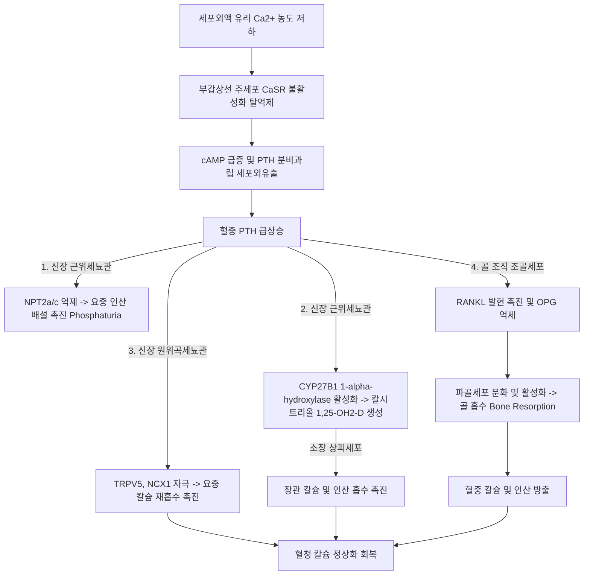
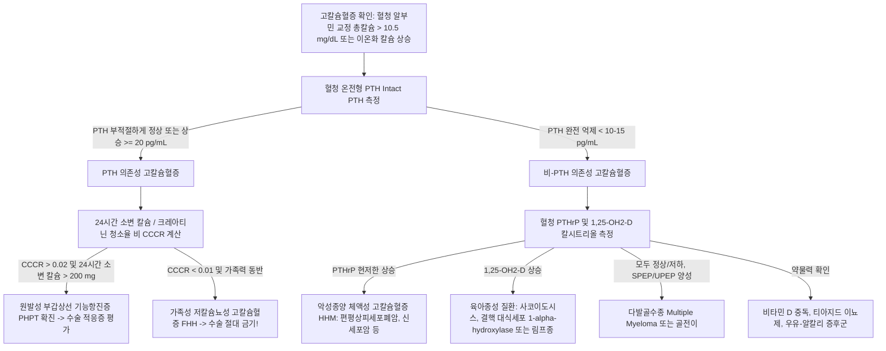

# Netter Endocrine Day 06: 골 및 칼슘 대사 (Bone and Calcium) — 부갑상선·골개형·골다공증·구루병·파젯병·유전성골질환 (pp. 154–180)

> 📖 **원서 출처**: [The Netter Collection - Volume 2, The Endocrine System.pdf (pp. 154-180)](https://drive.google.com/file/d/1TnVzK8w2Nm2lU3SzGlFBLguBf8pjaMkt/view?usp=drivesdk)
> 🏷️ **범위**: Section 6: Bone and Calcium (Plate 6-1 ~ Plate 6-27, 총 27개 플레이트 전수 수록)
> 📌 **핵심 테마**: 부갑상선 미세조직학(주세포·호산세포) 및 CaSR 매개 PTH 분비 분자 기전, 골개형단위(BMU)와 RANKL/RANK/OPG 축, 원발성 부갑상선 기능항진증(PHPT, 결절성 낭성 골염, 고칼슘혈증 5대 증상) 및 비-PTH성 고칼슘혈증 감별, 만성 신부전-미네랄골질환(CKD-MBD, 이차성/삼차성 부갑상선 기능항진증, 혈관석회화), 급성 저칼슘혈증(크보스텍/트루소 징후, QT 연장), 가성 부갑상선 기능저하증(PHP 1a/1b vs PPHP, GNAS 유전체 각인, 올브라이트 유전성 골이영양증), 폐경후/노인성 골다공증 및 척추 압박골절, 구루병/골연화증(비타민 D 결핍, FGF23 매개 X-연관 저인산혈증 구루병, 루저 가골), 골 파젯병(모자이크 병리, ALP 급증, 고박출성 심부전), 제1형 콜라겐 유전 결함 골형성부전증(OI, 청색 공막), 조직비특이성 알칼리인산분해효소 결손 저인산타아제증(HPP).

---

## 1. 개요 및 마스터 요약 (Executive Summary)

* **부갑상선 조직학 및 칼슘 항상성 분자 생리 (Plates 6-1 ~ 6-3)**:
  * **주세포 (Chief cells)**가 PTH를 합성·분비. 세포막의 **칼슘감지수용체 (CaSR, Gq/Gi 결합 GPCR)**는 세포외 이온화 칼슘($\text{Ca}^{2+}$) 농도가 상승하면 활성화되어 PLC 자극 및 cAMP 억제를 통해 **PTH 분비를 억제**함.
  * **PTH 작용 3대 축**:
    1. **골**: 조골세포의 PTH1R에 결합하여 **RANKL 발현 증가 및 OPG 감소** $\rightarrow$ 파골세포 분화/활성화 $\rightarrow$ 골 흡수 및 혈중 $\text{Ca}^{2+}/\text{PO}_4^{3-}$ 방출.
    2. **신장**: 근위세뇨관의 NPT2a/c 억제 $\rightarrow$ **인산 배설 (Phosphaturia)**; 원위곡세뇨관의 TRPV5/NCX1 촉진 $\rightarrow$ **칼슘 재흡수**; 근위세뇨관 **$1\alpha$-수산화효소 (CYP27B1)** 자극 $\rightarrow$ 칼시트리올 합성 촉진.
    3. **장관**: 칼시트리올을 통한 간접적 칼슘/인 흡수 촉진.
* **원발성 vs 이차성/삼차성 부갑상선 기능항진증 (Plates 6-4 ~ 6-9)**:
  * **원발성 (PHPT, 선종 85%)**: 고칼슘혈증 + 부적절하게 높거나 정상인 PTH + 저인산혈증 + 고인산뇨증. 중증 시 섬유성 낭성 골염(Brown tumor). **가족성 저칼슘뇨성 고칼슘혈증 (FHH, CaSR 불활성화 변이, CCCR < 0.01, 수술 금기)**과의 감별 필수.
  * **이차성 (Secondary HPT)**: 만성 신질환(CKD)으로 인한 인산 정체 + 칼시트리올 결핍 $\rightarrow$ 지속적 저칼슘혈증이 양측 4개 부갑상선의 미만성 과형성 유도 (저Ca/정상Ca, 고PO4, 초고PTH).
  * **삼차성 (Tertiary HPT)**: 장기간의 이차성이 자율적 결절성 증식으로 변환되어 고칼슘혈증 발생.
* **저칼슘혈증 및 가성 부갑상선 기능저하증 (Plates 6-10 ~ 6-13)**:
  * **급성 저칼슘혈증**: 신경근 흥분성 폭증 $\rightarrow$ **테타니(Tetany)**, **크보스텍 징후(Chvostek sign)**, **트루소 징후(Trousseau sign)**, 심전도 **QT 간격 연장**.
  * **가성 부갑상선 기능저하증 (PHP, GNAS 유전자 결함)**: PTH 표적 장기 저항성 (저Ca, 고PO4, 고PTH).
    * **PHP 1a**: 모계 유전, 다발성 호르몬 저항성(PTH, TSH, LH/FSH) + **올브라이트 유전성 골이영양증 (AHO, 둥근 얼굴, 저신장, 제4/5중수골 단축)**.
    * **가성-가성 부갑상선 기능저하증 (PPHP)**: 동일 변이의 부계 유전, **AHO 신체 표현형은 있으나 호르몬 저항성은 정상** (조직 특이적 각인).
* **골다공증 및 골연화증/구루병 (Plates 6-14 ~ 6-22)**:
  * **골다공증 (Osteoporosis)**: 에스트로겐 결핍(파골세포 수명 연장 및 RANKL 증가) 및 노화에 따른 골소실. T-score $\le -2.5$. 비스포스포네이트, 데노수맙(RANKL 억제), 테리파라타이드(간헐적 PTH 동화제), 로모소주맙(항-스클레로스틴) 치료.
  * **구루병 (소아) vs 골연화증 (성인)**: 유골(Osteoid)의 무기질화 결함. 비타민 D 결핍 또는 신장 인산 소실(**FGF23 과다에 의한 X-연관 저인산혈증 구루병 XLH, Burosumab 표적치료**). 성인 X-선상 **루저 가골 (Looser's zones / Pseudofractures)** 특징.
* **골 파젯병, 골형성부전증 및 저인산타아제증 (Plates 6-23 ~ 6-27)**:
  * **골 파젯병 (Paget disease)**: 거대 파골세포에 의한 골흡수 폭증 $\rightarrow$ 무질서한 골생성 $\rightarrow$ 조직학적 **모자이크 패턴 (Mosaic / Jigsaw puzzle pattern)**, 혈청 **알칼리인산분해효소 (ALP) 단독 급증**, 골통, 두개골 비대, 신경압박, 고박출성 심부전. 1차 치료는 졸레드론산.
  * **골형성부전증 (OI)**: 제1형 콜라겐(COL1A1/COL1A2) 변이. 잦은 골절, **청색 공막 (Blue sclerae)**, 상아질형성부전증, 청력 소실.
  * **저인산타아제증 (HPP)**: ALPL 유전자 변이로 조직비특이성 ALP(TNAP) 결손. 무기질화 억제인자인 피로인산(PPi) 축적. **ALP의 비정상적 저하**가 결정적 홀마크. 효소대체요법(Asfotase alfa) 치료.

---

## 2. 제1부: 부갑상선 조직학, 호르몬 생리 및 골개형 단위 (Plates 6-1 ~ 6-3)

### Plate 6-1 | 정상 부갑상선의 조직학 (Histology of the Normal Parathyroid Glands)
![[Netter_V2_Plate6-1.png]]

#### 발생학적 기원 및 세포학적 구성
* **발생 및 해부학적 위치**:
  * **상부 부갑상선 (Superior pair, 2개)**: 제4인두낭(4th pharyngeal pouch)에서 기원. 갑상선 상·중엽 후면 결절 부근에 비교적 일정하게 위치.
  * **하부 부갑상선 (Inferior pair, 2개)**: 제3인두낭(3rd pharyngeal pouch)에서 흉선(Thymus)과 함께 기원하여 흉선-부갑상선 관로를 따라 하강. 발생학적 이동 거리가 길어 **위치 변이가 매우 심함** (갑상선 하극, 갑상선 실질 내, 흉선 조직 내, 전종격동 등 이소성 위치 빈발).
* **세포학적 구성**:
  1. **주세포 (Chief cells)**:
     * 부갑상선 실질의 대다수(80~90%)를 차지하는 기능적 핵심 세포.
     * 크기가 작고(6~8 $\mu\text{m}$), 둥근 중심핵과 글리코겐 및 지질이 풍부한 엷은 호산성 세포질을 가짐.
     * **부갑상선호르몬 (PTH)**을 합성, 저장 및 분비.
     * 세포막에 **칼슘감지수용체 (CaSR)**를 발현하여 혈중 칼슘 농도를 실시간 감시.
  2. **호산세포 (Oxyphil cells)**:
     * 사춘기 이후 출현하여 연령 증가에 따라 수와 군집이 증가.
     * 주세포보다 크며(12~18 $\mu\text{m}$), 세포질 전체가 **미토콘드리아(Mitochondria)로 가득 차 있어** H&E 염색상 짙은 호산성(붉은색)으로 염색됨.
     * 과거에는 노화된 비활성 세포로 간주되었으나, 소량의 PTH 및 대사 활성을 가짐이 규명됨.
  3. **간질 지방 조직 (Stromal fat)**: 사춘기 이후 침착되기 시작하여 성인에서 전체 실질 용적의 약 30~50%를 차지. (부갑상선 선종이나 과형성증 발생 시 이 간질 지방이 급격히 소실되는 것이 중요한 병리학적 감별점).

---

### Plate 6-2 | 부갑상선의 생리학 및 CaSR 작용 기전 (Physiology of the Parathyroid Glands)
![[Netter_V2_Plate6-2.png]]

#### 칼슘감지수용체(CaSR)와 PTH 분비의 역상관관계
일반적인 내분비선과 달리, 부갑상선 주세포는 **자극 물질(칼슘)이 결합했을 때 분비가 억제되는 독특한 음성 조절 메커니즘**을 가짐:
1. **고칼슘혈증 상태 (CaSR 활성화 $\rightarrow$ PTH 억제)**:
   * 세포외액의 이온화 $\text{Ca}^{2+}$이 주세포막의 **CaSR**에 결합.
   * **Gq 경로 활성화**: Phospholipase C (PLC) 자극 $\rightarrow$ $\text{IP}_3$ 및 DAG 생성 $\rightarrow$ 세포질 $\text{Ca}^{2+}$ 일시 방출.
   * **Gi 경로 활성화**: Adenylate cyclase 억제 $\rightarrow$ 세포질 cAMP 감소.
   * 주세포에서는 **세포질 cAMP 감소와 $\text{IP}_3$ 상승이 인슐린이나 일반 신경세포와 반대로 인산화 효소계를 차단하여 PTH 분비과립의 세포외유출(Exocytosis)을 전면 억제**함.
2. **저칼슘혈증 상태 (CaSR 비활성화 $\rightarrow$ PTH 폭발적 분비)**:
   * $\text{Ca}^{2+}$ 해리 $\rightarrow$ CaSR 신호 차단 $\rightarrow$ 탈억제(Disinhibition)로 Adenylate cyclase 가동 $\rightarrow$ cAMP 급증 $\rightarrow$ 수초~수분 내 저장된 PTH 과립의 폭발적 방출 및 전사 유도.



---

### Plate 6-3 | 골개형 단위 (Bone Remodeling Unit, BMU)
![[Netter_V2_Plate6-3.png]]

#### 조골세포-파골세포 커플링과 RANKL/RANK/OPG 축
골격은 정적인 구조가 아니라 일생 동안 파골세포(골흡수)와 조골세포(골형성)가 조화롭게 협동하는 **골개형 단위 (BMU)**에 의해 지속적으로 교체됨:
1. **파골세포의 골 흡수 기전**:
   * 조골세포/기질세포 표면의 **RANKL**이 파골 전구세포의 **RANK** 수용체에 결합 $\rightarrow$ 다핵 거대 파골세포로 분화 및 활성화.
   * 파골세포는 $\alpha_v\beta_3$ 인테그린을 통해 골 기질에 밀착하여 **밀폐 구역(Sealing zone)** 형성.
   * 파골세포 주름연(Ruffled border)의 액포형 $\text{H}^+$-ATPase를 통해 수소이온을 분비하여 산성 미세환경(pH 4.5)을 조성 $\rightarrow$ 무기질(하이드록시아파타이트) 용해.
   * 리소좀 효소인 **카텝신 K (Cathepsin K)**를 분비하여 유기질(제1형 콜라겐) 분해 $\rightarrow$ **하우쉽와(Howship's lacunae)** 침식 형성.
2. **조골세포의 골 형성 및 무기질화**:
   * 흡수와 바닥에 조골세포가 유입되어 **유골 (Osteoid)** 기질(제1형 콜라겐 90%, 오스테오칼신, 오스테오폰틴)을 분비.
   * 조골세포막의 **조직비특이성 알칼리인산분해효소 (TNAP)**가 피로인산(PPi)을 분해하여 유리 인산을 공급 $\rightarrow$ 칼슘과 결합하여 **하이드록시아파타이트 [$\text{Ca}_{10}(\text{PO}_4)_6(\text{OH})_2$]** 결정으로 무기질화 완결.
3. **조절 분자 축 (RANKL - RANK - OPG & Sclerostin)**:
   * **오스테오프로테게린 (OPG)**: 조골세포에서 분비되는 가용성 유인 수용체(Decoy receptor). RANKL에 대신 결합하여 RANK 활성화를 차단함으로써 골흡수를 억제. (에스트로겐은 OPG 분비를 촉진하고 RANKL을 억제하여 뼈를 보호).
   * **골세포 (Osteocyte)와 스클레로스틴 (Sclerostin)**: 골 기질 내에 갇힌 골세포는 기계적 자극을 감지. 물리적 부하가 없으면 **스클레로스틴(SOST 유전자)**을 분비하여 조골세포의 Wnt/$\beta$-카테닌 신호를 차단함으로써 골 형성을 억제. (항-스클레로스틴 항체인 로모소주맙의 표적).

---

## 3. 제2부: 원발성 부갑상선 기능항진증 및 고칼슘혈증 감별 (Plates 6-4 ~ 6-6)

### Plate 6-4 | 원발성 부갑상선 기능항진증의 병태생리 (Pathophysiology of Primary Hyperparathyroidism)
![[Netter_V2_Plate6-4.png]]

### Plate 6-5 | 원발성 부갑상선 기능항진증의 병리 및 임상상 (Pathology and Clinical Manifestations of Primary Hyperparathyroidism)
![[Netter_V2_Plate6-5.png]]

#### 임상 5징 ("Stones, Bones, Abdominal Groans, Psychic Moans, Fatigue Overtones")
외래에서 발견되는 고칼슘혈증의 가장 흔한 원인(입원 환자에서는 악성종양이 최빈도):
* **병인**: **단일 양성 부갑상선 선종 (Adenoma, 80~85%)**, 4개 선 전체 과형성 (Hyperplasia, 10~15%, MEN1/MEN2A 연관), 부갑상선암 (<1%).
* **다기관 임상 증상**:
  1. **요로계 (Stones)**: **재발성 신결석 (Nephrolithiasis, 수산칼슘석/인산칼슘석)**, 신석회증(Nephrocalcinosis), 다뇨 및 야간뇨(고칼슘혈증에 의한 신성 요붕증 양상).
  2. **골격계 (Bones)**: 골흡수 과다로 인한 골다공증(특히 피질골이 많은 원위 요골 침범), 골통, 병적 골절.
     * **섬유성 낭성 골염 (Osteitis Fibrosa Cystica / von Recklinghausen disease of bone)**: 중증 장기 방치 환자에서 파골세포 과다 증식과 골기질 출혈, 혈철소(Hemosiderin) 침착으로 갈색을 띠는 **갈색종양 (Brown tumor)** 형성.
     * **방사선학적 특징**: **중수골(가운데 손가락) 요측 부위의 골막하 골흡수 (Subperiosteal resorption)**, 두개골의 "소금-후추 뿌린 양상(Salt-and-pepper skull)", 쇄골 외측 단 흡수.
  3. **소화기계 (Abdominal Groans)**: 장운동 저하로 인한 변비, 구역, 식욕부진. 고칼슘혈증이 가스트린 분비를 자극하여 발생하는 **소화성 궤양**, 췌관 칼슘 침착 및 트립시노겐 자가활성화에 의한 **급성 췌장염**.
  4. **신경정신계 (Psychic Moans)**: 무기력증, 만성 피로, 기억력 감퇴, 우울증, 불안, 심하면 혼돈 및 급성 정신병.
  5. **신경근육계 (Fatigue Overtones)**: 근위부 근력 약화, 깊은 힘줄 반사(DTR) 저하.

---

### Plate 6-6 | 고칼슘혈증 원인의 감별진단 프로토콜 (Tests for Differential Diagnosis of Hypercalcemia)
![[Netter_V2_Plate6-6.png]]

#### PTH 의존성 vs 비-PTH 의존성 알고리즘



* **FHH (Familial Hypocalciuric Hypercalcemia)와의 결정적 감별**:
  * CaSR 유전자의 상염색체 우성 불활성화 돌연변이.
  * 신장과 부갑상선이 높은 칼슘을 정상으로 오인하여 **고칼슘혈증에도 불구하고 소변으로 칼슘을 배설하지 않음**.
  * **소변 칼슘/크레아티닌 청소율 비 ($\text{CCCR}$)**:
    $$\text{CCCR} = \frac{\text{Urine Ca} \times \text{Serum Cr}}{\text{Serum Ca} \times \text{Urine Cr}} < 0.01$$
  * *임상적 중요성*: FHH는 무증상이며 말기 장기 손상이 발생하지 않으므로 **부갑상선 절제술을 시행해도 칼슘이 교정되지 않으며 수술의 절대 금기**임. (PHPT는 대개 $\text{CCCR} > 0.02$).

---

## 4. 제3부: 신성 골이영양증 및 이차성/삼차성 부갑상선 기능항진증 (Plates 6-7 ~ 6-9)

### Plate 6-7 | 신성 골이영양증의 병태생리 (Renal Osteodystrophy)
![[Netter_V2_Plate6-7.png]]

### Plate 6-8 | 신성 골이영양증의 골 병변 (Renal Osteodystrophy: Bony Manifestations)
![[Netter_V2_Plate6-8.png]]

### Plate 6-9 | 부갑상선 기능항진증의 부갑상선 조직학 (Histology of Parathyroid Glands in Hyperparathyroidism)
![[Netter_V2_Plate6-9.png]]

#### CKD-MBD의 삼각 고리와 섬유성 골염
만성 신장병(CKD 3~5기) 환자에서 사구체 여과율이 60 mL/min 이하로 떨어지면서 시작되는 대사 파탄:
1. **이차성 부갑상선 기능항진증 (Secondary HPT)의 3대 구동축**:
   * **신장 인산 배설 감소 $\rightarrow$ 고인산혈증 (Hyperphosphatemia)**: 인산이 혈중 칼슘과 직접 침전 결합하여 저칼슘혈증을 유발하고, 부갑상선 세포 증식을 직접 자극.
   * **신장 실질 소실 $\rightarrow$ $1\alpha$-수산화효소(CYP27B1) 결손 $\rightarrow$ 칼시트리올($1,25-(\text{OH})_2\text{-D}$) 결핍**: 장관 칼슘 흡수 격감.
   * **골세포의 FGF23 과다 분비**: 고인산혈증 보상을 위해 분비된 FGF23이 신장 $1\alpha$-수산화효소를 더욱 억제.
   * **결과**: 만성 저칼슘혈증 및 칼시트리올 결핍에 대한 보상 반응으로 4개 부갑상선 전체가 비대해지는 **미만성 주세포 과형성(Diffuse chief cell hyperplasia)** 초래 $\rightarrow$ PTH가 정상치의 수배~수십 배로 폭증.
2. **신성 골이영양증의 골 병변 스펙트럼**:
   * **고회전 골질환 (High-turnover, 섬유성 골염)**: 극단적 PTH 과다로 조골세포와 파골세포가 모두 폭발하여 뼈가 섬유조직으로 대체됨.
   * **저회전 골질환 (Low-turnover, 무형성 골질환 Adynamic bone disease / 골연화증)**: 투석 환자에서 비타민 D 제제나 칼슘 투여로 PTH를 지나치게 억제하거나 알루미늄 독성으로 골 형성이 멈추어 뼈가 부서지기 쉬움.
3. **석회화 방어증 (Calciphylaxis / Calcific Uremic Arteriolopathy, CUA)**:
   * 고칼슘-고인산 곱($\text{Ca} \times \text{P} > 55\sim70$) 환자에서 미세 피하 동맥의 중막 석회화 및 내막 증식, 미세혈전증 발생.
   * 하지와 복부 피하지방에 극심한 통증을 동반하는 자반증, 허혈성 궤양 및 흑색 괴사 발생 $\rightarrow$ 패혈증으로 인한 높은 사망률(50% 이상).
4. **삼차성 부갑상선 기능항진증 (Tertiary HPT)**:
   * 신장 이식을 받거나 수년간의 만성 이차성 자극이 지속되면, 부갑상선의 다클론성 미만성 과형성이 **단클론성 자율 결절성 증식(Monoclonal autonomous nodules)**으로 유전자 돌연변이를 획득.
   * 혈청 칼슘이나 인산 농도 조절과 무관하게 PTH를 무제한 뿜어내어 **고칼슘혈증**으로 전환됨. (치료: 아전 부갑상선 절제술 또는 시나칼셋 Cinacalcet 투여).

---

## 5. 제4부: 부갑상선 기능저하증 및 가성 부갑상선 기능저하증 (Plates 6-10 ~ 6-13)

### Plate 6-10 | 부갑상선 기능저하증의 병태생리 (Pathophysiology of Hypoparathyroidism)
![[Netter_V2_Plate6-10.png]]

### Plate 6-11 | 급성 저칼슘혈증의 임상 소견 (Clinical Manifestations of Acute Hypocalcemia)
![[Netter_V2_Plate6-11.png]]

#### 급성 저칼슘혈증의 신경근 흥분성 증상
세포외액 칼슘 이온은 신경세포막의 전압의존성 나트륨 통로를 안정화시키는 문지기 역할을 함. 칼슘이 결핍되면 나트륨 통로의 활성화 역치가 휴지기 전위 쪽으로 낮아져 경미한 자극에도 신경막이 쉽게 탈분극:
* **잠재성 테타니(Latent tetany) 유발 신체 진찰 2대 징후**:
  1. **크보스텍 징후 (Chvostek sign)**: 이개 전방(귀 앞쪽) 2cm 부위의 안면신경 주행 부위를 손가락 끝으로 가볍게 톡톡 두드릴 때, 동측 입꼬리, 코, 눈 주위 안면근육이 비자발적으로 씰룩거리는 경련(Twitch) 발생.
  2. **트루소 징후 (Trousseau sign, 특이도 >99%로 최고)**: 혈압계 커프를 팔에 감고 환자의 수축기 혈압보다 20 mmHg 높게 가압하여 3분간 상완동맥 허혈을 유발. $\rightarrow$ 신경 흥분성 폭증으로 손목 굴곡, 중수수지관절 굴곡, 지골간관절 신전, 엄지손가락 내전이 일어나 전형적인 산과기형 손 모양(**"산과의사의 손 [Main d'accoucheur]" / Carpopedal spasm**) 출현.
* **중증 급성 증상**: 입 주위(Circumoral) 및 손발가락 끝의 저림과 감각이상, 후두연축(Laryngospasm, 급성 기도폐색 질식 위험), 기관지연축, 전신 경련 발작(Seizures).
* **심전도 (ECG)**: ST 분절 지연으로 인한 **QT 간격 연장 (QT prolongation)** $\rightarrow$ 치명적 심실부정맥(Torsades de pointes) 유발 가능.
* **응급 치료**: **$10\%$ 글루콘산칼슘 (Calcium gluconate) 1~2앰플 (10~20 mL)**을 $5\%$ 포도당 수액 100 mL에 희석하여 10~20분에 걸쳐 서서히 정주.

---

### Plate 6-12 | 가성 부갑상선 기능저하증의 병태생리 (Pathophysiology of Pseudohypoparathyroidism)
![[Netter_V2_Plate6-12.png]]

### Plate 6-13 | 가성 부갑상선 기능저하증 1a형의 임상상 (Clinical Manifestations of PHP Type 1a)
![[Netter_V2_Plate6-13.png]]

#### GNAS 유전자 변이 및 게놈 각인 (Genomic Imprinting)의 유전학
PTH 분비 자체는 정상이거나 상승되어 있으나, 신장과 뼈의 PTH 수용체 하위 신호전달 물질인 **$G_s\alpha$ 소단위체(GNAS 유전자, 20q13.3)**의 결함으로 표적 장기가 호르몬에 반응하지 못하는 유전성 질환:

| 질환 아형 | 변이 대립유전자 기원 | 호르몬 저항성 양상 | 올브라이트 유전성 골이영양증 (AHO) 신체 표현형 | 혈청 생화학 검사 결과 |
| :--- | :--- | :--- | :--- | :--- |
| **가성 부갑상선 기능저하증 1a형 (PHP 1a)** | **모계 (Maternal allele) 유전** | **다발성 저항성**: PTH 저항성, TSH 저항성(갑상선저하), GHRH 저항성(저신장), LH/FSH 저항성(성선기능저하) | **완전 발현 (AHO 양성)** | **저칼슘혈증, 고인산혈증, PTH 현저한 상승** |
| **가성-가성 부갑상선 기능저하증 (PPHP)** | **부계 (Paternal allele) 유전** | **호르몬 저항성 전혀 없음 (정상 내분비 기능!)** | **완전 발현 (AHO 양성)**: 골격 이상 동일 동반 | **정상 칼슘, 정상 인산, 정상 PTH** |
| **가성 부갑상선 기능저하증 1b형 (PHP 1b)** | 모계 GNAS 각인 조절 부위 결함 | **신장 PTH 저항성 단독** (가끔 TSH 경미 저항) | **AHO 신체 기형 없음 (외형 정상)** | 저칼슘혈증, 고인산혈증, PTH 상승 |

* **올브라이트 유전성 골이영양증 (Albright Hereditary Osteodystrophy, AHO) 징후**:
  1. 둥근 얼굴(Round facies) 및 저신장(Short stature), 중심성 비만.
  2. **단지증 (Brachydactyly)**: 특히 **제4 및 제5 중수골(Metacarpals)과 중족골의 조기 골단 융합에 의한 단축**. 주먹을 쥐었을 때 정상적인 너클 돌출 대신 보조개처럼 쑥 들어가는 **아치볼드 징후 (Archibald's sign / Knuckle-knuckle-dimple-dimple)**.
  3. 피하 결절성 골화증(Subcutaneous ossifications), 치아 발육 부전, 지적 장애.
* **조직 특이적 게놈 각인 기전**: 신장 근위세뇨관, 갑상선, 뇌하수체, 생식선에서는 부계 유래 GNAS 대립유전자가 후성유전학적으로 침묵(Silenced)되고 오직 **모계 대립유전자만 발현**됨. 따라서 모계로부터 결함 유전자를 받으면(PHP 1a) 신장에서 Gsα 단백질이 완전히 고갈되어 호르몬 저항성이 발생하지만, 부계로부터 받으면(PPHP) 모계 정상 유전자가 신장에서 정상 발현되므로 생화학적 이상 없이 골격 기형(AHO)만 나타남.

---

## 6. 제5부: 골다공증 및 척추 압박골절 (Plates 6-14 ~ 6-17)

### Plate 6-14 | 골다공증의 발병 기전 (Pathogenesis of Osteoporosis)
![[Netter_V2_Plate6-14.png]]

### Plate 6-15 | 폐경 후 여성 골다공증 (Osteoporosis in Postmenopausal Women)
![[Netter_V2_Plate6-15.png]]

### Plate 6-16 | 남성 골다공증 (Osteoporosis in Men)
![[Netter_V2_Plate6-16.png]]

### Plate 6-17 | 척추 압박골절의 임상 소견 (Clinical Manifestations of Osteoporotic Vertebral Compression Fractures)
![[Netter_V2_Plate6-17.png]]

#### 골다공증의 분류, 진단 및 척추 붕괴
* **정의 및 DEXA 진단 기준 (골밀도 측정)**:
  * 젊은 성인 정상 최대 골량 대비 표준편차인 **T-score** 기준:
    * 정상: $\text{T-score} \ge -1.0$
    * 골감소증 (Osteopenia): $-2.5 < \text{T-score} < -1.0$
    * **골다공증 (Osteoporosis)**: **$\text{T-score} \le -2.5$** (대퇴골경부, 전체대퇴골, 요추 중 최저치 기준) 또는 대퇴골/척추의 취약 골절 발생 시 T-score와 무관하게 진단.
* **제1형 (폐경 후 골다공증) vs 제2형 (노인성 골다공증)**:
  * **제1형 (폐경 후)**: 난소 에스트로겐 고갈 $\rightarrow$ 전염증성 사이토카인(IL-1, IL-6, TNF-$\alpha$) 및 **RANKL 분비 억제 해제, OPG 감소** $\rightarrow$ 파골세포 분화 및 수명 연장으로 폭발적 골흡수. 골교체율이 높은 **해면골(Trabecular bone, 척추 및 요골 원위부)**의 선택적 소실.
  * **제2형 (노인성, 70세 이상 남녀)**: 조골세포 줄기세포의 노화, 성장인자 감소, 신장 비타민 D 합성 저하에 따른 이차성 부갑상선 기능항진증. **피질골과 해면골의 동등한 소실** $\rightarrow$ **대퇴골 근위부(고관절 Hip) 골절** 빈발.
* **척추 압박골절의 연쇄 임상상**:
  * 흉요추 이행부(T11~L2)에서 호발. 가벼운 기침이나 재채기, 물건 들기만으로 척추체의 전방 주(Anterior column)가 붕괴되는 **쐐기형 변형 (Wedge fracture)**.
  * **키 감소 (Loss of height)**: 젊은 시절 대비 4cm 이상 신장 감소.
  * **진행성 흉추 후만증 (Dowager's hump / Kyphosis)**: 흉곽 용적 감소로 인한 제한성 폐질환 및 호흡곤란, 조기 포만감, 복부 팽만.

---

## 7. 제6부: 구루병 및 골연화증 (Plates 6-18 ~ 6-22)

### Plate 6-18 | 영양결핍성 구루병 및 골연화증 (Nutritional-Deficiency Rickets and Osteomalacia)
![[Netter_V2_Plate6-18.png]]

### Plate 6-19 | 가성 비타민 D 결핍성 구루병 (Pseudovitamin D–Deficiency Rickets and Osteomalacia)
![[Netter_V2_Plate6-19.png]]

### Plate 6-20 | 저인산혈증성 구루병 (Hypophosphatemic Rickets)
![[Netter_V2_Plate6-20.png]]

### Plates 6-21, 6-22 | 소아 구루병 및 성인 골연화증의 임상상 (Clinical Manifestations of Rickets and Osteomalacia)
![[Netter_V2_Plate6-21.png]] ![[Netter_V2_Plate6-22.png]]

#### 골다공증 vs 구루병/골연화증의 병리적 차이
* **골다공증**: 뼈의 무기질화는 정상이나, **단위 용적당 골량(유골 기질 + 무기질 전체) 자체가 비례하여 감소**한 상태.
* **구루병/골연화증**: 기질(유골)은 정상적으로 만들어지나, 칼슘 또는 인산 결핍으로 **유골에 석회화(무기질화)가 일어나지 않아 무르고 약한 미석회화 골기질이 쌓이는 질환**.
  * **구루병 (Rickets)**: 성장판(Epiphyseal growth plate)이 닫히기 전의 소아에서 발생 (연골 기질 무기질화 장애).
  * **골연화증 (Osteomalacia)**: 성장판이 닫힌 성인에서 발생.

#### 소아 구루병 vs 성인 골연화증의 임상 및 방사선학적 특징
1. **소아 구루병 (Rickets)**:
   * 두개골: 탁구공처럼 뼈가 눌렸다가 복원되는 **두개로 (Craniotabes)**, 전두골 돌출(Frontal bossing).
   * 흉곽: 늑연골 접합부가 염주알처럼 만져지는 **구루병 염주 (Rachitic rosary)**, 횡격막 부착 부위 함몰(Harrison's groove), 새가슴(Pigeon chest).
   * 사지: 하중 부하로 다리가 휘어지는 **O자형 다리 (내반슬 Genu varum)** 또는 X자형 다리(외반슬 Genu valgum), 손목/발목 관절부 비대.
   * **X-선 소견**: 골간단(Metaphysis)의 컵 모양 패임(Cupping), 술 모양 변형(Fraying), 넓어짐(Splaying).
2. **성인 골연화증 (Osteomalacia)**:
   * 미만성 골통 및 골 압통(골반, 척추, 갈비뼈), 근위부 근력 약화(뒤뚱거리는 오리걸음 Waddling gait).
   * **방사선학적 결정적 징후 — 루저 가골 (Looser's zones / Pseudofractures / Milkman's lines)**: 장골의 인장측 피질에 뼈 장축과 수직으로 가늘게 주행하는 방사선 투과성 띠(미세 피로골절 부위에 미석회화 유골이 차 있는 소견; 대퇴골경부, 치골지, 견갑골, 늑골 호발).
3. **FGF23 매개 X-연관 저인산혈증 구루병 (XLH)**:
   * PHEX 유전자 변이로 골세포의 **FGF23 (Fibroblast Growth Factor 23)** 분비 억제 실패 $\rightarrow$ 혈중 FGF23 급증.
   * 신장 근위세뇨관의 NPT2a/c를 분해하여 **인산의 신장 배설을 폭증시키고(Renal phosphate wasting)**, 신장 $1\alpha$-수산화효소를 억제하여 칼시트리올 합성을 차단.
   * **생화학 소견**: **혈청 인산 현저한 저하, ALP 급증**, 칼슘 정상/경미 저하, PTH 정상/경미 상승, 1,25-(OH)2-D 비정상적 저하/정상.
   * **치료**: 인산염 경구 보충 + 칼시트리올 또는 항-FGF23 단클론항체인 **부로수맙 (Burosumab)** 주사.

---

## 8. 제7부: 파젯병, 골형성부전증 및 저인산타아제증 (Plates 6-23 ~ 6-27)

### Plate 6-23 | 골 파젯병 (Paget Disease of the Bone)
![[Netter_V2_Plate6-23.png]]

### Plate 6-24 | 골 파젯병의 병태생리 및 치료 (Pathogenesis and Treatment of Paget Disease)
![[Netter_V2_Plate6-24.png]]

#### 모자이크 병리, 3단계 진행 및 고박출성 심부전
국소 부위의 조절되지 않는 골개형 가속화로 인해 비정상적으로 비대하고 기형적이며 구조적으로 취약한 뼈가 형성되는 질환 (50세 이상 호발, 골반골, 대퇴골, 요추, 두개골, 경골 침범):
1. **3단계 병리학적 진행**:
   * **1단계 (골용해기 Osteolytic phase)**: 거대하고 기형적인 파골세포(핵이 최대 100개까지 관찰됨)가 통제 불능으로 뼈를 침식 파괴.
   * **2단계 (혼합기 Mixed phase)**: 파골세포의 용해와 조골세포의 보상적 골형성이 미친 듯이 공존. 뼈가 정상적인 층판(Lamellar) 구조를 이루지 못하고 거친 방직골(Woven bone)로 마구 엉켜 침착됨.
   * **3단계 (골경화기 Osteosclerotic / Burned-out phase)**: 세포 활성은 줄어들고 광물화된 무질서한 뼈만 남아 두껍고 단단하지만 부러지기 쉬움.
   * **병리학적 특징**: H&E 염색상 시멘트선(Cement lines)이 불규칙하게 얽혀 모자이크를 이루는 **모자이크 패턴 (Mosaic / Jigsaw puzzle pattern)**.
2. **임상 증상 및 합병증**:
   * 뼈의 통증과 변형: 경골이 전외측으로 휘어지는 **세이버 정강이 (Saber shin)**, 두개골 비대로 모자 치수가 점점 커짐(Increasing hat size), 안면골 침범 사자 얼굴(Leontiasis ossea).
   * 신경 압박: 측두골 침범 및 내이 신경관 압박으로 인한 **감각신경성 난청 (Hearing loss)**.
   * **고박출성 심부전 (High-Output Heart Failure)**: 병변 부위 골격 내에 광범위한 미세 동정맥루(Arteriovenous shunts)가 형성되어 전신 혈관 저항이 급락하고 심박출량이 폭증하여 심부전 유발.
   * **악성 육종 변성 (Paget Sarcoma, <1%)**: 파젯병 부위에 급격한 통증 악화와 연부조직 종괴 발생 $\rightarrow$ 파젯 골육종(Osteosarcoma), 극히 불량한 예후.
3. **생화학 및 치료**:
   * **혈청 칼슘 및 인산은 정상**, 조골세포 활성을 반영하는 **알칼리인산분해효소 (ALP)의 극단적 단독 상승**.
   * **치료**: 파골세포 억제를 위한 강력한 정맥 비스포스포네이트 — **졸레드론산 (Zoledronic acid 5 mg IV 1회 투여)**가 1차 선택제.

---

### Plates 6-25, 6-26 | 골형성부전증 (Osteogenesis Imperfecta)
![[Netter_V2_Plate6-25.png]] ![[Netter_V2_Plate6-26.png]]

#### 제1형 콜라겐 결함 및 실런스(Sillence) 분류
상염색체 우성 유전으로, 신체 골격, 공막, 상아질의 주성분인 **제1형 콜라겐(Type 1 Collagen)**의 알파-1 및 알파-2 사슬을 암호화하는 **COL1A1 또는 COL1A2 유전자 돌연변이**가 본태:
* **실런스 (Sillence) 4대 임상 분류**:
  1. **I형 (경증, 최빈도)**: 양적 결함(Null mutation, 콜라겐 구조는 정상이나 생산량이 50%로 감소). 소아기 경미한 골절 증가, 성인기 골절 감소. **선명한 청색 공막 (Blue sclerae)**, 청소년/성인기 전음성 난청, 정상 신장.
  2. **II형 (주산기 치명형 Perinatal lethal)**: 중증 질적 결함(구조적 글리신 치환). 자궁 내 다발성 골절, 구겨진 장골(Accordion-like crumpled bones), 염주형 늑골, 심각한 소두증 및 폐 형성 부전으로 출생 전후 사망.
  3. **III형 (진행성 변형형 Progressive deforming)**: 가장 심한 생존형 질적 결함. 출생 시부터 다발성 골절, 심각한 사지 변형과 척추측만증, 극심한 왜소증, 휠체어 의존.
  4. **IV형 (중등도)**: 상아질형성부전 동반, 공막은 정상 색조(백색).
* **특이 신체 징후**:
  * **청색 공막 (Blue Sclerae)**: 제1형 콜라겐 결핍으로 안구 공막 섬유층이 얇아져 내부의 색소성 맥락막(Choroid) 혈관이 푸르스름하게 비쳐 보임.
  * **상아질형성부전증 (Dentinogenesis imperfecta)**: 치아 상아질 결함으로 이가 반투명한 황갈색 또는 청회색으로 변색되고 법랑질이 쉽게 박리 부서짐.

---

### Plate 6-27 | 저인산타아제증 (Hypophosphatasia, HPP)
![[Netter_V2_Plate6-27.png]]

#### TNAP 효소 결손과 PPi 축적의 병태생리
상염색체 열성 또는 우성으로 유전되는 희귀 골대사 질환으로, **ALPL 유전자 돌연변이**에 의해 조골세포와 연골세포막의 **조직비특이성 알칼리인산분해효소 (TNAP / TNSALP)** 활성이 결손됨:
1. **분자 병태**:
   * 정상적으로 TNAP는 세포외액의 유기 인산 화합물을 가수분해함.
   * TNAP가 결손되면 기질 물질인 **무기 피로인산 (Inorganic pyrophosphate, PPi)**, **피리독살-5-인산 (PLP, 활성형 비타민 B6)**, **포스포에탄올아민 (PEA)**이 세포외에 대량 축적됨.
   * **PPi는 하이드록시아파타이트 결정 형성 및 성장을 강력하게 방해하는 생체 천연 억제제**임.
   * PPi 축적으로 인해 골 기질에 칼슘과 인이 침착되지 못하여 뼈가 전혀 단단해지지 않는 심각한 무기질화 결함 초래.
2. **임상 스펙트럼**:
   * **주산기/영아기형**: 태내 골격 무기질화 결핍, 흉곽 연화로 인한 호흡부전 사망, 뇌내 비타민 B6 결핍에 따른 **피리독신 반응성 신생아 발작 (Seizures)**.
   * **소아형**: **만 5세 이전에 치근이 흡수되지 않고 온전한 상태로 유치가 조기 탈락 (Premature loss of deciduous teeth with intact roots)**, 구루병양 골격 기형.
   * **성인형**: 재발성 중족골 피로골절, 대퇴골 가골, 관절 연골 석회화증(Chondrocalcinosis / 가성통풍 Pseudogout).
3. **결정적 진단 홀마크**:
   * 구루병이나 골연화증, 부갑상선 기능항진증은 모두 ALP가 수배~수십 배 상승하지만, **HPP는 혈청 알칼리인산분해효소 (ALP) 수치가 기준치 이하로 극단적으로 낮음 (Markedly LOW ALP)**.
   * 혈청 PLP (비타민 B6) 및 요중 PEA 상승 확인.
4. **표적 효소대체요법 (Enzyme Replacement Therapy)**:
   * **아스포타제 알파 (Asfotase alfa)**: 재조합 인간 TNAP 단백질에 뼈 친화성 데카-아스파르트산 펩타이드 꼬리를 융합시킨 제제. 골 표면에 직접 도달하여 PPi를 분해함으로써 골 무기질화를 정상 복원하고 영아기 치명률을 획기적으로 개선.

---

## 9. 제8부: 핵심 감별진단 및 골대사 생화학 매트릭스 총정리 (Synthesis Matrix)

### 1. 골 및 칼슘 대사 질환 핵심 생화학 감별 매트릭스

| 질환명 | 혈청 총/유리 칼슘 ($\text{Ca}^{2+}$) | 혈청 인산 ($\text{PO}_4^{3-}$) | 부갑상선호르몬 (PTH) | 칼시트리올 ($1,25\text{-D}$) | 알칼리인산분해효소 (ALP) | 소변 칼슘 배설량 | 핵심 병태 및 임상 진주 |
| :--- | :--- | :--- | :--- | :--- | :--- | :--- | :--- |
| **원발성 부갑상선 기능항진증 (PHPT)** | **상승** | **저하** (또는 정상 저하) | **상승 / 부적절한 정상** | 상승 | 정상 또는 상승 | **상승** | 단일 선종(85%), 요로결석, 골막하 골흡수, CCCR > 0.02 |
| **가족성 저칼슘뇨성 고칼슘혈증 (FHH)** | **상승** | 정상 또는 저하 | 정상 또는 경미 상승 | 정상 | 정상 | **극단적 저하 (CCCR < 0.01)** | CaSR 불활성화 돌연변이, 무증상, **수술 금기!** |
| **악성종양 체액성 고칼슘혈증 (HHM)** | **극심한 상승** | 저하 | **완전 억제 (<10 pg/mL)** | 저하 | 정상 또는 상승 | 상승 | PTHrP 매개 (폐/신장 편평상피세포암), 불량한 예후 |
| **만성 신질환 이차성 HPT (CKD-MBD)** | 저하 또는 정상 | **현저한 상승** | **초고농도 상승** | **극단적 저하** | 상승 | 저하 | 신장 인산 정체 + CYP27B1 결손, 4선 미만성 과형성 |
| **특발성/수술후 부갑상선 기능저하증** | **저하** | **상승** | **극도로 저하 / 검출불가** | 저하 | 정상 | 저하 | 테타니, 크보스텍/트루소 징후 양성, QT 간격 연장 |
| **가성 부갑상선 기능저하증 1a형 (PHP 1a)** | **저하** | **상승** | **현저한 상승** | 저하 | 정상 | 저하 | GNAS 모계 변이, PTH 수용체 저항성, AHO 골격 기형 |
| **영양성 비타민 D 결핍 골연화증** | 저하 또는 정상 | **저하** | **상승 (이차성)** | 저하 또는 정상 | **현저한 상승** | 저하 | 25-OH-D < 20 ng/mL, 미석회화 유골 축적, 루저 가골 |
| **X-연관 저인산혈증 구루병 (XLH)** | 정상 | **극단적 저하** | 정상 또는 경미 상승 | 저하 또는 부적절한 정상 | **현저한 상승** | **상승 (신장 인산 소실)** | PHEX 변이 $\rightarrow$ FGF23 과다, Burosumab 표적치료 |
| **골 파젯병 (Paget Disease)** | **정상** | **정상** | **정상** | 정상 | **단독 극단적 급증** | 정상 | 모자이크 병리, 세이버 정강이, 두개골 비대, 고박출성 심부전 |
| **골다공증 (Osteoporosis)** | **정상** | **정상** | **정상** | 정상 | **정상** | 정상 | 유골과 무기질이 비례하여 소실, T-score $\le -2.5$ |
| **저인산타아제증 (HPP)** | 정상 또는 상승 | 정상 또는 상승 | 정상 | 정상 | **극단적 저하 (Below normal!)** | 정상 또는 상승 | ALPL 변이, PPi 축적, 유치 조기 탈락, ALP 저하 홀마크 |

---

## 10. 제9부: Netter 원서 기반 로컬 이미지 일괄 추출 스크립트 (Python Script)

로컬 환경에서 원서 PDF로부터 Section 6에 해당하는 27개 플레이트 전수 이미지를 추출하여 `첨부파일` 폴더에 옵시디언 규격(`![[Netter_V2_Plate6-X.png]]`)으로 저장하는 완전 자동화 코드입니다:

```python
import fitz  # PyMuPDF
import os

pdf_path = "The Netter Collection - Volume 2, The Endocrine System.pdf"
output_dir = "./헤르메스/책 읽기/Netter_Vol2_내분비계/첨부파일"
os.makedirs(output_dir, exist_ok=True)

doc = fitz.open(pdf_path)

plates_info = [
    ("Plate6-1", "Histology of the Normal Parathyroid Glands"),
    ("Plate6-2", "Physiology of the Parathyroid Glands"),
    ("Plate6-3", "Bone Remodeling Unit"),
    ("Plate6-4", "Pathophysiology of Primary Hyperparathyroidism"),
    ("Plate6-5", "Pathology and Clinical Manifestations of Primary Hyperparathyroidism"),
    ("Plate6-6", "Tests for the Differential Diagnosis of the Causes of Hypercalcemia"),
    ("Plate6-7", "Renal Osteodystrophy"),
    ("Plate6-8", "Renal Osteodystrophy: Bony Manifestations"),
    ("Plate6-9", "Histology of the Parathyroid Glands in Hyperparathyroidism"),
    ("Plate6-10", "Pathophysiology of Hypoparathyroidism"),
    ("Plate6-11", "Clinical Manifestations of Acute Hypocalcemia"),
    ("Plate6-12", "Pathophysiology of Pseudohypoparathyroidism"),
    ("Plate6-13", "Clinical Manifestations of Pseudohypoparathyroidism Type 1a"),
    ("Plate6-14", "Pathogenesis of Osteoporosis"),
    ("Plate6-15", "Osteoporosis in Postmenopausal Women"),
    ("Plate6-16", "Osteoporosis in Men"),
    ("Plate6-17", "Clinical Manifestations of Osteoporotic Vertebral Compression Fractures"),
    ("Plate6-18", "Nutritional-Deficiency Rickets and Osteomalacia"),
    ("Plate6-19", "Pseudovitamin D–Deficiency Rickets and Osteomalacia"),
    ("Plate6-20", "Hypophosphatemic Rickets"),
    ("Plate6-21", "Clinical Manifestations of Rickets in Childhood"),
    ("Plate6-22", "Clinical Manifestations of Osteomalacia in Adults"),
    ("Plate6-23", "Paget Disease of the Bone"),
    ("Plate6-24", "Pathogenesis and Treatment of Paget Disease of the Bone"),
    ("Plate6-25", "Osteogenesis Imperfecta"),
    ("Plate6-26", "Osteogenesis Imperfecta (cont'd)"),
    ("Plate6-27", "Hypophosphatasia")
]

print(f"총 {len(plates_info)}개 플레이트 추출 시작...")

for plate_id, plate_title in plates_info:
    num_suffix = plate_id.replace("Plate6-", "")
    search_terms = [f"Plate 6-{num_suffix}", f"6-{num_suffix}", plate_title.lower()]

    target_page = None
    for page_num in range(len(doc)):
        text = doc[page_num].get_text().lower()
        if any(term.lower() in text for term in search_terms):
            target_page = page_num
            break

    if target_page is not None:
        page = doc[target_page]
        pix = page.get_pixmap(matrix=fitz.Matrix(3.0, 3.0))
        img_filename = f"Netter_V2_{plate_id}.png"
        pix.save(os.path.join(output_dir, img_filename))
        print(f"✅ [추출 성공] {img_filename} (PDF p.{target_page+1})")
    else:
        print(f"⚠️ [미발견] {plate_id}: {plate_title}")

doc.close()
print("=== Section 6 전체 27개 플레이트 이미지 추출 완료 ===")
```

<!-- 보관 태그(1회용·링크오류, 필요시 복원): 골칼슘대사, 부갑상선, 일차성부갑상선기능항진증, 신성골이영양증, 가성부갑상선기능저하증, 구루병, 골연화증, 파젯병, 골형성부전증, 저인산타아제증 -->
