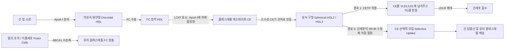
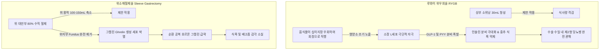

# Netter Endocrine Day 07: 지질 및 영양 (Lipids and Nutrition) — 콜레스테롤·지단백대사·황색종·비타민결핍·리소좀병·비만수술 (pp. 183–210)

> 📖 **원서 출처**: [The Netter Collection - Volume 2, The Endocrine System.pdf (pp. 183-210)](https://drive.google.com/file/d/1TnVzK8w2Nm2lU3SzGlFBLguBf8pjaMkt/view?usp=drivesdk)
> 🏷️ **범위**: Section 7: Lipids and Nutrition (Plate 7-1 ~ Plate 7-27, 총 27개 플레이트 전수 수록)
> 📌 **핵심 테마**: 콜레스테롤 생합성(HMG-CoA 환원효소) 및 장관 흡수(NPC1L1/MTP), LDL 수용체 조절과 PCSK9의 분해 기전, HDL 생성과 콜레스테롤 역수송(ABCA1, LCAT, CETP, SR-BI), 가족성 고콜레스테롤혈증(FH) 및 건황색종, 무베타지단백혈증(MTP 변이, 가시적혈구) 및 탕지에병(ABCA1 변이, 오렌지색 편도), 고중성지방혈증의 발진성 황색종 및 급성 췌장염 위험, 죽상동맥경화증의 발생 기전(oxLDL, 거품세포, 취약 판막), 대사증후군의 병태, 지질강하제 약리학(스타틴, 에제티미브, PCSK9 억제제, 피브레이트), 지용성/수용성 비타민 흡수 및 4대 결핍증(각기병, 펠라그라 4D, 괴혈병, 비타민 A 결핍/비토 반점), 셀리악병의 융모 위축, 스핑고지질증(고셔병 병리, 니만-픽 vs 테이-삭스 황반부 체리적색 반점 감별, 파브리병), 신경성 식욕부진증과 재급식 증후군(저인산혈증), 비만의 병태생리 및 비만대사수술(RYGB, 위소매절제술의 인크레틴/그렐린 기전).

---

## 1. 개요 및 마스터 요약 (Executive Summary)

* **콜레스테롤·지단백 대사 및 청소 경로 (Plates 7-1 ~ 7-4)**:
  * **합성 및 흡수**: 간/소장의 **HMG-CoA 환원효소(HMGCR)**가 율속 효소이며, SREBP-2/SCAP이 세포 내 콜레스테롤을 감지하여 발현 조절. 식관강 콜레스테롤은 소장 융모의 **NPC1L1 수송체(에제티미브 표적)**를 통해 흡수되고, **MTP (Microsomal Triglyceride Transfer Protein)**에 의해 ApoB-48과 함께 킬로미크론(Chylomicron)으로 조립.
  * **LDL 청소 및 PCSK9**: 간세포막의 **LDL 수용체 (LDLR)**가 ApoB-100을 인식하여 세포내유입 후 산성 엔도솜에서 해리되어 최대 100회 재활용. 분비성 단백질인 **PCSK9**은 LDLR에 결합하여 리소좀 분해를 유도함으로써 수용체 재활용을 차단. (항-PCSK9 항체인 Evolocumab/Alirocumab은 LDLR 보존을 통해 혈중 LDL을 50~60% 추가 강하).
  * **HDL 역수송 (Reverse Cholesterol Transport, RCT)**: 말초 대식세포의 **ABCA1** 수송체 $\rightarrow$ 미성숙 ApoA-I로 유리 콜레스테롤 방출 $\rightarrow$ **LCAT**가 콜레스테롤을 에스테르화하여 구형 성숙 HDL 형성 $\rightarrow$ **CETP** 매개 VLDL/LDL로의 전이 또는 **SR-BI** 수용체를 통한 간세포 직접 흡수 및 담즙 배설.
* **유전성 지질 이상 및 황색종증 (Plates 7-5 ~ 7-11)**:
  * **가족성 고콜레스테롤혈증 (FH, Type IIa)**: LDLR, ApoB, PCSK9 기능획득 변이. 조기 관상동맥질환, **아킬레스건 황색종 (Tendon xanthoma)**, 조기 각막환(Arcus juvenilis).
  * **무베타지단백혈증 (Abetalipoproteinemia)**: MTP 결손으로 ApoB 지단백(킬로미크론, VLDL, LDL) 합성 불가. 혈중 지질 바닥, 지용성 비타민 흡수 부전(비타민 E 결핍에 따른 척수소뇌 실조증), 말초혈액도말상 **가시적혈구 (Acanthocytes)**.
  * **탕지에병 (Tangier Disease)**: ABCA1 변이로 HDL 극단적 결핍 (<5 mg/dL), 세망내피계 콜레스테롤 에스테르 축적 $\rightarrow$ **오렌지색 편도 (Enlarged orange tonsils)**, 간비대, 신경병증.
  * **고중성지방혈증 위기 (TG > 500~1000 mg/dL)**: 췌장 리파아제에 의한 유리지방산 방출로 **급성 췌장염** 위험, 둔부/신전부의 **발진성 황색종 (Eruptive xanthomas)**, 안저 **망막지혈증 (Lipemia retinalis)**.
* **죽상경화증, 대사증후군 및 약리학 (Plates 7-12 ~ 7-17)**:
  * **죽상판 형성**: 내피 손상 $\rightarrow$ 내막 내 oxLDL 침착 $\rightarrow$ 대식세포 스캐빈저 수용체(SR-A, CD36)를 통한 무차별 탐식 $\rightarrow$ **거품세포 (Foam cells)** 형성 $\rightarrow$ 지방선조 $\rightarrow$ 평활근 증식 및 섬유성 피막 형성. 피막 파열 시 혈전증 급사.
  * **대사증후군 5대 기준 (복부비만, 고TG, 저HDL, 고혈압, 공복혈당장애 중 3개 이상)**: 내장지방 축적과 인슐린 저항성이 본태. 아디포넥틴 감소.
  * **지질강하제 조합**: 스타틴(1차 약제) + 에제티미브 + PCSK9i. 중성지방 >500 mg/dL 시 췌장염 예방 위해 피브레이트(PPAR-$\alpha$ 촉진제) 최우선.
* **필수 비타민 결핍증 및 영양 질환 (Plates 7-18 ~ 7-27)**:
  * **비타민 B1 (티아민) 결핍**: **습성 각기병 (고박출성 심부전, 부종)** vs **건성 각기병 (말초신경병증)** vs **베르니케-코르사코프 증후군** (포도당 전 반드시 티아민 선행 정주!).
  * **비타민 B3 (나이아신) 결핍 — 펠라그라 (4D)**: **Dermatitis (카살 목걸이 Casal necklace)**, **Diarrhea (소화기 점막염)**, **Dementia (정신병)**, **Death**.
  * **비타민 C 결핍 (괴혈병)**: 프롤린/라이신 수산화 결손 $\rightarrow$ 콜라겐 삼중나선 붕괴 $\rightarrow$ **모낭주위 출혈, 코르크마개 모양 털(Corkscrew hair), 잇몸 출혈**.
  * **비타민 A 결핍**: 로돕신 결핍 **야맹증**, 결막의 **비토 반점 (Bitot's spots)**, 각막연화증.
  * **셀리악병 (Celiac disease)**: 글루텐(글리아딘) 유발 자가면역. anti-tTG IgA 양성, 십이지장 **융모 위축 (Villous atrophy)**, 포진상 피부염.
  * **스핑고지질증 (리소좀 축적병)**:
    * **고셔병 (Gaucher)**: 글루코세레브로시다아제 결손, **구겨진 화장지 양상 고셔 세포**, 간비대, 골통, 에를렌마이어 플라스크 변형.
    * **니만-픽병 (Niemann-Pick)**: 스핑고미엘리나아제 결손, 거품세포, 간비대 + **황반부 체리적색 반점 (Cherry-red spot)**.
    * **테이-삭스병 (Tay-Sachs)**: 헥소사미니다아제 A 결손, 황반부 체리적색 반점 양성이지만 **간비대 없음 (No hepatosplenomegaly)**.
  * **신경성 식욕부진증과 재급식 증후군**: 급격한 탄수화물 섭취 시 인슐린 분비로 인산이 세포 내로 이동하여 **치명적 저인산혈증(Hypophosphatemia)**, 심부전, 부정맥 발생.
  * **비만대사수술**: 루와이 위우회술(RYGB)은 GLP-1/PYY 급증을 통한 당뇨병 극적 완치, 위소매절제술(Sleeve)은 위저부 절제를 통한 **그렐린(Ghrelin) 고갈**로 식욕 억제.

---

## 2. 제1부: 지질 생합성, 흡수 및 지단백 대사 (Plates 7-1 ~ 7-4)

### Plate 7-1 | 콜레스테롤 합성 및 대사 (Cholesterol Synthesis and Metabolism)
![[Netter_V2_Plate7-1.png]]

#### 메발로네이트 경로 및 SREBP-2 전사 피드백
콜레스테롤(27탄소 스테롤)은 세포막 유동성 유지, 담즙산 및 스테로이드 호르몬의 필수 전구물질:
1. **생합성 핵심 경로 (Mevalonate Pathway)**:
   * 세포질에서 2분자의 아세틸-CoA가 축합 $\rightarrow$ 아세토아세틸-CoA $\rightarrow$ HMG-CoA 합성효소에 의해 **HMG-CoA (3-hydroxy-3-methylglutaryl-CoA)** 형성.
   * **율속 단계 (Rate-limiting step)**: 소포체(ER) 막의 **HMG-CoA 환원효소 (HMGCR)**가 2분자의 NADPH를 소모하여 HMG-CoA를 **메발론산 (Mevalonate)**으로 비가역적 환원. (스타틴 계열 약물이 HMGCR의 활성 부위를 경쟁적으로 차단).
   * 메발론산 $\rightarrow$ 이소펜테닐 피로인산(IPP) $\rightarrow$ 게라닐 피로인산 $\rightarrow$ 파르네실 피로인산(FPP) $\rightarrow$ 스쿠알렌(Squalene) $\rightarrow$ 라노스테롤(Lanosterol) $\rightarrow$ 최종 콜레스테롤.
2. **SREBP-2 / SCAP 콜레스테롤 감지 센서**:
   * 소포체 막의 **SCAP (SREBP Cleavage-Activating Protein)**은 막 내 콜레스테롤 농도를 직접 감지.
   * 세포 내 콜레스테롤 고갈 시: SCAP-SREBP-2 복합체가 골지체로 이동 $\rightarrow$ 골지체 단백분해효소(S1P, S2P)에 의해 전사인자 도메인이 절단 방출 $\rightarrow$ 핵 내로 들어가 SRE(Sterol Regulatory Element)에 결합 $\rightarrow$ **HMGCR 및 LDL 수용체(LDLR) 유전자 전사를 폭발적으로 유도**.

---

### Plate 7-2 | 장관 내 콜레스테롤 및 중성지방 흡수 (GI Absorption of Lipids)
![[Netter_V2_Plate7-2.png]]

#### NPC1L1 수송체 및 킬로미크론 조립
1. **중성지방(TG)의 소화 및 흡수**:
   * 담즙산염(Bile salts)에 의해 유화된 식이 중성지방은 췌장 리파아제(Colipase 보조)에 의해 **2-모노아실글리세롤(2-MAG)과 2분자의 유리지방산(FFA)**으로 가수분해되어 미셀(Micelle)을 형성한 후 소장 상피세포로 확산 흡수.
2. **콜레스테롤 흡수와 NPC1L1 수송체**:
   * 장관 내 유리 콜레스테롤은 공장 융모 상피세포 정단막의 **NPC1L1 (Niemann-Pick C1-Like 1)** 수송체를 통해 능동적으로 세포 내로 유입됨. (**에제티미브 [Ezetimibe]**가 NPC1L1을 특이적으로 억제하여 콜레스테롤 장관 흡수를 차단).
   * 세포 내로 들어온 식물성 스테롤(시토스테롤 등)은 **ABCG5/ABCG8** 이종이량체 배출 펌프에 의해 장관 강으로 즉시 다시 뿜어져 나감. (ABCG5/8 변이 시 식물성 스테롤이 체내에 쌓이는 시토스테롤혈증 Sitosterolemia 유발).
3. **킬로미크론 (Chylomicron) 형성 및 분비**:
   * 장세포 소포체에서 ACAT2가 콜레스테롤을 에스테르화하고 DGAT가 중성지방을 재합성.
   * **MTP (Microsomal Triglyceride Transfer Protein)**가 구조 단백질인 **ApoB-48**에 중성지방과 지질을 장착시켜 신생 킬로미크론으로 조립.
   * 림프관(유미관 Lacteals) $\rightarrow$ 흉관(Thoracic duct)을 거쳐 쇄골하정맥을 통해 전신 혈류로 방출.

---

### Plate 7-3 | LDL 수용체 조절 및 PCSK9의 분해 작용 (Regulation of LDLR and Cholesterol Content)
![[Netter_V2_Plate7-3.png]]

#### 수용체 매개 세포내유입과 PCSK9의 치료학적 의의
브라운(Michael Brown)과 골드스타인(Joseph Goldstein) 교수가 규명한 노벨 생리의학상 경로:
1. **LDLR 매개 엔도시토시스**:
   * 간세포막의 **LDL 수용체 (LDLR)**가 순환 혈중 LDL의 **Apolipoprotein B-100 (ApoB-100)**을 특이적으로 인식 결합.
   * 클라스린 피복 소포(Clathrin-coated pits)를 통해 세포 내로 함입.
   * 엔도솜(Endosome)의 산성 환경(pH 5.0~5.5)에서 수용체와 LDL이 해리됨 $\rightarrow$ **LDLR은 손상 없이 세포막으로 돌아가 최대 100회 이상 재활용**되며, LDL 입자는 리소좀으로 이동하여 콜레스테롤과 아미노산으로 완전 분해.
2. **PCSK9 (Proprotein Convertase Subtilisin/Kexin Type 9)의 파괴 작용**:
   * 간세포에서 혈류로 분비되는 세린 단백분해효소.
   * 세포막의 LDLR 세포외 도메인에 비가역적으로 결합.
   * **PCSK9이 결합된 LDLR은 엔도솜 내에서 분리되지 못하고 통째로 리소좀으로 끌려가 비가역적으로 파괴 소멸됨**.
   * *임상적 중요성*: PCSK9 단클론항체(**Evolocumab, Alirocumab**) 또는 siRNA 제제(**Inclisiran**)는 PCSK9 작용을 원천 차단하여 간세포막의 LDLR 밀도를 극대화시킴으로써 혈중 LDL-C을 50~60% 이상 강력하게 제거.

---

### Plate 7-4 | HDL 대사 및 콜레스테롤 역수송 (HDL Metabolism and Reverse Cholesterol Transport)
![[Netter_V2_Plate7-4.png]]

#### ABCA1, LCAT, CETP 및 SR-BI의 분자 기전
말초 조직(특히 혈관벽의 거품세포)에 쌓인 잉여 콜레스테롤을 간으로 되돌려 담즙으로 배설시키는 생체 유일의 죽상경화 방어 회로 (Reverse Cholesterol Transport, RCT):



1. **ABCA1 수송체**: 말초 대식세포 막에서 유리 콜레스테롤과 인지질을 빈 지단백인 **ApoA-I**로 전달. (변이 시 탕지에병 발병).
2. **LCAT (Lecithin-Cholesterol Acyltransferase)**: 혈장 내에서 ApoA-I에 의해 활성화되어 레시틴의 지방산을 콜레스테롤로 넘겨 **콜레스테롤 에스테르 (CE)**를 합성 $\rightarrow$ 평평한 원반형 HDL을 속이 꽉 찬 성숙 구형 HDL로 변환.
3. **CETP (Cholesteryl Ester Transfer Protein)**: 성숙 HDL의 콜레스테롤 에스테르를 ApoB 함유 지단백(VLDL, LDL)으로 전달하고, 대신 중성지방(TG)을 넘겨받는 교환 셔틀.
4. **SR-BI (Scavenger Receptor Class B Type I)**: 간세포 표면에서 HDL 입자를 파괴하지 않고 내부의 콜레스테롤 에스테르만 쏙 뽑아가는 선택적 흡수(Selective uptake) 담당.

---

## 3. 제2부: 고지혈증, 황색종 및 유전성 지질 이상 (Plates 7-5 ~ 7-11)

### Plates 7-5, 7-6, 7-7 | 고콜레스테롤혈증 및 황색종증 (Hypercholesterolemia and Xanthomatosis)
![[Netter_V2_Plate7-5.png]] ![[Netter_V2_Plate7-6.png]] ![[Netter_V2_Plate7-7.png]]

#### 가족성 고콜레스테롤혈증(FH)의 유전학과 황색종 감별
* **가족성 고콜레스테롤혈증 (Familial Hypercholesterolemia, FH / Fredrickson IIa)**:
  * 상염색체 우성 질환으로, **LDLR 유전자 기능상실 돌연변이 (85~90%)**, **ApoB-100 돌연변이 (5~10%)**, **PCSK9 기능획득 돌연변이 (<1%)**가 원인.
  * **이형접합자 (Heterozygote, 인구 250명당 1명)**: 혈중 LDL-C $200\sim400\ \text{mg/dL}$, 30~40대부터 치명적 조기 관상동맥질환(CAD) 발생.
  * **동형접합자 (Homozygote, 인구 16만~100만 명당 1명)**: 혈중 LDL-C **$> 500\sim1000\ \text{mg/dL}$**, 소아기(10~20세 이전)에 심근경색 및 대동맥판막 협착증으로 사망 위험.
* **황색종 (Xanthoma)의 임상적 형태학**:
  1. **건황색종 (Tendon xanthomas, FH의 병변 특이적 홀마크)**: **아킬레스건 (Achilles tendon)** 및 손가락 신전건 부위에 결절성으로 비후 침착. 아킬레스건 방사선/초음파 검사상 두께 9mm 이상 시 진단.
  2. **결절성 황색종 (Tuberous xanthomas)**: 팔꿈치, 무릎 등 압박 부위의 황갈색 통증 없는 결절.
  3. **안검황색종 (Xanthelasma palpebrarum)**: 안검 내측 피부의 부드러운 노란색 플라크 (콜레스테롤이 정상인 사람에서도 나타날 수 있음).
  4. **각막환 (Arcus cornealis / Arcus juvenilis)**: 각막 변연부에 지질 침착으로 생기는 회백색 고리. 만 45세 미만에서 관찰 시 심각한 고콜레스테롤혈증의 강력한 지표.

---

### Plate 7-8 | 무베타지단백혈증 및 탕지에병 (Abetalipoproteinemia and Tangier Disease)
![[Netter_V2_Plate7-8.png]]

#### 극단적 희귀 지단백 결핍증의 분자병리 비교

| 질환명 | 원인 유전자 및 결손 단백질 | 혈청 지질 및 지단백 양상 | 조직 병리학적 특징 | 주요 임상 신경/전신 증상 |
| :--- | :--- | :--- | :--- | :--- |
| **무베타지단백혈증 (Abetalipoproteinemia / Bassen-Kornzweig)** | **MTTP 유전자** (소포체 내 지질전이단백 MTP 결손) | **ApoB 함유 지단백(킬로미크론, VLDL, LDL) 완전 결손!** 혈청 콜레스테롤 <50, TG 검출 불가 | 장 상피세포질에 지질 점적이 꽉 차서 백색으로 팽창 | • 유아기 지방변(Steatorrhea), 성장 장애<br>• **비타민 E 결핍에 따른 척수소뇌 실조증 (실조, 보행장애, 반사 소실)**<br>• 비전형적 망막색소변성증<br>• 말초혈액 도말상 **가시적혈구 (Acanthocytosis)** |
| **탕지에병 (Tangier Disease)** | **ABCA1 유전자** (콜레스테롤 배출 펌프 결손) | **HDL 및 ApoA-I 거의 완전 결손 (<5 mg/dL)!** LDL-C도 40% 수준으로 감소 | 세망내피계 대식세포에 콜레스테롤 에스테르가 가득 차 거품세포 형성 | • **편도가 오렌지색/황갈색으로 거대 비대 (Enlarged Orange Tonsils)** (병변 특이적!)<br>• 간비장비대, 조기 동맥경화증<br>• 척수공동증양 말초신경병증 |

---

### Plates 7-9, 7-10, 7-11 | 고중성지방혈증, 발진성 황색종 및 급성 췌장염 (Hypertriglyceridemia)
![[Netter_V2_Plate7-9.png]] ![[Netter_V2_Plate7-10.png]] ![[Netter_V2_Plate7-11.png]]

#### 고중성지방혈증(HTG)의 2대 치명적 임상 징후
혈청 중성지방 농도가 **$500\sim1000\ \text{mg/dL}$ 이상**으로 폭증할 때 생명을 위협하는 합병증 발현:
1. **급성 췌장염 (Hypertriglyceridemic Pancreatitis)**:
   * 췌장 모세혈관을 통과하는 거대 킬로미크론과 VLDL을 췌장 선방세포의 리파아제가 분해하면서 **초고농도의 유리지방산(FFA)**이 국소 방출됨.
   * 독성 FFA가 혈관 내피세포와 췌장 실질세포막을 직접 파괴하고 허혈 및 모세혈관 혈전을 유발하여 중증 급성 췌장염 발병. (알코올, 담석에 이은 췌장염의 3대 원인).
2. **발진성 황색종 (Eruptive Xanthomas)**:
   * 중성지방이 $>1000\ \text{mg/dL}$일 때 둔부, 등, 어깨, 팔다리 폄측(Extensor)에 수 mm 크기의 **작고 노란 구진들이 붉은 홍반(Erythematous halo)에 둘러싸여 갑자기 무리 지어 돋아남**. (가려움증과 압통 동반, 중성지방 강하 시 수주 내 완전 소실).
3. **망막지혈증 (Lipemia Retinalis)**:
   * 중성지방이 $>2000\ \text{mg/dL}$에 도달하면 안저 검사상 망막 세동맥과 세정맥이 우윳빛 또는 연어살색(Salmon-colored)으로 변색되어 관찰됨.
4. **혈청의 층 분리 현상 (Refrigerator Test)**: 채혈관을 4℃ 냉장고에 하룻밤 보관 시 킬로미크론은 밀도가 낮아 상층에 우유 크림처럼 하얗게 뜨고, VLDL은 하층 전체를 탁하게(Turbid) 만듦.

---

## 4. 제3부: 죽상경화증, 대사증후군 및 지질치료학 (Plates 7-12 ~ 7-17)

### Plates 7-12, 7-13, 7-14 | 죽상동맥경화증의 발생 기전 및 위험인자 (Atherosclerosis)
![[Netter_V2_Plate7-12.png]] ![[Netter_V2_Plate7-13.png]] ![[Netter_V2_Plate7-14.png]]

#### 손상 반응 가설(Response-to-Injury) 5단계 병태
1. **혈관내피세포 손상 및 기능부전**: 고혈압, 흡연, 당뇨병의 산화 스트레스, 전단응력(Shear stress) 변화.
2. **지단백 침투 및 산화**: 순환 혈중의 ApoB 지단백(LDL)이 내피세포 틈새를 통해 혈관 내막(Intima)으로 진입 $\rightarrow$ 세포외 기질의 프로테오글리칸에 결합하여 억류(Retention) $\rightarrow$ 활성산소종에 의해 **산화 LDL (oxLDL)**로 변성.
3. **단핵구 유입 및 거품세포 형성**: 내피세포가 VCAM-1, ICAM-1을 발현하여 혈중 단핵구를 포획 $\rightarrow$ 내막으로 침투한 단핵구가 대식세포로 분화 $\rightarrow$ 대식세포의 **스캐빈저 수용체 (SR-A, CD36)**는 음성 피드백 조절이 없어 oxLDL을 끝없이 탐식 $\rightarrow$ 세포질에 콜레스테롤 에스테르가 가득 찬 **거품세포 (Foam cells)**로 변환되어 첫 육안 병변인 **지방선조 (Fatty streak)** 형성.
4. **섬유성 피막 형성 (Fibrous Cap)**: 대식세포와 T세포가 분비하는 PDGF, TGF-$\beta$ 자극으로 중막의 혈관평활근세포(VSMC)가 내막으로 이동 및 증식 $\rightarrow$ 콜라겐을 대량 합성하여 지질 코어를 덮는 **섬유성 피막** 구축.
5. **취약 판막(Vulnerable Plaque)의 파열과 급성 혈전증**: 피막 내 대식세포가 분비하는 기질금속단백분해효소(MMPs)가 콜라겐을 녹여 **섬유성 피막이 얇아지고 거대 지질 괴사핵(Necrotic core)을 가진 취약 판막이 파열** $\rightarrow$ 혈액 응고 인자가 내피하 조직인자(Tissue factor)에 노출되며 급성 폐색성 적색/백색 혈전 형성 $\rightarrow$ **급성 심근경색증(STEMI) 또는 허혈성 뇌졸중**.

---

### Plate 7-15 | 대사증후군 (Metabolic Syndrome)
![[Netter_V2_Plate7-15.png]]

#### 진단 5대 기준 및 내장지방-인슐린 저항성 축
* **NCEP-ATP III 및 한국인 진단 기준 (다음 5개 항목 중 3개 이상 해당 시 확진)**:
  1. **복부 비만 (허리둘레)**: **한국인 기준 남성 $\ge 90\ \text{cm}$, 여성 $\ge 85\ \text{cm}$**.
  2. **중성지방 (Triglycerides)**: **$\ge 150\ \text{mg/dL}$** (또는 약물 치료 중).
  3. **HDL-콜레스테롤**: **남성 $< 40\ \text{mg/dL}$, 여성 $< 50\ \text{mg/dL}$**.
  4. **혈압**: **수축기 $\ge 130\ \text{mmHg}$ 또는 이완기 $\ge 85\ \text{mmHg}$** (또는 항고혈압제 복용 중).
  5. **공복 혈당**: **$\ge 100\ \text{mg/dL}$** (또는 당뇨병 치료 중).
* **분자 병태생리**:
  * **내장지방(Visceral fat)의 과다 축적** $\rightarrow$ 지방세포 크기 팽창으로 저산소증 및 대식세포 침윤(Crown-like structures) $\rightarrow$ 문맥계로 **유리지방산(FFA)** 대량 방출 $\rightarrow$ 간과 골격근에 침착하여 인슐린 수용체 기질(IRS-1)의 세린 인산화를 유도하여 **인슐린 저항성** 유발.
  * 지방세포에서 분비되는 혈관보호/인슐린감작 호르몬인 **아디포넥틴 (Adiponectin)의 현저한 감소**.
  * 간의 VLDL 합성 급증 및 혈관내피세포의 LPL 활성 저하로 작은 조밀 LDL(Small dense LDL, 동맥경화 유발력 최고) 생성.

---

### Plates 7-16, 7-17 | 지질강하제의 작용 기전 및 치료학 (Treatment of Hyperlipidemia)
![[Netter_V2_Plate7-16.png]] ![[Netter_V2_Plate7-17.png]]

#### 주요 이상지질혈증 치료 약리학 매트릭스

| 약제 클래스 | 대표 약물명 | 주요 분자 작용 기전 | 혈중 지질 변화 효과 | 주요 부작용 및 임상 주의점 |
| :--- | :--- | :--- | :--- | :--- |
| **스타틴 (Statins)** | Atorvastatin, Rosuvastatin | **HMG-CoA 환원효소 경쟁적 억제** $\rightarrow$ 간세포 내 콜레스테롤 감소로 **간세포막 LDLR 발현 폭증** $\rightarrow$ 순환 LDL 흡수 제거 | **LDL-C $\downarrow 30\sim55\%$**<br>TG $\downarrow 10\sim30\%$<br>HDL $\uparrow 5\sim10\%$ | **심혈관 1차/2차 예방의 1차 선택제**.<br>간효소치(AST/ALT) 상승, 근육병증/횡문근융해증(Myopathy/Rhabdomyolysis), 신규 당뇨병 발생 소폭 증가 |
| **콜레스테롤 흡수 억제제** | **Ezetimibe** | 소장 융모의 **NPC1L1 수송체 차단** $\rightarrow$ 장관 내 콜레스테롤 흡수 억제 | **LDL-C $\downarrow 15\sim20\%$** (스타틴 병용 시 시너지) | 스타틴과 병용 시 최고의 내약성, 단독 투여 시 부작용 극히 드묾 |
| **PCSK9 억제제** | Evolocumab, Alirocumab (피하주사) | **PCSK9 순환 단백질에 결합 중화** $\rightarrow$ LDLR의 리소좀 분해를 막고 세포막 재활용 유지 | **LDL-C $\downarrow 50\sim60\%$**<br>Lp(a) $\downarrow 25\%$ | 초고위험군 또는 스타틴 불내성 환자의 구원 투수. 주사 부위 반응 |
| **피브레이트 (Fibrates)** | Fenofibrate, Gemfibrozil | **PPAR-$\alpha$ 핵수용체 전사 활성화** $\rightarrow$ LPL 발현 유도 및 ApoC-III 억제로 VLDL 분해 촉진 | **TG $\downarrow 30\sim50\%$**<br>HDL-C $\uparrow 10\sim20\%$ | **TG > 500 mg/dL 시 췌장염 예방 1차 선택제**.<br>Gemfibrozil은 스타틴 대사를 방해하여 근육병증 위험 급증(스타틴 병용 시 Fenofibrate 권장) |
| **오메가-3 지방산** | Icosapent ethyl (EPA 고순도) | 간의 VLDL 합성 및 분비 억제, 중성지방 청소율 증가 | **TG $\downarrow 20\sim45\%$** | 심혈관 사건 감소 입증(REDUCE-IT 연구). 심방세동(AF) 발생 위험 주의 |

---

## 5. 제4부: 필수 비타민 결핍증 및 흡수장애 (Plates 7-18 ~ 7-23)

### Plate 7-18 | 필수 비타민의 흡수 기전 (Absorption of Essential Vitamins)
![[Netter_V2_Plate7-18.png]]

#### 지용성 vs 수용성 비타민의 생체 흡수
* **지용성 비타민 (A, D, E, K)**: 식이 지방 및 담즙산염과 함께 미셀(Micelle)을 형성하여 흡수되므로, **담즙 정체, 만성 췌장염(리파아제 결핍), 셀리악병, 회장 절제 등 지방 흡수장애 질환 시 일괄 결핍** 발생.
* **수용성 비타민**:
  * **비타민 B12 (Cobalamin)**: 위벽세포가 분비하는 **내인자 (Intrinsic Factor, IF)**와 결합한 복합체 형태로 **원위부 회장 (Terminal ileum)**의 큐빌린(Cubilin) 수용체를 통해 수용체 매개 엔도시토시스로 흡수.

---

### Plate 7-19 | 비타민 B1 결핍증: 각기병 및 베르니케 증후군 (Vitamin B1 Deficiency: Beriberi)
![[Netter_V2_Plate7-19.png]]

#### 티아민 피로인산(TPP)의 대사 역할과 3대 결핍 임상상
티아민은 탄수화물 대사의 4대 핵심 효소(**피루브산 탈수소효소 [PDH], $\alpha$-케토글루타르산 탈수소효소 [TCA 회로], 트랜스케톨라아제 [오탄당 인산 경로], 분지쇄 아미노산 탈수소효소**)의 필수 조효소(TPP)로 작용:
1. **습성 각기병 (Wet Beriberi, 심혈관계 침범)**:
   * 전신 말초 세동맥의 극심한 혈관 확장(이완)으로 전신 혈관 저항(SVR) 급락.
   * 이에 대한 보상으로 심박출량이 폭발하는 **고박출성 심부전 (High-output heart failure)** 발생 $\rightarrow$ 심비대, 빈맥, 경정맥 확장, 양측 하지 함요 부종, 폐울혈.
2. **건성 각기병 (Dry Beriberi, 신경계 침범)**:
   * 대칭성 원위부 **감각운동 말초신경병증 (Polyneuropathy)**.
   * 하지의 감각이상, 족하수(Foot drop), 손목하수(Wrist drop), 반사 소실, 근육 소모 및 위축.
3. **베르니케-코르사코프 증후군 (Wernicke-Korsakoff Syndrome, 알코올 중독자 빈발)**:
   * **급성 베르니케 뇌병증 (Wernicke Encephalopathy, 가역적 응급)**: **혼돈(Confusion/Encephalopathy) + 안구운동 마비(Ophthalmoplegia/Nystagmus) + 보행 실조(Ataxia)**의 전형적 3징.
   * **만성 코르사코프 정신병 (Korsakoff Psychosis, 비가역적)**: 유두체(Mamillary bodies)의 출혈성 괴사 및 시상 등쪽 내측핵 위축으로 인한 전향성/후향성 기억상실증 및 **작화증 (Confabulation)**.
   * ⚠️ **임상 절대 원칙**: 알코올 중독이나 영양실조 환자에게 포도당 수액(D5W)을 먼저 투여하면 잔존하는 미량의 티아민이 급격한 포도당 대사로 전소되어 급성 베르니케 뇌병증이 폭발하므로, **반드시 정맥 티아민(Thiamine)을 먼저 주사한 후 포도당을 투여해야 함**.

---

### Plate 7-20 | 비타민 B3 결핍증: 펠라그라 (Vitamin B3 Deficiency: Pellagra)
![[Netter_V2_Plate7-20.png]]

#### 나이아신과 "4대 D" 증후군
나이아신(니코틴산/니코틴아미드)은 세포 산화환원 반응의 중추인 **$\text{NAD}^+ / \text{NADP}^+$**의 핵심 구성 성분. 체내에서 필수 아미노산인 트립토판(Tryptophan)으로부터도 일부 합성됨(비타민 B6 보조 필요):
* **펠라그라의 고전적 4대 D 증상 (The 4 D's of Pellagra)**:
  1. **피부염 (Dermatitis)**: 햇빛에 노출되는 부위(얼굴, 목, 손등)에 대칭적으로 발생하는 홍반, 수포, 과각화증 및 암갈색 색소침착. 특히 목 주위를 칼라처럼 두르는 **카살 목걸이 (Casal necklace)** 병변이 병변 특이적.
  2. **설사 (Diarrhea)**: 위장관 점막 위축 및 궤양으로 인한 심한 설사, 혀가 붉게 붓고 아픈 **선홍색 설염 (Beefy red glossitis)**, 구내염.
  3. **치매 (Dementia)**: 중추신경계 뉴런 변성으로 인한 두통, 불면증, 우울증, 불안, 환각, 심한 정신병 및 치매.
  4. **사망 (Death)**: 치료하지 않고 방치할 경우 다발성 장기부전으로 사망.
* **유발 원인**: 옥수수 주식 지역(결합형 나이아신으로 흡수 불가), 만성 알코올 중독, **유암종 증후군 (Carcinoid syndrome, 체내 트립토판이 세로토닌 합성으로 90% 이상 쏠려 나이아신 합성 고갈)**, 하트납병(Hartnup disease, 중성 아미노산 장관 흡수 장애), 항결핵제 이소니아지드(Isoniazid, 비타민 B6 억제로 합성 차단).

---

### Plate 7-21 | 비타민 C 결핍증: 괴혈병 (Vitamin C Deficiency: Scurvy)
![[Netter_V2_Plate7-21.png]]

#### 콜라겐 수산화 결손과 혈관 취약성
비타민 C(아스코르브산)는 소포체 내에서 콜라겐 펩타이드 사슬의 프롤린과 라이신 잔기를 수산화시키는 **Prolyl / Lysyl hydroxylase의 필수 보조인자** ($\text{Fe}^{2+}$를 환원 상태로 유지):
* **병태생리**: 수산화가 일어나지 않으면 콜라겐 사슬이 안정된 삼중나선(Triple helix)을 형성하지 못하고 체온에서 풀려 분해됨 $\rightarrow$ 혈관벽 기저막, 치주 인대, 골 기질의 결합조직이 극도로 취약해짐.
* **임상 증상**:
  1. **모낭주위 출혈 (Perifollicular hemorrhages)** 및 나선형으로 꼬인 **코르크마개 모양 털 (Corkscrew hairs)** (특이적!).
  2. **잇몸 소견**: 잇몸이 암적색으로 붓고 스펀지처럼 변하며 경미한 자극에도 출혈, **치주인대 약화로 인한 치아 흔들림 및 탈락**.
  3. 피하 반상출혈(Ecchymosis), 근육 내 혈종, 골막하 혈종(극심한 통증), 관절혈증(Hemarthrosis).
  4. 상처 치유 지연 및 과거 수술 흉터의 재벌어짐.

---

### Plate 7-22 | 비타민 A 결핍증 (Vitamin A Deficiency)
![[Netter_V2_Plate7-22.png]]

#### 야맹증, 비토 반점 및 상피 편평상피화생
레티놀(비타민 A)은 망막 간상세포의 시각 색소인 **로돕신(Rhodopsin)**의 구성 요소(11-cis-retinal)이자, 전신 점막 상피세포의 점액 분비 분화를 유지하는 전사인자(레티노산 수용체 RAR):
* **안과적 합병증 진행**:
  1. **야맹증 (Nyctalopia)**: 어두운 곳에서 로돕신 재합성 지연으로 인한 초기 증상.
  2. **비토 반점 (Bitot's spots)**: 안구 결막 변연부에 케라틴 찌꺼기가 굳어 하얀 거품이나 은빛 비늘처럼 삼각형으로 부착되는 병변.
  3. **안구건조증 (Xerophthalmia) 및 각막연화증 (Keratomalacia)**: 결막과 각막의 점액세포가 소실되고 각화 편평상피로 화생 $\rightarrow$ 각막 궤양, 연화, 기질 천공 및 영구 실명.
* **전신 소견**: 모낭 과각화증(두꺼비 피부 모양 "Toad skin"), 호흡기 및 요로 상피의 편평상피화생으로 인한 잦은 폐렴과 신결석.

---

### Plate 7-23 | 셀리악병 및 흡수장애 (Celiac Disease and Malabsorption)
![[Netter_V2_Plate7-23.png]]

#### 글리아딘 면역반응, 융모 위축 및 포진상 피부염
* **발병 기전**: 유전적 감수성(**HLA-DQ2 [90~95%] 또는 HLA-DQ8**)을 가진 개체에서 보리, 밀, 호밀의 **글루텐 (Gluten, 세부 성분 글리아딘 Gliadin)** 섭취로 유발되는 자가면역성 소장염.
  * 소장 고유판의 **조직 트랜스글루타미나아제 (tTG)**가 글리아딘을 탈아미드화(Deamidation)시킴.
  * 음전하를 띤 글리아딘이 HLA-DQ2/8 양성 수지상세포에 결합하여 CD4+ 헬퍼 T세포를 활성화하고, CD8+ 상피내 림프구(IEL)가 소장 점막 상피세포를 파괴.
* **조직병리학적 3대 소견 (십이지장 생검 Marsh 분류)**:
  1. **소장 융모의 광범위한 위축 및 평탄화 (Villous atrophy / Blunting)**.
  2. **음와 과형성 (Crypt hyperplasia)**.
  3. **상피내 림프구의 현저한 증가 (Intraepithelial lymphocytosis)**.
* **진단 검사**: **혈청 anti-tTG IgA 항체** (최고 민감도 선별검사), anti-Endomysial (EMA) IgA 항체. (환자의 2~3%에서 선택적 IgA 결핍증이 동반되므로 반드시 총 IgA를 동시 측정).
* **임상상**: 만성 설사, 지방변, 복부 팽만, 영양실조, 철분 결핍성 빈혈, 비타민 D/칼슘 결핍성 골연화증.
* **특이 동반 피부 질환 — 포진상 피부염 (Dermatitis Herpetiformis)**: 팔꿈치, 무릎, 둔부 신전부에 대칭적으로 돋아나는 극심한 가려움증의 구진수포성 발진. 피부 진피 유두부 팁에 **과립형 IgA 침착**. (글루텐 프리 식이요법 및 Dapsone 치료).

---

## 6. 제5부: 리소좀 축적병, 식사장애 및 비만대사수술 (Plates 7-24 ~ 7-27)

### Plate 7-24 | 리소좀 축적 질환: 스핑고지질증 (Lysosomal Storage Disorders: Sphingolipidoses)
![[Netter_V2_Plate7-24.png]]

#### 고셔병, 니만-픽병, 테이-삭스병 및 파브리병 정밀 감별

| 질환명 | 유전 방식 | 결손 효소 | 세포 내 축적 기질 | 핵심 병리학적 소견 | 주요 임상 특징 및 감별점 |
| :--- | :--- | :--- | :--- | :--- | :--- |
| **고셔병 (Gaucher Disease, 최빈도)** | 상염색체 열성 | **글루코세레브로시다아제 ($\beta$-Glucosidase)** | **글루코세레브로사이드 (Glucosylceramide)** | **고셔 세포 (Gaucher cells)**: 대식세포 세포질이 **구겨진 화장지(Wrinkled tissue paper)** 또는 구겨진 비단 양상 | • 현저한 간비장비대, 범혈구감소증<br>• 무균성 골괴사, 골통 위기(Bone crises)<br>• 대퇴골 원위부 **에를렌마이어 플라스크 변형 (Erlenmeyer flask deformity)** |
| **니만-픽병 (Niemann-Pick Disease)** | 상염색체 열성 | **스핑고미엘리나아제 (Sphingomyelinase)** | **스핑고미엘린 (Sphingomyelin)** | **거품 세포 (Foam cells)**: 세포질 내 균일한 미세 지질 액포가 가득 참 | • **현저한 간비장비대 (Hepatosplenomegaly)**<br>• 진행성 신경퇴행, 발달 퇴행<br>• 안저 **황반부 체리적색 반점 (Cherry-red spot)** |
| **테이-삭스병 (Tay-Sachs Disease)** | 상염색체 열성 | **헥소사미니다아제 A (Hexosaminidase A)** | **$\text{GM}_2$ 강글리오사이드** | 신경세포 리소좀의 **양파껍질 모양 층판상 봉입체 (Onion-skin lysosomes)** | • 급격한 신경 발달 퇴행, 청각과민증(Hyperacusis)<br>• 안저 **황반부 체리적색 반점 (Cherry-red spot)**<br>• ⚠️ **간비장비대가 전혀 없음 (No Hepatosplenomegaly! 니만-픽과의 결정적 감별점)** |
| **파브리병 (Fabry Disease)** | **X-연관 열성** | **$\alpha$-갈락토시다아제 A ($\alpha$-Galactosidase A)** | **세라마이드 트리헥소사이드 (Globotriaosylceramide, Gb3)** | 혈관 내피세포 및 족세포에 얼룩말 무늬 봉입체 (Zebra bodies) | • 사지 말단 작열통(**말단지각이상 Acroparesthesias**)<br>• 하복부/회음부 **혈관각화종 (Angiokeratomas)**<br>• 무한증(Hypohidrosis), 청년기 조기 신부전 및 심근병증 |

---

### Plate 7-25 | 신경성 식욕부진증 및 재급식 증후군 (Anorexia Nervosa)
![[Netter_V2_Plate7-25.png]]

#### 기아의 내분비 적응 및 재급식 증후군(Refeeding Syndrome)
* **신경성 식욕부진증의 전신 내분비 변화**:
  * 왜곡된 신체 이미지와 극단적인 음식 거부로 인한 중증 기아 상태 ($BMI < 17.5\ \text{kg/m}^2$).
  * **시상하부성 무월경 (Hypothalamic amenorrhea)**: GnRH 박동 상실로 저성선자극호르몬성 성선저하증 (FSH, LH, 에스트로겐 격감).
  * **저대사성 갑상선 적응 (Euthyroid Sick Syndrome)**: 간 탈요오드화 효소 억제로 활성 $T_3$ 격감, 역$T_3$($rT_3$) 급증, TSH는 정상 유지.
  * 코르티솔 및 성장호르몬(GH)의 보상적 상승, IGF-1 저하(GH 저항성).
  * 신체 징후: 저체온증, 서맥, 저혈압, **배냇솜털 (Lanugo hair)** 출현, 이하선 비대, 심각한 골다공증.
* **치명적 합병증 — 재급식 증후군 (Refeeding Syndrome)**:
  * 장기 기아 상태 환자에게 갑자기 고농도 탄수화물/포도당을 급여할 때 발생.
  * 포도당 유입 $\rightarrow$ **인슐린의 폭발적 분비** $\rightarrow$ 세포 내 동화작용 가동 $\rightarrow$ 순환 혈액 중의 **인산($\text{PO}_4^{3-}$), 칼륨($\text{K}^+$), 마그네슘($\text{Mg}^{2+}$) 및 수분을 세포 내로 대량 강제 유입**.
  * **극단적 저인산혈증 (Severe Hypophosphatemia)** 발생 $\rightarrow$ ATP 합성 붕괴, 적혈구 2,3-DPG 소실로 조직 산소 공급 중단 $\rightarrow$ **급성 울혈성 심부전, 치명적 부정맥, 횡문근융해증, 호흡근 마비 질식, 발작, 급사**.
  * *예방 원칙*: 재급식 전 전해질(특히 인산)을 먼저 교정하고, 첫 수일간 칼로리를 매우 낮게 시작(10~15 kcal/kg/day)하며 티아민을 반드시 사전 투여.

---

### Plates 7-26, 7-27 | 비만의 병태생리 및 비만대사수술 (Obesity and Bariatric Surgery)
![[Netter_V2_Plate7-26.png]] ![[Netter_V2_Plate7-27.png]]

#### 수술적 기전: 제한(Restrictive) vs 흡수억제(Malabsorptive) vs 호르몬 변화
비만대사수술(Bariatric & Metabolic Surgery)은 단순한 위 용적 제한을 넘어 강력한 신경내분비적 대사 리모델링을 유도함:



1. **루와이 위우회술 (Roux-en-Y Gastric Bypass, RYGB)**:
   * 식도 바로 아래에 30 mL 크기의 작은 위 파우치를 만들고, 공장을 올려 문합(Roux limb). 십이지장과 췌담즙이 내려오는 담췌관지(Biliopancreatic limb)를 하방 공장에 Y자 형태로 연결.
   * **대사적 효과**: 음식물이 흡수되지 않은 상태로 회장에 조기 도달하여 L세포의 **GLP-1 및 PYY 분비가 수십 배 폭증** $\rightarrow$ **체중 감량과 무관하게 수술 수일 만에 당뇨병 약을 끊을 정도로 극적인 인슐린 분비 촉진 및 혈당 정상화**.
   * **합병증**: **덤핑 증후군 (Dumping syndrome)**(조기: 고삼투압 장관 유입에 따른 저혈압/설사, 후기: 인슐린 과다 분비에 따른 반응성 저혈당), 문합부 궤양, **철분, 칼슘, 비타민 B12, 엽산, 지용성 비타민 흡수장애**로 평생 보충 필수.
2. **위소매절제술 (Sleeve Gastrectomy, 전 세계 최빈도 시술)**:
   * 위 대만부(Greater curvature)를 따라 위의 75~80%를 수직으로 절제하여 바나나 모양의 좁은 관 형태로 재건.
   * **내분비적 효과**: 공복 호르몬인 **그렐린 (Ghrelin)**을 전담 생산하는 위저부(Fundus)가 통째로 제거되므로 혈중 그렐린 농도가 영구히 급락하여 **환자가 배고픔 자체를 느끼지 않게 됨**.
   * 해부학적 장관 경로를 유지하므로 덤핑 증후군이나 미네랄 영양결핍 빈도가 RYGB보다 훨씬 낮음.

---

## 7. 제6부: 핵심 감별진단 및 영양대사 매트릭스 총정리 (Synthesis Matrix)

### 1. 주요 비타민 결핍증 핵심 감별 매트릭스

| 비타민 명칭 | 필수 생화학 효소 / 기능 | 주요 결핍 질환명 | 특징적 신체 및 신경 증상 | 결정적 진단 및 치료 지침 |
| :--- | :--- | :--- | :--- | :--- |
| **비타민 B1 (Thiamine)** | PDH, $\alpha$-KGDH, 트랜스케톨라아제 | **각기병 (습성/건성), 베르니케-코르사코프** | 고박출성 심부전, 말초신경염(족하수), 안구운동마비, 보행실조, 작화증 | 적혈구 트랜스케톨라아제 활성도 측정. **포도당 투여 전 정맥 티아민 선행 필수** |
| **비타민 B3 (Niacin)** | $\text{NAD}^+ / \text{NADP}^+$ 산화환원 전자전달 | **펠라그라 (Pellagra)** | **4D: 피부염(카살 목걸이), 설사(선홍색 설염), 치매(정신병), 사망** | 소변 N-메틸니코틴아미드 배설 저하. 경구 니코틴아미드 보충 |
| **비타민 C (Ascorbic acid)** | Prolyl/Lysyl hydroxylase (콜라겐 합성) | **괴혈병 (Scurvy)** | 모낭주위 출혈, **코르크마개 털**, 출혈성 잇몸, 치아 탈락, 상처 치유 지연 | 혈청 비타민 C 농도 측정. 비타민 C 경구 보충 시 수일 내 출혈 멈춤 |
| **비타민 A (Retinol)** | 로돕신 시각 색소, 점막 상피세포 분화 | **야맹증, 각막연화증** | 야맹증, **비토 반점 (Bitot's spots)**, 안구건조증, 실명, 모낭 과각화증 | 혈청 레티놀 농도 측정. 고용량 비타민 A 경구 투여 |
| **비타민 E ($\alpha$-Tocopherol)** | 세포막 다가불포화지방산 항산화 보호 | **용혈성 빈혈, 척수소뇌 실조** | 심부건반사 소실, 위치/진동감각 소실, 실조증, 가시적혈구 (B12 결핍과 유사하나 빈혈 양상 다름) | 혈청 토코페롤 농도. 무베타지단백혈증/흡수장애 시 고용량 보충 |

---

## 8. 제7부: Netter 원서 기반 로컬 이미지 일괄 추출 스크립트 (Python Script)

로컬 환경에서 원서 PDF로부터 Section 7에 해당하는 27개 플레이트 전수 이미지를 추출하여 `첨부파일` 폴더에 옵시디언 규격(`![[Netter_V2_Plate7-X.png]]`)으로 저장하는 완전 자동화 코드입니다:

```python
import fitz  # PyMuPDF
import os

pdf_path = "The Netter Collection - Volume 2, The Endocrine System.pdf"
output_dir = "./헤르메스/책 읽기/Netter_Vol2_내분비계/첨부파일"
os.makedirs(output_dir, exist_ok=True)

doc = fitz.open(pdf_path)

plates_info = [
    ("Plate7-1", "Cholesterol Synthesis and Metabolism"),
    ("Plate7-2", "Gastrointestinal Absorption of Cholesterol and Triglycerides"),
    ("Plate7-3", "Regulation of Low-Density Lipoprotein Receptor and Cholesterol Content"),
    ("Plate7-4", "High-Density Lipoprotein Metabolism and Reverse Cholesterol Transport"),
    ("Plate7-5", "Hypercholesterolemia"),
    ("Plate7-6", "Hypercholesterolemic Xanthomatosis"),
    ("Plate7-7", "Hypercholesterolemic Xanthomatosis (cont'd)"),
    ("Plate7-8", "Abetalipoproteinemia and Tangier Disease"),
    ("Plate7-9", "Hypertriglyceridemia"),
    ("Plate7-10", "Clinical Manifestations of Hypertriglyceridemia"),
    ("Plate7-11", "Clinical Manifestations of Hypertriglyceridemia (cont'd)"),
    ("Plate7-12", "Atherosclerosis"),
    ("Plate7-13", "Atherosclerosis (cont'd)"),
    ("Plate7-14", "Atherosclerosis Risk Factors"),
    ("Plate7-15", "Metabolic Syndrome"),
    ("Plate7-16", "Mechanisms of Action of Lipid-Lowering Agents"),
    ("Plate7-17", "Treatment of Hyperlipidemia"),
    ("Plate7-18", "Absorption of Essential Vitamins"),
    ("Plate7-19", "Vitamin B1 Deficiency: Beriberi"),
    ("Plate7-20", "Vitamin B3 Deficiency: Pellagra"),
    ("Plate7-21", "Vitamin C Deficiency: Scurvy"),
    ("Plate7-22", "Vitamin A Deficiency"),
    ("Plate7-23", "Celiac Disease and Malabsorption"),
    ("Plate7-24", "Lysosomal Storage Disorders: Sphingolipidoses"),
    ("Plate7-25", "Anorexia Nervosa"),
    ("Plate7-26", "Obesity"),
    ("Plate7-27", "Surgical Treatment Options for Obesity")
]

print(f"총 {len(plates_info)}개 플레이트 추출 시작...")

for plate_id, plate_title in plates_info:
    num_suffix = plate_id.replace("Plate7-", "")
    search_terms = [f"Plate 7-{num_suffix}", f"7-{num_suffix}", plate_title.lower()]
    
    target_page = None
    for page_num in range(len(doc)):
        text = doc[page_num].get_text().lower()
        if any(term.lower() in text for term in search_terms):
            target_page = page_num
            break
            
    if target_page is not None:
        page = doc[target_page]
        pix = page.get_pixmap(matrix=fitz.Matrix(3.0, 3.0))
        img_filename = f"Netter_V2_{plate_id}.png"
        pix.save(os.path.join(output_dir, img_filename))
        print(f"✅ [추출 성공] {img_filename} (PDF p.{target_page+1})")
    else:
        print(f"⚠️ [미발견] {plate_id}: {plate_title}")

doc.close()
print("=== Section 7 전체 27개 플레이트 이미지 추출 완료 ===")
```

<!-- 보관 태그(1회용·링크오류, 필요시 복원): 가족성고콜레스테롤혈증, 고중성지방혈증, 비타민결핍증, 셀리악병, 스핑고지질증, 비만대사수술 -->
