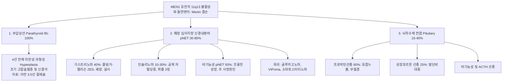
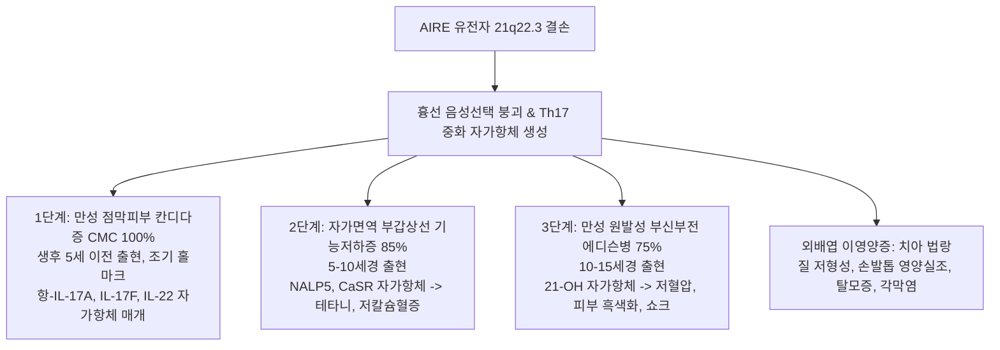

# Netter Endocrine Day 08: 유전학 및 내분비 종양 (Genetics & Endocrine Neoplasia) — MEN1·MEN2·VHL·NF1·APS-1·유암종증후군 (pp. 213–225)

> 📖 **원서 출처**: [The Netter Collection - Volume 2, The Endocrine System.pdf (pp. 213-225)](https://drive.google.com/file/d/1TnVzK8w2Nm2lU3SzGlFBLguBf8pjaMkt/view?usp=drivesdk)
> 🏷️ **범위**: Section 8: Genetics and Endocrine Neoplasia (Plate 8-1 ~ Plate 8-7, 전수 수록 및 완결)
> 📌 **핵심 테마**: 다발성 내분비선종 1형(MEN1 / Wermer: 3P 병소 [부갑상선 4선 과형성, 췌장 뇌분비종양 가스트리노마/인슐리노마, 뇌하수체 프로락틴선종], 11q13 Menin 종양억제유전자), 다발성 내분비선종 2형(MEN2 / Sipple: 10q11.2 RET 원종양유전자 키나아제 활성화, 갑상선 수질암 MTC, 갈색세포종, 부갑상선 HPT vs MEN 2B 점막신경종·마르판양 체형·M918T 돌연변이, 영아기 예방적 갑상선절제술 및 갈색세포종 선행 절제 철칙), 폰히펠-린다우 증후군(VHL: 3p25.3, HIF-2α 분해 장애, 망막/소뇌 혈관모세포종, 담명세포 신세포암, 갈색세포종, Belzutifan 표적치료), 신경섬유종증 1형(NF1: 17q11.2 Neurofibromin Ras-GAP 결손, 카페오레 반점, 갈색세포종, 리쉬 결절), 자가면역 다발성 내분비병증 증후군 1형(APS-1 / APECED: 21q22.3 AIRE 유전자 결손, 흉선 T세포 음성선택 붕괴, 만성 점막피부 칸디다증 [IL-17 자가항체], 부갑상선저하증, 에디슨병), 유암종 증후군(Carcinoid Syndrome: 장관 엔테로크로마핀 세포 신경내분비종양, 간전이 후 세로토닌 전신 순환, 홍조·설사·기관지연축, 우심판막 섬유화 삼첨판폐쇄부전 Hedinger 증후군, 5-HIAA 요검사 및 소마토스타틴 유사체 치료).

---

## 1. 개요 및 마스터 요약 (Executive Summary)

* **다발성 내분비선종 1형 (MEN 1 / Wermer 증후군, Plate 8-1)**:
  * **염색체 11q13**의 **MEN1 종양억제유전자** 불활성화 돌연변이 $\rightarrow$ 전사 조절 핵단백질인 **메닌 (Menin)** 기능 상실.
  * **고전적 3P 병변**:
    1. **부갑상선 (Parathyroid, 95~100%)**: 거의 모든 환자에서 발생. 단일 선종이 아닌 **4개 선 전체의 미만성 과형성증(Multiglandular hyperplasia)** $\rightarrow$ 조기 고칼슘혈증 및 신결석.
    2. **췌장 신경내분비종양 (pNET, 30~80%)**: 주 사망 원인. **가스트리노마 (Gastrinoma / Zollinger-Ellison syndrome, 40%)**가 최빈도 (다발성 궤양, 분비성 설사), 인슐리노마(10~30%), 비기능성 종양.
    3. **뇌하수체 전엽 선종 (Pituitary, 15~40%)**: **프로락틴선종 (Prolactinoma, 60%)** 최빈도, GH 분비 선종(말단비대증), 비기능성 선종.
* **다발성 내분비선종 2형 (MEN 2A & MEN 2B, Plates 8-2 ~ 8-3)**:
  * **염색체 10q11.2**의 **RET 원종양유전자 (Proto-oncogene)** 기능획득(Gain-of-function) 돌연변이 $\rightarrow$ 수용체 티로신 키나아제(RTK)의 리간드 없는 자율적 이량체화 및 지속적 활성화.
  * **MEN 2A (Sipple 증후군, 70~80%)**: **갑상선 수질암 (MTC, 100%)** + **갈색세포종 (50%, 양측성 빈발)** + **원발성 부갑상선 기능항진증 (20~30%)**. 세포외 시스테인 풍부 도메인(Codon 634 변이 등).
  * **MEN 2B (5~10%)**: **극도로 침습적인 MTC (영아기 발병)** + 갈색세포종 + **점막 신경종 (혀, 입술, 결막)** + **마르판양 체형 (Marfanoid habitus)** + 장신경절종증(만성 변비). **부갑상선 병변 없음!** 촉매 티로신 키나아제 도메인(Codon M918T 변이).
  * **외과적 절대 철칙**: MTC와 갈색세포종이 동반된 경우, 갑상선 수술 중 치명적 아드레날린 고혈압 위기를 방지하기 위해 **반드시 알파차단 후 갈색세포종 적출술을 먼저 시행**해야 함. ATA 가이드라인에 따른 위험도별 소아기 예방적 갑상선절제술 필수.
* **기타 유전성 종양 증후군 (VHL & NF1, Plates 8-4 ~ 8-5)**:
  * **폰히펠-린다우 증후군 (VHL, 3p25.3)**: pVHL 종양억제단백 결손 $\rightarrow$ 산소 존재 하에서도 **HIF-1α/2α 분해 실패(유사가상저산소증 Pseudohypoxia)** $\rightarrow$ VEGF/PDGF/EPO 폭발. **소뇌/척수/망막 혈관모세포종, 투명세포 신세포암(ccRCC, 3cm 초과 시 부분신절제), 갈색세포종(노르에피네프린형), 췌장 낭종/pNET**. HIF-2α 억제제인 **Belzutifan** 표적치료.
  * **신경섬유종증 1형 (NF1 / von Recklinghausen, 17q11.2)**: Neurofibromin 결손 $\rightarrow$ **Ras 불활성화 실패** $\rightarrow$ Ras-MAPK 과다 증식. 카페오레 반점, 겨드랑이 주근깨(Crowe sign), 홍채 리쉬 결절, 시신경교종, **갈색세포종 (고혈압 동반 NF1 환자의 20~50%에서 확인)**.
* **자가면역 다발성 내분비병증 1형 (APS-1 / APECED, Plate 8-6)**:
  * **염색체 21q22.3**의 **AIRE (Autoimmune Regulator)** 유전자 상염색체 열성 돌연변이 $\rightarrow$ 흉선 수질상피세포에서 자가항원 발현 장애 $\rightarrow$ 자가반응성 T세포의 음성 선택(Negative selection) 붕괴.
  * **3대 고전적 징후 (2개 이상 시 확진)**:
    1. **만성 점막피부 칸디다증 (CMC, 100%)**: Th17 사이토카인(IL-17A/F, IL-22) 자가항체에 의한 점막 면역 붕괴로 생후 5세 이전 발생.
    2. **자가면역성 부갑상선 기능저하증 (85%)**: NALP5/CaSR 자가항체, 테타니.
    3. **원발성 부신부전증 (에디슨병, 75%)**: 21-OH 항체, 청동색 피부, 저혈압.
* **유암종 증후군 (Carcinoid Syndrome, Plate 8-7)**:
  * 장관(회장, 맹장) 엔테로크로마핀(EC) 세포 기원의 신경내분비종양(NET).
  * 위장관 원발 종양에서 분비된 세로토닌은 간문맥을 통해 간 MAO 효소에 의해 전량 불활성화(5-HIAA 전환)되므로, **반드시 간 전이(Liver metastases)가 발생하여 간문맥을 우회하거나 폐/기관지 유암종처럼 전신 정맥으로 직결될 때만 증후군 발현**.
  * **4대 증상**: **홍조 (Flushing)**, **분비성 설사 (Diarrhea)**, **기관지연축 (천식양 천명)**, **우심판막 섬유화 (삼첨판 폐쇄부전 TR, 폐동맥판 협착 PS / 헤딩거 증후군)** (폐 모세혈관 MAO에 의해 세로토닌이 분해되므로 좌심판막은 침범되지 않음). 24시간 소변 5-HIAA 및 소마토스타틴 유사체(Octreotide) 치료.

---

## 2. 제1부: 다발성 내분비선종 1형 (MEN 1 / Wermer Syndrome) (Plate 8-1)

### Plate 8-1 | 다발성 내분비선종 1형 (Multiple Endocrine Neoplasia Type 1)
![[Netter_V2_Plate8-1.png]]

#### 유전학적 병인 및 메닌(Menin)의 분자생물학
* **염색체 위치 및 유전자**: 염색체 **11q13**에 위치한 **MEN1 종양억제유전자**.
* **유전 방식**: 상염색체 우성 (높은 침투율: 50세까지 95% 이상에서 증상 발현).
* **크누슨의 투-히트 가설 (Knudson's Two-Hit Hypothesis)**: 부모로부터 하나의 불활성화 배아세포 돌연변이(First hit)를 물려받고, 특정 내분비 조직 체세포에서 정상 대립유전자의 결실/돌연변이(Second hit / LOH)가 발생할 때 종양 형성 개시.
* **메닌 (Menin) 단백질의 기능**:
  * 610개 아미노산으로 구성된 핵 내 샤페론 및 전사 조절 단백질.
  * MLL1/2 히스톤 메틸전이효소 복합체와 결합하여 염색질 리모델링 조절.
  * 세포주기 억제인자인 **p27Kip1 및 p18Ink4c 전사를 촉진**하고, 전사인자 JunD를 억제하여 세포 증식을 억제하는 종양 억제자 역할을 수행.

#### 3대 핵심 내분비 병변 (The 3 "P"s)



1. **부갑상선 (Parathyroid, 95~100%)**:
   * MEN1 환자에서 가장 먼저 나타나는 최빈도 병변 (대개 20~25세에 고칼슘혈증 출현).
   * **병리적 특성**: 산발성 원발성 부갑상선 기능항진증이 85%에서 단일 선종인 것과 달리, **MEN1은 4개 부갑상선 전체가 비대해지는 다발성 미만성 과형성증(Multiglandular chief cell hyperplasia)** 또는 다발성 선종을 보임.
   * **임상상**: 청년기 재발성 요로결석, 골감소증, 무력감.
   * **수술적 접근**: 단일 선종 절제 시 100% 재발하므로, **아전 부갑상선 절제술 (Subtotal parathyroidectomy, 3.5개 선 절제)** 또는 **전절제술 후 전완부 근육 내 자가이식(Total parathyroidectomy with autotransplantation)**을 시행.
2. **췌장-십이지장 신경내분비종양 (Enteropancreatic pNET, 30~80%)**:
   * MEN1 환자의 **가장 주요한 질병 관련 사망 원인** (악성화 및 간 전이 위험).
   * **가스트린 분비종양 (Gastrinoma / Zollinger-Ellison Syndrome, ~40%)**:
     * 십이지장 점막(최빈도) 또는 췌장에 다발성으로 발생.
     * 과도한 가스트린 분비 $\rightarrow$ 위벽세포 비대 $\rightarrow$ 대량의 위산 분비 $\rightarrow$ **십이지장 제2구부 이하, 공장까지 침범하는 난치성/다발성 소화성 궤양** 및 췌장 리파아제 산성 변성으로 인한 **분비성 설사 및 지방변**.
     * 혈청 가스트린 $>1000\ \text{pg/mL}$ 및 위액 pH < 2.0. 확진: 세크레틴 자극검사 시 가스트린이 역설적으로 $>120\ \text{pg/mL}$ 급증.
   * **인슐린 분비종양 (Insulinoma, 10~30%)**: 40세 이전 젊은 연령 호발, 다발성 발생 가능, 반복성 공복 저혈당.
   * **비기능성 pNET (~50%)**: 호르몬 증상 없이 무증상 성장하다가 간 전이로 발견되므로 조기 EUS/MRI 스크리닝이 생존율의 핵심.
3. **뇌하수체 전엽 선종 (Pituitary Adenoma, 15~40%)**:
   * **프로락틴선종 (Prolactinoma, ~60%)**: 무월경, 유즙누출증, 불임. (도파민 작용제 Cabergoline 1차 치료).
   * GH 분비 선종 (~25%): 말단비대증. ACTH 선종 (~5%): 쿠싱병.
4. **기타 동반 병변**:
   * 흉선 유암종(Thymic carcinoid, 흡연 남성에서 호발하며 극도로 공격적 침습), 기관지 유암종(여성 호발), 위 ECL 세포 유암종.
   * 피부 병변: **다발성 안면 혈관섬유종 (Facial angiofibromas, 85%)**, 콜라게노마(Collagenomas, 70%), 피하 지방종(Lipomas, 30%).

---

## 3. 제2부: 다발성 내분비선종 2형 (MEN 2A & MEN 2B) (Plates 8-2 ~ 8-3)

### Plate 8-2 | 다발성 내분비선종 2형 A (Multiple Endocrine Neoplasia Type 2A)
![[Netter_V2_Plate8-2.png]]

### Plate 8-3 | 다발성 내분비선종 2형 B (Multiple Endocrine Neoplasia Type 2B)
![[Netter_V2_Plate8-3.png]]

#### RET 원종양유전자(Proto-Oncogene) 돌연변이의 분자 기전
* **염색체 위치 및 단백질 구조**: 염색체 **10q11.2**에 위치. 신경능선 세포 생존과 분화에 필수적인 수용체 티로신 키나아제인 **RET 단백질**을 암호화함.
* **발암 기전 (단일 히트 우성 유전)**: 종양억제유전자와 달리, RET의 특정 코돈 돌연변이는 단 하나의 대립유전자 변이만으로도 **리간드(GDNF 등)의 결합 없이 수용체가 스스로 이량체화(Dimerization)하거나 티로신 키나아제 도메인이 자가인산화 활성화**되어 하위 MAPK 및 PI3K/Akt 신호를 영구적으로 켬.

#### MEN 2A vs MEN 2B 임상 표현형 비교

| 비교 항목 | MEN 2A (Sipple 증후군, ~70-80%) | MEN 2B (Wagenmann-Froboese, ~5-10%) |
| :--- | :--- | :--- |
| **원인 RET 변이** | 세포외 시스테인 도메인: **Codon 634 (C634R/Y 등, >80%)**, 609, 611, 618, 620 | 세포내 촉매 티로신 키나아제 도메인: **Codon M918T (Exon 16, >95%)** |
| **갑상선 수질암 (MTC)** | **100% 발생**, 다발성 C세포 과형성 선행, 5~25세경 출현 | **100% 발생, 극도로 침습적/공격적**, 영아기(<1세)에 조기 림프절/원격 전이 |
| **갈색세포종 (Pheo)** | **약 50%**, 양측성/다발성, 주로 에피네프린 분비 | **약 50%**, 양측성/다발성 |
| **부갑상선 기능항진증** | **20~30%** (주세포 과형성 또는 선종, 대개 경증) | **절대 발생하지 않음 (0%! 부갑상선 정상)** |
| **특이 신체 기형** | 없음 (단, 변이 아형으로 **배부 태선 아밀로이드증**, 히르슈슈프룽병 동반 가능) | **1. 점막 신경종 (Mucosal neuromas, 100%)**: 입술, 혀, 결막<br>**2. 마르판양 체형 (Marfanoid habitus)**<br>**3. 장신경절종증 (Ganglioneuromatosis)** |

```
[ MEN 2A ] ───┬── 갑상선 수질암 (MTC, 100%)
              ├── 갈색세포종 (Pheochromocytoma, 50%)
              └── 부갑상선 기능항진증 (Hyperparathyroidism, 20~30%)

[ MEN 2B ] ───┬── 갑상선 수질암 (MTC, 100%, 영아기 급속 악성화)
              ├── 갈색세포종 (Pheochromocytoma, 50%)
              ├── 점막 신경종 (혀, 입술 울퉁불퉁 비대) & 마르판양 체형
              └── (★ 부갑상선 침범 없음!)
```

#### 외과적 수술 순서 및 예방적 갑상선절제술 가이드라인 (CRITICAL)
1. **외과적 치료의 절대 철칙 (The Golden Sequence)**:
   * MEN2 환자에서 MTC와 갈색세포종이 동시에 발견된 경우, **반드시 갈색세포종에 대해 알파차단제(Phenoxybenzamine)를 10~14일간 선행 투여한 후 갈색세포종 적출술(복강경 부신절제술)을 먼저 시행**해야 함!
   * 갈색세포종을 방치한 채 목 부위 갑상선 수술 및 전신마취를 먼저 진행하면, 마취 유도나 종양 조작에 의해 카테콜아민이 폭발 방출되어 수술실 내에서 치명적인 악성 고혈압 위기, 부정맥, 심정지로 즉사할 수 있음.
2. **미국갑상선학회 (ATA) 유전자 기반 예방적 갑상선절제술**:
   * **최고 위험군 (HST / Level D, M918T 돌연변이 / MEN 2B)**: **생후 수개월 이내 (늦어도 생후 1세 미만)** 중심경부 림프절 곽청술을 동반한 전갑상선 절제술 필수.
   * **고위험군 (H / Level C, Codon 634 변이 / MEN 2A)**: **만 5세 이전** 전갑상선 절제술 시행.
   * **중등도 위험군 (MOD / Level B/A)**: 혈청 칼시토닌을 주기적으로 추적하며 수치 상승 시 또는 5~10세경 절제술.

---

## 4. 제3부: 기타 유전성 신경내분비 종양 증후군 (VHL & NF1) (Plates 8-4 ~ 8-5)

### Plate 8-4 | 폰히펠-린다우 증후군 (Von Hippel–Lindau Syndrome, VHL)
![[Netter_V2_Plate8-4.png]]

#### 유사가상저산소증(Pseudohypoxia)과 다발성 과혈관성 종양
* **염색체 위치 및 유전자**: 염색체 **3p25.3**의 **VHL 종양억제유전자**. 상염색체 우성 유전.
* **분자 병태생리**:
  * 정상 산소 상태에서 산소감지효소(PHD)가 **HIF-1α 및 HIF-2α (저산소유도인자)** 단백질의 프롤린 잔기를 수산화함.
  * 정상 pVHL 단백질은 수산화된 HIF를 인식 결합하여 E3 유비퀴틴 연결효소 복합체(Elongin B/C, Cul2)를 통해 프로테아솜 분해를 유도.
  * **VHL 변이/결손 시**: 세포 내에 산소가 충분함에도 불구하고 pVHL이 작동하지 않아 **HIF-1α/2α가 파괴되지 않고 세포질에 비정상 축적(유사가상저산소증, Pseudohypoxia)** $\rightarrow$ 핵 내로 이동하여 **VEGF, PDGF, EPO, GLUT1** 등 신생혈관 및 증식 유전자를 무제한 전사 유도 $\rightarrow$ 전신에 극단적인 **과혈관성(Hypervascular) 종양** 다발.
* **주요 임상 병변 6대 복합체**:
  1. **중추신경계 혈관모세포종 (Hemangioblastomas, 60~80%)**: 소뇌(Cerebellum), 뇌간, 척수에 호발. 거대 낭종 내부에 조영 증강이 강한 과혈관성 벽 결절(Mural nodule) 관찰. 두통, 운동실조, 수두증 유발. 종양 세포의 EPO 분비로 적혈구증가증(Polycythemia) 동반 가능.
  2. **망막 혈관모세포종 (Retinal angiomas / von Hippel tumors, 50%)**: 망막 모세혈관 확장 및 출혈, 망막 박리로 실명 위험.
  3. **담명세포 신세포암 (ccRCC, 30~70%)**: 양측성, 다발성으로 발생하며 **VHL 환자의 주요 사망 원인**. 신기능 보존을 위해 종양 직경이 **3 cm에 도달했을 때 부분 신절제술(Nephron-sparing surgery)**을 시행하는 것이 표준 원칙.
  4. **갈색세포종 (Pheochromocytoma, 10~20%)**: 양측성 빈발, 주로 노르에피네프린 분비.
  5. **췌장 신경내분비종양 (pNET, 10~15%)** 및 광범위한 다발성 췌장 장액성 낭선종.
  6. **내이 내림프낭 종양 (Endolymphatic Sac Tumors, ELST, 10%)**: 측두골 침식, 감각신경성 난청, 이명.
* **표적 항암치료의 혁명 — Belzutifan (벨주티판)**: 경구용 **HIF-2α 소분자 억제제**. HIF-2α와 HIF-1β의 이량체화를 물리적으로 차단하여 VHL 관련 신세포암, CNS 혈관모세포종, 췌장 pNET 크기를 축소시킴.

---

### Plate 8-5 | 신경섬유종증 1형 (Neurofibromatosis Type 1 / von Recklinghausen Disease)
![[Netter_V2_Plate8-5.png]]

#### Neurofibromin 결손과 Ras-MAPK 신호의 폭주
* **염색체 위치 및 유전자**: 염색체 **17q11.2**의 **NF1 유전자** (상염색체 우성, 50%는 새로운 생식세포계열 돌연변이).
* **분자 기전**: 신경능선 조직에서 발현되는 **뉴로피브로민 (Neurofibromin)** 단백질은 Ras-GTPase 활성화 단백질(**Ras-GAP**)로 작동하여 활성형 Ras-GTP를 불활성형 Ras-GDP로 가수분해시키는 천연 브레이크. Neurofibromin 결손 시 **Ras가 영구 활성화되어 하위 MAPK 경로를 통한 세포 증식 폭주**.
* **NIH 진단 기준 7대 항목 (2개 이상 충족 시 확진)**:
  1. 6개 이상의 **카페오레 반점 (Café-au-lait macules)** (사춘기 전 직경 >5 mm, 사춘기 후 >15 mm).
  2. 2개 이상의 모든 형태의 신경섬유종 또는 1개 이상의 **얼기모양 신경섬유종 (Plexiform neurofibroma)** (지렁이 든 자루 촉감, 악성 말초신경초종양 MPNST 변성 위험).
  3. 겨드랑이(액와부) 또는 사타구니(서혜부) 주근깨 (**Crowe 징후**).
  4. **시신경교종 (Optic pathway glioma)** (시력 저하 또는 시상하부 침범으로 성조숙증 유발).
  5. 2개 이상의 **홍채 리쉬 결절 (Lisch nodules)** (세극등 검사상 홍채의 양성 멜라닌세포 과오종).
  6. 특징적 골격 병변: 접형골 날개 이형성증(Sphenoid wing dysplasia), 경골/요골 가관절증, 척추측만증.
  7. 1차 직계가족의 NF1 병력.
* **내분비계 핵심 합병증**:
  * **갈색세포종 (Pheochromocytoma)**: 전체 NF1 환자에서는 1~5%이나, **고혈압을 동반한 NF1 환자에서는 20~50%에서 갈색세포종이 발견됨**. (따라서 고혈압이 있는 모든 NF1 환자는 소변/혈장 메타네프린 선별검사 필수).
  * 십이지장 팽대부 주위 소마토스타틴 분비종양(Somatostatinoma, 사종체 동반).

---

## 5. 제4부: 자가면역 다발성 내분비병증 증후군 (APS-1 vs APS-2) (Plate 8-6)

### Plate 8-6 | 자가면역 다발성 내분비병증 1형 (Autoimmune Polyglandular Syndrome Type 1 / APECED)
![[Netter_V2_Plate8-6.png]]

#### AIRE 유전자 결손과 흉선 중심성 면역관용의 붕괴
* **염색체 위치 및 유전자**: 염색체 **21q22.3**의 **AIRE (Autoimmune Regulator)** 유전자 상염색체 열성 돌연변이.
* **면역학적 병태생리**:
  * 정상적으로 흉선 수질상피세포(mTEC)의 AIRE 전사인자는 신체 말초 장기에만 존재하는 고유 자가항원(갑상선글로불린, 인슐린, 21-OH 등 조직특이항원 TRA)을 흉선 내에서 미리 모의 발현시킴.
  * 발생 중인 미성숙 T세포가 이 자가항원에 강하게 반응하면 세포자멸사(Apoptosis)로 제거되는 **중심성 면역관용 (Central Tolerance / Negative Selection)**이 가동됨.
  * **AIRE 결손 시**: 흉선에서 말초 자가항원이 발현되지 못하여, 자가반응성 T세포들이 음성 선택을 탈출하여 전신 혈류로 쏟아져 나가 **표적 내분비 장기를 연쇄적으로 자가면역 파괴**함.

#### APECED 3대 클래식 징후의 순차적 발현 및 감별



* **진단 기준**: **만성 점막피부 칸디다증, 부갑상선 기능저하증, 에디슨병 중 2개 이상** 충족 시 임상 확진.
* **외배엽 이영양증 (Ectodermal Dystrophy)**: 치아 법랑질 저형성증(Enamel hypoplasia, 영구치 표면 패임), 각막염, 원형/전두 탈모증, 백반증.
* **비장 위축증 (Functional Asplenia)**: 환자의 10~20%에서 비장 위축으로 협막세균(폐렴구균)에 대한 패혈증 위험 급증 (예방접종 필수).

#### APS-1 vs APS-2 (Schmidt 증후군) 결정적 감별 매트릭스

| 감별 항목 | APS-1 (APECED) | APS-2 (Schmidt 증후군) |
| :--- | :--- | :--- |
| **유전 양식 및 원인 유전자** | **단일 유전자 상염색체 열성 (AIRE 유전자, 21q22.3)** | **다인자 복합 유전 (HLA-DR3, HLA-DR4 연관)** |
| **호발 연령 및 성별** | **유아기 및 소아기 (5~15세 이전 발병)**, 남녀 동등 | **성인기 (30~40대 호발)**, **여성 압도적 (여:남 = 3:1)** |
| **3대 핵심 구성 질환** | **1. 만성 점막피부 칸디다증 (CMC, 100%)**<br>**2. 부갑상선 기능저하증 (85%)**<br>**3. 에디슨병 (75%)** | **1. 에디슨병 (100%)**<br>**2. 자가면역 갑상선 질환 (하시모토/그레이브스, 70%)**<br>**3. 제1형 당뇨병 (50%)** |
| **칸디다증 및 부갑상선저하** | **존재 (질환의 절대적 특징)** | **절대 나타나지 않음 (칸디다증 없음, 부갑상선 정상!)** |
| **외배엽 이영양증** | 흔함 (치아 법랑질 결손, 각막염, 탈모) | 없음 |

---

## 6. 제5부: 유암종 증후군 및 신경내분비 종양 (Plate 8-7)

### Plate 8-7 | 유암종 증후군 (Carcinoid Syndrome)
![[Netter_V2_Plate8-7.png]]

#### 세로토닌 대사, 간 통과 우회 및 헤딩거 증후군(우심판막 섬유화)
신경내분비종양(NET, 과거 유암종 Carcinoid)은 주로 위장관 점막의 장크롬친화세포(Enterochromaffin / Kulchitsky cells)에서 발생:
1. **증후군 발현의 해부학적 관문 (The Liver Barrier)**:
   * 원발성 위장관(소장 회장, 충수돌기, 공장) 유암종은 다량의 **세로토닌 (5-HT, 5-Hydroxytryptamine)**, 브라디키닌, 히스타민, 프로스타글란딘을 문맥계(Portal vein)로 분비함.
   * 정상적으로 문맥 혈류는 간을 통과하며 간세포 소포체의 **모노아민 산화효소 (MAO)**에 의해 전량 비활성 대사체인 **5-HIAA (5-Hydroxyindoleacetic acid)**로 산화 전환되어 전신 혈류로 나가지 못함.
   * ⚠️ **결론**: 따라서 위장관 유암종 환자에서 유암종 증후군이 나타났다는 것은 **이미 광범위한 간 전이(Hepatic metastases)가 발생하여 간 정맥동을 우회해 하대정맥(IVC)으로 활성 세로토닌이 직결 방출되고 있음을 의미**함!
   * *예외*: 기관지/폐 유암종(Bronchial carcinoid)이나 난소 기형종 유암종은 문맥을 거치지 않고 폐정맥이나 장골정맥으로 직접 전신 순환하므로 **간 전이가 없어도 초기부터 유암종 증후군을 유발**할 수 있음.
2. **고전적 4대 임상 징후**:
   * **피부 홍조 (Cutaneous Flushing, 85~90%)**: 안면과 상체에 발작적으로 발생하는 작열감과 선홍색 피부 발적 (알코올, 매운 음식, 스트레스가 유발).
   * **분비성 설사 (Secretory Diarrhea, 70~80%)**: 세로토닌이 장관 운동과 분비를 자극하여 발생하는 폭발적 물설사, 복부 경련.
   * **기관지연축 (Bronchospasm / Wheezing, 10~20%)**: 브라디키닌 매개 천식양 호흡곤란.
   * **유암종 심장질환 (Hedinger Syndrome / Carcinoid Heart Disease, 50~60%)**:
     * 고농도 세로토닌이 심내막 $5-\text{HT}_{2\text{B}}$ 수용체를 자극하여 섬유아세포 증식 및 콜라겐 침착 유도 $\rightarrow$ **우심실 내막과 판막에 백색 연골양 섬유성 판(Fibrous plaque) 형성**.
     * **삼첨판 폐쇄부전증 (Tricuspid Regurgitation, TR)** 및 **폐동맥판 협착증 (Pulmonary Stenosis, PS)** 초래 $\rightarrow$ 간종대, 복수, 하지 부종을 동반한 **우심부전 (Right Heart Failure)**.
     * ⚠️ **좌심판막(승모판, 대동맥판)은 완벽히 보존됨**: 혈액이 폐 모세혈관을 통과하는 동안 폐포 내피의 풍부한 MAO 효소에 의해 세로토닌이 분해 불활성화되기 때문. (난원공 개존증 PFO 등 우좌 단락이나 폐 유암종 시에만 좌심 침범).
3. **이차성 펠라그라 (Pellagra)**: 정상 상태에서는 섭취한 트립토판의 1%만 세로토닌 합성에 쓰이지만, 종양 세포는 **트립토판의 70~90%를 세로토닌으로 싹쓸이 션트**시킴 $\rightarrow$ 나이아신(비타민 B3) 합성이 고갈되어 **펠라그라 4D (피부염, 설사, 치매, 사망)** 합병.
4. **진단 및 최신 표적 치료**:
   * **24시간 소변 5-HIAA 배설량 측정**: 특이도 최고 (바나나, 파인애플, 호두 등 세로토닌 풍부 음식 3일간 금지). 혈청 크로모그라닌 A (Chromogranin A).
   * **방사선/핵의학 영상**: **${}^{68}\text{Ga}$-DOTATATE PET/CT** (소마토스타틴 2형 수용체 SSTR2 표적, 최고 민감도).
   * **약물 치료**:
     * **소마토스타틴 유사체 (Octreotide, Lanreotide)**: SSTR2 결합 $\rightarrow$ 세로토닌 분비 차단으로 홍조/설사 극적 완화 및 종양 증식 억제.
     * **텔로트리스타트 에틸 (Telotristat ethyl)**: 경구 트립토판 수산화효소(TPH) 억제제, 세로토닌 신생 합성 차단.
     * 방사성 핵종 치료: **${}^{177}\text{Lu}$-DOTATATE (PRRT)**.

---

## 7. 제6부: 유전성 내분비 종양 마스터 감별 매트릭스 (Master Synthesis Matrix)

| 질환군 | 원인 유전자 및 염색체 | 유전 방식 | 주 침범 내분비 장기 | 특징적 신체 징후 및 병리 | 최우선 외과/약물 치료 원칙 |
| :--- | :--- | :--- | :--- | :--- | :--- |
| **MEN 1 (Wermer)** | **MEN1** (11q13)<br>Menin 종양억제자 | 상염색체 우성 | **3P: 부갑상선(과형성 100%), 췌장(가스트리노마 40%, 인슐리노마), 뇌하수체(프로락틴선종)** | 안면 혈관섬유종, 피하 지방종, 흉선/기관지 유암종 | 부갑상선 아전(3.5선) 절제술, pNET 조기 EUS 감시, 카버골린 |
| **MEN 2A (Sipple)** | **RET** (10q11.2)<br>Codon 634 등 | 상염색체 우성 | **갑상선 수질암 (MTC 100%), 갈색세포종 (50%), 부갑상선 기능항진증 (20-30%)** | C세포 과형성, 아밀로이드 간질, 배부 태선 아밀로이드증 | **5세 전 예방적 갑상선절제**, **갈색세포종 선행 수술 필수** |
| **MEN 2B** | **RET** (10q11.2)<br>**Codon M918T (>95%)** | 상염색체 우성 | **초공격적 MTC (100%), 갈색세포종 (50%)<br>(★ 부갑상선 병변 없음!)** | **점막 신경종 (혀, 입술), 마르판양 체형, 장신경절종증** | **생후 1세 미만 초조기 갑상선 전절제**, 갈색세포종 선행 수술 |
| **VHL 증후군** | **VHL** (3p25.3)<br>pVHL (HIF 억제) | 상염색체 우성 | **갈색세포종 (20%), 췌장 pNET (15%)**, 투명세포 신세포암 (ccRCC), 소뇌/망막 혈관모세포종 | 과혈관성 종양, 적혈구증가증, 망막 혈관종 실명 | **Belzutifan (HIF-2αi)**, ccRCC 3cm 도달 시 부분신절제 |
| **NF1 (Recklinghausen)** | **NF1** (17q11.2)<br>Neurofibromin (Ras-GAP) | 상염색체 우성 | **갈색세포종 (고혈압 환자의 20-50%)**, 십이지장 소마토스타티노마 | **카페오레 반점, 겨드랑이 주근깨(Crowe), 홍채 리쉬 결절** | 고혈압 시 메타네프린 스크리닝, 신경섬유종 수술 |
| **APS-1 (APECED)** | **AIRE** (21q22.3)<br>흉선 자가관용 전사 | **상염색체 열성** | **만성 점막피부 칸디다증 (CMC 100%), 부갑상선저하증 (85%), 에디슨병 (75%)** | 치아 법랑질 결손, 백반증, 기능적 무비장증 | 항진균제, 활성 비타민 D+칼슘, 하이드로코르티손/플루드로코르티손 |
| **유암종 증후군** | 장관 EC세포 기원 신경내분비종양 (NET) | 산발성 (일부 MEN1 연관) | 장관 NET의 **간 전이** 또는 폐/난소 NET | **홍조, 설사, 우심판막 섬유화(TR/PS, 헤딩거 증후군), 펠라그라** | **소마토스타틴 유사체 (Octreotide)**, Telotristat, 177Lu-PRRT |

---

## 8. 제7부: Netter 원서 기반 로컬 이미지 일괄 추출 스크립트 (Python Script)

로컬 환경에서 원서 PDF로부터 Section 8에 해당하는 7개 플레이트 전수 이미지를 추출하여 `첨부파일` 폴더에 옵시디언 규격(`![[Netter_V2_Plate8-X.png]]`)으로 저장하는 완전 자동화 코드입니다:

```python
import fitz  # PyMuPDF
import os

pdf_path = "The Netter Collection - Volume 2, The Endocrine System.pdf"
output_dir = "./헤르메스/책 읽기/Netter_Vol2_내분비계/첨부파일"
os.makedirs(output_dir, exist_ok=True)

doc = fitz.open(pdf_path)

plates_info = [
    ("Plate8-1", "Multiple Endocrine Neoplasia Type 1"),
    ("Plate8-2", "Multiple Endocrine Neoplasia Type 2"),
    ("Plate8-3", "Multiple Endocrine Neoplasia Type 2 (cont'd)"),
    ("Plate8-4", "Von Hippel–Lindau Syndrome"),
    ("Plate8-5", "Neurofibromatosis Type 1 (von Recklinghausen Disease)"),
    ("Plate8-6", "Clinical Manifestations of Autoimmune Polyglandular Syndrome Type 1"),
    ("Plate8-7", "Carcinoid Syndrome")
]

print(f"총 {len(plates_info)}개 플레이트 추출 시작...")

for plate_id, plate_title in plates_info:
    num_suffix = plate_id.replace("Plate8-", "")
    search_terms = [f"Plate 8-{num_suffix}", f"8-{num_suffix}", plate_title.lower()]
    
    target_page = None
    for page_num in range(len(doc)):
        text = doc[page_num].get_text().lower()
        if any(term.lower() in text for term in search_terms):
            target_page = page_num
            break
            
    if target_page is not None:
        page = doc[target_page]
        pix = page.get_pixmap(matrix=fitz.Matrix(3.0, 3.0))
        img_filename = f"Netter_V2_{plate_id}.png"
        pix.save(os.path.join(output_dir, img_filename))
        print(f"✅ [추출 성공] {img_filename} (PDF p.{target_page+1})")
    else:
        print(f"⚠️ [미발견] {plate_id}: {plate_title}")

doc.close()
print("=== Section 8 전체 7개 플레이트 이미지 추출 완료 ===")
```

<!-- 보관 태그(1회용·링크오류, 필요시 복원): 유전내분비학, 다발성내분비선종, MEN1, MEN2, 폰히펠린다우, 신경섬유종증1형, 자가면역다발내분비병증, APS1, 유암종증후군 -->
