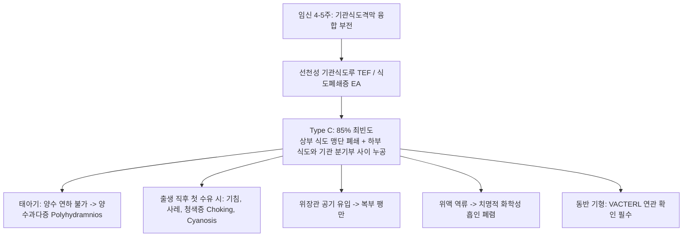

# Netter Respiratory Day 01: 호흡기계의 해부학 및 발생학 (Anatomy and Embryology) — 흉곽·기도·폐포·폐순환·발생단계 (pp. 3–45)

> 📖 **원서 출처**: [The Netter Collection - Volume 3, Respiratory System.pdf (pp. 3-45)](https://drive.google.com/file/d/1lDCEGUPEHrzTY10gPML28PbdcCYyY90a/view?usp=drivesdk)
> 🏷️ **범위**: Section 1: Anatomy and Embryology (Plate 1-1 ~ Plate 1-43, 총 43개 플레이트 전수 수록)
> 📌 **핵심 테마**: 흉벽 골격 및 늑간 신경혈관속(VAN 주행과 흉강천자 안전 삼각지대), 횡격막 3대 열공(T8 하대정맥, T10 식도, T12 대동맥)과 횡격신경(C3-C5), 폐의 엽/열/표면 해부학 및 폐문부 구조(RAbLS 원칙), 기관분기부(Carina, T4-T5)와 우측 주기관지 이물 흡인 해부학, 18개 기관지폐구역(Boyden 분류), 기관지동맥(체순환 영양 공급 및 생리적 단락), 기도 상피 미세구조(섬모세포 9+2 축사, 배상세포, 클럽세포 CC16, 레이드 지수), 폐포-모세혈관 단위(0.2~0.5 μm 혈액-가스 장벽), 제2형 폐포세포의 층판소체 및 폐포 계면활성제(DPPC, SP-B 결핍), 폐 림프 배액 체계, 폐 발생 5단계(배아기-가선기-세관기-낭포기-폐포기) 및 주산기 폐순환 전환, 선천성 기관식도루(TEF Type C) 및 보흐달레크 선천성 횡격막 헤르니아(CDH).

---

## 1. 개요 및 마스터 요약 (Executive Summary)

* **흉벽 골격, 늑간극 및 횡격막 해부학 (Plates 1-1 ~ 1-10)**:
  * **늑간 신경혈관속 (VAN Bundle)**: 늑골 하연의 늑골구(Costal groove)를 따라 **상 $\rightarrow$ 하 순서로 늑간정맥(Vein) - 늑간동맥(Artery) - 늑간신경(Nerve)**이 주행. 흉강천자(Thoracentesis) 및 흉관 삽입 시 혈관 손상을 방지하기 위해 **반드시 아래쪽 갈비뼈의 상연(Upper border of the lower rib) 바로 위를 바늘로 통과**해야 함.
  * **횡격막 (Diaphragm) 3대 열공 ("I 8 10 Eggs At 12" 암기 공식)**:
    * **T8 (대정맥공)**: 하대정맥(IVC), 우측 횡격신경 말초지.
    * **T10 (식도열공)**: 식도, 전/후 미주신경간(Vagus), 좌위동맥 식도지.
    * **T12 (대동맥열공)**: 복대동맥, 흉관(Thoracic duct), 기정맥(Azygos vein).
    * 운동 신경은 **횡격신경 (Phrenic nerve, C3, C4, C5)** 단독 지배 ("C3, 4, 5 keeps the diaphragm alive").
* **폐문부, 기관분기부 및 기관지폐구역 (Plates 1-11 ~ 1-20)**:
  * **폐문부 (Hilum) 혈관-기관지 관계 (RAbLS 원칙)**:
    * **우측 폐문**: 폐동맥이 기관지보다 전하방에 위치 (**R**ight **A**rtery **b**elow / anterior).
    * **좌측 폐문**: 폐동맥이 주기관지 상방에 안장처럼 얹혀 있음 (**L**eft **A**rtery **S**uperior).
  * **기관분기부 (Carina, 루이스각 T4-T5 높이)**:
    * **우측 주기관지 (Right main bronchus)**: 좌측보다 **굵고, 짧으며(2.5 cm), 주행이 수직에 가깝고(각도 ~25°)** 기관 축과 일직선상을 이룸 $\rightarrow$ 소아 이물 흡인 및 기관내삽관 튜브 과진입 시 우측 폐(특히 앙와위에서 우하엽 상구역 B6)로 호발 유입.
    * **좌측 주기관지**: 좁고, 길며(5 cm), 수평에 가까움(각도 ~45°).
  * **기관지폐구역 (Bronchopulmonary Segments, 18개)**: 해부학적·기능적으로 독립된 외과적 최소 절제 단위. 중심부에 삼차 기관지와 동반 폐동맥지가 주행하고, **폐정맥과 림프관은 구역 사이 결합조직 중격(Intersegmental septa)을 따라 주행**.
* **기도 상피 및 폐포-모세혈관 단위의 미세구조 (Plates 1-21 ~ 1-29)**:
  * **기도 상피**: 다열섬모원주상피(Pseudostratified ciliated columnar). 9+2 미세소관 축사(Axoneme)와 디네인 팔(Dynein arm)을 가진 섬모세포가 점액섬모 청소(Mucociliary clearance) 담당 (카르타게너 증후군 시 디네인 결손). **클럽 세포 (Club / Clara cells)**는 CC16 단백을 분비하고 Cytochrome P450으로 독소를 해독.
  * **만성 기관지염 진단 지표**: 기관지벽 점막하선 비후도를 측정하는 **레이드 지수 (Reid Index = 선층 두께 / 연골 내측 전벽 두께)**가 정상 <0.4에서 >0.5로 증가.
  * **폐포-모세혈관 단위 (0.2~0.5 $\mu\text{m}$ 초박막 혈액-가스 장벽)**:
    * **제1형 폐포세포 (Type I pneumocyte, 95% 면적)**: 얇고 넓은 편평상피, 가스 교환 전담.
    * **제2형 폐포세포 (Type II pneumocyte, 5% 면적)**: 입방형, 재생 줄기세포, 세포질 내 **층판소체 (Lamellar bodies)**에서 **폐포 계면활성제 (Surfactant, DPPC 80% + SP-A/B/C/D)**를 분비하여 라플라스 법칙($P=2T/r$)에 따른 작은 폐포의 허탈을 방지하고 폐 순응도를 극대화.
* **폐 발생학 및 선천성 기형 (Plates 1-33 ~ 1-43)**:
  * **폐 발생 5단계**: 배아기(4~7주) $\rightarrow$ 가선기(5~17주, 호흡 불가) $\rightarrow$ 세관기(16~26주, 호흡세기관지/모세혈관 접촉, 24주경 계면활성제 분비 개시, 한계 생존 가능) $\rightarrow$ 낭포기(26~36주) $\rightarrow$ **폐포기 (36주~생후 8세, 성인 폐포의 85%는 출생 후 증식 형성)**.
  * **주산기 폐순환 전환**: 출생 첫 호흡 $\rightarrow$ 폐포 팽창 및 산소화 $\rightarrow$ 폐혈관 저항(PVR) 1/10로 급락 $\rightarrow$ 제대 결찰로 전신 혈관 저항(SVR) 급상승 $\rightarrow$ 좌심방압 상승으로 난원공(Foramen ovale) 기능적 폐쇄 $\rightarrow$ 산소 분압 상승과 $\text{PGE}_2$ 감소로 동맥관(Ductus arteriosus) 수축 폐쇄.
  * **선천 기형**: 식도폐쇄 동반 기관식도루(**TEF Type C, 85%**), 좌측 흉막복막막 폐쇄 부전에 따른 **보흐달레크 선천성 횡격막 헤르니아 (Bochdalek CDH, 85%)**와 동측 폐 저형성증.

---

## 2. 제1부: 흉벽 골격, 늑간극 및 횡격막 해부학 (Plates 1-1 ~ 1-10)

### Plates 1-1, 1-2, 1-3 | 호흡기계 개요, 흉곽 골격 및 늑골 관절 (Bony Thorax & Ribs)
![[Netter_V3_Plate1-1.png]] ![[Netter_V3_Plate1-2.png]] ![[Netter_V3_Plate1-3.png]]

#### 흉골, 늑골 및 늑간 관절의 역학적 구조
* **흉골 (Sternum)**:
  * **흉골병 (Manubrium)**, **흉골체 (Body)**, **검상돌기 (Xiphoid process)**로 구성.
  * **흉골각 (Sternal Angle of Louis)**: 흉골병과 흉골체가 만나는 관절 돌출부. 제2늑연골이 부착하며, **제4~5흉추(T4-T5) 추간판 높이**에 위치.
    * *해부학적 랜드마크*: 상종격동과 하종격동의 경계면, 대동맥궁의 기시 및 종단부, **기관분기부 (Carina)** 위치, 기정맥이 상대정맥(SVC)으로 유입되는 높이, 흉관이 우측에서 좌측으로 교차하는 지점.
* **늑골 (Ribs, 12쌍)**:
  * **진늑골 (True ribs, 1~7번)**: 늑연골이 흉골에 직접 관절.
  * **가늑골 (False ribs, 8~10번)**: 늑연골이 상위 늑골의 늑연골과 합류하여 늑골궁(Costal margin)을 형성.
  * **부유늑골 (Floating ribs, 11~12번)**: 흉골과 연결 없이 전복벽 근육 내에 유리됨.
* **늑골의 해부학적 특징**:
  * 두부(Head): 흉추 척추체의 상관절와 및 하관절와와 관절.
  * 결절(Tubercle): 흉추 횡돌기(Transverse process)의 관절면과 관절.
  * **늑골구 (Costal groove)**: 늑골 하연의 내측면에 위치하며, 늑간 신경혈관속을 수용 보호.

---

### Plates 1-4, 1-5, 1-6 | 전흉벽의 근육 및 혈관 (Anterior Thoracic Wall)
![[Netter_V3_Plate1-4.png]] ![[Netter_V3_Plate1-5.png]] ![[Netter_V3_Plate1-6.png]]

#### 흉벽 근육층과 내흉동맥
* **전흉벽 표층 근육**: 대흉근(Pectoralis major), 소흉근, 쇄골하근, 전거근(Serratus anterior, 장흉신경 Long thoracic n. 지배 $\rightarrow$ 손상 시 익상견갑 Winged scapula).
* **늑간근 3개 층 (Intercostal Muscles)**:
  1. **외늑간근 (External intercostal m.)**: 섬유가 후상방에서 전하방(주머니에 손을 넣는 방향)으로 주행. **흡기(Inspiration)** 시 늑골을 거상시킴. 전방에서는 외늑간막으로 대체.
  2. **내늑간근 (Internal intercostal m.)**: 섬유가 전상방에서 후하방(외늑간근과 직교)으로 주행. 강제 호기 시 늑골을 강하시킴. 후방에서는 내늑간막으로 대체.
  3. **최내늑간근 (Innermost intercostal m.)**: 내늑간근의 심층 섬유군으로, 내늑간근과 최내늑간근 사이의 신경혈관 평면으로 늑간 신경혈관속이 주행.
* **내흉동맥 (Internal Thoracic / Mammary Artery, ITA / LIMA)**:
  * 쇄골하동맥(Subclavian a.) 제1부에서 하방으로 분지하여 흉골 외측연 1~2cm를 따라 하강.
  * 제6늑간극 높이에서 **상복벽동맥(Superior epigastric a.)**과 **근횡격동맥(Musculophrenic a.)**으로 분지 종단. (심장 관상동맥우회술 CABG의 최고 생존율 이식 혈관으로 사용).

---

### Plates 1-7, 1-8, 1-9 | 후흉벽 및 늑간 신경혈관속 (Intercostal Nerves & Arteries)
![[Netter_V3_Plate1-7.png]] ![[Netter_V3_Plate1-8.png]] ![[Netter_V3_Plate1-9.png]]

#### 늑간 신경혈관속 주행과 흉강천자 안전 삼각지대
* **늑간 신경혈관속 (Intercostal Neurovascular Bundle) 배열 순서**:
  * 늑골 하연의 늑골구(Costal groove) 내에서 **위에서 아래로 (Superior to Inferior)**:
    $$\textbf{V} \rightarrow \textbf{A} \rightarrow \textbf{N}\ (\text{Intercostal }\textbf{V}\text{ein} \rightarrow \textbf{A}\text{rtery} \rightarrow \textbf{N}\text{erve})$$
  * 늑간신경(Nerve)이 가장 아래쪽에 위치하여 늑골구의 보호를 덜 받으므로 외상이나 압박에 취약.
* **외과 및 처치 임상 원칙 (Thoracentesis / Chest Tube)**:
  * 흉막액 천자 또는 흉관 삽입 시, 상위 늑골 하연의 VAN 속 손상으로 인한 대량 흉막강내 출혈(Hemothorax) 및 신경 손상을 방지하기 위해:
  * **반드시 아래쪽 늑골의 상연 바로 위 (Immediately ABOVE the superior border of the lower rib)에 바늘을 위치시켜 진입**해야 함!
  * **안전 삼각지대 (Triangle of Safety)**: 광배근 전연, 대흉근 외측연, 유두 높이(제5늑간극)의 수평선, 액와부 정점으로 둘러싸인 부위로, 흉관 삽입 시 폐, 횡격막, 흉근 손상을 최소화하는 안전 지대.

```
[ 상위 늑골 (Upper Rib) ]
  ├── 늑골구 (Costal Groove) ──┬── 정맥 (Intercostal Vein)
                               ├── 동맥 (Intercostal Artery)
                               └── 신경 (Intercostal Nerve)
[ 늑간극 (Intercostal Space) ] ── (★ 바늘 진입 금지 구역!)
  ▲
  └── ★ 안전 진입로: 아래쪽 늑골의 윗모서리 바로 위 (Above upper border of lower rib)
[ 하위 늑골 (Lower Rib) ]
```

---

### Plate 1-10 | 횡격막 (Diaphragm Viewed from Above)
![[Netter_V2_Plate1-10.png]]

#### 3대 열공(Apertures), 각(Crura) 및 신경 지배
* **중심건 (Central tendon)**: 세잎 클로버 모양의 건성 중심부로 심낭막(Pericardium) 바닥과 단단히 유합.
* **횡격막 각 (Crura)**:
  * **우각 (Right crus, L1~L3 척추체 기시)**: 좌각보다 길고 굵으며, 식도를 둘러싸서 **식도 괄약근의 외인성 지지대** 역할을 수행. (식도열공 헤르니아 방어).
  * **좌각 (Left crus, L1~L2 척추체 기시)**.
* **횡격막의 3대 주요 열공 (Apertures of the Diaphragm)**:

| 열공 명칭 (Aperture) | 척추 높이 | 통과하는 주요 해부학적 구조물 | 관통하는 부위 및 특징 |
| :--- | :--- | :--- | :--- |
| **대정맥공 (Caval Opening)** | **제8흉추 (T8)** | **하대정맥 (IVC)**, 우측 횡격신경 말초지 | **중심건 (Central tendon)**을 관통. 흡기 시 건이 팽팽해지며 내강이 넓어져 정맥 환류 촉진 |
| **식도열공 (Esophageal Hiatus)** | **제10흉추 (T10)** | **식도 (Esophagus)**, **전/후 미주신경간 (Vagus nn.)**, 좌위혈관 식도지 | **우각(Right crus)의 근육 섬유 다발**이 둘러쌈. 흡기 시 조여져 위산 역류 방지 |
| **대동맥열공 (Aortic Hiatus)** | **제12흉추 (T12)** | **복대동맥 (Aorta)**, **흉관 (Thoracic duct)**, **기정맥 (Azygos vein)** | 정중궁상인대(Median arcuate ligament) 후방 통과. 근육이 아닌 건성 궁이라 흡기 시에도 압박되지 않음 |

* **신경 지배**:
  * 운동 신경: **횡격신경 (Phrenic nerve, C3, C4, C5)** 단독 지배. (경추 손상 환자에서 C3 상부 손상 시 자발호흡 상실).
  * 감각 신경: 횡격막 중심부는 횡격신경(견관절/목덜미로의 방사통 유발 - C3-5 피부분절), 변연부는 하부 늑간신경(T6~T12)이 지배(복벽으로의 방사통 유발).

---

## 3. 제2부: 폐, 흉막, 폐문부 및 기관기관지나무 (Plates 1-11 ~ 1-20)

### Plates 1-11, 1-12 | 폐의 외형 및 표면 해부학 (Topography of the Lungs)
![[Netter_V3_Plate1-11.png]] ![[Netter_V3_Plate1-12.png]]

#### 좌우 폐의 엽, 열 및 흉막 함요
* **우측 폐 (Right Lung)**:
  * 좌측보다 짧고 넓으며 부피가 큼(간의 존재 때문).
  * **3개 엽 (상엽 RUL, 중엽 RML, 하엽 RLL)**.
  * **2개 열**:
    * **사열 (Oblique fissure)**: 제4흉추 극돌기 $\rightarrow$ 제6늑골 연골 접합부. 상엽/중엽과 하엽을 분리.
    * **수평열 (Horizontal fissure)**: 제4늑골 높이에서 외측으로 주행하여 사열과 만남. 상엽과 중엽을 분리.
* **좌측 폐 (Left Lung)**:
  * 심장의 좌측 편향으로 인해 좁고 긺.
  * **2개 엽 (상엽 LUL, 하엽 LLL)** 및 단 하나의 **사열 (Oblique fissure)**.
  * **심절흔 (Cardiac notch)** 및 우측 중엽에 상응하는 상엽 전하방 돌출부인 **설부 (Lingula)**.
* **흉막 및 흉막 함요 (Pleural Recesses)**:
  * 벽측 흉막(Parietal)과 장측 흉막(Visceral) 사이의 잠재적 공간(Pleural cavity, 음압 유지 -5 cmH2O).
  * **늑골횡격함요 (Costodiaphragmatic recess)**: 기립 시 흉막강의 최하단. 흉막액 삼출 시 X-선상 **늑골횡격동(Costophrenic angle)의 둔화 (Blunting)**로 조기 확인.

---

### Plate 1-13 | 폐의 내측면 및 폐문부 구조 (Medial Surface of the Lungs)
![[Netter_V3_Plate1-13.png]]

#### RAbLS 원칙과 폐문 구조물 배열
외과적 폐엽절제술(Lobectomy) 및 전폐절제술(Pneumonectomy)의 핵심 해부학:
* **우측 폐문 (Right Hilum)**:
  * **RAbLS 원칙**: 우측 폐동맥은 주기관지보다 **앞쪽 및 아래쪽**에 위치 (**R**ight **A**rtery **b**elow / anterior).
  * 최상방에 상엽 기관지(Eparterial bronchus)가 폐동맥 상방으로 진입.
  * 폐정맥: 상폐정맥은 최전방, 하폐정맥은 최하방에 위치.
  * 인접 장기 압흔: **기정맥궁(Azygos arch)**이 우측 주기관지 상방을 넘어 상대정맥(SVC)으로 유입, 우심방, 식도 압흔.
* **좌측 폐문 (Left Hilum)**:
  * **RAbLS 원칙**: 좌측 폐동맥이 주기관지의 **가장 위쪽에 안장처럼 얹혀 있음** (**L**eft **A**rtery **S**uperior).
  * 주기관지는 폐동맥 바로 아래(Hyparterial)에 위치.
  * 인접 장기 압흔: **대동맥궁(Aortic arch)**이 좌측 주기관지 상방을 가로지르고, **하행 흉대동맥**이 좌폐문 후방을 수직 통과, 좌심실 압흔.

---

### Plates 1-14, 1-15 | 기관지폐구역 (Bronchopulmonary Segments, Boyden 분류)
![[Netter_V3_Plate1-14.png]] ![[Netter_V3_Plate1-15.png]]

#### 18개 구역의 명명 및 외과적/방사선학적 의의
기관지폐구역은 결합조직 중격으로 둘러싸여 있으며, 독립된 삼차 기관지와 삼차 폐동맥지를 보유하여 다른 부위에 손상 없이 단독 절제(Segmentectomy)가 가능한 기능적 단위:

| 폐 (Lung) | 엽 (Lobe) | 기관지폐구역 번호 및 한글명 (Boyden 분류) | 영문 구역명 (Segment Name) |
| :--- | :--- | :--- | :--- |
| **우측 폐 (Right)** | **우상엽 (RUL)** | **B1 (첨구역), B2 (후구역), B3 (전구역)** | Apical, Posterior, Anterior |
| | **우중엽 (RML)** | **B4 (외측구역), B5 (내측구역)** | Lateral, Medial |
| | **우하엽 (RLL)** | **B6 (상구역), B7 (내측기저구역), B8 (전기저구역), B9 (외측기저구역), B10 (후기저구역)** | Superior, Medial basal, Anterior basal, Lateral basal, Posterior basal |
| **좌측 폐 (Left)** | **좌상엽 (LUL)** | **B1+2 (첨후구역), B3 (전구역)** | Apicoposterior, Anterior |
| | **설부 (Lingula)** | **B4 (상설구역), B5 (하설구역)** | Superior lingular, Inferior lingular |
| | **좌하엽 (LLL)** | **B6 (상구역), B7+8 (전내측기저구역), B9 (외측기저구역), B10 (후기저구역)** | Superior, Anteromedial basal, Lateral basal, Posterior basal |

> ⚠️ **Clinical Pearl**:
> 앙와위(Supine position, 바로 누운 자세)에서 의식 소실 환자가 구토물이나 이물을 흡인(Aspiration)할 경우, 중력 방향에 가장 부합하는 **우하엽의 상구역 (Right lower lobe, Superior segment, B6)**으로 이물이 직행하여 흡인성 폐렴(Aspiration pneumonia) 및 폐농양(Lung abscess)이 가장 빈발합니다. 기립 시에는 우하엽의 후기저구역(B10)으로 떨어집니다.

---

### Plate 1-16 | 기관 및 주기관지의 해부학적 관계 (Relationships of Trachea and Main Bronchi)
![[Netter_V3_Plate1-16.png]]

#### 기관분기부(Carina) 및 좌우 주기관지의 비대칭성
* **기관 (Trachea)**:
  * 윤상연골(C6) 하연에서 시작하여 **흉골각(T4-T5)** 높이에서 좌우 주기관지로 분기.
  * 16~20개의 C자형 초자연골(Hyaline cartilage)로 골격 유지, 후벽은 식도와 접하는 평활근인 **기관근(Trachealis m.)**으로 덮임.
  * **기관분기부 (Carina)**: 분기부 내측면에 돌출된 용골형 연골 융기. 기침 반사를 유발하는 감각 신경 종말이 가장 민감하게 밀집된 부위. (기관지내시경 시 카리나가 둔화되어 넓어져 있으면 림프절 종대나 종양 침범 시사).
* **좌우 주기관지의 치명적 해부학적 차이**:

| 비교 항목 | 우측 주기관지 (Right Main Bronchus) | 좌측 주기관지 (Left Main Bronchus) |
| :--- | :--- | :--- |
| **직경 (굵기)** | **더 굵음 (Wider)** | 더 좁음 (Narrower) |
| **길이** | **더 짧음 (약 2.5 cm)** | **더 길음 (약 5.0 cm)** |
| **기관 중심선과의 각도** | **더 수직에 가까움 (약 20~25°)** | **더 수평에 가까움 (약 40~45°)** |
| **해부학적 관계** | 기정맥궁(Azygos arch)이 상방을 돌아 넘어감 | 대동맥궁이 상방을 넘고, 식도/흉대동맥 전방 통과 |
| **임상적 결과** | **이물 흡인(Foreign body aspiration)의 70~80%가 우측으로 진입**; 기관삽관 튜브 깊이 삽입 시 우측 폐로 편측 삽관 위험 | 흡인 빈도 낮음 |

---

### Plate 1-17 | 기관지동맥 및 폐혈관 순환 (Bronchial Arteries)
![[Netter_V3_Plate1-17.png]]

#### 체순환성 영양 혈관과 생리적 우좌 단락 (Physiologic Shunt)
* **기관지동맥 (Bronchial Arteries, 체순환계 고압계)**:
  * 폐포 가스 교환을 담당하는 폐동맥(Pulmonary artery, 기능혈관)과 달리, **기관, 기관지 벽, 폐실질 지지조직, 장측 흉막에 산소와 영양을 공급하는 영양혈관(Nutrient vessels)**:
  * **우측 기관지동맥 (1개)**: 대개 제3우측 후늑간동맥(Posterior intercostal a.) 또는 상부 좌측 기관지동맥에서 분지.
  * **좌측 기관지동맥 (2개, 상/하)**: **하행 흉대동맥 전벽에서 직접 분지**.
* **기관지정맥 환류와 생리적 단락**:
  * 기관지 모세혈관혈의 약 1/3: 기정맥(우측) 및 부반기정맥(좌측)을 통해 우심방으로 환류.
  * **나머지 2/3의 정맥혈**: 모세혈관 문합(Bronchopulmonary veins)을 통해 **산소화된 폐정맥(Pulmonary veins)으로 직접 유입되어 좌심방으로 직행**.
  * $\rightarrow$ 심장의 최소심장정맥(Thebesian veins)과 함께 건강한 성인에서 **생리적 우좌 단락 (Physiologic Right-to-Left Shunt, 심박출량의 1~2%)**을 형성하여 동맥혈 산소분압($\text{PaO}_2$)이 폐포 산소분압($\text{PAO}_2$)보다 항상 5~10 mmHg 낮게 유지되는 원인(A-a $\text{DO}_2$ 발생 기전).
  * *임상 의의*: 기관지확장증(Bronchiectasis)이나 결핵에서 대량 객혈(Massive hemoptysis) 발생 시 출혈의 원발 혈관은 폐동맥이 아니라 고압계인 **기관지동맥**이며, 치료는 **기관지동맥 색전술 (BAE)**이 표준.

---

### Plates 1-18, 1-19, 1-20 | 종격동 및 폐의 신경 분포 (Mediastinum & Innervation)
![[Netter_V3_Plate1-18.png]] ![[Netter_V3_Plate1-19.png]] ![[Netter_V3_Plate1-20.png]]

#### 자율신경계 조절 (부교감신경 vs 교감신경)
* **폐신경총 (Pulmonary Plexus, 전/후 폐신경총)**:
  1. **부교감신경 (미주신경 Vagus n.)**:
     * **기관지 평활근 수축 (Bronchoconstriction)** 매개 (무스카린 $\text{M}_3$ 수용체).
     * 점막하선의 **점액 분비 촉진**.
     * 폐혈관 확장 (내피 NO 분비 매개).
     * *약리학*: 항콜린제(Ipratropium, Tiotropium)가 $\text{M}_3$ 수용체를 차단하여 천식 및 COPD에서 기관지 확장 유도.
  2. **교감신경 (흉수 T2~T5 교감신경절 유래)**:
     * 순환 카테콜아민(에피네프린)이 평활근의 **$\beta_2$-아드레날린 수용체**를 자극하여 **기관지 확장 (Bronchodilation)** 유도.
     * 점액 분비 억제.
     * 폐혈관 수축 ($\alpha_1$ 수용체).
     * *약리학*: $\beta_2$-작용제(Albuterol, Salmeterol)가 cAMP를 증가시켜 평활근 이완.

---

## 4. 제3부: 기도 상피, 폐포 미세구조 및 폐순환 (Plates 1-21 ~ 1-32)

### Plates 1-21 ~ 1-25 | 기도 상피 미세구조 및 분비선 (Airway Ultrastructure & Submucosal Glands)
![[Netter_V3_Plate1-21.png]] ![[Netter_V3_Plate1-22.png]] ![[Netter_V3_Plate1-23.png]] ![[Netter_V3_Plate1-24.png]] ![[Netter_V3_Plate1-25.png]]

#### 점막섬모 에스컬레이터와 레이드 지수 (Reid Index)
* **기도 세대 분기 (Weibel Model, 0~23세대)**:
  * **전도대 (Conducting zone, 0~16세대)**: 기관(0) $\rightarrow$ 주기관지(1) $\rightarrow$ 엽기관지(2) $\rightarrow$ 구역기관지(3) $\rightarrow$ 세기관지(4~15) $\rightarrow$ **종말세기관지(Terminal bronchiole, 16세대)**. 가스 교환 불가(해부학적 사강 Anatomical dead space, 약 150 mL).
  * **호흡대 (Respiratory zone, 17~23세대)**: **호흡세기관지(Respiratory bronchiole, 17~19)** $\rightarrow$ 폐포관(20~22) $\rightarrow$ **폐포낭(Alveolar sac, 23세대)**. 폐포 출현 및 실질 가스 교환.
* **기도 상피세포의 구성 (Plate 1-24)**:
  1. **섬모원주세포 (Ciliated cells)**: 세포당 200~300개의 섬모 보유. **9쌍의 외곽 미세소관 + 1쌍의 중심 미세소관(9+2 축사 Axoneme)** 및 **디네인 팔(Dynein arm)**이 ATP를 소모하여 인두 방향으로 초당 12~20회 파동 운동 $\rightarrow$ **점막섬모 에스컬레이터 (Mucociliary escalator)**. (카르타게너 증후군/원발성 섬모이상운동증 시 디네인 결손으로 만성 부비동염, 기관지확장증, 내장역위증 발생).
  2. **배상세포 (Goblet cells)**: 점액(Mucin) 분비. 흡연 시 과형성.
  3. **클럽 세포 (Club cells / 구 Clara cells, 세기관지 호발)**: 비섬모성 돔형 세포. **CC16 (Club cell secretory protein)**을 분비하여 항염증/항산화 작용, Cytochrome P450으로 독성 물질 해독, 세기관지 손상 시 상피 재생 줄기세포.
* **레이드 지수 (Reid Index, Plate 1-25)**:
  * 만성 기관지염(Chronic Bronchitis)의 조직병리학적 진단 기준:
    $$\text{Reid Index} = \frac{\text{점막하 점액선 층의 두께 (Submucosal gland thickness)}}{\text{상피 기저막에서 연골막 내측까지의 총 두께 (Total bronchial wall thickness)}}$$
  * **정상치: $< 0.40$**.
  * **만성 기관지염: $> 0.50$** (흡연 등에 의한 배상세포 및 점막하선의 현저한 비후 반영).

---

### Plates 1-26 ~ 1-29 | 폐포-모세혈관 단위의 미세구조 (Alveolar-Capillary Unit)
![[Netter_V3_Plate1-26.png]] ![[Netter_V3_Plate1-27.png]] ![[Netter_V3_Plate1-28.png]] ![[Netter_V3_Plate1-29.png]]

#### 혈액-가스 장벽(Blood-Gas Barrier)과 계면활성제 생리
* **초박막 혈액-가스 장벽 (Thickness: 0.2~0.5 $\mu\text{m}$)**:
  * 총 가스 교환 면적: 70~100 $\text{m}^2$ (테니스 코트 절반 크기).
  * 층별 구조 (폐포강 $\rightarrow$ 적혈구):
    1. 폐포 계면활성제 액체층
    2. 제1형 폐포세포질
    3. 폐포세포 기저막
    4. 모세혈관 내피 기저막 (두 기저막이 얇은 부위에서는 하나로 융합됨)
    5. 모세혈관 내피세포질
    6. 혈장층 $\rightarrow$ 적혈구 세포막.
* **폐포 상피세포의 분화 (Plate 1-28)**:
  * **제1형 폐포세포 (Type I Pneumocyte, 95% 표면적)**: 매우 얇고(0.1 $\mu\text{m}$) 넓게 퍼진 편평세포로 세포 분열 능력이 없음. 가스 교환에 최적화.
  * **제2형 폐포세포 (Type II Pneumocyte, 5% 표면적, 개수로는 60%)**: 입방형 세포.
    1. **폐포 상피의 줄기세포 (Stem cell)**: 폐 손상 시 제1형 세포로 분화 증식하여 상피 복원.
    2. **폐포 계면활성제 (Surfactant) 합성 및 분비**: 세포질 내 **층판소체 (Lamellar bodies)**에 저장 후 세포외유출.
* **폐포 계면활성제의 생화학 및 물리생리학**:
  * **구성**: 지질 90% + 단백질 10%.
    * 주 지질: **DPPC (Dipalmitoylphosphatidylcholine / Lecithin)** — 양친매성 구조로 수면에서 친수성 머리는 물로, 소수성 지방산 꼬리는 공기 쪽으로 배열되어 물 분자 간 수소결합을 방해.
    * 계면활성제 단백질: **SP-A, SP-B, SP-C, SP-D**. (SP-B, SP-C는 소수성으로 단분자막 형성에 필수; SP-B 유전자 결핍증은 신생아 치명적 호흡부전 유발. SP-A, SP-D는 콜렉틴 계열 선천면역 담당).
  * **라플라스의 법칙 (Law of Laplace)**:
    $$P = \frac{2T}{r} \quad (P: \text{폐포 팽창압}, T: \text{표면장력}, r: \text{폐포 반경})$$
    * 만약 표면장력($T$)이 일정하다면, 반경($r$)이 작은 폐포의 내부 압력($P$)이 큰 폐포보다 높아져 작은 폐포의 공기가 큰 폐포로 빠져나가 **작은 폐포가 붕괴(Atelectasis)**하게 됨.
    * **계면활성제의 마법**: 폐포가 작아질수록 표면의 계면활성제 분자 밀도가 급격히 조밀해져 **표면장력($T$)을 거의 0에 가깝게 떨어뜨림** $\rightarrow$ 작은 폐포와 큰 폐포의 내압을 균일하게 맞추어 **폐포 허탈 방지, 폐 순응도(Compliance) 극대화, 폐포 모세혈관 여과압 감소로 폐부종 방지**.

---

### Plates 1-30, 1-31, 1-32 | 폐의 림프 배액 및 면역계 (Lymphatics & Immunology)
![[Netter_V3_Plate1-30.png]] ![[Netter_V3_Plate1-31.png]] ![[Netter_V3_Plate1-32.png]]

#### 림프 배액 경로와 폐포 대식세포
* **림프망 2대 체계 (Plate 1-30, 1-31)**:
  * **천층 림프총 (Superficial subpleural plexus)**: 장측 흉막 표면을 주행하여 폐문 림프절로 배액.
  * **심층 림프총 (Deep bronchopulmonary plexus)**: 기관지 및 폐혈관초를 따라 주행 $\rightarrow$ 폐실질 림프절 $\rightarrow$ 기관지폐(폐문) 림프절 $\rightarrow$ **기관분기하 림프절 (Subcarinal nodes, 7번 스테이션)** $\rightarrow$ 기관기관지 림프절 $\rightarrow$ 기관주위 림프절 $\rightarrow$ **기관지종격동 림프간 (Bronchomediastinal trunk)**.
  * **종착지**: 좌측 폐 전역과 우하엽은 **흉관(Thoracic duct)**으로, 우상엽과 우중엽은 **우측 림프관(Right lymphatic duct)**으로 환류. (폐암 병기 설정의 핵심 기준).
* **폐포 대식세포 (Alveolar Macrophage / "Dust cell", Plate 1-32)**:
  * 흡입된 미세 먼지, 탄소 입자, 결핵균 탐식. (심부전 환자에서 폐모세혈관 울혈로 누출된 적혈구를 탐식하여 혈철소로 가득 찬 **"심장병세포 Heart failure cells"** 형성).

---

## 5. 제4부: 하부 호흡기계의 발생학 (Plates 1-33 ~ 1-43)

### Plates 1-33 ~ 1-36 | 호흡기 게실 형성 및 기관식도루 (Developing Respiratory Tract & TEF)
![[Netter_V3_Plate1-33.png]] ![[Netter_V3_Plate1-34.png]] ![[Netter_V3_Plate1-35.png]] ![[Netter_V3_Plate1-36.png]]

#### 전장 내배엽의 출아와 기관식도격막
* **임신 4주 초**: 전장(Foregut) 복측 벽에서 **호흡기 게실 (Respiratory diverticulum / Lung bud)**이 돌출 출아.
  * **내배엽 (Endoderm)**: 후두, 기관, 기관지, 폐포의 상피 및 분비선 형성.
  * **내장측 중배엽 (Splanchnic mesoderm)**: 기도의 연골, 평활근, 혈관 및 결합조직 형성.
* **기관식도격막 (Tracheoesophageal Septum)의 융합**:
  * 호흡기 게실 양측에서 기관식도 주름(Folds)이 자라나 정중선에서 융합하여 복측의 **기관(Trachea)**과 배측의 **식도(Esophagus)**를 완전히 분리.
* **선천성 기형 — 기관식도루 및 식도폐쇄증 (TEF / EA, Plate 1-35)**:



---

### Plates 1-37 ~ 1-39 | 체강 분할 및 횡격막 발생 (Development of Diaphragm)
![[Netter_V3_Plate1-37.png]] ![[Netter_V3_Plate1-38.png]] ![[Netter_V3_Plate1-39.png]]

#### 횡격막의 4대 발생학적 기원과 보흐달레크 탈장
횡격막은 4개의 서로 다른 배아 구조물이 융합하여 형성됨:
1. **횡중격 (Septum transversum)**: 횡격막의 **중심건 (Central tendon)** 형성.
2. **흉막복막막 (Pleuroperitoneal membranes, 2개)**: 흉막강과 복강을 분리하는 막 구조물.
3. **식도 배측 간막 (Dorsal mesentery of esophagus)**: **횡격막 각 (Crura)** 형성.
4. **측벽 체벽 근육 (Muscular ingrowth from lateral body wall)**: 횡격막의 변연부 근육층 형성.
* **선천성 횡격막 헤르니아 (Congenital Diaphragmatic Hernia, CDH)**:
  * **보흐달레크 헤르니아 (Bochdalek hernia, 85~90% 차지)**:
    * **좌측 흉막복막막의 폐쇄 부전**으로 인해 발생 (좌측이 우측보다 늦게 닫히기 때문).
    * 결손 부위: 횡격막 후외측(Posterolateral).
    * 복강 장기(위, 소장, 대장, 비장)가 흉강 내로 탈출 $\rightarrow$ 동측 폐를 압박하여 **심각한 폐 저형성증 (Pulmonary hypoplasia)** 및 지속성 폐고혈압증 유발 $\rightarrow$ 출생 즉시 중증 호흡곤란 및 주상복부(Scaphoid abdomen) 소견.

---

### Plates 1-40, 1-41 | 폐 발생 5단계 및 폐포 증식 (Stages of Lung Development)
![[Netter_V3_Plate1-40.png]] ![[Netter_V3_Plate1-41.png]]

#### 주차별 폐 성숙 단계 (Embryonic to Alveolar)

| 발생 단계 (Stage) | 발생 시기 | 주요 해부학적 및 조직학적 변화 | 임상 및 생존 생리 |
| :--- | :--- | :--- | :--- |
| **1. 배아기 (Embryonic)** | **임신 4~7주** | 전장 출아, 기관 및 주기관지 형성, 기관지폐구역(삼차 기관지) 수준까지 분기 | 대혈관 형성 동반 |
| **2. 가선기 (Pseudoglandular)** | **임신 5~17주** | **종말세기관지(Terminal bronchiole)까지 전도 기도 분기 완성**. 조직이 외분비선(Exocrine gland)과 흡사 | **호흡세기관지나 폐포가 전혀 없어 가스 교환 불가능 (생존 절대 불가)** |
| **3. 세관기 (Canalicular)** | **임신 16~26주** | 종말세기관지에서 **호흡세기관지(Respiratory bronchiole) 및 원시 폐포관 분지**, 혈관망 침투하여 상피와 밀착, **임신 24주경 제2형 폐포세포 출현 및 계면활성제 분비 개시** | **임신 24주 이후 신생아 중환자실 집중 치료 시 한계 생존 가능 (Viable)** |
| **4. 낭포기 (Saccular)** | **임신 26~36주** | 원시 폐포낭(Terminal saccules) 증식, 제1형/제2형 폐포세포 분화, 모세혈관망 융합 | 가스 교환 면적 급증 |
| **5. 폐포기 (Alveolar)** | **임신 36주 ~ 생후 8세** | **2차 중격 형성 (Secondary septation)**에 의해 원시 낭이 성숙 폐포로 세분화. 출생 시 2천~5천만 개 $\rightarrow$ **만 8세까지 3억~5억 개로 폭발적 증식 (성인 폐포의 85%는 출생 후 형성!)** | 진정한 성숙 폐포 확립 |

---

### Plates 1-42, 1-43 | 계면활성제 성숙 및 주산기 폐순환 전환 (Surfactant & Perinatal Circulation)
![[Netter_V3_Plate1-42.png]] ![[Netter_V3_Plate1-43.png]]

#### L/S 비와 주산기 혈역학 대반전
* **태아 폐 성숙도 평가 (Amniotic Fluid L/S Ratio)**:
  * 양수 천자를 통해 레시틴(Lecithin / DPPC)과 스핑고미엘린(Sphingomyelin) 비율 측정.
  * **L/S 비 $\ge 2.0$**: 태아 폐 성숙 완료 판정 (신생아 호흡곤란증후군 RDS 발병 위험 <2%).
  * 조산 위험 시 산모에게 **베타메타손 (Betamethasone)** 또는 덱사메타손을 투여하여 태아 제2형 폐포세포의 계면활성제 합성을 유도.
* **주산기 순환계의 극적인 전환 (Fetal to Neonatal Transition)**:

```mermaid
graph TD
    subgraph 태아기 순환 (In Utero)
        A1[폐포 무기폐 및 저산소성 폐혈관수축 HPV] --> A2[극도로 높은 폐혈관 저항 PVR]
        A2 --> A3[우심실 박출혈의 90%가 동맥관 Ductus Arteriosus 통해 대동맥으로 션트]
        A4[태반 저항 낮음 -> 전신 혈관 저항 SVR 낮음]
        A5[우심방압 > 좌심방압 -> 난원공 Foramen Ovale 통해 우좌 단락]
    end

    subgraph 출생 순간 (At Birth)
        B1[첫 울음 / 첫 흡기: 폐포 팽창 및 산소 공급] --> B2[혈관 확장 -> 폐혈관 저항 PVR 1/10로 급락]
        B3[탯줄 결찰: 저저항 태반 제거] --> B4[전신 혈관 저항 SVR 급상승]
        B2 --> B5[폐혈류량 10배 급증 -> 좌심방 환류 급증 -> 좌심방압 > 우심방압]
        B5 --> B6[난원공 Foramen Ovale 판막 기계적 밀착 폐쇄]
        B4 --> B7[동맥관: 산소 분압 상승 + 모체 PGE2 차단 -> 평활근 수축 폐쇄]
    end
```

---

## 6. 제5부: 핵심 해부발생 임상 매트릭스 총정리 (Synthesis Matrix)

### 1. 호흡기계 해부학 및 발생학 핵심 임상 매트릭스

| 해부/발생 구조 | 핵심 위치 및 주행 관계 | 관련 임상 질환 및 손상 병태 | 결정적 임상 진주 (Clinical Pearl) |
| :--- | :--- | :--- | :--- |
| **늑간 신경혈관속** | 늑골 하연 늑골구 내 상$\rightarrow$하 순서 **VAN** | 흉강천자 바늘에 의한 늑간동맥 열상, 혈흉 | 바늘은 **반드시 아래 갈비뼈의 윗모서리 바로 위**로 진입 |
| **횡격막 열공** | **T8 (IVC), T10 (식도), T12 (대동맥)** | 식도열공 탈장, 횡격신경 마비 시 편측 횡격막 역설적 거상 | T10 식도열공은 우각(Right crus) 근육이 둘러쌈 |
| **기관분기부 (Carina)** | 제4~5흉추(T4-T5), 루이스각 높이 | 림프절 종대 시 융기 둔화, 이물 흡인 | **우측 주기관지가 더 굵고 짧고 수직** $\rightarrow$ 이물 호발 |
| **우하엽 상구역 (B6)** | 우하엽 후상방 분지 | **의식저하 환자의 흡인성 폐렴 / 폐농양 최빈 부위** | 앙와위(Supine)에서 중력 방향 최하단으로 직결 |
| **제2형 폐포세포** | 폐포 내벽 입방세포, 층판소체 보유 | **신생아 호흡곤란증후군 (NRDS / 유리질막병)** | DPPC 계면활성제 분비 $\rightarrow$ 라플라스 법칙 표면장력 상쇄 |
| **기관식도루 (TEF)** | 기관식도격막 융합 부전 | **Type C (85%)**: 상부 식도맹단 + 하부 식도 기관루 | 양수과다증, 출생 직후 첫 수유 시 사레/청색증/복부팽만 |
| **보흐달레크 탈장** | 횡격막 좌측 후외측 결손 | **선천성 횡격막 헤르니아 (85%)**, 좌측 폐 저형성증 | 흉강 내 장관 진입으로 출생 즉시 심각한 호흡부전 |

---

## 7. 제6부: Netter 원서 기반 로컬 이미지 일괄 추출 스크립트 (Python Script)

로컬 환경에서 원서 PDF로부터 Section 1에 해당하는 43개 플레이트 전수 이미지를 추출하여 `첨부파일` 폴더에 옵시디언 규격(`![[Netter_V3_Plate1-X.png]]`)으로 저장하는 완전 자동화 코드입니다:

```python
import fitz  # PyMuPDF
import os

pdf_path = "The Netter Collection of Medical Illustrations - Volume 3, Respiratory System.pdf"
output_dir = "./헤르메스/책 읽기/Netter_Vol3_호흡기계/첨부파일"
os.makedirs(output_dir, exist_ok=True)

doc = fitz.open(pdf_path)

plates_info = [
    ("Plate1-1", "Respiratory System"),
    ("Plate1-2", "Bony Thorax"),
    ("Plate1-3", "Rib Characteristics and Costovertebral Articulations"),
    ("Plate1-4", "Anterior Thoracic Wall"),
    ("Plate1-5", "Anterior Thoracic Wall (cont'd)"),
    ("Plate1-6", "Anterior Thoracic Wall: Internal View"),
    ("Plate1-7", "Dorsal Aspect of the Thorax"),
    ("Plate1-8", "Dorsal Aspect of the Thorax: Posterior and Lateral View"),
    ("Plate1-9", "Intercostal Nerves and Arteries"),
    ("Plate1-10", "Diaphragm (Viewed from Above)"),
    ("Plate1-11", "Topography of the Lungs (Anterior View)"),
    ("Plate1-12", "Topography of the Lungs (Posterior View)"),
    ("Plate1-13", "Medial Surface of the Lungs"),
    ("Plate1-14", "Bronchopulmonary Segments"),
    ("Plate1-15", "Bronchopulmonary Segments in Relationship to Ribs"),
    ("Plate1-16", "Relationships of the Trachea and Main Bronchi"),
    ("Plate1-17", "Bronchial Arteries"),
    ("Plate1-18", "Mediastinum: Right Lateral View"),
    ("Plate1-19", "Mediastinum: Left Lateral View"),
    ("Plate1-20", "Innervation of the Lungs and Tracheobronchial Tree"),
    ("Plate1-21", "Structure of the Trachea and Major Bronchi"),
    ("Plate1-22", "Intrapulmonary Airways"),
    ("Plate1-23", "Structure of Bronchi and Bronchioles—Light Microscopy"),
    ("Plate1-24", "Ultrastructure of the Tracheal, Bronchial, and Bronchiolar Epithelium"),
    ("Plate1-25", "Bronchial Submucosal Glands"),
    ("Plate1-26", "Intrapulmonary Blood Circulation"),
    ("Plate1-27", "Fine Structure of Alveolar Capillary Unit: Ultrastructure of Pulmonary Alveoli and Capillaries"),
    ("Plate1-28", "Fine Structure of Alveolar Capillary Unit: Type II Alveolar Cell and Surface-Active Layer"),
    ("Plate1-29", "Fine Structure of Alveolar Capillary Unit: Pulmonary Vascular Endothelium"),
    ("Plate1-30", "Lymphatic Drainage of the Lungs and Pleura"),
    ("Plate1-31", "Lymphatic Drainage of the Lungs and Pleura: Distribution of Lymphatics in Lungs and Pleura"),
    ("Plate1-32", "Pulmonary Immunology: Lymphocytes, Mast Cells, Eosinophils, and Neutrophils"),
    ("Plate1-33", "Developing Respiratory Tract and Pharynx"),
    ("Plate1-34", "Respiratory System at 5 to 6 Weeks"),
    ("Plate1-35", "Respiratory System at 6 to 7 Weeks"),
    ("Plate1-36", "Larynx, Tracheobronchial Tree, and Lungs at 7 to 10 Weeks"),
    ("Plate1-37", "Sagittal Section at 6 to 7 Weeks"),
    ("Plate1-38", "Transverse Section at 5 to 8 Weeks"),
    ("Plate1-39", "Diaphragm at 5 to 6 Weeks"),
    ("Plate1-40", "Terminal Air Tube"),
    ("Plate1-41", "Alveolar-Capillary Relationships at Age 8 Years"),
    ("Plate1-42", "Surfactant Effects"),
    ("Plate1-43", "Physiology of the Perinatal Pulmonary Circulation")
]

print(f"총 {len(plates_info)}개 플레이트 추출 시작...")

for plate_id, plate_title in plates_info:
    num_suffix = plate_id.replace("Plate1-", "")
    search_terms = [f"Plate 1-{num_suffix}", f"1-{num_suffix}", plate_title.lower()]

    target_page = None
    for page_num in range(len(doc)):
        text = doc[page_num].get_text().lower()
        if any(term.lower() in text for term in search_terms):
            target_page = page_num
            break

    if target_page is not None:
        page = doc[target_page]
        pix = page.get_pixmap(matrix=fitz.Matrix(3.0, 3.0))
        img_filename = f"Netter_V3_{plate_id}.png"
        pix.save(os.path.join(output_dir, img_filename))
        print(f"✅ [추출 성공] {img_filename} (PDF p.{target_page+1})")
    else:
        print(f"⚠️ [미발견] {plate_id}: {plate_title}")

doc.close()
print("=== Section 1 전체 43개 플레이트 이미지 추출 완료 ===")
```

<!-- 보관 태그(1회용·링크오류, 필요시 복원): 흉곽해부학, 기관기관지나무, 폐포모세혈관단위, 폐순환, 폐발생학, 선천성횡격막헤르니아 -->
