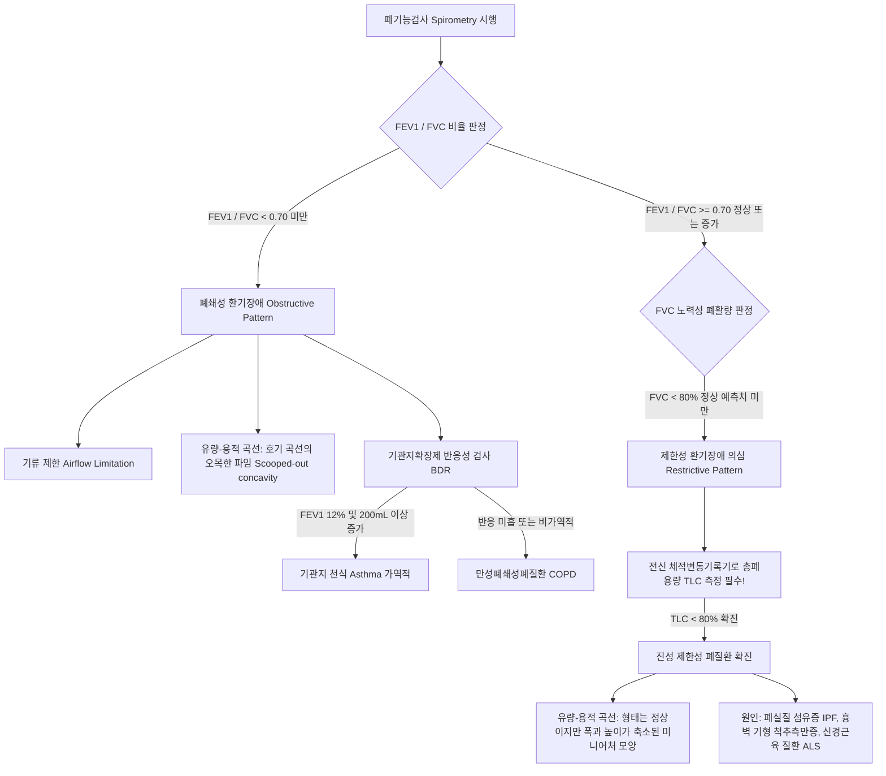
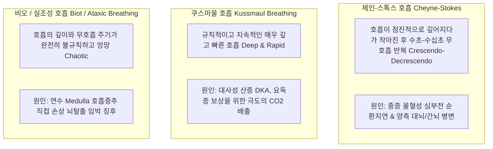

# Netter Respiratory Day 02: 호흡 생리학 (Pulmonary Physiology) — 폐역학·가스교환·환기혈류비·혈관대사·호흡조절 (pp. 49–79)

> 📖 **원서 출처**: [The Netter Collection - Volume 3, Respiratory System.pdf (pp. 49-79)](https://drive.google.com/file/d/1lDCEGUPEHrzTY10gPML28PbdcCYyY90a/view?usp=drivesdk)
> 🏷️ **범위**: Section 2: Physiology (Plate 2-1 ~ Plate 2-31, 총 31개 플레이트 전수 수록)
> 📌 **핵심 테마**: 흡기근(횡격막 75%, 외늑간근) 및 강제호기근(복벽근, 내늑간근), 스파이로메트리 4대 용적/용량과 바디 플레티스모그래피(Body Box, 폐기종 공기포획 측정), FRC에서의 폐-흉벽 탄성반발압 평형, 폐 순응도(Compliance, 폐기종 증가 vs 폐섬유증 저하)와 히스테리시스, 푸아죄유 법칙과 중등도 기관지(3~7세대) 최대 저항, 동적 기도 압박(Equal Pressure Point EPP의 상류 이동과 입술오므리기 호흡), 폐쇄용적(Closing Volume), 웨스트 3대 폐혈류 구역(West zones), 저산소성 폐혈관수축(HPV)과 폐성심, 폐포 기체 방정식 및 A-a $\text{DO}_2$ 감별(저환기 vs V/Q 불균등/단락), 산소-헤모글로빈 해리곡선(CADET 우측 이동), 폐혈관 내피의 혈관활성물질 대사(ACE 활성화, 브라디키닌/세로토닌 불활성화), 중추 화학수용체(CSF $\text{H}^+$, $\text{CO}_2$ 반응) vs 경동맥소체(동맥혈 $\text{PaO}_2 < 60\ \text{mmHg}$ 저산소 구동), 고산병 병태생리, 심부전 체인-스톡스(Cheyne-Stokes) 주기적 호흡.

---

## 1. 개요 및 마스터 요약 (Executive Summary)

* **호흡 역학 및 폐용적 (Plates 2-1 ~ 2-7)**:
  * **호흡근 역학**: 안정 시 흡기는 **횡격막 (안정 환기량의 75% 담당, 1~2 cm 하강)**과 외늑간근이 수행. 안정 시 호기는 근육 수축이 없는 **수동적 탄성 반발(Passive elastic recoil)** 과정. 강제 호기 시에는 **복벽근(복직근, 내외복사근, 복횡근)**과 내늑간근이 강력히 수축.
  * **기능적 잔기용량 (FRC)**: 안정 호기 말 폐에 남은 공기량. **폐의 안쪽으로 오그라들려는 탄성반발압과 흉곽의 바깥쪽으로 펼쳐지려는 반발압이 정확히 0으로 균형을 이루는 평형점**이며, 이때 흉막강 내압은 $-5\ \text{cmH}_2\text{O}$. 폐기종에서는 폐 탄성 소실로 FRC가 증가하고, 폐섬유증에서는 FRC가 급감.
  * **잔기량(RV) 및 FRC 측정**: 일반 스파이로메트리로는 측정 불가. **전신 체적변동기록기 (Body Plethysmography)**가 보일의 법칙($P_1 V_1 = P_2 V_2$)을 이용해 흉곽 내 갇힌 공기(Trapped gas)까지 측정하는 골드 스탠다드.
* **기도 저항 및 동적 기도 압박 (Plates 2-8 ~ 2-13)**:
  * **기도 저항의 최대 부위**: 전체 기도 저항의 80%는 상기도와 **중간 크기 기관지 (3~7세대 기관지)**에서 발생! (소기관지는 단면적이 병렬로 기하급수적 팽창하여 저항이 매우 작음 $\rightarrow$ 조기 병변이 숨어 있는 "침묵의 구역 Silent zone").
  * **등압점 (Equal Pressure Point, EPP)**: 강제 호기 시 기도 내압과 흉막압이 같아지는 지점. 폐기종에서는 폐 탄성반발압 소실로 EPP가 연골이 없는 소기관지 상류로 이동하여 **동적 기도 허탈(Dynamic collapse)** 초래 $\rightarrow$ **입술 오므리기 호흡(Pursed-lip breathing)**으로 기도 내압을 올려 EPP를 하류로 밀어냄.
  * **폐쇄용적 (Closing Volume, CV)**: 중력에 의해 기저부 흉막압이 덜 음압이므로, 호기 말 하엽 소기관지가 먼저 닫히기 시작하는 용적. CV가 FRC보다 커지면 정상 호흡 중에도 무기폐와 저산소혈증 유발 (노인, 흡연자, 앙와위).
* **폐순환, V/Q 불균등 및 가스 교환 (Plates 2-14 ~ 2-22)**:
  * **웨스트 폐혈류 3구역 (West Zones)**:
    * Zone 1 (폐첨부): $P_A > P_a > P_v$ (모세혈관 붕괴, 사강, PEEP 시 출현).
    * Zone 2 (중간부): $P_a > P_A > P_v$ (폭포 효과, $P_a - P_A$ 경사).
    * Zone 3 (폐기저부): $P_a > P_v > P_A$ (모세혈관 항상 개방, 최대 혈류).
  * **저산소성 폐혈관수축 (HPV)**: 폐포 $\text{PO}_2 < 60\ \text{mmHg}$ 시 해당 부위 폐소동맥이 수축하여 환기가 잘되는 곳으로 혈류를 돌림. 만성 전신 저산소증 시 전폐 모세혈관 수축으로 **폐동맥고혈압 및 폐성심 (Cor Pulmonale)** 유발.
  * **폐포 기체 방정식과 A-a $\text{DO}_2$**: $\text{PAO}_2 = 150 - 1.25 \times \text{PaCO}_2$.
    * 정상 A-a 단락차 ($5\sim15\ \text{mmHg}$): **저환기 (Hypoventilation, 진정제 과다/중증근무력증) 및 고산지대**.
    * 상승 A-a 단락차: **V/Q 불균등(COPD, 천식), 단락(Shunt, ARDS/폐렴/심장내 단락), 확산 장애(IPF)**. (단락은 100% 산소 투여로도 교정 불가!).
  * **산소-헤모글로빈 해리곡선 우측 이동 (CADET)**: $\text{CO}_2$ 상승, 산증(Acid/Bohr 효과), 2,3-DPG 상승, 운동(Exercise), 체온(Temp) 상승 $\rightarrow$ 조직 산소 방출 촉진.
* **폐의 비호흡 대사 및 호흡 조절 (Plates 2-23 ~ 2-31)**:
  * **폐 내피의 대사**: **안지오텐신 I $\rightarrow$ 안지오텐신 II 전환 (ACE 촉진)**, **브라디키닌(80%) 및 세로토닌(90%) 불활성화**. 에피네프린과 안지오텐신 II는 변화 없이 통과.
  * **호흡 조절 중추**:
    * **중추 화학수용체 (연수 복측)**: 뇌척수액(CSF)으로 확산된 $\text{CO}_2$가 형성한 **$\text{H}^+$ 이온**에 반응 (평상시 호흡의 일차 구동력).
    * **말초 화학수용체 (경동맥소체, CN IX)**: **동맥혈 $\text{PaO}_2 < 60\ \text{mmHg}$**에 반응 (저산소 구동 Hypoxic drive). 만성 $\text{CO}_2$ 저류 환자에게 고농도 산소 투여 시 저산소 구동 상실로 이산화탄소 혼수 유발 위험.
  * **체인-스톡스 호흡 (Cheyne-Stokes)**: 점증-점감성 과호흡 후 무호흡 반복. **중증 심부전 (순환 지연)** 및 양측 대뇌반구 병변.

---

## 2. 제1부: 호흡 근육, 폐용적 및 폐-흉벽 역학 (Plates 2-1 ~ 2-7)

### Plate 2-1 | 호흡근 (Muscles of Respiration)
![[Netter_V3_Plate2-1.png]]

#### 주호흡근 vs 보조호흡근의 역학적 기능
* **흡기근 (Inspiratory Muscles)**:
  1. **주흡기근 (Primary)**:
     * **횡격막 (Diaphragm)**: 안정 호흡 시 **일회 호흡량(Tidal volume)의 75%**를 생성. 수축 시 돔이 1~2 cm 하강(최대 심호흡 시 최대 10 cm 하강)하여 흉강의 상하 직경을 팽창시키고 흉막강 내 음압을 형성.
     * **외늑간근 (External intercostal mm.)**: 늑골을 상외측으로 들어 올려 흉곽의 전후 및 좌우 직경 팽창 (**양동이 손잡이 운동 Bucket-handle & 펌프 손잡이 운동 Pump-handle**).
  2. **보조흡기근 (Accessory, 운동, 호흡부전, 중증 천식 발작 시 동원)**:
     * **흉쇄유돌근 (SCM)**: 흉골병을 수직 거상.
     * **사각근 (Scalene mm., 전/중/후)**: 제1늑골 및 제2늑골 거상 고정.
     * 대흉근, 소흉근, 전거근.
* **호기근 (Expiratory Muscles)**:
  1. **안정 호기 (Quiet Expiration)**:
     * **완전한 수동적 과정 (Passive process, 근육 수축 0%)**. 흡기근이 이완하면서 폐 실질의 고유 탄성반발력(Elastic recoil)과 흉벽의 복원력에 의해 자율적으로 공기가 배출됨.
  2. **강제 호기근 (Forced Expiration, 기침, 발성, 운동, 천식/COPD 호기 장애 시)**:
     * **전복벽 근육군 (복직근, 외복사근, 내복사근, 복횡근)**: 복압을 급격히 상승시켜 이완된 횡격막을 흉강 상방으로 강력히 밀어올림.
     * **내늑간근 (Internal intercostal mm.)** 및 최내늑간근: 늑골을 강제로 하강시켜 흉강 용적 축소.

---

### Plate 2-2 | 스파이로메트리: 폐용적 및 폐용량 (Spirometry: Lung Volume and Measurement)
![[Netter_V3_Plate2-2.png]]

#### 4대 용적(Volumes)과 4대 용량(Capacities)
폐활량계(Spirometer) 곡선 상에서 기본 단위인 4개 용적과 둘 이상의 용적이 합쳐진 4개 용량으로 구분:

```
[ 최대 흡기위 (TLC: ~5800 mL) ] ───┐
   │                                  │ Inspiratory Capacity (IC: ~3500 mL)
   │ IRV (흡기예비용적: ~3000 mL)      │  (TV + IRV)
   │                                  │
[ 안정 흡기말 (End-inspiratory level) ] ───┼─────────────────────────────────────
   │ TV (일회호흡용적: ~500 mL)        │ Vital Capacity (VC: ~4600 mL)
[ 안정 호기말 (End-expiratory level) ] ───┼─ (IRV + TV + ERV)
   │                                  │                                   │
   │ ERV (호기예비용적: ~1100 mL)      │                                   │ Functional Residual
   │                                  │                                   │ Capacity (FRC: ~2300 mL)
[ 최대 호기위 (Residual level) ] ─────┴───────────────────────────────────┤  (ERV + RV)
   │                                                                      │
   │ RV (잔기용적: ~1200 mL, ★ 스파이로메트리 측정 불가!)                    │
[ 완전 허탈위 (Collapse) ] ───────────────────────────────────────────────┘
```

* **핵심 임상 포인트**:
  * **잔기용적 (Residual Volume, RV)**: 최대 노력성 호기 후에도 폐포 내에 불가피하게 남는 공기량. 폐포가 완전히 허탈(Atelectasis)되는 것을 방지함.
  * ⚠️ **스파이로메트리로 절대 측정할 수 없는 3대 지표**: **RV**, **FRC (ERV + RV)**, **TLC (VC + RV)**. (RV 성분을 포함하기 때문).

---

### Plate 2-3 | 기능적 잔기용량(FRC)의 측정법 (Determination of FRC)
![[Netter_V3_Plate2-3.png]]

#### 헬륨희석법, 질소세척법 vs 바디 플레티스모그래피(Body Box)
스파이로메트리로 측정할 수 없는 FRC를 측정하는 3대 특수 검사법:
1. **폐쇄회로 헬륨희석법 (Helium Dilution Method)**:
   * 헬륨은 혈액에 용해되지 않는 불활성 기체. 기지의 용적($V_1$)과 농도($C_1$)의 헬륨을 FRC 시점에서 호흡시켜 평형 농도($C_2$) 측정 $\rightarrow$ $C_1 V_1 = C_2 (V_1 + \text{FRC})$.
2. **개방회로 질소세척법 (Nitrogen Washout Method)**:
   * 폐포 내 공기의 79%가 질소임에 착안하여, 100% 순산소를 흡입시켜 날숨의 질소를 세척 모아 배출된 총 질소량으로 FRC 역산.
3. **전신 체적변동기록기 (Body Plethysmography / Body Box, GOLD STANDARD)**:
   * 밀폐된 챔버 내에 환자가 들어가 구강 셔터를 닫고 헐떡 호흡(Panting)을 할 때, 흉곽 내 압력 변화와 챔버 내 압력/부피 변화를 측정하여 **보일의 법칙 ($P_1 V_1 = P_2 V_2$)**을 적용.
   * **결정적 차이점**: 헬륨희석법과 질소세척법은 주기관지와 통기되는(Ventilated) 폐포의 공기만 측정 가능함. 반면 바디 플레티스모그래피는 **폐기종의 폐포 낭포(Bullae)나 기도 폐쇄로 갇힌 공기 (Trapped gas)까지 포함한 흉곽 내 총 가스 용적(TGV)을 완벽하게 측정**함. (중증 COPD 환자에서 $\text{FRC}_{\text{Pleth}} > \text{FRC}_{\text{Helium}}$ 소견 관찰).

---

### Plates 2-4 ~ 2-7 | 폐와 흉벽의 탄성 반발력 및 순응도 (Elastic Properties & Compliance)
![[Netter_V3_Plate2-4.png]] ![[Netter_V3_Plate2-5.png]] ![[Netter_V3_Plate2-6.png]] ![[Netter_V3_Plate2-7.png]]

#### 경폐압과 FRC 평형점의 물리생리학
* **경폐압 (Transpulmonary Pressure, $P_{\text{tp}}$)**:
  $$P_{\text{tp}} = P_{\text{alv}} - P_{\text{ip}} \quad (P_{\text{alv}}: \text{폐포 내압}, P_{\text{ip}}: \text{흉막강 내압})$$
  * 정상 상태에서 폐가 허탈되지 않고 팽창을 유지하려면 $P_{\text{tp}}$는 항상 양수($>0$)이어야 함.
* **FRC 평형점의 법칙 (Plate 2-7)**:
  * **폐 (Lung)**: 고무풍선과 같아서 항상 안쪽으로 오그라들려는 **내향성 탄성반발압 (Inward recoil)**을 가짐.
  * **흉벽 (Chest wall)**: 압축된 스프링과 같아서 항상 바깥쪽으로 튕겨 나가려는 **외향성 탄성반발압 (Outward recoil)**을 가짐.
  * **FRC 시점**: 안정 호기 말(FRC)에는 **폐의 내향성 반발력과 흉벽의 외향성 반발력의 크기가 정확히 같고 방향이 반대**가 되어 완벽한 기계적 평형을 이룸. 이 두 반대 방향의 장력이 맞물려 **흉막강 내압이 음압 ($-5\ \text{cmH}_2\text{O}$)**으로 유지됨.
  * *기흉(Pneumothorax) 시*: 흉벽에 구멍이 뚫려 대기압 공기가 유입되면 흉막강 음압이 소실(0이 됨) $\rightarrow$ 폐는 고유 탄성으로 즉각 쪼그라들고(허탈), 흉벽은 바깥으로 튀어나감.
* **폐 순응도 (Lung Compliance, $C = \Delta V / \Delta P$)의 병태별 변화**:
  * **순응도 증가 (잘 늘어남, 고무줄 탄성 소실)**: **폐기종 (Emphysema)**. 엘라스타아제 과다로 폐포 탄성 섬유가 파괴되어 폐가 쉽게 팽창하지만 탄성 반발력이 없어 호기가 극도로 힘들어짐 $\rightarrow$ 흉벽의 외향성 반발력이 우세해져 FRC와 TLC가 급증하고 **술통형 흉곽 (Barrel chest)** 형성.
  * **순응도 감소 (뻣뻣한 폐 Stiff lung, 잘 안 늘어남)**: **특발성 폐섬유증 (IPF), 급성 호흡곤란증후군 (ARDS), 폐부종**. 폐포벽 섬유화로 폐를 조금 늘리는 데도 막대한 압력이 필요 $\rightarrow$ FRC 및 TLC 급감.

---

## 3. 제2부: 기도 저항, 동적 압박 및 강제호기곡선 (Plates 2-8 ~ 2-13)

### Plates 2-8, 2-9, 2-10 | 기도 저항의 분포 및 등압점 (Airway Resistance & EPP)
![[Netter_V3_Plate2-8.png]] ![[Netter_V3_Plate2-9.png]] ![[Netter_V3_Plate2-10.png]]

#### 푸아죄유 법칙(Poiseuille)의 역설과 동적 기도 압박
* **기도 저항 ($R \propto 1/r^4$)의 최대 부위**:
  * 단일 도관의 저항은 반경의 4제곱에 반비례하므로 가장 좁은 세기관지가 저항이 가장 클 것 같지만, 실제 생체 내에서는 **중간 크기 기관지 (제3~7세대 기관지)**가 전체 기도 저항의 대부분을 차지함.
  * 소기관지(말초 기도)는 개별 직경은 작지만, 수만 개가 병렬(Parallel)로 배열되어 **총 단면적이 폭발적으로 넓어지므로 저항이 거의 0에 수렴**함. (따라서 초기 소기도 질환은 폐활량계에 잡히지 않는 "침묵의 구역 Silent zone").
* **동적 기도 압박 (Dynamic Airway Compression)과 등압점 (EPP)**:

```mermaid
graph LR
    subgraph 정상 폐 (Normal)
        A1[폐포압 Palv = +30<br>흉막압 +20 + 탄성반발압 +10] -->|공기 흐름에 따른 마찰 압력 강하| A2[등압점 EPP: Paw = +20<br>연골성 기관지에 위치]
        A2 --> A3[구강 쪽: Paw < +20<br>연골 골격이 압박을 방어하여 기도 개방 유지]
    end
    
    subgraph 폐기종 (Emphysema)
        B1[폐포압 Palv = +23<br>흉막압 +20 + 탄성반발압 +3 결손!] -->|압력 강하| B2[등압점 EPP: Paw = +20<br>말초 무연골 소기관지로 조기 상류 이동]
        B2 --> B3[하류 부위: 흉막압 +20 > 기도내압<br>연골 없는 소기도가 완전 짜부라짐 Dynamic Collapse!]
        B3 --> B4[공기 포획 Air Trapping & 심각한 호기 폐쇄]
    end
```

> ⚠️ **Clinical Pearl**:
> 폐기종 환자가 본능적으로 취하는 **입술 오므리기 호흡 (Pursed-lip breathing)**은 입술 부위에 인위적인 좁은 저항을 만들어 구강에서부터 상기도 전체의 기도 내압($P_{\text{aw}}$)을 인위적으로 높여줍니다. 이는 기도 밖 흉막압보다 내압을 높게 유지시켜 **등압점(EPP)을 말초 소기관지에서 연골이 있는 굵은 하류 기관지 쪽으로 밀어냄으로써 소기관지의 동적 허탈을 물리적으로 방지**하는 기전입니다.

---

### Plate 2-11 | 강제호기 폐활량 곡선 및 유량-용적 곡선 (PFT Curves)
![[Netter_V3_Plate2-11.png]]

#### 폐쇄성(Obstructive) vs 제한성(Restrictive) 패턴 완전 감별



---

### Plates 2-12, 2-13 | 호흡 일(Work of Breathing) 및 폐쇄용적 (Closing Volume)
![[Netter_V3_Plate2-12.png]] ![[Netter_V3_Plate2-13.png]]

#### 중력 경사도와 폐쇄용량 (Closing Capacity, CC)
* **흉막강 내압의 수직 중력 경사**:
  * 직립 시 폐의 자체 무게(중력)로 인해 **폐첨부 흉막압은 더 음압 ($-10\ \text{cmH}_2\text{O}$)**이고, **폐기저부 흉막압은 덜 음압 ($-2.5\ \text{cmH}_2\text{O}$)**임.
  * 따라서 폐첨부 폐포는 휴지기(FRC)에 이미 팽팽하게 늘어나 있어 순응도가 낮고, 폐기저부 폐포는 덜 늘어나 있어 순응도가 높음 $\rightarrow$ **정상 흡기 시 유입되는 환기량은 폐첨부보다 폐기저부에서 훨씬 큼**.
* **폐쇄용적 (Closing Volume, CV)과 폐쇄용량 (CC = CV + RV)**:
  * 날숨(호기)을 끝까지 뱉을 때, 흉막압이 덜 음압인 **폐기저부의 소기관지들이 폐포 지지력 약화로 먼저 폐쇄되기 시작하는 용적**.
  * **임상적 파탄**: 노화, 흡연, 수술 후 앙와위에서는 폐 탄성 저하로 폐쇄용량(CC)이 증가함. **만약 $\text{CC} > \text{FRC}$가 되면, 환자가 안정 시 숨을 쉴 때마다 날숨 끝에서 폐기저부 기도가 반복적으로 닫혀 무기폐, V/Q 불균등, 동맥혈 저산소혈증이 유발**됨.

---

## 4. 제3부: 폐순환, 가스 교환 및 환기-혈류비 (Plates 2-14 ~ 2-22)

### Plate 2-14 | 폐혈류의 분포: 웨스트 구역 (West's Zones of Pulmonary Blood Flow)
![[Netter_V3_Plate2-14.png]]

#### 폐포압($P_A$), 폐동맥압($P_a$), 폐정맥압($P_v$)의 상호작용
직립 자세에서 중력에 따른 정수압(Hydrostatic pressure) 차이로 인해 폐는 상하 3개 구역으로 나뉨:

| 웨스트 구역 (Zone) | 압력 관계 | 혈류 특성 및 기전 | 생리 및 임상적 의의 |
| :--- | :--- | :--- | :--- |
| **Zone 1 (폐첨부)** | **$P_A > P_a > P_v$** | **혈류 없음 (No flow)**. 폐포압이 모세혈관압보다 높아 모세혈관을 짓눌러 찌그러뜨림 | **정상인에서는 부재**. 출혈성 쇼크(저혈량증으로 $P_a$ 급락) 또는 **양압 인공호흡기(PEEP으로 $P_A$ 급상승)** 적용 시 출현 $\rightarrow$ **폐포 사강 (Alveolar dead space)** 형성 |
| **Zone 2 (중간부)** | **$P_a > P_A > P_v$** | **간헐적 혈류 (Waterfall / Starling resistor 효과)**. 혈류 구동력은 $(P_a - P_v)$가 아닌 **$(P_a - P_A)$**에 의해 결정됨 | 심장의 수축기에는 흐르고 이완기에는 멈춤 |
| **Zone 3 (폐기저부)** | **$P_a > P_v > P_A$** | **지속적 최대 혈류 (Continuous flow)**. 정수압 상승으로 모세혈관이 항상 활짝 열려 있음 | 혈류 구동력은 통상적인 동정맥압차 **$(P_a - P_v)$**에 의해 결정됨 |

---

### Plate 2-15 | 폐혈관 저항 (Pulmonary Vascular Resistance, PVR)
![[Netter_V3_Plate2-15.png]]

#### U자형 저항 곡선 및 저산소성 폐혈관수축 (HPV)
* **폐혈관 저항의 U자형 곡선 (FRC에서 최저)**:
  * **폐포 혈관 (Alveolar vessels)**: 폐포벽을 달림. 흡기 시 폐포가 팽창하면 모세혈관이 길이 방향으로 늘어나며 눌려 **고용적(TLC)에서 저항 급증**.
  * **간질/외폐포 혈관 (Extra-alveolar vessels)**: 폐 실질 결합조직이 팽창할 때 방사상 견인력(Radial traction)으로 혈관을 벌림. 호기 시 폐가 줄어들면 견인력이 사라져 **저용적(RV)에서 저항 급증**.
  * **결과**: 두 저항의 합인 **총 PVR은 안정 호기말 용적인 FRC에서 가장 낮음**.
* **저산소성 폐혈관수축 (Hypoxic Pulmonary Vasoconstriction, HPV)**:
  * 체순환 혈관은 저산소증 시 혈관이 확장되는 반면, **폐혈관은 폐포 $\text{PO}_2 < 60\ \text{mmHg}$ 저하 시 평활근이 강력히 수축**함.
  * **생리적 이점**: 환기가 안 되는 병변 폐포로 가는 혈류를 차단하고 환기가 잘되는 건강한 폐포로 혈류를 돌려 V/Q 불균등과 단락을 방어.
  * **병태생리적 파탄**: 고산지대 노출이나 중증 말기 만성폐질환(COPD, 폐섬유증)으로 전폐에 걸쳐 만성 저산소증이 지속되면, 전신의 폐소동맥이 일제히 수축하여 비가역적 혈관 재형성(중막 비대) $\rightarrow$ **폐동맥 고혈압 (Pulmonary Hypertension)** $\rightarrow$ 우심실 후부하 폭증으로 인한 **폐성심 (Cor Pulmonale / 우심실 비대 및 우심부전)** 초래.

---

### Plates 2-16, 2-17 | 산소·이산화탄소 이동 및 폐포 기체 방정식 (Blood Gas Relationships)
![[Netter_V3_Plate2-16.png]] ![[Netter_V3_Plate2-17.png]]

#### 폐포 기체 방정식과 A-a $\text{DO}_2$를 통한 저산소혈증 감별
* **폐포 기체 방정식 (Alveolar Gas Equation)**:
  $$\text{PAO}_2 = \text{FiO}_2 \times (P_{\text{atm}} - P_{\text{H}_2\text{O}}) - \frac{\text{PaCO}_2}{R} = 0.21 \times (760 - 47) - \frac{\text{PaCO}_2}{0.8} \approx 150 - 1.25 \times \text{PaCO}_2$$
* **폐포-동맥혈 산소분압차 ($\text{A-a }\text{DO}_2 = \text{PAO}_2 - \text{PaO}_2$)**:
  * 정상 성인 기준치: **$5\sim15\ \text{mmHg}$** (연령 보정 정상 상한치 $\approx \frac{\text{Age}}{4} + 4$).

| 저산소혈증 병태 기전 | A-a $\text{DO}_2$ 단락차 | $\text{PaCO}_2$ 수치 | $100\%\ \text{O}_2$ 반응성 | 대표 임상 원인 질환 |
| :--- | :--- | :--- | :--- | :--- |
| **1. 폐포 저환기 (Hypoventilation)** | **정상 ($<15$)** | **현저한 상승 ($>45$)** | **극적으로 교정됨** | 마약성 진통제(Opioids) 과다, 벤조디아제핀, 중증근무력증, 길랑-바레 |
| **2. 흡입 산소분압 저하** | **정상 ($<15$)** | 정상 또는 저하 | **교정됨** | 고산지대 (High altitude) 노출 |
| **3. 환기-혈류비 불균등 (V/Q Mismatch)** | **현저한 상승 ($>20$)** | 정상, 저하 또는 상승 | **교정됨** | **만성폐쇄성폐질환 (COPD), 천식, 폐색전증** |
| **4. 진성 우좌 단락 (True Shunt)** | **극단적 상승 ($>30\sim50$)** | 정상 또는 저하 | **절대 교정 안 됨! (Non-responsive)** | **급성 호흡곤란증후군 (ARDS), 광범위 폐렴, 폐포 무기폐, 활로사징(TOF)** |
| **5. 가스 확산 장애 (Diffusion Defect)** | **상승** | 정상 또는 저하 | 교정됨 | 특발성 폐섬유증 (IPF, 운동 시 저산소혈증 급격 악화) |

---

### Plates 2-18, 2-19 | 환기-혈류비(V/Q) 불균등 및 단락 (V/Q Relationships & Shunts)
![[Netter_V3_Plate2-18.png]] ![[Netter_V3_Plate2-19.png]]

#### $V/Q$ 스펙트럼과 100% 산소 반응성
전체 폐의 평균 $V/Q$ 비는 약 **0.8** (폐포 환기량 4 L/min $\div$ 폐혈류량 5 L/min):
* **폐첨부 vs 폐기저부의 생리적 차이**:
  * **폐첨부 (Apex)**: 환기도 적고 혈류도 적으나, 혈류가 훨씬 더 적음 $\rightarrow$ **높은 $V/Q$ 비 ($\approx 3.0$)**, $\text{PO}_2$ 130 mmHg (고산소 환경), $\text{PCO}_2$ 28 mmHg. $\rightarrow$ 호기성 균인 **결핵균(M. tuberculosis)이 폐첨부에 호발**하는 이유!
  * **폐기저부 (Base)**: 환기도 많고 혈류도 많으나, 혈류가 훨씬 더 많음 $\rightarrow$ **낮은 $V/Q$ 비 ($\approx 0.6$)**, $\text{PO}_2$ 89 mmHg, $\text{PCO}_2$ 42 mmHg.
* **$V/Q$ 양극단 스펙트럼**:
  1. **$V/Q = 0$ (진성 단락, True Shunt)**: 환기가 전혀 안 되는 폐포에 피만 흐름 (폐포 허탈, ARDS 폐포 침출액 저류). 탈산소혈이 산소화 없이 그대로 좌심방으로 직행하므로 **$100\%$ 산소를 투여해도 션트된 피는 산소를 만날 수 없어 동맥혈 $\text{PaO}_2$가 오르지 않음**.
  2. **$V/Q = \infty$ (사강 환기, Dead Space)**: 공기는 들어가나 혈류가 없음 (폐색전증 Pulmonary Embolism).

---

### Plate 2-20 | 산소 운반 및 헤모글로빈 해리곡선 (Oxygen Transport)
![[Netter_V3_Plate2-20.png]]

#### S자형 곡선과 CADET 우측 이동 인자
헤모글로빈 4량체의 산소 결합 협동성(Cooperativity)으로 인해 S자형(Sigmoidal) 해리 곡선을 형성:
* **우측 이동 (Right Shift, 헤모글로빈의 산소 친화도 감소 $\rightarrow$ $P_{50}$ 상승 $\rightarrow$ 말초 조직으로 산소 방출 촉진)**:
  * **"CADET face Right" 암기 공식**:
    * **C** — $\text{CO}_2$ 증가
    * **A** — $\text{Acid}$ 증가 (pH 감소, **보어 효과 Bohr effect**)
    * **D** — **$2,3\text{-DPG}$ 증가** (만성 저산소증, 빈혈, 고산지대 적응)
    * **E** — **Exercise (운동)**
    * **T** — **Temperature (체온 상승)**
* **좌측 이동 (Left Shift, 산소 친화도 증가 $\rightarrow$ $P_{50}$ 감소 $\rightarrow$ 산소를 꽉 쥐고 조직에 안 줌)**:
  * $\text{CO}_2$ 감소, 알칼리증(pH 상승), $2,3\text{-DPG}$ 감소, 저체온증, 태아 헤모글로빈(HbF), 일산화탄소 중독(CO-Hb), 메트헤모글로빈혈증.

---

### Plates 2-21, 2-22 | 산-염기 조절 및 폐 산화 손상 반응 (Acid-Base & Oxidant Injury)
![[Netter_V3_Plate2-21.png]] ![[Netter_V3_Plate2-22.png]]

#### 윈터스 공식 (Winters' Formula)과 대사성 산증 보상
* **헨더슨-하셀바흐 방정식**: $\text{pH} = 6.1 + \log \frac{[\text{HCO}_3^-]}{0.03 \times \text{PaCO}_2}$.
* **대사성 산증 시 호흡성 보상 평가 (윈터스 공식)**:
  $$\text{Expected PaCO}_2 = 1.5 \times [\text{HCO}_3^-] + 8 \pm 2$$
  * 측정된 $\text{PaCO}_2$가 공식 값보다 높으면: **대사성 산증 + 호흡성 산증 복합 장애** (호흡근 마비, COPD 동반).
  * 측정된 $\text{PaCO}_2$가 공식 값보다 낮으면: **대사성 산증 + 호흡성 알칼리증 복합 장애** (패혈증, 아스피린 중독).

---

## 5. 제4부: 폐의 비호흡 대사 기능 (Plates 2-23 ~ 2-24)

### Plates 2-23, 2-24 | 혈관활성물질의 폐 불활성화 및 활성화 (Lung Metabolism of Vasoactive Substances)
![[Netter_V3_Plate2-23.png]] ![[Netter_V3_Plate2-24.png]]

#### 내피세포막 효소계의 대사 선택성
전신 정맥혈 전체(심박출량 100%)가 통과하는 거대한 모세혈관 내피 표면을 이용하여 순환 호르몬을 선택적으로 변환:

| 물질 분류 | 폐 순환 통과 시 대사 양상 | 작용 효소 및 처리 기전 | 임상적 생리 의의 |
| :--- | :--- | :--- | :--- |
| **안지오텐신 I (Ang I)** | **강력한 활성화 ($\uparrow$)** | 모세혈관 내피 표면의 **ACE (Angiotensin Converting Enzyme)**에 의해 2개 아미노산 절단 $\rightarrow$ **안지오텐신 II (Ang II)로 전환** | 전신 혈압 및 체액 조절의 핵심 관문 (ACEi 약물 작용점) |
| **브라디키닌 (Bradykinin)** | **완전 불활성화 (80% $\downarrow$)** | **ACE (Kininase II)**에 의해 비활성 펩타이드로 신속 분해 | ACE 억제제 사용 시 브라디키닌 축적으로 **마른기침 및 혈관부종** 유발 |
| **세로토닌 (5-HT)** | **거의 전량 제거 (90% $\downarrow$)** | 내피세포막 SERT 수송체로 세포 내 흡수 후 **MAO**에 의해 분해 | 유암종 증후군에서 좌심판막이 보존되는 분자적 이유 |
| **프로스타글란딘 ($\text{PGE}_1, \text{E}_2, \text{F}_{2\alpha}$)** | **광범위 불활성화 (90% $\downarrow$)** | 15-hydroxyprostaglandin dehydrogenase에 의해 첫 통과 시 분해 | 전신 혈관 이완 방지 |
| **노르에피네프린** | 부분 불활성화 (30~40% $\downarrow$) | Uptake-1 매개 흡수 | 국소 농도 조절 |
| **에피네프린, 도파민** | **대사되지 않고 100% 통과** | 불활성화 효소 없음 | 부신수질 호르몬의 전신 표적 장기 전달 보장 |
| **안지오텐신 II, 바소프레신(ADH)** | **대사되지 않고 통과** | 불활성화 없음 | 전신 혈관 수축 작용 유지 |

---

## 6. 제5부: 호흡 조절 및 호흡 패턴 장애 (Plates 2-25 ~ 2-31)

### Plates 2-25, 2-26 | 호흡의 화학적 및 신경성 조절 (Control of Respiration)
![[Netter_V3_Plate2-25.png]] ![[Netter_V3_Plate2-26.png]]

#### 중추 화학수용체(CSF $\text{H}^+$) vs 말초 화학수용체(경동맥소체 $\text{PaO}_2$)
1. **중추 화학수용체 (Central Chemoreceptors, 연수 복외측면)**:
   * **평상시 분당 환기량을 조절하는 가장 중요한 일차 수용체**.
   * 혈액 속의 $\text{H}^+$ 이온은 혈액-뇌 장벽(BBB)을 통과하지 못함.
   * 지용성인 **$\text{CO}_2$가 BBB를 자유롭게 통과**하여 뇌척수액(CSF)으로 진입 $\rightarrow$ 탄산탈수효소에 의해 $\text{CO}_2 + \text{H}_2\text{O} \rightarrow \text{H}^+ + \text{HCO}_3^-$ 반응 $\rightarrow$ **CSF의 $\text{H}^+$ 이온이 중추 화학수용체를 직접 자극**하여 호흡 촉진.
2. **말초 화학수용체 (Peripheral Chemoreceptors)**:
   * **경동맥소체 (Carotid bodies, 설인신경 CN IX 전달)** 및 대동맥소체(Aortic bodies, 미주신경 CN X).
   * 사구세포(Glomus cells)가 **동맥혈 저산소증 ($\text{PaO}_2 < 60\ \text{mmHg}$)**에 의해 칼륨 통로가 닫히며 탈분극되어 신경전달물질 방출. 동맥혈 $\text{pH}$ 감소(산증)와 $\text{PaCO}_2$ 상승에도 반응.
   * ⚠️ **만성 고탄산혈증(COPD) 환자의 산소 요법 주의점**: 만성적인 $\text{CO}_2$ 저류 환자는 CSF 내에 $\text{HCO}_3^-$가 보상적으로 축적되어 중추 화학수용체가 둔마(탈감작)됨. 따라서 오직 경동맥소체의 **저산소 구동 (Hypoxic drive)**에 의해서만 겨우 호흡을 유지함. 이때 고농도 산소(FiO2 50% 이상)를 무분별하게 투여하면 **경동맥소체 신호가 꺼지고, V/Q 불균등 악화 및 할데인 효과(Haldane effect)가 겹쳐 급성 $\text{CO}_2$ 기면 혼수(CO2 Narcosis)로 사망**할 수 있음 (목표 산소포화도 88~92% 유지).
3. **뇌간 호흡 중추의 계층 구조**:
   * **배측 호흡군 (DRG)**: 고립로핵에 위치, 흡기 리듬 조절.
   * **복측 호흡군 (VRG / Pre-Bötzinger Complex)**: **호흡의 페이스메이커 (Pacemaker)**.
   * **교뇌 호흡 조절 중추**: 상부 호흡조절중추(Pneumotaxic center, 흡기 시간 제한 및 호흡수 증가) 및 하부 지속흡기중추(Apneustic center).
   * **헤링-브로이어 흡기억제 반사 (Hering-Breuer Reflex)**: 폐가 과도하게 팽창하면 기도 평활근의 신전수용체가 미주신경을 통해 흡기를 강제 차단하여 폐 파열 방지.

---

### Plates 2-27 ~ 2-29 | 운동, 고산 환경 및 과환기/저환기 (Altitude & Exercise)
![[Netter_V3_Plate2-27.png]] ![[Netter_V3_Plate2-28.png]] ![[Netter_V3_Plate2-29.png]]

#### 고산지대(High Altitude)의 병태 및 순응 기전
* **병태생리**: 고도가 올라가도 산소 분율(21%)은 일정하지만, 대기압($P_{\text{atm}}$)이 급감하여 **흡입 산소분압($\text{PiO}_2$)이 급격히 저하**.
* **순응(Acclimatization)의 4단계 연쇄 반응**:
  1. 경동맥소체 자극 $\rightarrow$ 과환기(Hyperventilation) $\rightarrow$ 호흡성 알칼리증 ($\text{PaCO}_2$ 저하).
  2. 신장의 보상: 24~72시간에 걸쳐 **요중 $\text{HCO}_3^-$ 배설 촉진**으로 혈액 pH 정상화. (고산병 예방약인 **아세타졸아미드 [Acetazolamide]**는 탄산탈수효소를 억제하여 신장 중탄산염 배설을 강제 촉진함으로써 대사성 산증을 유도하여 과환기를 유지시킴).
  3. 신장 저산소증 $\rightarrow$ **에리스로포이에틴 (EPO) 분비 급증** $\rightarrow$ 적혈구증가증(Polycythemia)으로 산소 운반능력 극대화.
  4. 적혈구 내 **$2,3\text{-DPG}$ 증가** $\rightarrow$ 산소해리곡선 우측 이동으로 조직 산소 공급 원활화.
  5. 전폐 저산소성 폐혈관수축(HPV)으로 폐동맥압 상승 $\rightarrow$ 심하면 폐모세혈관 내피 파열로 **고산성 폐부종 (HAPE)** 및 뇌혈관 확장에 의한 **고산성 뇌부종 (HACE)** 발생.

---

### Plates 2-30, 2-31 | 주기적 호흡 (Cheyne-Stokes) 및 이상 호흡 패턴 (Periodic Breathing)
![[Netter_V3_Plate2-30.png]] ![[Netter_V3_Plate2-31.png]]

#### 3대 병적 호흡 패턴의 신경해부학적 국소화



---

## 7. 제6부: 핵심 호흡생리 수식 및 감별 매트릭스 (Master Synthesis Matrix)

### 1. 호흡기내과 핵심 계산 공식 및 진단 매트릭스

| 생리학적 평가 지표 | 표준 계산 공식 | 정상 기준치 | 임상적 의미 및 응용 질환 |
| :--- | :--- | :--- | :--- |
| **폐포 기체 방정식** | $\text{PAO}_2 = \text{FiO}_2(P_{\text{B}} - 47) - \frac{\text{PaCO}_2}{0.8}$ | 대기압 룸에어 시 $\approx 150 - 1.25(\text{PaCO}_2)$ | 폐포 수준의 이론적 산소분압 계산 |
| **폐포-동맥혈 산소분압차** | $\text{A-a }\text{DO}_2 = \text{PAO}_2 - \text{PaO}_2$ | $5\sim15\ \text{mmHg}$ ($\text{Age}/4 + 4$) | 정상: 단순 저환기/고산 / 상승: V/Q 불균등, 단락, IPF |
| **폐쇄성 폐질환 지표** | $\text{FEV}_1 / \text{FVC}$ | $\ge 0.70$ ($70\%$) | $< 0.70$ 시 폐쇄성 환기장애 (COPD, 천식) |
| **생리적 사강 비율 (Bohr)** | $\frac{V_D}{V_T} = \frac{\text{PaCO}_2 - P_{\bar{E}\text{CO}_2}}{\text{PaCO}_2}$ | $0.20\sim0.35$ (약 1/3) | 폐색전증이나 기계환기 시 사강 비율 급증 |
| **폐혈관 저항 (PVR)** | $\text{PVR} = \frac{\text{MPAP} - \text{PCWP}}{\text{Cardiac Output}} \times 80$ | $< 240\ \text{dynes}\cdot\text{sec}\cdot\text{cm}^{-5}$ ($< 3\ \text{Wood units}$) | 폐동맥 고혈압 진단 기준 ($\ge 3\ \text{Wood units}$) |
| **대사성 산증 보상 공식** | $\text{Expected PaCO}_2 = 1.5[\text{HCO}_3^-] + 8 \pm 2$ | 환자 측정치와 비교 | 윈터스 공식: 복합 산염기 장애 감별 |

---

## 8. 제7부: Netter 원서 기반 로컬 이미지 일괄 추출 스크립트 (Python Script)

로컬 환경에서 원서 PDF로부터 Section 2에 해당하는 31개 플레이트 전수 이미지를 추출하여 `첨부파일` 폴더에 옵시디언 규격(`![[Netter_V3_Plate2-X.png]]`)으로 저장하는 완전 자동화 코드입니다:

```python
import fitz  # PyMuPDF
import os

pdf_path = "The Netter Collection - Volume 3, Respiratory System.pdf"
output_dir = "./헤르메스/책 읽기/Netter_Vol3_호흡기계/첨부파일"
os.makedirs(output_dir, exist_ok=True)

doc = fitz.open(pdf_path)

plates_info = [
    ("Plate2-1", "Muscles of Respiration"),
    ("Plate2-2", "Spirometry: Lung Volume and Measurement"),
    ("Plate2-3", "Determination of Functional Residual Capacity (FRC)"),
    ("Plate2-4", "Forces During Quiet Breathing"),
    ("Plate2-5", "Measurement of Elastic Properties of the Lung"),
    ("Plate2-6", "Surface Forces In the Lung"),
    ("Plate2-7", "Elastic Properties of the Respiratory System: Lung and Chest Wall"),
    ("Plate2-8", "Distribution of Airway Resistance"),
    ("Plate2-9", "Patterns of Airflow"),
    ("Plate2-10", "Expiratory Flow"),
    ("Plate2-11", "Forced Expiratory Vital Capacity Maneuver"),
    ("Plate2-12", "Work of Breathing"),
    ("Plate2-13", "Pleural Pressure Gradient and Closing Volume"),
    ("Plate2-14", "Distribution of Pulmonary Blood Flow"),
    ("Plate2-15", "Pulmonary Vascular Resistance"),
    ("Plate2-16", "Pathways and Transfers of O2 and CO2"),
    ("Plate2-17", "Blood Gas Relationships During Normal Ventilation and Alveolar Hypoventilation"),
    ("Plate2-18", "Ventilation-Perfusion Relationships"),
    ("Plate2-19", "Shunts"),
    ("Plate2-20", "Oxygen Transport"),
    ("Plate2-21", "Role of Lungs and Kidneys in Regulation of Acid-Base Balance"),
    ("Plate2-22", "Response to Oxidant Injury"),
    ("Plate2-23", "Inactivation of Circulating Vasoactive Substances"),
    ("Plate2-24", "Activation of Circulating Precursors of Vasoactive Substances"),
    ("Plate2-25", "Chemical Control of Respiration (Feedback Mechanism)"),
    ("Plate2-26", "Neural Control of Breathing"),
    ("Plate2-27", "Respiratory Response to Exercise"),
    ("Plate2-28", "Effects of High Altitude on Respiratory Mechanism"),
    ("Plate2-29", "Hyperventilation and Hypoventilation"),
    ("Plate2-30", "Periodic Breathing (Cheyne-Stokes)"),
    ("Plate2-31", "Sites of Pathologic Disturbances in Control of Breathing")
]

print(f"총 {len(plates_info)}개 플레이트 추출 시작...")

for plate_id, plate_title in plates_info:
    num_suffix = plate_id.replace("Plate2-", "")
    search_terms = [f"Plate 2-{num_suffix}", f"2-{num_suffix}", plate_title.lower()]
    
    target_page = None
    for page_num in range(len(doc)):
        text = doc[page_num].get_text().lower()
        if any(term.lower() in text for term in search_terms):
            target_page = page_num
            break
            
    if target_page is not None:
        page = doc[target_page]
        pix = page.get_pixmap(matrix=fitz.Matrix(3.0, 3.0))
        img_filename = f"Netter_V3_{plate_id}.png"
        pix.save(os.path.join(output_dir, img_filename))
        print(f"✅ [추출 성공] {img_filename} (PDF p.{target_page+1})")
    else:
        print(f"⚠️ [미발견] {plate_id}: {plate_title}")

doc.close()
print("=== Section 2 전체 31개 플레이트 이미지 추출 완료 ===")
```
