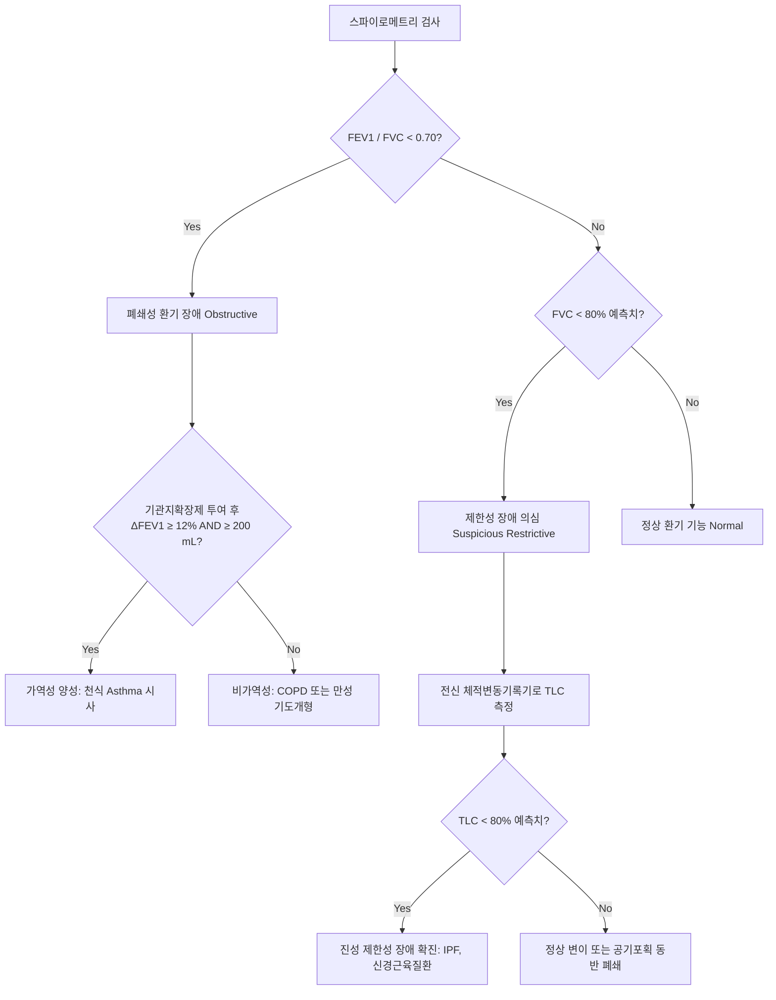
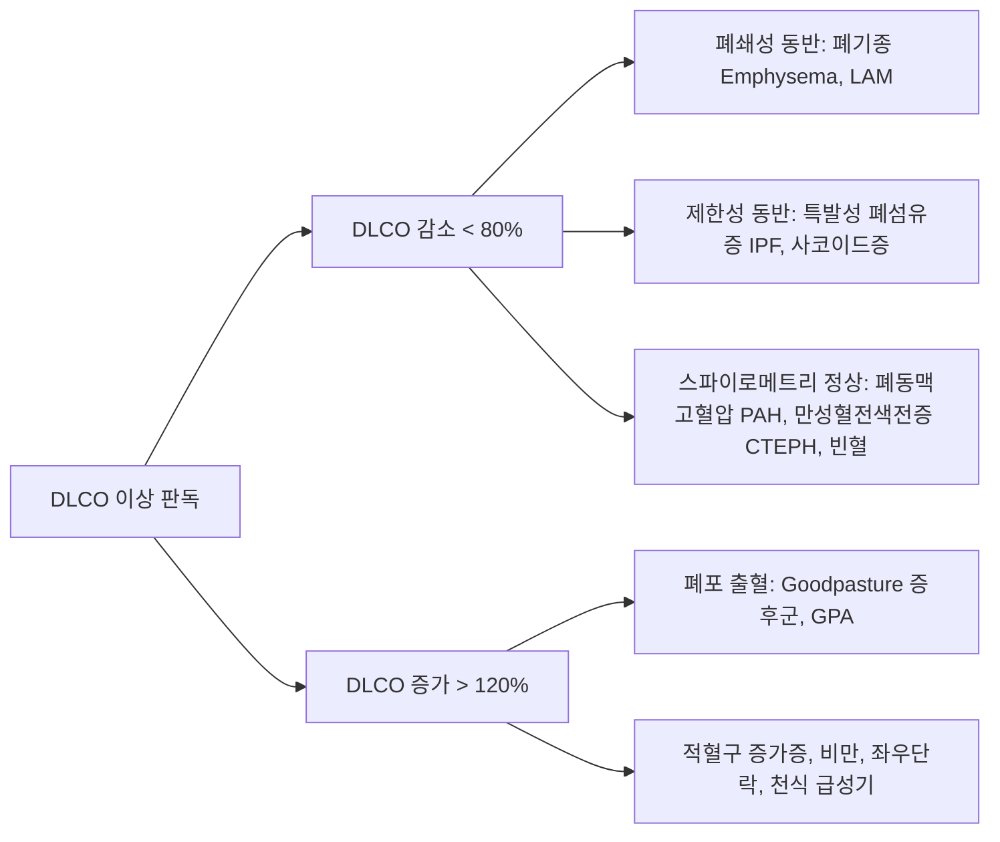
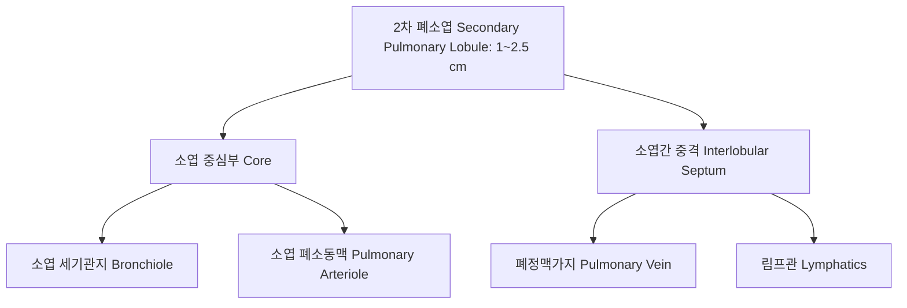
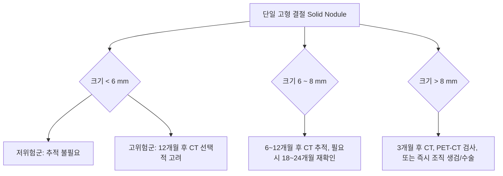
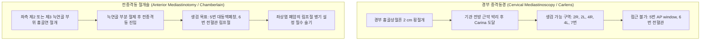

# Netter Respiratory Day 03: 호흡기 진단 검사 및 영상의학 (Diagnostic Procedures) — 폐기능검사·흉부영상판독·무기폐패턴·기관지내시경·EBUS·종격동경 (pp. 82–107)

> 📖 **원서 출처**: [The Netter Collection - Volume 3, Respiratory System.pdf (pp. 82-107)](https://drive.google.com/file/d/1lDCEGUPEHrzTY10gPML28PbdcCYyY90a/view?usp=drivesdk)
> 🏷️ **범위**: Section 3: Diagnostic Procedures (Plate 3-1 ~ Plate 3-26, 총 26개 플레이트 전수 수록)
> 📌 **핵심 테마**: 스파이로메트리 폐기능검사 판독(폐쇄성 $FEV_1/FVC < 0.70$ 및 기관지확장제 가역성 반응 기준 $\Delta 12\%$ & $200\text{ mL}$, 제한성 패턴의 TLC 확진 기준), 기류-용적 곡선(Flow-Volume loop) 3대 상기도 폐쇄 패턴(고정형, 가변성 흉곽외형, 가변성 흉곽내형), 일산화탄소 확산능(DLCO) 감별 진단 및 메타콜린 유발시험, 흉부 X-선 판독 원칙(PA/Lateral, 척추 징후 Spine sign, 실루엣 징후 Silhouette sign, 측와위 Decubitus 검사의 10 mm 흉막액 기준), 나선형/고해상도 흉부 CT(HRCT)와 밀러 2차 폐소엽(Secondary pulmonary lobule), 기관지조영술과 보이덴 18개 분지 체계, 폐동맥 조영술과 폐색전증 직간접 징후, 18F-FDG PET-CT 폐암 병기 설정 및 SUV 한계, 루베르-크라우스(Lubert-Krause) 5대 폐엽 허탈 패턴(골든 역S 징후, 루프트지헬 징후, 돛 징후), 폐포성(Air bronchogram, 나비날개 음영) vs 간질성(망상·결절·간유리·벌집폐) 음영 감별, 폐결절 3대 분포(림프주위성, 무작위성, 소엽중심성), 고립성 폐결절(SPN) 양악성 감별 및 플라이슈너 가이드라인, 기관지확장증 인환 징후(Signet-ring sign), 종격동 3대 구획 질환(전종격동 4T, 힐럼 중첩 징후, 경추흉곽 징후), 호기 산화질소(FeNO) 2형 염증 평가, 굴곡성 기관지내시경(BAL, TBLB) vs 경성 기관지내시경(대량각혈, 이물, 스텐트), 기관지초음파(EBUS-TBNA) 림프절 병기 설정(Station 2, 4, 7, 10, 11), 경부 종격동경(Carlens) vs 전종격동절개술(Chamberlain).

---

## 1. 개요 및 마스터 요약 (Executive Summary)

* **폐기능 검사 판독 알고리즘 (Plates 3-1 ~ 3-3)**:
  * **폐쇄성 환기 장애 (Obstructive defect)**: $FEV_1/FVC < 0.70$ (또는 하한치 LLN 미만). 기관지확장제 반응(BDR) 양성은 속효성 $\beta_2$ 작용제 투여 후 $FEV_1$ 또는 $FVC$가 **$\ge 12\%$ AND $\ge 200\text{ mL}$** 증가할 때 정의됨 (천식 진단 및 COPD 가역성 평가).
  * **제한성 환기 장애 (Restrictive defect)**: 스파이로메트리상 $FEV_1/FVC \ge 0.70$이면서 $FVC < 80\%$일 때 의심하되, **반드시 전신 체적변동기록기(Body Plethysmography)로 총폐용량(TLC) $< 80\%$를 직접 확인해야만 확진**.
  * **기류-용적 곡선(Flow-Volume Loop) 상기도 폐쇄 3대 패턴**:
    1. **고정형 상기도 폐쇄 (Fixed UAO, 기관 협착/갑상선종)**: 흡기 및 호기 곡선이 모두 평탄화 ($FIF_{50} \approx FEF_{50}$, 비율 $\approx 1.0$).
    2. **가변성 흉곽외 폐쇄 (Variable Extrathoracic, 성대 마비/후두 부종)**: 흡기 곡선만 평탄화, 호기는 정상 ($FEF_{50}/FIF_{50} > 1.0$).
    3. **가변성 흉곽내 폐쇄 (Variable Intrathoracic, 기관연화증/기관내 종양)**: 호기 곡선만 평탄화, 흡기는 정상 ($FEF_{50}/FIF_{50} < 1.0$).
  * **일산화탄소 확산능 (DLCO)**: 폐포 모세혈관막의 가스 교환 면적과 두께를 반영. 폐쇄성 장애 중 **천식은 DLCO 정상/증가**, **폐기종은 DLCO 감소**. 제한성 장애 중 **폐섬유증(IPF)은 DLCO 감소**, **신경근육 질환/흉곽기형은 DLCO 정상**.
* **흉부 방사선 및 CT 영상의학 원칙 (Plates 3-4 ~ 3-10)**:
  * **흉부 X-선 3대 기본 징후**:
    * **실루엣 징후 (Silhouette sign)**: 동일한 방사선 음영(물 음영)을 가진 두 구조물이 해부학적으로 맞닿아 있을 때 경계면이 소실되는 현상 (예: 우심연 소실 = 우중엽 병변, 좌심연 소실 = 좌상엽 설부 병변, 횡격막 음영 소실 = 하엽 기저부 병변).
    * **척추 징후 (Spine sign)**: 측면 흉부 사진에서 흉추는 하부로 갈수록 투과성이 증가하여 더 어두워져야 정상. 하부 흉추가 비정상적으로 희게 보이면 하엽 폐렴/종괴/무기폐 시사.
    * **공기 기관지상 (Air bronchogram)**: 액체나 삼출물로 채워진 폐포 음영 속에서 공기를 함유한 개방된 기관지가 검은 분지형 관으로 투영되는 소견 (폐포성 질환의 결정적 징후).
  * **측와위 X-선 (Lateral Decubitus)**: 환측을 아래로 하여 촬영 시 **흉막 삼출액 두께 $\ge 10\text{ mm}$**이면 안전한 흉강천자(Thoracentesis) 가능 및 유동성 흉수 확인.
  * **밀러 2차 폐소엽 (Secondary Pulmonary Lobule, 1~2.5 cm)**: HRCT 판독의 기본 단위. 중심에는 소엽중심 세기관지 및 소엽 폐동맥이 주행하고, 소엽간 중격(Interlobular septum)에는 폐정맥과 림프관이 주행.
* **무기폐 및 폐엽 허탈 패턴 (Lubert & Krause, Plates 3-11 ~ 3-12, 3-16)**:
  * **우상엽(RUL) 허탈**: 소엽간열이 상내측으로 이동. 중심부 폐암에 의한 기관지 폐쇄 시 하방으로 볼록한 종양 음영과 결합하여 **골든 역S 징후 (Golden's reverse S sign)** 형성.
  * **좌상엽(LUL) 허탈**: 주엽간열이 전상방으로 전위되며 전폐야에 베일 같은 음영(Ground-glass veil) 형성. 좌하엽 상분절(B6)이 과팽창하여 대동맥궁과 허탈된 상엽 사이에 끼어들며 **루프트지헬 징후 (Luftsichel sign, 초승달 징후)** 형성.
  * **좌하엽(LLL) 허탈**: 후내측으로 허탈되어 심장 뒤쪽에서 삼각형의 돛 모양 음영(**Flat waist sign / Sail sign**)을 형성하고 척추 징후 양성.
* **실질 병변, 폐결절 및 종격동 감별 진단 (Plates 3-13 ~ 3-19)**:
  * **폐결절 3대 분포**: 림프주위성(Perilymphatic, 유육종증/암종증), 무작위성(Random/Miliary, 결핵/진균/혈행성 전이암), 소엽중심성(Centrilobular, 과민성 폐장염/세기관지염/Tree-in-bud).
  * **고립성 폐결절 (SPN, $\le 3\text{ cm}$)**: 중심부·층상·팝콘형 석회화는 양성(과오종 Hamartoma 등), 편심성·점상 석회화 및 침상 변연(Spiculation)은 악성 시사.
  * **종격동 종괴 감별 (Felson 징후)**:
    * **전종격동 4T**: Thymoma(흉선종), Teratoma(기형종), "Terrible" Lymphoma(림프종), Thyroid goiter(흉골하 갑상선종).
    * **힐럼 중첩 징후 (Hilum overlay sign)**: 종괴를 투과하여 폐문 혈관이 보이면 종괴는 폐문이 아닌 전종격동 또는 후종격동에 위치.
    * **경추흉곽 징후 (Cervicothoracic sign)**: 쇄골 상방에서 상부 경계가 선명하면 후종격동, 경계가 소실되면 전종격동/경부 기원.
* **내시경 및 침습적 진단 기법 (Plates 3-20 ~ 3-26)**:
  * **호기 산화질소 (FeNO)**: 기도 상피의 iNOS에 의한 2형 호산구성 염증 지표. $>50\text{ ppb}$는 흡입 스테로이드(ICS)에 탁월한 반응성 및 천식 염증 활성도를 반영.
  * **굴곡성 vs 경성 기관지내시경**: 굴곡성은 국소마취 하 진단적 BAL(세포분획 분석: 사코이드증 $CD4/CD8 > 3.5$), TBLB에 활용. 경성은 전신마취 하 **대량 각혈 조절(풍선 탐포나데, 폐 격리), 소아 이물 제거, 실리콘 스텐트 거치, 레이저 절제**의 절대적 표준.
  * **기관지초음파 (EBUS-TBNA)**: 볼록형 탐촉자(Curved probe, 7.5 MHz)와 도플러를 이용해 혈관을 피하면서 종격동/폐문부 림프절(Station 2, 4, 7, 10, 11)을 실시간 천자 생검. 폐암 종격동 병기 설정에서 침습적 종격동경을 대체.
  * **경부 종격동경 (Carlens)**: Station 2R, 2L, 4R, 4L, 7번 림프절 생검 가능. 대동맥궁에 가려진 **Station 5(대동맥폐창 AP window) 및 Station 6(전혈관 림프절)**은 접근 불가하므로 **좌측 전종격동절개술 (Chamberlain procedure)** 시행 필수.

---

## 2. 플레이트별 상세 해설 (Plates 3-1 ~ 3-26)

### Plate 3-1 | 폐기능 검사 I: 폐용적 및 스파이로메트리 (Tests of Pulmonary Function: Lung Volumes and Spirometric Measures)
![[Netter_V3_Plate3-1.png]]

* **핵심 기전 및 생리검사학**:
  * **스파이로메트리(Spirometry)**는 호흡기 질환 진단의 일차적 선별 도구로, 시간-용적 곡선(Volume-Time curve)과 기류-용적 곡선(Flow-Volume curve)을 동시에 기록함.
  * **주요 스파이로메트리 지표**:
    * **노력성 폐활량 (FVC, Forced Vital Capacity)**: 최대 흡기 후 끝까지 가장 빠르고 강하게 뱉어낸 전체 공기량 (정상 예측치 $\ge 80\%$).
    * **1초간 노력성 호기량 ($FEV_1$, Forced Expiratory Volume in 1 second)**: 최대 호기 시작 후 첫 1초 동안 배출된 용적. 기도 저항과 폐 탄성반발압을 종합적으로 반영 (정상 예측치 $\ge 80\%$).
    * **$FEV_1/FVC$ 비 (Tiffeneau-Pinelli Index)**: 성인 정상치는 $0.70\sim0.80$ (70~80%). 폐쇄성 환기 장애를 정의하는 가장 핵심적인 분별 기준.
    * **강제 중간호기 기류속도 ($FEF_{25-75\%}$, Forced Expiratory Flow at 25–75% of FVC)**: 최대 노력에 덜 의존적이며, **말초 소기도(내경 $<2\text{ mm}$)의 조기 폐쇄**를 예민하게 반영.
  * **스파이로메트리 질 관리 기준 (ATS/ERS 2019 표준)**:
    * 시작 기준: 외삽 용적(Back-extrapolated volume, EV)이 $FVC$의 $5\%$ 미만 또는 $<100\text{ mL}$이어야 함.
    * 종료 기준: 최소 6초 이상 호기 유지(소아는 3초) 및 호기 말 기류 평탄화(Plateau, 1초 동안 용적 변화 $<25\text{ mL}$).
    * 재현성(Repeatability): 허용 가능한 최소 3회 시도 중 가장 큰 2개의 $FVC$와 $FEV_1$ 차이가 각각 $150\text{ mL}$ ($FVC < 1.0\text{ L}$인 경우 $100\text{ mL}$) 이내여야 함.
* **환기 장애 판독 알고리즘**:

> ⚠️ **Clinical Pearl**:
> 스파이로메트리 단독으로 "제한성 환기 장애"를 확진하는 것은 금기입니다. 심한 공기 포획(Air trapping)이 있는 중증 COPD 환자에서도 잔기량(RV)이 급증하면서 상대적으로 FVC가 80% 미만으로 감소하여 제한성 장애처럼 오인될 수 있습니다. 진성 제한성 장애는 **반드시 총폐용량(TLC) $< 80\%$**를 바디 플레티스모그래피로 검증해야 합니다.

---

### Plate 3-2 | 폐기능 검사 II: 기류-용적 곡선 및 상기도 폐쇄 (Tests of Pulmonary Function: Flow-Volume Loops and Upper Airway Obstruction)
![[Netter_V3_Plate3-2.png]]

* **핵심 기전 및 곡선 분석**:
  * **기류-용적 곡선(Flow-Volume Loop)**은 Y축에 기류속도(L/s), X축에 폐용적(L)을 배치하여 최대 흡기 및 강제 호기 과정을 2차원 폐곡선으로 시각화함.
  * **질환별 기류-용적 곡선 형태학**:
    * **정상 (Normal)**: 호기 초기 최대 호기 유속(PEF)에 도달한 후 잔기량(RV)까지 거의 선형으로 곧게 하강. 흡기 곡선은 대칭적인 반원형(C-shape).
    * **폐쇄성 폐질환 (COPD / 천식)**: 최대 호기 유속 급감, 호기 곡선 후반부가 안쪽으로 깊게 패이는 **오목한 국자 모양(Scooped-out / Coving appearance)**. FRC와 RV가 우측으로 이동(공기 포획).
    * **제한성 폐질환 (IPF / 흉벽질환)**: 곡선의 가로 폭(FVC)이 좁아지지만, 높은 폐 탄성반발압으로 인해 기류 속도는 상대적으로 보존되어 가늘고 긴 "마녀의 모자(Witch's hat)" 모양.
* **상기도 폐쇄 (Upper Airway Obstruction, UAO) 3대 패턴 비교**:
| 분류 | 해부학적 위치 및 기전 | 호기 곡선 (Expiratory) | 흡기 곡선 (Inspiratory) | $FEF_{50} / FIF_{50}$ 비 | 대표 원인 질환 |
| :--- | :--- | :--- | :--- | :--- | :--- |
| **고정형 폐쇄 (Fixed UAO)** | 흉곽 내외 무관하게 내경이 고정됨 | **평탄화 (Plateau)** | **평탄화 (Plateau)** | $\approx 1.0$ ($0.8\sim1.2$) | 기관 내관 후 협착(Post-intubation), 갑상선종, 양측 성대 고정 |
| **가변성 흉곽외 (Variable Extrathoracic)** | 흉강 밖(경부 기도): 흡기 시 대기압보다 내압이 낮아져 기도가 허탈 | 정상 (Normal) | **평탄화 (Plateau)** | **$> 1.0$ (현저한 증가)** | 편측 성대 마비, 성대 기능부전(VCD), 후두 연화증, 후두 종양 |
| **가변성 흉곽내 (Variable Intrathoracic)** | 흉강 안(기관 하부): 호기 시 양압의 흉막압에 눌려 기도가 허탈 | **평탄화 (Plateau)** | 정상 (Normal) | **$< 1.0$ (현저한 감소)** | 기관연화증(Tracheomalacia), 흉강 내 기관 종양, 육아종 |

> ⚠️ **Clinical Pearl**:
> 호흡 곤란 환자가 천식 치료(흡입제)에 반응하지 않고 흡기 시 천명음(Stridor)이 청진된다면 즉시 Flow-Volume loop를 확인해야 합니다. 흡기 곡선의 평탄화($FEF_{50}/FIF_{50} > 1.0$)는 기관지 천식이 아니라 **상기도 질환(성대 마비, 후두암, 기관 협착)**을 가리키는 결정적 단서입니다.

---

### Plate 3-3 | 폐기능 검사 III: 일산화탄소 확산능 및 기도 과민성 (Tests of Pulmonary Function: Diffusing Capacity and Bronchoprovocation)
![[Netter_V3_Plate3-3.png]]

* **핵심 기전 및 임상 해석**:
  * **일산화탄소 확산능 (DLCO, Diffusing Capacity of the Lung for Carbon Monoxide)**:
    * 검사법: 1회 호흡법(Single-breath method). 0.3% CO와 추적 가스(10% He 또는 CH4)를 흡입 후 **10초간 숨을 참은(Breath-hold)** 뒤 호기 가스의 CO 소실량을 측정.
    * 측정 단위: $\text{mL/min/mmHg}$.
    * 보정: 환자의 **헤모글로빈(Hb)** 수치에 따라 반드시 보정되어야 함 (빈혈 시 위양성 저하, 적혈구증가증 시 위음성 상승). 폐포 용적(VA)으로 나눈 $DLCO/VA$ (Krogh factor)를 함께 평가.
* **질환군별 DLCO 감별 진단 매트릭스**:

* **기관지 유발시험 (Bronchoprovocation Challenge Test)**:
  * **메타콜린 유발시험 (Methacholine Challenge)**: 무스카린성 수용체($M_3$)를 직접 자극하여 평활근 수축 유발.
  * **양성 판정 기준**: $FEV_1$을 기저치 대비 **20% 감소시키는 메타콜린 농도($PC_{20}$)가 $\le 8\text{ mg/mL}$** (또는 $16\text{ mg/mL}$).
  * **임상적 가치**: **음성 예측도(NPV)가 95% 이상**으로 극히 높아, 메타콜린 검사가 음성이면 현재 활동성 기관지 천식을 사실상 완전히 배제할 수 있음.

---

### Plate 3-4 | 흉부 방사선 검사: 정상 후전면 및 측면상 (Radiologic Examination of the Lungs: Normal PA and Lateral Views)
![[Netter_V3_Plate3-4.png]]

* **핵심 판독 원칙 및 해부학**:
  * **후전면 (PA view)**: X선관이 환자 등 뒤(2m 거리)에 있고 흉골이 카세트에 밀착되어 **심장의 인위적 확대가 최소화됨** (심흉곽비 CTR $< 0.50$ 판정의 표준).
  * **기술적 적절성 평가 (Technical Adequacy)**:
    1. **흡기 정도**: 우측 횡격막 위로 **전방 늑골 6개** 또는 **후방 늑골 9~10개**가 관찰되어야 함 (불충분한 흡기는 폐기저부 음영 증가 및 심비대 위양성 유발).
    2. **투과도 (Penetration)**: 심장 음영 뒤로 하부 흉추의 윤곽과 추간판이 희미하게 보여야 함.
    3. **회전 여부 (Rotation)**: 양측 쇄골 내측 끝(Medial end)이 흉추 극돌기(Spinous process)로부터 등거리에 위치해야 함.
  * **측면상 (Lateral view)**:
    * **흉골후방 투명공간 (Retrosternal clear space)**: 정상적으로 공기로 채워져 어둡게 보임 (우심실 비대 또는 전종격동 종양 시 소실).
    * **심장후방 투명공간 (Retrocardiac clear space)**: 좌심실 비대 시 소실.
    * **척추 징후 (Spine sign)**: 흉추체를 위에서 아래로 스캔할 때, 공기를 많이 포함한 하엽으로 인해 **하부 흉추로 갈수록 점진적으로 더 검게(투과성 증가) 보여야 정상**. 하부 흉추가 상부보다 하얗게 보이면 하엽 폐렴, 무기폐, 종괴를 의미.

---

### Plate 3-5 | 측와위 흉부 방사선 검사 (Lateral Decubitus View)
![[Netter_V3_Plate3-5.png]]

* **핵심 기전 및 임상 적응증**:
  * **촬영 기법**: 환자를 의심되는 병변 쪽이 아래(Dependent) 또는 위(Non-dependent)로 향하게 옆으로 눕힌 상태에서 수평 엑스선 빔으로 촬영.
  * **주요 임상 적응증**:
    1. **흉막 삼출액 (Pleural Effusion)의 유동성 평가**:
       * 중력에 의해 자유 유동성 삼출액은 아래쪽 흉벽을 따라 띠 모양으로 깔림.
       * **측와위 액체층 두께 $\ge 10\text{ mm}$**: 진단적/치료적 **흉강천자(Thoracentesis)의 안전한 적응증**.
       * 환자를 눕혀도 액체가 이동하지 않고 주머니 모양을 유지하면 **피포성/국소성 흉수 (Loculated effusion, 농흉 또는 결핵성 흉막염 시사)**.
    2. **미세 기흉 (Pneumothorax)의 진단**: 환측을 위(Non-dependent)로 향하게 하면 소량의 공기가 외측 흉벽 상단으로 상승하여 늑골과 분리된 내장측 흉막선이 선명히 관찰됨.

---

### Plate 3-6 | 나선형 및 고해상도 흉부 CT (Technique of Helical and High-Resolution CT)
![[Netter_V3_Plate3-6.png]]

* **핵심 영상물리학 및 구조**:
  * **나선형 CT (Helical / Spiral CT)**: 갠트리의 연속 회전과 검사대의 등속 전진이 결합되어 체적 데이터(Volumetric data)를 획득. 절편 간 누락이 없고 다평면 재구성(MPR) 및 **CT 폐동맥 조영술(CTPA)**이 가능.
  * **고해상도 흉부 CT (HRCT)**:
    * 얇은 슬라이스 두께 ($0.625\sim1.25\text{ mm}$), 고주파 공간 재구성 알고리즘(Bone kernel) 사용.
    * **흡기 및 호기 스캔**: 호기 HRCT는 폐포 내 공기가 빠져나가 정상 폐는 하얗게 변하지만, 세기관지 폐쇄가 있는 부위는 공기가 갇혀 검게 남는 **공기 포획 (Air trapping, 폐쇄성 세기관지염/천식)**을 증명함.
* **밀러 2차 폐소엽 (Miller's Secondary Pulmonary Lobule) 해부학**:

> ⚠️ **Clinical Pearl**:
> 간질성 폐질환(ILD)에서 소엽간 중격 비후(Kerley B선)는 폐정맥압 상승(울혈성 심부전)이나 림프관 침범(암성 림프관염)을 의미하며, 소엽 중심성 결절은 기도 질환(과민성 폐장염, 흡연자 세기관지염)을 가리킵니다.

---

### Plates 3-7 & 3-8 | 기관지조영술로 본 우측 및 좌측 기관지 분지계 (Right and Left Bronchial Tree as Revealed by Bronchograms)
![[Netter_V3_Plate3-7.png]]
![[Netter_V3_Plate3-8.png]]

* **해부학적 분지 체계 (Boyden Nomenclature)**:
  * 과거 수용성/유성 조영제를 카테터로 기관지 내로 주입하여 관찰하던 기법으로, 현재는 HRCT 3D 가상 기관지내시경(Virtual bronchoscopy)으로 대체되었으나 **18개 분절 기관지 해부학의 정초**가 됨.
* **기관지폐구역(BP Segments) 18개 표준 명명법**:
  * **우측 폐 (Right Lung, 10개 구역)**:
    * 우상엽 (RUL): $B^1$ (첨분절 Apical), $B^2$ (후분절 Posterior), $B^3$ (전분절 Anterior).
    * 우중엽 (RML): $B^4$ (외측분절 Lateral), $B^5$ (내측분절 Medial).
    * 우하엽 (RLL): $B^6$ (상분절 Superior), $B^7$ (내측기저분절 Medial basal/Cardiac), $B^8$ (전기저분절 Anterior basal), $B^9$ (외측기저분절 Lateral basal), $B^{10}$ (후기저분절 Posterior basal).
  * **좌측 폐 (Left Lung, 8개 구역)**:
    * 좌상엽 상분절 (LUL Proper): $B^{1+2}$ (첨후분절 Apicoposterior), $B^3$ (전분절 Anterior).
    * 좌상엽 설분절 (Lingula): $B^4$ (상설분절 Superior lingular), $B^5$ (하설분절 Inferior lingular).
    * 좌하엽 (LLL): $B^6$ (상분절 Superior), $B^{7+8}$ (전내측기저분절 Anteromedial basal), $B^9$ (외측기저분절 Lateral basal), $B^{10}$ (후기저분절 Posterior basal).
* **기관지조영술상 기관지확장증(Bronchiectasis) 3대 형태학적 분류**:
  1. **원주상 (Cylindrical / Tubular)**: 기관지가 균일하게 확장되어 주행하며 끝이 뭉툭함 (가장 흔함).
  2. **정맥류상 (Varicose)**: 확장과 협착이 교대로 나타나 염주알(Beaded appearance)처럼 보임.
  3. **낭포상 (Saccular / Cystic)**: 말초 기도가 풍선이나 포도송이처럼 커다란 주머니를 형성하며 내부에 공기-액체 평면(Air-fluid level) 형성.

---

### Plate 3-9 | 폐동맥 조영술 (Pulmonary Angiography)
![[Netter_V3_Plate3-9.png]]

* **핵심 술기 및 영상 판독**:
  * **술기**: 대퇴정맥 천자 $\rightarrow$ 하대정맥 $\rightarrow$ 우심방 $\rightarrow$ 우심실 $\rightarrow$ 주폐동맥으로 피그테일(Pigtail) 카테터를 진입시켜 요오드 조영제를 급속 고압 주입하며 연속 방사선 촬영.
  * **폐색전증 (Pulmonary Embolism, PE)의 혈관조영 직접 징후**:
    1. **내강 결손 (Intraluminal Filling Defect)**: 혈관 내 조영제 흐름 속에 혈전이 둘러싸여 검게 결손된 소견 (트램 트랙 징후 Tram-track sign).
    2. **혈관 차단 (Vascular Amputation / Cutoff)**: 폐소동맥 분지가 갑자기 뚝 끊기면서 그 원위부로 혈류가 전혀 가지 않는 소견 (방사선학적 베스터마크 징후 Westermark sign의 해부학적 실체).
  * **현대적 위상**: 현재는 비침습적인 **CTPA (CT Pulmonary Angiography)**가 일차 표준 검사이며, 침습적 카테터 혈관조영술은 **카테터 혈전제거술(Thrombectomy) 또는 국소 혈전용해제 주입 등 중재적 시술과 병행될 때** 주로 시행됨.

---

### Plate 3-10 | PET-CT 융합 영상 (Images from a PET-CT Scanner)
![[Netter_V3_Plate3-10.png]]

* **핵심 영상물리학 및 폐암 병기 판정**:
  * **방사성의약품 원리**: 포도당 유사체인 **$^{18}\text{F-FDG}$ (Fluorodeoxyglucose)**를 투여. 암세포 표면의 포도당 수송체(GLUT-1, 3) 과발현 및 헥소키나아제(Hexokinase) 활성 증가로 세포 내로 유입되어 $^{18}\text{F-FDG-6-phosphate}$로 인산화된 후, 더 이상 해당과정으로 진행하지 못하고 세포 내에 포획(Metabolic trapping)됨.
  * **최대 표준화 섭취 계수 ($SUV_{max}$, Maximum Standardized Uptake Value)**:
    * 일반적으로 $SUV_{max} \ge 2.5$일 때 악성 종양의 가능성이 높다고 판정.
  * **임상적 한계 및 위양성/위음성 감별**:
    * **위양성 (False Positive, 고섭취 악성 오인)**: 활동성 폐결핵(TB), 비정형 항산균증(NTM), 진균 감염(아스페르길루스증, 크립토코쿠스증), 급성 세균성 농양, 활동성 유육종증(Sarcoidosis).
    * **위음성 (False Negative, 저섭취 양성 오인)**: 폐 선암종(과거 세기관지폐포암 BAC / 점액성 선암), 전형적 유암종(Carcinoid), 크기 $<8\text{ mm}$의 미세 결절(기계 해상도 한계), 고혈당 환자(체내 포도당과 경쟁).

---

### Plates 3-11 & 3-12 | 폐엽 허탈 패턴 (Patterns of Lobar Collapse: Lubert & Krause)
![[Netter_V3_Plate3-11.png]]
![[Netter_V3_Plate3-12.png]]

* **폐엽 허탈(Lobar Collapse / Atelectasis)의 일반적 방사선 징후**:
  * **직접 징후 (Direct Signs)**: **엽간열(Interlobar fissures)의 전위** (가장 신뢰할 만한 징후), 허탈된 폐엽의 음영 증가(불투명화), 혈관 및 기관지속의 밀집(Crowding).
  * **간접 징후 (Indirect Signs)**: 횡격막 거상, 허탈측으로의 종격동 및 기관 편위, 인접 폐엽의 보상성 과팽창(Compensatory hyperinflation), 늑골 간격 협소화.
* **5대 폐엽별 허탈 패턴 상세 비교**:
| 폐엽 | 엽간열 전위 방향 | 정면상 (PA View) 소견 | 측면상 (Lateral View) 소견 | 특이 병리적 징후 (Eponyms) |
| :--- | :--- | :--- | :--- | :--- |
| **우상엽 (RUL)** | 수평열이 상내측으로 이동 | 우폐첨부 쐐기형 음영, 기관의 우측 편위 | 대엽간열 상부가 전방으로 전위 | **골든 역S 징후 (Golden's reverse S sign)**: 중심성 폐암(폐문 종괴)이 상방 허탈된 수평열과 만나 형성 |
| **우중엽 (RML)** | 수평열 하강, 사열 하부 상승 | **우심연 소실 (우심방 실루엣 징후)**, 경미한 하부 음영 | 폐문에서 전하방으로 향하는 좁은 삼각형/띠 모양 음영 | 기침/객혈 동반 시 우중엽 증후군 (Middle Lobe Syndrome) |
| **우하엽 (RLL)** | 대엽간열이 후하방으로 이동 | 우하폐야 척추 옆 삼각형 음영, **우측 횡격막 윤곽 소실** | 대엽간열 후하방 이동, **하부 흉추 척추 징후 (Spine sign)** | 우측 심장 윤곽은 보존됨 (우중엽과 대조) |
| **좌상엽 (LUL)** | 대엽간열이 전상방으로 이동 | 전폐야에 베일 같은 음영(Ground-glass veil), **좌심연 소실** | 흉벽 전방을 따라 띠 모양으로 전위된 전방 음영 | **루프트지헬 징후 (Luftsichel sign)**: 과팽창된 좌하엽 상분절($B^6$)이 대동맥궁과 허탈 상엽 사이에 끼어든 초승달 투명대 |
| **좌하엽 (LLL)** | 대엽간열이 후하방 이동 | 심장 뒤쪽 삼각형 음영, 좌측 횡격막 내측 소실 | 심장 후방 척추를 가리는 치밀한 쐐기 음영 | **평탄한 허리 징후 (Flat waist sign)** 및 돛 징후(Sail sign) |

---

### Plates 3-13 ~ 3-15 | 폐포성 vs 간질성 질환 및 폐결절 분포 (Alveolar vs Interstitial Disease and Nodules)
![[Netter_V3_Plate3-13.png]]
![[Netter_V3_Plate3-14.png]]
![[Netter_V3_Plate3-15.png]]

* **폐포성(공간성) vs 간질성 병변 감별 기준**:

```mermaid
graph TD
    subgraph Alveolar_Pattern["폐포성 질환 (Alveolar Filling)"]
        A1[원인: 수분, 고름, 혈액, 단백질] --> A2[경계가 불분명하고 솜뭉치처럼 융합 Coalescence]
        A2 --> A3[공기 기관지상 Air Bronchogram 양성]
        A3 --> A4[진행 및 소실 속도가 빠름: 수시간~수일]
        A4 --> A5[양측 폐문부 나비날개 음영 Bat-wing: 급성 폐부종]
    end
    subgraph Interstitial_Pattern["간질성 질환 (Interstitial Infiltrate)"]
        B1[원인: 염증 세포 침윤, 섬유화, 암세포] --> B2[경계가 매우 선명하고 융합되지 않음]
        B2 --> B3[공기 기관지상 없음]
        B3 --> B4[진행 및 소실 속도가 매우 느림: 수주~수개월]
        B4 --> B5[망상 Reticular, 벌집폐 Honeycombing, 결절형]
    end
```

* **폐결절의 해부학적 3대 분포 패턴 (HRCT)**:
  1. **림프주위성 분포 (Perilymphatic)**: 흉막하, 엽간열 표면, 소엽간 중격, 기관지혈관속을 따라 결절이 집중됨 $\rightarrow$ **유육종증 (Sarcoidosis)**, 진폐증/규폐증, 암성 림프관염(Lymphangitic carcinomatosis).
  2. **무작위/혈행성 분포 (Random / Miliary)**: 폐 전반에 크기가 균일한 결절이 흉막 접촉을 포함하여 무작위로 흩뿌려짐 $\rightarrow$ **속립성 결핵 (Miliary TB)**, 파종성 진균증, 혈행성 전이암(갑상선암, 흑색종, 신세포암).
  3. **소엽중심성 분포 (Centrilobular)**: 흉막 및 엽간열 표면을 침범하지 않고 흉막으로부터 5~10 mm 떨어진 소엽 중심부에만 국한됨 $\rightarrow$ **과민성 폐장염 (HP)**, 호흡세기관지염(RB-ILD), 감염성 세기관지염(**Tree-in-bud sign**, 결핵균 기관지 전파).

---

### Plate 3-16 | 폐구역별 경화 패턴 (Radiographic Consolidation Patterns of Each Segment)
![[Netter_V3_Plate3-16.png]]

* **정면 흉부 X-선상 18개 폐구역별 실루엣 징후 적용**:
  * **우상엽 (RUL)**:
    * 첨분절 ($B^1$): 우폐첨부 쇄골 상방 음영.
    * 후분절 ($B^2$): 우상폐야 외측 음영, 늑골 후방과 중첩.
    * 전분절 ($B^3$): 우측 상부 종격동 및 상행대동맥 실루엣 소실.
  * **우중엽 (RML)**:
    * 외측분절 ($B^4$): 우중폐야 외측, 우심연은 보존될 수 있음.
    * 내측분절 ($B^5$): **우심연 (우심방) 실루엣의 완벽한 소실 (Positive Silhouette sign)**.
  * **우하엽 (RLL)**:
    * 상분절 ($B^6$): 폐문 뒤쪽 중간 폐야, 심장 및 횡격막 윤곽 모두 보존.
    * 기저분절군 ($B^7\sim B^{10}$): **우측 횡격막 돔 윤곽 소실**, 우심연은 선명히 유지됨.
  * **좌상엽 및 설부 (LUL & Lingula)**:
    * 첨후분절 ($B^{1+2}$): 대동맥궁(Aortic knob) 상단 실루엣 소실.
    * 설부 분절 ($B^4, B^5$): **좌심연 (좌심실) 실루엣 소실 (Lingular pneumonia)**.
  * **좌하엽 (LLL)**:
    * 상분절 ($B^6$): 좌폐문 후방 음영.
    * 기저분절군 ($B^7\sim B^{10}$): **좌측 횡격막 실루엣 소실**, 좌심연 윤곽은 정상 보존.

---

### Plate 3-17 | 고립성 폐결절 (Solitary Pulmonary Nodule, SPN)
![[Netter_V3_Plate3-17.png]]

* **정의 및 악성도 위험 평가**:
  * **정의**: 폐 실질 내에 완전히 둘러싸인 직경 **$\le 3\text{ cm}$ 이하의 단일 병변** (무기폐, 림프절 비대, 흉수 미동반). $>3\text{ cm}$는 종괴(Mass)로 간주하며 원칙적으로 악성 종양에 준해 치료.
  * **양성 vs 악성 방사선학적 특징 감별**:
    * **크기**: $<5\text{ mm}$ (악성률 $<1\%$), $5\sim10\text{ mm}$ ($6\sim28\%$), $>20\text{ mm}$ ($>60\sim80\%$).
    * **변연(Margin)**: 매끄럽고 둥근 경계는 양성 시사; **침상 돌기(Spiculation / Corona radiata)** 및 엽상 변연(Lobulation)은 악성 강력 시사.
    * **석회화 패턴**:
      * **양성 패턴**: 중심성 치밀 핵(Central dense), 동심원성 층상(Laminated/Concentric, 결핵종), **팝콘 모양(Popcorn-like, 과오종 Hamartoma의 병리적 특징)**, 미만성 균일 석회화.
      * **악성 패턴**: 편심성(Eccentric), 점상(Stippled), 무정형 비정형 석회화.
    * **체적 배가 시간 (Volume Doubling Time, VDT)**:
      * **악성 종양**: 20일 ~ 400일 (대부분 30~180일).
      * 배가 시간 $<20\text{일}$ (급성 감염증, 폐경색), $>400\text{일}$ (양성 육아종, 과오종).
* **Fleischner Society 2017 가이드라인 (우연히 발견된 고형 결절)**:

---

### Plate 3-18 | 기도 및 흉막 질환의 영상의학 (Airway and Pleural Diseases)
![[Netter_V3_Plate3-18.png]]

* **핵심 영상 소견**:
  * **기관지확장증 (Bronchiectasis)**:
    * 흉부 X-선: 비후된 기관지 벽이 주행하는 **궤도 징후 (Tram-track sign)**.
    * HRCT: 기관지 내경이 동반하는 폐동맥 직경보다 커져 보이는 **인환 징후 (Signet-ring sign)** (정상 비율 $<1.0$). 말초 흉막하 1 cm 이내까지 기관지 내강이 관찰됨.
  * **흉막 질환**:
    * **흉막 비후 및 플라크 (Pleural Plaque)**: 벽측 흉막의 국소적 비후 및 석회화. 횡격막 돔과 후외측 흉벽을 침범하며, **석면 노출(Asbestos exposure)**의 특징적 낙인.
    * **기흉 (Pneumothorax)**: 폐혈관 음영이 소실된 흉벽 측 투명대와 외측으로 얇게 관찰되는 **내장측 흉막선 (Visceral pleural line)**.
    * **긴장성 기흉 (Tension Pneumothorax)**: 대량의 공기 트래핑으로 동측 횡격막 하강, **반대측으로의 심각한 종격동 및 기관 편위**, 대정맥 허탈로 인한 정맥 환류 차단 $\rightarrow$ 즉각적인 바늘 감압(Needle thoracostomy) 필수.

---

### Plate 3-19 | 흉벽 및 종격동 종괴의 구획별 감별 (Abnormalities of the Chest Wall and Mediastinum)
![[Netter_V3_Plate3-19.png]]

* **종격동 구획별 3대 호발 질환 (Felson / ITMIG 분류)**:
  1. **전종격동 (Anterior Mediastinum) — "4T" 질환**:
     * **Thymoma (흉선종)**: 성인 전종격동 종양의 최다. 중증 근무력증(Myasthenia Gravis)과 밀접한 연관.
     * **Teratoma (기형종 / 배아세포종 Germ Cell Tumor)**: 석회화, 치아, 지방 음영 동반.
     * **Terrible Lymphoma (악성 림프종)**: 호지킨 및 비호지킨 림프종, 청장년 호발.
     * **Thyroid (흉골하 갑상선종 Substernal Goiter)**: 경부 갑상선에서 흉강 내로 연속.
  2. **중종격동 (Middle Mediastinum)**:
     * 림프절 비대(결핵, 유육종증, 전이암), 기관지성 낭종(Bronchogenic cyst), 심막 낭종, 대동맥류.
  3. **후종격동 (Posterior Mediastinum)**:
     * **신경원성 종양 (Neurogenic Tumors)**: 척추주위 고랑(Paravertebral sulcus)에서 발생 (신경초종 Schwannoma, 신경섬유종, 신경모세포종), 식도 질환, 하행대동맥류.
* **종격동 방사선 판독 특수 징후**:
  * **힐럼 중첩 징후 (Hilum overlay sign)**: 폐문 부위 종괴 음영을 투과하여 원래의 폐동맥 혈관 가지가 선명히 관찰된다면, 그 종괴는 폐문 자체의 종양이 아니라 **전종격동 또는 후종격동에 위치한 종괴**임을 증명함.
  * **경추흉곽 징후 (Cervicothoracic sign)**: 쇄골 상방으로 뻗은 종괴의 상부 경계가 공기와 접하여 뚜렷이 보이면 후종격동에 위치하는 것이며, 상부 경계가 경부 연부조직과 융합되어 보이지 않으면 전종격동/경부 병변임.

---

### Plate 3-20 | 호기 가스 분석 (Exhaled Breath Analysis)
![[Netter_V3_Plate3-20.png]]

* **핵심 분자생물학 및 임상 응용**:
  * **호기 산화질소 분율 (FeNO, Fractional Exhaled Nitric Oxide)**:
    * 기도 상피세포에서 **인터루킨-4, 13 (IL-4, IL-13)** 등 2형 보조 T세포(Th2) 사이토카인의 자극에 의해 **유도성 산화질소 합성효소(iNOS)**가 발현되어 생성됨.
    * 표준 측정 유속: $50\text{ mL/s}$.
    * **임상 기준치 (ATS 가이드라인)**:
      * **$\text{FeNO} < 25\text{ ppb}$ (소아 $< 20\text{ ppb}$)**: 호산구성 기도 염증 가능성 낮음, 흡입 스테로이드(ICS) 반응성 낮음.
      * **$\text{FeNO} > 50\text{ ppb}$ (소아 $> 35\text{ ppb}$)**: **활동성 2형 호산구성 기도 염증(천식)** 진단, ICS 투여 시 극적인 임상 호전 예측. 천식 환자의 약물 복약 순응도 모니터링 및 악화 예측에 활용.
  * **휘발성 유기화합물 (VOCs) 및 호기 응축액 (EBC)**: 전자 코(eNose) 기술을 통해 호기 중의 알칸, 벤젠 유도체 패턴을 분석하여 폐암, COPD, 패혈증 등의 비침습적 진단 연구 진행.

---

### Plate 3-21 | 굴곡성 기관지내시경: 술기 및 검체 채취 (Flexible Bronchoscopy: Technique and Sampling)
![[Netter_V3_Plate3-21.png]]

* **핵심 술기 및 검체 획득 방식**:
  * **장비 구성**: 광섬유 또는 비디오 칩이 장착된 외경 $4.0\sim6.0\text{ mm}$의 유연한 스코프. 선단부 굴곡각(상방 180°, 하방 130°), 직경 $2.0\sim2.8\text{ mm}$의 작업 채널.
  * **3대 검체 채취 기법**:
    1. **기관지폐포세척술 (BAL, Bronchoalveolar Lavage)**:
       * 스코프를 우중엽($B^4, B^5$) 또는 설부($B^4, B^5$) 말초 기관지에 쐐기(Wedge) 상태로 고정한 후, 멸균 생리식염수 $100\sim200\text{ mL}$를 $20\sim50\text{ mL}$씩 나누어 주입하고 음압으로 회수 (회수율 $\ge 40\sim60\%$).
       * **정상 세포 분획**: 대식세포 $>85\%$, 림프구 $<10\sim15\%$, 중성구 $<1\sim3\%$, 호산구 $<1\%$.
       * **감별 진단**:
         * 사코이드증: 림프구 증가 및 **$CD4/CD8$ 비율 $> 3.5$**.
         * 과민성 폐장염: 림프구 급증($>50\%$) 및 **$CD4/CD8$ 비율 $< 1.0$**.
         * 급성 호산구성 폐렴: **호산구 $> 25\%$**.
    2. **경기도 폐생검 (TBLB, Transbronchial Lung Biopsy)**: 투시(Fluoroscopy) 유도 하에 생검 포셉을 폐 실질 말초로 진입시켜 폐포 조직을 채취 (미만성 간질성 폐질환 진단; 기흉 및 출혈 합병증 주의).
    3. **기관지 솔질 (Bronchial Brushing) 및 세척 (Washing)**: 세포진 검사(Cytology)용 검체 채취.

---

### Plates 3-22 & 3-23 | 기관지내시경 정상/병적 소견 및 말초 기관지 명명법 (Bronchoscopic Views and Peripheral Bronchi)
![[Netter_V3_Plate3-22.png]]
![[Netter_V3_Plate3-23.png]]

* **내시경 해부학적 랜드마크**:
  * **기관 (Trachea)**: 전외측의 말발굽 모양 연골륜(Cartilaginous rings)과 후방의 평활한 막성 후벽(Membranous wall).
  * **용골 (Carina)**: 제4~5 흉추 높이에서 좌우 주기관지로 갈라지는 날카로운 수직 능선. 정상적으로 칼날처럼 예리하고 호흡에 따라 움직임. **용골이 무뎌지고(Blunting) 고정되면 하부 기관분기부 림프절(Station 7 Subcarinal)의 암 침윤을 시사**.
  * **주기관지 차이**: 우측 주기관지는 직경이 굵고 주행 각도가 수직(약 25°)에 가까워 흡인성 이물 및 기관내 튜브의 우측 오삽관 호발. 좌측 주기관지는 가늘고 길며 수평(약 45°)으로 비스듬히 주행.
* **내시경적 병적 징후 판독**:
  * 외인성 압박(Extrinsic compression): 점막 표면은 정상이면서 관강이 찌그러짐.
  * 관강 내 침윤(Endobronchial exophytic mass): 혈관 증생을 동반한 채소꽃(Cauliflower) 모양 종양.
  * 점막하 침윤(Submucosal infiltration): 점막 주름 비후 및 정상 혈관상 소실.

---

### Plate 3-24 | 경성 기관지내시경 (Rigid Bronchoscopy)
![[Netter_V3_Plate3-24.png]]

* **핵심 기전 및 임상 적응증**:
  * **장비 특성**: 스테인리스 스틸 재질의 굵고 곧은 원통형 금속관. 전신마취 하에 신경근 차단제를 투여하고 머리를 신전시켜 삽입하며, 측관을 통해 인공환기(Jet ventilation) 유지.
  * **경성 기관지내시경의 4대 절대적 적응증**:
    1. **대량 각혈 (Massive Hemoptysis, $>200\text{ mL/hr}$)**: 굵은 내경을 통해 대량의 혈괴를 즉각 흡인하고, 냉각 식염수 세척, 에피네프린 도포, 포가티(Fogarty) 풍선 카테터 탐포나데 및 출혈측 폐의 선택적 환기 격리를 완벽하게 수행 가능.
    2. **소아 및 성인의 기도 내 이물질 제거**: 광학 파지 포셉(Optical grasping forceps)을 사용하여 기도 벽 손상 없이 안전하게 이물(땅콩, 치아, 장난감 등)을 포획하여 스코프 통째로 발거.
    3. **중재적 기도 재개통술 (Interventional Airway Debulking)**: 종양으로 막힌 기관을 경성관 끝(Bevel)으로 물리적으로 깎아내는 기계적 코어링(Mechanical coring), Nd:YAG 레이저 소작, 아르곤 플라즈마 응고술(APC), 냉동요법(Cryotherapy).
    4. **기관 및 기관지 스텐트 거치**: 실리콘 덤폰(Dumon) 스텐트 또는 자가팽창성 금속 스텐트(SEMS) 전개.

---

### Plate 3-25 | 기관지초음파 내시경 (Endobronchial Ultrasonography, EBUS)
![[Netter_V3_Plate3-25.png]]

* **핵심 술기 및 림프절 병기 설정**:
  * **볼록형 EBUS (Convex-Probe EBUS-TBNA)**:
    * 기관지내시경 선단에 7.5 MHz 커브드 초음파 탐촉자와 도플러(Color Doppler) 기능 내장.
    * 기관 및 기관지 연골벽 너머에 위치한 종격동 및 폐문부 림프절을 초음파로 실시간 시각화하면서 21G 또는 22G 전용 천자침을 찔러 넣어 흡인 생검(Real-time TBNA).
  * **접근 가능한 IASLC 종격동 림프절 스테이션**:
    * **Station 2R, 2L**: 상부 기관주위 림프절 (Upper paratracheal).
    * **Station 4R, 4L**: 하부 기관주위 림프절 (Lower paratracheal, 아치 정맥 및 대동맥궁 하방).
    * **Station 7**: 기관분기부 하부 림프절 (Subcarinal).
    * **Station 10R, 10L**: 폐문부 림프절 (Hilar).
    * **Station 11R, 11L**: 엽간 림프절 (Interlobar).
  * **임상적 혁신**: 비소세포폐암(NSCLC)의 종격동 병기 판정(N2/N3 전이 여부)에서 민감도 90~95%, 특이도 99~100%를 보여 과거 침습적인 수술적 종격동경을 대부분 대체함.

---

### Plate 3-26 | 종격동 절개술 및 종격동경 검사 (Mediastinotomy and Mediastinoscopy)
![[Netter_V3_Plate3-26.png]]

* **수술 기법 및 해부학적 한계 비교**:

* **수술 중 주요 혈관 및 신경 손상 위험**:
  * **반회후두신경 (Recurrent Laryngeal Nerve)**: 특히 좌측은 대동맥궁을 돌아 주행하므로 Station 4L 및 5번 박리 시 손상 위험 극대화 $\rightarrow$ 술 후 성대 마비 및 쉰목소리(Hoarseness).
  * **기정맥 (Azygos Vein Arch)**: 우측 4R 림프절 바로 외측을 감아돌아 상대정맥으로 들어가므로 대량 출혈 위험.
  * **폐동맥 (Pulmonary Artery) 및 무명동맥 (Innominate Artery)**: 기관 분기부 전방 주행.

---

## 3. 핵심 구조물 비교 요약 및 임상 체크리스트

### 1) 진단적 내시경 및 수술 술기 비교표
| 검사 술기 | 마취 방법 | 관찰 및 접근 범위 | 주 적응증 | 주요 위험 및 합병증 |
| :--- | :--- | :--- | :--- | :--- |
| **굴곡성 기관지내시경** | 국소마취 + 의식하 진정 | 주기관지 ~ 4-5차 분절 기관지 | BAL(감염/ILD), 조직생검, 세포진 | 저산소혈증, 일시적 발열, 기관지연축 |
| **경성 기관지내시경** | 전신마취 + 근이완 | 기도 본관, 좌우 주기관지 | 대량 각혈, 이물 제거, 레이저/스텐트 | 치아 손상, 성대 손상, 기관 파열 |
| **EBUS-TBNA** | 국소마취 또는 전신마취 | Station 2, 4, 7, 10, 11 림프절 | 폐암 종격동 병기 판정, 사코이드증 | 미세 출혈, 림프절 감염/종격동염(매우 드뭄) |
| **경부 종격동경** | 전신마취 (수술실) | Station 2R, 2L, 4R, 4L, 7 림프절 | EBUS 음성 시 외과적 병기 확인 | 반회후두신경 마비, 기정맥/폐동맥 대출혈 |
| **체임벌린 술기** | 전신마취 (수술실) | Station 5 (AP window), 6 림프절 | 좌상엽 폐암의 대동맥폐창 림프절 생검 | 내흉동맥 손상, 기흉 |

### 2) 호흡기 영상 판독 필수 징후 요약표
| 방사선 징후 | 기전 및 소견 | 임상적 의미 |
| :--- | :--- | :--- |
| **골든 역S 징후 (Golden's S sign)** | 우상엽 허탈로 수평열이 위로 당겨지고, 폐문 종괴가 아래로 불룩함 | 우상엽 기관지를 침범한 **중심성 폐암**의 대표적 징후 |
| **루프트지헬 징후 (Luftsichel sign)** | 좌상엽 허탈 시 좌하엽 상분절($B^6$)이 과팽창하여 대동맥궁 감쌈 | **좌상엽 무기폐 (LUL collapse)**의 결정적 징후 |
| **실루엣 징후 (Silhouette sign)** | 심장이나 횡격막과 동일 음영의 침윤이 인접할 때 경계 소실 | 우심연 소실(우중엽), 좌심연 소실(설부), 횡격막 소실(하엽) |
| **척추 징후 (Spine sign)** | 측면 X-선상 하부 흉추가 상부보다 하얗게 관찰됨 | **하엽의 폐렴, 종괴, 무기폐** 진단 |
| **인환 징후 (Signet-ring sign)** | HRCT상 확장된 기관지가 인접 폐동맥 가지보다 비정상적으로 커짐 | **기관지확장증 (Bronchiectasis)** 진단 ($>1.0$) |
| **힐럼 중첩 징후 (Hilum overlay sign)** | 종괴 음영을 뚫고 폐문 혈관 분지가 정상적으로 관찰됨 | 종괴가 폐문 혈관 자체가 아닌 **전종격동/후종격동**에 위치 |
| **공기 기관지상 (Air bronchogram)** | 삼출물로 채워진 폐포 음영 속에서 개방된 검은 기관지가 보임 | 폐포성 폐렴, 폐부종 등 **폐포성 질환**의 결정적 단서 |

<!-- 보관 태그(1회용·링크오류, 필요시 복원): 호흡기진단학, 흉부X선판독, 흉부CT, 폐엽무기폐, 고립성폐결절, 기관지내시경, EBUS, 종격동경검사 -->
