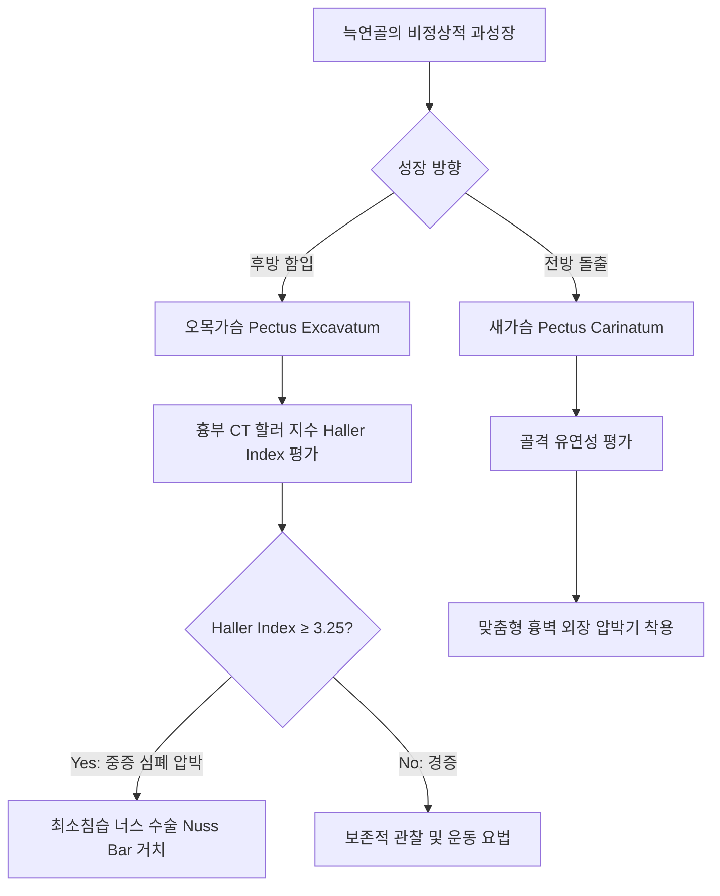
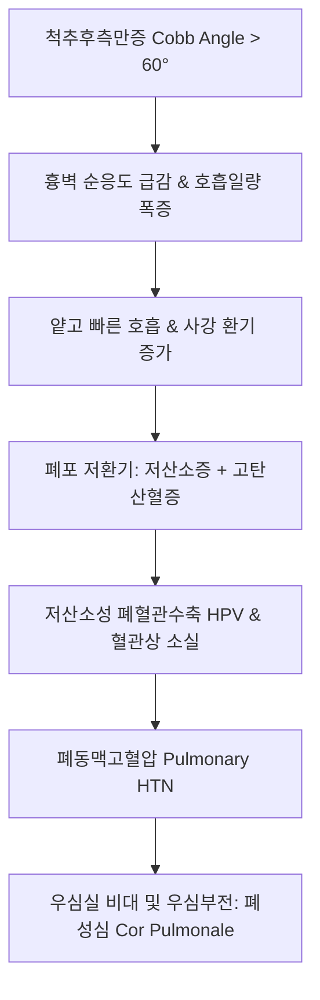
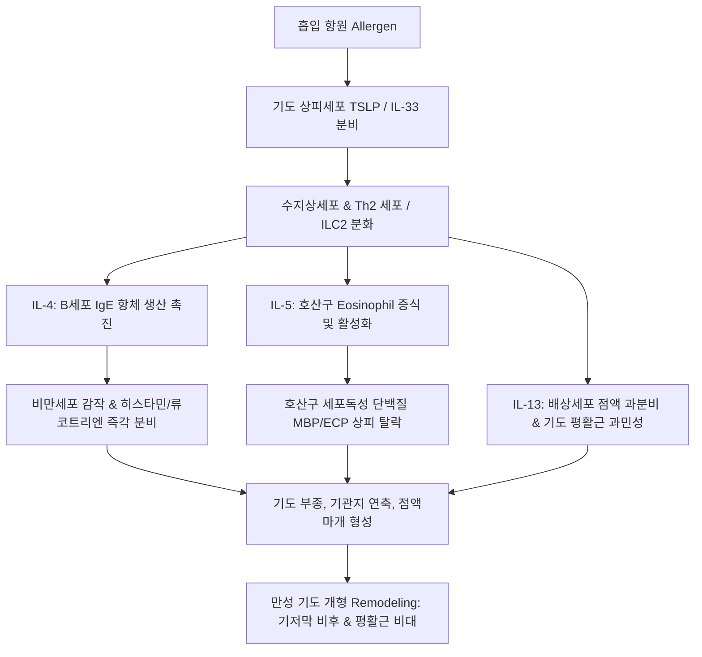
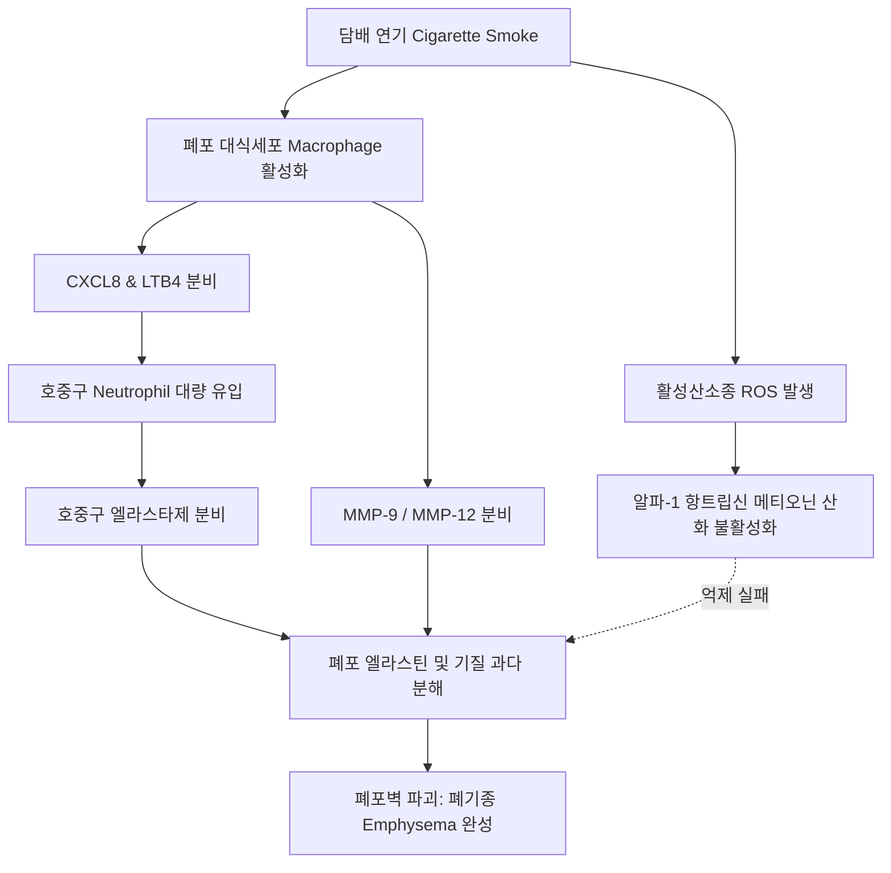
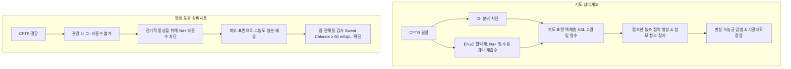

# Netter Respiratory Day 04: 선천성 흉곽·폐기형, 후두 질환 및 폐쇄성 기도 질환 (천식·COPD·기관지확장증·낭포성 섬유증) (pp. 110–155)

> 📖 **원서 출처**: [The Netter Collection - Volume 3, Respiratory System.pdf (pp. 110-155)](https://drive.google.com/file/d/1lDCEGUPEHrzTY10gPML28PbdcCYyY90a/view?usp=drivesdk)
> 🏷️ **범위**: Section 4: Diseases and Pathology — Part 1 (Plate 4-1 ~ Plate 4-26, 총 26개 플레이트 전수 정밀 수록)
> 📌 **핵심 테마**: 흉곽의 선천성 발육 이상(오목가슴·새가슴, 할러 지수 Haller index, 너스 수술 Nuss procedure)과 척추후측만증의 제한성 흉곽 장애 및 폐성심 기전, 선천성 폐 기형의 발생학적 스펙트럼(선천성 폐기도기형 CPAM Type 1~4, 기관지폐 격리증의 엽내형 내장측 흉막 공유 vs 엽외형 체동맥/체정맥 직결 감별, 선천성 대엽성 폐기종 및 기관지성 낭종), 상기도 및 후두의 양성·전암·악성 병변(성대 결절의 기계적 음성 남용 vs 성대 용종 출혈성 간질 부종 vs 유두종 HPV 6/11형 vs 라인케 부종 흡연 여성 저음화, 기관내삽관 후 성문하 협착증, 기이성 성대 역설 운동 VCD와 천식 감별, 후두 편평세포암의 성문부 조기 쉰목소리 vs 성문상부 림프절 전이), 기관지 천식의 2형 보조 T세포(Th2) 중심 면역 염증 캐스케이드(IL-4 B세포 IgE 전환, IL-5 호산구 동원, IL-13 배상세포 과형성 및 기도과민성, 상피하 기저막 비후와 기도 평활근 비대 등 기도 개형 Remodeling, 흡입 스테로이드 ICS, 속효성/지효성 베타2 작용제, 류코트리엔 수용체 길항제 LTRA 및 최신 생물학적 제제 Dupilumab/Mepolizumab/Omalizumab), 만성 폐쇄성 폐질환(COPD)의 병태생리학적 이원화(만성 기관지염 레이드 지수 Reid index > 0.5 vs 폐기종 엘라스타제-항엘라스타제 불균형, 흡연 호발 상엽 중심세엽성 Centriacinar vs 알파-1 항트립신 결핍증 SERPINA1 하엽 범세엽성 Panacinar, 중성구 엘라스타제와 MMP-9/12에 의한 폐포벽 붕괴), COPD 임상 2대 아형(호흡 부전 및 고탄산혈증 빈발 청색 청색증형 Blue Bloater vs 과호흡·체중 감소·호기 지연 핑크 헐떡이형 Pink Puffer, GOLD 2024 가이드라인 FEV1 기준 1~4기 및 ABE 분류군 치료 전략, 만성 저산소성 폐혈관수축 HPV에 따른 폐동맥고혈압 및 우심부전 폐성심 Cor Pulmonale), 기관지확장증의 콜(Cole) 감염-청소장애-염증-구조파괴 악순환 사이클(원주상·정맥류상·낭포상 병리, 흉부 HRCT상 인환 징후 Signet-ring sign 및 궤도 징후 Tram-track sign, 객혈 및 녹농균 감염), 그리고 상염색체 열성 치명적 유전질환인 낭포성 섬유증(CFTR 7q31.2 ΔF508 결실, 상피세포 염소 분비 결손 및 나트륨·수분 과다 재흡수에 따른 탈수된 농축 점액 저류, 땀 전해질 검사 Sweat chloride ≥ 60 mEq/L, 췌장 외분비 부전 흡수장애, 태변 장폐색, 양측 정관 무발생 CBAVD 남성 불임, 초미세 조절제 Elexacaftor/Tezacaftor/Ivacaftor 3제 요법).

---

## 1. 개요 및 마스터 요약 (Executive Summary)

* **흉곽·척추 기형 및 선천성 폐발생 이상 (Plates 4-1 ~ 4-6)**:
  * **오목가슴 (Pectus Excavatum, 누두흉)**: 늑연골의 후방 과성장으로 흉골체 및 검상돌기가 함입. 흉부 CT상 **할러 지수 (Haller Index = 흉곽 횡경 / 흉골-척추 간 전후경)** 가 정상 2.5 이하에서 **≥ 3.25**일 때 중증으로 판정하며, 심장(우심실) 압박 및 심박출량 저하 유발 $
ightarrow$ 흉골 거상용 금속 막대를 삽입하는 최소침습 **너스 수술 (Nuss procedure)** 이 표준.
  * **척추후측만증 (Kyphoscoliosis)**: 콥 각도(Cobb angle) $> 60^\circ$ 이상 시 심각한 비대칭 흉곽 변형으로 흉벽 순응도(Chest wall compliance) 급감 $
ightarrow$ 폐용적(TLC, VC) 감소에 의한 **제한성 환기 장애 (Restrictive defect)**, 미세무기폐, V/Q 불균등 $
ightarrow$ 만성 저산소증에 의한 **폐동맥고혈압 및 폐성심(Cor Pulmonale)** 으로 조기 사망 위험.
  * **폐 격리증 (Pulmonary Sequestration)**: 정상 기관지나무와 연결되지 않고 복부대동맥 등 체순환 동맥으로부터 비정상 혈류를 공급받는 비기능성 폐조직.
    * **엽내형 (Intralobar, 75%)**: 정상 폐 실질 내에 존재하며 **내장측 흉막을 공유**, 폐정맥으로 배액, 성인기 반복성 화농성 폐렴으로 발견.
    * **엽외형 (Extralobar, 25%)**: **독립된 자체 내장측 흉막**을 보유, 체정맥(기정맥/하대정맥)으로 배액, 신생아기 횡격막 탈장 등 타 선천 기형과 흔히 동반.

* **후두 양성 병변, 협착 및 악성종양학 (Plates 4-7 ~ 4-10)**:
  * **성대 결절 (Vocal Cord Nodules)**: 지속적 음성 남용(가수, 교사)으로 양측 성대 전방 1/3과 후방 2/3 경계부 진동 충격 중심에 발생하는 대칭성 초자화 섬유성 비후 ("Singer's nodes"). 음성 휴식 및 언어 치료가 1차.
  * **성대 용종 (Vocal Cord Polyp)**: 급격한 음성 손상이나 기침 발작 후 점막하 모세혈관 파열로 발생하는 편측성 부종성/혈관성 돌출. 보존 치료 실패 시 후두미세수술.
  * **성대 기능부전 (Vocal Cord Dysfunction, VCD / PVFM)**: 흡기 시 성대가 역설적으로 내전(Adduction)하여 급성 상기도 폐쇄, 천명음(Stridor), 호흡곤란 유발. 천식으로 오진되어 흡입제/스테로이드 남용 흔함. 기류-용적 곡선상 **가변성 흉곽외 폐쇄 (흡기 곡선 평탄화, $FEF_{50}/FIF_{50} > 1.0$)** 가 특징.
  * **후두 편평세포암 (Laryngeal SCC)**: 95% 이상이 흡연 및 음주와 직결.
    * **성문부 암 (Glottic, 60~65%)**: 진성대 발생. 성대 진동 방해로 **극초기부터 지속적인 쉰목소리(Hoarseness)** 유발. 진성대는 림프망이 극히 희소하여 조기 림프절 전이가 없어 방사선 또는 레이저 부분절제술로 90% 이상 완치.
    * **성문상부 암 (Supraglottic, 30~35%)**: 풍부한 양측 림프망으로 인해 조기 경부 림프절 전이 빈발, 연하곤란 및 이통(Otalgy, 미주신경 이개지 반사통).

* **기관지 천식의 2형 면역 병태생리 및 분자 약리학 (Plates 4-11 ~ 4-14)**:
  * **면역 캐스케이드 (Th2 / ILC2 Pathway)**: 흡입 항원 $
ightarrow$ 수지상세포 제시 $
ightarrow$ **Th2 세포 활성화** $
ightarrow$ 핵심 사이토카인 3총사 분비:
    1. **IL-4**: B세포의 클래스 스위칭을 유도하여 **항원 특이적 IgE** 합성 촉진 $
ightarrow$ 비만세포(Mast cell) FcεRI 수용체에 감작 $
ightarrow$ 항원 재노출 시 히스타민, PGD2, LTC4/D4/E4 즉각 유리 (조기 반응, 15~30분).
    2. **IL-5**: 골수에서 **호산구(Eosinophil)의 분화, 증식, 생존 및 활성화** 전담 $
ightarrow$ 주염기성단백질(MBP), 호산구 양이온단백질(ECP) 분비로 기도 상피 박리 (후기 반응, 4~8시간).
    3. **IL-13**: 기도 평활근 과민성(AHR) 유도 및 배상세포(Goblet cell) 점액 화생 자극, 섬유아세포 콜라겐 합성 유도.
  * **기도 개형 (Airway Remodeling)**: 만성 염증의 지속으로 **상피하 기저막 비후 (Subepithelial reticular basement membrane thickening)**, 평활근 과형성/비대, 신생혈관 증생이 일어나 비가역적 기류 제한으로 고착됨.
  * **약리학적 차단 표적**:
    * **ICS (흡입 코르티코스테로이드)**: 핵내 글루코코르티코이드 수용체 결합 $
ightarrow$ NF-κB 전사 차단을 통한 전방위 사이토카인 억제 (기저 치료의 핵심).
    * **표적 생물학적 제제**: Omalizumab (항-IgE), Mepolizumab/Benralizumab (항-IL-5 / IL-5Rα), Dupilumab (항-IL-4Rα, IL-4/IL-13 경로 동시 차단), Tezepelumab (항-TSLP 상피 유래 알라민 차단).

* **COPD의 병태생리, 폐기종 아형 및 질병 중증도 (Plates 4-15 ~ 4-21)**:
  * **만성 기관지염 vs 폐기종**:
    * **만성 기관지염**: 2년 연속 최소 3개월 이상 만성 가래 기침. 점막하 점액선의 과다 증식으로 **레이드 지수 (Reid Index = 점액선 두께 / 연골막간 전벽 두께) > 0.50** (정상 < 0.40).
    * **폐기종**: 종말세기관지 원위부 폐포벽의 비가역적 파괴 및 영구적 확장.
  * **폐기종 2대 병리 아형**:
    * **중심세엽성 폐기종 (Centriacinar / Centrilobular)**: **흡연과 직결**. 호흡세기관지와 중심 폐포관을 주로 침범하며 말초 폐포는 상대적으로 보존. **폐 상엽(Upper lobes)에 호발**.
    * **범세엽성 폐기종 (Panacinar / Panlobular)**: **알파-1 항트립신 (AAT, SERPINA1 유전자 PiZZ 변이) 결핍증**과 연관. 세엽 전체 폐포가 균일하게 파괴되며 **폐 하엽(Lower lobes) 기저부에 호발**. 호중구 엘라스타제(Neutrophil elastase)의 무제한적 폐포 엘라스틴 기질 분해가 본태.
  * **임상 표현형: Blue Bloater vs Pink Puffer**:
    * **Blue Bloater (만성 기관지염 우세형)**: 비만, 잦은 기침과 다량의 가래, 심한 V/Q 불균등으로 인한 조기 저산소혈증 및 고탄산혈증, 피부 청색증, 조기 폐성심 및 말초 부종.
    * **Pink Puffer (폐기종 우세형)**: 마른 체형, 심한 호흡곤란, 입술 오므리기 호흡(Pursed-lip breathing), 술통형 흉곽(Barrel chest), 상대적으로 정상 ABGA 유지(과호흡으로 보상), 말기까지 폐성심 지연.
  * **GOLD 2024 가이드라인 치료 축**: $FEV_1/FVC < 0.70$ 확진 후 $FEV_1$ 백분율로 1~4기 분류. 악화 위험도와 증상(CAT/mMRC)에 따라 **Group A, B, E**로 재편. 악화가 잦은 Group E는 **LAMA + LABA** 병용이 기본이며 혈중 호산구 $\ge 300	ext{ cells/}\mu	ext{L}$ 시 ICS 추가(3제 복합요법).

* **기관지확장증 및 낭포성 섬유증 (Plates 4-22 ~ 4-26)**:
  * **기관지확장증 (Bronchiectasis)**: 기도의 만성 감염과 염증으로 연골 및 탄력 섬유 지지 구조가 파괴되어 비가역적으로 확장되는 병태.
    * **Cole의 악순환 가설 (Vicious Cycle Model)**: 점액섬모 청소 장애 또는 면역 결핍 $
ightarrow$ 세균 정착(녹농균 *Pseudomonas aeruginosa*, 헤모필루스 *H. influenzae*) $
ightarrow$ 호중구 염증 만성화 $
ightarrow$ 기도 구조 파괴 $
ightarrow$ 청소 장애 악화.
    * **방사선 진단**: 고해상도 CT(HRCT)상 기관지 내경이 동반 폐동맥 직경보다 현저히 큰 **인환 징후 (Signet-ring sign, 비 $\ge 1.0$)**, 기관지벽 비후 **궤도 징후 (Tram-track sign)**, 확장된 기도가 흉막하 1 cm 이내까지 관찰.
  * **낭포성 섬유증 (Cystic Fibrosis, CF)**: 염색체 7q31.2의 **CFTR (Cystic Fibrosis Transmembrane Conductance Regulator)** ABC 수송체 유전자 돌연변이(최빈도: **$\Delta	ext{F508}$** 3염기 결실, 페닐알라닌 결손에 따른 단백질 접힘 장애 및 소포체 분해).
    * **분자 병태**: 기도 상피 관강막의 cAMP 매개 **$Cl^-$ 분비 차단** 및 상피성 나트륨 통로(ENaC) 탈억제로 인한 **$Na^+$ 및 수분의 과다 재흡수** $
ightarrow$ 기도 표면 수분 고갈(ASL 탈수) $
ightarrow$ 점조한 농축 점액 형성 $
ightarrow$ 만성 점막 폐색, 조기 기관지확장증, 녹농균/부르크홀데리아 감염.
    * **다기관 침범 3대 홀마크**:
      1. **췌장**: 췌관 폐색으로 인한 효소 정체, 선포 자가소화 및 섬유화 $
ightarrow$ 외분비 부전(지방변, 흡수장애, 지용성 비타민 A/D/E/K 결핍) 및 2차성 CF 관련 당뇨병(CFRD).
      2. **위장관**: 신생아기 끈적한 태변에 의한 **태변 장폐색 (Meconium ileus, 15~20%)**.
      3. **생식계**: 남성의 98%에서 **선천성 양측 정관 무발생 (CBAVD)** 에 의한 폐색성 무정자증 불임.
    * **진단 및 최신 분자 치료**: 필로카르핀 이온토포레시스 **땀 전해질 검사 (Sweat Chloride $\ge 60	ext{ mEq/L}$)** 로 확진. 표적 분자 샤페론/강화제인 **Trikafta (Elexacaftor + Tezacaftor + Ivacaftor)** 로 $\Delta	ext{F508}$ 결함 단백질의 세포막 이동 및 개폐율을 회복시켜 폐기능을 극적으로 개선.

---

## 2. 플레이트별 정밀 분석 (Plates 4-1 ~ 4-26)

### Plate 4-1 | 흉곽의 선천성 기형 (Congenital Deformities of the Thoracic Cage: Pectus Excavatum & Carinatum)
![[Netter_V3_Plate4-1.png]]

* **핵심 발생학 및 병태생리**:
  * **오목가슴 (Pectus Excavatum, 누두흉 / Funnel Chest)**:
    * 가장 흔한 선천성 흉벽 기형(선천 기형의 90%). 남아에서 4배 호발.
    * **발생 기전**: 하부 늑연골(제3~7 늑연골)의 과도한 불균형 성장으로 흉골체 하부와 검상돌기(Xiphoid)가 척추 방향으로 후방 함입됨.
    * **심폐 역학적 영향**: 흉골 함입으로 종격동 구조물이 좌측으로 전위되고, 전방 흉골과 후방 척추 사이에 우심실(RV)이 기계적으로 압박됨. 안정 시 폐기능은 정상에 가까우나, 최대 운동 시 우심실 이완기 충만 장애로 일회박출량(Stroke volume)이 제한되어 운동 유발성 호흡곤란, 흉통, 피로감 호발.
    * **할러 지수 (Haller Index)**: 흉부 CT의 흉골 최심부 함입 단면에서 측정:
      $$	ext{Haller Index} = rac{	ext{흉곽의 최대 횡경 (Transverse diameter)}}{	ext{흉골 후면과 척추체 전면 사이의 최단 전후경 (AP diameter)}}$$
      * 정상인: 약 $2.5$ 이하.
      * 중증 및 수술 적응증: **$	ext{Haller Index} \ge 3.25$**.
    * **수술적 교정**:
      * **너스 수술 (Nuss Procedure)**: 양측 측흉벽에 작은 절개를 넣고 흉강경 감시 하에 볼록하게 성형된 티타늄/스테인리스 펙투스 바(Pectus bar)를 흉골 후방으로 통과시킨 뒤 180도 회전시켜 흉골을 전방으로 밀어 올리는 최소침습 수술법. (2~3년 후 뼈와 연골이 고정되면 바 제거).
      * **라비치 수술 (Ravitch Procedure)**: 개흉 하에 변형된 늑연골을 전액 아절제하고 흉골 쐐기 절골술을 시행하는 전통적 개방 수술법.
  * **새가슴 (Pectus Carinatum, 조흉 / Pigeon Breast)**:
    * 늑연골의 전방 과성장으로 흉골체가 돌출되는 기형. 오목가슴보다 드묾(약 5~10배 적음).
    * 마르판 증후군(Marfan syndrome) 및 누난 증후군(Noonan syndrome)과 흔히 동반. 폐실질 압박은 적어 심폐 기능 장애는 드물지만 흉벽 경직과 미용적·심리적 스트레스 유발. 골격 성장기에는 **외장형 흉벽 압박 보조기 (Custom dynamic chest orthosis)** 치료가 1차 표준.



> ⚠️ **Clinical Pearl**:
> 오목가슴 환자에서 심전도를 시행하면 흉골 함입으로 심장이 좌측으로 회전하고 우심실 전벽이 흉골에 눌려 유도 $V_1$에서 $rSr'$ 패턴(불완전 우각차단 의사 소견)이나 전흉부 유도 ST 하강이 흔히 관찰됩니다. 이는 기질적 부정맥이 아니라 흉벽 기형에 의한 심장 축 변위 소견이므로 불필요한 관상동맥 정밀검사를 방지해야 합니다.

---

### Plate 4-2 | 척추후측만증의 병리 및 흉곽 변형 (Kyphoscoliosis: Pathology and Thoracic Distortion)
![[Netter_V3_Plate4-2.png]]

* **핵심 해부병리 및 흉곽 왜곡 기전**:
  * **정의**: 척추의 측방 만곡(Scoliosis, 관상면)과 후방 만곡(Kyphosis, 시상면)이 동반된 3차원적 척주 회전 변형.
  * **원인 분류**:
    1. **특발성 (Idiopathic, 80%)**: 사춘기 여아 호발, 유전적 소인.
    2. **신경근육성 (Neuromuscular)**: 소아마비 후유증, 뇌성마비, 뒤센 근이영양증, 척수성 근위축증(SMA).
    3. **선천성 (Congenital)**: 반척추(Hemivertebrae), 척추 분절 부전.
    4. **결합조직 질환**: 마르판 증후군, 엘러스-단로스 증후군, 신경섬유종증 1형(NF-1).
  * **흉곽 왜곡의 3차원 병리**:
    * 척추체의 회전(Vertebral rotation)으로 인해 볼록한 쪽(Convex side)의 갈비뼈는 후방으로 밀려나 뾰족한 **늑골 혹 (Rib hump)** 을 형성하고, 늑간격이 비정상적으로 넓어짐.
    * 오목한 쪽(Concave side)의 갈비뼈는 전방으로 압축되고 서로 뭉쳐져 늑간격이 극도로 협소화됨.
    * 흉강 내 부피가 물리적으로 급감하며, 특히 오목한 쪽 폐 실질이 기계적으로 찌그러져 무기폐와 폐 저형성 유발.

---

### Plate 4-3 | 척추후측만증의 폐기능 장애 및 폐성심 (Kyphoscoliosis: Pathophysiology and Cor Pulmonale)
![[Netter_V3_Plate4-3.png]]

* **호흡 역학 및 혈역학적 파탄 기전**:
  * **제한성 흉벽 장애의 악순환**:
    * 흉곽의 심각한 뒤틀림으로 흉벽 탄성반발력이 소실되고 **흉벽 순응도($C_{	ext{cw}}$)가 정상의 20~30% 수준으로 급락**.
    * 총폐용량(TLC), 폐활량(VC), 기능적 잔기용량(FRC)이 모두 비례적으로 감소하는 전형적인 **제한성 환기 장애 (Restrictive pattern, $FEV_1/FVC \ge 0.75$, $TLC < 80\%$)**.
  * **호흡근 역학 부전과 만성 호흡부전**:
    * 횡격막과 늑간근이 기계적 불리함(Mechanical disadvantage)에 놓여 호흡 일량(Work of breathing)이 기하급수적으로 폭증.
    * 환자는 얕고 빠른 호흡(Rapid shallow breathing)을 취하게 되어 사강 환기율($V_D/V_T$)이 증가 $
ightarrow$ **폐포 저환기(Alveolar hypoventilation)** 발생 $
ightarrow$ **만성 고탄산혈증($	ext{PaCO}_2 > 45	ext{ mmHg}$) 및 저산소혈증**.
  * **폐성심 (Cor Pulmonale)의 발생 단계**:
    1. 만성 폐포 저산소증 $
ightarrow$ 전폐포성 **저산소성 폐혈관수축 (HPV)** 유도.
    2. 흉곽 찌그러짐과 무기폐로 인한 폐 모세혈관상의 물리적 소실 및 폐혈관 기질 압박.
    3. 폐혈관 저항(PVR)의 영구적 상승 $
ightarrow$ **폐동맥고혈압 (Pulmonary Hypertension)** 발생.
    4. 우심실 후부하 폭증 $
ightarrow$ **우심실 비대(RVH) 및 우심부전 (폐성심)** $
ightarrow$ 경정맥 확장, 간비대, 하지 함요부종, 조기 사망.



> ⚠️ **Clinical Pearl**:
> 척추측만증에서 호흡부전의 위험도를 예측하는 가장 중요한 척도는 X-선상 측정하는 **콥 각도 (Cobb Angle)** 입니다. 각도가 **$60^\circ$ 초과** 시 폐활량 감소가 시작되고, **$100^\circ$ 초과** 시에는 주간 고탄산혈증성 호흡부전과 폐성심이 거의 100% 발생하므로 정형외과적 척추 유합술의 조기 교정 적응증이 됩니다.

---

### Plate 4-4 | 선천성 폐 기형 I: 무발생, 저형성 및 CPAM (Congenital Anomalies: Agenesis, Hypoplasia, and CPAM)
![[Netter_V3_Plate4-4.png]]

* **선천성 발육 부전 및 선천성 폐기도기형 (CPAM)**:
  * **선천성 무형성/저형성 스펙트럼**:
    * **폐 무발생 (Agenesis)**: 폐 실질, 기관지, 폐혈관이 완전 결손.
    * **폐 무형성 (Aplasia)**: 맹단(Blind pouch) 기관지만 존재하고 실질/혈관 결손.
    * **폐 저형성증 (Pulmonary Hypoplasia)**: 폐포 수와 기도가 정상보다 현저히 적은 상태. 주원인은 자궁 내 양수 과소증(Oligohydramnios, 포터 증후군 Potter sequence) 또는 선천성 횡격막 탈장(CDH)에 의한 흉강 내 기계적 압박.
  * **선천성 폐기도기형 (Congenital Pulmonary Airway Malformation, CPAM / 과거 CCAM)**:
    * 종말세기관지의 과도한 증식과 폐포 발달 정지로 인해 발생하는 양성 과오종성(Hamartomatous) 낭성 폐질환.
    * **Stocker 5대 병리학적 분류**:
      * **Type 0 (선포형 Acinar dysgenesis)**: 매우 드묾, 기관/기관지 기원, 출생 즉시 치명적.
      * **Type 1 (대낭성 Large cyst, 60~70%, 최빈발)**: 직경 **$2\sim10	ext{ cm}$의 단발/소수 대형 낭종**, 위중층섬모원주상피로 이장, 점액 분비세포 동반. 신생아기 종괴 효과로 종격동 편위 유발, 수술적 절제 예후 매우 우수.
      * **Type 2 (중소낭성 Medium cyst, 15~20%)**: 직경 $0.5\sim2	ext{ cm}$의 다발성 낭종, 신장 기형 등 타 선천 기형 동반율 높음.
      * **Type 3 (미세낭성/고형 Microcystic/Solid, 5~10%)**: 직경 $<0.2	ext{ cm}$의 미세 낭종들이 밀집하여 고형 종괴처럼 보임. 태아 수종(Hydrops fetalis) 유발 고위험.
      * **Type 4 (원위 말초형 Distal acinar, 5~10%)**: 폐 말초 낭종, 흉막폐모세포종(Pleuropulmonary blastoma, PPB)과의 감별 필수.
    * **치료 원칙**: 감염 반복 및 악성 변성(점액성 선암종, PPB) 위험 차단을 위해 **외과적 폐엽 절제술 (Lobectomy)** 이 표준.

---

### Plate 4-5 | 선천성 폐 기형 II: 폐 격리증 (Pulmonary Sequestration: Intralobar vs Extralobar)
![[Netter_V3_Plate4-5.png]]

* **비정상 혈관 공급 및 2대 해부학적 아형 감별**:
  * **개념**: 정상 기관기관지나무(Tracheobronchial tree)와 소통이 없으며, 폐동맥이 아닌 **체순환 동맥 (복부대동맥, 흉부대동맥 등)** 으로부터 독립적인 혈류를 공급받는 비기능성 폐조직 덩어리.
  * **엽내형 (Intralobar) vs 엽외형 (Extralobar) 감별 진단 표**:

| 비교 항목 | 엽내형 폐 격리증 (Intralobar Sequestration, ILS) | 엽외형 폐 격리증 (Extralobar Sequestration, ELS) |
| :--- | :--- | :--- |
| **발생 비율** | **전체의 75%** (압도적 다수) | 전체의 25% |
| **내장측 흉막 (Visceral Pleura)** | **인접 정상 폐엽과 흉막을 공유함** (폐 실질 내 매몰) | **독립된 자체 내장측 흉막으로 완전히 싸여 있음** |
| **발생 호발 부위** | **좌하엽 후기저분절 (LLL, 60%)**, 우하엽 후기저 (30%) | 좌측 횡격막 인접부 (90%), 횡격막 내/하복부에도 위치 가능 |
| **동맥 혈액 공급** | **하행 흉부대동맥 또는 상부 복부대동맥** 분지 | **복부대동맥, 복강동맥(Celiac axis)** 또는 비장동맥 분지 |
| **정맥 배액 혈류** | **폐정맥 (Pulmonary veins) $
ightarrow$ 좌심방** (좌-좌 단락) | **체정맥 (기정맥 Azygos, 반기정맥, 하대정맥)** $
ightarrow$ 우심방 (좌-우 단락) |
| **타 선천 기형 동반** | 드묾 ($<15\%$) | **매우 흔함 (50~60%)**: 선천성 횡격막 탈장(CDH), 선천성 심기형 |
| **임상 발현 시기 및 증상** | **소아기~성인기**: 반복적인 하엽 폐렴, 폐농양, 객혈 | **신생아기~영아기**: 호흡곤란, 청색증, 무증상 산전 초음파 발견 |
| **수술적 절제술** | 정상 폐조직과 분리가 어려워 **해당 폐엽 절제술 (Lobectomy)** | 독립 흉막이므로 정상 폐 보존하며 **격리증 단독 절제 (Sequestrectomy)** |

> ⚠️ **Clinical Pearl**:
> 폐 격리증 수술 시 외과의의 가장 치명적인 위험은 **비정상 체신동맥(Aberrant systemic feeding artery)** 입니다. 이 혈관은 대동맥에서 직접 분지하여 높은 체순환 압력을 받으며 하인대(Pulmonary ligament)를 통해 격리 조직으로 진입하므로, 수술 중 이를 결찰하지 않고 실수로 손상시킬 경우 흉강 내 전격성 대출혈로 환자가 사망할 수 있습니다. 수술 전 CT 혈관조영술(CT Angiography)로 영양 동맥의 기원을 반드시 매핑해야 합니다.

---

### Plate 4-6 | 선천성 폐 기형 III: 선천성 대엽성 폐기종 및 기관지성 낭종 (Congenital Lobar Emphysema & Bronchogenic Cyst)
![[Netter_V3_Plate4-6.png]]

* **기관지성 낭종 및 선천 대엽성 폐기종**:
  * **선천성 대엽성 폐기종 (Congenital Lobar Emphysema, CLE / CLEO)**:
    * **기전**: 분절/엽 기관지 연골 형성 부전(Chondromalacia) 또는 점막 주름, 외인성 혈관 압박으로 인해 흡기 시에는 공기가 들어가지만 호기 시 기도가 닫히는 **체크-밸브 (Check-valve / Ball-valve) 메커니즘** 작동.
    * **소견**: 해당 폐엽의 거대한 과팽창(Hyperinflation), 인접 폐엽 압박 무기폐, 반대측으로의 종격동 편위. **우상엽 및 좌상엽(LUL, 최빈발)** 에 호발. 신생아 호흡곤란증후군 응급 수술(폐엽 절제술) 적응증.
  * **기관지성 낭종 (Bronchogenic Cyst)**:
    * **기전**: 배아 전장(Foregut)에서 원시 호흡기 게실(Respiratory diverticulum)이 싹트는 과정에서 비정상적으로 분리된 낭성 구조물.
    * **조직학**: 기관지와 동일하게 **가중층섬모원주상피(Pseudostratified ciliated columnar)** 로 덮여 있고 낭종 벽에 **초자 연골편(Hyaline cartilage), 평활근, 점액선**을 보유.
    * **위치**: **중종격동 (Carina 하방 Subcarinal 50%)** 또는 폐 실질 내.
    * **증상**: 무증상 우연 발견이 많으나, 기도/식도 압박에 의한 천명·연하곤란, 낭종 내 2차 감염, 파열 위험이 있어 외과적 완전 절제가 원칙.

---

### Plate 4-7 | 후두의 흔한 양성 병변 (Common Benign Laryngeal Lesions: Nodules, Polyps, Papillomas, Reinke Edema)
![[Netter_V3_Plate4-7.png]]

* **성대 점막 미세해부학 및 4대 양성 질환 감별**:
  * **히라노(Hirano) 성대 층판 구조**: 표피층 $
ightarrow$ **고유층 (Lamina Propria: 천층 라인케 공간 Reinke's space $
ightarrow$ 중간층 $
ightarrow$ 심층)** $
ightarrow$ 성대근(Vocalis m.). 라인케 공간은 무세포성 젤라틴 기질로 성대의 자유로운 파동 진동(Mucosal wave)을 가능케 함.
  * **4대 양성 병변 비교 매트릭스**:

| 질환명 | 호발 요인 및 환자군 | 병변 특징 및 위치 | 조직학적 특징 | 1차 표준 치료 |
| :--- | :--- | :--- | :--- | :--- |
| **성대 결절 (Vocal Nodules)** | 만성 음성 남용 (교사, 성악가, 소아) | **양측 대칭성**, 진성대 전방 1/3과 후방 2/3 경계 | 기저막 비후, 라인케 공간의 섬유화 및 초자화 | **음성 휴식 및 언어 치료 (수술 금기)** |
| **성대 용종 (Vocal Polyp)** | 급성 과도 음성 사용, 흡연 | **편측 단발성**, 유경성(Pedunculated) 또는 광저성 | 혈관 증생, 기질 출혈 및 수종성 변성 | 언어 치료 실패 시 **후두미세수술 (LMS)** |
| **라인케 부종 (Reinke Edema)** | **중년 여성 골초 흡연자**, 위식도역류 | **양측 진성대 전장의 미만성 물주머니양 종대** | 라인케 공간 내 림프 울혈 및 풍부한 젤라틴 점액 | **절대 금연**, 약물 반응 없을 시 점막 미세절개 흡인 |
| **후두 유두종 (Laryngeal Papilloma)** | **HPV 6형, 11형** 감염 (소아 수직감염) | 다발성 포도송이/채소꽃 양상 유두종 | 혈관섬유성 핵을 둘러싼 양성 편평상피 증식 | **레이저/미세절삭기 절제 (재발 극심, 악성화 감시)** |

> ⚠️ **Clinical Pearl**:
> 양측성 성대 결절 환자에게 섣불리 수술을 시행하면 성대 고유층의 중간·심층(성대인대)에 비가역적 흉터(Scarring)가 남아 성대 점막 파동이 영구 소실되어 이전보다 훨씬 심각한 쉰목소리가 초래됩니다. 성대 결절은 외과적 질환이 아니라 음성 습관 교정으로 완치되는 내과적/음성치료 질환입니다.

---

### Plate 4-8 | 후두 및 기관 협착증 (Laryngeal and Tracheal Stenosis: Post-intubation & Subglottic)
![[Netter_V3_Plate4-8.png]]

* **협착 병태생리 및 면윤상 연골의 해부학적 취약성**:
  * **삽관 후 기관 협착 (Post-Intubation Tracheal Stenosis, PITS)**:
    * **기전**: 중환자실 인공호흡기 치료 시 기관내 튜브의 커프(Cuff) 압력이 모세혈관 관류압($> 25\sim30	ext{ mmHg}$)을 초과 $
ightarrow$ 기관 점막 허혈 $
ightarrow$ 연골막 괴사 $
ightarrow$ 섬유아세포 과증식 및 반흔 구축(Cicatricial webbing).
    * **예방**: 커프 압력을 항상 **$20\sim25	ext{ cmH}_2	ext{O}$** 로 유지.
  * **성문하 협착증 (Subglottic Stenosis)**:
    * 성문 하부에서 윤상연골(Cricoid cartilage) 부위까지의 내경 협소화.
    * **해부학적 요충지**: **윤상연골은 전체 기도 중 유일하게 완전한 360도 닫힌 반지 모양(Complete ring)** 을 이루므로, 내부 부종이나 반흔 형성 시 외측으로 팽창하지 못하고 내강이 100% 폐색되는 기계적 치명성을 지님.
  * **Cotton-Myer 4단계 협착 중증도 분류**:
    * Grade I: 내강 폐색 $< 50\%$ / Grade II: $51\sim70\%$ / Grade III: $71\sim99\%$ / Grade IV: 완전 폐색(No lumen).
  * **치료**: 경증은 기관지경 풍선 확장술(Balloon dilation) 및 스테로이드 국소 주입; Grade III~IV 중증은 **윤상기관 절제 및 단단 문합술 (Cricotracheal Resection and Anastomosis, CTR)**.

---

### Plate 4-9 | 성대 기능부전 및 기이성 성대 운동 (Vocal Cord Dysfunction, VCD / Paradoxical Vocal Fold Movement)
![[Netter_V3_Plate4-9.png]]

* **역설적 성대 내전과 기관지 천식의 핵심 감별**:
  * **병태생리**: 정상적으로 호흡(특히 흡기) 시에는 기도를 열기 위해 양측 성대가 외전(Abduction)해야 함. VCD 환자는 **흡기 시 성대가 부적절하게 내전(Adduction / Paradoxical closure)** 하여 후두 입구를 폐쇄함.
  * **임상적 함정**: 운동선수나 젊은 여성에서 호발하며 호흡곤란, 흡기 천명음(Stridor)이 발생하여 **"난치성 중증 천식"으로 오인**됨. 고용량 경구/흡입 스테로이드에 전혀 반응하지 않음.
  * **확진 진단**:
    1. **후두 내시경 (Laryngoscopy)**: 발작 시 후두를 직접 관찰하여 **흡기 시 성대 전방 2/3가 닫히고 후방에 작은 삼각형 틈(Posterior chink)** 만 남는 전형적 역설 운동 확인.
    2. **기류-용적 곡선 (Flow-Volume Loop)**: 호기 곡선은 정상이지만 **흡기 곡선이 평탄화되는 가변성 흉곽외 상기도 폐쇄 ($FEF_{50}/FIF_{50} > 1.0$)**.
  * **치료**: 항염증 흡입제 중단, 복식 호흡법, 음성 치료(Speech therapy), 급성 발작 시 헬리옥스(Heliox) 흡입 또는 헐떡 호흡(Panting maneuver).

---

### Plate 4-10 | 후두 악성 종양 (Laryngeal Carcinoma: Glottic, Supraglottic, Subglottic SCC)
![[Netter_V3_Plate4-10.png]]

* **해부학적 구획별 종양 생물학 및 림프 전이 경로**:
  * **조직학**: 95% 이상이 **편평세포암종 (Squamous Cell Carcinoma, SCC)**. 흡연과 음주가 상승적 발암원.
  * **3대 해부학적 구획별 비교**:

| 구획 | 해부학적 범위 | 전체 비율 | 임상 발현 징후 | 림프절 전이 및 예후 |
| :--- | :--- | :--- | :--- | :--- |
| **성문부 (Glottic)** | 진성대 (True vocal cords) 및 전교련 | **60 ~ 65%** (최다) | **조기 쉰목소리 (Early Hoarseness)** | 진성대에 림프관이 없어 **림프절 전이 극히 드묾 (<1%)**, 조기 진단으로 **완치율 > 90%** |
| **성문상부 (Supraglottic)** | 후두개, 가성대, 피열후두개주름 | 30 ~ 35% | 이물감, 연하통, **연관 이통 (미주신경 반사)** | 림프망이 풍부하여 **진단 시 40~50%에서 양측 경부 림프절 전이 동반**, 예후 불량 |
| **성문하부 (Subglottic)** | 진성대 1 cm 하방 ~ 윤상연골 하연 | 1 ~ 5% (희소) | 진행성 호흡곤란, 흡기 천명음 | 증상이 늦게 나타나 진행된 상태로 발견, 기관주위 림프절 전이 |

> ⚠️ **Clinical Pearl**:
> 흡연력이 있는 40세 이상의 성인에서 **3주 이상 지속되는 쉰목소리(Hoarseness)** 는 다른 원인이 밝혀지기 전까지 반드시 후두암을 의심하고 즉시 이비인후과 후두경 검사를 시행해야 합니다. 성문암은 조기에 발견하면 성대를 보존하는 방사선 치료나 레이저 절제로 완치 가능하지만, 방치 시 전후두절제술(Total laryngectomy)로 영구적 발성 상실을 겪게 됩니다.

---

### Plate 4-11 | 기관지 천식의 기도 병태생리 (Airway Pathophysiology in Asthma: Th2 Cascade & Airway Remodeling)
![[Netter_V3_Plate4-11.png]]

* **2형 염증 분자 캐스케이드와 기도 개형의 병리학**:
  * **2형 면역 염증 반응 (Type 2 Inflammatory Cascade)**:
    * 알레르겐 흡입 $
ightarrow$ 기도 상피세포 자극 $
ightarrow$ 알라민(Alarmin: TSLP, IL-33, IL-25) 분비.
    * 수지상세포에 의해 **Th2 세포** 및 **제2형 선천림프구(ILC2)** 활성화 $
ightarrow$ **IL-4, IL-5, IL-13 대량 분비**.
    * **비만세포 탈과립**: IgE 가교 $
ightarrow$ 히스타민, 류코트리엔($	ext{LTC}_4, 	ext{LTD}_4, 	ext{LTE}_4$), 프로스타글란딘($	ext{PGD}_2$) 방출 $
ightarrow$ 기관지 평활근 수축, 미세혈관 혈장 누출로 기도 부종.
    * **호산구 염증 침윤**: IL-5에 의해 활성화된 호산구가 주염기성단백(MBP), 호산구 과산화효소(EPO)를 유리하여 기도 상피를 탈락시키고 감각신경 종말을 노출시켜 기도과민성(AHR) 초래.
  * **기도 개형 (Airway Remodeling)의 5대 병리학적 변화**:
    1. **상피하 기저막 비후**: 판상 치밀 콜라겐(Type I, III, V) 침착.
    2. **기도 평활근 과형성 및 비대 (Smooth Muscle Hypertrophy/Hyperplasia)**.
    3. **배상세포 과형성 (Goblet Cell Metaplasia)**: 점액 과다분비 및 점액마개(Mucus plug).
    4. **상피하 혈관 증식 및 혈관벽 투과성 항진**.
    5. 폐 탄성반발력 손상 및 고정성 기류 폐쇄로의 진행.



---

### Plate 4-12 | 외인성 알레르기 천식: 임상 양상 및 유발 인자 (Extrinsic Allergic Asthma: Clinical Manifestations and Triggers)
![[Netter_V3_Plate4-12.png]]

* **천식의 임상 징후, 알레르기 삼총사 및 유발 인자**:
  * **임상 3대 주증상**: **천명음 (Wheezing)**, **호흡곤란 (Dyspnea)**, **발작성 기침 (Cough, 야간 및 새벽 악화)**.
  * **아토피 소인 (Atopic Triad)**: 기관지 천식 + 알레르기 비염 + 아토피 피부염의 가족력/기왕력.
  * **객담의 현미경적 특징적 병리 소견**:
    * **쿠르슈만 나선체 (Curschmann's Spirals)**: 미세 세기관지 모양으로 꼬여 굳어진 점액 원주체.
    * **샤르코-라이덴 결정 (Charcot-Leyden Crystals)**: 파괴된 호산구 세포막의 갈렉틴-10(Galectin-10) 단백이 결정화된 육각형 양원뿔형 다이아몬드상 결정.
    * **크레올라 소체 (Creola Bodies)**: 탈락된 섬모 기도 상피세포의 박리된 덩어리.
  * **주요 악화 유발 인자**: 바이러스성 상기도 감염(라이노바이러스, 최빈발 악화 요인), 차고 건조한 공기 노출, 운동 유발성(EIB), 실내 항원(집먼지진드기, 반려동물 비듬), 아스피린 및 NSAIDs (AERD, COX-1 차단으로 류코트리엔 경로 쏠림).

---

### Plate 4-13 | 천식 치료제의 분자 약리 기전 (Mechanisms of Asthma Medications: Bronchodilators & Biologics)
![[Netter_V3_Plate4-13.png]]

* **약리학적 표적 및 작용 기전 분류**:
  * **기관지 확장제 (Bronchodilators)**:
    * **$eta_2$-작용제 (SABA: Albuterol; LABA: Formoterol, Salmeterol)**:
      * 기도 평활근의 $eta_2$ 수용체 결합 $
ightarrow$ $G_s$ 단백 활성화 $
ightarrow$ 아데닐릴 시클라아제(Adenylyl Cyclase) 촉진 $
ightarrow$ **cAMP 증가** $
ightarrow$ 단백질 인산화효소 A(PKA) 활성화 $
ightarrow$ 세포 내 $	ext{Ca}^{2+}$ 감소 및 MLCK 억제 $
ightarrow$ **강력한 기관지 평활근 이완**.
    * **항콜린제 (SAMA: Ipratropium; LAMA: Tiotropium)**:
      * 아세틸콜린에 의한 **$M_3$ 무스카린 수용체 차단** $
ightarrow$ $G_q$-PLC 경로 차단 $
ightarrow$ $	ext{IP}_3/	ext{Ca}^{2+}$ 감소 $
ightarrow$ 미주신경성 기관지 수축 및 점액 분비 억제.
  * **항염증 조절제 (Anti-inflammatory Controllers)**:
    * **흡입 스테로이드 (ICS: Fluticasone, Budesonide)**:
      * 세포질 내 GR 결합 후 핵으로 이동 $
ightarrow$ 전사인자 NF-κB 및 AP-1을 억제(Transrepression)하고 히스톤 탈아세틸화효소-2(HDAC2)를 모집하여 염증성 사이토카인 유전자 발현을 전방위 억제.
    * **류코트리엔 수용체 길항제 (LTRA: Montelukast, Zafirlukast)**:
      * $	ext{CysLT}_1$ 수용체를 경쟁적으로 차단하여 류코트리엔 매개 기관지 수축, 기도 부종, 호산구 침윤 억제. (아스피린 과민성 천식에 탁월).
  * **최신 표적 생물학적 제제 (Biologics for Severe Asthma)**:
    * **Omalizumab**: 혈중 유리 IgE의 Fc 부위에 결합하여 비만세포/호염구 FcεRI 결합을 차단.
    * **Mepolizumab / Reslizumab**: 유리 **IL-5**를 중화하여 호산구 분화 억제.
    * **Benralizumab**: 호산구 표면의 **IL-5R$lpha$** 에 직접 결합하여 NK세포 매개 항체의존성 세포독성(ADCC)으로 호산구를 완전 고갈.
    * **Dupilumab**: **IL-4R$lpha$** 소단위를 차단하여 **IL-4와 IL-13 신호전달을 동시 억제**.

---

### Plate 4-14 | 중증 급성 천식 발작 및 천식 지속상태 (Severe Acute Asthma Exacerbation and Status Asthmaticus)
![[Netter_V3_Plate4-14.png]]

* **급성 천식 발작의 응급 평가 및 단계별 처치 프로토콜**:
  * **기이맥 (Pulsus Paradoxus)**: 흡기 시 흉강 내 극단적 음압 형성 및 폐 과팽창으로 우심실 충만이 급증하여 심실중격이 좌심실로 밀림 $
ightarrow$ **흡기 시 수축기 혈압이 $10	ext{ mmHg}$ 이상 비정상적으로 하강**.
  * **침묵의 흉부 (Silent Chest)**: 기관지 경련과 점액마개 폐쇄가 너무 극심하여 기류 이동 자체가 없어 천명음조차 들리지 않는 **절박한 호흡정지의 초응급 징후**.
  * **동맥혈 가스 분석(ABGA)의 위기 징후**:
    * 초기: 과호흡에 의한 호흡성 알칼리증 ($	ext{PaCO}_2 < 35	ext{ mmHg}$).
    * **위험 징후**: 호흡근 피로로 인해 **$	ext{PaCO}_2$가 정상화($40	ext{ mmHg}$)되거나 상승($> 45	ext{ mmHg}$)** 하는 경우 $
ightarrow$ 즉각적인 기도삽관 및 기계환기 준비.
  * **응급 약물 요법 시퀀스**:
    1. 고농도 산소 투여 ($	ext{SpO}_2\ 93\sim95\%$ 유지).
    2. 속효성 $eta_2$-작용제(SABA) + 이프라트로피움(SAMA) 네뷸라이저 20분 간격 연속 3회 흡입.
    3. **전신 스테로이드 (Systemic Corticosteroid)**: 경구 Prednisolone 또는 정맥 Methylprednisolone 즉시 투여 (효과 발현까지 4~6시간 소요되므로 조기 투여 필수).
    4. 불응 시 **황산마그네슘 (IV Magnesium Sulfate 2g)** 정맥 점적 (평활근 세포막 칼슘 유입 차단으로 급속 이완).

---

### Plate 4-15 | 만성 폐쇄성 폐질환: 만성 기관지염과 폐기종의 상호관계 (COPD: Interrelationships of Chronic Bronchitis and Emphysema)
![[Netter_V3_Plate4-15.png]]

* **정의의 상이성과 질병 스펙트럼**:
  * COPD는 완전히 가역적이지 않은 지속적인 기류 제한(Airflow limitation)을 특징으로 하는 질환군.
  * **임상적 정의 (만성 기관지염, Chronic Bronchitis)**: 해부병리학적이 아닌 **임상적 증상으로 정의** $
ightarrow$ 다른 원인 질환 없이 **연속 2년 이상, 1년에 최소 3개월 이상 만성 가래를 동반한 기침**.
  * **병리학적 정의 (폐기종, Emphysema)**: 증상이 아닌 **조직학적 소견으로 정의** $
ightarrow$ 현저한 섬유화 없이 **종말세기관지 원위부 기도 공간의 영구적인 비정상적 확장 및 폐포벽 파괴**.
  * 대부분의 흡연자 COPD 환자는 만성 기관지염(기도 염증/점액 분비)과 폐기종(폐포 지지 구조 소실)이 다양한 비율로 혼재된 복합 스펙트럼을 보임.

---

### Plate 4-16 | 만성 기관지염의 병리 및 병태생리 (Pathology and Pathophysiology of Chronic Bronchitis: Reid Index)
![[Netter_V3_Plate4-16.png]]

* **점액선 과다형성과 레이드 지수 (Reid Index)**:
  * **조직학적 3대 병리**:
    1. 점막하 점액선의 비대 및 과다형성 (Hypertrophy and hyperplasia of submucosal glands).
    2. 표면 상피층 내 **배상세포(Goblet cell) 화생 및 수적 증가** $
ightarrow$ 섬모세포 소실로 점액섬모 에스컬레이터 청소능 상실.
    3. 기관지벽의 만성 단핵구 및 호중구 염증 침윤, 평활근 비후.
  * **레이드 지수 (Reid Index)**:
    * 주기관지 횡단면 조직학적 검체에서 측정:
      $$	ext{Reid Index} = rac{	ext{점막하 점액선 층의 두께 (Thickness of gland layer)}}{	ext{상피 기저막에서 기관지 연골막 내측면까지의 총 전벽 두께 (Base of epithelium to internal perichondrium)}}$$
    * **정상 성인**: **$< 0.40$ (보통 $0.25\sim0.36$)**.
    * **만성 기관지염**: **$> 0.50$** (심한 경우 $> 0.70$). 만성 기관지염의 사후 병리학적 확진 표준.

---

### Plate 4-17 | 폐기종의 병리 및 아형: 소엽중심성 vs 범세엽성 (Emphysema: Centriacinar vs Panacinar, AAT Deficiency)
![[Netter_V3_Plate4-17.png]]

* **폐기종의 병리학적 분류 및 유전성 결핍증**:
  * **세엽 (Acinus)의 해부학**: 종말세기관지(Terminal bronchiole) 1개에서 갈라져 나오는 호흡세기관지(Respiratory bronchiole), 폐포관(Alveolar duct), 폐포낭 및 폐포를 포함하는 기능적 기본 단위.
  * **3대 폐기종 아형 비교**:

| 아형 | 침범 부위 및 해부학 | 호발 원인 | 호발 폐 구역 | 병리적 특징 |
| :--- | :--- | :--- | :--- | :--- |
| **중심세엽성 (Centriacinar / Centrilobular)** | **호흡세기관지 중심부만 선택적 파괴**, 말초 폐포관/폐포낭은 보존 | **흡연 (Smoking)** (95% 이상) | **폐 상엽 (Upper lobes)**, 특히 첨후분절 | 탄가루(Anthracotic pigment) 침착 동반 낭포 형성 |
| **범세엽성 (Panacinar / Panlobular)** | 호흡세기관지부터 말초 폐포낭까지 **세엽 전체가 균일하게 파괴** | **$lpha_1$-항트립신 결핍증 (AAT Deficiency)** | **폐 하엽 (Lower lobes)** 및 전폐야 | 폐가 창백하고 스펀지처럼 거대하게 부풀어 오름 |
| **원위세엽성 / 중격주위 (Paraseptal)** | 세엽의 말초부(폐포관/폐포낭) 침범, 소엽 중격 및 흉막하 위치 | 흡연, 특발성 | 폐첨부 흉막하 (Subpleural) | 직경 $>1	ext{ cm}$의 기낭(Bullae) 형성 $
ightarrow$ **청장년 자발성 기흉(Pneumothorax)의 주원인** |

* **알파-1 항트립신 결핍증 (Alpha-1 Antitrypsin Deficiency, AATD)**:
  * 염색체 14q32.1의 **SERPINA1** 유전자 동형접합 변이. 정상 대립유전자 PiM, 최중증 결핍 대립유전자 **PiZ**.
  * **PiZZ 유전자형**: 혈청 AAT 농도가 정상의 $10\sim15\%$ 수준으로 급감.
  * **병태생리**: 간세포 내에서 비정상적으로 접힌 AAT 단백질이 다량체(Polymer)를 형성하여 분비되지 못하고 침착 $
ightarrow$ 소아/성인 간경변증(PAS 양성 이완 내성 과립) 유발. 혈중 AAT 결핍으로 폐포 내 **호중구 엘라스타제(Neutrophil elastase)** 가 억제되지 않아 30~40대 조기에 비흡연자에서도 중증 범세엽성 폐기종 발병.

---

### Plate 4-18 | COPD의 염증 동역학 및 단백분해효소 불균형 (Inflammation and Protease-Antiprotease Imbalance in COPD)
![[Netter_V3_Plate4-18.png]]

* **단백분해효소-항단백분해효소 불균형 및 산화 스트레스 가설**:
  * **염증 세포 구성의 차이**: 천식(CD4+ Th2, 호산구)과 달리 COPD는 **폐포 대식세포, CD8+ 세포독성 T세포, 호중구(Neutrophil)** 가 주도.
  * **담배 연기 유발 독성 기전**:
    1. 담배 연기의 유해 입자가 폐포 대식세포를 활성화 $
ightarrow$ CXCL8(IL-8), $	ext{LTB}_4$ 분비로 순환 호중구를 폐로 대량 유인.
    2. 호중구에서 **단백분해효소(Neutrophil Elastase, Cathepsin G, Proteinase 3)** 분비 + 대식세포에서 **기질금속단백분해효소(MMP-9, MMP-12)** 방출.
    3. 담배 연기 내의 활성산소종(ROS)이 보호 단백질인 **$lpha_1$-항트립신의 활성 부위(메티오닌 잔기)를 직접 산화시켜 불활성화**.
    4. 폐 실질의 세포외기질(콜라겐, 엘라스틴)이 무차별적으로 파괴되고 폐포 부착 지지(Alveolar attachments)가 소실되어 소기도 허탈 유발.



---

### Plate 4-19 | COPD의 임상 유형: Blue Bloater vs Pink Puffer (Clinical Types of COPD)
![[Netter_V3_Plate4-19.png]]

* **고전적 두 가지 임상 극단형 비교 분석**:

| 임상 지표 | 핑크 헐떡이 (Pink Puffer, A형: 폐기종 우세) | 청색 청색증형 (Blue Bloater, B형: 만성 기관지염 우세) |
| :--- | :--- | :--- |
| **주요 기저 병리** | 광범위한 폐포벽 파괴 및 폐 모세혈관상 소실 | 기도 점액 과다분비, 점막하 부종, 만성 기관지 감염 |
| **체형 및 외모** | **극도로 마른 체형 (Cachexia)**, 근육 소모 | **비만 (Obese)**, 복부 비만, 전신 부종 경향 |
| **호흡 패턴** | 심한 호흡곤란 호소, **입술 오므리기 호흡**, 보조근 사용 | 경미한 안정 시 호흡곤란, 잦은 가래 기침 |
| **피부 색조** | 정상 산소화 유지로 **분홍빛 (Pink)** | 심한 저산소혈증으로 **청색증 (Cyanosis / Blue)** |
| **환기-혈류비 (V/Q)** | 폐포와 모세혈관이 함께 파괴되어 **V/Q 비 비교적 균일** | 폐포는 유지되나 기도가 막혀 **현저한 저 V/Q (단락 효과)** |
| **동맥혈 가스 분석** | **$	ext{PaO}_2$ 경미 감소, $	ext{PaCO}_2$ 정상/경미 저하** (과호흡 유지) | **$	ext{PaO}_2$ 현저한 급감 ($< 55	ext{ mmHg}$), $	ext{PaCO}_2$ 만성 상승** |
| **폐성심 및 부종** | **질병 말기까지 지연 출현** | **질병 초기부터 조기 출현** (폐고혈압, 경정맥 확장, 복수) |
| **적혈구 증가증** | 드묾 | 만성 저산소증에 따른 **이차성 적혈구증가증(Polycythemia)** 빈발 |
| **흉부 X-선** | 폐 과팽창, 저위 횡격막, 흉골후방 투명대, 적은 혈관 음영 | 정상 폐용적, 폐문부 혈관 음영 증가 ("Dirty chest") |

---

### Plate 4-20 | COPD 중증도 병기 판정 및 치료 가이드라인 (Grading Severity and Management of COPD: GOLD 2024 Criteria)
![[Netter_V3_Plate4-20.png]]

* **GOLD (Global Initiative for Chronic Obstructive Lung Disease) 2024 표준**:
  * **진단 필수 기준**: 기관지확장제 투여 후 **$	ext{FEV}_1/	ext{FVC} < 0.70$ (비가역적 기류 제한)**.
  * **기류 제한 중증도 4단계 (스파이로메트리 $	ext{FEV}_1$ 예측치 백분율)**:
    * **GOLD 1 (경증)**: $	ext{FEV}_1 \ge 80\%$.
    * **GOLD 2 (중등증)**: $50\% \le 	ext{FEV}_1 < 80\%$.
    * **GOLD 3 (중증)**: $30\% \le 	ext{FEV}_1 < 50\%$.
    * **GOLD 4 (최중증)**: $	ext{FEV}_1 < 30\%$.
  * **GOLD 2023/2024 개정 ABE 분류군 및 1차 치료 권고**:
    * 과거 C, D군을 악화(Exacerbation) 위험군인 **Group E**로 통합.
    * **Group A (저위험, 적은 증상: 악화 0~1회, CAT < 10)**: 단일 기관지확장제 (SABA 또는 LABA 또는 LAMA).
    * **Group B (저위험, 많은 증상: 악화 0~1회, CAT $\ge 10$)**: **LAMA + LABA 이중 기관지확장제 병용**.
    * **Group E (고위험 악화군: 연간 중등증 악화 $\ge 2$회 또는 입원 치료를 요하는 중증 악화 $\ge 1$회)**:
      * **LAMA + LABA**가 기본 1차 표준.
      * 혈중 호산구 $\ge 300	ext{ cells/}\mu	ext{L}$ (또는 $\ge 100$이면서 악화 지속 시): **LABA + LAMA + ICS 3제 복합 요법** 권고.
  * **사망률 감소가 입증된 비약물적 2대 치료**:
    1. **금연 (Smoking Cessation)**: $	ext{FEV}_1$ 하강 속도를 비흡연자 수준으로 감속시키는 유일한 중재.
    2. **재택 장기 산소 요법 (Long-term Oxygen Therapy, LTOT)**: 안정 시 $	ext{PaO}_2 \le 55	ext{ mmHg}$ 또는 $	ext{SpO}_2 \le 88\%$ 환자에서 **하루 15시간 이상** 투여 시 생존율 유의미한 연장.

---

### Plate 4-21 | COPD의 합병증: 저산소성 폐동맥고혈압 및 폐성심 (Complications of COPD: Pulmonary Hypertension & Cor Pulmonale)
![[Netter_V3_Plate4-21.png]]

* **폐혈관 개형 및 우심실 기능 부전의 혈역학**:
  * **폐성심 (Cor Pulmonale)**: 폐 자체의 실질 또는 혈관 질환으로 인해 발생한 **우심실의 비대, 확장 및 기능 부전** (좌심실 부전이나 선천 심기형에 의한 경우는 제외).
  * **발생 3대 기전**:
    1. **만성 저산소성 폐혈관수축 (Chronic HPV)**: 혈관 평활근 비후 및 내막 섬유화(폐혈관 개형 Vascular remodeling).
    2. **폐포 파괴에 의한 모세혈관상 소실**: 폐기종에서 폐포벽이 녹아내리며 모세혈관 베드가 영구적으로 소멸.
    3. **이차성 적혈구증가증 (Polycythemia)**: 신장의 에리스로포이에틴(EPO) 분비 급증으로 헤마토크릿 $>55\%$ 상승 $
ightarrow$ 혈액 점도(Viscosity) 증가로 폐혈관 저항 가중.
  * **신체 검진 및 심전도 소견**:
    * 제2심음의 폐동맥 성분 항진 ($P_2 > A_2$), 흉골 좌하연 수축기 잡음 (삼첨판 폐쇄부전 TR), 경정맥 확장, 간비대 및 복수.
    * **심전도(ECG)**: **폐성 P파 (P pulmonale, 유도 II, III, aVF에서 P파 진폭 $> 2.5	ext{ mm}$)**, $V_1$에서 $R/S > 1.0$, 우축 편위(Right axis deviation).

---

### Plate 4-22 | 기관지확장증: 병인 및 악순환 기전 (Bronchiectasis: Etiology & Pathogenesis, Cole's Vicious Cycle)
![[Netter_V3_Plate4-22.png]]

* **Cole의 악순환 가설 및 원인 질환 스펙트럼**:
  * **Cole의 악순환 모델 (Cole's Vicious Cycle Theory)**:
    $$	ext{초기 원인 손상}
ightarrow 	ext{점액섬모 청소 장애}
ightarrow 	ext{세균 군집화(녹농균)}
ightarrow 	ext{호중구 주도 만성 염증}
ightarrow 	ext{엘라스타제/활성산소 기도벽 파괴}
ightarrow 	ext{기관지 확장 및 청소능 추가 상실}$$
  * **주요 선행 원인 질환군**:
    1. **감염 후성 (Post-infectious, 최다)**: 소아기 홍역, 백일해, 중증 아데노바이러스 폐렴, 폐결핵(TB 후유증 결핵성 기관지확장증은 상엽 호발).
    2. **섬모 운동 이상증 (Ciliary Dyskinesia)**: **카르타게너 증후군 (Kartagener Syndrome)**: 미세소관 **디네인 팔 (Dynein arms) 결손** $
ightarrow$ 섬모 운동 마비 $
ightarrow$ **기관지확장증 + 만성 부비동염 + 내장역위증 (Situs inversus)** 의 3징.
    3. **낭포성 섬유증 (Cystic Fibrosis)**: 서양인 최다 원인.
    4. **알레르기성 기관지폐 아스페르길루스증 (ABPA)**: *Aspergillus fumigatus*에 대한 과민반응으로 중심성 기관지확장증(Central bronchiectasis), 혈청 총 IgE 급증, 호산구증가증 동반.
    5. **면역결핍증**: 저감마글로불린혈증(CVID), X-연관 무감마글로불린혈증.

---

### Plate 4-23 | 기관지확장증: 병리 형태학 및 HRCT 영상 (Pathology and HRCT Imaging of Bronchiectasis)
![[Netter_V3_Plate4-23.png]]

* **병리학적 3대 유형 및 골드 스탠다드 고해상도 CT 판독**:
  * **라이드(Reid) 3대 형태학적 병리 분류**:
    1. **원주상 (Cylindrical / Tubular)**: 기관지가 균일하게 확장되어 끝까지 좁아지지 않고 주행.
    2. **정맥류상 (Varicose)**: 확장된 부위와 협착된 부위가 교대로 반복되어 염주알 모양.
    3. **낭포상 (Saccular / Cystic)**: 말초 기도가 커다란 맹낭(Blind sac)을 형성하며 내부에 분비물이 차 공기-액체 평면 형성 (가장 중증).
  * **흉부 HRCT 진단 기준 (Diagnostic Criteria)**:
    1. **인환 징후 (Signet-Ring Sign)**: 확장된 기관지 내경과 동반 주행하는 폐동맥 가지의 외경 비율인 **내경비(Bronchoarterial ratio) $\ge 1.0$ 이상** (심한 경우 $\ge 1.5$).
    2. **기도의 점점 좁아짐(Tapering) 소실**: 정상 기도는 말초로 갈수록 가늘어져야 하나 내경이 일정하게 유지됨.
    3. **말초 기도 가시화**: 정상적으로는 보이지 않는 **외측 흉벽 및 흉막하 1 cm 이내에서 기관지 내강이 관찰됨**.
    4. **궤도 징후 (Tram-track sign)**: 주행 방향과 평행하게 절단된 비후된 기관지 벽이 기차 선로처럼 2개의 평행한 선으로 보임.
  * **임상 징후 및 객혈 기전**: 매일 다량의 3층 화농성 객담(거품층-점액층-농양 침전물층). 비후된 **기관지동맥(Bronchial artery, 체순환 고압계)** 의 증생 및 가성동맥류 파열로 **치명적 대량 각혈(Massive Hemoptysis)** 호발 $
ightarrow$ 기관지동맥 색전술(BAE) 응급 시행.

---

### Plate 4-24 | 낭포성 섬유증: 분자유전학 및 CFTR 채널 병태생리 (Cystic Fibrosis: Molecular Genetics and CFTR Channel Defects)
![[Netter_V3_Plate4-24.png]]

* **CFTR 단백질 구조, 변이 등급 및 전해질 수송 파탄**:
  * **분자유전학**: 염색체 **7q31.2**에 위치한 **CFTR** 유전자 결함으로 발생하는 상염색체 열성(Autosomal Recessive) 질환. 백인에서 2,500~3,000명당 1명꼴로 호발.
  * **$\Delta	ext{F508}$ 돌연변이 (Class II, 전체 환자의 70%)**:
    * 508번째 아미노산인 **페닐알라닌(Phenylalanine)의 3염기 결실(Deletion)**.
    * 단백질 합성 후 소포체(ER)에서 3차원 접힘(Folding) 오류 발생 $
ightarrow$ 세포질 내 프로테아좀에 의해 조기 분해되어 **세포막 표면으로 전혀 도달하지 못함**.
  * **조직별 상이한 전해질 이상 기전**:
    * **호흡기 및 장관 상피**: CFTR을 통한 **$Cl^-$ 분비 차단** + ENaC 억제 해제로 인한 **$Na^+$ 및 물의 세포 내 과다 재흡수** $
ightarrow$ 기도 표면 수분층(ASL) 고갈 $
ightarrow$ **극도로 점조하고 끈적한 점액마개 형성**.
    * **땀샘 (Sweat Glands)**: 땀관 상피에서 일차 분비액으로부터 **$Cl^-$ 및 $Na^+$ 재흡수 불가** $
ightarrow$ 체표면으로 다량의 염분 배출 $
ightarrow$ 피부를 핥았을 때 짠맛, **땀 염소 농도(Sweat Chloride) 급증 ($\ge 60	ext{ mEq/L}$)**.



---

### Plate 4-25 | 낭포성 섬유증: 호흡기계 침범 및 감염 미생물학 (Pulmonary Manifestations and Microbiology of Cystic Fibrosis)
![[Netter_V3_Plate4-25.png]]

* **연령별 감염 균주의 변천 및 폐 합병증**:
  * **호흡기계 미생물학적 천이 (Microbiological Succession)**:
    * **영유아 및 소아기**: **황색포도상구균 (*Staphylococcus aureus*)** 및 비피막형 헤모필루스 인플루엔자 (*H. influenzae*)가 조기 정착.
    * **청소년기 및 성인기**: **녹농균 (*Pseudomonas aeruginosa*)** 감염이 80% 이상 장악. 만성 집락화 시 세균이 알지네이트(Alginate) 점액질 외피를 형성하는 **점액형 녹농균(Mucoid *P. aeruginosa*)** 으로 표현형 변환 $
ightarrow$ 생체막(Biofilm) 형성으로 항생제 침투 불가 및 면역 회피.
    * **치명적 균주**: **부르크홀데리아 세파시아 (*Burkholderia cepacia* 복합체)** 감염 시 급격한 괴사성 폐렴 및 패혈증을 일으키는 "세파시아 증후군(Cepacia syndrome)"으로 급사 위험 (폐이식의 상대적 금기증).
  * **주요 폐 합병증**: 전폐포성 양측성 낭포상 기관지확장증, 점액마개에 의한 전폐 무기폐, 기낭 파열에 의한 재발성 기흉, 비후된 기관지동맥 파열에 의한 치명적 대량 객혈, 만성 저산소증에 의한 **곤봉지 (Digital clubbing)** 및 폐성심.

---

### Plate 4-26 | 낭포성 섬유증: 소화기·생식기 다기관 합병증 (Extrapulmonary Manifestations: Pancreas, GI & CBAVD Infertility)
![[Netter_V3_Plate4-26.png]]

* **폐외 3대 핵심 장기 병태생리학**:
  * **1. 췌장 외분비 및 내분비 부전**:
    * 점조한 점액이 췌관을 폐색 $
ightarrow$ 췌장 분비액 정체 $
ightarrow$ 선포세포의 조기 자가소화 및 광범위한 섬유화·지방 치환(Fibrocystic disease).
    * **임상 결과**: 췌장 소화효소(리파아제, 아밀라아제, 트립신) 결핍으로 인한 심각한 흡수장애(Malabsorption), 악취 나는 대량의 **지방변 (Steatorrhea)**, 소아 성장 부전 및 지용성 비타민 결핍증(비타민 A 결핍 야맹증, 비타민 D 골연화증, 비타민 E 운동실조증, 비타민 K 응고장애).
    * 질병 진행 시 랑게르한스섬까지 파괴되어 **낭포성 섬유증 관련 당뇨병 (CFRD, Type 1/2 혼합형 특성)** 발병. 치료는 매 식사 시 **췌장 효소 대체제 (PERT, Pancrelipase)** 평생 복용.
  * **2. 위장관 및 간담도계 합병증**:
    * **신생아 태변 장폐색 (Meconium Ileus, 15~20%)**: 회장 말단이 진득한 타르 같은 태변으로 완전 폐색 $
ightarrow$ 복부 팽만, 담즙성 구토, 단순 복부 방사선상 "비누 거품(Soap-bubble)" 징후. 위그라핀(Gastrografin) 관장 또는 응급 수술.
    * 소아/성인에서는 회맹부 분변 감돈인 **원위 장폐색 증후군 (DIOS)** 호발.
    * 간 내 담관 폐색으로 인한 국소성 담즙성 간경변증(Focal biliary cirrhosis) 및 문맥고혈압.
  * **3. 남성 생식계: 선천성 양측 정관 무발생 (CBAVD)**:
    * **남성 환자의 98% 이상**에서 관찰됨. 볼프관(Wolffian duct) 발달 과정에서 농축 분비물로 정관 및 정낭이 조기 폐색/퇴축되어 발생.
    * **고환 내 정자형성(Spermatogenesis)은 정상**이나 수송관이 결손된 **폐색성 무정자증 (Obstructive Azoospermia)** 으로 불임 초래 $
ightarrow$ 고환 정자 채취술(TESE) 및 세포질 내 정자 주입술(ICSI)로 임신 가능. (여성은 점조한 자궁경부 점액으로 가임력 저하).
  * **혁신적 CFTR 분자 조절제 치료 (CFTR Modulators)**:
    * **포텐시에이터 (Potentiator, Ivacaftor)**: 세포막에 존재하는 CFTR 채널의 개폐 확률(Gating)을 증가시켜 염소 수송 촉진.
    * **코렉터 (Corrector, Elexacaftor, Tezacaftor)**: $\Delta	ext{F508}$ 변이 단백질의 구조적 접힘을 정상화하여 소포체 분해를 막고 세포막 표면으로의 이동을 유도.
    * **트리카프타 (Trikafta, Elexacaftor + Tezacaftor + Ivacaftor 3제 복합제)**: 최소 1개의 $\Delta	ext{F508}$ 대립유전자를 가진 환자의 90% 이상에서 폐기능($	ext{FEV}_1$) 급상승, 땀 염소 농도 정상화, 입원율 급감 등 질병의 자연경과를 완전히 바꾼 표적 분자 치료제.

---

## 3. 국소 추출용 파이썬 스크립트 (Python Script for Local Image Extraction)

본 요약 노트에 포함된 모든 도판 이미지(`Netter_V3_Plate4-1.png` ~ `Netter_V3_Plate4-26.png`)를 로컬 PC의 원서 PDF 파일(`The Netter Collection - Volume 3, Respiratory System.pdf`)로부터 추출하여 옵시디언 보관함의 `첨부파일` 폴더에 일괄 저장할 수 있는 자동화 파이썬 스크립트입니다.

```python
import os
import fitz  # PyMuPDF 라이브러리

# 1. 경로 설정 (로컬 환경에 맞게 수정)
pdf_path = "The Netter Collection - Volume 3, Respiratory System.pdf"
output_dir = "./첨부파일"
os.makedirs(output_dir, exist_ok=True)

# 2. Section 4 (Part 1) 플레이트 매핑 테이블 (총 26개 플레이트)
plates_info = [
    ("Plate4-1", "Congenital Deformities of Thoracic Cage"),
    ("Plate4-2", "Kyphoscoliosis: Pathology"),
    ("Plate4-3", "Kyphoscoliosis: Pathophysiology"),
    ("Plate4-4", "Congenital Anomalies: Agenesis, Hypoplasia, and CPAM"),
    ("Plate4-5", "Pulmonary Sequestration: Intralobar and Extralobar"),
    ("Plate4-6", "Congenital Lobar Emphysema and Bronchogenic Cyst"),
    ("Plate4-7", "Common Benign Laryngeal Lesions"),
    ("Plate4-8", "Laryngeal and Tracheal Stenosis"),
    ("Plate4-9", "Vocal Cord Dysfunction"),
    ("Plate4-10", "Laryngeal Carcinoma"),
    ("Plate4-11", "Airway Pathophysiology in Asthma"),
    ("Plate4-12", "Extrinsic Allergic Asthma: Clinical Manifestations"),
    ("Plate4-13", "Mechanisms of Asthma Medications"),
    ("Plate4-14", "Severe Acute Asthma Exacerbation"),
    ("Plate4-15", "COPD: Chronic Bronchitis and Emphysema"),
    ("Plate4-16", "Pathology and Pathophysiology of Chronic Bronchitis"),
    ("Plate4-17", "Emphysema: Centriacinar versus Panacinar"),
    ("Plate4-18", "Inflammation and Protease-Antiprotease Imbalance in COPD"),
    ("Plate4-19", "Clinical Types of COPD: Blue Bloater vs Pink Puffer"),
    ("Plate4-20", "Grading Severity and Management of COPD: GOLD Criteria"),
    ("Plate4-21", "Complications of COPD: Cor Pulmonale"),
    ("Plate4-22", "Bronchiectasis: Etiology and Pathogenesis"),
    ("Plate4-23", "Pathology and Imaging of Bronchiectasis"),
    ("Plate4-24", "Cystic Fibrosis: Molecular Genetics and CFTR Defects"),
    ("Plate4-25", "Pulmonary Manifestations of Cystic Fibrosis"),
    ("Plate4-26", "Extrapulmonary Manifestations of Cystic Fibrosis")
]

# 3. PDF 문서 로드 및 고화질 이미지 렌더링 추출
doc = fitz.open(pdf_path)
print(f"총 {len(doc)}페이지 원서 PDF 로드 완료. 이미지 추출을 시작합니다...")

# Section 4 시작 페이지(pp. 110~) 기준 검색
start_page_offset = 105

for plate_id, plate_title in plates_info:
    num_suffix = plate_id.replace("Plate4-", "")
    search_terms = [f"Plate 4-{num_suffix}", f"4-{num_suffix}", plate_title.lower()]

    target_page = None
    for page_num in range(start_page_offset, len(doc)):
        text = doc[page_num].get_text().lower()
        if any(term.lower() in text for term in search_terms):
            target_page = page_num
            break

    if target_page is not None:
        page = doc[target_page]
        # 300 DPI 고해상도 렌더링
        pix = page.get_pixmap(matrix=fitz.Matrix(3.0, 3.0))
        img_filename = f"Netter_V3_{plate_id}.png"
        pix.save(os.path.join(output_dir, img_filename))
        print(f"✅ [추출 성공] {img_filename} (PDF p.{target_page+1})")
    else:
        print(f"⚠️ [미발견] {plate_id}: {plate_title}")

doc.close()
print("=== Section 4 (Part 1) 전체 26개 플레이트 이미지 추출 완료 ===")
```

<!-- 보관 태그(1회용·링크오류, 필요시 복원): 흉곽기형, 오목가슴, 척추후측만증, 폐격리증, 후두질환, 성대결절, 후두암, 폐기종, 알파1항트립신결핍증, 기관지확장증, 낭포성섬유증, CFTR -->
