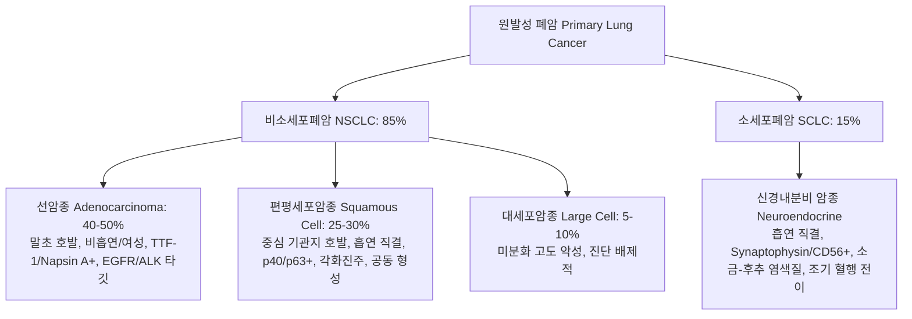
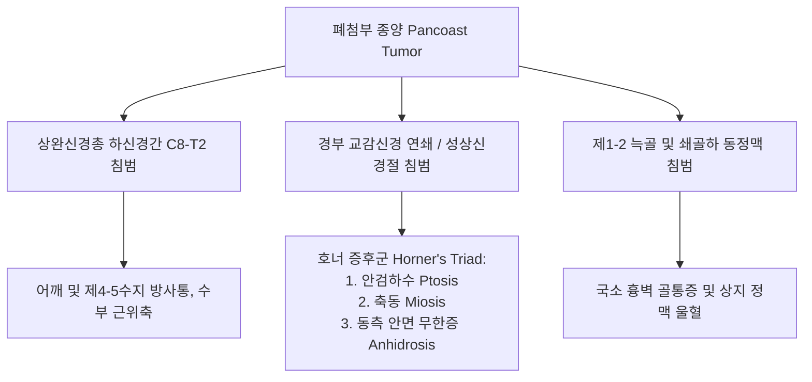
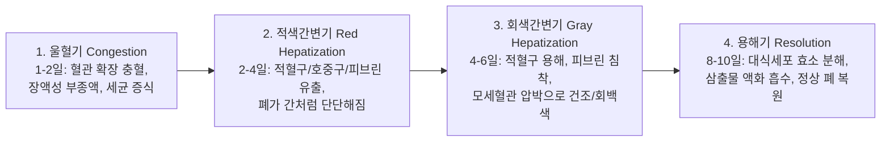
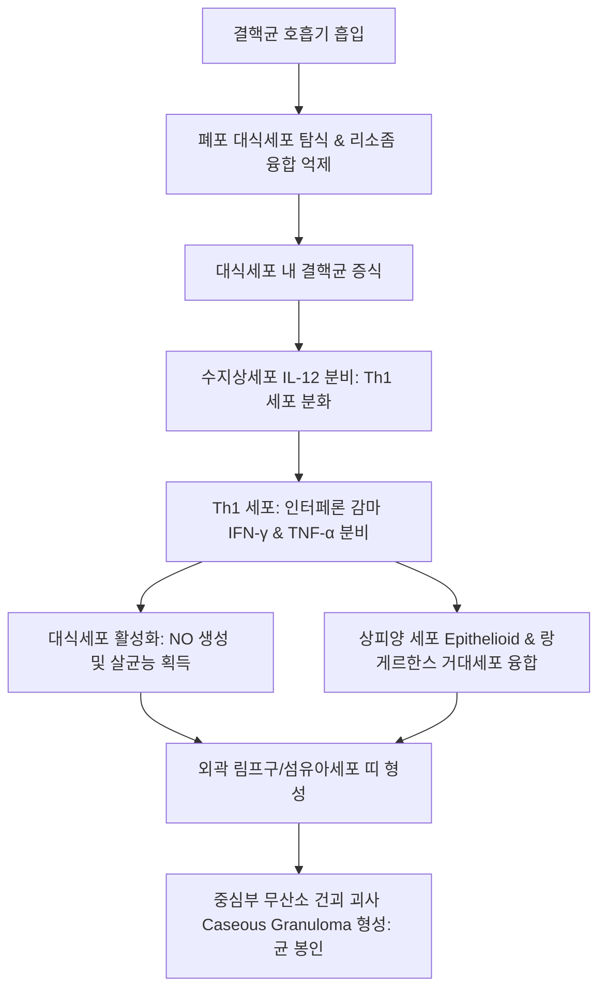
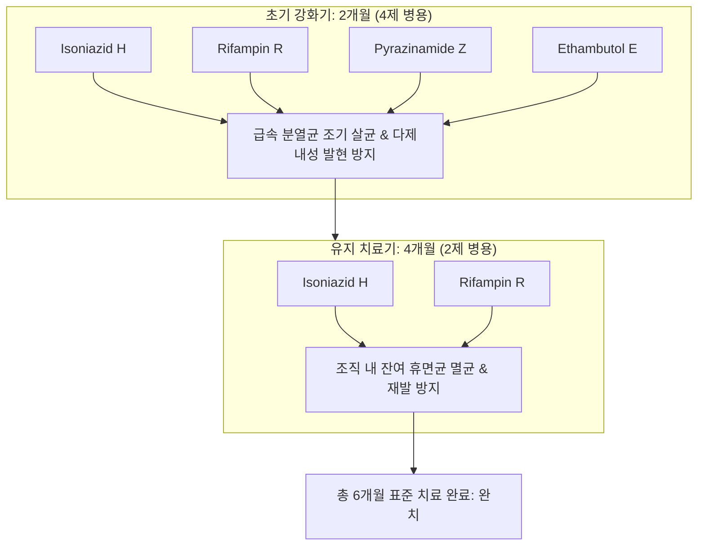

# Netter Respiratory Day 05: 폐암·종양수반증후군 및 호흡기 감염 질환 (폐렴·비정형폐렴·진균·바이러스·폐결핵) (pp. 158–212)

> 📖 **원서 출처**: [The Netter Collection - Volume 3, Respiratory System.pdf (pp. 158-212)](https://drive.google.com/file/d/1lDCEGUPEHrzTY10gPML28PbdcCYyY90a/view?usp=drivesdk)
> 🏷️ **범위**: Section 4: Diseases and Pathology — Part 2 (Plate 4-27 ~ Plate 4-48, 총 22개 플레이트 전수 정밀 수록)
> 📌 **핵심 테마**: 원발성 폐암의 4대 조직형 분류(선암종 Adenocarcinoma TTF-1/Napsin A 양성 말초 호발 vs 편평세포암종 Squamous Cell Carcinoma p40/p63 양성 중심 기관지 호발 및 각화/세포간교 vs 소세포폐암 SCLC Synaptophysin/CD56 신경내분비 표지자 양성 및 조기 전이 vs 대세포암종 Large Cell Carcinoma), 최신 분자 표적 드라이버 돌연변이(EGFR L858R/Exon 19 del Osimertinib, ALK 전위 Alectinib, ROS1, KRAS G12C Sotorasib 및 면역관문억제제 PD-L1 Pembrolizumab), 흉곽 내 국소 침범 증후군(폐첨부 팬코스트 종양 Pancoast Tumor의 C8-T2 신경총 침범 및 호너 증후군 Horner's Triad: 안검하수·축동·무한증, 상대정맥 증후군 SVC Syndrome의 안면 부종 및 흉벽 측한 혈관 확장), 폐암의 4대 종양수반증후군(소세포폐암의 SIADH 저나트륨혈증, 이소성 ACTH 분비 쿠싱 증후군, 램버트-이튼 근무력증후군 LEMS 전압개폐성 칼슘채널 VGCC 자가항체 vs 편평세포암의 PTHrP 매개 악성 고칼슘혈증 vs 선암종의 비대성 폐골관절병증 HPOA 곤봉지), 세균성 폐렴의 고전적 대엽성 폐렴 4단계 병기(울혈기 Congestion $
ightarrow$ 적색간변기 Red Hepatization $
ightarrow$ 회색간변기 Gray Hepatization $
ightarrow$ 용해기 Resolution) 및 원인균별 임상 특징(폐렴구균 S. pneumoniae 녹슨 쇠빛 가래, 황색포도상구균 S. aureus 인플루엔자 후 속발성 괴사성 폐렴 및 기낭 형성, 클렙시엘라 K. pneumoniae 알코올 중독자 적포도주 젤리 가래 Currant-jelly sputum 및 엽간열 팽윤 Bulging fissure, 녹농균 P. aeruginosa 원내 감염), 비정형 및 기회감염 폐렴(마이코플라스마 M. pneumoniae 한랭응집소 Cold agglutinin IgM 및 다형홍반, 레지오넬라 L. pneumophila 냉각탑 수계 오염, 고열·상대적 서맥 Faget's sign, 저나트륨혈증, 신경계/위장관 증상 및 소변 항원 검사, HIV 감염인의 주폐포자충 폐렴 Pneumocystis jirovecii PCP 은염색 탁구공 낭포 및 Bactrim 1차 치료, 아스페르길루스 균종 Aspergilloma 모노드 징후 Monod sign 및 침습성 아스페르길루스증 IPA 헤일로 징후 Halo sign), 호흡기 바이러스 질환(인플루엔자 A/B형 바이러스 복제 기전, 헤마글루티닌 침투 vs 뉴라미니다아제 유리 억제제 Oseltamivir, 바이러스성 미만성 폐포 손상 DAD 및 유리질막 형성), 그리고 결핵균(Mycobacterium tuberculosis) 감염의 면역병리(폐포 대식세포 침투 $
ightarrow$ Th1 CD4+ T세포 활성화 $
ightarrow$ IFN-$\gamma$ 분비 $
ightarrow$ 대식세포의 상피양세포 및 랑게르한스 거대세포 전환 $
ightarrow$ 중심부 건괴성 육아종 Caseating Granuloma 형성), 일차 결핵(Ghon focus + 림프절 = Ghon/Ranke complex) vs 속발성 결핵(폐첨부 첨후분절 호발, 높은 산소분압 영역, 공동 Cavity 형성 및 기관지 산포), 속립성 결핵(Miliary TB) 혈행성 파종, 표준 1차 4제 항결핵 요법(RIPE: Isoniazid, Rifampin, Pyrazinamide, Ethambutol)의 핵심 작용 기전, 약물 상호작용 및 독성 감시(INH 말초신경병증 피리독신 예방, Rifampin 강력한 CYP3A4 유도 및 체액 주황색 착색, PZA 고요산혈증, Ethambutol 시신경염).

---

## 1. 개요 및 마스터 요약 (Executive Summary)

* **원발성 폐암의 조직형 분류 및 분자 종양학 (Plates 4-27 ~ 4-29, 4-32)**:
  * **비소세포폐암 (NSCLC, 85%) vs 소세포폐암 (SCLC, 15%)**:
    * **선암종 (Adenocarcinoma, 최다 40~50%)**: 비흡연자, 여성 호발. **폐 말초부(Peripheral)** 에 주로 위치. 면역염색상 **TTF-1(+), Napsin A(+)**, p40(-). 분자 표적 변이 빈도 최고: 아시아인 비흡연 폐선암종의 50% 이상에서 **EGFR 변이(Exon 19 del, L858R)** 보유 $
ightarrow$ 3세대 TKI(Osimertinib) 1차 표준; 그 외 **ALK 전위**(Alectinib), **ROS1**, **KRAS G12C**(Sotorasib), **PD-L1** 발현율에 따른 면역관문억제제(Pembrolizumab) 병용.
    * **편평세포암종 (Squamous Cell Carcinoma, 25~30%)**: **흡연과 직결**, **폐 중심부(Central)** 주기관지 호발. 조직학적 특징: **세포간교 (Intercellular bridges)**, **각화진주 (Keratin pearls)**. 면역염색상 **p40(+), p63(+)**, TTF-1(-). 중심부 괴사로 인한 **공동(Cavitation)** 형성이 흔함.
    * **소세포폐암 (SCLC, 15%)**: 골초 흡연자, 주기관지 점막하 기원. 미분화된 작은 원형/방추형 세포, 핍지질 세포질, 미세과립상 "소금과 후추(Salt-and-pepper)" 염색질, **세포자멸사 및 광범위한 괴사, 핵 압괴 (Azzopardi phenomenon)**. 신경내분비 표지자 **Synaptophysin(+), Chromogranin A(+), CD56(+)**. 극도로 빠른 증식과 조기 혈행성 전이로 진단 시 이미 수술 불가능한 경우가 95% 이상 $
ightarrow$ 복합 항암화학요법(Etoposide + Cisplatin/Carboplatin + Atezolizumab)이 근간.

* **폐암의 국소 침범 및 종양수반증후군 (Plates 4-30, 4-31, 4-33, 4-34)**:
  * **팬코스트 종양 (Pancoast Tumor / 상폐구 종양 Superior Sulcus Tumor)**: 폐첨부(Apex) 종양이 흉곽 출구 구조물을 침범. 하부 상완신경총(C8-T2) 압박에 따른 척골 신경 영역(제4~5수지) 방사통 및 상지 근위축 + **경부 교감신경절(성상신경절 Stellate ganglion) 침범에 따른 호너 증후군 (Horner's Syndrome 3징: 안검하수 Ptosis, 축동 Miosis, 안면 무한증 Anhidrosis)**.
  * **상대정맥 증후군 (SVC Syndrome)**: 우측 주기관지 주변 종양(주로 SCLC) 또는 종격동 림프절 전이가 박벽 저압 구조인 상대정맥을 외부에서 압박 $
ightarrow$ 두경부 및 상지의 정맥혈 환류 장애로 **안면/경부/상지 부종, 결막 충혈, 흉벽 표재정맥 확장 (Pemberton's sign 양성)** 유발.
  * **4대 핵심 종양수반증후군 (Paraneoplastic Syndromes)**:
    1. **SIADH (항이뇨호르몬 부적절 분비)**: **소세포폐암(SCLC)** 호발. 이소성 AVP 분비 $
ightarrow$ 수분 저류, **희석성 저나트륨혈증** ($	ext{Na}^+ < 130	ext{ mEq/L}$), 혈청 삼투압 감소 및 소변 삼투압 증가.
    2. **이소성 ACTH 분비 증후군**: **소세포폐암(SCLC)** 호발. 프로오피오멜라노코르틴(POMC) 절단으로 ACTH 대량 유리 $
ightarrow$ 부신 과형성, 전신 부종, **중증 저칼륨혈증 및 대사성 알칼리증, 고혈당** (쿠싱 외모 형성 전 급속 진행).
    3. **악성 고칼슘혈증**: **편평세포암종(SCC)** 호발. 종양 세포가 **PTHrP (부갑상선호르몬 관련 단백)** 분비 $
ightarrow$ 파골세포 활성화 및 신장 칼슘 재흡수 촉진 $
ightarrow$ 혈청 $	ext{Ca}^{2+} > 12	ext{ mg/dL}$, 의식 혼미, 다뇨, 탈수, EKG상 QT 단축.
    4. **램버트-이튼 근무력증후군 (LEMS)**: **소세포폐암(SCLC)** 호발. 신경근접합부 시냅스전 **전압개폐성 칼슘 통로 (P/Q-type VGCC)** 에 대한 자가항체 형성 $
ightarrow$ 아세틸콜린 유리 차단 $
ightarrow$ 하지 근위부 근력 약화, 자율신경실조증(구강건조, 발기부전). **반복 근수축 운동 시 일시적으로 근력이 호전되는 현상 (Post-exercise facilitation)** 이 중증근무력증(MG)과의 결정적 감별점.

* **세균성 폐렴의 병리 단계 및 주요 원인균 스펙트럼 (Plates 4-36 ~ 4-38)**:
  * **대엽성 폐렴 (Lobar Pneumonia)의 고전적 4단계 병리 변천**:
    1. **울혈기 (Congestion, 1~2일)**: 폐포 모세혈관의 극심한 충혈, 단백질이 풍부한 장액성 부종액과 소수의 세균이 폐포 내 충만. 폐가 무겁고 암적색을 띰.
    2. **적색간변기 (Red Hepatization, 2~4일)**: 대량의 **적혈구, 호중구, 피브린(Fibrin)** 이 폐포강으로 유출되어 폐포가 굳어짐. 육안상 간(Liver)과 유사한 단단한 경도(Consolidation)를 나타냄.
    3. **회색간변기 (Gray Hepatization, 4~6일)**: 유입된 적혈구가 붕괴/용해되고, 호중구와 농축된 피브린 그물이 압도하여 건조하고 회백색의 경화된 외관을 띰. 폐포 모세혈관 압박으로 빈혈 상태.
    4. **용해기 (Resolution, 8~10일 이후)**: 폐포 대식세포가 유입되어 단백분해효소로 피브린 삼출물을 소화/액화 $
ightarrow$ 기침으로 배출되거나 림프관으로 흡수되어 정상 폐 구조로 완전 복원.
  * **핵심 원인균별 임상 홀마크**:
    * **폐렴구균 (*Streptococcus pneumoniae*)**: 지역사회 획득 폐렴(CAP)의 최빈도(50% 이상) 원인균. 란셋형(Lancet-shaped) 그람양성 쌍구균. 갑작스러운 오한, 고열, 흉막성 흉통, **녹슨 쇠빛 가래 (Rusty sputum)**, 포진성 입술 헤르페스 동반.
    * **황색포도상구균 (*Staphylococcus aureus*)**: 그람양성 구균 포도송이 배열. **인플루엔자 바이러스 감염 후 속발성 세균 폐렴**으로 호발. 카탈라아제(+), 코아굴라아제(+). 조직 괴사능이 극심하여 **공동(Cavity), 폐농양, 농흉(Empyema), 기낭(Pneumatocele)** 빈발.
    * **간균성 폐렴 (Klebsiella pneumoniae)**: 알코올 중독자, 당뇨 환자에서 호발하는 두꺼운 다당류 캡슐을 가진 그람음성 간균. 심한 폐포 조직 괴사로 인한 **적포도주 젤리 가래 (Currant-jelly sputum)**, 흉부 X-선상 **엽간열 팽윤 징후 (Bulging fissure sign)**.
    * **녹농균 (*Pseudomonas aeruginosa*)**: 중환자실 인공호흡기 관련 폐렴(VAP), 기관지확장증, 낭포성 섬유증의 주범. 호기성 그람음성 간균, 피오시아닌(청록색 색소) 생성, 포도향 냄새, 고도의 다제내성(MDR).

* **비정형 폐렴, 기회감염 진균 및 호흡기 바이러스 (Plates 4-39 ~ 4-43)**:
  * **비정형 폐렴 (Atypical / Walking Pneumonia)**: 세균 배양 음성, 베타락탐 항생제 불응, 전신 증상이 호흡기 소견보다 두드러짐.
    * **마이코플라스마 (*Mycoplasma pneumoniae*)**: 세포벽이 결손되어 페니실린/세파계 완전 내성(Macrolide 또는 Quinolone 치료). 군대 기숙사, 학교 호발. 기침은 심하나 청진상 나음 경미. 합병증: **한랭응집소 (Cold agglutinin IgM, 50%)** 에 의한 자가면역 용혈성 빈혈, **다형홍반 (Erythema multiforme)**.
    * **레지오넬라 (*Legionella pneumophila*)**: 냉각탑, 호텔 배관, 샤워기 에어컨 수계 오염. 그람염색 불량(Silver stain 양성). **고열 동반 상대적 서맥 (Faget sign)**, 중추신경계 증상(두통, 혼란), **소화기 증상(물설사, 복통)**, 검사실 소견상 **저나트륨혈증, 간수치 상승, 혈뇨/단백뇨**. 진단은 **소변 항원 검사 (Legionella urinary antigen test)**.
  * **주폐포자충 폐렴 (*Pneumocystis jirovecii*, PCP)**: CD4+ T세포 수가 **$< 200	ext{ cells/}\mu	ext{L}$** 로 감소한 HIV 환자 또는 고용량 면역억제제 투여 환자. 운동성 저산소혈증, 마른 기침, 양측 폐문부 주위 미만성 간질 침윤. 진단: 객담/BAL 메테나민 은염색(GMS)상 **탁구공/찻잔 모양(Crushed ping-pong ball) 낭포**. 치료: **고용량 Bactrim (TMP-SMX)** $\pm$ ($	ext{PaO}_2 < 70	ext{ mmHg}$ 시 호흡부전 악화 방지를 위한 조기 **전신 스테로이드 병용**).
  * **폐 아스페르길루스증 (*Aspergillus fumigatus*)**: 결핵 완치 후 남아있는 기존 공동 내에 진균구가 자라나는 **아스페르길루스종 (Aspergilloma)** $
ightarrow$ 흉부 CT상 **모노드 징후 (Monod sign / Air crescent sign)**, 체위 변경 시 이동하는 균구 덩어리, 치명적 객혈 위험. 중성구 감소증 환자에서는 혈관 침습성 아스페르길루스증(IPA, CT상 출혈성 경색을 둘러싼 **헤일로 징후 Halo sign**) 호발.
  * **인플루엔자 바이러스 폐렴**: 인플루엔자 A/B 바이러스. 표면 당단백질 **Hemagglutinin (HA)** 으로 호흡기 상피 시알산 수용체에 결합 침투, **Neuraminidase (NA)** 로 복제된 비리온 방출. 약리 타깃: Oseltamivir/Zanamivir (NA 억제제, 증상 발현 48시간 이내 투여). 중증 바이러스 폐렴은 광범위한 상피 괴사와 **미만성 폐포 손상(DAD), 초자양막(Hyaline membrane)** 을 형성하여 급성 호흡곤란증후군(ARDS)으로 진행.

* **결핵균 감염의 분자 면역학 및 임상 병리 스펙트럼 (Plates 4-44 ~ 4-48)**:
  * **면역학적 캐스케이드 및 건괴성 육아종 형성**:
    * 비말핵(Droplet nuclei) 흡입 $
ightarrow$ 폐포 대식세포 탐식 $
ightarrow$ 결핵균 세포벽 코디팩터(Cord factor) 등이 리소좀 융합을 차단하여 대식세포 내 증식 $
ightarrow$ 수지상세포가 IL-12 분비 $
ightarrow$ **CD4+ Th1 세포 활성화** $
ightarrow$ **인터페론 감마 (IFN-$\gamma$) 및 TNF-$lpha$ 대량 분비** $
ightarrow$ 대식세포 활성화(iNOS 발현, 산화질소 NO 생성) $
ightarrow$ 대식세포가 풍부한 세포질을 가진 **상피양 세포 (Epithelioid cells)** 및 다핵성 **랑게르한스 거대세포 (Langhans giant cells)** 로 전환 $
ightarrow$ 세포독성 T세포와 섬유아세포가 둘러싸며 중심부에 저산소/산성 환경의 **치즈양 건괴성 괴사 (Caseous necrosis)** 육아종 완성.
  * **일차 결핵 vs 속발성 재활성화 결핵**:
    * **일차 결핵 (Primary TB)**: 면역 미노출 소아 호발. 흉막하 중간 폐야(하엽 상부 또는 상엽 하부)에 단발성 결핵 병소 형성(**곤 병소, Ghon focus**) + 국소 폐문 림프절염 동반 = **곤 복합체 (Ghon complex)** $
ightarrow$ 석회화 진행 시 **랑케 복합체 (Ranke complex)** 형성.
    * **속발성 결핵 (Secondary / Post-primary TB)**: 성인기 면역 저하에 따른 내인성 재활성화. **폐첨부 및 후상구역 (Apical and posterior segments of upper lobes)** 에 호발 (이유: 직립 보행 시 폐첨부는 중력에 의해 혈류는 적으나 환기가 우세하여 **$	ext{V/Q}$ 비가 매우 높고 산소 분압($	ext{PO}_2 pprox 130	ext{ mmHg}$)이 가장 높아** 절대 호기성 균인 결핵균 증식의 최적지). 건괴 괴사의 액화 및 기관지 배액으로 **공동 (Cavitation)** 형성 $
ightarrow$ 객담 내 다량의 항산균(AFB) 배출로 전염력 극대화.
  * **속립성 결핵 (Miliary TB)**: 건괴 병소가 폐정맥을 침식하여 전신 동맥순환으로 파종되거나 흉관을 통해 전신 정맥순환으로 재유입 $
ightarrow$ 전폐야에 균일하게 뿌려진 $1\sim2	ext{ mm}$ 크기의 조형 좁쌀 결절(Millet seed). 간, 비장, 골수, 뇌수막 등 다장기 침범.
  * **항결핵 1차 표준 4제 요법 (RIPE Regimen, 6개월 단기 치료 표준)**:
    * **초기 2개월**: **Isoniazid (H) + Rifampin (R) + Pyrazinamide (Z) + Ethambutol (E)** 4제 병용 $
ightarrow$ **유지 4개월**: **H + R** 2제 병용 (총 6개월).
    * **약제별 작용 기전 및 부작용 감시**:
      1. **Isoniazid (INH)**: KatG 효소에 의해 활성화되어 마이콜산(Mycolic acid) 세포벽 합성 차단. 부작용: 간독성, **피리독신(비타민 $	ext{B}_6$) 대사 방해로 인한 말초신경염 (반드시 Pyridoxine 병용 투여)**.
      2. **Rifampin (RIF)**: 세균의 DNA 의존성 RNA 중합효소 $eta$ 소단위 억제. 부작용: 강력한 **간 대사효소 CYP3A4 유도(Induction)** 로 병용 약물(항응고제, 경구피임약, 면역억제제 등) 혈중 농도 급감, 소변/눈물 등 **체액 주황색(Orange-red) 착색**.
      3. **Pyrazinamide (PZA)**: 대식세포 내 산성 환경에서 휴지기 결핵균 박멸. 부작용: 가장 심한 간독성, 요산 배설 억제로 인한 **고요산혈증 및 통풍(Gout) 유발**.
      4. **Ethambutol (EMB)**: 아라비노실 전이효소(Arabinosyl transferase)를 억제하여 아라비노갈락탄 세포벽 합성 차단. 부작용: **시신경염 (Optic neuritis, 적록색약, 시력 저하, 안과 정기 검진 필수)**.

---

## 2. 플레이트별 정밀 분석 (Plates 4-27 ~ 4-48)

### Plate 4-27 | 폐암의 개요 및 조직학적 분류 (Lung Cancer Overview: Histopathology & Cell Types)
![[Netter_V3_Plate4-27.png]]

* **분자 병리학적 분류 및 역학적 특징**:
  * 전 세계 암 사망률 1위 질환. 위험 인자 중 **흡연(Cigarette smoking)** 이 원인의 85~90%를 차지하며, 누적 흡연량(갑년, Pack-years)에 비례하여 위험도 급상승. 라돈(Radon) 노출, 석면(Asbestos), 비소, 대기오염 등도 원인.
  * **2대 임상·병리학적 대분류**:
    1. **비소세포폐암 (Non-Small Cell Lung Cancer, NSCLC, 전체의 80~85%)**:
       * 조기 발견 시 근치적 외과 절제술(Lobectomy + 종격동 림프절 곽청술)이 완치의 유일한 기회.
       * 하위 아형: 선암종(40~50%), 편평세포암종(25~30%), 대세포암종(5~10%).
    2. **소세포폐암 (Small Cell Lung Cancer, SCLC, 전체의 15%)**:
       * 분열 속도가 극도로 빠르고 진단 시 이미 70% 이상에서 전신 전이 동반.
       * 수술적 절제의 적응증이 되지 않으며, 항암화학요법 및 방사선 치료에 초기에 극적인 반응을 보이나 급속히 재발하여 5년 생존율 $< 7\%$.



---

### Plate 4-28 | 폐 선암종 및 편평세포암종의 병리 (Pathology of Adenocarcinoma and Squamous Cell Carcinoma)
![[Netter_V3_Plate4-28.png]]

* **선암종 vs 편평세포암종의 해부병리학적 대조 분석**:

| 분류 지표 | 폐 선암종 (Adenocarcinoma) | 폐 편평세포암종 (Squamous Cell Carcinoma) |
| :--- | :--- | :--- |
| **호발 환자군** | **비흡연자**, 여성, 젊은 연령층 (물론 흡연자에서도 발생) | **고령의 골초 남성 흡연자** (흡연력과 절대적 비례) |
| **발생 위치** | **폐 말초부 실질 (Peripheral subpleural)** | **폐 중심부 주기관지/엽기관지 내강 (Central endobronchial)** |
| **선행 병변** | 비정형 선종양 증식(AAH) $
ightarrow$ 제자리선암(AIS) $
ightarrow$ 침습암 | 편평상피 화생(Metaplasia) $
ightarrow$ 이형성(Dysplasia) $
ightarrow$ 상피내암(CIS) |
| **조직학적 특징** | 샘(Gland) 형성, 유두상/선포상 구조, **세포 내 점액(Mucin) 생성** | **세포간교 (Intercellular bridges)**, 세포질 내 **각화진주 (Keratin pearls)** |
| **면역조직화학 (IHC)** | **TTF-1 (+), Napsin A (+)**, p40 (-), p63 (-) | **p40 (+), p63 (+), CK5/6 (+)**, TTF-1 (-), Napsin A (-) |
| **방사선 소견** | 말초 고립성 폐결절(SPN) 또는 간유리 음영(GGO) | 중심부 폐문 종괴, 무기폐, **종양 중심부 괴사성 공동 (Cavitation)** |
| **전이 양상** | 흉막 파종(악성 흉수), 뇌, 뼈, 부신, 간으로의 조기 혈행성 전이 | 국소 림프절 전이가 주도적, 원격 전이는 상대적으로 지연 |

> ⚠️ **Clinical Pearl**:
> 흉부 X-선이나 CT에서 두꺼운 벽을 가진 **공동(Cavity)** 을 형성하는 중심부 폐 종괴가 관찰된다면 십중팔구 **편평세포암종(SCC)** 입니다. 선암종은 공동을 형성하는 경우가 드물며 주로 말초 폐 실질 결절로 나타납니다. 반면 객혈(Hemoptysis)과 기관지 폐색에 의한 폐렴/무기폐는 기관지 내강으로 자라나는 편평세포암종에서 훨씬 빈번합니다.

---

### Plate 4-29 | 소세포폐암 및 신경내분비 종양 (Small Cell Lung Cancer & Neuroendocrine Tumors)
![[Netter_V3_Plate4-29.png]]

* **세포학적 악성도 및 신경내분비 스펙트럼**:
  * **폐 신경내분비 종양 스펙트럼**:
    1. 전형적 유암종 (Typical Carcinoid, 저등급): 핵분열 $< 2/2	ext{ mm}^2$, 괴사 없음.
    2. 비전형적 유암종 (Atypical Carcinoid, 중등급): 핵분열 $2\sim10/2	ext{ mm}^2$, 국소 괴사.
    3. 대세포 신경내분비암종 (LCNEC, 고등급): 대형 세포, 높은 핵분열.
    4. **소세포폐암 (SCLC, 최악성 고등급)**: 핵분열 $> 10/2	ext{ mm}^2$ (보통 $> 60$), 광범위한 지도상 괴사.
  * **소세포폐암의 현미경적 특징**:
    * 림프구 크기의 $2\sim3$배에 불과한 작은 난원형 세포들이 시트(Sheet)상으로 밀집.
    * 세포질이 거의 없어 **핵-세포질 비(N/C ratio)가 극단적으로 높음**.
    * 뚜렷한 핵소체는 보이지 않고 섬세하게 분산된 **소금-후추(Salt-and-pepper) 염색질**.
    * 조직 검사 절편 제작 시 압력에 의해 핵 DNA가 혈관벽 주변으로 찌그러져 염색되는 **아조파르디 현상 (Azzopardi phenomenon)**.
  * **병기 분류 (VALG 2단계 병기)**:
    * **제한 병기 (Limited Stage, 30%)**: 단일 방사선 조사 영역(한쪽 흉강 및 종격동 림프절) 내에 국한된 병변 $
ightarrow$ 동시 항암방사선 치료(CCRT) 시행.
    * **확장 병기 (Extensive Stage, 70%)**: 반대측 흉강 전이, 악성 흉수 또는 원격 전이(뇌, 뼈, 간) $
ightarrow$ 전신 항암화학요법 + 면역치료(Atezolizumab/Durvalumab).

---

### Plate 4-30 | 폐암의 흉곽 내 국소 침범: 팬코스트 종양 및 호너 증후군 (Local Invasion: Pancoast Tumor & Horner Syndrome)
![[Netter_V3_Plate4-30.png]]

* **폐첨부 흉곽 출구의 해부학적 파괴**:
  * **팬코스트 종양 (Pancoast Tumor / 상폐구 종양, Superior Sulcus Tumor)**:
    * 폐첨부(Apex)의 흉막하에서 발생한 종양(조직학적으로 편평세포암종 또는 선암종이 다수).
    * 조기에 흉벽, 쇄골하 혈관, 신경 구조물을 침범하여 독특한 임상 증후군을 유발.
  * **침범 구조물에 따른 3대 임상 양상**:
    1. **상완신경총 하부 줄기 (Lower Trunk of Brachial Plexus, C8-T1-T2)** 침범:
       * 척골 신경(Ulnar nerve) 주행 부위를 따라 어깨 뒤쪽, 겨드랑이, 상완 내측, 제4~5수지로 방사되는 **극심한 신경병증성 통증**.
       * 진행 시 수부 소근육(골간근, 소지구근)의 위축 및 근력 저하.
    2. **경부 교감신경절 (Cervical Sympathetic Chain / Stellate Ganglion)** 침범:
       * **호너 증후군 (Horner's Syndrome)** 3징:
         * **안검하수 (Ptosis)**: 상안검판근(Müller's muscle, 교감신경 지배) 마비로 인한 눈꺼풀 처짐.
         * **축동 (Miosis)**: 동공산대근(Pupillary dilator) 마비로 부교감신경(동안신경)이 우세해져 동공 수축.
         * **무한증 (Anhidrosis)**: 동측 안면 및 경부 피부의 땀 분비 소실 및 혈관 확장에 따른 안면 조홍.
    3. **제1, 2 늑골 및 흉추체 골 파괴**: 단순 흉부 방사선상 폐첨부 음영 증가 및 갈비뼈 융해.



---

### Plate 4-31 | 상대정맥 증후군 (Superior Vena Cava Syndrome)
![[Netter_V3_Plate4-31.png]]

* **혈역학적 폐쇄 기전 및 측한 순환계**:
  * **병태생리**: 상대정맥(SVC)은 우측 전상종격동에 위치하며, 벽이 매우 얇고 내압이 낮아($2\sim8	ext{ mmHg}$) 외부 압박에 극도로 취약함.
  * **원인**: **원발성 폐암이 전체의 70~80%** (특히 우측 폐의 소세포폐암 및 편평세포암종). 림프종(10~15%), 중심정맥관/심박동기 삽입 후 혈전증.
  * **임상 증상**:
    * 안면, 결막, 경부 및 양측 상지의 심한 부종과 청색증.
    * 호흡곤란, 기침, 기좌호흡, 뇌부종에 의한 두통, 현기증, 시력 장애.
    * **펨버턴 징후 (Pemberton's sign)**: 양팔을 머리 위로 올렸을 때 1분 이내에 안면 충혈과 호흡곤란이 급격히 악화되는 소견 (흉곽 입구 압박 가중).
  * **4대 측한 순환로 (Collateral Pathways)**:
    1. **기정맥-반기정맥계 (Azygos-Hemiazygos system, 가장 중요)**.
    2. 내흉정맥로 (Internal thoracic veins).
    3. 척추정맥총 (Vertebral venous plexus).
    4. 복벽피하 측한정맥 (Thoracoepigastric veins) $
ightarrow$ 흉부 및 복부 표면에 뱀 모양으로 늘어난 측한 혈관망 가시화.
  * **치료**: 응급 종격동 방사선 치료 또는 **혈관 내 상대정맥 스텐트 삽입술 (Endovascular Stenting)** 로 즉각적인 증상 완화.

---

### Plate 4-32 | 폐암의 분자 표적 및 유전체학 (Molecular Targets: EGFR, ALK, ROS1, KRAS, PD-L1)
![[Netter_V3_Plate4-32.png]]

* **정밀 종양학의 핵심 드라이버 돌연변이 및 표적 항암제**:

| 유전자 변이 | 변이 빈도 (아시아인 기준) | 임상적 호발 특징 | 주요 분자 기전 | 1차 표준 표적 치료제 |
| :--- | :--- | :--- | :--- | :--- |
| **EGFR 돌연변이** | **폐선암의 40~55%** (서양 15%) | **비흡연자, 여성**, 선암종 | Exon 19 del (60%), Exon 21 L858R (35%) 티로신 키나아제 항진 | **3세대 TKI: Osimertinib (오시머티닙)**, Lazertinib |
| **ALK 재배열 (전위)** | 4 ~ 7% | 젊은 연령(40~50대), 비흡연자, 선암종 | EML4-ALK 역위 융합 유전자 형성 $
ightarrow$ 하부 증식 신호 활성화 | **2세대 ALK 억제제: Alectinib (알렉티닙)**, Brigatinib |
| **ROS1 재배열** | 1 ~ 2% | 젊은 비흡연자, 선암종 | ROS1 융합 키나아제 활성화 | Crizotinib, Entrectinib |
| **BRAF V600E** | 1 ~ 3% | 흡연자/비흡연자 혼재 | MAPK/ERK 경로 상시 활성화 | Dabrafenib + Trametinib (MEK 억제제 병용) |
| **KRAS 변이 (G12C)** | 10 ~ 15% (서양 25~30%) | **중증 흡연자**, 선암종 | GTP 결합 불활성화 차단 | **Sotorasib (소토라십)**, Adagrasib |
| **PD-L1 과발현** | 약 50%에서 발현 ($\ge 50\%$는 20~25%) | 흡연자에서 종양 돌연변이 부담(TMB) 높음 | T세포 표면 PD-1과 결합하여 면역 회피 유도 | **면역관문억제제: Pembrolizumab (펨브롤리주맙)** $\pm$ 세포독성 항암제 |

> ⚠️ **Clinical Pearl**:
> 진행성 폐선암종 환자가 내원했을 때 조직학적 확진 즉시 반드시 시행해야 하는 필수 검사는 **차세대 염기서열 분석(NGS)** 을 포함한 분자 유전자 검사(EGFR, ALK, ROS1, BRAF, RET, MET, KRAS)와 **PD-L1 IHC 검사**입니다. 표적 치료제가 있는 돌연변이를 보유한 환자에게 세포독성 항암제를 먼저 쓰는 것은 생존율과 삶의 질 측면에서 중대한 과오입니다.

---

### Plate 4-33 | 폐암의 종양수반증후군 I: 내분비 대사 이상 (Paraneoplastic Syndromes: SIADH, Cushing, Hypercalcemia)
![[Netter_V3_Plate4-33.png]]

* **이소성 호르몬 분비의 내분비 대사 병태생리**:
  * **1. SIADH (항이뇨호르몬 부적절 분비 증후군)**:
    * **원인 암종**: **소세포폐암 (SCLC, 80% 이상 차지)**.
    * **기전**: 종양 세포에서 바소프레신(Arginine Vasopressin, AVP)을 자율적으로 분비 $
ightarrow$ 신장 집합관의 $V_2$ 수용체 결합 $
ightarrow$ 아쿠아포린-2(AQP2) 수로 발현 $
ightarrow$ 수분 과다 재흡수.
    * **소견**: 체액량 정상(Euvolemic) 상태에서 **희석성 저나트륨혈증 ($	ext{Na}^+ < 135	ext{ mEq/L}$)**, 혈청 삼투압 저하($< 275	ext{ mOsm/kg}$), 소변 삼투압 비정상 상승($> 100	ext{ mOsm/kg}$), 소변 나트륨 배출 증가($> 40	ext{ mEq/L}$).
    * **치료**: 수분 제한(Fluid restriction), $V_2$ 수용체 길항제(Tolvaptan), 기저 SCLC 항암 치료. (단, 뇌교 탈수초 증후군 ODS 방지를 위해 나트륨 교정 속도는 24시간당 $< 8\sim10	ext{ mEq/L}$ 엄수).
  * **2. 이소성 ACTH 증후군 (Ectopic ACTH Syndrome)**:
    * **원인 암종**: **소세포폐암 (SCLC)** 및 기관지 유암종.
    * **기전**: 종양에서 부신피질자극호르몬(ACTH) 또는 전구체 POMC를 대량 분비 $
ightarrow$ 양측 부신의 망상대/속상대 과형성 $
ightarrow$ 코르티솔(Cortisol) 극단적 폭증.
    * **소견**: 전형적 쿠싱 외모(중심성 비만, 들소혹 등)가 나타날 시간적 여유 없이 **중증 저칼륨혈증, 대사성 알칼리증, 고혈압, 고혈당, 전신 쇠약**이 급속히 발생. (고용량 덱사메타손 억제 검사로도 억제되지 않음).
  * **3. 악성 고칼슘혈증 (Hypercalcemia of Malignancy)**:
    * **원인 암종**: **편평세포암종 (SCC)**.
    * **기전**: 종양 세포에서 **PTHrP (Parathyroid Hormone-related Protein)** 분비 $
ightarrow$ 뼈의 파골세포 RANKL 발현 촉진으로 골 흡수 유도 + 신장 원위세뇨관 칼슘 재흡수 촉진.
    * **소견**: 혈청 총 칼슘 $> 12	ext{ mg/dL}$, PTHrP 상승, 온전한 PTH는 억제되어 감소. 오심, 구토, 변비, 다뇨, 탈수, 기면, 혼수, 심전도상 QT 간격 단축.
    * **치료**: 대량 생리식염수 수액 주입(탈수 교정) + **정맥 비스포스포네이트 (Zoledronic acid)** 또는 Denosumab 투여.

---

### Plate 4-34 | 폐암의 종양수반증후군 II: 신경근육 및 골격 이상 (Paraneoplastic Syndromes: LEMS, HPOA)
![[Netter_V3_Plate4-34.png]]

* **자가면역 신경근접합부 손상 및 골막 반응**:
  * **1. 램버트-이튼 근무력증후군 (Lambert-Eaton Myasthenic Syndrome, LEMS)**:
    * **원인 암종**: **소세포폐암 (SCLC, 환자의 60%에서 SCLC 동반)**.
    * **기전**: SCLC 세포 표면의 신경형 칼슘 통로에 반응하여 생성된 자가항체가 운동신경 말단의 시냅스전 **P/Q형 전압개폐성 칼슘 통로 (P/Q-type VGCC)** 를 공격하여 파괴 $
ightarrow$ 탈분극 시 칼슘 유입 차단 $
ightarrow$ 아세틸콜린(ACh) 소포 유리 장애.
    * **임상 소견**:
      * 골반 및 대퇴 등 **하지 근위부의 대칭적 근력 약화** (계단 오르기, 앉았다 일어나기 힘듦).
      * 자율신경계 침범: 안구 건조, 구강 건조, 변비, 기립성 저혈압, 발기부전.
      * 심부건반사(DTR) 저하 또는 소실.
    * **중증근무력증(MG)과의 결정적 감별점**:
      * MG는 근육을 쓸수록 약화되지만, LEMS는 **근수축 운동을 반복하거나 최대 악력을 준 직후 일시적으로 근력과 반사가 회복되는 현상 (Post-exercise facilitation / Augmentation)** 을 보임.
      * 반복신경자극검사(RNS): 고빈도($20\sim50	ext{ Hz}$) 자극 시 복합근육활동전위(CMAP) 진폭이 **$> 100\%$ 이상 점진적으로 증가(Incremental response)**.
    * **치료**: 아미포스파리딘(Amifampridine, 시냅스전 칼륨 채널 차단으로 활동전위 연장 $
ightarrow$ 칼슘 유입 촉진), 피리도스티그민, 기저 암종 치료.
  * **2. 비대성 폐골관절병증 (Hypertrophic Pulmonary Osteoarthropathy, HPOA / Marie-Bamberger Syndrome)**:
    * **원인 암종**: **폐선암종 (Adenocarcinoma)** 호발.
    * **기전**: 종양이 폐 모세혈관상을 우회하는 미세 단락을 형성하거나 종양 자체에서 **VEGF** 및 **PDGF**를 과다 분비 $
ightarrow$ 거대핵세포가 폐에서 걸러지지 않고 말초 혈관으로 진입하여 혈소판 매개 성장인자 방출 $
ightarrow$ 골막의 신생혈관 증식 및 부종.
    * **3대 특징**:
      1. **심한 곤봉지 (Digital clubbing)** (손톱 기저부 각도 $> 180^\circ$, Lovibond angle 소실).
      2. 장골(원위 경골, 비골, 요골)의 양측 대칭성 **골막염 (Periostitis)** 으로 인한 극심한 관절통 및 압통.
      3. 무릎, 발목, 손목의 비염증성 관절 삼출. 단순 X-선상 대칭성 **양파껍질 모양 골막 신생골 형성**.

---

### Plate 4-35 | 폐암의 TNM 병기 판정 및 병기별 치료 원칙 (TNM Staging and Multimodal Management of Lung Cancer)
![[Netter_V3_Plate4-35.png]]

* **AJCC/UICC 8th/9th Edition TNM 분류 및 병기별 치료 전략**:
  * **T 병기 (종양 크기 및 국소 침범)**:
    * T1: 크기 $\le 3	ext{ cm}$ (T1a $\le 1	ext{ cm}$, T1b $1\sim2	ext{ cm}$, T1c $2\sim3	ext{ cm}$).
    * T2: 크기 $> 3	ext{ cm}$ 이나 $\le 5	ext{ cm}$, 또는 주기관지 침범, 내장측 흉막 침범, 무기폐.
    * T3: 크기 $> 5	ext{ cm}$ 이나 $\le 7	ext{ cm}$, 또는 흉벽, 횡격신경, 심낭 침범, 동측 동일 폐엽 내 다발 결절.
    * T4: 크기 $> 7	ext{ cm}$, 또는 종격동, 심장, 대혈관, 기관, 되돌이후두신경, 식도, 척추 침범, 동측 다른 폐엽 결절.
  * **N 병기 (림프절 전이 구역)**:
    * N0: 국소 림프절 전이 없음.
    * N1: 동측 폐포주위, 폐문부(Hilar) 림프절 전이.
    * **N2**: **동측 종격동(Mediastinal)** 또는 기관분기하(Subcarinal) 림프절 전이.
    * **N3**: **반대측 종격동/폐문부** 또는 양측 쇄골상와(Supraclavicular) 림프절 전이.
  * **M 병기**: M1a(흉막 파종, 반대측 폐 결절), M1b(단일 장기 단발 원격 전이), M1c(다발성 원격 전이).
  * **병기별 치료 원칙 (NSCLC)**:
    * **Stage I~II (T1-2, N0-1)**: **근치적 수술 (엽절제술 Lobectomy + 종격동 림프절 곽청술)** 이 1차 표준. 고위험군/II기 환자는 수술 후 보조 항암요법(Adjuvant chemotherapy $\pm$ Osimertinib).
    * **Stage III (국소 진행성, 특히 N2 병기)**: 다학제 접근. 수술 전 선행 항암방사선요법 후 수술 또는 **근치적 동시 항암방사선요법 (CCRT) 후 면역항암제 Durvalumab 1년 공고 요법**.
    * **Stage IV (원격 전이)**: 전신 요법. 분자 표적 치료제(EGFR, ALK 등) 또는 면역관문억제제(PD-L1) $\pm$ 백금 기반 복합 화학요법.

---

### Plate 4-36 | 세균성 폐렴: 대엽성 폐렴의 병기별 병리 (Bacterial Pneumonia: Lobar Stages - Congestion to Resolution)
![[Netter_V3_Plate4-36.png]]

* **폐포 삼출액의 동역학 및 병리학적 시퀀스**:
  * 세균성 폐렴의 해부학적 2대 패턴: **대엽성 폐렴 (Lobar pneumonia)** (단일 폐엽 전체가 균일하게 경화, 주로 폐렴구균) vs **기관지폐렴 (Bronchopneumonia)** (세기관지 주위로 다발성 반점상 경화, 포도상구균/그람음성균).
  * **대엽성 폐렴의 4대 병리 시기**:



---

### Plate 4-37 | 폐렴구균 폐렴 (Pneumococcal Pneumonia: Streptococcus pneumoniae)
![[Netter_V3_Plate4-37.png]]

* **미생물학적 독력 인자 및 전형적 임상 증례**:
  * **원인균 특징**: *Streptococcus pneumoniae*. 그람양성 란셋형(Lancet-shaped) 쌍구균, 통성 혐기성, 혈액 한천 배지에서 **$lpha$-용혈성 (녹색 용혈환)**, 옵토힌(Optochin) 감수성, 담즙 용해 시험(Bile solubility) 양성.
  * **핵심 독력 인자**:
    * **다당류 캡슐 (Polysaccharide Capsule)**: 백혈구의 탐식 작용을 물리적으로 차단 (90가지 이상의 혈청형 존재, 13가/23가 백신의 표적).
    * **뉴몰라이신 (Pneumolysin)**: 숙주 섬모 상피세포막에 구멍을 뚫어 세포 용해 및 점액섬모 에스컬레이터 파괴.
    * **IgA 단백분해효소 (IgA Protease)**: 점막 표면의 분비형 IgA를 절단하여 점막 부착 촉진.
  * **임상 징후 및 검사실 소견**:
    * 흔히 "떨리는 오한(Rigors)"으로 시작하여 $39\sim40^\circ	ext{C}$ 고열, 흉막성 흉통(Pleurodynia).
    * 폐포 내 적혈구 붕괴 삼출물이 기침으로 나오면서 나타나는 전형적인 **녹슨 쇠빛 가래 (Rusty brown sputum)**.
    * 흉부 X-선상 명확한 공기-기관지 조영술(Air bronchogram)을 동반한 폐엽 경화.
    * 치료: 감수성 균주는 Amoxicillin 또는 Ceftriaxone; 페니실린 내성 시 고용량 Amoxicillin-Clavulanate, Respiratory Fluoroquinolone (Levofloxacin/Moxifloxacin).

---

### Plate 4-38 | 포도상구균 및 그람음성 간균 폐렴 (Staphylococcal & Gram-Negative Bacillary Pneumonias: Klebsiella & Pseudomonas)
![[Netter_V3_Plate4-38.png]]

* **파괴적 폐렴균의 병리적 파괴상**:
  * **1. 황색포도상구균 폐렴 (*Staphylococcus aureus*)**:
    * 그람양성 구균, 카탈라아제(+), 코아굴라아제(+).
    * 인플루엔자 바이러스 폐렴 후 기도 상피 손상 부위에 2차 세균성 폐렴으로 호발.
    * 강력한 세포독소(알파 독소, PVL 독소)에 의해 혈관 내 혈전과 조직 괴사를 유발 $
ightarrow$ **다발성 폐농양, 기관지흉막루(BPF), 농기흉(Pyopneumothorax)** 및 소아에서 박벽의 공기 낭포인 **기낭 (Pneumatocele)** 형성. MRSA의 경우 Vancomycin 또는 Linezolid 사용.
  * **2. 클렙시엘라 폐렴 (*Klebsiella pneumoniae*)**:
    * 두꺼운 점액성 피막을 가진 그람음성 간균(Enterobacteriaceae).
    * 알코올 중독자, 만성 간질환, 당뇨 환자, 노인에서 호발.
    * 심각한 폐포벽 괴사와 점액 과다분비로 가래가 혈액과 점액이 끈적하게 뒤섞인 **적포도주 젤리 가래 (Currant-jelly sputum)** 가 배출됨.
    * 농축된 삼출물의 무게로 인해 흉부 X-선상 **엽간열이 아래로 불룩하게 밀려 내려오는 팽윤 징후 (Bulging fissure sign)** 관찰.
  * **3. 녹농균 폐렴 (*Pseudomonas aeruginosa*)**:
    * 그람음성 호기성 간균. 중환자실 인공호흡기 관련 폐렴(VAP) 및 기관지확장증 환자에서 호발.
    * 엘라스타제, 외독소 A(Exotoxin A, 단백질 합성 차단)를 분비하여 폐포 모세혈관벽을 괴사시키는 **괴사성 혈관염 (Necrotizing vasculitis)** 및 출혈성 경색 유발. 2가지 항녹농균 항생제(Cefepime, Piperacillin/Tazobactam, Meropenem + Ciprofloxacin 또는 Amikacin) 병용.

---

### Plate 4-39 | 비정형 폐렴 I: 마이코플라스마 및 클라미디아 (Atypical Pneumonia: Mycoplasma & Chlamydophila)
![[Netter_V3_Plate4-39.png]]

* **비세포벽 세균 및 세포 내 병원체의 임상 발현**:
  * **마이코플라스마 폐렴 (*Mycoplasma pneumoniae*)**:
    * **특징**: **세포벽(Cell wall)이 전혀 없어** 세포막에 스테롤(Sterol)을 함유하며, 세포벽 합성을 억제하는 페니실린/세팔로스포린 등 모든 베타락탐 항생제에 본태성 내성.
    * **역학**: 학령기 소아, 청소년, 기숙사, 군대 훈련소 등 밀집 집단 호발.
    * **임상**: 일상생활을 유지할 정도로 전신 상태는 양호하여 **"걸어 다니는 폐렴(Walking pneumonia)"** 이라 불림. 마르고 발작적인 쇳소리 기침이 수주간 지속.
    * **면역 합병증**:
      * 결핵균 및 적혈구 I 항원에 반응하는 자가항체인 **한랭응집소 (Cold Agglutinin, IgM)** 가 생성되어 **한랭 자가면역 용혈성 빈혈 (Cold AIHA)** 유발.
      * 피부 병변: 표적 병변(Target lesion)을 보이는 **다형홍반 (Erythema multiforme)** 또는 스티븐스-존슨 증후군.
    * **치료**: 단백질 합성 억제제인 마크로라이드(Azithromycin, Clarithromycin) 또는 독시사이클린(Doxycycline).
  * **클라미디아 폐렴 (*Chlamydophila pneumoniae*)**:
    * 절대 세포 내 기생체. 기초소체(Elementary body, 감염형)와 그물소체(Reticulate body, 증식형)의 생활사. 노인에서 가벼운 인후통, 쉰목소리로 시작하여 지속성 기침 유발.

---

### Plate 4-40 | 비정형 폐렴 II: 레지오넬라증 (Legionnaires' Disease: Legionella pneumophila)
![[Netter_V3_Plate4-40.png]]

* **수계 전파 및 다기관 침범 특징**:
  * **균주 및 감염 경로**: *Legionella pneumophila*. 호기성 다형성 그람음성 간균(통상 그람염색으로 염색되지 않아 Dieterle 은염색 사용). 대형 건물의 냉각탑수, 중앙공조 시스템, 온수 파이프, 스파 등 수계 환경 내의 아메바 내부에 기생하다가 **에어로졸 흡입을 통해 감염** (사람 간 전파는 없음).
  * **2가지 임상 형태**:
    1. **폰티악 열 (Pontiac Fever)**: 폐 침범 없는 2~5일간의 독감 유사 급성 열성 질환, 저절로 완치.
    2. **레지오넬라증 (Legionnaires' Disease, 중증 대엽성/괴사성 폐렴)**:
  * **진단적 단서를 제공하는 5대 임상 징후**:
    1. **고열과 상대적 서맥 (Relative Bradycardia / Faget's sign)**: 체온이 $39\sim40^\circ	ext{C}$까지 치솟으나 맥박수는 비례적으로 증가하지 않음.
    2. **소화기 증상**: 폐 증상에 선행하거나 동반되는 심한 **수양성 설사(Watery diarrhea)**, 복통, 구토.
    3. **신경계 이상**: 고열과 함께 기면, 착란(Confusion), 환각, 실조증 등 두드러진 뇌병증 소견.
    4. **검사실 이상 소견**: **저나트륨혈증 ($	ext{Na}^+ < 130	ext{ mEq/L}$)**, 저인산혈증, 간효소 수치(AST/ALT) 상승, 혈뇨 및 단백뇨.
    5. **소변 항원 검사 (Urinary Antigen Test)**: *L. pneumophila* 혈청형 1형에 대해 신속하고 매우 정확함 (수개월간 양성 유지).
  * **치료**: 세포 내 침투력이 우수한 **Levofloxacin/Moxifloxacin (Fluoroquinolone)** 또는 고용량 **Azithromycin**.

---

### Plate 4-41 | 면역저하자 및 기회감염 폐렴: 주폐포자충 폐렴 (Pneumocystis jirovecii Pneumonia, PCP)
![[Netter_V3_Plate4-41.png]]

* **비정형 진균의 분자생물학 및 폐포 내 삼출물**:
  * **병원체 특성**: 과거 원충(Protozoa)으로 분류되었으나 DNA 분석으로 **진균(Fungus)** 으로 재분류됨. 세포막에 에르고스테롤 대신 콜레스테롤을 함유하여 암포테리신 B나 아졸계 항진균제가 전혀 듣지 않음.
  * **호발 대상**: **CD4+ T 림프구 수 $< 200	ext{ cells/}\mu	ext{L}$ 인 HIV 감염자**, 혈액암 환자, 장기이식 후 면역억제제 투여 환자.
  * **병리 소견**: 폐포 내에 호산성, 무세포성의 **거품 모양 솜사탕 양상 (Foamy / Honeycombed exudate)** 삼출물이 가득 참. 폐포벽 부종 및 제2형 폐포세포 비대.
  * **진단**: 기관지폐포세척액(BAL)의 **GMS (Gomori Methenamine Silver) 은염색** 상 중앙에 어두운 핵성 점(Dot)을 가진 **주멸된 찻잔 모양(Cup-shaped / Crushed ping-pong ball)** 의 흑색 낭포(Cyst) 무리 확인.
  * **치료 및 예방**:
    * **1차 치료제: 고용량 TMP-SMX (Bactrim)** 정맥 주사 (엽산 합성 경로 이중 차단).
    * **스테로이드 병용 적응증**: 실내 공기 호흡 시 **$	ext{PaO}_2 < 70	ext{ mmHg}$ 또는 $	ext{A-a}\ 	ext{gradient} \ge 35	ext{ mmHg}$** 인 중등증~중증 환자에서는 균 파괴로 인한 폐포 내 염증 악화를 막기 위해 **반드시 항생제 투여 전/동시에 경구/정맥 Prednisone을 투여**해야 사망률을 50% 이상 감소시킴.
    * 예방 요법: CD4 $< 200/\mu	ext{L}$ 도달 시 TMP-SMX 매일 1정 예방 투여.

---

### Plate 4-42 | 폐 진균 감염: 아스페르길루스증 (Pulmonary Aspergillosis: Aspergilloma to Invasive)
![[Netter_V3_Plate4-42.png]]

* **형태학적 스펙트럼: 단순 균종에서 혈관 침습까지**:
  * **미생물학**: *Aspergillus fumigatus*. 격벽이 있고(Septate), **$45^\circ$ 예각 분지(Dichotomous acute-angle branching)** 를 하는 곰팡이 균사(Hyphae).
  * **3대 임상-병리학적 형태**:
    1. **아스페르길루스 균종 (Aspergilloma / Fungus Ball)**:
       * 과거 폐결핵, 유육종증, 폐농양으로 형성된 **기존의 공동(Cavity) 내에서 균사가 죽은 세포, 점액과 엉겨 둥근 공(Ball) 모양으로 증식**.
       * 흉부 CT상 공동 내부에 둥근 종괴가 떠 있고 상부에 초승달 모양의 공기가 보이는 **모노드 징후 (Monod's sign / Air crescent sign)**. 환자의 체위를 바꾸면 균구가 중력에 의해 이동함.
       * 증상: 무증상이거나 **치명적인 대량 객혈(Massive hemoptysis)** 유발. 약물 침투가 불가능하여 근치적 폐절제술(Lobectomy) 또는 동맥 색전술 시행.
    2. **알레르기성 기관지폐 아스페르길루스증 (ABPA)**:
       * 천식 또는 낭포성 섬유증 환자에서 균사에 대한 1형/3형 과민반응. 중심성 기관지확장증, 혈청 총 IgE 급증, 갈색 가래마개. 전신 스테로이드 + Itraconazole 치료.
    3. **침습성 폐 아스페르길루스증 (Invasive Pulmonary Aspergillosis, IPA)**:
       * 백혈병 항암치료, 골수이식 등으로 인한 **심각한 호중구 감소증(Neutropenia, ANC $< 500$)** 환자에서 발생.
       * 균사가 혈관벽을 직접 뚫고 침범하는 **혈관 침습성(Angioinvasive)** 성질 $
ightarrow$ 혈전증, 폐포 출혈성 경색, 괴사 유발.
       * CT상 결절 주위를 출혈성 부종이 달무리처럼 둘러싸는 **헤일로 징후 (Halo sign)**. 혈청 갈락토만난(Galactomannan) 항원 양성. 1차 치료제: **Voriconazole (보리코나졸)** 또는 Isavuconazole.

---

### Plate 4-43 | 바이러스성 폐렴: 인플루엔자 및 호흡기 바이러스 병태 (Viral Pneumonia: Influenza, RSV, Viral DAD)
![[Netter_V3_Plate4-43.png]]

* **바이러스 복제 사이클, 상피 탈락 및 급성 폐포 손상**:
  * **인플루엔자 바이러스 구조 및 분자 기전**:
    * Orthomyxoviridae 과, 8개의 분절된 음성 가닥 RNA 게놈 보유 (게놈 재편성에 의한 항원 대변이 Antigenic shift 및 점돌연변이에 의한 항원 소변이 Antigenic drift).
    * **Hemagglutinin (HA)**: 상기도 상피의 시알산(Sialic acid) 수용체에 결합하여 바이러스의 엔도시토시스 및 세포 내 침투 주도.
    * **Neuraminidase (NA)**: 복제된 자손 바이러스가 숙주 세포막을 뚫고 나갈 때 시알산을 절단하여 유리(Budding) 촉진.
    * **항바이러스제 작용 기전**: **Oseltamivir (타미플루), Zanamivir**는 **NA 활성 부위를 차단**하여 바이러스가 세포 표면에 묶여 주변 세포로 퍼지지 못하게 함.
  * **바이러스성 폐렴의 조직학적 병리**:
    * 세균성 폐렴과 달리 폐포강 내 호중구 삼출이 아니라 **폐포 벽(중격, Interstitium)의 림프구/단핵구 침윤 및 부종**이 주도하는 간질성 폐렴 양상.
    * 중증 감염 시 바이러스 세포병변 효과로 제1형 폐포세포의 광범위한 괴사 및 탈락 $
ightarrow$ 모세혈관 혈장 단백질 누출 $
ightarrow$ 섬유소와 괴사 세포 잔해물이 폐포 내벽에 굳어 붙는 **유리질막 (Hyaline Membrane)** 형성 $
ightarrow$ **미만성 폐포 손상 (Diffuse Alveolar Damage, DAD)** 및 ARDS 진행.

---

### Plate 4-44 | 폐결핵의 병인 및 면역 반응 (Pathogenesis and Immunology of Tuberculosis: Caseating Granuloma)
![[Netter_V3_Plate4-44.png]]

* **세포 매개 면역과 건괴성 육아종 형성의 면역학적 세부 기전**:
  * **균주 특성**: *Mycobacterium tuberculosis*. 세포벽의 60% 이상이 복합 지질(Mycolic acid, Cord factor, Lipoarabinomannan)로 구성되어 건조와 소독제에 극도로 저항성이 강하고 통상 그람염색이 되지 않아 **항산성 염색 (Ziehl-Neelsen 또는 Kinyoun AFB stain)** 에서 붉은색 막대균으로 관찰됨.
  * **감염 초기 (비면역기, $0\sim3$주)**:
    * 결핵균이 폐포 대식세포의 만노스 수용체 등을 통해 탐식됨.
    * 결핵균 세포벽 지질이 엔도솜 산성화와 **파고사체-리소좀 융합 (Phagosome-lysosome fusion)을 억제**하여 대식세포 내에서 자유롭게 복제 증식 $
ightarrow$ 대식세포 용해 및 국소 확산.
  * **세포 매개 면역기 ($3\sim4$주 이후, 육아종 형성)**:
    1. 수지상세포가 결핵균 항원을 국소 림프절로 운반하여 나이브 CD4+ T세포에 제시하고 **IL-12**를 분비하여 **Th1 세포로 분화 유도**.
    2. 항원 특이적 Th1 세포가 폐 병변으로 이동하여 대량의 **인터페론 감마 (IFN-$\gamma$)** 분비.
    3. IFN-$\gamma$가 대식세포를 강력히 활성화 $
ightarrow$ 대식세포 내 식세포-리소좀 융합 정상화, iNOS 유도로 활성질소종(NO) 및 과산화물 생성 $
ightarrow$ 결핵균 사멸 유도.
    4. 대식세포가 분비하는 **TNF-$lpha$** 에 의해 더 많은 단핵구가 모집되며, 대식세포가 풍부하고 투명한 세포질을 가진 **상피양 대식세포 (Epithelioid histiocytes)** 로 변환되고, 이들이 서로 융합하여 말발굽 모양으로 핵이 배열된 **랑게르한스 거대세포 (Langhans giant cells)** 형성.
    5. 육아종 외곽을 CD4+/CD8+ T 림프구와 섬유아세포 띠가 둘러싸 물리적 방벽을 치고, 중심부는 혈관이 차단되고 대식세포가 괴사하면서 치즈 같은 저산소성의 **건괴 괴사 (Caseous necrosis)** 중심부를 형성하여 결핵균을 휴면 상태로 봉인.



---

### Plate 4-45 | 일차성 폐결핵: 곤 복합체 (Primary Tuberculosis: Ghon Focus and Complex)
![[Netter_V3_Plate4-45.png]]

* **결핵균 최초 노출과 림프절 파종의 병태**:
  * **정의**: 결핵균에 이전에 감염된 적이 없는 면역학적 미접촉자(주로 소아 또는 면역저하 성인)에서 발생하는 결핵.
  * **곤 병소 (Ghon Focus)**: 흡입된 결핵균이 폐포에 안착하여 형성된 $1\sim1.5	ext{ cm}$ 크기의 단발성 회백색 육아종성 염증 병변. 주로 환기량이 많은 **중간 폐야 (상엽의 하부 또는 하엽의 상부) 흉막 직하부**에 위치.
  * **곤 복합체 (Ghon Complex)**: **[흉막하 곤 병소] + [배액 림프관염] + [동측 폐문 또는 기관기관지 림프절 종대]** 의 결합.
  * **자연 경과**:
    * **90~95% (면역 정상인)**: 세포 매개 면역이 성공적으로 작동하여 병변이 섬유화되고 석회화됨. 방사선상 석회화된 곤 병소와 석회화된 폐문 림프절을 **랑케 복합체 (Ranke Complex)** 라 부르며 평생 결핵에 대한 잠복 면역 유지.
    * **5% (소아, 영양실조, 면역결핍)**: 육아종 형성에 실패하여 병변이 계속 커지며 건괴 괴사가 액화되어 폐 전체로 번지는 **진행성 일차 결핵 (Progressive primary TB)** 또는 림프절 종대로 기관지가 눌려 무기폐 발생, 혈행 파종으로 속립성 결핵 진행.

---

### Plate 4-46 | 진행성 및 공동성 속발 결핵 (Progressive and Cavitary Tuberculosis: Apical Reactivation)
![[Netter_V3_Plate4-46.png]]

* **폐첨부 호발 기전 및 공동 형성과 전염력**:
  * **정의**: 과거 일차 감염 후 잠복(Latent)해 있던 결핵균이 숙주의 면역력 저하(노화, 당뇨, 항-TNF 제제 사용, 스테로이드, HIV) 시 다시 증식하는 **내인성 재활성화 (Endogenous Reactivation)** 또는 다량의 균에 재감염(Exogenous reinfection).
  * **폐첨부 (Apical/Posterior Segments of Upper Lobes) 호발의 생리학적 기전**:
    * 인간이 직립 보행을 할 때 중력에 의해 폐 기저부로 혈류가 쏠리고 폐첨부로는 혈류가 매우 적음.
    * 반면 폐첨부의 환기는 상대적으로 유지되어 **환기-혈류비(V/Q ratio)가 극단적으로 높음 ($	ext{V/Q} > 3.0$)**.
    * 이로 인해 폐첨부 폐포 내 **국소 산소 분압이 $	ext{PO}_2 pprox 130	ext{ mmHg}$ 로 인체 내에서 가장 높음**.
    * 절대 호기성(Strict aerobe) 균주인 결핵균에게 최적의 산소 증식 환경을 제공.
  * **공동 형성 (Cavitation)의 치명성**:
    * 기왕의 면역 반응으로 인해 감작된 T세포가 대량의 사이토카인을 방출하여 건괴성 육아종 중심부가 급속히 액화(Liquefaction)됨.
    * 액화된 괴사물이 인접 기관지로 터져 들어가 기침으로 배출되면서 공기가 차는 커다란 **공동(Cavity)** 이 남음.
    * 공동 내벽은 풍부한 산소 공급으로 인해 결핵균이 $10^7\sim10^9	ext{ CFU}$ 수준으로 폭발적 증식 $
ightarrow$ 기침 시마다 무수한 비말핵 배출(개방성 결핵, 전염력 극대).
    * 공동 벽의 기관지 동맥 가지가 침식되어 가성동맥류(Rasmussen aneurysm)를 형성하다 파열되면 **전격성 치명적 대량 객혈** 초래.

---

### Plate 4-47 | 속립성 결핵 및 흉막 결핵 (Miliary and Pleural Tuberculosis: Hematogenous Dissemination)
![[Netter_V3_Plate4-47.png]]

* **혈행성 파종 및 흉막 파열의 병태**:
  * **속립성 결핵 (Miliary Tuberculosis)**:
    * **기전**: 건괴성 결핵 병소가 폐정맥을 침식하여 좌심실을 통해 전신 동맥계로 파종되거나, 림프관-흉관을 통해 정맥계로 들어가 폐동맥을 통해 전폐야로 재파종됨.
    * **방사선 및 육안 병리**: 양측 폐 전야에 균일하게 흩뿌려진 **$1\sim2	ext{ mm}$ 크기의 작은 좁쌀(Millet seed) 모양 결절**들이 미만성으로 관찰됨.
    * **다장기 침범**: 간, 비장, 골수, 신장, 부신, 안구 맥락막 결절(Choroidal tubercles), 뇌수막 침범.
    * **결핵성 수막염 (TB Meningitis)**: 뇌저부(Basilar cisterns)에 젤라틴상 삼출물이 뇌신경(제3, 6, 7 뇌신경)을 압박하고 혈관염을 일으켜 뇌경색 유발 (생존해도 심각한 신경학적 후유증, 반드시 스테로이드 병용).
  * **결핵성 흉막염 (Tuberculous Pleurisy)**:
    * 흉막하 결핵 병소가 흉막강 내로 터지면서 결핵균 단백에 대한 지연형 과민반응 유발.
    * **흉수 검사 소견 (Exudate)**: 림프구 우세 삼출액, 단백질 $> 3.0	ext{ g/dL}$, **ADA (Adenosine Deaminase) $\ge 40	ext{ IU/L}$** (매우 높은 민감도/특이도), 인터페론 감마 상승.

---

### Plate 4-48 | 폐결핵의 화학요법 및 항결핵제 약리 (Chemotherapy of Tuberculosis: First-Line RIPE Regimen)
![[Netter_V3_Plate4-48.png]]

* **항결핵 1차 표준 4제 약리학 및 약물 모니터링**:

| 약제명 | 약어 | 작용 기전 | 항균 활성 부위 | 주요 이상반응 및 독성 | 모니터링 및 임상 수칙 |
| :--- | :--- | :--- | :--- | :--- | :--- |
| **Isoniazid** | **INH (H)** | KatG에 의해 활성화 $
ightarrow$ InhA 효소 억제로 **마이콜산(Mycolic acid) 세포벽 합성 차단** | 세포 내/외 활동성 분열균에 강력한 초기 살균(Bactericidal) | **간독성** (약물유발 간염), **말초신경병증** (비타민 $	ext{B}_6$ 배설 촉진), 루푸스 유사 반응 | **Pyridoxine (비타민 $	ext{B}_6$) $10\sim50	ext{ mg/일}$ 병용 투여 필수** (임산부, 알코올 중독, 신부전) |
| **Rifampin** | **RIF (R)** | 세균의 DNA 의존성 **RNA 중합효소 $eta$ 소단위 억제** $
ightarrow$ 전사 차단 | 세포 내/외, 건괴 괴사 내 반휴면균 살균 | **간독성**, 혈소판 감소증, 독감 유사 증후군, **소변/눈물/땀 주황색 착색** | **강력한 간 CYP3A4 효소 유도제**: 와파린, 피임약, 스테로이드, 항레트로바이러스제 농도 급감 주의 |
| **Pyrazinamide** | **PZA (Z)** | 산성 환경에서 활성형 Pyrazinoic acid로 변환 $
ightarrow$ 세포막 전위 파괴 및 지질 합성 억제 | **대식세포 내 산성 환경 및 건괴 괴사 내부의 휴면균 살균 (멸균 Sterilizing 효과)** | **가장 강력한 간독성**, 요산 배설 억제로 인한 **고요산혈증 (Hyperuricemia) 및 관절통/통풍** | 통풍 환자에서 주의, 혈중 요산 수치 상승만으로 투약을 중단하지는 않음 |
| **Ethambutol** | **EMB (E)** | 아라비노실 전이효소 억제 $
ightarrow$ **아라비노갈락탄(Arabinogalactan) 합성 차단** | 세포 분열 균에 정균(Bacteriostatic) 작용, 타 약제 내성 발현 방지 | **시신경염 (Retrobulbar optic neuritis)**: 적록색약(Red-green dyschromatopsia), 시력 저하 | **시력 및 색각 검사 정기 시행 필수**, 소아에서는 표현이 어려워 사용 제한 |



> ⚠️ **Clinical Pearl**:
> 항결핵제 투여 중 정기 혈액검사에서 간기능 이상이 발견되었을 때의 대처 원칙:
> 1. 황달이나 소화기 증상이 없더라도 **AST/ALT가 정상 상한치의 5배 이상** 상승한 경우
> 2. 오심, 구토, 복통, 황달 등 간염 증상이 동반되면서 **AST/ALT가 정상 상한치의 3배 이상** 상승한 경우
> $
ightarrow$ **즉시 간독성 약제(PZA, INH, RIF)를 일체 중단**해야 합니다. 이후 간수치가 정상화되면 간독성이 가장 적은 EMB부터 시작하여 RIF $
ightarrow$ INH 순으로 하나씩 재투약하며 원인 약제를 색출합니다. (PZA는 재투약하지 않는 것이 일반적입니다).

---

## 3. 국소 추출용 파이썬 스크립트 (Python Script for Local Image Extraction)

본 요약 노트에 포함된 모든 도판 이미지(`Netter_V3_Plate4-27.png` ~ `Netter_V3_Plate4-48.png`, 총 22개)를 로컬 PC의 원서 PDF 파일(`The Netter Collection - Volume 3, Respiratory System.pdf`)로부터 직접 추출하여 옵시디언 보관함의 `첨부파일` 폴더에 일괄 저장할 수 있는 자동화 파이썬 스크립트입니다.

```python
import os
import fitz  # PyMuPDF 라이브러리

# 1. 경로 설정 (로컬 환경에 맞게 필요시 수정)
pdf_path = "The Netter Collection - Volume 3, Respiratory System.pdf"
output_dir = "./첨부파일"
os.makedirs(output_dir, exist_ok=True)

# 2. Section 4 (Part 2) 플레이트 매핑 테이블 (총 22개 플레이트)
plates_info = [
    ("Plate4-27", "Lung Cancer Overview"),
    ("Plate4-28", "Adenocarcinoma and Squamous Cell Carcinoma"),
    ("Plate4-29", "Small Cell Lung Cancer"),
    ("Plate4-30", "Local Invasion: Pancoast Tumor and Horner Syndrome"),
    ("Plate4-31", "Superior Vena Cava Syndrome"),
    ("Plate4-32", "Molecular Targets in Lung Cancer"),
    ("Plate4-33", "Paraneoplastic Syndromes: Endocrine and Metabolic"),
    ("Plate4-34", "Paraneoplastic Syndromes: Neuromuscular and Skeletal"),
    ("Plate4-35", "TNM Staging of Lung Cancer"),
    ("Plate4-36", "Bacterial Pneumonia: Lobar Stages"),
    ("Plate4-37", "Pneumococcal Pneumonia"),
    ("Plate4-38", "Staphylococcal and Gram-Negative Pneumonias"),
    ("Plate4-39", "Atypical Pneumonia: Mycoplasma"),
    ("Plate4-40", "Legionnaires' Disease"),
    ("Plate4-41", "Pneumocystis jirovecii Pneumonia"),
    ("Plate4-42", "Pulmonary Aspergillosis"),
    ("Plate4-43", "Viral Pneumonia: Influenza and DAD"),
    ("Plate4-44", "Pathogenesis and Immunology of Tuberculosis"),
    ("Plate4-45", "Primary Tuberculosis: Ghon Complex"),
    ("Plate4-46", "Progressive and Cavitary Tuberculosis"),
    ("Plate4-47", "Miliary and Pleural Tuberculosis"),
    ("Plate4-48", "Chemotherapy of Tuberculosis: RIPE Regimen")
]

# 3. PDF 문서 로드 및 300 DPI 고해상도 이미지 렌더링 추출
doc = fitz.open(pdf_path)
print(f"총 {len(doc)}페이지 원서 PDF 로드 완료. Day 05 (Section 4 Part 2) 이미지 추출을 시작합니다...")

# Section 4 Part 2 시작 페이지(pp. 155~) 기준 오프셋
start_page_offset = 150

for plate_id, plate_title in plates_info:
    num_suffix = plate_id.replace("Plate4-", "")
    search_terms = [f"Plate 4-{num_suffix}", f"4-{num_suffix}", plate_title.lower()]

    target_page = None
    for page_num in range(start_page_offset, len(doc)):
        text = doc[page_num].get_text().lower()
        if any(term.lower() in text for term in search_terms):
            target_page = page_num
            break

    if target_page is not None:
        page = doc[target_page]
        # 300 DPI 고해상도 렌더링
        pix = page.get_pixmap(matrix=fitz.Matrix(3.0, 3.0))
        img_filename = f"Netter_V3_{plate_id}.png"
        pix.save(os.path.join(output_dir, img_filename))
        print(f"✅ [추출 성공] {img_filename} (PDF p.{target_page+1})")
    else:
        print(f"⚠️ [미발견] {plate_id}: {plate_title}")

doc.close()
print("=== Section 4 (Part 2) 전체 22개 플레이트 이미지 추출 완료 ===")
```

<!-- 보관 태그(1회용·링크오류, 필요시 복원): 폐암, 비소세포폐암, 소세포폐암, 종양수반증후군, 팬코스트종양, 상대정맥증후군, 세균성폐렴, 폐렴구균, 비정형폐렴, 레지오넬라, 주폐포자충폐렴, 아스페르길루스, 인플루엔자, 결핵치료제 -->
