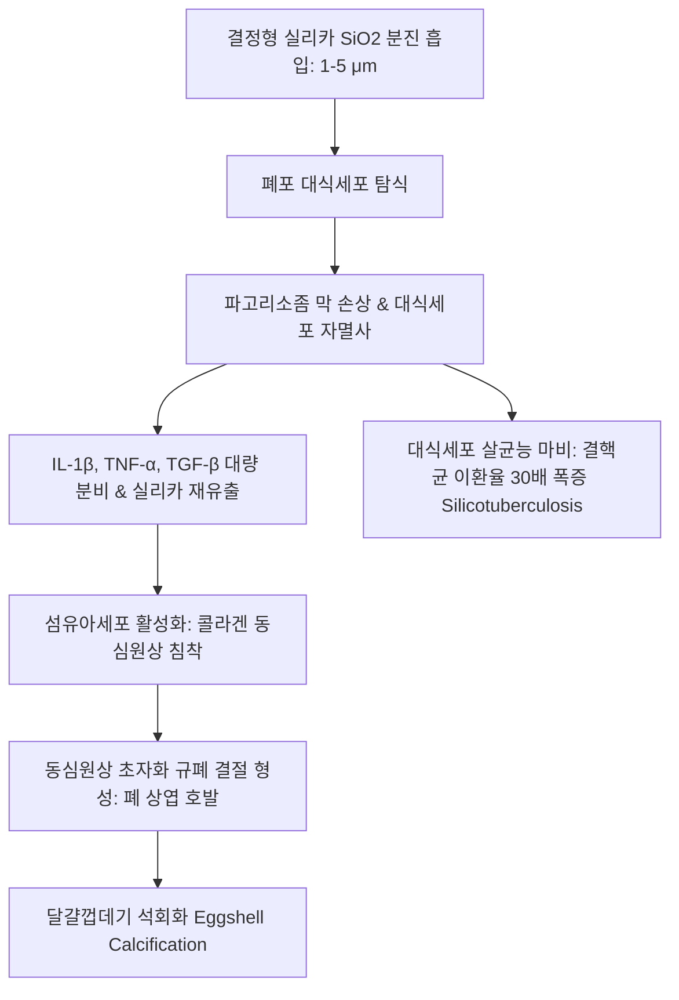
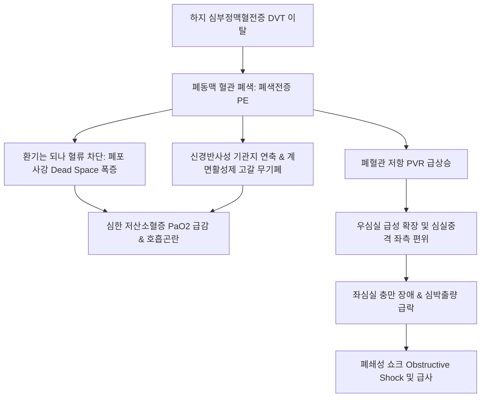
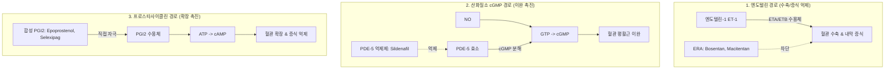
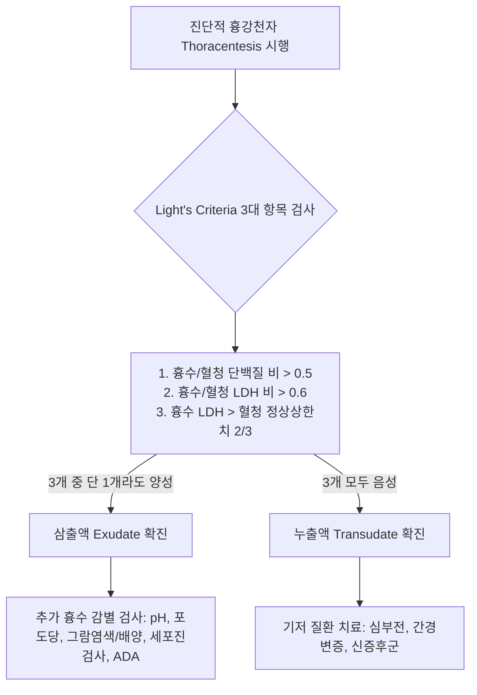
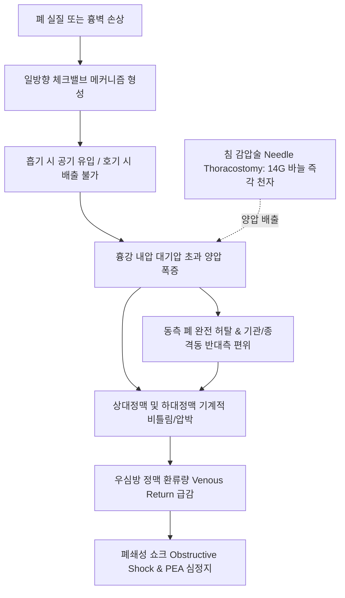

# Netter Respiratory Day 06: 환경성·혈관·흉막 질환, 흉부외상, ARDS 및 간질성 폐질환 (pp. 214–290)

> 📖 **원서 출처**: [The Netter Collection - Volume 3, Respiratory System.pdf (pp. 214-290)](https://drive.google.com/file/d/1lDCEGUPEHrzTY10gPML28PbdcCYyY90a/view?usp=drivesdk)
> 🏷️ **범위**: Section 4: Diseases and Pathology — Part 3 (Plate 4-49 ~ Plate 4-71, 총 23개 플레이트 전수 정밀 수록)
> 📌 **핵심 테마**: 무기물 분진 흡입성 진폐증(규폐증 Silicosis 상엽 호발·동심원상 초자화 결절·계란껍질형 달걀껍데기 석회화 Eggshell calcification·결핵 이환율 30배 증가 vs 석면폐증 Asbestosis 하엽 간질 섬유화·프러시안 블루 양성 석면소체 Asbestos body·흉막판 Pleural plaque·악성 흉막 중피종 Malignant Mesothelioma 및 폐암 동반율 급증 vs 탄광부 진폐증 CWP 탄분 반점 Macule 및 진행성 광범위 섬유화 PMF vs 베릴륨증 Berylliosis 비건괴성 육아종), 폐순환 장애 및 혈전색전증(심부정맥혈전증 DVT Virchow's Triad, 안장 색전 Saddle Embolus, 환기-혈류 불일치 사강 환기 급증, Wells Score, CT 폐혈관조영술 CTPA 결손 음영, 심초음파 McConnell's sign, 혈역학적 불안정성 고위험군 전신 혈전용해술 tPA vs 저/중등도 항응고 요법 DOAC/LMWH), 폐동맥고혈압(WHO 1~5군 분류, BMPR2 유전자 돌연변이, 폐세동맥 내막 증식·중막 비후·얼기모양 병변 Plexiform lesion, 우심도자술 우심실 후부하 폭증 및 $mPAP > 20	ext{ mmHg}$, 엔도텔린 수용체 길항제 Bosentan, PDE-5 억제제 Sildenafil, 프로스타사이클린 Epoprostenol), 폐부종의 정밀 병태생리(스타링 방정식 Starling forces, 정수압성 심인성 폐부종 vs 투과성 비심인성 폐부종, Kerley B선, 나비/박쥐 날개 Bat-wing 음영, PCWP $\ge 18	ext{ mmHg}$ 감별), 흉막 질환 및 기흉(Light's Criteria 단백질/LDH 삼출액 Exudate vs 누출액 Transudate, 부폐렴성 흉수 및 농흉 Empyema pH < 7.20 / 배양 양성 응급 흉관 삽입, 유미흉 Chylothorax 트리글리세라이드 > 110 mg/dL, 자연 기흉 Spontaneous vs 흉강 내압 대기압 초과 일방향 체크밸브로 인한 상대정맥 허탈·폐쇄성 쇼크 응급 질환 긴장성 기흉 Tension Pneumothorax 14G 침천자 감압), 흉부 둔상 및 호흡부전(연성 흉곽 Flail Chest 연속 3개 이상 늑골 다발 분절 골절에 따른 역설 호흡 Paradoxical breathing, 폐좌상 Pulmonary contusion 폐포 출혈/부종), 급성 호흡곤란증후군(ARDS 베를린 정의 Berlin Definition 7일 이내 급성 발병·양측성 침윤·비심인성·$PaO_2/FiO_2 \le 300	ext{ mmHg}$, 미만성 폐포 손상 DAD 유리질막 Hyaline membrane 삼출기-증식기-섬유화기, 폐보호 기계환기 Low tidal volume $6	ext{ mL/kg}$ 및 허용성 고탄산혈증, 복와위 Prone positioning), 그리고 간질성 폐질환(특발성 폐섬유증 IPF / 통상성 간질성 폐렴 UIP 시간적·공간적 이질성, 섬유아세포 병소 Fibroblastic foci, 기저부/흉막하 벌집폐 Honeycombing, 항섬유화제 Pirfenidone/Nintedanib vs 유육종증 Sarcoidosis 다발 장기 비건괴성 육아종 Noncaseating granuloma, 양측 폐문 림프절 종대 BHL, 혈청 ACE 상승, 고칼슘혈증).

---

## 1. 개요 및 마스터 요약 (Executive Summary)

* **무기물 분진 진폐증 및 환경성 폐질환 (Plates 4-49 ~ 4-52)**:
  * **규폐증 (Silicosis)**: 결정형 유리규산(Free silica, $	ext{SiO}_2$) 분진 흡입. 폐포 대식세포 탐식 $
ightarrow$ 리소좀 파열 및 인터루킨-1($	ext{IL}-1$), $	ext{TNF}-lpha$ 분비 $
ightarrow$ 대식세포 자멸사. 편광현미경하 복굴절성(Birefringent) 입자를 중심에 둔 **동심원상 초자화 교원질 결절 (Whorled concentric collagenous nodules)** 형성. **폐 상엽(Upper lobes)** 에 호발하며, 문부 림프절 테두리가 석회화되는 **달걀껍데기 석회화 (Eggshell calcification)** 가 특징. 대식세포 식균능 파괴로 **폐결핵 이환율이 정상인의 30배 이상 급증 (규결핵증, Silicotuberculosis)**.
  * **석면 관련 질환 (Asbestos-Related Diseases)**: 내열성 규산염 섬유. 크리소타일(백석면) 및 각섬석(청석면, 갈석면). 각섬석이 직경 대비 길이가 길어 폐포 심부까지 침투하여 가장 유독.
    * **석면폐증 (Asbestosis)**: **폐 하엽(Lower lobes) 기저부** 간질의 미만성 섬유화. 프러시안 블루(Prussian blue) 염색상 양성을 띠는 철단백질 코팅 아령 모양의 **석면소체 (Asbestos body / Ferruginous body)**.
    * **흉막판 (Pleural Plaques)**: 벽측 흉막(특히 횡격막 건막부 및 후하측 흉벽)에 발생하는 무증상의 양측 대칭성 초자화 석회화 판. 석면 노출의 가장 흔한 지표.
    * **악성 종양**: **폐암(선암종/편평세포암)의 발생 위험을 5배 증가**시키며, 흡연과 복합 시 위험도 50~100배로 폭증. 석면 노출의 절대적 특이 질환인 **악성 흉막 중피종 (Malignant Mesothelioma, BAP1 유전자 변이)** 유발 (노출 후 30~40년 잠복기).
  * **과민성 폐장염 (Hypersensitivity Pneumonitis, HP)**: 유기물 항원(농부폐의 *Saccharopolyspora rectivirgula*, 조류사육자폐의 조류 분변 단백)에 대한 **3형(면역복합체) 및 4형(지연형 T세포) 과민반응 복합체**. 세기관지 중심성의 **불완전 형성 비건괴성 육아종 (Poorly formed noncaseating granulomas)**, 간질성 림프구 침윤(CD8+ 우세), 기류폐쇄와 제한성 장애의 복합.

* **폐혈관 질환: 폐색전증 및 폐동맥고혈압 (Plates 4-53 ~ 4-57)**:
  * **폐혈전색전증 (Pulmonary Embolism, PE)**: 95% 이상이 하지 근위부 심부정맥혈전증(Proximal DVT: 대퇴정맥, 장골정맥)에서 유래 (Virchow's Triad: 정맥 정체, 혈관내피 손상, 과응고 상태).
    * **호흡·순환 역학**: 폐동맥 폐색 $
ightarrow$ 환기되나 혈류가 없는 **치명적 폐포 사강 (Alveolar dead space) 급증** $
ightarrow$ 폐포 계면활성제 고갈로 미세무기폐 $
ightarrow$ 우심실 후부하 급상승 $
ightarrow$ 우심실 확장/허혈, 심실중격 좌심실 압박 $
ightarrow$ 일회박출량 급감 $
ightarrow$ **심인성/폐쇄성 쇼크 및 급사**.
    * **진단 및 위험도 판정**: Wells Score로 임상적 확률 평가 $
ightarrow$ 저위험군은 D-dimer 배제 검사; 고위험군은 즉시 **조영증강 CT 폐혈관조영술 (CTPA)** 시행 (충만 결손 Filling defect 확인). 심초음파상 우심실 자유벽 무운동성 및 첨부 보존 소견인 **맥코넬 징후 (McConnell's sign)**.
    * **치료 원칙**: 지속적 저혈압(수축기압 $<90	ext{ mmHg}$) 동반 고위험군은 즉시 **전신 혈전용해술 (IV tPA, Alteplase)**; 혈역학적 안정군은 비타민 K 비의존성 경구 항응고제(DOAC: Apixaban, Rivaroxaban) 또는 LMWH 투여.
  * **폐동맥고혈압 (Pulmonary Arterial Hypertension, PAH, WHO 1군)**:
    * 여성 호발, 염색체 2q33의 **BMPR2 (골형성단백질 수용체 2형)** 기능 상실 돌연변이가 혈관 평활근 세포의 비정상적 증식 억제 실패 유발.
    * **병리학적 3대 특징**: 폐세동맥의 동심원상 내막 섬유화(Concentric intimal fibrosis), 중막 비후, 모세혈관의 비정상적 얼기모양 증식체인 **얼기모양 병변 (Plexiform lesion)**.
    * **혈역학 진단 기준 (우심도자술)**: 안정 시 **평균 폐동맥압 (mPAP) $> 20	ext{ mmHg}$**, 폐모세혈관 쐐기압(PCWP) $\le 15	ext{ mmHg}$, 폐혈관 저항(PVR) $\ge 2	ext{ Wood units}$.
    * **표적 약리 3대 경로**: 엔도텔린 수용체 길항제(ERA: Bosentan, Macitentan), PDE-5 억제제(Sildenafil, Tadalafil), 프로스타사이클린 경로 촉진제(Epoprostenol, Treprostinil, Selexipag).

* **폐부종 및 흉막 질환의 병태 역학 (Plates 4-58 ~ 4-62)**:
  * **폐부종 (Pulmonary Edema)의 스타링 법칙 (Starling Equation)**:
    $$Q_f = K_f \cdot \left[ (P_{	ext{cap}} - P_{	ext{if}}) - \sigma (\pi_{	ext{cap}} - \pi_{	ext{if}})
ight]$$
    * **심인성 (정수압성) 폐부종**: 좌심부전, 승모판 협착증 $
ightarrow$ 모세혈관 정수압($P_{	ext{cap}} pprox 	ext{PCWP}$)이 **$> 18\sim20	ext{ mmHg}$** 로 급상승 $
ightarrow$ 단백질이 적은 누출성 여과액 유출 $
ightarrow$ 간질 부종(Kerley B선) $
ightarrow$ 폐포 부종(나비 날개 Bat-wing 음영).
    * **비심인성 (투과성) 폐부종 (ARDS)**: 내피세포/상피세포 장벽 파괴로 모세혈관 투과성 계수($K_f$) 급증 $
ightarrow$ **PCWP가 정상($\le 14	ext{ mmHg}$)임에도** 단백질이 풍부한 삼출액 폐포 충만.
  * **흉막삼출 (Pleural Effusion)의 라이트 기준 (Light's Criteria)**:
    * 다음 3가지 중 **단 1개라도 만족하면 삼출액 (Exudate)**, 모두 불만족 시 **누출액 (Transudate)**:
      1. $	ext{흉수 단백질 / 혈청 단백질 비율} > 0.5$
      2. $	ext{흉수 LDH / 혈청 LDH 비율} > 0.6$
      3. $	ext{흉수 LDH 수치} > 	ext{혈청 LDH 정상 상한치의 2/3}$
    * **누출액 원인**: 울혈성 심부전(최다), 간경변증, 신증후군.
    * **삼출액 원인**: 폐렴, 악성 종양(폐암, 유방암), 결핵, 폐색전증.
    * **농흉 (Empyema) 및 복합 부폐렴성 흉수 배액 적응증**: 육안상 화농성(Pus), 세균 도말/배양 양성, **$	ext{pH} < 7.20$**, **포도당 $< 40	ext{ mg/dL}$**, $	ext{LDH} > 1,000	ext{ IU/L}$ $
ightarrow$ 항생제만으로 완치 불가, 즉각적인 **흉관 삽입술(Chest tube drainage)** 필수.

* **흉부 외상 및 기흉의 응급 의학 (Plates 4-63 ~ 4-66)**:
  * **연성 흉곽 (Flail Chest)**: 인접한 **3개 이상의 갈비뼈가 각각 2군데 이상 골절**되어 흉벽의 한 분절이 골격계의 연속성을 잃고 분리된 상태.
    * **역설 호흡 (Paradoxical Breathing)**: 흡기 시 흉강 내 음압에 의해 연성 분절이 **안으로 함몰**되고, 호기 시 양압에 의해 **밖으로 팽창**하여 환기 효율이 극도로 저하됨.
    * 치명적 본태는 연성 흉벽 자체보다 하부의 광범위한 **폐좌상 (Pulmonary Contusion)** 에 의한 출혈, 부종, 심각한 저산소혈증. 치료는 폐포 허탈 방지를 위한 양압 환기(NIV 또는 기관삽관).
  * **기흉 (Pneumothorax)**:
    * **원발성 자연 기흉 (PSP)**: 기저 질환 없는 키 크고 마른 청년 흡연자, 폐첨부 흉막하 기낭(Subpleural bleb) 파열.
    * **긴장성 기흉 (Tension Pneumothorax, 절대적 초응급 질환)**: 흉벽 또는 폐 실질 열상 부위가 호흡 주기에 따라 **일방향 밸브 (One-way check valve)** 로 작동 $
ightarrow$ 흡기 시 공기 유입, 호기 시 유출 차단 $
ightarrow$ 흉강 내압이 대기압 이상으로 폭증 $
ightarrow$ 동측 폐 완전 허탈, **종격동과 기관이 반대측으로 심하게 편위** $
ightarrow$ 대정맥(SVC/IVC) 꼬임 및 압박으로 **정맥 환류(Venous return) 완전 차단** $
ightarrow$ 급격한 저혈압, 무맥성 전기활동(PEA) 심정지.
    * **치료**: X-선을 찍으며 시간을 지체하지 않고, 진찰(경정맥 확장, 호흡음 소실, 고음 과공명) 즉시 **제2늑간 쇄골중간선(또는 제4/5늑간 전액와선)에 14게이지 대구경 바늘로 즉각적인 바늘 감압(Needle thoracostomy)** 시행 후 흉관 삽입.

* **급성 호흡곤란증후군(ARDS) 및 간질성 폐질환(ILD) (Plates 4-67 ~ 4-71)**:
  * **급성 호흡곤란증후군 (ARDS)**:
    * **베를린 정의 (Berlin Definition)**: (1) 공지된 임상 손상 후 1주일 이내 급성 악화, (2) 흉부 영상상 심부전/체액 과부하로 설명되지 않는 양측성 침윤, (3) 좌심방압 상승(심부전) 배제, (4) $	ext{PEEP} \ge 5	ext{ cmH}_2	ext{O}$ 조건에서 **$	ext{PaO}_2/	ext{FiO}_2 \le 300	ext{ mmHg}$** (경증 $201\sim300$, 중등증 $101\sim200$, 중증 $\le 100$).
    * **병리학적 본태: 미만성 폐포 손상 (Diffuse Alveolar Damage, DAD)**:
      1. 삼출기 (1~7일): 폐포 모세혈관 내피세포 및 제1형 폐포세포 괴사, 단백질 부종액 유출, **초자양막 (Hyaline membrane)** 형성.
      2. 증식기 (1~3주): 제2형 폐포세포 증식, 기질 조직화.
      3. 섬유화기: 광범위한 폐포벽 콜라겐 침착, 영구적 가스교환 불능.
    * **생존율 향상이 입증된 치료 전략**: **폐보호 기계환기 (Lung-Protective Ventilation, 저일회호흡량 $6	ext{ mL/kg}$ 예측 체중, 안정기압 Plateau pressure $\le 30	ext{ cmH}_2	ext{O}$)** 및 폐포 허탈을 막는 고 PEEP, 중증 환자에서 **조기 복와위 환기 (Prone positioning, 하루 16시간 이상)**.
  * **특발성 폐섬유증 (Idiopathic Pulmonary Fibrosis, IPF)**:
    * 고령 남성 흡연자, 원인 불명의 진행성 폐섬유화, 중앙 생존기간 3~5년.
    * **병리 및 HRCT 소견: 통상성 간질성 폐렴 (Usual Interstitial Pneumonia, UIP)**:
      * 병변이 균일하지 않고 정상 폐와 섬유화 폐가 혼재된 **시간적·공간적 이질성 (Temporal and spatial heterogeneity)**.
      * 활발한 섬유아세포 증식 덩어리인 **섬유아세포 병소 (Fibroblastic foci)** 관찰.
      * **폐 기저부 및 흉막 직하부(Subpleural, basal predominant)** 를 따라 두꺼운 섬유화 벽을 가진 낭포들이 다층 배열된 **벌집폐 (Honeycombing)** 및 견인성 기관지확장증(Traction bronchiectasis).
    * **표적 항섬유화제**: **Pirfenidone (피르페니돈, TGF-$eta$ 억제)**, **Nintedanib (닌테다닙, 혈관/섬유아세포 수용체 티로신 키나아제 삼중 억제제)** $
ightarrow$ 폐활량 감소율을 절반으로 늦춤.
  * **유육종증 (Sarcoidosis)**:
    * 젊은 성인, 원인 불명의 다발성 전신 육아종 질환.
    * **조직학적 특징**: 건괴 괴사가 전혀 없는 **비건괴성 상피양 육아종 (Noncaseating granuloma)**. 거대세포 내 **성상소체 (Asteroid body)** 및 **샤우만 소체 (Schaumann body)** 관찰.
    * **방사선 및 검사실**: 흉부 X-선상 **양측 폐문 림프절 종대 (Bilateral Hilar Lymphadenopathy, BHL)** $\pm$ 폐 침윤. 대식세포의 1-$lpha$ 수산화효소 활성으로 인한 활성형 비타민 D 합성 $
ightarrow$ **고칼슘혈증**, 혈청 **ACE (안지오텐신 전환효소)** 수치 상승. 1차 치료제: 경구 코르티코스테로이드.

---

## 2. 플레이트별 정밀 분석 (Plates 4-49 ~ 4-71)

### Plate 4-49 | 규폐증 및 탄광부 진폐증 (Silicosis and Coal Worker's Pneumoconiosis: Anthracosis to PMF)
![[Netter_V3_Plate4-49.png]]

* **분진 크기, 대식세포 용해 및 섬유화 병태생리**:
  * **호흡성 분진의 물리적 역학**: 공기역학적 직경이 **$1\sim5\ \mu	ext{m}$ 크기의 미세 분진**만이 상기도에서 걸러지지 않고 종말 세기관지와 폐포낭 깊숙이 도달하여 병변을 형성함.
  * **규폐증 (Silicosis)**:
    * **노출 직업**: 채석장, 석공, 광산, 주물 공장, 터널 굴착, 유리 제조, 샌드블라스팅(Sandblasting).
    * **독성 기전**: 흡입된 결정형 실리카($	ext{SiO}_2$, 주로 석영 Quartz)가 폐포 대식세포에 탐식됨 $
ightarrow$ 실리카 표면 활성기가 대식세포의 파고리소좀 막을 물리화학적으로 파괴 $
ightarrow$ 단백분해효소와 활성산소가 세포질로 유출되어 **대식세포 자멸사** $
ightarrow$ 유리된 실리카가 다시 다른 대식세포를 죽이는 파괴적 연쇄반응 유발 $
ightarrow$ 세포사멸 과정에서 방출된 **$	ext{IL}-1eta, 	ext{TNF}-lpha, 	ext{TGF}-eta$** 가 섬유아세포를 자극하여 콜라겐을 침착시킴.
    * **병리 조직학**: 편광현미경으로 보았을 때 밝게 빛나는 복굴절성(Birefringent) 실리카 입자를 중심에 두고 콜라겐 섬유가 동심원상 껍질처럼 둘러싼 **규폐 결절 (Silicotic nodule)** 형성. 결절 중심부는 무세포성 초자화(Hyalinization)를 보임.
    * **방사선 소견**: **폐 상엽(Upper lobes)** 에 다발성 소결절들이 대칭적으로 분포. 문부 림프절의 테두리를 따라 칼슘이 침착되는 **달걀껍데기 석회화 (Eggshell calcification)** 는 규폐증의 고유 징후.
    * **규결핵증 (Silicotuberculosis)**: 실리카에 의해 폐포 대식세포의 항균 살균능이 파괴되어 **결핵균 감염 위험이 30배 이상 급증**.
  * **탄광부 진폐증 (Coal Worker's Pneumoconiosis, CWP)**:
    * 무연탄 분진 흡입.
    * 1단계: **탄분 반점 (Coal Macules)**: 호흡세기관지 주위에 탄가루를 머금은 대식세포 집단이 결합조직과 함께 침착 (단순 CWP, 임상 증상 경미).
    * 2단계: **진행성 광범위 섬유화 (Progressive Massive Fibrosis, PMF)**: 직경 $>2	ext{ cm}$ 이상의 거대한 검은색 교원질 섬유화 덩어리가 형성되고 중심부 허혈성 괴사 공동 형성 $
ightarrow$ 심각한 제한성/폐쇄성 폐기능 장애, 폐성심 및 호흡부전으로 진행.



---

### Plate 4-50 | 석면 관련 폐질환 및 악성 중피종 (Asbestos-Related Diseases: Asbestosis, Pleural Plaques, Mesothelioma)
![[Netter_V3_Plate4-50.png]]

* **석면 섬유의 미세동역학 및 흉막·폐 발암 기전**:
  * **석면(Asbestos)의 형태학적 2대 아형**:
    1. 백석면 (Serpentine / Chrysotile, 90%): 뱀처럼 구불구불한 구조, 점액섬모계에 의해 비교적 잘 배출됨.
    2. 각섬석 (Amphibole / Crocidolite, Amosite): 곧고 뻣뻣한 바늘 모양 구조로 기류를 타고 폐포 말초까지 깊숙이 침투하며 간질을 뚫고 흉막으로 이동. **발암성 및 조직 독성이 백석면보다 수십 배 강력함**.
  * **석면폐증 (Asbestosis)**:
    * 세기관지 주위 및 폐포 중격의 미만성 간질 섬유화.
    * 규폐증(상엽)과 달리 **폐 하엽(Lower lobes) 기저부와 흉막하(Subpleural)** 에서 섬유화가 시작됨.
    * **석면소체 (Asbestos body / Ferruginous body)**: 침투한 석면 섬유 주위를 폐포 대식세포가 둘러싸면서 헤모시데린(철단백질)과 칼슘이 침착된 **양끝이 곤봉형으로 둥근 아령 모양(Dumbbell-shaped)의 황갈색 막대 구조물**. 프러시안 블루 염색에서 선명한 청색으로 염색됨.
  * **흉막판 (Pleural Plaques)**:
    * 석면 노출의 **가장 흔한 방사선학적 지표** (노출 후 20~30년 뒤 출현).
    * 벽측 흉막(특히 횡격막의 건막 부위와 제6~10 늑골 후외측 벽측 흉막)에 국소적으로 두꺼워진 무세포성 건락질 초자화 콜라겐 판. 악성 변성은 하지 않으나 석면 노출의 법의학적 증거.
  * **석면 관련 악성 종양 (Malignancies)**:
    1. **원발성 폐암 (Bronchogenic Carcinoma)**: 석면 노출자에서 **가장 흔하게 사망을 유발하는 악성 종양**. 흡연과 결합 시 발암 위험도가 승법적(Multiplicative)으로 폭증하여 **비흡연 비노출자 대비 위험도 50~100배 상승**.
    2. **악성 흉막 중피종 (Malignant Pleural Mesothelioma)**:
       * 벽측 또는 내장측 흉막의 중피세포(Mesothelial cells)에서 발생하는 치명적 악성 종양.
       * **노출 후 30~40년의 긴 잠복기**. **흡연과는 무관**하며 순수하게 석면 노출(특히 각섬석) 및 BAP1 종양억제유전자 돌연변이와 직결.
       * 폐 전체를 갑옷처럼 단단하게 둘러싸며 압박하는 광범위한 흉막 비후와 혈성 흉막삼출. 면역염색상 **Calretinin (+), WT-1 (+), D2-40 (+)**, CEA (-). 진단 후 중앙 생존기간 9~12개월의 극히 불량한 예후.

---

### Plate 4-51 | 베릴륨증 및 기타 유해가스·화학물질 흡입 손상 (Berylliosis and Toxic Gas/Fume Inhalation Injuries)
![[Netter_V3_Plate4-51.png]]

* **금속 면역 반응 및 유해가스 급성 화학성 폐렴**:
  * **만성 베릴륨증 (Chronic Beryllium Disease, CBD)**:
    * 항공우주산업, 전자 반도체, 세라믹, 형광등 제조 공정 노출.
    * 단순 진폐증이 아니라 **베릴륨에 대한 제4형 세포매개 지연성 과민반응**. HLA-DPB1 대립유전자 보유자에서 극도로 감수성 높음.
    * **조직학적 특징**: 유육종증(Sarcoidosis)과 조직학적으로 완전히 구별되지 않는 **비건괴성 상피양 육아종 (Noncaseating granulomas)** 형성.
    * **진단**: 말초혈액 또는 BAL 세척액을 이용한 **베릴륨 림프구 증식 검사 (BeLPT, Beryllium Lymphocyte Proliferation Test)** 양성으로 유육종증과 감별.
  * **유해가스 흡입 손상 (Toxic Inhalation Injury)**:
    * **수용성(Water solubility)에 따른 기도 손상 위치의 차이**:
      * **고수용성 가스 (암모니아 $	ext{NH}_3$, 이산화황 $	ext{SO}_2$)**: 수분이 많은 상기도 점막에 즉각 용해되어 강산/강염기를 형성 $
ightarrow$ 급성 상기도 부종, 후두 연축, 질식 유발.
      * **저수용성 가스 (이산화질소 $	ext{NO}_2$, 포스겐 $	ext{COCl}_2$)**: 상기도 자극이 적어 경고 증상 없이 폐 심부까지 흡입됨 $
ightarrow$ 6~24시간의 잠복기 후 말초 폐포 모세혈관 손상으로 **치명적 지연성 비심인성 폐부종 및 폐쇄성 세기관지염 (Bronchiolitis Obliterans)** 유발.
    * **사일로 충전공 질환 (Silo Filler's Disease)**: 밀폐된 곡물 사일로 내 발효 과정에서 생성된 고농도 황갈색 **이산화질소($	ext{NO}_2$)** 흡입에 따른 급성 화학성 폐렴 및 기질화 폐렴.

---

### Plate 4-52 | 과민성 폐장염: 외인성 알레르기 폐포염 (Hypersensitivity Pneumonitis / Extrinsic Allergic Alveolitis)
![[Netter_V3_Plate4-52.png]]

* **유기 분진 면역 반응 및 3대 병리학적 특징**:
  * **정의**: 감작된 개인이 반복적으로 흡입한 유기 항원 또는 특정 화학물질에 대해 폐 실질과 소기도가 나타내는 면역학적 염증 반응.
  * **대표적 원인 항원 및 질환**:
    * **농부폐 (Farmer's Lung)**: 곰팡이가 핀 건초 내의 호열성 방선균 (*Saccharopolyspora rectivirgula*, 과거 *Micropolyspora faeni*).
    * **조류사육자폐 (Bird Fancier's Lung)**: 비둘기, 앵무새 등의 분변 및 깃털에 포함된 조류 혈청 단백질(Mucin).
    * **가습기/에어컨폐 (Humidifier Lung)**: 냉각 수조 내의 호열성 세균 및 아메바.
  * **면역학적 기전**:
    * 급성기: 특이 침강 항체(IgG)와 흡입 항원이 결합하여 폐포벽에 침착되는 **제3형 면역복합체 매개 반응**.
    * 만성기: 항원 특이적 **CD8+ 세포독성 T세포**가 침윤하는 **제4형 지연성 세포매개 반응** (BAL 검사상 림프구 비율 $> 40\sim50\%$, **$	ext{CD4}/	ext{CD8}$ 비율 $< 1.0$ 으로 역전**).
  * **병리학적 3대 징후 (Histopathologic Triad)**:
    1. 세기관지 중심성의 **미만성 간질성 단핵구(림프구, 형질세포) 침윤**.
    2. 느슨하고 경계가 불분명한 **불완전 형성 비건괴성 육아종 (Poorly formed noncaseating granulomas)** 및 다핵 거대세포.
    3. 소기도 내 육아조직 마개인 **기질화 폐렴 (Organizing pneumonia / Masson bodies)** 동반.
  * **HRCT 및 폐기능**: 소엽 중심성 간유리 음영 결절 + 공기 저류(Air-trapping)로 인한 "머리치즈 징후 (Headcheese sign)". 폐활량 감소(제한성)와 호기 지연(폐쇄성)이 공존.

---

### Plate 4-53 | 심부정맥혈전증 및 폐색전증의 병태생리 (Deep Vein Thrombosis and Pathophysiology of Pulmonary Embolism)
![[Netter_V3_Plate4-53.png]]

* **혈전 형성의 Virchow 3징 및 폐순환 붕괴의 역학**:
  * **비르쇼 3징 (Virchow's Triad)**:
    1. **정맥 혈류 정체 (Stasis)**: 장기 침상 안정, 장시간 비행(이코노미 클래스 증후군), 뇌졸중 마비, 비만.
    2. **혈관내피 손상 (Endothelial Injury)**: 골반/대퇴 골절, 인공관절 수술, 중심정맥관 삽입.
    3. **혈액 과응고 상태 (Hypercoagulability)**: 5인자 라이덴(Factor V Leiden) 변이, 항인지질항체 증후군, 프로트롬빈 유전자 변이, 악성 종양(Trousseau sign), 경구 피임약/에스트로겐 복용, 단백질 C/S 결핍.
  * **색전의 경로**: 하지 근위부 심부정맥(대퇴정맥, 슬와정맥, 장골정맥) $
ightarrow$ 하대정맥(IVC) $
ightarrow$ 우심방 $
ightarrow$ 우심실 $
ightarrow$ 주폐동맥 분기부에 걸리는 **안장 색전 (Saddle Embolus)** 또는 분절 폐동맥 폐색.
  * **폐순환 및 심장 파탄의 4대 단계**:
    1. **폐포 사강 (Alveolar Dead Space) 형성**: 환기는 정상이나 혈류가 차단되어 폐포 사강 비율($V_D/V_T$) 급증.
    2. **반사성 기관지 수축 및 계면활성제 고갈**: 혈류 차단 구역에서 국소 저탄산증으로 말초 세기관지 수축 + 폐포 허탈(미세무기폐) $
ightarrow$ 환기-혈류 불균등 및 우-좌 단락 증가로 **심각한 저산소혈증**.
    3. **우심실 후부하 폭증 및 급성 폐성심**: 전체 폐혈관 침상의 $>50\%$ 폐색 시 폐동맥압이 급상승 $
ightarrow$ 얇은 우심실벽이 급격히 확장(RV dilation)되고 심실벽 장력 증가로 우관상동맥 관류압 저하 $
ightarrow$ **우심실 허혈 및 급성 우심부전**.
    4. **심장성 쇼크 (Cardiogenic / Obstructive Shock)**: 확장된 우심실이 심실중격을 좌심실 쪽으로 밀어내어(Septal flattening/bowing) 좌심실 이완기 충만 차단 $
ightarrow$ 일회박출량 급감 $
ightarrow$ 전신 저혈압 및 심장마비(PEA).



---

### Plate 4-54 | 폐색전증의 임상 소견, 진단 및 영상 (Clinical Features and Diagnosis of Pulmonary Embolism: CTPA)
![[Netter_V3_Plate4-54.png]]

* **임상 징후, 심전도 패턴 및 CTPA 영상 소견**:
  * **3대 주증상**: 급인성 호흡곤란(Dyspnea, 85%), 흉막성 흉통(Pleuritic chest pain, 70%), 빈호흡(Tachypnea, $>20	ext{회/분}$). 종종 객혈(Hemoptysis, 폐경색 동반 시), 실신(Syncope, 대형 색전의 징후).
  * **심전도(ECG) 소견**: 가장 흔한 이상은 **동성 빈맥 (Sinus Tachycardia)**. 우심실 급성 과부하를 반영하는 고전적 **$S_1 Q_3 T_3$ 패턴 (유도 I에서 깊은 S파, 유도 III에서 Q파 및 T파 역전)** 은 특이도는 높으나 환자의 20% 미만에서만 관찰됨. 전흉부 유도($V_1\sim V_4$) T파 역전.
  * **흉부 단순 방사선(CXR)의 드문 고유 징후**:
    * **웨스터마크 징후 (Westermark sign)**: 색전 원위부 폐혈관 음영이 급격히 소실되어 국소적으로 폐가 비정상적으로 검게 보이는 투명대.
    * **햄프턴 혹 (Hampton's Hump)**: 폐경색이 발생했을 때 흉막에 기저를 두고 폐첨부를 향하는 쐐기 모양(Wedge-shaped)의 말초 폐 경화 음영.
  * **CT 폐혈관조영술 (CT Pulmonary Angiography, CTPA)**:
    * 폐색전증의 **골드 스탠다드 확진 검사**. 조영제로 가득 찬 폐동맥 내강 내부에서 혈전에 의해 조영제가 채워지지 않는 **혈관 내 충만 결손 (Intraluminal filling defect)** 을 명확히 가시화.
  * **심초음파**: 우심실 확장, 삼첨판 역류압 상승 및 **맥코넬 징후 (McConnell's sign, 우심실 중간벽의 무운동성과 정상적인 심첨부 수축의 해리 소견)**.

---

### Plate 4-55 | 폐색전증의 위험도 분류 및 항응고·혈전용해 치료 (Risk Stratification and Management of Pulmonary Embolism)
![[Netter_V3_Plate4-55.png]]

* **혈역학적 중증도 분류 및 단계별 치료 알고리즘**:
  * **유럽심장학회(ESC) 폐색전증 위험도 분류**:
    1. **고위험군 (High Risk / Massive PE)**: **지속적인 쇼크 또는 저혈압 (수축기압 $< 90	ext{ mmHg}$)** 동반. 사망률 $>15\sim20\%$.
    2. **중간-고위험군 (Intermediate-High Risk / Submassive PE)**: 혈압은 정상이나, **[우심실 기능 부전 (CT/심초음파)] + [심근 손상 생체표지자 양성 (Troponin 또는 BNP 상승)]** 이 모두 확인된 경우.
    3. **중간-저위험군 (Intermediate-Low Risk)**: 우심실 부전 또는 트로포닌 상승 중 하나만 양성.
    4. **저위험군 (Low Risk)**: 혈압 정상, RV 정상, Troponin 정상 (PESI 점수 낮음).
  * **응급 치료 전략**:
    * **고위험군 (Massive PE)**: 즉시 **전신 정맥 혈전용해술 (IV Systemic Thrombolysis: Alteplase 100 mg 2시간 점적)** 투여 $
ightarrow$ 혈전을 신속히 용해시켜 우심실 후부하를 즉각 경감. 출혈 고위험 금기 환자는 카테터 유도 혈전제거술(Catheter-directed embolectomy) 또는 외과적 폐동맥 색전절제술.
    * **중간 및 저위험군**: 출혈 위험을 유발하는 혈전용해술은 금기이며, 즉시 **항응고 요법 (Anticoagulation)** 시작:
      * 경구 **DOAC (Apixaban, Rivaroxaban)** 1차 선호, 또는 **LMWH (Enoxaparin)** 투여 후 DOAC 전환. (최소 3~6개월 유지).
    * **하대정맥 필터 (IVC Filter, Greenfield filter)**: 적극적 항응고 요법에도 불구하고 재발하는 색전증 환자 또는 급성 출혈로 항응고제를 절대 쓸 수 없는 환자에서 일시적 거치.

---

### Plate 4-56 | 폐동맥고혈압의 WHO 분류 및 혈관 병리 (WHO Classification and Vascular Pathology of Pulmonary Hypertension)
![[Netter_V3_Plate4-56.png]]

* **임상적 5대 그룹 및 폐혈관 기질 개형 병리**:
  * **WHO 폐고혈압 임상 5대 분류 (WHO Groups 1~5)**:
    * **Group 1: 폐동맥고혈압 (PAH)**: 특발성, 유전성(BMPR2 돌연변이), 결합조직질환(전신경화증), 선천성 단락 심질환, 약물/독소. (폐세동맥 자체의 원발 질환).
    * **Group 2: 좌심 질환 연관 폐고혈압 (가장 흔함)**: 심부전(HFrEF, HFpEF), 승모판/대동맥판 질환에 의한 좌심방압 상승의 후방 전파 ($	ext{PCWP} > 15	ext{ mmHg}$).
    * **Group 3: 폐 질환 및 저산소증 연관**: COPD, 특발성 폐섬유증(IPF), 수면무호흡증, 고산지대 노출 (저산소성 폐혈관수축 HPV).
    * **Group 4: 만성 혈전색전성 폐고혈압 (CTEPH)**: 폐동맥 내 기질화된 혈전의 기계적 폐색 (폐동맥 내막절제술 PEA로 완치 가능).
    * **Group 5: 미상/복합 기전**: 혈액질환, 유육종증 등.
  * **Group 1 PAH의 3대 조직병리학적 특징**:
    1. **내막 섬유화 (Intimal Fibrosis)**: 폐세동맥 내피세포의 과다 증식과 콜라겐 침착으로 양파껍질 모양(Onion-skinning)의 동심원상 내강 협착.
    2. **중막 평활근 비대 (Medial Hypertrophy)**: 혈관 평활근의 과증식으로 두꺼워진 동맥벽.
    3. **얼기모양 병변 (Plexiform Lesion)**: 심하게 확장되고 파괴된 동맥 분지부에서 내피세포와 근섬유아세포가 불규칙한 혈관 채널 그물을 형성하는 고도의 비가역적 병리 소견.

---

### Plate 4-57 | 폐동맥고혈압의 혈역학 평가 및 표적 약물 치료 (Hemodynamics and Targeted Medical Therapy of Pulmonary Arterial Hypertension)
![[Netter_V3_Plate4-57.png]]

* **우심도자술 진단 기준 및 3대 표적 분자 약리 경로**:
  * **우심도자술 (Right Heart Catheterization, RHC) 확진 기준**:
    * **평균 폐동맥압 (mPAP) $> 20	ext{ mmHg}$** (과거 $\ge 25$에서 개정).
    * **폐모세혈관 쐐기압 (PCWP) $\le 15	ext{ mmHg}$** (좌심질환인 Group 2를 배제하기 위한 필수 조건).
    * **폐혈관 저항 (PVR) $\ge 2.0	ext{ Wood units}$** ($\ge 160	ext{ dyn}\cdot	ext{s}\cdot	ext{cm}^{-5}$).
  * **PAH 3대 신호전달 표적 치료제 (Targeted Therapies)**:
    1. **엔도텔린 경로 억제 (Endothelin Pathway Blockade)**:
       * 엔도텔린-1(ET-1)은 강력한 혈관수축 및 증식 촉진 인자.
       * **엔도텔린 수용체 길항제 (ERA)**: **Bosentan** ($ET_A/ET_B$ 비선택적, 간독성 감시), **Ambrisentan** ($ET_A$ 선택적), **Macitentan**.
    2. **산화질소(NO)-cGMP 경로 촉진 (Nitric Oxide-cGMP Pathway)**:
       * 내인성 혈관확장물질인 NO에 의해 생성된 cGMP를 분해하는 효소를 억제.
       * **PDE-5 억제제**: **Sildenafil (실데나필)**, **Tadalafil (타다라필)** $
ightarrow$ cGMP 축적으로 혈관 평활근 이완.
       * 가용성 구아닐릴 시클라아제 자극제: Riociguat.
    3. **프로스타사이클린 경로 활성화 (Prostacyclin Pathway)**:
       * $	ext{PGI}_2$는 혈관확장 및 혈소판 응집 억제 인자. PAH 환자에서 합성 효소 결핍.
       * 프로스타사이클린 유사체: **Epoprostenol (에포프로스테놀, 반감기 3분, 지속 중심정맥 점적, 중증 환자 생존율 입증)**, Treprostinil, 경구 $	ext{IP}$ 수용체 작용제 Selexipag.



---

### Plate 4-58 | 폐부종의 병태생리: 정수압성 vs 투과성 (Pathophysiology of Pulmonary Edema: Hydrostatic vs Permeability)
![[Netter_V3_Plate4-58.png]]

* **스타링 모형에 기초한 액체 이동 평형 파탄**:
  * **미세혈관막을 통한 수분 이동의 스타링 방정식**:
    $$Q_f = K_f \left[ (P_{	ext{cap}} - P_{	ext{if}}) - \sigma (\pi_{	ext{cap}} - \pi_{	ext{if}})
ight]$$
    * $K_f$: 모세혈관 여과 계수 (내피세포막 수분 투과성).
    * $\sigma$: 알부민에 대한 반사 계수 (정상 $pprox 1.0$, 단백질 누출 방지).
    * $P_{	ext{cap}}$: 모세혈관 정수압 (정상 $pprox 8\sim12	ext{ mmHg}$).
    * $\pi_{	ext{cap}}$: 혈장 교질삼투압 (정상 $pprox 25\sim28	ext{ mmHg}$).
  * **2대 병태생리학적 폐부종의 절대적 감별 매트릭스**:

| 비교 지표 | 심인성 폐부종 (Cardiogenic / Hydrostatic) | 비심인성 폐부종 (Non-Cardiogenic / ARDS) |
| :--- | :--- | :--- |
| **원발 결함 부위** | **폐모세혈관 정수압 ($P_{	ext{cap}}$)의 기계적 상승** | **폐포-모세혈관 장벽 손상 (투과성 $K_f$ 급증, $\sigma$ 급감)** |
| **좌심방압 / PCWP** | **현저히 상승: $	ext{PCWP} \ge 18	ext{ mmHg}$** | **정상 유지: $	ext{PCWP} \le 14	ext{ mmHg}$** |
| **폐부종액 단백질 농도** | **단백질 빈곤 (여과액 Transudate)** | **단백질 농축 (삼출액 Exudate, 혈장과 동일)** |
| **부종액/혈장 단백질 비** | **$< 0.60$ (보통 $< 0.50$)** | **$> 0.70$ (흔히 $> 0.80$)** |
| **주요 유발 질환군** | 급성 심근경색, 울혈성 심부전, 승모판 질환, 체액 과다 | 패혈증(Sepsis), 급성 췌장염, 중증 흡인, 쇼크, 외상 |
| **심장 크기 (X-선)** | **심비대 (Cardiomegaly, 심흉비 $> 0.5$)** | **정상 심장 크기** |
| **흉막삼출 동반** | 매우 흔함 (양측성 또는 우측 우세) | 드묾 |

---

### Plate 4-59 | 심인성 폐부종의 임상 양상 및 방사선 소견 (Cardiogenic Pulmonary Edema: Kerley Lines and Bat-Wing Sign)
![[Netter_V3_Plate4-59.png]]

* **좌심부전의 폐울혈 단계별 흉부 X-선 소견**:
  * **정수압 상승에 따른 폐혈관 및 간질의 3단계 영상 변화**:
    1. **1단계: 폐혈관 재분배 (Cephalization / Stag's antler sign, PCWP 13~18 mmHg)**:
       * 기립 시 중력 때문에 하엽 혈관이 굵어야 하나, 좌심방압 상승으로 하엽 혈관이 압박되어 **상엽 폐혈관이 비정상적으로 확장되고 굵어짐**.
    2. **2단계: 간질성 부종 (Interstitial Edema, PCWP 18~25 mmHg)**:
       * 림프관 배액 용량을 초과하여 소엽간 중격(Interlobular septa)에 체액이 고임.
       * **커얼리 B선 (Kerley B lines)**: 늑골-횡격막동(Costophrenic angle) 인접 흉벽 외측에 직각으로 뻗어 있는 $1\sim2	ext{ cm}$ 길이의 얇은 수평선들 (부종성 소엽간 중격의 비후).
       * 심장 및 혈관 변연의 흐림(Peribronchial cuffing).
    3. **3단계: 폐포성 부종 (Alveolar Edema, PCWP > 25 mmHg)**:
       * 체액이 폐포 상피 장벽을 뚫고 폐포강 내부로 쏟아져 들어옴.
       * **박쥐 날개 / 나비 날개 음영 (Bat-wing / Butterfly pattern)**: 양측 폐문부 주위로 대칭성의 솜뭉치 같은 경화 음영이 퍼져 나가며 폐 말초 피질부는 상대적으로 보존됨.
  * **임상 응급 증상**: 기좌호흡(Orthopnea), 발작성 야간 호흡곤란(PND), 거품 섞인 분홍빛 객담(Pink frothy sputum), 청진상 양측 폐 기저부 수포음(Crackles).
  * **응급 치료 약물**: 이뇨제(IV Furosemide), 혈관확장제(IV Nitroglycerin), 모르핀(불안 및 전부하 완화), 비침습적 양압 환기(CPAP/BiPAP).

---

### Plate 4-60 | 흉막삼출: 삼출액 vs 누출액 감별 및 라이트 기준 (Pleural Effusion: Transudates, Exudates, and Light's Criteria)
![[Netter_V3_Plate4-60.png]]

* **흉막액 생성-흡수 역학과 Light 기준의 임상 적용**:
  * **흉막액의 정상 생리**: 벽측 흉막 모세혈관에서 생성되어 흉강을 거쳐 벽측 흉막의 기공(Stomata)을 통해 림프관으로 하루 약 $0.15	ext{ mL/kg/hr}$ 흡수됨.
  * **누출액 (Transudate)의 형성 기전**:
    * 흉막 자체의 병변 없이, **[전신 모세혈관 정수압 상승]** (예: 심부전) 또는 **[혈장 교질삼투압 저하]** (예: 간경변증, 신증후군의 저알부민혈증)에 의해 기계적으로 삼출.
  * **삼출액 (Exudate)의 형성 기전**:
    * 흉막 또는 인접 폐 실질의 염증, 감염, 종양에 의해 **[미세혈관 투과성 증가]** 또는 **[림프관 배액 장애]** 로 단백질과 세포가 풍부한 체액이 유출.
  * **Light's Criteria 결정 알고리즘 표**:



> ⚠️ **Clinical Pearl**:
> 심부전 환자에서 이뇨제를 이미 장기간 복용한 후 흉강천자를 시행하면, 수분이 먼저 흡수되어 흉수 내 단백질과 LDH가 농축됨으로써 누출액임에도 Light 기준상 "삼출액"으로 위양성(False-positive exudate) 판정을 받는 경우가 흔합니다. 이때는 **[혈청 알부민 - 흉수 알부민 차이(Serum-pleural fluid albumin gradient)]** 를 계산하여 차이가 **$> 1.2	ext{ g/dL}$** 이면 실제로는 심부전에 의한 누출액으로 확정할 수 있습니다.

---

### Plate 4-61 | 부폐렴성 흉막염 및 농흉 (Parapneumonic Effusion and Empyema)
![[Netter_V3_Plate4-61.png]]

* **세균성 폐렴 흉막 합병증의 3단계 진행 및 흉관 삽입 기준**:
  * **부폐렴성 흉막삼출 (Parapneumonic Effusion)의 3단계**:
    1. **단순 삼출기 (Exudative stage)**: 폐 실질 염증이 인접 내장측 흉막을 자극하여 멸균 상태의 장액성 액체가 유출됨. 화학 검사상 정상 범위, 항생제 투여만으로 완치 가능.
    2. **섬유농성기 (Fibropurulent stage, 복합 부폐렴성 흉수 Complicated PPE)**: 세균이 흉막강을 직접 침범. 백혈구 용해, 피브린 침착으로 흉막액이 끈적해지고 칸막이(Loculation) 형성.
    3. **기질화기 (Organizing stage / Empyema)**: 섬유아세포 침투로 두꺼운 섬유피질(Fibrous peel)이 형성되어 폐를 압박 포획(Trapped lung)함.
  * **즉각적 흉관 배액(Chest Tube Drainage)이 필수적인 응급 소견**:
    * 육안상 명백한 고름(Gross pus)이 관찰되는 경우 (**농흉, Empyema**).
    * 흉수 그람염색 또는 세균 배양 검사상 양성.
    * **흉수 $	ext{pH} < 7.20$** (세균 및 호중구의 혐기성 해당작용에 의한 산성화).
    * **흉수 포도당(Glucose) $< 40	ext{ mg/dL}$** (세균의 당 소모).
    * **흉수 $	ext{LDH} > 1,000	ext{ IU/L}$**.
    * 흉부 초음파/CT상 다발성 격벽/칸막이(Loculation) 형성.
  * **치료**: 흉관 삽입술 실패 시 관강 내 피브린용해제(tPA + DNase) 주입 또는 비디오 흉강경 수술(VATS)을 통한 흉막 박피술(Decortication).

---

### Plate 4-62 | 유미흉, 혈흉 및 악성 흉막삼출 (Chylothorax, Hemothorax, and Malignant Pleural Effusion)
![[Netter_V3_Plate4-62.png]]

* **림프·혈액·종양성 흉막액의 생화학적 감별**:
  * **유미흉 (Chylothorax)**:
    * **기전**: 흉관(Thoracic duct) 손상 또는 폐쇄로 인해 유미액(Chyle)이 흉강 내로 누출.
    * **원인**: 림프종(Lymphoma, 최다), 식도암 수술, 흉부 외상, 림프관평활근종증(LAM).
    * **소견**: 우유빛 유백색(Milky white) 외관. 원심분리 후에도 상층액이 맑아지지 않음.
    * **확진 기준**: **흉수 트리글리세라이드 (Triglyceride) $> 110	ext{ mg/dL}$** 및 지단백 전기영동상 카일로마이크론(Chylomicrons) 검출.
  * **혈흉 (Hemothorax)**:
    * 단순 혈성 흉수와 진성 혈흉의 감별: **$	ext{흉수 헤마토크릿 / 혈청 헤마토크릿 비율} \ge 50\%$** 일 때 혈흉으로 진단. 대구경 흉관 즉시 삽입. (초기 배액량 $>1,500	ext{ mL}$ 또는 시간당 $>200	ext{ mL}$ 씩 3~4시간 연속 배액 시 응급 개흉술 적응증).
  * **악성 흉막삼출 (Malignant Pleural Effusion, MPE)**:
    * 폐암, 유방암, 난소암 등의 흉막 전이. 심한 호흡곤란 유발.
    * 치료: 반복적 천자, 배액 후 탈크(Talc)를 주입하는 **흉막 유착술 (Chemical Pleurodesis)** 또는 체내 삽입형 흉막 카테터(Tunneled pleural catheter).

---

### Plate 4-63 | 흉부 둔상 및 연성 흉곽 (Thoracic Blunt Trauma and Flail Chest)
![[Netter_V3_Plate4-63.png]]

* **흉벽 강직성 상실과 호흡 역학적 재앙**:
  * **연성 흉곽 (Flail Chest)**:
    * 고에너지 흉부 둔상(교통사고, 추락).
    * **해부학적 정의**: 연속된 **3개 이상의 늑골이 각각 2개 이상의 위치에서 골절**되어 흉벽의 일부분이 전신 흉곽 골격으로부터 완전히 분리되어 떠 있는 상태.
  * **역설 호흡 (Paradoxical Motion)의 병태 역학**:
    * **흡기 시**: 횡격막 수축으로 흉강 내 음압 발생 $
ightarrow$ 온전한 흉벽은 외측으로 팽창하지만, 분리된 연성 분절은 음압에 빨려 들어가 **안쪽으로 함몰(Sucks inward)** 됨.
    * **호기 시**: 흉강 내압이 양압으로 전환 $
ightarrow$ 연성 분절이 **바깥쪽으로 불룩하게 돌출(Pushes outward)** 됨.
    * 이로 인해 한쪽 폐의 공기가 반대쪽 폐로 이동하는 진자 호흡(Pendelluft) 현상 유발, 호흡 일량 폭증 및 저환기 발생.
  * **임상적 핵심**: 환자를 사망에 이르게 하는 진정한 원인은 흉벽 골절 자체가 아니라, 충격 당시 하부 폐 실질이 찌그러지며 발생하는 **광범위한 폐좌상 (Pulmonary Contusion)** 입니다.
  * **치료**: 과거의 외부 모래주머니 압박 등은 금기이며, **적절한 진통 조절(경막외 마취 Epidural analgesia)** 과 폐포 팽창을 유지하는 **양압 환기(NIV 또는 기계환기)** 가 표준 치료.

---

### Plate 4-64 | 폐좌상, 열상 및 주요 기도·대혈관 손상 (Pulmonary Contusion, Laceration, and Great Vessel Rupture)
![[Netter_V3_Plate4-64.png]]

* **폐 실질 출혈 손상 및 외상성 대동맥 파열**:
  * **폐좌상 (Pulmonary Contusion)**:
    * 흉부 둔상 환자에서 가장 흔하고 치명적인 폐 실질 손상.
    * 감속 충격파에 의해 폐포 모세혈관이 파열되어 **폐포 및 간질 내로 다량의 혈액과 부종액이 유출**됨.
    * 손상 직후 CXR에서는 정상으로 보일 수 있으나, **손상 후 6~24시간에 걸쳐 점진적으로 경화 음영이 뚜렷해짐**. 폐 실질 순응도 급감, V/Q 단락 유발로 중증 저산소혈증 초래 $
ightarrow$ 2차성 ARDS로 진행.
  * **기관기관지 파열 (Tracheobronchial Rupture)**:
    * 기관분기부(Carina) 2.5 cm 이내 손상이 80%.
    * 심한 피하 기종(Subcutaneous emphysema), 종격동 기종, 대량 기흉. 흉관을 삽입하여 강한 음압 흡인을 걸어도 공기 누출(Air leak)이 멈추지 않고 폐가 펴지지 않을 때 강력히 의심 $
ightarrow$ 즉각 기관지경 확진 및 응급 수술.
  * **외상성 대동맥 파열 (Traumatic Aortic Rupture)**:
    * 급격한 감속 손상 시 대동맥궁과 하행대동맥 사이의 고정 부위인 **대동맥 협부 (Aortic isthmus, 동맥관 인대 부착부 직하방)** 가 전단력에 의해 열상/파열. 현장 즉사율 80% 이상.
    * CXR상 **종격동 확장 ($>8	ext{ cm}$)**, 기관 우측 편위, 좌측 첨부 흉막 혈종 캡. 응급 CT 혈관조영술 후 혈관내 스텐트 이식술(TEVAR).

---

### Plate 4-65 | 기흉의 분류: 자연 기흉 vs 속발 기흉 (Pneumothorax: Primary and Secondary Spontaneous)
![[Netter_V3_Plate4-65.png]]

* **기낭 파열 및 기저 폐질환과의 연관성**:
  * **원발성 자연 기흉 (Primary Spontaneous Pneumothorax, PSP)**:
    * 명백한 폐질환이 없는 건강한 사람에서 발생.
    * **호발 체형**: **키가 크고 마른 체형의 10~20대 젊은 남성 흡연자** (흡연이 위험도 20배 증가).
    * **기전**: 급격한 성장 시 폐첨부의 경폐압(Transpulmonary pressure) 상승 및 상대적 국소 허혈로 형성된 **폐첨부 흉막하 미세 소기포 (Subpleural blebs/bullae)** 가 파열되어 흉막강으로 공기 유출.
  * **속발성 자연 기흉 (Secondary Spontaneous Pneumothorax, SSP)**:
    * 기저 폐질환이 있는 고령 환자에서 실질 파괴로 발생.
    * **최다 원인: 만성 폐쇄성 폐질환 (COPD / 폐기종 낭포 파열)**. 그 외 결핵성 공동 파열, 폐농양, 뉴모시스티스 폐렴(PCP 낭포 파열), 림프관평활근종증(LAM), 폐섬유증.
    * 폐 예비능이 이미 바닥나 있어 작은 기흉에서도 급격한 호흡부전 및 사망 위험.
  * **방사선 진단**: 흡기보다 **최대 호기 시 흉부 X-선 (Expiratory CXR)** 에서 폐가 수축하여 흉막강 내 공기와 폐 경계면인 **내장측 흉막선 (Visceral pleural line)** 및 원위부 폐혈관 음영 결손이 명확히 대비됨.

---

### Plate 4-66 | 긴장성 기흉의 응급 병태 및 처치 (Tension Pneumothorax: Pathophysiology and Emergency Decompression)
![[Netter_V3_Plate4-66.png]]

* **일방향 판막 메커니즘과 폐쇄성 쇼크의 혈역학**:
  * **병태생리학적 일방향 판막 (One-Way Flap-Valve)**:
    * 흉벽 관통상 또는 폐실질 열상 부위가 밸브 역할을 하여, **흡기 시에는 흉막강으로 공기가 유입되지만 호기 시에는 닫혀 공기가 배출되지 못함**.
    * 호흡할 때마다 흉막강 내 공기가 누적되어 **흉강 내압이 대기압을 초과하여 양압($> 15\sim20	ext{ cmH}_2	ext{O}$)으로 폭증**.
  * **치명적 혈역학 붕괴 순서**:
    1. 동측 폐의 완전 허탈 및 압박.
    2. 종격동, 심장, 기관이 **반대측 정상 폐 쪽으로 심하게 밀려남(편위)**.
    3. 흉강 내 높은 양압과 종격동 편위로 인해 대정맥(SVC, IVC)이 기계적으로 꺾이고 찌그러짐.
    4. **우심방으로의 정맥 환류량(Venous return) 급감** $
ightarrow$ 심장 이완기 충만 차단 $
ightarrow$ 심박출량 고갈 $
ightarrow$ **폐쇄성 쇼크(Obstructive Shock) 및 심정지(PEA)**.
  * **진단 4대 임상 징후**:
    * (1) 극심한 호흡곤란 및 청색증, (2) 동측 호흡음 완전 소실 및 타진상 북소리 과공명(Hyperresonance), (3) 정맥 환류 차단으로 인한 **경정맥 분노 (Jugular venous distention)**, (4) **기관(Trachea)의 반대측 편위** 및 저혈압.
  * **초응급 처치**:
    * 방사선 검사 촬영을 위해 대기하는 것은 사망을 초래하므로 **절대 금기**.
    * 임상 징후 확인 즉시 **제2늑간 쇄골중간선(또는 제4/5늑간 전/중액와선)에 14게이지 대구경 바늘을 찔러 공기를 빼내는 침 감압술 (Needle Decompression)** 을 시행하여 긴장성 기흉을 단순 기흉으로 전환시킨 뒤, 이어서 정식 흉관 삽입술(Tube thoracostomy)을 시행.



---

### Plate 4-67 | 급성 호흡곤란증후군(ARDS)의 병태생리 및 DAD (Pathophysiology of ARDS: Diffuse Alveolar Damage)
![[Netter_V3_Plate4-67.png]]

* **미만성 폐포 손상(DAD)의 3단계 시간적 병리 변화**:
  * **1단계: 급성 삼출기 (Exudative Phase, 1~7일)**:
    * 폐포 대식세포와 혈관내피세포가 활성화되어 $	ext{IL}-1, 	ext{IL}-6, 	ext{IL}-8, 	ext{TNF}-lpha$ 대량 방출.
    * **호중구의 폐포 유입 및 활성화**: 호중구가 엘라스타제, 기질단백분해효소, 활성산소종을 분비하여 **폐포 모세혈관 내피세포와 제1형 폐포 상피세포를 무차별 괴사**시킴.
    * 모세혈관 투과성 폭증 $
ightarrow$ 단백질이 풍부한 혈장 삼출액과 적혈구가 폐포강으로 범람.
    * 괴사된 상피세포 잔해물과 피브린 단백질이 폐포 내벽에 굳어 붙어 호산성의 띠 모양을 형성하는 **유리질막 (Hyaline Membrane)** 형성 $
ightarrow$ 극심한 가스교환 장벽 초래.
    * 제2형 폐포세포 괴사로 계면활성제 고갈 $
ightarrow$ 전폐 미세무기폐(Microatelectasis) 및 폐 순응도 급감.
  * **2단계: 증식기 (Proliferative Phase, 1~3주)**:
    * 생존한 **제2형 폐포세포가 활발히 분열 증식**하여 손상된 폐포 상피층을 다시 덮음.
    * 폐포 내 피브린 삼출물이 기질화되며 근섬유아세포 침투.
  * **3단계: 섬유화기 (Fibrotic Phase, 3주 이후)**:
    * 염증이 해결되지 않은 중증 환자에서 광범위한 교원질 섬유화 진행 $
ightarrow$ 비가역적 폐 구조 파괴, 낭포성 개형, 만성 폐동맥고혈압 및 인공호흡기 의존.

---

### Plate 4-68 | ARDS의 베를린 정의 및 폐보호 기계환기 전략 (Berlin Definition and Lung-Protective Mechanical Ventilation in ARDS)
![[Netter_V3_Plate4-68.png]]

* **베를린 진단 기준 및 증거 중심 기계환기 프로토콜**:
  * **ARDS 베를린 정의 (Berlin Definition 2012)**:
    1. **발병 시기**: 공지된 임상 손상 또는 호흡기 증상 발생/악화 후 **1주일 이내**.
    2. **흉부 영상**: 흉수, 무기폐, 결절로 완전히 설명되지 않는 **양측성 폐 침윤 (Bilateral opacities)**.
    3. **부종의 기원**: 심부전이나 체액 과부하로 완전히 설명되지 않음 (의심 시 심초음파 등으로 정수압성 배제).
    4. **산소화 장애 (PEEP 또는 CPAP $\ge 5	ext{ cmH}_2	ext{O}$ 조건)**:
       * **경증 (Mild)**: $200	ext{ mmHg} < 	ext{PaO}_2/	ext{FiO}_2 \le 300	ext{ mmHg}$.
       * **중등증 (Moderate)**: $100	ext{ mmHg} < 	ext{PaO}_2/	ext{FiO}_2 \le 200	ext{ mmHg}$.
       * **중증 (Severe)**: **$	ext{PaO}_2/	ext{FiO}_2 \le 100	ext{ mmHg}$**.
  * **폐보호 기계환기 전략 (Lung-Protective Ventilation Strategy, ARDSNet)**:
    * **낮은 일회호흡량 (Low Tidal Volume, $6	ext{ mL/kg}$ 예측 체중 PBW)**:
      * 정상 폐포가 일부에 불과한 "아기 폐(Baby lung)" 개념에 기초하여, 정상 폐포의 과도한 신전 손상인 **용적손상 (Volutrauma / Barotrauma)** 을 원천 방지.
    * **안정기압 제한 (Plateau Pressure Limit)**:
      * 흡기말 기도 안정기압($P_{	ext{plat}}$)을 **$\le 30	ext{ cmH}_2	ext{O}$ 이하로 엄격히 제한**.
    * **적절한 호기말 양압 (High PEEP)**:
      * 호기 시 폐포가 완전히 찌그러졌다 흡기 시 다시 열리며 전단 응력(Shear stress)을 가하는 **무기폐손상 (Atelectotrauma)** 을 막기 위해 폐포를 지속적으로 열어둠.
    * **허용성 고탄산혈증 (Permissive Hypercapnia)**:
      * 폐보호 환기를 위해 일회호흡량을 낮추다 보면 $	ext{PaCO}_2$가 $50\sim70	ext{ mmHg}$까지 상승할 수 있으나, 심각한 산증($	ext{pH} < 7.20$)이 발생하지 않는 한 인위적으로 호흡수를 늘리지 않고 용인함.
  * **중증 ARDS의 부가 치료**:
    * **복와위 환기 (Prone Positioning, PROSEVA trial)**: 환자를 엎드려 눕힘(하루 16시간 이상)으로써 심장과 복강 장기에 의한 배측 폐 실질 압박을 해소하고 전후 폐포 환기-혈류비를 극적으로 균일화 $
ightarrow$ **사망률 50% 감소 입증**.
    * 조기 신경근차단제(NMB, Cisatracurium 48시간 주입, 환자-인공호흡기 비동기화 해소).

---

### Plate 4-69 | 특발성 폐섬유증(IPF)과 통상성 간질성 폐렴(UIP) (Idiopathic Pulmonary Fibrosis and Usual Interstitial Pneumonia)
![[Netter_V3_Plate4-69.png]]

* **만성 상피 손상, 섬유아세포 증식 및 UIP 병리 패턴**:
  * **개념**: 원인 불명의 진행성 섬유화성 간질성 폐렴. 50대 이상 남성 흡연자에서 호발하며 진단 후 중앙 생존기간 3~5년에 불과한 치명적 질환.
  * **병인론 (Etiopathogenesis)**:
    * 과거 만성 염증설에서 현재는 **[반복적인 미세 폐포 상피세포 손상] $
ightarrow$ [상피의 비정상적 복구 실패] $
ightarrow$ [섬유아세포/근섬유아세포의 무제한적 증식 및 세포외기질 콜라겐 과다 침착]** 모델로 확립됨.
    * 제2형 폐포세포의 텔로미어(Telomerase, TERT/TERC) 단축 및 MUC5B 유전자 다형성 연관.
  * **UIP (Usual Interstitial Pneumonia)의 3대 조직병리학적 특징**:
    1. **시간적·공간적 이질성 (Heterogeneity)**: 저배율에서 보았을 때 완전히 정상인 폐포 영역과 심하게 파괴된 섬유화 영역이 모자이크처럼 뒤섞여 있음.
    2. **섬유아세포 병소 (Fibroblastic Foci)**: 정상 조직과 섬유화 조직의 경계면에서 점액성 기질을 머금은 방추형 근섬유아세포들이 활발히 증식하는 급성 활동성 병변.
    3. **벌집폐 (Honeycombing)**: 폐포 구조가 완전히 파괴되고 두꺼운 콜라겐 섬유화 벽으로 둘러싸인 직경 $0.3\sim1	ext{ cm}$의 낭포성 공간들이 층층이 밀집해 있는 말기 비가역적 병변.
  * **흉부 HRCT 특징**: 병변의 분포가 **폐 기저부(Basal predominant)** 및 **흉막 직하부(Subpleural)** 에 집중되며, 뚜렷한 벌집폐 소견과 함께 견인성 기관지확장증(Traction bronchiectasis) 동반.
  * **임상 및 약물 치료**: 건성 기침, 양측 폐 기저부 흡기말 벨크로 수포음(Velcro crackles), 곤봉지. 항염증 스테로이드는 효과가 없으며 오히려 유해함 $
ightarrow$ 항섬유화제인 **Pirfenidone (TGF-$eta$ 차단)** 또는 **Nintedanib (PDGFR, FGFR, VEGFR 삼중 억제제)** 로 질병 진행 감속.

---

### Plate 4-70 | 유육종증의 다발성 장기 병리 및 임상 (Sarcoidosis: Noncaseating Granulomas and Multiorgan Pathology)
![[Netter_V3_Plate4-70.png]]

* **세포 매개 면역 과잉 반응 및 다기관 침범**:
  * **정의**: 원인 불명의 비건괴성 상피양 세포 육아종이 전신의 다양한 장기를 침범하는 만성 염증성 질환. 젊은 성인(20~40대), 여성 호발.
  * **면역학적 병태**: 미상의 항원에 대한 과도한 **CD4+ Th1 면역 반응** $
ightarrow$ 인터루킨-2(IL-2) 및 IFN-$\gamma$ 대량 분비 $
ightarrow$ 병변 국소로 CD4+ T세포가 과다 집결하여 **BAL 세척액상 $	ext{CD4}/	ext{CD8}$ 비율이 $> 3.5$ 로 극단적 상승**. 반면 말초 혈액에서는 림프구가 병변으로 빠져나가 림프구 감소증(Anergy) 관찰.
  * **조직학적 특징**:
    * 결핵과 달리 중심부 괴사가 전혀 없는 매우 단단하고 경계가 명확한 **비건괴성 육아종 (Noncaseating Granuloma)**.
    * 다핵 거대세포 내부에서 관찰되는 세포질 봉입체:
      * **성상소체 (Asteroid bodies)**: 별 모양의 호산성 방사상 구조물.
      * **샤우만 소체 (Schaumann bodies)**: 껍질 모양의 동심원상 층판 석회화 단백 복합체.
  * **다기관 침범 및 전신 증상**:
    * **폐 및 종격동 (90% 이상)**: 흉부 X-선상 **양측 폐문 림프절 종대 (Bilateral Hilar Lymphadenopathy, BHL)** 및 미만성 간질성 침윤. (Scadding 병기 0~IV기).
    * **눈 (Eye, 25%)**: 전방/후방 포도막염(Uveitis), 결막 결절.
    * **피부 (Skin, 25%)**: 결절성 홍반(Erythema nodosum, 결핵보다 유육종증에서 급성 호발), 뺨과 코 주변의 암적색 판인 **동창양 루푸스 (Lupus pernio, 유육종증 고유)**.
    * **뢸프그렌 증후군 (Löfgren Syndrome)**: [양측 폐문 림프절 종대(BHL) + 결절성 홍반 + 다발성 관절통/발열]의 급성 양성 아형 (자연 관해율 높음).
    * **칼슘 대사 이상**: 육아종 내 대식세포가 부갑상선호르몬의 조절을 받지 않고 자율적으로 **$1lpha$-수산화효소 ($1lpha$-hydroxylase)** 를 발현 $
ightarrow$ 비타민 D 활성화 촉진 $
ightarrow$ 장관 칼슘 흡수 폭증 $
ightarrow$ **고칼슘혈증 (Hypercalcemia) 및 고칼슘뇨증, 신장 결석**.
    * 검사실 소견: 상피양 세포가 분비하는 **혈청 안지오텐신 전환효소 (Serum ACE) 수치 상승**.

---

### Plate 4-71 | 결합조직 질환 연관 ILD 및 기타 간질성 폐렴 (Connective Tissue Disease-Associated ILD and Other Interstitial Pneumonias)
![[Netter_V3_Plate4-71.png]]

* **자가면역 질환의 폐 침범 및 특발성 간질성 폐렴 아형 감별**:
  * **결합조직 질환 연관 간질성 폐질환 (CTD-ILD)**:
    * **전신경화증 (Systemic Sclerosis / Scleroderma)**: 사망 원인 1위가 ILD. 항-Scl-70(Topoisomerase I) 항체 양성 환자에서 호발. 조직학적으로 **비특이성 간질성 폐렴 (NSIP)** 패턴이 가장 흔함.
    * **류마티스 관절염 (Rheumatoid Arthritis)**: 남성, 흡연자에서 ILD 호발. CTD 중 예외적으로 **UIP 패턴**이 흔하게 나타나 예후 불량.
    * **다발성 근염 / 피부근염 (PM/DM)**: 항-Jo-1 항체 또는 항-MDA5 항체 양성 환자에서 급격히 진행하는 치명적 급성 간질성 폐렴 동반 가능.
  * **주요 특발성 간질성 폐렴(IIP)의 조직학적 패턴 비교 매트릭스**:

| 간질성 폐렴 아형 | 조직학적 특징 | HRCT 주요 소견 | 스테로이드 반응성 및 예후 |
| :--- | :--- | :--- | :--- |
| **통상성 간질성 폐렴 (UIP / IPF)** | 시간적·공간적 이질성, 섬유아세포 병소, 벌집폐 | 기저부/흉막하 벌집폐, 견인성 기관지확장증 | 스테로이드 무반응, **예후 극히 불량** (3~5년) |
| **비특이성 간질성 폐렴 (NSIP)** | **시간적 균일성 (Temporal uniformity)**, 미만성 폐포벽 림프구 침윤 및 균일한 섬유화 | 양측 대칭성 간유리 음영(GGO), 망상 음영, **흉막 직하부 보존 (Subpleural sparing)** | **스테로이드 및 면역억제제 반응 우수**, 예후 양호 |
| **기질화 폐렴 (Cryptogenic Organizing Pneumonia, COP)** | 세기관지와 폐포 내강을 채우는 **폴립양 육아조직 마개 (Masson bodies)** | 흉막하 및 혈관주위 다발성 반점상 경화 음영, **역후광 징후 (Reverse halo / Atoll sign)** | **전신 코르티코스테로이드에 드라마틱한 완치 반응** |
| **호흡세기관지염 연관 ILD (RB-ILD)** | 흡연자 호발, 호흡세기관지 내 색소 침착 폐포 대식세포 침윤 | 상엽 중심 소엽성 간유리 음영 결절, 기관지벽 비후 | **절대 금연 시 자연 관해** |

---

## 3. 국소 추출용 파이썬 스크립트 (Python Script for Local Image Extraction)

본 요약 노트에 포함된 모든 도판 이미지(`Netter_V3_Plate4-49.png` ~ `Netter_V3_Plate4-71.png`, 총 23개)를 로컬 PC의 원서 PDF 파일(`The Netter Collection - Volume 3, Respiratory System.pdf`)로부터 직접 추출하여 옵시디언 보관함의 `첨부파일` 폴더에 일괄 저장할 수 있는 자동화 파이썬 스크립트입니다.

```python
import os
import fitz  # PyMuPDF 라이브러리

# 1. 경로 설정 (로컬 환경에 맞게 필요시 수정)
pdf_path = "The Netter Collection - Volume 3, Respiratory System.pdf"
output_dir = "./첨부파일"
os.makedirs(output_dir, exist_ok=True)

# 2. Section 4 (Part 3) 플레이트 매핑 테이블 (총 23개 플레이트)
plates_info = [
    ("Plate4-49", "Silicosis and Coal Worker's Pneumoconiosis"),
    ("Plate4-50", "Asbestos-Related Diseases: Asbestosis and Mesothelioma"),
    ("Plate4-51", "Berylliosis and Toxic Gas Inhalation"),
    ("Plate4-52", "Hypersensitivity Pneumonitis"),
    ("Plate4-53", "Deep Vein Thrombosis and Pathophysiology of Pulmonary Embolism"),
    ("Plate4-54", "Diagnosis of Pulmonary Embolism: CTPA"),
    ("Plate4-55", "Management and Thrombolysis of Pulmonary Embolism"),
    ("Plate4-56", "WHO Classification and Pathology of Pulmonary Hypertension"),
    ("Plate4-57", "Hemodynamics and Targeted Therapy of PAH"),
    ("Plate4-58", "Pathophysiology of Pulmonary Edema: Hydrostatic vs Permeability"),
    ("Plate4-59", "Cardiogenic Pulmonary Edema: Kerley Lines"),
    ("Plate4-60", "Pleural Effusion: Transudate vs Exudate and Light's Criteria"),
    ("Plate4-61", "Parapneumonic Effusion and Empyema"),
    ("Plate4-62", "Chylothorax, Hemothorax, and Malignant Effusion"),
    ("Plate4-63", "Thoracic Blunt Trauma and Flail Chest"),
    ("Plate4-64", "Pulmonary Contusion and Great Vessel Rupture"),
    ("Plate4-65", "Pneumothorax: Primary and Secondary Spontaneous"),
    ("Plate4-66", "Tension Pneumothorax: Pathophysiology and Decompression"),
    ("Plate4-67", "Pathophysiology of ARDS: Diffuse Alveolar Damage"),
    ("Plate4-68", "Berlin Definition and Lung-Protective Ventilation in ARDS"),
    ("Plate4-69", "Idiopathic Pulmonary Fibrosis and Usual Interstitial Pneumonia"),
    ("Plate4-70", "Sarcoidosis: Noncaseating Granulomas"),
    ("Plate4-71", "Connective Tissue Disease-Associated ILD and Other IIPs")
]

# 3. PDF 문서 로드 및 300 DPI 고해상도 이미지 렌더링 추출
doc = fitz.open(pdf_path)
print(f"총 {len(doc)}페이지 원서 PDF 로드 완료. Day 06 (Section 4 Part 3) 이미지 추출을 시작합니다...")

# Section 4 Part 3 시작 페이지(pp. 213~) 기준 오프셋
start_page_offset = 210

for plate_id, plate_title in plates_info:
    num_suffix = plate_id.replace("Plate4-", "")
    search_terms = [f"Plate 4-{num_suffix}", f"4-{num_suffix}", plate_title.lower()]

    target_page = None
    for page_num in range(start_page_offset, len(doc)):
        text = doc[page_num].get_text().lower()
        if any(term.lower() in text for term in search_terms):
            target_page = page_num
            break

    if target_page is not None:
        page = doc[target_page]
        # 300 DPI 고해상도 렌더링
        pix = page.get_pixmap(matrix=fitz.Matrix(3.0, 3.0))
        img_filename = f"Netter_V3_{plate_id}.png"
        pix.save(os.path.join(output_dir, img_filename))
        print(f"✅ [추출 성공] {img_filename} (PDF p.{target_page+1})")
    else:
        print(f"⚠️ [미발견] {plate_id}: {plate_title}")

doc.close()
print("=== Section 4 (Part 3) 전체 23개 플레이트 이미지 추출 완료 ===")
```

<!-- 보관 태그(1회용·링크오류, 필요시 복원): 진폐증, 규폐증, 석면폐증, 악성중피종, 심부정맥혈전증, 폐동맥고혈압, 흉막삼출, 기흉, 긴장성기흉, 연성흉곽, ARDS, 미만성폐포손상, 특발성폐섬유증, UIP, 유육종증 -->
