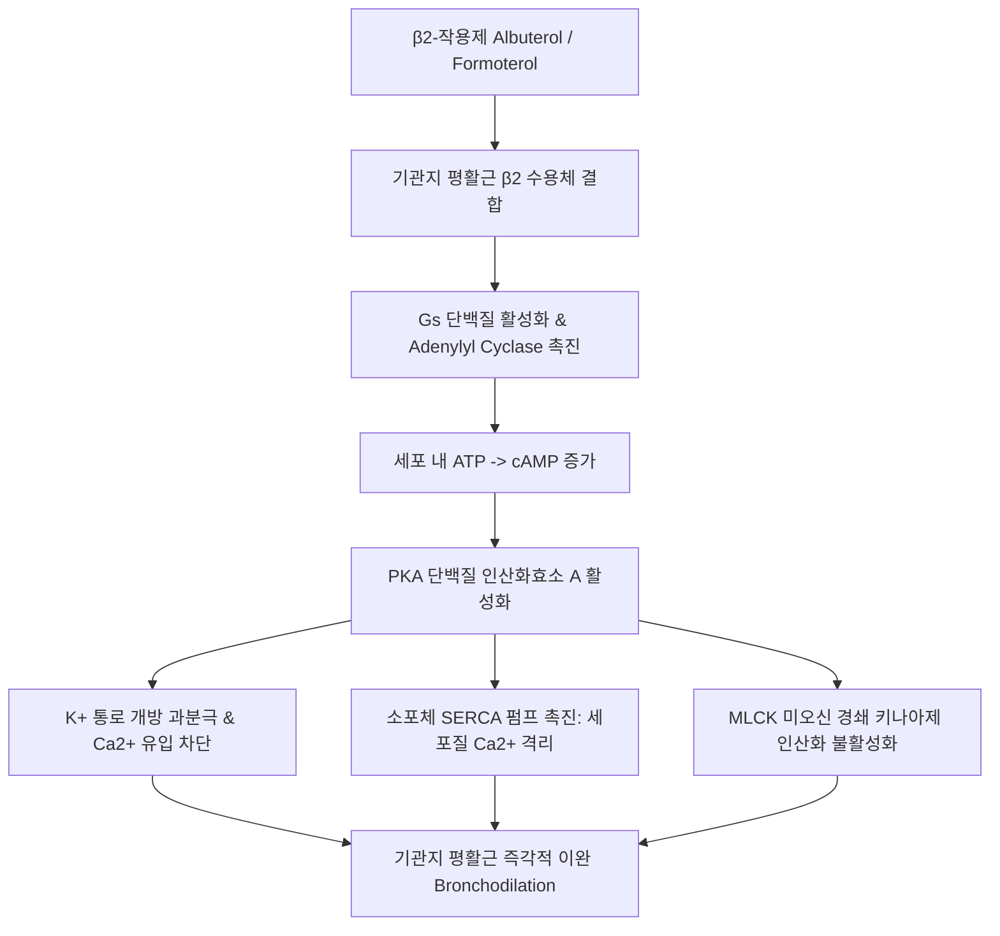
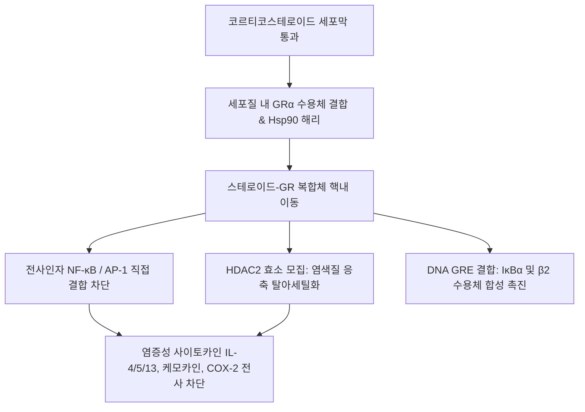
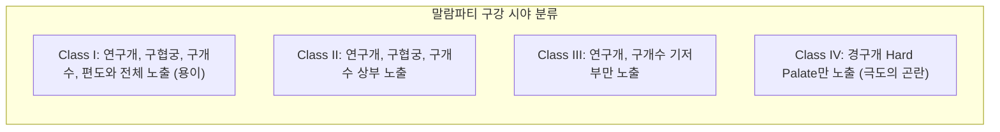
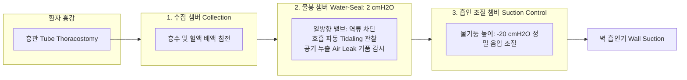

# Netter Respiratory Day 07: 호흡기 치료 및 흉부외과 수술 (약리학·산소요법·인공기도관리·폐절제술·흉부배액·폐이식) (pp. 293–344)

> 📖 **원서 출처**: [The Netter Collection - Volume 3, Respiratory System.pdf (pp. 293-344)](https://drive.google.com/file/d/1lDCEGUPEHrzTY10gPML28PbdcCYyY90a/view?usp=drivesdk)
> 🏷️ **범위**: Section 5: Therapies and Therapeutic Procedures (Plate 5-1 ~ Plate 5-27, 총 27개 플레이트 전수 정밀 수록, 호흡기계 전권 완결)
> 📌 **핵심 테마**: 호흡기 질환의 분자 약리학(베타2 아드레날린 수용체 작용제 SABA/LABA의 Gs-cAMP-PKA 경로, 항콜린제 SAMA/LAMA의 M3 무스카린 수용체 차단, 메틸크산틴계 Theophylline의 비선택적 PDE 억제·아데노신 A1 수용체 길항·HDAC2 전사 억제제 활성화 및 좁은 치료 지수 10~20 mg/L, 흡입 스테로이드 ICS의 세포질 GR 수용체 결합·핵내 전위·NF-κB 억제 및 국소/전신 부작용, 흡입기 디바이스 에어로졸 역학 공기역학적 질량중앙직경 MMAD 1~5 μm, 류코트리엔 수용체 길항제 LTRA Montelukast 및 표적 생물학적 제제 Omalizumab/Mepolizumab/Dupilumab), 산소 요법의 생리학(저유량 비강 캐뉼라 1L당 FiO2 4% 증가 vs 고유량 벤투리 마스크 베르누이 원리 및 고유량 비강 캐뉼라 HFNC 해부학적 사강 세척·PEEP 형성, COPD 환자 고농도 산소 투여 시 저산소성 호흡 구동 둔화·할데인 효과 Haldane effect·폐포 V/Q 사강 악화에 따른 치명적 CO2 저류 기전, 산소 독성 활성산소 ROS 및 흡수성 무기폐), 응급 기도 관리 및 침습적 시술(어려운 기도 평가 Mallampati Class I~IV, 직접/비디오 후두경 기관내삽관 술기 및 튜브 커프 압력 20~25 cmH2O 모세혈관 허혈 방지, 성문상부 기도기 LMA, 기관내삽관 실패 "Cannot Intubate, Cannot Oxygenate" 시 최후의 응급 외과적 기도 확보 윤상갑상막절개술 Cricothyroidotomy, 장기 기계환기 환자의 외과적/경피적 확장 기관절개술 Tracheostomy 제2~3 기관륜 절개), 흉부외과 수술 및 술후 관리(후외측 개흉술 Posterolateral thoracotomy 광배근/전거근 절개 vs 비디오 흉강경 수술 VATS/RATS, 폐암의 근치적 절제술 원칙: 쐐기 절제술 Wedge resection vs 구역 절제술 Segmentectomy vs 엽 절제술 Lobectomy vs 전폐 절제술 Pneumonectomy 심폐 예비능 ppoFEV1 > 800 mL, 전폐절제술 후 공간 관리 및 기관지흉막루 BPF 치명적 합병증, 3통식 흉부 배액 체계 Three-bottle water-seal drainage system: 수집병-물봉병 2 cmH2O 역류방지-흡인조절병 음압 설정 및 호흡기 파동/공기 누출 판독), 만성 폐기종의 폐용적 축소술(LVRS) 및 기관지내 단방향 밸브(EBV), 그리고 말기 폐질환의 최종 치료인 폐이식(단일폐 vs 양측 폐이식, 허혈-재관류 손상 PGD, 급성 세포성 거부반응 및 만성 폐동종이식편 기능부전 CLAD 폐쇄성 세기관지염 증후군 BOS).

---

## 1. 개요 및 마스터 요약 (Executive Summary)

* **호흡기 분자 약리학 및 흡입 약물 전달 역학 (Plates 5-1 ~ 5-10)**:
  * **기관지확장제 분자 기전**:
    * **$eta_2$-작용제 (SABA: Albuterol, Terbutaline; LABA: Salmeterol, Formoterol)**: 기도 평활근 $eta_2$ 수용체 결합 $
ightarrow$ $G_s$ 단백 활성화 $
ightarrow$ 아데닐릴 시클라아제 촉진 $
ightarrow$ **cAMP 증가** $
ightarrow$ PKA 활성화 $
ightarrow$ 세포질 칼슘 감소 및 미오신 경쇄 키나아제(MLCK) 불활성화 $
ightarrow$ **강력한 기관지 평활근 이완**.
    * **항콜린제 (SAMA: Ipratropium; LAMA: Tiotropium, Umeclidinium)**: 미주신경 절후 섬유에서 분비된 아세틸콜린의 **$M_3$ 무스카린 수용체 결합을 경쟁적으로 차단** $
ightarrow$ $G_q$-PLC-$	ext{IP}_3/	ext{Ca}^{2+}$ 경로 차단 $
ightarrow$ 기관지 연축 및 점액 과다분비 억제 (COPD 기저 치료의 핵심).
    * **메틸크산틴계 (Theophylline / Aminophylline)**: 비선택적 **포스포디에스테라아제(PDE) 억제**(cAMP 분해 차단) + **아데노신 $A_1/A_2$ 수용체 길항** + 저용량에서 히스톤 탈아세틸화효소-2(**HDAC2**)를 활성화하여 스테로이드 반응성 회복. 치료 농도 범위가 **$10\sim20\ \mu	ext{g/mL}$** 로 극히 좁아 $>20\ \mu	ext{g/mL}$ 초과 시 오심·구토, $>30\ \mu	ext{g/mL}$ 초과 시 난치성 심실성 부정맥 및 간질성 발작(Seizure) 유발 (간 대사효소 CYP1A2 영향).
  * **항염증제 및 생물학적 제제**:
    * **흡입 스테로이드 (ICS: Fluticasone, Budesonide)**: 세포질 GR 결합 후 핵으로 이동 $
ightarrow$ 전사인자 NF-κB 및 AP-1을 억제하여 염증성 사이토카인 전사를 전방위 차단. 구강 침착에 의한 **구강 칸디다증 (Oral thrush)** 및 쉰목소리(Dysphonia) 예방을 위해 **흡입 후 반드시 구강 세척(Gargling)** 필수.
    * **흡입 에어로졸 물리역학**: 폐포 도달을 위한 최적의 공기역학적 질량중앙직경(MMAD)은 **$1\sim5\ \mu	ext{m}$**. ($>5\ \mu	ext{m}$는 구강 인두에 관성 충돌, $<1\ \mu	ext{m}$는 침착되지 않고 호기 시 배출).
    * **중증 천식 생물학적 제제**: Omalizumab (항-IgE), Mepolizumab/Benralizumab (항-IL-5/IL-5Rα), Dupilumab (항-IL-4Rα).

* **산소 요법의 생리학 및 임상 적용 (Plates 5-11 ~ 5-14)**:
  * **산소 전달 기구의 분류**:
    * **저유량 체계 (Low-Flow Systems)**: 환자의 흡기 유량보다 적은 산소를 공급하여 주변 공기와 섞임. **비강 캐뉼라 (Nasal Cannula)**: $1\sim6	ext{ L/min}$ 공급, **유량 1 L/min 증가 시마다 $	ext{FiO}_2$ 약 4%씩 증가** ($1	ext{ L} pprox 24\%$, $6	ext{ L} pprox 44\%$). 저장낭 비재호흡 마스크(NRB mask): 밸브를 통해 호기 재호흡 차단, $10\sim15	ext{ L/min}$ 유량으로 $	ext{FiO}_2$ 최대 80~90% 공급.
    * **고유량 체계 (High-Flow Systems)**: 환자의 최대 흡기 유량을 초과하는 총 유량을 공급하여 정확한 $	ext{FiO}_2$ 보장. **벤투리 마스크 (Venturi Mask)**: 베르누이 원리(좁은 노즐 통과 시 음압으로 공기 흡입)를 이용하여 $24\sim50\%$의 정밀한 $	ext{FiO}_2$ 유지. **고유량 비강 캐뉼라 (HFNC)**: 가온 가습된 가스를 최대 $60	ext{ L/min}$, $	ext{FiO}_2$ 최대 100%까지 공급하며 비인두 사강 세척 및 소량의 PEEP($3\sim5	ext{ cmH}_2	ext{O}$) 형성.
  * **COPD 환자에서 고농도 산소 투여 시의 치명적 $	ext{CO}_2$ 저류 3대 기전**:
    1. **환기-혈류비(V/Q) 불일치 악화 (가장 중요, 50% 기여)**: 고농도 산소가 폐포에 공급되면 국소적 **저산소성 폐혈관수축(HPV)이 갑자기 풀려**, 환기가 잘 안 되는 불량 폐포로 혈류가 대량 이동하여 사강 환기가 급증함.
    2. **할데인 효과 (Haldane Effect, 30% 기여)**: 탈산소화 헤모글로빈이 산소화 헤모글로빈으로 전환되면서 $	ext{CO}_2$ 결합 친화도가 급감하여 적혈구에서 혈장으로 $	ext{CO}_2$가 유리되어 혈중 $	ext{PaCO}_2$ 급상승.
    3. **저산소성 호흡 구동 (Hypoxic Drive) 둔화 (20% 미만)**: 만성 고탄산혈증 환자에서 경동맥체 말초 화학수용체의 저산소 자극이 소실되어 호흡수가 다소 감소.
    * **목표 산소 포화도**: 만성 과탄산혈증성 COPD 환자는 $	ext{SpO}_2$를 100%가 아닌 **$88\sim92\%$** 로 보수적 조절.

* **응급 및 정규 기도 관리학 (Plates 5-15 ~ 5-19)**:
  * **어려운 기도 평가 (Mallampati Score)**: 좌위에서 입을 최대로 벌리고 혀를 내밀었을 때(발성 없이):
    * Class I: 연구개, 구개수, 구협궁, 편도주와 전체 관찰 (기도 확보 용이).
    * Class II: 연구개, 구협궁, 구개수 일부 관찰.
    * Class III: 연구개, 구개수 기저부만 관찰.
    * **Class IV: 경구개만 관찰됨** (후두경 삽관 극도의 고난도).
  * **기관내삽관 (Endotracheal Intubation)**:
    * 직접 후두경(Macintosh 곡형 블레이드는 후두개곡 Vallecula에 거치, Miller 직형 블레이드는 후두개를 직접 거상) 하에 성대를 시각화하고 튜브 거치.
    * **위치 확인 골드 스탠다드**: **호기말 이산화탄소 분압($	ext{EtCO}_2$) 파형 측정** (식도 삽관 배제). 흉부 X-선상 튜브 팁은 **기관분기부(Carina) 상방 $3\sim5	ext{ cm}$ (제2~4 흉추 높이)** 에 위치.
    * **커프 압력**: 기관 점막 모세혈관 관류압($>30	ext{ mmHg}$) 초과 시 허혈성 괴사/협착을 유발하므로 항상 **$20\sim25	ext{ cmH}_2	ext{O}$** ($15\sim18	ext{ mmHg}$) 엄격 유지.
  * **응급 외과적 기도 확보 (Cricothyroidotomy vs Tracheostomy)**:
    * **윤상갑상막절개술 (Cricothyroidotomy)**: "삽관 실패, 환기 불가 (Cannot Intubate, Cannot Oxygenate, CICO)" 초응급 상황에서 갑상연골과 윤상연골 사이의 **윤상갑상막 (Cricothyroid membrane)** 을 촉지하고 메스로 횡절개하여 즉각 기도 확보. (성문하 협착 위험으로 24~72시간 이내 기관절개술로 전환).
    * **기관절개술 (Tracheostomy)**: 장기 인공호흡기 유지($>10\sim14$일) 환자에서 사강 감소 및 기도 청결 목적. **제2~3(또는 3~4) 기관 연골륜** 사이를 수평/역U자 절개하여 캐뉼라 거치.

* **흉부외과 수술 접근법 및 폐 절제술의 종양학적 원칙 (Plates 5-20 ~ 5-24)**:
  * **수술 전 심폐 기능 평가 (Operative Risk Assessment)**:
    * 폐암 절제술 전 심폐 예비능 평가 필수: 수술 후 예측 $	ext{FEV}_1$ (**$	ext{ppoFEV}_1$**) 및 수술 후 예측 일산화탄소 확산능(**$	ext{ppoDLCO}$**)이 **$> 40\%$ 이상** (절대치 $	ext{ppoFEV}_1 > 800	ext{ mL}$)이어야 안전한 폐엽/전폐 절제 가능. ($<35\%$ 시 심폐운동부하검사 CPET상 $	ext{VO}_{2\max} < 10	ext{ mL/kg/min}$ 이면 수술 금기).
  * **수술적 접근법**:
    * **후외측 개흉술 (Posterolateral Thoracotomy)**: 제5늑간, 광배근(Latissimus dorsi)을 절단하는 고전적 광범위 절개술.
    * **비디오 흉강경 수술 (VATS)** 및 로봇 수술(RATS): 1~3개의 작은 포트를 통해 늑간근/갈비뼈 손상을 최소화하여 수술 후 통증 급감, 조기 회복, 폐기능 보존 우수.
  * **폐 절제술의 해부학적 등급**:
    1. **쐐기 절제술 (Wedge Resection)**: 해부학적 혈관/기관지 분절 구조를 따르지 않고 병변 부위만 삼각 쐐기 모양으로 단순 절제 (조직검사, 불량 심폐기능 환자의 고식적 절제).
    2. **구역 절제술 (Segmentectomy)**: 분절 기관지와 분절 폐동맥을 개별 박리하고 절제하는 해부학적 아엽 절제술.
    3. **폐엽 절제술 (Lobectomy)**: **원발성 폐암(NSCLC Stage I~II)의 골드 스탠다드 표준 수술**. 해당 폐엽 전체와 엽기관지, 폐동정맥 결찰 및 **종격동 림프절 곽청술 (Systemic Mediastinal Lymph Node Dissection)** 병행.
    4. **전폐 절제술 (Pneumonectomy)**: 한쪽 폐 전체를 적출. **우측 전폐 절제술**은 좌측보다 잔여 폐혈관 저항 폭증 및 치명적 폐부종, 심부전 위험이 훨씬 높아 사망률이 2~3배 높음.

* **흉부 배액 체계, 폐용적 축소술 및 폐이식 (Plates 5-25 ~ 5-27)**:
  * **3통식 흉부 배액 장치 (Three-Bottle Water-Seal Drainage System)**:
    1. **제1병 (배액 수집병, Collection Chamber)**: 환자의 흉강에서 나오는 흉수와 혈액을 수집.
    2. **제2병 (물봉병, Water-Seal Chamber)**: 유리관 끝을 **멸균수 2 cm 아래에 잠기게 하여 흉강 내로 공기가 역류하는 것을 절대 차단하는 일방향 밸브**. 정상 자발 호흡 시 흡기 시 수주 상승, 호기 시 하강하는 **호흡기 파동 (Tidaling)** 관찰. 지속적인 거품(Bubbling)은 폐 실질 또는 기관지 누출(Air leak)을 의미.
    3. **제3병 (흡인 조절병, Suction Control Chamber)**: 물기둥의 높이(통상 **$-20	ext{ cmH}_2	ext{O}$**)에 의해 흉강에 걸리는 음압의 상한선이 물리적으로 결정됨.
  * **폐이식 (Lung Transplantation)**:
    * 적응증: 내과적 치료에 반응하지 않는 말기 폐질환(COPD, 특발성 폐섬유증, 낭포성 섬유증, 폐동맥고혈압). 2년 내 사망 위험 $>50\%$.
    * **원발성 이식편 기능부전 (PGD)**: 이식 후 72시간 이내 발생하는 허혈-재관류 손상에 의한 비심인성 폐부종 및 ARDS.
    * **거부반응 (Rejection)**:
      * 급성 세포성 거부반응(T세포 매개 혈관주위 림프구 침윤, 고용량 스테로이드 치료).
      * 만성 폐동종이식편 기능부전(**CLAD**): 이식 1년 이후 50% 이상에서 발생하여 장기 생존을 가로막는 주원인인 **폐쇄성 세기관지염 증후군 (Bronchiolitis Obliterans Syndrome, BOS)** $
ightarrow$ 소기도 상피의 섬유화성 폐색.

---

## 2. 플레이트별 정밀 분석 (Plates 5-1 ~ 5-27)

### Plate 5-1 | $eta_2$-아드레날린 수용체 작용제 (Beta-2 Adrenergic Agonists: SABA and LABA)
![[Netter_V3_Plate5-1.png]]

* **분자 신호전달 캐스케이드 및 약동학**:
  * **수용체 선택성 및 세포 내 기전**:
    * 기관지 평활근 세포막의 7회 막관통 G-단백 결합 수용체인 **$eta_2$-아드레날린 수용체**에 특이적 결합.
    * $G_{lpha s}$ 단백질이 해리되어 **아데닐릴 시클라아제 (Adenylyl Cyclase)** 활성화 $
ightarrow$ 세포 내 ATP를 **cAMP**로 전환 촉진.
    * cAMP가 **단백질 인산화효소 A (PKA)** 를 활성화:
      1. 세포막의 $	ext{Ca}^{2+}$-활성화 $	ext{K}^+$ 통로를 개방하여 세포막을 과분극(Hyperpolarization)시킴으로써 전압개폐성 칼슘 통로 유입 차단.
      2. 소포체(SR)의 $	ext{SERCA}$ 펌프를 촉진하여 세포질 유리 $	ext{Ca}^{2+}$를 소포체 내로 격리.
      3. **미오신 경쇄 키나아제 (MLCK)를 직접 인산화하여 억제**하고 미오신 경쇄 탈인산화효소(MLCP)를 촉진 $
ightarrow$ 액틴-미오신 교차결합 해제로 **강력하고 신속한 기관지 평활근 이완**.
  * **약동학적 분류**:
    * **속효성 $eta_2$-작용제 (SABA: Albuterol / Salbutamol, Terbutaline)**: 작용 발현 1~5분, 지속 시간 3~6시간. 급성 기관지 연축 완화(Reliever)의 1차 선택약.
    * **지효성 $eta_2$-작용제 (LABA: Salmeterol, Formoterol, Vilanterol)**: 지속 시간 12~24시간.
      * Salmeterol: 긴 지질 친화성 곁사슬이 세포막 지질 이중층에 닻을 내리고 수용체에 반복 결합(Exosite binding) $
ightarrow$ 발현은 느리나 12시간 지속.
      * Formoterol: 지질층에 용해되어 서서히 방출 $
ightarrow$ 발현이 SABA만큼 빠르면서도 12시간 지속(천식 SMART 요법의 근간).
  * **부작용**: 전신 흡수 시 골격근 $eta_2$ 수용체 자극에 의한 **손 떨림 (Tremor, 가장 흔함)**, 심장 $eta_1/eta_2$ 수용체 자극에 의한 빈맥, 심계항진, 세포 내 칼륨 유입 촉진에 따른 **저칼륨혈증 (Hypokalemia)**.



---

### Plate 5-2 | 메틸크산틴계 약물: 테오필린 (Methylxanthines: Theophylline and Aminophylline)
![[Netter_V3_Plate5-2.png]]

* **다중 작용 기전, 좁은 치료 지수 및 약물 상호작용**:
  * **3대 분자 약리 기전**:
    1. **비선택적 포스포디에스테라아제 (PDE3, PDE4) 억제**: cAMP와 cGMP 분해를 막아 농도를 상승시킴으로써 경미한 기관지 확장 유도.
    2. **세포 표면 아데노신 $A_1, A_2$ 수용체 길항**: 아데노신 매개 기관지 수축 및 비만세포 히스타민 유리 억제.
    3. **히스톤 탈아세틸화효소-2 (HDAC2) 활성화**: 낮은 혈중 농도($5\sim10\ \mu	ext{g/mL}$)에서 산화 스트레스로 억제된 HDAC2를 활성화하여 전사인자 NF-κB 활성을 끄고 코르티코스테로이드 저항성을 역전시킴.
  * **치료 혈중 농도 모니터링 (Therapeutic Drug Monitoring, TDM)**:
    * **적정 치료 범위**: **$10 \sim 20\ \mu	ext{g/mL}$** ($55\sim110\ \mu	ext{mol/L}$) (항염증 목적은 $5\sim10\ \mu	ext{g/mL}$).
    * 독성 발현 농도:
      * $>20\ \mu	ext{g/mL}$: 오심, 구토, 복통, 두통, 불면, 동성 빈맥.
      * **$>30\ \mu	ext{g/mL}$**: **치명적 심실성 부정맥(VF, VT), 난치성 전신 간질 발작(Seizures)**.
  * **간 시토크롬 P450 (CYP1A2) 상호작용**:
    * 혈중 농도 증가 약물(독성 위험): Cimetidine, Ciprofloxacin, Macrolide계 항생제.
    * 혈중 농도 감소 약물(효과 감소): Rifampin, Phenytoin, **흡연(담배 다핵방향족탄화수소가 CYP1A2를 강력 유도하여 테오필린 배설 촉진)**.

---

### Plate 5-3 | 항콜린성 기관지 확장제 (Anticholinergic Agents: SAMA and LAMA)
![[Netter_V3_Plate5-3.png]]

* **무스카린 수용체 아형 및 COPD 1차 치료의 역학**:
  * **무스카린 수용체 생리학**: 기도에는 3가지 수용체 분포.
    * $M_1$: 부교감신경절에 위치, 신경전달 촉진.
    * $M_2$: 시냅스전 자가수용체(Autoreceptor), 아세틸콜린 유리 억제(음성 피드백).
    * **$M_3$**: 기도 평활근 및 점막하 분비선에 위치, **평활근 수축 및 점액 분비 유발**.
  * **약제 특성 및 수용체 선택성**:
    * 4차 암모늄 화합물(Quaternary ammonium)로 지질 불용성이며 양전하를 띠어 전신 흡수나 혈액-뇌 장벽(BBB) 통과가 거의 없어 전신 항콜린 부작용 극히 적음.
    * **SAMA (Ipratropium bromide)**: $M_1, M_2, M_3$ 비선택적 차단. 작용 시작 15~30분, 지속 4~6시간. ($M_2$ 차단으로 일시적 아세틸콜린 유리 반동 가능).
    * **LAMA (Tiotropium, Umeclidinium, Aclidinium)**: $M_1, M_3$ 수용체에서는 극도로 서서히 해리되지만 $M_2$ 수용체에서는 빠르게 해리되는 **속도론적 $M_3$ 선택성 (Kinetic selectivity)** 보유 $
ightarrow$ 하루 1회 투여로 24시간 기관지 확장 유지.
  * **임상 적응증**: 천식보다 **COPD 환자에서 $eta_2$-작용제보다 더 강력한 폐기능 개선 및 악화 감소 효과**를 나타내어 GOLD 가이드라인 1차 표준으로 확립.

---

### Plate 5-4 | 코르티코스테로이드의 작용 기전 (Corticosteroids: Cellular and Molecular Mechanisms)
![[Netter_V3_Plate5-4.png]]

* **유전자 전사 억제(Transrepression) 및 항염증 캐스케이드**:
  * 지용성 스테로이드 분자가 세포막을 통과하여 세포질의 **글루코코르티코이드 수용체 (GR$lpha$)** 에 결합.
  * 수용체를 감싸고 있던 열충격단백질(Hsp90)이 분리되고, 스테로이드-GR 복합체가 이량체(Dimer)를 형성하여 핵공을 통해 핵 내부로 이동.
  * **핵내 2대 전사 조절 기전**:
    1. **전사 억제 (Transrepression, 핵심 항염증 기전)**:
       * 염증성 전사인자인 **NF-$\kappa	ext{B}$** 및 **AP-1**과 직접 결합하여 이들의 프로모터 전사를 물리적으로 차단.
       * **히스톤 탈아세틸화효소-2 (HDAC2)** 를 모집하여 염증 유전자 부위의 염색질(Chromatin)을 응축시킴 $
ightarrow$ **IL-1, IL-4, IL-5, IL-13, TNF-$lpha$, GM-CSF, CXCL8 등 모든 염증 사이토카인 및 COX-2, iNOS 발현 전방위 차단**.
    2. **전사 촉진 (Transactivation, 부작용 및 항염증 단백 발현)**:
       * DNA의 글루코코르티코이드 반응 요소(GRE)에 직접 결합하여 항염증 단백질(I$\kappa	ext{B}lpha$, Annexin-1, $eta_2$-수용체 발현 촉진) 합성. 고용량 투여 시 대사성 부작용(당신생합성 효소 촉진)을 매개.



---

### Plate 5-5 | 흡입 코르티코스테로이드 (Inhaled Corticosteroids: ICS)
![[Netter_V3_Plate5-5.png]]

* **국소 기도 항염증 및 지속성 천식의 1차 근간 치료**:
  * **약제 종류**: Fluticasone propionate/furoate, Budesonide, Beclomethasone dipropionate, Ciclesonide.
  * **약동학적 장점 (초기 간 통과 대사)**: 삼켜진 약물의 80~90%가 위장관에서 흡수된 후 간을 통과하면서 **초회 통과 대사(First-pass hepatic metabolism)** 에 의해 $90\sim99\%$ 불활성화되므로, 전신 혈류로 진입하는 비율이 극히 낮아 전신 부작용을 최소화함. (Ciclesonide는 기도 상피 에스테라아제에 의해 활성화되는 전구약물 Pro-drug).
  * **국소 이상반응 및 예방법**:
    1. **구강 칸디다증 (Oral Candidiasis / Thrush)**: 구강 인두 점막에 국소 면역 억제로 백색 설태 형성.
    2. **쉰목소리 (Dysphonia)**: 후두 내전근(Adductor)의 가역적 근병증 및 성대 자극.
    3. 인후통 및 자극성 기침.
    * **임상 수칙**: 약물 흡입 직후 **스페이서(Spacer)를 사용**하고, 흡입 후 **반드시 물로 입안과 목을 깨끗이 헹구고 뱉어내도록(Rinse and spit)** 환자 교육.

---

### Plate 5-6 | 전신 코르티코스테로이드 및 이상반응 (Systemic Corticosteroids and Adverse Effects)
![[Netter_V3_Plate5-6.png]]

* **급성 악화기 전신 투여 및 장기 사용 시 다기관 독성**:
  * **임상 적응증**: 급성 중증 천식 발작, COPD 급성 악화, 호산구성 폐렴, 급성 과민성 폐장염, 중증 유육종증. (경구 Prednisolone 또는 정맥 Methylprednisolone).
  * **전신 이상반응의 다기관 스펙트럼**:
    * **내분비/대사**: 시상하부-뇌하수체-부신축(HPA axis) 억제에 따른 **부신 부전(급격한 투약 중단 시 부신 위기 Adrenal crisis 초래 $
ightarrow$ 반드시 점진적 감량 Tapering)**, 쿠싱 증후군(중심성 비만, 보름달 얼굴, 들소혹), 인슐린 저항성 증가로 인한 스테로이드 유발 당뇨병.
    * **근골격계**: 파골세포 활성화 및 조골세포 억제에 따른 **골다공증 (Osteoporosis, 척추 압박골절, 대퇴골두 무혈성 괴사 AVN)**, 근위부 근병증(Steroid myopathy).
    * **면역계**: 세포매개 면역 억제로 인한 **결핵 재활성화, 기회감염(PCP, 진균) 취약**.
    * **안과**: 후낭하 백내장(Posterior subcapsular cataract), 녹내장(Glaucoma).
    * **위장관**: 소화성 궤양(NSAID 병용 시 위험 폭증), 췌장염.
    * **신경정신**: 불면증, 조증/우울증, 정신병(Steroid psychosis).

---

### Plate 5-7 | 흡입기 전달 시스템 및 에어로졸 역학 (Inhalation Delivery Systems and Aerosol Deposition)
![[Netter_V3_Plate5-7.png]]

* **디바이스 공학 및 입자 크기에 따른 기도 침착 생리학**:
  * **에어로졸 입자 크기(MMAD)에 따른 운명**:
    * **$> 5\ \mu	ext{m}$**: 높은 관성 모멘텀으로 인해 구강 및 인두 벽에 **관성 충돌 (Inertial impaction)** 하여 전신 부작용 유발.
    * **$1 \sim 5\ \mu	ext{m}$ (치료적 최적 범위)**: 유속이 느려지는 소기도 및 폐포에 **중력 침강 (Sedimentation)** 하여 최적의 약효 발휘.
    * **$< 1\ \mu	ext{m}$**: 브라운 운동에 의해 떠다니다가 침착되지 못하고 **호기 시 대부분 배출**.
  * **3대 흡입 전달 디바이스 비교**:

| 디바이스 유형 | 작동 원리 및 추진제 | 환자 호흡 조절 요구 | 장단점 및 주의사항 |
| :--- | :--- | :--- | :--- |
| **정량분무 흡입기 (pMDI)** | HFA(하이드로플루오로알칸) 추진제로 약물 분사 | **분사와 동시에 천천히 깊게 들이마시는 호흡 동조(Hand-breath coordination) 필수** | 잘못된 사용 흔함; **스페이서 (Spacer)** 장착 시 구강 침착 80% 감소 및 폐 전달률 2배 상승 |
| **건조분말 흡입기 (DPI)** | 캡슐/원반 내 미세 분말, 추진제 없음 | **환자 자신의 빠르고 강한 흡기 노력(Inspiratory effort)으로 약물 가루 흡입** | 분사 동조 불필요; 흡기 유량이 약한 중증 고령자나 소아는 약물 흡입 불충분 위험 |
| **연무식 분무기 (Nebulizer)** | 압축 공기 또는 초음파로 약액을 지속적 미세 안개로 변환 | 평상시의 편안한 조용한 조용한 호흡으로 마스크 통해 흡입 | 흡입 노력 불필요, 급성 호흡곤란/소아에 이상적; 부피가 크고 세척 관리 필요 |

---

### Plate 5-8 | 류코트리엔 조절제 및 기타 경구 조절제 (Leukotriene Modifiers and Other Controllers)
![[Netter_V3_Plate5-8.png]]

* **5-리폭시게나아제 경로 차단 및 아스피린 천식**:
  * **아라키돈산 대사 경로**:
    * 세포막 인지질 $
ightarrow$ 포스포리파아제 $A_2
ightarrow$ 아라키돈산.
    * **5-Lipoxygenase (5-LOX)** 경로에 의해 **시스테이닐 류코트리엔 ($	ext{LTC}_4, 	ext{LTD}_4, 	ext{LTE}_4$)** 생성.
    * 시스테이닐 류코트리엔은 히스타민보다 **1,000배 강력한 기관지 수축 작용**, 미세혈관 투과성 항진(부종), 호산구 유주 및 점액 과다분비 유발.
  * **약제 분류 및 기전**:
    * **류코트리엔 수용체 길항제 (LTRA)**: **Montelukast (몬테루카스트)**, Zafirlukast, Pranlukast $
ightarrow$ 평활근의 **$	ext{CysLT}_1$ 수용체를 경쟁적으로 차단**. 1일 1회 경구 투여 편의성.
    * **5-LOX 억제제**: Zileuton $
ightarrow$ 류코트리엔 합성 자체를 차단 (간독성 모니터링 필요).
  * **아스피린 과민성 호흡기 질환 (AERD / Samter's Triad)**:
    * [기관지 천식 + 재발성 비용종/만성 부비동염 + 아스피린/NSAID 복용 후 급성 기관지경련].
    * 기전: COX-1 억제로 인해 프로스타글란딘 합성이 차단되면서 아라키돈산이 **5-LOX 경로로 쏠려 류코트리엔이 폭발적으로 과다 생성**됨. $
ightarrow$ **LTRA 치료에 극적으로 반응**.

---

### Plate 5-9 | 비만세포 안정제 및 점액 조절제 (Mast Cell Stabilizers and Mucoactive Agents)
![[Netter_V3_Plate5-9.png]]

* **탈과립 억제 및 점액 다당류 펩타이드 분해**:
  * **비만세포 안정제 (Cromones: Cromolyn sodium, Nedocromil)**:
    * 비만세포막의 염소 이온 통로를 차단하여 세포막을 안정화시킴으로써 항원-IgE 가교 결합 후 일어나는 **탈과립(Degranulation) 및 히스타민 유리를 선제적으로 차단**.
    * 이미 시작된 천식 발작은 역전시키지 못하며, 운동 유발성 천식(EIB)이나 항원 노출 15~30분 전 흡입하는 예방약으로만 유효 (부작용이 없어 소아 천식에 안전하나 1일 4회 투여 불편성으로 현재 사용 감소).
  * **점액 조절제 (Mucoactive Agents)**:
    * **N-아세틸시스테인 (N-Acetylcysteine, NAC)**:
      * 유리 설프히드릴기(-SH)를 보유하여 점액 뮤신 분자 사이의 **이황화 결합(Disulfide bonds, -S-S-)을 직접 환원 절단**함으로써 객담의 점조도를 급격히 떨어뜨려 배출 촉진.
      * 강력한 항산화제인 글루타치온(Glutathione)의 전구체 역할.
    * **도르나아제 알파 (Dornase alfa / Recombinant human DNase)**:
      * **낭포성 섬유증(CF)** 치료의 혁신.
      * 객담 내에 사멸한 호중구에서 쏟아져 나온 고분자량 **세포외 DNA를 효소적으로 분해 절단**하여 점액 점도를 극적으로 감소시키고 폐기능 개선.

---

### Plate 5-10 | 중증 천식의 표적 생물학적 제제 (Biologic Therapies for Severe Asthma)
![[Netter_V3_Plate5-10.png]]

* **단클론항체 분자 치료의 표적별 작용 기전**:

| 제제명 | 작용 표적 | 분자 기전 | 적응증 및 바이오마커 |
| :--- | :--- | :--- | :--- |
| **Omalizumab (졸레어)** | **유리 IgE (Anti-IgE)** | 혈중 유리 IgE의 Fc 부위에 결합하여 비만세포/호염구 표면 **$	ext{Fc}\epsilon	ext{RI}$ 수용체 결합을 차단** | 중증 알레르기성 천식, 기저 혈청 총 $	ext{IgE}\ge 30\sim700	ext{ IU/mL}$ |
| **Mepolizumab (누칼라)** | **유리 IL-5 (Anti-IL-5)** | 호산구 분화·증식의 핵심 인자인 **IL-5에 직접 결합하여 중화** | 중증 호산구성 천식, 혈중 호산구 $\ge 150\sim300	ext{ cells/}\mu	ext{L}$ |
| **Benralizumab (파센라)** | **IL-5 수용체 $lpha$ (Anti-IL-5R$lpha$)** | 호산구 표면 IL-5R$lpha$에 결합 후 **NK세포를 유인하여 항체의존세포독성(ADCC)으로 호산구 24시간 내 완전 고갈** | 중증 호산구성 천식, 빈번한 악화 환자 |
| **Dupilumab (듀피젠트)** | **IL-4 수용체 $lpha$ (Anti-IL-4R$lpha$)** | IL-4와 IL-13이 공유하는 수용체 소단위를 차단하여 **IL-4 및 IL-13 신호전달을 동시 차단** | 호산구 $\ge 150$ 또는 호기산화질소(FeNO) $\ge 25	ext{ ppb}$, 아토피 동반 |
| **Tezepelumab (테즈스파이어)** | **TSLP (Anti-TSLP)** | 상피세포 유래 최상류 알라민(Alarmin)인 흉선기질상피림프구생성소 차단 | 호산구 수치와 무관하게 모든 중증 천식 (Non-T2 포함) |

---

### Plate 5-11 | 산소 투여 시스템: 저유량 및 고유량 체계 (Oxygen Delivery Systems: Low-Flow and High-Flow)
![[Netter_V3_Plate5-11.png]]

* **산소 분율($	ext{FiO}_2$) 결정 메커니즘과 환자 호흡 동역학**:
  * **저유량 vs 고유량의 핵심 정의**:
    * 환자의 **순간 최대 흡기 유량 (Peak Inspiratory Flow Rate, 정상 성인 $25\sim35	ext{ L/min}$)** 을 기준으로, 기구가 공급하는 유량이 이보다 적으면 저유량, 초과하면 고유량 체계.
  * **대표 기구별 성능 비교**:

| 기구 명칭 | 산소 공급 유량 | 전달 산소분율 ($	ext{FiO}_2$) | 생리학적 특성 및 장단점 |
| :--- | :--- | :--- | :--- |
| **비강 캐뉼라 (Nasal Cannula)** | $1 \sim 6	ext{ L/min}$ | **$24\% \sim 44\%$** ($1	ext{ L}$당 $4\%$ 상승) | 가장 편리, 식사/대화 가능; $6	ext{ L}$ 초과 시 비강 점막 건조 및 출혈 유발 |
| **단순 안면 마스크 (Simple Mask)** | $5 \sim 10	ext{ L/min}$ | $35\% \sim 55\%$ | 호기 $	ext{CO}_2$ 재호흡 방지를 위해 최소 $5	ext{ L/min}$ 이상 유지 필수 |
| **비재호흡 저장낭 마스크 (NRB Mask)** | $10 \sim 15	ext{ L/min}$ | **$60\% \sim 90\%$** | 일방향 밸브로 저장낭 산소만 흡입; 응급 소생술 및 급성 중증 저산소혈증 1차 |
| **벤투리 마스크 (Venturi Mask)** | 노즐별 상이 ($4\sim15	ext{ L}$) | **$24\% \sim 50\%$ (정밀 고정)** | 베르누이 원리로 정밀한 $	ext{FiO}_2$ 공급; **COPD 만성 $	ext{CO}_2$ 저류 환자의 최우선 선택** |
| **고유량 비강 캐뉼라 (HFNC)** | **최대 $60	ext{ L/min}$** | **$21\% \sim 100\%$ (완벽 제어)** | $37^\circ	ext{C}$ 100% 가습, 비인두 사강 세척, 호기말 양압($3\sim5	ext{ cmH}_2	ext{O}$) 형성 |

---

### Plate 5-12 | 고압산소요법 (Hyperbaric Oxygen Therapy: HBOT)
![[Netter_V3_Plate5-12.png]]

* **헨리 법칙에 의한 물리적 용존 산소량 증대**:
  * **물리화학적 원리 (Henry's Law)**: 액체에 용해되는 가스의 양은 그 가스의 분압에 비례함.
    * $1	ext{기압}$ 공기 호흡 시 혈장에 물리적으로 용해된 산소는 $0.3	ext{ mL O}_2/100	ext{ mL 혈액}$에 불과함.
    * **$2.5\sim3	ext{기압}$의 고압 챔버에서 100% 산소 호흡 시**: 물리적 용존 산소량이 **$6.0	ext{ mL/dL}$ 이상으로 20배 폭증** $
ightarrow$ 헤모글로빈이 전혀 없어도 혈장 용존 산소만으로 인체 안정 시 산소 소모량을 100% 충족시킬 수 있음.
  * **주요 임상 적응증**:
    1. **일산화탄소(CO) 중독**: CO의 헤모글로빈 결합 친화도는 산소의 240배. $1	ext{기압}$ 공기에서 카복시헤모글로빈(HbCO)의 반감기는 약 320분이지만, **$3	ext{기압}$ 100% 산소 투여 시 반감기가 20분으로 급감**.
    2. **잠수병 / 감압병 (Decompression Sickness)**: 급격한 부상 시 조직에 발생한 질소 기포를 물리적으로 압축 용해.
    3. **가스괴저병 (*Clostridium perfringens*)**: 절대 혐기성 세균의 증식 및 독소 생성 억제.
    4. 방사선 치료 후 골괴사, 당뇨병성 족부 궤양의 신생혈관 증식 촉진.

---

### Plate 5-13 | 재택 장기 산소 요법 (Long-Term Domiciliary Oxygen Therapy: LTOT)
![[Netter_V3_Plate5-13.png]]

* **만성 저산소혈증 환자의 사망률 감소 적응증 (NOTT / MRC 임상시험)**:
  * **생존율 향상이 입증된 유일한 조건**: **하루 최소 15시간 이상 (가장 이상적으로는 24시간 연속)** 투여.
  * **엄격한 LTOT 급여 및 투여 기준 (안정기 COPD, 금연 상태)**:
    1. **절대적 기준**: 안정 시 동맥혈 산소분압 **$	ext{PaO}_2 \le 55	ext{ mmHg}$** 또는 맥박산소포화도 **$	ext{SpO}_2 \le 88\%$**.
    2. **상대적 기준**: $	ext{PaO}_2$가 **$56 \sim 59	ext{ mmHg}$** ($89\%$)이면서 다음 중 1개 이상 동반:
       * **폐성심 (Cor Pulmonale)** 또는 우심부전(하지 부종, 간비대).
       * 심전도상 **폐성 P파 (P-pulmonale)** 또는 심초음파상 폐동맥고혈압.
       * 이차성 **적혈구증가증 (Hematocrit $> 55\%$)**.
  * **생리학적 치료 효과**: 저산소성 폐혈관수축(HPV) 완화 $
ightarrow$ 폐동맥압 및 폐혈관 저항 감소 $
ightarrow$ 우심실 후부하 경감 $
ightarrow$ 폐성심 진행 방지 및 뇌 인지기능 향상.

---

### Plate 5-14 | 산소 독성 및 고농도 산소의 합병증 (Oxygen Toxicity and Complications of Hyperoxia)
![[Netter_V3_Plate5-14.png]]

* **활성산소종 조직 파괴 및 고탄산혈증성 혼수**:
  * **폐 산소 독성 (Lorrain Smith Effect)**:
    * $	ext{FiO}_2 > 60\%$ (특히 100%) 고농도 산소를 24~48시간 이상 지속 흡입 시 발생.
    * 세포 내 미토콘드리아에서 초산화물($	ext{O}_2^{ullet-}$), 과산화수소($	ext{H}_2	ext{O}_2$), 하이드록실 라디칼($	ext{OH}^ullet$) 등 **활성산소종 (ROS)** 과다 생성 $
ightarrow$ 내피세포 및 제1형 폐포세포 지질 과산화 및 괴사 $
ightarrow$ **비심인성 폐부종 및 ARDS와 동일한 미만성 폐포 손상(DAD)** 유발.
  * **흡수성 무기폐 (Absorption Atelectasis)**:
    * 정상 공기 중 78%를 차지하는 **질소(Nitrogen)** 는 혈액에 잘 용해되지 않아 폐포가 찌그러지지 않도록 지지하는 "질소 부목(Nitrogen splint)" 역할을 함.
    * 100% 순산소를 흡입하면 폐포 내 질소가 모두 씻겨 나가고(Denitrogenation), 산소는 모세혈관으로 매우 빠르게 흡수됨 $
ightarrow$ 말초 폐포 내 압력이 급감하여 **폐포가 즉각 허탈(무기폐)** 됨.
  * **중추신경계 산소 독성 (Paul Bert Effect)**: 고압산소 환경에서 어지럼증, 근육 경련, 전신 강직간대 발작.

---

### Plate 5-15 | 상기도 평가 및 어려운 기도 (Upper Airway Evaluation and the Difficult Airway)
![[Netter_V3_Plate5-15.png]]

* **해부학적 예측 지표 및 LEMON 법칙**:
  * **어려운 기도 평가의 LEMON 법칙**:
    * **L (Look externally)**: 턱후퇴증(Retrognathia), 굵고 짧은 목, 비만, 안면 외상.
    * **E (Evaluate 3-3-2 Rule)**:
      * 3손가락: 환자의 절치 간 거리 (Inter-incisor distance $\ge 3	ext{ fingers}$, 약 $4\sim5	ext{ cm}$).
      * 3손가락: 턱끝-설골 간 거리 (Hyoid-mental distance $\ge 3	ext{ fingers}$).
      * 2손가락: 갑상연골 절제-설골 간 거리 (Thyrohyoid distance $\ge 2	ext{ fingers}$).
    * **M (Mallampati Score)**: Class I~IV (Class III~IV는 삽관 곤란 강력 시사).
    * **O (Obstruction)**: 후두개염, 편도 농양, 후두암, 성문하 협착.
    * **N (Neck mobility)**: 경추 관절염, 경추 골절, 목 신전 제한($<35^\circ$).
  * **Cormack-Lehane 후두경 시야 4등급**:
    * Grade 1: 성문 전체 및 성대 전후교련 완전 관찰.
    * Grade 2: 성문 후방부 및 피열연골만 관찰.
    * Grade 3: 후두개(Epiglottis)만 보이고 성문은 전혀 보이지 않음.
    * Grade 4: 후두개조차 보이지 않고 연구개만 관찰됨 (삽관 불가능 시야).



---

### Plate 5-16 | 기관내삽관 술기 및 튜브 관리 (Endotracheal Intubation and Tube Management)
![[Netter_V3_Plate5-16.png]]

* **직접/비디오 후두경 삽관 단계 및 합병증 방지**:
  * **삽관 준비 및 환자 자세**:
    * **스니핑 자세 (Sniffing position)**: 머리 밑에 $5\sim10	ext{ cm}$ 베개를 받쳐 하부 경추를 굴곡시키고 환추후두관절을 신전시켜 **구강축-인두축-후두축 (Oral-Pharyngeal-Laryngeal axes)의 3대 축을 일직선으로 정렬**.
  * **후두경 조작 원칙**:
    * 왼손으로 후두경 핸들을 잡고 구각 우측으로 진입하여 혀를 좌측으로 밀어젖힘.
    * 윗니를 지렛대 받침점으로 꺾으면 치아 손상이 발생하므로 **절대 금기**; 45도 전상방 핸들 축 방향으로 밀어 올림.
  * **성문 통과 및 거치 깊이**:
    * 튜브의 원위부 마크가 성대를 $2\sim3	ext{ cm}$ 통과하도록 삽입.
    * 치아 기준 거치 깊이: **성인 남성 약 $23	ext{ cm}$, 성인 여성 약 $21	ext{ cm}$** ("치아 기준 $21/23	ext{ cm}$ 법칙").
  * **식도 삽관 배제 및 위치 확인**:
    * **지속적 호기말 이산화탄소($	ext{EtCO}_2$) 파형 관찰** (연속 6회 이상 호기 파형 검출 필수).
    * 양측 흉부 청진(양측 동등 호흡음 확인) 및 위전도 청진(소리 없어야 함).
    * 흉부 X-선: 튜브 팁이 **기관분기부(Carina) 상방 $3\sim5	ext{ cm}$** 에 위치하는지 확인 (고개 숙이면 아래로, 젖히면 위로 이동).
  * **커프(Cuff) 압력 모니터링**:
    * 전용 커프 압력계로 항상 **$20\sim25	ext{ cmH}_2	ext{O}$** 유지. ($>30	ext{ cmH}_2	ext{O}$ 시 기관 점막 허혈 괴사 및 후유증으로 기관 협착증 유발; $<15	ext{ cmH}_2	ext{O}$ 시 구강 분비물 미세흡인에 따른 흡인성 폐렴 VAP 유발).

---

### Plate 5-17 | 성문상부 기도유지기 (Supraglottic Airway Devices: LMA)
![[Netter_V3_Plate5-17.png]]

* **후두마스크(LMA)의 해부학적 안착 및 구제 기도**:
  * **후두마스크 (Laryngeal Mask Airway, LMA)**:
    * 성대를 통과하지 않고 인두 하부에 삽입되어 타원형 실리콘 커프가 후두 입구(Laryngeal inlet)를 360도 둘러싸며 안착하는 성문상부 기구.
  * **장점 및 적응증**:
    * 후두경을 사용한 성대 시각화가 불필요하여 숙련되지 않은 시술자도 신속 삽입 가능.
    * 경추를 신전시킬 수 없는 외상 환자에서 이상적.
    * **미국마취과학회(ASA) 어려운 기도 알고리즘**: 기관내삽관 실패 시 저산소증 뇌손상을 막기 위한 **최우선 구제 환기 수단 (Rescue ventilation)**.
  * **치명적 한계점**:
    * 기관 내로 직접 튜브가 들어가지 않으므로 **위 내용물 역류 시 기도로 흡인되는 것을 완벽히 차단하지 못함 (위 흡인 방지 불가)** $
ightarrow$ 공복이 유지되지 않은 응급 수술, 비만 환자, 장폐색 환자에서는 기관내삽관이 원칙.

---

### Plate 5-18 | 응급 외과적 기도 확보: 윤상갑상막절개술 (Emergency Surgical Airway: Cricothyroidotomy)
![[Netter_V3_Plate5-18.png]]

* **CICO 상황의 초응급 술기 및 해부학적 랜드마크**:
  * **적응증**: **"삽관 실패, 환기 불가 (Cannot Intubate, Cannot Oxygenate, CICO)"** 상황. 중증 안면 외상, 상기도 종양, 심각한 후두 부종으로 구강/비강을 통한 기도 확보가 전면 불가능할 때의 최후의 생명 구제 술기.
  * **해부학적 랜드마크**:
    * 상방의 갑상연골(Thyroid cartilage, 후두융기 Adam's apple)과 하방의 윤상연골(Cricoid cartilage) 사이의 얇은 결합조직 함몰부인 **윤상갑상막 (Cricothyroid membrane)** 을 검지로 촉지.
    * 이 부위는 피부 직하부에 위치하며 혈관이나 신경이 거의 없어 신속 절개에 가장 안전함.
  * **수술 술기 (외과적 절개법)**:
    1. 피부를 수직 절개(정중선 혈관 회피) 후 윤상갑상막을 가로로 횡절개.
    2. 메스 손잡이나 트라케아 훅으로 절개창을 벌려 기도 확보.
    3. 작은 구경의 기관내 튜브(ID 6.0 mm) 또는 기관절개 캐뉼라를 기관 내강으로 미끄러뜨려 거치 후 커프 팽창.
  * **주의사항**: 윤상연골 손상 시 심각한 **성문하 협착증(Subglottic stenosis)** 을 초래하므로, 응급 상황이 해결되면 환자가 안정된 후 **24~72시간 이내에 정식 기관절개술(Tracheostomy)로 전환**해야 함.

---

### Plate 5-19 | 기관절개술 (Tracheostomy: Surgical and Percutaneous)
![[Netter_V3_Plate5-19.png]]

* **기관륜 절개 위치 및 개방성 vs 경피적 확장술**:
  * **주요 적응증**:
    1. 10~14일 이상 장기 기계환기가 예상되는 중환자 (후두 궤양 및 성대 손상 방지).
    2. 해부학적 사강(Dead space)을 약 $100\sim150	ext{ mL}$ 감소시켜 호흡 일량을 덜어주고 인공호흡기 이탈(Weaning) 촉진.
    3. 만성 기도 분비물의 효과적인 흡인 배액(Suctioning), 환자의 안락감 증대 및 경구 식사/발성(Passy-Muir valve) 가능.
  * **외과적 기관절개술의 해부학적 표준 위치**:
    * 갑상선 협부(Thyroid isthmus)를 박리하거나 분할 결찰.
    * 반드시 **제2 및 제3 (또는 제3 및 제4) 기관 연골륜 (Tracheal rings)** 사이를 절개창으로 선택.
    * **제1 기관륜 절개 금기**: 제1 기관륜이나 윤상연골을 절개하면 윤상연골염 및 난치성 성문하 협착증이 거의 100% 발생하므로 엄격히 금기.
  * **경피적 확장 기관절개술 (Percutaneous Dilatational Tracheostomy, PDT)**:
    * 중환자실 침상 곁에서 셀딩거(Seldinger) 기법을 이용하여 가이드와이어 삽입 후 단계적 확장기로 확장하여 튜브를 거치하는 최소침습 기법 (기관지경 가이드 병행 필수).
  * **치명적 합병증**:
    * **기관무명동맥루 (Tracheoinnominate Artery Fistula, TIF)**: 기관 튜브 커프의 과도한 압력이나 튜브의 만곡부가 전방의 무명동맥(Brachiocephalic artery) 벽을 침식 괴사시켜 파열을 일으키는 **분출성 대출혈 초응급 질환** $
ightarrow$ 손가락으로 절개창 내부 무명동맥을 흉골 후면으로 직접 압박(Utley maneuver)하며 수술실 이송.

---

### Plate 5-20 | 개흉술 접근법 (Thoracotomy Approaches)
![[Netter_V3_Plate5-20.png]]

* **흉벽 근육 층판 절개 및 늑간 신경 손상 방지**:
  * **1. 후외측 개흉술 (Posterolateral Thoracotomy, "폐수술의 워크호스")**:
    * 견갑골 하각(Inferior angle of scapula) 하방 $2\sim3	ext{ cm}$를 지나 제5늑간을 따라 활모양 절개.
    * **절단하는 근육**: 광배근(Latissimus dorsi) 및 대능형근/전거근(Serratus anterior) 하부 절단.
    * **장단점**: 폐문부 혈관, 기관지, 종격동 전체에 대한 최상의 광범위한 시야 제공; 그러나 호흡근 절단 및 늑간신경 압박으로 **수술 후 극심한 급만성 개흉술후 통증 증후군(Post-thoracotomy pain syndrome)** 및 폐기능 저하 초래.
  * **2. 전외측 개흉술 (Anterolateral Thoracotomy)**:
    * 앙와위(Supine)에서 대흉근 하연을 따라 제4~5늑간 절개. 환자 체위 변경이 불필요하여 외상성 심장 자상, 대출혈 환자의 **응급 소생 개흉술(Resuscitative thoracotomy)** 에 최적.
  * **3. 정중 흉골 절개술 (Median Sternotomy)**:
    * 흉골을 종축으로 양분 절단. 심장 수술, 전종격동 종양(흉선종), 양측 폐동시 수술(폐이식) 시 사용.

---

### Plate 5-21 | 비디오 흉강경 수술 및 로봇 수술 (VATS and RATS)
![[Netter_V3_Plate5-21.png]]

* **최소 침습 흉강 수술의 발전과 종양학적 동등성**:
  * **VATS (Video-Assisted Thoracic Surgery)**:
    * 갈비뼈를 벌리는 리트랙터(Rib spreader)를 일체 사용하지 않고, 늑간을 통해 $1\sim3$개의 작은 절개창($0.5\sim3	ext{ cm}$)을 내어 고화질 카메라와 특수 기구를 삽입하여 수술.
    * **단일공 흉강경 (Uniportal VATS)**: 단 1개의 $3\sim4	ext{ cm}$ 절개창으로 엽절제술 및 림프절 곽청술을 완수.
    * **임상적 이점**: 갈비뼈 골절이나 늑간신경 손상이 없어 **수술 후 통증의 극적인 감소**, 폐렴 등 호흡기 합병증 감소, 입원 기간 단축, 면역 기능 보존.
    * **종양학적 타당성**: 조기 폐암(Stage I~II)에서 개흉술과 동등한 림프절 곽청 범위 및 5년 무병 생존율 입증.
  * **로봇 보조 흉강 수술 (RATS, Da Vinci)**:
    * 3차원 고화질 입체 시야 및 7가지 자유도를 가진 인간 손목 관절 모방 기구 $
ightarrow$ 깊은 종격동 림프절 곽청술의 정밀성 극대화.

---

### Plate 5-22 | 쐐기 절제술 및 폐구역 절제술 (Wedge Resection and Segmentectomy)
![[Netter_V3_Plate5-22.png]]

* **아엽 절제술(Sublobar Resection)의 종양학적 적응증 및 마진**:
  * **쐐기 절제술 (Wedge Resection)**:
    * 해부학적 혈관이나 기관지 경계를 따르지 않고, 병변 주변의 폐 실질을 자동 봉합기(Endo-GIA stapler)로 V자 쐐기 모양으로 단순 절제.
    * 적응증: 양성 폐결절 절제 생검, 전이성 폐암 절제, 기낭 절제술(기흉), 심폐기능이 극히 불량하여 구역 절제도 불가능한 환자의 고식적 절제.
  * **해부학적 폐구역 절제술 (Anatomic Segmentectomy)**:
    * 기관지폐구역(Bronchopulmonary segment)의 삼차 기관지와 동반 구역 폐동맥을 선택적으로 박리 결찰하고, 구역간 정맥(Intersegmental vein)을 경계로 분리 절제.
    * **폐암에서의 표준 적응증 (JCOG0802 / CALGB 140503 3상 임상시험)**:
      * **종양 크기 $\le 2	ext{ cm}$의 말초성 비소세포폐암** (특히 간유리 음영 비중이 높은 조기 선암종)에서 엽절제술과 대등한 생존율을 보이면서 폐 기능을 보존함.
    * **절제연(Resection Margin) 원칙**: 국소 재발을 막기 위해 **[안전 마진 거리 $\ge$ 종양 직경] (최소 $2	ext{ cm}$ 이상)** 확보 필수.

---

### Plate 5-23 | 폐엽 절제술 및 종격동 림프절 곽청술 (Lobectomy and Mediastinal Lymph Node Dissection)
![[Netter_V3_Plate5-23.png]]

* **비소세포폐암의 표준 근치 수술 및 혈관 결찰 순서**:
  * **폐엽 절제술 (Lobectomy)**:
    * 병변이 위치한 해부학적 폐엽(우상엽, 우중엽, 우하엽, 좌상엽, 좌하엽 중 1개)을 엽기관지와 엽동정맥을 포함하여 완전 적출.
    * **혈관 결찰의 종양학적 원칙 (암세포 파종 방지)**:
      * 조작 중 암세포가 체순환으로 떨어져 나가는 혈행성 파종을 방지하기 위해 **폐정맥(Pulmonary Vein)을 폐동맥보다 먼저 결찰**하는 것을 선호.
  * **전신 종격동 림프절 곽청술 (Systemic Nodal Dissection, SND)**:
    * 병기 판정 및 미세 전이 제거를 위해 반드시 해당 배액 구역 종격동 림프절을 완전 적출:
      * 우측 폐암: Station 2R(상부 기관주위), 4R(하부 기관주위), 7(기관분기하 Subcarinal), 8(식도주위), 9(폐인대), 10R(폐문부).
      * 좌측 폐암: Station 4L, 5(대동맥하 Aortopulmonary window), 6(대동맥전방), 7, 8, 9, 10L.

---

### Plate 5-24 | 전폐 절제술 및 수술 후 공간 관리 (Pneumonectomy and Post-Pneumonectomy Space)
![[Netter_V3_Plate5-24.png]]

* **한쪽 폐 전절제의 혈역학적 파탄 및 치명적 합병증**:
  * **전폐 절제술 (Pneumonectomy)**: 종양이 주기관지를 침범하거나 폐문부 중심 혈관을 침범하여 엽절제술로 절제 마진 확보가 불가능할 때 한쪽 폐 전체를 적출.
  * **좌측 vs 우측 전폐 절제술의 위험성 차이**:
    * 우측 폐는 전체 폐 실질의 **55%** 를 차지하므로, **우측 전폐 절제술 (Right Pneumonectomy)** 후에는 급성 폐혈관 저항 폭증, 급성 우심부전, 그리고 **전폐절제술 후 폐부종 (Post-pneumonectomy pulmonary edema, 치사율 $>50\%$)** 발생률이 좌측보다 압도적으로 높음.
  * **빈 흉강 공간(Post-Pneumonectomy Space)의 자연 경과**:
    * 수술 후 빈 공간은 공기가 서서히 흡수되면서 장액성 삼출액으로 서서히 채워지고, 종격동이 수술 부위 쪽으로 당겨지며, 횡격막이 거상되어 공간이 메워짐. (지속적 음압 흡인 흉관을 걸면 종격동이 급격히 편위되어 대정맥이 꺾여 심정지가 발생하므로 주의).
  * **가장 치명적인 합병증: 기관지흉막루 (Bronchopleural Fistula, BPF)**:
    * 주기관지 절단면의 봉합선이 허혈 또는 감염으로 터지는 병태.
    * 환자가 기침 시 대량의 장액성 액체를 뿜어내며, 빈 공간의 수액이 터진 기관지를 통해 반대편 정상 폐로 쏟아져 들어가 **반대측 폐의 익사(Drowning) 및 질식사 초래**. 응급 처치로 수술 부위가 아래로 가도록 환자를 눕히고(Dependent position) 재수술 시행.

---

### Plate 5-25 | 흉관 삽입술 및 3통식 흉부 배액 체계 (Tube Thoracostomy and Three-Bottle Water-Seal Drainage)
![[Netter_V3_Plate5-25.png]]

* **안전 삼각지대 및 3단계 챔버의 수리학적 원리**:
  * **흉관 삽입의 안전 삼각지대 (Safe Triangle)**:
    * 전방: 대흉근 외측연, 후방: 광배근 전연, 하방: 유두 높이 (제5늑간), 상방: 액와 첨부.
    * 긴흉신경, 외측흉동맥을 피하고 간/비장 손상을 원천 차단하기 위해 **제4 또는 제5늑간 전/중액와선에서 아래 갈비뼈의 상연(Upper border of the lower rib)을 타고 진입**.
  * **3통식 배액 체계 (Three-Chamber Drainage System)의 기능**:
    1. **챔버 1 (수집 챔버)**: 흉강에서 배액된 혈액과 삼출물을 눈금으로 용량 및 색상 측정.
    2. **챔버 2 (물봉 챔버, Water-Seal)**: 멸균수 **$2	ext{ cmH}_2	ext{O}$** 깊이에 관을 담가, 흉강 내 공기는 밖으로 배출되지만 **외부 공기가 흉강 내로 역류하는 것을 완벽 차단**.
       * **호흡기 파동 (Tidaling)**: 자발 호흡 시 흡기(흉강 음압)에 물기둥 상승, 호기 시 하강. (파동 소실은 흉관 폐색 또는 폐 완전 팽창 의미).
       * **공기 누출 (Air Leak)**: 기침이나 호기 시 물봉에서 지속적인 거품(Bubbling)이 발생하면 폐나 기관지에서 공기가 새고 있음을 의미.
    3. **챔버 3 (흡인 조절 챔버)**: 벽 흡인기 압력과 무관하게, 이 챔버에 채워진 **물기둥의 높이(통상 $-20	ext{ cmH}_2	ext{O}$)** 만큼만 정확한 음압이 흉강에 걸리도록 물리적으로 제한 (과도한 음압은 공기를 빨아들여 거품으로 배출).



---

### Plate 5-26 | 폐기종의 폐용적 축소술 및 기관지내 밸브 (Lung Volume Reduction Surgery and Endobronchial Valves)
![[Netter_V3_Plate5-26.png]]

* **과팽창 해소와 횡격막 호흡 역학의 복원**:
  * **병태생리학적 배경**: 중증 폐기종 환자는 탄성반발력 소실로 폐가 비정상적으로 과팽창(Hyperinflation)되어 흉곽을 가득 채움 $
ightarrow$ 횡격막이 평평하게 눌려(Flattening) 호흡근으로서의 수축 수축력을 완전히 상실함.
  * **외과적 폐용적 축소술 (LVRS, NETT trial)**:
    * 양측 폐 상엽의 가장 심하게 파괴된 무기능성 폐기종 조직을 약 $20\sim30\%$ 양측 절제.
    * **효과**: 잔여 폐 조직이 펴지면서 흉강 내 공간이 확보되어, **평평해졌던 횡격막이 다시 돔(Dome) 모양으로 올라가 호흡근 역학이 극적으로 회복**됨. 폐 탄성반발력 증가로 소기도 허탈 방지.
    * 최적 적응증: **상엽 우세형 폐기종(Upper-lobe predominant)** 이면서 운동 능력이 낮은 환자에서 유의미한 생존율 연장 입증.
  * **기관지내 단방향 밸브 (Endobronchial Valves, EBV, Zephyr valve)**:
    * 개흉 수술 없이 기관지경을 통해 목표 폐기종 구역 기관지에 일방향 실리콘 밸브를 장착.
    * 흡기 시 공기 유입은 막고 호기 시 공기와 분비물 배출만 허용하여 해당 폐엽의 **선택적 무기폐(Targeted lobar atelectasis)** 를 유도하여 비침습적으로 폐용적 축소 효과 달성. (단, 엽간 측한 환기 Collateral ventilation이 없는 환자에서만 유효).

---

### Plate 5-27 | 폐이식 및 합병증 (Lung Transplantation and Complications)
![[Netter_V3_Plate5-27.png]]

* **장기 생존의 장벽: 허혈-재관류 손상, 급성 및 만성 거부반응**:
  * **수술 유형**:
    * 단일 폐이식 (Single Lung, SLT): 특발성 폐섬유증, 고령 COPD.
    * 양측 폐이식 (Bilateral Lung, BLT): **낭포성 섬유증, 기관지확장증 (만성 감염성 폐질환은 공여폐 교차 감염 방지를 위해 반드시 양측 동시 이식 필수)**, 젊은 환자.
  * **3대 시기별 치명적 합병증**:
    1. **원발성 이식편 기능부전 (Primary Graft Dysfunction, PGD, 72시간 이내)**:
       * 장기 적출, 냉장 보존 후 혈류 재개 시 활성산소와 염증 세포가 쏟아져 들어오는 **허혈-재관류 손상 (Ischemia-Reperfusion Injury)** 에 의한 비심인성 폐부종 및 중증 저산소혈증 (이식 수술 관련 조기 사망 1위).
    2. **급성 세포성 거부반응 (Acute Cellular Rejection, 수주~수개월)**:
       * 숙주 T세포가 공여폐 주조직적합성(HLA) 항원을 인식하여 공격.
       * 경기관지 폐생검(TBLB)상 **폐세혈관 및 세기관지 주위의 림프구 커핑(Perivascular lymphocytic cuffing)** 관찰. 고용량 정맥 스테로이드 펄스 요법으로 치료.
    3. **만성 폐동종이식편 기능부전 (CLAD / 폐쇄성 세기관지염 증후군, BOS, 1년 이후)**:
       * 폐이식 환자의 5년 생존율이 약 $50\sim60\%$에 머무는 가장 큰 장벽.
       * 면역학적 거부반응과 거대세포바이러스(CMV) 감염, 위식도역류 미세흡인이 복합 작용하여 말초 호흡세기관지 상피가 만성적으로 손상 $
ightarrow$ 섬유조직이 자라나 기도 내강이 동심원상으로 완전히 막혀버리는 **폐쇄성 세기관지염 (Constrictive Bronchiolitis Obliterans)** 초래 $
ightarrow$ 비가역적 폐쇄성 폐기능 저하로 재이식 외에 치료법 없음.

---

## 3. 국소 추출용 파이썬 스크립트 (Python Script for Local Image Extraction)

본 요약 노트에 포함된 모든 도판 이미지(`Netter_V3_Plate5-1.png` ~ `Netter_V3_Plate5-27.png`, 총 27개)를 로컬 PC의 원서 PDF 파일(`The Netter Collection - Volume 3, Respiratory System.pdf`)로부터 직접 추출하여 옵시디언 보관함의 `첨부파일` 폴더에 일괄 저장할 수 있는 자동화 파이썬 스크립트입니다.

```python
import os
import fitz  # PyMuPDF 라이브러리

# 1. 경로 설정 (로컬 환경에 맞게 필요시 수정)
pdf_path = "The Netter Collection - Volume 3, Respiratory System.pdf"
output_dir = "./첨부파일"
os.makedirs(output_dir, exist_ok=True)

# 2. Section 5 플레이트 매핑 테이블 (총 27개 플레이트)
plates_info = [
    ("Plate5-1", "Beta-2 Adrenergic Agonists"),
    ("Plate5-2", "Methylxanthines: Theophylline"),
    ("Plate5-3", "Anticholinergic Agents"),
    ("Plate5-4", "Corticosteroids: Cellular Mechanisms"),
    ("Plate5-5", "Inhaled Corticosteroids"),
    ("Plate5-6", "Systemic Corticosteroids and Side Effects"),
    ("Plate5-7", "Inhalation Delivery Systems"),
    ("Plate5-8", "Leukotriene Modifiers"),
    ("Plate5-9", "Mast Cell Stabilizers and Mucoactive Agents"),
    ("Plate5-10", "Biologic Therapies for Severe Asthma"),
    ("Plate5-11", "Oxygen Delivery Systems"),
    ("Plate5-12", "Hyperbaric Oxygen Therapy"),
    ("Plate5-13", "Long-Term Domiciliary Oxygen Therapy"),
    ("Plate5-14", "Oxygen Toxicity and Complications"),
    ("Plate5-15", "Upper Airway Evaluation and Difficult Airway"),
    ("Plate5-16", "Endotracheal Intubation"),
    ("Plate5-17", "Supraglottic Airway Devices: LMA"),
    ("Plate5-18", "Emergency Cricothyroidotomy"),
    ("Plate5-19", "Tracheostomy: Surgical and Percutaneous"),
    ("Plate5-20", "Thoracotomy Approaches"),
    ("Plate5-21", "Video-Assisted Thoracic Surgery: VATS and RATS"),
    ("Plate5-22", "Wedge Resection and Segmentectomy"),
    ("Plate5-23", "Lobectomy and Mediastinal Lymph Node Dissection"),
    ("Plate5-24", "Pneumonectomy and Post-Pneumonectomy Space"),
    ("Plate5-25", "Tube Thoracostomy and Drainage Systems"),
    ("Plate5-26", "Lung Volume Reduction Surgery and Valves"),
    ("Plate5-27", "Lung Transplantation and Complications")
]

# 3. PDF 문서 로드 및 300 DPI 고해상도 이미지 렌더링 추출
doc = fitz.open(pdf_path)
print(f"총 {len(doc)}페이지 원서 PDF 로드 완료. Day 07 (Section 5) 이미지 추출을 시작합니다...")

# Section 5 시작 페이지(pp. 290~) 기준 오프셋
start_page_offset = 285

for plate_id, plate_title in plates_info:
    num_suffix = plate_id.replace("Plate5-", "")
    search_terms = [f"Plate 5-{num_suffix}", f"5-{num_suffix}", plate_title.lower()]

    target_page = None
    for page_num in range(start_page_offset, len(doc)):
        text = doc[page_num].get_text().lower()
        if any(term.lower() in text for term in search_terms):
            target_page = page_num
            break

    if target_page is not None:
        page = doc[target_page]
        # 300 DPI 고해상도 렌더링
        pix = page.get_pixmap(matrix=fitz.Matrix(3.0, 3.0))
        img_filename = f"Netter_V3_{plate_id}.png"
        pix.save(os.path.join(output_dir, img_filename))
        print(f"✅ [추출 성공] {img_filename} (PDF p.{target_page+1})")
    else:
        print(f"⚠️ [미발견] {plate_id}: {plate_title}")

doc.close()
print("=== Section 5 전체 27개 플레이트 이미지 추출 완료 (호흡기계 완결) ===")
```

<!-- 보관 태그(1회용·링크오류, 필요시 복원): 호흡기약리학, 기관지확장제, 흡입스테로이드, 테오필린, 산소요법, 고유량비강캐뉼라, 기도관리, 기관내삽관, 윤상갑상막절개술, 기관절개술, 흉부외과, 비디오흉강경수술, 폐엽절제술, 전폐절제술, 흉관삽입술, 폐이식 -->
