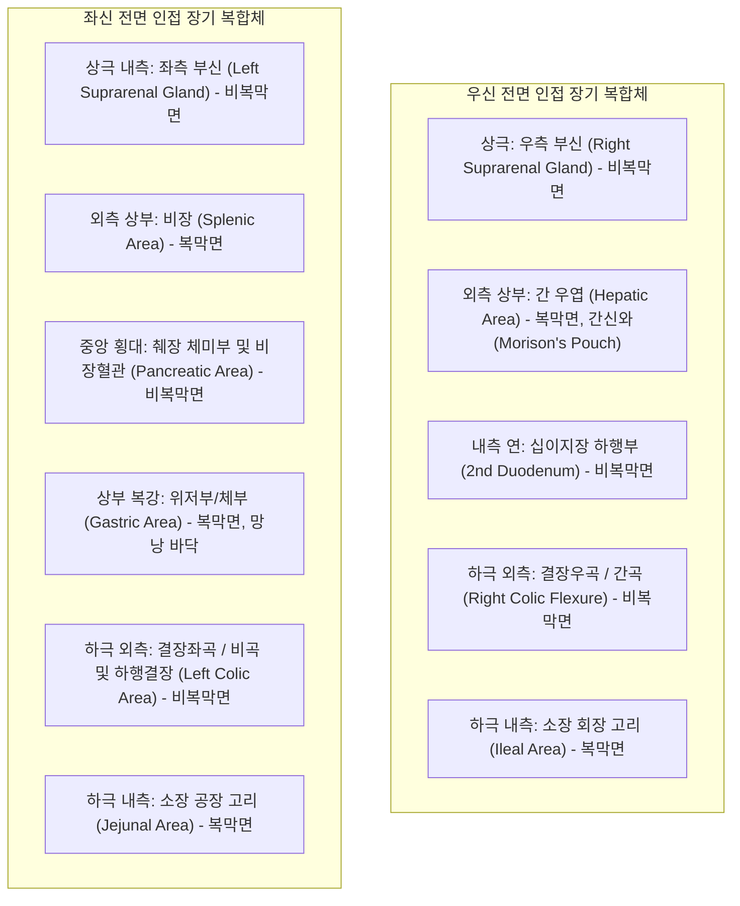
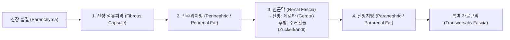
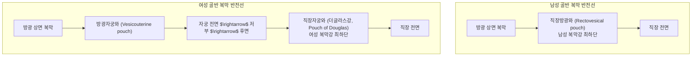
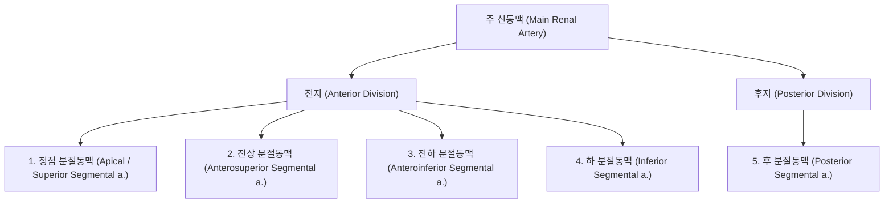
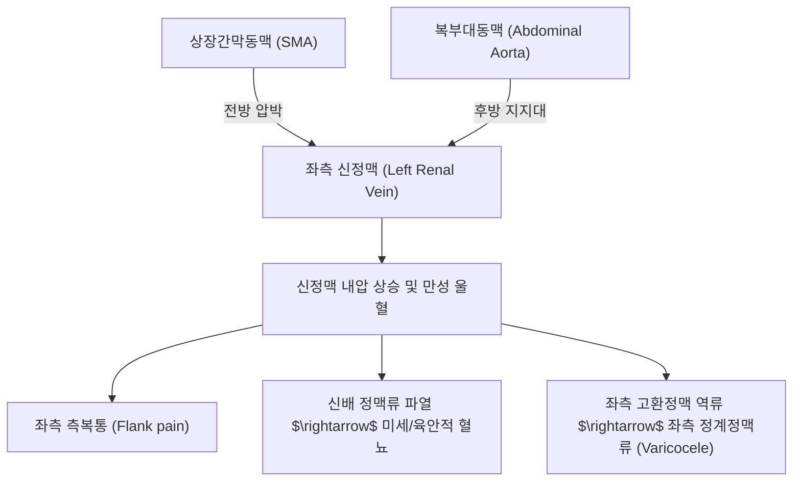
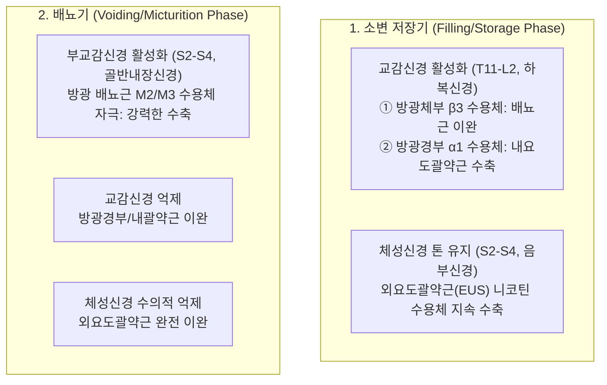
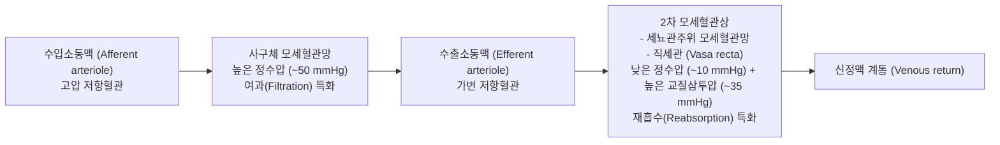
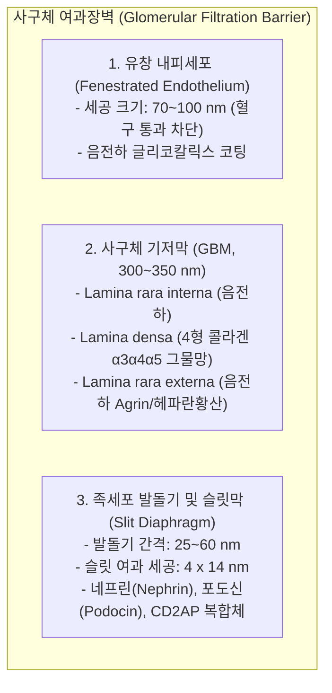
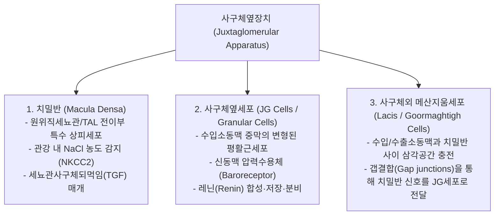
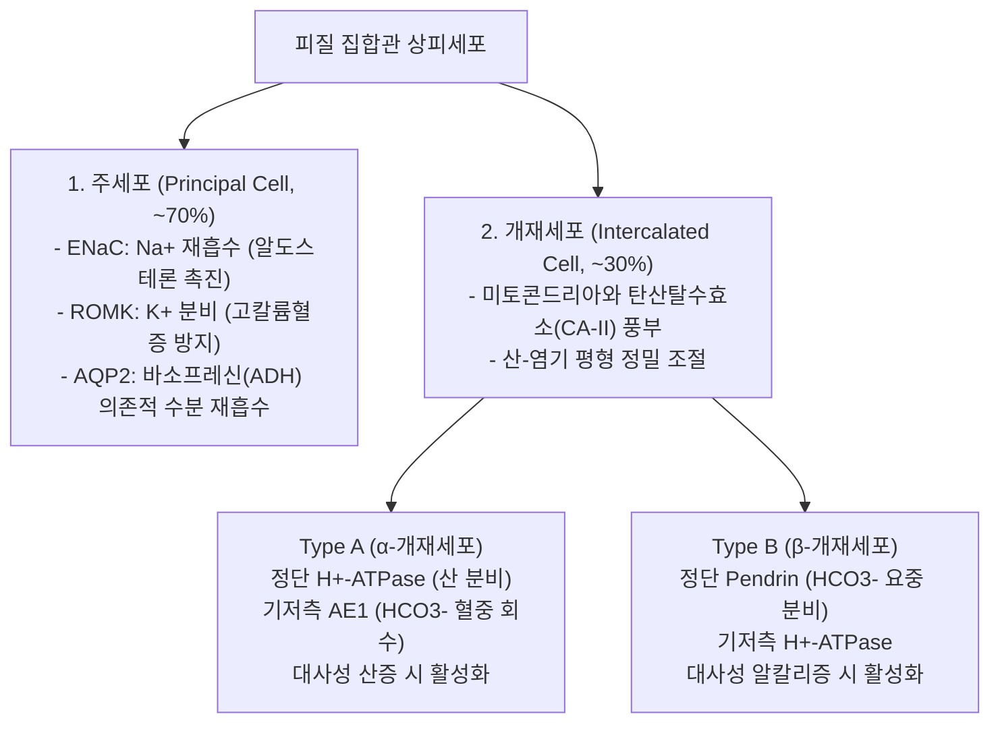

# 📑 [Netter Vol.5] Day 01: 비뇨기계 해부학 - 신장·요관·방광의 3차원 육안해부, 맥관계·신경망 및 네프론 초미세조직학 (Section 1 완독)

> 📖 **원서 출처**: [The Netter Collection of Medical Illustrations - Volume 5, Urinary System.pdf (pp. 2-28)](https://drive.google.com/file/d/1vcvDctJJuo4vA2jKMPeSvjJjRpP1lhp2/view?usp=drivesdk)
> 🏷️ **범위**: Section 1 전편 (Plate 1-1 ~ Plate 1-27, 총 27개 플레이트 전수 정밀 해체, pp. 2–28)
> 📌 **핵심 테마**: 신장 후복막 3차원 위치학 및 척추 투영(T12~L3), 전후면 인접 장기 복합체(Morison's pouch 간신와, 늑횡격동 흉막 반전선, 후방 3대 신경), 신주위 4중 피막(섬유피막-신주위지방-게로타/주커칸들 근막-신방지방)과 하방 개방형 구획 동역학, 신문부 삼원소의 'V-A-P' 배열, 요관의 복부·골반부 주행과 3대 생리적 협착부(UPJ, 골반연, UVJ), 성별 골반장기 및 복막 반전선 대조(Denonvilliers 근막 vs 방광질/직장질근막, "Water under the bridge"), 방광 3면 피라미드 형태학, 삼각부(Trigone)의 중신관 기원과 항역류 점막하 터널 밸브, 신동맥 5대 종말분절지(End-artery)와 무혈관 브뢰델선(Brödel's line), 부신동맥/극동맥 변이와 수신증, 좌신정맥 해부학적 특이성(이식 선호) 및 상장간막동맥(SMA) 압박에 의한 호두까기 증후군(Nutcracker syndrome), 비뇨기계 3중 신경망(저장기 교감신경 β3/α1 vs 배뇨기 부교감신경 M2/M3 vs 외요도괄약근 체성신경 Onuf 핵), 신장교감신경의 3대 작용(레닌, Na+ 재흡수, 혈관수축)과 신장신경차단술(RDN), 신결석 연관통(T10~L2), 림프 배액 체계, 네프론 이원화(피질 네프론 vs 수질옆 네프론의 반류증폭 구조), 2중 모세혈관상 및 직세관(Vasa recta) 반류교환, 사구체 여과장벽(GFB) 3층 분자생물학(유창 내피, GBM 4형 콜라겐 α3α4α5 및 헤파란황산 음전하 장벽, 족세포 네프린-포도신 슬릿막)과 MCD 병태생리, 메산지움 세포 기능 및 사구체옆장치(JGA: 치밀반 NKCC2 감지와 TGF 되먹임), 세뇨관 분절별 초미세조직학(PCT 솔가장자리/메갈린-큐빌린 및 S3 허혈 괴사, 헨레고리 세근 투과성 대조, TAL의 NKCC2와 ROMK 관강 양전하, DCT의 NCC/TRPV5, 집합관 주세포 ENaC/AQP2 및 α/β 개재세포의 산염기 조절), 요로상피(Urothelium) 우산세포의 우로플라킨(Uroplakin Ia, Ib, II, IIIa) 비대칭단위막(AUM) 및 신배-신우 평활근 조율세포(Pacemaker cells)의 연동운동 기전.

---

## 1. 개요 및 마스터 요약 (Executive Summary)

1. **신장의 3차원 공간 해부학 및 근막 구획의 병태생리학 (Renal Topography & Fascial Dynamics)**:
   - 신장은 척주 양측 후복막 강에 비스듬히 안치되며, 앙와위 기준 **제12흉추(T12)~제3요추(L3)** 높이에 위치함. 우신은 간 우엽의 거대한 크기로 인해 좌신보다 **$1\sim 2\text{ cm}$ 낮게** 위치함. 신문부의 주요 구조물은 전방에서 후방으로 **신정맥(Vein) $\rightarrow$ 신동맥(Artery) $\rightarrow$ 신우(Pelvis)** 순서(**V-A-P**)로 배열됨.
   - 신주위 조직은 **진성 섬유피막(Fibrous capsule) $\rightarrow$ 신주위지방(Perinephric fat) $\rightarrow$ 신근막(Renal fascia: 전방 게로타 Gerota + 후방 주커칸들 Zuckerkandl) $\rightarrow$ 신방지방(Paranephric fat)**의 4중 층상 구조를 가짐. 신근막은 상방으로 횡격막하근막에 융합되어 부신을 포함하고, 내측으로 대혈관 외막에 유착되나, **하방으로는 요관 주위로 개방**되어 있어 신주위 농양이나 혈종이 중력을 따라 장골와(Iliac fossa) 및 골반강으로 파급됨.

2. **요관의 주행 동역학, 3대 협착부 및 방광 삼각부 역류방지 기전 (Ureteral Course, Strictures & Trigone Valve)**:
   - 요관(길이 약 $25\sim 30\text{ cm}$)은 전장이 후복막에 위치하며, 임상적으로 결석 감돈이 호발하는 **3대 생리적 협착부**를 가짐: ① **신우요관이행부(UPJ)**, ② **골반연 총장골/외장골동맥 교차부(Pelvic brim)**, ③ **방광요관이행부(UVJ, 방광벽내 터널)**.
   - 골반강 진입 후 요관은 여성에서 자궁동맥 하방을, 남성에서 정관 하방을 교차 통과함 ("*Water runs under the bridge*"). 방광벽을 관통할 때 약 $1.5\sim 2.0\text{ cm}$ 길이의 사선형 점막하 터널(Submucosal tunnel)을 형성하여, 방광 충만 시 방광 내압에 의해 터널이 수동적으로 압박 폐쇄되는 **플랩-밸브(Flap-valve)** 기전으로 방광요관역류(VUR)를 차단함.
   - 방광저의 **삼각부(Trigone)**는 중신관(Mesonephric duct) 유래의 중배엽성 평활근판으로, 점막 주름이 없이 항상 매끄러우며 배뇨 시 요관구 폐쇄와 방광경부 개대를 기계적으로 유도함.

3. **신동맥 5대 종말분절지, 무혈관 브뢰델선 및 신정맥 포착 증후군 (Arterial Segmentation & Venous Entrapment)**:
   - 심박출량의 $20\sim 25\%$를 공급받는 신동맥은 **5대 분절동맥(정점 Apical, 전상 Anterosuperior, 전하 Anteroinferior, 하 Inferior, 후 Posterior)**으로 분지함. 분절동맥 간에는 문합이 전혀 없는 **종말동맥(End-artery)**이므로 혈전이나 손상 시 전층 분절 경색이 불가피함. 신장 후외측연 약 $1\text{ cm}$ 전방에는 전·후 분절 혈류의 경계면인 **무혈관 브뢰델선(Avascular line of Brödel)**이 존재하여 출혈을 최소화하는 신절석술 및 PCNL의 표준 절개선이 됨.
   - 좌신정맥은 우측보다 약 3배 길고($7\sim 8\text{ cm}$), 좌측 부신정맥, 좌측 생식소정맥, 좌측 상행요추정맥을 취합함. 복부대동맥과 상장간막동맥(SMA) 사이의 예각을 통과하므로, 혈관 각도가 좁아질 경우 **호두까기 증후군(Nutcracker syndrome)**이 발생하여 좌측 측복통, 현미경적/육안적 혈뇨, 좌측 정계정맥류(Varicocele)를 초래함.

4. **자율신경계 삼중 제어, 신경성 고혈압과 RDN, 배뇨 반사 신경망 (Neuro-urology & Micturition Reflex)**:
   - 신장 교감신경(T10-L2)은 ① 사구체옆세포(JG cell) $\beta_1$ 수용체 자극을 통한 레닌 분비 촉진, ② 근위세뇨관 $\alpha_{1a}$ 수용체를 통한 $\text{Na}^+$ 재흡수 촉진, ③ 수입소동맥 $\alpha_1$ 혈관수축을 유발함. 이 경로의 만성 과활성은 약제 내성 고혈압을 유발하므로 카테터 기반 **신장신경차단술(Renal Denervation, RDN)**의 치료 표적이 됨.
   - 배뇨는 3중 신경망에 의해 제어됨:
     - **저장기 (Storage phase)**: 교감신경(T11-L2, 하복신경) 활성화 $\rightarrow$ 방광체부 $\beta_3$ 수용체(배뇨근 이완) + 방광경부 $\alpha_1$ 수용체(내요도괄약근 수축), 음부신경(S2-S4 Onuf 핵) 매개 외요도괄약근(EUS) 지속 수축.
     - **배뇨기 (Voiding phase)**: 부교감신경(S2-S4, 골반내장신경) 활성화 $\rightarrow$ 배뇨근 $M_2, M_3$ 무스카린 수용체 자극(강력한 수축) + 교감/체성 괄약근 억제(완전 이완).

5. **사구체 여과장벽(GFB) 3층 분자생물학과 세뇨관-요로상피 초미세조직학 (Glomerular Filtration & Epithelial Biology)**:
   - **사구체 여과장벽 3층**:
     ① **유창 내피세포 (Fenestrated endothelium)**: $70\sim 100\text{ nm}$ 세공 및 음전하 글리코칼릭스 코팅,
     ② **사구체 기저막 (GBM, $300\sim 350\text{ nm}$)**: Lamina rara interna - Lamina densa - Lamina rara externa 3층. 헤파란황산 프로테오글리칸(Agrin)의 음전하 장벽과 4형 콜라겐($\alpha_3\alpha_4\alpha_5$) 망상 크기 장벽. (미세변화신증후군 MCD에서는 음전하 소실로 선택적 알부민뇨 초래),
     ③ **족세포 발돌기 및 슬릿막 (Slit diaphragm)**: 네프린(Nephrin), 포도신(Podocin), CD2AP가 $4 \times 14\text{ nm}$ 여과 세공을 형성하여 분자량 $70\text{ kDa}$ 이상 단백질의 여과를 완전 차단.
   - **세뇨관 구획별 특화**: 근위세뇨관(PCT: 솔가장자리, 메갈린-큐빌린 복합체, 대량 수송; S3 분절의 허혈성 ATN 취약성) $\rightarrow$ 헨레고리 세근(DTL의 AQP1 수분 고투과 vs ATL의 NaCl 수동투과 및 수분 불투과) $\rightarrow$ 굵은 상행각(TAL: NKCC2 능동수송, ROMK 재순환에 의한 관강 양전하 $+8\sim +10\text{ mV}$ 형성으로 $\text{Ca}^{2+}/\text{Mg}^{2+}$ 세포간극 재흡수, 희석 분절) $\rightarrow$ 치밀반(Macula densa: 관강 NaCl 농도 감지 및 TGF 되먹임) $\rightarrow$ 집합관(주세포: ENaC/ROMK/AQP2 vs $\alpha$-개재세포: $\text{H}^+$-ATPase 산 분비 vs $\beta$-개재세포: Pendrin 염기 분비).
   - **요로상피 (Urothelium)**: 최표층 **우산세포(Umbrella cell)**의 관강측 **비대칭단위막(AUM)**에 **우로플라킨(Uroplakin Ia, Ib, II, IIIa)** 플라크가 경첩 구조로 배열되어 인체 최강의 불투과 화학적 장벽을 형성하며, 소신배-신우 경계부 평활근의 **조율세포(Atypical pacemaker cells)**가 자발적 활동전위를 발생시켜 요관 연동운동을 개시함.

---

## 2. 신장의 위치, 해부학적 인접관계 및 피막 체계 (Plates 1-1 ~ 1-5)

### Plate 1-1 | 신장의 위치 및 전면 인접관계 (Kidney: Position and Relations - Anterior View)

![[Netter_V5_Plate1-1.png]]

#### 1) 3차원 위치학 및 척추 투영 랜드마크
- **후복막 장기 (Retroperitoneal Organ)**:
  - 신장은 복벽의 가장 깊은 곳, 후복벽의 척추주위구(Paravertebral gutter)에 위치하며 복막강(Peritoneal cavity) 뒤쪽에 안치됨.
  - **척추 높이**: 앙와위(Supine) 이완 상태 기준 **제12흉추(T12) 상연 ~ 제3요추(L3) 중심부**에 걸쳐 위치함. 신장 하극(Inferior pole)은 장골능(Iliac crest) 상방 약 $2.5\text{ cm}$ 지점에 위치함.
  - **좌우 비대칭성 (Asymmetry)**:
    - 우신(Right kidney)은 거대한 우측 간엽(Right hepatic lobe)에 눌려 발생학적 상승(Embryonic ascent)이 제한되므로, 좌신(Left kidney)보다 통상 **$1\sim 2\text{ cm}$ (약 반 개 척추체 높이) 낮게** 위치함.
    - 이에 따라 우신의 상극은 제12흉추체 중하부에 닿는 반면, 좌신의 상극은 제11흉추체 하연까지 도달함.
  - **호흡성 유동성 (Respiratory Excursion)**:
    - 직립위(Erect position) 및 심흡기(Deep inspiration) 시 횡격막의 수축 하강에 의해 양측 신장은 $2\sim 3\text{ cm}$ 수직 하강함.
    - 마른 체형의 여성에서는 심흡기 시 우신 하극이 복벽을 통해 양손 진찰법(Bimanual palpation)으로 촉진될 수 있음.

#### 2) 전면 인접 장기 복합체 (Anterior Visceral Relations)
신장 전면은 복막에 의해 덮여 있는 **복막 구역(Peritoneal areas)**과 복막 없이 결합조직으로 장기와 직접 맞닿는 **비복막 구역(Bare/Retroperitoneal areas)**으로 정밀하게 구분됨:

- **복막면과 비복막면의 외과적 의의**:
  - 복막으로 덮인 부위(간, 비장, 위, 소장 접촉면)는 복막강을 통해 병변이나 체액이 확산될 수 있음.
  - 비복막 부위(십이지장 2부, 췌장, 결장 접촉면)는 신장 질환(신주위 농양, 신세포암)이 직접 인접 장기로 침윤(Direct extension)하거나, 반대로 십이지장 게실 천공, 췌장염, 결장 게실염이 신주위강으로 직접 파급되는 해부학적 통로가 됨.

> ⚠️ **Clinical Pearl: 모리슨와(Morison's Pouch, Hepatorenal Recess)의 진단적 중요성**
> 우신 상전면과 간 우엽 하면 사이의 간신와(Morison's pouch)는 앙와위 환자의 복강 내에서 가장 중력 의존적인(Most gravity-dependent) 최하단 복막 맹낭입니다. 복부 둔상에 의한 간·비장 파열, 자궁외임신 파열, 충수염 천공 등 복강 내 출혈이나 체액 유출이 발생했을 때 가장 먼저 액체가 고이는 부위입니다. 따라서 응급실의 외상 초음파(FAST, Focused Assessment with Sonography for Trauma) 검사 시 최우선적으로 프로브를 대는 핵심 지점입니다.

---

### Plate 1-2 | 신장의 위치 및 후면 인접관계 (Kidney: Position and Relations - Posterior View)

![[Netter_V5_Plate1-2.png]]

#### 1) 후면 근육 침대 (Muscular Bed of the Kidney)
양측 신장의 후면은 복벽 및 요배부의 견고한 골격-근육 복합체 위에 안치되어 외부 충격으로부터 보호받음:
- **상부 1/3 (횡격막 영역)**:
  - **횡격막(Diaphragm)**의 늑골부 및 내·외측 요륵궁(Medial and lateral arcuate ligaments)에 얹혀 있음.
  - 횡격막 뒤편으로 흉막강 최하단인 **늑횡격동(Costodiaphragmatic recess of pleura)**이 신장 상극 후방으로 깊게 연장됨.
- **하부 2/3 (내측 $\rightarrow$ 외측 순서의 3대 근육 침대)**:
  1. **대요근 (Psoas major muscle)**: 가장 내측에 위치하며 요추체 측면을 따라 주행. 신장은 대요근의 외측 경사면을 따라 전외측으로 약 $30^\circ$ 회전된 3차원 축을 형성함.
  2. **요방형근 (Quadratus lumborum muscle)**: 중간 부위에 넓게 펼쳐져 신장 후면의 중앙부를 받침.
  3. **복횡근 건막 (Aponeurosis of transversus abdominis muscle)**: 가장 외측에 접촉함.

#### 2) 골격 관계 및 늑골 투영 (Rib Projections)
- **좌신 후면**: 상대적으로 높은 위치로 인해 **제11늑골**과 **제12늑골** 모두와 교차 접촉함.
- **우신 후면**: 상대적으로 낮게 위치하므로 오직 **제12늑골**하고만 교차 접촉함.

#### 3) 후방 교차 신경 3총사 (Posterior Neurovascular Triad)
신장 후면과 요방형근 전면 사이 틈새를 따라 3개의 주요 체성 신경이 상내측에서 하외측으로 비스듬히 하강 주행함:
1. **늑간하신경 (Subcostal nerve, T12)**: 제12늑골 직하방을 주행하며 복벽 근육 및 치골상부 감각 지배.
2. **장골하복신경 (Iliohypogastric nerve, L1)**: 요방형근 외측연을 뚫고 나와 하복부 및 외측 둔부 감각 지배.
3. **장골서혜신경 (Ilioinguinal nerve, L1)**: 장골하복신경 하방을 평행 주행하여 서혜관을 통해 음낭 상부/대음순 상부 감각 지배.

> ⚠️ **Clinical Pearl: 경피적 신루설치술(PCN/PCNL) 시 늑막 천공 위험**
> 늑횡격동(Costodiaphragmatic recess)의 흉막 반전선은 제12늑골 내측 후방을 가로질러 척추체 근처까지 하강합니다. 따라서 상극 신결석 제거를 위해 제11늑골과 제12늑골 사이(Supracostal approach)로 천자침을 자입할 경우 흉막강을 관통하여 **기흉(Pneumothorax)**, **혈흉(Hemothorax)**, 또는 관류액이 흉강으로 유입되는 수흉(Hydrothorax)이 발생할 수 있습니다. 가능한 한 제12늑골 하방(Infracostal) 접근이 안전 표준입니다.

---

### Plate 1-3 | 신장의 횡단면 해부학: T12-L1 및 L1-L2 수준 (Kidney: Transverse Sections)

![[Netter_V5_Plate1-3.png]]

#### 1) T12-L1 추간판 수준 횡단면 (신장 상극 단면)
- 복부대동맥에서 복강동맥(Celiac trunk)이 기원하는 레벨.
- **좌측 구획**: 좌신 상극이 후방에 안치되고, 전외측으로 비장(Spleen), 전내측으로 췌장 체부 및 비장정맥, 망낭(Omental bursa)을 사이에 두고 위저부/체부 후벽이 인접함. 좌측 부신이 척추체 좌전방에 위치.
- **우측 구획**: 하대정맥(IVC)이 척추체 우전방에 밀착하고, 거대한 간 우엽이 우신 상극 전면과 외측을 완전히 둘러쌈. 우측 부신이 간과 IVC 사이에서 관찰됨.

#### 2) L1-L2 추간판 수준 횡단면 (신문부 및 신혈관 단면)
- **주요 랜드마크**: 상장간막동맥(SMA) 분지 레벨이자 신동정맥이 출입하는 **신문부(Hilum)**의 중심 단면.
- **좌우 신혈관의 비대칭적 교차 구조**:
  - **좌신정맥(Left renal vein)**: 복부대동맥 전면과 SMA 후면 사이의 협소한 혈관 분기각을 수평으로 가로질러 IVC로 진입함.
  - **우신동맥(Right renal artery)**: 척추체 전면과 IVC 후면 사이 틈새를 통과하여 우신 신문부로 주행함.
- 신우요관이행부(UPJ)와 하행결장(좌측), 상행결장(우측)의 후복막 위치 관계가 명확히 관찰되며, 신장 주위를 둘러싼 두터운 신주위 지방과 게로타 근막이 전후로 확인됨.

---

### Plate 1-4 | 신장의 육안 구조 (Kidney: Gross Structure)

![[Netter_V5_Plate1-4.png]]

#### 1) 신장의 계측치 및 외부 형태학
- **크기 및 무게**: 성인 기준 길이 약 **$10\sim 12\text{ cm}$**, 폭 약 **$5\sim 6\text{ cm}$**, 두께 약 **$2.5\sim 3\text{ cm}$**, 중량은 남성 $125\sim 170\text{ g}$, 여성 $115\sim 155\text{ g}$.
- **외형**: 외측연은 매끄럽고 볼록(Convex)하며, 내측연은 오목(Concave)하여 중앙에 수직 절흔인 **신문(Hilum)**을 형성함.

#### 2) 신문(Hilum)과 신동(Renal Sinus)의 3차원 아키텍처
- **신문부 전후 배열 (Anteroposterior arrangement)**:
  $$\text{전방 (Anterior)} \longrightarrow \text{신정맥 (Renal Vein)} \longrightarrow \text{신동맥 (Renal Artery)} \longrightarrow \text{신우 (Renal Pelvis)} \longrightarrow \text{후방 (Posterior)}$$
  *(외과적 암기 공식: **V-A-P** 순서)*
- **신동 (Renal sinus)**:
  - 신문부를 통해 신장 실질 내부로 함입된 깊이 $2.5\sim 3\text{ cm}$의 주머니 모양 공동.
  - 신동 내부에는 소신배(Minor calyces, $8\sim 18$개), 대신배(Major calyces, $2\sim 3$개), 신우(Renal pelvis) 및 신동정맥 분지들이 풍부한 신주위지방(Perinephric fat)에 둘러싸여 완충됨.

#### 3) 신장 실질의 이원화 구조 (Renal Parenchyma)
1. **신피질 (Renal Cortex)**:
   - 외측 둘레를 감싸는 두께 약 $1\text{ cm}$의 적갈색 과립상 층.
   - **사구체(Glomeruli)**와 **근위/원위 굴곡세뇨관(Convoluted tubules)**이 고밀도로 밀집됨.
   - 피질 실질의 일부가 수질 피라미드 사이로 깊숙이 기둥 모양으로 파고들어 **신주(Renal columns of Bertin)**를 형성함.
2. **신수질 (Renal Medulla)**:
   - $8\sim 18$개의 원추형 **신피라미드(Renal pyramids of Malpighi)**로 구성됨.
   - 피라미드의 기저부(Base)는 피질을 향하고, 정점인 **신유두(Renal papilla)**는 소신배(Minor calyx)를 향해 돌출됨.
   - 2개 이상의 피라미드가 정점에서 융합될 수 있어 유두 수는 피라미드 수보다 적음($8\sim 10$개).
   - 유두 표면에는 $20\sim 30$개의 대형 유두관(Ducts of Bellini) 개구부가 체(Sieve) 모양으로 뚫려 있는 **체형야(Area cribrosa)**가 존재하여 최종 소변을 소신배로 배출함.

---

### Plate 1-5 | 신장근막 및 지방피막 (Renal Fascia)

![[Netter_V5_Plate1-5.png]]

#### 1) 4중 신주위 피막·지방 구획 체계 (The Four Concentric Layers)
신장 실질에서 복벽 바깥쪽으로 진행하는 4단계 층상 구조:

1. **진성 섬유피막 (Fibrous / True capsule)**: 신장 실질 표면에 직접 유착된 얇고 질긴 무혈관성 섬유막. 정상 상태에서는 실질 손상 없이 매끄럽게 박리되나, 만성 신우신염 등 섬유화 질환에서는 실질과 유착되어 박리 시 표면이 뜯겨나감.
2. **신주위지방 (Perinephric fat / Adipose capsule of Gerota)**: 섬유피막 외측을 감싸며 신문부를 통해 신동 내부까지 연속되어 완충, 보온 및 혈관 보호 역할을 수행함.
3. **신근막 (Renal fascia)**:
   - **전신근막 (Anterior renal fascia of Gerota)**: 신장 전면 및 신혈관 전면을 덮고 복부대동맥과 IVC의 외막과 융합함.
   - **후신근막 (Posterior renal fascia of Zuckerkandl)**: 요방형근막 및 대요근막 앞을 지나 척추체 측면에 견고히 부착하며, 전신근막보다 두껍고 결합조직이 치밀함.
   - 외측에서 두 근막이 합쳐져 **측원추근막(Lateroconal fascia)**을 형성하여 결장 후방 복벽과 연속됨.
4. **신방지방 (Paranephric fat / Pararenal body)**: 후신근막 뒤쪽 및 측원추근막 외측에 존재하는 가장 두터운 후복벽 지방 덩어리로 복벽 근막과 접함.

#### 2) 신근막낭의 상·하·내측 폐쇄성 해부학
- **상방 (Superior)**: 전·후 신근막이 부신(Suprarenal gland) 상방에서 합쳐진 후 **횡격막하근막(Inferior diaphragmatic fascia)**과 완전히 융합함. (부신과 신장 사이에는 얇은 섬유성 중간 격막이 존재하여 신절제술 시 부신을 보존할 수 있음).
- **내측 (Medial)**: 전엽은 대혈관 결합조직과 결합하고, 후엽은 대요근막 및 요추 골막에 부착함.
- **하방 (Inferior) - 임상적 취약점**:
  - 전·후 신근막이 단단히 융합되지 않고 느슨한 요관주위 결합조직으로 이행하며 **장골와(Iliac fossa) 및 골반강을 향해 열려 있음**.

> ⚠️ **Clinical Pearl: 신주위 농양(Perinephric Abscess)의 골반강 파급 동역학**
> 신주위강(Perinephric space) 내에 농양이나 대량 후복막 혈종이 발생할 경우, 상방과 외측벽은 견고히 차단되어 있으나 하방은 해부학적으로 개방되어 있습니다. 따라서 농양은 중력을 따라 요관 주위를 타고 **장골와(Iliac fossa) 및 골반강 하부**로 흘러내려가 대요근을 자극(Psoas sign 양성: 고관절 신전 시 극심한 통증)하거나 급성 맹장염, 게실염과 유사한 하복부 통증을 초래합니다.

---

## 3. 요관 및 방광의 육안해부학, 골반 지지구조 및 삼각부 (Plates 1-6 ~ 1-9)

### Plate 1-6 | 요관의 위치, 인접관계 및 육안 구조 (Ureters: Position, Relations, Gross Structure)

![[Netter_V5_Plate1-6.png]]

#### 1) 주행 및 해부학적 구획
- **길이 및 직경**: 성인 기준 길이 약 **$25\sim 30\text{ cm}$**, 외경 $4\sim 8\text{ mm}$, 내경 $2\sim 4\text{ mm}$의 두터운 연축성 평활근관.
- **구획**: 전장이 **후복막(Retroperitoneum)**에 위치하며, **복부 요관(Abdominal part, 약 12.5 cm)**과 **골반부 요관(Pelvic part, 약 12.5 cm)**으로 나뉨.
- **복부 요관의 상세 주행**:
  - 대요근(Psoas major) 전면 근막에 밀착하여 수직 하강하며, **생식대퇴신경(Genitofemoral nerve)**의 앞을 수직으로 가로지름.
  - 전방으로 **생식소혈관(Gonadal vessels - 고환/난소혈관)**이 요관의 앞을 비스듬히 외측에서 내측으로 교차함 (*요관은 생식소혈관의 후방에 위치*).
  - **우측 요관 전면**: 십이지장 하행부(2부), 회맹판, 상장간막혈관(SMA) 분지(우결장동맥, 회결장동맥)의 후방을 통과.
  - **좌측 요관 전면**: 좌결장혈관 및 S상결장간막(Sigmoid mesocolon) 기저부의 후방을 통과.

#### 2) 요관의 3대 생리적 협착부 (Three Constriction Sites)

| 협착 부위 | 해부학적 위치 및 발생 기전 | 내경 및 임상적 의의 |
| :--- | :--- | :--- |
| **제1협착부** | **신우요관이행부 (UPJ, Ureteropelvic Junction)** | 깔때기 모양의 신우가 관상의 요관으로 좁아지는 시작 부위. 선천성 UPJ 협착의 호발 부위. 내경 약 $2\text{ mm}$. |
| **제2협착부** | **골반연 교차부 (Pelvic Brim Crossing)** | 요관이 **총장골동맥(또는 외장골동맥) 분기부**를 타고 넘어가며 골반강으로 진입하는 굴곡 부위. 내경 약 $4\text{ mm}$. |
| **제3협착부** | **방광요관이행부 (UVJ, Ureterovesical Junction)** | 요관이 **방광 근육벽을 사선으로 관통(Intramural tunnel)**하여 방광 내강으로 열리는 종말부. 가장 좁은 협착부(내경 $1\sim 2\text{ mm}$). |

#### 3) 골반부 요관과 생식관/혈관의 교차 관계
- **여성 골반강**:
  - 골반 측벽을 따라 하강 후 내측으로 전향하여 광인대(Broad ligament) 기저부의 기수달인대(Mackenrodt's cardinal ligament) 내부를 통과함.
  - 자궁경부 외측 약 $1.5\sim 2.0\text{ cm}$ 지점에서 **자궁동맥(Uterine artery)의 바로 '하방(Inferior)'을 교차**함.
  - 외과적 격언: **"Water (소변을 나르는 요관) runs under the bridge (다리 역할을 하는 자궁동맥)"**.
- **남성 골반강**:
  - 골반 측벽을 따라 하강하다가 방광저에 도달 직전 **정관(Ductus deferens)의 '하방'을 교차**하여 정낭 외측을 거쳐 방광 후벽으로 진입함.

> ⚠️ **Clinical Pearl: 부인과 전자궁적출술(Total Hysterectomy) 시 요관 결찰 손상**
> 자궁적출술 시 자궁동맥을 결찰(Ligation)하는 단계에서 자궁동맥 바로 $1.5\text{ cm}$ 하방을 주행하는 요관이 함께 결찰되거나 절단되는 의원성 손상(Iatrogenic ureteral injury)이 전체 부인과 수술의 $0.5\sim 1.5\%$에서 보고됩니다. 수술 중 즉각 발견하지 못하면 술 후 요관 질 누공(Ureterovaginal fistula)이나 무증상 신폐색으로 인한 영구적 신기능 상실이 초래됩니다.

---

### Plate 1-7 | 남성 방광: 위치, 인접관계 및 육안 구조 (Bladder: Position, Relations, Gross Structure - Male)

![[Netter_V5_Plate1-7.png]]

#### 1) 방광의 3차원 형태학 (사면 피라미드 구조)
비어 있는 성인 방광은 골반저 위에 놓여 4개의 면을 가진 편평한 피라미드 형태를 띰:
- **정점 (Apex)**: 전상방 치골결합 상연을 향하며, 태생기 요막관(Urachus) 잔유물인 섬유성 **정중제삭(Median umbilical ligament)**으로 이어져 배꼽(Umbilicus)에 고정됨.
- **저부 (Base / Fundus)**: 후방을 향하는 역삼각형 면으로, 남성에서는 **정낭(Seminal vesicles)** 및 **정관 팽대부(Ampullae of ductus deferentes)**와 직접 접촉함.
- **체부 (Body)**: 정점과 저부 사이의 주 팽창 구역으로 단일 상면(Superior surface)과 좌우 2개의 하외측면(Inferolateral surfaces)을 가짐.
- **경부 (Neck)**: 방광의 가장 최하단이자 가장 견고히 고정된 부위로, **전립선(Prostate) 기저부**와 융합하며 **내요도구(Internal urethral orifice)**를 형성함.

#### 2) 치골후극 (레치우스강, Retropubic Space of Retzius)
- 방광 전면 및 하외측면은 치골체(Pubic bone) 후면 및 폐쇄내근(Obturator internus), 치골미골근과 마주함.
- 방광과 치골 사이의 성긴 지방결합조직 공간을 **치골후극(Retropubic space of Retzius)**이라 부름.
- 내부에 거대한 전립선/방광 정맥총(Santorini's plexus)이 위치하며, 치골상부 방광절개술(Suprapubic cystostomy) 및 전립선절제술의 표준 복막외(Extraperitoneal) 수술 접근로가 됨.

---

### Plate 1-8 | 여성 방광: 위치, 인접관계 및 복막 주름 (Bladder: Position, Relations, Gross Structure - Female)

![[Netter_V5_Plate1-8.png]]

#### 1) 여성 방광의 후면 및 상면 인접관계
- **후면 (Posterior)**: 전립선과 정낭이 존재하는 남성과 달리, 여성 방광 저는 **질 전벽(Anterior vaginal wall)** 및 **자궁경부(Cervix)** 전면에 직접 밀착함.
  - 방광과 질 사이는 얇은 성긴 결합조직인 **방광질근막(Vesicovaginal fascia)**에 의해 분리됨.
- **상면 (Superior)**: 자궁체부(Body of uterus)의 전하면에 받쳐져 있으며, 방광과 자궁 사이에 **방광자궁와(Vesicouterine pouch)** 복막 맹낭이 형성됨.

#### 2) 골반 복막 반전선(Peritoneal Reflections) 및 성별 대조

#### 3) 지지 격막의 상동성 (Fascial Homology)
- 남성의 **직장전립선근막(드농빌리에 근막, Denonvilliers' fascia / Rectoprostatic septum)**은 여성의 **직장질근막(Rectovaginal fascia)** 및 **방광질근막(Vesicovaginal fascia)**과 상동 기관임.

---

### Plate 1-9 | 방광 관상단면: 삼각부, 지지인대 및 배뇨근 구조 (Bladder: Coronal Cross-Section)

![[Netter_V5_Plate1-9.png]]

#### 1) 방광 삼각부 (Trigone of Bladder / Trigonum Vesicae)
방광 내면 후하방에 위치하는 매끄러운 삼각형 점막 구역:
- **경계**:
  - 좌우 상각(Superolateral angles): 좌우 **요관구(Ureteric orifices)**.
  - 하각(Inferior angle): **내요도구(Internal urethral orifice)**.
  - 상연: 두 요관구 사이를 가로지르는 두터운 근육 융기선인 **요관간능(Interureteric crest / Torus uretericus)**.
- **발생학적 특이성**: 방광의 나머지 배뇨근 벽은 내배엽(Endoderm) 기원이나, 삼각부 평활근판은 **중신관(Mesonephric duct) 유래의 중배엽(Mesoderm)**에서 기원함.
- **특징**: 방광이 비어 있거나 수축할 때도 점막 주름(Rugae)이 형성되지 않고 **항상 매끄럽고 편평함(Smooth)**. 삼각부 하단의 내요도구 바로 뒤쪽에는 전립선 중앙엽에 의해 융기된 **방광수(Uvula vesicae)**가 관찰됨.

#### 2) 배뇨근(Detrusor Muscle)의 3층 구조
방광 고유근층은 3차원적으로 얽힌 평활근 망상체임:
1. **내종주근 (Inner longitudinal layer)**: 점막하층과 밀접하며 삼각부 근육판과 연속됨.
2. **중순환근 (Middle circular layer)**: 가장 두껍고 강력한 층으로 방광 체부를 나선형으로 둘러싸며, 방광경부에서는 고리 모양으로 배열되어 **내요도괄약근(Internal urethral sphincter)**의 평활근 성분을 형성함.
3. **외종주근 (Outer longitudinal layer)**: 방광 외면을 세로로 감싸며 전방으로 치골방광인대, 후방으로 전립선 피막 및 질 전벽으로 방사됨.

#### 3) 방광 경부 및 골반 지지 인대
- **내측 치골전립선인대 (남성) / 내측 치골방광인대 (여성)**: 치골체 후면에서 기원하여 전립선/방광경부를 치골에 견고히 고정하며 음경/음핵 심배정맥(Deep dorsal vein)의 양측을 받침.
- **외측 치골전립선/치골방광인대**: 골반근막 건궁(ATFP, Tendinous arch of pelvic fascia)과 연속되어 방광경부의 측방 전위를 방지함.

> ⚠️ **Clinical Pearl: 요관 점막하 터널의 방광요관역류(VUR) 방지 밸브 기전**
> 요관은 방광벽을 직각으로 뚫지 않고 약 **$1.5\sim 2.0\text{ cm}$ 동안 근육층과 점막 사이를 비스듬히 주행(Submucosal tunnel)**합니다. 소변이 방광에 차서 방광 내압이 상승하면 점막하 터널이 방광 내압에 의해 납작하게 눌려(Passive compression) 완벽한 **플랩-밸브(Flap-valve)**로 작동합니다. 터널 길이가 선천적으로 짧거나($\text{Tunnel length} : \text{Ureteral diameter}$ 비율 $< 5:1$) 주행 각도가 수직에 가까우면 소변이 신장으로 역류하는 **방광요관역류(VUR)**가 발생하여 재발성 급성 신우신염 및 신반흔(Reflux nephropathy)을 유발합니다.

---

## 4. 비뇨기계 혈관학: 신동맥 분절·변이 및 요관·방광 혈행 (Plates 1-10 ~ 1-13)

### Plate 1-10 | 신장 혈관: 제자리 주행 및 대혈관 관계 (Renal Vasculature: In Situ)

![[Netter_V5_Plate1-10.png]]

#### 1) 신혈류량의 생리학적 특성 및 신동맥 기원
- **대량 혈류 공급**: 안정 시 성인 심박출량(Cardiac output)의 약 **$20\sim 25\%$ (약 $1,200\text{ mL/min}$)**가 양측 신장으로 유입됨. 신장 단위 무게당 혈류량은 뇌($50\text{ mL/min/100g}$)나 심장($70\text{ mL/min/100g}$)의 수 배에 달하는 약 **$400\text{ mL/min/100g}$**임. 이는 신장 실질의 산소 요구량 때문이 아니라 방대한 사구체 여과(GFR, 약 $125\text{ mL/min}$)를 유지하기 위한 기능적 대량 관류임.
- **신동맥의 기원**: 복부대동맥(Abdominal aorta) 측벽에서 **제1~2요추(L1-L2) 추간판 높이**, 즉 상장간막동맥(SMA) 기원부 직하방 약 $1\text{ cm}$ 지점에서 좌우 신동맥이 직각에 가깝게 분지함.

#### 2) 좌우 신동맥의 해부학적 주행 비교
- **우신동맥 (Right Renal Artery)**:
  - 복부대동맥이 척추체 정중선 좌측에 치우쳐 있고 우신이 외측에 위치하므로, **우신동맥이 좌신동맥보다 훨씬 길고($6\sim 7\text{ cm}$ vs $3\sim 4\text{ cm}$)** 완만한 하방 경사로 주행함.
  - **하대정맥(IVC) 후방**, 우신정맥 후방, 췌장 두부 및 십이지장 2부의 후방을 가로질러 주행함.
- **좌신동맥 (Left Renal Artery)**:
  - 길이가 짧고 거의 수평으로 주행함.
  - 좌신정맥 후상방, 췌장 체미부 및 비장정맥의 후방에 위치함.

---

### Plate 1-11 | 신동맥 분절지, 신내 분지 및 브뢰델 무혈관선 (Segmental Branches & Brödel's Line)

![[Netter_V5_Plate1-11.png]]

#### 1) 5대 혈관분절 및 종말동맥 체계 (Five Vascular Segments)
주 신동맥은 신문부에 도달하기 직전 **전지(Anterior division)**와 **후지(Posterior division)**로 나뉜 후 총 **5개의 분절동맥(Segmental arteries)**을 형성함:

- **종말동맥 (End-artery) 원칙**: 분절동맥 간에는 측부문합(Collateral anastomosis)이 전혀 존재하지 않음. 따라서 분절동맥의 혈전 색전증, 외상성 손상, 또는 수술적 결찰 시 해당 분절에 즉각적인 **전층 허혈성 신경색(Segmental renal infarction)**이 초래됨.

#### 2) 신내 동맥 분지 계통 (Intrarenal Arterial Hierarchy)
1. **엽동맥 (Lobar arteries)**: 각 분절동맥이 신피라미드 군을 향해 분지.
2. **엽간동맥 (Interlobar arteries)**: 신주(Renal columns of Bertin) 내부를 따라 신피라미드 측면을 타고 피질-수질 경계면으로 상행.
3. **궁상동맥 (Arcuate arteries)**: 신피라미드의 기저부(피질-수질 접합부)를 따라 활 모양으로 주행 (수질 피라미드를 관통하지 않고 경계면을 활주함).
4. **피질방사동맥 / 소엽간동맥 (Cortical radiate / Interlobular arteries)**: 피질 표면을 향해 방사상으로 수직 상행하며 수많은 **수입소동맥(Afferent arterioles)**을 분지함.

#### 3) 브뢰델선 (Avascular Line of Brödel)
- 신장 후면에서 외측연으로부터 약 **$1\text{ cm}$ 전방/내측(외측연과 후면 1/3의 경계면)**에 위치하는 가상선.
- 전지가 지배하는 전상/전하 분절과 후지가 지배하는 후분절 사이의 종말 모세혈관 경계면.
- 주요 대형 동맥이 가로지르지 않아 출혈을 최소화할 수 있는 구역으로, 신결석 제거를 위한 **신절개술(Nephrolithotomy)** 및 **경피적 신루설치술(PCN/PCNL)** 천자의 최우선 안전선임.

---

### Plate 1-12 | 신혈관의 변이: 부신동맥/극동맥 및 넛크래커 증후군 (Vascular Variations & Nutcracker Syndrome)

![[Netter_V5_Plate1-12.png]]

#### 1) 신동맥의 해부학적 변이 (전체 인구의 약 $25\sim 30\%$)
- **부신동맥 / 극동맥 (Accessory / Polar Renal Arteries)**:
  - 태생기 신장 상승 과정에서 태아 척추-골반 혈관이 퇴화하지 않고 잔존하여 발생함.
  - 약 $50\%$는 대동맥에서 직접 기원하고, $50\%$는 주 신동맥의 조기 분지(Early branching)로 발생함.
  - **하극동맥(Inferior polar artery)의 임상적 중요성**: 신장 하극으로 향하는 동맥이 신우요관이행부(UPJ)의 전면을 가로지르며 기계적으로 압박하여 **성인형 수신증(Hydronephrosis) 및 요관 폐색**을 유발하는 주요 외인성 원인이 됨.

#### 2) 신정맥의 비대칭성과 좌신정맥 해부학
- **좌신정맥의 해부학적 특징**:
  - 우신정맥($2\sim 3\text{ cm}$)보다 약 3배 길며($7\sim 8\text{ cm}$), 복부대동맥 전면과 상장간막동맥(SMA) 분기각 사이를 통과함.
  - 주행 도중 3개의 주요 혈관을 합류받음:
    ① 상방에서 **좌측 부신정맥 (Left suprarenal vein)**,
    ② 하방에서 **좌측 생식소정맥 (Left gonadal vein - 고환/난소정맥)**,
    ③ 후방에서 **좌측 상행요추정맥 (Left ascending lumbar vein - 반기정맥과 연결)**.
  - *(우신정맥은 부신정맥이나 생식소정맥의 유입 없이 단독으로 IVC로 직행함).*
  - **신장이식 공여자 신장(Donor kidney)** 선택 시, 혈관 문합이 용이하도록 정맥 줄기가 긴 **좌측 신장**을 선호함.

#### 3) 호두까기 증후군 (Nutcracker Syndrome / Mesoaortic Compression)

> ⚠️ **Clinical Pearl: 좌측 정계정맥류(Varicocele)와 신세포암(RCC) 종양혈전**
> 좌측 고환정맥은 직각으로 좌신정맥에 유입되므로 우측(IVC로 비스듬히 유입)보다 정맥압이 높고 판막 기능부전이 호발합니다. 특히 고령 남성에서 갑자기 발생하거나 누워도 소실되지 않는 좌측 정계정맥류는 좌측 신세포암(RCC)이 좌신정맥 내강으로 침범하여 **종양혈전(Tumor thrombus)**을 형성해 고환정맥 유입부를 폐색시켰음을 시사하는 중대한 경고 징후입니다.

---

### Plate 1-13 | 요관 및 방광의 혈관 공급망 (Vasculature of Ureters and Bladder)

![[Netter_V5_Plate1-13.png]]

#### 1) 요관 혈관망의 복합 다원성 및 수술적 박리 원칙
요관은 단일 동맥이 지배하지 않고 주행 경로 주변의 모든 후복막 혈관으로부터 다발성 혈관 가지를 공급받음:
- **복부 요관 혈류**:
  - 신동맥, 복부대동맥, 생식소동맥, 총장골동맥에서 기원함.
  - 혈관 분지가 요관의 **'내측(Medial)'**에서 접근함 $\rightarrow$ 수술 시 요관을 **'외측에서 내측으로(Medial traction)'** 견인해야 혈류 손상이 없음.
- **골반부 요관 혈류**:
  - 내장골동맥, 자궁동맥(여성), 하방광동맥(남성), 상방광동맥, 중직장동맥에서 기원함.
  - 혈관 분지가 요관의 **'외측(Lateral)'**에서 접근함 $\rightarrow$ 수술 시 요관을 **'내측에서 외측으로(Lateral traction)'** 견인해야 박리 괴사를 예방함.
- **외막 혈관총 (Adventitial plexus)**: 분지들이 요관 외막(Adventitia)에서 상하로 풍부한 종주 문합망을 형성하므로, 외막을 과도하게 박리(Stripping)하면 허혈성 요관 협착이나 누공이 발생함.

#### 2) 방광의 동맥 및 정맥 순환
- **동맥 공급**:
  - **상방광동맥 (Superior vesical a.)**: 태아 제대동맥(Umbilical a.)의 개방된 근위부에서 분지하여 방광 상부 및 체부 공급.
  - **하방광동맥 (Inferior vesical a., 남성)**: 내장골동맥 전지에서 기원하여 방광저, 전립선, 정낭 공급.
  - **질동맥 (Vaginal a., 여성)**: 남성의 하방광동맥에 상동하며 방광 하부 및 질벽 공급.
- **정맥 배액**:
  - 방광하부 및 전립선 주위에 거대한 **방광정맥총(Vesical venous plexus) 및 전립선정맥총(Prostatic plexus of Santorini)** 형성.
  - 내장골정맥(Internal iliac vein)으로 유입되며, 바트슨 척추정맥총(Batson's vertebral plexus)과도 문합되어 전립선암·방광암의 무증상 척추 전이 경로가 됨.

---

## 5. 비뇨기계 신경지배 및 림프 순환계 (Plates 1-14 ~ 1-17)

### Plate 1-14 | 비뇨기계 자율신경 지배 개요 (Innervation of Urinary System)

![[Netter_V5_Plate1-14.png]]

#### 1) 3중 신경 제어 시스템 (교감·부교감·체성신경)
하부 요로계(LUTS)의 소변 저장(Storage) 및 배뇨(Voiding)는 세 가지 신경 계통의 정밀한 길항 및 조화에 의해 지배됨:

#### 2) 신경계통별 기원핵 및 수용체 매핑

| 신경 계통 | 척수 기원핵 및 통로 | 방광 체부 작용 | 방광 경부 / 요도 작용 | 주요 임상 약물 |
| :--- | :--- | :--- | :--- | :--- |
| **교감신경 (Sympathetic)** | **T11 ~ L2** IML 측각 $\rightarrow$ 하복신경(Hypogastric n.) | **이완** ($\beta_3$ 아드레날린 수용체) | **수축** ($\alpha_1$ 아드레날린 수용체, 내괄약근 폐쇄) | Mirabegron ($\beta_3$ 효능제: 과민성방광 치료) Tamsulosin ($\alpha_1$ 차단제: 전립선비대 배뇨장애 개선) |
| **부교감신경 (Parasympathetic)** | **S2 ~ S4** 천골 부교감핵 $\rightarrow$ 골반내장신경(Pelvic splanchnic n.) | **강력한 수축** ($M_2, M_3$ 무스카린 수용체) | 간접적 이완 유도 | Solifenacin ($M_3$ 차단제: 절박뇨/빈뇨 억제) Bethanechol (무스카린 효능제: 신경인성 방광 배뇨 촉진) |
| **체성신경 (Somatic)** | **S2 ~ S4** 천수 전각 Onuf 핵 $\rightarrow$ 음부신경(Pudendal n.) | 작용 없음 | **외요도괄약근(EUS) 수의적 수축** ($N_M$ 니코틴 수용체) | 케겔 운동 (골반저근 강화) 근이완제 |

---

### Plate 1-15 | 신장 및 상부 요관의 신경 주행로 (Innervation Pathways of the Kidneys and Upper Ureter)

![[Netter_V5_Plate1-15.png]]

#### 1) 신장 신경총(Renal Plexus)의 구성
- 신동맥 외막을 따라 거대한 그물망 형태로 주행하며 신장 실질로 진입함.
- **교감신경 입력**: 소내장신경(T10-T11), 최소내장신경(T12), 제1요내장신경(L1). 복강신경절 및 대동맥신장신경절에서 시냅스 후 신동맥을 따라 분포.
- **부교감신경 입력**: 미주신경(CN X) 후신경간에서 분지 유입 (생리적 역할은 상대적으로 미약함).

#### 2) 신장 교감신경의 3대 핵심 생리 기능
1. **레닌 분비 촉진 (Renin Release)**: 수입소동맥 사구체옆세포(JG granular cells)의 **$\beta_1$-아드레날린 수용체**를 직접 자극하여 레닌 분비 촉진 $\rightarrow$ RAAS 전신 활성화.
2. **세뇨관 나트륨 재흡수 증가 (Tubular Sodium Retention)**: 근위세뇨관 및 헨레고리의 **$\alpha_{1a}$-아드레날린 수용체**를 자극하여 $\text{Na}^+$-$\text{K}^+$-ATPase 및 NHE3 발현 증가 $\rightarrow$ 수분·염분 저류.
3. **신혈류량 감소 (Renal Vasoconstriction)**: 수입소동맥 평활근의 **$\alpha_1$-수용체**를 자극하여 강력한 혈관수축 유발 $\rightarrow$ 신혈류량(RBF) 및 사구체여과율(GFR) 감소.

> ⚠️ **Clinical Pearl: 카테터 기반 신장신경차단술 (Renal Denervation, RDN)**
> 신장 원심성/구심성 교감신경의 만성 과활성화는 약제 내성 고혈압(Resistant hypertension)의 핵심 병태생리입니다. 대퇴동맥을 통해 신동맥 내로 고주파 카테터를 삽입하여 외막에 밀집된 신장 교감신경총을 선택적으로 소작하는 **RDN 시술**은 신경성 레닌 분비와 혈관수축을 영구 차단하여 유의미하고 지속적인 혈압 강하 효과를 제공합니다.

---

### Plate 1-16 | 요관 및 방광의 신경 주행로와 통증 전달 (Innervation Pathways: Ureter & Bladder)

![[Netter_V5_Plate1-16.png]]

#### 1) 요관 연동운동의 신경조절 (Myogenic vs Neurogenic)
- **근원성 조율(Myogenic pacemaker)**: 요관의 주기적 연동운동($2\sim 6\text{회/분}$)은 자율신경이 아니라 소신배 평활근의 **특수 조율세포(Atypical pacemaker cells)**에서 자발적으로 발생하는 활동전위에 의해 유도됨.
- **자율신경의 역할**: 연동운동의 진폭(Amplitude)과 빈도(Frequency)를 변조(Modulation)하는 보조적 역할을 수행함.

#### 2) 요로 결석 통증의 방사 메커니즘 (Referred Pain Pathways)
신장 피막 신전이나 요관 결석 감돈 시 발생하는 극심한 **신산통(Renal colic)**은 내장 구심성 신경(Visceral afferents)을 통해 전달됨:

| 결석 감돈 위치 | 침범 구심성 신경 분절 | 연관통 방사 부위 (Referred Pain Distribution) |
| :--- | :--- | :--- |
| **신배 / 신우 / 상부 요관** | **T10 ~ T11** 후근신경절 | **늑골척추각(CVA), 측복부(Flank), 배꼽 주위** |
| **중부 요관 (골반연 부위)** | **T12 ~ L1** 후근신경절 | **하복부, 장골와, 서혜부(Groin)** |
| **하부 요관 / UVJ (방광 근처)** | **L1 ~ L2 & Genitofemoral n.** | **음낭/고환(남성), 대음순(여성), 대퇴 내측**, 빈뇨/잔뇨감 |

---

### Plate 1-17 | 비뇨기계 림프 순환계 (Lymphatics of Urinary System)

![[Netter_V5_Plate1-17.png]]

#### 1) 신장의 림프 배액 (Renal Lymphatics)
- 신장 실질 내의 풍부한 모세림프관은 혈관망(소엽간-궁상-엽간)을 따라 합류하여 신문부로 빠져나옴.
- **좌측 신장**: 대동맥 좌측의 **좌측 외측대동맥림프절(Left para-aortic / lateral aortic nodes)**로 직접 배액.
- **우측 신장**: 하대정맥 주위의 **대정맥주위림프절(Paracaval) 및 대동맥대정맥간림프절(Interaortocaval nodes)**로 배액.
- 상부 림프관들은 유미조(Cisterna chyli)와 흉관(Thoracic duct)으로 이어짐.

#### 2) 요관 및 방광의 림프 배액
- **요관 림프**:
  - 상부 $1/3$: 요추/신문부 림프절.
  - 중간 $1/3$: 총장골(Common iliac) 림프절.
  - 하부 $1/3$: 내장골(Internal iliac) 및 외장골(External iliac) 림프절.
- **방광 림프**:
  - 방광 상부/체부: 주로 **외장골림프절(External iliac nodes)**로 배액.
  - 방광저/경부: **내장골림프절(Internal iliac nodes)** 및 **폐쇄림프절(Obturator nodes)**로 집중 배액.
  - 전립선암 및 침윤성 방광암의 첫 번째 전이 림프절(Sentinel node)은 흔히 **폐쇄신경와(Obturator fossa) 내의 폐쇄림프절**임.

---

## 6. 네프론 개요 및 사구체 미세구조학 (Plates 1-18 ~ 1-22)

### Plate 1-18 | 네프론 개요: 피질 네프론 vs 수질옆 네프론 (Overview of the Nephron)

![[Netter_V5_Plate1-18.png]]

#### 1) 네프론의 기본 단위 및 수질 구획화
- **네프론 개수**: 신장 1개당 평균 **$800,000 \sim 1,200,000$개 (약 100만 개)**가 존재함. 출생 후 새로운 네프론은 생성되지 않으며 노화나 질환으로 소실되면 비가역적임.
- **신수질의 조직학적 3대 구획화**:
  1. **외수질 외대 (Outer Medulla - Outer Stripe, OS)**: 근위직세뇨관(PST, S3)과 원위직세뇨관(TAL)이 공존함.
  2. **외수질 내대 (Outer Medulla - Inner Stripe, IS)**: 헨레고리 하행세근(DTL)과 굵은 상행각(TAL)이 평행하게 주행함.
  3. **내수질 (Inner Medulla, IM)**: 헨레고리 하행/상행 세근(DTL/ATL)과 내수질 집합관(IMCD), 직세관 모세혈관망(Vasa recta)으로 구성됨.

#### 2) 피질 네프론 vs 수질옆 네프론 비교

| 비교 항목 | 피질 네프론 (Cortical Nephron) | 수질옆 네프론 (Juxtamedullary Nephron) |
| :--- | :--- | :--- |
| **비율** | **약 $80 \sim 85\%$** | **약 $15 \sim 20\%$** |
| **사구체 위치** | 외피질 및 중피질 (Outer/Mid-cortex) | 피질-수질 경계부 인접 심부 피질 (Inner cortex) |
| **사구체 크기** | 상대적으로 작음 | 상대적으로 크며 GFR 여과능 우수 |
| **헨레고리 길이** | **단순 단축 루프 (Short loop)** 외수질 경계까지만 진입 후 반전 | **장축 심부 루프 (Long loop)** 내수질 및 신유두 끝까지 깊숙이 침투 |
| **수출소동맥 모세혈관계** | 피질 **세뇨관주위 모세혈관망 (Peritubular capillaries)** 형성 | 수질 깊숙이 하강하는 **직세관 (Vasa recta)** 형성 |
| **주요 생리적 기능** | 사구체 여과액의 대부분 재흡수 및 분비 | **수질 삼투압 경사 형성 및 소변 농축 기전(Countercurrent system)의 핵심 구동** |

---

### Plate 1-19 | 신장 미세혈관계 및 직세관 반류순환 (Renal Microvasculature)

![[Netter_V5_Plate1-19.png]]

#### 1) 2중 모세혈관상 직렬 연결 (Portal-like Capillary Bed)
신장 미세순환은 인체에서 유일무이하게 **두 개의 모세혈관상이 직렬(Series)로 배열**된 구조를 가짐:

#### 2) 직세관(Vasa Recta)의 반류교환(Countercurrent Exchange) 기전
- 수질옆 사구체의 수출소동맥에서 기원한 하행 직세관(Descending vasa recta)과 상행 직세관(Ascending vasa recta)은 헨레고리와 나란히 U자형 헤어핀 고리를 형성함.
- 수질의 고장성 삼투압(Hyperosmolar medullary gradient)을 씻어내지(Washout) 않으면서 수질 조직에 산소와 영양분을 공급하고 재흡수된 수분을 회수하는 **수동적 반류교환기(Passive countercurrent exchanger)**로 작동함.

---

### Plate 1-20 | 사구체 구조 및 광학현미경 조직학 (Glomerulus: Structure and Histology)

![[Netter_V5_Plate1-20.png]]

#### 1) 사구체(신소체, Renal Corpuscle)의 3차원 구조
- 직경 약 **$200\,\mu\text{m}$**의 구형 혈관-상피 복합체.
- **혈관극 (Vascular pole)**: 수입소동맥이 진입하고 수출소동맥이 빠져나오며, 사구체옆장치(JGA)가 부착된 부위.
- **요극 (Urinary pole)**: 사구체 반대편 끝에서 보먼낭 공간이 근위굴곡세뇨관(PCT)으로 이어지는 부위.

#### 2) 보먼낭(Bowman's Capsule)의 이중 벽
1. **벽측 상피세포 (Parietal epithelial cells, PEC)**: 보먼낭 외벽을 형성하는 단순 편평상피세포. 기저막 위에 얹혀 있으며 요극에서 근위세뇨관의 입방상피로 이행함.
2. **장측 상피세포 (Visceral epithelial cells = Podocytes, 족세포)**: 사구체 모세혈관 고리의 외면을 완전히 둘러싸며 모세혈관벽의 최외측 층을 구성함.
3. **보먼강 (Bowman's space)**: 벽측 상피와 장측 상피 사이의 틈새로, 사구체 모세혈관에서 여과된 원뇨(Primary urine / Ultrafiltrate)가 최초로 집적되는 공간.

---

### Plate 1-21 | 사구체 여과장벽의 미세구조 (Glomerulus: Fine Structure)

![[Netter_V5_Plate1-21.png]]

#### 1) 3층 여과장벽(Glomerular Filtration Barrier, GFB)의 분자생물학

#### 2) 크기 선택성(Size selectivity)과 전하 선택성(Charge selectivity)
- **크기 배제 한계 (Size barrier)**: 직경 **$4\text{ nm}$ 이하 (분자량 $< 10\sim 15\text{ kDa}$)**의 물질(물, 요소, 포도당, 전해질)은 자유롭게 투과($\text{Sieving coefficient} = 1.0$). 분자량 $70\text{ kDa}$ 이상은 투과율이 거의 $0$에 수렴함.
- **전하 선택성 (Charge barrier)**: 혈청 알부민(Albumin)은 분자 반경이 약 $3.6\text{ nm}$, 분자량 $69\text{ kDa}$로 크기상 여과 한계치에 근접하지만, 생리적 pH에서 강한 음전하(-)를 띰. 내피세포 글리코칼릭스 및 GBM의 헤파란황산 프로테오글리칸(Agrin)이 형성하는 음전하(-) 반발력에 의해 여과가 완벽히 차단됨.

> ⚠️ **Clinical Pearl: 미세변화신증후군(MCD)과 전하 장벽 소실**
> 미세변화신증후군(Minimal Change Disease, MCD)의 핵심 병태생리는 면역학적 원인(T세포 시토카인)에 의해 족세포 및 GBM 표면의 **음전하 폴리아니온(Heparan sulfate)이 소실**되는 것입니다. 크기 선택성은 유지되지만 음전하 반발력이 사라짐으로써 음전하 알부민만이 소변으로 대량 누출되는 전형적인 **선택적 단백뇨(Selective proteinuria)**가 초래됩니다. 광학현미경(LM)상 사구체는 정상으로 보이나 전자현미경(EM)에서 **족세포 발돌기 융합(Foot process effacement)**이 확인됩니다.

---

### Plate 1-22 | 사구체 전자현미경 소견, 메산지움 및 JGA (Glomerulus: EM, Mesangium & JGA)

![[Netter_V5_Plate1-22.png]]

#### 1) 메산지움 (Mesangium: 메산지움 세포 + 메산지움 기질)
- 사구체 모세혈관 고리들 사이의 중심 축(Stalk)을 형성하는 지지 구조.
- **메산지움 세포(Mesangial cell)의 3대 핵심 기능**:
  1. **구조 지지 및 수축능**: 혈관주위세포(Pericyte)/평활근 기원으로 안지오텐신 II(Ang II), 엔도텔린(Endothelin) 자극에 반응하여 수축 $\rightarrow$ 사구체 표면적 및 초미세여과 계수($K_f$) 감소시킴.
  2. **식균 및 청소 작용(Phagocytosis)**: 여과장벽에 포착된 면역복합체, 거대분자, 단백질 노폐물을 탐식하여 여과면을 청결하게 유지.
  3. **기질 합성 및 염증 매개**: 4형/5형 콜라겐, 피브로넥틴으로 구성된 **메산지움 기질(Mesangial matrix)**을 분비하고 시토카인을 방출. (사구체신염 및 당뇨병성 신증에서 메산지움 세포 증식 및 기질 팽창 발생).

#### 2) 사구체옆장치 (Juxtaglomerular Apparatus, JGA)
신동맥 관류압 및 세뇨관액 조성을 모니터링하여 GFR과 전신 혈압을 조절하는 3원 센서 복합체:

> ⚠️ **Clinical Pearl: 세뇨관사구체되먹임(TGF, Tubuloglomerular Feedback) 기전**
> 사구체 관류압 상승으로 GFR이 급증하면 원위세뇨관의 치밀반(Macula densa)에 도달하는 $\text{NaCl}$ 부하가 증가합니다. 치밀반 세포는 **NKCC2**를 통해 $\text{Na}^+$와 $\text{Cl}^-$를 과도하게 흡수하고, 세포내 ATP 분해산물인 **아데노신(Adenosine)**을 세포외로 방출합니다. 아데노신은 수입소동맥의 $A_1$ 수용체에 결합하여 세포내 칼슘을 증가시킴으로써 **수입소동맥을 강력히 수축**시켜 GFR을 즉각 정상치로 하강 안정화시킵니다.

---

## 7. 세뇨관 분절별 미세조직학 및 요로상피학 (Plates 1-23 ~ 1-27)

### Plate 1-23 | 근위세뇨관의 미세조직학 (Proximal Tubule)

![[Netter_V5_Plate1-23.png]]

#### 1) 해부학적 구분 및 형태학
- **길이**: 전체 세뇨관 중 가장 길며 성인 기준 약 **$14\text{ mm}$**.
- **구분**: 사구체 요극에서 기원하는 **근위굴곡세뇨관 (PCT, Pars convoluta)**과 수질로 하강하는 **근위직세뇨관 (PST, Pars recta)**으로 나뉨.
  - 기능적/미세구조적 3개 분절: **S1 (PCT 초기 2/3)** $\rightarrow$ **S2 (PCT 말기 1/3 및 PST 초기)** $\rightarrow$ **S3 (외수질 외대 PST 말기)**.
- **상피 특성**: 단층 입방 내지 저원주상피(Simple cuboidal/low columnar). 세포질이 매우 호산성(Acidophilic)이며 풍부함.

#### 2) 대량 수송을 위한 세포 미세구조 특화
1. **솔가장자리 (Brush Border / Microvilli)**:
   - 정단막(Apical membrane) 표면에 빽빽하게 밀집된 $1\,\mu\text{m}$ 길이의 미세융모. 흡수 표면적을 **$30\sim 40$배 확장**함. PAS 염색에 강하게 반응함.
2. **정단 내포작용 장치 (Apical Endocytic Complex)**:
   - 미세융모 기저부에 소낭, 피복소포(Coated vesicles), 리소좀이 발달. 사구체 여과를 통과한 미량의 알부민 및 저분자 단백질을 **메갈린-큐빌린(Megalin-Cubilin)** 수용체 복합체를 통해 완벽히 음세포작용(Pinocytosis)으로 회수함.
3. **기저측막 주름 및 거대 미토콘드리아 (Basolateral Infoldings & Mitochondria)**:
   - 기저측막이 세포 내로 깊숙이 함입되어 인접 세포와 복잡하게 맞물림(Interdigitation).
   - 함입부 사이에 거대한 막대 모양 미토콘드리아가 빽빽이 배열되어 **$\text{Na}^+$-$\text{K}^+$-ATPase**에 막대한 양의 ATP를 공급함.
4. **성긴 밀착연접 (Leaky Tight Junctions)**:
   - 클라우딘-2(Claudin-2)로 구성되어 전기저항이 매우 낮음. 물과 $\text{Na}^+, \text{Cl}^-$의 방대한 **세포간극 수송(Paracellular transport)**을 허용함.

#### 3) 주요 수송 기능 요약
- 전체 여과된 수분, $\text{Na}^+$, $\text{Cl}^-$의 **$65\sim 70\%$** 재흡수.
- 포도당(SGLT2/SGLT1) 및 아미노산의 **$100\%$** 재흡수.
- 여과된 중탄산염($\text{HCO}_3^-$)의 **$85\sim 90\%$** 재흡수 (NHE3 및 탄산탈수효소 CA-IV/CA-II 매개).

> ⚠️ **Clinical Pearl: 급성 세뇨관 괴사(ATN) 시 S3 분절의 허혈 취약성**
> 근위직세뇨관 말단인 **S3 분절(Outer stripe of outer medulla)**은 활발한 능동 수송으로 산소 소모량이 극도로 높은 반면, 외수질 경계부의 생리적 산소 분압은 피질보다 현저히 낮습니다. 따라서 쇼크, 패혈증에 의한 신허혈(Ischemia)이나 아미노글리코사이드(Gentamicin), 조영제(Radiocontrast) 등 신독성 물질 노출 시 **가장 먼저 응고 괴사(Coagulative necrosis)**에 빠지는 부위가 바로 근위세뇨관 S3 분절입니다.

---

### Plate 1-24 | 헨레고리 세근의 미세조직학 및 반류기전 (Thin Limb of Henle's Loop)

![[Netter_V5_Plate1-24.png]]

#### 1) 헨레고리 세근의 이원화 구조
근위직세뇨관(S3)에서 외수질 내대 경계에 이르면 상피가 갑자기 극도로 얇은 단층 편평상피(Simple squamous)로 전환됨:
- **하행 세근 (Descending Thin Limb, DTL)**: 수질 깊숙이 하강하는 분절.
- **상행 세근 (Ascending Thin Limb, ATL)**: 장축 루프(수질옆 네프론)에서 헤어핀 턴(Hairpin turn) 후 외수질 경계까지 상행하는 분절. *(단축 루프를 가진 피질 네프론에는 상행 세근이 결여됨)*.

#### 2) 상피 4대 아형 (Types I ~ IV Epithelia)
- **Type I**: 단축 루프의 하행 세근. 미세융모가 거의 없고 얇은 단순 편평상피.
- **Type II**: 장축 루프의 외수질 하행 세근. 기저측막 함입과 세포간 맞물림이 고도로 발달.
- **Type III**: 장축 루프의 내수질 심부 하행 세근. 얇고 단순한 형태.
- **Type IV**: 장축 루프의 상행 세근(ATL). 미세융모가 전혀 없고 극도로 얇으며 세포간 연접이 헐거움.

#### 3) 반류증폭계(Countercurrent Multiplication)의 분자생물학적 투과성 대조

| 기능적 분절 | 물($\text{H}_2\text{O}$) 투과성 | 염분($\text{NaCl}$) 투과성 | 요소(Urea) 투과성 | 관강 내 삼투압 변화 |
| :--- | :--- | :--- | :--- | :--- |
| **하행 세근 (DTL)** | **극도로 높음** (정단·기저측막 **AQP1** 대량 발현) | **불투과 (Impermeable)** (능동수송 및 수동통로 없음) | 매우 낮음 | 수질 간질의 고삼투압에 의해 물이 빠져나가 관강액이 **고장액($1,200\text{ mOsm/kg}$)으로 농축**됨 |
| **상행 세근 (ATL)** | **완전 불투과 (Impermeable)** (AQP1 전무, 밀착연접 치밀) | **수동 투과성 매우 높음** (ClC-K1 염소 통로 발현) | 수동 투과성 높음 (UT-A2) | 물 이동 없이 $\text{NaCl}$만 간질로 수동 확산되어 관강액이 **희석**되기 시작함 |

---

### Plate 1-25 | 원위세뇨관: 굵은 상행각 및 치밀반 (Distal Tubule)

![[Netter_V5_Plate1-25.png]]

#### 1) 굵은 상행각 (Thick Ascending Limb, TAL / Distal Straight Tubule)
상행 세근에서 외수질 내대-외대 경계부에 이르면 상피가 두터운 저입방상피(Low cuboidal)로 급변함:
- **물 불투과성 희석 분절 (Diluting Segment)**: 관강막에 아쿠아포린(AQP)이 전무하여 **물이 절대 투과할 수 없음**.
- **$\text{Na}^+$-$\text{K}^+$-$2\text{Cl}^-$ 공수송체 (NKCC2 / BSC1)**:
  - 정단막에 고농도로 발현되어 1개 $\text{Na}^+$, 1개 $\text{K}^+$, 2개 $\text{Cl}^-$를 세뇨관강에서 세포 내로 2차 능동수송함.
  - **루프 이뇨제(Loop Diuretics: Furosemide, Torsemide)**의 직접적인 결합 억제 표적.
- **관강 양전하(Lumen-positive Transepithelial Potential, $+8\sim +10\text{ mV}$)**:
  - NKCC2로 들어온 $\text{K}^+$가 정단막의 **ROMK 통로**를 통해 다시 세뇨관강으로 역누출(Recycling)됨으로써 관강 내부가 강력한 양전하(+)를 띰.
  - 이 전기적 반발력이 구동력이 되어 2가 양이온인 **$\text{Ca}^{2+}$와 $\text{Mg}^{2+}$가 세포간극(Paracellular pathway, Claudin-16/19 매개)을 통해 대량 재흡수**됨. *(루프 이뇨제 사용 시 칼슘/마그네슘 배설 증가로 저칼슘/저마그네슘혈증 초래)*.
- **탐-호스폴 단백질 (Tamm-Horsfall Protein / Uromodulin)**:
  - TAL 상피세포에서 독점적으로 합성·분비되는 당단백질. 정상 소변 단백질의 주성분이며, 세뇨관 내 결정화 억제, 요로감염 방어 작용을 수행하고 병적 상태에서 유리초자 원주(Hyaline cast)의 기질이 됨.

#### 2) 원위굴곡세뇨관 (Distal Convoluted Tubule, DCT)
- TAL이 모체 사구체의 혈관극에 접촉하며 **치밀반(Macula densa)**을 형성한 직후부터 집합관 연결세뇨관(CNT)까지의 구획.
- **$\text{Na}^+$-$\text{Cl}^-$ 공수송체 (NCC / TSC)**:
  - 정단막에서 $\text{Na}^+$와 $\text{Cl}^-$ 재흡수. **티아지드 이뇨제(Thiazide: HCTZ, Chlorthalidone)**의 표적.
- **칼슘의 능동적 경세포 재흡수 (Transcellular $\text{Ca}^{2+}$ Reabsorption)**:
  - 정단막 **TRPV5** 칼슘 통로 $\rightarrow$ 세포질 Calbindin-D28k $\rightarrow$ 기저측막 NCX1($\text{Na}^+$-$\text{Ca}^{2+}$ 교환체) 및 PMCA1b. 부갑상선호르몬(PTH)과 비타민 D에 의해 정밀 조절됨.

---

### Plate 1-26 | 집합관: 주세포 vs 개재세포 (Collecting Duct)

![[Netter_V5_Plate1-26.png]]

#### 1) 발생학적 기원 및 광학현미경적 식별점
- **발생학**: 네프론(사구체~DCT)은 후신아세포(Metanephric blastema)에서 유래하지만, 집합관은 **요관아(Ureteric bud)**에서 유래하여 배아 발생학적으로 엄격히 구분됨.
- **조직학적 특징**:
  - 솔가장자리가 없어 관강이 붕괴되지 않고 **크고 뚜렷한 원형 관강(Patent lumen)**을 유지함.
  - 세포 경계면(Cell boundaries)이 매우 선명하고 반듯하며, 둥근 중심 핵을 가진 담염색성 세포로 구성됨.

#### 2) 피질 집합관(CCD)의 2대 세포군 기능 비교

- **주세포 (Principal Cell)**:
  - **ENaC (상피 나트륨 통로)**: 정단막을 통해 $\text{Na}^+$ 수동 유입. 세포막 전위를 내강 음전하($-10\sim -40\text{ mV}$)로 만들어 **ROMK**를 통한 $\text{K}^+$ 분비를 촉진함. (칼륨보존성 이뇨제인 Amiloride, Spironolactone이 억제).
  - **AQP2 (아쿠아포린-2)**: 기저측막 $V_2$ 수용체에 **항이뇨호르몬(ADH/Vasopressin)**이 결합 $\rightarrow$ cAMP/PKA 경로 활성화 $\rightarrow$ 세포질 내 AQP2 저장 소낭이 정단막으로 이동 융합 $\rightarrow$ 수분 대량 재흡수.
- **개재세포 (Intercalated Cell)**:
  - **$\alpha$-개재세포 (Type A)**: 소변으로 양성자($\text{H}^+$)를 능동 배출하여 산증을 교정. 기저측막의 **AE1(Anion Exchanger 1)** 돌연변이 시 **제1형 원위 신세뇨관산증(Type 1 Distal RTA)** 발생.
  - **$\beta$-개재세포 (Type B)**: 정단막의 **펜드린(Pendrin)**을 통해 중탄산염($\text{HCO}_3^-$)을 소변으로 직접 배출하여 알칼리증을 교정.

---

### Plate 1-27 | 신우, 요관, 방광의 미세조직학 및 요로상피 (Renal Pelvis, Ureter, and Bladder)

![[Netter_V5_Plate1-27.png]]

#### 1) 요로상피 (이행상피, Urothelium / Transitional Epithelium)
소신배부터 신우, 요관, 방광, 근위 요도까지 전 요로계를 감싸는 특수 상피:
- **층상 구조**:
  - 소신배/신우: $2\sim 3$층.
  - 요관: $4\sim 5$층.
  - 방광: 이완 시 $5\sim 7$층 $\rightarrow$ 소변 충만 팽창 시 $2\sim 3$층으로 납작하게 신전됨.
- **3대 세포층**:
  1. **기저세포 (Basal cells)**: 기저막에 부착된 단층의 작고 입방형인 줄기세포.
  2. **중간세포 (Intermediate cells)**: 서양배 모양(Pyriform)의 다각형 세포.
  3. **우산세포 (Umbrella cells / Facet cells)**:
     - 최표층을 덮는 거대한 다핵(Binucleate 가능) 세포.
     - 하부 세포들을 우산처럼 덮는 독특한 형태학적 방어벽.

#### 2) 우산세포의 비대칭단위막(AUM)과 우로플라킨(Uroplakin) 장벽
- **비대칭단위막 (Asymmetric Unit Membrane, AUM)**:
  - 우산세포의 관강측 외엽(Outer leaflet)이 내엽보다 2배 이상 두꺼운 특수 원형질막.
  - 막 표면에 16 nm 직경의 육각형 결정체 플라크(Hexagonal plaques)가 경첩(Hinge) 구조로 연결됨.
  - 플라크를 구성하는 4대 막관통 당단백질: **Uroplakin Ia, Ib, II, IIIa**.
  - **생리적 기능**: 고농도 요소, 요산, 강산/강알칼리성 전해질, 고장액에 노출된 소변이 조직 내로 역확산되는 것을 완벽히 차단하는 **인체 최강의 불투과 장벽(Impermeable barrier)** 형성.
  - 방광 충만 시 세포질 내 함입되어 있던 방추형 소낭(Discoid/fusiform vesicles)이 외포작용으로 세포막에 융합되어 표면적을 급격히 확장함.

#### 3) 요로 평활근 및 연동운동 조율세포 (Muscularis & Pacemaker Cells)
- **근육층 배열**:
  - **신우 및 상부 요관**: 내종주근(Inner longitudinal) + 외순환근(Outer circular) 2층.
  - **하부 요관 (원위 1/3)**: 외측에 추가적인 외종주근(Outer longitudinal) 층이 가세하여 3층 형성.
  - **방광**: 3차원 망상 구조의 **배뇨근 (Detrusor muscle)**.
- **요로 조율세포 (Atypical Pacemaker Smooth Muscle Cells)**:
  - 소신배-신우 경계부 근육층 내에 위치하는 변형된 평활근세포.
  - 심장의 동방결절(SA node) 및 위장관의 카할간질세포(ICC)와 유사하게 자발적 탈분극(Spontaneous rhythmic depolarization)을 생성하여 요관 연동운동($2\sim 6\text{회/분}$)을 개시함.

---

<!-- 보관 태그(1회용·링크오류, 필요시 복원): 신장내과, 요관, 방광, 네프론, 세뇨관, 요로상피 -->
