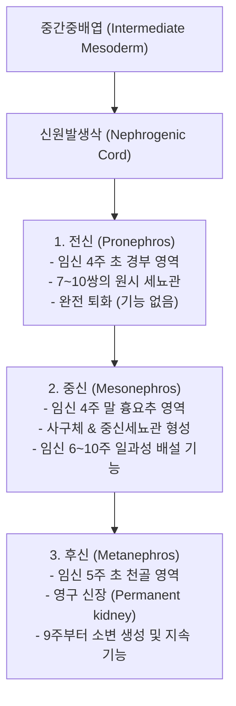
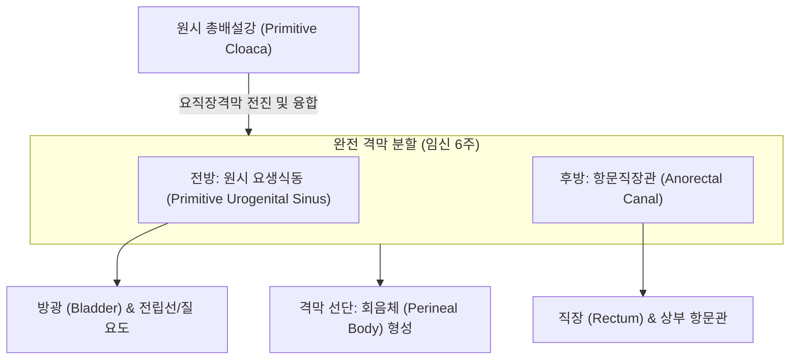
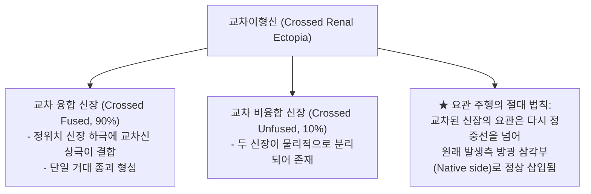
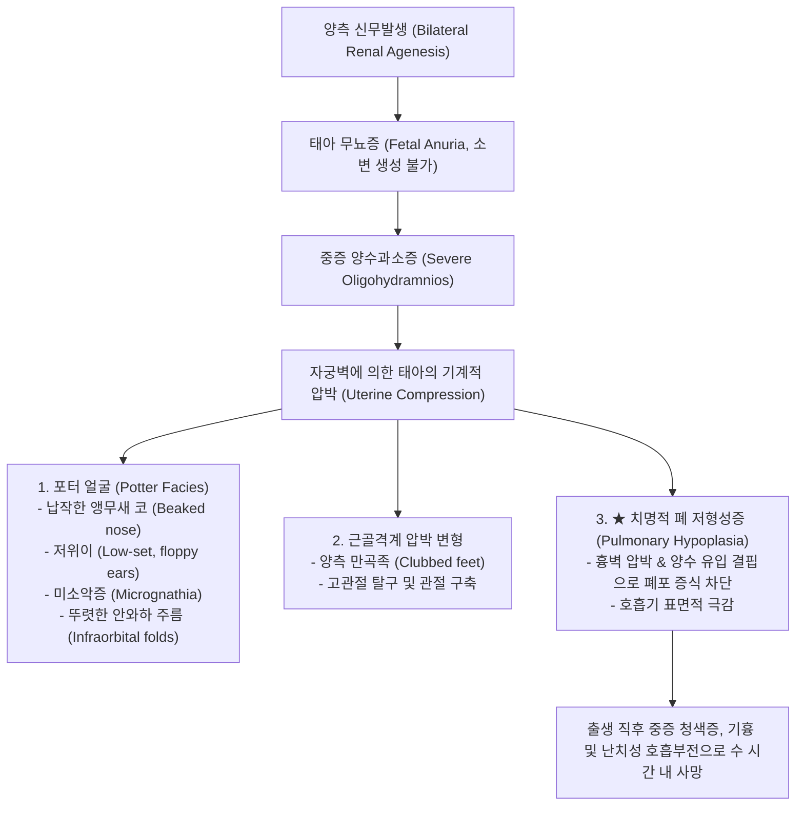
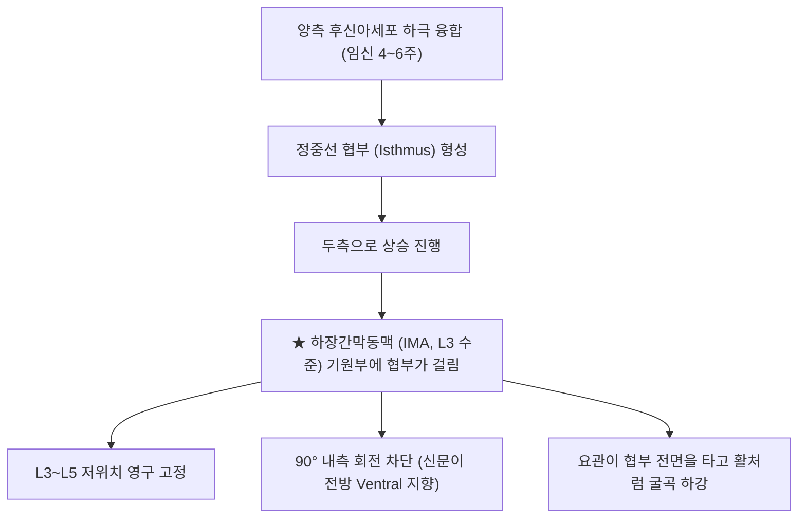
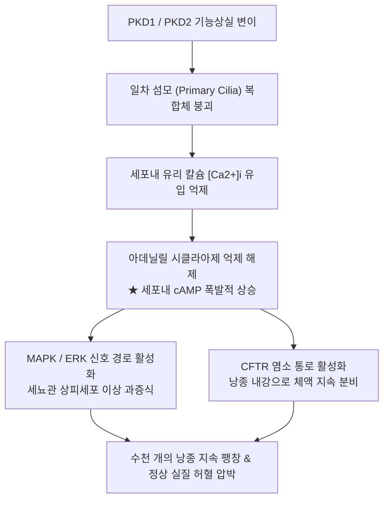

# 📑 [Netter Vol.5] Day 02: 비뇨기계 발생학 및 신장 기형 — 정상 신장·요관 발생, 위치·회전·수 이상, 융합 기형 및 유전성 낭종성 질환 (Section 2 Part 1)

> 📖 **원서 출처**: [The Netter Collection of Medical Illustrations - Volume 5, Urinary System.pdf (pp. 30-48)](https://drive.google.com/file/d/1vcvDctJJuo4vA2jKMPeSvjJjRpP1lhp2/view?usp=drivesdk)  
> 🏷️ **범위**: Section 2 전반부 (Plate 2-1 ~ Plate 2-18, 총 18개 플레이트 전수 정밀 수록, pp. 30–48)  
> 📌 **핵심 테마**: 신장 발생 3단계(전신·중신·후신) 및 후신중배엽과 요관아의 GDNF-RET 상호 유도(Reciprocal induction), 간엽-상피 전이(MET)와 S자체 신원 분화, 총배설강의 요직장격막 분할(원시 요생식동 vs 직장) 및 요관의 방광벽 통합, 신장 상승(Renal ascent)과 회전(90° 내측 회전)의 발생 기전, 신장 이소증(골반신, 흉강신, 교차이형신 융합형 90% vs 비융합형 10%), 회전 이상과 혈관 교차에 의한 수신증, 신장 수 이상(양측 신무발생과 포터 시퀀스 Potter sequence, 일측 신무발생의 보상성 비대 및 생식관 기형 동반, 과잉신), 신장 융합 기형(마유신 Horseshoe kidney의 하극 융합 및 하장간막동맥 IMA 압박 상승 제한), 신이형성(MCDK의 원시 세뇨관 및 연골 화생)과 신저형성(올리고네프로니아와 과여과 손상), 단순 신낭종의 보스니악 분류(Bosniak Classification I~IV 악성도 감별 및 수술 지침), 다낭신(ADPKD의 PKD1/PKD2 폴리시스틴 섬모병증과 cAMP 표적 톨밥탄 치료학, ARPKD의 PKHD1 피브로시스틴과 선천성 간섬유증), 수질해면신(MSK의 방추상 집합관 확장과 붓끝 소견), 그리고 소아 유전성 신부전의 대표인 신소모증(NPHP 네프로시스틴 복합체) 및 성인형 ADTKD 감별.

---

## 1. 개요 및 마스터 요약 (Executive Summary)

1. **신장 발생의 3중 시공간적 분화와 상호 유도 분자 캐스케이드 (Plates 2-1 ~ 2-2)**:
   - 신장은 중간중배엽(Intermediate mesoderm)의 신원발생삭에서 **전신(Pronephros, 4주 초 퇴화)** $\rightarrow$ **중신(Mesonephros, 4~10주 일과성 배설 및 남성 생식관 기여)** $\rightarrow$ **후신(Metanephros, 5주 기원, 영구 신장)**의 3단계를 거쳐 발달함.
   - 영구 신장은 2대 전구체의 상호 유도(Reciprocal induction)로 완성됨: 후신중배엽(Metanephric mesenchyme)의 **GDNF**가 중신관 상피의 **RET 티로신 키나아제**에 결합하여 **요관아(Ureteric bud)**를 발아시킴. 요관아는 분기 형태형성(Branching morphogenesis)을 통해 집합계(Collecting duct, 신배, 신우, 요관)를 형성하고, 후신중배엽은 간엽-상피 전이(MET)를 통해 **신소포 $\rightarrow$ 콤마형 소체 $\rightarrow$ S자형 소체**를 거쳐 신원(사구체, 보우만주머니, 근위/원위세뇨관, 헨레고리)을 완성함. 임신 9주부터 소변 생성이 시작되어 양수의 주성분을 이룸.

2. **총배설강의 분할, 요생식동의 운명 및 요관의 방광벽 흡수 (Plates 2-3 ~ 2-4)**:
   - 배아 4~6주에 요막과 후장 사이에서 전진하는 **요직장격막(Urorectal fold/septum)**이 총배설강(Cloaca)을 전방의 **원시 요생식동(Primitive urogenital sinus)**과 후방의 **직장(Rectum)**으로 완전 분할하며, 격막 선단은 회음체(Perineal body)가 됨.
   - 요생식동 방광부로 개구하던 중신관과 요관아는 방광벽으로 흡수(Exstrophy of mesonephric ducts)되면서 위치 역전이 일어남: 요관 개구부는 외외측(두측)으로 상승하고, 중신관 개구부는 내하측(전립선부 요도)으로 수렴하여 그 사이의 중배엽성 삼각판인 **방광 삼각부(Trigone)**를 형성함.

3. **신장 상승·회전 역학 및 이소성·융합 기형의 병태생리 (Plates 2-5 ~ 2-7, 2-11)**:
   - 신장은 6~9주 사이 천골 부위에서 요추(T12-L3)로 상승하며 대동맥으로부터 순차적 혈관 공급을 교체받고, 종축을 중심으로 **90° 내측 회전**하여 신문이 내측을 향함.
   - **골반신(Pelvic kidney)**은 상승 실패로 장골동맥에서 혈류를 공급받으며 회전부전과 둔상 취약성을 동반함. **교차이형신(Crossed ectopia)**은 90%에서 정위치 신장 하극과 융합(Crossed fused)함.
   - **마유신(Horseshoe kidney, 1:400~800)**: 양측 신장의 **하극(Inferior poles)이 90% 이상에서 융합**되어 협부(Isthmus)를 형성함. 상승 중 **하장간막동맥(IMA, L3)** 기원부에 걸려 L3-L5 위치에서 상승이 영구 정지됨. 협부 전방을 지나는 요관의 굴곡으로 UPJ 폐색, 요로결석, 감염이 빈발하며 윌름스 종양 및 유암종 발생 위험이 상승함.

4. **신장 수의 이상, 포터 시퀀스 및 이형성·저형성 스펙트럼 (Plates 2-8 ~ 2-10, 2-12 ~ 2-13)**:
   - **양측 신무발생(Bilateral Renal Agenesis)**은 GDNF-RET 신호 결함 등으로 요관아가 형성되지 않아 발생함. 태아 소변 결핍 $\rightarrow$ **중증 양수과소증(Oligohydramnios)** $\rightarrow$ 자궁벽 압박에 의한 **포터 시퀀스(Potter sequence: 포터 얼굴, 만곡족, 치명적 폐 저형성증)**로 출생 직후 호흡부전 사망함. 일측 신무발생은 반대측 보상성 비대로 생존하나 동측 생식관 기형 및 장기적 과여과 손상 모니터링이 필수적임.
   - **다낭성 이형성신(MCDK)**은 초기 요관 폐색으로 인해 신장 실질이 소실되고 비기능성 포도송이 낭종과 **원시 세뇨관(콜라겐 커프 둘러쌈), 화생성 연골**로 치환되는 질환으로, 대개 자연 퇴행함. **신저형성(Hypoplasia)** 중 **올리고네프로니아(Oligomeganephronia)**는 신원 수 격감과 잔존 신원의 거대 비대로 청소년기 FSGS 및 ESRD로 진행함.

5. **신장 낭종성 질환군: 단순 낭종(Bosniak)부터 유전성 섬모병증(ADPKD/ARPKD/NPHP) (Plates 2-14 ~ 2-18)**:
   - **단순 낭종**은 보스니악 분류(Bosniak I~IV)로 평가하며, I-II는 양성(치료 불필요), IIF는 추적, III(악성률 50%)과 IV(연조직 결절, 악성률 >90%)는 수술적 절제를 시행함.
   - **ADPKD(상염색체 우성 다낭신)**: *PKD1*(85%, Polycystin-1) 또는 *PKD2*(15%, Polycystin-2) 변이에 의한 일차 섬모(Primary cilia) 칼슘 신호 붕괴 $\rightarrow$ **세포내 cAMP 급증** 및 세뇨관 증식/수분 분비로 거대 다낭신 형성. **두개내 낭상동맥류(Berry aneurysm, 10-15%)** 동반 파열 주의, 치료제로 V2 수용체 길항제(Tolvaptan) 사용.
   - **ARPKD(상염색체 열성 다낭신)**: *PKHD1*(Fibrocystin) 변이로 집합관만 방사상 팽창하며 **선천성 간섬유증(Congenital hepatic fibrosis)**이 100% 동반됨.
   - **수질해면신(MSK)**은 유두부 벨리니 집합관의 방추상 확장으로 결석/신석회증 및 IVP상 "붓끝(Paintbrush)" 소견을 보이며, **신소모증(NPHP)**은 소아기 피질-수질 경계 낭종과 간질 섬유화로 다뇨, 염분 소실, 신장 크기 감소 및 조기 ESRD를 유발함.

---

## 2. 신장의 정상 발생학 및 신원 형성 (Plates 2-1 ~ 2-2)

### Plate 2-1 | 신장의 발생: 전신, 중신, 후신의 분화 (Development of Kidney: Pronephros, Mesonephros, and Metanephros)

![[Netter_V5_Plate2-1.png]]

#### 1) 배아기 신장 발생의 3단계 시간순 진화
신장과 비뇨생식계는 배아 배엽 중 **중간중배엽(Intermediate mesoderm)**에서 분화된 척추 양측의 **신원발생삭(Nephrogenic cord)**에서 기원하며, 두측(Cranial)에서 미측(Caudal)으로 3개의 순차적 기관을 형성함:



- **전신 (Pronephros)**:
  - 임신 4주 초 배아 경부(Cervical) 체절에서 7~10쌍의 세포군으로 출현.
  - 전신관(Pronephric duct)을 하방으로 뻗어 총배설강으로 연결되나, 세뇨관 구조물은 개방되지 못하고 4주 말에 흔적도 없이 완전 퇴화함. 포유류에서는 기능적 배설 능력이 전무함.
- **중신 (Mesonephros / Wolffian Body)**:
  - 전신이 퇴화하는 4주 말 상부 흉추에서 L3 수준의 요추 체절에 걸쳐 출현.
  - S자 형태의 **중신세뇨관(Mesonephric tubule)**과 그 내측 끝에 모세혈관망이 유입되어 **사구체(Glomerulus)**를 형성함. 세뇨관 외측 끝은 **중신관(Mesonephric duct / Wolffian duct)**으로 합류함.
  - **기능**: 임신 6~10주 동안 일과성으로 소변을 생성하여 배설 기능을 수행함.
  - **성별에 따른 운명**:
    - **남성**: 태아 테스토스테론의 자극으로 중신관이 영구 보존되어 **부고환(Epididymis), 정관(Vas deferens), 정낭(Seminal vesicle), 사정관(Ejaculatory duct)**으로 분화함. 일부 중신세뇨관은 정소수출관(Efferent ductules)이 됨.
    - **여성**: 안드로겐 부재로 중신관과 세뇨관이 거의 전적으로 퇴화하여 난소 근처의 흔적기관인 **난소상체(Epoöphoron), 난소방체(Paroöphoron)** 및 질벽의 **가트너관 낭종(Gartner's duct cyst)**으로만 남음.
- **후신 (Metanephros)**:
  - 임신 5주 초 천골(Sacral) 높이에서 기원하는 인체의 영구 신장(Permanent kidney).

#### 2) 상호 유도(Reciprocal Induction)의 2대 구성 요소
영구 후신은 기원이 다른 두 가지 상호 유도 조직의 정밀한 결합에 의해 형성됨:
1. **요관아 (Ureteric bud)**:
   - 중신관의 최하단(총배설강 진입 직전)에서 등쪽으로 돌출된 맹관성 게실(Outgrowth).
   - **유래 구조물 (집합계 전원)**: 요관(Ureter), 신우(Renal pelvis), 대신배(Major calyces), 소신배(Minor calyces), 집합관(Collecting ducts).
2. **후신중배엽 (Metanephric blastema / mesenchyme)**:
   - 미측 중간중배엽이 응집된 비분화 간엽 조직 덩어리.
   - **유래 구조물 (신원 전원)**: 사구체 보우만주머니(Bowman's capsule), 근위굴곡세뇨관(PCT), 헨레고리(Loop of Henle), 원위굴곡세뇨관(DCT).

#### 3) 신장 발생의 핵심 분자 신호 전달계
- **GDNF - RET 신호축**: 후신중배엽에서 분비되는 **GDNF(Glial cell line-derived neurotrophic factor)**가 중신관 상피 세포막의 수용체 티로신 키나아제인 **RET** 및 보조수용체 **GFRα1**과 결합하여 정확한 위치에서 요관아가 싹트도록 유도함. (*이 신호계에 결함이 발생하면 요관아가 생기지 않아 선천성 신무발생 Bilateral/Unilateral Renal Agenesis이 초래됨*).
- **WT1 (Wilms Tumor 1)**: 후신간엽에서 발현되어 간엽 조직이 요관아의 유도 신호에 반응할 수 있도록 수용 역량(Competence)을 부여함.

---

### Plate 2-2 | 신장의 발생: 신원의 형성 및 간엽-상피 전이 (Development of Kidney: Nephron Formation)

![[Netter_V5_Plate2-2.png]]

#### 1) 분기 형태형성 (Branching Morphogenesis)
- 요관아가 후신간엽 덩어리 내부로 침투한 후, 끝부분이 팽대부(Ampulla)를 형성함.
- 팽대부는 후신간엽의 유도를 받아 이분법적(Dichotomous)으로 반복 분지함:
  - **1차~4차 분지**: 초기 분지들이 대규모로 확장 및 융합되어 **신우(Renal pelvis)**와 **대신배(Major calyces, 2~3개)**를 형성함.
  - **다음 세대 분지들**: 소신배(Minor calyces, 8~18개)를 형성함.
  - **말초 분지들**: 신피라미드를 구성하는 수많은 **집합관(Collecting ducts)** 및 유두관(Ducts of Bellini)을 형성함.

#### 2) 간엽-상피 전이 (Mesenchymal-to-Epithelial Transition, MET)의 6단계
각 집합관 팽대부의 정점 주위에 모여 있는 후신간엽 세포(Cap mesenchyme)는 집합관의 유도 자극을 받아 극적인 상피 분화를 개시함:


1. **전세뇨관 응집체 형성**: 팽대부 주변 간엽 세포들이 Wnt4 신호에 의해 밀집됨.
2. **신소포 (Renal vesicle)**: 간엽 세포들이 상피 세포 극성(Polarity)을 획득하고 기저막을 분비하여 중심에 강(Lumen)이 있는 속이 빈 구형 소포로 변환됨 (MET의 핵심 단계).
3. **콤마형 및 S자형 소체 (Comma- & S-shaped bodies)**: 소포가 신장하면서 굴곡되어 두 개의 깊은 틈새(Cleft)를 가진 S자형 튜브로 변형됨.
4. **보우만주머니와 사구체 모세혈관망 구축**:
   - S자형 소체의 가장 아래쪽 틈새(Cleft)로 내피전구세포(Angioblasts)가 침투하여 모세혈관 고리를 형성함.
   - 틈새의 내측 상피세포는 **족세포(Visceral podocytes)**로, 외측 상피세포는 **보우만주머니 벽측 상피(Parietal epithelium)**로 분화함.
   - 주변 간엽에서 유래한 세포들이 **메산지움 세포(Mesangial cells)**를 형성함.
5. **세뇨관 분절 신장**: S자체의 중간부는 **근위세뇨관(PCT)**과 **헨레고리(Loop of Henle)**로 자라나며 수질 깊숙이 하강하고, 상부는 **원위세뇨관(DCT)**으로 분화함.
6. **집합관과의 융합(Anastomosis)**: 원위세뇨관의 끝이 요관아 가지인 집합관의 관강과 정확히 융합하여 연결됨으로써 사구체에서 여과된 원뇨가 집합관으로 연속 배출되는 완전한 관강 통로가 개통됨.

#### 3) 태아 신장의 기능 개시 및 표면 분엽 (Fetal Lobulation)
- **배설 개시**: **임신 9주**부터 신원에서 사구체 여과와 소변 생성이 본격 개시됨.
  - 태아 소변은 양막강으로 배출되어 **양수(Amniotic fluid)의 80% 이상을 구성**하게 되며, 태아가 양수를 삼키고 폐로 흡입함으로써 폐 발달과 소화관 발달을 기계적으로 자극함. (태아 체내 노폐물 제거는 신장이 아닌 태반 Placenta이 전담함).
- **태아 신장 분엽 (Fetal lobulation)**:
  - 요관아 초기 분지 주변으로 간엽 조직이 독립된 엽(Lobe) 형태로 응집되어 태아 신장 표면은 울퉁불퉁한 조약돌 형태의 분엽 구조를 띰.
  - 출생 후 세뇨관의 급속한 증식으로 고랑(Sulci)이 메워지며 생후 4~5세경 매끄러운 성인 형태로 평탄화됨.
  - 성인에서 흔적으로 잔존하는 **태아 분엽 잔존(Persistent fetal lobulation)**은 병적 상태가 아닌 정상 해부학적 변이이나, CT/초음파상 피질 반흔(Cortical scar)이나 종양으로 오인되지 않도록 주의해야 함.

---

## 3. 총배설강의 분할 및 방광·요관의 성숙 (Plates 2-3 ~ 2-4)

### Plate 2-3 | 방광 및 요관의 발생: 총배설강의 형성 (Development of Bladder and Ureter: Formation of the Cloaca)

![[Netter_V5_Plate2-3.png]]

#### 1) 배아 초기 총배설강(Cloaca)의 기하학적 형태
- **임신 4주 초**: 배아는 외배엽, 중배엽, 내배엽의 3배엽 판 구조임. 배아 미측 끝에는 중배엽이 개재되지 않고 신경판 외배엽과 난황낭 내배엽이 직접 맞닿은 **총배설강막(Cloacal membrane)**이 작은 함몰부로 관찰됨.
- **배아 접힘(Embryonic folding)**: 머리-꼬리 및 외측 접힘이 진행되면서 내배엽성 난황낭의 일부가 체내로 함입되어 원시 장관(Gut tube)을 형성함.
- **총배설강의 형성**: 원시 장관의 최하단인 **후장(Hindgut)** 말단이 맹낭 형태로 팽대되어 내배엽으로 안감된 공통 배설강인 **총배설강(Cloaca)**을 형성함.
- **연결 구조**:
  - 총배설강의 두측-전방(Cranioventral)은 연결경(Connecting stalk)을 향해 뻗은 관인 **요막(Allantois)**과 직접 연속됨.
  - 총배설강의 외측벽으로는 좌우 양측의 **중신관(Mesonephric / Wolffian ducts)**이 유입 개구함.

---

### Plate 2-4 | 총배설강의 분할, 요관의 통합 및 방광 성숙 (Septation of Cloaca, Incorporation of Ureters, and Maturation)

![[Netter_V5_Plate2-4.png]]

#### 1) 총배설강의 요직장격막 분할 동역학 (Urorectal Septation)
임신 4주에서 6주 사이에 요막과 후장 사이의 간엽성 쐐기 구조인 **요직장격막(Urorectal fold / Tourneux & Rathke fold)**이 배아의 신전과 함께 총배설강막을 향해 미측으로 능동 전진함:



- **총배설강막의 세포자멸사**: 격막이 총배설강막에 도달하여 융합된 후, 7주경 총배설강막이 아포토시스로 파괴되어 전방의 **요생식구(Urogenital orifice)**와 후방의 **항문(Anal orifice)**이 외부로 완전히 독립 개방됨.

#### 2) 원시 요생식동의 3대 구획 분화
1. **방광부 (Vesical part, 상부 및 최대 구획)**:
   - 대부분의 방광(Bladder) 실질을 형성함.
   - 꼭대기(Apex)는 요막과 연속되며 점차 좁아져 섬유성 끈인 **요막관(Urachus)**이 되고, 출생 후 폐쇄되어 **정중제삭(Median umbilical ligament)**으로 배꼽에 부착됨.
2. **골반부 (Pelvic part, 좁은 중간 구획)**:
   - **남성**: 전립선 요도(Prostatic urethra)의 하부 및 막양부 요도(Membranous urethra) 형성.
   - **여성**: 요도 전체(Entire urethra) 형성.
3. **음경/인두부 (Phallic part, 납작한 하부 구획)**:
   - 원발 결절(Genital tubercle) 아래로 뻗어 외성기 및 남성의 음경 요도(Penile urethra), 여성의 질전정(Vestibule) 형성에 기여함.

#### 3) 요관과 중신관의 방광벽 흡수 및 삼각부(Trigone) 형성
- 초기에는 요관아가 중신관의 외측 가지로 매달려 총배설강으로 진입함.
- 방광이 확장되면서 중신관의 말단부(요관아 기원부 하단)가 점진적으로 방광벽 내부로 흡수되어 펼쳐지는 외번 흡수(Exstrophy/Absorption of mesonephric ducts)가 일어남:
  - **요관 개구부의 이동**: 요관은 중신관에서 분리되어 방광벽을 독자적으로 관통하며, 방광 상피의 성장과 견인에 의해 **두측 및 외측(Superolateral)으로 이동**함.
  - **중신관 개구부의 이동**: 중신관의 개구부는 서로 근접하면서 미측 및 내측으로 하강하여 전립선 요도의 정구(Verumontanum) 근처로 수렴함.
- **방광 삼각부 (Trigone)**: 두 요관구와 내요도구 사이의 역삼각형 영역은 이처럼 중신관 조직이 흡수되어 형성되었으므로 전통적으로 **중배엽(Mesoderm)** 유래로 간주됨 (추후 주변 내배엽 상피로 대체된다는 현대적 연구가 병존함).

---

## 4. 신장 상승, 이소증 및 회전 이상 (Plates 2-5 ~ 2-7)

### Plate 2-5 | 신장의 상승 및 골반신 (Renal Ascent and Ectopia: Normal Ascent and Pelvic Kidney)

![[Netter_V5_Plate2-5.png]]

#### 1) 정상 신장 상승 (Normal Renal Ascent)의 기전
- **태생기 위치**: 임신 5~6주에 후신은 제1천추(S1) 전방, 대퇴동맥 분기부 사이의 **골반강(Pelvic cavity)** 내에 안치되어 있음.
- **상승 역학 (임신 6~9주)**:
  - 배아 미측부의 굴곡이 펴지고 요천추 골격이 급속히 신장하면서, 신장은 상대적으로 두측으로 밀려 올라가 **제12흉추(T12)~제3요추(L3)**의 후복막 척추주위구(Paravertebral gutter)에 안착함.
  - 상승 도중 부신(Suprarenal gland)과 만나 신장 상극에 모자처럼 결합함 (부신은 체벽 복강상피에서 독자 발생하므로 신장 상승과 무관하게 처음부터 상복부에 위치함).
- **혈관 리모델링 (Transient Aortic Branches)**:
  - 신장이 골반에서 복부로 상승하는 동안, 총장골동맥과 복부대동맥의 하부에서 순차적으로 분지하는 일시적 동맥 그물망(Transient branches)으로부터 혈액을 공급받음.
  - 상위 동맥 분지가 새로 형성되면 하위 동맥은 퇴화하여 사라짐. 최종적으로 L1-L2 추간판 높이의 동맥 가지 한 쌍만이 남아 영구 **주 신동맥(Main renal artery)**이 됨.
  - 만약 하위 분지가 퇴화하지 않고 영구 잔존하면 **부신동맥/하극동맥(Accessory/polar renal artery)**이 됨.

#### 2) 골반신 (Pelvic Kidney)의 병태생리 및 임상적 특징
- **빈도**: 1 : 2,200 ~ 1 : 3,000 (가장 흔한 형태의 신장 이소증 Renal ectopia).
- **발생 기전**: 태아 초기 혈관망의 퇴화 부전으로 인한 기계적 고정, 요관아의 발아 결함, 또는 요천추 골격 성장 장애로 인해 신장이 골반강에서 복부로 상승하지 못함.
- **해부학적 특징**:
  - **위치**: 천골 갑각(Sacral promontory) 전방 또는 장골와(Iliac fossa) 내부.
  - **혈관**: 복부대동맥 최하단, 총장골동맥, 또는 내·외장골동맥에서 기원하는 짧고 다발성인 동맥 공급.
  - **요관**: 길이가 매우 짧음.
  - **신문 회전**: 정상 내측 회전을 완료하지 못해 **신우와 신문이 전방(복측, Ventral)을 향함**.
- **임상 징후 및 합병증**:
  - 대다수는 평생 무증상이나, 비정상적 요관 삽입과 복측 신우로 인해 **UPJ 협착, 요정체, 요로결석, 방광요관역류(VUR)** 호발.
  - 골반강 종괴로 만져져 부인과 난소 종양이나 골반 농양으로 오진될 수 있음.

> ⚠️ **Clinical Pearl: 골반신(Pelvic Kidney) 환자의 외상 취약성 및 분만 시 주의점**  
> 정상 위치의 신장은 제11·12늑골의 골격과 두터운 신주위지방(Gerota 근막 구획)에 의해 후방 충격으로부터 완벽히 보호됩니다. 반면 골반신은 골격성 보호막이 전혀 없고 전복벽 및 좁은 골반 골륜에 노출되어 있어, 경미한 하복부 둔상(교통사고, 안전벨트 손상, 접촉 스포츠)에도 신파열 및 대량 후복막 혈종이 발생할 위험이 극도로 높습니다. 또한 가임기 여성에서는 임신 자궁에 의한 요관 압박으로 급성 수신증이 빈발하고, 자연 분만 시 태아 하강을 물리적으로 방해하는 산도 폐쇄성 종괴(Dystocia)로 작용할 수 있습니다.

---

### Plate 2-6 | 흉강신 및 교차이형신 (Renal Ascent and Ectopia: Thoracic and Crossed Ectopic Kidney)

![[Netter_V5_Plate2-6.png]]

#### 1) 흉강신 (Thoracic Kidney)
- **빈도**: 1 : 13,000 (신장 이소증 중 가장 드묾). 남성 호발, **좌측이 80% 이상** (우측은 간 우엽이 과도한 상승을 물리적으로 차단).
- **발생 기전**: 횡격막의 요륵삼각(Lumbocostal trigone / Foramen of Bochdalek) 폐쇄 지연, 또는 가속화된 비정상적 과상승.
- **해부학적 특징**:
  - 흉부 X-선상 하흉부 후종격동 종괴로 관찰됨.
  - 신장은 횡격막의 얇은 섬유막에 둘러싸여 흉강으로 돌출하므로 엄밀히 **흉막강 외(Extrapleural)**에 위치함 (기흉 위험 없음). 인접 폐 기저부의 경미한 저형성증을 동반할 수 있음.
  - 혈관은 상부 흉대동맥이나 고위 복대동맥에서 분지하며, 요관은 비정상적으로 길지만 방광 삼각부의 정상 위치로 개구함. 회전은 대개 정상 완결되어 신문이 내측을 향함.
- **임상 경과**: 대부분 완벽한 무증상이며 신기능이 정상 유지되므로 수술적 복위는 불필요함. 폐 종양(폐암)으로 오인한 불필요한 개흉 생검을 피하는 것이 핵심임.

#### 2) 교차이형신 (Crossed Renal Ectopia)
한쪽 신장이 발생 과정에서 정중선을 가로질러 반대측으로 넘어가 위치하는 기형 (좌측 신장이 우측으로 넘어가는 경우가 3배 흔함):



- **융합형 (90%)**: 상하로 배치되며, 상부에 위치한 정위치 신장의 하극과 하부에 위치한 교차 신장의 상극이 실질적으로 융합됨.
- **혈관 변이**: 복부대동맥 하부나 장골동맥에서 복잡한 분지를 수용함.
- **요관의 주행**: 교차된 이소성 신장의 요관은 골반강으로 내려오면서 **다시 정중선을 가로질러 원래의 태생기 개구부(Native trigone)**로 삽입됨.

---

### Plate 2-7 | 신장의 정상 회전 및 회전이상 (Renal Rotation and Malrotation)

![[Netter_V5_Plate2-7.png]]

#### 1) 정상 내측 회전 (Normal Medial Rotation, 90°)
- 배아 6주 골반강 내 후신의 신문(Hilum)과 신우는 **전방(Ventral/Anterior)**을 향하고 있음.
- 6주에서 9주 사이 신장이 복부로 상승함과 동시에, 종축을 중심으로 **내측으로 90° 회전(Medial rotation)**함.
- 결과적으로 성인 정상 신장의 신문과 신우는 **내측(Medial)**을 향하고, 볼록한 외측연은 외측 후방을 향하게 됨.

#### 2) 회전이상 (Malrotation)의 4대 분류 및 형태학

| 회전이상 유형 | 기전 및 신문(Hilum)의 지향 방향 | 형태학적 특징 및 혈관 관계 |
| :--- | :--- | :--- |
| **무회전 (Nonrotation)** | 90° 내측 회전 불완전 $\rightarrow$ **신문이 전방(복측)을 향함** | 가장 흔한 형태. 이소성 신장(골반신) 및 마유신에서 기본적으로 동반됨. 요관이 전면으로 직접 하강. |
| **불완전 회전 (Incomplete rotation)** | 45° 미만 부분 회전 $\rightarrow$ **신문이 전내측(Ventromedial)을 향함** | 신우가 완전히 안쪽으로 숨지 못하고 전내측으로 노출됨. |
| **역회전 (Reverse rotation)** | 외측으로 90° 이상 역회전 $\rightarrow$ **신문이 외측(Lateral)을 향함** | 신우가 외측연에 위치하고 요관이 신장 외측을 감싸며 주행. 신혈관이 신장 전면을 길게 가로지름. |
| **과회전 (Excessive rotation)** | 180° 과도 회전 $\rightarrow$ **신문이 후방(Dorsal) 또는 후외측을 향함** | 신혈관이 신장 실질을 나선형으로 휘감으며 신우로 진입함. |
* **무회전 (Nonrotation) 부연**: 90° 내측 회전이 완전히 일어나지 않음 $\rightarrow$ **신문이 전방(복측, Ventral)을 향함**.

#### 3) 회전이상의 임상적 위험: 혈관 압박 및 수신증
- 비정상적으로 위치한 신우(특히 복측 신우) 위를 신동맥이나 비정상 분절 혈관이 가로지르면서 신우요관이행부(UPJ)를 외인성으로 압박함.
- 신우 출구 폐색으로 인한 **수신증(Hydronephrosis), 뇨 정체, 신산통, 재발성 요로결석** 유발.

---

## 5. 신장 수의 선천 기형 및 포터 증후군 (Plates 2-8 ~ 2-10)

### Plate 2-8 | 양측 신무발생 및 포터 시퀀스 (Bilateral Renal Agenesis & Potter Sequence)

![[Netter_V5_Plate2-8.png]]

#### 1) 발생 기전 및 분자유전학
- **빈도**: 1 : 5,000 ~ 1 : 10,000 출생. **남포아(남성)에서 2~3배 호발**.
- **원인**: 요관아가 아예 발아하지 못하거나, 조기에 분열을 멈추어 후신간엽(Metanephric blastema)과 접촉하지 못함. 상호 유도가 차단되어 영구 신장 실질과 요관이 전혀 발생하지 못함.
- **분자 이상**: **GDNF-RET**, **WT1**, **PAX2**, **WNT4**, **FGF20** 유전자 돌연변이 및 염색체 이상.

#### 2) 포터 시퀀스 (Potter Sequence)의 연쇄적 병태생리
포터 증후군은 단일 원발 기형(신무발생)이 초래하는 치명적인 도미노식 연쇄 반응(Sequence)임:



> ⚠️ **Clinical Pearl: 양수과소증과 폐 저형성증의 인과 메커니즘**  
> 태아의 정상 폐 발달(특히 소관기~낭포기)에는 두 가지 필수 조건이 있습니다: ① 태아가 스스로 양수를 호흡하듯 폐포 내로 들이마셔 폐포 내강의 물리적 팽창압(Intraluminal distending pressure)을 유지하는 것, ② 양수 내 함유된 프롤린, 상피성장인자 등 성장 인자가 폐포 상피에 접촉하는 것입니다. 양측 신무발생 환아는 양수가 거의 없으므로 흉벽이 외부에서 눌릴 뿐 아니라 폐포 내부 압력이 붕괴되어 폐포 형성(Alveolarization)이 전면 정지됩니다. 따라서 사구체 여과 기능 상실 자체가 아니라 **폐 저형성증에 의한 질식성 호흡부전**이 출생 직후 사망의 직접 원인입니다.

---

### Plate 2-9 | 일측 신무발생 (Unilateral Renal Agenesis)

![[Netter_V5_Plate2-9.png]]

#### 1) 역학 및 임상적 경과
- **빈도**: 약 1 : 1,000 (양측 신무발생보다 5~10배 흔함). 좌측 신장의 결손 빈도가 약간 더 높음.
- **보상성 비대 (Compensatory Hypertrophy)**:
  - 반대측 단독 정상 신장이 태생기부터 신원 세포 증식 및 출생 후 비대를 일으킴.
  - 단일 신장의 부피와 무게가 정상의 1.5~1.8배까지 커지며, 정상 양측 신장 총 GFR의 **80~90%**에 달하는 신기능을 단독으로 수행함.
  - 환자의 대다수는 평생 아무런 신장 증상 없이 정상 수명을 영위하며, 복부 초음파나 CT에서 우연히 발견됨.

#### 2) 동반 비뇨생식기 기형 (성별 특이적 연관성)
중신관(Wolffian duct) 또는 부중신관(Müllerian duct)의 발생 결함이 동반되어 발생함:
- **남성 (10~15% 동반)**:
  - 동측의 **정관 무발생(Absence of vas deferens), 부고환 무발생, 정낭 무발생 또는 정낭 낭종(Zinner syndrome)**.
- **여성 (25~30% 동반)**:
  - 뮐러관 유합 및 발달 장애: **쌍각자궁(Bicornuate uterus), 단각자궁, 중복자궁(Uterus didelphys)**, 동측 질 폐쇄 및 신무발생을 동반하는 **Herlyn-Werner-Wunderlich (HWW) 증후군**, 또는 **MRKH 증후군**.

#### 3) 장기적 임상 관리
- 단일 신장의 평생 과여과(Glomerular hyperfiltration) 상태로 인해 30~40대 이후 **미세알부민뇨, 고혈압, 이차성 국소분절사구체경화증(Secondary FSGS)** 위험이 일반인보다 상승함.
- 정기적인 혈압 측정, 24시간 단백뇨/알부민뇨 정량 검사, 그리고 단일 신장을 외상으로부터 보호하기 위한 격렬한 접촉 스포츠 제한 권고.

---

### Plate 2-10 | 과잉신 (Supernumerary Kidney)

![[Netter_V5_Plate2-10.png]]

#### 1) 정의 및 감별 진단
- **정의**: 인체에 3개(드물게 4개)의 완전히 독립된 신장 실질이 존재하는 극히 희귀한 선천 기형 (의학 문헌상 100례 미만 보고).
- **중복신(Duplex Kidney)과의 절대적 감별**:
  - **중복신 (Duplex kidney)**: 단일 신장 실질 덩어리 내에 상부/하부 2개의 독립된 신우요관 수집계가 존재하는 기형 (매우 흔함, 1%).
  - **과잉신 (Supernumerary kidney)**: 정상 신장과 물리적으로 완전히 분리된 **자체 섬유피막(Capsule), 독자적 동정맥 혈액 공급, 독자적 요관 수집계**를 가진 별개의 장기임.

#### 2) 해부학적 특성 및 임상 발현
- **호발 위치**: 좌측, 정상 신장의 하방(미측) 또는 골반강 내에 위치함. 크기는 정상 신장보다 현저히 작음.
- **요관 연결**: 과잉신의 요관은 정상 신장의 요관과 Y자 형태로 합류하거나, 방광 삼각부에 독립 개구, 혹은 질/요도로 이소성 개구(Ectopic ureter)함.
- **합병증**: 크기가 작고 조직학적으로 이형성(Dysplastic) 변화를 동반하는 경우가 많아 요정체, 신우신염, 결석, 신혈관성 고혈압의 온상이 될 수 있음.

---

## 6. 신장 융합 기형: 마유신 및 기타 융합 (Plate 2-11)

### Plate 2-11 | 신장 융합: 마유신 및 원반신 (Renal Fusion: Horseshoe Kidney & Cake Kidney)

![[Netter_V5_Plate2-11.png]]

#### 1) 마유신 (Horseshoe Kidney)의 발생학적 기전
- **빈도**: 1 : 400 ~ 1 : 800 (가장 흔한 신장 융합 기형). **남성에서 2배 호발**.
- **발생 기전**: 배아 4~6주 골반강 내에서 양측 후신원기(Metanephric blastemas)가 척추 전방 정중선에서 비정상적으로 접촉하여 실질적 유합(Parenchymal fusion)을 형성함.
- **협부 (Isthmus) 형성**:
  - **90% 이상에서 양측 신장의 하극(Inferior poles)이 융합**됨. (상극 융합은 5~10% 미만).
  - 협부는 순수한 기능성 신장 실질(Parenchyma)로 이루어지거나 단순 섬유성 띠(Fibrous band)로 구성됨.

#### 2) 마유신의 해부학적 특징과 상승 정지 역학
1. **상승 정지 (Arrest of Ascent)**:
   - 융합된 신장이 골반에서 복부로 상승하던 중, 하극을 연결하는 협부가 복부대동맥의 전방 분지인 **하장간막동맥 (Inferior Mesenteric Artery, IMA, L3 높이)**의 기원부 뿌리에 물리적으로 걸림.
   - 이로 인해 신장은 정상 위치(T12-L1)까지 올라가지 못하고 **제3~5요추(L3-L5) 추체 전방**의 낮은 위치에 영구 정지됨.
2. **신문 회전 부전**:
   - 하극이 고정되어 내측 회전이 불가능하므로, 양측 신문과 신우가 **완전히 전방(Ventral)**을 향함.
3. **요관 주행**:
   - 요관은 협부의 전면을 타고 넘어가 활 모양으로 굴곡되며 하강함 (UPJ 부위 꺾임 및 외인성 압박).
4. **혈액 공급의 복잡성**:
   - 상극은 주 신동맥에서 혈류를 받으나, 하극과 협부는 복부대동맥 하부, 하장간막동맥, 총장골동맥, 정중천골동맥 등에서 기원하는 수많은 변이 동맥들의 공급을 받음 (수술적 절제 시 대량 출혈 위험).



#### 3) 동반 증후군 및 임상적 합병증
- **유전 증후군 동반**: **터너 증후군 (Turner syndrome, 45,XO)** 환자의 15~20%, **18번 삼염색체증 (Edwards syndrome)**, 다운 증후군 환자에서 호발.
- **임상 3대 합병증**:
  1. **요로 폐색 및 수신증 (UPJ Obstruction)**: 요관이 협부를 넘어가며 눌리거나 고위 삽입되어 발생.
  2. **요로결석 (Nephrolithiasis)**: 환자의 20~30%에서 발생 (요정체 및 감염성 산호상 결석 Staghorn calculi).
  3. **재발성 요로감염 및 신우신염**.
- **종양 위험**: 정상인 대비 **윌름스 종양 (Wilms tumor)** 발생률 2~4배 증가, 협부 실질에서 유래하는 **유암종 (Carcinoid tumor)** 위험 유의미하게 상승.

#### 4) 기타 융합 기형: 원반신 (Pancake / Cake Kidney)
- 양측 신장이 상극, 중앙, 하극 전면에 걸쳐 광범위하게 융합되어 골반강 내에 하나의 둥근 디스크 형태로 안치된 기형.
- 두 개의 독립된 요관이 방광으로 진입하나 요로 폐색 및 감염 위험이 극도로 높음.

---

## 7. 신이형성, 저형성 및 단순 낭종 (Plates 2-12 ~ 2-14)

### Plate 2-12 | 신이형성 및 다낭성 이형성신 (Renal Dysplasia & Multicystic Dysplastic Kidney, MCDK)

![[Netter_V5_Plate2-12.png]]

#### 1) 신이형성 (Renal Dysplasia)의 개념 및 병리조직학적 특징
- **개념**: 신장 실질의 발생 분화가 정지되고 비정상적인 구조 조직화(Disorganization)가 일어난 상태.
- **병리조직학적 2대 진단 기준 (Pathognomonic Hallmarks)**:
  1. **원시 세뇨관 (Primitive / Metaplastic ducts)**: 미성숙 원주/입방 상피로 덮여 있으며, 주변을 동심원상으로 감싸는 두터운 **섬유근성 결합조직 커프 (Fibromuscular cuffs)**에 둘러싸여 있음.
  2. **화생성 연골 (Metaplastic cartilage islands)**: 신장 간엽 세포가 골격 연골 조직으로 잘못 화생 분화된 연골 섬.

#### 2) 다낭성 이형성신 (Multicystic Dysplastic Kidney, MCDK)
- **역학**: 소아 복부 종괴의 가장 흔한 원인 중 하나 (빈도 1 : 4,300 출생).
- **병태생리**: 임신 8~10주 이전(신원 유도 초기)에 발생한 **치명적인 요관 폐색/폐쇄(Atresia)** 또는 요관아의 심각한 분기 장애로 인해 초래됨.
- **육안 소견**: 정상 신장의 외형과 피질-수질 경계가 완전히 파괴됨. 얇은 섬유성 결합조직에 의해 연결된 **다양한 크기의 비연통성 낭종들이 포도송이(Cluster of grapes)**처럼 모여 있음.
- **기능**: 동측 신장의 사구체 여과 기능은 **0% (완전 무기능 Non-functioning)**이며, 요관은 대개 실 모양으로 막혀 있음(Ureteral atresia).
- **예후 및 관리**:
  - 대부분의 MCDK는 유아기를 거치며 점진적으로 **자발적 퇴행(Involution) 및 위축 소멸**함.
  - **반대측 신장 감시 필수**: 환자의 20~30%에서 반대측 정상 위치 신장에 **방광요관역류(VUR)** 또는 UPJ 협착이 동반되므로 반대측 신장의 보상성 비대와 수신증 여부를 초음파로 추적해야 함.

---

### Plate 2-13 | 신저형성 (Renal Hypoplasia)

![[Netter_V5_Plate2-13.png]]

#### 1) 정의 및 신이형성과의 감별
- **정의**: 신장 조직의 구조적·조직학적 형태(사구체, 세뇨관)는 완전히 정상이나, **신원(Nephron)의 총 개수가 선천적으로 현저히 부족**하여 신장의 크기와 무게가 해당 연령 정상치보다 2 표준편차(-2 SD) 이상 작은 상태.
- **감별**: 원시 세뇨관이나 연골 화생이 존재하는 **신이형성(Dysplasia)**이나, 후천적 허혈/감염으로 쪼그라든 **위축신(Atrophic kidney)**과 달리 순수한 세포 수 부족 상태임.

#### 2) 아형 분류
1. **진성 저형성증 (True / Simple Hypoplasia)**:
   - 신피라미드(Calyces/Pyramids) 수가 정상(8~18개)의 절반 이하인 **5개 이하**로 감소되어 있음.
   - 단측성일 경우 대개 무증상.
2. **올리고네프로니아 (Oligomeganephronia)**:
   - 신원(Nephron)의 총 개수가 정상의 20% 이하로 극단적으로 결손되어 있음.
   - 잔존하는 소수의 신원이 보상성으로 극대화되어 사구체 직경이 정상의 2~3배에 달하고 세뇨관이 거대하게 확장됨 (**Hypertrophied giant nephrons**).
   - **임상 경과**: 영유아기에는 정상 소변 배출을 유지하나, 성장하면서 신체 대사 요구량을 감당하지 못해 사구체 과여과 손상(Glomerular hyperfiltration injury) $\rightarrow$ 사구체 경화(FSGS) $\rightarrow$ 소아기/청소년기 **단백뇨, 신성 고혈압, 만성 신부전(ESRD)**으로 진행함.

---

### Plate 2-14 | 단순 신낭종 및 보스니악 분류 (Simple Renal Cysts & Bosniak Classification)

![[Netter_V5_Plate2-14.png]]

#### 1) 단순 신낭종 (Simple Renal Cysts)
- 성인 신장 낭종 중 가장 흔함 (50세 이상 인구의 50% 이상에서 보유).
- 주로 피질에 위치하며, 단층 편평상피로 덮인 얇은 벽 내부에 투명한 장액성 호박색 체액을 함유함.
- **초음파 3대 양성 진단 기준**:
  1. 무에코성 내부 (Anechoic)
  2. 얇고 매끄러운 낭종 벽 (Thin, smooth sharply defined wall)
  3. 낭종 후방 음영 증강 (Posterior acoustic enhancement)

#### 2) 보스니악 낭종 분류 체계 (Bosniak Classification, CT 기반)
낭종성 병변의 악성(낭종성 신세포암 Cystic RCC) 위험도를 계층화하여 수술 여부를 결정하는 핵심 외과적 가이드라인:

| Bosniak 등급 | 조영증강 CT 영상학적 특징 | 악성 종양 위험도 | 표준 임상 권고안 |
| :--- | :--- | :--- | :--- |
| **Category I** | 단순 양성 낭종: 얇은 벽, 격막(Septa) 없음, 석회화 없음, **조영증강 없음** | **< 1%** (완전 양성) | **치료 및 추적 관찰 불필요** |
| **Category II** | 최소 복합 낭종(얇은 격막 1~2개, 미세 선상 석회화, 3cm 미만 고음영), **조영증강 없음** | **< 1%** (양성) | **치료 및 추적 관찰 불필요** |
| **Category IIF** *(Follow-up)* | 다발성 얇은 격막, 결절성 석회화, 3cm 이상 고음영, **인지 가능한 유의한 조영증강 없음** | **약 5 ~ 10%** | **정기적 CT/MRI 추적 관찰**<br>(6개월, 12개월 후 매년) |
| **Category III** | 불확정 복합 낭종: 두껍고 불규칙한 벽/격막, **측정 가능한 조영증강** | **약 50 ~ 60%** | **외과적 부분신절제술(Partial Nephrectomy)** 또는 적극적 절제 |
| **Category IV** | 명백한 낭종성 악성 종양: 벽/격막 **조영증강 연조직 결절** | **> 90%** (대부분 낭종성 신세포암) | **근치적 또는 부분 신절제술 (Surgical Resection)** |

* **Category II (최소 복합 낭종)**: 얇은 **모발상 격막(Hairline thin, 1~2개)**, 3cm 미만 고음영 **낭종**.
* **Category IIF (Follow-up)**: 격막/벽의 경미한 비후 동반.
* **Category III**: **명확하게 측정되는 유의미한 조영증강 (Measurable enhancement)**.
* **Category IV**: 벽이나 격막에 **조영증강되는 연조직 결절 (Enhancing soft tissue components/nodules)** 존재.

---

## 8. 다낭성 신질환: ADPKD vs ARPKD (Plates 2-15 ~ 2-16)

### Plate 2-15 | 상염색체 우성 다낭신: 육안 및 병태생리 (Autosomal Dominant Polycystic Kidney Disease, ADPKD: Gross Pathology)

![[Netter_V5_Plate2-15.png]]

#### 1) 분자유전학 및 일차 섬모병증 (Ciliopathy) 기전
- **역학**: 유병률 1 : 400 ~ 1 : 1,000. 말기신부전(ESRD) 원인의 5~10% 차지. 100%에 가까운 유전 침투율.
- **원인 유전자**:
  - **PKD1 (염색체 16p13.3, 85%)**: **Polycystin-1 (PC1)** 코딩. 대형 막관통 단백질로 세포-세포/세포-기질 상호작용 및 기계적 수용체 역할. 발병 연령이 빠르고 ESRD 도달이 빠름 (평균 54세).
  - **PKD2 (염색체 4q21, 15%)**: **Polycystin-2 (PC2)** 코딩. 칼슘 투과성 비선택적 양이온 통로(TRPP2). 임상 경과가 완만함 (평균 ESRD 74세).
- **분자 병태생리 (cAMP 가설)**:



#### 2) 육안 병리 소견
- 양측 신장이 거대하게 팽창하여 성인 정상 신장 무게($150\text{ g}$)의 20~30배인 **$2\sim 4\text{ kg}$ 이상으로 거대화**됨.
- 신장 피질과 수질 전층이 정상 실질을 찾아볼 수 없을 정도로 **수천 개의 낭종($0.1\sim 수\text{ cm}$)**으로 치환됨.
- 낭종 내부는 투명한 액체, 갈색의 오래된 혈액, 또는 감염성 농양으로 채워져 있음.

#### 3) 신외(Extrarenal) 침범 장기 및 합병증
- **간 낭종 (Polycystic Liver Disease, 70~80%)**: 가장 흔한 신외 합병증 (간기능은 대개 보존됨).
- **두개내 낭상동맥류 (Berry Aneurysm of Circle of Willis, 10~15%)**: 파열 시 치명적인 **거미막하출혈(SAH)**을 유발하므로 가족력이 있는 환자에서 뇌 MRA 선별검사 필수.
- **심혈관계**: 승모판 탈출증(Mitral Valve Prolapse, 25%), 대동맥근부 확장, 대동맥 박리.
- **소화기계**: 결장 게실증(Colonic diverticulosis), 서혜부 탈장.

> ⚠️ **Clinical Pearl: ADPKD의 질환 조절 표적 치료제 - 톨밥탄 (Tolvaptan)**  
> 과거 ADPKD는 단순 혈압 조절(ACEi/ARB) 외에 근본적 치료제가 없었습니다. 그러나 분자생물학적으로 바소프레신(Vasopressin)이 집합관 $V_2$ 수용체를 자극하여 아데닐릴 시클라아제를 활성화하고 **세포내 cAMP를 증가시키는 것이 낭종 증식의 핵심 엔진**임이 규명되었습니다. 경구용 선택적 **바소프레신 $V_2$ 수용체 길항제인 톨밥탄(Tolvaptan)**은 cAMP 생성을 직접 차단하여 총 신장 부피(TKV) 팽창 속도를 50% 늦추고 eGFR 감소율을 유의미하게 지연시키는 최초의 질환 조절 약제로 확립되었습니다. (극심한 수채이뇨로 인한 고나트륨혈증 및 간독성 모니터링 필요).

---

### Plate 2-16 | 다낭신의 방사선 소견 및 ARPKD 비교 (PKD Imaging & ARPKD Comparison)

![[Netter_V5_Plate2-16.png]]

#### 1) ADPKD vs ARPKD 마스터 비교 대조

| 비교 항목 | 상염색체 우성 다낭신 (ADPKD) | 상염색체 열성 다낭신 (ARPKD) |
| :--- | :--- | :--- |
| **유전 양식 & 유전자** | **상염색체 우성(AD)**<br>*PKD1*(16p, 85%), *PKD2*(4q, 15%) | **상염색체 열성(AR)**<br>*PKHD1*(6p12, 100%), Fibrocystin 코딩 |
| **발병 연령** | **성인기** (30~50대 증상 발현) | **출생 전~신생아기 / 영아기** |
| **낭종의 조직학적 기원** | **네프론 전 구획** (사구체, PCT, 헨레, DCT, 집합관) | **집합관 (Collecting ducts)에만 100% 국한** |
| **신장 형태 및 육안** | 비대칭적 거대 낭종들로 외형 완전 파괴, 울퉁불퉁함 | 신장이 대칭적으로 거대화되나 **정상 신장 윤곽 유지** |
| **단면 소견** | 다양한 크기의 구형 낭종 집합체 | 피질에서 유두부로 방사상 뻗은 **원주상 확장 세관 ("스펀지/해면" 양상)** |
| **간 병변** | 양성 간 낭종 (70~80%, 간섬유증 없음) | **선천성 간섬유증 (100% 동반)** + 담관판 기형 |
| **주요 임상 증상** | 측복통, 혈뇨, 고혈압, 뇌동맥류 파열 | 신생아 포터 시퀀스, 호흡부전, 소아기 **문맥고혈압/비종대** |

---

## 9. 수질 낭종성 질환군: MSK, 신소모증 및 ADTKD (Plates 2-17 ~ 2-18)

### Plate 2-17 | 수질해면신 (Medullary Sponge Kidney, MSK)

![[Netter_V5_Plate2-17.png]]

#### 1) 병태생리 및 해부학적 병변
- **정의**: 하나 이상의 신피라미드 내부 **수질 집합관(Ducts of Bellini)이 비염증성으로 방추상(Fusiform) 또는 낭포상(Cystic)으로 확장**되는 선천성 형성장애 질환.
- **역학**: 일반 인구의 1 : 5,000, 요로결석 환자의 12~20%에서 확인됨. 대개 산발성(Sporadic)으로 발생.
- **병태생리**:
  - 확장된 집합관 내에서 소변의 층류가 정체(Urinary stasis)됨.
  - 원위세뇨관의 산성화 결함과 함께 **고칼슘뇨증(Hypercalciuria)** 및 저구연산뇨증(Hypocitraturia)이 동반됨.
  - 정체된 확장 세관 내강에 인산칼슘(Apatite) 및 수산칼슘 결정이 침착되어 수많은 **신석회증(Nephrocalcinosis)**과 요로결석을 형성함.

#### 2) 방사선학적 특징 (IVP 및 조영 CT 배설기)
- 단순 복부 X-선(KUB)상 신피라미드 부위에 꽃잎처럼 무리지어 있는 다발성 결석 음영 확인.
- 경정맥 신우조영술(IVP)에서 확장된 벨리니 관 내부로 조영제가 스며들며 나타나는 특징적 징후:
  - **"꽃다발 양상 (Bouquet of flowers)"**
  - **"붓끝 모양 (Paintbrush appearance)"**

#### 3) 임상 경과 및 치료
- 사구체 여과율은 정상으로 유지되어 말기신부전으로 진행하지 않는 **양성 질환**임.
- 주요 합병증: 반복적인 요로결석 산통, 혈뇨, 이차성 신우신염.
- 치료: 충분한 수분 섭취, 결석 예방을 위한 구연산칼륨(Potassium citrate) 투여, 티아지드(Thiazide) 이뇨제를 통한 뇨중 칼슘 배설 억제.

---

### Plate 2-18 | 신소모증 및 수질낭종 질환군 (Nephronophthisis / Medullary Cystic Kidney Disease Complex)

![[Netter_V5_Plate2-18.png]]

#### 1) 신소모증 (Nephronophthisis, NPHP)의 소아 병태생리
- **유전**: **상염색체 열성 (AR)**. 가장 흔한 원인은 **NPHP1 (염색체 2q13)** 결손으로 섬모 단백질인 **Nephrocystin-1**의 기능 상실 (일차 섬모병증).
- **역학**: **소아 및 청소년기 유전성 말기신부전(ESRD)의 가장 흔한 단일 원인** 질환.
- **조직학적 삼징 (Histologic Triad)**:
  1. 세뇨관 기저막의 불규칙한 비후 및 파괴 (Thickened/attenuated TBM)
  2. 광범위한 세뇨관 위축 및 간질성 섬유화 (Tubulointerstitial nephritis)
  3. **피질-수질 경계부(Corticomedullary junction)**에 국한된 작은 미세 낭종들 ($0.1\sim 1\text{ cm}$)
- **신장 크기**: ADPKD와 달리 **신장의 크기가 정상보다 작거나 위축(Small to normal sized kidneys)**되어 있음.
- **임상 징후**: 유아기~학령기 소변 농축능 상실로 인한 **다뇨(Polyuria), 번갈(Polydipsia), 야뇨증(Enuresis)**, 신성 염분 소실(Salt wasting), 원인 불명의 정구성 빈혈, 성장 장애. 평균 13세경 ESRD 도달.
- **동반 증후군**: 망막색소변성증 동반 시 **시니어-뢰켄 증후군 (Senior-Løken syndrome)**, 소뇌충부 결손 시 **주베르 증후군 (Joubert syndrome)**.

#### 2) 상염색체 우성 세뇨관간질 신질환 (ADTKD / 구 Medullary Cystic Kidney Disease)
- **유전**: **상염색체 우성 (AD)**. *UMOD*(Uromodulin), *MUC1*(Mucin-1), *REN*(Renin) 돌연변이.
- **발병 연령**: **성인기** (30~50대에 서서히 진행하는 신부전).
- **특징적 임상 표지자**: **조기 중증 고요산혈증 (Hyperuricemia) 및 청년기 통풍 (Gout)**. 신소모증과 유사하게 피질수질 낭종과 간질 섬유화를 보이나 성인에서 우성 유전하는 점이 결정적 차이임.

---

## 10. 원서 도판 추출용 파이썬 스크립트 (Plates 2-1 ~ 2-18)

Obsidian 노트의 이미지 임베드(`![[Netter_V5_Plate2-X.png]]`)와 1:1 매칭되는 도판 이미지를 원본 PDF에서 정밀 추출하기 위한 로컬 실행용 Python 코드입니다.

```python
import fitz  # PyMuPDF
import os

# 1. 파일 경로 및 저장 디렉토리 설정
pdf_path = "The Netter Collection of Medical Illustrations - Volume 5, Urinary System.pdf"
output_dir = "헤르메스/책 읽기/Netter_Vol5_비뇨기계/첨부파일"
os.makedirs(output_dir, exist_ok=True)

# 2. Section 2 Part 1 도판별 PDF 페이지 매핑 (Plates 2-1 ~ 2-18)
# 주: PDF 뷰어 기준 실제 페이지 번호 (원서 pp. 30~47에 해당)
plate_page_mapping = {
    "Plate2-1": 54,   # Development of Kidney
    "Plate2-2": 55,   # Development of Kidney: Nephron Formation
    "Plate2-3": 56,   # Development of Bladder and Ureter: Formation of the Cloaca
    "Plate2-4": 57,   # Septation, Incorporation of Ureters, and Maturation
    "Plate2-5": 58,   # Normal Renal Ascent and Pelvic Kidney
    "Plate2-6": 59,   # Thoracic and Crossed Ectopic Kidney
    "Plate2-7": 60,   # Renal Rotation and Malrotation
    "Plate2-8": 61,   # Bilateral Renal Agenesis & Potter Facies
    "Plate2-9": 62,   # Unilateral Renal Agenesis
    "Plate2-10": 63,  # Supernumerary Kidney
    "Plate2-11": 64,  # Renal Fusion (Horseshoe Kidney)
    "Plate2-12": 65,  # Renal Dysplasia (MCDK)
    "Plate2-13": 66,  # Renal Hypoplasia
    "Plate2-14": 67,  # Simple Cysts & Bosniak Classification
    "Plate2-15": 68,  # ADPKD: Gross Appearance & Genetics
    "Plate2-16": 69,  # PKD Radiographic Findings & ARPKD
    "Plate2-17": 70,  # Medullary Sponge Kidney (MSK)
    "Plate2-18": 71,  # Nephronophthisis / MCKD Complex
}

doc = fitz.open(pdf_path)
zoom = 300 / 72  # 300 DPI 초고해상도 렌더링
matrix = fitz.Matrix(zoom, zoom)

print(f"[*] 총 {len(plate_page_mapping)}개 도판 추출 시작...")
for plate_name, page_num in plate_page_mapping.items():
    # 0-indexed 변환
    page = doc.load_page(page_num - 1)
    pix = page.get_pixmap(matrix=matrix, alpha=False)
    
    file_name = f"Netter_V5_{plate_name}.png"
    save_path = os.path.join(output_dir, file_name)
    pix.save(save_path)
    print(f"  [+] 추출 성공: {file_name} (PDF p.{page_num})")

doc.close()
print("[*] 모든 도판 이미지 추출 완료. Obsidian 첨부파일 폴더로 배치하십시오.")
```
