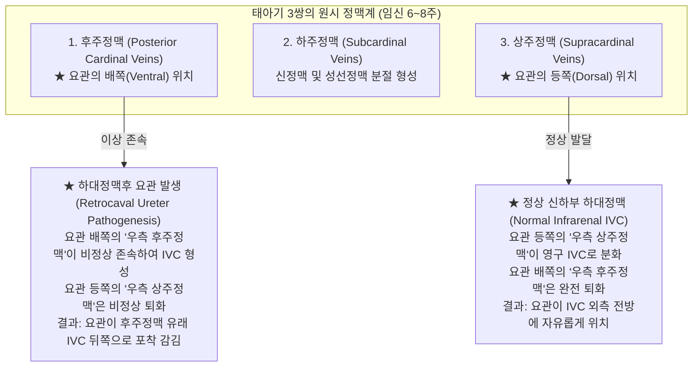
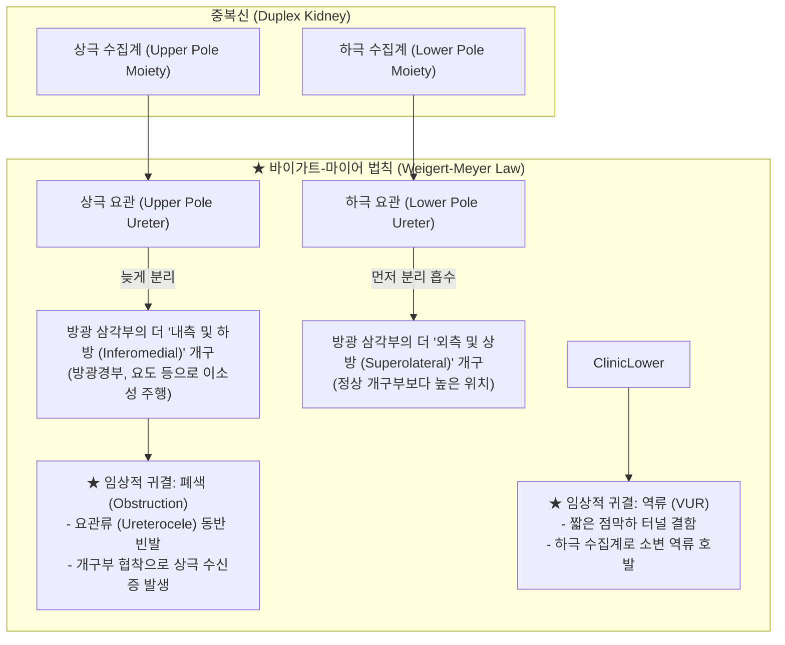
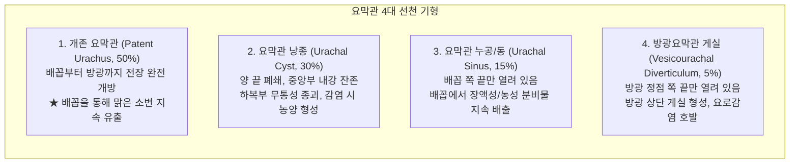

# 📑 [Netter Vol.5] Day 03: 하부 요로계 선천 기형 및 폐색 — 요관 주행 이상, 방광요관역류(VUR), 중복·이소성 요관, 요관류, 프룬 벨리 증후군, 방광외번 및 후부요도판막 (Section 2 Part 2 완결)

> 📖 **원서 출처**: [The Netter Collection of Medical Illustrations - Volume 5, Urinary System.pdf (pp. 48-64)](https://drive.google.com/file/d/1vcvDctJJuo4vA2jKMPeSvjJjRpP1lhp2/view?usp=drivesdk)  
> 🏷️ **범위**: Section 2 후반부 (Plate 2-19 ~ Plate 2-35, 총 17개 플레이트 전수 정밀 수록, pp. 48–64 완독)  
> 📌 **핵심 테마**: 하대정맥 발생 부전(우측 후주정맥의 비정상 존속)에 기인한 하대정맥후 요관(Retrocaval ureter)의 "물음표/역J자형" 포착과 복강경 단단문합술, 방광요관역류(VUR)의 점막하 터널 밸브 기전 파탄과 국제 5단계 그레이딩 및 역류성 신병증(Reflux nephropathy) 피질 반흔, 완전 중복 요관의 바이가트-마이어 법칙(Weigert-Meyer rule: 상극 요관=내하방 이소성/요관류/폐색 vs 하극 요관=외상방 역류)과 시든 백합 징후(Drooping lily sign), 불완전 중복 요관의 요요 역류(Yo-yo reflux), 이소성 요관(Ectopic ureter)의 성별 해부학적 개구 차이에 따른 요실금 법칙(여성=외괄약근 하방 질/질전정 개구로 지속성 점적 요실금 vs 남성=외괄약근 상방 전립선요도/정낭 개구로 요실금 없음), 요관류(Ureterocele)의 "코브라 머리(Cobra-head)" 방사선학, 프룬 벨리 증후군(Eagle-Barrett triad: 복벽 근육 무형성, 거대요로계, 양측 잠복고환), 요도상열-방광외번 복합체(Epispadias-Exstrophy)의 치골 이개 및 장형 선암 위험, 요막관(Urachus) 4대 선천 기형 스펙트럼(개존증, 낭종, 누공, 게실)과 요막관 선암, 그리고 남아 신생아 최빈 하부 요로 폐색인 후부요도판막(PUV Type I 95%)의 VCUG "열쇠구멍 징후(Keyhole sign)" 및 응급 내시경 절제술.

---

## 1. 개요 및 마스터 요약 (Executive Summary)

1. **정맥 발생학적 역전과 하대정맥후 요관의 포착 병태생리 (Plates 2-19 ~ 2-20)**:
   - **하대정맥후 요관(Retrocaval ureter)**은 요관 자체의 기형이 아니라, 태아기 하대정맥(IVC) 신하부 분절을 형성해야 할 요관 등쪽의 **우측 상주정맥(Right supracardinal vein)이 퇴화**하고 요관 배쪽의 **우측 후주정맥(Right posterior cardinal vein)이 비정상적으로 존속**하여 발생함. 우측 요관이 IVC 후방으로 파고들어 내측으로 감긴 후 전방으로 빠져나오는 형태를 띠며, IVP/CT상 전형적인 **"물음표 모양" 또는 "역J자형(Reverse J-shape / Fishhook)"** 굴곡 폐색을 나타냄. 치료는 복강경 요관-요관 단단문합술로 IVC 전방으로 요관을 재배치함.

2. **방광요관역류(VUR)의 점막하 플랩 밸브 파탄과 역류성 신병증 (Plates 2-21 ~ 2-22)**:
   - 정상 방광요관이행부(UVJ)는 요관이 방광 근육벽을 사선으로 관통하는 **점막하 터널(Submucosal tunnel, 길이 대 직경 비 $5:1$ 이상)**이 방광 내압 상승 시 납작하게 눌리는 수동적 플랩 밸브(Flap-valve) 기전으로 소변 역류를 방지함. 원발성 VUR은 터널 길이가 선천적으로 짧아 발생하며, **국제 VUR 5단계 분류(Grade I: 요관만 $\rightarrow$ Grade II: 비확장 신배 도달 $\rightarrow$ Grade III: 경도 확장/원개 둔화 $\rightarrow$ Grade IV: 중등도 확장 및 굴곡 $\rightarrow$ Grade V: 거대 굴곡 요관 및 신실질 위축)**로 표준화됨. 세균뇨가 복합 유두를 통해 신실질로 역류(Intrarenal reflux)하여 비가역적 섬유성 반흔을 남기는 **역류성 신병증(Reflux nephropathy)**을 유발하므로 VCUG와 DMSA 신장 스캔이 진단의 핵심임.

3. **중복 요관의 바이가트-마이어 법칙과 이소성 요관의 요실금 법칙 (Plates 2-23 ~ 2-25)**:
   - **완전 중복 요관 (Complete Duplication)**: 단일 중신관에서 2개의 요관아가 발생하여 형성되며, **바이가트-마이어 법칙 (Weigert-Meyer Rule)**을 철저히 따름:
     - **상극 요관 (Upper pole ureter)**: 방광 삼각부의 **더 내측 및 하방(Inferomedial)**에 개구하며, 요관류(Ureterocele)나 협착을 동반하여 **폐색(Obstruction) 및 수신증** 유발.
     - **하극 요관 (Lower pole ureter)**: 방광 삼각부의 **더 외측 및 상방(Superolateral)**에 개구하며, 점막하 터널 결함으로 **방광요관역류(VUR)** 호발.
   - **이소성 요관 (Ectopic ureter)**: 외요도괄약근과의 해부학적 위치 관계에 따라 증상이 양분됨: **여성**은 괄약근 하방(질, 질전정, 외요도) 개구로 정상 배뇨 사이에도 소변이 계속 흐르는 **지속성 점적 요실금(Constant dribbling incontinence)**을 보이나, **남성**은 개구부(전립선 요도, 정낭, 정관)가 전원 외괄약근 상방에 위치하므로 **요실금이 절대 발생하지 않음** (부고환염, 사정통으로 발현).

4. **요관류 및 소아 복부-요로 복합 증후군: 프룬 벨리 증후군 (Plates 2-26 ~ 2-29)**:
   - **요관류 (Ureterocele)**: 요관 말단 점막하 분절의 낭포성 풍선양 확장으로, 방사선학적으로 조영제로 찬 요관류 주위의 얇은 달무리 음영인 **"코브라 머리 징후 (Cobra-head sign)"**를 보임.
   - **프룬 벨리 증후군 (Prune Belly / Eagle-Barrett Syndrome, 95% 남아)**: ① **전복벽 근육의 결손/무형성 (말린 자두 피부)**, ② **광범위한 거대요로계 (거대방광, 거대요관, 신이형성)**, ③ **양측 복강내 잠복고환 (Cryptorchidism)**의 3대 징후를 보이며, 태아기 심한 요로 폐색과 복강 팽창이 원인임.

5. **하부 복벽 결손(요도상열-방광외번), 요막관 기형 및 후부요도판막 (Plates 2-30 ~ 2-35)**:
   - **방광외번 (Bladder Exstrophy)**: 하복벽 중간중배엽 유입 부전과 총배설강막의 조기 파열로 방광 후벽과 삼각부가 체외로 완전히 노출되며, 치골결합 이개(오리걸음)를 동반하고 성인기 **방광 선암(Adenocarcinoma)** 위험이 급증함. **요도상열(Epispadias)**은 음경 배면에 요도판이 노출됨.
   - **요막관 기형 (Urachal Anomalies)**: 출생 후 섬유화되어 정중제삭이 되어야 할 요막관의 폐쇄 부전으로 **개존 요막관(배꼽 소변 유출), 낭종, 누공, 게실** 형성.
   - **후부요도판막 (Posterior Urethral Valves, PUV)**: 남아 최빈 하부 요로 폐색 기형. 95%가 정구 하단 돛 모양 주름인 **Type I**이며, VCUG상 확장된 후부요도와 비후된 방광이 이루는 **"열쇠구멍 징후 (Keyhole sign)"**로 확진하고 신생아기 내시경 판막 절제술을 시행함.

---

## 2. 하대정맥후 요관 및 정맥 발생학 (Plates 2-19 ~ 2-20)

### Plate 2-19 | 하대정맥후 요관: 방사선 소견 및 복강경 재건 (Retrocaval Ureter: Radiographic Findings and Laparoscopic Repair)

![[Netter_V5_Plate2-19.png]]

#### 1) 해부학적 주행 이상 및 기형의 본질
- **정의**: 정상적으로 하대정맥(IVC) 외측을 따라 수직 하강해야 할 우측 요관이, 하대정맥의 뒤쪽(Dorsal)을 감아 돌아 내측으로 들어간 뒤 하대정맥 전면을 가로질러 원래의 골반강 경로로 복귀하는 선천 기형.
- **기형의 본질**: 요관 자체의 형성 장애가 아니라 **하대정맥의 발생학적 혈관 이상**에 기인하므로 발생학적으로는 **하대정맥전 요관(Preureteral Vena Cava)**으로 명명함. 거의 전적으로 **우측**에서만 발생함 (좌측 하대정맥 동반 시 좌측 발생 가능).

#### 2) 방사선학적 특징 (IVP 및 CT 요로조영술)
- **"물음표 징후" 또는 "역J자형 굴곡" (Reverse J-shape / Fishhook sign)**:
  - 제3~4요추(L3-L4) 추체 높이에서 근위부 우측 요관이 급격하게 내측 정중선(대동맥과 IVC 사이)으로 꺾여 들어감.
  - 하대정맥과 척추체 사이에 요관이 압박 포착되면서 협착 상부의 신우와 근위 요관이 현저하게 확장(Hydronephrosis)됨.
  - 압박 부위를 지난 원위 요관은 다시 외측 하방으로 완만하게 빠져나와 정상 방광으로 하강함.

#### 3) 임상 발현 및 외과적 복강경 재건술
- **임상 증상**: 출생 직후에는 대개 무증상이나, 성인기(30~40대)에 혈관 압박이 심화되면서 **만성 우측 측복통, 간헐적 신산통, 수신증, 요로결석 및 급성 신우신염**으로 발현함.
- **외과적 표준 술식 (Laparoscopic Ureteroureterostomy)**:
  - 하대정맥을 절단할 수는 없으므로, 폐색 부위 요관을 복강경으로 절제 박리함.
  - 비정상적으로 IVC 후방을 통과하던 요관을 절단(Transection)하여 IVC 전방으로 꺼냄.
  - 무혈관성 협착 부위를 절제하고 정상 요관 절단면을 IVC 전방에서 단단문합(End-to-end anastomosis)하여 정상적인 해부학적 전방 주행로를 재건함 (Double-J 스텐트 유치).

---

### Plate 2-20 | 하대정맥후 요관: 하대정맥의 정상 발생 기전 (Retrocaval Ureter: Normal Development of the Inferior Vena Cava)

![[Netter_V5_Plate2-20.png]]

#### 1) 정상 하대정맥(IVC)의 3쌍 원시 정맥 발생망
태아기 하대정맥은 단순 단일 혈관이 아니라 임신 6~8주 동안 척추 양측에 출현하는 3쌍의 주요 배아 정맥들이 융합, 문합, 선택적 퇴화를 거쳐 완성되는 복합 혈관 복합체임:



- **정상 분화**:
  - 간하부(Hepatic) 분절: 난황정맥(Vitelline vein).
  - 신상부(Prerenal) 분절: 우측 하주정맥.
  - 신분절(Renal) 분절: 하주-상주정맥 문합부.
  - **신하부(Infrarenal) 분절**: 요관의 **등쪽(Dorsal)**에 위치한 **우측 상주정맥(Right supracardinal vein)**이 단독 발달하여 형성됨.

#### 2) 하대정맥후 요관의 발생학적 에러
- 요관 배쪽에 위치하여 자연 퇴화해야 할 **우측 후주정맥(Right posterior cardinal vein)이 지속**되어 영구 신하부 하대정맥이 됨.
- 반대로 정상적으로 IVC가 되어야 할 요관 등쪽의 **우측 상주정맥이 소실**됨.
- 결과적으로 요관은 전방에 위치한 지속성 후주정맥(IVC)의 뒤쪽을 지나 내측으로 파고드는 해부학적 덫에 갇히게 됨.

---

## 3. 방광요관역류(VUR) 및 역류성 신병증 (Plates 2-21 ~ 2-22)

### Plate 2-21 | 방광요관역류: 기전 및 5단계 그레이딩 (Vesicoureteral Reflux: Mechanism and Grading)

![[Netter_V5_Plate2-21.png]]

#### 1) 정상 항역류 플랩-밸브(Flap-valve) 기전
- 요관은 방광벽을 직각으로 관통하지 않고 배뇨근층과 점막 사이를 비스듬히 통과하는 **점막하 터널(Submucosal tunnel)**을 형성함.
- **정상 터널 비율**: 점막하 터널의 길이 대 요관 직경의 비율이 **$5:1$ 이상**으로 유지됨.
- **역학**: 방광에 소변이 차서 내압이 상승하면, 방광 내 점막하 요관이 방광벽 배뇨근 쪽으로 납작하게 압박(Passive compression)되어 내강이 닫힘으로써 소변의 상부 역류를 물리적으로 차단함.
- **원발성 VUR 발생 기전**:
  - 요관아가 중신관에서 너무 두측(Cranial)에서 조기 발아하여 방광벽에 비정상적으로 높고 외측에 개구함.
  - 점막하 터널 길이가 비정상적으로 짧아져 **터널 비가 $1.5:1 \sim 3:1$ 이하로 감소**함.
  - 배뇨 시 방광 내압이 상승해도 터널이 눌려 닫히지 못하고 소변이 요관으로 역류함.

#### 2) 국제 VUR 5단계 분류 체계 (International Reflux Grading)


| VUR 등급 | 방사선학적 조영제 역류 범위 | 요관 및 신우 확장도 | 신배(Calyces) 형태학적 변화 |
| :--- | :--- | :--- | :--- |
| **Grade I** | **요관에만 국한**됨 | 요관 확장 전혀 없음 | 조영제가 신우에 도달하지 않음 |
| **Grade II** | **신우 및 신배까지 도달**함 | 요관 및 신우 확장 없음 | 신배 원개(Fornices)의 날카로운 컵 형태 완전 보존 |
| **Grade III** | 신우신배 전역 도달 | **경도~중등도 요관 확장** 및 경미한 신우 확장 | 신배 원개의 경미한 둔화(Blunting), 요관 굴곡은 경미함 |
| **Grade IV** | 신우신배 전역 도달 | **중등도 요관 확장 및 뚜렷한 굴곡(Tortuosity)** | 신배 각이 완전히 뭉툭해지며 유두 압흔 대부분 소실 |
| **Grade V** | 신우신배 전역 도달 | **극심한 거대 요관(Megaureter) 및 심한 굴곡/꼬임** | 신유두 압흔 완전 소실, 신배가 풍선처럼 낭포화, 신실질 위축 |

---

### Plate 2-22 | 방광요관역류: 배뇨성 방광요도조영술 (Vesicoureteral Reflux: Voiding Cystourethrograms, VCUG)

![[Netter_V5_Plate2-22.png]]

#### 1) VCUG 검사 원칙 및 영상 소견
- **표준 확진 검사**: **배뇨성 방광요도조영술 (VCUG, Voiding Cystourethrogram)**.
- 요도 도관을 통해 방광 내로 수용성 조영제를 점적 주입하며 충만기(Filling phase)와 배뇨기(Voiding phase)의 연속 형광투시 촬영을 시행함.
- 많은 환자에서 평상시 충만기에는 역류가 나타나지 않다가 배뇨근이 강력 수축하는 **배뇨기에만 역류가 촉발(Voiding reflux)**되므로 배뇨기 영상 획득이 절대적임.

#### 2) 역류성 신병증 (Reflux Nephropathy) 및 신피질 반흔 형성 기전
- **복합 신유두 (Compound Papillae)와 신내 역류 (Intrarenal Reflux, IRR)**:
  - 신장 중앙부의 단순 유두(Simple papillae)는 유두관 개구부가 사선 슬릿형이라 역류가 차단됨.
  - 신장의 상극(Upper pole)과 하극(Lower pole)에 밀집된 **복합 유두(Compound papillae)**는 유두관 개구부가 넓고 수직으로 뚫려 있어 밸브 기능이 없음.
  - 감염된 소변이 집합관 깊숙이 신장 실질 내부로 뿜어져 들어가는 **신내 역류(IRR)**가 상극과 하극에 집중 발생함.
- **만성 반흔 형성**: 반복되는 세균성 신우신염 $\rightarrow$ 국소 염증 및 섬유화 $\rightarrow$ 유두부 함몰 및 신피질의 깊은 반흔(Cortical scarring) $\rightarrow$ 소아기 신성 고혈압 및 단백뇨, 양측성 진행 시 말기신부전(ESRD).
- **DMSA 신장 스캔**: 방사성 의약품 $^{99m}\text{Tc}$-DMSA를 주사하여 기능성 근위세뇨관 피질의 결손 부위(Cold defect)를 찾아내어 반흔의 영구적 손상 정도를 정량 평가함.

> ⚠️ **Clinical Pearl: VUR의 등급별 치료 가이드라인 (내과적 항생제 vs 외과적 재이식술)**  
> 저등급 역류인 **Grade I~II(및 일부 Grade III)**는 소아가 성장함에 따라 방광 기저부 근육이 두꺼워지고 점막하 터널이 자연 연장되어 **환아의 80% 이상에서 자발적 자연 소실(Spontaneous resolution)**을 보입니다. 따라서 신장 손상을 예방하는 **저용량 예방적 항생제 요법(CAP, Continuous Antibiotic Prophylaxis)**을 유지하며 매년 VCUG/초음파로 추적합니다. 반면 **Grade IV~V의 고등급 역류**, 항생제 복용 중에도 돌파성 발열성 신우신염(Breakthrough UTI)이 반복되거나 새로운 피질 반흔이 발생하는 경우에는 내시경적 점막하 약제 주입술(Deflux injection) 또는 방광근층터널을 새로 만들어주는 **요관 방광 재이식술(Ureteral Reimplantation - Cohen / Politano-Leadbetter 수술)**을 시행해야 합니다.

---

## 4. 요관 중복, 이소성 요관 및 요관류 (Plates 2-23 ~ 2-27)

### Plate 2-23 | 중복 요관: 완전 중복 및 바이가트-마이어 법칙 (Ureteral Duplication: Complete & Weigert-Meyer Rule)

![[Netter_V5_Plate2-23.png]]

#### 1) 발생학적 기전: 이중 요관아 (Double Ureteric Buds)
- 단일 중신관에서 **두 개의 독립된 요관아(Cranial bud & Caudal bud)**가 각각 발아하여 동일한 후신간엽 덩어리로 침투함.
- 신장 실질은 하나이지만, 상부 극을 담당하는 **상극 수집계(Upper pole moiety)**와 하부 실질을 담당하는 **하극 수집계(Lower pole moiety)**로 분리된 두 개의 신우와 두 개의 요관이 형성됨.

#### 2) 바이가트-마이어 법칙 (Weigert-Meyer Rule)의 절대 원리
중신관이 방광벽으로 흡수되어 펼쳐지는 과정에서 두 요관 개구부의 3차원 위치 역전이 발생함:



- **시든 백합 징후 (Drooping Lily Sign)**:
  - 배설성 요로조영술(IVU) 시, 상극 요관은 폐색으로 인해 기능이 저하되어 조영되지 않고(Silent upper pole), 조영된 하극 수집계는 거대하게 확장된 상극 신우에 눌려 아래쪽과 외측으로 밀려 처진 꽃봉오리 모양을 나타냄.

---

### Plate 2-24 | 중복 요관: 불완전 중복 (Ureteral Duplication: Incomplete / Bifid Ureter)

![[Netter_V5_Plate2-24.png]]

#### 1) 발생 기전 및 해부학
- **분지 요관 (Bifid Ureter)**: 단일 요관아가 후신간엽에 도달하기 전 도중에 일찍 두 갈래로 나뉘어 발생함.
- 상극과 하극 신우에서 각각 출발한 2개의 요관이 하강하다가 방광에 도달하기 전 중간(대개 하부 1/3)에서 **Y자 형태로 하나로 합류**함.
- 방광벽 관통 및 삼각부 개구는 정상 단일 요관 형태로 1개의 개구부만 가짐.

#### 2) 요요 역류 (Yo-Yo / Ureteroureteral Reflux)
- 정상 요관 연동운동 시, 한쪽 가지 요관의 연동파가 분기점에 도달했을 때 소변의 일부는 방광으로 하강하지만, 일부는 압력이 낮은 반대측 비연동 가지 요관을 타고 역방향으로 치솟음.
- 소변이 두 요관 사이를 장난감 요요처럼 왕복하며 만성적인 요정체, 감염 및 측복통을 유발함.

---

### Plate 2-25 | 이소성 요관 (Ectopic Ureter)

![[Netter_V5_Plate2-25.png]]

#### 1) 정의 및 발생학
- 요관 개구부가 정상 방광 삼각부의 외외측 각을 벗어나 비정상적인 위치에 개구하는 기형 (80% 이상이 중복 요관의 상극 요관에서 동반됨).
- 요관아가 중신관의 너무 높은 곳에서 발생하여 중신관의 정상 흡수 경로를 이탈하여 발생함.

#### 2) 성별 해부학적 개구 부위와 요실금의 절대 법칙

```mermaid
graph TD
    Ectopic["이소성 요관 (Ectopic Ureter)"] --> GenderCheck{성별에 따른 개구 위치}
    
    GenderCheck -->|여성 (Female)| FemPos["외요도괄약근 하방(원위부) 개구 가능<br>- 요도 하부, 전정(Vestibule), 질(Vagina), 자궁"]
    FemPos --> FemSymp["★ 지속성 점적 요실금 (Constant Dribbling Incontinence)<br>- 정상적인 간격으로 방광 배뇨를 하면서도<br>- 24시간 내내 소변이 팬티를 적심"]
    
    GenderCheck -->|남성 (Male)| MalePos["외요도괄약근 상방(근위부) 개구에 국한<br>- 전립선 요도, 정구, 정낭, 사정관, 정관"]
    MalePos --> MaleSymp["★ 요실금 발생 절대 없음 (No Incontinence!)<br>- 소변이 외괄약근에 의해 완벽히 차단됨<br>- 재발성 부고환염, 사정통, 정낭 낭종으로 발현"]
```

> ⚠️ **Clinical Pearl: 여아의 기괴한 배뇨 패턴 - "정상 배뇨를 하면서도 늘 소변이 샌다"**  
> 배뇨 훈련(Toilet training)을 마친 여아가 낮이나 밤이나 정상적으로 변기에 소변을 잘 보는데도 불구하고, 기저귀나 속옷이 항상 젖어 있는 기괴한 병력을 호소한다면 이는 100% **이소성 요관(Ectopic ureter)**을 의심해야 합니다. 방광과 연결된 정상 요관은 소변을 모아 정상 배뇨를 가능케 하지만, 중복신의 상극에서 내려온 이소성 요관이 **외요도괄약근 바깥쪽인 질(Vagina)이나 전정부**로 바로 연결되어 괄약근의 조절을 전혀 받지 않고 소변이 지속적으로 찔끔거리며 새어나오기(Continuous dribbling) 때문입니다.

---

### Plate 2-26 | 요관류: 육안 및 미세 해부학 (Ureterocele: Gross and Fine Appearance)

![[Netter_V5_Plate2-26.png]]

#### 1) 병태생리 및 형성 기전
- 방광 내로 들어가는 요관의 최말단 점막하(Submucosal) 분절이 풍선처럼 부풀어 오르는 낭포성 확장 기형.
- 요관 개구부의 선천적 극소 협착(Pin-point meatus)과 배아기 요관-방광 연결부의 Chwalla 막(Chwalla's membrane) 퇴화 부전으로 인해 지속적인 요관 내압 상승이 초래되어 점막하 조직이 확장됨.

#### 2) 분류 체계
1. **방광내 요관류 (Intravesical / Orthotopic / Simple Ureterocele)**:
   - 요관류 전체가 완전히 방광 내부에 국한되어 위치함. 성인에서 흔하며 단일 요관과 연관됨.
2. **이소성 요관류 (Ectopic Ureterocele)**:
   - 요관류의 일부가 방광경부를 넘어 후부 요도까지 뻗어 내려감. 소아 환자의 80%를 차지하며 거의 항상 **완전 중복 요관의 상극 요관**에서 발생함. 거대해질 경우 방광경부를 틀어막아 급성 요폐를 유발함.

---

### Plate 2-27 | 요관류: 방사선학적 소견 (Ureterocele: Radiographic Findings)

![[Netter_V5_Plate2-27.png]]

#### 1) 영상학적 특징
- **코브라 머리 징후 (Cobra-head sign / Spring onion sign)**:
  - 배설성 요로조영술(IVU) 또는 조영 CT에서 확장된 요관류 내강의 조영제 음영 주위로, 조영되지 않는 얇은 요관류 벽 및 방광 점막이 균일한 방사선 투과성 달무리(Radiolucent halo)를 형성하여 마치 코브라가 머리를 치켜든 형상을 띰.
- **초음파 소견**: 방광저 내부로 돌출된 얇은 벽을 가진 낭종성 덩어리가 요관 연동에 따라 수축과 팽창을 반복함.
- **치료**: 신생아기 요로 폐색 완화를 위한 **내시경적 요관류 절개술(Endoscopic puncture)**, 중복신 상극 실질의 기능 상실 시 복강경 상극 반신절제술(Upper pole heminephrectomy).

---

## 5. 프룬 벨리 증후군 및 하부 복벽 기형 (Plates 2-28 ~ 2-31)

### Plate 2-28 | 프룬 벨리 증후군: 복벽 형태학 (Prune Belly Syndrome: Appearance of Abdominal Wall)

![[Netter_V5_Plate2-28.png]]

#### 1) 이글-배럿 증후군 (Eagle-Barrett Syndrome)의 3대 고전 징후 (Triad)
1. **전복벽 근육의 부분적 또는 완전한 결손/무형성** (Deficiency of abdominal musculature)
2. **광범위한 요로계 확장 기형** (Cryptorchidism-associated megaureters & megacystis)
3. **양측 복강내 잠복고환** (Bilateral intra-abdominal cryptorchidism)

#### 2) 복벽의 특징적 외형
- **말린 자두(Prune) 모양의 복벽**: 복직근, 내·외복사근, 복횡근의 저형성으로 인해 복벽이 지지력을 잃고 얇아져 자글자글한 주름이 잡히며 옆으로 퍼짐.
- 복벽을 통해 장관의 연동운동과 팽창된 거대 방광이 투시되듯 만져짐.
- 기침이나 배변 시 복압 상승이 불가능하여 만성 호흡기 감염 및 변비 호발. 환자의 95% 이상이 **남아**임.

---

### Plate 2-29 | 프룬 벨리 증후군: 비뇨기계 병변 (Prune Belly Syndrome: Urogenital Lesions)

![[Netter_V5_Plate2-29.png]]

#### 1) 요로계의 극단적 거대화 병변
- **거대요관 (Megaureters)**: 요관 평활근 다발이 소실되고 비기능성 결합조직 섬유로 치환되어, 장관처럼 굵고 극도로 구불구불한 거대 요관을 형성함.
- **거대방광 (Megacystis)**: 방광벽 평활근의 콜라겐 치환으로 방광 용적이 비정상적으로 거대하며 수축력을 상실함. 정점 부위에 커다란 요막관 게실(Urachal diverticulum)이 빈번히 관찰됨.
- **전립선 저형성 (Prostatic hypoplasia)**: 전립선 형성 부전으로 전립선 요도가 거대하게 늘어나 낭포성 확장을 보임.
- **신이형성 및 신부전**: 태생기 심한 요로 내압 상승으로 신장 실질의 이형성(Dysplasia) 및 핍뇨를 초래하여 20~30%에서 폐 저형성증으로 조기 사망함.

#### 2) 양측 복강내 잠복고환의 기전
- 고환은 후복막에서 정상 형성되나, 골반강을 가득 채운 거대한 방광과 요관 덩어리가 서혜관 입구를 물리적으로 차단하고 복압 조절이 불가능하여 고환이 음낭으로 하강하지 못함.

---

### Plate 2-30 | 요도상열-방광외번 복합체: 요도상열 (Epispadias Exstrophy Complex: Epispadias)

![[Netter_V5_Plate2-30.png]]

#### 1) 발생학적 기전
- 배아 4~5주 원시 결절(Genital tubercle)이 총배설강막의 두측(위쪽)이 아닌 미측(아래쪽)으로 잘못 이동하여 발생함.
- 총배설강막이 조기 파열되면서 요도판(Urethral plate)이 음경의 복측(아래쪽)이 아닌 **등쪽(배면, Dorsum)**에 펼쳐진 채 외부로 노출됨. (요도하열 Hypospadias과 정반대 기전).

#### 2) 임상적 형태학
- **남성 요도상열**:
  - 외요도구가 음경 배면에 열려 있음 (귀두부 $\rightarrow$ 음경부 $\rightarrow$ 완전 치골하부).
  - 음경이 짧고 위쪽으로 심하게 휨(**Dorsal chordee**).
  - 치골결합이 벌어지는 **치골 이개(Diastasis of pubic symphysis)** 동반.
  - 완전 치골하 요도상열(Complete epispadias) 환자는 방광경부 괄약근이 열려 있어 **전원 요실금**을 나타냄.
- **여성 요도상열**: 음핵이 좌우 둘로 갈라지고(Cleft clitoris) 소음순이 분리되며 요도가 넓게 벌어져 질 상방에 열림.

---

### Plate 2-31 | 요도상열-방광외번 복합체: 방광외번 (Epispadias Exstrophy Complex: Bladder Exstrophy)

![[Netter_V5_Plate2-31.png]]

#### 1) 병태생리 및 육안 소견
- **빈도**: 1 : 30,000 ~ 1 : 50,000 (남성 2~3배 호발).
- **발생 기전**: 하복벽 중간중배엽의 체벽 봉합 부전으로 복벽과 방광 전벽이 결손되고, 전방 총배설강막이 과도하게 얇아진 후 파열됨.
- **육안 소견**: 하복벽 정중선 결손부를 통해 **방광 후벽과 삼각부의 선홍색 점막판(Everted bladder mucosa)이 체외로 완전히 뒤집혀 돌출**됨. 점막 표면의 두 요관구에서 소변이 체외로 끊임없이 분출됨.

#### 2) 골격 이상 및 종양 위험
- **치골결합 이개 (Pubic Diastasis)**: 양측 치골체가 정중선에서 수 센티미터 이상 벌어져 골반환이 불안정해지고 특유의 **오리걸음(Waddling gait)**을 보임.
- **방광 선암 (Adenocarcinoma) 위험**: 체외로 노출된 요로상피가 만성 기계적 자극과 건조에 노출되어 장형 선상피화생(Cystitis glandularis / Intestinal metaplasia)을 거침. 성인기까지 교정되지 않거나 수술 후에도 정상인 대비 **방광 선암 발생률이 수백 배 상승**하므로 장기적 방광경 감시가 필수적임.

---

## 6. 방광 중격 기형 및 요막관 질환군 (Plates 2-32 ~ 2-33)

### Plate 2-32 | 방광 중복 및 중격 기형 (Bladder Duplication and Septation)

![[Netter_V5_Plate2-32.png]]

#### 1) 기형의 스펙트럼
- **완전 중복 (Complete Duplication)**: 골반강 내에 두 개의 독립된 방광이 존재하며, 각각 완전한 고유근층과 독립된 요관 및 독립된 요도를 가짐. (척추 중복 및 쇄항 Imperforate anus 동반 빈발).
- **중격 방광 (Septate Bladder)**: 단일 방광 내강 내에 섬유근성 중격이 존재하여 방광이 좌우(시상 중격) 또는 전후(관상 중격)로 나뉨.
- **모래시계 방광 (Hourglass Bladder)**: 방광 체부 중간의 원형 섬유성 협착륜에 의해 상부 방광과 하부 방광으로 분할됨. 상부 구획의 요정체 및 결석 빈발.

---

### Plate 2-33 | 요막관 기형 4대 스펙트럼 및 요막관 선암 (Anomalies of the Urachus)

![[Netter_V5_Plate2-33.png]]

#### 1) 요막관(Urachus)의 발생학적 운명
- 태생기 방광의 정점(Dome)과 배꼽(Allantois)을 연결하던 요막관은 임신 후반기부터 관강이 좁아져 출생 시 완전히 폐쇄되어야 함.
- 성인에서는 섬유성 끈 구조물인 **정중제삭 (Median umbilical ligament)**으로 전환됨.

#### 2) 4대 선천성 요막관 기형의 감별 병태생리



1. **개존 요막관 (Patent Urachus, 50%)**: 관 전체가 개방되어 **배꼽을 통해 소변이 분출/유출**됨.
2. **요막관 낭종 (Urachal Cyst, 30%)**: 방광과 배꼽 양단은 닫히고 중간 분절에 체액이 고여 복벽 종괴를 이룸. 감염 시 급성 복막염 유사 증상.
3. **요막관 누공/동 (Urachal Sinus, 15%)**: 배꼽 쪽 개구부만 열려 있어 주기적 제부 분비물 및 육아종 형성.
4. **방광요막관 게실 (Vesicourachal Diverticulum, 5%)**: 방광 천장에 주머니 형태로 돌출.

> ⚠️ **Clinical Pearl: 성인 요막관 잔유물에서 호발하는 요막관 선암 (Urachal Adenocarcinoma)**  
> 방광에 발생하는 암의 90% 이상은 요로상피암(Urothelial CA)입니다. 그러나 배꼽과 방광 정점 사이의 요막관 잔유물에서 발생하는 악성 종양의 **90% 이상은 선암(Adenocarcinoma)**입니다. 요막관을 덮고 있던 장배엽성 상피가 점액성 선암으로 변모하기 때문이며, 주로 방광 천장(Dome)에 위치하여 무통성 육아종이나 혈뇨로 발현합니다. 일반 방광암과 달리 전신 항암치료에 극히 저항성이므로, 방광 천장 부분 절제술과 제대(배꼽) 및 요막관 삭을 전층 일괄 절제(En-bloc resection)하는 광범위 외과 절제가 유일한 완치법입니다.

---

## 7. 후부요도판막 (Plates 2-34 ~ 2-35)

### Plate 2-34 | 후부요도판막: 육안 병리 (Posterior Urethral Valves, PUV: Gross Pathology)

![[Netter_V5_Plate2-34.png]]

#### 1) 역학 및 중요성
- **남아 신생아에서 발생하는 가장 흔하고 가장 치명적인 선천성 하부 요로 폐색(BOO)** 질환 (빈도 1 : 5,000 ~ 1 : 8,000 남아).
- 여아에서는 절대 발생하지 않음!

#### 2) 영의 3대 분류 체계 (Young's Classification)
- **Type I (95%, 절대 다수)**:
  - 정구(Verumontanum) 하단에서 시작하여 전립선-막양부 요도 측벽을 따라 외측 하방으로 주행하는 한 쌍의 돛 모양 점막 주름(Plicae).
  - 하강하는 요류에 의해 제비집 모양으로 팽창하며 요도 내강을 판막처럼 틀어막아 치명적인 폐색을 유발함.
- **Type II (비병리적)**: 정구에서 방광경부로 상행하는 주름 (정상 변이로 판정).
- **Type III (5%)**: 정구 상방 또는 하방 요도 내강을 횡단하는 중앙 천공 원반형 격막(Diaphragm).

---

### Plate 2-35 | 후부요도판막: 방사선 소견 및 치료 (Posterior Urethral Valves: Radiographic Findings)

![[Netter_V5_Plate2-35.png]]

#### 1) 방사선학적 확진 소견: VCUG
- **열쇠구멍 징후 (Keyhole Sign)**:
  - 배뇨성 방광요도조영술(VCUG) 및 산전 초음파에서 비후되고 육주화(Trabeculation)된 거대 방광과 그 아래 극단적으로 팽창된 후부(전립선) 요도가 열쇠구멍의 둥근 상부와 몸통 형태를 띰.
  - 판막 하방의 구부 요도(Bulbar urethra)는 가느다란 실처럼 좁아져 대조를 이룸.

#### 2) 요로성 복수 (Urinary Ascites)와 포터 시퀀스
- **신배 원개 파열 (Forniceal Rupture)**: 요도 폐색에 의한 극단적인 방광 내압 상승 $\rightarrow$ 양측 심한 수신증 $\rightarrow$ 신배 원개가 파열되어 소변이 신주위강 및 복막강으로 유출되는 **요로성 복수(Urinary ascites)** 초래.
- **폐 저형성증**: 소변 배출 차단으로 중증 양수과소증이 유발되어 포터 시퀀스(폐 저형성증)로 출생 직후 사망 위험.

#### 3) 응급 처치 및 근치 치료
- **출생 즉시 카테터 유치**: 세경 요도 카테터(Feeding tube)를 삽입하여 방광을 감압하고 요독증과 전해질 불균형을 교정함.
- **경요도적 판막 절제술 (Transurethral Valve Ablation)**: 환아가 안정되면 소아 방광경을 통해 전기소작기(Hook electrode) 또는 레이저로 Type I 판막을 절제하여 영구 개통함.

---

## 8. 원서 도판 추출용 파이썬 스크립트 (Plates 2-19 ~ 2-35)

Obsidian 노트의 이미지 임베드(`![[Netter_V5_Plate2-X.png]]`)와 1:1 매칭되는 17개 도판 이미지를 원본 PDF에서 추출하기 위한 로컬 실행용 Python 코드입니다.

```python
import fitz  # PyMuPDF
import os

# 1. 파일 경로 및 저장 디렉토리 설정
pdf_path = "The Netter Collection of Medical Illustrations - Volume 5, Urinary System.pdf"
output_dir = "헤르메스/책 읽기/Netter_Vol5_비뇨기계/첨부파일"
os.makedirs(output_dir, exist_ok=True)

# 2. Section 2 Part 2 도판별 PDF 페이지 매핑 (Plates 2-19 ~ 2-35)
# 주: 원서 pp. 48~64에 해당하는 실제 PDF 뷰어 페이지 번호
plate_page_mapping = {
    "Plate2-19": 72,   # Retrocaval Ureter: Radiographic Findings and Laparoscopic Repair
    "Plate2-20": 73,   # Retrocaval Ureter: Normal Development of the IVC
    "Plate2-21": 74,   # Vesicoureteral Reflux: Mechanism and Grading
    "Plate2-22": 75,   # Vesicoureteral Reflux: Voiding Cystourethrograms
    "Plate2-23": 76,   # Ureteral Duplication: Complete (Weigert-Meyer Rule)
    "Plate2-24": 77,   # Ureteral Duplication: Incomplete (Bifid Ureter)
    "Plate2-25": 78,   # Ectopic Ureter (Anatomy & Incontinence)
    "Plate2-26": 79,   # Ureterocele: Gross and Fine Appearance
    "Plate2-27": 80,   # Ureterocele: Radiographic Findings (Cobra-head sign)
    "Plate2-28": 81,   # Prune Belly Syndrome: Appearance of Abdominal Wall
    "Plate2-29": 82,   # Prune Belly Syndrome: Appearance of Kidneys, Ureters, and Bladder
    "Plate2-30": 83,   # Epispadias Exstrophy Complex: Epispadias
    "Plate2-31": 84,   # Epispadias Exstrophy Complex: Bladder Exstrophy
    "Plate2-32": 85,   # Bladder Duplication and Septation
    "Plate2-33": 86,   # Anomalies of the Urachus (Urachal Adenocarcinoma)
    "Plate2-34": 87,   # Posterior Urethral Valves: Gross Appearance (Young Type I~III)
    "Plate2-35": 88,   # Posterior Urethral Valves: Radiographic Findings (Keyhole sign)
}

doc = fitz.open(pdf_path)
zoom = 300 / 72  # 300 DPI 초고해상도 렌더링
matrix = fitz.Matrix(zoom, zoom)

print(f"[*] 총 {len(plate_page_mapping)}개 도판 추출 시작...")
for plate_name, page_num in plate_page_mapping.items():
    page = doc.load_page(page_num - 1)  # 0-indexed
    pix = page.get_pixmap(matrix=matrix, alpha=False)
    
    file_name = f"Netter_V5_{plate_name}.png"
    save_path = os.path.join(output_dir, file_name)
    pix.save(save_path)
    print(f"  [+] 추출 성공: {file_name} (PDF p.{page_num})")

doc.close()
print("[*] Section 2 완결: Plates 2-19 ~ 2-35 전수 이미지 추출 완료.")
```
