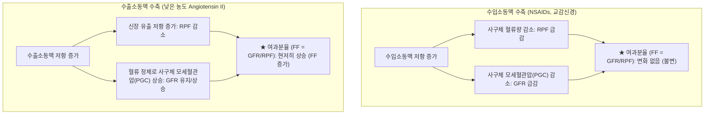
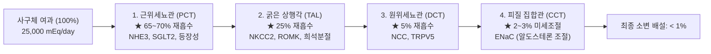
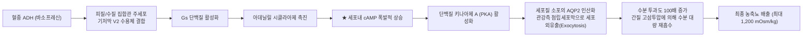
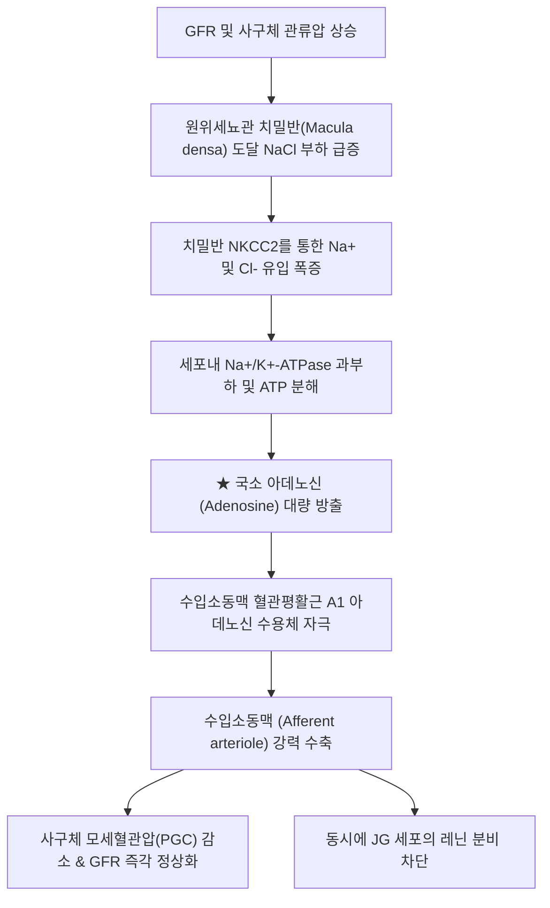
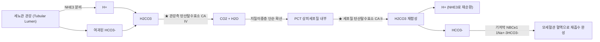

# 📑 [Netter Vol.5] Day 04: 신장 생리학 — 사구체 여과·청정율, 세뇨관 수송 역학, 반류증폭계, 산-염기 조절 및 세뇨관성 산증 (Section 3 완독)

> 📖 **원서 출처**: [The Netter Collection of Medical Illustrations - Volume 5, Urinary System.pdf (pp. 67-94)](https://drive.google.com/file/d/1vcvDctJJuo4vA2jKMPeSvjJjRpP1lhp2/view?usp=drivesdk)  
> 🏷️ **범위**: Section 3 전편 (Plate 3-1 ~ Plate 3-28, 총 28개 플레이트 전수 수록, pp. 67–94 완독)  
> 📌 **핵심 테마**: 신장의 6대 기본 항상성 기능, PAH 청정율과 신혈장류량(RPF/RBF), 이눌린 및 크레아티닌 기반 GFR 산출과 여과분율(FF) 혈역학, 세뇨관 포화 동역학(포도당 Tm과 SGLT2) 및 나트륨 분획배설률(FENa), 네프론 분절별 Na+/Cl- 재흡수(PCT 등장성, TAL NKCC2, DCT NCC, 집합관 ENaC)와 체액량 변화 반응, 알도스테론과 요류량에 의한 피질 집합관 주세포 칼륨 분비 조절, Ca2+/Mg2+/인산염의 내분비 조절(PTH, FGF23/Klotho, Claudin-16/19), 헨레고리 반류증폭계(Single effect와 요소 재순환) 및 직세관(Vasa recta) 반류교환에 의한 수질 삼투압 구배 보존, ADH(바소프레신)의 V2-cAMP-AQP2 수분 재흡수 축과 농축·희석 기전, 사구체옆장치(JGA 치밀반)의 세뇨관사구체 되먹임(TGF 아데노신 혈관수축) 및 RAAS 캐스케이드, 신장 산-염기 평형의 3중 방어선(근위세뇨관 CA IV/II 매개 HCO3- 90% 재흡수, 암모니아 생성 Ammoniagenesis 및 적정산 신생), 신장 내분비 기능(HIF-2α 매개 EPO 조혈작용, 1α-수산화효소 활성형 비타민 D), 세뇨관성 산증의 정밀 감별(근위형 Type 2 Fanconi 증후군 vs 원위형 Type 1 신석회증/저칼륨혈증), 그리고 리튬 유발 및 유전성 신성 요붕증(NDI)의 병태생리와 역설적 티아지드 치료학.

---

## 1. 개요 및 마스터 요약 (Executive Summary)

1. **신혈류역학 및 사구체 여과·청정율의 절대 공식 (Plates 3-1 ~ 3-4)**:
   - 신장은 심박출량의 $20\sim 25\%$ (약 $1,200\text{ mL/min}$)를 공급받아 체액량, 전해질, 삼투압, 혈압, 산-염기 평형을 조절함.
   - **신혈장류량(RPF)**은 100% 제거 물질인 **PAH 청정율**($C_{PAH} \approx 600\sim 650\text{ mL/min}$)로 측정하며, **사구체여과율(GFR)**의 골드 스탠다드는 **이눌린 청정율**($C_{In} \approx 100\sim 125\text{ mL/min}$)임. 임상적으로 내인성 크레아티닌 청정율($C_{Cr}$)을 활용하나, 근위세뇨관 분비(10-15%)로 인해 실제 GFR보다 약 $10\sim 20\%$ 과대평가됨.
   - **여과분율(Filtration Fraction, FF = GFR/RPF $\approx 20\%$)**: 수입소동맥 수축은 RPF와 GFR을 동반 감소시켜 FF 불변이나, 안지오텐신 II에 의한 **수출소동맥 수축**은 사구체 모세혈관압($P_{GC}$)을 높여 GFR을 방어하므로 **FF를 급격히 상승**시킴.

2. **세뇨관 수송 역학, 포화 동역학 및 전해질 조절 축 (Plates 3-5 ~ 3-11)**:
   - 포도당은 근위세뇨관 SGLT2(90%)/SGLT1(10%)에 의해 전량 재흡수되며, 신장 역치($180\sim 200\text{ mg/dL}$)와 수송 최대치($T_m \approx 375\text{ mg/min}$)를 가짐. SGLT2 억제제는 $T_m$을 낮춰 당뇨병과 심신부전을 호전시킴.
   - 나트륨 분획배설률(**$FE_{Na} = \frac{U_{Na} \times P_{Cr}}{P_{Na} \times U_{Cr}} \times 100\%$**)은 신전성 AKI($<1\%$)와 신성 ATN($>2\%$) 감별의 핵심임.
   - $\text{Na}^+$은 PCT(65-70%, 등장성) $\rightarrow$ TAL(25%, NKCC2, 희석분절) $\rightarrow$ DCT(5%, NCC) $\rightarrow$ 집합관(2-3%, ENaC)에서 단계적 재흡수됨.
   - 칼륨($\text{K}^+$)의 최종 배설량은 **피질 집합관 주세포(Principal cells)**에서 **알도스테론**과 **관강 요류량(Flow rate)**에 의한 **ROMK / BK 통로** 분비능에 의해 전적으로 결정됨. 칼슘은 DCT에서 PTH(TRPV5)에 의해 조절되고, 마그네슘은 특이하게 **TAL에서 60-70%가 세포간극(Claudin-16/19)**으로 재흡수됨.

3. **반류증폭계, 직세관 반류교환 및 요 농축·희석 동역학 (Plates 3-12 ~ 3-17)**:
   - **반류증폭계(Countercurrent Multiplier)**는 수분 투과성/용질 불투과성인 하행세근(DTL, AQP1)과, 수분 완전 불투과성 상태에서 NKCC2로 NaCl을 뿜어내는 굵은 상행각(TAL)의 **단일 효과($200\text{ mOsm/kg}$ 수평 구배)**가 대향류에 의해 세로축으로 증폭되어 피질($300\text{ mOsm/kg}$)에서 신유두($1,200\text{ mOsm/kg}$)까지의 삼투압 구배를 형성함. 집합관의 **요소 재순환(Urea recycling)**이 심부 수질 삼투압의 $50\%$를 공급함.
   - U자형 모세혈관인 **직세관(Vasa recta)**은 혈류가 느린 **반류교환계(Countercurrent Exchanger)**로 작동하여 간질의 고삼투압 용질을 씻어내지(Washout) 않고 보존함.
   - **ADH (바소프레신)**: 주세포 $V_2$ 수용체 결합 $\rightarrow$ **cAMP 증가** $\rightarrow$ **AQP2 수분 통로를 관강측 세포막에 삽입**하여 고장뇨(최대 $1,200\text{ mOsm/kg}$)를 형성함. ADH 결핍 시 AQP2가 내재화되어 희석뇨($50\text{ mOsm/kg}$) 대량 배출.

4. **사구체옆장치(JGA)의 TGF 되먹임 및 RAAS 시스템 (Plates 3-18 ~ 3-19)**:
   - **세뇨관사구체 되먹임 (Tubuloglomerular Feedback, TGF)**: GFR 상승 $\rightarrow$ 치밀반(Macula densa)의 NKCC2를 통한 NaCl 유입 증가 $\rightarrow$ ATP 분해 부산물인 **아데노신(Adenosine)** 유리 $\rightarrow$ 수입소동맥 $A_1$ 수용체 자극 $\rightarrow$ 수입소동맥 수축으로 GFR을 즉각 하향 정상화시키고 레닌 분비를 억제함.
   - **RAAS**: 수입소동맥 관류압 저하, 교감신경($\beta_1$), 치밀반 NaCl 도달 감소 시 JG 세포에서 레닌 분비 $\rightarrow$ 안지오텐신 II 생성 $\rightarrow$ 수출소동맥 수축(GFR 방어), 근위세뇨관 $\text{Na}^+$ 재흡수(NHE3), 알도스테론 분비 촉진.

5. **산-염기 항상성, 신성 내분비 기능 및 세뇨관 산증/요붕증 (Plates 3-20 ~ 3-28)**:
   - **산-염기 조절**: 근위세뇨관(PCT)에서 탄산탈수효소(CA IV/II)를 통해 여과된 **$\text{HCO}_3^-$의 $85\sim 90\%$를 재흡수**하고, 글루타민 탈아미노화(**Ammoniagenesis**, $NH_4^+$ 배설 및 $\text{HCO}_3^-$ 신생)와 인산염 완충 적정산($H_2PO_4^-$)을 통해 매일 생성되는 고정산($50\sim 100\text{ mEq}$)을 체외 배출함.
   - **내분비**: 간질 세포의 HIF-2α 매개 **EPO 분비**(적혈구 조혈) 및 근위세뇨관 1α-수산화효소(CYP27B1)에 의한 **활성형 비타민 D ($1,25(\text{OH})_2\text{D}_3$) 합성**.
   - **세뇨관성 산증 (RTA)**:
     - **근위형 Type 2 RTA**: PCT $\text{HCO}_3^-$ 역치 저하, 판코니 증후군 동반, 혈청 $\text{HCO}_3^-$ 저하 시 소변 pH < 5.5 산성화 가능.
     - **원위형 Type 1 RTA**: 집합관 α-개재세포의 $\text{H}^+$-ATPase 분비 부전, 전신 산증에도 **소변 pH > 5.5 고정**, 신석회증/결석 및 저칼륨혈증 호발.
   - **신성 요붕증 (NDI)**: 집합관의 ADH 저항성 질환. $V_2$ 수용체(AVPR2) 또는 AQP2 유전자 변이, 후천적으로 **리튬(Lithium, ENaC 차단 아밀로라이드로 예방)**, 고칼슘혈증, 저칼륨혈증에 의해 유발되며, 역설적 체액량 감소를 노린 **티아지드(Thiazide)**로 치료함.

---

## 2. 신혈류역학 및 사구체 여과율 (Plates 3-1 ~ 3-4)

### Plate 3-1 | 신장의 기본 기능 및 항상성 유지 (Basic Functions and Homeostasis)

![[Netter_V5_Plate3-1.png]]

#### 1) 신장의 6대 필수 항상성 기능
1. **대사 노폐물 및 생체이물 배설**:
   - 단백질 대사 산물인 **요소 (Urea)**, 핵산 대사 산물인 **요산 (Uric acid)**, 근육 크레아틴 분해 산물인 **크레아티닌 (Creatinine)**, 헤모글로빈 분해 산물인 빌리루빈, 약물 및 환경 독소 배설.
2. **세포외액 체액량(ECF Volume) 및 혈압 조절**:
   - $\text{Na}^+$과 수분의 균형 조절을 통해 장기적 동맥혈압 조절 (압력-이뇨 나트륨 체계 Pressure-natriuresis).
3. **삼투질 농도(Osmolarity) 및 수분 균형**:
   - 시상하부 삼투수용체 및 ADH 축과 연동하여 혈장 삼투압을 $280\sim 295\text{ mOsm/kg}$으로 엄밀 제어.
4. **전해질 농도 평형**:
   - $\text{Na}^+, \text{K}^+, \text{Cl}^-, \text{HCO}_3^-, \text{Ca}^{2+}, \text{Mg}^{2+}, \text{HPO}_4^{2-}$의 정밀 배설량 조절.
5. **산-염기 평형 (Acid-Base Balance)**:
   - 휘발성 산($\text{CO}_2$, 폐 배출)을 제외한 황산, 인산 등 대사성 고정산 배설 및 $\text{HCO}_3^-$ 재생산.
6. **내분비 및 대사 기능**:
   - **레닌 (Renin)**: 혈압 및 혈관 수축 조절.
   - **에리스로포이에틴 (Epoetin / EPO)**: 골수 적혈구 생성 촉진.
   - **칼시트리올 ($1,25(\text{OH})_2\text{D}_3$)**: 활성형 비타민 D 합성으로 소화관 칼슘/인산 흡수 증진.
   - **포도당 신생합성 (Gluconeogenesis)**: 장기 단식 시 간에 이어 체내 포도당의 $20\sim 40\%$를 신피질에서 생성.

---

### Plate 3-2 | 청정율 및 신혈장류량 (Clearance and Renal Plasma Flow, RPF)

![[Netter_V5_Plate3-2.png]]

#### 1) 신 청정율 (Renal Clearance)의 정의 및 기본 수식
- **정의**: 단위 시간(분)당 신장에 의해 특정 물질이 완전히 제거되는 혈장의 가상 체적(mL).
$$C_x = \frac{U_x \times V}{P_x}$$
($C_x$: 물질 $x$의 청정율 $\text{mL/min}$, $U_x$: 뇨중 농도 $\text{mg/mL}$, $V$: 분당 뇨생성량 $\text{mL/min}$, $P_x$: 혈장 농도 $\text{mg/mL}$).

#### 2) PAH (파라-아미노마뇨산)에 의한 신혈장류량(RPF) 측정 원리
- **PAH의 독보적 특성**:
  - 사구체에서 약 $20\%$가 자유 여과됨.
  - 나머지 $80\%$의 혈류가 근위세뇨관 주위 모세혈관을 통과할 때, **유기음이온 수송체(OAT1 / OAT3)**에 의해 강력하게 능동 분비(Secretion)됨.
  - 신장을 단 1회 통과하는 동안 혈장 내 PAH의 약 **$90\%$ 이상이 소변으로 완전히 제거**됨 (추출률 $E_{PAH} \approx 0.90$).
- **유효 신혈장류량 (Effective RPF, eRPF)**:
$$eRPF = C_{PAH} = \frac{U_{PAH} \times V}{P_{PAH}} \approx 600 \sim 650\text{ mL/min}$$
- **실제 신혈장류량 (True RPF) 및 신혈류량 (RBF)**:
$$True\ RPF = \frac{C_{PAH}}{E_{PAH}} \approx \frac{600}{0.90} \approx 670\text{ mL/min}$$
$$RBF = \frac{RPF}{1 - Hct} \approx \frac{670}{1 - 0.45} \approx 1,200\text{ mL/min}$$
(성인 심박출량 $5,000\text{ mL/min}$의 약 $20\sim 25\%$를 차지함).

---

### Plate 3-3 | 사구체여과율의 개념 및 측정 (Glomerular Filtration Rate)

![[Netter_V5_Plate3-3.png]]

#### 1) 이상적 GFR 표지자 (Gold Standard): 이눌린 (Inulin)
- 사구체 여과장벽을 자유롭게 통과(Sieving coefficient = 1.0)하고, 세뇨관에서 **재흡수도, 분비도, 대사도 되지 않음**.
$$GFR = C_{Inulin} = \frac{U_{In} \times V}{P_{In}} \approx 100 \sim 125\text{ mL/min}$$

#### 2) 내인성 크레아티닌 (Creatinine)의 임상적 활용
- 골격근의 크레아틴 인산이 비효소적으로 일정 속도로 분해되어 혈중으로 방출됨.
- **세뇨관 분비**: 사구체에서 여과될 뿐 아니라, 근위세뇨관 유기양이온 수송체(OCT2)를 통해 **$10\sim 15\%$가 능동 분비**됨.
- 따라서 크레아티닌 청정율($C_{Cr}$)은 실제 GFR보다 약 $10\sim 20\%$ 높게 측정됨.
- 시메티딘(Cimetidine), 트리메토프림(Trimethoprim) 투여 시 세뇨관 분비가 차단되어 GFR 변화 없이 혈청 크레아티닌만 일과성으로 상승할 수 있음.

---

### Plate 3-4 | 사구체여과율 산출 및 여과분율 혈역학 (Glomerular Filtration Rate: Calculation)

![[Netter_V5_Plate3-4.png]]

#### 1) 크레아티닌 맹검 영역 (Creatinine Blind Zone)
- $GFR \approx \frac{1}{S_{Cr}}$의 반비례 쌍곡선 관계를 띰.
- GFR이 정상 $120\text{ mL/min}$에서 $60\text{ mL/min}$으로 **무려 $50\%$나 파괴될 때까지도 혈청 크레아티닌($S_{Cr}$)은 $0.8\text{ mg/dL}$에서 $1.2\text{ mg/dL}$ 수준의 정상 참고 범위 내에 머물 수 있음**.
- 따라서 조기 신기능 저하 선별을 위해서는 혈청 크레아티닌 단독 수치가 아닌 **eGFR 공식 (CKD-EPI 2021 등)**을 필수적으로 산출해야 함.

#### 2) 여과분율 (Filtration Fraction, FF)과 신소동맥 혈역학
$$FF = \frac{GFR}{RPF} \approx \frac{120\text{ mL/min}}{600\text{ mL/min}} = 0.20\ (20\%)$$



> ⚠️ **Clinical Pearl: 신혈역학의 이중 타격 - NSAIDs와 ACE 억제제(ACEi/ARB)의 병용 위험**  
> 심부전, 간경변, 탈수 등 유효 혈장량이 저하된 환자는 신장 관류를 유지하기 위해 두 가지 생리적 보상 기전에 절대적으로 의존합니다:  
> ① **프로스타글란딘($\text{PGE}_2, \text{PGI}_2$)**이 수입소동맥을 확장시켜 혈류 유입을 확보함.  
> ② **안지오텐신 II (Ang II)**가 수출소동맥을 선택적으로 수축시켜 사구체 내압($P_{GC}$)을 높여 GFR을 방어함.  
> 이때 환자가 **NSAIDs**를 복용하면 프로스타글란딘 합성이 차단되어 **수입소동맥이 수축**하고, 동시에 **ACEi/ARB**를 복용하면 Ang II 생성이 억제되어 **수출소동맥이 확장**됩니다. 결과적으로 사구체 모세혈관 내압이 수직 낙하하여 급성 신전성 신부전(Prerenal AKI)이 폭발적으로 유발됩니다.

---

## 3. 세뇨관 수송 역학 및 전해질 조절 (Plates 3-5 ~ 3-11)

### Plate 3-5 | 세뇨관 수송 및 포화 동역학: 포도당 Tm (Tubular Reabsorption and Saturation Kinetics)

![[Netter_V5_Plate3-5.png]]

#### 1) 포도당(Glucose)의 세뇨관 수송 최대치 ($T_m$) 동역학
- **정상 상태**: 사구체에서 여과된 포도당은 근위세뇨관 S1/S2 분절의 **SGLT2**($90\%$ 재흡수) 및 S3 분절의 **SGLT1**($10\%$ 재흡수)을 통해 기저막의 GLUT2/GLUT1으로 전량 혈액 재흡수됨 (배설량 = 0).
- **신장 역치 (Renal Threshold, $180\sim 200\text{ mg/dL}$)**: 동맥혈 포도당 농도가 이 수준을 넘어서면 네프론 간의 이질성(Splay 현상)으로 인해 포도당이 소변으로 유출되기 시작함.
- **수송 최대치 (Tubular Maximum, $T_m \approx 375\text{ mg/min}$)**: 혈당이 $350\text{ mg/dL}$ 이상으로 극단화되면 모든 SGLT 수송체가 포화되어 여과된 포도당이 전량 비례 배설됨.
- **SGLT2 억제제 (Dapagliflozin, Empagliflozin)**: $T_m$을 인위적으로 낮추어 요당 배출을 촉진하고, 원위부 치밀반에 NaCl 전달을 회복시켜 TGF를 통한 사구체 고혈압 완화 및 신장 보호 효과를 나타냄.

---

### Plate 3-6 | 분획배설률: 나트륨 분획배설률(FENa)과 청정율비 (Fractional Excretion)

![[Netter_V5_Plate3-6.png]]

#### 1) 나트륨 분획배설률 ($FE_{Na}$)의 감별 진단
사구체에서 여과된 나트륨 총량 중 최종 소변으로 배설된 백분율:
$$FE_{Na} = \frac{\text{배설된 } Na^+}{\text{여과된 } Na^+} \times 100\% = \frac{U_{Na} \times V}{P_{Na} \times GFR} \times 100\% = \frac{U_{Na} \times P_{Cr}}{P_{Na} \times U_{Cr}} \times 100\%$$

- **$FE_{Na} < 1\%$**: **신전성 급성 신손상 (Prerenal Azotemia)**. 신장 실질은 정상이므로 저관류에 반응하여 근위부와 집합관에서 $\text{Na}^+$과 물을 극단적으로 재흡수함 ($U_{Na} < 20\text{ mEq/L}$, 뇨비중 $> 1.020$, 뇨삼투압 $> 500\text{ mOsm/kg}$).
- **$FE_{Na} > 2\%$**: **급성 세뇨관 괴사 (Intrinsic ATN)**. 허혈이나 독소로 세뇨관 상피세포가 괴사 탈락하여 나트륨 재흡수 능력을 상실함 ($U_{Na} > 40\text{ mEq/L}$, 등장뇨 뇨삼투압 $\approx 300\text{ mOsm/kg}$).
- *(단, 이뇨제를 투여 중인 환자에서는 $FE_{Na}$가 신전성에서도 위양성으로 상승하므로, 대신 **요소 분획배설률 $FE_{Urea} < 35\%$**를 활용함).*

---

### Plate 3-7 | 신장의 나트륨 및 염소 재흡수 부위 (Nephron Sites of Sodium Reabsorption)

![[Netter_V5_Plate3-7.png]]

#### 1) 네프론 4대 분절별 $\text{Na}^+$ 재흡수 비율 및 핵심 수송체


1. **근위세뇨관 (PCT, 65~70%)**:
   - 기저막 $\text{Na}^+/\text{K}^+$-ATPase가 형성하는 세포내 저나트륨 농도 구배를 이용.
   - 관강측 **NHE3** ($\text{Na}^+/\text{H}^+$ antiporter), **SGLT2**, Na-아미노산 동반수송체. 물이 AQP1을 통해 나트륨을 따라 이동하여 **등장성(Isotonic)** 재흡수.
2. **헨레고리 굵은 상행각 (TAL, 25%)**:
   - 관강측 **NKCC2** ($\text{Na}^+-\text{K}^+-2\text{Cl}^-$ symporter).
   - 관강측으로 칼륨이 **ROMK**를 통해 재순환(Recycling) 유출되면서 **$+8\sim +10\text{ mV}$의 관강 양전하(Lumen-positive potential)** 형성 $\rightarrow$ 세포간극(Paracellular)을 통해 $\text{Ca}^{2+}, \text{Mg}^{2+}$을 수동 밀어내기 재흡수. (물은 불투과하여 요를 희석함).
3. **원위세뇨관 (DCT, 5%)**:
   - 관강측 **NCC** ($\text{Na}^+-\text{Cl}^-$ cotransporter). 티아지드(Thiazide)에 의해 차단됨.
4. **피질 집합관 (CCT, 2~3%)**:
   - 주세포(Principal cells)의 관강측 **ENaC** (상피성 나트륨 통로). 알도스테론에 의해 채널 개방 및 수 증가.

---

### Plate 3-8 | 세포외액 결핍 시 신장의 나트륨·염소 반응 (Response to Extracellular Fluid Contraction)

![[Netter_V5_Plate3-8.png]]

#### 1) 유효순환혈장량 결핍(Hypovolemia) 시 신장의 총력 방어 반응
- 수액 손실(출혈, 구토, 설사, 화상) 시 신장은 생존을 위해 염분과 수분을 보존하는 전면 신경내분비 캐스케이드를 가동함:
  1. **교감신경 활성화**: 신동맥 수축 및 근위세뇨관 $\alpha_{1A}$ 수용체 자극 $\rightarrow$ 근위세뇨관 등장성 수분 재흡수 급증.
  2. **RAAS 활성화**: 안지오텐신 II가 근위세뇨관 NHE3를 직접 자극하고, 알도스테론이 집합관 ENaC을 전면 개방함.
  3. **ADH 분비**: 집합관 AQP2 삽입으로 수분 재흡수 극대화.
- 결과: **$FE_{Na} < 1\%$**, 소변 $\text{Na}^+ < 10\sim 20\text{ mEq/L}$, 소변 삼투압 $> 500\sim 800\text{ mOsm/kg}$, 핍뇨(Oliguria).

---

### Plate 3-9 | 세포외액 팽창 시 신장의 나트륨·염소 반응 (Response to Extracellular Fluid Expansion)

![[Netter_V5_Plate3-9.png]]

#### 1) 염분 과부하 및 혈장량 팽창 시 반응
- 과도한 생리식염수 투여나 심부전 초기 고혈량증 상태:
  1. **심방 및 심실 신전 자극**: 심방심근세포에서 **ANP (Atrial Natriuretic Peptide)**, 심실에서 **BNP** 방출.
  2. **신혈역학 변화**: 수입소동맥 확장 및 수출소동맥 수축 $\rightarrow$ GFR 급증.
  3. **나트륨 재흡수 억제**:
     - 사구체옆세포 레닌 분비 차단 $\rightarrow$ 혈중 Ang II 및 알도스테론 급감.
     - 수질 집합관 상피세포의 cGMP 증가 $\rightarrow$ ENaC 통로 직접 차단.
- 결과: 급격한 나트륨 이뇨(Natriuresis) 및 이뇨(Diuresis) 유발.

---

### Plate 3-10 | 칼륨의 신장 처리: 피질 집합관 분비 조절 (Renal Handling of Potassium)

![[Netter_V5_Plate3-10.png]]

#### 1) 칼륨 균형의 특이성
- 총 체내 칼륨의 $98\%$는 세포내(ICF, 약 $140\text{ mEq/L}$), 단 $2\%$만이 세포외액(ECF, $3.5\sim 5.0\text{ mEq/L}$)에 존재함.
- 여과된 칼륨의 $65\%$는 PCT에서, $25\%$는 TAL에서 고정 재흡수됨.
- **최종 요중 칼륨 배설량을 결정하는 스위치**: **피질 집합관(CCT) 주세포(Principal cells)**의 능동적 분비량.

#### 2) 피질 집합관 주세포의 칼륨 분비 3대 촉진 인자
1. **알도스테론 (Aldosterone)**:
   - 기저막 $\text{Na}^+/\text{K}^+$-ATPase 펌프를 자극하여 세포내로 $\text{K}^+$ 유입 촉진.
   - 관강측 ENaC 통로를 열어 $\text{Na}^+$ 유입 $\rightarrow$ 관강 내부가 음전하($-10\sim -20\text{ mV}$, Lumen-negative)를 띰 $\rightarrow$ 전기적 인력으로 **ROMK 및 BK 칼륨 채널**을 통해 칼륨이 관강으로 뿜어져 나감.
2. **관강 내 요류량 증가 (High Tubular Flow Rate)**:
   - 이뇨제 사용이나 수액 투여로 집합관 요류량이 증가하면, 분비된 관강 내 칼륨이 신속히 씻겨 내려가 관강 내 칼륨 농도가 낮게 유지됨 $\rightarrow$ 세포-관강 간 농도 경사가 극대화되어 칼륨 분비 폭증 (저칼륨혈증 유발).
3. **세포외액 알칼리증 (Alkalosis)**:
   - 세포외액 $\text{H}^+$ 부족 $\rightarrow$ 주세포 내부에서 $\text{H}^+$가 혈액으로 나가고 $\text{K}^+$가 주세포 내로 유입 $\rightarrow$ 세포내 칼륨 농도 증가 $\rightarrow$ 요중 칼륨 분비 촉진.

---

### Plate 3-11 | 칼슘, 인산염 및 마그네슘의 신장 처리 (Renal Handling of Calcium, Phosphate, and Magnesium)

![[Netter_V5_Plate3-11.png]]

#### 1) 3대 2가 이온의 네프론 수송 대조

| 이온 | 주요 재흡수 분절 및 비율 | 주요 세포 수송체 및 기전 | 주요 조절 호르몬 및 약물 반응 |
| :--- | :--- | :--- | :--- |
| **칼슘 ($\text{Ca}^{2+}$)** | PCT ($65\%$, 수동 세포간극)<br>TAL ($25\%$, 관강 양전하 구동) | 관강측 **TRPV5** $\rightarrow$ 기저막 **NCX1**/PMCA1b | **PTH**: DCT TRPV5 활성화<br>**루프 이뇨제**: 칼슘 배설 증가 |
| **인산염 ($\text{HPO}_4^{2-}$)** | **PCT ($85\%$, 주 재흡수 부위)** | 관강측 **NaPi-IIa** 및 **NaPi-IIc** 동반수송체 | **PTH** & **FGF23 (Klotho 동반)**: 인산염 재흡수 강력 억제 |
| **마그네슘 ($\text{Mg}^{2+}$)** | **TAL ($60\sim 70\%$, 압도적 최다)**<br>PCT ($15\sim 20\%$) | TAL 세포간극의 **Claudin-16 (Paracellin-1)** 및 **Claudin-19** 복합체 | **ROMK 재순환 관강 양전하**가 추진력. 루프 이뇨제 시 **저마그네슘혈증** 빈발. |

* **칼슘 ($\text{Ca}^{2+}$) — DCT**: ($8\sim 10\%$, 능동 세포경유)로 재흡수.
* **칼슘 ($\text{Ca}^{2+}$) — 세포내 경로**: 세포질 Calbindin-D28k 완충, 기저막 **NCX1** ($\text{Na}^+/\text{Ca}^{2+}$) & PMCA1b.
* **칼슘 ($\text{Ca}^{2+}$) — PTH**: DCT TRPV5 활성화 $\rightarrow$ 재흡수 촉진.
* **칼슘 ($\text{Ca}^{2+}$) — 루프 이뇨제**: TAL 관강 양전하 소실 $\rightarrow$ 칼슘 배설 증가.
* **칼슘 ($\text{Ca}^{2+}$) — 티아지드**: DCT 칼슘 재흡수 촉진.
* **인산염 ($\text{HPO}_4^{2-}$) — 분자 기전**: NaPi-IIa 내재화 분해 $\rightarrow$ **인산뇨 유발**.
* **마그네슘 ($\text{Mg}^{2+}$) — 루프 이뇨제**: 마그네슘 재흡수가 차단됨.

---

## 4. 반류증폭계 및 수분 조절 (Plates 3-12 ~ 3-17)

### Plate 3-12 | 반류증폭계 모델: 제1부 (단일 효과와 수평 구배) (Countercurrent Multiplication: Model - Part I)

![[Netter_V5_Plate3-12.png]]

#### 1) 단일 효과 (Single Effect)의 발생 원리
- **헨레고리 굵은 상행각 (TAL)**의 독보적 수송 생리:
  - 관강측 세포막에 치밀결합(Tight junction)이 매우 치밀하여 **수분 투과율이 완전한 $0\%$ (Water-impermeable)**임.
  - 동시에 **NKCC2** 펌프를 가동하여 관강 내부의 NaCl을 간질강으로 끊임없이 퍼냄.
  - 이로 인해 관강 내 삼투압은 낮아지고 간질 삼투압은 높아져, 매 분절마다 **세관액과 주위 간질 사이에 $200\text{ mOsm/kg}$의 수평 삼투압 농도 차이 (Single Effect)**가 형성됨.

---

### Plate 3-13 | 반류증폭계 모델: 제2부 (수직 삼투압 구배 증폭) (Countercurrent Multiplication: Model - Part II)

![[Netter_V5_Plate3-13.png]]

#### 1) 반류 흐름(Countercurrent Flow)에 의한 수직 구배 증폭
- **하행세근 (DTL)**: 수분에 고투과성이며 염분에 불투과성임. 간질의 고삼투압에 의해 물이 간질로 빠져나와 헨레고리 굴곡부로 갈수록 세관액이 농축됨($1,200\text{ mOsm/kg}$).
- 농축된 고장액이 다시 TAL로 진입하여 또다시 $200\text{ mOsm/kg}$의 단일 효과를 반복 누적함으로써, 수평의 작은 차이가 깊이에 따른 거대한 종적 구배($300 \rightarrow 1,200\text{ mOsm/kg}$)로 증폭됨.
- **집합관의 요소 재순환 (Urea Recycling)**: 내수질 집합관(IMCD)에서 ADH에 의해 활성화된 UT-A1/A3를 통해 요소가 내수질 간질로 재흡수되어 심부 수질 고삼투압의 **$50\%$를 공급**함.

---

### Plate 3-14 | 직세관 반류교환계: 수질 삼투압 구배 보존 (Countercurrent Exchange: Vasa Recta)

![[Netter_V5_Plate3-14.png]]

#### 1) 직세관 반류교환계 (Countercurrent Exchanger)의 작동 기전
- 직세관은 수질 깊숙이 내려갔다가 다시 올라오는 U자형 모세혈관 고리임.
- **수동적 교환**:
  - 하행 직세관: 고삼투성 간질로부터 용질(NaCl, 요소)이 혈액 내로 확산 유입되고 수분이 간질로 빠져나감.
  - 상행 직세관: 혈액 내로 들어왔던 용질이 다시 간질로 확산 유출되고 수분이 혈관 내로 재흡수됨.
- **혈류 속도의 중요성**: 직세관 혈류는 매우 느리게 흐르므로 수질 간질의 삼투질을 씻어내지(Washout) 않고 **수질 고삼투압 환경을 완벽히 보존**함.

---

### Plate 3-15 | 소변 농축 기전: 장수질 네프론과 ADH 작용 (Urine Concentration: Long-Looped Nephron)

![[Netter_V5_Plate3-15.png]]

#### 1) 고장뇨 형성의 최종 경로
- 장수질 네프론(Juxtamedullary nephron)에서 형성된 심부 수질의 $1,200\text{ mOsm/kg}$ 고삼투압 환경을 활용.
- 혈중 ADH 존재 하에 피질 집합관 및 수질 집합관의 관강측 세포막에 **아쿠아포린-2 (AQP2)** 통로가 대량 발현됨.
- 저장성 세관액이 집합관을 통과하는 동안 주변 수질 간질의 삼투압에 이끌려 수분이 체내로 대량 회수됨.
- 최종적으로 혈장 삼투압의 4배에 달하는 **최대 $1,200\text{ mOsm/kg}$의 농축 고장뇨**가 형성되어 체액 수분을 보존함.

---

### Plate 3-16 | 소변 희석 기전: ADH 결핍 시 수채이뇨 (Urine Dilution: Long-Looped Nephron)

![[Netter_V5_Plate3-16.png]]

#### 1) 수분 과다 섭취 및 ADH 결핍 시 희석뇨 형성
- 다량의 물 섭취로 혈장 삼투압이 저하되면 시상하부의 ADH 분비가 전면 차단됨.
- 집합관 첨립세포막의 AQP2가 엔도시토시스로 회수되어 집합관 상피가 **물에 대한 완전 불투과성** 상태로 전환됨.
- TAL과 DCT에서 용질만 능동 재흡수되어 묽어진 세관액이 수분 재흡수 없이 그대로 요로를 통과함.
- **최저 $50\text{ mOsm/kg}$의 극한 희석뇨**가 하루 $15\sim 20\text{ L}$까지 쏟아져 나오는 수채이뇨(Water diuresis)를 통해 혈장 삼투압을 즉각 정상화시킴.

---

### Plate 3-17 | 항이뇨호르몬(ADH/AVP)의 세포 작용 기전 (Antidiuretic Hormone)

![[Netter_V5_Plate3-17.png]]

#### 1) ADH 신호전달 캐스케이드 (cAMP-PKA-AQP2 축)

- 기저막측에는 상시 열려 있는 **AQP3 및 AQP4** 수분 통로가 존재하여, AQP2를 통해 세포 내로 들어온 수분이 혈액으로 자유롭게 빠져나감.

---

## 5. 사구체옆장치 및 RAAS 시스템 (Plates 3-18 ~ 3-19)

### Plate 3-18 | 세뇨관사구체 되먹임(TGF)과 치밀반 메커니즘 (Tubuloglomerular Feedback)

![[Netter_V5_Plate3-18.png]]

#### 1) 세뇨관사구체 되먹임 (TGF)의 작동 기전


---

### Plate 3-19 | 세뇨관사구체 되먹임과 레닌-안지오텐신-알도스테론계 (Tubuloglomerular Feedback and RAAS)

![[Netter_V5_Plate3-19.png]]

#### 1) 레닌(Renin) 분비 자극 및 RAAS 활성화
1. **수입소동맥 압수용체**: 신관류압 저하(저혈압, 신동맥 협착) 시 신전도 감소 $\rightarrow$ 레닌 분비.
2. **치밀반 NaCl 감지 감소**: 저혈량증 등으로 GFR 저하 시 치밀반 도달 NaCl 감소 $\rightarrow$ COX-2 및 $\text{PGE}_2$ 매개로 JG 세포 자극 $\rightarrow$ 레닌 분비.
3. **신장 교감신경 활성화**: 기립 시 또는 저혈압 시 $\beta_1$-아드레날린 수용체 자극 $\rightarrow$ 레닌 분비.

- **안지오텐신 II (Angiotensin II)의 핵심 작용**:
  - **수출소동맥 우선 수축**: 사구체 유출 저항을 높여 신관류압 저하 시에도 $P_{GC}$를 높여 **GFR을 필사적으로 유지**.
  - **근위세뇨관 NHE3 직접 자극**: $\text{Na}^+, \text{HCO}_3^-$, 수분 재흡수 급증.
  - **부신피질 구상대(Zona glomerulosa) 자극**: **알도스테론(Aldosterone)** 합성 및 분비 촉진.
  - 시상하부 갈증 중추 및 ADH 분비 자극.

---

## 6. 산-염기 평형 및 내분비 기능 (Plates 3-20 ~ 3-24)

### Plate 3-20 | 산-염기 평형: 화학적 완충계, 폐 및 신장의 역할 (Acid-Base Handling: Roles of Buffers, Lungs, Kidneys)

![[Netter_V5_Plate3-20.png]]

#### 1) 산-염기 3단계 방어선
1. **화학적 완충계 (Chemical Buffers, 수초 이내 반응)**:
   - 세포외액: 중탄산염 완충계 ($\text{CO}_2 - \text{HCO}_3^-$), 혈장 단백질.
   - 세포내액: 인산염 완충계 ($\text{HPO}_4^{2-} - \text{H}_2\text{PO}_4^-$), 헤모글로빈.
2. **호흡계 조절 (Respiratory Compensation, 수분~수시간 이내 반응)**:
   - 뇌간 화학수용체가 동맥혈 $\text{pH}$ 및 $PCO_2$를 감지하여 환기량 조절 ($\text{CO}_2$ 배출 또는 저류).
3. **신장계 궁극적 교정 (Renal Compensation, 수일 소요)**:
   - 여과된 중탄산염의 완전 재흡수, 고정산 배설, 중탄산염의 신생을 통해 산-염기 불균형을 최종 교정함.

---

### Plate 3-21 | 산-염기 평형: 근위세뇨관 중탄산염(HCO3-) 재흡수 (Renal Bicarbonate Reabsorption)

![[Netter_V5_Plate3-21.png]]

#### 1) 근위세뇨관(PCT)의 중탄산염 ($\text{HCO}_3^-$) $90\%$ 재흡수 기전


---

### Plate 3-22 | 산-염기 평형: 중탄산염 신생 및 순 산(H+) 분비 (Renal Bicarbonate Synthesis and Proton Excretion)

![[Netter_V5_Plate3-22.png]]

#### 1) 중탄산염 신생(New $\text{HCO}_3^-$)과 순 산 배설 (Net Acid Excretion, NAE)
매일 식이 단백질(황 함유 아미노산 등) 대사로 생성되는 $50\sim 100\text{ mEq}$의 비휘발성 고정산을 배설하기 위해 신장은 여과된 $\text{HCO}_3^-$를 재흡수하는 것을 넘어 **새로운 $\text{HCO}_3^-$를 합성**해야 함:
1. **암모니아 생성 (Ammoniagenesis, 주 경로, $60\%$ 담당)**:
   - 근위세뇨관 상피세포에서 **글루타민 (Glutamine)** 1분자가 글루타미나아제에 의해 탈아미노화됨:
   $$\text{Glutamine} \longrightarrow 2\text{NH}_4^+ + 2\text{HCO}_3^- (\text{신생 염기})$$
   - $\text{NH}_4^+$는 관강으로 배설되고, 합성된 $2\text{HCO}_3^-$는 혈액으로 유입되어 고정산을 중화함. 만성 산증 시 신장은 암모니아 생성을 수 배 이상 증폭시킴.
2. **적정산 배설 (Titratable Acid, $40\%$ 담당)**:
   - 피질 집합관 α-개재세포의 $\text{H}^+$-ATPase가 관강 내로 $\text{H}^+$를 펌핑하여 여과된 불흡수 완충액인 **인산염($\text{HPO}_4^{2-} \rightarrow \text{H}_2\text{PO}_4^-$)**과 결합 배설함.
$$NAE = (U_{NH_4^+} \times V) + (U_{\text{적정산}} \times V) - (U_{HCO_3^-} \times V)$$

---

### Plate 3-23 | 산-염기 평형: 대사성/호흡성 산증 및 알칼리증 (Acid-Base Balance: Acidosis and Alkalosis)

![[Netter_V5_Plate3-23.png]]

#### 1) 대사성 산증과 호흡성 보상 (Winter 공식)
- 대사성 산증 시 환자는 호흡 중추 자극으로 분당 환기량을 늘려 $\text{CO}_2$를 불어내는 깊고 빠른 **쿠스마울 호흡 (Kussmaul breathing)**을 보임.
- 예상되는 보상 $PCO_2$ (Winter's Formula):
$$PCO_2 = 1.5 \times [\text{HCO}_3^-] + 8 \pm 2$$
(측정된 $PCO_2$가 계산값보다 높으면 호흡성 산증 동반, 낮으면 호흡성 알칼리증 동반).

---

### Plate 3-24 | 신장의 부가 기능: 에리스로포이에틴(EPO) 및 비타민 D (Additional Functions: Erythropoiesis and Vitamin D)

![[Netter_V5_Plate3-24.png]]

#### 1) 에리스로포이에틴 (EPO)과 산소 감지 메커니즘
- **생성 장소**: 신피질 세뇨관 주위 모세혈관망에 인접한 **간질 섬유아세포성 세포 (Peritubular interstitial fibroblast-like cells)**.
- **분자 스위치**:
  - 정상 산소 상태: 프롤릴 수산화효소(PHD)가 **HIF-2α**를 수산화 $\rightarrow$ VHL 단백질 결합 $\rightarrow$ 프로테아좀 분해.
  - **신장 저산소증 (Hypoxia)**: PHD 불활성화 $\rightarrow$ **HIF-2α 축적** $\rightarrow$ 핵 내 전사 촉진 $\rightarrow$ **EPO 합성 폭증**.
- **골수 작용**: 골수의 CFU-E 전구세포의 아포토시스를 억제하고 망상적혈구(Reticulocyte) 증식을 유도함. 만성 콩팥병(CKD 3b-5기)에서는 간질 섬유화로 EPO 생성 세포가 파괴되어 정구성 정색소성 빈혈(Anemia of CKD)이 발생하므로 재조합 EPO 제제(Darbepoetin 등) 투여가 필수적임.

#### 2) 비타민 D 활성화 (1α-수산화효소)
- 간에서 1차 수산화된 $25(\text{OH})\text{D}_3$ (Calcidiol)가 근위세뇨관으로 유입됨.
- 근위세뇨관 미토콘드리아의 **1α-수산화효소 (CYP27B1)**에 의해 활성형인 **$1,25(\text{OH})_2\text{D}_3$ (Calcitriol)**로 최종 전환됨.
- **조절**: **PTH** 및 저인산혈증에 의해 발현 촉진, **FGF23** 및 고칼슘혈증에 의해 억제됨.

---

## 7. 세뇨관성 산증(RTA) 및 신성 요붕증(NDI) (Plates 3-25 ~ 3-28)

### Plate 3-25 | 근위세뇨관성 산증 (Type 2 Proximal RTA)

![[Netter_V5_Plate3-25.png]]

#### 1) 근위세뇨관성 산증 (Type 2 RTA)의 병태생리
- **원발 결함**: 근위세뇨관(PCT) 상피세포의 $\text{HCO}_3^-$ 재흡수 역치 감소.
- **분자 원인**: 관강측 탄산탈수효소(CA II), 기저막 NBCe1 동반수송체 결함, 다발골수종 면역글로불린 경쇄 독성, 중금속 중독.
- **판코니 증후군 (Fanconi Syndrome) 동반**: 근위세뇨관 전반의 수송 부전으로 **포도당뇨, 범아미노산뇨, 요산뇨, 인산뇨(구루병 유발)**가 동반됨.
- **소변 pH의 역동성**: 혈장 $\text{HCO}_3^-$ 농도가 저하되어 새로운 역치 이하로 떨어지면, 정상적인 원위부 집합관에서 수소이온을 정상 분비할 수 있어 **소변 pH가 5.5 미만(<5.5)으로 산성화 가능**함.

---

### Plate 3-26 | 고전적 원위세뇨관성 산증 (Type 1 Distal RTA)

![[Netter_V5_Plate3-26.png]]

#### 1) 고전적 원위세뇨관성 산증 (Type 1 RTA)의 병태생리
- **원발 결함**: 피질 집합관 α-개재세포(α-intercalated cells)의 관강측 **$\text{H}^+$-ATPase 펌프 부전** 또는 기저막 $\text{Cl}^-/\text{HCO}_3^-$ 교환체(AE1) 유전자 변이.
- **자가면역 질환 연관**: 쇼그렌 증후군(Sjögren syndrome), 전신홍반루푸스(SLE), 자가면역 갑상선염에서 호발.
- **소변 pH 고정**: 체내에 심각한 대사성 산증이 존재함에도 불구하고 소변으로 수소이온을 전혀 뿜어내지 못하므로, **소변 pH가 항상 5.5 이상(>5.5)으로 알칼리성에 고정**됨.
- **신석회증 및 결석 (Nephrocalcinosis & Stones)**:
  - 지속적인 알칼리성 뇨 환경.
  - 전신 산증을 중화하기 위해 골격에서 탄산칼슘이 지속 용출되어 **고칼슘뇨증(Hypercalciuria)** 발생.
  - 근위세뇨관에서 구연산 재흡수가 극대화되어 요중 결석 형성 억제 물질인 구연산이 고갈되는 **저구연산뇨증(Hypocitraturia)** 동반.
  - 결과: 인산칼슘(Apatite) 결석 및 양측성 신석회증이 거의 $100\%$ 발생함.

---

### Plate 3-27 | 신성 요붕증의 병태생리 및 임상 분류 (Nephrogenic Diabetes Insipidus: Diabetes Insipidus)

![[Netter_V5_Plate3-27.png]]

#### 1) 신성 요붕증 (NDI)의 병태생리 및 수분 제한 검사
- 혈중 ADH(바소프레신) 농도는 정상이거나 높은 상태이나, **신장 집합관 상피가 ADH 자극에 반응하지 않아** 수분 재흡수가 전면 차단되는 질환.
- **수분 제한 검사 및 dDAVP 반응 감별**:
  - **중추성 요붕증 (Central DI)**: 시상하부-뇌하수체 후엽의 ADH 분비 결핍이므로 외인성 데스모프레신(dDAVP) 투여 시 **소변 삼투압이 $50\sim 100\%$ 이상 급상승**하며 극적인 반응을 보임.
  - **신성 요붕증 (Nephrogenic DI)**: 수용체나 신장 기전 결함이므로 dDAVP 투여 후에도 **소변 삼투압이 전혀 오르지 않거나 미미함 ($<50\%$ 증가)**.

---

### Plate 3-28 | 신성 요붕증의 주요 원인, 임상 증상 및 치료학 (Major Causes and Symptoms of NDI)

![[Netter_V5_Plate3-28.png]]

#### 1) 원인 인자 분류
1. **유전성 NDI**:
   - **X-연관 열성 ($90\%$)**: 바소프레신 $V_2$ 수용체 유전자(**AVPR2**, Xq28) 기능상실 돌연변이.
   - 상염색체 열성/우성 ($10\%$): 아쿠아포린-2 유전자(**AQP2**, 12q13) 변이.
2. **후천성 NDI (성인 최빈도)**:
   - **리튬 (Lithium, 조울증 치료제, 대표 약물)**: 리튬 이온이 ENaC을 통해 집합관 주세포로 유입되어 GSK-3β를 저해하고 아데닐릴 시클라아제를 차단하여 AQP2 발현을 영구 억제함.
   - 기타 약물: Amphotericin B, Demeclocycline, Cidofovir.
   - **전해질 불균형**: **고칼슘혈증 (Hypercalcemia)** (CaSR 활성화로 AQP2 억제) 및 **만성 저칼륨혈증 (Hypokalemia)**.
   - 만성 요로 폐색 완화 후 이뇨기(Post-obstructive diuresis), 낫적혈구 빈혈(Sickle cell disease).

#### 2) 임상 발현 및 역설적 약리학적 치료
- **임상 증상**: 하루 $5\sim 15\text{ L}$에 달하는 **저장성 다뇨 (Polyuria)** 및 극심한 **다음/갈증 (Polydipsia)**. 영유아에서는 고나트륨혈증성 탈수, 발열, 구토, 뇌출혈 위험.
- **치료학**:
  - 저염식 및 단백질 섭취 제한 (신장 삼투질 부하 감소).
  - **티아지드 이뇨제 (Hydrochlorothiazide)의 역설적 치료 기전**:
    - 이뇨제를 투여하여 경미한 전신 세포외액 결핍(Volume depletion)을 유도함.
    - 이에 반응하여 근위세뇨관(PCT)에서 수분과 $\text{Na}^+$의 재흡수가 보상성으로 급증함.
    - 결과적으로 원위부 집합관으로 도달하는 세관 요류량 자체가 격감하여 최종 배설 요량이 $30\sim 50\%$ 감소함.
  - **리튬 유발 NDI 표적 치료**: **아밀로라이드 (Amiloride)**. 주세포 관강측 ENaC 통로를 특이적으로 차단하여 리튬이 세포 내로 독성 유입되는 것을 원천 봉쇄함.

---

## 8. 원서 도판 추출용 파이썬 스크립트 (Plates 3-1 ~ 3-28)

Obsidian 노트의 이미지 임베드(`![[Netter_V5_Plate3-X.png]]`)와 1:1 매칭되는 Section 3의 28개 도판 이미지를 원본 PDF에서 추출하기 위한 로컬 실행용 Python 코드입니다.

```python
import fitz  # PyMuPDF
import os

# 1. 파일 경로 및 저장 디렉토리 설정
pdf_path = "The Netter Collection of Medical Illustrations - Volume 5, Urinary System.pdf"
output_dir = "헤르메스/책 읽기/Netter_Vol5_비뇨기계/첨부파일"
os.makedirs(output_dir, exist_ok=True)

# 2. Section 3 도판별 PDF 페이지 매핑 (Plates 3-1 ~ 3-28, 원서 pp. 67~94)
plate_page_mapping = {
    "Plate3-1": 91,    # Basic Functions and Homeostasis
    "Plate3-2": 92,    # Clearance and Renal Plasma Flow
    "Plate3-3": 93,    # Glomerular Filtration Rate
    "Plate3-4": 94,    # Glomerular Filtration Rate: Calculation
    "Plate3-5": 95,    # Secretion and Reabsorption: Saturation Kinetics
    "Plate3-6": 96,    # Fractional Excretion (Clearance Ratios)
    "Plate3-7": 97,    # Sodium and Chloride: Nephron Reabsorption Sites
    "Plate3-8": 98,    # Response to Extracellular Fluid Contraction
    "Plate3-9": 99,    # Response to Extracellular Fluid Expansion
    "Plate3-10": 100,  # Renal Handling of Potassium
    "Plate3-11": 101,  # Calcium, Phosphate, and Magnesium
    "Plate3-12": 102,  # Countercurrent Multiplication: Model I
    "Plate3-13": 103,  # Countercurrent Multiplication: Model II
    "Plate3-14": 104,  # Countercurrent Exchange: Vasa Recta
    "Plate3-15": 105,  # Urine Concentration: Long-Looped Nephron (ADH Present)
    "Plate3-16": 106,  # Urine Dilution: Long-Looped Nephron (ADH Absent)
    "Plate3-17": 107,  # Antidiuretic Hormone (AVP)
    "Plate3-18": 108,  # Tubuloglomerular Feedback (TGF)
    "Plate3-19": 109,  # Renin-Angiotensin-Aldosterone System (RAAS)
    "Plate3-20": 110,  # Acid-Base Balance: Buffers, Lungs, Kidneys
    "Plate3-21": 111,  # Acid-Base Balance: Renal HCO3- Reabsorption
    "Plate3-22": 112,  # Acid-Base Balance: HCO3- Synthesis & H+ Excretion
    "Plate3-23": 113,  # Acid-Base Balance: Acidosis and Alkalosis
    "Plate3-24": 114,  # Erythropoiesis and Vitamin D
    "Plate3-25": 115,  # Proximal Renal Tubular Acidosis (Type 2)
    "Plate3-26": 116,  # Classic Distal Renal Tubular Acidosis (Type 1)
    "Plate3-27": 117,  # Nephrogenic Diabetes Insipidus (NDI)
    "Plate3-28": 118,  # Major Causes and Symptoms of NDI
}

doc = fitz.open(pdf_path)
zoom = 300 / 72  # 300 DPI 고해상도
matrix = fitz.Matrix(zoom, zoom)

print(f"[*] 총 {len(plate_page_mapping)}개 도판 추출 시작...")
for plate_name, page_num in plate_page_mapping.items():
    page = doc.load_page(page_num - 1)  # 0-indexed
    pix = page.get_pixmap(matrix=matrix, alpha=False)
    
    file_name = f"Netter_V5_{plate_name}.png"
    save_path = os.path.join(output_dir, file_name)
    pix.save(save_path)
    print(f"  [+] 추출 성공: {file_name} (PDF p.{page_num})")

doc.close()
print("[*] Section 3 완결: Plates 3-1 ~ 3-28 전수 이미지 추출 완료.")
```
