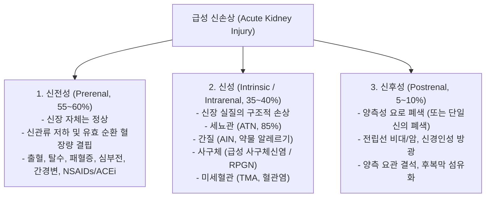
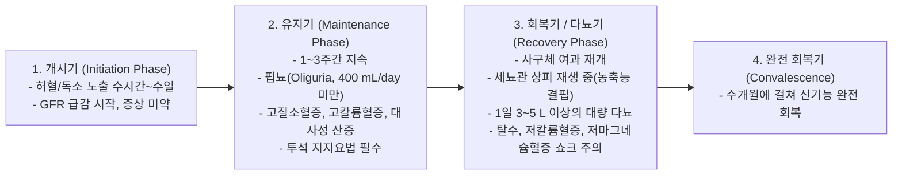
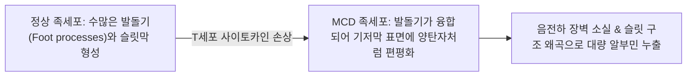
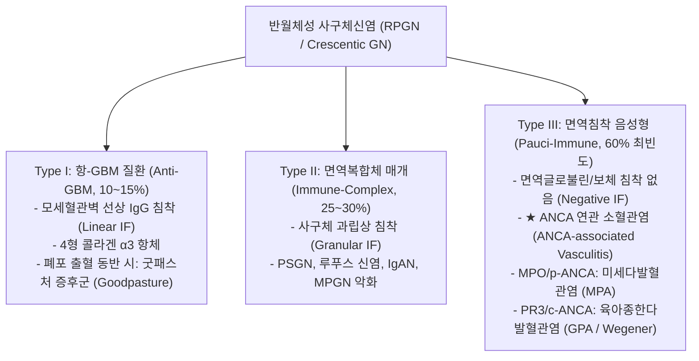

# 📑 [Netter Vol.5] Day 05: 사구체 및 세뇨관 신질환 I — 급성 신손상(AKI/ATN), 신증후군 3총사(MCD/FSGS/MN) 및 사구체신염 스펙트럼(IgAN/PSGN/MPGN/RPGN/알포트) (Section 4 Part 1)

> 📖 **원서 출처**: [The Netter Collection of Medical Illustrations - Volume 5, Urinary System.pdf (pp. 96-122)](https://drive.google.com/file/d/1vcvDctJJuo4vA2jKMPeSvjJjRpP1lhp2/view?usp=drivesdk)  
> 🏷️ **범위**: Section 4 전반부 (Plate 4-1 ~ Plate 4-27, 총 27개 플레이트 전수 수록, pp. 96–122 완독)  
> 📌 **핵심 테마**: 급성 신손상(AKI KDIGO)의 원인 분류 및 요침사 감별 표지자(진흙탕 과립원주 vs 적혈구원주 vs 백혈구원주), 급성 세뇨관 괴사(ATN)의 허혈성(S3 분절/TAL 취약성) 및 독성 병태생리와 4단계 임상 경과, 신증후군 4대 징후(대량 단백뇨, 저알부민혈증, 전신 부종, 고지혈증)와 합병증(항트롬빈 III 소실 과응고증 및 신정맥 혈전증, 면역결핍), 미세변화 신증후군(MCD)의 T세포 사이토카인 매개 족세포 발돌기 소실과 스테로이드 반응성, 국소분절 사구체경화증(FSGS)의 APOL1 유전자/과여과 손상 및 콜롬비아 분류, 막성 신병증(MN)의 PLA2R 자가항체와 은염색 "스파이크와 돔(Spike & Dome)" 상피하 침착, 신염 증후군(Nephritic syndrome)의 병태생리, 전 세계 최빈도 사구체신염인 IgA 신병증(Berger병)의 다중 타격설(Gd-IgA1)과 감염 동시성 육아 혈뇨(Synpharyngitic hematuria), 연쇄상구균 감염 후 사구체신염(PSGN)의 잠복기 대조 및 상피하 융기(Humps), 막증식성 사구체신염(MPGN)의 "전차 궤도(Tram-track)" 이중 윤곽과 C3NeF 보체 캐스케이드, 반월체성 급속 진행성 사구체신염(RPGN Type I~III: 항-GBM 굿패스처 선상 IF vs 면역복합체 과립상 IF vs Pauci-immune ANCA 혈관염), 그리고 4형 콜라겐 α5 체인 결함으로 "바구니 엮음(Basket-weave)" GBM 분열과 난청·원추각막을 동반하는 유전성 알포트 증후군(Alport syndrome) 및 얇은 기저막병 감별.

---

## 1. 개요 및 마스터 요약 (Executive Summary)

1. **급성 신손상(AKI)의 3대 범주와 요침사 감별의 결정적 법칙 (Plates 4-1 ~ 4-4)**:
   - AKI는 신전성(Prerenal, 55-60%, 초자원주, $FE_{Na} < 1\%$), 신성(Intrinsic, 35-40%), 신후성(Postrenal, 5-10%, 요로 폐색)으로 양분됨.
   - **요침사(Urine Sediment)의 시그니처**:
     - **진흙탕 갈색 과립원주 (Muddy brown granular casts)**: 급성 세뇨관 괴사(ATN)의 확진 소견.
     - **적혈구원주 (RBC casts) & 이형 적혈구(Acanthocytes)**: 사구체신염(GN) 및 혈관염의 절대적 표지자.
     - **백혈구원주 (WBC casts)**: 급성 신우신염 및 급성 간질성 신염(AIN, 호산구뇨 동반).
     - **난원형 지방체 (Oval fat bodies, 편광 시 몰타 십자 Maltese cross)**: 신증후군.
   - **급성 세뇨관 괴사 (ATN)**: 외수질의 저산소 취약성으로 인해 **근위세뇨관 S3 분절**과 **수질 굵은 상행각(TAL)**이 허혈에 가장 취약하며, 독성 ATN(아미노글리코사이드, 조영제, 횡문근융해증 미오글로빈)은 피질 근위세뇨관을 주로 침범함. 개시기 $\rightarrow$ 유지기(핍뇨, 고칼륨혈증) $\rightarrow$ 회복기(다뇨기)를 거침.

2. **신증후군 3총사의 분자 병리 및 면역 조직학적 감별 (Plates 4-5 ~ 4-13)**:
   - **신증후군 4대 진단 기준**: 하루 **$3.5\text{ g/day}$ 이상의 대량 단백뇨**, **저알부민혈증($<3.0\text{ g/dL}$)**, 전신 부종, 고지혈증/지질뇨. 항트롬빈 III 요중 유출로 인한 **신정맥 혈전증(RVT)** 및 IgG 결핍에 의한 피막성 세균 감염이 치명적 합병증임.
   - **미세변화 신증후군 (MCD, 소아 최빈도 $80\sim 90\%$)**: T세포 사이토카인에 의한 GBM 음전하 소실. **LM 정상, IF 음성, EM상 미만성 족세포 발돌기 소실(Effacement)**. 선택적 알부민뇨를 보이며 스테로이드에 극적인 반응($>90\%$).
   - **국소분절 사구체경화증 (FSGS, 성인/흑인 최빈도)**: 순환 인자(suPAR), 비만/단일신 과여과, HIV, *APOL1* 변이에 의한 족세포 탈락. **일부 사구체(국소)의 일부 모세혈관 고리(분절) 경화**, 보우만낭 유착, 비선택적 단백뇨, 스테로이드 저항성 및 높은 ESRD 진행률.
   - **막성 신병증 (MN, 고령/백인 최빈도)**: 원발성의 $70\sim 80\%$가 족세포 **PLA2R 자가항체(IgG4)**에 기인하며, 이차성은 악성종양(고형암), HBV, 루푸스 동반. **LM상 미만성 기저막 비후 및 은염색 "스파이크와 돔(Spike & Dome)", IF상 모세혈관벽 과립상 IgG/C3, EM상 상피하 침착(Subepithelial deposits)**. 신정맥 혈전증 위험이 가장 높음.

3. **증식성 사구체신염: IgA 신병증, PSGN 및 MPGN 대조 (Plates 4-14 ~ 4-24)**:
   - **IgA 신병증 (Berger병, 전 세계 최빈도 GN)**: 갈락토오스 결핍 IgA1(Gd-IgA1) 면역복합체가 사구체 **메산지움(Mesangium)**에 침착. **상기도 감염 발생 1~2일 만에 즉각 출현하는 재발성 육안적 혈뇨(Synpharyngitic hematuria)**가 특징. IF상 메산지움 우세 IgA/C3 침착.
   - **연쇄상구균 감염 후 사구체신염 (PSGN)**: A군 연쇄상구균 인후염(1~2주 후) 또는 피부감염(3~6주 후)의 **명확한 잠복기** 후 발현. **일과성 저보체혈증(C3 급감)**. IF상 "별이 빛나는 밤(Starry sky)", **EM상 거대한 상피하 융기(Subepithelial Humps)**. 소아에서 95% 이상 자연 관해.
   - **막증식성 사구체신염 (MPGN)**: LM상 세포 증식과 메산지움 삽입으로 기저막이 둘로 갈라지는 **"전차 궤도 징후(Tram-track / Double contour)"**. 면역복합체형(HCV 연관)과 보체 대체경로 조절 장애형(C3G, **C3NeF** 자가항체, 치밀침착병 DDD의 띠 모양 intramembranous 침착)으로 양분.

4. **초응급 사구체 질환: 반월체성 RPGN 3대 아형 (Plate 4-25)**:
   - 수일~수주 만에 사구체 여과율이 급락하는 임상 증후군으로, 사구체 **$50\%$ 이상에서 보우만낭 내 반월체(Crescents, 피브린+상피세포)** 형성.
   - **IF 면역형광에 따른 3대 분류**:
     ① **Type I (항-GBM 질환, 선상 Linear IF)**: 4형 콜라겐 α3 체인 항체, 폐출혈 동반 시 **굿패스처 증후군 (Goodpasture syndrome)**.
     ② **Type II (면역복합체 매개, 과립상 Granular IF)**: PSGN, 루푸스, IgAN 악화.
     ③ **Type III (Pauci-immune, 면역침착 음성 Negative IF, 60% 최빈도)**: **ANCA 연관 혈관염** (MPO/p-ANCA 미세다발혈관염, PR3/c-ANCA 베게너 육아종증).

5. **기저막 유전 질환: 알포트 증후군 vs 얇은 기저막병 (Plates 4-26 ~ 4-27)**:
   - **알포트 증후군 (Alport Syndrome)**: **X-연관 우성(85%) *COL4A5* 변이**로 기저막 4형 콜라겐 $\alpha_3\alpha_4\alpha_5$ 네트워크 붕괴. **진행성 혈뇨/신부전 + 감각신경성 난청(내이 와우 결함) + 전방원추각막(Anterior lenticonus)의 3대 삼징**. EM상 기저막의 불규칙한 분열과 파열이 얽힌 **"바구니 엮음 양상 (Basket-weave pattern)"**.
   - **얇은 기저막병 (TBMN, 양성 가족성 혈뇨)**: 상염색체 우성 *COL4A3/A4* 변이. EM상 기저막 두께가 전반적으로 $<250\text{ nm}$로 균일하게 얇아져 있으나, 난청이나 신부전 진행 없이 평생 지속성 현미경적 혈뇨만 유지되는 양성 질환.

---

## 2. 급성 신손상(AKI) 및 급성 세뇨관 괴사(ATN) (Plates 4-1 ~ 4-4)

### Plate 4-1 | 급성 신손상 개요: 원인 분류 (Overview of Acute Kidney Injury: Causes)

![[Netter_V5_Plate4-1.png]]

#### 1) AKI의 정의 및 KDIGO 진단 기준
단기간(수시간~수일) 내에 사구체 여과율이 급격히 감소하여 질소 대사산물(BUN/Cr)이 체내에 정체되는 임상 증후군:
- 48시간 이내 혈청 크레아티닌($S_{Cr}$)이 **$\ge 0.3\text{ mg/dL}$** 상승, 또는
- 이전 7일 이내 기저치 대비 **$\ge 1.5$배** 상승, 또는
- 6시간 이상 지속되는 핍뇨 (소변량 **$< 0.5\text{ mL/kg/h}$**).

#### 2) AKI의 3대 해부학적·병태생리학적 분류


---

### Plate 4-2 | 급성 신손상: 요침사 소견에 따른 감별 (Overview of AKI: Urine Sediment Findings)

![[Netter_V5_Plate4-2.png]]

#### 1) 요침사 현미경 검사 (Urine Sediment)의 질환별 시그니처

| 요침사 핵심 소견 | 현미경적 형태학 | 임상적 진단 및 의미 |
| :--- | :--- | :--- |
| **진흙탕 갈색 과립원주<br>(Muddy Brown Granular Casts)** | 세뇨관 상피세포 괴사 잔해와 Tamm-Horsfall 단백질이 뭉쳐진 짙은 갈색 원주 | **★ 급성 세뇨관 괴사 (ATN)**의 병리적 확진 표지자 |
| **신세뇨관 상피세포<br>(Renal Tubular Epithelial Cells, RTEC)** | 크고 둥근 단일 핵을 가진 세뇨관 세포 탈락체 | 중증 허혈성 또는 독성 세뇨관 손상 (ATN) |
| **적혈구원주 (RBC Casts) &<br>이형 적혈구 (Acanthocytes)** | 원주 내강에 적혈구가 빽빽이 박혀 있음, 도넛 모양 가시 돌기 적혈구 | **★ 활동성 사구체신염 (GN)**, 혈관염, 신염 증후군 (사구체 기저막 파열 반영) |
| **백혈구원주 (WBC Casts)** | 원주 내강에 분엽핵 호중구가 가득 차 있음 | **급성 신우신염 (Pyelonephritis)** 또는 **급성 간질성 신염 (AIN)** |
| **호산구뇨 (Eosinophiluria)** | Hansel 또는 Wright 염색상 호산구 관찰 | **약물 유발성 급성 간질성 신염 (AIN)**, 죽종색전증 |
| **난원형 지방체 (Oval Fat Bodies)<br>& 지방원주 (Fatty Casts)** | 콜레스테롤/지질을 탐식한 세뇨관 세포, **편광 현미경 시 몰타 십자 (Maltese cross)** | **신증후군 (Nephrotic Syndrome)**의 대량 지질뇨 |
| **초자원주 (Hyaline Casts)** | 세포 성분이 없는 투명한 순수 Tamm-Horsfall 단백질 원주 | 정상인(운동/발열 후), 탈수, **신전성 질소혈증 (Prerenal)** |

---

### Plate 4-3 | 급성 세뇨관 괴사: 원인, 병태생리 및 임상 경과 (Acute Tubular Necrosis: Pathophysiology & Clinical Features)

![[Netter_V5_Plate4-3.png]]

#### 1) 허혈성 ATN (Ischemic ATN)의 세뇨관 구획별 취약성
- 정상 신장에서 수질(Medulla)은 반류교환계 유지를 위해 전체 신혈류의 $10\%$ 미만만을 공급받아 생리적 저산소 환경($PO_2 \approx 10\sim 20\text{ mmHg}$)에 놓여 있음.
- 전신 혈압 저하 시 **외수질 외측대(Outer stripe of outer medulla)**의 저산소증이 가장 극단화됨:
  - **근위세뇨관 S3 분절 (S3 segment of PCT)**: 미토콘드리아와 능동 수송 펌프가 밀집되어 산소 소모량이 막대하므로 허혈에 가장 취약하여 조기 괴사됨.
  - **수질 굵은 상행각 (TAL)**: NKCC2 능동 수송 부하로 인해 허혈 손상에 극도로 취약.

#### 2) 신독성 ATN (Nephrotoxic ATN)의 주요 원인 물질
- **내인성 독소**:
  - **미오글로빈 (Myoglobin)**: 외상, 압궤손상, 과도한 운동에 의한 **횡문근융해증(Rhabdomyolysis)**. 관강 내 피브린과 결합하여 원주를 형성해 요관 폐색 및 활성산소 유리.
  - **헤모글로빈**: 대량 급성 용혈(ABO 부적격 수혈).
  - **면역글로불린 경쇄 (Bence Jones protein)**: 다발골수종 골수종 신병증.
- **외인성 독소**:
  - **아미노글리코사이드 항생제 (Gentamicin, Amikacin)**: 근위세뇨관 상피세포에 축적되어 리소좀 파열 및 괴사 유발 (투여 7~10일 후 발생).
  - **요오드화 방사선 조영제 (Contrast-induced AKI)**: 세뇨관 주위 혈관수축 및 직접 세뇨관 세포독성 (조영제 투여 24~48시간 후 $S_{Cr}$ 상승).
  - **항암제 (Cisplatin)**, 항진균제 (Amphotericin B).

#### 3) ATN의 임상 4단계 경과


---

### Plate 4-4 | 급성 세뇨관 괴사: 조직병리학적 소견 (Acute Tubular Necrosis: Histopathologic Findings)

![[Netter_V5_Plate4-4.png]]

#### 1) 광학현미경(LM) 상의 핵심 병리 4대 징후
1. **근위세뇨관 솔가장자리(Brush border)의 광범위한 탈락 및 소실**.
2. **세뇨관 상피세포의 공포변성, 응고 괴사(Coagulative necrosis) 및 기저막으로부터의 세포 탈락**.
3. **세뇨관 기저막의 단절 및 파열 (Tubulorrhexis)**: 허혈성 ATN에서 두드러지며, 간질강으로 세관액이 누출되는 통로가 됨.
4. **관강 내 호산성 원주 형성 (Intraluminal Casts)**: 탈락한 세포 잔해와 Tamm-Horsfall 점액단백질이 관강을 꽉 틀어막아 관강 내압을 높이고 GFR을 영으로 떨어뜨림.

---

## 3. 신증후군 3총사: MCD, FSGS, MN (Plates 4-5 ~ 4-13)

### Plate 4-5 | 신증후군 개요: 병태생리 (Overview of Nephrotic Syndrome: Pathophysiology)

![[Netter_V5_Plate4-5.png]]

#### 1) 신증후군의 정의 및 사구체 여과장벽 파괴
- **신증후군 4대 필수 징후**: 대량 단백뇨(>3.5 g/day), 저알부민혈증(<3.0 g/dL), 전신 부종, 고지혈증 및 지질뇨.
- 사구체 족세포 발돌기 및 슬릿막 손상으로 혈장 단백질(특히 알부민)이 요로로 대량 누출됨.

---

### Plate 4-6 | 신증후군 개요: 원인 분류 (Overview of Nephrotic Syndrome: Causes)

![[Netter_V5_Plate4-6.png]]

#### 1) 일차성 및 이차성 원인 질환군
- **일차성 사구체 질환**: 미세변화 신증후군(MCD, 소아 최다), 국소분절 사구체경화증(FSGS, 성인/흑인 최다), 막성 신병증(MN, 고령/백인 최다), 막증식성 사구체신염(MPGN).
- **이차성 전신 질환**: 당뇨병성 신병증(Diabetic nephropathy, 성인 전체 최빈도), 루푸스 신염(Class V), 신 아밀로이드증(Amyloidosis).

---

### Plate 4-7 | 신증후군 개요: 임상 증상 및 진단 (Overview of Nephrotic Syndrome: Presentation & Diagnosis)

![[Netter_V5_Plate4-7.png]]

#### 1) 전신 부종과 치명적 합병증
- **부종 형성 기전**: 혈장 교질삼투압 저하(Underfill) 및 원위세뇨관 ENaC 과활성에 의한 나트륨 저류(Overfill).
- **치명적 합병증**:
  - **신정맥 혈전증 (Renal Vein Thrombosis, RVT)** 및 폐색전증: 항트롬빈 III 요중 소실. (막성 신병증에서 30% 호발).
  - **피막성 세균 감염**: IgG 소실로 폐렴구균성 자발성 복막염(SBP) 호발.

#### 1) 신증후군 (Nephrotic Syndrome)의 4대 필수 징후
1. **대량 단백뇨 (Nephrotic-range Proteinuria)**: 성인 기준 **하루 $3.5\text{ g/day/1.73m}^2$ 이상** (Spot urine protein/creatinine ratio $> 3.5\text{ mg/mg}$).
2. **저알부민혈증 (Hypoalbuminemia)**: 혈청 알부민 **$< 3.0\text{ g/dL}$** (대개 $< 2.5\text{ g/dL}$).
3. **전신 부종 (Generalized Edema)**: 혈장 교질삼투압 저하(Underfill 가설) 및 원위세뇨관 ENaC 과활성에 의한 나트륨 저류(Overfill 가설)로 인한 함요 부종, 안와 부종, 복수.
4. **고지혈증 (Hyperlipidemia) 및 지질뇨 (Lipiduria)**: 간의 알부민 합성 보상 기전과 함께 지단백 합성 증가 및 지질 분해 효소(LPL) 결핍으로 혈중 콜레스테롤/LDL 급증. 소변 내 난원형 지방체(Maltese cross) 출현.

#### 2) 치명적 2대 합병증
- **과응고 상태 및 혈전색전증 (Thromboembolism)**:
  - 분자량 $58\text{ kDa}$인 **항트롬빈 III (Antithrombin III)**, 단백질 C/S가 소변으로 대량 소실되고 간에서 피브리노겐 합성이 증가함.
  - **신정맥 혈전증 (Renal Vein Thrombosis, RVT)**이 특히 막성 신병증 환자의 $30\%$에서 호발하며, DVT 및 치명적 폐색전증 유발.
- **감염 취약성**: 요중 면역글로불린(IgG) 소실 및 보체 대체인자(Factor B) 결핍으로 폐렴구균(*S. pneumoniae*)에 의한 **원발성 세균성 복막염(SBP)** 빈발.

---

### Plate 4-8 | 미세변화 신증후군: 원인 및 임상 발현 (Minimal Change Disease: Causes and Presentation)

![[Netter_V5_Plate4-8.png]]

#### 1) 역학 및 병태생리
- **역학**: **소아 특발성 신증후군의 $80\sim 90\%$를 차지하는 압도적 최빈 질환** (피크 연령 2~6세, 남아 호발). 성인 신증후군의 $10\sim 15\%$.
- **발생 기전**: T세포 기능 이상에 의해 분비된 순환 사이토카인이 사구체 족세포를 공격하여, 사구체 기저막(GBM)과 족세포 표면의 **헤파란황산 프로테오글리칸 음전하 장벽을 소실**시킴.
- **선택적 알부민뇨 (Selective Albuminuria)**: 크기 장벽은 유지되나 음전하 장벽만 깨졌으므로, 음전하를 띤 알부민($69\text{ kDa}$)만 특이적으로 빠져나가고 고분자량 면역글로불린(IgG)은 거의 빠져나가지 않음.

---

### Plate 4-9 | 미세변화 신증후군: 조직병리학적 소견 (Minimal Change Disease: Histopathology)

![[Netter_V5_Plate4-9.png]]

#### 1) 3대 현미경 병리 소견의 결정적 대조
- **광학현미경 (Light Microscopy, LM)**: **완벽히 정상 (Completely Normal)**. 사구체 세포 증식, 기저막 비후, 경화가 전혀 관찰되지 않음. ("미세변화 Minimal Change"의 유래).
- **면역형광현미경 (Immunofluorescence, IF)**: **음성 (Negative)**. 면역글로불린이나 보체 침착이 일체 없음.
- **전자현미경 (Electron Microscopy, EM, 유일한 확진 도구)**: **족세포 발돌기의 미만성 소실 및 편평 융합 (Diffuse Effacement / Flattening of Foot Processes)**.



- **치료 및 예후**: **코르티코스테로이드 (Prednisolone)** 투여 시 환아의 **$90\%$ 이상에서 수주 내 완전 관해(Complete remission)**에 도달함. 잦은 재발을 보이나 장기적 말기신부전(ESRD)으로 진행하는 경우는 극히 드묾.

---

### Plate 4-10 | 국소분절 사구체경화증: 원인 및 임상 (Focal Segmental Glomerulosclerosis: Causes and Clinical Features)

![[Netter_V5_Plate4-10.png]]

#### 1) 역학 및 병인론
- **역학**: **성인 신증후군의 최빈 원인 (특히 아프리카계 흑인에서 백인의 수 배 호발)**.
- **원인 분류**:
  - **원발성 (Primary FSGS)**: 정체불명의 순환 족세포 투과성 인자(suPAR, CLCF-1 등)에 의해 발병.
  - **이차성 (Secondary FSGS)**:
    - **사구체 과여과 손상 (Glomerular Hyperfiltration)**: 중증 비만(BMI > 30), 단일 신장(신절제술 후, 선천 신무발생), 신저형성(올리고네프로니아).
    - **바이러스 감염**: **HIV 연관 신병증 (HIVAN)**, 파보바이러스 B19.
    - **약물 독성**: 헤로인 신병증, 비스포스포네이트(Pamidronate).
    - **유전성**: **APOL1 (Apolipoprotein L1)** 유전자 G1/G2 위험 대립유전자 보유자(아프리카 조상에서 수면병 저항성이 있으나 FSGS 위험 10배 이상 폭증), 족세포 단백질 유전자(*NPHS1, NPHS2, ACTN4, TRPC6*) 변이.

---

### Plate 4-11 | 국소분절 사구체경화증: 조직병리학적 소견 (FSGS: Histopathologic Findings)

![[Netter_V5_Plate4-11.png]]

#### 1) 병리조직학적 특징 (Focal & Segmental)
- **광학현미경 (LM)**:
  - **국소성 (Focal)**: 신생검 조직 내 전체 사구체 중 일부 사구체만 침범됨 (나머지 사구체는 정상으로 보여 초기 생검 시 놓치기 쉬움).
  - **분절성 (Segmental)**: 침범된 단일 사구체 내에서도 모세혈관 고리의 일부 분절만 콜라겐 섬유화로 막힘(**경화 Sclerosis**).
  - 초자질 침착(Hyalinosis), 거품세포(Foam cells), 족세포와 보우만낭 벽측 상피 사이의 섬유성 유착(Synechiae).
- **면역형광 (IF)**: 경화된 분절 부위에 비특이적으로 포착된 **IgM 및 C3**가 덩어리 형태로 관찰됨.
- **전자현미경 (EM)**: 비경화 부위를 포함한 사구체 전반의 광범위한 족세포 발돌기 소실 및 박리.
- **임상 경과**: 비선택적 단백뇨, 현미경적 혈뇨, 고혈압 동반. 스테로이드 치료 반응률이 $20\sim 30\%$로 매우 낮으며, **환자의 $50\%$가 10년 내 말기신부전(ESRD)으로 진행함**. 신장이식 후 $30\sim 50\%$에서 즉각 재발함.

---

### Plate 4-12 | 막성 신병증: 원인 및 임상 특징 (Membranous Nephropathy: Causes and Clinical Features)

![[Netter_V5_Plate4-12.png]]

#### 1) 역학 및 원발성 자가면역 기전
- **역학**: **고령 백인 성인 신증후군의 최빈 원인** (50~60대 호발).
- **원발성 막성 신병증 (Primary MN, 75~80%)**:
  - 족세포 족돌기 세포막에 발현된 **M형 포스포리파아제 A2 수용체 (PLA2R)**에 대한 순환 자가항체(**IgG4**)가 결합하여 현장에서 상피하 면역복합체(In situ immune complex)를 형성함 (환자의 $70\sim 80\%$).
  - 나머지 환자에서 **THSD7A** 자가항체 확인.
- **이차성 막성 신병증 (Secondary MN, 20~25%)**:
  - **악성 종양 (Malignancy, 고령자에서 10~20%)**: 폐암, 대장암, 위암, 유방암 (원인 불명 막성 신병증 환자는 전신 암 스크리닝 필수!).
  - **감염**: **B형 간염 (HBV, 소아 호발)**, C형 간염, 매독.
  - **자가면역**: 전신홍반루푸스 (Lupus Nephritis Class V).
  - **약물**: 금(Gold) 제제, 페니실라민, NSAIDs.

---

### Plate 4-13 | 막성 신병증: 조직병리학적 소견 (Membranous Nephropathy: Histopathologic Findings)

![[Netter_V5_Plate4-13.png]]

#### 1) 특징적 3대 병리 소견
- **광학현미경 (LM)**:
  - 사구체 세포 증식 없이 모세혈관벽이 전반적으로 두꺼워지는 **미만성 균일 기저막 비후 (Diffuse uniform capillary wall thickening)**.
  - **은염색 (PAM / Jones Silver Stain)**: 상피하 침착물 사이사이로 기저막 성분이 돌기 모양으로 자라나 감싸는 **"스파이크와 돔 (Spike and Dome)" 양상**.
- **면역형광 (IF)**:
  - 모든 사구체 모세혈관벽을 따라 미세하게 반짝이는 **과립상 IgG 및 C3의 연속 침착 (Fine granular capillary wall staining)**.
- **전자현미경 (EM, 병기 판정의 기준)**:
  - **상피하 전자조밀 침착 (Subepithelial electron-dense deposits)**: 기저막(GBM)과 족세포 발돌기 사이에 면역복합체가 축적됨.
- **합병증**: 신증후군 질환군 중 **신정맥 혈전증 (Renal Vein Thrombosis, RVT)**의 발생 위험이 가장 높으므로 혈청 알부민 $<2.0\sim 2.5\text{ g/dL}$ 시 예방적 항응고 요법을 적극 고려함.

---

## 4. 증식성 사구체신염: IgAN, PSGN, MPGN (Plates 4-14 ~ 4-24)

### Plate 4-14 | 사구체신염 개요: 임상 양상 및 신염 증후군 (Overview of Glomerulonephritis: Clinical Features)

![[Netter_V5_Plate4-14.png]]

#### 1) 신염 증후군 (Nephritic Syndrome)의 5대 특징
- 사구체 모세혈관벽에 염증 세포가 침윤하고 기저막이 파열되어 발생함:
  ① **혈뇨 (Hematuria)**: 콜라색 소변, 이형 적혈구(Acanthocytes), **적혈구원주 (RBC casts)**.
  ② **핍뇨 (Oliguria)** 및 GFR 급감.
  ③ **신성 고혈압 (Hypertension)**: 체액량 팽창.
  ④ 경도~중등도 부종.
  ⑤ 비신증 범위 단백뇨 (<3.5 g/day).

---

### Plate 4-15 | 사구체신염 개요: 조직병리학적 소견 (Overview of Glomerulonephritis: Histopathology)

![[Netter_V5_Plate4-15.png]]

#### 1) 사구체 염증 반응의 3대 조직 패턴
- **내모세혈관 증식 (Endocapillary proliferation)**: 내피세포 및 단핵구/호중구 침윤으로 모세혈관 내강 폐쇄.
- **메산지움 증식 (Mesangial hypercellularity)**: 메산지움 세포 및 기질 확장.
- **체외 증식 / 반월체 (Extracapillary proliferation / Crescents)**: 보우만낭 내 벽측 상피세포 증식.

#### 1) 신염 증후군 (Nephritic Syndrome)의 병태생리
사구체 모세혈관벽에 염증 세포(호중구, 대식세포)가 유입되고 면역 침착이 발생하여 혈관벽이 파열되고 여과 면적이 급감하는 임상 상태:
1. **혈뇨 (Hematuria)**: GBM 파열로 적혈구가 요로로 탈출. 원위세뇨관을 지나며 삼투압과 pH 변화로 쭈그러진 **이형 적혈구(Acanthocytes)** 및 요세관 단백질과 엉겨붙은 **적혈구원주 (RBC casts)** 출현 (사구체성 혈뇨의 확진 소견).
2. **핍뇨 (Oliguria) 및 GFR 급감**: 사구체 내강이 염증 세포와 증식된 내피/메산지움 세포로 막힘.
3. **체액량 팽창성 신성 고혈압 (Hypertension) 및 부종**: GFR 감소로 인한 신장의 나트륨/수분 배설 장애.

---

### Plate 4-16 | IgA 신병증: 원인 및 임상 특징 (IgA Nephropathy: Causes and Clinical Features)

![[Netter_V5_Plate4-16.png]]

#### 1) 역학 및 다중 타격설 (Multi-Hit Hypothesis)
- **역학**: **전 세계 및 한국에서 가장 흔한 원발성 사구체신염** (젊은 10~30대 남성에서 호발).
- **병인 4단계 (Multi-hit Model)**:
  - **Hit 1**: 점막 B림프구 이상으로 힌지 부위 갈락토오스가 결핍된 **비정상적 IgA1 (Galactose-deficient IgA1, Gd-IgA1)**이 혈중으로 분비됨.
  - **Hit 2**: 비정상 Gd-IgA1의 노출된 당 사슬을 항원으로 인식하는 **자가항체(IgG 또는 IgA)**가 생성됨.
  - **Hit 3**: 대형 면역복합체 형성.
  - **Hit 4**: 면역복합체가 사구체 **메산지움 (Mesangium)**에 침착 $\rightarrow$ 메산지움 세포 증식, 사이토카인 분비, 기질 확장.

#### 2) 임상적 특징: 감염 동시성 육아 혈뇨 (Synpharyngitic Hematuria)
- **상기도 감염(인후염, 편도염)이나 장염 시작 후 불과 1~2일(24~48시간) 이내에 즉각적으로 콜라색 육안적 혈뇨가 폭발**함.
- 감염 후 1~3주의 잠복기를 거쳐 나타나는 연쇄상구균 감염 후 사구체신염(PSGN)과의 결정적 감별 포인트임!

---

### Plate 4-17 | IgA 신병증: 조직병리학적 소견 (IgA Nephropathy: Histopathology)

![[Netter_V5_Plate4-17.png]]

#### 1) 광학현미경 및 면역형광 소견
- **LM 소견**: 사구체 지지 구조물인 **메산지움 세포 증식 (Mesangial hypercellularity)** 및 메산지움 기질 확장.
- **IF 확진 소견**: 사구체 메산지움 영역을 따라 굵은 알갱이 모양으로 강하게 염색되는 **메산지움 우세 IgA 및 C3 과립상 침착 (Dominant Mesangial IgA Deposition)**.

---

### Plate 4-18 | IgA 신병증: 전자현미경 및 옥스포드 분류 (IgA Nephropathy: Histopathology Continued)

![[Netter_V5_Plate4-18.png]]

#### 1) 전자현미경 소견 및 MEST-C 예후 판정
- **EM 소견**: 메산지움 및 부메산지움(Paramesangial) 영역의 고밀도 전자조밀 침착물 (Electron-dense deposits).
- **Oxford MEST-C 점수**: M (메산지움 증식), E (내모세혈관 증식), S (분절 경화), T (세뇨관 위축/섬유화 - 최강 예후인자), C (반월체 형성).

#### 1) 조직병리 및 옥스포드 MEST-C 분류
- **광학현미경 (LM)**:
  - 사구체 지지 구조물인 **메산지움 세포 증식 (Mesangial hypercellularity)** 및 메산지움 기질 확장. 심한 경우 내피세포 증식 및 국소 분절 경화.
- **면역형광 (IF, 확진 기준)**:
  - 사구체 메산지움 영역을 따라 굵은 알갱이 모양으로 강하게 염색되는 **메산지움 우세 IgA 및 C3 과립상 침착 (Dominant Mesangial IgA Deposition)**.
- **전자현미경 (EM)**:
  - 메산지움 및 수축기 영역의 전자조밀 침착물 (Paramesangial electron-dense deposits).
- **예후 평가 (Oxford MEST-C Score)**:
  - **M** (Mesangial hypercellularity), **E** (Endocapillary hypercellularity), **S** (Segmental glomerulosclerosis), **T** (Tubular atrophy / Interstitial fibrosis), **C** (Crescents).
  - T 점수(세뇨관 위축/섬유화)가 높을수록 ESRD 진행 위험이 가장 강력함.

---

### Plate 4-19 | 연쇄상구균 감염 후 사구체신염: 원인 및 임상 (Post-infectious GN: Causes and Features)

![[Netter_V5_Plate4-19.png]]

#### 1) 역학 및 뚜렷한 잠복기 (Latent Period)
- A군 베타 용혈성 연쇄상구균(GAS)의 신염유발성 균주(M 단백 12, 49형 등) 감염 후 발생 (소아 5~12세 호발):
  - **인후염 (Pharyngitis) 후: 1 ~ 2주 잠복기** (평균 10일).
  - **농가진/피부감염 (Impetigo) 후: 3 ~ 6주 잠복기** (평균 3주).
- 주요 징후: 콜라색 소변, 안와 주위 부종, 신성 고혈압, 핍뇨.

#### 2) 혈청학적 검사 (저보체혈증)
- **ASO (Anti-streptolysin O) 타이타 상승**: 인후염 환자의 $80\%$에서 양성.
- **Anti-DNase B**: 피부 감염(농가진) 후 PSGN 진단에 가장 민감하고 신뢰도 높음.
- **혈청 C3 급격한 저하 (Hypocomplementemia)**: 보체 대체 경로의 폭발적 소모로 인해 **발병 초기 C3가 극단적으로 감소**하며, 질환 호전과 함께 **6~8주 이내에 정상으로 회복**함 (8주 이상 저보체혈증 지속 시 MPGN이나 루푸스 신염 감별 필수).

---

### Plate 4-20 | 연쇄상구균 감염 후 사구체신염: 광학 및 면역형광 소견 (Post-infectious GN: Histopathology)

![[Netter_V5_Plate4-20.png]]

#### 1) 광학현미경 및 면역형광 패턴
- **LM 소견**: 사구체 크기가 커지고 호중구, 대식세포, 내피세포 증식으로 내강이 꽉 들어찬 **미만성 내모세혈관 증식성 사구체신염 (Diffuse Endocapillary Proliferative GN)**.
- **IF 소견**: 사구체 기저막과 메산지움을 따라 거친 알갱이 모양으로 불규칙하게 흩뿌려진 IgG 및 C3 침착 (**"별이 빛나는 밤 Starry-sky pattern"**).

---

### Plate 4-21 | 연쇄상구균 감염 후 사구체신염: 전자현미경 소견 (Post-infectious GN: Histopathology Continued)

![[Netter_V5_Plate4-21.png]]

#### 1) 전자현미경 상의 병변 특이적 융기 소견
- **EM 상피하 융기 (Subepithelial "Humps")**: 사구체 기저막(GBM) 외측과 족세포 발돌기 사이에 솟아오른 거대한 돔 모양의 면역복합체 덩어리. 질환 호전과 함께 수개월에 걸쳐 점진적 흡수 소멸됨.

#### 1) 특징적 3대 현미경 소견
- **광학현미경 (LM)**:
  - 사구체가 거대해지고 내피세포, 메산지움 세포 및 침윤된 호중구/단핵구로 모세혈관 내강이 빈틈없이 꽉 들어차 혈류가 차단되는 **미만성 내모세혈관 증식성 사구체신염 (Diffuse Endocapillary Proliferative GN)**.
- **면역형광 (IF)**:
  - 사구체 모세혈관벽과 메산지움을 따라 거친 알갱이 모양으로 불규칙하게 흩뿌려진 IgG 및 C3 침착 (**"별이 빛나는 밤 Starry-sky pattern"** 또는 "Garland pattern").
- **전자현미경 (EM, 병변 특이적)**:
  - 사구체 기저막(GBM) 외측의 족세포 아래 공간에 솟아오른 거대한 돔 모양의 **상피하 융기 (Subepithelial "Humps")**.

---

### Plate 4-22 | 막증식성 사구체신염: 원인, 특징 및 평가 (MPGN: Causes, Features, and Assessment)

![[Netter_V5_Plate4-22.png]]

#### 1) 막증식성 사구체신염 (MPGN)의 현대적 병인 분류
과거의 병리학적 분류(Type I, II, III)에서 벗어나, 면역형광 염색 결과에 기반한 병태생리학적 분류로 전환됨:
1. **면역글로불린/면역복합체 매개 MPGN (Ig-mediated MPGN)**:
   - 만성 항원 자극으로 항원-항체 복합체가 형성되어 고전 보체 경로 활성화 (C3, C4 동반 저하).
   - 원인: **만성 C형 간염 (HCV, 혼합 한랭글로불린혈증 Mixed Cryoglobulinemia 동반)**, B형 간염, 아급성 세균성 심내막염, 전신홍반루푸스(SLE), 단클론 감마글로불린혈증.
2. **보체 매개 MPGN / C3 사구체병증 (C3 Glomerulopathy, C3G)**:
   - 면역복합체 없이 **보체 대체 경로(Alternative pathway)의 자율적 과활성화**로 C3만 선택적 침착 및 소모 (C3 현저한 저하, C4 정상).

---

### Plate 4-23 | 막증식성 사구체신염: 보체 캐스케이드 (MPGN: Classical & Alternative Complement Pathways)

![[Netter_V5_Plate4-23.png]]

#### 1) C3 신염 인자 (C3 Nephritic Factor, C3NeF)의 분자 작용
- C3 사구체병증(특히 치밀침착병 DDD) 환자의 $80\%$에서 검출되는 자가항체.
- 대체 경로의 **C3 전환효소 (C3bBb)**에 결합하여 이 효소를 분해로부터 안정화시킴.
- 반감기가 $10$배 이상 연장된 C3 전환효소가 혈장 내 C3를 무제한으로 쪼개어 체내 보체를 고갈시키고 사구체 기저막에 C3 분해 산물을 끊임없이 침착시킴.

---

### Plate 4-24 | 막증식성 사구체신염: 조직병리학적 소견 (MPGN: Histopathologic Findings)

![[Netter_V5_Plate4-24.png]]

#### 1) 광학현미경: 전차 궤도 징후 (Tram-track Appearance)
- **LM 소견**:
  - 메산지움 세포와 기질의 극심한 증식으로 사구체가 뚜렷한 소엽 형태를 이루는 **소엽 구조 강조 (Lobular accentuation)**.
  - 은염색(Silver stain)상 모세혈관벽 기저막이 두 줄로 갈라져 보이는 **"전차 궤도 징후 (Tram-track sign)"** 또는 **이중 윤곽 (Double contour)**.
  - 발생 기전: 증식된 메산지움 세포질과 단핵구가 내피세포와 GBM 사이로 파고들어 침투(Mesangial interposition)하면서, 내피세포 아래에 새로운 기저막을 추가 합성하여 기저막이 두 겹으로 갈라짐.
- **전자현미경 (EM)**:
  - **면역복합체형 MPGN**: **내피하 전자조밀 침착 (Subendothelial deposits)**.
  - **치밀침착병 (Dense Deposit Disease, DDD / 구 Type II)**: 사구체 기저막 치밀층(Lamina densa) 내부를 따라 리본 모양으로 길게 이어지는 극도로 짙은 **기저막내 띠 모양 침착 (Intramembranous dense ribbon-like deposits)**.

---

## 5. 반월체성 RPGN 및 기저막 유전 질환 (Plates 4-25 ~ 4-27)

### Plate 4-25 | 급속 진행성 사구체신염: 반월체성 사구체신염 (Rapidly Progressive Glomerulonephritis / Crescentic GN)

![[Netter_V5_Plate4-25.png]]

#### 1) 병태생리 및 반월체 (Crescents) 형성 기전
- 수일에서 수주 만에 사구체 기능이 파괴되어 급속히 핍뇨와 요독증, 말기신부전으로 진행하는 임상 응급 증후군.
- 사구체 모세혈관벽에 괴사와 천공이 발생 $\rightarrow$ 피브린(Fibrin), 적혈구, 혈장 단백질이 보우만낭 내부로 쏟아져 나옴 $\rightarrow$ 보우만낭 벽측 상피세포(Parietal cells)가 자극받아 폭발적으로 증식하고 대식세포가 침윤하여 **초승달 모양의 반월체 (Crescents)**를 형성 $\rightarrow$ 사구체 모세혈관 뭉치를 외부에서 질식 압박하여 여과 완전 정지.

#### 2) 면역형광(IF)에 기반한 3대 아형 감별 진단



---

### Plate 4-26 | 알포트 증후군 및 얇은 기저막병: 임상 특징 (Alport Syndrome & TBMN: Pathophysiology and Clinical Features)

![[Netter_V5_Plate4-26.png]]

#### 1) 알포트 증후군 (Alport Syndrome / 유전성 신염)
- **유전학**: **X-연관 우성 ($85\%$)**. **COL4A5 (염색체 Xq22)** 유전자 돌연변이. (상염색체 열성/우성은 *COL4A3*, *COL4A4* 변이).
- 정상 성인 사구체 기저막, 내이 와우, 안구 수정체낭을 구성하는 **4형 콜라겐 $\alpha_3\alpha_4\alpha_5$ 육량체 사슬**이 결손되어 기저막이 구조적 지지력을 상실함.
- **임상 3대 클래식 징후 (Clinical Triad)**:
  1. **진행성 신장 질환**: 소아기 무증상 미세혈뇨로 시작하여 청소년기에 단백뇨, 고혈압, 사구체 경화가 발생하고, **남아 환자는 $20\sim 40$대에 $100\%$ 말기신부전(ESRD)으로 진행**.
  2. **감각신경성 난청 (Bilateral Sensorineural Hearing Loss)**: 와우 기저판 콜라겐 이상으로 학령기 이후 고주파수($2,000\sim 8,000\text{ Hz}$) 영역부터 난청 발생.
  3. **안과적 기형**: 수정체 중심부가 원추형으로 돌출하는 **전방원추각막 (Anterior lenticonus)** 및 망막 황반부 백색 반점.

---

### Plate 4-27 | 알포트 증후군 및 얇은 기저막병: 전자현미경 소견 (Alport & TBMN: Electron Microscopy)

![[Netter_V5_Plate4-27.png]]

#### 1) 전자현미경(EM) 상의 결정적 형태학 대조
- **알포트 증후군 (Alport Syndrome, Basket-weave Pattern)**:
  - 사구체 기저막(GBM)의 두께가 비정상적으로 불규칙하여 얇은 부위와 비후된 부위가 교대로 나타남.
  - 기저막 중심의 라미나 덴사(Lamina densa)가 세로로 여러 겹 갈라지고 찢어지며 그물망처럼 얽히는 **"바구니 엮음 양상 (Basket-weave appearance / Splitting and Lamellation)"**.
- **얇은 기저막병 (Thin Basement Membrane Nephropathy, TBMN / 양성 가족성 혈뇨)**:
  - *COL4A3 / COL4A4* 유전자의 이형접합체(Heterozygous) 변이로 인한 상염색체 우성 양성 질환.
  - EM상 기저막의 분열이나 층판화 없이, **GBM 두께 전체가 균일하게 $150\sim 250\text{ nm}$ 이하로 얇아져 있음** (정상 성인 $300\sim 400\text{ nm}$).
  - 난청이나 안과 이상이 전혀 없고, 평생 지속되는 무증상 현미경적 혈뇨만 보이며 신기능이 정상 유지되는 양호한 예후.

---

## 6. 원서 도판 추출용 파이썬 스크립트 (Plates 4-1 ~ 4-27)

Obsidian 노트의 이미지 임베드(`![[Netter_V5_Plate4-X.png]]`)와 1:1 매칭되는 Section 4 Part 1의 27개 도판 이미지를 원본 PDF에서 추출하기 위한 로컬 실행용 Python 코드입니다.

```python
import fitz  # PyMuPDF
import os

# 1. 파일 경로 및 저장 디렉토리 설정
pdf_path = "The Netter Collection of Medical Illustrations - Volume 5, Urinary System.pdf"
output_dir = "헤르메스/책 읽기/Netter_Vol5_비뇨기계/첨부파일"
os.makedirs(output_dir, exist_ok=True)

# 2. Section 4 Part 1 도판별 PDF 페이지 매핑 (Plates 4-1 ~ 4-27, 원서 pp. 96~122)
plate_page_mapping = {
    "Plate4-1": 120,   # Overview of Acute Kidney Injury: Causes
    "Plate4-2": 121,   # Overview of AKI: Possible Urine Findings
    "Plate4-3": 122,   # Acute Tubular Necrosis: Pathophysiology and Features
    "Plate4-4": 123,   # Acute Tubular Necrosis: Histopathological Findings
    "Plate4-5": 124,   # Overview of Nephrotic Syndrome: Pathophysiology
    "Plate4-6": 125,   # Overview of Nephrotic Syndrome: Causes
    "Plate4-7": 126,   # Overview of Nephrotic Syndrome: Presentation and Diagnosis
    "Plate4-8": 127,   # Minimal Change Disease: Causes and Presentation
    "Plate4-9": 128,   # Minimal Change Disease: Histopathology
    "Plate4-10": 129,  # FSGS: Causes, Features, and Histopathology
    "Plate4-11": 130,  # FSGS: Histopathological Findings (Continued)
    "Plate4-12": 131,  # Membranous Nephropathy: Causes and Features
    "Plate4-13": 132,  # Membranous Nephropathy: Histopathology
    "Plate4-14": 133,  # Overview of Glomerulonephritis: Features and Histopathology
    "Plate4-15": 134,  # Overview of Glomerulonephritis: Histopathology (Continued)
    "Plate4-16": 135,  # IgA Nephropathy: Causes and Clinical Features
    "Plate4-17": 136,  # IgA Nephropathy: Histopathology
    "Plate4-18": 137,  # IgA Nephropathy: Histopathology (Continued)
    "Plate4-19": 138,  # Post-infectious GN: Causes and Features
    "Plate4-20": 139,  # Post-infectious GN: Histopathology
    "Plate4-21": 140,  # Post-infectious GN: Histopathology (Continued)
    "Plate4-22": 141,  # MPGN: Causes, Features, and Assessment
    "Plate4-23": 142,  # MPGN: Classical and Alternative Pathways
    "Plate4-24": 143,  # MPGN: Histopathological Findings (Tram-track)
    "Plate4-25": 144,  # Rapidly Progressive Glomerulonephritis (Crescentic GN)
    "Plate4-26": 145,  # Alport Syndrome / TBMN: Pathophysiology and Features
    "Plate4-27": 146,  # Alport Syndrome / TBMN: Electron Microscopy
}

doc = fitz.open(pdf_path)
zoom = 300 / 72  # 300 DPI 초고해상도
matrix = fitz.Matrix(zoom, zoom)

print(f"[*] 총 {len(plate_page_mapping)}개 도판 추출 시작...")
for plate_name, page_num in plate_page_mapping.items():
    page = doc.load_page(page_num - 1)  # 0-indexed
    pix = page.get_pixmap(matrix=matrix, alpha=False)
    
    file_name = f"Netter_V5_{plate_name}.png"
    save_path = os.path.join(output_dir, file_name)
    pix.save(save_path)
    print(f"  [+] 추출 성공: {file_name} (PDF p.{page_num})")

doc.close()
print("[*] Section 4 Part 1 완결: Plates 4-1 ~ 4-27 전수 이미지 추출 완료.")
```
