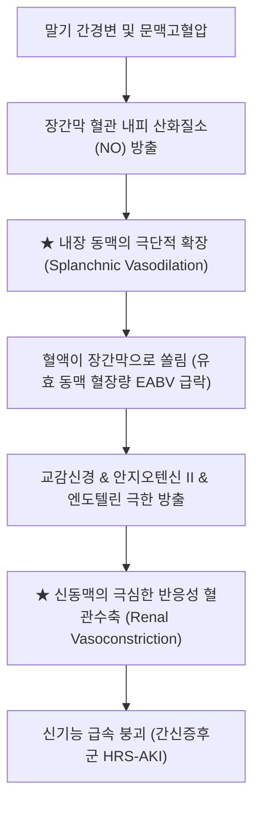
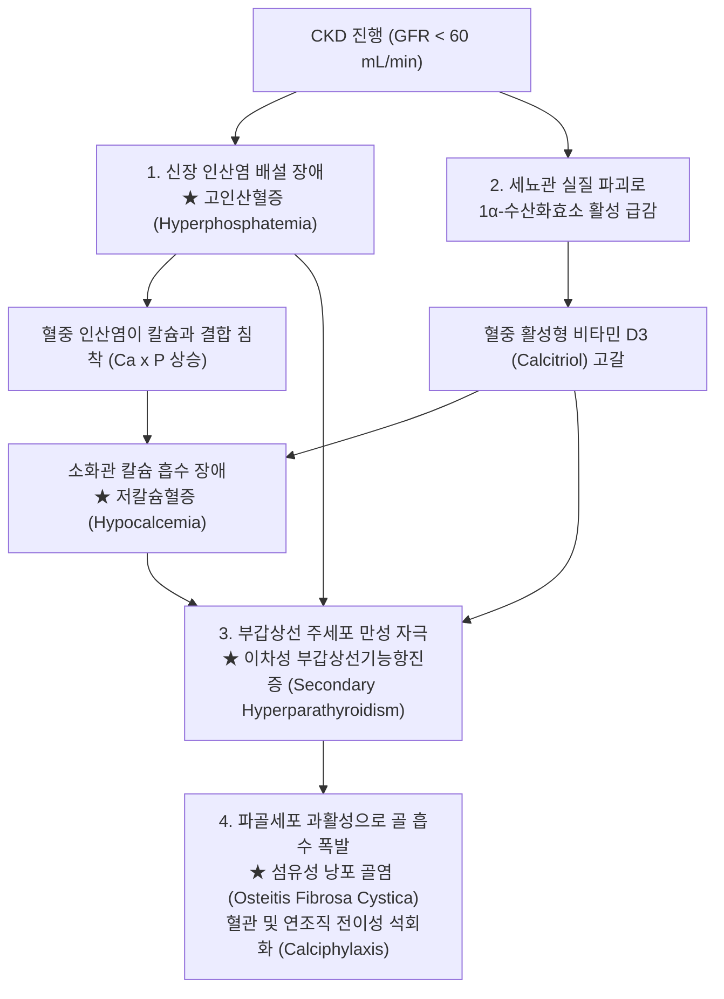

# 📑 [Netter Vol.5] Day 06: 신질환 II — 간질성 신염, 혈전미세혈관병증(TMA), 신혈관성 고혈압, 간신증후군, 전신질환의 신침범(당뇨/루푸스/골수종/혈관염) 및 만성 콩팥병·요독증 (Section 4 Part 2 완결)

> 📖 **원서 출처**: [The Netter Collection of Medical Illustrations - Volume 5, Urinary System.pdf (pp. 123-170)](https://drive.google.com/file/d/1vcvDctJJuo4vA2jKMPeSvjJjRpP1lhp2/view?usp=drivesdk)  
> 🏷️ **범위**: Section 4 후반부 (Plate 4-28 ~ Plate 4-70, 총 43개 플레이트 전수 수록, pp. 123–170 완독)  
> 📌 **핵심 테마**: 약물 유발성 급성 간질성 신염(AIN)의 3대 알레르기 삼징과 호산구뇨, 진통제 신병증(Analgesic nephropathy)의 신유두 괴사(Ring shadow)와 요로상피암 위험, 혈전미세혈관병증(TMA)의 파편적혈구(Schistocytes) 및 Shiga 독소 HUS vs ADAMTS13 결핍 TTP의 Pentad 감별, 신동맥 협착(RAS)의 죽상경화증 vs FMD(염주알 징후) 및 ACEi 유발 급성 신부전, 심신증후군(CRS 신울혈)과 간신증후군(HRS 내장 혈관확장과 Terlipressin), 악성 고혈압의 세동맥 섬유소모양 괴사 및 양파껍질 징후(Hyperplastic arteriolosclerosis), 당뇨병성 신병증(DN)의 킴멜스틸-윌슨 결절(Kimmelstiel-Wilson nodules)과 미세알부민뇨 스크리닝, 신 아밀로이드증(AL/AA)의 콩고 레드 염색 편광 사과-녹색 복굴절, 루푸스 신염(LN)의 ISN/RPS Class I~VI 병리 분류와 Class IV 철사줄 고리(Wire-loop) 및 Full-House 면역형광, 골수종 원주 신병증(Cast nephropathy)의 Bence Jones 단백질 폐색, HIVAN의 허탈성 FSGS(Collapsing variant)와 관망상 봉입체(TRI), 임신 전자간증의 사구체 내피모양세포증(Glomerular endotheliosis), 헤노흐-쇤라인 자반증(HSP), 파브리병의 Gb3 축적과 전자현미경 얼룩말 소체(Zebra bodies), 시스틴증의 소아 판코니 증후군, 그리고 만성 콩팥병(CKD KDIGO G1~G5 병기)의 요독 증후군(Uremic pericarditis/encephalopathy) 및 미네랄-골질환(CKD-MBD: 고인산혈증-저칼슘혈증-이차성 부갑상선기능항진증-섬유성 낭포 골염 축).

---

## 1. 개요 및 마스터 요약 (Executive Summary)

1. **간질성 신염 및 유두 괴사의 임상-병리 스펙트럼 (Plates 4-28 ~ 4-31)**:
   - **급성 간질성 신염 (AIN)**: 약물($70\sim 75\%$, NSAIDs, 페니실린, PPI, 설폰아마이드) 유발 면역 반응으로 **발열, 피부 발진, 관절통의 고전적 3대 삼징($10\sim 15\%$)**과 **요중 호산구증가증(Hansel 염색)**, 백혈구원주를 보이며, 신생검상 간질 부종 및 **세뇨관염(Tubulitis)**을 나타냄 (원인 약제 즉시 중단 및 조기 스테로이드 치료).
   - **진통제 신병증 (Analgesic Nephropathy)**: 복합 진통제(페나세틴, 아스피린, 아세트아미노펜) 장기 복용으로 직세관 수질 허혈과 세뇨관 독성이 중첩되어 **신유두 괴사(Renal Papillary Necrosis, IVP상 고리 징후 Ring shadow)**를 초래하고, 장기적으로 신우·요관 **요로상피암(Urothelial CA)** 발생 위험을 수십 배 증가시킴.

2. **미세혈관병증, 혈관성 신질환 및 장기 부전 상호작용 (Plates 4-32 ~ 4-44)**:
   - **혈전미세혈관병증 (TMA)**: 미세혈관병성 용혈성 빈혈(MAHA, 파편적혈구 Schistocytes), 혈소판 감소증, 장기 허혈 삼징. 소아 시가 독소 오염 대장균(O157:H7) 감염 후 신부전이 주도하는 **전형적 HUS**, 보체 대체경로 이상인 **비전형적 aHUS(Eculizumab 치료)**, vWF 절단 효소인 **ADAMTS13 결핍**으로 신경학적 증상이 주도하는 **TTP(응급 혈장교환술 PLEX 필수)**로 명확히 감별됨.
   - **신동맥 협착 (RAS)**: 고령 죽상경화증($75\%$, 기원부 협착) vs 젊은 여성 **섬유근성 이형성증(FMD, $25\%$, 중원위부 염주알 징후 String-of-beads)**. 골드블랫 신장 기전에 의한 고혈압을 유발하며, **ACEi/ARB 투여 후 사구체 여과압 붕괴로 혈청 크레아티닌이 30% 이상 급상승**하는 것이 진단적 단서임.
   - **심신증후군(CRS)**의 신정맥 울혈과 **간신증후군(HRS)**의 내장 동맥 극단 확장(NO 매개)에 따른 신혈관 수축(Terlipressin+알부민 치료).
   - **고혈압성 신병증**: 양성 만성 고혈압의 **유리질 세동맥경화증(Hyaline arteriolosclerosis, 가죽 모양 과립상 표면)** vs 이완기 혈압 $>120\text{ mmHg}$ 악성 고혈압의 **섬유소모양 괴사(Fibrinoid necrosis) 및 동심원상 양파껍질 징후(Hyperplastic arteriolosclerosis)**.

3. **전신 대사·면역 질환의 사구체 침범 (Plates 4-45 ~ 4-54)**:
   - **당뇨병성 신병증 (DN)**: 전 세계 ESRD 원인 1위($40\sim 50\%$). 사구체 고여과 $\rightarrow$ **미세알부민뇨($30\sim 300\text{ mg/day}$)** $\rightarrow$ 현성 단백뇨. 병리학적으로 미만성 메산지움 확장 및 병변 특이적인 **킴멜스틸-윌슨 결절 (Kimmelstiel-Wilson Nodules, 무세포성 구형 결절)** 형성 (ACEi/ARB 및 SGLT2i 치료).
   - **신 아밀로이드증 (Amyloidosis)**: AL(골수종 경쇄) 또는 AA(만성 염증 SAA) 섬유단백질 침착. **콩고 레드(Congo Red) 염색 후 편광 현미경 관찰 시 특유의 "사과-녹색 복굴절 (Apple-green birefringence)"** 확진.
   - **루푸스 신염 (Lupus Nephritis)**: ISN/RPS Class I~VI 분류. **Class IV 미만성 루푸스 신염(Diffuse)**이 가장 흔하고 치명적이며, 내피하 침착에 의한 **"철사줄 고리 징후 (Wire-loop lesions)"** 및 **Full-House 면역형광 (IgG, IgA, IgM, C3, C1q 전원 양성)**을 나타냄.
   - **골수종 신병증 (Myeloma Cast Nephropathy)**: Bence Jones 단백질(κ/λ 경쇄)이 원위세뇨관 Tamm-Horsfall 점액단백질과 엉겨붙어 거대세포 반응을 동반하는 왁스양 원주를 형성하여 관강을 폐쇄함.

4. **특수 전신 질환: 감염, 임신, 소혈관염 및 유전 대사 질환 (Plates 4-55 ~ 4-65)**:
   - **HIV 연관 신병증 (HIVAN)**: HIV가 족세포를 직접 감염시켜 사구체 모세혈관 고리가 쪼그라드는 **허탈성 FSGS (Collapsing variant)**, 미세낭종성 세뇨관 확장 및 EM상 내피세포질의 **관망상 봉입체 (Tubuloreticular inclusions, TRIs)**를 형성함.
   - **임신 전자간증 (Preeclampsia)**: 항혈관신생인자(sFlt-1)에 의한 신장 내피세포 부종 및 관강 폐색인 **사구체 내피모양세포증 (Glomerular Endotheliosis)** 유발 (HELLP 증후군: 용혈, 간효소 상승, 혈소판 감소).
   - **헤노흐-쇤라인 자반증 (HSP / IgA 혈관염)**: 촉지성 자반, 관절통, 복통, 신염(IgA 신병증과 동일한 메산지움 IgA 침착).
   - **파브리병 (Fabry Disease)**: *GLA* 효소 결핍, Gb3 축적, EM상 족세포 **얼룩말 소체 (Zebra bodies)**. **시스틴증 (Cystinosis)**: 리소좀 시스틴 축적으로 소아 **판코니 증후군(Fanconi syndrome)**의 최빈 원인.

5. **만성 콩팥병(CKD), 요독증 및 미네랄-골질환(CKD-MBD) (Plates 4-66 ~ 4-70)**:
   - **CKD 정의 및 병기**: 3개월 이상 신손상 또는 $GFR < 60\text{ mL/min/1.73m}^2$ (G1~G5).
   - **요독 증후군 (Uremia)**: 요독 독소 축적으로 **요독성 심낭염(Pericarditis, 심낭마찰음, 응급 투석 적응증)**, 요독성 뇌증, 혈소판 기능 부전성 출혈.
   - **CKD-MBD 병태생리 연쇄**: GFR 저하 $\rightarrow$ **인산염 배설 장애(고인산혈증)** + 1α-수산화효소 파괴로 **활성형 비타민 D 결핍(저칼슘혈증)** $\rightarrow$ 부갑상선 만성 자극으로 **이차성 부갑상선기능항진증 (Secondary Hyperparathyroidism)** 폭발 $\rightarrow$ 골격 과다 파괴로 **섬유성 낭포 골염 (Osteitis fibrosa cystica)** 및 전신 혈관 석회화.

---

## 2. 간질성 신질환 및 신유두 괴사 (Plates 4-28 ~ 4-31)

### Plate 4-28 | 급성 간질성 신염: 원인 및 임상 특징 (Acute Interstitial Nephritis: Causes and Clinical Features)

![[Netter_V5_Plate4-28.png]]

#### 1) AIN의 주요 원인 분류
1. **약물 유발성 (Drug-Induced AIN, 70~75%로 압도적 최다)**:
   - **항생제**: 페니실린계(Methicillin, Ampicillin), 세팔로스포린, 설폰아마이드(TMP-SMX), 시프로플록사신, 리팜핀.
   - **NSAIDs**: 이부프로펜, 나프록센, 세레콕시브 (사구체 족세포 손상과 동반되어 미세변화 신증후군양 대량 단백뇨를 함께 초래 가능).
   - **양성자펌프억제제 (PPI)**: 오메프라졸, 판토프라졸 (노인에서 은폐된 신기능 저하의 흔한 원인).
   - 기타: 알로푸리놀, 이뇨제(Thiazide, Furosemide).
2. **감염성 (15%)**: 레지오넬라(Legionella), 렙토스피라, 엡스타인-바 바이러스(EBV), 거대세포바이러스(CMV), 한타바이러스.
3. **전신 자가면역 질환**: **포도막염 동반 세뇨관간질신염 (TINU 증후군)**, 쇼그렌 증후군, 사르코이드증.

#### 2) 고전적 알레르기 삼징과 검사실 소견
- **고전적 3대 징후 (Classic Triad)**: 약물 노출 수일~수주 후 출현하는 **① 발열 (Fever), ② 반구진성 피부 발진 (Rash), ③ 관절통 (Arthralgia)**. (단, 3대 증상이 모두 나타나는 전형적 환자는 $10\sim 15\%$에 불과함).
- **검사실 표지자**:
  - 말초혈액 **호산구증가증 (Eosinophilia, >80%)**.
  - 요침사: 백혈구, 백혈구원주(WBC casts), 적혈구, **요중 호산구증가증 (Eosinophiluria, Hansel 염색 양성)**.

---

### Plate 4-29 | 급성 간질성 신염: 조직병리학적 소견 (Acute Interstitial Nephritis: Histopathology)

![[Netter_V5_Plate4-29.png]]

#### 1) 광학현미경(LM) 상의 핵심 병리 소견
- **간질 부종 (Interstitial Edema)**: 신장 간질강이 체액으로 심하게 벌어지고 팽창함.
- **다형성 염증 세포 침윤**: 간질 내에 **T 림프구, 대식세포, 형질세포, 그리고 다수의 호산구 (Eosinophils)**가 군집 침윤함. (사르코이드증이나 메티실린에서는 비건락성 육아종 Noncaseating granuloma 형성 가능).
- **세뇨관염 (Tubulitis)**: 염증 세포들이 세뇨관 기저막을 뚫고 세뇨관 상피세포 사이로 침투하여 상피 괴사를 유발함. 사구체와 신혈관은 대개 정상 보존됨.
- **치료 원칙**: 의심되는 원인 약제를 즉각 중단하고, 3~5일 내에 신기능 회복이 없으면 **경구 프레드니솔론(Prednisolone, $1\text{ mg/kg/day}$)**을 조기 투여하여 만성 간질 섬유화를 차단함.

---

### Plate 4-30 | 만성 세뇨관간질 신염 및 진통제 신병증 (Chronic Tubulointerstitial Nephritis & Analgesic Nephropathy)

![[Netter_V5_Plate4-30.png]]

#### 1) 진통제 신병증 (Analgesic Nephropathy)의 발병 기전
- **약물 복합체 장기 복용**: 페나세틴(Phenacetin), 아세트아미노펜, 아스피린, 카페인 등이 혼합된 복합 진통제를 수년 이상 매일 복용하여 **누적 섭취량이 $2\sim 3\text{ kg}$을 초과**한 만성 두통/관절통 환자에서 호발.
- **이중 타격 병태생리**:
  - 아스피린/NSAIDs: 신수질 직세관(Vasa recta)의 혈관확장성 프로스타글란딘 합성을 차단하여 심부 수질에 **극심한 만성 허혈** 유발.
  - 페나세틴/아세트아미노펜 대사산물: 반류증폭계에 의해 신유두부에 최고 농도로 농축되어 세뇨관 상피에 **직접적인 산화 독성 및 지질 과산화** 유발.

---

### Plate 4-31 | 만성 세뇨관간질 신염: 조직병리 및 신유두 괴사 (Chronic Tubulointerstitial Nephritis: Histopathology)

![[Netter_V5_Plate4-31.png]]

#### 1) 신유두 괴사 (Renal Papillary Necrosis, RPN)
- **병리 소견**: 신유두(Papillae)의 끝부분이 무혈관성 응고 괴사에 빠져 창백해지고 부스러져 탈락함.
- **임상 발현**: 탈락된 괴사 유두 조각이 요관을 타고 내려가다 걸리면 극심한 **신산통(Renal colic)과 육안적 혈뇨**를 유발하여 요로결석으로 오인됨.
- **방사선 소견 (IVP / CT)**: 괴사되어 떨어진 유두 주변으로 조영제가 채워져 도넛 모양을 나타내는 **"고리 징후 (Ring shadow sign)"**.
- **암 발생 경고**: 진통제 신병증 환자는 세뇨관 위축뿐 아니라 화학적 발암 물질에 의해 신우 및 요관의 **요로상피암 (Urothelial / Transitional Cell Carcinoma)** 발생 위험이 정상인 대비 **수십 배 급증**함.

---

## 3. 혈전미세혈관병증 및 혈관성 신질환 (Plates 4-32 ~ 4-37)

### Plate 4-32 | 혈전미세혈관병증: 일반적 특징 (Thrombotic Microangiopathy: General Features)

![[Netter_V5_Plate4-32.png]]

#### 1) TMA의 3대 공통 병태생리
모세혈관 및 소동맥 내피세포의 광범위한 손상과 미세혈전 형성을 특징으로 하는 질환군:
1. **미세혈관병성 용혈성 빈혈 (MAHA)**: 내피세포 손상 부위에 형성된 미세 피브린-혈소판 그물망에 적혈구가 부딪혀 찢어지며 발생하는 혈관내 용혈 $\rightarrow$ 말초혈액 도말검사상 **파편적혈구 (Schistocytes / Helmet cells, >1%)**, 혈청 LDH 급증, 합토글로빈 고갈.
2. **소모성 혈소판 감소증 (Thrombocytopenia)**: 미세혈전 형성에 혈소판이 대량 소모됨. (응고인자는 정상 소모되므로 PT/aPTT는 정상).
3. **미세혈관 폐색에 의한 다발성 장기 허혈** (신장, 중추신경계, 심장).

---

### Plate 4-33 | 용혈성 요독 증후군 (Thrombotic Microangiopathy: Hemolytic-Uremic Syndrome, HUS)

![[Netter_V5_Plate4-33.png]]

#### 1) 전형적 HUS (STEC-HUS / Shiga-toxin mediated)
- **역학**: **소아 급성 신부전의 주요 원인** (생후 6개월~5세 소아 호발).
- **원인균**: 장출혈성 대장균 **E. coli O157:H7** 또는 이질균(*S. dysenteriae* 1형)에 오염된 덜 익힌 쇠고기(햄버거병), 비살균 우유 섭취.
- **기전**: 균이 분비한 **시가 독소 (Shiga toxin 1/2)**가 장점막을 뚫고 혈액으로 유입되어, 사구체 모세혈관 내피세포에 풍부한 **Gb3 (Globotriaosylceramide)** 수용체에 결합 $\rightarrow$ 내피세포 단백질 합성 억제 및 괴사 $\rightarrow$ 대량의 혈소판 미세혈전 형성 $\rightarrow$ 급성 사구체 허혈.
- **임상 경과**: 오염 음식 섭취 $3\sim 5$일 후 심한 복통과 **출혈성 설사(Bloody diarrhea)** $\rightarrow$ 며칠 뒤 갑작스러운 창백, 황달, 핍뇨성 급성 신부전 출현.

#### 2) 비전형적 HUS (Atypical HUS, aHUS)
- 설사 동반 없이 발생하며, **보체 대체 경로 조절 단백질(*CFH, CFI, MCP, CD46*)의 선천적 유전 변이**에 기인함.
- 보체 C5b-9 막공격복합체(MAC)가 내피세포를 지속 파괴함 $\rightarrow$ 표적 치료제: **에쿨리주맙 (Eculizumab, 항-C5 단클론항체)**.

---

### Plate 4-34 | 혈전성 혈소판감소성 자반증 (TMA: Thrombotic Thrombocytopenic Purpura, TTP)

![[Netter_V5_Plate4-34.png]]

#### 1) ADAMTS13 결핍과 TTP의 분자 병태생리
- **ADAMTS13**: 혈관 내피에서 분비된 초거대 폰 빌레브란트 인자(Ultra-large vWF multimers, ULvWF)를 적절한 크기로 잘라주는 혈장 메탈로프로테아제.
- **병인**: **ADAMTS13에 대한 자가항체(후천성)** 또는 유전자 돌연변이(Upshaw-Schülman 증후군)로 인해 활성도가 **$<10\%$ 미만으로 결핍**됨.
- 전단응력 하에서 잘리지 않은 초거대 vWF가 혈소판 표면의 GPIb 수용체와 결합하여 전신 미세혈관에 혈소판 응집 혈전을 무차별적으로 형성함.

#### 2) TTP의 고전적 5징후 (Pentad) 및 응급 치료
1. **혈소판 감소증 (Thrombocytopenia)**: 자반증(Purpura), 점상출혈.
2. **미세혈관병성 용혈성 빈혈 (MAHA)**: 파편적혈구.
3. **★ 중추신경계 이상 증상 (Fluctuating Neurologic Symptoms)**: 두통, 혼돈, 섬망, 일과성 허혈 발작(TIA), 경련, 혼수 (신경계 증상이 질환을 주도함).
4. **발열 (Fever)**.
5. **신장 침범 (Renal impairment)**: HUS에 비해 경미함 (미세단백뇨, 경도 혈청 크레아티닌 상승).
- **응급 치료**: 진단 즉시 **혈장교환술 (Plasma Exchange, PLEX)** 시행! (자가항체 제거 및 신선동결혈장을 통한 정상 ADAMTS13 공급 $\rightarrow$ 사망률 $90\%$에서 $10\%$ 이하로 급감).

---

### Plate 4-35 | 신정맥 혈전증 (Renal Vein Thrombosis, RVT)

![[Netter_V5_Plate4-35.png]]

#### 1) 위험 인자 및 임상 양상
- **최빈 원인**: **신증후군 (특히 막성 신병증 MN 환자의 30%에서 합병)**.
- **급성 RVT**: 급격한 측복통, 육안적 혈뇨, 신종대(Nephromegaly), 급성 신기능 저하.
- **만성 RVT**: 대개 무증상으로 진행하다가 **폐색전증 (Pulmonary Embolism)**이 발생하여 발견됨. 좌측 신정맥 폐색 시 좌측 고환정맥 역류로 인한 **급성 정계정맥류(Varicocele)** 발생.
- **진단 및 치료**: 도플러 초음파 및 조영 CT. 치료는 즉각적인 전신 헤파린 항응고 요법 후 최소 6개월간 경구 항응고제(와파린/DOAC) 유지.

---

### Plate 4-36 | 신동맥 협착: 신혈관성 고혈압의 병태생리 (Renal Artery Stenosis: Renovascular HTN)

![[Netter_V5_Plate4-36.png]]

#### 1) 2신장 1클립 골드블랫 신장 (Goldblatt Mechanism)
- 신동맥의 $70\%$ 이상 협착 발생 $\rightarrow$ 협착측 신장의 수입소동맥 관류압 급락 $\rightarrow$ 사구체옆세포(JG cell)가 이를 심각한 전신 저혈압으로 오인 $\rightarrow$ **레닌(Renin) 대량 분비** $\rightarrow$ Ang II 생성 및 알도스테론 분비 $\rightarrow$ 전신 혈관수축 및 수분 염분 저류로 인한 **신혈관성 고혈압 (Renovascular Hypertension)**.
- 반대측 정상 신장은 고혈압에 노출되어 레닌 분비가 억제되나, 장기적으로 고혈압성 사구체 경화증이 진행됨.

---

### Plate 4-37 | 신동맥 협착: 2대 원인 및 FMD (Renal Artery Stenosis: Causes)

![[Netter_V5_Plate4-37.png]]

#### 1) 죽상경화증 vs 섬유근성 이형성증(FMD) 감별

| 비교 항목 | **죽상경화성 신동맥 협착 (Atherosclerotic RAS)** | **섬유근성 이형성증 (Fibromuscular Dysplasia, FMD)** |
| :--- | :--- | :--- |
| **역학** | **전체의 75 ~ 80%**, 고령 남성 (>55세), 흡연, 당뇨, 고지혈증 | **전체의 20 ~ 25%**, **젊은 여성 (15~45세)** |
| **침범 부위** | 대동맥-신동맥 분기부(**기원부 Ostium**) 및 **근위부 1/3** | 신동맥 **중간부 및 원위부 2/3**, 동맥 분지부 |
| **혈관조영술 소견** | 편심성 죽상경화반에 의한 국소 협착 | 중막 섬유근 증식으로 인한 **"염주알 모양 (String-of-beads sign)"** |
| **치료 원칙** | 약물 치료 우선 (혈압약, 스타틴), 불응 시 스텐트 삽입술 | **경피적 풍선 혈관성형술 (PTA)** (스텐트 없이 풍선만으로 완치율 높음) |

> ⚠️ **Clinical Pearl: 신동맥 협착 환자에서 ACE 억제제(ACEi/ARB)의 치명적 함정**  
> 양측성 신동맥 협착(Bilateral RAS) 또는 단일 신장의 신동맥 협착 환자는 신관류압 저하 상태에서 **안지오텐신 II가 수출소동맥을 강력히 수축시키는 힘에 의해서만 사구체 모세혈관압($P_{GC}$)을 유지**하여 간신히 GFR을 보존하고 있습니다. 이때 고혈압 치료를 위해 ACEi나 ARB를 투여하면 수출소동맥 수축이 즉각 풀려 사구체 모세혈관압이 수직 낙하하며 **급성 신부전($S_{Cr}$ 30% 이상 급등)**이 발생합니다. 따라서 원인 불명의 고혈압 환자에서 ACEi 투여 후 크레아티닌이 급등하면 양측 신동맥 협착을 반드시 의심해야 합니다.

---

## 4. 장기 부전 연관 신증후군 및 고혈압 (Plates 4-38 ~ 4-44)

### Plate 4-38 | 울혈성 심부전: 좌심부전의 유형 및 신기능에 미치는 영향 (CHF and Renal Function: Heart Failure Types)

![[Netter_V5_Plate4-38.png]]

#### 1) 전방 부전(Forward Failure)과 심박출량 감소
- 심실 수축기 부전(HFrEF) 및 이완기 부전(HFpEF)으로 인한 유효 순환 동맥 혈장량(EABV) 감소.
- 교감신경계 및 RAAS의 만성 과활성화로 인한 신동맥 혈관수축 및 사구체 관류 저하.

---

### Plate 4-39 | 울혈성 심부전: 신혈류량 및 세뇨관 기능에 미치는 영향 (CHF: Renal Blood Flow and Tubular Effects)

![[Netter_V5_Plate4-39.png]]

#### 1) 후방 부전(Backward Failure)과 신정맥 울혈
- 중심정맥압(CVP) 상승이 신정맥으로 전달되어 **신정맥압 상승 (Renal Congestion)**.
- 신피막 내부 압력 상승으로 모세혈관 여과압 경사 소실 및 GFR 급감.
- 근위세뇨관 및 집합관에서 보상성 수분·나트륨 재흡수 극대화로 전신 울혈 악순환.

---

### Plate 4-40 | 간신증후군: 제안된 병태생리 기전 (Hepatorenal Syndrome: Proposed Pathophysiology)

![[Netter_V5_Plate4-40.png]]

#### 1) 내장 혈관확장과 반응성 신혈관 수축
- 문맥고혈압 환자의 내장 혈관 내피에서 산화질소(NO) 대량 방출 $\rightarrow$ **극단적 내장 동맥 확장 (Splanchnic Vasodilation)**.
- 혈액이 장간막으로 쏠려 유효 동맥 혈장량 급락 $\rightarrow$ 교감신경, 바소프레신, 엔도텔린에 의한 **극단적 신동맥 수축**.

---

### Plate 4-41 | 간신증후군: 임상 증상 및 진단 기준 (Hepatorenal Syndrome: Symptoms and Diagnosis)

![[Netter_V5_Plate4-41.png]]

#### 1) 임상 진단 기준 및 치료
- 간경변 복수 환자에서 알부민 투여 및 이뇨제 중단 48시간 후에도 신기능 호전 없음, 요침사 정상, $FE_{Na} < 0.1\%$.
- **약물 치료**: 내장 혈관수축제(**Terlipressin**) + 혈장증량제(**Albumin**) 병용 요법. 궁극적 완치는 간이식.

#### 1) 간신증후군 (HRS)의 역설적 혈류역학
- 간경변 및 심한 문맥고혈압 환자에서 구조적 신질환(단백뇨, 혈뇨, 조직학적 이상) 없이 순수하게 혈역학적 이상으로 초래되는 기능적 신부전:
  1. 문맥압 상승 $\rightarrow$ 장관 내 세균 전위 및 전신 염증 $\rightarrow$ **내장 혈관상(Splanchnic bed) 내피에서 산화질소(NO) 대량 방출**.
  2. **극단적인 내장 동맥 확장 (Splanchnic vasodilation)** $\rightarrow$ 전신 순환 혈액이 장간막 혈관으로 몰려 **유효 동맥 혈장량(EABV)의 바닥 낙하**.
  3. 전신 혈압을 유지하기 위해 체내 교감신경, 바소프레신, 엔도텔린이 극한으로 폭발 $\rightarrow$ **신동맥의 극단적인 혈관수축 (Extreme renal vasoconstriction)** $\rightarrow$ 신장 무혈류 상태 및 급속한 GFR 붕괴.



#### 2) HRS의 치료 원칙
- 단순 수액 공급(식염수)은 복수만 악화시킬 뿐 효과가 없음.
- **표준 치료**: 확장된 내장 혈관을 수축시키는 **혈관수축제 (Terlipressin 또는 Norepinephrine)** + 유효 혈장량을 보충하는 **고장성 알부민 (Albumin)** 병용 요법 $\rightarrow$ 신장 혈관수축을 해제함. 근본적 완치는 **간이식 (Liver transplantation)**뿐임.

---

### Plate 4-42 | 만성 및 악성 고혈압: 주요 원인 (Chronic & Malignant Hypertension: Causes)

![[Netter_V5_Plate4-42.png]]

#### 1) 고혈압성 신손상의 스펙트럼
- 본태성 고혈압의 장기 지속(수십 년)에 의한 만성 양성 신경화증.
- 이완기 혈압 $>120\sim 130\text{ mmHg}$의 급격한 상승에 의한 악성/가속성 고혈압 응급.

---

### Plate 4-43 | 만성 고혈압: 신장 조직병리 (Chronic Hypertension: Renal Histopathology)

![[Netter_V5_Plate4-43.png]]

#### 1) 유리질 세동맥경화증 (Hyaline Arteriolosclerosis)
- 수입소동맥 벽의 단백질 누출 및 유리질 침착 $\rightarrow$ 혈관 내강 협착 및 사구체 허혈성 위축.
- 육안: 양측 신장 표면이 거친 가죽처럼 쪼그라든 **"과립상 표면 (Grainy leathery surface)"**.

---

### Plate 4-44 | 악성 고혈압: 신장 조직병리 (Malignant Hypertension: Renal Histopathology)

![[Netter_V5_Plate4-44.png]]

#### 1) 섬유소모양 괴사 및 양파껍질 징후
- **섬유소모양 괴사 (Fibrinoid necrosis)**: 소동맥 벽의 급성 괴사 및 피브린 침착.
- **증식성 세동맥경화증 (Hyperplastic arteriolosclerosis)**: 평활근세포의 동심원상 층상 증식(**"양파껍질 징후 Onion-skin sign"**). 점상 출혈(Flea-bitten kidney).

#### 1) 만성 양성 고혈압성 신병증 (Benign Nephrosclerosis, Plate 4-43)
- 수십 년간 지속된 본태성 고혈압에 노출:
- **병리 소견**:
  - 수입소동맥 벽에 혈장 단백질이 누출되고 기저막 물질이 침착되어 혈관벽이 균일하게 굳어지는 **유리질 세동맥경화증 (Hyaline arteriolosclerosis)**.
  - 사구체 허혈성 위축 및 섬유화.
  - 육안: 양측 신장이 대칭적으로 축소되며 표면이 거친 가죽처럼 쭈글쭈글해진 **"과립상 표면 (Grainy leathery surface)"**.

#### 2) 악성 고혈압성 신병증 (Malignant Nephrosclerosis, Plate 4-44)
- 이완기 혈압이 급격히 **$>120\sim 130\text{ mmHg}$**로 치솟으며 망막 유두부종(Papilledema), 뇌증, 급성 신부전을 동반하는 고혈압 응급(Hypertensive emergency):
- **병리 소견 (초응급 내피 괴사)**:
  1. **섬유소모양 괴사 (Fibrinoid necrosis)**: 소동맥 벽이 혈압을 견디지 못하고 괴사되며 피브린이 침착하여 호산성으로 염색됨.
  2. **증식성 세동맥경화증 (Hyperplastic arteriolosclerosis)**: 혈관 평활근세포가 손상에 반응하여 양파껍질처럼 동심원상 다층으로 증식하는 **"양파껍질 징후 (Onion-skin appearance)"**. 모세혈관 파열로 인한 미세 점상 출혈(**"벼룩에 물린 모양 Flea-bitten kidney"**).

---

## 5. 전신 질환의 사구체 침범 (Plates 4-45 ~ 4-54)

### Plate 4-45 | 당뇨병성 신병증: 당뇨병의 전신 병태생리 (Diabetic Nephropathy: Diabetes Mellitus)

![[Netter_V5_Plate4-45.png]]

#### 1) 당뇨병성 대사 및 혈역학 손상
- 고혈당에 의한 최종당화산물(AGEs) 생성, 사구체 수출소동맥 수축에 의한 사구체 고여과(Hyperfiltration).
- TGF-$\beta$ 매개 세포외기질 축적 및 족세포 손상. 미세알부민뇨($30\sim 300\text{ mg/day}$) 선별의 중요성.

---

### Plate 4-46 | 당뇨병성 신병증: 킴멜스틸-윌슨 결절 조직병리 (Diabetic Nephropathy: Kimmelstiel-Wilson Nodules)

![[Netter_V5_Plate4-46.png]]

#### 1) 킴멜스틸-윌슨 결절 (Kimmelstiel-Wilson Nodules)
- **병리 소견**: 사구체 기저막의 미만성 비후, 메산지움 중심부에 형성되는 달걀 모양의 무세포성 호산성 PAS 양성 결절.
- 모세혈관 미세동맥류 형성. 당뇨병성 신병증의 확진 소견.

#### 1) 역학 및 분자 병태생리
- **전 세계 및 한국 말기신부전(ESRD) 원인 질환 1위 (전체의 $40\sim 50\%$)**.
- **고혈당 유발 손상**:
  - 만성 고혈당 $\rightarrow$ 비효소적 당화 반응으로 **최종당화산물 (Advanced Glycation End-products, AGEs)** 생성 $\rightarrow$ 기저막 콜라겐 가교 결합 및 내피 수용체(RAGE) 자극 $\rightarrow$ TGF-$\beta$, VEGF 분비로 세포외기질 축적.
  - 수출소동맥 수축 및 수입소동맥 확장 $\rightarrow$ 사구체 고여과(Hyperfiltration, 초기에 GFR 상승) $\rightarrow$ 족세포 물리적 전단응력 탈락.

#### 2) 조직병리학적 특징
- 초기: 사구체 기저막(GBM)의 미만성 균일 비후.
- 진행: 메산지움 기질의 미만성 확장.
- **킴멜스틸-윌슨 결절 (Kimmelstiel-Wilson Nodules / Nodular Glomerulosclerosis)**:
  - 메산지움 중심부에 형성되는 달걀 모양의 둥근 무세포성 라미네이트 결절.
  - PAS 염색 양성, 메산지움 모세혈관 고리가 결절 외곽으로 밀려나 미세동맥류(Microaneurysm) 형성. **당뇨병성 신병증의 절대적 확진 병리 소견**!

---

### Plate 4-47 | 신 아밀로이드증: 침착 부위 및 임상 발현 (Amyloidosis: Deposition Sites and Manifestations)

![[Netter_V5_Plate4-47.png]]

#### 1) AL 및 AA 아밀로이드 침착
- AL(형질세포 면역글로불린 경쇄) 및 AA(만성 염증 SAA 단백질) 섬유단백질 침착.
- 사구체 메산지움, 기저막, 혈관벽에 침착되어 대량 신증후군성 단백뇨 및 심신부전 초래.

---

### Plate 4-48 | 신 아밀로이드증: 콩고 레드 편광 현미경 소견 (Amyloidosis: Histopathological Findings)

![[Netter_V5_Plate4-48.png]]

#### 1) 사과-녹색 복굴절 (Apple-Green Birefringence)
- **콩고 레드 (Congo Red) 특수 염색**: 광학현미경상 연어-분홍색(Salmon-pink).
- **편광 현미경 관찰 시 특유의 "사과-녹색 복굴절 (Apple-green birefringence)"** 확진 소견.

#### 1) 아밀로이드 분류 및 조직 진단
- **분류**:
  - **AL 아밀로이드증**: 다발골수종 등 클론성 형질세포 질환에서 면역글로불린 경쇄(Light chain, 주로 λ)가 비정상 $\beta$-병풍 구조로 응집.
  - **AA 아밀로이드증**: 류마티스 관절염, 만성 골수염, 염증성 장질환 등 만성 염증에 대한 반응으로 간에서 분비된 혈청 아밀로이드 A (SAA) 단백질 축적.
- **병리 소견**:
  - 사구체 메산지움, 모세혈관벽, 세뇨관 간질, 혈관벽에 무정형 호산성 유리질 물질 침착.
  - **콩고 레드 (Congo Red) 특수 염색**: 일반 광학현미경에서 연어-분홍색(Salmon-pink)으로 염색되며, **편광 현미경(Polarizing microscopy) 관찰 시 특유의 "사과-녹색 복굴절 (Apple-green birefringence)"**을 나타내는 것이 절대적 확진 기준임.

---

### Plate 4-49 | 루푸스 신염: 진단 기준 및 면역병리 (Lupus Nephritis: Diagnostic Criteria)

![[Netter_V5_Plate4-49.png]]

#### 1) 전신홍반루푸스(SLE)의 신장 침범
- 항-dsDNA 항체 및 저보체혈증(C3, C4 저하).
- 사구체에 IgG, IgA, IgM, C3, C1q가 모두 양성인 **Full-House 면역형광 패턴**.

---

### Plate 4-50 | 루푸스 신염: Class I 및 Class II 병변 (Lupus Nephritis: Class I and II Lesions)

![[Netter_V5_Plate4-50.png]]

#### 1) 미세 메산지움 및 메산지움 증식성 병변
- **Class I**: 광학현미경 정상, 면역형광상 메산지움 미세 침착.
- **Class II**: 메산지움 세포 및 기질의 경도 증식. 예후 매우 양호.

---

### Plate 4-51 | 루푸스 신염: Class III 및 Class IV 병변 (Lupus Nephritis: Class III and IV Lesions)

![[Netter_V5_Plate4-51.png]]

#### 1) 국소 및 미만성 증식성 루푸스 신염
- **Class III (국소)**: 사구체의 $<50\%$ 침범.
- **Class IV (미만성, 최빈도 및 최중증)**: 사구체의 $\ge 50\%$ 침범. 내피하 면역복합체 대량 침착에 의한 **"철사줄 고리 징후 (Wire-loop lesions)"**, 반월체, 초자 혈전.

---

### Plate 4-52 | 루푸스 신염: Class V 막성 병변 (Lupus Nephritis: Class V Lesions)

![[Netter_V5_Plate4-52.png]]

#### 1) 막성 루푸스 신염
- 상피하 면역복합체 침착 및 사구체 기저막 미만성 비후.
- 대량 신증후군성 단백뇨 및 혈전증 위험.

#### 1) ISN/RPS 6대 병리학적 분류 체계

| 병기 | 명칭 | 광학현미경(LM) 및 병변 특징 | 면역형광(IF) 및 전자현미경(EM) |
| :--- | :--- | :--- | :--- |
| **Class I** | 미세 메산지움 (Minimal Mesangial) | 사구체 정상 | 메산지움에 미세 면역침착 |
| **Class II** | 메산지움 증식성 (Mesangial Proliferative) | 메산지움 세포 및 기질 경도 증식 | 메산지움 과립상 침착 |
| **Class III** | 국소 루푸스 신염 (Focal) | **사구체의 < 50% 침범**, 분절성 내모세혈관 증식, 괴사 | 내피하(Subendothelial) 및 메산지움 침착 |
| **Class IV** | **미만성 루푸스 신염 (Diffuse)** | **★ 사구체 $\ge$ 50% 침범 (최빈도·최중증)**.<br>광범위 증식, 반월체, 철사줄 고리 | 내피하 대량 침착, **Full-House 패턴** |
| **Class V** | 막성 루푸스 신염 (Membranous) | 미만성 기저막 비후 (원발성 MN과 유사) | **상피하 (Subepithelial) 과립상 침착** |
| **Class VI** | 진행성 경화성 (Advanced Sclerotic) | **사구체의 > 90% 완전 경화** | 비특이적 |

| 병기 | 임상 특징 및 치료 |
| :--- | :--- |
| **Class I** | 무증상 미세혈뇨, 치료 불필요 |
| **Class II** | 경미한 단백뇨/혈뇨, 예후 양호 |
| **Class III** | 활동성 신염 증후군, 면역억제 치료 |
| **Class IV** | 고혈압, 혈뇨, 신부전. **고용량 스테로이드 + MMF / Cyclophosphamide** |
| **Class V** | **대량 신증후군 (Nephrotic-range)**, 혈전증 위험 |
| **Class VI** | 말기신부전, 신대체요법 준비 |

* **Class IV (미만성 루푸스 신염)**: **철사줄 고리 (Wire-loop)** 소견 동반.

- **Full-House 면역형광**: 사구체에 **IgG, IgA, IgM, C3, C1q의 5개 성분이 모두 양성**으로 염색되는 전형적 자가면역 소견.

---

### Plate 4-53 | 골수종 신병증: 병태생리 및 임상 소견 (Myeloma Nephropathy: Pathophysiology)

![[Netter_V5_Plate4-53.png]]

#### 1) 단클론 경쇄(Bence Jones Protein)의 신독성
- 다발골수종 형질세포가 과다 분비한 $\kappa$ 또는 $\lambda$ 경쇄가 사구체를 여과되어 원위세뇨관으로 진입.
- 탈수, 고칼슘혈증과 동반되어 급성 세뇨관 폐색 유발.

---

### Plate 4-54 | 골수종 신병증: 조직병리학적 소견 (Myeloma Nephropathy: Histopathology)

![[Netter_V5_Plate4-54.png]]

#### 1) 골수종 원주 신병증 (Cast Nephropathy)
- 원위세뇨관 내강에서 Tamm-Horsfall 점액단백질과 엉겨붙은 단단한 **호산성 왁스양 파절 원주 (Fractured waxy casts)**.
- 원주 주위의 다핵 거대세포 반응 및 간질 섬유화.

#### 1) 병태생리 및 조직 소견
- 다발골수종 형질세포가 대량 생산한 **단클론 면역글로불린 경쇄 (κ 또는 λ Bence Jones 단백질)**가 사구체를 여과되어 원위세뇨관으로 진입함.
- 수질 집합관에서 헨레고리 상피세포가 분비하는 **Tamm-Horsfall 점액단백질**과 경쇄가 복합체를 이루어 침전됨.
- **광학현미경 (LM)**:
  - 원위세뇨관 내강을 꽉 틀어막은 크고 단단한 **호산성 왁스양 원주 (Fractured waxy casts)**. 원주 주변으로 다핵 거대세포(Multinucleated giant cells)와 조직구 침윤 반응 동반.
  - 세뇨관 위축 및 간질 섬유화로 비가역적 급성 신부전 초래.

---

## 6. 특수 감염, 임신 및 유전성 대사 신질환 (Plates 4-55 ~ 4-65)

### Plate 4-55 | HIV 연관 신병증: 광학현미경 소견 (HIVAN: Light Microscopy Findings)

![[Netter_V5_Plate4-55.png]]

#### 1) 허탈성 FSGS (Collapsing FSGS)
- 사구체 모세혈관 고리가 풍선 쭈그러들듯 허탈(붕괴)되고 족세포가 비대 증식함.
- 세뇨관이 낭종처럼 확장되는 미세낭종성 세뇨관 확장 (Microcystic dilatation).

---

### Plate 4-56 | HIV 연관 신병증: 전자현미경 소견 (HIVAN: Electron Microscopy Findings)

![[Netter_V5_Plate4-56.png]]

#### 1) 관망상 봉입체 (Tubuloreticular Inclusions, TRIs)
- 내피세포질 내부에서 관찰되는 그물망 모양의 구조물로 인터페론 자극에 의한 특징적 EM 소견.

---

### Plate 4-57 | HIV 연관 신병증: 감염 기전 및 항바이러스 치료 (HIVAN: Infection Mechanisms & ART)

![[Netter_V5_Plate4-57.png]]

#### 1) 족세포 감염 및 고활성 항레트로바이러스 요법(HAART)
- HIV 유전자가 족세포 세포주기를 교란하여 아포토시스 유발 (*APOL1* 변이 호발).
- 조기 항레트로바이러스 치료(cART) 및 ACEi 투여로 신기능 보존.

#### 1) 특징적 3대 병리 소견
1. **허탈성 국소분절 사구체경화증 (Collapsing Variant of FSGS, Plate 4-55)**: 사구체 모세혈관 고리가 전반적으로 허탈(붕괴)되고, 보우만낭 내 족세포가 비대 증식하여 가성 반월체(Pseudocrescents)를 형성함.
2. **미세낭종성 세뇨관 확장 (Microcystic Tubular Dilatation)**: 피질과 수질의 세뇨관이 낭종처럼 거대하게 늘어나 옅은 단백질 원주로 가득 참.
3. **전자현미경 (EM, Plate 4-56)**: 사구체 내피세포질 내부에서 고농도 인터페론-알파에 의해 유도되는 그물망 형태의 **관망상 봉입체 (Tubuloreticular Inclusions, TRIs)** 관찰.

---

### Plate 4-58 | 전자간증: 임상 정의 및 sFlt-1 발생 기전 (Preeclampsia: Clinical Definition & Pathogenesis)

![[Netter_V5_Plate4-58.png]]

#### 1) 태반 허혈과 항혈관신생 인자 방출
- 태반 관류 저하 $\rightarrow$ **sFlt-1** 및 가용성 엔도글린 과다 분비 $\rightarrow$ 산모 전신 내피세포 기능 부전 및 고혈압, 단백뇨.

---

### Plate 4-59 | 전자간증: 신장 조직병리 (Preeclampsia: Renal Pathology)

![[Netter_V5_Plate4-59.png]]

#### 1) 사구체 내피모양세포증 (Glomerular Endotheliosis)
- 사구체 내피세포가 심하게 종창(Swelling)되고 공포화되어 모세혈관 내강이 거의 막히는 병변 특이적 소견.

---

### Plate 4-60 | 전자간증: HELLP 증후군 및 자간증 (Preeclampsia: HELLP Syndrome and Eclampsia)

![[Netter_V5_Plate4-60.png]]

#### 1) HELLP 증후군의 응급성
- **H**emolysis (파편적혈구), **E**levated **L**iver enzymes, **L**ow **P**latelets.
- 경련 동반 시 자간증(Eclampsia). 즉각적인 분만과 황산마그네슘($\text{MgSO}_4$) 투여.

#### 1) 전자간증의 신장 특이 병리: 사구체 내피모양세포증 (Glomerular Endotheliosis)
- 태반 허혈로 혈중으로 쏟아져 나온 **가용성 fms-유사 티로신 키나아제-1 (sFlt-1)**이 모체 전신의 VEGF 및 PlGF를 중화시킴.
- 사구체 모세혈관 내피세포가 팽창(Swelling)되고 세포질 내 지질 공포가 형성되어 모세혈관 내강이 좁아지거나 완전히 막히는 **사구체 내피모양세포증(Glomerular endotheliosis)** 발생 $\rightarrow$ 임신부 고혈압, 단백뇨, GFR 저하 유발.
- **HELLP 증후군 (Plate 4-60)**: **H**emolysis (미세혈관 용혈), **E**levated **L**iver enzymes (간효소 상승), **L**ow **P**latelets (혈소판 감소). 태아 및 산모의 생명을 위협하는 응급 질환으로 즉각적인 분만이 유일한 완치법임.

---

### Plate 4-61 | 헤노흐-쇤라인 자반증: 진단 기준 (Henoch-Schönlein Purpura: Diagnostic Criteria)

![[Netter_V5_Plate4-61.png]]

#### 1) IgA 혈관염의 4대 고전 징후
- 하지/둔부의 촉지성 자반(Palpable purpura), 관절통, 산통성 복통, 사구체 신염.

---

### Plate 4-62 | 헤노흐-쇤라인 자반증: 신장 병리 및 임상 경과 (HSP: Renal Pathology and Features)

![[Netter_V5_Plate4-62.png]]

#### 1) HSP 신염의 조직학적 특징
- 신생검상 **IgA 신병증과 완벽히 동일한 메산지움 IgA/C3 침착** 및 메산지움 증식.

#### 1) 임상 4대 징후 및 신침범
- 전신 소혈관에 IgA 면역복합체가 침착하여 발생하는 백혈구파쇄성 혈관염 (소아 호발):
  ① **하지 및 둔부의 촉지성 자반 (Palpable purpura)** (혈소판 수는 정상).
  ② 관절통 / 관절염 (무릎, 발목).
  ③ 복통, 장출혈, 장중첩증.
  ④ **신염 (HSP 신염)**: 조직병리 소견이 **IgA 신병증과 완벽히 동일** (사구체 메산지움 세포 증식 및 IgA/C3 침착).

---

### Plate 4-63 | 파브리병 (Fabry's Disease)

![[Netter_V5_Plate4-63.png]]

#### 1) 분자 유전학 및 얼룩말 소체 (Zebra Bodies)
- **X-연관 열성 유전 질환**: 리소좀 효소 **알파-갈락토시다아제 A (Alpha-galactosidase A / GLA)** 유전자 변이.
- 기질인 **Gb3 (Globotriaosylceramide)**가 분해되지 못하고 혈관 내피세포, 심근세포, 신장 족세포에 축적됨.
- **임상**: 손발 말초 통증(Acroparesthesia), 하복부 혈관각화종(Angiokeratoma), 조기 심근비대 및 뇌졸중, 단백뇨와 진행성 신부전.
- **전자현미경 (EM 확진)**: 족세포와 세뇨관 상피 리소좀 내부에 축적된 층판상 당지질 복합체가 얼룩말 무늬를 띠는 **"얼룩말 소체 (Zebra bodies)"**. 효소대체요법(Agalsidase)으로 치료.

---

### Plate 4-64 | 시스틴증: 병태생리 및 신성 판코니 증후군 (Cystinosis: Pathophysiology and Fanconi Syndrome)

![[Netter_V5_Plate4-64.png]]

#### 1) 리소좀 시스틴 축적과 근위세뇨관 붕괴
- *CTNS* 유전자 변이로 리소좀 시스틴 배출 불가 $\rightarrow$ 근위세뇨관 ATP 고갈로 판코니 증후군(요당, 아미노산뇨, 저인산 구루병, Type 2 RTA) 유발.

---

### Plate 4-65 | 시스틴증: 신외 발현 및 각막 침착 (Cystinosis: Extrarenal Manifestations)

![[Netter_V5_Plate4-65.png]]

#### 1) 각막 시스틴 결정 침착
- 세극등 현미경 검사상 각막에 반짝이는 육각형 시스틴 결정 침착. 시스테아민(Cysteamine) 치료.

#### 1) 소아기 판코니 증후군의 최빈 유전 원인
- *CTNS* 유전자 변이로 리소좀 시스틴 수송체(Cystinosin) 결손 $\rightarrow$ 리소좀 내 시스틴 결정 축적.
- 근위세뇨관 전반의 에너지 대사 붕괴로 모든 재흡수 수송체가 파괴되는 **판코니 증후군 (Fanconi Syndrome)** 유발:
  - 요당(혈당 정상), 범아미노산뇨, 저인산혈증성 **구루병 (Rickets)**, 중탄산염 소실(근위형 Type 2 RTA).
  - 안과적 세극등 검사상 **각막 시스틴 결정 침착 (Corneal crystals)** 관찰.

---

## 7. 만성 콩팥병, 요독증 및 미네랄-골질환 (Plates 4-66 ~ 4-70)

### Plate 4-66 | 만성 콩팥병 개요: KDIGO 병기 및 원인 (Overview of CKD: Staging System and Causes)

![[Netter_V5_Plate4-66.png]]

#### 1) CKD의 정의 및 KDIGO 5단계 병기
신장 손상(단백뇨, 혈뇨, 영상 이상) 또는 사구체여과율 저하가 **3개월 이상 지속**되는 비가역적 상태:
- **G1**: GFR $\ge 90\text{ mL/min}$ (신손상 동반)
- **G2**: GFR $60 \sim 89\text{ mL/min}$
- **G3a**: GFR $45 \sim 59\text{ mL/min}$ (중등도 저하)
- **G3b**: GFR $30 \sim 44\text{ mL/min}$
- **G4**: GFR $15 \sim 29\text{ mL/min}$ (중증 저하, 혈관접근로 준비)
- **G5**: GFR $< 15\text{ mL/min}$ (**말기신부전 ESRD**, 투석 또는 신장이식 필요).
- 알부민뇨 병기 병용: A1($<30\text{ mg/g}$), A2($30\sim 300$), A3($>300$).

---

### Plate 4-67 | 만성 콩팥병: 진행 기전 및 전신 합병증 (CKD: Progression and Complications)

![[Netter_V5_Plate4-67.png]]

#### 1) 온전한 네프론 가설 (Intact Nephron Hypothesis)과 사구체 과여과
- 손상된 신원에서 네프론이 탈락하면, 살아남은 잔존 네프론(Surviving nephrons)이 보상성으로 크기를 키우고 단일 네프론 GFR(SNGFR)을 극대화함.
- 장기적으로 잔존 사구체의 모세혈관 내압 상승 $\rightarrow$ 내피 손상, 족세포 탈락 $\rightarrow$ **이차성 FSGS 및 전신 경화증** $\rightarrow$ 원발 질환과 무관하게 신기능이 자가 지속적으로 악화되는 말기 공통 경로(Final common pathway) 형성.

---

### Plate 4-68 | 만성 콩팥병: 요독 증후군 (Overview of CKD: Uremia)

![[Netter_V5_Plate4-68.png]]

#### 1) 요독증 (Uremic Syndrome)의 전신 임상 발현
- **심혈관계**:
  - **요독성 심낭염 (Uremic Pericarditis)**: 심낭마찰음(Friction rub) 청진, 심낭 압전 위험. **응급 혈액투석의 절대적 적응증**!
  - 체액 과부하성 울혈성 심부전, 가속화된 동맥경화증.
- **신경계**: 요독성 뇌증(Uremic encephalopathy, 기면, 진전, 뇌파 이상, Asterixis 날개치기 떨림), 말초신경병증(Restless legs syndrome).
- **혈액계**: 정구성 빈혈(EPO 결핍), **요독성 혈소판 기능 부전 (Uremic bleeding)**: 혈소판 수는 정상이나 vWF와의 부착능 결함으로 출혈 시간(BT) 연장 $\rightarrow$ 수술 전 출혈 예방에 **dDAVP(데스모프레신)** 투여.

---

### Plate 4-69 | 만성 콩팥병: 정상 칼슘 및 인산염 대사 (Normal Calcium and Phosphate Metabolism)

![[Netter_V5_Plate4-69.png]]

#### 1) 정상 PTH-비타민 D-FGF23 축
- 신장의 인산염 배설과 1$\alpha$-수산화효소를 통한 활성형 비타민 D 합성이 혈청 칼슘과 인산염의 항상성을 유지하는 기전.

---

### Plate 4-70 | 만성 콩팥병: 미네랄-골질환(CKD-MBD)의 병태생리 (CKD-MBD: Pathophysiology)

![[Netter_V5_Plate4-70.png]]

#### 1) 이차성 부갑상선기능항진증과 섬유성 낭포 골염
- GFR 저하 $\rightarrow$ 고인산혈증 + 저칼슘혈증 + 칼시트리올 결핍 $\rightarrow$ **이차성 부갑상선기능항진증**.
- 과다 PTH에 의한 골 흡수 $\rightarrow$ **섬유성 낭포 골염 (Osteitis fibrosa cystica)** 및 심혈관 전이성 석회화.

#### 1) CKD-MBD의 4단계 병태생리 악순환



- **치료**: 식이 인산염 제한, 비칼슘계 인산염 결합제(Sevelamer), 활성형 비타민 D 제제(Calcitriol), 부갑상선 칼슘감지수용체 작용제(Cinacalcet, Calcimimetic).

---

## 8. 원서 도판 추출용 파이썬 스크립트 (Plates 4-28 ~ 4-70)

Obsidian 노트의 이미지 임베드(`![[Netter_V5_Plate4-X.png]]`)와 1:1 매칭되는 Section 4 Part 2의 43개 도판 이미지를 원본 PDF에서 추출하기 위한 로컬 실행용 Python 코드입니다.

```python
import fitz  # PyMuPDF
import os

# 1. 파일 경로 및 저장 디렉토리 설정
pdf_path = "The Netter Collection of Medical Illustrations - Volume 5, Urinary System.pdf"
output_dir = "헤르메스/책 읽기/Netter_Vol5_비뇨기계/첨부파일"
os.makedirs(output_dir, exist_ok=True)

# 2. Section 4 Part 2 도판별 PDF 페이지 매핑 (Plates 4-28 ~ 4-70, 원서 pp. 123~170)
plate_page_mapping = {
    "Plate4-28": 147,  # Acute Interstitial Nephritis: Causes and Features
    "Plate4-29": 148,  # Acute Interstitial Nephritis: Histopathology
    "Plate4-30": 149,  # Chronic Tubulointerstitial Nephritis & Analgesic Nephropathy
    "Plate4-31": 150,  # Chronic Tubulointerstitial Nephritis: Histopathology
    "Plate4-32": 151,  # Thrombotic Microangiopathy: General Features
    "Plate4-33": 152,  # TMA: Hemolytic-Uremic Syndrome (HUS)
    "Plate4-34": 153,  # TMA: Thrombotic Thrombocytopenic Purpura (TTP)
    "Plate4-35": 154,  # Renal Vein Thrombosis (RVT)
    "Plate4-36": 155,  # Renal Artery Stenosis: Renovascular HTN Pathophysiology
    "Plate4-37": 156,  # Renal Artery Stenosis: Causes (Atherosclerosis vs FMD)
    "Plate4-38": 157,  # CHF and Renal Function: Heart Failure Types
    "Plate4-39": 158,  # CHF: Renal Blood Flow and Tubular Effects
    "Plate4-40": 159,  # Hepatorenal Syndrome: Proposed Pathophysiology
    "Plate4-41": 160,  # Hepatorenal Syndrome: Symptoms and Diagnosis
    "Plate4-42": 161,  # Chronic & Malignant Hypertension: Causes
    "Plate4-43": 162,  # Chronic Hypertension: Renal Histopathology
    "Plate4-44": 163,  # Malignant Hypertension: Renal Histopathology
    "Plate4-45": 164,  # Diabetic Nephropathy: Pathogenesis
    "Plate4-46": 165,  # Diabetic Nephropathy: Kimmelstiel-Wilson Nodules
    "Plate4-47": 166,  # Amyloidosis: Deposition Sites and Manifestations
    "Plate4-48": 167,  # Amyloidosis: Congo Red Apple-Green Birefringence
    "Plate4-49": 168,  # Lupus Nephritis: Diagnostic Criteria
    "Plate4-50": 169,  # Lupus Nephritis: Class I and II Histopathology
    "Plate4-51": 170,  # Lupus Nephritis: Class III and IV (Wire-loop)
    "Plate4-52": 171,  # Lupus Nephritis: Class V (Membranous)
    "Plate4-53": 172,  # Myeloma Nephropathy: Pathophysiology and Clinical Findings
    "Plate4-54": 173,  # Myeloma Nephropathy: Cast Nephropathy Histopathology
    "Plate4-55": 174,  # HIV-Associated Nephropathy (HIVAN): Light Microscopy
    "Plate4-56": 175,  # HIVAN: Electron Microscopy (Tubuloreticular Inclusions)
    "Plate4-57": 176,  # HIVAN: Mechanisms of Infection and ART
    "Plate4-58": 177,  # Preeclampsia: Definition and sFlt-1 Pathogenesis
    "Plate4-59": 178,  # Preeclampsia: Glomerular Endotheliosis Histopathology
    "Plate4-60": 179,  # Preeclampsia: HELLP Syndrome and Eclampsia
    "Plate4-61": 180,  # Henoch-Schonlein Purpura (IgA Vasculitis): Criteria
    "Plate4-62": 181,  # HSP: Additional Clinical Features and Renal Pathology
    "Plate4-63": 182,  # Fabry's Disease: Gb3 Accumulation & Zebra Bodies
    "Plate4-64": 183,  # Cystinosis: Pathophysiology and Fanconi Syndrome
    "Plate4-65": 184,  # Cystinosis: Extrarenal Manifestations
    "Plate4-66": 185,  # Overview of CKD: Staging System (KDIGO G1-G5)
    "Plate4-67": 186,  # Overview of CKD: Mechanisms of Progression
    "Plate4-68": 187,  # Overview of CKD: Uremic Syndrome
    "Plate4-69": 188,  # Normal Calcium and Phosphate Metabolism
    "Plate4-70": 189,  # CKD-MBD: Hyperphosphatemia, Secondary HPT, Osteitis Fibrosa
}

doc = fitz.open(pdf_path)
zoom = 300 / 72  # 300 DPI 초고해상도
matrix = fitz.Matrix(zoom, zoom)

print(f"[*] 총 {len(plate_page_mapping)}개 도판 추출 시작...")
for plate_name, page_num in plate_page_mapping.items():
    page = doc.load_page(page_num - 1)  # 0-indexed
    pix = page.get_pixmap(matrix=matrix, alpha=False)
    
    file_name = f"Netter_V5_{plate_name}.png"
    save_path = os.path.join(output_dir, file_name)
    pix.save(save_path)
    print(f"  [+] 추출 성공: {file_name} (PDF p.{page_num})")

doc.close()
print("[*] Section 4 Part 2 완결: Plates 4-28 ~ 4-70 전수 이미지 추출 완료.")
```
