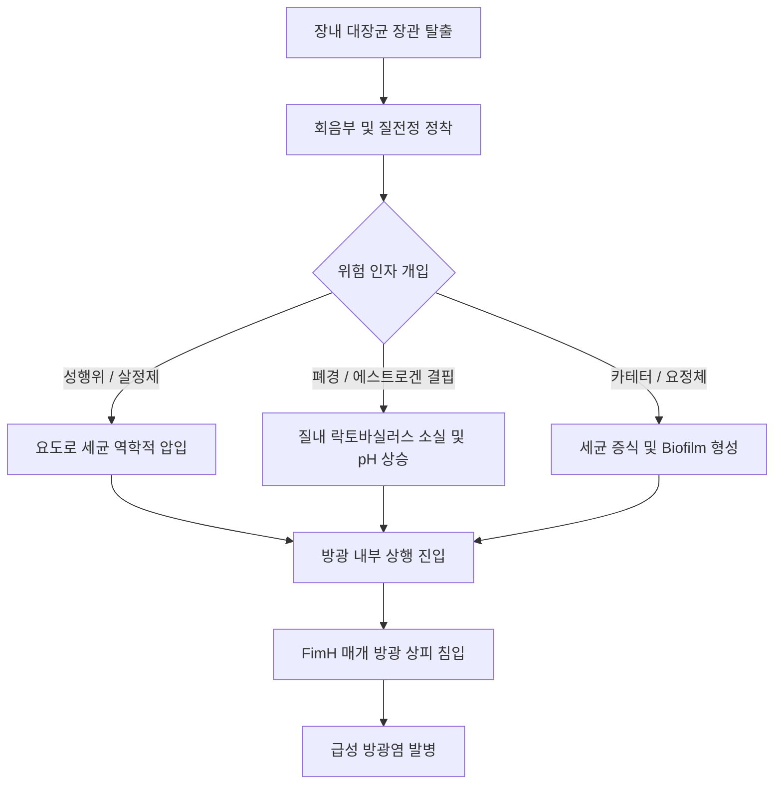
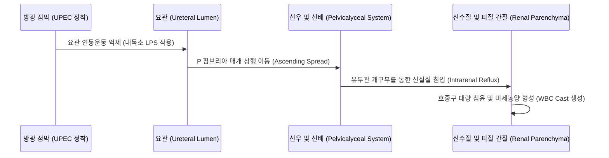
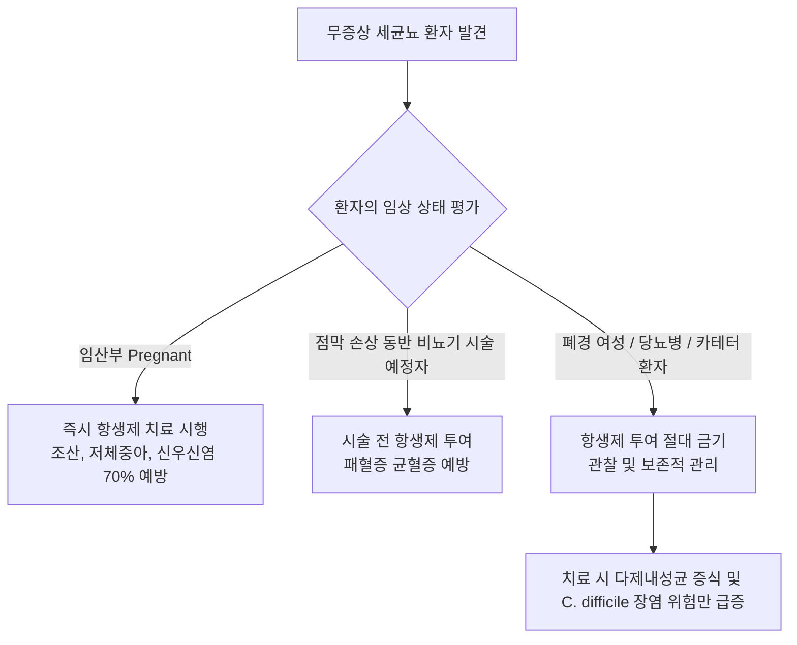
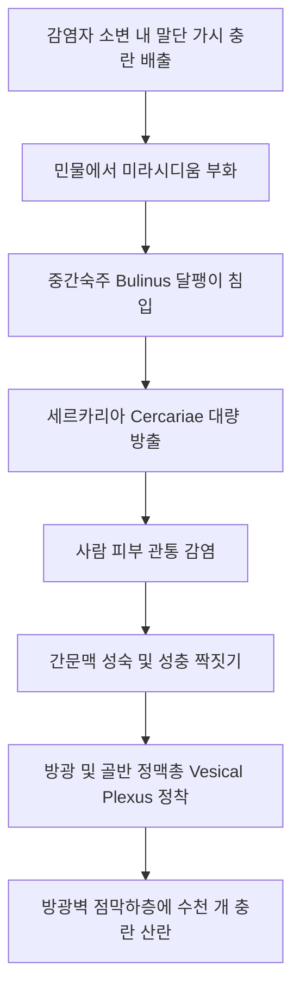
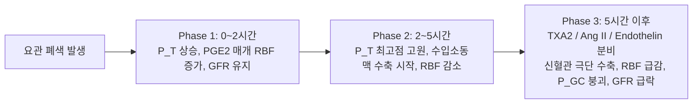
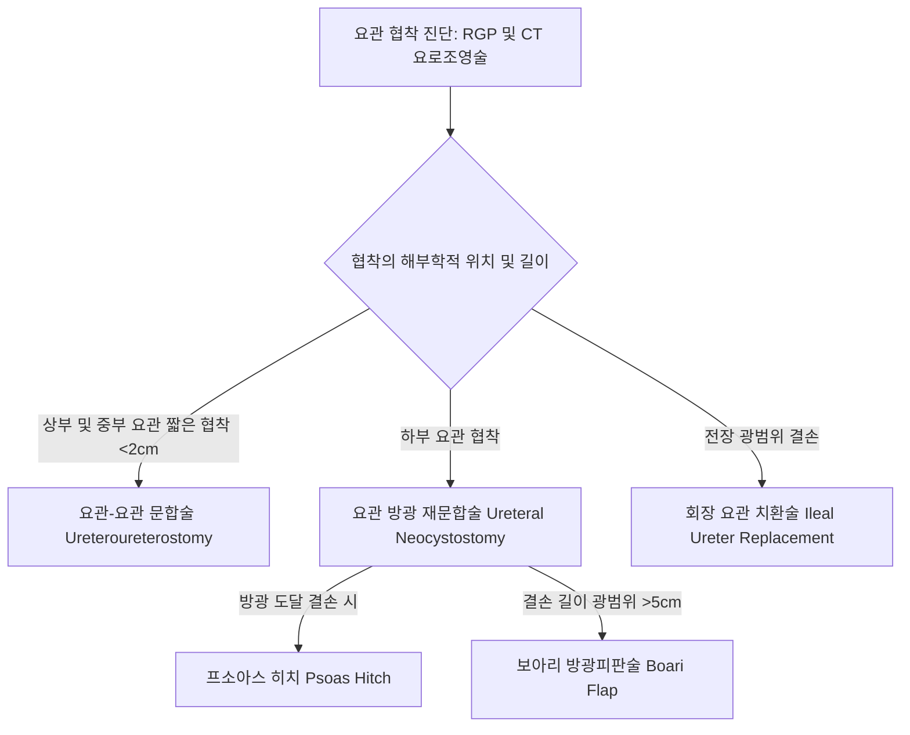

# 📑 [Netter Vol.5] Day 07: 요로감염증 및 요로폐색·결석 — 방광염·신우신염, 무증상 세균뇨, 신결핵·주혈흡충증, 수신증 혈역학, 결석 결정화 및 UPJ 폐색 (Section 5 & 6 완결)

> 📖 **원서 출처**: [The Netter Collection of Medical Illustrations - Volume 5, Urinary System.pdf (pp. 168-188)](https://drive.google.com/file/d/1vcvDctJJuo4vA2jKMPeSvjJjRpP1lhp2/view?usp=drivesdk)  
> 🏷️ **범위**: Section 5 (Plate 5-1 ~ Plate 5-12, 총 12개 도판) & Section 6 (Plate 6-1 ~ Plate 6-7, 총 7개 도판), 총 19개 도판 전수 수록 (pp. 168–188 완독)  
> 📌 **핵심 테마**: 요로병원성 대장균(UPEC)의 독성 인자(P 핌브리아, FimH)와 단순 vs 복잡성 요로감염의 감별, 방광염 1차 권고 항생제(니트로푸란토인, 포스포마이신, TMP-SMX), 급성 신우신염의 상행성 감염 경로와 병변 특이적 백혈구원주(WBC Casts), 무증상 세균뇨(ASB)의 엄격한 치료 적응증(임산부 및 침습적 비뇨기 시술 예정자), 48~72시간 항생제 불응 발열 시 신주위 농양(PCD 배액), 신결핵의 무균성 산성 농뇨(Sterile Pyuria)와 파이프 줄기 요관(Pipestem ureter) 및 골무 방광(Thimble bladder), 방광주혈흡충증(*S. haematobium*)의 모래 패치(Sandy patches)와 방광 편평세포암(SCC) 발생 기전, 폐색성 요로병증(Obstructive Uropathy)의 3단계 신혈류역학 및 폐색 해제 후 이뇨(Postobstructive Diuresis), 요로결석의 4단계 물리화학적 결정화(과포화-핵생성-성장-응집)와 랜달 반점(Randall's plaque), 5대 요로결석(수산칼슘, 인산칼슘, 스트루바이트 녹각석, 방사선 투과성 요산석, 육각형 시스틴석)의 정밀 감별, 요관 감돈 3대 생리적 협착부(UPJ, 장골혈관 교차부, UVJ), 그리고 소아 수신증 최빈 원인인 UPJ 폐색(Anderson-Hynes 신우성형술) 및 의원성 요관 협착의 내시경·수술적 재건술.

---

## 1. 개요 및 마스터 요약 (Executive Summary)

1. **요로감염증(UTI)의 미생물학적 병독성 및 단순 vs 복잡성 분류 (Plates 5-1 ~ 5-4)**:
   - 지역사회 요로감염의 $75\sim 95\%$는 **요로병원성 대장균(UPEC)**에 의해 발생함. UPEC의 **P 핌브리아(P fimbriae / Pap 필리)**는 신우 상피의 $\alpha\text{-D-galactopyranosyl-(1}\rightarrow\text{4)-}\beta\text{-D-galactopyranoside}$ 수용체에 결합하여 상행성 신우신염을 유발하며, **Type 1 핌브리아(FimH)**는 방광 표면 우로플라킨(Uroplakin)의 만노오스 잔기에 결합하여 세포 내 침입 및 생체막(Biofilm)을 형성함. 젊은 가임기 여성의 $5\sim 15\%$에서는 노보비오신 내성균인 *Staphylococcus saprophyticus*가 호발함.
   - **단순 방광염(Uncomplicated Cystitis)**은 비임신 폐경 전 건강한 성인 여성의 감염으로 배양 없이 경험적 항생제(니트로푸란토인 5일, 포스포마이신 1회, TMP-SMX 3일)로 완치됨. 남성, 임산부, 소아, 해부학적 기형, 면역저하자, 카테터 장착자 등은 **복잡성 요로감염(Complicated UTI)**으로 분류되어 반드시 요배양 검사를 시행하고 플루오로퀴놀론이나 3세대 세팔로스포린을 투여함.

2. **신우신염, 무증상 세균뇨 및 신주위 농양의 임상 원칙 (Plates 5-5 ~ 5-8)**:
   - **급성 신우신염(Acute Pyelonephritis)**: 고열, 오한, **늑골척추각 압통(CVA tenderness)**, 오심을 동반하며, 소변 검사상 신실질 염증을 입증하는 **백혈구원주(WBC Casts)**가 관찰됨.
   - **무증상 세균뇨(Asymptomatic Bacteriuria, ASB)**: 증상이 없으나 $\ge 10^5\text{ CFU/mL}$ 배양되는 상태로, **치료 적응증은 오직 ① 임산부(조산/저체중아 및 신우신염 예방)와 ② 점막 손상이 예상되는 비뇨기과 시술 예정자뿐임**. 당뇨병, 고령자, 유치 카테터 보유자에게 항생제를 투여하는 것은 내성균 증식과 *C. difficile* 장염만 유발하므로 금기임.
   - **신주위 농양(Perinephric Abscess)**: 신우신염 환자에서 적절한 항생제 투여 후 **48~72시간이 지나도 발열과 측복통이 지속**될 때 반드시 의심해야 하며, 조영 증강 CT로 확진 후 **경피적 농양 배액술(PCD)**을 즉시 시행해야 함.

3. **특수 만성 요로 감염: 결핵 및 주혈흡충증 (Plates 5-9 ~ 5-12)**:
   - **비뇨기계 결핵(Urinary Tuberculosis)**: 폐 혈행성 파종 후 수년~수십 년간 잠복하다 재활성화됨. **"무균성 농뇨 (Sterile Pyuria)"**와 산혈뇨가 특징임. 신실질 파괴로 **시멘트 신장(Putty kidney)**, 요관 전장 섬유화로 **파이프 줄기 요관(Pipestem ureter)**, 방광 용적 축소로 **골무 방광(Thimble bladder, $<50\text{ mL}$)**을 형성함.
   - **방광주혈흡충증(*Schistosoma haematobium*)**: 담수 물달팽이(*Bulinus*)를 중간숙주로 하며, 유미유충(Cercariae)이 피부를 관통 감염하여 골반/방광 정맥총에 서식함. **말단 가시(Terminal spine)**를 가진 충란이 방광벽을 뚫으며 육안적 종말 혈뇨(Terminal hematuria), 모래 패치(Sandy patches), 방광벽 석회화를 유발하고, 만성 염증으로 **방광 편평세포암(Squamous Cell Carcinoma, SCC)**을 초래함 (Praziquantel 치료).

4. **폐색성 요로병증의 혈역학 및 폐색 해제 후 이뇨 (Plates 6-1 ~ 6-2)**:
   - 요관 폐색 시 신혈류역학은 3단계로 진행됨:
     - **초기 ($0\sim 2\text{시간}$)**: 요관 내압 상승 및 $\text{PGE}_2/\text{PGI}_2$ 매개 수입소동맥 확장으로 신혈류량(RBF) 일시 증가.
     - **중기 ($2\sim 5\text{시간}$)**: 요관 내압 고원 상태에서 수입소동맥 수축 시작, RBF 감소.
     - **만기 ($>5\text{시간}$)**: 트롬복산 $\text{TXA}_2$, 안지오텐신 II, 엔도텔린 증가로 신혈관 극단 수축 $\rightarrow$ RBF 급감, 사구체 모세혈관압 급락, **GFR 붕괴**.
   - **폐색 해제 후 이뇨 (Postobstructive Diuresis, POD)**: 양측 요로 폐색 해제 후 체내 축적된 요소의 삼투성 이뇨와 세뇨관 농축능 장애로 대량 다뇨($>200\text{ mL/hr}$)가 발생하므로 철저한 수액 및 전해질 균형 관리가 필수적임.

5. **요로결석증(Urolithiasis)의 결정화, 5대 결석 및 요관 폐색 재건술 (Plates 6-3 ~ 6-7)**:
   - 결석 형성은 과포화, 핵생성(랜달 반점), 성장, 응집 단계를 거치며, 요중 **구연산염(Citrate)** 부족 시 결석 위험이 극대화됨.
   - **5대 결석**: ① **수산칼슘석($70\sim 80\%$, 방사선 불투과성, 아령/우편봉투형)**, ② **인산칼슘석($5\sim 10\%$, 방사선 불투과성, 알칼리뇨 $\text{pH} > 6.5$)**, ③ **스트루바이트 감염석($10\sim 15\%$, Coffin-lid형, Proteus 요소분해균 강알칼리뇨, 녹각석 Staghorn)**, ④ **요산석($5\sim 10\%$, 방사선 투과성 Radiolucent / X-ray 불보임, 강산성뇨 $\text{pH} < 5.5$)**, ⑤ **시스틴석($1\sim 2\%$, 정육각형 Hexagonal, 유전성)**.
   - 요관 감돈 3대 부위는 **UPJ, 장골혈관 교차부, UVJ(최빈도)**이며, 선천성 **신우요관이행부(UPJ) 폐색**은 **Anderson-Hynes 신우성형술(Pyeloplasty)**로 완치함.

---

## 2. 요로감염증: 방광염 및 신우신염 스펙트럼 (Plates 5-1 ~ 5-8)

### Plate 5-1 | 방광염: 위험 인자 및 병원체 (Cystitis: Risk Factors)

![[Netter_V5_Plate5-1.png]]

#### 1) 방광염의 호발 소인 및 해부학적 역학
- **여성 해부학적 취약성**: 여성 요도는 길이가 $3\sim 4\text{ cm}$로 남성($20\text{ cm}$)에 비해 현저히 짧고 곧으며, 외요도구가 질전정 및 세균이 밀집된 항문 주위(Perianal area)에 인접해 있어 장내 세균의 상행성 이동(Ascending migration)이 용이함.
- **성행위 (Honeymoon Cystitis)**: 성교 중 기계적 마찰이 요도 주위 세균을 방광 내로 밀어 올림. 성교 후 즉각적인 배뇨가 예방에 도움을 줌.
- **살정제 (Spermicides, Nonoxynol-9)**: 질 상피를 자극하고 정상 질내 공생균인 **락토바실러스 (Lactobacillus acidophilus)**를 사멸시킴 $\rightarrow$ 질내 $\text{pH}$ 상승(정상 $3.8\sim 4.5 \rightarrow >4.5$) $\rightarrow$ *E. coli* 질벽 정착(Colonization) 촉진.
- **에스트로겐 결핍 (폐경 후 여성)**: 에스트로겐 감소로 질 상피 글리코겐 합성 감소 $\rightarrow$ 락토바실러스 영양 고갈 및 소실 $\rightarrow$ 장내 세균총 과증식 및 질 점막 위축.
- **요정체 (Urinary Stasis)**: 방광류(Cystocele), 자궁탈출증, 신경인성 방광, 전립선 비대증(BPH), 요로결석으로 인한 잔뇨 증가.
- **요로 카테터 삽입 (CAUTI)**: 요도 점막 방어선 파괴 및 카테터 표면의 **생체막 (Biofilm)** 형성.



#### 2) 요로병원성 대장균(UPEC)의 핵심 병독성 인자
- **P 핌브리아 (P fimbriae / Pyelonephritis-associated pili)**:
  - Pap 사슬 단백질 끝의 PapG 아드헤신이 신우신배 및 사구체 상피세포 표면의 **디갈락토사이드 [$\alpha\text{-D-Gal-(1}\rightarrow\text{4)-}\beta\text{-D-Gal}$] 당지질 수용체**에 특이적으로 결합함.
  - 상행성 신우신염(Pyelonephritis) 유발의 절대적 필수 인자.
- **Type 1 핌브리아 (Type 1 fimbriae / FimH)**:
  - 선단의 **FimH 단백질**이 방광 표면 우로플라킨(Uroplakin Ia/Ib)의 **만노오스 잔기**에 결합.
  - 방광 상피세포 내로 침투하여 세포내 세균 군집(Intracellular Bacterial Communities, IBCs)을 형성하고 항생제 및 면역계를 회피함.
- **용혈소 (Hemolysin A, HlyA)**: 숙주 백혈구 및 요로 상피세포막에 구멍을 뚫어 조직 파괴 및 철분 획득.
- **K 항원 (K capsule)**: 협막 다당류로 보체 매개 식균 작용을 회피함.

---

### Plate 5-2 | 방광염: 흔한 증상 및 진단 검사 (Cystitis: Common Symptoms and Tests)

![[Netter_V5_Plate5-2.png]]

#### 1) 임상 증상 및 징후
- **배뇨통 (Dysuria)**: 소변이 통과할 때 염증이 생긴 요도 및 방광 삼각부 상피의 작열감(Burning sensation).
- **빈뇨 (Frequency) 및 절박뇨 (Urgency)**: 방광 점막 염증과 부종으로 인한 배뇨근(Detrusor muscle)의 과민성 및 신장 수용체 저자극 활성화.
- **치골상부 통증 및 불쾌감 (Suprapubic tenderness)**: 방광 팽창 및 배뇨 시 치골 상부의 둔통.
- **혈뇨 (Hematuria)**: 방광 점막 모세혈관 파열에 의한 육안적 또는 현미경적 혈뇨 (약 $30\%$에서 동반).
- **감별 핵심**: **발열, 오한, 늑골척추각 압통(CVA tenderness) 등의 전신 증상이 없어야 함** (존재 시 상부 요로감염/신우신염).

#### 2) 요검사(Urinalysis) 지표 분석
- **소변 시험지봉 검사 (Dipstick Urinalysis)**:
  - **백혈구 에스테라아제 (Leukocyte Esterase, LE)**: 염증에 반응하여 침윤된 호중구(Neutrophil)의 아주르 과립 효소를 측정. **농뇨(Pyuria, 민감도 $75\sim 95\%$)** 반영.
  - **아질산염 (Nitrite)**: 식이로 섭취된 질산염($\text{NO}_3^-$)을 아질산염($\text{NO}_2^-$)으로 환원시키는 질산염 환원효소(Nitrate reductase) 보유 균주(*E. coli, Klebsiella, Proteus*)를 검출 (**특이도 $>90\%$, 위음성 주의**: 소변이 방광 내 $4\text{시간}$ 이상 저류되지 않았거나, *Enterococcus, S. saprophyticus, Pseudomonas* 등 환원효소 결핍균인 경우 음성).
- **요침사 현미경 검사**:
  - 원심분리 고배율 시야(HPF)당 **WBC $\ge 5$개** 확인 시 농뇨 확진.

---

### Plate 5-3 | 방광염: 임상 평가 및 감별 진단 (Cystitis: Evaluation)

![[Netter_V5_Plate5-3.png]]

#### 1) 단순(Uncomplicated) vs 복잡성(Complicated) UTI 분류

| 구분 | 단순 요로감염 (Uncomplicated UTI) | 복잡성 요로감염 (Complicated UTI) |
| :--- | :--- | :--- |
| **환자군** | 건강한 비임신 폐경 전 성인 여성 | **남성 전원**, 임산부, 소아, 고령자 |
| **기저 질환** | 해부학적·기능적 비뇨기 이상 없음 | 당뇨병, 만성 콩팥병, 신경인성 방광, 면역저하 |
| **비뇨기 이상** | 결석, 폐색, 카테터 없음 | 요로결석, BPH, 협착, 유치 카테터, 스텐트 |
| **진단 접근** | **요배양 검사 생략 가능** (임상증상+요검사) | **반드시 요배양 및 항생제 감수성 검사 필수** |
| **치료 전략** | 단기(3~5일) 경구 1차 항생제 | 최소 7~14일 치료, 광범위 항생제 및 기저 원인 교정 |

#### 2) 배뇨통의 주요 감별 진단
- **요도염 (Urethritis)**: *Chlamydia trachomatis, Neisseria gonorrhoeae*, HSV. 질 분비물 동반, 점진적 발병, 성파트너 변화, 요배양 음성.
- **질염 (Vaginitis)**: *Candida albicans, Trichomonas vaginalis*, 세균성 질증. 배뇨통이 외음부 피부 접촉 시 발생(External dysuria), 질 가려움증, 악취 나는 분비물.
- **간질성 방광염 (Interstitial Cystitis / Bladder Pain Syndrome)**: 방광 충만 시 악화되고 배뇨 후 완화되는 통증, 6주 이상 지속, 감염 증거 없음, 방광경하 훈너 궤양(Hunner's ulcer).
- **방광암 (상피내암, CIS)**: 고령 흡연자, 항생제 반응 없는 자극성 배뇨 증상 및 미세혈뇨.

---

### Plate 5-4 | 방광염: 치료 및 항생제 요법 (Cystitis: Treatment)

![[Netter_V5_Plate5-4.png]]

#### 1) 급성 단순 방광염의 1차 권고 항생제
1. **니트로푸란토인 (Nitrofurantoin Monohydrate/Macrocrystals)**:
   - 용법: $100\text{ mg}$ bid $\times 5$일.
   - 기전: 세균 효소에 의해 활성화되어 DNA, RNA, 단백질 합성을 무차별 공격. 혈청 농도는 낮으나 요중 배설 농도가 극히 높음.
   - 주의: 세뇨관 기능 저하 시 요중 유효 농도 미달 및 독성 위험 $\rightarrow$ **eGFR $<30\text{ mL/min}$ 시 투여 금기**. 신실질 침투력이 없어 신우신염에는 절대 사용 불가.
2. **포스포마이신 (Fosfomycin Trometamol)**:
   - 용법: $3\text{ g}$ 1회 물에 타서 경구 복용.
   - 기전: 펩티도글리칸 합성 첫 단계 효소인 **MurA (UDP-N-acetylglucosamine enolpyruvyl transferase)**를 비가역적 억제.
   - 장점: 복약 순응도 최상, ESBL 생성 다제내성 대장균에도 높은 감수성 유지.
3. **트리메토프림-설파메톡사졸 (TMP-SMX, Bactrim)**:
   - 용법: $160/800\text{ mg}$ (1 DS tab) bid $\times 3$일.
   - 조건: 해당 지역사회 *E. coli* 내성률이 $<20\%$인 경우에만 1차로 사용.

> ⚠️ **Clinical Pearl: 플루오로퀴놀론(Fluoroquinolone) 오남용 금지**  
> 시프로플록사신(Ciprofloxacin)이나 레보플록사신(Levofloxacin)은 조직 침투력이 매우 뛰어나지만, 급성 단순 방광염에 1차로 남용할 경우 급격한 세균 내성 유발, 건염/건파열, QT 연장, *Clostridioides difficile* 장염을 초래합니다. 단순 방광염에는 철저히 보존하고, **상부 요로감염(신우신염)이나 복잡성 요로감염에 우선 사용**해야 합니다.

---

### Plate 5-5 | 신우신염: 위험 인자 및 주요 소견 (Pyelonephritis: Risk Factors and Major Findings)

![[Netter_V5_Plate5-5.png]]

#### 1) 상행성 감염의 확산 경로와 병태생리
- 하부 요로(방광)에 정착한 세균이 요관을 거슬러 올라가 신우(Renal pelvis)와 신배(Calyces), 집합관을 통해 신실질(Parenchyma)로 침투함.
- **방광요관역류 (VUR)**: 소아 신우신염의 핵심 원인. 방광 내압 상승 시 감염된 소변이 신배 원개로 역류하여 신수질 실질로 세균을 분사함(Intrarenal reflux).
- **임신**: 고농도 프로게스테론이 요관 평활근 긴장도를 떨어뜨리고 연동운동을 마비시키며, 증대된 자궁이 골반 입구에서 우측 요관을 물리적으로 압박(Dextrorotation)하여 우측 신우신염이 압도적으로 호발함.



#### 2) 고전적 임상 삼징 및 신체 진찰
- **전신 독성 증상**: $38.5^\circ\text{C}$ 이상의 고열, 오한(Chills, Rigors), 빈맥, 쇠약감, 전신 근육통.
- **소화기 증상**: 복강 신경총 자극 및 복막 자극 반응으로 오심, 구토, 마비성 장폐색 증상 유발.
- **늑골척추각 압통 (Costovertebral Angle Tenderness, CVA tenderness / Murphy's punch sign)**:
  - 12번째 갈비뼈와 척추가 이루는 각도 부위를 가볍게 타진할 때 신피막 팽창 및 주위 염증으로 인한 극심한 반사적 압통 유발. 신우신염의 진단적 신체 진찰 소견.

---

### Plate 5-6 | 신우신염: 병리 조직학적 소견 (Pyelonephritis: Pathology)

![[Netter_V5_Plate5-6.png]]

#### 1) 육안 병리 (Gross Pathology)
- 감염된 신장은 심한 부종과 울혈로 전반적으로 비대해짐.
- 피질(Cortex) 표면을 벗겨내면 쐐기형(Wedge-shaped) 분포를 보이는 **수많은 다발성 황백색 미세농양 (Multiple microabscesses)**이 관찰됨.
- 신우 및 신배 점막은 심하게 충혈되고 점막하 출혈 및 화농성 삼출물(Purulent exudate)로 뒤덮임.

#### 2) 현미경 병리 (Microscopic Pathology)
- **세뇨관간질 호중구 침윤**: 신간질(Interstitium)과 세뇨관 내강으로 **다형핵 백혈구(Neutrophils)의 대량 삼출**.
- 세뇨관 기저막의 괴사성 파괴 및 화농성 미세농양 형성.
- **백혈구원주 (White Blood Cell Casts / Leukocyte Casts)**:
  - 원위세뇨관 및 집합관 내강에서 탈락된 호중구들이 Tamm-Horsfall 점액단백질 기질에 엉겨붙어 원주 형태로 주형화됨.
  - 소변 침사 검사상 백혈구원주의 발견은 **염증의 근원이 방광이 아닌 신장 실질(Parenchyma)임을 입증하는 절대적인 병리적 증거**임.
- 사구체(Glomeruli)는 초기 감염 과정에서 상대적으로 저항성을 보여 정상 구조를 유지함.

---

### Plate 5-7 | 무증상 세균뇨: 임상 관리 원칙 (Bacteriuria: Management of Asymptomatic Bacteriuria)

![[Netter_V5_Plate5-7.png]]

#### 1) 무증상 세균뇨(ASB)의 정의 및 진단 기준
- 배뇨통, 빈뇨, 발열 등 요로감염을 시사하는 임상 증상이 전혀 없는 환자의 소변에서 유의한 세균이 배양되는 상태.
- **진단 기준**:
  - 여성: 최소 24시간 간격을 두고 채취한 중간뇨(Clean-catch voided urine) 2회 연속 동일 균종 $\ge 10^5\text{ CFU/mL}$.
  - 남성: 단 1회의 중간뇨 검사에서 $\ge 10^5\text{ CFU/mL}$.
  - 카테터 삽입 환자: 1회의 카테터 채취뇨에서 $\ge 10^2\text{ CFU/mL}$.

#### 2) 절대적 선별 및 치료 적응증 vs 치료 금기군



- **반드시 치료해야 하는 2대 군**:
  1. **임산부 (Pregnant women)**:
     - 임신 중 생리적 수신증 및 요관 이완으로 인해 방치 시 $20\sim 40\%$가 급성 신우신염으로 진행하여 조산(Preterm labor), 저체중아, 패혈증 초래.
     - 안전한 항생제: 아목시실린-클라불라네이트, 세팔렉신, 포스포마이신.
  2. **비뇨기계 침습적 시술 예정자 (e.g., TURP, 경요도 방광종양절제술)**:
     - 점막 출혈을 동반하므로 수술 중 균혈증 및 패혈성 쇼크 예방을 위해 시술 전 반드시 치료.
- **치료하지 말아야 하는 군 (치료가 무익하며 해로움)**:
  - 폐경 후 여성, 당뇨병 환자, 요양원 거주 고령자, 척수 손상 환자, 단기/장기 유치 카테터(Indwelling catheter) 보유자.

---

### Plate 5-8 | 신내 농양 및 신주위 농양 (Intrarenal and Perinephric Abscesses)

![[Netter_V5_Plate5-8.png]]

#### 1) 발생 기전 및 해부학적 구획
- **신내 농양 (Intrarenal Abscess / Renal Carbuncle)**:
  - 상행성 그람 음성 장내 세균(*E. coli, Klebsiella*) 감염의 국소 악화 또는 혈행성 파종(*Staphylococcus aureus*, 당뇨 환자, 정맥주사 약물 남용자, 심내막염 환자)에 의해 신실질 내에 국한된 농양 형성.
- **신주위 농양 (Perinephric Abscess)**:
  - 신내 농양이 신피막(Renal capsule)을 뚫고 터져 나와 **게로타 근막 (Gerota's fascia)** 내부의 신주위 지방강(Perinephric space)으로 파급된 상태.
  - 게로타 근막이 농양의 전방 확산을 일시적으로 막아주지만, 하방으로는 요관을 따라 골반강으로 흘러내릴 수 있음.

#### 2) 진단적 단서 및 영상의학
- **임상 경고 징후**: 급성 신우신염으로 진단하고 적절한 정맥 항생제를 투여했음에도 불구하고 **48~72시간 이상 지속되는 발열, 오한, 백혈구 증가증, 측복부 종괴 촉지**.
- **복부 조영 증강 CT (Contrast-enhanced CT)**:
  - 진단의 골드 스탠다드.
  - 조영되지 않는 저음영의 중심 괴사액 저류와 두꺼워진 벽의 조영 증강(Rim enhancement), 신주위 지방 조직의 음영 증가(Stranding), 게로타 근막의 비후.

#### 3) 치료 프로토콜
- **경피적 농양 배액술 (Percutaneous Catheter Drainage, PCD)**: 초음파 또는 CT 유도하에 카테터를 삽입하여 화농성 농액을 체외로 배출 ($>3\text{ cm}$ 농양의 표준 치료).
- 광범위 정맥 항생제 투여 병행.
- 배액 실패, 다방성 농양(Multiloculated), 거대 농양, 신실질 전층 파괴 시 개복/복강경 배농술 또는 신절제술(Nephrectomy).

---

## 3. 특수 만성 요로 감염: 결핵 및 주혈흡충증 (Plates 5-9 ~ 5-12)

### Plate 5-9 | 결핵: 감염 경로 및 폐외 파종 (Tuberculosis: Infection and Extrapulmonary Spread)

![[Netter_V5_Plate5-9.png]]

#### 1) 비뇨기계 결핵의 병태생리
- 결핵균(*Mycobacterium tuberculosis*)이 호흡기를 통해 흡입되어 폐포 대식세포 내 증식 $\rightarrow$ 원발 병소 형성.
- 초기 무증상 균혈증 단계에서 혈류를 타고 양측 신장의 **피질(Cortex) 사구체 모세혈관망에 파종(Hematogenous seeding)**됨.
- 세포 매개 면역에 의해 피질 피막하 부위에 육아종을 형성하고 수년~수십 년 동안 잠복(Dormant) 상태를 유지함.
- 면역력 저하 시 결핵균이 재활성화(Reactivation)되어 증식하면서 피질에서 수질(Medulla)로 진행하여 **신유두 (Renal Papillae)**를 파괴함.

---

### Plate 5-10 | 비뇨기계 결핵: 장기별 파괴 양상 (Tuberculosis: Urinary Tract)

![[Netter_V5_Plate5-10.png]]

#### 1) 임상적 특징: "무균성 농뇨 (Sterile Pyuria)"
- 소변 검사상 백혈구(농뇨)와 적혈구(혈뇨)가 다량 관찰되고 소변이 산성(Acidic)을 띠지만, **일반 세균 배양 검사에서는 아무런 균도 자라지 않는 현상**.
- 원인 불명의 무균성 농뇨 환자는 반드시 비뇨기계 결핵을 의심하고 **아침 첫 소변 3회 항산균(AFB) 도말 및 배양 검사, TB-PCR**을 시행해야 함.

#### 2) 요로 계통별 파괴 및 방사선학적 징후
- **신장 (Kidney)**:
  - 신유두의 건락성 괴사(Caseous necrosis) $\rightarrow$ 신배로 파열되어 공동(Cavity) 형성 $\rightarrow$ 칼슘 침착으로 전체 신실질이 치즈 같은 무기능 석회화 덩어리로 변하는 **시멘트 신장 (Putty Kidney / Autonephrectomy)**.
- **요관 (Ureter)**:
  - 감염된 소변이 요관을 타고 흐르며 점막하층에 결핵 결절 및 궤양 형성.
  - 치유 과정의 섬유화 및 구축으로 요관 벽이 두꺼워지고 유연성을 잃어 곧게 뻗치는 **파이프 줄기 요관 (Pipestem Ureter)** 형성.
  - 다발성 분절 협착에 의한 **염주알 요관 (Beaded Ureter)**.
- **방광 (Bladder)**:
  - 결핵성 육아종이 방광 삼각부 주위에 호발하여 궤양 형성.
  - 점막하 섬유화가 근육층 전체로 파급되어 방광벽이 두꺼워지고 신축성을 완전히 상실함 $\rightarrow$ 방광 용적이 $50\text{ mL}$ 이하로 극단적으로 위축되는 **골무 방광 (Thimble Bladder)** 초래 $\rightarrow$ 중증 빈뇨, 요실금 및 양측성 VUR/수신증.

---

### Plate 5-11 | 주혈흡충증: 방광주혈흡충의 생활사 (Schistosomiasis: Life Cycle of Schistosoma Haematobium)

![[Netter_V5_Plate5-11.png]]

#### 1) 방광주혈흡충(*Schistosoma haematobium*)의 생활사 캐스케이드
1. 감염된 사람의 소변을 통해 **말단 가시(Terminal spine)**를 가진 충란이 민물에 배출됨.
2. 충란이 물에서 부화하여 섬모를 가진 **미라시디움 (Miracidium)**이 됨.
3. 중간숙주인 민물 달팽이(**Bulinus snail**) 몸속으로 침입하여 유성생식을 거쳐 수천 마리의 **세르카리아 (Cercariae / 유미유충)**로 증식 방출.
4. 오염된 물에서 수영이나 목욕 중 세르카리아가 **인간의 피부를 뚫고 침입**.
5. 피부 침투 시 꼬리를 떨구고 주혈흡충자(Schistosomule)가 되어 정맥계를 타고 폐와 간문맥으로 이동하여 성충으로 성숙.
6. 암수 성충이 결합하여 간문맥을 떠나 장간막 정맥총을 거쳐 **방광 및 골반 정맥총 (Vesical and Pelvic Venous Plexuses)**에 영구 정착하여 산란 시작.



---

### Plate 5-12 | 만성 방광주혈흡충증의 합병증 및 방광암 (Schistosomiasis: Chronic Effects & Bladder Cancer)

![[Netter_V5_Plate5-12.png]]

#### 1) 만성 충란 침착에 의한 병리적 변화
- 성충이 산란한 충란의 날카로운 **말단 가시(Terminal spine)**가 방광 점막을 뚫고 나와 요강으로 배출되는 과정에서 기계적 손상 및 중증 면역 반응 유발.
- 배출되지 못하고 방광벽에 갇힌 충란들은 **Th2 매개 지연형 과민반응(Type IV)**을 유발하여 **호산구성 육아종 (Eosinophilic granuloma)**과 극심한 콜라겐 섬유화를 형성함.
- **방광경 소견**:
  - 점막하 충란 무리가 석회화되어 노랗게 모래알을 뿌려놓은 듯 보이는 **모래 패치 (Sandy Patches)**.
  - 육아종성 폴립(Bilharzial polyps), 점막 궤양.
- **방사선 소견**: 골반 단순 X-선상 방광 윤곽을 따라 얇은 달걀 껍질처럼 하얗게 둘러싸는 **곡선형 방광벽 석회화 (Curvilinear calcification)**.

#### 2) 방광암과의 인과적 연관성 (Oncogenesis)
- 만성적인 충란 자극과 세균 이차 감염으로 방광 이행상피(요로상피)가 지속적인 탈락과 재생을 거치며 **편평상피 화생 (Squamous Metaplasia)**을 일으킴.
- 혐기성 세균이 요중 질산염을 발암물질인 **니트로사민 (Nitrosamines)**으로 전환시킴.
- **종양학적 결과**: 서구에서 흔한 요로상피암(Urothelial CA, $90\%$)이 아니라, **방광 편평세포암 (Squamous Cell Carcinoma, SCC of bladder, $>75\%$)**이 발생함.
- **진단 및 치료**: 소변 원심분리 검사상 말단 가시 충란 검출. 약물 치료는 **프라지콴텔 (Praziquantel, $40\text{ mg/kg}$ 단회 경구 투여)**.

---

## 4. 요로폐색 및 요로결석증 (Plates 6-1 ~ 6-7)

### Plate 6-1 | 폐색성 요로병증: 병인 및 분류 (Obstructive Uropathy: Etiology)

![[Netter_V5_Plate6-1.png]]

#### 1) 폐색성 요로병증의 해부학적 높이별 분류
- **상부 요로 폐색 (Upper Urinary Tract Obstruction, 신배~요관 수준)**:
  - 대개 일측성(Unilateral) 폐색으로 나타나며, 반대측 신장이 정상이면 혈청 크레아티닌 상승은 미미함.
  - 내인성: **요로결석 (Urolithiasis, 가장 흔함)**, 혈종(Blood clot), 신유두 괴사 탈락편, UPJ 협착.
  - 외인성: 후복막 섬유화증(Ormond's disease), 대장암/자궁경부암/난소암 침습, 임신 자궁, 복부 대동맥류.
- **하부 요로 폐색 (Lower Urinary Tract Obstruction, 방광경부~요도 수준)**:
  - 항상 양측성(Bilateral) 폐색 및 신후성 급성 신부전(Postrenal AKI)을 초래함.
  - **양성 전립선 비대증 (BPH, 고령 남성 최빈)**, 전립선암, 신경인성 방광, 후부요도판막(PUV, 신생아 남아), 요도 협착, 중증 방광탈(Cystocele).

---

### Plate 6-2 | 폐색성 요로병증: 후유증, 수신증 및 혈역학 (Obstructive Uropathy: Sequelae)

![[Netter_V5_Plate6-2.png]]

#### 1) 일측성 요관 폐색의 3단계 신혈류역학 (Hemodynamic Triphasic Response)



- **Phase 1 (급성기, $0\sim 2\text{시간}$)**:
  - 요관 폐색으로 세뇨관 내압($P_T$) 급상승.
  - 혈관확장성 프로스타글란딘($\text{PGE}_2, \text{PGI}_2$)이 분비되어 수입소동맥을 확장시킴 $\rightarrow$ **신혈류량(RBF)과 사구체 모세혈관압($P_{GC}$)이 일시적으로 증가**하여 여과압을 방어함.
- **Phase 2 (전이기, $2\sim 5\text{시간}$)**:
  - $P_T$가 최고점에 도달하여 유지되는 동안, 혈관 수축 물질들이 작용하기 시작하여 RBF가 감소세로 돌아섬.
- **Phase 3 (만성기, $5\text{시간 이후}$)**:
  - 강력한 혈관수축 인자인 **트롬복산 $\text{TXA}_2$, 안지오텐신 II, 엔도텔린(Endothelin)**이 우세해짐.
  - 수입소동맥의 심한 혈관수축 $\rightarrow$ **신혈류량(RBF) 급감 및 사구체 모세혈관압($P_{GC}$) 붕괴** $\rightarrow$ **사구체여과율(GFR) 급락**.

#### 2) 해부학적 후유증: 수신증 (Hydronephrosis)
- 신배 원개(Calyceal fornix)의 평탄화 및 곤봉화(Blunting), 신우 팽창.
- 지속적 압박에 의한 신유두 위축 및 신실질(피질과 수질) 두께 감소(Thinning of renal parenchyma).
- 장기화 시 세뇨관 아포토시스, 간질 섬유화로 비가역적 신기능 소실.

#### 3) 폐색 해제 후 이뇨 (Postobstructive Diuresis, POD)
- 양측성 요로 폐색이나 단일신 폐색을 카테터나 스텐트로 신속히 해제했을 때 발생하는 생리적·병리적 현상.
- **기전**:
  - 체내에 축적되었던 고농도 요소(Urea)와 염분이 유발하는 **삼투성 이뇨 (Osmotic Diuresis)**.
  - 폐색 기간 동안 세뇨관 상피가 손상되어 발생한 **수분 및 나트륨 재흡수 장애 (세뇨관 무감수성, AQP2 및 ENaC 하향 조절)**.
- 소변 배출량이 시간당 $>200\text{ mL}$로 수 리터씩 쏟아져 저혈량 쇼크, 저칼륨혈증, 저나트륨혈증을 초래할 수 있으므로 면밀한 활력징후 감시 및 생리식염수/반생식 공급 필요.

---

### Plate 6-3 | 요로결석증: 결석 형성의 물리화학적 기전 (Urolithiasis: Formation of Renal Stones)

![[Netter_V5_Plate6-3.png]]

#### 1) 결석 형성의 물리화학적 4단계 캐스케이드
1. **과포화 (Supersaturation)**:
   - 소변 내 결석 형성 이온(칼슘, 옥살산, 인산, 요산)의 농도 곱이 열역학적 용해도 곱(Solubility product, $K_{sp}$)을 초과함.
2. **핵생성 (Nucleation)**:
   - 과포화 상태에서 자유 이온들이 결합하여 최초의 고체 미세 결정을 형성하는 단계.
   - **이종 핵생성 (Heterogeneous Nucleation)**: 소변 내 다른 결정, 세포 찌꺼기, 단백질 표면을 발판 삼아 낮은 에너지 장벽으로 핵을 형성함.
   - **랜달 반점 (Randall's Plaque)**:
     - 헨레고리 얇은막 기저막에서 시작된 인산칼슘(Apatite) 침착물이 신유두 간질을 뚫고 나와 요로 상피를 벗겨내고 요강에 노출됨.
     - 이 노출된 인산칼슘 표면이 **수산칼슘(Calcium Oxalate) 결석이 성장하는 이종 핵(Nidus)** 역할을 수행함 (수산칼슘 결석 환자의 핵심 병태생리).
3. **결정 성장 및 응집 (Crystal Growth & Aggregation)**:
   - 핵 표면에 추가 용질이 달라붙어 크기가 커지고, 여러 미세 결정들이 서로 엉겨붙어 거대 덩어리를 이룸.
4. **결정 저류 (Crystal Retention)**:
   - 커진 결정이 세뇨관 상피에 부착하거나 집합관 협착부에 걸려 요류에 씻겨 내려가지 않고 잔류하여 결석으로 완성됨.

#### 2) 요중 결석 억제 인자 (Inhibitors of Nephrolithiasis)
- **구연산염 (Citrate, 가장 중요)**:
  - 요중에서 유리 칼슘($\text{Ca}^{2+}$)과 강력하게 킬레이트 결합하여 물에 잘 녹는 가용성 구연산칼슘(Calcium citrate) 착물을 형성함 $\rightarrow$ 칼슘이 옥살산이나 인산과 결합하는 것을 차단.
  - 산증(Acidosis), 저칼륨혈증, 만성 설사 시 근위세뇨관의 구연산 재흡수가 급증하여 **저구연산뇨증 (Hypocitraturia)**이 발생하며, 이는 결석의 강력한 위험 인자임.
- 마그네슘($\text{Mg}^{2+}$, 옥살산과 결합), 피로인산염(Pyrophosphate), 탐-호스폴 단백질(THP), 네프로칼신(Nephrocalcin).

---

### Plate 6-4 | 요로결석증: 요관 감돈의 3대 호발 부위 (Urolithiasis: Major Sites of Impaction)

![[Netter_V5_Plate6-4.png]]

#### 1) 요관의 3대 해부학적 생리적 협착부

| 협착 부위 | 해부학적 위치 및 특징 | 내강 직경 | 임상적 의의 |
| :--- | :--- | :--- | :--- |
| **1. 신우요관이행부<br>(UPJ)** | 깔때기 모양의 신우가 관 모양의 요관으로 좁아지며 이행하는 부위 | 약 $2\sim 3\text{ mm}$ | 신우 내에서 자란 비교적 큰 결석이 요관으로 진입하다 최초로 걸리는 부위 |
| **2. 장골혈관 교차부<br>(Iliac Vessels Crossing)** | 골반 입구(Pelvic brim)에서 총장골 또는 외장골 동정맥 전방을 가로지르는 부위 | 약 $4\text{ mm}$ | 혈관 박동과 후복막 굴곡으로 인해 요관이 전방으로 밀리며 감돈 발생 |
| **3. 방광요관이행부<br>(UVJ)** | 요관이 방광 근육벽(Detrusor)을 사선으로 관통하는 점막하 터널 부위 | 약 **$1\sim 2\text{ mm}$<br>(가장 좁음)** | **요관 결석 감돈의 최빈도 부위 ($>60\%$)**, 방광 자극 증상(빈뇨, 절박뇨) 동반 |

```mermaid
graph TD
    A[신배/신우에서 결석 형성] --> B[1차 관문: UPJ 통과 시도]
    B -->|직경 3mm 초과 감돈| C[측복부 급성 신산통 발생]
    B -->|통과 성공| D[복부 요관 하강]
    D --> E[2차 관문: 장골혈관 교차부 골반연 통과]
    E -->|감돈| F[측복통 및 하복부 방사통]
    E -->|통과 성공| G[골반 요관 진입]
    G --> H[3차 관문: UVJ 방광벽 관통 통과 (최협소부)]
    H -->|최빈도 감돈| I[극심한 서혜부/음낭/음순 방사통 및 배뇨 절박감]
    H -->|통과 성공| J[방광 진입 후 요도로 자연 배출]
```

#### 2) 신산통 (Renal Colic)의 임상 특징
- 결석에 의한 요관 급성 폐색 $\rightarrow$ 평활근 연동운동 경련 및 요관 내압 급상승 $\rightarrow$ 교감신경 전달.
- 통증 양상: 파도처럼 밀려오는 칼로 에는 듯한 극심한 산통(Colic), 환자가 통증을 줄일 자세를 찾지 못해 몸을 비틀며 돌아다님(**Restlessness**, 복막염 환자가 미동도 하지 않는 것과 대조적).
- 방사통: T10~L2 신경근 지배를 따라 **측복부(Flank)에서 하복부, 서혜부(Groin), 남성의 음낭(Scrotum), 여성의 대음순(Labia majora)**으로 방사됨.

---

### Plate 6-5 | 요로결석증: 5대 주요 결석의 형태 및 감별 (Urolithiasis: Appearance of Renal Stones)

![[Netter_V5_Plate6-5.png]]

#### 1) 5대 요로결석 종합 비교 감별표

| 결석 종류 | 빈도 | X-선 (KUB) | 결정 현미경 형태 |
| :--- | :---: | :---: | :---: |
| **수산칼슘석<br>(Calcium Oxalate)** | $70\sim 80\%$ | **불투과성<br>(Radiopaque)** | **모노: 아령형 (Dumbbell)<br>디: 우편봉투형 (Envelope)** |
| **인산칼슘석<br>(Calcium Phosphate)** | $5\sim 10\%$ | **불투과성<br>(Radiopaque)** | 쐐기형 프리즘<br>(Wedge/Rosette) |
| **스트루바이트석<br>(Struvite / 감염석)** | $10\sim 15\%$ | **불투과성<br>(Radiopaque)** | **관 뚜껑 모양<br>(Coffin-lid)** |
| **요산석<br>(Uric Acid)** | $5\sim 10\%$ | **투과성 (Radiolucent)<br>X-ray 안 보임 (CT 확인)** | 마름모, 다이아몬드형<br>(Rhomboid/Rosette) |
| **시스틴석<br>(Cystine)** | $1\sim 2\%$ | 희미한 불투과성<br>(Ground-glass) | **완벽한 정육각형<br>(Hexagonal plates)** |

| 결석 종류 | 호발 요 $\text{pH}$ | 원인 및 기저 질환 | 치료 및 예방 |
| :--- | :---: | :--- | :--- |
| **수산칼슘석** | 무관<br>($5.5\sim 6.8$) | 특발성 고칼슘뇨증, 고수산뇨증(흡수성, 크론병), 저구연산뇨증 | 티아지드 이뇨제(요칼슘 감소), 구연산칼륨, 수분 섭취 |
| **인산칼슘석** | **알칼리뇨<br>($\text{pH} > 6.5$)** | **원위부 세뇨관산증 (Type 1 RTA)**, 원발성 부갑상선기능항진증 | 기저 원인 교정, 요 산성화(필요시) |
| **스트루바이트석** | **강알칼리뇨<br>($\text{pH} > 7.2$)** | **요소분해균 (*Proteus, Klebsiella*) 감염** | **경피적 신쇄석술 (PCNL)** 수술적 완전 제거, 아세토하이드록삼산 |
| **요산석** | **강산성뇨<br>($\text{pH} < 5.5$)** | 통풍(Gout), 암 화학요법(종양용해증후군), 만성 설사, 대사증후군 | **구연산칼륨 투여로 요 알칼리화**, 알로푸리놀 |
| **시스틴석** | 산성뇨<br>($\text{pH} < 6.0$) | 상염색체 열성 유전질환 (COLA 수송체 결함) | 대량 음수, 요 알칼리화, 티오닌(Tiopronin, Penicillamine) |

* **스트루바이트석 — 원인**: 신우 전체를 채우는 **녹각석 (Staghorn)** 형성.
* **요산석 — 치료**: **구연산칼륨 투여로 요 알칼리화 ($\text{pH } 6.5\sim 7.0$ 유도 시 결석 용해)**.
* **시스틴석 — 원인**: 상염색체 열성 유전질환 (COLA 세뇨관 수송체 결함: Cystine, Ornithine, Lysine, Arginine).
* **시스틴석 — 치료**: 대량 음수($>4\text{ L/day}$), 요 알칼리화($\text{pH} > 7.5$).

---

### Plate 6-6 | 신우요관이행부 폐색 (Ureteropelvic Junction Obstruction, UPJ Obstruction)

![[Netter_V5_Plate6-6.png]]

#### 1) 병인학 (Etiology)
- 소아 선천성 수신증의 가장 흔한 원인 ($1:1,500$).
- **내인성 원인 (Intrinsic, 최빈도)**:
  - 신우요관이행부 요관 벽의 평활근 섬유 발달 결함. 정상적인 나선형/원형 근육 배열이 깨지고 과도한 결합조직과 교원질(Collagen) 섬유로 치환됨 $\rightarrow$ 연동운동 파동이 이 부위를 건너뛰지 못하여 기능적 폐색 유발.
- **외인성 원인 (Extrinsic, 약 $15\sim 25\%$)**:
  - 신장 하극으로 향하는 **하극 교차 부속 신동맥/정맥 (Lower pole crossing accessory vessels)**이 UPJ 전방을 가로지르며 기계적으로 압박 굴곡시킴.

#### 2) 임상 양상 및 진단
- 성인에서는 평소 무증상이다가 맥주, 이뇨 음료 섭취 등으로 수액 부하가 급증하여 소변량이 늘어날 때 갑작스러운 측복부 팽만통을 느끼는 **디틀 위기 (Dietl's crisis)**로 발현함.
- **이뇨 신장 스캔 (Diuretic Renogram, $^{99\text{m}}\text{Tc-MAG3}$ / F+20 프로토콜)**:
  - 방사성 동위원소 주정 후 20분에 라식스(Furosemide)를 정맥 투여하여 요류를 강제 증가시킴.
  - **배출 반감기 ($T_{1/2}$) $> 20\text{분}$**: 수술적 교정이 필요한 진성 기계적 폐색(Definite obstruction) 확진.
  - $T_{1/2} < 10\text{분}$: 단순 비폐색성 확장.

#### 3) 외과적 교정: 앤더슨-하인즈 신우성형술 (Anderson-Hynes Dismembered Pyeloplasty)
- 협착된 UPJ 분절을 완전 절제(Dismember)함.
- 신우 하부를 쐐기형으로 축소 성형(Reduction pyeloplasty)한 뒤, 요관 외측을 절개하여 넓힌 후 신우와 요관을 무긴장성 단단문합(Spatulated end-to-end anastomosis)함. 복강경 또는 로봇 보조 수술이 표준.

---

### Plate 6-7 | 요관 협착: 원인 및 재건술 (Ureteral Strictures)

![[Netter_V5_Plate6-7.png]]

#### 1) 발생 원인 및 위험 인자
- **의원성 손상 (Iatrogenic, 전체 협착의 $>75\%$)**:
  - 부인과 골반 수술(전자궁적출술 TAH 시 자궁동맥 결찰 중 요관 동반 결찰), 대장직장 수술(APR, LAR).
  - 비뇨의학과 내시경 시술: 요관경하 결석제거술(URS) 시 바스켓 마찰, 레이저 천공, 결석 감돈 부위 허혈성 반흔.
- **방사선 치료 후 협착 (Radiation-induced)**: 자궁경부암, 직장암 방사선 치료 수년 후 미세혈관 내피세포 증식성 폐색(Endarteritis obliterans)으로 인한 요관 허혈성 섬유화.
- 감염성: 요로결핵, 주혈흡충증.

#### 2) 진단 및 외과적 재건 전략



- **진단**: **역행성 신우조영술 (Retrograde Pyelogram, RGP)** - 요관경으로 조영제를 카테터를 통해 주입하여 협착의 정확한 시작 위치와 협착 분절의 길이를 센티미터 단위로 측정.
- **수술적 재건법**:
  - **요관-요관 문합술 (Ureteroureterostomy)**: 상·중부 요관의 $2\sim 3\text{ cm}$ 미만 짧은 협착.
  - **요관 방광 재문합술 (Ureteral Reimplantation)**: 하부 요관 협착부 절제 후 정상 요관을 방광벽에 새로 심음.
  - **프소아스 히치 (Psoas Hitch)**: 요관 길이가 약간 모자랄 때 방광을 당겨 대요근(Psoas tendon)에 고정하여 간격을 좁힘.
  - **보아리 플랩 (Boari Flap)**: 요관 결손이 $5\text{ cm}$ 이상으로 길 때 방광 전벽에서 사각 피판을 오려내어 관(Tube)을 만들어 상부 요관과 문합함.

---

## 5. 핵심 감별 진단 및 임상 보드 요약표 (Clinical High-Yield Tables)

### 1) 상부 vs 하부 요로감염 핵심 감별표

| 임상 지표 | 급성 방광염 (Acute Cystitis) | 급성 신우신염 (Acute Pyelonephritis) |
| :--- | :--- | :--- |
| **감염 위치** | 방광 및 요도 점막 (하부) | 신우신배 및 신실질 간질 (상부) |
| **주요 증상** | 배뇨통, 빈뇨, 절박뇨, 치골상부통 | 고열, 오한, **CVA 압통**, 측복통, 오심/구토 |
| **전신 증상** | **절대 없음** (있으면 신우신염 의심) | **심한 전신 쇠약 및 오한 동반** |
| **요침사 원주** | 백혈구원주 없음 (백혈구만 다수) | **백혈구원주 (WBC Casts) 관찰 (병인 확진)** |
| **외래 치료제** | 니트로푸란토인, 포스포마이신, TMP-SMX | 시프로플록사신, 세프트리악손 |
| **표준 치료 기간**| 3 ~ 5일 | 7 ~ 14일 |

### 2) 5대 요로결석 물리화학적 특성 및 용해 감별표

| 결석 종류 | 주성분 | 방사선 투과도 | 최적 형성 요 pH |
| :--- | :--- | :--- | :--- |
| **수산칼슘석** | Calcium Oxalate | Radiopaque (하얗게 보임) | 무관 ($5.5\sim 6.8$) |
| **인산칼슘석** | Calcium Phosphate | Radiopaque (매우 하얌) | **알칼리성 ($>6.5$)** |
| **스트루바이트석**| $\text{MgNH}_4\text{PO}_4$ | Radiopaque | **강알칼리성 ($>7.2$)** |
| **요산석** | Uric Acid | **Radiolucent (X-ray 안 보임)** | **강산성 ($<5.5$)** |
| **시스틴석** | Cystine | Faint Radiopaque (희미함) | 산성 ($<6.0$) |

| 결석 종류 | 결정 형태 | 알칼리화 용해 가능 여부 |
| :--- | :--- | :--- |
| **수산칼슘석** | 아령형 / 우편봉투형 | **불가능** (외과적 쇄석술 필요) |
| **인산칼슘석** | 쐐기형 로제트 프리즘 | **불가능** |
| **스트루바이트석** | 관 뚜껑 모양 (Coffin-lid) | **불가능** (PCNL 완전 제거 필수) |
| **요산석** | 마름모 / 다이아몬드형 | **완전 용해 가능 (구연산칼륨)** |
| **시스틴석** | **정육각형 (Hexagonal)** | **부분 용해 가능 ($\text{pH} > 7.5$)**|

---

## 6. 결론 및 다음 학습 로드맵

Day 07에서는 **Section 5 (요로감염증, Plates 5-1 ~ 5-12)**와 **Section 6 (요로폐색 및 요로결석, Plates 6-1 ~ 6-7)**에 걸친 **총 19개 도판 전수**를 다루었습니다:
- 방광염과 신우신염의 분자생물학적 병인(UPEC의 P 핌브리아 vs FimH), 단순 vs 복잡성 요로감염 치료 지침.
- 무증상 세균뇨(ASB)의 2대 절대 치료 적응증(임산부, 비뇨기 점막 시술)과 치료 금기 원칙.
- 48~72시간 항생제 불응 발열 시 신주위 농양 의심 및 경피적 배액술(PCD).
- 신결핵의 무균성 산성 농뇨, 시멘트 신장, 파이프 줄기 요관, 골무 방광.
- 방광주혈흡충증의 생활사, 말단 가시 충란, 모래 패치 및 방광 편평세포암(SCC) 발생 기전.
- 폐색성 요로병증의 3단계 신혈류역학 및 폐색 해제 후 이뇨(POD) 집중 관리.
- 5대 요로결석(수산칼슘, 인산칼슘, 스트루바이트 녹각석, 방사선 투과성 요산석, 육각형 시스틴석)의 결정학, KUB 소견, 요 pH, 치료법.
- 요관 감돈 3대 부위(UPJ, 장골혈관 교차부, UVJ) 및 UPJ 폐색의 Anderson-Hynes 신우성형술.

다음 회차인 **Day 08**에서는 **Section 7: 비뇨기계 외상 (신장 둔상/손상 등급 AAST I~V, 신문부 손상, 요관/방광 파열, Plates 7-1 ~ 7-5)** 및 **Section 8: 배뇨 기능 장애 (여성 요실금 해부학, 신경인성 방광의 중추/말초 신경 병변, 복압성 요실금, 요역동학 검사 UDS, Plates 8-1 ~ 8-5)** 총 10개 도판에 대한 학습을 이어갑니다.
