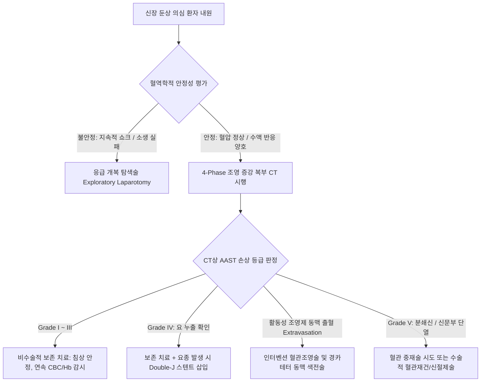
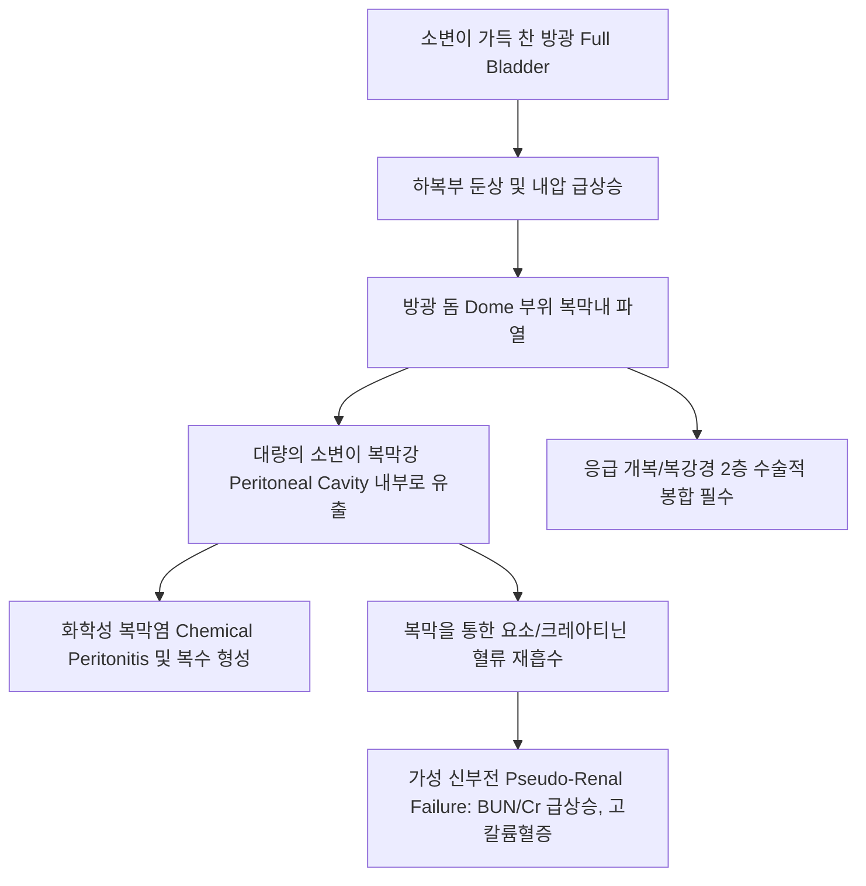
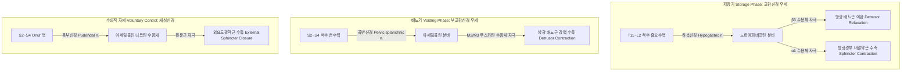
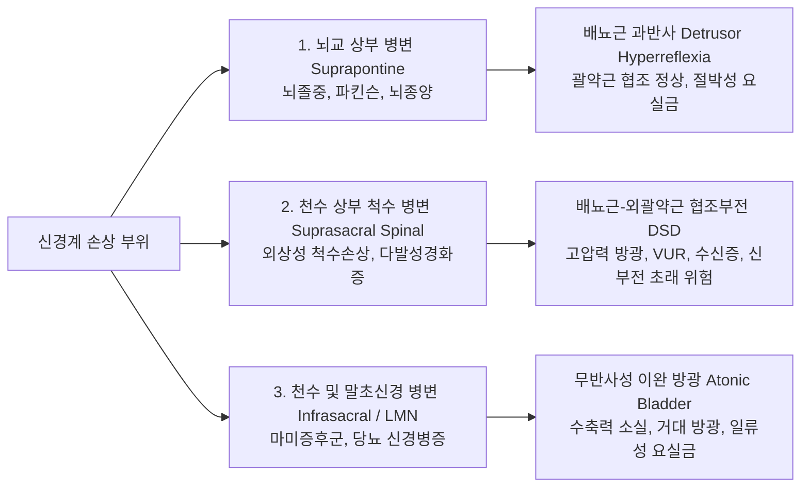

# 📑 [Netter Vol.5] Day 08: 비뇨기계 외상 및 배뇨 기능 장애 — 신장·요관·방광 손상 등급 및 외과적 재건, 신경인성 방광, 복압성 요실금 및 요역동학 검사(UDS) (Section 7 & 8 완결)

> 📖 **원서 출처**: [The Netter Collection of Medical Illustrations - Volume 5, Urinary System.pdf (pp. 190-200)](https://drive.google.com/file/d/1vcvDctJJuo4vA2jKMPeSvjJjRpP1lhp2/view?usp=drivesdk)  
> 🏷️ **범위**: Section 7 (Plate 7-1 ~ Plate 7-5, 총 5개 도판) & Section 8 (Plate 8-1 ~ Plate 8-5, 총 5개 도판), 총 10개 도판 전수 정밀 수록 (pp. 190–200 완독)  
> 📌 **핵심 테마**: AAST 신장 손상 5단계 분류(Grade I~V) 및 비수술적 보존 치료 vs 응급 혈관색전술/수술 적응증, 급감속 손상에 의한 신문부 혈관 인열과 4~6시간 허혈 골든타임, 의원성 골반 수술 후 요관 손상의 조기 인지 및 층위별 재건술(단단문합, Psoas hitch, Boari flap), 골반 골절 연관 복막외 방광 파열(Foley 보존 치료, 화염 모양 조영제 유출) vs 만복 둔상에 의한 복막내 방광 돔 파열(응급 개복 2층 봉합술 필수, 가성 신부전), DeLancey의 해먹 가설(Hammock hypothesis)에 기반한 여성 요자제 3중 기전, 교감(T11-L2 하복신경)-부교감(S2-S4 골반신경)-체성(S2-S4 음부신경)의 3중 신경 지배와 중추 뇌교 배뇨 중추(PMC), 척수 상부 손상에 따른 치명적 배뇨근-외괄약근 협조부전(DSD)과 자율신경 이상반사증, 복압성 요실금(SUI)의 요도 과가동성 감별 및 중부 요도 슬링(TVT/TOT), 그리고 요역동학 검사(UDS)의 배뇨근 순수 압력 공식($P_{\text{det}} = P_{\text{ves}} - P_{\text{abd}}$)과 주요 병리 파형(DO, DSD, BOO)의 임상 판독.

---

## 1. 개요 및 마스터 요약 (Executive Summary)

1. **AAST 신장 손상 등급 분류 및 혈역학적 치료 결정 (Plates 7-1 ~ 7-2)**:
   - 신장 외상의 $85\sim 90\%$는 교통사고나 추락에 의한 둔상(Blunt trauma)임.
   - **AAST 등급**:
     - **Grade I**: 피막하 혈종/타박상.
     - **Grade II**: 피질 열상 $<1\text{ cm}$, 요 누출 없음.
     - **Grade III**: 피질 열상 $>1\text{ cm}$, 집합계 침범/요 누출 없음.
     - **Grade IV**: **집합계(Collecting system) 침범으로 요 누출(Extravasation)** 발생, 또는 분절 신혈관 손상.
     - **Grade V**: 산산조각 난 신장(**Shattered kidney**), 또는 신문부 주 혈관의 완전 인열(Avulsion)/혈전증(무혈관 신장).
   - 치료 원칙: **혈역학적으로 안정한 환자는 Grade I~IV 모두 절대 침상 안정과 수액 치료를 통한 비수술적 보존 요법(Non-operative management, NOM)이 표준**임. 활동성 조영제 혈관외 유출 시 인터벤션 동맥 색전술(Angioembolization) 시행. 지속적 저혈량 쇼크 시 응급 탐색술. 신동맥 혈전증의 혈관 재건 골든타임은 **4~6시간 이내**임.

2. **요관 및 방광 외상의 병태생리와 수술적 접근 원칙 (Plates 7-3 ~ 7-5)**:
   - **요관 외상(Ureteral Injuries)**: 비뇨의학과 내시경(URS) 및 부인과 전자궁적출술(TAH) 등 **의원성 손상이 $>75\%$**를 차지함. 수술 중 즉시 발견 시 Double-J 스텐트 유치 하에 비스듬한 단단문합술(Ureteroureterostomy) 또는 요관방광 재문합술(Psoas hitch / Boari flap)을 시행함.
   - **복막외 방광 파열 (Extraperitoneal Rupture, Plate 7-4)**: **골반 골절($>85\%$)**과 동반되며 복막 반사 하방의 방광 전측벽이 손상됨. 방광조영술상 레치우스 강(Space of Retzius)으로 조영제가 퍼지는 **화염 모양 (Flame-shaped extravasation)**을 보이며, **도뇨관(Foley) 유치를 통한 보존적 치료**로 10~14일 내 자연 치유됨.
   - **복막내 방광 파열 (Intraperitoneal Rupture, Plate 7-5)**: 음주 등으로 방광이 팽창된 상태에서 하복부 둔상 시 가장 얇은 **방광 돔 (Dome)** 부위가 파열됨. 소변이 복강 내로 유출되어 복막염과 장폐색을 유발하고, 복막을 통한 요소/크레아티닌 재흡수로 **가성 신부전 (Pseudo-renal failure)**을 초래함. **반드시 응급 수술적 2층 봉합술(Two-layer closure)**을 시행해야 함.

3. **여성 요자제 기전 및 복압성 요실금의 슬링 혁신 (Plates 8-1, 8-3)**:
   - **DeLancey의 해먹 가설 (Hammock Hypothesis)**: 요도는 질 전벽, 골반내근막, 항문거근이 이루는 단단한 지지대(해먹) 위에 위치함. 복압 상승 시 요도가 이 해먹에 압박되어 폐쇄됨으로써 요자제가 유지됨.
   - **복압성 요실금 (SUI)**: 출산 및 노화로 인한 해먹 파열로 요도가 회전 하강하는 **요도 과가동성(Urethral hypermobility, Q-tip $>30^\circ$)** 또는 괄약근 자체 부전(**내인성 괄약근 결핍 ISD, VLPP $<60\text{ cmH}_2\text{O}$**)에 의해 발생함.
   - 1차 보존 치료(케겔 운동) 실패 시, 폴리프로필렌 메쉬 테이프를 중부 요도 하방에 걸어주는 **중부 요도 슬링 수술 (Mid-urethral sling: TVT / TOT)**이 표준 완치 수술법임.

4. **신경인성 방광의 3대 구획과 배뇨근-외괄약근 협조부전 (DSD) (Plate 8-2)**:
   - 신경 지배: 교감(T11-L2 하복신경, 방광 이완 및 내괄약근 수축 $\rightarrow$ 소변 저장) vs 부교감(S2-S4 골반신경, 배뇨근 수축 $\rightarrow$ 배뇨) vs 체성(S2-S4 음부신경, 외괄약근 수축). 뇌교 배뇨 중추(PMC)가 둘 간의 완벽한 On/Off를 조율함.
   - **천수 상부 척수 손상 (Suprasacral SCI, T6 이상)**: PMC와의 통신 단절로 배뇨근이 수축할 때 외괄약근이 동시에 닫히는 **배뇨근-외괄약근 협조부전 (DSD)**이 발생함. 방광 내압이 극단적으로 치솟아 방광요관역류(VUR), 수신증, 신부전을 초래하므로 가장 위험한 유형임. 방광 팽창 자극에 의해 생명을 위협하는 **자율신경 이상반사증 (Autonomic Dysreflexia)** 동반 위험.

5. **요역동학 검사(Urodynamic Study, UDS)의 생체역학 판독 (Plates 8-4 ~ 8-5)**:
   - 방광 압력($P_{\text{ves}}$)에서 직장 압력(=복압, $P_{\text{abd}}$)을 차감하여 **순수 배뇨근 압력 ($P_{\text{det}} = P_{\text{ves}} - P_{\text{abd}}$)**을 도출함.
   - 저장기 불수의적 수축파(**배뇨근 과활동성 DO** $\rightarrow$ 절박성 요실금), 복압 상승 시 소변 누출(**복압성 요실금 SUI**), 배뇨 시 고압력-저유속 해리(**방광출구폐색 BOO**), 배뇨근 수축 시 괄약근 EMG 동반 활성화(**DSD**)를 객관적으로 감별 확진함.

---

## 2. 비뇨기계 외상: 신장, 요관, 방광 파열 (Plates 7-1 ~ 7-5)

### Plate 7-1 | 신장 손상: AAST 등급 체계 및 실질 손상 (Renal Injuries: Grading System and Parenchymal Injuries)

![[Netter_V5_Plate7-1.png]]

#### 1) 손상 메커니즘 및 역학
- 신장은 후복막 깊숙이 위치하고 늑골, 척추, 요근 및 신주위 지방에 의해 보호되지만, 급격한 감속(Deceleration)이나 직격 타박 시 손상받기 쉬움.
- 외상의 $85\sim 90\%$는 둔상(교통사고, 추락, 운동 경기), $10\sim 15\%$는 관통상(총상, 자상)임.

#### 2) 미국외상외과학회(AAST) 신장 손상 5단계 분류

| AAST 등급 | 손상 유형 (Injury Type) | 방사선학적/병리학적 소견 (CT Findings) | 관리 원칙 |
| :---: | :--- | :--- | :--- |
| **Grade I** | **타박상 (Contusion) 피막하 혈종 (Subcapsular)** | 신실질 열상 없음. 신피막 아래에 갇힌 비팽창성 혈종 | **절대 침상 안정, 보존 치료** |
| **Grade II** | **경도 열상 (Superficial Laceration)** | 신피질 열상 깊이 **$<1\text{ cm}$**. **집합계 침범 없음 (요 누출 없음)**. | 보존적 치료 (활력징후 감시) |
| **Grade III** | **심부 열상 (Deep Laceration)** | 신피질 열상 깊이 **$>1\text{ cm}$**. 피질-수질 경계 침범하나 **집합계 침범 없음** | 보존적 치료 (조영 유출 시 색전술) |
| **Grade IV** | **집합계 침범 열상 (Collecting System) 또는 분절 혈관 손상** | 열상이 집합계 관통, **조영 지연기 CT상 요 누출** 주 신동맥/정맥 분절 손상, 국소 신경색 | **보존적 치료 우선**, 요종 형성 시 Double-J 스텐트/경피 배액, 색전술 |
| **Grade V** | **분쇄신 (Shattered Kidney) 또는 주 신문부 혈관 단열** | 신실질이 다발성 조각으로 완전 파열. **주 신동맥/정맥 완전 인열 또는 완전 혈전증** | **수술적 탐색술 (신절제술/혈관재건)** 또는 혈관색전술 |

* **Grade II**: 후복막강 국한 비팽창성 혈종.
* **Grade III**: 요 누출 없음.
* **Grade IV**: 요 누출(Urinary extravasation) 확인, 주 신동맥/정맥의 분절 가지 손상.
* **Grade V**: 주 신동맥/정맥의 완전 인열(Avulsion) 또는 완전 혈전증(무혈관 신장 Devascularized).

---

### Plate 7-2 | 신장 손상: 신문부 혈관 손상 (Renal Injuries: Renal Hilar Injuries)

![[Netter_V5_Plate7-2.png]]

#### 1) 급감속 신동맥 손상의 생체역학
- 차량 충돌이나 고소 추락 시 발생하는 극단적인 전후 감속력.
- 대동맥에 단단히 고정된 신동맥 기원부와, 관성에 의해 앞으로 튕겨 나가는 신장 실질 사이에 강력한 전단력(Shearing force) 발생.
- 신동맥 벽 중 신축성이 가장 떨어지는 **내막(Intima)의 횡단 파열 (Transverse intimal tear)** 발생 $\rightarrow$ 혈류가 박리된 내막 아래로 들어가 가성 내강을 만들고 급성 혈전(Thrombus)을 형성하여 **주 신동맥 내강을 완전히 폐쇄함**.
- 조영 CT 소견: 복부 대동맥은 조영되나, 해당 측 신동맥 기원부 직후에서 조영이 뚝 끊기고 **신실질 전체가 조영되지 않는 "무혈관 신장 (Devascularized kidney / Cortical rim sign)"** 관찰.

#### 2) 혈관 재건의 골든타임 및 수술 원칙
- **허혈 허용 골든타임**: 신장은 상온 허혈(Warm ischemia)에 극도로 취약하여, **손상 후 4~6시간 이내**에 혈류를 재개하지 못하면 비가역적 신실질 괴사가 발생함. 외상 환자의 지연 진단 특성상 6시간 초과 시 신기능 회복률은 $<10\%$로 급감함.
- **수술 시 신문부 접근 원칙 (Central Vascular Control)**:
  - 거대한 신주위 혈종을 무턱대고 열면 tamponade 효과가 풀려 통제 불능의 출혈로 사망할 수 있음.
  - 반드시 하장간막정맥 내측에서 후복막을 절개하고 대동맥 및 하대정맥을 노출하여, **신혈관 기원부(Renal artery/vein origin)를 먼저 찾아 혈관 클램프로 잡은 후(중심부 혈관 제어)** 신주위 혈종을 개방해야 함.

---

### Plate 7-3 | 요관 손상: 원인 및 외과적 재건 (Ureteral Injuries)

![[Netter_V5_Plate7-3.png]]

#### 1) 발생 원인 및 위험 요인
- 요관은 크기가 작고 유연하며 후복막 깊이 보호되어 있어 외부 둔상에 의한 손상은 극히 드뭄 ($<1\%$, 소아 척수 과신전에 의한 UPJ 단열 제외).
- **손상의 $>75\%$는 의원성 손상 (Iatrogenic Injuries)**:
  - **부인과 수술 (최다 빈도, $50\sim 70\%$)**: 전자궁적출술(TAH), 난소절제술 시 **자궁동맥 결찰 부위(요관이 자궁동맥 아래를 지나는 "Water under the bridge" 부위)** 및 난소골반인대(Infundibulopelvic ligament) 결찰 시 결찰/절단.
  - **대장직장외과 수술**: 복회음절제술(APR), 저위전방절제술(LAR) 시 골반연 부위 박리 손상.
  - **비뇨의학과 내시경**: 요관경하 결석제거술(URS) 시 레이저 천공, 바스켓 감돈 박탈(Avulsion).

#### 2) 요관 결손 부위별 맞춤 재건 수술

| 손상 위치 | 권고 수술법 | 수술 테크닉 핵심 |
| :--- | :--- | :--- |
| **상부 요관 (Upper Ureter)** | **요관-요관 단단문합술 (Ureteroureterostomy)** | 손상부 절제 후 무긴장성(Tension-free) 문합. Double-J 스텐트 유치 |
| **중부 요관 (Mid Ureter)** | **요관-요관 단단문합술 또는 교차 요관문합술 (TUU)** | 결손이 길어 단단문합 불가 시 사용. 단, 반대편 요관 손상 위험 동반 |
| **하부 요관 (Lower Ureter)** | **요관 방광 재문합술 (Ureteral Neocystostomy)** | 단단문합은 허혈 괴사 위험이 높아 금기. 방광벽에 직접 재이식 (역류방지 터널) |
| **하부 결손 3~5 cm** | **프소아스 히치 (Psoas Hitch)** | 방광을 대요근 힘줄(Psoas minor tendon) 쪽으로 끌어당겨 영구 고정 |
| **하부 광범위 결손 >5 cm** | **보아리 플랩 (Boari Flap)** | 방광 전벽에서 사다리꼴 피판(Bladder flap)을 도려내 원통형 관으로 말아 상부 요관과 문합 |

* **상부 요관**: 양 말단을 비스듬히 절개(**Spatulation**)하여 문합부 협착 방지.
* **중부 요관 — 교차 요관문합술**: 정식 명칭 **Transureteroureterostomy (TUU)**, 손상된 요관을 장간막을 통해 반대편으로 넘겨 정상 요관 측벽에 문합.
* **하부 요관**: 방광 삼각부 상방에 새 터널을 파고 방광벽에 직접 재이식.
* **프소아스 히치 (Psoas Hitch)**: 간격을 $3\sim 5\text{ cm}$ 단축시켜 긴장 완화.
* **보아리 플랩 (Boari Flap)**: 피판을 원통형 관(Tube)으로 말아 올린 뒤 문합 ($10\sim 15\text{ cm}$ 결손 극복).

---

### Plate 7-4 | 방광 손상: 복막외 방광 파열 (Extraperitoneal Bladder Ruptures)

![[Netter_V5_Plate7-4.png]]

#### 1) 손상 메커니즘 및 해부학
- 전체 방광 파열의 약 $60\sim 65\%$를 차지함.
- **골반 골절 (Pelvic fracture)과 절대적인 상관관계 ($>85\sim 90\%$)**:
  - 전방 치골 결합부 골절편(Bone spicule)이 복막 반사 하방의 방광 전벽 또는 전측벽을 칼처럼 직접 찔러 천공시킴.
  - 또는 치골방광인대(Pubovesical ligament)가 강하게 부착된 부위가 골반환 붕괴 시 뜯겨 나가며 파열됨.
- 누출된 소변은 복강(Peritoneal cavity) 안으로 들어가지 못하고, 치골 뒤 공간인 **레치우스 강 (Space of Retzius)** 및 골반 결합조직 내에 국한됨.

#### 2) 방광조영술(Cystography) 소견 및 치료 원칙
- **역행성 방광조영술 (Retrograde Cystography) 또는 CT 방광조영술**:
  - 조영제를 최소 $300\sim 350\text{ mL}$ 이상 주입하여 방광을 완전 팽창시킨 후 촬영해야 미세 누출을 놓치지 않음.
  - 조영제가 골반저 결합조직을 따라 불규칙하게 번져 나가는 특유의 **"화염 모양 (Flame-shaped extravasation)"** 또는 성상(Starburst) 음영을 보임. 조영제가 장간막 주름 사이로는 절대 들어가지 않음.
- **치료: 비수술적 보존 요법 (Foley Catheter Drainage)**:
  - 감염되지 않은 소변은 복막외 조직에서 흡수되므로, 굵은 폴리 카테터($18\sim 20\text{ Fr}$)를 거치하여 방광을 비워두면(Decompression) $85\sim 90\%$에서 **10~14일 이내에 방광벽이 저절로 유합 치유**됨.
  - *수술적 봉합이 필요한 예외*: 방광경부(Bladder neck) 파열(요실금 위험), 골편이 방광 내로 돌출된 경우, 직장/질 동반 파열, 정형외과적 골반 내고정술(ORIF)을 동시에 진행하는 경우.

---

### Plate 7-5 | 방광 손상: 복막내 방광 파열 (Intraperitoneal Bladder Ruptures)

![[Netter_V5_Plate7-5.png]]

#### 1) 발생 기전 및 해부학적 취약성
- 전체 방광 파열의 약 $30\sim 35\%$를 차지함.
- **음주 후 만복 상태의 둔상**: 술을 마셔 방광에 소변이 가득 찬 상태($>400\sim 500\text{ mL}$)에서 하복부에 급격한 충격(안전벨트 압박, 폭행 발차기, 운전대 충돌)이 가해짐.
- 물주머니에 가해진 압력이 방광벽 전체로 균일하게 전달될 때, **복막(Peritoneum)으로 둘러싸여 있고 지지 구조가 없는 가장 얇은 부위인 방광 돔 (Bladder Dome)**이 풍선 터지듯 파열됨.

#### 2) 방광조영술 소견 및 "가성 신부전"
- **영상 소견**: 조영제가 방광 밖으로 빠져나가 소장 및 결장 장간막 주름 사이를 채우고, 복강 내 가장 낮은 부위인 간신와(**Morison's pouch**), 비신와, 양측 결장주위구(Paracolic gutters)로 퍼져 장관 윤곽을 하얗게 코팅함.
- **가성 신부전 (Pseudo-renal failure)**:
  - 복막강 내에 고인 수 리터의 소변 속에 함유된 **요소(Urea)와 크레아티닌이 복막의 광범위한 모세혈관망을 통해 농도 구배에 의해 혈액 내로 역흡수(Reverse auto-dialysis)**됨.
  - 신장 실질은 완전히 정상임에도 불구하고, 혈액 검사상 혈청 BUN과 Cr이 폭발적으로 상승하고 심각한 고칼륨혈증 및 대사성 산증이 나타나 급성 신부전으로 오인될 수 있음.

#### 3) 치료: 응급 수술적 봉합 (Immediate Surgical Repair)
- 복막내 파열은 소변에 의한 화학성 복막염과 패혈증 위험으로 인해 **도뇨관 거치만으로는 절대 치유되지 않으며 사망률이 높음**.
- **치료**: 지체 없는 응급 개복 또는 복강경 수술. 복강 내 오염된 소변을 세척하고, 파열된 방광 돔 결손부를 **흡수성 봉합사(Vicryl)를 사용하여 점막하-근육층 및 장막층의 2층 수술적 봉합 (Two-layer watertight closure)**을 시행함.

---

## 3. 배뇨 기능 장애: 신경인성 방광, 복압성 요실금 및 요역동학 검사 (Plates 8-1 ~ 8-5)

### Plate 8-1 | 여성 요자제 기전의 기능해부학 (Anatomy of Female Urinary Continence Mechanisms)

![[Netter_V5_Plate8-1.png]]

#### 1) 요자제(Continence)를 유지하는 3중 방어선
1. **내요도괄약근 (Internal Urethral Sphincter)**:
   - 방광경부(Bladder neck)와 근위 요도의 평활근 다발. 불수의근으로 교감신경($\alpha_1$ 아드레날린 수용체)의 지배를 받아 휴식기 요도 내강을 강하게 폐쇄함.
2. **외요도괄약근 (External Urethral Sphincter / Rhabdosphincter)**:
   - 중부 요도를 둘러싸는 오메가($\Omega$) 형태의 횡문근. 체성신경(음부신경 Pudendal nerve, $S2\sim S4$)의 지배를 받아 수의적 수축 및 복압 급상승 시 반사적 수축을 담당함.
3. **골반저 지지 구조 (Pelvic Floor Support - DeLancey 해먹 가설)**:
   - 요도는 허공에 떠 있는 파이프가 아니라, **골반내근막 (Endopelvic fascia)**, **질 전벽 (Anterior vaginal wall)**, 그리고 양측 골반벽에 부착된 **항문거근 건궁 (ATFP, Arcus Tendineus Fasciae Pelvis)**이 이루는 단단한 섬유근육성 해먹(Hammock) 위에 안정적으로 놓여 있음.
   - 기침, 재채기, 운동 등으로 복압($P_{\text{abd}}$)이 급상승할 때, 복압이 요도 자체를 누르는 동시에 하방의 단단한 해먹 지지대에 요도가 압착(Compression)되어 **요도 폐쇄압이 방광 내압보다 항상 높게 유지($\Delta P_{\text{urethra}} \ge \Delta P_{\text{ves}}$)**됨으로써 소변 누출을 완벽히 차단함.

---

### Plate 8-2 | 신경인성 방광: 신경학적 조절 및 병변 부위별 영향 (Neural Control of Bladder and Pathologic Lesions)

![[Netter_V5_Plate8-2.png]]

#### 1) 방광 배뇨의 3중 말초 신경 회로

#### 2) 신경계 병변 부위별 신경인성 방광의 3대 임상 분류

- **1. 뇌교 상부 병변 (Suprapontine Lesions: 대뇌피질, 기저핵 - 뇌졸중, 파킨슨병)**:
  - 뇌교 배뇨 중추(PMC)에 대한 대뇌 전두엽의 지속적 억제 신호가 소실됨.
  - **배뇨근 과반사 (Detrusor Hyperreflexia)**: 소량의 소변에도 방광이 멋대로 수축파를 일으킴.
  - 그러나 PMC 아래의 뇌간-척수 회로는 온전하므로 배뇨근 수축 시 외괄약근은 정상적으로 열림(DSD 없음).
  - 임상상: **절박성 요실금 (Urge Incontinence)**, 빈뇨, 절박뇨. 상부 요로(신장) 손상 위험은 낮음.
- **2. 천수 상부 척수 병변 (Suprasacral Spinal Cord Lesions: 경수~흉수 척수손상, MS)**:
  - 천수 배뇨 반사궁(S2-S4)은 살아있으나, 뇌교(PMC)의 조율 신호가 완전히 차단됨.
  - **배뇨근-외괄약근 협조부전 (Detrusor Sphincter Dyssynergia, DSD)**:
    - 방광 배뇨근이 격렬하게 수축하는 바로 그 순간, 외요도괄약근도 반사적으로 강하게 수축하여 출구를 틀어막음.
    - 닫힌 문을 향해 방광이 고압력 수축을 반복하므로 방광 내압이 $80\sim 100\text{ cmH}_2\text{O}$ 이상으로 치솟음 $\rightarrow$ 방광벽 게실, 거대 방광요관역류(VUR), 수신증, **비가역적 신부전** 초래. 비뇨기과적으로 가장 위험한 질환.
  - **자율신경 이상반사증 (Autonomic Dysreflexia, T6 이상 손상)**: 방광 과팽창 자극이 교감신경을 폭주시켜 치명적 악성 고혈압, 서맥, 뇌출혈을 유발할 수 있음.
- **3. 천수 및 하위 운동신경원 병변 (Infrasacral / LMN Lesions: 마미증후군, 당뇨병, 척수수막류)**:
  - S2-S4 반사궁 자체가 파괴되어 방광 감각 및 원심성 수축 신경이 모두 마비됨.
  - **무수축/이완성 방광 (Acontractile/Atonic Detrusor)**: 방광 근육이 전혀 수축하지 못하여 $1,000\text{ mL}$ 이상의 소변이 차올라 풍선처럼 늘어남 $\rightarrow$ 방광 내압이 요도 저항을 넘어서는 순간 찔끔찔끔 소변이 흘러넘치는 **일류성 요실금 (Overflow Incontinence)** 초래.

---

### Plate 8-3 | 복압성 요실금: 병태생리 및 중부 요도 슬링 (Stress Urinary Incontinence & Mid-Urethral Slings)

![[Netter_V5_Plate8-3.png]]

#### 1) 복압성 요실금(SUI)의 2대 병인 감별
1. **요도 과가동성 (Urethral Hypermobility, $>85\%$)**:
   - 질식 분만 시 태아 머리에 의한 골반신경/근막 압박 손상, 다산, 폐경 후 결합조직 약화.
   - 기침 시 복압이 가해질 때 요도 하방 지지 해먹이 아래로 쑥 꺼지며 요도가 회전 하강하여 내강이 열림.
   - 면봉 검사(**Q-tip Test**): 요도 내 면봉 삽입 후 기침 시 수평 기준 각도 변화가 **$>30^\circ$**이면 요도 과가동성 양성.
2. **내인성 괄약근 결핍 (Intrinsic Sphincter Deficiency, ISD, 약 $10\sim 15\%$)**:
   - 요도 지지 구조와 무관하게, 괄약근 점막 및 평활근 자체의 허혈/위축/신경 손상으로 출구가 헐거워진 상태(Lead-pipe urethra).
   - 요역동학 검사상 **발살바 누출점 압력 (Valsalva Leak Point Pressure, VLPP) $<60\text{ cmH}_2\text{O}$** 또는 최대 요도 폐쇄압(MUCP) $<20\text{ cmH}_2\text{O}$로 확진.

#### 2) 외과적 혁신: 중부 요도 슬링 (Mid-Urethral Sling, MUS)
- 과거의 방광경부 거상술(Burch colposuspension 등)을 대체한 현대 요실금 수술의 골드 스탠다드.
- **작동 원리**: 치골 후방이나 폐쇄공을 통해 **폴리프로필렌(Polypropylene) 그물망 테이프를 요도 중간 1/3 하방(Mid-urethra)에 무긴장성(Tension-free)**으로 걸어줌.
- 환자가 안정 시에는 요도를 압박하지 않아 배뇨 장애를 일으키지 않으며, 오직 기침이나 운동으로 **복압이 상승하는 순간에만 테이프가 요도 후벽을 단단히 받쳐주어 요도를 꺾어 닫히게 만듦 (새로운 인공 해먹 역할)**.
- 종류: **TVT (Tension-free Vaginal Tape, 치골후 경로)** vs **TOT (Transobturator Tape, 폐쇄공 경로 - 방광 천공 위험 감소)**. 성공률 $>90\%$.

---

### Plate 8-4 | 요역동학 검사: 장비 세팅 및 물리적 측정 원리 (Urodynamics: Equipment and Setup)

![[Netter_V5_Plate8-4.png]]

#### 1) 검사의 목적 및 구성 요소
- 하부 요로 증상(LUTS), 요실금, 신경인성 방광 환자에서 방광과 요도의 저장(Storage) 및 배뇨(Voiding) 기능을 실시간 압력-유량 곡선으로 객관화하는 유일한 표준 검사.
- 주요 검사 단계:
  1. **요류 검사 (Uroflowmetry) 및 잔뇨 측정 (PVR)**.
  2. **충만 방광내압측정술 (Filling Cystometrogram, CMG)**: 방광 순응도, 감각, 불수의적 수축 평가.
  3. **압력-유류 검사 (Pressure-Flow Study, PFS)**: 배뇨 시 배뇨근 수축력 및 출구 폐색 정도 평가.

#### 2) 카테터 세팅 및 순수 배뇨근 압력 도출 공식
- 방광 내 압력 센서는 방광 자체의 근육 수축뿐만 아니라 호흡, 기침, 장운동 등 전신 복압을 동시에 감지함.
- 따라서 진정한 배뇨근 근육의 수축 압력을 구하기 위해 **직장(Rectum) 또는 질 내에 풍선 카테터를 삽입하여 복강내압 ($P_{\text{abd}}$)**을 동시에 측정함.

$$\mathbf{P_{\text{det}} = P_{\text{ves}} - P_{\text{abd}}}$$

- **$P_{\text{ves}}$ (Vesical Pressure)**: 방광 내 이중강 카테터로 측정한 총 방광 내압.
- **$P_{\text{abd}}$ (Abdominal Pressure)**: 직장 카테터로 측정한 순수 복강 압력.
- **$P_{\text{det}}$ (Detrusor Pressure)**: $P_{\text{ves}}$에서 $P_{\text{abd}}$를 전자적으로 실시간 감산하여 도출한 **순수 방광 배뇨근 수축 압력**. 기침을 할 때 $P_{\text{ves}}$와 $P_{\text{abd}}$가 동일하게 솟구치므로, 계산된 $P_{\text{det}}$는 요동치지 않고 평평하게 유지되어야 올바른 보정(Calibration)임.

---

### Plate 8-5 | 요역동학 검사: 대표적 질환별 곡선 판독 (Urodynamics: Sample Recordings)

![[Netter_V5_Plate8-5.png]]

#### 1) 주요 4대 병리 파형의 정밀 판독

```mermaid
graph TD
    subgraph 1. 정상 배뇨 곡선 Normal
        A1[충만기: P_det 낮게 유지 <15 cmH2O] --> A2[배뇨기: 외괄약근 EMG 차단 Silence]
        A2 --> A3[안정적 P_det 수축 및 높은 종모양 요류 Qmax 발생]
    end
    subgraph 2. 배뇨근 과활동성 DO: 절박성 요실금
        B1[충만기 주입 중] --> B2[환자 의지와 무관한 날카로운 P_det 수축파 돌발]
        B2 --> B3[극심한 절박감 및 소변 누출 동반]
    end
    subgraph 3. 방광출구폐색 BOO: 전립선비대증
        C1[배뇨기 개시] --> C2[출구 저항 극복 위해 P_det가 80~100 cmH2O로 치솟음]
        C2 --> C3[그럼에도 불구하고 요속 Qmax <10 mL/s로 뚝 떨어짐: 고압 저유속 해리]
    end
    subgraph 4. 배뇨근-외괄약근 협조부전 DSD: 척수손상
        D1[배뇨기 배뇨근 P_det 수축 발생] --> D2[외괄약근 EMG가 꺼지지 않고 폭발적 방전 발작]
        D2 --> D3[문이 닫힌 상태에서 방광 초고압 발생: 상부 요로 파괴 위험]
    end
```

- **1. 배뇨근 과활동성 (Detrusor Overactivity, DO - 절박성 요실금)**:
  - 생리식염수를 방광에 채우는 충만기 동안, 환자가 배뇨 의사가 없음에도 불구하고 갑작스럽게 **$P_{\text{det}}$ 곡선이 솟구치는 불수의적 수축파**가 발생함. 이때 환자는 "소변이 쏟아질 것 같다"는 절박감을 호소하며 요 누출이 일어남.
- **2. 복압성 요실금 (Stress Urinary Incontinence, SUI)**:
  - 충만기 동안 기침이나 발살바(Valsalva)를 시킬 때 $P_{\text{ves}}$와 $P_{\text{abd}}$가 급격히 상승함.
  - 이때 **순수 배뇨근 압력($P_{\text{det}}$)은 전혀 상승하지 않음(수축 없음)**에도 불구하고, 요도 출구로 소변이 누출되는 것이 요류 센서에 즉각 감지됨.
- **3. 방광출구폐색 (Bladder Outlet Obstruction, BOO - e.g., BPH)**:
  - 배뇨기(Voiding phase) 동안 좁아진 전립선 요도를 뚫고 소변을 밀어내기 위해 **배뇨근 압력은 비정상적으로 높게 상승($P_{\text{det}}Q_{\max} > 40\sim 60\text{ cmH}_2\text{O}$)**하지만, 출구가 막혀 있으므로 **최대 요속은 극히 저하($Q_{\max} < 10\text{ mL/s}$)**되는 **전형적인 고압력-저유속 해리(High pressure - low flow)**를 나타냄.
- **4. 배뇨근-외괄약근 협조부전 (Detrusor Sphincter Dyssynergia, DSD - 척수 손상)**:
  - 배뇨근이 수축하여 $P_{\text{det}}$가 올라갈 때 정상적으로는 외괄약근 근전도(EMG) 활성이 0으로 꺼져야 함(Electrical silence).
  - 그러나 DSD 환자에서는 $P_{\text{det}}$가 올라갈 때 **괄약근 EMG 활성이 오히려 폭발적으로 증가**하여 요도를 틀어막는 양상이 동시 기록됨.

---

## 4. 핵심 비교 감별 및 보드 요약표 (Clinical High-Yield Tables)

### 1) 방광 파열: 복막외 vs 복막내 파열 완전 비교

| 감별 항목 | 복막외 방광 파열 (Extraperitoneal) | 복막내 방광 파열 (Intraperitoneal) |
| :--- | :--- | :--- |
| **발생 빈도** | 전체 파열의 약 $60\sim 65\%$ (최빈도) | 전체 파열의 약 $30\sim 35\%$ |
| **손상 메커니즘** | **골반 골절 (Pelvic fracture, $>85\%$)** 치골 골편 직접 자창 | **만복 상태(Full bladder) 하복부 둔상** 안전벨트 압박, 알코올 섭취 후 외상 |
| **파열 부위** | 복막 반사 하방의 **전벽 또는 전측벽** | 복막으로 덮인 가장 얇은 **방광 돔 (Dome)** |
| **소변 유출 공간** | **치골 뒤 레치우스 강(Space of Retzius)** 및 골반 결합조직 | **복막강 내부 (Peritoneal cavity)** |
| **방광조영술 소견** | 골반 측벽으로 뻗치는 **"화염 모양 (Flame-shaped)"** | 장관 주름 사이 및 **간신와(Morison's pouch)** 윤곽 조영 |
| **임상 합병증** | 골반 혈종, 감염 | **화학성 복막염**, 장폐색, **가성 신부전 (Pseudo-renal failure)** |
| **표준 치료법** | **도뇨관(Foley) 유치 비수술 보존 치료 (10~14일)** | **응급 수술적 2층 방광 봉합술 (Two-layer closure)** |
* **복막외 파열 손상 기전 부연**: **골반 골절 (Pelvic fracture, $>85\%$)** — 치골 골편에 의한 직접 자창 또는 인대 견인.

### 2) 4대 요실금 임상-병태생리 감별표

| 요실금 유형 | 주요 병태생리 기전 | 전형적 증상 유발 상황 | 치료 원칙 |
| :--- | :--- | :--- | :--- |
| **복압성 요실금 (Stress)** | 골반저 근막 이완(요도 과가동성) 또는 내인성 괄약근 결핍 (해먹 지지 붕괴) | 기침, 재채기, 줄넘기, 웃을 때 등 **복압 상승 순간 즉시 누출** | 1차 골반저근운동(케겔), **수술적 골드스탠다드: 중부 요도 슬링 (TVT/TOT)** |
| **절박성 요실금 (Urgency)** | 배뇨근 과활동성 (Detrusor Overactivity, DO), 무스카린 과활성, 뇌교 상부 억제 소실 | 소변 마려운 느낌이 들자마자 **화장실 가기 전 와락 쏟아짐** | 방광 훈련, **항콜린제, $\beta_3$ 작용제**, 방광 보톡스 |
| **일류성 요실금 (Overflow)** | 배뇨근 수축 부전(이완 방광) 또는 만성 방광출구폐색(BPH, 요도 협착) | 소변 배출 장애로 방광이 팽창하여 **주체 못 하고 찔끔찔끔 지속 누출** | 출구 폐색 해제, 청결 간헐 도뇨 (CIC), $\alpha$ 차단제 |
| **신경인성 DSD** | 천수 상부 척수 손상으로 배뇨근 수축 시 외괄약근 동반 경련 수축 | 요정체 및 급격한 방광 내압 상승, VUR, 신기능 악화 | 청결 간헐 도뇨 (CIC) + 항콜린제, 괄약근 보톡스, 요로 전환술 |
* **절박성 요실금 치료 세부**: 방광 훈련, **항콜린제 (Solifenacin 등), $\beta_3$ 작용제 (Mirabegron)**, 방광 보톡스.

---

## 5. 결론 및 다음 학습 로드맵

Day 08에서는 **Section 7 (비뇨기계 외상, Plates 7-1 ~ 7-5)** 및 **Section 8 (배뇨 기능 장애, Plates 8-1 ~ 8-5)** 총 10개 도판 전수를 정밀 분석하였습니다:
- AAST 신장 손상 등급 분류(Grade I~V) 및 비수술 보존 치료 vs 응급 혈관색전술/수술 지침.
- 급감속 손상에 따른 신문부 혈관 단열의 4~6시간 허혈 골든타임.
- 의원성 요관 손상의 층위별 재건 수술(단단문합, Psoas hitch, Boari flap).
- 골반 골절 연관 복막외 방광 파열(Foley 보존 치료, 화염 음영) vs 복막내 방광 돔 파열(응급 2층 봉합술 필수, 가성 신부전).
- DeLancey 해먹 가설에 기초한 여성 요자제 기전.
- 교감-부교감-체성 3중 신경 제어 및 천수 상부 척수 손상의 배뇨근-외괄약근 협조부전(DSD).
- 복압성 요실금의 요도 과가동성 평가 및 중부 요도 슬링(TVT/TOT) 원리.
- 요역동학 검사의 순수 배뇨근 압력 산출($P_{\text{det}} = P_{\text{ves}} - P_{\text{abd}}$)과 대표적 곡선 판독.

다음 회차인 **Day 09**에서는 **Section 9: 비뇨기계 종양 (신세포암 RCC 아형 및 병기, 양성 신종양 혈관근지방종/호산세포종, 윌름스 종양, 신우·요관암, 방광암 표재성 vs 근침윤성 병기, Plates 9-1 ~ 9-13, 총 13개 도판)**에 대한 마스터 학습을 이어갑니다.
