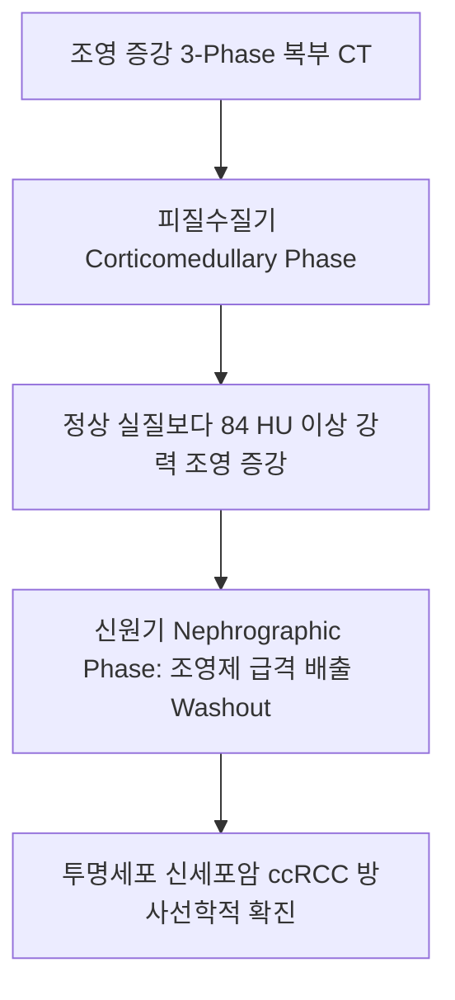
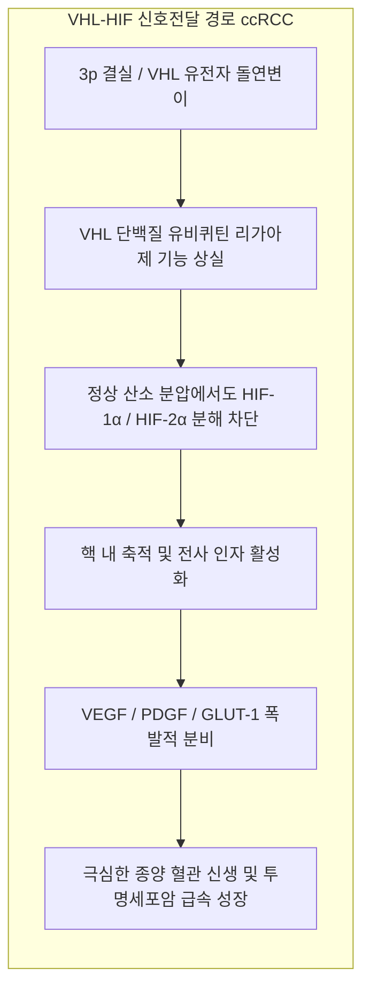
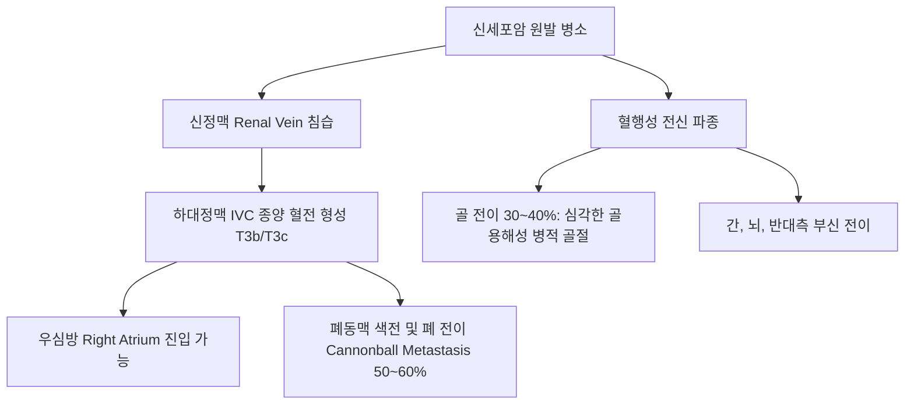
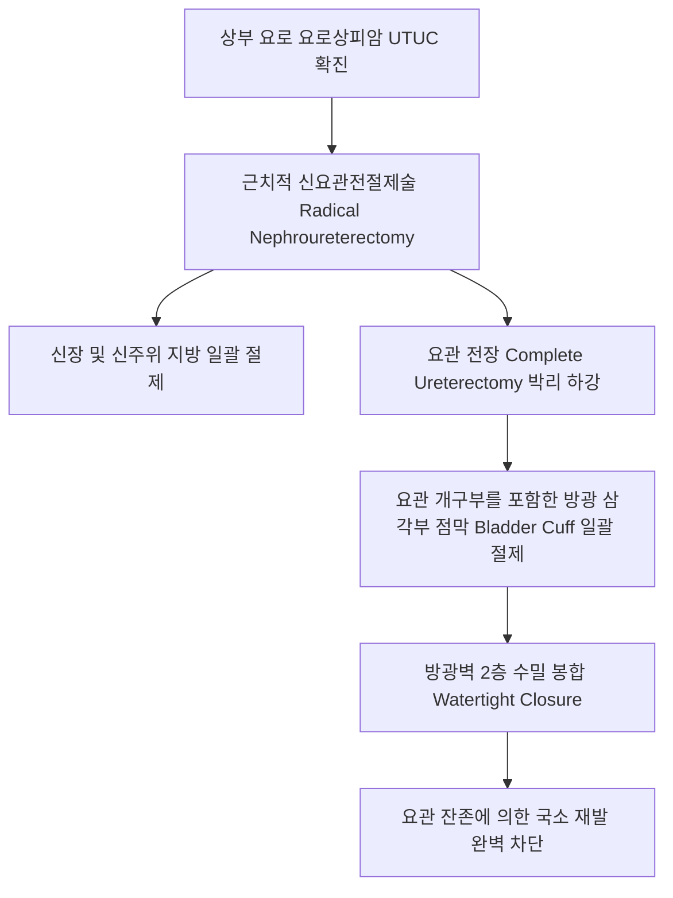
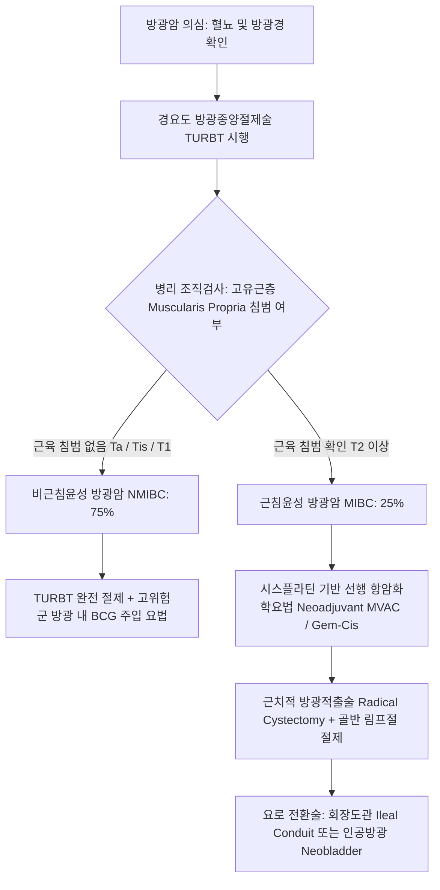

# 📑 [Netter Vol.5] Day 09: 비뇨기계 종양 — 양성 신종양, 신세포암(RCC) 아형 및 전이, 소아 윌름스 종양, 상부요로 요로상피암(UTUC) 및 방광암 병기 체계 (Section 9 완결)

> 📖 **원서 출처**: [The Netter Collection of Medical Illustrations - Volume 5, Urinary System.pdf (pp. 202-214)](https://drive.google.com/file/d/1vcvDctJJuo4vA2jKMPeSvjJjRpP1lhp2/view?usp=drivesdk)  
> 🏷️ **범위**: Section 9 전편 (Plate 9-1 ~ Plate 9-13, 총 13개 도판 전수 수록, pp. 202–214 완독)  
> 📌 **핵심 테마**: 신 호산세포종(Oncocytoma)의 미토콘드리아 과밀 마호가니 갈색 실질과 중심부 별모양 반흔(Central stellate scar), 혈관근지방종(AML)의 거시적 지방 음영(CT $-20\sim -80\text{ HU}$)과 자발 파열 렌더 증후군(Wunderlich syndrome, $4\text{ cm}$ 기준 색전술), 신세포암(RCC)의 3번 염색체 3p 결실 및 *VHL* 유전자 돌연변이에 따른 VEGF 과다 발현, 투명세포암(ccRCC)의 풍부한 지질 글리코겐과 종양수반 증후군(슈타우퍼 증후군 IL-6, EPO 적혈구증가증, PTHrP 고칼슘혈증), RCC의 IVC 종양 혈전 침범 및 폐/골 전이 표적·면역치료(IO+TKI), 소아 윌름스 종양(Wilms Tumor)의 *WT1* 유전자 연관 증후군(WAGR, Denys-Drash, BWS)과 아세포-상피-기질 3형태성 조직학(Triphasic histology), 상부요로 요로상피암(UTUC)의 다발성/장 발암성(Field cancerization)과 신요관전절제술 시 방광 커프 절제(Bladder cuff excision) 원칙, 방광암의 흡연 및 아로마틱 아민 발암 기전, 방광경하 유두상 vs 고착성 vs 상피내암(CIS) 감별, 그리고 고유근층 침범 여부에 따른 비근침윤성 방광암(NMIBC: TURBT + 방광내 BCG 요법) vs 근침윤성 방광암(MIBC: T2 이상 선행항암화학요법 + 근치적 방광적출술)의 치료 분기점.

---

## 1. 개요 및 마스터 요약 (Executive Summary)

1. **양성 신종양의 병리-방사선학적 특징 및 파열 위험 (Plates 9-1 ~ 9-2)**:
   - **호산세포종 (Oncocytoma)**: 집합관 개재세포(Intercalated cells) 기원으로 육안상 균일한 **마호가니 갈색(Mahogany brown)**과 **중심부 별모양 반흔 (Central stellate scar)**을 보이며, 전자현미경경상 **미토콘드리아의 극단적 축적**으로 호산성 다각형 세포를 이룸. 혐색소성 신세포암(Chromophobe RCC)과 완벽한 감별이 어려워 대부분 수술적 절제를 시행함.
   - **혈관근지방종 (Angiomyolipoma, AML)**: 혈관, 평활근, 성숙 지방 3요소로 구성. 결절성 경화증(Tuberous Sclerosis, *TSC1/TSC2*) 환자에서 양측성·다발성 호발. 복부 CT상 **음의 하운스필드 수치($-20\sim -80\text{ HU}$)**로 확진. **종양 직경 $\ge 4\text{ cm}$ 또는 동맥류 $\ge 5\text{ mm}$ 시 자발성 파열로 인한 대량 후복막강 출혈인 렌더 증후군 (Wunderlich Syndrome)** 위험이 급증하므로 예방적 **경카테터 동맥 색전술(TAE)** 또는 부분 신절제술을 시행함.

2. **신세포암(RCC)의 분자유전학, 아형, 종양수반 증후군 및 병기 (Plates 9-3 ~ 9-6)**:
   - **투명세포 신세포암 (Clear Cell RCC, $75\sim 80\%$)**: 근위세뇨관 기원으로 **3p25 결실 및 *VHL* 종양억제유전자 돌연변이/과메틸화($>90\%$)**가 핵심임. VHL 단백질 불활성화로 HIF-$\alpha$ 분해 장애 $\rightarrow$ **VEGF, PDGF 폭발적 과발현**으로 농밀한 모세혈관망 형성. 세포질 지질/글리코겐 축적으로 투명 세포질 관찰.
   - **종양수반 증후군 (Paraneoplastic)**: 고칼슘혈증(PTHrP), 적혈구증가증(EPO), 고혈압(Renin), 그리고 비전이성 간기능 이상을 보이는 **슈타우퍼 증후군 (Stauffer Syndrome, 종양 분비 IL-6 매개, 종양 절제 시 완치)**.
   - **진행 및 전이**: 신정맥을 타고 **하대정맥(IVC) 종양 혈전**을 형성하여 우심방까지 성장 가능. 혈행성 전이는 **폐(50~60%, Cannonball)**, **골(30~40%, 골용해성 병변)**에 호발. 전이성 RCC는 면역관문억제제(Nivolumab, Pembrolizumab) + VEGF-TKI(Axitinib, Cabozantinib) 병용 요법이 표준.

3. **소아 윌름스 종양(Wilms Tumor)의 임상유전학 (Plates 9-7 ~ 9-8)**:
   - 소아 신장암의 $95\%$ ($1\sim 5$세 호발). *WT1*(11p13) 변이 연관 **WAGR 증후군**(Wilms, 무홍채증, 비뇨생식기 기형, 지적장애) 및 **Denys-Drash 증후군**, 11p15 각인 이상 연관 **Beckwith-Wiedemann 증후군(BWS)**.
   - 부모가 목욕시키다 발견하는 **매끄럽고 단단한 무통성 복부 종괴**. 복부 정중선을 넘지 않음 (신경모세포종과의 감별점).
   - 조직학적 3형태성(Triphasic): **아세포(Blastemal, 작은 원형 푸른 세포) + 상피(Epithelial, 미성숙 세뇨관) + 기질(Stromal, 방추상 섬유세포/골격근)**. 예후는 **역형성(Anaplasia, *TP53* 변이)** 유무가 결정. 수술과 항암화학요법으로 5년 생존율 $>90\%$.

4. **상부 요로 요로상피암(UTUC)의 장 발암성과 신요관전절제술 (Plates 9-9 ~ 9-10)**:
   - 신우 및 요관의 요로상피암. **흡연**, 아리스톨로크산(한약재 광방기 $\rightarrow$ 발칸 신병증), 페나세틴, 린치 증후군(HNPCC)이 위험 인자.
   - **장 발암 가설 (Field Cancerization)**: 요로계 전체가 발암물질에 동시 노출되므로 다발성 발생 및 향후 방광암 재발률($30\sim 50\%$)이 극히 높음.
   - 표준 수술: **신요관전절제술 및 방광 커프 절제술 (Radical Nephroureterectomy with Bladder Cuff Excision)** - 신장, 요관 전장, 그리고 요관 개구부를 둘러싼 방광 삼각부 점막(Bladder cuff)을 한 덩어리로 통째로 절제해야 국소 재발을 차단함.

5. **방광암의 병리학적 양분화 및 근침윤성 여부에 따른 치료 전략 (Plates 9-11 ~ 9-13)**:
   - 주원인은 **흡연($50\%$)** 및 염료 공장 방향족 아민. 주증상은 **"간헐적 무통성 육안적 혈뇨 (Painless Gross Hematuria, $>85\%$)"**.
   - **비근침윤성 방광암 (NMIBC, $75\%$, Ta / Tis / T1)**: 고유근층을 침범하지 않음. **경요도 방광종양절제술(TURBT)**로 완전 절제 후, 고위험군(T1, CIS, 고등급)에서는 재발과 침윤 진행을 억제하기 위해 **방광 내 BCG (Bacillus Calmette-Guérin) 면역 주입 요법**을 시행함.
   - **근침윤성 방광암 (MIBC, $25\%$, $\ge\text{T2}$)**: **고유근층(Muscularis propria / Detrusor muscle)을 침범함**. 림프절 및 전신 전이 위험이 급증하므로, **시스플라틴 기반 선행 항암화학요법(Neoadjuvant Chemotherapy) 후 근치적 방광적출술 (Radical Cystectomy) + 양측 골반 림프절 절제술 + 요로 전환술(회장도관 또는 인공방광)**을 시행해야 함.

---

## 2. 양성 신종양: 호산세포종 및 혈관근지방종 (Plates 9-1 ~ 9-2)

### Plate 9-1 | 양성 신종양: 유두상 선종 및 호산세포종 (Benign Renal Tumors: Papillary Adenoma and Oncocytoma)

![[Netter_V5_Plate9-1.png]]

#### 1) 신 유두상 선종 (Renal Papillary Adenoma)
- 부검이나 다른 질환으로 신절제 시 우연히 발견되는 가장 흔한 피질 양성 상피성 종양.
- 육안: 피질 피막하에 위치하는 경계가 명확한 황갈색 결절.
- 조직학: 유두상 또는 세뇨관 구조를 형성하며 세포학적으로 저등급 유두상 신세포암(Papillary RCC)과 감별이 불가능함.
- 정의 기준: 악성 잠재성을 배제하기 위해 전통적으로 **최대 직경 $\le 15\text{ mm}$ (과거 기준 $\le 5\text{ mm}$)**인 경우에만 선종으로 분류함.

#### 2) 신 호산세포종 (Renal Oncocytoma)
- **발생 기원**: 신 피질 수질 집합관의 **개재세포 (Intercalated cells, A형)**에서 기원함.
- **육안 병리 (Gross Appearance)**:
  - 뚜렷한 피막에 둘러싸인 단발성 종양.
  - 단면은 균일하고 짙은 **마호가니 갈색 (Mahogany brown)**을 띰 (다량의 미토콘드리아 내 시토크롬 색소 때문).
  - 종양 중앙부에 별 모양으로 뻗치는 백색 섬유성 흉터인 **중심부 별모양 반흔 (Central Stellate Scar)**이 약 $30\sim 50\%$에서 관찰됨 (방사선학적 주요 단서).
- **현미경 및 전자현미경 소견**:
  - H&E 염색상 호산구성 과립으로 가득 찬 풍부한 세포질을 가진 둥근 다각형 세포들이 둥지(Nests)나 세관 구조를 이룸.
  - **전자현미경 (EM)**: 세포질이 비정상적으로 증식한 **수천 개의 미토콘드리아 (Mitochondria)**로 빽빽하게 채워져 있음.
- **임상적 난제**: 방사선학적(CT/MRI) 및 경피적 생검으로도 **혐색소성 신세포암 (Chromophobe RCC)의 호산구성 변이형**과 완벽한 감별이 불가능하여, 치료는 대부분 악성 종양에 준해 부분 신절제술(Partial Nephrectomy)을 시행한 후 최종 병리 조직으로 확진함.

---

### Plate 9-2 | 양성 신종양: 혈관근지방종 (Benign Renal Tumors: Angiomyolipoma, AML)

![[Netter_V5_Plate9-2.png]]

#### 1) 조직학적 구성 3요소 (Triad of Tissues)
신장의 혈관주위 상피양 세포 종양(PEComa family)에 속하며 다음 세 가지 성분이 혼재함:
1. **혈관 (Vessels)**: 정상적인 탄력판(Elastic lamina)이 결핍되어 혈관벽이 비후되고 비틀린 기형적 무근육성 이형 동맥. 동맥류(Aneurysm) 형성이 흔함.
2. **평활근 (Smooth Muscle)**: 방추상(Spindle) 세포들이 소용돌이 모양으로 배열됨.
3. **성숙 지방 (Adipose Tissue)**: 정상 피하지방과 동일한 다량의 성숙 지방세포 군집.

#### 2) 역학 및 결절성 경화증 (Tuberous Sclerosis Complex, TSC) 연관성

| 구분 | 산발성 혈관근지방종 (Sporadic AML) | 결절성 경화증 연관 AML (TSC-associated AML) |
| :--- | :--- | :--- |
| **비율** | 전체 AML의 약 **$80\%$** | 전체 AML의 약 **$20\%$** |
| **호발군** | $40\sim 50$대 중년 여성 | 소아기~청년기 남녀 동일 |
| **종양 양상** | **단발성 (Solitary), 일측성 (Unilateral)** | **양측성 (Bilateral), 다발성 (Multifocal), 거대 종양** |
| **유전학** | 체세포성 단클론성 돌연변이 | 상염색체 우성, **$TSC1$ (Hamartin) 또는 $TSC2$ (Tuberin)** 생식세포 변이 |
| **동반 병변** | 없음 | 안면 혈관섬유종(Adenoma sebaceum), 뇌 피질 결절, 심장 횡문근종 |

#### 3) 방사선 진단 및 자발 파열 렌더 증후군 (Wunderlich Syndrome)
- **CT 진단 기준**: 조영 전 복부 CT상 종양 내에 **$-20\sim -80\text{ Hounsfield Units (HU)}$의 음의 음영을 나타내는 거시적 지방 (Macroscopic Fat)**이 확인되면 조직 생검 없이 혈관근지방종으로 확진 가능함.
- **렌더 증후군 (Wunderlich Syndrome)**:
  - 기형 혈관의 탄력막 결손 및 가성동맥류 파열로 인해 발생하는 **외상 없는 급성 대량 후복막강 출혈**.
  - **Lenk's Triad**: 극심한 급성 측복통 + 촉지되는 측복부 종괴 + 저혈량성 쇼크.
- **예방적 치료 적응증**:
  - **종양 직경 $\ge 4\text{ cm}$** 또는 **신내 동맥류 직경 $\ge 5\text{ mm}$**.
  - 임신 계획이 있는 가임기 여성 (임신 중 에스트로겐 수용체 자극으로 급격히 거대화되어 파열 위험 극대화).
- **치료**: 응급/예방적 **경카테터 신동맥 색전술 (Transcatheter Arterial Embolization, TAE)**이 1차 선택. 신기능 보존을 위한 부분 신절제술. TSC 환자의 거대 다발성 병변에는 **mTOR 억제제 (Everolimus)**가 종양 부피를 현저히 축소시킴.

---

## 3. 신세포암: 분자유전학, 아형, 병기 및 전이 (Plates 9-3 ~ 9-6)

### Plate 9-3 | 신세포암: 위험 인자 및 방사선학적 소견 (RCC: Risk Factors & Radiology)

![[Netter_V5_Plate9-3.png]]

#### 1) 위험 인자 및 종양수반 증후군 (Paraneoplastic Syndromes)
- **주요 위험 인자**: **흡연 (Smoking, 교차비 2.0)**, 비만, 고혈압, 말기 신질환(ESRD) 환자에서 발생하는 후천성 낭종성 신질환(Acquired Cystic Disease of Kidney, ACDK $\rightarrow$ RCC 위험 30배 증가).
- **종양수반 증후군 (Paraneoplastic Syndromes, $20\sim 30\%$)**:
  - **고칼슘혈증 (Hypercalcemia)**: 부갑상선호르몬 관련 단백질(**PTHrP**) 이소성 분비.
  - **적혈구증가증 (Erythrocytosis)**: 종양 세포의 **에리스로포이에틴 (EPO)** 과다 생성.
  - **고혈압 (Hypertension)**: 레닌(Renin) 과다 분비.
  - **슈타우퍼 증후군 (Stauffer Syndrome)**: 간 전이가 전혀 없음에도 종양에서 분비되는 **인터루킨-6 (IL-6)**에 의해 간기능 이상(ALP 상승, 간효소치 상승, 간비대) 및 발열이 나타나는 질환으로, 원발 종양을 절제하면 간기능이 마법처럼 정상화됨.
- **좌측 정계정맥류 (Left Varicocele)**: 좌측 고환정맥은 직각으로 좌측 신정맥으로 유입되므로, 신세포암이 좌측 신정맥을 침범하여 종양 혈전을 형성하면 고환정맥 환류가 차단되어 좌측 음낭에 정계정맥류가 발생하며, **환자가 누워도 정맥류가 소실되지 않는 것**이 특징임.

---

### Plate 9-4 | 신세포암: 육안 병리 소견 (Renal Cell Carcinoma: Gross Pathology)

![[Netter_V5_Plate9-4.png]]

#### 1) 투명세포암의 고전적 육안 소견
- 신피질에서 외향성(Exophytic)으로 자라나는 둥근 구형 종괴로, 가성 피막(Pseudocapsule)에 의해 둘러싸임.
- **황금색 실질 (Bright Golden-Yellow Color)**: 세포질 내 풍부한 콜레스테롤, 중성지방, 글리코겐 축적에 기인함.
- **다채로운 외관 (Variegated Appearance)**: 종양 증식이 워낙 빨라 혈관 신생이 따라가지 못하므로, 종양 중심부에 백색 섬유화, 회백색 응고 괴사(Necrosis), 암적색 출혈(Hemorrhage), 낭종성 연화 및 석회화가 모자이크처럼 뒤섞여 나타남.
- **혈관 침습성**: 신피막을 뚫고 신주위 지방을 침범하거나, 집합계를 침범하여 육안적 혈뇨를 유발하며, 미세 모세혈관을 뚫고 대형 정맥으로 진입함.

---

### Plate 9-5 | 신세포암: 주요 조직학적 아형 (Renal Cell Carcinoma: Histopathology)

![[Netter_V5_Plate9-5.png]]

#### 1) 신세포암 3대 주요 아형 비교

| 병리 아형 | 빈도 | 기원 세포 | 핵심 유전학적 변이 |
| :--- | :---: | :--- | :--- |
| **투명세포암 (Clear Cell)** | $75\sim 80\%$ | 근위곡세뇨관 (PCT) | **3p 결실, $VHL$ 불활성화 (HIF-1/2$\alpha$ 과발현, VEGF 증가)** |
| **유두상암 (Papillary)** | $10\sim 15\%$ | 근위곡세뇨관 (PCT) | **Trisomy 7, 17, $MET$ 돌연변이** |
| **혐색소암 (Chromophobe)**| $5\%$ | 집합관 개재세포 | **광범위 염색체 소실 (Hypodiploidy: Chr 1, 2, 6, 10, 13, 17 결실)** |

| 병리 아형 | 현미경 조직 소견 | 예후 |
| :--- | :--- | :---: |
| **투명세포암 (Clear Cell)** | 지질/글리코겐 용해된 **투명한 세포질**, 농밀한 모세혈관망 둥지 구조 | 중간 (병기 의존) |
| **유두상암 (Papillary)** | 섬유혈관 축을 둘러싼 **유두상 배열**, 포말 대식세포 침윤, 사모마 소체 | 양호 (Type 1) 불량 (Type 2) |
| **혐색소암 (Chromophobe)**| 두꺼운 **식물세포양 세포막**, **핵주위 후광(Halo)**, 주름진 건포도 핵 | **가장 우수** |

- **Hale's Colloidal Iron 특수 염색**: 혐색소성 신세포암은 세포질 소포에 산성 점액다당류가 풍부하여 세포질 전체가 **미만성 청색(Diffuse Blue)**으로 강하게 염색되는 반면, 호산세포종은 음성이거나 정점부(Apical)만 염색되어 두 질환 감별의 표준 염색법으로 활용됨.

---

### Plate 9-6 | 신세포암: TNM 병기 체계 및 전이 양상 (RCC: Staging and Metastasis)

![[Netter_V5_Plate9-6.png]]

#### 1) RCC의 TNM 병기 체계 (AJCC 8th Edition)
- **T1**: 종양이 신장에 국한, 최대 직경 $\le 7\text{ cm}$ (T1a $\le 4\text{ cm}$, T1b $4\sim 7\text{ cm}$).
- **T2**: 종양이 신장에 국한, 최대 직경 $>7\text{ cm}$ (T2a $7\sim 10\text{ cm}$, T2b $>10\text{ cm}$).
- **T3**: 신장 국한을 벗어났으나 게로타 근막은 침범하지 않음.
  - **T3a**: 신주위 지방(Perirenal fat) 또는 신우 정맥 가지 침범.
  - **T3b**: 횡격막 하부의 **하대정맥 (IVC) 내강으로 종양 혈전 진입**.
  - **T3c**: 횡격막 상부의 하대정맥 진입 또는 IVC 벽 직접 침습.
- **T4**: **게로타 근막 (Gerota's fascia)을 뚫고 확산**, 또는 동측 부신 직접 침범.

#### 2) 전이성 신세포암(mRCC)의 현대 표적·면역 항암 치료
- 고전적 세포독성 항암제와 방사선 치료에 극도로 저항성을 보임.
- **현대 1차 표준 치료**:
  - **이중 면역관문억제제 (Dual IO)**: **Nivolumab (anti-PD-1) + Ipilimumab (anti-CTLA-4)**.
  - **면역치료 + VEGF 표적 TKI 병용**: **Pembrolizumab + Axitinib** 또는 **Nivolumab + Cabozantinib**.

---

## 4. 소아 윌름스 종양 및 상부요로 요로상피암 (Plates 9-7 ~ 9-10)

### Plate 9-7 | 윌름스 종양: 유전학, 임상 발현 및 영상 (Wilms Tumor: Genetics & Imaging)

![[Netter_V5_Plate9-7.png]]

#### 1) 분자유전학 및 연관 선천 증후군
- 소아 신장암의 $95\%$를 차지하며 대부분 5세 미만(피크 2~3세)에 발생함.
- **1. 11p13 염색체 결실 (*WT1* 종양억제유전자 결손)**:
  - **WAGR 증후군**: **W**ilms tumor ($50\%$), **A**niridia(무홍채증, *PAX6* 유전자 동반 결실), **G**enitourinary anomalies(잠복고환, 요도하열), **R**etardation(지적장애).
  - **Denys-Drash 증후군**: *WT1* 점돌연변이. 윌름스 종양 발생률 $>90\%$, 조기 신증후군(미만성 메산지움 경화증 $\rightarrow$ 신부전), 남성 가성반음양(XY 성선이형성).
- **2. 11p15 유전자 각인 이상 (*WT2* 유전자좌, *IGF2* 과발현)**:
  - **Beckwith-Wiedemann 증후군 (BWS)**: 윌름스 종양, 신체편측비대(Hemihypertrophy), 거대설(Macroglossia), 거대장기증, 배꼽탈장, 신생아 저혈당.

#### 2) 임상 양상 및 영상 감별 진단
- 전형적 발현: 건강해 보이던 소아의 복부에서 부모가 목욕 중 우연히 만지는 **크고 매끄러우며 단단한 무통성 복부 종괴 (Painless abdominal mass)**.
- **신경모세포종 (Neuroblastoma)과의 핵심 감별**:
  - 윌름스 종양은 신실질 내부에서 발생하므로 **복부 정중선(Midline)을 거의 넘지 않으며 석회화가 드묾**.
  - 신경모세포종은 부신 수질 신경릉 기원으로 복부 정중선을 가로지르며 불규칙하고 결절성이며 미세 석회화가 매우 흔함.
- **CT 영상**: 정상 신실질이 종양에 밀려 초승달 모양으로 종양 가장자리를 감싸는 **"발톱 징후 (Claw sign)"** 관찰.

---

### Plate 9-8 | 윌름스 종양: 육안 및 3형태성 조직병리 (Wilms Tumor: Pathology)

![[Netter_V5_Plate9-8.png]]

#### 1) 육안 병리 (Gross Appearance)
- 정상 신장 실질을 한쪽으로 압박하며 팽창하는 거대하고 경계가 명확한 단발성 종괴.
- 단면은 연한 회백색에서 분홍빛을 띠는 부드럽고 뇌수 같은 수핵성 육안(Soft, fleshy, brain-like consistency)을 보이며, 국소적 낭종 변성과 출혈 괴사 동반.

#### 2) 고전적 3형태성 조직학 (Classic Triphasic Histology)
정상 후신중배엽(Metanephric blastema)의 발생 단계를 재현하는 세 가지 성분이 혼재함:
1. **아세포 성분 (Blastemal component)**:
   - 세포질이 거의 없고 농염된 둥근 핵을 가진 작고 푸른 원형 세포(Small round blue cells)들이 조밀한 시트(Sheets)나 둥지를 형성함. 유사분열 활발.
2. **상피 성분 (Epithelial component)**:
   - 세뇨관으로의 분화를 시도하는 원시적 세관 구조 및 보우만낭을 닮은 불완전 사구체(Abortive tubules and glomeruli) 형성.
3. **기질 성분 (Stromal component)**:
   - 방추상 세포들로 구성된 섬유점액성 기질(Fibromyxoid stroma). 이종 성분으로의 분화가 흔하여 **골격근 횡문근모세포(Rhabdomyoblasts)**, 지방, 연골, 골 조직이 관찰되기도 함.
- **예후의 핵심: 역형성 (Anaplasia)**:
  - 거대 기괴핵과 비정상 다극성 유사분열상(Multipolar mitotic figures)을 보이는 역형성 병변(약 $5\%$, *TP53* 변이 동반)은 항암화학요법에 저항성을 보여 불량한 예후를 나타냄.

---

### Plate 9-9 | 신우 및 요관 종양: 위험 인자 및 방사선학 (UTUC: Risk & Imaging)

![[Netter_V5_Plate9-9.png]]

#### 1) 상부 요로 요로상피암(UTUC)의 독특한 병인
- 전체 요로상피암의 약 $5\sim 10\%$를 차지함 (신우 종양이 요관보다 2~3배 호발).
- **흡연**: 발암물질 배설에 따른 직접 손상 (상대위험도 3배).
- **아리스톨로크산 (Aristolochic Acid)**: 한약재(광방기, 마두령) 복용이나 발칸 반도의 쥐방울덩굴 오염 곡물 섭취(Balkan Endemic Nephropathy) 시 DNA 부가체(Adduct)를 형성하여 **신간질 섬유화 및 고빈도 상부 요로암**을 유발함.
- **린치 증후군 (Lynch Syndrome / HNPCC)**: *MSH2, MSH6, MLH1* 불일치 복구 유전자 결함 환자에서 대장암 다음으로 흔히 발생하는 암종 중 하나.

#### 2) 방사선학적 영상 소견
- **CT 요로조영술 (CT Urography)** 및 **역행성 신우조영술 (RGP)**:
  - 신우 또는 요관 내강을 침범하는 **경계가 불규칙한 충만 결손 (Filling defect)**.
  - **베르그만 징후 (Bergman's Sign / Goblet Sign)**:
    - 요관 내 유두상 종양이 자라면서 요관 내강을 막아 종양 아래쪽 요관이 배 모양(Goblet) 또는 술잔 모양으로 늘어나며 조영제가 고이는 현상 (단순 요관결석에 의한 팽창과 감별되는 요로상피암의 특징적 소견).

---

### Plate 9-10 | 신우 및 요관 종양: 내시경 및 신요관전절제술 (UTUC: Ureteroscopy & Surgery)

![[Netter_V5_Plate9-10.png]]

#### 1) 장 발암성 (Field Cancerization)과 방광 재발
- 신배, 신우, 요관, 방광, 근위 요도는 모두 동일한 배아 기원의 요로상피(Urothelium)로 덮여 있으며, 소변에 포함된 발암물질에 일괄적으로 노출됨.
- 따라서 UTUC 환자의 **$30\sim 50\%$에서 추후 방광암이 발생**하며, 반대로 방광암 환자의 $2\sim 4\%$에서 상부 요로암이 발생함 (정기적인 방광경 추적 검사 필수).

#### 2) 외과적 골드 스탠다드: 신요관전절제술 및 방광 커프 절제술

- **방광 커프 절제술 (Bladder Cuff Excision)의 절대적 필요성**:
  - 원위부 요관을 방광벽 부근에서 어설프게 결찰 절단하고 남겨둘 경우, **남아있는 원위 요관 그루터기(Ureteral stump)에서 $30\sim 70\%$라는 치명적인 국소 재발**이 발생함.
  - 따라서 방광벽을 일부 개방하여 요관 개구부 주위 점막을 원형으로 도려내는 방광 커프 절제를 한 덩어리로(En bloc) 반드시 완수해야 함.

---

## 5. 방광 종양: 위험 인자, 방광경 및 병기 체계 (Plates 9-11 ~ 9-13)

### Plate 9-11 | 방광 종양: 위험 인자 및 임상 증상 (Bladder Tumors: Risk Factors and Clinical Features)

![[Netter_V5_Plate9-11.png]]

#### 1) 주요 역학 및 발암 인자
- 비뇨기과 악성 종양 중 전립선암 다음으로 흔함 (남성에서 3~4배 호발).
- **흡연 (Cigarette Smoking, 기여 위험도 $50\%$)**: 소변으로 배설되는 방향족 아민(Aromatic amines, 4-ABP 등)이 요로상피 DNA 돌연변이(*TP53, FGFR3, RB1*)를 유발.
- **직업적 노출**: 염료 공장, 고무, 화학, 가죽, 인쇄업 종사자(2-Naphthylamine, Benzidine).
- **사이클로포스파마이드 (Cyclophosphamide)**: 림프종 및 자가면역질환 치료제로 투여 시 체내 대사체인 **아크롤레인 (Acrolein)**이 방광 상피를 직접 괴사시켜 출혈성 방광염 및 요로상피암을 유발 (예방약: **Mesna**).

#### 2) 고전적 임상 증상
- **"간헐적 무통성 육안적 혈뇨 (Painless Intermittent Gross Hematuria, $>85\%$)"**:
  - 방광암의 가장 중요한 초기 징후. 통증 없이 소변 전체가 붉게 나오며 며칠 후 저절로 맑아져 환자가 병원을 늦게 찾게 만듦.
- **불응성 방광 자극 증상 (Irritative Voiding Symptoms)**:
  - 항생제 치료에 반응하지 않는 빈뇨, 절박뇨, 배뇨통. 이는 종양이 방광 삼각부에 위치하거나 **고등급 평평 상피내암 (CIS)**이 동반되었음을 강력히 시사함.

---

### Plate 9-12 | 방광 종양: 방광경 및 영상의학적 소견 (Bladder Tumors: Cystoscopy & Radiology)

![[Netter_V5_Plate9-12.png]]

#### 1) 방광경하 3대 형태학적 외관
1. **유두상 종양 (Papillary Tumor, 약 $70\%$)**:
   - 얇은 줄기(Stalk)를 가지고 방광 내강으로 말미잘이나 산호처럼 뻗어 나온 외향성 병변. 표재성이 많음.
2. **고착성/결절성 종양 (Sessile / Solid Tumor, 약 $25\%$)**:
   - 줄기 없이 방광벽에 넓은 바닥으로 붙어 있는 융기성 병변. 중심부 궤양이나 괴사를 흔히 동반하며 **고유근층 침범(근침윤성) 가능성이 매우 높음**.
3. **상피내암 (Carcinoma In Situ, CIS, 약 $5\%$)**:
   - 내강으로 튀어나온 종괴가 전혀 없음.
   - 방광 점막이 벨벳처럼 붉게 충혈되거나 거칠어진 평평한 홍반(Flat erythematous patch) 형태로 관찰됨. 현미경적으로는 최악의 고등급 악성 세포로 구성되어 있어 침윤성 암으로 진행할 위험이 극도로 큼.

---

### Plate 9-13 | 방광 종양: 조직병리 및 병기 체계 (Bladder Tumors: Histopathology and Staging)

![[Netter_V5_Plate9-13.png]]

#### 1) 병리학적 아형
- **요로상피암 (Urothelial Carcinoma, $>90\%$)**: 과거 이행상피암(TCC).
- **편평세포암 (Squamous Cell Carcinoma, $5\%$)**: 만성 방광결석, 영구 유치 도뇨관 자극, 방광주혈흡충증 연관.
- **선암 (Adenocarcinoma, $1\sim 2\%$)**: 방광 돔 부위의 요막관 잔여물 유래(Urachal CA) 또는 방광외번증 합병증.

#### 2) 고유근층 침범 여부에 따른 2대 치료 패러다임 (NMIBC vs MIBC)

- **1. 비근침윤성 방광암 (Non-Muscle Invasive Bladder Cancer, NMIBC, $75\%$)**:
  - **Ta**: 요로상피 점막에 국한된 유두상 암.
  - **Tis (CIS)**: 점막에 국한된 평평한 고등급 상피내암.
  - **T1**: 점막하 결합조직(固有層 Lamina propria)까지만 침범하고 고유근층은 보존됨.
  - **치료**: **TURBT (경요도 방광종양절제술)**로 종양 기저부 근육층까지 완벽히 긁어냄. 고위험군(T1, 고등급, CIS)에서는 재발 및 진행 방지를 위해 약독화 결핵균인 **방광 내 BCG (Bacillus Calmette-Guérin) 면역 주입 요법**을 주 1회씩 6주간 시행.
- **2. 근침윤성 방광암 (Muscle Invasive Bladder Cancer, MIBC, $25\%$)**:
  - **T2**: **고유근층 (Muscularis Propria / Detrusor muscle) 침범** (T2a 내측 1/2, T2b 외측 1/2).
  - **T3**: 근육층을 뚫고 방광 주위 지방 조직(Perivesical fat) 침범.
  - **T4**: 전립선, 자궁, 질, 골반벽 등 인접 장기 직접 침습.
  - **치료**: 단순 절제 불가. **시스플라틴 기반 선행 항암화학요법(Neoadjuvant Chemotherapy)을 먼저 시행한 후, 근치적 방광적출술 (Radical Cystectomy: 남성은 방광+전립선+정낭, 여성은 방광+자궁+난소+질 전벽 일괄 절제) + 양측 골반 림프절 절제술 + 회장도관(Ileal conduit) 또는 인공방광(Orthotopic neobladder) 요로 전환술**을 완수해야 함.

---

## 6. 핵심 비교 감별 및 보드 요약표 (Clinical High-Yield Tables)

### 1) 신세포암 3대 주요 아형 감별표

| 감별 항목 | 투명세포암 (ccRCC) | 유두상암 (pRCC) | 혐색소암 (chRCC) |
| :--- | :--- | :--- | :--- |
| **발생 비율** | $75\sim 80\%$ (압도적 최다) | $10\sim 15\%$ | $5\%$ |
| **기원 네프론** | 근위곡세뇨관 (PCT) | 근위곡세뇨관 (PCT) | **집합관 개재세포 (Intercalated cells)** |
| **핵심 유전 변이** | **3p 결실, $VHL$ 유전자 변이** | **Trisomy 7, 17, $MET$ 변이** | **광범위 염색체 소실 (Hypodiploidy)** |
| **육안 단면 소견** | **황금색 (Golden-yellow)**, 출혈/괴사 | 회백색~황색, 낭종 변성 | 균일한 베이지~황갈색 |
| **현미경 특징** | 풍부한 지질로 **투명한 세포질**, 모세혈관망 | 섬유혈관 축의 **유두상 돌기**, 사모마체 | **식물세포양 두꺼운 막, 핵주위 후광 (Halo)** |
| **Colloidal Iron** | 음성 | 음성 | **세포질 전체 강한 청색 양성** |
| **예후** | 중간 (전이 호발) | Type 1 양호 / Type 2 불량 | **3대 아형 중 가장 우수** |

### 2) 방광암 병기별 분류 및 표준 치료 알고리즘

| 임상 병기 | 침범 깊이 (Depth of Invasion) | 위험도 분류 | 표준 외과적 및 약물 치료 |
| :--- | :--- | :---: | :--- |
| **Ta** | 요로상피 점막 국한 유두상 종양 | 저위험군~중위험군 | **TURBT 완전 절제** + 수술 직후 1회 방광내 항암제 주입 |
| **Tis (CIS)** | 점막 국한 평평한 고등급 상피내암 | **초고위험군** | **TURBT 절제 후 방광 내 BCG 면역 주입 요법 (유도 6주 + 유지)** |
| **T1** | 점막하 결합조직(Lamina propria) 침범 | 고위험군 | **TURBT 재절제(Re-TURBT)**로 근육층 침범 재확인 + **방광 내 BCG** |
| **T2 ~ T4** | **고유근층 (Muscularis propria) 이상 침범** | **근침윤성 (MIBC)** | **선행 항암화학요법(GemCis) $\rightarrow$ 근치적 방광적출술 + 요로 전환술** |
| **N+ / M1** | 골반 림프절 또는 원격 장기 전이 | 전이성 (mUC) | 시스플라틴 항암 또는 면역관문억제제(EV + Pembrolizumab) |

---

## 7. 결론 및 최종 학습 로드맵

Day 09에서는 **Section 9: 비뇨기계 종양 (Plates 9-1 ~ 9-13, 총 13개 도판 전수)**을 완벽히 마스터하였습니다:
- 신 호산세포종(마호가니 갈색, 별모양 반흔, 미토콘드리아 과밀)과 혈관근지방종(CT 음의 지방 음영, 렌더 증후군 $4\text{ cm}$ 파열 기준, 색전술).
- 신세포암(RCC)의 3p25 결실 및 *VHL* 변이, VEGF 신호 캐스케이드, 슈타우퍼 증후군(IL-6) 등 종양수반 증후군.
- RCC 3대 아형(투명세포암, 유두상암, 혐색소암)의 조직학적/유전학적 감별 및 IVC 종양 혈전 침범.
- 소아 윌름스 종양(Wilms Tumor)의 *WT1* 연관 증후군(WAGR, Denys-Drash, BWS)과 아세포-상피-기질 3형태성 조직학.
- 상부요로 요로상피암(UTUC)의 장 발암성(Field cancerization)과 신요관전절제술 시 방광 커프 절제(Bladder cuff excision) 원칙.
- 방광암의 흡연 발암 기전, 무통성 육안적 혈뇨, 방광경하 외관(유두상, 고착성, CIS).
- 고유근층 침범 여부에 따른 비근침윤성 방광암(NMIBC: TURBT + 방광내 BCG)과 근침윤성 방광암(MIBC: 선행항암 + 근치적 방광적출술)의 치료 분기점.

비뇨기계의 마지막 대단원인 **Day 10**에서는 **Section 10: 비뇨기 치료학 및 외과 수술 (이뇨제 군별 약리 기전, 신생검, 혈액투석 혈관통로 동정맥루, 복막투석, 신장이식 급만성 거부반응 면역병리 및 면역억제제, 체외충격파 쇄석술 ESWL, 경피적 신쇄석술 PCNL, 복강경/개복 신절제술 및 부분 신절제술, 냉동동결치료 Cryoablation, Plates 10-1 ~ 10-40, 총 40개 도판)** 전수를 완독하며 Netter Volume 5 시리즈의 화려한 피날레를 장식하게 됩니다.
