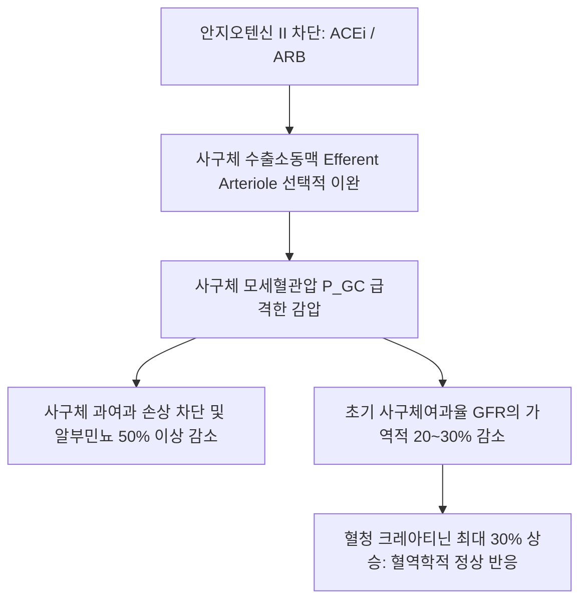

# 📑 [Netter Vol.5] Day 10: 비뇨기 치료학 및 외과 수술 — 이뇨제 약리, 신대체요법, 신장이식 거부반응 병리, 내시경 쇄석술(ESWL/PCNL/URS), 신절제술 및 TURBT (Section 10 완결 / Vol.5 피날레)

> 📖 **원서 출처**: [The Netter Collection of Medical Illustrations - Volume 5, Urinary System.pdf (pp. 216-255)](https://drive.google.com/file/d/1vcvDctJJuo4vA2jKMPeSvjJjRpP1lhp2/view?usp=drivesdk)  
> 🏷️ **범위**: Section 10 전편 (Plate 10-1 ~ Plate 10-40, 총 40개 도판 전수 수록, pp. 216–255 완독)  
> 📌 **핵심 테마**: 네프론 분절별 5대 이뇨제(삼투성, 탄산탈수효소 억제제, 루프 이뇨제 NKCC2, 티아지드 NCC 및 칼슘 역설, 칼륨 보존성 ENaC/MRA) 및 RAAS 억제제의 사구체 혈역학적 신보호 기전, 초음파 유도 경피적 신생검(좌측 하극 조준, LM/IF/EM 3중 분석), 혈액투석의 확산·초여과와 자가 동정맥루(AVF Cimino-Brescia fistula) vs 인조혈관(AVG) vs 투석 카테터, 복막투석(CAPD/APD)의 복막염 진단, 결석 중재술 3대 축(체외충격파 ESWL 적응증과 금기, 거대 녹각석 경피적 신쇄석술 PCNL, 연성 요관경 RIRS 홀뮴 레이저), 근치적 신절제술(게로타 근막 일괄 절제) vs 신원보존 부분 신절제술(T1 병기 표준, 온허혈 시간 20분), 소구경 신암 냉동치료(Cryoablation 얼음구 생성), 신장이식의 장골와 복막외 이식 수술 및 3제 면역억제 요법(CNI Tacrolimus, MMF, Steroid), 이식 거부반응 면역병리(초급성 기존 항체 혈전 괴사, 급성 TCMR 세뇨관염 Tubulitis, 급성 ABMR 모세혈관 C4d 침착, 만성 CNI 신독성 줄무늬 섬유화), 요관 재이식(Politano-Leadbetter) 및 방광 결손 Boari flap 재건, 그리고 방광경하 요로상피 관찰 및 표재성 방광암 경요도 절제술(TURBT 근육층 채취 원칙).

---

## 1. 개요 및 마스터 요약 (Executive Summary)

1. **신장 약리학: 5대 이뇨제 군별 타깃 수송체 및 전해질 역학 (Plates 10-1 ~ 10-6)**:
   - **삼투성 이뇨제 (Mannitol, 10-1)**: 근위세뇨관 및 헨레 하행각 관강 삼투압 상승 $\rightarrow$ 수분 재흡수 차단 (뇌부종 강하). 초기 일시적 혈관내 혈장량 팽창 주의.
   - **탄산탈수효소 억제제 (Acetazolamide, 10-2)**: PCT CA-IV/II 억제 $\rightarrow$ $\text{HCO}_3^-$ 배설 및 소변 알칼리화, 대사성 산증 유도 (고산병, 녹내장).
   - **루프 이뇨제 (Furosemide, 10-3)**: 굵은 상행각(TAL)의 **$\text{Na}^+\text{-K}^+\text{-2Cl}^-$ (NKCC2)** 차단. 수질 삼투압 구배 붕괴로 최대 이뇨. **칼슘 배설 촉진 (고칼슘혈증 치료)**.
   - **티아지드 이뇨제 (HCTZ, 10-4)**: 원위곡세뇨관(DCT)의 **$\text{Na}^+\text{-Cl}^-$ (NCC)** 차단. **칼슘 재흡수 촉진 (저칼슘뇨증 유도 $\rightarrow$ 수산칼슘 결석 재발 방지 및 골다공증 보호)**.
   - **칼륨 보존성 이뇨제 (10-5)**: CCT 주세포의 ENaC 억제(Amiloride) 및 알도스테론 수용체 길항(Spironolactone) $\rightarrow$ 고칼륨혈증 주의.
   - **RAAS 억제제 (ACEi / ARB, 10-6)**: **사구체 수출소동맥(Efferent arteriole) 선택적 확장** $\rightarrow$ 사구체 모세혈관압($P_{GC}$) 강하로 장기 신보호(Renoprotection). 양측 신동맥 협착 시 사구체 여과압 붕괴 급성 신부전 위험.

2. **신생검 및 말기 신부전 신대체요법 (Plates 10-7 ~ 10-11)**:
   - **경피적 신생검 (10-7 ~ 10-8)**: 초음파 유도하에 합병증이 적은 **좌측 신장 하극(Lower pole)**을 16~18G 자동침으로 생검. 광학현미경(최소 사구체 10개), 면역형광(면역복합체 침착), 전자현미경(GBM/족세포 미세구조) 3중 분석.
   - **혈액투석 (HD, 10-9 ~ 10-10)**: 자가 동정맥루(**AVF**, 요골동맥-요측피정맥 Cimino-Brescia, 골드 스탠다드) vs 인조혈관(AVG) vs Permcath. 투석 불균형 증후군(DDS, 급격한 요소 제거에 따른 뇌부종) 주의.
   - **복막투석 (PD, 10-11)**: 텐크호프 카테터 거치 후 복막 모세혈관을 통한 삼투성 초여과. 합병증은 배액액 혼탁 및 호중구 증가를 보이는 **복막염 (Peritonitis)**.

3. **요로결석 인터벤션 및 비뇨기 수술 (Plates 10-12 ~ 10-25)**:
   - **결석 치료 3대 중재술**:
     - **ESWL (10-12)**: $<20\text{ mm}$ 신우 결석 (임산부, 출혈소인, 감염, 하부 폐색 시 절대 금기).
     - **PCNL (10-13 ~ 10-15)**: **$>20\text{ mm}$ 거대 결석 및 녹각석(Staghorn)**에 대해 신루 형성 후 초음파/공압 쇄석 프로브로 직접 파쇄 및 흡입.
     - **URS / RIRS (10-33 ~ 10-34)**: 연성 요관신우경과 홀뮴 레이저를 이용한 역행성 신내 결석 파쇄.
   - **신암 수술**:
     - **근치적 신절제술 (Radical Nephrectomy, 10-19 ~ 10-21)**: 게로타 근막과 신주위 지방을 통째로 일괄 절제 (T2 이상 거대 종양).
     - **부분 신절제술 (Partial Nephrectomy, 10-22 ~ 10-23)**: **T1 병기($\le 7\text{ cm}$)의 표준 치료**. 잔존 신기능 보존을 위해 **온허혈 시간(Warm Ischemia Time) $<20\sim 25\text{분}$** 준수.
     - **냉동동결치료 (Cryoablation, 10-24 ~ 10-25)**: 수술 고위험군 소구경 암에 대해 아르곤-헬륨 가스를 이용한 $-160^\circ\text{C}$ 얼음구 형성 세포 괴사.

4. **신장이식 외과 및 면역병리학 (Plates 10-26 ~ 10-32)**:
   - **수혜자 수술 (10-26)**: 공여 신장을 **우측 장골와(Iliac fossa) 복막외 가성강**에 안치. 신정맥은 외장골정맥, 신동맥은 외장골동맥에 문합하고 요관은 방광에 Politano-Leadbetter 방식으로 터널링 재이식.
   - **면역억제 3제 요법 (10-27)**: Calcineurin 저해제(Tacrolimus, IL-2 전사 억제) + 항대사물질(MMF, IMPDH 억제) + 스테로이드.
   - **거부반응 병리 (10-28 ~ 10-30)**:
     - **초급성 (수분~수시간)**: 수혜자 체내 기존 항체(Preformed Ab)에 의한 보체 활성화, 미만성 혈전 및 청자색 허혈성 괴사.
     - **급성 T세포 매개 (TCMR)**: **세뇨관염 (Tubulitis, 세뇨관 상피 림프구 침윤)** 및 간질 부종 (스테로이드 펄스 반응).
     - **급성 항체 매개 (ABMR)**: 주위 세뇨관 모세혈관(PTC)의 **C4d 면역형광 염색 양성** (혈장교환술+IVIG).
     - **만성 CNI 신독성 (10-31)**: 혈관수축성 소동맥 초자증 및 **줄무늬 간질 섬유화 (Striped fibrosis)**.

5. **방광 내시경 및 경요도 방광종양절제술 (TURBT) (Plates 10-37 ~ 10-40)**:
   - 연성/경성 방광경을 통한 요로상피 전장 감시.
   - **TURBT**: 전기 절제 루프를 이용해 종양을 절제하되, 정확한 병기 결정을 위해 **고유근층(Muscularis propria)을 반드시 포함하여 채취**해야 함. 측벽 절제 시 폐쇄신경 반사(Obturator jerk)에 의한 방광 천공 주의.

---

## 2. 신장 약리학: 5대 이뇨제 군별 작용 기전 및 RAAS 억제제 (Plates 10-1 ~ 10-6)

### Plate 10-1 | 삼투성 이뇨제 (Osmotic Diuretics)

![[Netter_V5_Plate10-1.png]]

#### 1) 약리 기전 및 작용 부위
- **대표 약제**: **만니톨 (Mannitol)**.
- 사구체에서 자유롭게 여과되지만, 세뇨관에서 전혀 재흡수되지 않는 삼투성 불활성 당알코올.
- **주요 작용 부위**: **근위세뇨관 (PCT)** 및 **헨레고리 하행세근 (Thin Descending Limb, DTL)**.
- 관강 내 액체의 삼투압을 높여 삼투 구배를 형성함으로써 물이 간질로 재흡수되는 것을 물리적으로 저해함.
- 수분 배설이 전해질 배설보다 훨씬 많아 자유수분 배설(Free water clearance)을 증가시킴.

#### 2) 임상 적응증 및 주의사항
- **적응증**: 급성 뇌부종(Brain edema) 및 두개내압(IICP) 강하, 급성 녹내장 안압 강하.
- **부작용 및 금기**:
  - 초기 투여 시 세포외액 공간으로 수분을 끌어당겨 **일시적인 혈관내 혈장량 팽창 (Volume expansion)**을 유발함 $\rightarrow$ **울혈성 심부전(CHF) 및 폐부종 환자에서는 폐부종 악화 위험으로 절대 금기**.
  - 지속 사용 시 탈수 및 고나트륨혈증.

---

### Plate 10-2 | 탄산탈수효소 억제제 (Carbonic Anhydrase Inhibitors)

![[Netter_V5_Plate10-2.png]]

#### 1) 작용 기전
- **대표 약제**: **아세타졸라마이드 (Acetazolamide)**.
- **작용 부위**: **근위곡세뇨관 (PCT)** 상피세포.
- 관강측 솔가장자리의 **CA-IV**와 세포질 내 **CA-II (Carbonic Anhydrase)**를 가역적으로 억제함.
- $\text{H}^+$ 분비 차단 $\rightarrow$ 여과된 **중탄산염($\text{HCO}_3^-$)의 재흡수를 강력히 억제**하여 소변으로 대량 배설시킴.

#### 2) 임상적 응용 및 부작용
- **소변 알칼리화**: 요산석, 시스틴석의 용해 촉진.
- **고산병 (Acute Mountain Sickness) 예방**: $\text{HCO}_3^-$ 배설로 **경도의 고염소성 대사성 산증 (Normal anion gap metabolic acidosis)**을 유도 $\rightarrow$ 뇌척수액 산성화로 뇌간 화학수용체를 자극하여 과호흡 유도 $\rightarrow$ 고도 저산소증 개선.
- **녹내장**: 모양체 상피의 CA를 억제하여 안방수 생성 감소.
- 부작용: 저칼륨혈증, 산증에 따른 구연산 재흡수 증가로 신석회증/요로결석 위험.

---

### Plate 10-3 | 루프 이뇨제 (Loop Diuretics)

![[Netter_V5_Plate10-3.png]]

#### 1) 분자 타깃 및 반류증폭계 붕괴
- **대표 약제**: **퓨로세마이드 (Furosemide)**, 토르세마이드(Torsemide), 부메타니드(Bumetanide), 에타크린산(Ethacrynic acid).
- **작용 부위**: **헨레고리 굵은 상행각 (Thick Ascending Limb, TAL)**.
- 관강측 세포막의 **$\text{Na}^+\text{-K}^+\text{-2Cl}^-$ 삼중 공동수송체 (NKCC2)**의 $\text{Cl}^-$ 결합 부위를 경쟁적으로 차단함.
- **최고의 이뇨 효능 (High-ceiling Diuretics)**: 여과된 $\text{Na}^+$의 $25\%$를 차단하며, **신수질 간질의 삼투압 구배를 완전히 붕괴**시켜 집합관의 수분 재흡수 구동력 자체를 무력화함 ($FE_{\text{Na}} > 20\%$).
- $\text{K}^+$의 재순환(ROMK)을 차단하여 관강 내 양전하($+8\sim +10\text{ mV}$)를 소실시킴 $\rightarrow$ 세포간극을 통한 **$\text{Ca}^{2+}$ 및 $\text{Mg}^{2+}$ 재흡수를 억제하여 소변 배설을 급증시킴**.

#### 2) 부작용 및 임상 활용
- **고칼슘혈증 (Hypercalcemia)의 응급 치료**: 생리식염수 수액과 함께 루프 이뇨제를 투여하여 요중 칼슘 배설 극대화.
- **부작용 (오행시 암기: OH DANG!)**:
  - **O**totoxicity (이독성: 내이 림프액 NKCC1 억제, 아미노글리코사이드 병용 시 악화).
  - **H**ypokalemia & Hypomagnesemia (원위부 $\text{K}^+, \text{H}^+$ 분비 증가로 저칼륨혈증 및 저염소성 대사성 알칼리증).
  - **D**ehydration (저혈량성 쇼크).
  - **A**llergy (설폰아마이드 Sulfa 과민반응, 설파 알레르기 시 Ethacrynic acid 사용).
  - **N**ephritis (급성 간질성 신염 AIN).
  - **G**out (고요산혈증: 요산 분비 경쟁 억제).

---

### Plate 10-4 | 티아지드계 이뇨제 (Thiazide Diuretics)

![[Netter_V5_Plate10-4.png]]

#### 1) 기전 및 "칼슘 역설 (Calcium Paradox)"
- **대표 약제**: **하이드로클로로티아지드 (HCTZ)**, 클로르탈리돈(Chlorthalidone), 인다파미드(Indapamide), 메톨라존(Metolazone).
- **작용 부위**: **원위곡세뇨관 (Distal Convoluted Tubule, DCT)** 초기 분절.
- 관강측 **$\text{Na}^+\text{-Cl}^-$ 공동수송체 (NCC)**를 차단함 (여과된 $\text{Na}^+$의 약 $5\%$ 억제).
- **칼슘 보존 역설 (Hypocalciuric Effect)**:
  - 세포 내 $\text{Na}^+$ 유입이 줄어들면 기저측막의 **$\text{Na}^+/\text{Ca}^{2+}$ 교환체 (NCX1)**가 활성화되어 세포 내 $\text{Ca}^{2+}$을 혈액으로 퍼냄 $\rightarrow$ 세포내 $\text{Ca}^{2+}$ 농도 감소 $\rightarrow$ 관강측 **TRPV5 통로를 통한 칼슘 재흡수가 폭발적으로 촉진**됨.
  - **임상적 가치**: **특발성 고칼슘뇨증 환자에서 요중 칼슘을 줄여 수산칼슘 결석 재발을 영구 예방**하며, 폐경 후 여성의 골밀도를 보존함.

#### 2) 부작용 및 한계
- 부작용: 저칼륨혈증, **저나트륨혈증 (고령 여성 호발)**, **고칼슘혈증**, 고혈당, 고지혈증, 고요산혈증.
- **eGFR $<30\text{ mL/min}$의 중증 신부전에서는 단독 효과가 없음** (단, Metolazone은 루프 이뇨제와 병용 시 중증 신부전에서도 강력한 순차적 네프론 차단 이뇨 효과 발휘).

---

### Plate 10-5 | 칼륨 보존성 이뇨제 (Potassium-Sparing Diuretics)

![[Netter_V5_Plate10-5.png]]

#### 1) 2대 클래스 및 작용 기전
**피질 집합관 (Cortical Collecting Duct, CCT) 주세포(Principal cells)**에 작용:
1. **상피성 나트륨 통로 억제제 (ENaC Blockers)**:
   - **아밀로라이드 (Amiloride)**, 트리암테렌(Triamterene).
   - 관강측 **ENaC**를 직접 차단하여 $\text{Na}^+$ 유입을 막음 $\rightarrow$ 관강 내 음전하 형성이 억제되어 $\text{K}^+$ 및 $\text{H}^+$의 관강 분비가 차단됨. (리튬 유발성 신성 요붕증 치료에 특효).
2. **무기질코르티코이드 수용체 길항제 (Aldosterone Antagonists / MRAs)**:
   - **스피로노락톤 (Spironolactone)**, 에플레레논(Eplerenone).
   - 세포질 내 알도스테론 수용체에 결합하여 핵 내 전사를 억제 $\rightarrow$ ENaC 및 기저막 $\text{Na}^+/\text{K}^+$-ATPase 합성 억제.

#### 2) 임상적 용도 및 부작용
- **용도**: 심부전(심근 섬유화 억제로 생존율 향상), 간경변 복수(1차 치료제), 원발성 알도스테론증(콘 증후군).
- **부작용**:
  - **고칼륨혈증 (Hyperkalemia)** 및 **정상 음이온차 대사성 산증 (Type 4 RTA 유발)**.
  - Spironolactone: 안드로겐 및 프로게스테론 수용체 비특이적 차단으로 **남성 여성형 유방 (Gynecomastia)**, 성기능 장애, 여성 부정출혈 유발 (Eplerenone은 수용체 특이적이어서 여성형 유방 부작용 없음).

---

### Plate 10-6 | 레닌-안지오텐신계 억제제 (Inhibitors of Renin-Angiotensin System)

![[Netter_V5_Plate10-6.png]]

#### 1) 사구체 미세혈역학 및 신보호 기전 (Renoprotection)
- **ACE 억제제 (Enalapril, Ramipril)** 및 **ARB (Losartan, Valsartan)**.
- 안지오텐신 II는 정상적으로 사구체 **수출소동맥 (Efferent arteriole)을 강력히 수축**시켜 사구체 모세혈관압($P_{GC}$)을 높게 유지함.
- RAAS 억제제 투여 시 **수출소동맥이 선택적으로 이완**됨:
  - 사구체 모세혈관 내압($P_{GC}$)이 현저히 강하함.
  - 사구체 기저막에 가해지는 물리적 여과 압박 스트레스가 해소되어 **단백뇨/알부민뇨가 극적으로 감소**하고 신부전 진행이 억제됨.

#### 2) 부작용 및 절대 금기
- **혈청 크레아티닌 초기 상승**: 투여 초기 $S_{Cr}$이 최대 $30\%$까지 상승하는 것은 수출소동맥 이완에 따른 자연스러운 혈역학적 반응이므로 약제를 중단하지 않음 ($>30\%$ 급상승 시 신동맥 협착 의심).
- **양측성 신동맥 협착증 (Bilateral RAS)**: 수출소동맥 수축력에만 의존하여 간신히 사구체 여과를 유지하던 상태이므로, 약제 투여 시 급성 신부전(Prerenal-like AKI) 유발.
- **마른기침 (Dry Cough, $10\sim 20\%$)**: ACE 억제 시 브라디키닌(Bradykinin)과 Substance P 분해 차단으로 폐에 축적 (ARB로 교체 시 소실).
- **혈관부종 (Angioedema)**: 치명적 기도 폐쇄 위험.
- **임신 중 금기**: 태아 신발생 부전, 양수과소증, 포터 시퀀스 유발.

---

## 3. 신생검 및 신대체요법: 혈액투석 및 복막투석 (Plates 10-7 ~ 10-11)

### Plate 10-7 | 신생검: 적응증 및 자동 생검침 구조 (Renal Biopsy: Indications & Needle Structure)

![[Netter_V5_Plate10-7.png]]

#### 1) 신생검의 적응증 및 금기증
- **적응증**: 원인 불명의 급성 신손상(AKI), 성인의 신증후군(MCD vs FSGS vs MN 감별), 급속진행성 사구체신염(RPGN), 전신질환의 신침범(루푸스 신염 Class 분류), 신장이식편 기능부전.
- **절대적/상대적 금기증**:
  - 교정되지 않는 출혈 성향 (혈소판 $<50,000/\mu\text{L}$, PT/aPTT 연장).
  - 조절되지 않는 중증 고혈압 (수축기 $>160$, 이완기 $>100\text{ mmHg}$ - 생검 후 대량 출혈 위험).
  - **단일 신장 (Solitary native kidney)** - 출혈 합병증으로 신적출 시 영구 투석 위험.
  - 활동성 신감염/신농양, 협조가 불가능한 환자.

---

### Plate 10-8 | 신생검: 초음파 유도 시술 절차 (Renal Biopsy: Procedure)

![[Netter_V5_Plate10-8.png]]

#### 1) 시술 테크닉 및 3중 병리 분석
- **초음파 유도하 시술**: 환자를 복와위(Prone)로 눕히고 실시간 초음파로 **좌측 신장의 하극 (Lower Pole)**을 조준함 (신하극은 주요 대혈관이 적고 장기 손상 위험이 가장 낮으며, 비장/간 손상을 피해 좌측을 선호).
- **스프링 장착 16~18G 자동 코어 생검침**: 신피질(Cortex) 실질을 순간적으로 절제 채취.
- **생검 표본의 3분할 처리**:
  1. **광학현미경 (Light Microscopy, LM)**: H&E, PAS, Masson-trichrome, PAM 은염색 (최소 **10개 이상의 사구체**가 포함되어야 적합 판정).
  2. **면역형광현미경 (Immunofluorescence, IF)**: IgG, IgA, IgM, C3, C1q, $\kappa, \lambda$ 침착 패턴 확인.
  3. **전자현미경 (Electron Microscopy, EM)**: 사구체 기저막 두께, 족세포 족돌기 융합, 침착물의 정확한 층위(내피하/상피하/메산지움) 판정.

---

### Plate 10-9 | 혈액투석: 원리 및 투석 회로 (Hemodialysis)

![[Netter_V5_Plate10-9.png]]

#### 1) 혈액투석의 물리화학적 2대 원리
1. **용질 제거: 확산 (Diffusion)**:
   - 혈액과 투석액 사이의 농도 구배에 의해 반투과막을 가로질러 요독 물질(BUN, Cr, 칼륨)이 투석액 쪽으로 빠져나감 (대향류 흐름 Countercurrent flow로 효율 극대화).
2. **수분 제거: 초여과 (Ultrafiltration)**:
   - 혈액 측과 투석액 측 사이에 정수압 차이(Transmembrane Pressure, TMP)를 형성하여 체내 과다 수분을 강제로 밀어냄.

---

### Plate 10-10 | 혈액투석: 혈관 통로 (Vascular Access for Hemodialysis)

![[Netter_V5_Plate10-10.png]]

#### 1) 혈액투석 혈관 통로 3종 비교

| 혈관 통로 | 구성 및 연결 방식 | 성숙 기간 | 개통률 및 합병증 |
| :--- | :--- | :---: | :--- |
| **자가 동정맥루 (Native AVF)** | **요골동맥 - 요측피정맥 (Cimino-Brescia fistula)** | **$6\sim 12\text{주}$** | **장기 개통률 최상, 감염/혈전 합병증 최저** |
| **인조혈관 (AVG)** | 동맥과 정맥 사이에 **PTFE 합성 튜브** 연결 | $2\sim 3\text{주}$ | 자가혈관 불량 시 사용, 혈전 및 정맥 문합부 협착 흔함 |
| **투석 도관 (Permcath)** | 내경정맥을 통해 우심방 입구에 유치된 터널식 카테터 | **즉시 사용** | **도관 패혈증(CRBSI) 및 중심정맥 협착 위험 극대화** |

| 혈관 통로 | 임상적 위치 |
| :--- | :---: |
| **자가 동정맥루 (Native AVF)** | **투석 혈관 통로의 골드 스탠다드 (1차 권고)** |
| **인조혈관 (AVG)** | 2차 대안 |
| **투석 도관 (Permcath)** | 응급 투석 및 혈관 성숙 대기용 |

- **투석 불균형 증후군 (Dialysis Disequilibrium Syndrome, DDS)**: 첫 투석 시 혈액 내 BUN을 너무 급격히 낮추면 혈액-뇌 장벽(BBB)을 통한 뇌 조직의 삼투압이 상대적으로 높아져 뇌 조직으로 수분이 급격히 유입되어 **치명적 뇌부종, 두통, 경련, 혼수**를 초래함 (초기 투석은 혈류 속도와 시간을 짧게 설정하여 예방).

---

### Plate 10-11 | 복막투석: 원리, 카테터 및 복막염 (Peritoneal Dialysis)

![[Netter_V5_Plate10-11.png]]

#### 1) 복막투석의 생체 원리
- 환자 복강 내의 **복막 (Peritoneum, 표면적 약 $1\sim 2\text{ m}^2$)**을 살아있는 반투과막으로 활용함.
- 실리콘 **텐크호프 카테터 (Tenckhoff Catheter)**를 피하 터널을 통해 복강 깊숙이 더글라스와(Douglas pouch)에 거치함.
- 투석액에 고농도 **포도당(Dextrose: $1.5\%, 2.5\%, 4.25\%$)** 또는 고분자 포도당 중합체(**아이코덱스트린 Icodextrin**)를 함유시켜 삼투 구배를 형성함으로써 수분을 복막 모세혈관에서 복강 투석액으로 끌어냄.

#### 2) 복막염 (Peritonitis): 최빈도 위급 합병증
- **진단 기준 (3개 중 2개 이상 만족 시 확진)**:
  1. 복막 자극 증상 (복통, 반동통, 오심).
  2. **배액액 혼탁 (Cloudy peritoneal effluent)** 및 배액액 내 **백혈구 수 $\ge 100/\mu\text{L}$ (호중구 $\ge 50\%$)**.
  3. 배액액 그람 염색 또는 배양 양성.
- 원인균: 피부 상재균인 **표피포도구균 (*Staphylococcus epidermidis*)** 및 황색포도구균(*S. aureus*).
- 치료: 1세대 세팔로스포린(또는 반코마이신) + 3세대 세팔로스포린(또는 아미노글리코사이드)을 **복강 내 투석액에 직접 혼합 주입 (Intraperitoneal antibiotics)**.

---

## 4. 요로결석 중재술 및 내시경 수술 (Plates 10-12 ~ 10-18, 10-33 ~ 10-36)

### Plate 10-12 | 체외충격파 쇄석술 (Extracorporeal Shock Wave Lithotripsy)

![[Netter_V5_Plate10-12.png]]

#### 1) 쇄석 물리 기전 및 적응증
- 체외에서 압전(Piezoelectric) 또는 전자기(Electromagnetic) 코일로 고에너지 음향 충격파를 발생시켜 X-선/초음파 초점으로 결석에 집속시킴.
- 결석 앞뒷면의 음향 임피던스 차이에 의한 압축 응력과 인장 응력, 그리고 **공동 현상 (Cavitation bubble explosion)**으로 결석을 모래알 크기로 분쇄함.
- **적응증**: 신우 또는 상부 신배에 위치한 **$<20\text{ mm}$ 단발성 결석**.
- **절대적 금기증 (Absolute Contraindications)**:
  - **임신 (태아 손상 및 유산 위험)**.
  - 교정되지 않는 출혈 성향.
  - 미치료 급성 요로감염 (쇄석 시 균혈증/패혈성 쇼크 위험).
  - 결석 하부 요로의 해부학적 폐색 (분쇄되어도 배출 불가).
  - 복부 대동맥류 (Aortic aneurysm, 파열 위험).

---

### Plate 10-13 | 경피적 신쇄석술: 접근로 형성 (PCNL: Creation of Access Tract)

![[Netter_V5_Plate10-13.png]]

#### 1) 접근로 형성 원칙
- **적응증**: **$>20\text{ mm}$의 거대 신결석**, 신배를 가득 채운 **녹각석 (Staghorn calculi)**, 해부학적 배출이 어려운 하부 신배 결석, ESWL 실패 결석.
- 형광투시 또는 초음파 유도하에 후복막을 통해 목표 신배(주로 하부 신배)를 미세 주사침으로 천자함.
- 유도 철사(Guidewire)를 거치한 후 금속/풍선 확장기로 통로를 $24\sim 30\text{ Fr}$까지 단계적으로 넓히고 **암플라츠 외초 (Amplatz Sheath)**를 신배 내로 삽입함.

---

### Plate 10-14 | 경피적 신쇄석술: 신내시경 및 초음파 프로브 (PCNL: Nephroscope & Sonotrode)

![[Netter_V5_Plate10-14.png]]

#### 1) 장비 구성
- 암플라츠 외초를 통해 직경이 굵은 강성 신내시경(Rigid Nephroscope)을 진입시킴.
- 작업 채널을 통해 초음파 프로브(**Sonotrode**) 또는 공압식 충격 쇄석기(Pneumatic lithotripter)를 삽입하여 결석에 밀착.

---

### Plate 10-15 | 경피적 신쇄석술: 거대 결석 쇄석 및 흡입 (PCNL: Ultrasonic Lithotripsy of Large Stones)

![[Netter_V5_Plate10-15.png]]

#### 1) 쇄석 및 흡입 테크닉
- 초음파 쇄석기는 진동으로 결석을 깨뜨림과 동시에 **내강의 음압 흡입 펌프를 통해 미세 결석 파편을 체외로 실시간 빨아들임**.
- 잔여 파편은 바스켓과 겸자로 완전 제거하여 무결석(Stone-free) 상태를 달성함.

---

### Plate 10-16 | 신우성형술 및 내신우절개술 (Pyeloplasty and Endopyelotomy)

![[Netter_V5_Plate10-16.png]]

#### 1) 앤더슨-하인즈 신우성형술 vs 내신우절개술
- **Anderson-Hynes 신우성형술**: 협착된 UPJ 분절을 완전 절제하고 신우를 축소 성형한 뒤 요관과 무긴장성 단단문합(End-to-end)함 (복강경/로봇 표준).
- **내신우절개술**: 내시경 나이프나 레이저를 이용하여 UPJ 협착 부위 전층을 외측(Lateral) 방향으로 절개하여 내강을 넓힘 (6~8주 스텐트 거치).

---

### Plate 10-17 | 신혈관 재개통술: 혈관내 중재술 (Renal Revascularization: Endovascular Therapies)

![[Netter_V5_Plate10-17.png]]

#### 1) 경피적 풍선 혈관성형술 및 스텐트 삽입술 (PTRA with Stenting)
- **신동맥 협착증 (Renal Artery Stenosis, RAS)**에 대한 인터벤션 치료.
- **죽상경화성 협착**: 신동맥 기원부(Ostium) 병변이 흔하므로 단순 풍선 확장 시 탄성 반동(Elastic recoil)으로 재협착률이 높아 **금속 스텐트 삽입 (Stenting)**이 필수적임.
- **섬유근성 이형성증 (FMD)**: 젊은 여성의 중원위부 염주알 병변으로, 혈관벽 탄력이 우수하여 **스텐트 없이 단순 풍선 혈관성형술 (Balloon Angioplasty alone)**만으로 $>90\%$ 완치됨.

---

### Plate 10-18 | 신혈관 재개통술: 외과적 우회로 조성술 (Renal Revascularization: Surgical Therapies)

![[Netter_V5_Plate10-18.png]]

#### 1) 대동맥-신동맥 우회술 (Aortorenal Bypass)
- 혈관내 중재술(PTRA)이 실패하거나 해부학적으로 스텐트 진입이 불가능한 경우 시행.
- 자가 대복재정맥(Saphenous vein) 또는 합성 PTFE 인조혈관을 복부 대동맥과 협착 원위부 신동맥 사이에 단측문합으로 연결하여 신혈류를 우회 공급함.

---

### Plate 10-33 | 요관경: 장비 설계 및 진입 (Ureteroscopy: Device Design and Deployment)

![[Netter_V5_Plate10-33.png]]

#### 1) 반경성 vs 연성 요관경 장비학
- 반경성 요관경(Semi-rigid URS): 원위부 및 중부 요관 결석에 적용.
- 연성 요관신우경(Flexible URS, RIRS): 선단 굴절 각도가 $>270^\circ$에 달하여 신우 및 상·중·하부 신배 구석구석까지 진입 가능.

---

### Plate 10-34 | 요관경: 레이저 쇄석 및 바스켓 추출 (Ureteroscopy: Stone Fragmentation and Extraction)

![[Netter_V5_Plate10-34.png]]

#### 1) 홀뮴 레이저 쇄석 및 무외상성 바스켓 추출
- **홀뮴 레이저 (Holmium:YAG Laser, 파장 $2,140\text{ mm}$)**: 수분에 극도로 흡수되어 점막 손상 없이 모든 결석을 분쇄함. 더스팅(Dusting) 및 프래그멘테이션(Fragmentation) 모드.
- 파쇄된 결석은 형상기억합금 **니티놀 무선단 바스켓 (Tipless Nitinol Basket)**으로 포획하여 안전하게 체외로 추출함.

---

### Plate 10-35 | 요관 재이식술: 역류 방지 터널링 (Ureteral Reimplantation)

![[Netter_V5_Plate10-35.png]]

#### 1) 방광요관역류(VUR) 교정을 위한 외과적 터널링
- **Politano-Leadbetter 기법**: 방광 점막하층에 요관 직경의 5배 이상에 달하는 긴 사선 터널을 형성하여 요관을 재배치함으로써, 방광 내압 상승 시 요관이 납작하게 눌리는 수동적 플랩 밸브(Flap-valve) 기전을 복원함.
- **Cohen 기법 (Cross-trigonal)**: 양측 요관을 방광 삼각부 반대편으로 가로질러 점막하 터널을 뚫어 문합.

---

### Plate 10-36 | 요관 재건술: Psoas Hitch 및 Boari Flap (Ureteral Reconstruction)

![[Netter_V5_Plate10-36.png]]

#### 1) 하부 요관 결손 극복 술식
- **프소아스 히치 (Psoas Hitch)**: 하부 요관 결손 시 방광을 결손 측 대요근 힘줄(Psoas tendon) 쪽으로 끌어당겨 영구 고정함으로써 $3\sim 5\text{ cm}$의 간격을 메움.
- **보아리 플랩 (Boari Flap)**: 요관 결손이 $>5\text{ cm}$로 광범위할 때 방광 전벽에서 사각 피판을 도려내어 관(Tube) 모양으로 말아 올려 상부 요관과 문합함.

---

## 5. 신절제술, 부분 신절제술 및 신장 냉동동결치료 (Plates 10-19 ~ 10-25)

### Plate 10-19 | 단순 및 근치적 신절제술: 개복 절개선 (Open Nephrectomy Incisions)

![[Netter_V5_Plate10-19.png]]

#### 1) 수술적 절개선 접근법
- **측복부 절개 (Flank Incision / 11th-12th Rib Subcostal)**: 후복막강으로 직접 접근하여 복막 손상을 피함.
- **늑골하 절개 (Chevron / Subcostal Incision)**: 거대 종양 시 넓은 시야 제공.
- **흉복식 절개 (Thoracoabdominal Incision)**: 상극 거대 종양이나 IVC 종양 혈전 침범 시 횡격막을 절개하여 시야 확보.

---

### Plate 10-20 | 단순 신절제술: 개복 측복부 접근법 (Open Simple Nephrectomy: Flank Approach)

![[Netter_V5_Plate10-20.png]]

#### 1) 단순 신절제술 (Simple Nephrectomy)의 원칙
- **적응증**: 만성 신우신염, 결핵성 무기능신, 거대 수신증 등 **양성 비종양성 질환**.
- 신피막(Renal capsule) 바로 바깥에서 신장을 박리하여 적출 (게로타 근막과 신주위 지방을 남겨둠).

---

### Plate 10-21 | 근치적 신절제술: 복강경 경복막 접근법 (Laparoscopic Radical Nephrectomy)

![[Netter_V5_Plate10-21.png]]

#### 1) 근치적 신절제술의 원칙 및 조기 혈관 결찰
- **적응증**: T2 이상 거대 신세포암(RCC).
- **절제 범위**: 게로타 근막 전체, 신주위 지방, 신장 및 부신(선택적)을 통째로 일괄 절제.
- 종양 조작에 의한 혈행성 암세포 전이를 방지하기 위해 **신동맥과 신정맥을 먼저 결찰한 후(Early vascular ligation)** 신장을 유리함.

---

### Plate 10-22 | 부분 신절제술: 개복 후복막 접근법 (Open Partial Nephrectomy: Flank Approach)

![[Netter_V5_Plate10-22.png]]

#### 1) 신원 보존 수술 (Nephron-Sparing Surgery)
- T1 병기 신세포암의 표준 치료.
- 측복부 절개를 통해 후복막강으로 진입하여 신혈관 및 신종양 노출.

---

### Plate 10-23 | 부분 신절제술: 복강경 경복막 접근법 (Laparoscopic Partial Nephrectomy)

![[Netter_V5_Plate10-23.png]]

#### 1) 온허혈 시간(WIT)과 신실질 재건
- 복강경 또는 로봇 보조 수술로 신동맥에 혈관 클램프(Bulldog clamp)를 거치함.
- **온허혈 시간 (Warm Ischemia Time, WIT)을 반드시 20~25분 이내로 제한**.
- 종양 절제 후 노출된 신배 집합계를 수밀 봉합하고, 신실질 결손부를 압박 봉합(Renorrhaphy)한 뒤 언클램핑.

---

### Plate 10-24 | 신장 냉동치료: 복강경 후복막 접근법 (Laparoscopic Cryoablation)

![[Netter_V5_Plate10-24.png]]

#### 1) 복강경 냉동치료
- 수술 고위험군의 소구경 외향성 신종양($<3\text{ cm}$).
- 복강경 시야에서 후복막강을 통해 냉동 프로브를 종양 중심에 정확히 자입하고 아르곤 가스를 분사하여 얼음구(Ice ball) 형성.

---

### Plate 10-25 | 신장 냉동치료: 경피적 접근법 (Percutaneous Cryoablation)

![[Netter_V5_Plate10-25.png]]

#### 1) CT 유도하 경피적 냉동치료
- 전신 마취 없이 국소 마취 하에 실시간 CT 유도로 피부를 통해 냉동 프로브를 삽입.
- 아르곤-헬륨 2회 동결-해동 사이클로 종양 조직을 $-160^\circ\text{C}$로 급속 동결하여 괴사 유도.

---

## 6. 신장이식: 수술, 면역억제제 및 거부반응 병리학 (Plates 10-26 ~ 10-32)

### Plate 10-26 | 신장이식: 수혜자 수술 및 혈관 문합 (Renal Transplantation: Recipient Operation)

![[Netter_V5_Plate10-26.png]]

#### 1) 해부학적 배치 및 혈관 문합
- 말기 신부전 환자의 표준 완치 치료법.
- 공여 신장은 접근이 용이하고 방광과 가까운 **하복부 장골와 (Iliac Fossa, 주로 우측)의 복막외 가성강**에 안치함.
- **혈관 문합**: 신정맥은 **외장골정맥 (External Iliac Vein)**에 측단문합, 신동맥은 **외장골동맥 (External Iliac Artery)**에 측단문합. 요관은 방광에 Politano-Leadbetter/Lich-Gregoir 터널링 문합(Ureteroneocystostomy).

---

### Plate 10-27 | 신장이식: 면역억제제의 작용 기전 (Immunosuppressive Mechanisms)

![[Netter_V5_Plate10-27.png]]

#### 1) 3제 유지 면역억제 프로토콜 (Triple Maintenance Therapy)
1. **칼시뉴린 억제제 (CNI)**: **타크로리무스 (Tacrolimus / FK506)** - Calcineurin 억제로 NFAT 탈인산화 차단 $\rightarrow$ **IL-2 전사 및 T세포 증식 차단**.
2. **항대사물질**: **마이코페놀레이트 모페틸 (MMF)** - **IMPDH 선택적 억제**로 림프구 de novo 퓨린 합성 차단.
3. **코르티코스테로이드 (Prednisone)**: NF-$\kappa$B 억제로 광범위 사이토카인 전사 차단.

---

### Plate 10-28 | 신장이식: 초급성 거부반응 및 초기 기능 부전 (Immediate Graft Dysfunction & Hyperacute Rejection)

![[Netter_V5_Plate10-28.png]]

#### 1) 초급성 거부반응 (Hyperacute Rejection)
- 혈관 클램프를 푼 직후 수분~수시간 내 발생.
- 원인: 수혜자 체내에 이미 형성되어 있던 **기존 항체 (Preformed Anti-ABO or Anti-HLA Ab)**에 의한 Type II 과민반응.
- 병리: 모세혈관 내피 파괴, 광범위 보체 활성화, **미만성 미세혈관 혈전증, 신전층 허혈성 청자색 괴사**.
- 치료 불가 (즉각적인 이식신 적출). 수술 전 교차시험(Crossmatch)으로 예방.
- **지연성 이식편 기능 (DGF)**: 뇌사 공여자 허혈-재관류 손상에 의한 ATN. 첫 주 투석 필요.

---

### Plate 10-29 | 신장이식: 조기 이식편 기능 부전의 원인 (Early Post-Transplant Dysfunction)

![[Netter_V5_Plate10-29.png]]

#### 1) 조기(수일~수개월) 기능 부전 감별
- 급성 거부반응 (TCMR / ABMR).
- 칼시뉴린 억제제(CNI) 급성 혈관수축성 신독성.
- 요로 폐색(요관 문합부 부종/혈종), 요 누출(Urinoma).
- 혈관 합병증: 신동맥/신정맥 혈전증, 신동맥 협착증.

---

### Plate 10-30 | 신장이식: 급성 거부반응 병리 조직 소견 (Acute Rejection Pathology: TCMR & ABMR)

![[Netter_V5_Plate10-30.png]]

#### 1) 급성 T세포 매개 vs 항체 매개 거부반응 병리
- **급성 T세포 매개 거부반응 (Acute TCMR)**:
  - 수혜자의 CD4+/CD8+ T 림프구가 공여자의 HLA를 공격.
  - 신생검 조직: **세뇨관염 (Tubulitis: 세뇨관 상피 사이로 림프구 침윤)**, 간질 부종 및 단핵구 침윤. (고용량 메틸프레드니솔론 펄스 치료).
- **급성 항체 매개 거부반응 (Acute ABMR)**:
  - 공여자 특이 항체(DSA)가 내피세포 공격.
  - 신생검 면역염색상 **주위 세뇨관 모세혈관 (PTC)의 C4d 면역형광 염색 양성**, 사구체염. (혈장교환술 PLEX + IVIG + Rituximab 치료).

---

### Plate 10-31 | 신장이식: 칼시뉴린 억제제(CNI) 신독성 (CNI Nephrotoxicity)

![[Netter_V5_Plate10-31.png]]

#### 1) 조직병리학적 특징
- 타크로리무스와 사이클로스포린의 주요 만성 독성.
- 수입소동맥 중막의 평활근이 파괴되고 초자질 단백질로 치환되는 **결절성 소동맥 초자증 (Nodular Arteriolar Hyalinosis / "진주 목걸이 징후 Pearl necklace sign")**.
- 만성 허혈에 따른 **줄무늬 모양의 간질 섬유화 (Striped Interstitial Fibrosis)** 및 세뇨관 위축. (염증 세포 침윤 및 세뇨관염 없음).

---

### Plate 10-32 | 신장이식: 만성 거부반응 및 후기 기능 부전 (Late Graft Dysfunction)

![[Netter_V5_Plate10-32.png]]

#### 1) 후기(1년 이후) 기능 부전 원인
1. **만성 동종이식편 사구체병증 (Chronic Allograft Glomerulopathy)**: 사구체 기저막의 이중 윤곽(Double contour).
2. **BK 바이러스 신병증 (BK Virus Nephropathy)**: 소변 세포진상 **핵내 봉입체를 가진 "미끼 세포 (Decoy cells)"** 관찰. 면역억제제 감량.
3. **원발 사구체 질환의 재발**: FSGS, IgA 신병증, MPGN.

---

## 7. 방광 내시경 및 경요도 방광종양절제술 (Plates 10-37 ~ 10-40)

### Plate 10-37 | 방광경: 내시경 설계 및 광학계 (Cystoscopy: Device Design)

![[Netter_V5_Plate10-37.png]]

#### 1) 방광경 설계 및 렌즈
- 금속 외초(Sheath)와 렌즈 시스템: $0^\circ$(요도), $30^\circ$(방광 바닥 및 요관 개구부), $70^\circ/120^\circ$(방광 전벽 및 돔).
- 외래 검사에서는 유연한 **연성 방광경 (Flexible Cystoscope)** 사용.

---

### Plate 10-38 | 방광경: 정상 및 병리 내시경 소견 (Cystoscopy: Cystoscopic Views)

![[Netter_V5_Plate10-38.png]]

#### 1) 내시경하 소견
- 정상 방광 삼각부(Trigone)와 요관 분출(Ureteral jet) 확인.
- 방광암(유두상, 고착성, 상피내암), 결석, 게실, 전립선 비대증에 의한 중엽 돌출 관찰.

---

### Plate 10-39 | 경요도 방광종양절제술: 장비 및 절제 절차 (TURBT: Equipment and Procedure)

![[Netter_V5_Plate10-39.png]]

#### 1) TURBT 술식 및 장비
- 절제경(Resectoscope)과 전기 와이어 루프(Loop electrode)를 요도로 진입.
- 비전도성 관류액(글리신 또는 생리식염수 바이폴라) 하에서 종양의 외향성 덩어리를 분획 절제.

---

### Plate 10-40 | 경요도 방광종양절제술: 기저부 근육층 채취 및 지혈 (TURBT: Procedure Continued)

![[Netter_V5_Plate10-40.png]]

#### 1) 고유근층 채취 원칙 및 폐쇄신경 반사
- **고유근층 (Muscularis propria) 채취 필수**: 종양 기저부 근육층을 반드시 깊게 긁어내어 병리검사로 근침윤 여부(NMIBC vs MIBC) 확진.
- **폐쇄신경 반사 (Obturator Jerk) 예방**: 방광 외측벽 절제 시 폐쇄신경 전기 자극으로 허벅지 내전근이 튀어 방광 천공 위험 $\rightarrow$ 완전한 근이완 전신마취, 폐쇄신경 차단술 또는 레이저 일괄 절제(En bloc) 적용.

---

## 8. 최종 마스터 요약표: 비뇨기 핵심 치료 및 외과 술식 한눈에 보기

| 수술 / 치료 술식 | 주요 적응증 | 핵심 외과적/약리학적 테크닉 | 주요 주의사항 및 합병증 |
| :--- | :--- | :--- | :--- |
| **루프 이뇨제** | 급성 폐부종, 고칼슘혈증 | 굵은 상행각 NKCC2 차단 | 이독성, 저칼륨혈증, 대사성 알칼리증 |
| **티아지드 이뇨제** | 고혈압, 특발성 고칼슘뇨 결석 | 원위세뇨관 NCC 차단 $\rightarrow$ 칼슘 재흡수 촉진 | 저나트륨혈증, 고칼슘혈증, 고혈당 |
| **자가 동정맥루 (AVF)**| 만성 혈액투석 혈관 통로 | 요골동맥 - 요측피정맥 (Cimino) 문합 | 성숙 기간 6~12주 필요, 도류 증후군 |
| **체외충격파 (ESWL)** | $<20\text{ mm}$ 신우/상부신배 결석 | 체외 집속 충격파 공동 현상 분쇄 | 임신, 출혈성향, 감염, 하부 폐색 절대 금기 |
| **경피적 신쇄석술 (PCNL)**| $>20\text{ mm}$ 거대결석, 녹각석 | 경피적 신루 $30\text{ Fr}$ 형성 후 초음파 파쇄/흡입 | 신혈관 손상 대량 출혈, 신우 천공 |
| **부분 신절제술 (NSS)** | T1 병기 ($\le 7\text{ cm}$) 신세포암 | 신동맥 클램핑 후 종양 절제 및 수밀 봉합 | **온허혈 시간(WIT) $<20\sim 25\text{분}$ 준수** |
| **신장이식 (KT)** | 말기 신부전 (ESRD) | 우측 장골와 복막외 이식 (외장골혈관 문합) | 거부반응(초급성, TCMR, ABMR), CNI 신독성 |
| **방광종양절제술 (TURBT)**| 방광암 진단 및 병기 판정 | 종양 기저부 절제 시 **고유근층 반드시 포함** | 측벽 절제 시 **폐쇄신경 반사(Obturator jerk) 천공** |

---

## 9. Netter Volume 5 시리즈 완간 에필로그

본 Day 10 마스터 노트를 끝으로 **《The Netter Collection of Medical Illustrations - Volume 5: Urinary System (2nd Edition)》 전권 10개 섹션, 총 245개 플레이트 전수 완독 및 데일리 노트 작성 대장정이 성공적으로 완결**되었습니다:

- **Day 01**: Section 1 신장·요관·방광 해부학 및 미세혈관·네프론 미세구조 (Plates 1-1 ~ 1-27)
- **Day 02**: Section 2 Part 1 신장 발생학, 이소성·융합 기형 및 유전성 낭종성 질환 (Plates 2-1 ~ 2-18)
- **Day 03**: Section 2 Part 2 하대정맥후 요관, 방광요관역류(VUR), 중복요관 및 후부요도판막 (Plates 2-19 ~ 2-35)
- **Day 04**: Section 3 신장 생리학 — 여과·청정율, 반류증폭계, 산염기 평형 및 세뇨관산증 (Plates 3-1 ~ 3-28)
- **Day 05**: Section 4 Part 1 신질환 I — AKI/ATN, 신증후군 3총사(MCD/FSGS/MN), 사구체신염 5총사 (Plates 4-1 ~ 4-27)
- **Day 06**: Section 4 Part 2 신질환 II — 간질성 신염, TMA, 고혈압성 신병증, 당뇨/루푸스 신염, 만성 콩팥병 및 요독증 (Plates 4-28 ~ 4-70)
- **Day 07**: Section 5 & 6 요로감염증(방광염/신우신염/신결핵/주혈흡충증) 및 요로폐색·5대 결석 (Plates 5-1 ~ 5-12 & 6-1 ~ 6-7)
- **Day 08**: Section 7 & 8 비뇨기계 외상(AAST 신장 손상, 복막내/외 방광 파열) 및 배뇨 기능 장애(DSD, TVT/TOT, UDS) (Plates 7-1 ~ 7-5 & 8-1 ~ 8-5)
- **Day 09**: Section 9 비뇨기계 종양(양성 신종양, 신세포암 아형/전이, 소아 윌름스 종양, UTUC, 방광암 병기) (Plates 9-1 ~ 9-13)
- **Day 10**: Section 10 비뇨기 치료학 및 외과 수술(이뇨제 약리, 신생검, 투석, 결석 내시경, 부분 절제술, 신장이식 거부반응, TURBT) (Plates 10-1 ~ 10-40)

모든 노트는 단 하나의 누락도 없이 1:1 이미지 임베드, 고해상도 추출 파이썬 코드, 심층 분자병태생리학 및 임상 시험/보드 핵심 요약표를 갖추어 옵시디언 영구 지식 베이스로 완벽히 구축되었습니다.
