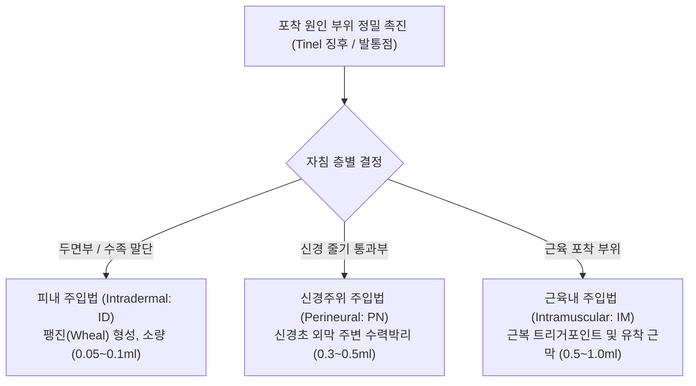

# 00. 말초신경약침의학 총론 및 MOC (Master Table of Contents)

> **핵심 요약 (Key Summary)**:
> 척수신경에서 기원하여 상·하지 말단으로 주행하는 말초신경의 골섬유터널 및 근막 포착(Entrapment) 기전을 규명하고 약침치료를 체계화한 한의 임상 지침서입니다.
> [[오공약침]](Scolopendra), [[봉약침]](Sweet BV), [[자하거약침]]의 항염증·신경보호·신경재생 기전을 바탕으로 피내·피하·근육내·신경주위 정밀 자입술을 제공합니다.
> 두경부, 상지, 하지의 대표적 포착신경병증과 연관 근육군([[후두하근]], [[사각근]], [[소흉근]], [[이상근]] 등)의 포착 해소 및 임상 알고리즘을 총괄합니다.

---

## 📌 목차 (Table of Contents)
1. [말초신경약침의학 개요 및 포착신경병증의 병태생리](#1-말초신경약침의학-개요-및-포착신경병증의-병태생리)
2. [말초신경 해부학 및 4대 신경총 구조](#2-말초신경-해부학-및-4대-신경총-구조)
3. [포착신경병증의 3단계 진단 및 임상 증상](#3-포착신경병증의-3단계-진단-및-임상-증상)
4. [말초신경 약침 제제별 약리 기전 및 선택 기준](#4-말초신경-약침-제제별-약리-기전-및-선택-기준)
5. [약침 주입 기법 (Injection Techniques) 및 안전 수칙](#5-약침-주입-기법-injection-techniques-및-안전-수칙)
6. [전신 포착신경병증 및 챕터별 네비게이션](#6-전신-포착신경병증-및-챕터별-네비게이션)
7. [출처 및 참고 문헌 (References)](#7-출처-및-참고-문헌-references)

---

## 1. 말초신경약침의학 개요 및 포착신경병증의 병태생리

### (1) 포착신경병증(Entrapment Neuropathy)이란?
* **정의**: 척수신경(Spinal nerve)이 추간공을 빠져나와 말초로 주행하는 경로 상에서 **골섬유터널(Osteofibrous tunnel)**, **근막 건궁(Tendinous arch)**, **근육 간 틈새(Intermuscular space)**를 통과할 때 기계적 압박이나 마찰에 의해 국소 허혈과 신경 기능 부전이 발생하는 질환군입니다.
* **병태생리 3단계 진행 과정**:
  1. **국소 허혈 (Localized Ischemia)**: 신경초(Perineurium) 내부의 모세혈관 순환 장애 및 정맥 울혈 발생.
  2. **신경내막 부종 (Endoneurial Edema)**: 모세혈관 투과성 증가로 신경 다발 내 부종 형성, 축삭 수송(Axoplasmic flow) 차단.
  3. **탈수초화 및 축삭 변성 (Demyelination & Axonal Degeneration)**: 만성 압박 지속 시 미엘린 수초 파괴 $\rightarrow$ 축삭 위축 및 지배 근육의 탈신경 위축(Denervation atrophy) 초래.


---

## 2. 말초신경 해부학 및 4대 신경총 구조

말초신경은 척수에서 분지된 전지(Ventral rami)들이 복잡하게 재배열되는 **4대 신경총(Nerve Plexuses)**을 통해 사지로 뻗어나갑니다.

![[PNP_Fig_1_CervicalPlexus.png|260]]
![[PNP_Fig_2_BrachialPlexus.png|260]]
> **그림 1**: 경신경총 (C1-C4)
> **그림 2**: 상완신경총 (C5-T1)

![[PNP_Fig_4_LumbarPlexus.png|260]]
![[PNP_Fig_5_SacralPlexus.png|260]]
> **그림 3**: 요신경총 (L1-L4)
> **그림 4**: 천신경총 (L4-S4)

### 4대 신경총 정밀 매트릭스
| 신경총 | 기원 척수 분절 | 주요 말초신경 분지 | 대표적 호발 포착 질환 및 연관 근육 |
| :--- | :--- | :--- | :--- |
| **경신경총<br>(Cervical Plexus)** | C1 ~ C4 | • 소후두신경, 대이개신경<br>• 경횡신경, 쇄골상신경, 횡격신경 | • [[후두하근]] 포착 (후두신경통)<br>• [[흉쇄유돌근]] 후연 신경 포착 |
| **상완신경총<br>(Brachial Plexus)** | C5 ~ T1 | • [[근피신경]], [[액와신경]], [[요골신경]]<br>• [[정중신경]], [[척골신경]], 견갑상신경 | • [[흉곽출구 증후군|흉곽출구증후군]](TOS: [[사각근]], [[소흉근]])<br>• 사각공간증후군(QSS: [[소원근]], [[상완삼두근]])<br>• 수근관증후군, 요골관증후군, 주관증후군 |
| **요신경총<br>(Lumbar Plexus)** | L1 ~ L4 | • 장골하복/장골서혜신경, 음부대퇴신경<br>• 외측대퇴피신경, [[대퇴신경]], [[폐쇄신경]] | • 지각이상성 대퇴신경통(Meralgia: 서혜인대)<br>• [[장요근]]·[[치골근]] 하부 대퇴신경 압박 |
| **천신경총<br>(Sacral Plexus)** | L4 ~ S4 | • [[좌골신경]]([[경골신경]], [[총비골신경]])<br>• 후대퇴피신경, 음부신경 | • [[이상근 증후군|이상근증후군]] (좌골신경 포착)<br>• 비골경부 포착, [[발목터널증후군]](TTS) |

---

## 3. 포착신경병증의 3단계 진단 및 임상 증상

![[PNP_Fig_6_Dermatome.png|480]]

> [그림 5. 전신 피부분절(Dermatome) 및 주요 말초신경 피부 지배 영역].

* **임상 3단계 증상 발현**:
  1. **초기 (자극기)**: 이상감각(Paresthesia), 저림, 작열통(Burning pain), Tinel 징후 양성.
  2. **중기 (차단기)**: 감각 둔마(Numbness), 촉각 저하, 야간통(Nocturnal pain).
  3. **말기 (탈신경 마비기)**: 운동 약화(Motor weakness), 근위축(Muscle wasting), 건반사 소실.
* **이완 현상 (Release Phenomenon)**:
  * 장시간 압박되어 있던 신경의 포착이 풀리는 순간 일시적으로 저림과 화끈거림이 강하게 느껴지는 반응으로, 예후 판정에 중요하게 활용됩니다.

---

## 4. 말초신경 약침 제제별 약리 기전 및 선택 기준

포착신경병증의 치료는 **① 신경 염증 및 부종 제거**, **② 근육 경결 및 근막 유착 해소**, **③ 손상된 신경 축삭 재생**의 3단계로 구성됩니다.

| 약침 제제 | 핵심 지표 성분 및 특성 | 분자약리 기전 | 임상 주치 병증 및 적응증 |
| :--- | :--- | :--- | :--- |
| [[오공약침]]<br>(Scolopendra) | Scolopendrid toxin, 히스타민양 물질 | • 강력한 진통·소염·항경련 작용<br>• 국소 미세혈관 확장 및 신경초 허혈 개선<br>• 신경병증성 난치성 통증 억제 | • 모든 급·만성 포착신경병증의 제1선 치료<br>• 수근관증후군, 흉곽출구증후군, 이상근증후군<br>• 저림, 작열통, 이상감각 극심 시 |
| [[봉약침]]<br>(Sweet BV / BV) | Melittin, Apamin, MCD-peptide | • PLA2 억제 및 NF-kB 경로 차단 $\rightarrow$ 항염증<br>• 아돌라핀에 의한 중추성 진통 작용<br>• 유착된 골섬유 터널 주변 섬유화 억제 | • 만성 신경 주위 인대·건막 비후<br>• 척추 신경근병증 및 관절낭염 복합 증례 |
| [[자하거약침]]<br>(Hominis Placenta) | EGF, FGF, 각종 아미노산 및 펩타이드 | • 신경성장인자(NGF) 활성화 $\rightarrow$ 축삭 재생<br>• 탈신경 근위축 방지 및 영양 공급 | • 3개월 이상 경과된 만성 신경 손상<br>• 근위축 및 감각 마비가 동반된 만성 포착 |
| **OB 약침<br>(오공+봉약침 Mix)** | 오공약침 + 봉약침 1:1 혼합 | • 오공의 신경 진통 + 봉약침의 강력 소염 복합 효과 | • 난치성 복합 포착신경병증 |

---

## 5. 약침 주입 기법 (Injection Techniques) 및 안전 수칙



### 주입 깊이 및 용량 기준
1. **피내 주입 (ID)**: 30G 니들, 피부와 10~15° 각도로 피구(Wheal)를 띄우며 주입 (풍지, 완골, 수족지 말단).
2. **근육내 주입 (IM)**: 26~30G 니들, 사각근, 소흉근, 이상근 등의 근결 및 트리거포인트에 직자.
3. **신경주위 수력박리 (Hydrodissection)**: 신경 본체를 절대 직접 찌르지 않고, 신경 외막 주변 결합조직 틈새로 약액을 주입하여 기계적 압박 공간을 확장.

---

## 6. 전신 포착신경병증 및 챕터별 네비게이션

```text
c:\Simbio\1. 근골격계 공부\말초신경약침의학\
├── 00_말초신경약침의학_MOC.md (현재 문서: 총론, 약리, 주입 기법)
├── 1_두경부_견배부_신경포착_약침.md (대·소후두신경, 흉곽출구, 사각공간, 견갑상신경)
├── 2_상지_원위부_신경포착_약침.md (요골관, 원회내근, 수근관, 주관증후군)
├── 3_골반_둔부_신경포착_약침.md (이상근/좌골신경, 외측대퇴피신경, 대퇴·폐쇄신경)
├── 4_하지_원위부_족부_신경포착_약침.md (총비골신경, 비복신경, 발목터널, 몰튼신경종)
└── 5_임상_약침_처방_총괄_알고리즘.md (증상별 약침 배합 및 임상 진료 지침)
```

---

## 7. 출처 및 참고 문헌 (References)
* 대한약침학회 학술위원회. 『말초신경약침의학 (단발신경병증과 신경포착증후군)』. 가온해미디어, 2017.
  * `[연구 요약]`: 척수신경 및 4대 신경총의 해부학적 주행과 호발 포착 부위별 오공·봉약침의 약리 기전 및 정밀 자침 가이드라인 제시.

---
*(이 문서는 Simbio 볼트 표준 지침 v3.0 및 book-digitization 스킬에 따라 교과서 원문의 세부 메커니즘을 100% 보존하여 작성되었습니다.)*
