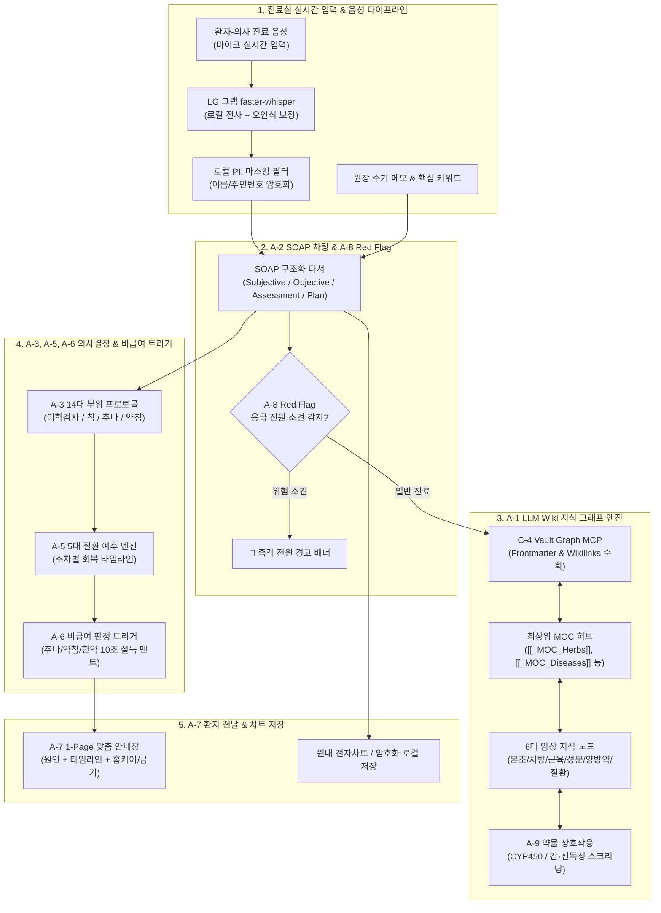
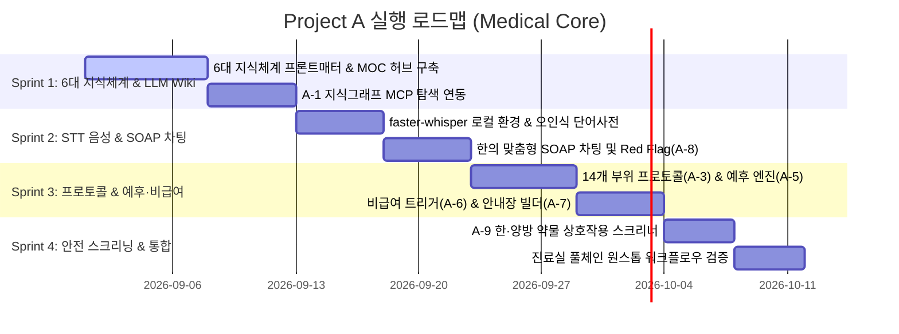

---
title: "Project A. 임상 AI & 진료실 OS 마스터 로드맵"
category: "Project A (Medical Core)"
status: "진행중"
priority: "High"
created: 2026-08-30
updated: 2026-08-31
tags:
  - ai-project
  - roadmap
  - medical-ai
  - status/in-progress
---

# [[Project A 마스터 로드맵 (Medical Core)]]

> 개요: Vector RAG를 배제하고 마크다운 Frontmatter, [[Wikilinks]], MOC를 LLM이 직접 순회하는 **LLM Wiki 지식 그래프 탐색 엔진**을 핵심으로, 음성 실시간 SOAP 차팅(A-2), 임상 프로토콜(A-3), 5대 질환 예후 타임라인(A-5), 비급여 트리거(A-6), 1-Page 환자 안내장(A-7), Red Flag 경고(A-8), 한·양방 병용 안전 스크리닝(A-9)을 유기적으로 결합한 원스톱 진료실 OS 종합 실행 로드맵.

---

## 🧭 1. 시스템 통합 아키텍처 및 LLM Wiki 지식 그래프 네트워크

---

## 📚 2. A-1 6대 임상 지식 체계 및 LLM Wiki 템플릿 연동

| 번호 | 지식 영역 | 핵심 수록 내용 | 상위 MOC | 표준 템플릿 |
| :---: | :--- | :--- | :--- | :--- |
| **1** | [[본초]] | 지표성분 구조식, 분자약리, 지근/속근 대사, 사상체질, 상한론 약징, 논문 근거 | [[_MOC_Herbs]] | [[본초(약리) 템플릿]] |
| **2** | [[처방]] | 군신좌사 배오, 현대 분자약리, 주치병증(Sweet Spot vs 금기), 유사처방 감별, 가감례 | [[_MOC_Formulas]] | [[처방 템플릿]] |
| **3** | [[근육]] | 기시/정지/작용/신경, 생체역학, TP 연관통, 초음파(Sonoanatomy), 추나(MET) | [[_MOC_Muscles]] | [[근골격계(해부·질환) 템플릿]] |
| **4** | [[약리성분]] | PubChem CID, 수용체/효소 표적 기전(MoA), CYP 대사, 신호전달 경로 | [[_MOC_Compounds]] | [[양방의약품(약리·성분) 템플릿]] |
| **5** | [[양방약]] | PK/CYP 대사, 적응증, 블랙박스 경고/부작용, 한·양방 약물 상호작용/병용 금기 | [[_MOC_WesternDrugs]] | [[양방의약품(약리·성분) 템플릿]] |
| **6** | [[질환]] | 14개 부위별 근골격계/내과 질환 병태생리, 이학적 검사, 한양방 통합 치료 가이드 | [[_MOC_Diseases]] | [[근골격계(해부·질환) 템플릿]] |

---

## 🗂️ 3. 서브 프로젝트 구성 및 역할 분담

| 식별자 | 프로젝트명 | 핵심 목표 | 산출물 | 상태 |
| :--- | :--- | :--- | :--- | :--- |
| [[A-1_Clinical_Knowledge_DB]] | 6대 임상 지식 고도화 & MOC 지식그래프 | 6대 지식 체계 표준화, MOC 허브 구축, YAML Frontmatter 정형화 | 6대 지식셋, MOC, 파서 | `진행중` |
| [[A-2_Clinic_Workflow_Automation]] | 진료실 워크플로우 자동화 | faster-whisper 음성 전사 + 2단계 오인식 보정 + SOAP 차팅 | Whisper STT 파이프라인, SOAP 파서 | `진행전` |
| [[A-3_Clinic_Protocol_Engine]] | 진료 프로토콜 엔진 | 14개 부위별 이학적 검사 & 침/약침/추나 표준 치료 세트 | 부위별 프로토콜 가이드 | `진행전` |
| [[A-5_Clinical_Prognosis_Timeline_Engine]] | 5대 질환 예후 예측 엔진 | 질환군별 골든타임 치료 곡선 및 주차별 예후 로드맵 생성 | 예후 타임라인 엔진 | `진행전` |
| [[A-6_Treatment_Trigger_Engine]] | 비급여 치료 판정 트리거 | 비급여(추나/약침/맞춤한약) 적응증 판정 및 10초 설득 멘트 | 비급여 트리거 & 스크립트 | `진행전` |
| [[A-7_Patient_Handout_Builder]] | 1-Page 맞춤 환자 안내장 | 진료 직후 환자 전달용 맞춤 안내장 (원인/예후/홈케어/금기) | 안내장 렌더러 (MD/HTML) | `진행전` |
| [[A-8_Clinical_RedFlag_Alert]] | 응급 전원 소견 경고 시스템 | SOAP 차팅 중 마미증후군/골절/뇌졸중 등 Red Flag 실시간 감지 | Red Flag 감지 엔진 & 배너 | `진행전` |
| [[A-9_Prescription_Safety_Interaction_Engine]] | 한·양방 병용 안전 스크리닝 | 복용 양약과 한약/약침 간 상호작용 및 간·신독성 안전성 점검 | 약물 상호작용 스크리너 | `진행전` |

---

## 📅 4. 단계별 마일스톤 및 세부 실행 일정 (Sprint 1 ~ 4)

---

## 📊 5. 진행 로그 및 백링크

* **마스터 대시보드**: [[00_Master_Dashboard]]
* **스프린트 진행 일지**: [[2026-W35_Project_A_Sprint]]
* **참조 문서**: [[Simbio_임상지식_고도화_마스터플랜]]
