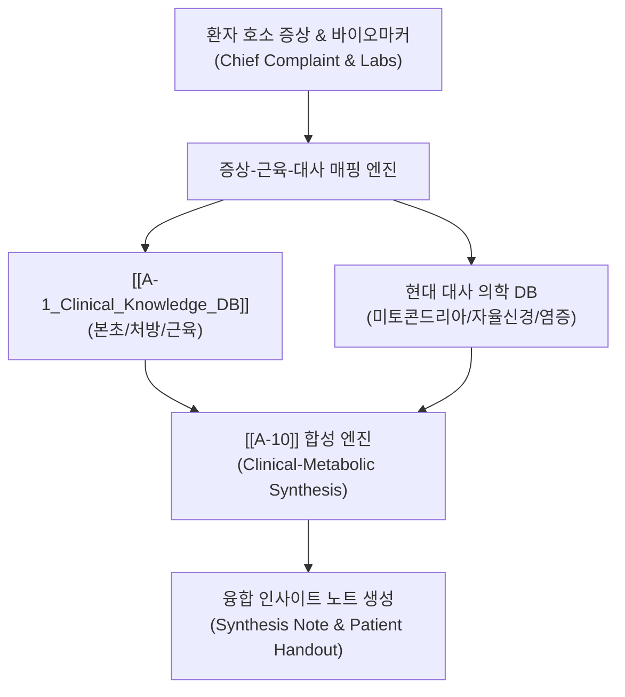

# [[A-10_Clinical_Metabolic_Synthesis_Engine]]

> 개요: 6대 임상 지식(본초, 처방, 근육, 약리성분, 양방약, 질환)과 현대 의학적 대사성 질환(인슐린 저항성, 만성 염증, 자율신경실조증 등) 간의 분자적·생체역학적 상관관계를 교차 분석하고, 전통 한의학적 처방과 현대 생화학적 지견을 하나로 융합하는 **고차원 합성 노트(Synthesis Note) 자동 생성 엔진**.

---

## 🎯 1. 프로젝트 핵심 목표
* **최종 결과물**:
  1. 한의학적 병기(증상/맥진)와 현대 대사 바이오마커(혈당, 귝산, 코르티솔 등)의 다차원 매핑 테이블
  2. 본초/처방의 약리 성분이 미토콘드리아 기능 및 인슐린 수용체에 미치는 영향을 분석하는 융합 합성 노트 템플릿
  3. 환자 호소 증상 및 부위에 따른 다면적 프로토콜 자동 도출 파이프라인
* **주요 성공 기준 (KPI)**:
  - [ ] 주요 한방 처방 30선에 대한 현대 대사약리학적 작용기전 합성 노트 구축 완료
  - [ ] 환자 호소 증상(Chief Complaint) 입력 시 근육-경락-대사 프로토콜을 10초 내에 매핑하는 알고리즘 검증
  - [ ] [[_MOC_Synthesis]] 최상위 융합 허브 노트 신설 및 LLM Wiki 지식 그래프 연동

---

## 🏗️ 2. 핵심 아키텍처 및 연동 흐름

